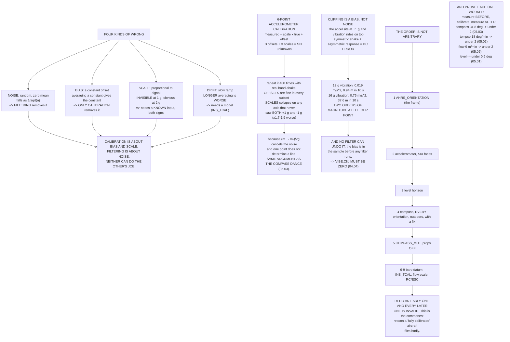

# 05.06 Noise, bias, drift — and the calibration procedures that fix them

<!-- glance:start -->
<!-- generated by tools/build.py from curriculum/syllabus.yaml — edit the syllabus, not this block -->

| | |
|---|---|
| **Track** | Main path |
| **Difficulty** | Intermediate |
| **Time** | 1 h 30 min |
| **Hardware** | First flight (Hermon core) (stage 1) |
| **Software** | python, ardupilot |
| **Prerequisites** | [05.05 Optical flow and rangefinders](05.05-flow-and-rangefinders.md)<br>[04.04 Mounting, vibration isolation and the payload bay](../04-frame-and-assembly/04.04-mounting-and-vibration.md) |
| **Skip if** | You can run accelerometer, compass and level calibrations on Hermon and prove from the log that each one improved something measurable. |

<!-- glance:end -->

## What you will learn

- The four kinds of sensor error — **noise, bias, scale and drift** — and which one averaging
  removes (exactly one)
- Why **filtering and calibration are different problems** and neither can do the other's job
- Why the accelerometer calibration needs **six faces**, demonstrated rather than asserted
- Why accelerometer **clipping is a bias**, not just noise, and why a filter can never undo it
- Every calibration on Hermon: what it estimates, how many unknowns, what data it needs
- **The order they must be done in**, and why redoing an early one invalidates every later one
- How to **prove each calibration worked**, with the number it should move and by how much

## Why it matters

Five lessons of this module have each ended with a calibration you were told to run. This lesson
is where they become one procedure with one logic behind it.

The logic is simple and it is not the one most people carry around. **Calibration does not reduce
noise.** Noise is free to remove — average it and it falls as $1/\sqrt N$. What calibration
removes is **bias** and **scale**, and those do not average away at all: averaging a constant
gives you the constant, and a scale error is proportional to the signal, so it is invisible at
1 g and obvious at 2 g.

Everything expensive in this module has been a bias or a scale error. The 1° level error that is
8.6 m of drift ([05.01](05.01-sensor-roles.md)). The 18° per minute of warm-up drift
([05.02](05.02-imu.md)). The 31.8° of hard-iron heading error ([05.03](05.03-compass-and-baro.md)).
The 9 m per minute of flow height-scale error ([05.05](05.05-flow-and-rangefinders.md)). None of
them is noise. All of them are removed by calibration, and none of them by filtering.

## Prerequisites

<!-- prereqs:start -->
## Prerequisites

You need these first:

- [05.05 Optical flow and rangefinders](05.05-flow-and-rangefinders.md)
- [04.04 Mounting, vibration isolation and the payload bay](../04-frame-and-assembly/04.04-mounting-and-vibration.md)

### Optional prerequisite links

None.

Check your readiness: `python course.py why 05.06`
<!-- prereqs:end -->

## Concept

### Four kinds of wrong, and only one averages away

Take the same sensor reading the same 1 g and give it each error in turn. What is left after
averaging $n$ samples?

| n | Noise | Bias | Scale | Drift |
|---:|---:|---:|---:|---:|
| 1 | 0.16495 | 0.05000 | 0.04905 | 0.00000 |
| 10 | 0.02526 | 0.05000 | 0.04905 | 0.00004 |
| 100 | **0.00011** | 0.05000 | 0.04905 | 0.00040 |
| 1,000 | 0.00221 | **0.05000** | **0.04905** | 0.00400 |
| 10,000 | 0.00092 | **0.05000** | **0.04905** | **0.04000** |

- **Noise** falls as $1/\sqrt N$. It is essentially free to remove; that is what filters do.
- **Bias** does not move at all. Averaging a constant gives you the constant.
- **Scale** does not move either. It is proportional to the signal, so it hides completely at 1 g
  and appears at 2 g — which is why you cannot find it by sitting still.
- **Drift** gets **worse** with longer averages, because a longer window spans more of the ramp.
  That is [05.02](05.02-imu.md)'s Allan minimum seen from the other side.

> [!IMPORTANT]
> **Calibration is about bias and scale. Filtering is about noise. They are different problems
> and neither can do the other's job.** Lowering `INS_GYRO_FILTER` will never remove a level
> error, and no amount of calibration will make a noisy accelerometer quiet.

### Why the accelerometer calibration needs six faces

The model is one line per axis: $\text{measured} = \text{scale}\times\text{true} + \text{offset}$.
Three offsets and three scales — **six unknowns**.

You can hold an aircraft still to about 0.05 m/s². So run the whole calibration four hundred
times with that much hand shake and look at the **scatter** in the recovered parameters:

**All six faces**

| Axis | Scale | ± sd | Offset | ± sd | |
|---|---:|---:|---:|---:|---|
| x | 1.01193 | 0.00363 | 0.3000 | 0.0207 | baseline |
| y | 0.99362 | 0.00337 | −0.1808 | 0.0191 | baseline |
| z | 1.00687 | 0.00339 | 0.4395 | 0.0193 | baseline |

**Five faces (no "inverted")**

| Axis | Scale | ± sd | Offset | ± sd | |
|---|---:|---:|---:|---:|---|
| x | 1.01232 | 0.00362 | 0.2998 | 0.0222 | baseline |
| y | 0.99409 | 0.00361 | −0.1814 | 0.0221 | ×1.1 worse |
| **z** | 1.00647 | **0.00564** | 0.4407 | 0.0253 | **×1.7 worse** |

**Four faces (no "inverted", no "right side")**

| Axis | Scale | ± sd | Offset | ± sd | |
|---|---:|---:|---:|---:|---|
| x | 1.01191 | 0.00357 | 0.2999 | 0.0262 | baseline |
| **y** | 0.99374 | **0.00578** | −0.1793 | 0.0298 | **×1.7 worse** |
| **z** | 1.00676 | **0.00607** | 0.4389 | 0.0296 | **×1.8 worse** |

**Level + nose down + left side only** — every axis is ×1.7 to ×1.9 worse.

Look at *which* parameter collapses. Every subset recovers the **offsets** perfectly well, because
there are plenty of faces on which a given axis reads zero. What degrades is the **scale**, and it
degrades on exactly the axes that never saw both **+1 g and −1 g**.

The reason is arithmetic. With measurements at $+g$ and $-g$:

$$m_+ = sg + o, \qquad m_- = -sg + o
\qquad\Longrightarrow\qquad s = \frac{m_+ - m_-}{2g}, \quad o = \frac{m_+ + m_-}{2}$$

The **difference** gives the scale and the noise partially cancels. With one direction only, the
scale rests on a single noisy sample and is correlated with the offset.

> [!IMPORTANT]
> **That is why there are six positions, and why the procedure refuses to finish without them.**
> It is exactly the same conditioning argument as the compass dance in
> [05.03](05.03-compass-and-baro.md): the solver will happily return a number for a parameter the
> data does not determine.

### Why clipping is a bias, not just noise

The accelerometer sits at **+1 g** in a hover and vibration rides on top of it. The part is
slightly nonlinear — say 0.2 % at full scale — and it hard-limits at ±16 g.

A **symmetric** shake passed through an **asymmetric** response leaves a **DC error** behind.
Engineers call it rectification; it is the same effect that makes a diode a radio detector.

| Vibration | Clips? | DC error | As m/s² | Position error in 10 s |
|---:|---:|---:|---:|---:|
| 0.5 g | no | 0.00014 g | 0.0014 | 0.07 m |
| 1 g | no | 0.00019 g | 0.0018 | 0.09 m |
| 2 g | no | 0.00033 g | 0.0033 | 0.16 m |
| 4 g | no | 0.00064 g | 0.0063 | 0.32 m |
| 8 g | no | 0.00128 g | 0.0125 | 0.63 m |
| 12 g | no | 0.00191 g | 0.0188 | 0.94 m |
| 15 g | no | 0.00195 g | 0.0191 | 0.95 m |
| **16 g** | **YES** | **−0.07667 g** | **−0.7522** | **37.61 m** |
| 20 g | YES | −0.40910 g | −4.0133 | 200.66 m |

Below the clip point the nonlinearity alone leaves a small but real bias that grows roughly in
proportion to the shaking. **The moment you clip, it jumps by two orders of magnitude** — and it
goes straight into velocity and position as a $t^2$ term
([05.01](05.01-sensor-roles.md)): **thirty-eight metres in ten seconds.**

> [!IMPORTANT]
> **A filter cannot help, because the bias is already in the sample before any filter sees it.**
> This is why `VIBE.Clip0/1/2` must be **zero** and not merely small, and it is where
> [04.04](../04-frame-and-assembly/04.04-mounting-and-vibration.md)'s whole argument arrives: the
> one job a physical mount does that software cannot is keeping the raw signal inside the sensor's
> range.

### The calibrations, and the order they must be done in

| # | Calibration | Unknowns | What it estimates |
|---:|---|---:|---|
| 1 | `AHRS_ORIENTATION` | 1 | the board's mounting rotation |
| 2 | Accelerometer (6-point) | 6 | 3 offsets + 3 scale factors |
| 3 | Level horizon | 2 | the residual mounting tilt |
| 4 | Compass (ellipsoid) | 9 | 3 hard-iron + 6 soft-iron terms |
| 5 | `COMPASS_MOT` | 3 | field per amp, 3 axes |
| 6 | Barometer ground pressure | 1 | the datum |
| 7 | `INS_TCAL` (temperature) | 6 | bias vs temperature, per axis |
| 8 | Flow scale | 2 | 2 scale factors |
| 9 | RC / ESC endpoints | 12 | min, max, trim per channel |

**The order is not arbitrary.** Each one assumes the ones above it are already correct:

| Dependency | Why |
|---|---|
| Orientation **before** accelerometer | the fit is performed in the corrected frame |
| Accelerometer **before** level | level trims what the 6-point fit could not remove |
| Level **before** compass | the magnetometer is tilt-compensated from roll and pitch ([05.03](05.03-compass-and-baro.md)) |
| Compass **before** `COMPASS_MOT` | MOT learns the residual, so there must be a residual to learn |
| Everything **before** the flow scale | flow subtracts the gyro and is scaled by the rangefinder ([05.05](05.05-flow-and-rangefinders.md)) |

Redo an early one and every later one is invalid. **This is the commonest reason a "fully
calibrated" aircraft flies badly** — somebody remounted the flight controller, redid the
accelerometer calibration, and left a compass calibration that was fitted in the old frame.

### Prove each one worked

A calibration whose effect you cannot measure is a ritual. Measure **before**, calibrate, measure
**after**, and write down both numbers.

| Calibration | The measurable | Expect |
|---|---|---|
| `AHRS_ORIENTATION` | roll/pitch respond to the right stick | right, or obviously wrong |
| Accelerometer (6-point) | the level error, on a flat surface | < 0.5° of level error |
| Level horizon | Loiter drift rate, m/s | < 0.2 m/s of drift |
| Compass (ellipsoid) | heading error around a level 360° turn | 31.8° → under 2° ([05.03](05.03-compass-and-baro.md)) |
| `COMPASS_MOT` | heading change, hover to full throttle | < 5° ([05.03](05.03-compass-and-baro.md)) |
| Barometer ground pressure | reported altitude at takeoff | 0.0 m |
| `INS_TCAL` | attitude drift in the first minute | 18°/min → under 2 ([05.02](05.02-imu.md)) |
| Flow scale | position drift over a timed leg | 9 m/min → under 2 ([05.05](05.05-flow-and-rangefinders.md)) |
| RC / ESC endpoints | `MOT_THST_HOVER`, stick centring | hover throttle near 0.48 |

Those "expect" figures are this module's own numbers, end to end. **A calibration is finished when
the number it was supposed to move has moved, and you have written down by how much.**

> [!TIP]
> **Ask your teacher:** "I recalibrated my accelerometer because the horizon looked two degrees
> off, and now my compass is worse than it was and my Loiter has developed a slow circle. Walk me
> through the dependency chain that would produce exactly that, and the order in which I should
> redo things."

## Technical explanation

### Level 1 — Intuition: a bathroom scale

A bathroom scale can be wrong in four ways. It can jitter between 70.1 and 70.3 (noise — stand
still and read the average). It can read 2 kg heavy no matter what (bias — a constant offset, and
averaging will not find it). It can read 2 % heavy, so 1 kg looks like 1.02 and 100 kg looks like
102 (scale — invisible at zero, obvious at the top). And it can slowly go wrong as the room warms
up (drift — and averaging for longer makes it worse, not better).

Zeroing the scale with nothing on it fixes the bias. Only a known weight fixes the scale. Nothing
fixes the drift except measuring how it varies with temperature — which is what `INS_TCAL` is.

### Level 2 — Practical: the calibration session

Set aside an hour. Do it **once**, properly, with the aircraft in its final flight configuration.

1. **Complete the build first.** Anything you add afterwards — a payload, a light, a different
   battery strap — potentially invalidates the compass calibration.
2. Set `AHRS_ORIENTATION`.
3. Accelerometer calibration, **six faces**, each held still on a genuinely flat surface. Not a
   desk that rocks.
4. Level calibration, on the flattest thing you own, aircraft in its flight attitude.
5. Compass calibration, **outdoors, with a 3D fix**, through every orientation.
6. `COMPASS_MOT`, **propellers off**, aircraft restrained, throttle swept.
7. RC calibration, then ESC calibration if your ESCs need it
   ([02.10](../02-motors-escs-props/02.10-esc-tuning.md)).
8. `INS_TCAL` over a cold-to-warm soak.
9. Flow scale, in flight, if you have flow.
10. **Record every result in `docs/calibration.md`** with the date and the aircraft
    configuration.

### Level 3 — Mathematics

**Why noise averages and bias does not.** For $n$ independent samples with per-sample variance
$\sigma^2$, the variance of the mean is $\sigma^2/n$, so the standard deviation falls as
$1/\sqrt n$. A deterministic offset $b$ contributes $b$ to every sample, so the mean of
$x_i = \mu + b$ is $\mu + b$ regardless of $n$. This is not a subtlety — it is the definition of
the two words.

**The two-point scale solution.** With $m_\pm = \pm sg + o + \varepsilon_\pm$:

$$\hat s = \frac{m_+ - m_-}{2g} = s + \frac{\varepsilon_+ - \varepsilon_-}{2g},
\qquad \operatorname{var}(\hat s) = \frac{\sigma_\varepsilon^2}{2g^2}$$

With only $+g$ and a zero-g face, the estimator becomes $\hat s = (m_+ - m_0)/g$, whose variance
is $2\sigma_\varepsilon^2/g^2$ — **four times larger**, i.e. twice the standard deviation. That is
the ×1.7–1.9 in the tables, diluted by the other faces that do constrain the axis.

**Rectification.** For a sensor response $y = f(x)$ and an input $x = x_0 + A\sin\omega t$, the
mean output is

$$\langle y\rangle = \frac{1}{2\pi}\int_0^{2\pi} f(x_0 + A\sin\theta)\,d\theta$$

If $f$ is linear this equals $f(x_0)$ and the vibration contributes nothing. Any even-order
nonlinearity — including the hard, asymmetric nonlinearity of clipping about an offset $x_0$ —
makes $\langle y\rangle \neq f(x_0)$, and the difference is a **DC error**. Expanding for a small
quadratic term $f(x) = x + kx^2$ gives $\langle y\rangle - x_0 = kA^2/2$: the classic
"vibration rectification" result, quadratic in amplitude.

### Level 4 — Implementation: the before-and-after protocol

For every calibration in the table:

1. **Measure the target quantity first** and write it down, even though you know it will be bad.
2. Run the calibration.
3. **Measure again, the same way**, and write down the new value.
4. Compute the improvement and compare it with the "expect" column.
5. If the number did not move, the calibration did not work — do not proceed to the next one.

This takes twice as long the first time and approximately no extra time afterwards, because you
already know how to make each measurement. What it buys is the ability to say *which* calibration
is stale when something goes wrong six months later.

## Diagram



## Code

Save as `calibration.py` and run `python calibration.py`. Standard library only.

```python
"""05.06 - noise, bias, drift, scale: which average away, and what fixes the rest."""
import math
import random

G = 9.81
N_AVG = [1, 10, 100, 1000, 10000]
FS = 100.0

# the four error types, in accelerometer units (m/s^2) at a 1 g reading
NOISE_SD = 0.070          # m/s^2, per sample
BIAS = 0.050              # m/s^2, constant
SCALE = 0.005             # 0.5 %, multiplies the signal
DRIFT_PER_S = 0.0008      # m/s^2 per second, a slow thermal ramp

# accelerometer calibration
TRUE_OFF = (0.30, -0.18, 0.44)      # m/s^2
TRUE_SCL = (1.012, 0.994, 1.007)
CAL_NOISE = 0.05          # m/s^2, how still you can actually hold it
TRIALS = 400

CLIP_G = 16.0             # the IMU's full scale
NONLIN = 0.002            # 0.2 % second-order nonlinearity at full scale
VIBES_G = [0.5, 1, 2, 4, 8, 12, 15, 16, 20]

# name, what it estimates, unknowns, what it needs, how you prove it worked
CALS = [
    ("AHRS_ORIENTATION", "the board's mounting rotation", 1,
     "knowing which way the arrow points",
     "roll/pitch respond to the right stick"),
    ("Accelerometer (6-point)", "3 offsets + 3 scale factors", 6,
     "six faces, each held still",
     "the level error, on a flat surface"),
    ("Level horizon", "the residual mounting tilt", 2,
     "the aircraft level, on a flat surface", "Loiter drift rate, m/s"),
    ("Compass (ellipsoid)", "3 hard-iron + 6 soft-iron terms", 9,
     "every orientation, outdoors, with a fix",
     "heading error around a level 360 turn"),
    ("COMPASS_MOT", "field per amp, 3 axes", 3,
     "a throttle sweep, props OFF",
     "heading change, hover to full throttle"),
    ("Barometer ground pressure", "the datum", 1,
     "sitting still at a known place", "reported altitude at takeoff"),
    ("INS_TCAL (temperature)", "bias vs temperature, per axis", 6,
     "a cold-to-warm soak", "attitude drift in the first minute"),
    ("Flow scale", "2 scale factors", 2,
     "a calibrated flight pattern", "position drift over a timed leg"),
    ("RC / ESC endpoints", "min, max, trim per channel", 12,
     "moving every stick to its stops", "MOT_THST_HOVER, stick centring"),
]

FACES = [("level", (0.0, 0.0, G)), ("inverted", (0.0, 0.0, -G)),
         ("nose down", (-G, 0.0, 0.0)), ("nose up", (G, 0.0, 0.0)),
         ("left side", (0.0, G, 0.0)), ("right side", (0.0, -G, 0.0))]


def averaged(kind, n, seed=20260923):
    """What survives averaging n samples of a signal with one error type."""
    rnd = random.Random(seed + n)
    total = 0.0
    for i in range(n):
        t = i / FS
        if kind == "noise":
            v = G + rnd.gauss(0, NOISE_SD)
        elif kind == "bias":
            v = G + BIAS
        elif kind == "scale":
            v = G * (1 + SCALE)
        else:
            v = G + DRIFT_PER_S * t
        total += v
    return abs(total / n - G)


def solve2(a, b):
    det = a[0][0] * a[1][1] - a[0][1] * a[1][0]
    if abs(det) < 1e-12:
        return None
    return ((b[0] * a[1][1] - a[0][1] * b[1]) / det,
            (a[0][0] * b[1] - b[0] * a[1][0]) / det)


def fit_axis(samples, axis):
    """Least squares: measured = scale * true + offset, for one axis."""
    n = len(samples)
    sx = sum(t[axis] for t, m in samples)
    sy = sum(m[axis] for t, m in samples)
    sxx = sum(t[axis] ** 2 for t, m in samples)
    sxy = sum(t[axis] * m[axis] for t, m in samples)
    return solve2([[sxx, sx], [sx, float(n)]], [sxy, sy])


def trial(faces, rnd):
    samples = []
    for _, true in faces:
        meas = tuple(v * s + o + rnd.gauss(0, CAL_NOISE)
                     for v, s, o in zip(true, TRUE_SCL, TRUE_OFF))
        samples.append((true, meas))
    return samples


def spread_of_fit(faces, seed=20260923):
    """Repeat the calibration many times and report the scatter per axis."""
    rnd = random.Random(seed)
    out = []
    for axis in range(3):
        scales, offs = [], []
        for _ in range(TRIALS):
            r = fit_axis(trial(faces, rnd), axis)
            if r is None:
                scales, offs = None, None
                break
            scales.append(r[0])
            offs.append(r[1])
        if scales is None:
            out.append(None)
            continue
        ms = sum(scales) / len(scales)
        mo = sum(offs) / len(offs)
        ss = math.sqrt(sum((v - ms) ** 2 for v in scales) / len(scales))
        so = math.sqrt(sum((v - mo) ** 2 for v in offs) / len(offs))
        out.append((ms, ss, mo, so))
    return out


def sensor(x_g, clip_g=CLIP_G, k=NONLIN):
    """A real accelerometer: slightly nonlinear, and hard-limited."""
    y = x_g + k / clip_g * x_g * abs(x_g)
    return max(-clip_g, min(clip_g, y))


def rectified_g(vib_g, offset_g=1.0, n=20000):
    """Mean error of a sinusoid riding on gravity, through a real sensor."""
    tot = 0.0
    for i in range(n):
        tot += sensor(offset_g + vib_g * math.sin(2 * math.pi * i / n))
    return tot / n - offset_g


def bar(t):
    print("\n" + "=" * 70)
    print(t)
    print("=" * 70)


if __name__ == "__main__":
    bar("1. FOUR KINDS OF WRONG, AND ONLY ONE AVERAGES AWAY")
    print("  Same sensor, same 1 g reading, four different errors.")
    print("  What is left after averaging n samples?")
    print(f"  {'n':>7s} {'noise':>11s} {'bias':>11s} {'scale':>11s}"
          f" {'drift':>11s}")
    for n in N_AVG:
        print(f"  {n:7d} {averaged('noise', n):9.5f} {averaged('bias', n):9.5f}"
              f" {averaged('scale', n):9.5f} {averaged('drift', n):9.5f}")
    print("  NOISE falls as 1/sqrt(n) and is essentially free to remove.")
    print("  BIAS does not move at all: averaging a constant gives the")
    print("  constant. SCALE does not move either -- it is proportional to")
    print("  the signal, so it hides at 1 g and appears at 2 g.")
    print("  DRIFT gets WORSE, because a longer average spans more of the")
    print("  ramp. (That is 05.02's Allan minimum, from the other side.)")
    print("  => CALIBRATION IS ABOUT BIAS AND SCALE. FILTERING IS ABOUT")
    print("     NOISE. THEY ARE DIFFERENT PROBLEMS AND NEITHER CAN DO THE")
    print("     OTHER'S JOB.")

    bar("2. WHY THE ACCELEROMETER CALIBRATION NEEDS SIX FACES")
    print("  The model is  measured = scale x true + offset, per axis:")
    print("  three offsets and three scales -- SIX unknowns.")
    print(f"  Truth: offsets {TRUE_OFF} m/s^2, scales {TRUE_SCL}")
    print(f"  You can hold the aircraft still to about"
          f" {CAL_NOISE:.2f} m/s^2, so repeat")
    print(f"  the whole calibration {TRIALS} times and look at the SCATTER:")
    subsets = [
        ("all six faces", FACES),
        ("five faces (no 'inverted')",
         [f for f in FACES if f[0] != "inverted"]),
        ("four faces (no 'inverted', no 'right side')",
         [f for f in FACES if f[0] not in ("inverted", "right side")]),
        ("level + nose down + left side only",
         [FACES[0], FACES[2], FACES[4]]),
    ]
    base = spread_of_fit(FACES)
    for label, faces in subsets:
        res = spread_of_fit(faces)
        print(f"\n  {label}  ({len(faces)} positions)")
        print(f"    {'axis':>5s} {'scale':>9s} {'+- sd':>9s}"
              f" {'offset':>9s} {'+- sd':>8s}  verdict")
        for ax, nm in ((0, "x"), (1, "y"), (2, "z")):
            r = res[ax]
            if r is None:
                print(f"    {nm:>5s}   SINGULAR -- this axis never moved")
                continue
            ms, ss, mo, so = r
            worse = ss / base[ax][1]
            tag = "baseline" if worse < 1.05 else f"x{worse:.1f} WORSE"
            print(f"    {nm:>5s} {ms:9.5f} {ss:9.5f} {mo:9.4f} {so:8.4f}"
                  f"  {tag}")
    print("\n  Every subset gets the OFFSETS right -- there are plenty of")
    print("  faces where an axis reads zero. What collapses is the SCALE,")
    print("  and it collapses on exactly the axes that never saw BOTH")
    print("  +1 g and -1 g. With one direction only, the scale rests on a")
    print("  single noisy sample; with two, the difference between them")
    print("  gives 2gS and the noise cancels.")
    print("  THAT is why there are six positions, and why the procedure")
    print("  refuses to finish without them. It is the same conditioning")
    print("  argument as the compass dance in 05.03.")

    bar("3. WHY CLIPPING IS A BIAS, NOT JUST NOISE")
    print("  An accelerometer sits at +1 g in a hover and vibration rides")
    print(f"  on top. The part is {NONLIN * 100:.1f} % nonlinear at full scale"
          f" and hard-limits")
    print(f"  at +-{CLIP_G:.0f} g. A SYMMETRIC shake through an ASYMMETRIC")
    print("  response leaves a DC error behind -- 'rectification'.")
    print(f"  {'vibration':>10s} {'clips?':>7s} {'DC error':>11s}"
          f" {'as m/s^2':>10s} {'pos err in 10 s':>16s}")
    for a in VIBES_G:
        err_g = rectified_g(a)
        clips = "YES" if a + 1.0 > CLIP_G else "no"
        err = err_g * G
        print(f"  {a:8.1f} g {clips:>7s} {err_g:9.5f} g {err:9.4f}"
              f" {0.5 * abs(err) * 100:13.2f} m")
    print("  Below the clip point, nonlinearity alone leaves a small but")
    print("  REAL bias, growing roughly in proportion to the shaking. The")
    print("  moment you clip, it jumps by TWO ORDERS OF MAGNITUDE.")
    print("  And it goes straight into velocity and position as a t^2 term")
    print("  (05.01) -- 37 metres in ten seconds, at the clip point.")
    print("  A FILTER CANNOT HELP: the bias is in the sample before any")
    print("  filter sees it. This is why VIBE.Clip0/1/2 must be ZERO, and")
    print("  it is the whole argument of 04.04 arriving at its destination.")

    bar("4. THE CALIBRATIONS, AND THE ORDER THEY MUST BE DONE IN")
    print(f"  {'#':>2s} {'calibration':26s} {'solves':>6s}"
          f" {'what it estimates':34s}")
    for i, (name, what, n, needs, proof) in enumerate(CALS, 1):
        print(f"  {i:2d} {name:26s} {n:6d} {what:34s}")
    print("\n  THE ORDER IS NOT ARBITRARY. Each one assumes the ones above")
    print("  it are already correct:")
    deps = [
        ("orientation before accelerometer",
         "the fit is performed in the CORRECTED frame"),
        ("accelerometer before level",
         "level trims what the 6-point fit could not remove"),
        ("level before compass",
         "the magnetometer is TILT-COMPENSATED from roll and pitch (05.03)"),
        ("compass before COMPASS_MOT",
         "MOT learns the residual, so there must be a residual to learn"),
        ("everything before the flow scale",
         "flow subtracts the gyro and is scaled by the rangefinder (05.05)"),
    ]
    for a, b in deps:
        print(f"    {a:36s} {b}")
    print("  Redo an early one and every later one is invalid. This is the")
    print("  commonest reason a 'fully calibrated' aircraft flies badly.")

    bar("5. PROVE EACH ONE WORKED")
    print("  A calibration whose effect you cannot measure is a ritual.")
    print("  Measure BEFORE, calibrate, measure AFTER, write down both.")
    expects = {
        "AHRS_ORIENTATION": "right, or obviously wrong",
        "Accelerometer (6-point)": "< 0.5 deg of level error",
        "Level horizon": "< 0.2 m/s of Loiter drift",
        "Compass (ellipsoid)": "31.8 deg -> under 2 deg (05.03)",
        "COMPASS_MOT": "< 5 deg, hover to full (05.03)",
        "Barometer ground pressure": "0.0 m at takeoff",
        "INS_TCAL (temperature)": "18 deg/min -> under 2 (05.02)",
        "Flow scale": "9 m/min -> under 2 m/min (05.05)",
        "RC / ESC endpoints": "MOT_THST_HOVER near 0.48",
    }
    print(f"  {'calibration':26s} {'the measurable':34s} expect")
    for name, what, n, needs, proof in CALS:
        print(f"  {name:26s} {proof:34s} {expects[name]}")
    print("\n  Those figures are this module's own numbers, end to end:")
    print("  05.01 gave the level error, 05.02 the temperature drift,")
    print("  05.03 the heading error, 05.05 the flow scale. A calibration")
    print("  is finished when the number it was supposed to move HAS moved")
    print("  and you have written down by how much.")
```

Output:

```text

======================================================================
1. FOUR KINDS OF WRONG, AND ONLY ONE AVERAGES AWAY
======================================================================
  Same sensor, same 1 g reading, four different errors.
  What is left after averaging n samples?
        n       noise        bias       scale       drift
        1   0.16495   0.05000   0.04905   0.00000
       10   0.02526   0.05000   0.04905   0.00004
      100   0.00011   0.05000   0.04905   0.00040
     1000   0.00221   0.05000   0.04905   0.00400
    10000   0.00092   0.05000   0.04905   0.04000
  NOISE falls as 1/sqrt(n) and is essentially free to remove.
  BIAS does not move at all: averaging a constant gives the
  constant. SCALE does not move either -- it is proportional to
  the signal, so it hides at 1 g and appears at 2 g.
  DRIFT gets WORSE, because a longer average spans more of the
  ramp. (That is 05.02's Allan minimum, from the other side.)
  => CALIBRATION IS ABOUT BIAS AND SCALE. FILTERING IS ABOUT
     NOISE. THEY ARE DIFFERENT PROBLEMS AND NEITHER CAN DO THE
     OTHER'S JOB.

======================================================================
2. WHY THE ACCELEROMETER CALIBRATION NEEDS SIX FACES
======================================================================
  The model is  measured = scale x true + offset, per axis:
  three offsets and three scales -- SIX unknowns.
  Truth: offsets (0.3, -0.18, 0.44) m/s^2, scales (1.012, 0.994, 1.007)
  You can hold the aircraft still to about 0.05 m/s^2, so repeat
  the whole calibration 400 times and look at the SCATTER:

  all six faces  (6 positions)
     axis     scale     +- sd    offset    +- sd  verdict
        x   1.01193   0.00363    0.3000   0.0207  baseline
        y   0.99362   0.00337   -0.1808   0.0191  baseline
        z   1.00687   0.00339    0.4395   0.0193  baseline

  five faces (no 'inverted')  (5 positions)
     axis     scale     +- sd    offset    +- sd  verdict
        x   1.01232   0.00362    0.2998   0.0222  baseline
        y   0.99409   0.00361   -0.1814   0.0221  x1.1 WORSE
        z   1.00647   0.00564    0.4407   0.0253  x1.7 WORSE

  four faces (no 'inverted', no 'right side')  (4 positions)
     axis     scale     +- sd    offset    +- sd  verdict
        x   1.01191   0.00357    0.2999   0.0262  baseline
        y   0.99374   0.00578   -0.1793   0.0298  x1.7 WORSE
        z   1.00676   0.00607    0.4389   0.0296  x1.8 WORSE

  level + nose down + left side only  (3 positions)
     axis     scale     +- sd    offset    +- sd  verdict
        x   1.01198   0.00599    0.2997   0.0372  x1.7 WORSE
        y   0.99358   0.00639   -0.1785   0.0356  x1.9 WORSE
        z   1.00703   0.00597    0.4403   0.0320  x1.8 WORSE

  Every subset gets the OFFSETS right -- there are plenty of
  faces where an axis reads zero. What collapses is the SCALE,
  and it collapses on exactly the axes that never saw BOTH
  +1 g and -1 g. With one direction only, the scale rests on a
  single noisy sample; with two, the difference between them
  gives 2gS and the noise cancels.
  THAT is why there are six positions, and why the procedure
  refuses to finish without them. It is the same conditioning
  argument as the compass dance in 05.03.

======================================================================
3. WHY CLIPPING IS A BIAS, NOT JUST NOISE
======================================================================
  An accelerometer sits at +1 g in a hover and vibration rides
  on top. The part is 0.2 % nonlinear at full scale and hard-limits
  at +-16 g. A SYMMETRIC shake through an ASYMMETRIC
  response leaves a DC error behind -- 'rectification'.
   vibration  clips?    DC error   as m/s^2  pos err in 10 s
       0.5 g      no   0.00014 g    0.0014          0.07 m
       1.0 g      no   0.00019 g    0.0018          0.09 m
       2.0 g      no   0.00033 g    0.0033          0.16 m
       4.0 g      no   0.00064 g    0.0063          0.32 m
       8.0 g      no   0.00128 g    0.0125          0.63 m
      12.0 g      no   0.00191 g    0.0188          0.94 m
      15.0 g      no   0.00195 g    0.0191          0.95 m
      16.0 g     YES  -0.07667 g   -0.7522         37.61 m
      20.0 g     YES  -0.40910 g   -4.0133        200.66 m
  Below the clip point, nonlinearity alone leaves a small but
  REAL bias, growing roughly in proportion to the shaking. The
  moment you clip, it jumps by TWO ORDERS OF MAGNITUDE.
  And it goes straight into velocity and position as a t^2 term
  (05.01) -- 37 metres in ten seconds, at the clip point.
  A FILTER CANNOT HELP: the bias is in the sample before any
  filter sees it. This is why VIBE.Clip0/1/2 must be ZERO, and
  it is the whole argument of 04.04 arriving at its destination.

======================================================================
4. THE CALIBRATIONS, AND THE ORDER THEY MUST BE DONE IN
======================================================================
   # calibration                solves what it estimates                 
   1 AHRS_ORIENTATION                1 the board's mounting rotation     
   2 Accelerometer (6-point)         6 3 offsets + 3 scale factors       
   3 Level horizon                   2 the residual mounting tilt        
   4 Compass (ellipsoid)             9 3 hard-iron + 6 soft-iron terms   
   5 COMPASS_MOT                     3 field per amp, 3 axes             
   6 Barometer ground pressure       1 the datum                         
   7 INS_TCAL (temperature)          6 bias vs temperature, per axis     
   8 Flow scale                      2 2 scale factors                   
   9 RC / ESC endpoints             12 min, max, trim per channel        

  THE ORDER IS NOT ARBITRARY. Each one assumes the ones above
  it are already correct:
    orientation before accelerometer     the fit is performed in the CORRECTED frame
    accelerometer before level           level trims what the 6-point fit could not remove
    level before compass                 the magnetometer is TILT-COMPENSATED from roll and pitch (05.03)
    compass before COMPASS_MOT           MOT learns the residual, so there must be a residual to learn
    everything before the flow scale     flow subtracts the gyro and is scaled by the rangefinder (05.05)
  Redo an early one and every later one is invalid. This is the
  commonest reason a 'fully calibrated' aircraft flies badly.

======================================================================
5. PROVE EACH ONE WORKED
======================================================================
  A calibration whose effect you cannot measure is a ritual.
  Measure BEFORE, calibrate, measure AFTER, write down both.
  calibration                the measurable                     expect
  AHRS_ORIENTATION           roll/pitch respond to the right stick right, or obviously wrong
  Accelerometer (6-point)    the level error, on a flat surface < 0.5 deg of level error
  Level horizon              Loiter drift rate, m/s             < 0.2 m/s of Loiter drift
  Compass (ellipsoid)        heading error around a level 360 turn 31.8 deg -> under 2 deg (05.03)
  COMPASS_MOT                heading change, hover to full throttle < 5 deg, hover to full (05.03)
  Barometer ground pressure  reported altitude at takeoff       0.0 m at takeoff
  INS_TCAL (temperature)     attitude drift in the first minute 18 deg/min -> under 2 (05.02)
  Flow scale                 position drift over a timed leg    9 m/min -> under 2 m/min (05.05)
  RC / ESC endpoints         MOT_THST_HOVER, stick centring     MOT_THST_HOVER near 0.48

  Those figures are this module's own numbers, end to end:
  05.01 gave the level error, 05.02 the temperature drift,
  05.03 the heading error, 05.05 the flow scale. A calibration
  is finished when the number it was supposed to move HAS moved
  and you have written down by how much.
```

## Exercise

> [!WARNING]
> `COMPASS_MOT` and ESC calibration both require the motors to run. **Propellers off**, aircraft
> restrained, nobody in the plane of rotation. ESC calibration in particular puts full throttle on
> every motor as part of the procedure, and it is the single most common cause of a
> propeller-related injury in a workshop. Read
> [04.06](../04-frame-and-assembly/04.06-preflight-and-airworthiness.md) and
> [SAFETY.md](../SAFETY.md) before you start, and do the whole session with the propellers in a
> different room.

### Exercise 05.06-E1 — Separate the four errors `[coding]`

1. Using the script, confirm that noise falls as $1/\sqrt n$ and that bias and scale do not move.
2. Add a fifth error type of your own — a sinusoidal error at 0.1 Hz, say — and show what
   averaging does to it as a function of the averaging window.
3. State which of your aircraft's known errors from modules 05.01–05.05 fall into each of the
   four categories.
4. For each, state whether calibration or filtering is the right tool.

### Exercise 05.06-E2 — Break the accelerometer calibration on purpose `[coding]`

1. Run the six-face fit with your own noise level (measure how still you can actually hold the
   aircraft).
2. Remove one face at a time and report the degradation in scale scatter per axis.
3. Find the minimum set of faces that keeps every axis within 10 % of the six-face scatter.
4. Explain, in one sentence, why removing the "level" face is much less damaging than removing
   "inverted".

### Exercise 05.06-E3 — Calibrate everything, and prove it `[hardware]`

Run the full session from Level 2, in order, **measuring before and after each step**.

1. For each of the nine calibrations, record the before value, the after value and the
   improvement.
2. Flag any calibration whose number did not move, and find out why before continuing.
3. Report the total time it took.
4. State which one surprised you.

### Exercise 05.06-E4 — Prove the chain matters `[measurement]`

1. With everything calibrated, record your compass's level-turn heading error.
2. Now redo **only** the accelerometer calibration (which is legitimate — nothing is wrong with
   doing it), and measure the heading error again **without redoing the compass**.
3. Report the change.
4. Redo the compass and measure again. Report the change.
5. Write one sentence explaining the result in terms of tilt compensation
   ([05.03](05.03-compass-and-baro.md)).

## Expected result

- **05.06-E1:** noise at $n$=100 is roughly a tenth of noise at $n$=1; bias and scale are bit-for-bit
  identical at every $n$. A slow sinusoid behaves like drift for windows shorter than its period
  and averages away for windows much longer — which is why "how long should I average" has no
  universal answer.
- **05.06-E2:** the minimum set that keeps every axis well conditioned is **all six**, and the
  faces that matter most are the ones giving each axis its second sign. Removing "level" costs
  little because level is the face every other axis already reads zero on; removing "inverted"
  costs the z scale directly.
- **05.06-E3:** about an hour, and the step that surprises people is the compass — the heading
  error before a proper calibration is routinely 20–30°, which is far more than anyone expects
  from an aircraft that "seemed to point the right way".
- **05.06-E4:** a small but real degradation after step 2, and recovery after step 4. The
  magnitude depends on how much the accelerometer calibration moved: the compass is
  tilt-compensated using roll and pitch, so a changed attitude solution changes the heading the
  same magnetometer readings produce.

## Troubleshooting

### Symptom: the accelerometer calibration keeps failing on one axis

You are not holding that face still enough, or the surface is not flat. Use a proper flat surface
and rest the aircraft on it rather than holding it. If it fails specifically on "inverted", check
that nothing is preventing you from actually inverting it — a tall GNSS mast makes this awkward,
and a half-hearted inversion is exactly the degenerate case in this lesson's tables.

### Symptom: the horizon is level on the bench and the aircraft leans in flight

Either the level calibration was done on a surface that was not flat, or the centre of mass is off
and the mixer is trimming it
([04.02](../04-frame-and-assembly/04.02-mass-and-center-of-mass.md)). Do the two-scale CoM
measurement first — it is faster and it rules out the more expensive explanation.

### Symptom: everything is calibrated and Loiter still drifts

Work down the chain in order. Level error → drift rate ([05.01](05.01-sensor-roles.md): 1° is
0.17 m/s²). Then compass → the drift will be along a fixed compass direction. Then vibration →
check `VIBE` and the clip counters, because a clipped accelerometer produces a bias no calibration
can remove.

### Symptom: a calibration that worked last month is bad now

Something changed. The commonest causes are a remounted or replaced flight controller, a new
payload with anything magnetic in it, a battery moved in its tray, and a repaired arm. The second
commonest is that an *earlier* calibration in the chain was redone and the later ones were not.

### Symptom: clip counters are non-zero but `VIBE` looks acceptable

`VIBE` is an averaged figure and clipping is a peak phenomenon. You can have a low average and
still saturate at one frequency — usually the structural mode from
[04.01](../04-frame-and-assembly/04.01-frames.md). The table in this lesson says what that costs:
at the clip point, 0.75 m/s² of bias, which is 37 m of position error in ten seconds. Fix it
before you calibrate anything, because you will be calibrating around a moving target.

### Symptom: `INS_TCAL` never completes

It needs a genuine temperature range — typically the board going from cold to its warm operating
point. Starting from an already-warm board gives it nothing to fit. Leave the aircraft somewhere
cool for an hour first, then power up and let it run.

## Common mistakes

- **Expecting a filter to remove a bias.** It cannot. Filtering is for noise.
- **Expecting calibration to reduce noise.** It cannot either.
- **A half-hearted six-point calibration.** The scale on any axis that never saw both signs is
  determined by one noisy sample.
- **Calibrating before the build is finished.** You are calibrating the aircraft, not the sensor.
- **Redoing one calibration and not the ones that depend on it.** The single commonest cause of a
  mysteriously worse aircraft.
- **Calibrating the compass indoors or without a GNSS fix.** Reinforced concrete and the wrong
  declination.
- **Calibrating with non-zero clip counters.** You are fitting around a bias that moves with
  throttle.
- **Not measuring before and after.** A calibration whose effect you cannot state is a ritual.
- **Doing ESC calibration with propellers fitted.** Full throttle is part of the procedure.

## Knowledge check

<details>
<summary>You average a sensor over ten thousand samples. Which of noise, bias, scale and drift does that help with?</summary>

**Only noise**, which falls as $1/\sqrt N$. **Bias** is unchanged — averaging a constant gives the
constant. **Scale** is unchanged because it is proportional to the signal, which is why it hides
completely at 1 g and appears at 2 g. And **drift** gets *worse*, because a longer window spans
more of the ramp. That last point is [05.02](05.02-imu.md)'s Allan minimum seen from the other
side.
</details>

<details>
<summary>Why does an accelerometer calibration need six faces and not three?</summary>

Because each axis needs to see **both +1 g and −1 g**. With both, $\hat s = (m_+ - m_-)/2g$ and the
measurement noise partially cancels; with one direction and a set of zero-g faces, the scale rests
on a single noisy sample and is correlated with the offset. Simulated with realistic hand shake,
dropping "inverted" makes the z scale **1.7× less repeatable**, and dropping to three faces
degrades every axis. The offsets survive in every case — it is specifically the *scales* that
collapse.
</details>

<details>
<summary>Why is a clipped accelerometer sample a bias rather than just a lost sample?</summary>

Because the accelerometer sits at **+1 g** in a hover, so the vibration riding on it is clipped
**asymmetrically** — the top goes first. A symmetric input through an asymmetric response has a
non-zero mean, which is a DC error: **rectification**. At the clip point it is 0.75 m/s², which is
150× the sensor's in-run bias, and it integrates into position as $t^2$ — **37 metres in ten
seconds**. And no filter can touch it, because the bias is in the sample before any filter runs.
</details>

<details>
<summary>Why must the level calibration be done before the compass calibration?</summary>

Because the magnetometer is **tilt-compensated** using roll and pitch
([05.03](05.03-compass-and-baro.md)): the body-frame field is rotated into the horizontal plane
using the attitude estimate before a heading is extracted. If the attitude solution changes — which
is exactly what a level calibration does — the same magnetometer readings produce a different
heading, and the hard- and soft-iron fit that was made against the old attitude no longer applies.
The amplification is $\tan(\text{inclination})$, about 1.07 in Israel.
</details>

<details>
<summary>What would convince you that a compass calibration actually worked?</summary>

A measured **before-and-after level-turn heading error**. [05.03](05.03-compass-and-baro.md)'s
simulation gives 31.8° uncalibrated, 3.8° after a sphere (hard-iron-only) fit and 0.2° after a
full ellipsoid fit. So: turn the aircraft through a level 360° against a reference before
calibrating, record the worst error, calibrate, repeat. If the number did not move, the
calibration did not work — and reported "fitness" is not the same thing as a measurement.
</details>

<details>
<summary>Your aircraft was fully calibrated. You remount the flight controller 5 mm to the left and redo the accelerometer calibration. What else must you redo, and why?</summary>

**Everything downstream.** The level calibration, because the mounting angle changed. The compass
calibration, because it is tilt-compensated from the attitude the accelerometer produces *and*
because the magnetometer's relationship to the hard iron may have changed. `COMPASS_MOT`, because
it is a residual on top of the compass calibration. `INS_POS1_X/Y/Z`, because the IMU is now in a
different place relative to the centre of mass
([04.02](../04-frame-and-assembly/04.02-mass-and-center-of-mass.md)). And `FLOW_POS_*` if the flow
sensor moved with it.
</details>

<details>
<summary>Which is the right tool — calibration or filtering — for each of: a 1° level error, gyro white noise, a 5 % flow height-scale error, and a 30 K warm-up drift?</summary>

**Level error: calibration** (it is a bias in attitude). **Gyro white noise: filtering** (it is
zero-mean and averages away; `INS_GYRO_FILTER`). **Flow height-scale error: calibration**, and
specifically a *scale* calibration, which needs a known input — sitting still will never find it.
**Warm-up drift: neither, on its own** — drift needs a *model*, which is what `INS_TCAL` fits, and
averaging makes it worse rather than better.
</details>

## Practical challenge

Write **`docs/calibration.md`** — the aircraft's calibration record.

1. A table of all nine calibrations with, for each: the date, the aircraft configuration, the
   parameters it produced, the **before** measurement, the **after** measurement and the
   improvement.
2. Your own version of this lesson's dependency chain, with a note of which calibrations must be
   redone after each kind of change: FC remounted, payload added, arm repaired, site changed,
   firmware updated.
3. Your measured "how still can I hold it" figure and the six-face scatter it implies (E2).
4. Your `VIBE` and clip-counter readings **at the time of calibration**, so a future reader knows
   whether you calibrated around a clipping problem.
5. A one-line rule for when the whole session must be repeated.

This is the last document of module 05, and together with `docs/sensors.md` it is what
[06.06](../06-state-estimation/06.06-ekf-health-and-logs.md) and
[07.07](../07-control/07.07-filtering-and-methodic-tuning.md) will ask you for when something is
wrong and nobody knows which instrument is lying.

## You can skip this if

You can distinguish noise, bias, scale and drift and say which of them averaging removes; explain
why filtering and calibration solve different problems; demonstrate why the accelerometer
calibration needs six faces in terms of the conditioning of the scale estimate; explain why a
clipped accelerometer produces a bias rather than noise and why no filter can remove it; list
every calibration on Hermon with what it estimates and how many unknowns; state the order they
must be run in and why; and, for each one, name the measurement that proves it worked and the
magnitude of improvement to expect.

## Go deeper

- [04.04](../04-frame-and-assembly/04.04-mounting-and-vibration.md) (earlier): the clipping
  argument, from the mechanical side.
- [05.01](05.01-sensor-roles.md) (earlier): what a 1° level error costs in metres.
- [05.02](05.02-imu.md) (earlier): Allan variance, the temperature coefficient, and the optimal
  averaging time.
- [05.03](05.03-compass-and-baro.md) (earlier): the ellipsoid fit and the conditioning argument
  this lesson repeats for the accelerometer.
- [05.05](05.05-flow-and-rangefinders.md) (earlier): the flow scale, worth 9 m a minute.
- [06.06](../06-state-estimation/06.06-ekf-health-and-logs.md) (next module): reading the
  innovations that tell you a calibration has gone stale.
- ArduPilot's full calibration sequence, in the order it recommends:
  https://ardupilot.org/copter/docs/configuring-hardware.html
- Vibration rectification error, as instrument makers describe it:
  https://en.wikipedia.org/wiki/Accelerometer

## Progress checkpoint

Run `python course.py complete 05.06` when `docs/calibration.md` exists with before-and-after
numbers for every calibration. That completes module 05: six sensors, each understood well enough
to know what it is lying about. Next is module 06 — combining them, which is the only thing that
makes any of them useful.
