# 06.01 Why estimation: the state is never measured directly

<!-- glance:start -->
<!-- generated by tools/build.py from curriculum/syllabus.yaml — edit the syllabus, not this block -->

| | |
|---|---|
| **Track** | Main path |
| **Difficulty** | Intermediate |
| **Time** | 1 h |
| **Hardware** | none |
| **Software** | python |
| **Prerequisites** | [05.06 Noise, bias, drift — and the calibration procedures that fix them](../05-sensors/05.06-noise-bias-and-calibration.md) |
| **Skip if** | You can write Hermon's state vector and say which sensor constrains each element, and how fast each one goes bad alone. |

<!-- glance:end -->

## What you will learn

- Hermon's **22-element state vector**, and the fact that not one element is measured directly
- Why **twelve of the twenty-two** are not states of the aircraft at all
- The crossover: the IMU beats GNSS for the first **12.5 seconds** and loses badly after it
- Why fusion is not a compromise between two sensors but a **division of labour by timescale**
- How two independent estimates combine — and why a weak sensor neither hurts nor helps much
- The three jobs an estimator actually does, including the one nobody expects
- **Observability**: which states are formally undetermined while you sit still, and why "fly
  forward for ten seconds" is real advice

## Why it matters

Module 05 took six sensors apart and found that every one of them is a proxy for something you
actually wanted, accurate only within a band and confidently wrong outside it. This module is
where those six proxies become a number you can fly on.

The first thing to get straight is what kind of problem this is. It is **not** a filtering
problem. Filtering means taking a measurement of a quantity and making it smoother. There is no
measurement of attitude to smooth. There is no measurement of velocity. There is no measurement
of position that arrives more than five times a second.

**The state is inferred, from the corner it has been backed into by everything you did measure.**
That is a categorically different activity, and it is why this module exists rather than a
paragraph about moving averages.

## Prerequisites

<!-- prereqs:start -->
## Prerequisites

You need these first:

- [05.06 Noise, bias, drift — and the calibration procedures that fix them](../05-sensors/05.06-noise-bias-and-calibration.md)

### Optional prerequisite links

None.

Check your readiness: `python course.py why 06.01`
<!-- prereqs:end -->

## Concept

### The state vector: 22 numbers, none of them measured

Here is what ArduPilot's EKF3 actually carries:

| State | n | Unit | Propagated by | Corrected by |
|---|---:|---|---|---|
| Attitude | 4 | quaternion | gyro (integrated) | accelerometer + magnetometer |
| Velocity NED | 3 | m/s | accelerometer (integrated) | GNSS velocity, optical flow |
| Position NED | 3 | m | velocity (integrated) | GNSS position, baro, rangefinder |
| **Gyro bias** | 3 | rad/s | — (random walk) | everything, indirectly |
| **Accel Z bias** | 1 | m/s² | — (random walk) | baro + GNSS altitude |
| **Earth magnetic field** | 3 | gauss | — (random walk) | magnetometer |
| **Body magnetic field** | 3 | gauss | — (random walk) | magnetometer |
| **Wind NE** | 2 | m/s | — (random walk) | GNSS velocity vs attitude |
| **Total** | **22** | | | |

Two observations, and they are the reason this module is six lessons long.

**Not one of those numbers is measured directly.** Attitude is integrated from a rate. Position
is integrated from a velocity which is integrated from a force. Everything in the "propagated by"
column is an integral of something a sensor reported, and every integral accumulates whatever was
wrong with the thing it integrated.

**Twelve of the twenty-two are not states of the aircraft at all.** The gyro bias, the
accelerometer bias, the magnetic field and the wind are properties of the *instruments and the
environment*, not of the vehicle. Nothing measures them. And they are the cause of every other
error in the list.

> [!IMPORTANT]
> **Estimation is not a refinement on measurement. There is nothing to refine.** More than half
> of what the estimator carries describes how wrong its own instruments are, and it works those
> out from the *disagreement* between sensors that each measure something different.

### The crossover: 12.5 seconds

Use [05.01](../05-sensors/05.01-sensor-roles.md)'s dead-reckoning figures and
[05.04](../05-sensors/05.04-gnss-receiver.md)'s 4.5 m GNSS error, and put them on the same axes:

| Elapsed | IMU alone | GNSS alone | Better |
|---:|---:|---:|---|
| 2 ms | 0.000 m | 4.500 m | **IMU** |
| 10 ms | 0.000 m | 4.500 m | **IMU** |
| 100 ms | 0.000 m | 4.500 m | **IMU** |
| **200 ms (one GNSS interval)** | **0.001 m** | 4.500 m | **IMU** |
| 1 s | 0.025 m | 4.500 m | **IMU** |
| 5 s | 0.661 m | 4.500 m | **IMU** |
| 10 s | 2.785 m | 4.500 m | **IMU** |
| 30 s | 30.205 m | 4.500 m | GNSS |
| 60 s | 151.638 m | 4.500 m | GNSS |
| 300 s | 9,954.756 m | 4.500 m | GNSS |

**They cross at 12.5 seconds.** Below it the IMU is better; above it, GNSS.

So the answer is not to choose. It is to **use the IMU between fixes and the fixes to reset it**.
At 5 Hz the IMU only has to survive 200 ms, over which it accumulates **one millimetre**. The
GNSS never has to be smooth, because the IMU is doing the smoothing; the IMU never has to be
stable, because the GNSS keeps resetting it.

> [!IMPORTANT]
> **That is sensor fusion, and everything else in this module is detail.** Not a compromise
> between two mediocre sensors — a **division of labour by timescale**, in which each sensor is
> asked only to do the thing it is good at, for only as long as it is good at it.

### Why combining beats choosing

Two independent estimates of the same quantity combine by inverse variances:

$$\frac{1}{\sigma^2} = \frac{1}{\sigma_1^2} + \frac{1}{\sigma_2^2}$$

| Sensor A | Sensor B | Best single | Combined | Gain | |
|---:|---:|---:|---:|---:|---|
| 4.500 m | 4.500 m | 4.500 m | 3.182 m | **1.41×** | two equal GNSS-class |
| 4.500 m | 1.000 m | 1.000 m | 0.976 m | 1.02× | GNSS + something good |
| 4.500 m | 10.000 m | 4.500 m | 4.104 m | 1.10× | GNSS + something poor |
| 4.500 m | 100.000 m | 4.500 m | 4.495 m | 1.00× | GNSS + something useless |
| 0.125 m | 4.500 m | 0.125 m | 0.125 m | 1.00× | baro + GNSS altitude |

Two equal sensors give you $\sqrt2$ = 1.41×. A much worse sensor **cannot hurt you** — the maths
weights it down automatically — but it cannot help much either.

Now look at the last row. Adding a 4.5 m GNSS altitude to a 0.125 m barometer improves the
barometer by nothing at all. **So why does every estimator blend them?**

Because 0.125 m is only the barometer's **noise**. Its **drift** is unbounded:

| Elapsed | Baro noise | Baro drift | GNSS altitude |
|---:|---:|---:|---:|
| 10 s | 0.125 m | 0.023 m | 6.75 m |
| 60 s | 0.125 m | 0.139 m | 6.75 m |
| 300 s | 0.125 m | 0.693 m | 6.75 m |
| **1,320 s (one flight)** | 0.125 m | **3.051 m** | 6.75 m |

The barometer wins on noise and loses on drift; GNSS altitude is the reverse. **You are not
averaging two measurements of the same thing. You are letting each one cover the other's failure
mode** — which is exactly what
[05.01](../05-sensors/05.01-sensor-roles.md)'s frequency-band table was saying.

### What the estimator is actually for

**1. Fill in the gaps.** GNSS at 5 Hz, control at 400 Hz. Something has to produce a position
eighty times between fixes. This is the job everybody expects.

**2. Estimate the sensor errors.** Twelve of the twenty-two states are errors, not aircraft
states. Nothing measures them; they are inferred from the *disagreement* between sensors that
measure different things.

**3. Decide whom to believe.** When two sensors disagree, the **innovation** says by how much and
the **covariance** says how surprised to be. That is the machinery of
[06.06](06.06-ekf-health-and-logs.md), and it is what turns "the GPS jumped" into "reject that
measurement and keep flying".

> [!IMPORTANT]
> **Job 2 is the one that surprises people.** A filter that only smoothed would be a low-pass.
> What makes an *estimator* different is that it carries a model of how wrong each instrument is,
> and **updates that model as it flies**. The gyro bias you calibrated in
> [05.06](../05-sensors/05.06-noise-bias-and-calibration.md) is a starting point; the estimator
> re-derives it continuously, which is the only reason a 0.5 °/s turn-on repeatability is
> survivable.

### Observability: some states need you to move

A state is **observable** if the measurements you have could, in principle, determine it. Several
of Hermon's are not, in a hover:

| State | Status | Why |
|---|---|---|
| Gyro bias x, y | observable in a hover | gravity pins roll and pitch, so drift shows up |
| **Gyro bias z (yaw)** | **needs the magnetometer** | or GNSS course, which needs you to *move* |
| **Accel bias x, y** | **weakly observable in a hover** | indistinguishable from a tilt until you accelerate |
| Accel bias z | observable | baro and GNSS altitude both see it |
| **Wind** | **needs forward flight** | inferred from GNSS velocity against attitude |
| **Magnetometer body field** | **needs rotation** | the same conditioning argument as the [05.03](../05-sensors/05.03-compass-and-baro.md) dance |

This is why **"fly forward for ten seconds to let the EKF settle" is real advice and not
folklore.** Several states are formally undetermined while you sit still, and the estimator's
covariance for them simply grows until you give it the motion it needs.

It is also the deep reason for the accelerometer/tilt ambiguity that has run through this whole
course: in a hover, a horizontal accelerometer bias and a small tilt produce *identical*
measurements. Nothing can separate them. Accelerate, and they stop being identical — which is
what makes the state observable again.

> [!TIP]
> **Ask your teacher:** "My aircraft's EKF reports healthy on the ground and its position estimate
> still drifts two metres in the first ten seconds of a hover. Walk me through which states are
> unobservable at that moment, what the covariance is doing for each of them, and what I would see
> change the instant I start translating."

## Technical explanation

### Level 1 — Intuition: navigating a ship

Before satellites, a ship's position came from two sources. **Dead reckoning**: known heading,
known speed, known time, so you can say where you must be. It is smooth, continuous and
available every second, and it accumulates error without limit. And a **fix**: a star sight, a
landmark, a radio bearing. Available occasionally, coarse, and it does not accumulate.

Nobody argued about which was correct. You ran dead reckoning continuously and you *reset* it
whenever a fix arrived, and between fixes the accumulated error told you how much to trust the
plot. That is precisely what an estimator does, and the only thing that has changed is that the
fix arrives five times a second instead of once a watch.

### Level 2 — Practical: what to look at on the ground station

| Indicator | What it is telling you |
|---|---|
| EKF status bars | the normalised innovations of each measurement type ([06.06](06.06-ekf-health-and-logs.md)) |
| "EKF variance" warnings | one of the 22 states has a covariance the filter is unhappy about |
| Position estimate drifting while stationary | an unobservable or badly-estimated bias |
| Estimate settles after you translate | observability, working as designed |
| Lane switch messages | the filter preferred a different IMU ([06.05](06.05-ekf3-in-ardupilot.md)) |

### Level 3 — Mathematics: the shape of the problem

The system is

$$\mathbf x_{k+1} = f(\mathbf x_k, \mathbf u_k) + \mathbf w_k, \qquad
\mathbf z_k = h(\mathbf x_k) + \mathbf v_k$$

with $\mathbf x$ the 22-element state, $\mathbf u$ the IMU measurement (used as an *input*, not as
a measurement — this is the standard and slightly surprising formulation), $\mathbf z$ everything
else, and $\mathbf w, \mathbf v$ the process and measurement noise.

Treating the IMU as an input rather than a measurement is what makes the whole thing tractable:
the gyro and accelerometer *drive* the prediction step at 400 Hz, and GNSS, baro, magnetometer and
flow *correct* it whenever they arrive. Their errors enter through $\mathbf w$ — which is why the
IMU's noise characteristics from [05.02](../05-sensors/05.02-imu.md) become the **process noise**
in [06.03](06.03-kalman-from-scratch.md).

**Optimal blending.** For two independent unbiased estimates with variances $\sigma_1^2$,
$\sigma_2^2$, the minimum-variance linear combination is

$$\hat x = \frac{\sigma_2^2 x_1 + \sigma_1^2 x_2}{\sigma_1^2+\sigma_2^2},
\qquad \sigma^2 = \frac{\sigma_1^2\sigma_2^2}{\sigma_1^2+\sigma_2^2}$$

Each estimate is weighted by the *other's* variance — i.e. by how bad the alternative is. This
single formula, applied recursively, is the Kalman filter, and [06.03](06.03-kalman-from-scratch.md)
derives it properly.

**Observability**, formally: the system is locally observable at $\mathbf x$ if the observability
matrix built from $h$ and its Lie derivatives along $f$ has full rank. In practice the useful
version is the one above — can any combination of the measurements you have distinguish this state
from a different one? — and for a hovering multirotor the answer for yaw gyro bias, horizontal
accelerometer bias and wind is **no**.

### Level 4 — Implementation: what you must be able to state

For your own aircraft, before you touch module 06's later lessons:

1. Your state vector, with the size of each block.
2. For each state, the sensor that **propagates** it and the sensors that **correct** it.
3. For each, how fast it goes bad alone — your own version of the crossover table.
4. Which states are unobservable in a hover.
5. What you will do about each of those, which is usually "fly forward for ten seconds".

## Diagram

```mermaid
flowchart TD
  WANT["YOU WANT: attitude, velocity, position"]
  WANT --> NONE["NONE OF IT IS MEASURED.<br/>attitude = integral of a RATE<br/>position = integral of integral of a FORCE"]

  ST["HERMON'S 22-ELEMENT STATE"]
  ST --> S1["attitude 4, velocity 3, position 3<br/>= 10 states of the AIRCRAFT"]
  ST --> S2["gyro bias 3, accel Z bias 1,<br/>earth mag 3, body mag 3, wind 2<br/>= 12 states of the INSTRUMENTS<br/>and the ENVIRONMENT"]
  S2 --> S3["NOTHING MEASURES THOSE TWELVE,<br/>and they cause every other error.<br/>They are inferred from the DISAGREEMENT<br/>between sensors."]

  CROSS["THE CROSSOVER"]
  CROSS --> C1["IMU:  precise, DRIFTS (t^2 and t^3)<br/>1 mm in 200 ms, 152 m in 60 s"]
  CROSS --> C2["GNSS: coarse, BOUNDED (4.5 m, forever)<br/>5 Hz, and 150 ms late"]
  C1 --> C3["THEY CROSS AT 12.5 SECONDS"]
  C2 --> C3
  C3 --> C4["=> DO NOT CHOOSE. Run the IMU between<br/>fixes and let each fix RESET it.<br/>The IMU only has to survive 200 ms.<br/>THAT IS SENSOR FUSION."]

  BLEND["COMBINING: 1/s^2 = 1/s1^2 + 1/s2^2"]
  BLEND --> B1["two equal sensors -> 1.41x better"]
  BLEND --> B2["a much worse sensor -> 1.00x<br/>it cannot hurt you, and cannot help"]
  BLEND --> B3["baro 0.125 m + GNSS alt 4.5 m -> 1.00x<br/>SO WHY BLEND THEM?"]
  B3 --> B4["Because 0.125 m is only the baro's NOISE.<br/>Its DRIFT is 3.05 m over one flight.<br/>EACH ONE COVERS THE OTHER'S FAILURE MODE."]

  JOBS["THE ESTIMATOR'S THREE JOBS"]
  JOBS --> J1["1 FILL THE GAPS: 5 Hz in, 400 Hz out"]
  JOBS --> J2["2 ESTIMATE THE SENSOR ERRORS<br/>(the job nobody expects, and the<br/>difference between a filter and an estimator)"]
  JOBS --> J3["3 DECIDE WHOM TO BELIEVE<br/>innovation = by how much<br/>covariance = how surprised to be"]

  OBS["OBSERVABILITY"]
  OBS --> O1["yaw gyro bias: needs the MAG or motion"]
  OBS --> O2["horizontal accel bias: indistinguishable<br/>from a TILT until you ACCELERATE"]
  OBS --> O3["wind: needs FORWARD FLIGHT"]
  O3 --> O4["=> 'fly forward for ten seconds to let<br/>the EKF settle' IS REAL ADVICE."]
```



## Code

Save as `estimation.py` and run `python estimation.py`. Standard library only.

```python
"""06.01 - the state is never measured; it is estimated. What that costs."""
import math

G = 9.81

# Hermon's state vector, the way EKF3 actually carries it
STATE = [
    ("attitude", 4, "quaternion", "gyro (integrated)", "accel + mag"),
    ("velocity NED", 3, "m/s", "accel (integrated)", "GNSS vel, flow"),
    ("position NED", 3, "m", "velocity (integrated)", "GNSS pos, baro, rangefinder"),
    ("gyro bias", 3, "rad/s", "-- (random walk)", "everything, indirectly"),
    ("accel Z bias", 1, "m/s^2", "-- (random walk)", "baro + GNSS alt"),
    ("earth magnetic field", 3, "gauss", "-- (random walk)", "magnetometer"),
    ("body magnetic field", 3, "gauss", "-- (random walk)", "magnetometer"),
    ("wind NE", 2, "m/s", "-- (random walk)", "GNSS vel vs attitude"),
]

# 05.01's numbers, reused exactly
ACCEL_BIAS = 0.05         # m/s^2
GYRO_BIAS_DPS = 0.01      # deg/s
GNSS_SIGMA = 4.5          # m, HDOP 1.5 x UERE 3.0 (05.04)
GNSS_HZ = 5.0
BARO_SIGMA = 0.125        # m (05.03)
BARO_DRIFT_M_PER_S = 8.32 / 3600     # 1 hPa/h (05.03)
IMU_HZ = 400.0

TIMES = [0.0025, 0.01, 0.1, 0.2, 1, 5, 10, 30, 60, 300]


def imu_pos_err(t):
    return (0.5 * ACCEL_BIAS * t * t
            + G * math.radians(GYRO_BIAS_DPS) * t ** 3 / 6)


def gnss_pos_err(t):
    """Bounded, but it does not improve with time either -- it is memoryless."""
    return GNSS_SIGMA


def fused_pos_err(t):
    """The best you can do: the IMU between fixes, reset by each fix.

    Between fixes the error grows from wherever the last fix left it.
    """
    dt = min(t, 1.0 / GNSS_HZ)
    return math.sqrt(GNSS_SIGMA ** 2 + imu_pos_err(dt) ** 2)


def blend_variance(s1, s2):
    """Two independent estimates of the same quantity, optimally combined."""
    return 1.0 / (1.0 / s1 ** 2 + 1.0 / s2 ** 2)


def bar(t):
    print("\n" + "=" * 70)
    print(t)
    print("=" * 70)


if __name__ == "__main__":
    bar("1. THE STATE VECTOR: 22 NUMBERS, NONE OF THEM MEASURED")
    total = sum(n for _, n, _, _, _ in STATE)
    print(f"  {'state':22s} {'n':>2s} {'unit':10s} {'propagated by':20s}"
          f" corrected by")
    for name, n, unit, prop, corr in STATE:
        print(f"  {name:22s} {n:2d} {unit:10s} {prop:20s} {corr}")
    print(f"  {'-' * 22} {'--'}")
    print(f"  {'TOTAL':22s} {total:2d}")
    biasish = sum(n for name, n, _, prop, _ in STATE if prop.startswith("--"))
    print("\n  NOT ONE of those 22 numbers is measured directly. Attitude is")
    print("  integrated from a rate. Position is integrated from a velocity")
    print("  which is integrated from a force.")
    print(f"  And {biasish} of the {total} are not states of the AIRCRAFT at all:")
    print("  they are sensor errors and environment, nothing measures them,")
    print("  and they are the cause of every other error in the list.")
    print("  ESTIMATION IS NOT A REFINEMENT ON MEASUREMENT.")
    print("  THERE IS NOTHING TO REFINE. THE STATE HAS TO BE INFERRED.")

    bar("2. THE TWO WAYS TO BE WRONG, AND WHY YOU NEED BOTH")
    print("  Dead reckoning is PRECISE and DRIFTS. GNSS is COARSE and")
    print("  BOUNDED. Plot them on the same axes and the whole subject")
    print("  becomes obvious:")
    print(f"  {'elapsed':>9s} {'IMU alone':>12s} {'GNSS alone':>12s}"
          f" {'which is better':>17s}")
    for t in TIMES:
        a, b = imu_pos_err(t), gnss_pos_err(t)
        better = "IMU" if a < b else "GNSS"
        lbl = f"{t * 1000:.0f} ms" if t < 1 else f"{t:.0f} s"
        print(f"  {lbl:>9s} {a:9.3f} m {b:9.3f} m {better:>17s}")
    # where they cross
    lo, hi = 0.001, 1000.0
    for _ in range(200):
        mid = (lo + hi) / 2
        if imu_pos_err(mid) < GNSS_SIGMA:
            lo = mid
        else:
            hi = mid
    print(f"\n  THEY CROSS AT {lo:.1f} SECONDS.")
    print("  Below that the IMU is better; above it, GNSS is. So the")
    print("  answer is not to pick one -- it is to USE THE IMU BETWEEN")
    print(f"  FIXES AND THE FIXES TO RESET IT. At {GNSS_HZ:.0f} Hz the IMU")
    print(f"  only has to survive {1000 / GNSS_HZ:.0f} ms, over which it")
    print(f"  accumulates {imu_pos_err(1 / GNSS_HZ) * 1000:.2f} mm.")
    print("  THAT is sensor fusion, and everything else is detail.")

    bar("3. WHY COMBINING BEATS CHOOSING")
    print("  Two independent estimates of the same quantity combine with")
    print("  INVERSE VARIANCES: 1/s^2 = 1/s1^2 + 1/s2^2.")
    print(f"  {'sensor A':>10s} {'sensor B':>10s} {'best single':>12s}"
          f" {'combined':>10s} {'gain':>7s}")
    pairs = [(4.5, 4.5, "two equal GNSS-class"),
             (4.5, 1.0, "GNSS + something good"),
             (4.5, 10.0, "GNSS + something poor"),
             (4.5, 100.0, "GNSS + something useless"),
             (0.125, 4.5, "baro + GNSS altitude")]
    for a, b, what in pairs:
        c = math.sqrt(blend_variance(a, b))
        print(f"  {a:8.3f} m {b:8.3f} m {min(a, b):10.3f} m {c:8.3f} m"
              f" {min(a, b) / c:6.2f}x   {what}")
    print("  Two equal sensors give you sqrt(2) = 1.41x. And note the last")
    print("  row: adding a 4.5 m GNSS to a 0.125 m barometer improves the")
    print("  barometer by essentially NOTHING -- a weak sensor cannot hurt")
    print("  you, but it cannot help much either.")
    print("  SO WHY BLEND GNSS ALTITUDE IN AT ALL? Because the barometer's")
    print("  0.125 m is only its NOISE. Its DRIFT is unbounded:")
    print(f"  {'elapsed':>9s} {'baro noise':>11s} {'baro drift':>11s}"
          f" {'GNSS alt':>10s}")
    for t in (10, 60, 300, 1320):
        d = BARO_DRIFT_M_PER_S * t
        lbl = f"{t:.0f} s"
        print(f"  {lbl:>9s} {BARO_SIGMA:9.3f} m {d:9.3f} m"
              f" {GNSS_SIGMA * 1.5:8.2f} m")
    print("  The barometer wins on NOISE and loses on DRIFT; GNSS altitude")
    print("  is the reverse. You are not averaging two measurements of the")
    print("  same thing -- you are letting each one cover the other's")
    print("  failure mode. THAT is what 05.01's frequency-band table meant.")

    bar("4. WHAT THE ESTIMATOR IS ACTUALLY FOR")
    print("  Three jobs, in increasing order of how little people expect:")
    jobs = [
        ("1. FILL IN THE GAPS",
         f"GNSS at {GNSS_HZ:.0f} Hz, control at 400 Hz. Something has to",
         "produce a position 80 times between fixes."),
        ("2. ESTIMATE THE SENSOR ERRORS",
         "12 of the 22 states are errors, not aircraft states.",
         "They are inferred from the DISAGREEMENT between sensors."),
        ("3. DECIDE WHOM TO BELIEVE",
         "When two sensors disagree, the innovation says by how much,",
         "and the covariance says how surprised to be (06.06)."),
    ]
    for a, b, c in jobs:
        print(f"  {a}")
        print(f"      {b}")
        print(f"      {c}")
    print("\n  Job 2 is the one that surprises people. A filter that only")
    print("  smoothed would be a low-pass. What makes an ESTIMATOR")
    print("  different is that it carries a model of how wrong each")
    print("  instrument is, and updates that model as it flies.")

    bar("5. OBSERVABILITY: SOME STATES NEED YOU TO MOVE")
    print("  A state is OBSERVABLE if the measurements you have could, in")
    print("  principle, determine it. Some of Hermon's are not, in a hover:")
    obs = [
        ("gyro bias x, y", "observable in a hover",
         "gravity pins roll and pitch, so drift shows up"),
        ("gyro bias z (yaw)", "NEEDS the magnetometer",
         "or GNSS course, which needs you to MOVE"),
        ("accel bias x, y", "WEAKLY observable in a hover",
         "indistinguishable from a tilt until you accelerate"),
        ("accel bias z", "observable", "baro and GNSS altitude both see it"),
        ("wind", "NEEDS forward flight",
         "it is inferred from GNSS velocity vs attitude"),
        ("mag body field", "NEEDS rotation",
         "same conditioning argument as the 05.03 dance"),
    ]
    print(f"  {'state':18s} {'status':30s} why")
    for a, b, c in obs:
        print(f"  {a:18s} {b:30s} {c}")
    print("\n  THIS is why 'fly forward for ten seconds to let the EKF")
    print("  settle' is real advice. Several states are formally")
    print("  unobservable while you sit still, and the estimator's")
    print("  covariance for them simply grows until you give it the")
    print("  motion it needs.")
```

Output:

```text

======================================================================
1. THE STATE VECTOR: 22 NUMBERS, NONE OF THEM MEASURED
======================================================================
  state                   n unit       propagated by        corrected by
  attitude                4 quaternion gyro (integrated)    accel + mag
  velocity NED            3 m/s        accel (integrated)   GNSS vel, flow
  position NED            3 m          velocity (integrated) GNSS pos, baro, rangefinder
  gyro bias               3 rad/s      -- (random walk)     everything, indirectly
  accel Z bias            1 m/s^2      -- (random walk)     baro + GNSS alt
  earth magnetic field    3 gauss      -- (random walk)     magnetometer
  body magnetic field     3 gauss      -- (random walk)     magnetometer
  wind NE                 2 m/s        -- (random walk)     GNSS vel vs attitude
  ---------------------- --
  TOTAL                  22

  NOT ONE of those 22 numbers is measured directly. Attitude is
  integrated from a rate. Position is integrated from a velocity
  which is integrated from a force.
  And 12 of the 22 are not states of the AIRCRAFT at all:
  they are sensor errors and environment, nothing measures them,
  and they are the cause of every other error in the list.
  ESTIMATION IS NOT A REFINEMENT ON MEASUREMENT.
  THERE IS NOTHING TO REFINE. THE STATE HAS TO BE INFERRED.

======================================================================
2. THE TWO WAYS TO BE WRONG, AND WHY YOU NEED BOTH
======================================================================
  Dead reckoning is PRECISE and DRIFTS. GNSS is COARSE and
  BOUNDED. Plot them on the same axes and the whole subject
  becomes obvious:
    elapsed    IMU alone   GNSS alone   which is better
       2 ms     0.000 m     4.500 m               IMU
      10 ms     0.000 m     4.500 m               IMU
     100 ms     0.000 m     4.500 m               IMU
     200 ms     0.001 m     4.500 m               IMU
        1 s     0.025 m     4.500 m               IMU
        5 s     0.661 m     4.500 m               IMU
       10 s     2.785 m     4.500 m               IMU
       30 s    30.205 m     4.500 m              GNSS
       60 s   151.638 m     4.500 m              GNSS
      300 s  9954.756 m     4.500 m              GNSS

  THEY CROSS AT 12.5 SECONDS.
  Below that the IMU is better; above it, GNSS is. So the
  answer is not to pick one -- it is to USE THE IMU BETWEEN
  FIXES AND THE FIXES TO RESET IT. At 5 Hz the IMU
  only has to survive 200 ms, over which it
  accumulates 1.00 mm.
  THAT is sensor fusion, and everything else is detail.

======================================================================
3. WHY COMBINING BEATS CHOOSING
======================================================================
  Two independent estimates of the same quantity combine with
  INVERSE VARIANCES: 1/s^2 = 1/s1^2 + 1/s2^2.
    sensor A   sensor B  best single   combined    gain
     4.500 m    4.500 m      4.500 m    3.182 m   1.41x   two equal GNSS-class
     4.500 m    1.000 m      1.000 m    0.976 m   1.02x   GNSS + something good
     4.500 m   10.000 m      4.500 m    4.104 m   1.10x   GNSS + something poor
     4.500 m  100.000 m      4.500 m    4.495 m   1.00x   GNSS + something useless
     0.125 m    4.500 m      0.125 m    0.125 m   1.00x   baro + GNSS altitude
  Two equal sensors give you sqrt(2) = 1.41x. And note the last
  row: adding a 4.5 m GNSS to a 0.125 m barometer improves the
  barometer by essentially NOTHING -- a weak sensor cannot hurt
  you, but it cannot help much either.
  SO WHY BLEND GNSS ALTITUDE IN AT ALL? Because the barometer's
  0.125 m is only its NOISE. Its DRIFT is unbounded:
    elapsed  baro noise  baro drift   GNSS alt
       10 s     0.125 m     0.023 m     6.75 m
       60 s     0.125 m     0.139 m     6.75 m
      300 s     0.125 m     0.693 m     6.75 m
     1320 s     0.125 m     3.051 m     6.75 m
  The barometer wins on NOISE and loses on DRIFT; GNSS altitude
  is the reverse. You are not averaging two measurements of the
  same thing -- you are letting each one cover the other's
  failure mode. THAT is what 05.01's frequency-band table meant.

======================================================================
4. WHAT THE ESTIMATOR IS ACTUALLY FOR
======================================================================
  Three jobs, in increasing order of how little people expect:
  1. FILL IN THE GAPS
      GNSS at 5 Hz, control at 400 Hz. Something has to
      produce a position 80 times between fixes.
  2. ESTIMATE THE SENSOR ERRORS
      12 of the 22 states are errors, not aircraft states.
      They are inferred from the DISAGREEMENT between sensors.
  3. DECIDE WHOM TO BELIEVE
      When two sensors disagree, the innovation says by how much,
      and the covariance says how surprised to be (06.06).

  Job 2 is the one that surprises people. A filter that only
  smoothed would be a low-pass. What makes an ESTIMATOR
  different is that it carries a model of how wrong each
  instrument is, and updates that model as it flies.

======================================================================
5. OBSERVABILITY: SOME STATES NEED YOU TO MOVE
======================================================================
  A state is OBSERVABLE if the measurements you have could, in
  principle, determine it. Some of Hermon's are not, in a hover:
  state              status                         why
  gyro bias x, y     observable in a hover          gravity pins roll and pitch, so drift shows up
  gyro bias z (yaw)  NEEDS the magnetometer         or GNSS course, which needs you to MOVE
  accel bias x, y    WEAKLY observable in a hover   indistinguishable from a tilt until you accelerate
  accel bias z       observable                     baro and GNSS altitude both see it
  wind               NEEDS forward flight           it is inferred from GNSS velocity vs attitude
  mag body field     NEEDS rotation                 same conditioning argument as the 05.03 dance

  THIS is why 'fly forward for ten seconds to let the EKF
  settle' is real advice. Several states are formally
  unobservable while you sit still, and the estimator's
  covariance for them simply grows until you give it the
  motion it needs.
```

## Exercise

> [!WARNING]
> Exercise E4 asks you to observe the estimator settling in flight. Do it in a manual, stabilised
> mode at low altitude in a large open area — **not** in Loiter, which is the mode that depends on
> the very estimate you are checking. If the position estimate is wrong, Loiter will fly the
> aircraft to where it thinks it should be, confidently and quickly.

### Exercise 06.01-E1 — Write your own state vector `[analysis]`

1. List your aircraft's state vector with the size of each block, from your firmware's
   documentation.
2. For each block, name the sensor that propagates it and the sensors that correct it.
3. Count how many elements are aircraft states and how many are instrument or environment
   states.
4. State which count surprised you.

### Exercise 06.01-E2 — Find your own crossover `[numerical]`

1. Using **your** IMU's bias figures from [05.02](../05-sensors/05.02-imu.md) and **your** GNSS's
   measured accuracy from [05.04](../05-sensors/05.04-gnss-receiver.md), compute the crossover
   time.
2. Compute how far the IMU drifts in one GNSS interval at your receiver's update rate.
3. Repeat for a 1 Hz receiver and a 10 Hz one. State what changes and what does not.
4. Explain, in one sentence, why increasing the GNSS rate helps much less than you would expect.

### Exercise 06.01-E3 — The blending curve `[coding]`

Extend the script.

1. Plot combined error against the ratio $\sigma_2/\sigma_1$ from 0.1 to 10.
2. Find the ratio beyond which the second sensor contributes less than 5 % improvement.
3. Apply that threshold to your own sensors: which pairs are genuinely worth blending?
4. Now repeat with the barometer's **drift** included as a growing $\sigma$, and report at what
   elapsed time GNSS altitude starts to matter.

### Exercise 06.01-E4 — Watch observability happen `[measurement]`

1. Power up, wait for a fix, and log for two minutes with the aircraft stationary. Plot the EKF's
   reported variances for velocity and position.
2. Arm, hover for thirty seconds, and continue logging. Plot again.
3. Translate 20 m and back. Plot again.
4. Report when each variance stops growing, and relate it to the observability table.

## Expected result

- **06.01-E1:** roughly half the state vector is instrument and environment states. On EKF3 it is
  12 of 22; on a simpler attitude-only filter it may be 3 of 7. Either way it is more than people
  guess.
- **06.01-E2:** a crossover somewhere between 5 and 30 seconds for typical hardware. Going from
  5 Hz to 10 Hz halves the already-negligible 1 mm of inter-fix drift and does **nothing** to the
  4.5 m fix error, which is why it helps far less than expected: the binding error is the fix's
  accuracy, not its rate.
- **06.01-E3:** past a ratio of about 3, the second sensor contributes under 5 %. Once the
  barometer's drift is included, GNSS altitude starts to matter after roughly **two to three
  minutes** — which is exactly the timescale on which a flight actually happens.
- **06.01-E4:** velocity and position variances grow while stationary and stop growing once you
  translate. Yaw-related variances improve as soon as the magnetometer is trusted; wind variance
  does not improve at all until you fly forward.

## Troubleshooting

### Symptom: the EKF reports healthy and the position still drifts on the ground

Healthy means "the measurements are consistent with my model", not "my estimate is correct". On
the ground, several states are unobservable and a consistent-but-wrong solution is entirely
possible. This is normal for the first tens of seconds; if it persists, look for multipath
([05.04](../05-sensors/05.04-gnss-receiver.md)) or a level error
([05.06](../05-sensors/05.06-noise-bias-and-calibration.md)).

### Symptom: the estimate is excellent in forward flight and poor in a hover

That is observability, and it is expected. Horizontal accelerometer bias and tilt are
indistinguishable in a hover, so the filter cannot separate them; translating makes them
separable. If it is worse than a metre or two, suspect vibration
([05.06](../05-sensors/05.06-noise-bias-and-calibration.md)'s clipping bias) rather than the
estimator.

### Symptom: adding a better sensor changed nothing

Check the variance ratio. If the new sensor is more than about three times worse than what you
already had for that state, the optimal blend weights it almost to zero, and correctly so. A
sensor only helps where it is better than the alternative *for that state, at that timescale*.

### Symptom: increasing the GNSS update rate did not improve position hold

Because the IMU accumulates a millimetre between fixes at 5 Hz, and the fixes themselves are
4.5 m. Raising the rate improves the thing that was already negligible. To improve position you
need a better *fix* — more constellations, better sky view, or RTK — not more of the same fix.

### Symptom: wind estimate is nonsense

Wind is unobservable without forward flight; it is inferred by comparing GNSS ground velocity with
the velocity the attitude and a drag model predict. In a hover there is nothing to compare. Fly a
box pattern and it will converge.

## Common mistakes

- **Thinking of the estimator as a filter.** It is not smoothing a measurement of the state; there
  is no measurement of the state.
- **Forgetting that half the state vector describes the instruments.** That half is why the
  estimator can survive a 0.5 °/s turn-on gyro bias.
- **Choosing between the IMU and GNSS instead of dividing the work between them.** They cross at
  12.5 s; each is best on one side of it.
- **Adding sensors without checking the variance ratio.** Past about 3× worse, a sensor
  contributes nothing.
- **Reading "EKF healthy" as "estimate correct".** It means consistent, which is a different and
  weaker claim.
- **Arming immediately after power-up.** Several states are unobservable and several biases have
  not converged.
- **Expecting a hover to be the easy case.** It is the case in which the most states are
  unobservable.
- **Raising the GNSS rate to fix a position problem.** The rate was never the binding constraint.

## Knowledge check

<details>
<summary>How many of EKF3's 22 states are states of the aircraft, and why does the rest matter?</summary>

**Ten** — attitude (4), velocity (3) and position (3). The other **twelve** are gyro bias (3),
accelerometer Z bias (1), earth magnetic field (3), body magnetic field (3) and wind (2): states
of the *instruments and the environment*. They matter because nothing measures them and because
they are the **cause** of every error in the first ten. Estimating them, continuously, from the
disagreement between sensors, is the difference between an estimator and a filter.
</details>

<details>
<summary>The IMU drifts 152 m in a minute and GNSS is 4.5 m all the time. Why is the answer not simply "use GNSS"?</summary>

Because GNSS produces a position **five times a second and 150 ms late**, and the control loop
needs one 400 times a second. Over one 200 ms GNSS interval the IMU accumulates **one
millimetre** — it is vastly better than GNSS on that timescale. The two cross at **12.5 seconds**.
So you run the IMU continuously to fill the gaps and use each fix to reset it: a division of
labour by timescale, not a compromise.
</details>

<details>
<summary>Blending a 4.5 m GNSS altitude with a 0.125 m barometer improves nothing. Why do it anyway?</summary>

Because 0.125 m is only the barometer's **noise**. Its **drift** is unbounded — about 3.05 m over
a 22-minute flight as the weather moves
([05.03](../05-sensors/05.03-compass-and-baro.md)). GNSS altitude is coarse but does not drift.
The two are not two measurements of the same thing being averaged; **each is covering the other's
failure mode**, one at high frequency and one at DC.
</details>

<details>
<summary>Two sensors with equal variance are combined. How much better is the result, and what if one is ten times worse?</summary>

Equal sensors give $\sqrt2 = $ **1.41×**. A sensor ten times worse contributes almost nothing —
the combination of 4.5 m and 45 m is 4.47 m, a gain of 1.01×. Inverse-variance weighting weights
each estimate by the *other's* variance, so a poor sensor is automatically weighted down. The
practical rule: past about **3× worse**, a sensor contributes under 5 % and is not worth the
integration effort for that state.
</details>

<details>
<summary>Why is a hover the hardest case for an estimator?</summary>

Because it is where the most states are **unobservable**. A horizontal accelerometer bias and a
small tilt produce identical measurements, so nothing can separate them. Wind is inferred by
comparing GNSS ground velocity with what attitude predicts, and in a hover there is nothing to
compare. Yaw gyro bias needs either the magnetometer or GNSS course over ground, and course over
ground requires motion. Accelerating makes all three separable again — which is what "fly forward
for ten seconds to let the EKF settle" is actually doing.
</details>

<details>
<summary>Why does the estimator treat the IMU as an input rather than as a measurement?</summary>

Because it *drives* the prediction. The formulation is
$\mathbf x_{k+1}=f(\mathbf x_k,\mathbf u_k)+\mathbf w_k$ with $\mathbf u$ the gyro and
accelerometer readings: at 400 Hz they propagate the state forward, and everything else corrects
it when it arrives. The IMU's errors therefore enter as **process noise** $\mathbf w$ rather than
measurement noise — which is why [05.02](../05-sensors/05.02-imu.md)'s Allan-variance parameters
become the $Q$ matrix in [06.03](06.03-kalman-from-scratch.md), and why they are the numbers you
tune when the filter is over- or under-confident.
</details>

<details>
<summary>Your GNSS module can run at 10 Hz instead of 5. Will that improve position hold?</summary>

Almost not at all. The IMU accumulates about **1 mm** over a 200 ms interval, so halving the
interval improves something that was already negligible; the fix's own **4.5 m** error is
unchanged. Position hold is limited by fix accuracy, not fix rate. To improve it you need more
constellations, a better sky view, or RTK — and at higher rates many receivers trade accuracy for
update rate, so 10 Hz can actually be *worse*.
</details>

## Practical challenge

Write **`docs/estimation.md`** — the specification your aircraft's estimator is being held to.

1. Your state vector, block by block, with the propagating and correcting sensors for each.
2. Your own crossover table and the crossover time, using your measured sensor figures.
3. Your blending analysis from E3: which sensor pairs genuinely help, and for which state.
4. Your observability table: what is unobservable in a hover and what motion makes it observable.
5. Your measured variance plots from E4, with the moment each one stops growing marked.
6. **A power-up and pre-flight procedure** that follows from all of the above: how long to wait
   before arming, and what to fly before trusting Loiter.

That last item is the deliverable. Everything else in this lesson exists to justify it.

## You can skip this if

You can write out your aircraft's state vector and say which sensor propagates and which corrects
each block, state how many elements describe the instruments rather than the aircraft and why that
matters, compute the crossover time between dead reckoning and fixes and explain why fusion is a
division of labour by timescale, combine two independent estimates by inverse variance and say
when a second sensor is not worth having, name the estimator's three jobs including bias
estimation, and list the states that are unobservable in a hover together with the motion that
makes each one observable.

## Go deeper

- [05.01](../05-sensors/05.01-sensor-roles.md) (earlier): the dead-reckoning table and the
  frequency-band argument this lesson builds on.
- [05.04](../05-sensors/05.04-gnss-receiver.md) (earlier): where the 4.5 m and the 150 ms come
  from.
- [05.06](../05-sensors/05.06-noise-bias-and-calibration.md) (earlier): the biases the estimator
  re-derives in flight.
- [06.02](06.02-complementary-filter.md) (next): the simplest estimator that works, in twelve
  lines.
- [06.03](06.03-kalman-from-scratch.md) (later): the optimal one, derived.
- [06.06](06.06-ekf-health-and-logs.md) (later): innovations and variances, and how to read them.
- Observability, with the formal definition:
  https://en.wikipedia.org/wiki/Observability
- ArduPilot's EKF3 overview and its state vector:
  https://ardupilot.org/copter/docs/common-apm-navigation-extended-kalman-filter-overview.html

## Progress checkpoint

Run `python course.py complete 06.01` when `docs/estimation.md` exists and you can state your own
crossover time. Next: [06.02](06.02-complementary-filter.md) — the smallest thing that deserves to
be called sensor fusion, and it fits on one screen.
