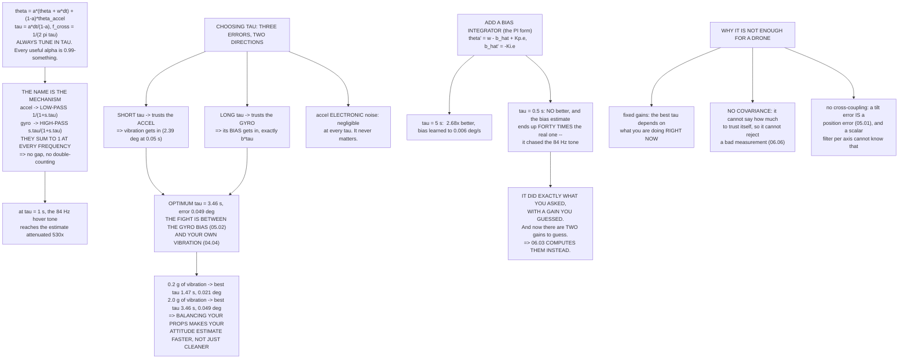

# 06.02 The complementary filter: your first fusion

<!-- glance:start -->
<!-- generated by tools/build.py from curriculum/syllabus.yaml — edit the syllabus, not this block -->

| | |
|---|---|
| **Track** | Main path |
| **Difficulty** | Intermediate |
| **Time** | 1 h 15 min |
| **Hardware** | none |
| **Software** | python |
| **Prerequisites** | [06.01 Why estimation: the state is never measured directly](06.01-why-estimation.md) |
| **Skip if** | You can write a complementary filter for pitch from gyro and accelerometer and pick its time constant from the sensors' noise. |

<!-- glance:end -->

## What you will learn

- The complementary filter in **one line**, and the same line rewritten as a time constant
- Why the two sensor paths are a **high-pass and a low-pass that sum to one** at every frequency
- How to choose the time constant from your sensors' actual numbers — and the discovery that the
  fight is between the **gyro bias** and **your own vibration**
- Why **balancing your propellers makes your attitude estimate faster**, not just cleaner
- What adding a **bias integrator** buys, and the case where it makes things forty times worse
- Why a complementary filter was enough for a flight controller in 2010 and is not enough now

## Why it matters

[06.01](06.01-why-estimation.md) argued that fusion is a division of labour by timescale: the fast
sensor carries the estimate moment to moment and the slow one keeps it honest at DC. The
complementary filter is that idea in its smallest possible form — one line of code, one tuning
parameter, and a real attitude estimate at the end of it.

It is worth building because everything larger is this with extra machinery. The Kalman filter in
[06.03](06.03-kalman-from-scratch.md) computes the gain that this lesson makes you guess. EKF3 in
[06.05](06.05-ekf3-in-ardupilot.md) does that for 22 correlated states instead of one. If the
complementary filter makes sense, the rest is engineering.

And the tuning exercise in this lesson produces a result worth having on its own: **the optimal
filter setting depends on how well you balanced your propellers.** Mechanical work in module 04
buys you software performance here, and you can put a number on the exchange rate.

## Prerequisites

<!-- prereqs:start -->
## Prerequisites

You need these first:

- [06.01 Why estimation: the state is never measured directly](06.01-why-estimation.md)

### Optional prerequisite links

None.

Check your readiness: `python course.py why 06.02`
<!-- prereqs:end -->

## Concept

### The filter, in one line

$$\theta \leftarrow \alpha(\theta + \omega\,\Delta t) + (1-\alpha)\,\theta_{accel}$$

The first term is the gyro carrying the estimate forward. The second is the accelerometer pulling
it back towards where gravity says down is. $\alpha$ is close to 1.

Nobody can think in $\alpha$, so rewrite it as a **time constant**:

$$\tau = \frac{\alpha\,\Delta t}{1-\alpha}, \qquad
\alpha = \frac{\tau}{\tau+\Delta t}, \qquad
f_{cross} = \frac{1}{2\pi\tau}$$

At Hermon's 400 Hz IMU rate:

| τ | α | Crossover | Samples to 63 % |
|---:|---:|---:|---:|
| 0.05 s | 0.952381 | 3.183 Hz | 20 |
| 0.10 s | 0.975610 | 1.592 Hz | 40 |
| 0.20 s | 0.987654 | 0.796 Hz | 80 |
| 0.50 s | 0.995025 | 0.318 Hz | 200 |
| **1.00 s** | **0.997506** | **0.159 Hz** | **400** |
| 2.00 s | 0.998752 | 0.080 Hz | 800 |
| 5.00 s | 0.999500 | 0.032 Hz | 2,000 |
| 10.00 s | 0.999750 | 0.016 Hz | 4,000 |

Look at the α column and notice how uninformative it is: every useful value is 0.99-something.
**Always tune in τ, never in α.**

### The two responses add to one

The name is the mechanism. The accelerometer reaches the estimate through a **low-pass** and the
gyro through a **high-pass**, and the two transfer functions sum to exactly 1 at every frequency:

$$H_{accel}(s) = \frac{1}{1+s\tau}, \qquad H_{gyro}(s) = \frac{s\tau}{1+s\tau},
\qquad H_{accel} + H_{gyro} = 1$$

At τ = 1 s (crossover 0.159 Hz):

| f | Accel (low-pass) | Gyro (high-pass) | Sum of powers |
|---:|---:|---:|---:|
| 0.01 Hz | 0.998032 | 0.062708 | 1.000 |
| 0.05 Hz | 0.954028 | 0.299717 | 1.000 |
| 0.10 Hz | 0.846733 | 0.532018 | 1.000 |
| 0.50 Hz | 0.303314 | 0.952891 | 1.000 |
| 1.00 Hz | 0.157177 | 0.987570 | 1.000 |
| 5.00 Hz | 0.031815 | 0.999494 | 1.000 |
| 20.00 Hz | 0.007957 | 0.999968 | 1.000 |
| **84.30 Hz** | **0.001888** | 0.999998 | 1.000 |
| 253.00 Hz | 0.000629 | 1.000000 | 1.000 |

> [!IMPORTANT]
> **There is no gap and no double-counting**, at any frequency, ever. That is what makes this a
> principled filter rather than a blend. And read the 84.30 Hz row — Hermon's hover tone
> ([02.09](../02-motors-escs-props/02.09-heat-vibration-noise.md)): vibration reaching the
> attitude estimate through the accelerometer is attenuated **530×**.

### Choosing τ: three errors that pull opposite ways

**Short τ** trusts the accelerometer, so vibration gets in. **Long τ** trusts the gyro, so its
bias gets in — and a constant gyro bias $b$ produces a *steady* tilt error of exactly $b\tau$.

Using [05.02](../05-sensors/05.02-imu.md)'s numbers (0.01 °/s bias, 0.004 °/s/√Hz gyro noise,
0.0007 m/s²/√Hz accelerometer noise) and
[04.04](../04-frame-and-assembly/04.04-mounting-and-vibration.md)'s 2 g of vibration at 84.3 Hz:

| τ | Gyro bias | Accel noise | **Vibration** | Total |
|---:|---:|---:|---:|---:|
| 0.05 s | 0.0005° | 0.0129° | **2.3935°** | 2.3936° |
| 0.10 s | 0.0010° | 0.0091° | 1.1974° | 1.1974° |
| 0.20 s | 0.0020° | 0.0065° | 0.5988° | 0.5988° |
| 0.50 s | 0.0050° | 0.0041° | 0.2395° | 0.2396° |
| 1.00 s | 0.0100° | 0.0029° | 0.1198° | 0.1202° |
| 2.00 s | 0.0200° | 0.0020° | 0.0599° | 0.0632° |
| **3.46 s (optimum)** | | | | **0.0490°** |
| 5.00 s | 0.0500° | 0.0013° | 0.0240° | 0.0555° |
| 10.00 s | **0.1000°** | 0.0009° | 0.0120° | 0.1007° |

> [!IMPORTANT]
> **Look at which term sets the answer.** The accelerometer's own electronic noise is negligible
> at every τ — it never once matters. The fight is between the **gyro bias** (from module 05) and
> **your own vibration** (from module 04), and the optimum is where they cross. Tuning a filter
> turns out to be a question about your propellers.

And the exchange rate is explicit:

| Vibration | Best τ | Crossover | Best error |
|---:|---:|---:|---:|
| **0.2 g** | **1.47 s** | **0.108 Hz** | **0.0208°** |
| 0.5 g | 2.24 s | 0.071 Hz | 0.0317° |
| 1.0 g | 2.91 s | 0.055 Hz | 0.0413° |
| 2.0 g | 3.46 s | 0.046 Hz | 0.0490° |
| 5.0 g | 3.85 s | 0.041 Hz | 0.0545° |

**Balance your propellers and you can use a shorter τ** — which means a faster, more responsive
attitude estimate *and* a smaller error. Going from 2 g to 0.2 g more than doubles the crossover
frequency and halves the error. That is
[02.09](../02-motors-escs-props/02.09-heat-vibration-noise.md)'s ₪40 balancer buying you filter
performance, and it is the same trade as
[04.04](../04-frame-and-assembly/04.04-mounting-and-vibration.md) arriving from the software side.

### It works — and then it does not

Simulate sixty seconds: level, a smooth 10° pitch up at 20 s, back at 40 s, with 0.01 °/s of gyro
bias and 2 g of vibration. Score only the settled stretches, which is what the analysis above
predicts:

| τ | RMS error | Peak error | Predicted |
|---:|---:|---:|---:|
| 0.10 s | 0.9235° | 1.3326° | 1.1974° |
| 0.50 s | 0.1830° | 0.2792° | 0.2396° |
| 1.00 s | 0.0921° | 0.1528° | 0.1202° |
| 2.00 s | 0.0507° | 0.0981° | 0.0632° |
| 5.00 s | 0.0547° | 0.0923° | 0.0555° |

Simulation and analysis agree to within about 1.5×, which is the right kind of agreement — the
analysis uses RMS amplitudes and the simulation a single tone, so exact agreement would be
suspicious rather than reassuring.

Now add a **bias integrator** — the "PI" complementary filter, which estimates the gyro bias
instead of tolerating it. With $K_p = 1/\tau$ and $K_i = 1/\tau^2$:

| τ | Plain | With $K_i$ | Improvement | Bias left |
|---:|---:|---:|---:|---:|
| 0.50 s | 0.1830° | 0.1826° | 1.00× | **+0.40494 °/s** |
| 1.00 s | 0.0921° | 0.0914° | 1.01× | +0.10365 °/s |
| 2.00 s | 0.0507° | 0.0459° | 1.10× | +0.02654 °/s |
| **5.00 s** | 0.0547° | **0.0204°** | **2.68×** | +0.00639 °/s |
| **10.00 s** | 0.0945° | **0.0305°** | **3.10×** | +0.00254 °/s |

**At long τ the integrator is a clear win.** It learns the gyro bias, the $b\tau$ term disappears,
and you are free to use a long τ purely to reject vibration.

**At short τ it is a loss.** $K_i = 1/\tau^2$ is aggressive, so the integrator chases the 84 Hz
vibration and ends up estimating a bias **forty times the real one**. It has not failed — it has
done exactly what you asked, with a gain you guessed.

> [!IMPORTANT]
> **And that is the whole argument for the next lesson.** A filter that *estimates* a sensor's
> error is strictly better than one that tolerates it — but only if the gain is right, and you
> now have **two** gains to guess instead of one. The PI complementary filter **is** a two-state
> Kalman filter with the gains hard-coded. [06.03](06.03-kalman-from-scratch.md) computes them
> instead of guessing.

### Why this is not enough for a drone

| Limitation | Why it matters |
|---|---|
| **Fixed gains** | the optimal τ depends on how much you are vibrating and manoeuvring *right now* |
| **No covariance** | it cannot say how much to trust itself, so it cannot reject a bad measurement ([06.06](06.06-ekf-health-and-logs.md)) |
| **One measurement at a time** | GNSS, baro, flow and magnetometer all correct different states at different rates |
| **No cross-coupling** | a tilt error *is* a position error ([05.01](../05-sensors/05.01-sensor-roles.md)); a scalar filter per axis cannot know that |
| **Small angles only** | the accelerometer-to-tilt step assumes small angles and a level-ish aircraft |

A complementary filter is a superb attitude estimator for a self-balancing robot, and it is what
most cheap flight controllers ran on until about 2013. What it cannot do is carry 22 correlated
states, weigh each measurement by how surprising it is, and **tell you when it has stopped
working**.

> [!TIP]
> **Ask your teacher:** "I want to use the shortest τ I can get away with, because a faster
> attitude estimate means less phase lag in my rate loop. Walk me through exactly what goes wrong
> as I shorten it past the optimum — what the estimate does, what the rate controller does with
> it, and at what point it becomes an oscillation rather than just a noisier estimate."

## Technical explanation

### Level 1 — Intuition: a watch and a sundial

You have a watch that runs perfectly over a minute and gains a few seconds a day, and a sundial
that is never wrong by more than a few minutes and is useless for timing an egg.

The sensible thing is not to pick one. It is to use the watch for everything short and nudge it
back towards the sundial, slowly, over hours. **How slowly** is the only question, and the answer
depends on how fast the watch drifts and how noisy the sundial is on a partly cloudy day.

That is the complementary filter, and "a partly cloudy day" is your propeller imbalance.

### Level 2 — Practical: implementing it

```text
theta = 0
loop at fs:
    read gyro w, read accel (ax, ay, az)
    theta_accel = atan2(-ax, sqrt(ay^2 + az^2))     # small angles, level-ish
    alpha = tau / (tau + dt)
    theta = alpha * (theta + w*dt) + (1 - alpha) * theta_accel
```

Four practical points:

1. **Initialise from the accelerometer**, not from zero, or the filter spends τ settling.
2. **Reject the accelerometer when $|a|$ is far from 1 g.** During an aggressive manoeuvre the
   accelerometer is not measuring gravity and should not be believed.
3. **Use the PI form if you use a long τ**, but pick $K_i$ deliberately.
4. **Log the estimate and the accelerometer angle separately.** Their difference is your
   innovation, and it is the only diagnostic you have.

### Level 3 — Mathematics: why the responses are complementary

In the Laplace domain, with $\theta_g$ the gyro-integrated angle and $\theta_a$ the accelerometer
angle:

$$\hat\Theta(s) = \frac{s\tau}{1+s\tau}\Theta_g(s) + \frac{1}{1+s\tau}\Theta_a(s)$$

and $\frac{s\tau}{1+s\tau} + \frac{1}{1+s\tau} = 1$ identically. That is the definition: two
filters whose transfer functions sum to unity, so a signal present in both inputs passes through
with unity gain regardless of frequency.

**The steady-state gyro-bias error.** A constant bias $b$ appears as $b/s$ at the gyro input.
Applying the final-value theorem to the high-pass path:

$$\lim_{t\to\infty}\theta_{err} = \lim_{s\to 0} s\cdot\frac{s\tau}{1+s\tau}\cdot\frac{b}{s^2}
= b\tau$$

Hence the $b\tau$ column. **The noise through the low-pass.** White noise of per-sample standard
deviation $\sigma$ at rate $f_s$ through a first-order low-pass of time constant $\tau$ emerges
with

$$\sigma_{out} = \frac{\sigma}{\sqrt{2\tau f_s}}$$

**A vibration tone** at $f_v$ is simply attenuated by the low-pass gain
$1/\sqrt{1+(2\pi f_v\tau)^2}$.

Minimising the sum of the three in quadrature gives the optimum τ, and because the vibration term
and the noise term both fall with τ while the bias term rises, the optimum is unique.

**The PI form** is

$$\dot{\hat\theta} = \omega - \hat b + K_p e, \qquad \dot{\hat b} = -K_i e,
\qquad e = \theta_a - \hat\theta$$

which is a second-order system with natural frequency $\sqrt{K_i}$ and damping
$K_p/(2\sqrt{K_i})$. With $K_p = 1/\tau$ and $K_i = 1/\tau^2$ the damping is 0.5 — underdamped,
which is why it rings and why it chases a strong tone.

### Level 4 — Implementation: what to take to the next lesson

Write down, for your own aircraft:

1. Your gyro's in-run bias and your accelerometer's noise density, from
   [05.02](../05-sensors/05.02-imu.md).
2. Your measured vibration level and its dominant frequency, from
   [04.04](../04-frame-and-assembly/04.04-mounting-and-vibration.md).
3. Your optimal τ and the error it gives.
4. The τ you would be able to use if you halved your vibration.

Items 1 and 2 become the **process noise** and **measurement noise** of
[06.03](06.03-kalman-from-scratch.md). The complementary filter makes you guess a gain from them;
the Kalman filter computes it. Same inputs, better arithmetic.

## Diagram



## Code

Save as `comp_filter.py` and run `python comp_filter.py`. Standard library only; it runs several
60-second simulations at 400 Hz, so give it a moment.

```python
"""06.02 - the complementary filter: two bad sensors, one good estimate."""
import math
import random

G = 9.81
FS = 400.0                # Hz, the IMU rate
DT = 1.0 / FS

GYRO_BIAS_DPS = 0.01      # deg/s, 05.02's in-run bias
GYRO_ND = 0.004           # deg/s/rtHz, 05.02's noise density
ACC_ND = 0.0007           # m/s^2/rtHz, 05.02's noise density
VIB_G = 2.0               # g RMS on the horizontal axes (04.04)
F_VIB = 84.3              # Hz, 1x rpm at hover (02.09)

TAUS = [0.05, 0.1, 0.2, 0.5, 1.0, 2.0, 5.0, 10.0]
FREQS = [0.01, 0.05, 0.1, 0.5, 1.0, 5.0, 20.0, 84.3, 253.0]
SIM_S = 60.0


def alpha(tau, dt=DT):
    return tau / (tau + dt)


def f_cross(tau):
    return 1.0 / (2 * math.pi * tau)


def gyro_term(tau):
    """A constant gyro bias produces a STEADY tilt error of b*tau."""
    return math.degrees(math.radians(GYRO_BIAS_DPS) * tau)


def elec_term(tau):
    """White accel noise through a first-order low-pass of time constant tau."""
    sigma_a = ACC_ND * math.sqrt(FS)          # m/s^2 per sample
    sigma_ang = sigma_a / G                   # rad, small-angle
    return math.degrees(sigma_ang / math.sqrt(2 * tau * FS))


def vib_term(tau, amp_g=VIB_G, f=F_VIB):
    """A vibration TONE, attenuated by the same low-pass."""
    gain = 1.0 / math.sqrt(1 + (2 * math.pi * f * tau) ** 2)
    return math.degrees(math.atan(amp_g)) * gain


def total_err(tau, amp_g=VIB_G):
    return math.sqrt(gyro_term(tau) ** 2 + elec_term(tau) ** 2
                     + vib_term(tau, amp_g) ** 2)


def best_tau(amp_g=VIB_G, lo=0.01, hi=100.0, n=4000):
    best, bt = None, None
    for i in range(n):
        t = lo * (hi / lo) ** (i / (n - 1))
        e = total_err(t, amp_g)
        if best is None or e < best:
            best, bt = e, t
    return bt, best


def truth(t):
    """A smooth 10 deg pitch up at 20 s and back at 40 s, with its own rate.

    The truth and its derivative must be CONSISTENT, or the gyro is being
    asked to miss a rotation that really happened.
    """
    amp, rise = math.radians(10.0), 2.0

    def ramp(t0, sign):
        if t < t0:
            return 0.0, 0.0
        if t > t0 + rise:
            return sign * amp, 0.0
        x = (t - t0) / rise
        # smoothstep, so the rate is continuous at both ends
        return (sign * amp * (3 * x * x - 2 * x ** 3),
                sign * amp * (6 * x - 6 * x * x) / rise)
    a1, r1 = ramp(20.0, +1)
    a2, r2 = ramp(40.0, -1)
    return a1 + a2, r1 + r2


def run_filter(tau, ki_on=False, seed=20260923):
    """PI complementary filter. With ki_on it ESTIMATES the gyro bias."""
    rnd = random.Random(seed)
    kp = 1.0 / tau
    ki = (1.0 / tau) ** 2 if ki_on else 0.0
    n = int(SIM_S * FS)
    theta, b_hat = 0.0, 0.0
    bias = math.radians(GYRO_BIAS_DPS)
    g_nd = math.radians(GYRO_ND) * math.sqrt(FS)
    a_nd = ACC_ND * math.sqrt(FS) / G
    err2, peak, count = 0.0, 0.0, 0
    for i in range(n):
        t = i * DT
        true, true_rate = truth(t)
        w = true_rate + bias + rnd.gauss(0, g_nd)
        vib = math.radians(math.degrees(math.atan(VIB_G))
                           * math.sin(2 * math.pi * F_VIB * t))
        z = true + rnd.gauss(0, a_nd) + vib
        e = z - theta
        theta += (w - b_hat + kp * e) * DT
        b_hat -= ki * e * DT
        # score only the SETTLED stretches: the analysis predicts those
        settled = (10.0 < t < 19.0) or (30.0 < t < 39.0) or (50.0 < t < 59.0)
        if settled:
            d = math.degrees(theta - true)
            err2 += d * d
            peak = max(peak, abs(d))
            count += 1
    return math.sqrt(err2 / count), peak, math.degrees(b_hat) - GYRO_BIAS_DPS


def bar(t):
    print("\n" + "=" * 70)
    print(t)
    print("=" * 70)


if __name__ == "__main__":
    bar("1. THE FILTER, IN ONE LINE")
    print("  theta = a * (theta + omega*dt)  +  (1 - a) * theta_accel")
    print("          \\_____ the gyro _____/     \\__ the accel __/")
    print("  a is near 1, so the gyro carries the estimate moment to")
    print("  moment and the accelerometer pulls it back towards gravity.")
    print("  Written in terms of a TIME CONSTANT it is easier to think")
    print("  about: tau = a*dt/(1-a), and the crossover is 1/(2 pi tau).")
    print(f"  (at {FS:.0f} Hz)")
    print(f"  {'tau':>7s} {'alpha':>10s} {'crossover':>11s}"
          f" {'samples to 63%':>16s}")
    for tau in TAUS:
        print(f"  {tau:6.2f}s {alpha(tau):10.6f} {f_cross(tau):9.3f} Hz"
              f" {tau * FS:15.0f}")
    print("  BELOW the crossover the accelerometer wins; ABOVE it the gyro")
    print("  does. And the two responses SUM TO ONE at every frequency --")
    print("  which is what 'complementary' means and why there is no gap")
    print("  and no double-counting.")

    bar("2. THE TWO RESPONSES ADD TO ONE, AT EVERY FREQUENCY")
    tau = 1.0
    print(f"  tau = {tau:.1f} s, crossover {f_cross(tau):.3f} Hz")
    print(f"  {'f Hz':>8s} {'accel (low-pass)':>18s} {'gyro (high-pass)':>18s}"
          f" {'sum':>7s}")
    for f in FREQS:
        w = 2 * math.pi * f * tau
        lp = 1.0 / math.sqrt(1 + w * w)
        hp = w / math.sqrt(1 + w * w)
        print(f"  {f:8.2f} {lp:18.6f} {hp:18.6f} {lp * lp + hp * hp:7.3f}")
    print("  (the sum is of POWERS; the two transfer functions add to 1")
    print("   exactly, which is the defining property.)")
    print("  Read the 84 Hz row: at hover, the vibration reaching the")
    print(f"  estimate through the accelerometer is attenuated"
          f" {1 / (1 / math.sqrt(1 + (2 * math.pi * 84.3 * tau) ** 2)):.0f}x.")

    bar("3. CHOOSING TAU: THREE ERRORS THAT PULL OPPOSITE WAYS")
    print("  SHORT tau -> trusts the accelerometer -> vibration gets in.")
    print("  LONG tau  -> trusts the gyro -> its BIAS gets in, as b*tau.")
    print(f"  {'tau':>7s} {'gyro bias':>11s} {'accel noise':>13s}"
          f" {'VIBRATION':>11s} {'total':>9s}")
    for tau in TAUS:
        print(f"  {tau:6.2f}s {gyro_term(tau):9.4f} d"
              f" {elec_term(tau):11.4f} d {vib_term(tau):9.4f} d"
              f" {total_err(tau):7.4f} d")
    bt, be = best_tau()
    print(f"\n  OPTIMUM: tau = {bt:.2f} s  ({f_cross(bt):.3f} Hz),"
          f" total error {be:.4f} deg")
    print("  Note WHICH term sets it. The accelerometer's own electronic")
    print("  noise is negligible at every tau. The fight is between the")
    print("  GYRO BIAS and the VIBRATION -- one from module 05, one from")
    print("  module 04 -- and the optimum is where they cross.")
    print(f"\n  And the tuning moves with your aircraft:")
    print(f"  {'vibration':>11s} {'best tau':>10s} {'crossover':>11s}"
          f" {'best error':>12s}")
    for v in (0.2, 0.5, 1.0, 2.0, 5.0):
        t_, e_ = best_tau(v)
        print(f"  {v:9.1f} g {t_:9.2f}s {f_cross(t_):9.3f} Hz {e_:10.4f} d")
    print("  BALANCE YOUR PROPELLERS AND YOU CAN USE A SHORTER TAU, which")
    print("  means a FASTER, more responsive attitude estimate. Mechanical")
    print("  work buys you filter performance. That is the same trade as")
    print("  04.04, arriving from the software side.")

    bar("4. IT WORKS -- AND THEN IT DOES NOT")
    print(f"  A {SIM_S:.0f} s simulation: level, a 10 deg pitch step at 20 s,")
    print(f"  back at 40 s. Gyro bias {GYRO_BIAS_DPS} deg/s,"
          f" {VIB_G:.0f} g of vibration at {F_VIB:.0f} Hz.")
    print("  Scored on the SETTLED stretches only, which is what the")
    print("  analysis above predicts.")
    print(f"  {'tau':>7s} {'RMS error':>11s} {'peak error':>12s}"
          f" {'predicted':>11s}")
    for tau in (0.1, 0.5, 1.0, 2.0, 5.0):
        rms, peak, _ = run_filter(tau)
        print(f"  {tau:6.2f}s {rms:9.4f} d {peak:10.4f} d"
              f" {total_err(tau):9.4f} d")
    print("  The simulation and the analysis agree to within a factor of")
    print("  about 1.5 -- the analysis uses RMS amplitudes and the")
    print("  simulation a single tone, so exact agreement would be")
    print("  suspicious rather than reassuring.")

    print("\n  NOW ADD A BIAS INTEGRATOR -- the 'PI' complementary filter:")
    print(f"  {'tau':>7s} {'plain':>11s} {'with Ki':>11s}"
          f" {'improvement':>13s} {'bias left':>11s}")
    for tau in (0.5, 1.0, 2.0, 5.0, 10.0):
        r0, _, _ = run_filter(tau, ki_on=False)
        r1, _, br = run_filter(tau, ki_on=True)
        print(f"  {tau:6.2f}s {r0:9.4f} d {r1:9.4f} d"
              f" {r0 / r1:11.2f}x {br:9.5f} d/s")
    print("  (Ki = 1/tau^2, the usual choice. 'bias left' is what the")
    print("   integrator failed to learn, in deg/s.)")
    print("  AT LONG TAU THE INTEGRATOR IS A CLEAR WIN: it learns the gyro")
    print("  bias instead of living with it, the b*tau term disappears, and")
    print("  you are free to use a long tau purely to reject vibration.")
    print("  AT SHORT TAU IT IS A LOSS. Ki = 1/tau^2 is aggressive, so the")
    print("  integrator chases the 84 Hz vibration and ends up estimating")
    print("  a bias FORTY TIMES the real one. It has not failed -- it has")
    print("  done exactly what you asked, with a gain you guessed.")
    print("\n  AND THAT IS THE WHOLE IDEA OF THE NEXT LESSON. A filter that")
    print("  ESTIMATES the sensor's error is strictly better than one that")
    print("  tolerates it -- but only if the gain is RIGHT, and here there")
    print("  are now two gains to guess instead of one. The PI")
    print("  complementary filter IS a two-state Kalman filter with the")
    print("  gains hard-coded. 06.03 computes them instead.")

    bar("5. WHY THIS IS NOT ENOUGH FOR A DRONE")
    limits = [
        ("fixed gains", "the optimal tau depends on how much you are",
         "vibrating and manoeuvring RIGHT NOW"),
        ("no covariance", "it cannot tell you how much to trust itself",
         "so it cannot reject a bad measurement (06.06)"),
        ("one measurement at a time", "GNSS, baro, flow and mag all correct",
         "different states at different rates"),
        ("no cross-coupling", "a tilt error IS a position error (05.01);",
         "a scalar filter per axis cannot know that"),
        ("small angles only", "the accelerometer-to-tilt step assumes",
         "small angles and a level-ish aircraft"),
    ]
    print(f"  {'limitation':26s} why it matters")
    for a, b, c in limits:
        print(f"  {a:26s} {b}")
        print(f"  {'':26s} {c}")
    print("\n  A complementary filter is a superb attitude estimator for a")
    print("  self-balancing robot and it is what most cheap flight")
    print("  controllers ran on until about 2013. What it cannot do is")
    print("  carry 22 correlated states, weigh each measurement by how")
    print("  surprising it is, and tell you when it has stopped working.")
```

Output:

```text

======================================================================
1. THE FILTER, IN ONE LINE
======================================================================
  theta = a * (theta + omega*dt)  +  (1 - a) * theta_accel
          \_____ the gyro _____/     \__ the accel __/
  a is near 1, so the gyro carries the estimate moment to
  moment and the accelerometer pulls it back towards gravity.
  Written in terms of a TIME CONSTANT it is easier to think
  about: tau = a*dt/(1-a), and the crossover is 1/(2 pi tau).
  (at 400 Hz)
      tau      alpha   crossover   samples to 63%
    0.05s   0.952381     3.183 Hz              20
    0.10s   0.975610     1.592 Hz              40
    0.20s   0.987654     0.796 Hz              80
    0.50s   0.995025     0.318 Hz             200
    1.00s   0.997506     0.159 Hz             400
    2.00s   0.998752     0.080 Hz             800
    5.00s   0.999500     0.032 Hz            2000
   10.00s   0.999750     0.016 Hz            4000
  BELOW the crossover the accelerometer wins; ABOVE it the gyro
  does. And the two responses SUM TO ONE at every frequency --
  which is what 'complementary' means and why there is no gap
  and no double-counting.

======================================================================
2. THE TWO RESPONSES ADD TO ONE, AT EVERY FREQUENCY
======================================================================
  tau = 1.0 s, crossover 0.159 Hz
      f Hz   accel (low-pass)   gyro (high-pass)     sum
      0.01           0.998032           0.062708   1.000
      0.05           0.954028           0.299717   1.000
      0.10           0.846733           0.532018   1.000
      0.50           0.303314           0.952891   1.000
      1.00           0.157177           0.987570   1.000
      5.00           0.031815           0.999494   1.000
     20.00           0.007957           0.999968   1.000
     84.30           0.001888           0.999998   1.000
    253.00           0.000629           1.000000   1.000
  (the sum is of POWERS; the two transfer functions add to 1
   exactly, which is the defining property.)
  Read the 84 Hz row: at hover, the vibration reaching the
  estimate through the accelerometer is attenuated 530x.

======================================================================
3. CHOOSING TAU: THREE ERRORS THAT PULL OPPOSITE WAYS
======================================================================
  SHORT tau -> trusts the accelerometer -> vibration gets in.
  LONG tau  -> trusts the gyro -> its BIAS gets in, as b*tau.
      tau   gyro bias   accel noise   VIBRATION     total
    0.05s    0.0005 d      0.0129 d    2.3935 d  2.3936 d
    0.10s    0.0010 d      0.0091 d    1.1974 d  1.1974 d
    0.20s    0.0020 d      0.0065 d    0.5988 d  0.5988 d
    0.50s    0.0050 d      0.0041 d    0.2395 d  0.2396 d
    1.00s    0.0100 d      0.0029 d    0.1198 d  0.1202 d
    2.00s    0.0200 d      0.0020 d    0.0599 d  0.0632 d
    5.00s    0.0500 d      0.0013 d    0.0240 d  0.0555 d
   10.00s    0.1000 d      0.0009 d    0.0120 d  0.1007 d

  OPTIMUM: tau = 3.46 s  (0.046 Hz), total error 0.0490 deg
  Note WHICH term sets it. The accelerometer's own electronic
  noise is negligible at every tau. The fight is between the
  GYRO BIAS and the VIBRATION -- one from module 05, one from
  module 04 -- and the optimum is where they cross.

  And the tuning moves with your aircraft:
    vibration   best tau   crossover   best error
        0.2 g      1.47s     0.108 Hz     0.0208 d
        0.5 g      2.24s     0.071 Hz     0.0317 d
        1.0 g      2.91s     0.055 Hz     0.0413 d
        2.0 g      3.46s     0.046 Hz     0.0490 d
        5.0 g      3.85s     0.041 Hz     0.0545 d
  BALANCE YOUR PROPELLERS AND YOU CAN USE A SHORTER TAU, which
  means a FASTER, more responsive attitude estimate. Mechanical
  work buys you filter performance. That is the same trade as
  04.04, arriving from the software side.

======================================================================
4. IT WORKS -- AND THEN IT DOES NOT
======================================================================
  A 60 s simulation: level, a 10 deg pitch step at 20 s,
  back at 40 s. Gyro bias 0.01 deg/s, 2 g of vibration at 84 Hz.
  Scored on the SETTLED stretches only, which is what the
  analysis above predicts.
      tau   RMS error   peak error   predicted
    0.10s    0.9235 d     1.3326 d    1.1974 d
    0.50s    0.1830 d     0.2792 d    0.2396 d
    1.00s    0.0921 d     0.1528 d    0.1202 d
    2.00s    0.0507 d     0.0981 d    0.0632 d
    5.00s    0.0547 d     0.0923 d    0.0555 d
  The simulation and the analysis agree to within a factor of
  about 1.5 -- the analysis uses RMS amplitudes and the
  simulation a single tone, so exact agreement would be
  suspicious rather than reassuring.

  NOW ADD A BIAS INTEGRATOR -- the 'PI' complementary filter:
      tau       plain     with Ki   improvement   bias left
    0.50s    0.1830 d    0.1826 d        1.00x   0.40494 d/s
    1.00s    0.0921 d    0.0914 d        1.01x   0.10365 d/s
    2.00s    0.0507 d    0.0459 d        1.10x   0.02654 d/s
    5.00s    0.0547 d    0.0204 d        2.68x   0.00639 d/s
   10.00s    0.0945 d    0.0305 d        3.10x   0.00254 d/s
  (Ki = 1/tau^2, the usual choice. 'bias left' is what the
   integrator failed to learn, in deg/s.)
  AT LONG TAU THE INTEGRATOR IS A CLEAR WIN: it learns the gyro
  bias instead of living with it, the b*tau term disappears, and
  you are free to use a long tau purely to reject vibration.
  AT SHORT TAU IT IS A LOSS. Ki = 1/tau^2 is aggressive, so the
  integrator chases the 84 Hz vibration and ends up estimating
  a bias FORTY TIMES the real one. It has not failed -- it has
  done exactly what you asked, with a gain you guessed.

  AND THAT IS THE WHOLE IDEA OF THE NEXT LESSON. A filter that
  ESTIMATES the sensor's error is strictly better than one that
  tolerates it -- but only if the gain is RIGHT, and here there
  are now two gains to guess instead of one. The PI
  complementary filter IS a two-state Kalman filter with the
  gains hard-coded. 06.03 computes them instead.

======================================================================
5. WHY THIS IS NOT ENOUGH FOR A DRONE
======================================================================
  limitation                 why it matters
  fixed gains                the optimal tau depends on how much you are
                             vibrating and manoeuvring RIGHT NOW
  no covariance              it cannot tell you how much to trust itself
                             so it cannot reject a bad measurement (06.06)
  one measurement at a time  GNSS, baro, flow and mag all correct
                             different states at different rates
  no cross-coupling          a tilt error IS a position error (05.01);
                             a scalar filter per axis cannot know that
  small angles only          the accelerometer-to-tilt step assumes
                             small angles and a level-ish aircraft

  A complementary filter is a superb attitude estimator for a
  self-balancing robot and it is what most cheap flight
  controllers ran on until about 2013. What it cannot do is
  carry 22 correlated states, weigh each measurement by how
  surprising it is, and tell you when it has stopped working.
```

## Exercise

> [!WARNING]
> If you implement this filter on your own hardware and fly it, remember that **an attitude
> estimate is the thing the rate loop closes around**. A filter with a badly chosen τ does not
> produce a slightly worse hover — it produces an oscillation. Test in
> [SITL](../10-simulation/10.04-ardupilot-sitl.md) first, and if you fly it, do so in a
> stabilised manual mode, at low altitude, in a large open area, with a way back to the stock
> estimator.

### Exercise 06.02-E1 — Tune it for your aircraft `[numerical]`

1. Get your gyro's in-run bias, your accelerometer's noise density, your measured `VIBE` level
   and your hover 1× frequency.
2. Compute the three error terms across τ from 0.05 s to 10 s and find your optimum.
3. State which term binds at your optimum.
4. Compute the optimum you would have at half your current vibration, and state what that is
   worth in crossover frequency.

### Exercise 06.02-E2 — Verify the complementary property `[coding]`

1. Using the script, tabulate $H_{accel}(f)$ and $H_{gyro}(f)$ over six decades and confirm they
   sum to exactly 1.
2. Now replace the low-pass with a **second-order** one and the high-pass with the first-order
   one. Show that they no longer sum to 1 and describe what that does at the crossover.
3. State, in one sentence, what goes wrong physically when the two responses do not sum to 1.

### Exercise 06.02-E3 — Break the bias integrator `[coding]`

1. Reproduce this lesson's PI table for your own numbers.
2. Sweep $K_i$ from $0.01/\tau^2$ to $10/\tau^2$ at a short τ and find the value at which the
   estimated bias stops chasing the vibration.
3. Express your answer as a damping ratio, and relate it to the second-order form in Level 3.
4. State what you would have to know, in advance, to pick that gain — and notice that it is
   exactly what a Kalman filter is given.

### Exercise 06.02-E4 — Run it against a real log `[analysis]`

1. Extract raw gyro and accelerometer from a real flight log.
2. Run your complementary filter over it at three values of τ.
3. Compare each against the flight controller's own reported attitude.
4. Report the RMS difference and say which τ comes closest — and whether that matches your E1
   prediction.

## Expected result

- **06.02-E1:** an optimum between about 1 s and 4 s for a typical multirotor, bound by
  vibration at the low end and gyro bias at the high end. The accelerometer's electronic noise
  should be negligible at every τ; if it is not, check your units.
- **06.02-E2:** the sum is 1.000000 to floating-point precision. Break the pairing and the sum
  develops a dip or a bump near the crossover, which means a real attitude change at that
  frequency is either attenuated or amplified by the filter — a signal the aircraft actually made
  is reported wrongly.
- **06.02-E3:** the integrator stops chasing the tone at a damping ratio around 0.7–1.0, i.e.
  $K_i \approx (K_p/2)^2$ or smaller. What you would need to know in advance is **the ratio of
  the two noise powers**, which is precisely $Q$ and $R$ in [06.03](06.03-kalman-from-scratch.md).
- **06.02-E4:** your best τ should land within a factor of two or so of the flight controller's
  effective behaviour. A large discrepancy usually means the autopilot is rejecting the
  accelerometer during manoeuvres and your filter is not.

## Troubleshooting

### Symptom: the estimate lags visibly behind real attitude changes

τ is too long, or you are looking at the low-pass path. The complementary filter should have
**no** lag for a real attitude change — the gyro path is unity gain above the crossover. If it
lags, check that you are integrating the gyro at the right rate and that $\Delta t$ is the actual
sample interval, not a nominal one.

### Symptom: the estimate is noisy and follows the vibration

τ is too short. Compute the vibration term from your own `VIBE` figure and see what τ it needs.
The better fix is upstream: balance the propellers, because that lets you use a *shorter* τ, not
a longer one.

### Symptom: the estimate slowly leans during a long hover

That is $b\tau$, and it is the gyro bias. Either shorten τ (at the cost of more vibration) or add
the bias integrator with a conservatively chosen $K_i$. If the lean is more than about 0.1°,
check your gyro's actual in-run bias — it may be a temperature effect
([05.02](../05-sensors/05.02-imu.md)) rather than the in-run figure.

### Symptom: the estimate is thrown off during aggressive manoeuvres

The accelerometer is not measuring gravity during a manoeuvre; it is measuring gravity **plus the
manoeuvre**. Reject the accelerometer whenever $\left| |a| - g \right|$ exceeds a threshold — a
tenth of a gravity is a reasonable start — and let the gyro carry it alone until the aircraft
settles.

### Symptom: the PI filter's bias estimate wanders

$K_i$ is too high for your vibration level. The bias is meant to be a slowly-varying quantity;
if the integrator can follow an 84 Hz tone, it is not estimating a bias, it is demodulating a
vibration. Reduce $K_i$ until the damping ratio $K_p/(2\sqrt{K_i})$ is at least 0.7.

### Symptom: it works on the bench and is wrong in the air

Bench vibration is not flight vibration. Re-measure your `VIBE` in flight and re-derive τ. This is
the single commonest reason a filter that was tuned carefully behaves differently once the motors
are turning.

## Common mistakes

- **Tuning in α.** Every useful value is 0.99-something and you cannot reason about it. Tune in τ.
- **Copying a τ from a tutorial.** The optimum depends on your gyro bias and your vibration, and
  the second of those is a property of your build.
- **Believing the accelerometer's electronic noise matters.** It never does, at any τ.
- **Trusting the accelerometer during a manoeuvre.** It measures specific force, not gravity.
- **Initialising the estimate at zero.** The filter then spends τ settling — and τ may be
  seconds.
- **Adding a bias integrator without choosing $K_i$.** At a short τ it will estimate a bias forty
  times too large.
- **Tuning the filter to fix a vibration problem.** Balance the propellers; then the filter can
  be *faster*.
- **Assuming a good attitude filter gives you a good position estimate.** It does not: a tilt
  error is a position error, and a scalar filter has no way to represent that coupling.

## Knowledge check

<details>
<summary>Why is a complementary filter "complementary", and why does that matter?</summary>

Because the two sensor paths are a low-pass and a high-pass whose transfer functions **sum to
exactly 1 at every frequency**: $\frac{1}{1+s\tau} + \frac{s\tau}{1+s\tau} = 1$. It matters
because it guarantees that a real attitude change — which is present in *both* inputs — passes
through with unity gain no matter what frequency it happens at. There is no band where the filter
attenuates real motion and none where it amplifies it.
</details>

<details>
<summary>A constant gyro bias of 0.01 °/s is fed into a complementary filter with τ = 5 s. What is the steady-state error, and why?</summary>

**0.05°** — exactly $b\tau$. The bias appears as $b/s$ at the gyro input; applying the final-value
theorem to the high-pass path gives $\lim_{s\to0} s\cdot\frac{s\tau}{1+s\tau}\cdot\frac{b}{s^2} =
b\tau$. It is a *steady* error, not a growing one, because the accelerometer pulls the estimate
back — but the pull is proportional to the error, so equilibrium is reached at $b\tau$ rather
than zero.
</details>

<details>
<summary>Which error term decides the optimal τ on Hermon, and which one never matters?</summary>

The optimum is set by the **gyro bias** against **vibration coupling through the accelerometer**,
crossing at about τ = 3.46 s for 2 g of vibration. The accelerometer's **electronic noise** never
matters — it is below 0.013° at every τ in the table, an order of magnitude under the other two.
So the filter's tuning is really a question about your gyro's bias stability and your propeller
balance, and not about the accelerometer's datasheet at all.
</details>

<details>
<summary>Why does balancing your propellers make the attitude estimate faster rather than merely cleaner?</summary>

Because vibration is the term that forces a long τ. At 2 g the optimum is τ = 3.46 s (crossover
0.046 Hz); at 0.2 g it is τ = 1.47 s (crossover 0.108 Hz) — **more than double the bandwidth**,
with the error halved as well. A shorter τ means the accelerometer's DC reference is applied more
quickly, so the estimate recovers from disturbances faster. Ten minutes with a ₪40 balancer buys
you filter bandwidth you cannot buy any other way.
</details>

<details>
<summary>Adding a bias integrator improved things 2.7× at τ = 5 s and left the bias estimate forty times too large at τ = 0.5 s. What happened?</summary>

With $K_i = 1/\tau^2$, the closed loop has natural frequency $\sqrt{K_i} = 1/\tau$ and damping
$K_p/(2\sqrt{K_i}) = 0.5$ — underdamped. At τ = 0.5 s that puts the integrator's bandwidth at
2 rad/s with poor damping, and it is fast enough to partially follow the 84 Hz tone and
rectify it into what it believes is a bias. It did exactly what it was asked to do with a gain
that was guessed rather than derived — which is the argument for
[06.03](06.03-kalman-from-scratch.md).
</details>

<details>
<summary>Name two things a complementary filter fundamentally cannot do that a drone needs.</summary>

**It has no covariance**, so it cannot say how much to trust itself and therefore cannot reject a
bad measurement — a GPS glitch or a clipped accelerometer goes straight in. And **it has no
cross-coupling**: a tilt error *is* a horizontal position error
([05.01](../05-sensors/05.01-sensor-roles.md): 1° is 0.171 m/s²), and a scalar filter per axis has
no way to represent that one state's error implies another's. Those two, plus fixed gains, are
why production autopilots use a Kalman filter.
</details>

<details>
<summary>Your filter is thrown off every time you make an aggressive manoeuvre. What is the fix, and why is it not "increase τ"?</summary>

The fix is to **reject the accelerometer when $|a|$ departs from 1 g** — during a manoeuvre it is
measuring gravity *plus* the manoeuvre, so the "tilt" it reports is fiction. Increasing τ is the
wrong fix because it makes the filter slower at *everything*, including recovering from the error
once the manoeuvre ends, and it increases the $b\tau$ bias term. Gating on acceleration magnitude
costs nothing and addresses the actual cause; it is also, in essence, what a Kalman filter's
innovation gate does automatically.
</details>

## Practical challenge

Add a **complementary-filter section to `docs/estimation.md`**.

1. Your three error terms tabulated across τ, with your own sensor numbers.
2. Your optimal τ, the crossover frequency it implies, and which term binds.
3. The τ you could use at half your current vibration, and what that is worth.
4. Your implementation, with the accelerometer-rejection gate and the initialisation.
5. Your E4 comparison against a real log: RMS difference at three values of τ.
6. **One paragraph** naming the specific thing your filter cannot do that made you want a Kalman
   filter. Write it before you read the next lesson; it is much more interesting to be told the
   answer to a question you actually asked.

## You can skip this if

You can write a complementary filter from memory and convert between α and τ, explain why the two
transfer functions sum to one and what would go wrong if they did not, derive the $b\tau$
steady-state error from a gyro bias, choose τ from your own sensors' noise and your own measured
vibration and say which term binds, explain why balancing propellers increases the filter's usable
bandwidth, describe what a bias integrator adds and the condition under which it makes things
worse, and name the limitations that make it insufficient for a multirotor.

## Go deeper

- [04.04](../04-frame-and-assembly/04.04-mounting-and-vibration.md) (earlier): where the 2 g and
  the 84 Hz come from.
- [05.02](../05-sensors/05.02-imu.md) (earlier): the gyro bias and the noise densities used here.
- [06.01](06.01-why-estimation.md) (earlier): why fusion is a division of labour by timescale.
- [06.03](06.03-kalman-from-scratch.md) (next): the same problem, with the gain computed rather
  than guessed.
- [07.07](../07-control/07.07-filtering-and-methodic-tuning.md) (later): the other filters in the
  chain, and the phase lag they cost.
- The complementary filter, with the transfer-function derivation:
  https://en.wikipedia.org/wiki/Sensor_fusion
- Mahony's nonlinear complementary filter on SO(3), which is the PI form done properly:
  https://en.wikipedia.org/wiki/Attitude_control

## Progress checkpoint

Run `python course.py complete 06.02` when your filter runs and your optimal τ is written down.
Next: [06.03](06.03-kalman-from-scratch.md) — the same two sensors, the same problem, and a gain
that derives itself from the numbers you already have.
