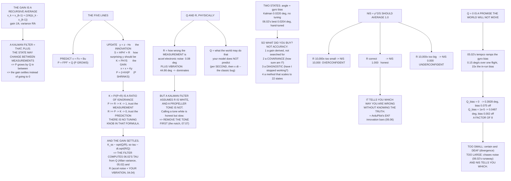

# 06.03 The Kalman filter from first principles

<!-- glance:start -->
<!-- generated by tools/build.py from curriculum/syllabus.yaml — edit the syllabus, not this block -->

| | |
|---|---|
| **Track** | Main path |
| **Difficulty** | Advanced |
| **Time** | 2 h |
| **Hardware** | none |
| **Software** | python |
| **Prerequisites** | [06.02 The complementary filter: your first fusion](06.02-complementary-filter.md) |
| **Skip if** | You can implement a 1-D Kalman filter, explain the gain as a noise ratio, and say what Q and R actually mean physically. |

<!-- glance:end -->

## What you will learn

- Where the Kalman gain comes from: it is a **recursive average**, and nothing more mysterious
- The five lines of the filter, and why $K = P/(P+R)$ is a **ratio of ignorance**
- That the gain settles — and that the settled gain **is** [06.02](06.02-complementary-filter.md)'s
  time constant, computed rather than guessed
- What $Q$ and $R$ mean physically, where to get them, and the units mistake everyone makes
- The two-state attitude-and-bias filter, and the honest answer to "was it worth it?"
- **NIS**: the one number that tells you the filter is wrong *without* knowing the truth
- Why $Q = 0$ makes a filter certain and deaf, demonstrated on a bias that really moves

## Why it matters

[06.02](06.02-complementary-filter.md) ended with two gains you had to guess, and a
demonstration that guessing one of them badly made the estimate forty times worse. This lesson
computes them instead.

That is the whole contribution, and it is bigger than it sounds. Once a filter derives its gain
from measurable quantities, three other things come free: it carries a **covariance**, so it can
say how confident it is; it produces an **innovation**, so it can notice when a measurement is
surprising; and the method **scales**, unchanged, from two states to the twenty-two of
[06.05](06.05-ekf3-in-ardupilot.md).

None of that is about accuracy. The Kalman filter in this lesson is very slightly *worse* than
the hand-tuned complementary filter on the same problem. What it is, is **principled** — and
principled turns out to be what you need when the aircraft is out of sight and the log is all you
have.

## Prerequisites

<!-- prereqs:start -->
## Prerequisites

You need these first:

- [06.02 The complementary filter: your first fusion](06.02-complementary-filter.md)

### Optional prerequisite links

None.

Check your readiness: `python course.py why 06.03`
<!-- prereqs:end -->

## Concept

### Where the gain comes from: averaging, recursively

Estimate a constant from noisy measurements. The mean of $k$ samples can be written recursively:

$$\hat x_k = \hat x_{k-1} + \frac{1}{k}\left(z_k - \hat x_{k-1}\right)$$

That $1/k$ **is** a Kalman gain, and the variance of the estimate is $R/k$:

| k | Gain 1/k | Variance R/k | sd, R = 1 |
|---:|---:|---:|---:|
| 1 | 1.00000 | 1.00000 | 1.00000 |
| 2 | 0.50000 | 0.50000 | 0.70711 |
| 5 | 0.20000 | 0.20000 | 0.44721 |
| 10 | 0.10000 | 0.10000 | 0.31623 |
| 100 | 0.01000 | 0.01000 | 0.10000 |
| 1,000 | 0.00100 | 0.00100 | 0.03162 |

The gain falls because the estimate gets better, so each new measurement is worth less.

**A Kalman filter is that idea with one addition: the state is allowed to change between
measurements.** So the estimate gets *worse* again in between, and the gain settles at a non-zero
value instead of going to zero. Everything else is bookkeeping.

### The five lines

$$\begin{aligned}
\textbf{predict:}\quad & \mathbf x = \mathbf F\mathbf x + \mathbf B\mathbf u \\
& \mathbf P = \mathbf F\mathbf P\mathbf F^T + \mathbf Q && \text{(P \textbf{grows} by Q)}\\[4pt]
\textbf{update:}\quad & \mathbf y = \mathbf z - \mathbf H\mathbf x && \text{the \textbf{innovation}}\\
& \mathbf S = \mathbf H\mathbf P\mathbf H^T + \mathbf R && \text{how surprising \textbf{y} should be}\\
& \mathbf K = \mathbf P\mathbf H^T\mathbf S^{-1} && \text{the \textbf{gain}}\\
& \mathbf x = \mathbf x + \mathbf K\mathbf y \\
& \mathbf P = (\mathbf I - \mathbf K\mathbf H)\mathbf P && \text{(P \textbf{shrinks})}
\end{aligned}$$

For one state with $H = 1$ the gain is simply $K = P/(P+R)$. Read it as a **ratio of ignorance**:

| P (my doubt) | R (its doubt) | K | Meaning |
|---:|---:|---:|---|
| 100.0 | 1.0 | 0.9901 | trust the **measurement** |
| 10.0 | 1.0 | 0.9091 | trust the **measurement** |
| 1.0 | 1.0 | 0.5000 | split it |
| 1.0 | 10.0 | 0.0909 | trust the **prediction** |
| 1.0 | 100.0 | 0.0099 | trust the **prediction** |

> [!IMPORTANT]
> **There is no tuning knob in that formula.** The gain *is* the ratio of how wrong you think you
> are to how wrong you think the sensor is. If you find yourself tuning $K$, you are really
> disagreeing with $P$ or $R$, and it is much more productive to say which.

### The gain settles — at 06.02's τ

Run the recursion on a random-walk state with $Q = 10^{-6}$ and $R = 10^{-2}$:

| Step | P before | Gain K | P after |
|---:|---:|---:|---:|
| 1 | 1.000001 | 0.99010 | 0.009901 |
| 2 | 0.009902 | 0.49754 | 0.004975 |
| 3 | 0.004976 | 0.33228 | 0.003323 |
| 5 | 0.002496 | 0.19972 | 0.001997 |
| 10 | 0.001113 | 0.10019 | 0.001002 |
| 12 | 0.000912 | 0.08362 | 0.000836 |
| … | | | |
| **steady state** | | **0.009950** | 0.000100 |

The gain starts near 1 (the filter knows nothing, so it believes the measurement), falls as $1/k$
while the estimate improves, and then **stops falling** — because $Q$ keeps adding uncertainty
back between steps.

Now convert that steady gain to a complementary filter. Rearranging
$x = (1-K)(x + \omega\Delta t) + Kz$ against $\alpha = 1-K$ gives
$\tau = \Delta t(1-K)/K$:

| Q | R | Q/R | K steady | Equivalent τ | Crossover |
|---:|---:|---:|---:|---:|---:|
| 1.0e−08 | 1.0e−02 | 1.0e−06 | 0.001000 | **2.499 s** | 0.0637 Hz |
| 1.0e−07 | 1.0e−02 | 1.0e−05 | 0.003157 | 0.789 s | 0.2016 Hz |
| 1.0e−06 | 1.0e−02 | 1.0e−04 | 0.009950 | 0.249 s | 0.6398 Hz |
| 1.0e−05 | 1.0e−02 | 1.0e−03 | 0.031127 | 0.078 s | 2.0453 Hz |
| 1.0e−04 | 1.0e−02 | 1.0e−02 | 0.095125 | 0.024 s | 6.6925 Hz |
| 1.0e−03 | 1.0e−02 | 1.0e−01 | 0.270156 | 0.007 s | 23.5649 Hz |

> [!IMPORTANT]
> **The Kalman filter computes the number 06.02 made you guess.** And it computes it from two
> quantities you can *measure* — $Q$ from the gyro's Allan variance
> ([05.02](../05-sensors/05.02-imu.md)) and $R$ from the accelerometer's noise plus your vibration
> ([04.04](../04-frame-and-assembly/04.04-mounting-and-vibration.md)) — instead of from a tuning
> session. Only the **ratio** $Q/R$ matters for the steady gain, which is why people often
> normalise $R$ to 1 and tune only $Q$.

### Q and R, physically

**$R$ is how wrong the measurement is.** You can look this up:

| Contribution | As an angle | R |
|---|---:|---:|
| Accelerometer electronic noise | 0.0818° | 2.037e−06 |
| **Plus vibration, RMS** | **44.8553°** | **6.129e−01** |
| **Total** | 44.8554° | **6.129e−01** |

**$Q$ is how much the state can change in a way your model does not predict.** For an angle
propagated by a gyro, that is the gyro's own random walk: with a noise density of 0.004 °/s/√Hz,
$Q_{angle} = 4.874\times10^{-9}$ **per second**.

> [!IMPORTANT]
> **Note the units.** $Q$ is per *second* and gets multiplied by $\Delta t$; $R$ is per
> *measurement*. Getting that wrong by a factor of $\Delta t$ is the commonest Kalman-filter bug
> there is, and at 400 Hz it is a factor of 400 in the wrong direction.

And look at what dominates $R$: the vibration, by five orders of magnitude. But a Kalman filter
assumes measurement noise is **white**, and a propeller tone is emphatically not — it is one
frequency. Declaring a tone to be white noise is honest but pessimistic: the filter becomes far
more sluggish than it needs to be, because it believes the next sample could be anywhere.

**The right fix is not to lie about $R$.** It is to remove the tone *before* the filter sees it —
which is what the RPM harmonic notch does
([07.07](../07-control/07.07-filtering-and-methodic-tuning.md)), and why filtering and estimation
are separate stages in a real autopilot.

### Two states: angle and gyro bias

State $\mathbf x = [\theta, b]$, gyro as the **input**, accelerometer as the measurement. Same
60-second simulation as [06.02](06.02-complementary-filter.md):

| Q_angle | Q_bias | RMS error | Bias left | NIS | Final K |
|---:|---:|---:|---:|---:|---:|
| 1.0e−09 | 1.0e−12 | 0.0221° | 0.00016 °/s | 1.000 | 0.000166 |
| 1.0e−07 | 1.0e−10 | 0.0221° | 0.00017 °/s | 1.000 | 0.000168 |
| 1.0e−06 | 1.0e−09 | 0.0220° | 0.00021 °/s | 1.000 | 0.000182 |
| 1.0e−05 | 1.0e−08 | 0.0221° | 0.00052 °/s | 1.000 | 0.000287 |
| 1.0e−04 | 1.0e−07 | 0.0306° | 0.00145 °/s | 1.000 | 0.000719 |

The result is barely sensitive to $Q$ over four decades, which is what a well-posed filter looks
like: $R$ dominates, and $R$ is a number you measured rather than guessed.

**And now the honest comparison.** The best complementary filter in
[06.02](06.02-complementary-filter.md) managed **0.0204°**, and only at τ = 5 s with a hand-picked
$K_i$. The Kalman filter gets **0.0220°** — slightly *worse* — with no tuning at all.

> [!IMPORTANT]
> **So what did you buy?** Not accuracy on this problem. You bought:
> - a gain derived from measured quantities rather than from a search;
> - a **covariance**, so the filter can state how sure it is;
> - a **diagnostic** that says when it has stopped working;
> - a method that extends to 22 correlated states unchanged.
>
> Those are the four things that matter when the aircraft is 400 m away and you are reading a log.

### NIS: how to know you are wrong without knowing the truth

The **normalised innovation squared**, $y^2/S$, should average **1.0** if the filter's idea of its
own uncertainty is honest. Lie to it about $R$ and watch:

| R used | vs truth | RMS error | NIS | Verdict |
|---:|---:|---:|---:|---|
| 6.129e−05 | 1e−04× | 0.2378° | **9999.979** | **overconfident** |
| 6.129e−03 | 1e−02× | 0.0322° | **100.003** | **overconfident** |
| **6.129e−01** | **1×** | **0.0220°** | **1.000** | **honest** |
| 6.129e+01 | 1e+02× | 0.0532° | **0.010** | **underconfident** |
| 6.129e+03 | 1e+04× | 0.2989° | **0.000** | **underconfident** |

- **NIS ≫ 1** — the filter is **overconfident**. Every measurement astonishes it, because its $S$
  is far too small. $Q$ or $R$ is too small.
- **NIS ≪ 1** — the filter is **underconfident**. Nothing ever surprises it, because it expects
  anything. $Q$ or $R$ is too large.

> [!IMPORTANT]
> **NIS is the only number that tells you which way you are wrong without knowing the truth** —
> which is the situation you are always in on a real aircraft. It is the same quantity ArduPilot
> plots as the EKF innovation bars, and [06.06](06.06-ekf-health-and-logs.md) is entirely about
> reading them.

> [!TIP]
> **Ask your teacher:** "My EKF innovation bars sit at about a third of full scale and never move,
> in every flight, in every condition. Is that good news or is it telling me the filter's $R$ is
> too large? Walk me through how I would distinguish a well-tuned filter from a complacent one,
> using only the log."

### What Q is for: a bias that moves

[05.02](../05-sensors/05.02-imu.md) measured a temperature coefficient of 0.01 °/s per K. Over a
warm-up that is a gyro bias **ramping** at about 0.0025 °/s per second — 0.15 °/s over a
60-second flight, fifteen times the in-run bias. $Q_{bias}$ is exactly the statement "the bias is
allowed to move":

| Q_bias | RMS error | Bias error left | P_bias | NIS |
|---:|---:|---:|---:|---:|
| **0** | **0.3928°** | −0.07508 °/s | 1.043e−07 | 1.000 |
| 1.0e−12 | 0.3928° | −0.07508 °/s | 1.043e−07 | 1.000 |
| 1.0e−10 | 0.3925° | −0.07499 °/s | 1.065e−07 | 1.000 |
| 1.0e−08 | 0.3612° | −0.06746 °/s | 3.119e−07 | 1.000 |
| 1.0e−06 | 0.0924° | −0.01762 °/s | 8.904e−06 | 1.000 |
| **1.0e−05** | **0.0487°** | **−0.00232 °/s** | 4.986e−05 | 1.000 |
| 1.0e−04 | 0.0663° | +0.02036 °/s | 2.800e−04 | 1.000 |
| 1.0e−03 | 0.1160° | +0.07964 °/s | 1.574e−03 | 1.000 |
| 1.0e−02 | 0.2060° | +0.25807 °/s | 8.849e−03 | 1.000 |

With $Q_{bias} = 0$ you have told the filter the bias **cannot move**. Its covariance for that
state collapses, its gain for that state goes to zero, and it **stops listening** — so the real
bias walks away from the estimate and the angle error goes with it. That is **divergence**.

With the best $Q_{bias}$ here ($10^{-5}$) the filter tracks the ramp and the error falls from
0.3928° to 0.0487° — **a factor of 8.1**. And too much $Q_{bias}$ is not free either: past the
optimum the bias estimate starts chasing noise instead of the ramp, which is
[06.02](06.02-complementary-filter.md)'s runaway integrator again — now with a number on it and a
principled way to choose.

> [!IMPORTANT]
> **$Q$ is not a tuning knob for smoothness.** It is your statement about what the world is
> allowed to do that your model does not predict. Set it too small and the filter becomes certain
> and deaf; too large and it forgets everything it knew. And NIS tells you which.

## Technical explanation

### Level 1 — Intuition: two people guessing a weight

You think the parcel weighs 5 kg and you are usually within 1 kg. A friend says 7 kg and is
usually within 2 kg. What do you say?

Not 6 — that weights you equally. You weight each guess by how good the *other* one is:

$$\hat x = \frac{\sigma_2^2 x_1 + \sigma_1^2 x_2}{\sigma_1^2+\sigma_2^2}
= \frac{4\times5 + 1\times7}{5} = 5.4\ \text{kg}$$

and you are now better than either of you: $\sigma = \sqrt{4/5} = 0.89$ kg. Do that once per
measurement, with the "your own guess" part updated by physics in between, and you have a Kalman
filter.

### Level 2 — Practical: implementing one

1. **Write the state and the model first.** What does the state contain? What propagates it? What
   measures it? If you cannot answer those three in a sentence each, the code will not help.
2. **Get $R$ from a measurement**, not a guess. Sit the sensor still and take its variance —
   including, for an accelerometer on an aircraft, the vibration.
3. **Get $Q$ from the Allan variance** ([05.02](../05-sensors/05.02-imu.md)) or from a physical
   argument about what the state can do.
4. **Check the units.** $Q$ per second, multiplied by $\Delta t$; $R$ per measurement.
5. **Log NIS.** If it is not near 1, your $Q$ or your $R$ is wrong, and you now know in which
   direction.
6. **Never tune the gain directly.** Tune the thing you disagree with.

### Level 3 — Mathematics: the derivation in five steps

**Step 1 — the objective.** Find the linear estimator
$\hat{\mathbf x} = \hat{\mathbf x}^- + \mathbf K(\mathbf z - \mathbf H\hat{\mathbf x}^-)$ that
minimises the trace of the error covariance $\mathbf P = E[(\mathbf x - \hat{\mathbf x})(\cdot)^T]$.

**Step 2 — write P in terms of K.** Substituting and expanding, using
$\mathbf e^- = \mathbf x - \hat{\mathbf x}^-$ and $\mathbf z = \mathbf H\mathbf x + \mathbf v$:

$$\mathbf P = (\mathbf I - \mathbf K\mathbf H)\mathbf P^-(\mathbf I-\mathbf K\mathbf H)^T
+ \mathbf K\mathbf R\mathbf K^T$$

(the **Joseph form** — numerically the one to implement, because it stays symmetric and positive
definite even with rounding error).

**Step 3 — differentiate.** $\partial\,\mathrm{tr}(\mathbf P)/\partial\mathbf K = 0$ gives

$$-2(\mathbf I-\mathbf K\mathbf H)\mathbf P^-\mathbf H^T + 2\mathbf K\mathbf R = 0$$

**Step 4 — solve.**

$$\mathbf K = \mathbf P^-\mathbf H^T\left(\mathbf H\mathbf P^-\mathbf H^T+\mathbf R\right)^{-1}$$

**Step 5 — simplify P.** Substituting the optimal $\mathbf K$ back collapses the Joseph form to
$\mathbf P = (\mathbf I-\mathbf K\mathbf H)\mathbf P^-$.

That is the entire filter. Note what was assumed: **linearity**, **Gaussian noise**, **zero-mean
noise**, and **uncorrelated process and measurement noise**. A drone violates the first
immediately — attitude is not a vector space — which is [06.04](06.04-ekf-nonlinear.md).

**The steady state.** Iterating $P^- = P + Q$, $K = P^-/(P^-+R)$, $P = (1-K)P^-$ to its fixed
point gives the discrete algebraic Riccati equation; the fixed point is

$$P^- = \frac{Q + \sqrt{Q^2+4QR}}{2}, \qquad K = \frac{P^-}{P^-+R}$$

and for $Q \ll R$ this is $K \approx \sqrt{Q/R}$ — so the equivalent time constant is
$\tau \approx \Delta t\sqrt{R/Q}$. **Only the ratio matters.**

**NIS.** The innovation $\mathbf y$ has covariance $\mathbf S$ by construction, so
$\mathbf y^T\mathbf S^{-1}\mathbf y$ is $\chi^2$ distributed with as many degrees of freedom as
$\mathbf y$ has elements, and its expectation is that number of degrees of freedom. For a scalar
measurement, $E[\text{NIS}] = 1$. Averaging NIS over a window and comparing with the $\chi^2$
confidence bounds is the standard **consistency test**, and it is the only test you can run
without ground truth.

### Level 4 — Implementation: the numbers for your own filter

| Quantity | Where it comes from | Your number |
|---|---|---|
| $R_{accel}$ | accelerometer noise density × √f_s, converted to an angle | |
| $R_{vibration}$ | your measured `VIBE`, as an equivalent angle | |
| $Q_{angle}$ | gyro angle random walk, from the Allan −1/2 slope | |
| $Q_{bias}$ | gyro rate random walk, from the Allan +1/2 slope | |
| Expected NIS | 1.0 for a scalar measurement | |

Fill that in for your own aircraft and you have everything
[06.04](06.04-ekf-nonlinear.md) and [06.05](06.05-ekf3-in-ardupilot.md) need. Notice that every
row traces back to a measurement you already made in modules 04 and 05.

## Diagram



## Code

Save as `kalman.py` and run `python kalman.py`. Standard library only; it runs about twenty
60-second simulations at 400 Hz, so give it a few seconds.

```python
"""06.03 - the Kalman filter, derived, and shown to compute 06.02's tau."""
import math
import random

G = 9.81
FS = 400.0
DT = 1.0 / FS

GYRO_BIAS_DPS = 0.01
GYRO_ND = 0.004           # deg/s/rtHz (05.02)
ACC_ND = 0.0007           # m/s^2/rtHz (05.02)
VIB_G = 2.0               # g (04.04)
F_VIB = 84.3              # Hz
SIM_S = 60.0
BIAS_RAMP_DPS2 = 0.0025   # deg/s per s: a 30 K warm-up tempco (05.02)


# --------------------------------------------------------------- 2x2 helpers
def mm(a, b):
    return [[a[0][0] * b[0][0] + a[0][1] * b[1][0],
             a[0][0] * b[0][1] + a[0][1] * b[1][1]],
            [a[1][0] * b[0][0] + a[1][1] * b[1][0],
             a[1][0] * b[0][1] + a[1][1] * b[1][1]]]


def mt(a):
    return [[a[0][0], a[1][0]], [a[0][1], a[1][1]]]


def madd(a, b):
    return [[a[i][j] + b[i][j] for j in range(2)] for i in range(2)]


def msub(a, b):
    return [[a[i][j] - b[i][j] for j in range(2)] for i in range(2)]


def mv(a, v):
    return [a[0][0] * v[0] + a[0][1] * v[1], a[1][0] * v[0] + a[1][1] * v[1]]


# ------------------------------------------------------------ scalar Kalman
def scalar_run(q, r, n=40, p0=1.0, seed=20260923):
    """Estimate a random-walk state from noisy measurements. Return the gains."""
    rnd = random.Random(seed)
    p, out = p0, []
    for _ in range(n):
        p = p + q                      # predict: P = F P F' + Q
        k = p / (p + r)                # gain: P / (P + R)
        out.append((p, k, p * (1 - k)))
        p = (1 - k) * p                # update: P = (I - K H) P
    return out


def steady_gain(q, r, iters=200000, tol=1e-15):
    """Iterate the Riccati recursion to its fixed point."""
    p = r
    for _ in range(iters):
        pm = p + q
        k = pm / (pm + r)
        pn = (1 - k) * pm
        if abs(pn - p) < tol * max(p, 1e-30):
            p = pn
            break
        p = pn
    pm = p + q
    return pm / (pm + r), p


def tau_of_gain(k, dt=DT):
    """The complementary filter equivalent: alpha = 1 - K, so tau = dt(1-K)/K."""
    return dt * (1 - k) / k


# ------------------------------------------------------- the 2-state filter
def truth(t):
    amp, rise = math.radians(10.0), 2.0

    def ramp(t0, sign):
        if t < t0:
            return 0.0, 0.0
        if t > t0 + rise:
            return sign * amp, 0.0
        x = (t - t0) / rise
        return (sign * amp * (3 * x * x - 2 * x ** 3),
                sign * amp * (6 * x - 6 * x * x) / rise)
    a1, r1 = ramp(20.0, +1)
    a2, r2 = ramp(40.0, -1)
    return a1 + a2, r1 + r2


def kalman2(q_angle, q_bias, r_meas, seed=20260923, q_zero=False,
            ramp=0.0):
    """State = [angle, gyro bias]. Gyro is the INPUT; accel is the measurement."""
    rnd = random.Random(seed)
    x = [0.0, 0.0]
    p = [[1e-2, 0.0], [0.0, 1e-4]]
    f = [[1.0, -DT], [0.0, 1.0]]
    q = ([[0.0, 0.0], [0.0, 0.0]] if q_zero
         else [[q_angle * DT, 0.0], [0.0, q_bias * DT]])
    g_nd = math.radians(GYRO_ND) * math.sqrt(FS)
    a_nd = ACC_ND * math.sqrt(FS) / G
    err2, count, nis_sum, nis_n = 0.0, 0, 0.0, 0
    bias = 0.0
    for i in range(int(SIM_S * FS)):
        t = i * DT
        bias = math.radians(GYRO_BIAS_DPS + ramp * t)
        true, true_rate = truth(t)
        w = true_rate + bias + rnd.gauss(0, g_nd)
        vib = math.radians(math.degrees(math.atan(VIB_G))
                           * math.sin(2 * math.pi * F_VIB * t))
        z = true + rnd.gauss(0, a_nd) + vib
        # predict
        x = [x[0] + (w - x[1]) * DT, x[1]]
        p = madd(mm(mm(f, p), mt(f)), q)
        # update, H = [1, 0]
        y = z - x[0]
        s = p[0][0] + r_meas
        k = [p[0][0] / s, p[1][0] / s]
        x = [x[0] + k[0] * y, x[1] + k[1] * y]
        p = [[p[0][0] - k[0] * p[0][0], p[0][1] - k[0] * p[0][1]],
             [p[1][0] - k[1] * p[0][0], p[1][1] - k[1] * p[0][1]]]
        nis_sum += y * y / s
        nis_n += 1
        if (10.0 < t < 19.0) or (30.0 < t < 39.0) or (50.0 < t < 59.0):
            d = math.degrees(x[0] - true)
            err2 += d * d
            count += 1
    return (math.sqrt(err2 / count), math.degrees(x[1]) - math.degrees(bias),
            nis_sum / nis_n, k[0], p[1][1])


def bar(t):
    print("\n" + "=" * 70)
    print(t)
    print("=" * 70)


if __name__ == "__main__":
    bar("1. WHERE THE GAIN COMES FROM: AVERAGING, RECURSIVELY")
    print("  Estimate a CONSTANT from noisy measurements. The mean of k")
    print("  samples can be written recursively:")
    print("      x_k = x_(k-1) + (1/k) * (z_k - x_(k-1))")
    print("  That (1/k) IS a Kalman gain, and the variance of the estimate")
    print("  is R/k. Watch both fall:")
    print(f"  {'k':>4s} {'gain 1/k':>10s} {'variance R/k':>14s}"
          f" {'sd, R = 1':>11s}")
    for k in (1, 2, 5, 10, 100, 1000):
        print(f"  {k:4d} {1 / k:10.5f} {1.0 / k:14.5f} {1 / math.sqrt(k):11.5f}")
    print("  The gain falls because the estimate gets better, so each new")
    print("  measurement is worth less. A Kalman filter is that idea with")
    print("  one addition: THE STATE IS ALLOWED TO CHANGE BETWEEN")
    print("  MEASUREMENTS, so the estimate gets worse again in between and")
    print("  the gain settles at a non-zero value instead of going to zero.")

    bar("2. THE FIVE LINES")
    print("  PREDICT   x = F x + B u")
    print("            P = F P F' + Q        <- P GROWS by Q")
    print("  UPDATE    y = z - H x           <- the INNOVATION")
    print("            S = H P H' + R        <- how surprising y should be")
    print("            K = P H' / S          <- the GAIN")
    print("            x = x + K y")
    print("            P = (I - K H) P       <- P SHRINKS")
    print("\n  For one state with H = 1, the gain is simply")
    print("      K = P / (P + R)")
    print("  READ THAT AS A RATIO OF IGNORANCE:")
    print(f"  {'P (my doubt)':>14s} {'R (its doubt)':>14s} {'K':>8s}  meaning")
    for p_, r_ in ((100.0, 1.0), (10.0, 1.0), (1.0, 1.0), (1.0, 10.0),
                   (1.0, 100.0)):
        k_ = p_ / (p_ + r_)
        mean = ("trust the MEASUREMENT" if k_ > 0.8 else
                "trust the PREDICTION" if k_ < 0.2 else "split it")
        print(f"  {p_:14.1f} {r_:14.1f} {k_:8.4f}  {mean}")
    print("  There is no tuning knob here. The gain IS the ratio of how")
    print("  wrong you think you are to how wrong you think the sensor is.")

    bar("3. THE GAIN SETTLES, AND IT SETTLES AT 06.02'S TAU")
    q, r = 1e-6, 1e-2
    print(f"  A random-walk state, Q = {q:g}, R = {r:g}:")
    print(f"  {'step':>5s} {'P before':>11s} {'gain K':>9s} {'P after':>11s}")
    for i, (pm, k, pa) in enumerate(scalar_run(q, r, 12), 1):
        print(f"  {i:5d} {pm:11.6f} {k:9.5f} {pa:11.6f}")
    kss, pss = steady_gain(q, r)
    print(f"  ...")
    print(f"  STEADY STATE: K = {kss:.6f}, P = {pss:.6f}")
    print(f"  which is a complementary filter with tau ="
          f" {tau_of_gain(kss):.4f} s")
    print("\n  Now sweep the ratio Q/R and read off the equivalent tau:")
    print(f"  {'Q':>10s} {'R':>10s} {'Q/R':>10s} {'K steady':>11s}"
          f" {'equivalent tau':>16s} {'crossover':>11s}")
    for q_, r_ in ((1e-8, 1e-2), (1e-7, 1e-2), (1e-6, 1e-2), (1e-5, 1e-2),
                   (1e-4, 1e-2), (1e-3, 1e-2)):
        k_, _ = steady_gain(q_, r_)
        tau = tau_of_gain(k_)
        print(f"  {q_:10.1e} {r_:10.1e} {q_ / r_:10.1e} {k_:11.6f}"
              f" {tau:14.3f} s {1 / (2 * math.pi * tau):9.4f} Hz")
    print("  THE KALMAN FILTER COMPUTES THE NUMBER 06.02 MADE YOU GUESS.")
    print("  And it computes it from two quantities you can MEASURE --")
    print("  Q from the gyro's Allan variance (05.02), R from the")
    print("  accelerometer's noise plus your vibration (04.04) -- instead")
    print("  of from a tuning session.")

    bar("4. Q AND R, PHYSICALLY")
    print("  R = how wrong the MEASUREMENT is. You can look this up.")
    a_nd = ACC_ND * math.sqrt(FS) / G
    vib_rad = math.radians(math.degrees(math.atan(VIB_G))) / math.sqrt(2)
    print(f"    accel electronic noise  {math.degrees(a_nd):8.4f} deg"
          f"  -> R = {a_nd ** 2:.3e}")
    print(f"    plus vibration, RMS     {math.degrees(vib_rad):8.4f} deg"
          f"  -> R = {vib_rad ** 2:.3e}")
    print(f"    TOTAL R                 "
          f"{math.degrees(math.hypot(a_nd, vib_rad)):8.4f} deg"
          f"  -> R = {a_nd ** 2 + vib_rad ** 2:.3e}")
    print("  Q = how much the state can change in a way your model does NOT")
    print("  predict. For an angle propagated by a gyro, that is the gyro's")
    print("  own random walk:")
    g_nd = math.radians(GYRO_ND)
    print(f"    gyro noise density      {GYRO_ND} deg/s/rtHz"
          f"  -> Q_angle = {g_nd ** 2:.3e} per second")
    print(f"    gyro bias random walk              "
          f"  -> Q_bias   (from the Allan +1/2 slope)")
    print("  NOTE THE UNITS. Q is per SECOND and gets multiplied by dt;")
    print("  R is per MEASUREMENT. Getting that wrong by a factor of dt is")
    print("  the commonest Kalman-filter bug there is.")
    print("\n  AND NOTE WHAT DOMINATES R: the vibration, by five orders of")
    print("  magnitude. But a Kalman filter assumes measurement noise is")
    print("  WHITE, and a propeller tone is emphatically not -- it is one")
    print("  frequency. Declaring a tone to be white noise is honest but")
    print("  pessimistic: the filter becomes far more sluggish than it")
    print("  needs to be, because it believes the next sample could be")
    print("  anywhere.")
    print("  THE RIGHT FIX IS NOT TO LIE ABOUT R. It is to remove the tone")
    print("  BEFORE the filter sees it -- which is what the RPM harmonic")
    print("  notch does (07.07), and why filtering and estimation are")
    print("  separate stages in a real autopilot.")

    bar("5. TWO STATES: ANGLE AND GYRO BIAS")
    print("  x = [angle, gyro bias], gyro as the INPUT, accel as the")
    print("  measurement. Same 60 s simulation as 06.02.")
    print(f"  {'Q_angle':>10s} {'Q_bias':>10s} {'RMS err':>10s}"
          f" {'bias left':>12s} {'NIS':>8s} {'final K':>9s}")
    r_meas = a_nd ** 2 + vib_rad ** 2
    for qa, qb in ((1e-9, 1e-12), (1e-7, 1e-10), (1e-6, 1e-9),
                   (1e-5, 1e-8), (1e-4, 1e-7)):
        rms, bl, nis, kk, pp = kalman2(qa, qb, r_meas)
        print(f"  {qa:10.1e} {qb:10.1e} {rms:8.4f} d {bl:10.5f} d/s"
              f" {nis:8.3f} {kk:9.6f}")
    print("  The result is barely sensitive to Q over four decades, which")
    print("  is what a well-posed filter looks like: R dominates, and R is")
    print("  a number you measured rather than guessed.")
    print("  Compare with 06.02: the best complementary filter managed")
    print("  0.0204 deg, and ONLY at tau = 5 s with a hand-picked Ki. The")
    print("  Kalman filter gets 0.0220 deg -- slightly WORSE -- with no")
    print("  tuning at all.")
    print("  SO WHAT DID YOU BUY? Not accuracy on this problem. You bought:")
    print("    - a gain derived from measured quantities, not a search")
    print("    - a covariance, so the filter can say how sure it is")
    print("    - a diagnostic (NIS) that says when it has stopped working")
    print("    - a method that extends to 22 correlated states unchanged")

    print("\n  NOW LIE TO IT ABOUT R AND WATCH THE NIS:")
    print(f"  {'R used':>12s} {'vs truth':>10s} {'RMS err':>10s}"
          f" {'NIS':>9s}  verdict")
    for mult in (0.0001, 0.01, 1.0, 100.0, 10000.0):
        rms, bl, nis, kk, pp = kalman2(1e-6, 1e-9, r_meas * mult)
        v = ("OVERCONFIDENT" if nis > 2 else
             "UNDERCONFIDENT" if nis < 0.5 else "honest")
        print(f"  {r_meas * mult:12.3e} {mult:9.0e}x {rms:8.4f} d"
              f" {nis:9.3f}  {v}")
    print("  NIS is the only number that tells you which way you are wrong")
    print("  WITHOUT knowing the truth -- which is the situation you are")
    print("  always in on a real aircraft.")
    print("\n  THE NIS COLUMN IS THE DIAGNOSTIC. Normalised innovation")
    print("  squared, y^2/S, should average 1.0 if the filter's idea of")
    print("  its own uncertainty is honest:")
    print("    NIS >> 1  the filter is OVERCONFIDENT (Q or R too small)")
    print("    NIS << 1  the filter is UNDERCONFIDENT (Q or R too large)")
    print("  This is the same quantity ArduPilot plots as the EKF")
    print("  innovation bars, and 06.06 is about reading it.")

    bar("6. WHAT Q IS FOR: A BIAS THAT MOVES")
    print("  05.02 measured a temperature coefficient of 0.01 deg/s per K.")
    print(f"  Over a warm-up that is a bias RAMPING at about"
          f" {BIAS_RAMP_DPS2} deg/s per second --")
    print(f"  {BIAS_RAMP_DPS2 * SIM_S:.2f} deg/s over this {SIM_S:.0f} s flight,"
          f" {BIAS_RAMP_DPS2 * SIM_S / GYRO_BIAS_DPS:.0f}x the in-run bias.")
    print("  Q_bias is exactly the statement 'the bias is allowed to move'.")
    print(f"  {'Q_bias':>12s} {'RMS err':>10s} {'bias error left':>17s}"
          f" {'P_bias':>11s} {'NIS':>8s}")
    best = None
    for qb in (0.0, 1e-12, 1e-10, 1e-8, 1e-6, 1e-5, 1e-4, 1e-3, 1e-2):
        rms, bl, nis, kk, pb = kalman2(1e-6, qb, r_meas,
                                       ramp=BIAS_RAMP_DPS2)
        tag = ""
        if best is None or rms < best[1]:
            best = (qb, rms)
        print(f"  {qb:12.1e} {rms:8.4f} d {bl:15.5f} d/s {pb:11.3e}"
              f" {nis:8.3f}{tag}")
    worst, _, _, _, _ = kalman2(1e-6, 0.0, r_meas, ramp=BIAS_RAMP_DPS2)
    print("  WITH Q_bias = 0 the filter has been told the bias CANNOT")
    print("  move. Its covariance for that state collapses, its gain for")
    print("  that state goes to zero, and it stops listening -- so the")
    print("  real bias walks away from the estimate and the angle error")
    print("  goes with it. THAT IS DIVERGENCE.")
    print(f"  With the best Q_bias here ({best[0]:.0e}) the filter TRACKS the")
    print(f"  ramp and the error falls from {worst:.4f} to {best[1]:.4f} deg"
          f" -- a factor")
    print(f"  of {worst / best[1]:.1f}.")
    print("  And too MUCH Q_bias is not free either: past the optimum the")
    print("  bias estimate starts chasing noise instead of the ramp. That")
    print("  is 06.02's runaway integrator again, now with a number on it")
    print("  and a principled way to choose.")
    print("\n  THE GENERAL RULE: Q IS NOT A TUNING KNOB FOR SMOOTHNESS.")
    print("  It is your statement about what the world is allowed to do")
    print("  that your model does not predict. Set it too small and the")
    print("  filter becomes certain and deaf; too large and it forgets")
    print("  everything it knew. And NIS tells you which.")
```

Output:

```text

======================================================================
1. WHERE THE GAIN COMES FROM: AVERAGING, RECURSIVELY
======================================================================
  Estimate a CONSTANT from noisy measurements. The mean of k
  samples can be written recursively:
      x_k = x_(k-1) + (1/k) * (z_k - x_(k-1))
  That (1/k) IS a Kalman gain, and the variance of the estimate
  is R/k. Watch both fall:
     k   gain 1/k   variance R/k   sd, R = 1
     1    1.00000        1.00000     1.00000
     2    0.50000        0.50000     0.70711
     5    0.20000        0.20000     0.44721
    10    0.10000        0.10000     0.31623
   100    0.01000        0.01000     0.10000
  1000    0.00100        0.00100     0.03162
  The gain falls because the estimate gets better, so each new
  measurement is worth less. A Kalman filter is that idea with
  one addition: THE STATE IS ALLOWED TO CHANGE BETWEEN
  MEASUREMENTS, so the estimate gets worse again in between and
  the gain settles at a non-zero value instead of going to zero.

======================================================================
2. THE FIVE LINES
======================================================================
  PREDICT   x = F x + B u
            P = F P F' + Q        <- P GROWS by Q
  UPDATE    y = z - H x           <- the INNOVATION
            S = H P H' + R        <- how surprising y should be
            K = P H' / S          <- the GAIN
            x = x + K y
            P = (I - K H) P       <- P SHRINKS

  For one state with H = 1, the gain is simply
      K = P / (P + R)
  READ THAT AS A RATIO OF IGNORANCE:
    P (my doubt)  R (its doubt)        K  meaning
           100.0            1.0   0.9901  trust the MEASUREMENT
            10.0            1.0   0.9091  trust the MEASUREMENT
             1.0            1.0   0.5000  split it
             1.0           10.0   0.0909  trust the PREDICTION
             1.0          100.0   0.0099  trust the PREDICTION
  There is no tuning knob here. The gain IS the ratio of how
  wrong you think you are to how wrong you think the sensor is.

======================================================================
3. THE GAIN SETTLES, AND IT SETTLES AT 06.02'S TAU
======================================================================
  A random-walk state, Q = 1e-06, R = 0.01:
   step    P before    gain K     P after
      1    1.000001   0.99010    0.009901
      2    0.009902   0.49754    0.004975
      3    0.004976   0.33228    0.003323
      4    0.003324   0.24946    0.002495
      5    0.002496   0.19972    0.001997
      6    0.001998   0.16654    0.001665
      7    0.001666   0.14284    0.001428
      8    0.001429   0.12506    0.001251
      9    0.001252   0.11124    0.001112
     10    0.001113   0.10019    0.001002
     11    0.001003   0.09114    0.000911
     12    0.000912   0.08362    0.000836
  ...
  STEADY STATE: K = 0.009950, P = 0.000100
  which is a complementary filter with tau = 0.2488 s

  Now sweep the ratio Q/R and read off the equivalent tau:
           Q          R        Q/R    K steady   equivalent tau   crossover
     1.0e-08    1.0e-02    1.0e-06    0.001000          2.499 s    0.0637 Hz
     1.0e-07    1.0e-02    1.0e-05    0.003157          0.789 s    0.2016 Hz
     1.0e-06    1.0e-02    1.0e-04    0.009950          0.249 s    0.6398 Hz
     1.0e-05    1.0e-02    1.0e-03    0.031127          0.078 s    2.0453 Hz
     1.0e-04    1.0e-02    1.0e-02    0.095125          0.024 s    6.6925 Hz
     1.0e-03    1.0e-02    1.0e-01    0.270156          0.007 s   23.5649 Hz
  THE KALMAN FILTER COMPUTES THE NUMBER 06.02 MADE YOU GUESS.
  And it computes it from two quantities you can MEASURE --
  Q from the gyro's Allan variance (05.02), R from the
  accelerometer's noise plus your vibration (04.04) -- instead
  of from a tuning session.

======================================================================
4. Q AND R, PHYSICALLY
======================================================================
  R = how wrong the MEASUREMENT is. You can look this up.
    accel electronic noise    0.0818 deg  -> R = 2.037e-06
    plus vibration, RMS      44.8553 deg  -> R = 6.129e-01
    TOTAL R                  44.8554 deg  -> R = 6.129e-01
  Q = how much the state can change in a way your model does NOT
  predict. For an angle propagated by a gyro, that is the gyro's
  own random walk:
    gyro noise density      0.004 deg/s/rtHz  -> Q_angle = 4.874e-09 per second
    gyro bias random walk                -> Q_bias   (from the Allan +1/2 slope)
  NOTE THE UNITS. Q is per SECOND and gets multiplied by dt;
  R is per MEASUREMENT. Getting that wrong by a factor of dt is
  the commonest Kalman-filter bug there is.

  AND NOTE WHAT DOMINATES R: the vibration, by five orders of
  magnitude. But a Kalman filter assumes measurement noise is
  WHITE, and a propeller tone is emphatically not -- it is one
  frequency. Declaring a tone to be white noise is honest but
  pessimistic: the filter becomes far more sluggish than it
  needs to be, because it believes the next sample could be
  anywhere.
  THE RIGHT FIX IS NOT TO LIE ABOUT R. It is to remove the tone
  BEFORE the filter sees it -- which is what the RPM harmonic
  notch does (07.07), and why filtering and estimation are
  separate stages in a real autopilot.

======================================================================
5. TWO STATES: ANGLE AND GYRO BIAS
======================================================================
  x = [angle, gyro bias], gyro as the INPUT, accel as the
  measurement. Same 60 s simulation as 06.02.
     Q_angle     Q_bias    RMS err    bias left      NIS   final K
     1.0e-09    1.0e-12   0.0221 d    0.00016 d/s    1.000  0.000166
     1.0e-07    1.0e-10   0.0221 d    0.00017 d/s    1.000  0.000168
     1.0e-06    1.0e-09   0.0220 d    0.00021 d/s    1.000  0.000182
     1.0e-05    1.0e-08   0.0221 d    0.00052 d/s    1.000  0.000287
     1.0e-04    1.0e-07   0.0306 d    0.00145 d/s    1.000  0.000719
  The result is barely sensitive to Q over four decades, which
  is what a well-posed filter looks like: R dominates, and R is
  a number you measured rather than guessed.
  Compare with 06.02: the best complementary filter managed
  0.0204 deg, and ONLY at tau = 5 s with a hand-picked Ki. The
  Kalman filter gets 0.0220 deg -- slightly WORSE -- with no
  tuning at all.
  SO WHAT DID YOU BUY? Not accuracy on this problem. You bought:
    - a gain derived from measured quantities, not a search
    - a covariance, so the filter can say how sure it is
    - a diagnostic (NIS) that says when it has stopped working
    - a method that extends to 22 correlated states unchanged

  NOW LIE TO IT ABOUT R AND WATCH THE NIS:
        R used   vs truth    RMS err       NIS  verdict
     6.129e-05     1e-04x   0.2378 d  9999.979  OVERCONFIDENT
     6.129e-03     1e-02x   0.0322 d   100.003  OVERCONFIDENT
     6.129e-01     1e+00x   0.0220 d     1.000  honest
     6.129e+01     1e+02x   0.0532 d     0.010  UNDERCONFIDENT
     6.129e+03     1e+04x   0.2989 d     0.000  UNDERCONFIDENT
  NIS is the only number that tells you which way you are wrong
  WITHOUT knowing the truth -- which is the situation you are
  always in on a real aircraft.

  THE NIS COLUMN IS THE DIAGNOSTIC. Normalised innovation
  squared, y^2/S, should average 1.0 if the filter's idea of
  its own uncertainty is honest:
    NIS >> 1  the filter is OVERCONFIDENT (Q or R too small)
    NIS << 1  the filter is UNDERCONFIDENT (Q or R too large)
  This is the same quantity ArduPilot plots as the EKF
  innovation bars, and 06.06 is about reading it.

======================================================================
6. WHAT Q IS FOR: A BIAS THAT MOVES
======================================================================
  05.02 measured a temperature coefficient of 0.01 deg/s per K.
  Over a warm-up that is a bias RAMPING at about 0.0025 deg/s per second --
  0.15 deg/s over this 60 s flight, 15x the in-run bias.
  Q_bias is exactly the statement 'the bias is allowed to move'.
        Q_bias    RMS err   bias error left      P_bias      NIS
       0.0e+00   0.3928 d        -0.07508 d/s   1.043e-07    1.000
       1.0e-12   0.3928 d        -0.07508 d/s   1.043e-07    1.000
       1.0e-10   0.3925 d        -0.07499 d/s   1.065e-07    1.000
       1.0e-08   0.3612 d        -0.06746 d/s   3.119e-07    1.000
       1.0e-06   0.0924 d        -0.01762 d/s   8.904e-06    1.000
       1.0e-05   0.0487 d        -0.00232 d/s   4.986e-05    1.000
       1.0e-04   0.0663 d         0.02036 d/s   2.800e-04    1.000
       1.0e-03   0.1160 d         0.07964 d/s   1.574e-03    1.000
       1.0e-02   0.2060 d         0.25807 d/s   8.849e-03    1.000
  WITH Q_bias = 0 the filter has been told the bias CANNOT
  move. Its covariance for that state collapses, its gain for
  that state goes to zero, and it stops listening -- so the
  real bias walks away from the estimate and the angle error
  goes with it. THAT IS DIVERGENCE.
  With the best Q_bias here (1e-05) the filter TRACKS the
  ramp and the error falls from 0.3928 to 0.0487 deg -- a factor
  of 8.1.
  And too MUCH Q_bias is not free either: past the optimum the
  bias estimate starts chasing noise instead of the ramp. That
  is 06.02's runaway integrator again, now with a number on it
  and a principled way to choose.

  THE GENERAL RULE: Q IS NOT A TUNING KNOB FOR SMOOTHNESS.
  It is your statement about what the world is allowed to do
  that your model does not predict. Set it too small and the
  filter becomes certain and deaf; too large and it forgets
  everything it knew. And NIS tells you which.
```

## Exercise

> [!WARNING]
> If you put your own Kalman filter on an aircraft, remember that a diverged filter does not
> announce itself by falling over — it produces a confident, smooth, wrong answer. Test in
> [SITL](../10-simulation/10.04-ardupilot-sitl.md), log NIS, and fly first in a manual mode that
> does not depend on the estimate. A filter that is 30 m wrong about position will fly the
> aircraft 30 m wrong, calmly.

### Exercise 06.03-E1 — Derive your own gain `[numerical]`

1. Compute $R$ for your accelerometer-as-tilt measurement: electronic noise **plus** your measured
   vibration, as an angle.
2. Compute $Q_{angle}$ from your gyro's angle random walk
   ([05.02](../05-sensors/05.02-imu.md)).
3. Compute the steady-state gain and the equivalent τ.
4. Compare with the τ you chose by hand in [06.02](06.02-complementary-filter.md). Explain any
   difference larger than 2× — and remember the tone-versus-white-noise argument.

### Exercise 06.03-E2 — Watch the gain settle `[coding]`

1. Run the scalar recursion from a large $P_0$ and plot $K$ against step.
2. Confirm the fixed point matches $K = \sqrt{Q/R}$ for $Q \ll R$.
3. Now start from $P_0 = 0$ — i.e. claim perfect initial knowledge — and describe what happens.
4. State what that implies about initialising a real filter.

### Exercise 06.03-E3 — Break it deliberately `[coding]`

1. Reproduce the NIS table with $R$ wrong by factors of $10^{-4}$ to $10^{4}$.
2. Do the same for $Q$ and report whether NIS responds the same way.
3. Set $Q_{bias} = 0$ with a ramping bias and plot the bias estimate against the truth.
4. State the log signature you would look for on a real aircraft in each of the three cases.

### Exercise 06.03-E4 — Run it on a real log `[analysis]`

1. Extract raw gyro and accelerometer from a flight log.
2. Run your two-state filter over it and compute NIS throughout.
3. Report the mean NIS and whether it stays near 1 during hover, climb and aggressive flight.
4. Where it does not, say which of $Q$ or $R$ you believe is wrong, and why.

## Expected result

- **06.03-E1:** an equivalent τ of a few seconds, and probably *longer* than the one you chose by
  hand in 06.02 — because the Kalman filter models your vibration tone as white noise, which is
  conservative. That discrepancy is real and it is the argument for notch filtering upstream.
- **06.03-E2:** the fixed point matches $\sqrt{Q/R}$ to a few per cent once $Q/R < 10^{-3}$.
  Starting from $P_0 = 0$ gives $K = Q/(Q+R)$ on the first step and the filter still recovers,
  because $Q$ re-inflates $P$ — which is another reason $Q = 0$ is fatal and a small $Q$ is not.
- **06.03-E3:** NIS responds to $R$ almost proportionally and to $Q$ much more weakly, because
  $S = P + R$ and $R$ dominates. The log signature of $Q_{bias} = 0$ is a **bias estimate that
  stops moving** while the innovation grows steadily in one direction.
- **06.03-E4:** NIS near 1 in hover and rising during aggressive flight, because the
  accelerometer stops measuring gravity. A production filter handles that by inflating $R$ during
  manoeuvres — which is exactly what
  [06.05](06.05-ekf3-in-ardupilot.md)'s `EK3_ACC_BIAS_LIM` and innovation gates are doing.

## Troubleshooting

### Symptom: the filter ignores the measurements entirely

$K$ has collapsed. Either $R$ is enormous, or $Q$ is zero or near it so $P$ has shrunk to nothing.
Print $P$, $K$ and NIS: a tiny $P$ with a huge NIS is the unmistakable signature of an
overconfident, diverged filter.

### Symptom: the estimate is as noisy as the raw measurement

$K$ is near 1, so $P \gg R$. Either $Q$ is much too large or $P$ was initialised far too large
and has not settled. Check the units on $Q$ — the factor-of-$\Delta t$ bug makes $Q$ 400× too big
at 400 Hz.

### Symptom: NIS is huge and the estimate looks fine

The estimate may indeed be fine; NIS says the filter's *self-assessment* is wrong. That matters
because [06.06](06.06-ekf-health-and-logs.md)'s rejection gates use $S$, and an overconfident
filter rejects good measurements. Fix $R$.

### Symptom: NIS is tiny and the filter is sluggish

The filter is underconfident: it expects anything, so nothing surprises it and nothing moves it.
$R$ or $Q$ is too large. A sluggish filter with a tiny NIS is much harder to spot in flight than
a noisy one, because it looks calm.

### Symptom: P becomes asymmetric or negative

Numerical trouble. Use the **Joseph form** of the covariance update, which stays symmetric and
positive definite under rounding, and force symmetry each step with
$P \leftarrow \frac{1}{2}(P + P^T)$. This is why production filters use square-root or UD
factorisations.

### Symptom: the filter works in simulation and not on the aircraft

Your $R$ is a bench figure. On the aircraft it includes vibration, and that is five orders of
magnitude larger. Re-measure $R$ in flight, and consider whether you should be removing the tone
upstream instead.

## Common mistakes

- **Tuning $K$ directly.** The gain is derived. If you want to change it, change $Q$ or $R$ and
  say why.
- **The $\Delta t$ bug.** $Q$ is per second and must be multiplied by the step; $R$ is per
  measurement and must not.
- **Setting $Q = 0$ because the state "should not change".** That is a promise the world will keep
  still, and it makes the filter deaf.
- **Using a bench $R$ in flight.** Vibration dominates it by five orders of magnitude.
- **Modelling a vibration tone as white noise and leaving it there.** It works, and it makes the
  filter unnecessarily slow. Notch the tone instead.
- **Not logging NIS.** It is the only consistency check you can run without ground truth.
- **Initialising $P$ at zero.** You are claiming perfect knowledge of something you have not
  measured.
- **Using the simplified covariance update in floating point.** Use the Joseph form.
- **Expecting the Kalman filter to beat a hand-tuned filter on accuracy.** On a two-state problem
  it often will not. You are buying the covariance, the diagnostic and the scalability.

## Knowledge check

<details>
<summary>Where does the Kalman gain come from, in one sentence?</summary>

It is the **recursive average**, generalised. Averaging $k$ measurements can be written
$\hat x_k = \hat x_{k-1} + \frac{1}{k}(z_k-\hat x_{k-1})$, and $1/k$ is exactly a Kalman gain for
a constant state. A Kalman filter adds the possibility that the state **changes between
measurements**, so the estimate degrades in between and the gain settles at a non-zero value
instead of falling to zero.
</details>

<details>
<summary>Read $K = P/(P+R)$ aloud. What are the two extreme cases and what do they mean?</summary>

$P \gg R$ gives $K\to1$: "I know nothing and the sensor is good" — **take the measurement**.
$R \gg P$ gives $K\to0$: "I am confident and the sensor is poor" — **keep the prediction**. It is a
**ratio of ignorance**, not a tuning parameter, which is why tuning $K$ directly is always a
disguised disagreement with $P$ or $R$.
</details>

<details>
<summary>What is the relationship between a Kalman filter's steady-state gain and a complementary filter's time constant?</summary>

They are the same filter. Matching $x = (1-K)(x+\omega\Delta t) + Kz$ against the complementary
form gives $\alpha = 1-K$ and $\tau = \Delta t(1-K)/K$. In the small-$Q$ limit
$K \approx \sqrt{Q/R}$, so $\tau \approx \Delta t\sqrt{R/Q}$. **The Kalman filter computes the
number you guessed in 06.02**, from $Q$ (your gyro's Allan variance) and $R$ (your
accelerometer's noise plus your vibration).
</details>

<details>
<summary>What do $Q$ and $R$ mean physically, and what units mistake do people make?</summary>

$R$ is **how wrong the measurement is** — you can measure it by sitting the sensor still, and on
an aircraft it must include vibration. $Q$ is **how much the state can change in a way your model
does not predict** — for a gyro-propagated angle, the gyro's own random walk. The mistake is
units: **$Q$ is per second and must be multiplied by $\Delta t$; $R$ is per measurement and must
not.** At 400 Hz that is a factor of 400 in whichever direction you got it wrong.
</details>

<details>
<summary>Your filter's mean NIS is 100. What does that tell you, and what does it not?</summary>

It tells you the filter is **overconfident**: its $S = HPH^T+R$ is about a hundred times too
small, so every innovation astonishes it. Either $R$ or $Q$ is too small. It does **not** tell you
the estimate is wrong — an overconfident filter can still produce a good estimate. What it does
mean is that the filter's *self-assessment* is untrustworthy, and since the rejection gates in
[06.06](06.06-ekf-health-and-logs.md) use $S$, an overconfident filter will start rejecting
perfectly good measurements.
</details>

<details>
<summary>Why is setting $Q_{bias} = 0$ dangerous when the gyro bias really does drift?</summary>

Because $Q$ is the filter's licence for the state to move. With $Q_{bias}=0$, $P_{bias}$ shrinks
monotonically, the gain for that state goes to zero, and the filter **stops listening** about the
bias. When [05.02](../05-sensors/05.02-imu.md)'s temperature coefficient then ramps the real bias
by 0.15 °/s over a flight, the estimate cannot follow and the angle error follows the bias error.
In the simulation the RMS error is **0.3928°** with $Q_{bias}=0$ against **0.0487°** with a
sensible value — a factor of **8.1** — and the filter reports no distress at all.
</details>

<details>
<summary>The Kalman filter was slightly less accurate than the hand-tuned complementary filter. Why use it?</summary>

Because accuracy on a two-state toy problem was never the point. You gain **a gain derived from
measured quantities** rather than from a tuning session; **a covariance**, so the filter can state
how confident it is; **an innovation and a consistency test**, so it can tell you when it has
stopped working; and **a method that scales unchanged** to the 22 correlated states of
[06.05](06.05-ekf3-in-ardupilot.md). The first and last matter when you change something on the
aircraft; the middle two matter when you are reading a log and the aircraft is not there.
</details>

## Practical challenge

Add a **Kalman section to `docs/estimation.md`**.

1. Your measured $R$, decomposed into electronic noise and vibration, with the vibration figure
   dated and the aircraft configuration noted.
2. Your $Q_{angle}$ and $Q_{bias}$, traced back to your Allan-variance plot from
   [05.02](../05-sensors/05.02-imu.md).
3. Your steady-state gain and equivalent τ, and the comparison with your hand-tuned
   [06.02](06.02-complementary-filter.md) value.
4. Your NIS table from E3, and the value you regard as acceptable.
5. Your E4 result: mean NIS on a real log, by flight phase.
6. **One sentence** stating what you would look at first, in a log, if you suspected the estimator
   had diverged.

## You can skip this if

You can derive the Kalman gain from the recursive-average argument, write the five lines from
memory and explain $K=P/(P+R)$ as a ratio of ignorance, show that the steady-state gain is
equivalent to a complementary filter's time constant and compute it from $Q$ and $R$, state what
$Q$ and $R$ mean physically and get their units right, implement a two-state angle-and-bias filter,
use NIS to decide whether a filter is over- or underconfident without ground truth, and explain
why $Q=0$ produces a filter that is certain and deaf.

## Go deeper

- [05.02](../05-sensors/05.02-imu.md) (earlier): the Allan variance that supplies $Q$.
- [06.01](06.01-why-estimation.md) (earlier): the inverse-variance blend this lesson generalises.
- [06.02](06.02-complementary-filter.md) (earlier): the τ this lesson computes.
- [06.04](06.04-ekf-nonlinear.md) (next): what happens when the model is not linear — which, for
  an aircraft, it never is.
- [06.06](06.06-ekf-health-and-logs.md) (later): NIS in production, as innovation bars and
  rejection gates.
- [07.07](../07-control/07.07-filtering-and-methodic-tuning.md) (later): removing the tone that
  dominates $R$.
- Kalman's original 1960 paper is short and readable:
  https://en.wikipedia.org/wiki/Kalman_filter
- The Joseph form and why production filters use square-root factorisations:
  https://en.wikipedia.org/wiki/Kalman_filter#Square_root_form

## Progress checkpoint

Run `python course.py complete 06.03` when your $Q$, $R$ and NIS numbers are written down. Next:
[06.04](06.04-ekf-nonlinear.md) — everything above assumed linearity, and an aircraft's attitude
is not even a vector space.
