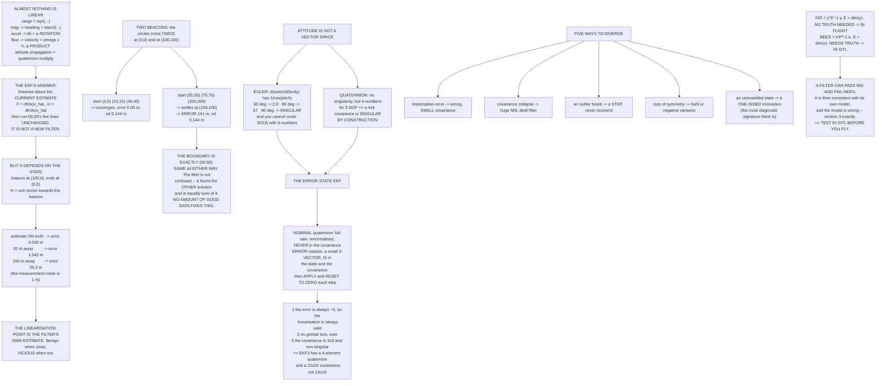

# 06.04 The extended Kalman filter: when the world is nonlinear

<!-- glance:start -->
<!-- generated by tools/build.py from curriculum/syllabus.yaml — edit the syllabus, not this block -->

| | |
|---|---|
| **Track** | Main path |
| **Difficulty** | Advanced |
| **Time** | 1 h 45 min |
| **Hardware** | none |
| **Software** | python |
| **Prerequisites** | [06.03 The Kalman filter from first principles](06.03-kalman-from-scratch.md)<br>[01.09 Attitude & orientation: frames, Euler angles, quaternions (light)](../01-flight-physics/01.09-attitude-orientation.md) |
| **Skip if** | You can linearise an attitude model, implement a small EKF, and describe how an EKF diverges. |

<!-- glance:end -->

## What you will learn

- Why almost nothing on an aircraft is a linear function of the state, with six examples from
  this course
- What a **Jacobian** is, worked on a real measurement, and why $H$ depending on the state is the
  whole difficulty
- The **basin of convergence**: an EKF settling 141 metres from the truth with a standard
  deviation of 14 centimetres
- Why **attitude is not a vector space**, demonstrated at gimbal lock
- The **error-state EKF** — what ArduPilot actually runs, and the three practical things it buys
- The five ways an EKF diverges and the log signature of each
- **NIS versus NEES**, and why a filter can pass one and fail the other

## Why it matters

[06.03](06.03-kalman-from-scratch.md) derived the optimal filter under four assumptions:
linearity, Gaussian noise, zero-mean noise, and uncorrelated process and measurement noise. A
multirotor violates the first one immediately — the attitude of a rigid body is not a vector
space, and you cannot make it one.

The extended Kalman filter's answer is almost disappointingly simple: **linearise about the
current estimate, every step, and then run the same five lines.** It is not a new filter. It is
the old filter with a fresh linearisation.

What it costs is optimality and, more importantly, **guarantees**. A linear Kalman filter is
optimal from any starting point. An EKF has a basin of convergence, and outside it the filter
does not fail loudly — it settles somewhere wrong and reports a small covariance. That failure
mode is the reason this lesson exists, and the reason
[06.06](06.06-ekf-health-and-logs.md) exists after it.

## Prerequisites

<!-- prereqs:start -->
## Prerequisites

You need these first:

- [06.03 The Kalman filter from first principles](06.03-kalman-from-scratch.md)
- [01.09 Attitude & orientation: frames, Euler angles, quaternions (light)](../01-flight-physics/01.09-attitude-orientation.md)

### Optional prerequisite links

None.

Check your readiness: `python course.py why 06.04`
<!-- prereqs:end -->

## Concept

### Why linear is not enough

| Measurement | h(x) | Where |
|---|---|---|
| Range to a beacon | $\sqrt{(x-x_b)^2+(y-y_b)^2}$ | module 13 |
| Magnetometer → heading | atan2 of a rotated vector | [05.03](../05-sensors/05.03-compass-and-baro.md) |
| Accelerometer → tilt | the rotation of a gravity vector | [05.02](../05-sensors/05.02-imu.md) |
| Optical flow → velocity | $\omega \times h$ — a **product of two states** | [05.05](../05-sensors/05.05-flow-and-rangefinders.md) |
| Attitude propagation | quaternion multiplication | [01.09](../01-flight-physics/01.09-attitude-orientation.md) |
| GNSS lat/lon → metres | a function of latitude | FGL.01 |

The EKF's answer: linearise $h$ and $f$ about the **current estimate**, at every single step:

$$\mathbf F = \left.\frac{\partial f}{\partial \mathbf x}\right|_{\hat{\mathbf x}}, \qquad
\mathbf H = \left.\frac{\partial h}{\partial \mathbf x}\right|_{\hat{\mathbf x}}$$

and then run [06.03](06.03-kalman-from-scratch.md)'s five lines unchanged. The gain, the
covariance recursion, NIS — all identical.

### A Jacobian, and what it costs to be wrong

A beacon at (100, 0), the aircraft at the origin.
$h(x,y) = \sqrt{(x-100)^2+y^2}$, so

$$\mathbf H = \left[\frac{x-100}{r},\ \frac{y}{r}\right]$$

which is **a unit vector pointing at the beacon**. Note that $\mathbf H$ **depends on the state**.
That is the whole difference from [06.03](06.03-kalman-from-scratch.md), and the whole problem:

| Estimate | Range at estimate | H | Linearisation error |
|---|---:|---|---:|
| (0, 0) | 100.000 m | [−1.000, +0.000] | **0.000 m** |
| (0, 5) | 100.125 m | [−0.999, +0.050] | −0.125 m |
| (0, 20) | 101.980 m | [−0.981, +0.196] | **−1.942 m** |
| (0, 50) | 111.803 m | [−0.894, +0.447] | −10.557 m |
| (0, 100) | 141.421 m | [−0.707, +0.707] | −29.289 m |
| (50, 100) | 111.803 m | [−0.447, +0.894] | −55.279 m |

With the estimate **on** the truth the linearisation is exact. Twenty metres away it is already
1.9 m wrong — **twice the measurement noise**. The filter is being told a lie about how the
measurement relates to the state, and nothing in the five lines can detect it.

> [!IMPORTANT]
> **An EKF is only as good as its linearisation point, and its linearisation point is its own
> estimate.** That circularity is benign when the estimate is close and vicious when it is not.

### The basin of convergence

Add a second beacon at (0, 100) so the problem becomes observable. The two range circles cross at
**(0, 0)** — the truth — and at **(100, 100)**. Run the same filter on the same data from
different starting guesses:

| Start | Settles at | Error | sd | Verdict |
|---|---|---:|---:|---|
| (0, 0) | (0.00, 0.09) | 0.09 m | 0.144 m | converged |
| (10, 10) | (0.00, 0.09) | 0.09 m | 0.144 m | converged |
| (40, 40) | (−0.03, 0.09) | 0.10 m | 0.144 m | converged |
| **(55, 55)** | **(99.91, 100.04)** | **141.39 m** | **0.144 m** | **wrong, and confident** |
| (70, 70) | (99.91, 100.02) | 141.37 m | 0.144 m | wrong, and confident |
| (120, 120) | (99.91, 100.00) | 141.36 m | 0.144 m | wrong, and confident |
| (200, 200) | (99.93, 100.03) | 141.39 m | 0.144 m | wrong, and confident |

The boundary sits exactly at (50, 50) — the midpoint between the two solutions.

> [!IMPORTANT]
> **Look at the sd column.** Every run ends with a standard deviation of **14 centimetres**,
> including the ones that settled **141 metres** away. The filter is not confused. It has found a
> perfectly good solution to the measurements — the *other* intersection — and it is exactly as
> sure of that one as of the right one.
>
> **No amount of good data fixes this.** It is decided entirely by where you started. That is why
> every production EKF cares so much about initialisation, and why ArduPilot will not arm until
> its estimate has converged.

A linear Kalman filter has **no** basin of convergence — it is optimal from any starting point,
because a linear measurement has exactly one solution. Nonlinearity is where alternatives appear.

### Attitude is not a vector space

Euler angles look like a 3-vector. They are not one. The map from body rates to Euler rates
contains $1/\cos(\text{pitch})$:

$$\begin{bmatrix}\dot\phi\\\dot\theta\\\dot\psi\end{bmatrix} =
\begin{bmatrix}1 & \sin\phi\tan\theta & \cos\phi\tan\theta\\
0 & \cos\phi & -\sin\phi\\
0 & \sin\phi/\cos\theta & \cos\phi/\cos\theta\end{bmatrix}
\begin{bmatrix}p\\q\\r\end{bmatrix}$$

| Pitch | 1/cos | Jacobian norm | |
|---:|---:|---:|---|
| 0° | 1.00 | 1.00 | fine |
| 30° | 1.15 | 1.58 | fine |
| 60° | 2.00 | 2.73 | ill-conditioned |
| 80° | 5.76 | 6.67 | ill-conditioned |
| 89° | 57.30 | 58.29 | ill-conditioned |
| 89.9° | 572.96 | 573.96 | ill-conditioned |
| **90°** | **infinite** | **singular** | **gimbal lock** |

At 90° of pitch, roll and yaw become the same rotation and the parameterisation loses a
dimension. **This is not a numerical accident.** You cannot cover the rotation group with three
numbers without a singularity somewhere — it is a topological fact about SO(3), and changing the
Euler convention only moves the singularity.

Quaternions have no singularity. But they have **four numbers for three degrees of freedom** and a
unit-norm constraint — so a 4×4 covariance for a 3-dimensional uncertainty is **singular by
construction**, and singular covariances break Kalman filters.

### The error-state EKF: what ArduPilot actually does

Split the attitude into two pieces:

- a **nominal quaternion** $\mathbf q$, carried at full rate, **never in the covariance**, always
  renormalised — it lives on the sphere where it belongs;
- an **error rotation**, a small **3-vector** $\delta\boldsymbol\theta$, which *is* in the state
  and *is* in the covariance — and three numbers for three degrees of freedom is a proper vector
  space.

After each update, the error is **applied** to the nominal and **reset to zero**:

$$\mathbf q \leftarrow \mathbf q \otimes \delta\mathbf q(\delta\boldsymbol\theta),
\qquad \delta\boldsymbol\theta \leftarrow \mathbf 0$$

| Parameterisation | States | Covariance | Singular? |
|---|---:|---:|---|
| Euler angles | 3 | 3×3 | at pitch 90° |
| Quaternion, direct | 4 | 4×4 | **always** |
| **Error-state (3-vector)** | **3** | **3×3** | **no** |

> [!IMPORTANT]
> **Three consequences, all practical.**
> 1. The linearisation is always about a **nearly-zero error**, so the linearisation error of
>    section 2 is always tiny — the circularity becomes benign by construction.
> 2. **No gimbal lock**, at any attitude.
> 3. The covariance is 3×3 and non-singular, so
>    [06.03](06.03-kalman-from-scratch.md)'s arithmetic works unchanged.
>
> This is why EKF3's 22 states include a four-element quaternion but its covariance is 22×22
> rather than 23×23: **the attitude contributes three.**

> [!TIP]
> **Ask your teacher:** "My aircraft's EKF looks perfectly healthy — all the innovation bars are
> green — and the position it reports is thirty metres from where the aircraft actually is. Walk
> me through how that is possible, what I should look at in the log to confirm it, and which of
> the five divergence modes it most likely is."

### How an EKF diverges, and how you find out

| Mode | What happens | Log signature |
|---|---|---|
| **Linearisation error** | the estimate is far from truth, so $H$ is wrong | NIS rises, then the filter settles somewhere wrong with a **small** covariance |
| **Covariance collapse** | $Q$ too small, $P$ shrinks, gain → 0 | NIS enormous, innovations large and **persistent**, estimate stops responding |
| **An outlier fused** | one bad measurement moves the estimate out of the basin | a **step** in the estimate, and it never comes back |
| **Numerical loss of symmetry** | $P$ stops being positive definite | NaNs, or a negative variance |
| **An unmodelled state** | something real that $Q$ cannot absorb | a **biased** innovation — not noisy, consistently one-sided |

The last one is the most diagnostic signature there is. Noise is two-sided; an unmodelled effect
is not. If your innovations have a mean, you are missing a state.

**Two consistency tests, and when you can use each:**

$$\text{NIS} = \mathbf y^T\mathbf S^{-1}\mathbf y, \qquad E[\text{NIS}] = \dim(\mathbf y)$$
$$\text{NEES} = \mathbf e^T\mathbf P^{-1}\mathbf e, \qquad E[\text{NEES}] = \dim(\mathbf x)$$

NIS needs **no truth** — use it in flight. NEES needs truth — use it in SITL
([10.04](../10-simulation/10.04-ardupilot-sitl.md)).

> [!IMPORTANT]
> **A filter can have a perfect NIS and a terrible NEES.** It is then consistent with its own
> model, and the model is wrong. That is exactly the confident-and-wrong case in section 3 — every
> measurement fits, because the filter found the *other* solution — and it is why SITL matters
> before flight. NIS can tell you the filter has noticed something; only NEES can tell you the
> filter is right.

## Technical explanation

### Level 1 — Intuition: a map and a straight edge

You are lost and you have a map and a straight edge. You put the straight edge down where you
*think* you are, measure a bearing, and slide yourself along it. If you were roughly right, the
straight edge is a good local approximation to the curved coastline and you converge on your
position. If you were badly wrong, the straight edge is tangent to the wrong part of the
coastline entirely, and you confidently walk to a different bay.

The straight edge is the Jacobian. Where you put it is your current estimate. That is an EKF.

### Level 2 — Practical: what this means for your aircraft

| Thing to do | Why |
|---|---|
| **Wait for the EKF before arming** | initialisation decides which basin you are in |
| Let it see **motion** before trusting position | several states are unobservable stationary ([06.01](06.01-why-estimation.md)) |
| Set `EK3_GLITCH_RAD` sensibly | an outlier that gets fused can move you out of the basin |
| Watch for **one-sided** innovations | a biased innovation means a missing state, not noise |
| Test in SITL with truth available | NEES is the only test that catches confident-and-wrong |
| Never treat "EKF healthy" as "estimate correct" | section 3 is healthy and 141 m out |

### Level 3 — Mathematics

**The EKF equations.** With $f$ and $h$ nonlinear:

$$\begin{aligned}
\hat{\mathbf x}^- &= f(\hat{\mathbf x}, \mathbf u) \\
\mathbf P^- &= \mathbf F\mathbf P\mathbf F^T + \mathbf Q,
\quad \mathbf F = \partial f/\partial\mathbf x|_{\hat{\mathbf x}}\\
\mathbf y &= \mathbf z - h(\hat{\mathbf x}^-)
&&\text{note: }h\text{, not }\mathbf H\hat{\mathbf x}\\
\mathbf S &= \mathbf H\mathbf P^-\mathbf H^T+\mathbf R,
\quad \mathbf H = \partial h/\partial\mathbf x|_{\hat{\mathbf x}^-}
\end{aligned}$$

The Jacobians appear **only** in the covariance propagation and the gain. The state itself is
propagated with the **full nonlinear** $f$ and the innovation uses the **full nonlinear** $h$ —
getting that wrong (linearising the state propagation as well) is a classic and destructive bug.

**The error-state formulation.** Write the true state as a nominal plus a small error,
$\mathbf x = \hat{\mathbf x}\oplus\delta\mathbf x$, where $\oplus$ is ordinary addition for vector
quantities and quaternion multiplication for attitude:

$$\mathbf q = \hat{\mathbf q}\otimes\begin{bmatrix}1\\ \tfrac12\delta\boldsymbol\theta\end{bmatrix}
+ O(\|\delta\boldsymbol\theta\|^2)$$

The filter estimates $\delta\mathbf x$, which is always small, so the linearisation is always
valid. Then $\hat{\mathbf x}\leftarrow\hat{\mathbf x}\oplus\delta\hat{\mathbf x}$ and
$\delta\hat{\mathbf x}\leftarrow\mathbf 0$. Because the reset changes the point about which the
error is defined, a strictly correct implementation also applies a small **reset Jacobian** to
$\mathbf P$; ArduPilot does this, and ignoring it is a slow, subtle source of inconsistency.

**Linearisation error.** For a scalar $h$, Taylor's theorem gives

$$h(\mathbf x) = h(\hat{\mathbf x}) + \mathbf H\,\delta\mathbf x
+ \tfrac12\,\delta\mathbf x^T\nabla^2h\,\delta\mathbf x + \dots$$

so the error is second order in $\|\delta\mathbf x\|$ and proportional to the **curvature** of
$h$. For the range measurement, the curvature is $1/r$ perpendicular to the line of sight — which
is why a distant beacon linearises well and a near one does not, and why optical flow (curvature
$\propto 1/h$) is worst at low altitude, where you use it.

### Level 4 — Implementation: a checklist for a nonlinear filter

1. Propagate the state with the **full nonlinear** $f$; use $\mathbf F$ only for $\mathbf P$.
2. Compute the innovation with the **full nonlinear** $h$.
3. Verify every Jacobian numerically:
   $\mathbf H_{ij}\approx (h_i(\mathbf x+\epsilon\mathbf e_j)-h_i(\mathbf x-\epsilon\mathbf e_j))/2\epsilon$.
   This catches more bugs than any other single check.
4. Use an **error-state** formulation for anything on a manifold.
5. Use the **Joseph form** and force $\mathbf P$ symmetric each step.
6. **Gate the innovations**: reject any measurement with NIS above a threshold, and log the
   rejections.
7. Log NIS always; compute NEES in SITL.
8. Test initialisation deliberately, from several starting points, and find your basin.

## Diagram



## Code

Save as `ekf.py` and run `python ekf.py`. Standard library only.

```python
"""06.04 - the extended Kalman filter: linearise, and know when that fails."""
import math
import random

G = 9.81
BEACON = (100.0, 0.0)     # a ranging beacon 100 m east
BEACONS = [(100.0, 0.0), (0.0, 100.0)]   # two beacons make it observable
R_RANGE = 1.0             # m^2, range measurement variance
TRUE_POS = (0.0, 0.0)


def rng(p, b=BEACON):
    return math.hypot(p[0] - b[0], p[1] - b[1])


def jac_range(p, b=BEACON):
    """H = d(range)/d(x, y), evaluated AT THE ESTIMATE."""
    r = rng(p, b)
    return ((p[0] - b[0]) / r, (p[1] - b[1]) / r)


def lin_error(p_hat, p_true, b=BEACON):
    """How wrong the linear prediction of the measurement is."""
    h = jac_range(p_hat, b)
    predicted = rng(p_hat, b) + h[0] * (p_true[0] - p_hat[0]) \
        + h[1] * (p_true[1] - p_hat[1])
    return predicted - rng(p_true, b)


# ---------------------------------------------------------------- attitude
def euler_to_quat(r, p, y):
    cr, sr = math.cos(r / 2), math.sin(r / 2)
    cp, sp = math.cos(p / 2), math.sin(p / 2)
    cy, sy = math.cos(y / 2), math.sin(y / 2)
    return (cr * cp * cy + sr * sp * sy, sr * cp * cy - cr * sp * sy,
            cr * sp * cy + sr * cp * sy, cr * cp * sy - sr * sp * cy)


def euler_rates_jac(roll, pitch):
    """d(euler rates)/d(body rates). It SINGULARISES at pitch = +-90 deg."""
    cp = math.cos(pitch)
    if abs(cp) < 1e-12:
        return None
    tp, sr, cr = math.tan(pitch), math.sin(roll), math.cos(roll)
    return [[1.0, sr * tp, cr * tp],
            [0.0, cr, -sr],
            [0.0, sr / cp, cr / cp]]


def jac_norm(j):
    return max(sum(abs(v) for v in row) for row in j)


# ------------------------------------------------------------- the filters
def run_ekf(p0, n=200, seed=20260923, p_var=100.0, q=1e-4):
    """Estimate a STATIONARY 2-D position from ranges to TWO beacons.

    Two ranges make the problem observable -- but the two circles cross in
    TWO places, and an EKF converges to whichever one it started nearer.
    """
    rnd = random.Random(seed)
    x = list(p0)
    p = [[p_var, 0.0], [0.0, p_var]]
    for _ in range(n):
        p[0][0] += q
        p[1][1] += q
        for b in BEACONS:
            z = rng(TRUE_POS, b) + rnd.gauss(0, math.sqrt(R_RANGE))
            h = jac_range(tuple(x), b)
            y = z - rng(tuple(x), b)
            ph = [p[0][0] * h[0] + p[0][1] * h[1],
                  p[1][0] * h[0] + p[1][1] * h[1]]
            s_ = h[0] * ph[0] + h[1] * ph[1] + R_RANGE
            k = [ph[0] / s_, ph[1] / s_]
            x = [x[0] + k[0] * y, x[1] + k[1] * y]
            p = [[p[0][0] - k[0] * ph[0], p[0][1] - k[0] * ph[1]],
                 [p[1][0] - k[1] * ph[0], p[1][1] - k[1] * ph[1]]]
    return math.hypot(x[0] - TRUE_POS[0], x[1] - TRUE_POS[1]), x, p


def bar(t):
    print("\n" + "=" * 70)
    print(t)
    print("=" * 70)


if __name__ == "__main__":
    bar("1. WHY LINEAR IS NOT ENOUGH")
    print("  06.03 assumed z = Hx: the measurement is a LINEAR function of")
    print("  the state. Almost nothing on an aircraft is.")
    nonlin = [
        ("range to a beacon", "sqrt((x-xb)^2 + (y-yb)^2)", "13.x"),
        ("magnetometer -> heading", "atan2 of a rotated vector", "05.03"),
        ("accelerometer -> tilt", "the rotation of a gravity vector", "05.02"),
        ("optical flow -> velocity", "omega x h, a PRODUCT of two states",
         "05.05"),
        ("attitude propagation", "quaternion multiplication", "01.09"),
        ("GNSS lat/lon -> metres", "a function of latitude", "FGL.01"),
    ]
    print(f"  {'measurement':28s} {'h(x)':38s} where")
    for a, b, c in nonlin:
        print(f"  {a:28s} {b:38s} {c}")
    print("  THE EKF'S ANSWER: linearise h and f about the CURRENT")
    print("  ESTIMATE, at every single step, and then run 06.03 unchanged.")
    print("      F = df/dx |x_hat,      H = dh/dx |x_hat")
    print("  Everything else -- the five lines, the gain, NIS -- is the")
    print("  same. The EKF is not a new filter. It is the old filter with")
    print("  a fresh linearisation every step.")

    bar("2. A JACOBIAN, AND WHAT IT COSTS TO BE WRONG")
    print(f"  A beacon at {BEACON}, the aircraft at {TRUE_POS}.")
    print("  h(x,y) = sqrt((x-100)^2 + y^2), so")
    print("  H = [ (x-100)/r , y/r ] -- A UNIT VECTOR TOWARDS THE BEACON.")
    print("  Note that H DEPENDS ON THE STATE. That is the whole")
    print("  difference, and the whole problem.")
    print(f"\n  {'estimate':>18s} {'range at est':>13s} {'H':>22s}"
          f" {'linearisation err':>18s}")
    for est in ((0.0, 0.0), (0.0, 5.0), (0.0, 20.0), (0.0, 50.0),
                (0.0, 100.0), (50.0, 100.0)):
        h = jac_range(est)
        print(f"  {str(est):>18s} {rng(est):11.3f} m"
              f"  [{h[0]:+.3f}, {h[1]:+.3f}]"
              f" {lin_error(est, TRUE_POS):15.3f} m")
    print("  With the estimate ON the truth, the linearisation is exact.")
    print("  20 m away it is already 2 m wrong -- TWICE the measurement")
    print("  noise. The filter is being told a lie about how the")
    print("  measurement relates to the state, and it has no way to know.")

    bar("3. THE BASIN OF CONVERGENCE")
    print("  Same filter, same data, different STARTING GUESSES:")
    print(f"  Beacons at {BEACONS[0]} and {BEACONS[1]}, truth at"
          f" {TRUE_POS}.")
    print(f"  The two range circles cross at {TRUE_POS} AND at (100, 100).")
    print(f"  {'start':>20s} {'settles at':>22s} {'error':>10s}"
          f" {'sd':>8s}  verdict")
    for start in ((0.0, 0.0), (10.0, 10.0), (40.0, 40.0), (55.0, 55.0),
                  (70.0, 70.0), (120.0, 120.0), (200.0, 200.0)):
        err, x, p = run_ekf(start)
        sd = math.sqrt(max(p[0][0] + p[1][1], 0.0))
        v = "converged" if err < 3.0 else "WRONG, and CONFIDENT"
        print(f"  {str(start):>20s} ({x[0]:8.2f},{x[1]:8.2f}) {err:8.2f} m"
              f" {sd:7.3f} m  {v}")
    print("  A LINEAR Kalman filter has NO basin of convergence: it is")
    print("  optimal from any starting point. An EKF has one, and outside")
    print("  it the filter settles somewhere wrong WITH A SMALL")
    print("  COVARIANCE. That is the characteristic EKF failure: not")
    print("  noise, not wandering -- confident and wrong.")
    print("  LOOK AT THE sd COLUMN. Every run ends with a covariance of")
    print("  well under a metre, including the ones that settled a HUNDRED")
    print("  AND FORTY METRES away. The filter is not confused. It has")
    print("  found a perfectly good solution to the measurements -- the")
    print("  OTHER intersection of the two circles -- and it is as sure of")
    print("  that one as of the right one.")
    print("  NO AMOUNT OF GOOD DATA FIXES THIS. It is decided entirely by")
    print("  where you started, which is why every production EKF cares so")
    print("  much about initialisation, and why ArduPilot will not arm")
    print("  until its estimate has converged.")

    bar("4. ATTITUDE IS NOT A VECTOR SPACE")
    print("  Euler angles look like a 3-vector and are not one. The map")
    print("  from body rates to Euler rates contains 1/cos(pitch):")
    print(f"  {'pitch':>8s} {'1/cos':>12s} {'Jacobian norm':>15s}  state")
    for pd in (0, 30, 60, 80, 89, 89.9, 90):
        j = euler_rates_jac(0.0, math.radians(pd))
        if j is None:
            print(f"  {pd:6.1f} d {'infinite':>12s} {'SINGULAR':>15s}"
                  f"  GIMBAL LOCK")
            continue
        print(f"  {pd:6.1f} d {1 / math.cos(math.radians(pd)):12.2f}"
              f" {jac_norm(j):15.2f}  "
              f"{'fine' if pd < 60 else 'ill-conditioned'}")
    print("  At 90 degrees of pitch, roll and yaw become the same rotation")
    print("  and the parameterisation loses a dimension. This is not a")
    print("  numerical accident -- you cannot cover the rotation group with")
    print("  three numbers without a singularity somewhere.")
    print("\n  QUATERNIONS have no singularity, but they have FOUR numbers")
    print("  for THREE degrees of freedom, and a unit-norm constraint. A")
    print("  4x4 covariance for a 3-dimensional uncertainty is singular by")
    print("  construction, and singular covariances break Kalman filters.")

    bar("5. THE ERROR-STATE EKF: WHAT ARDUPILOT ACTUALLY DOES")
    print("  Split the attitude into two pieces:")
    print("    a NOMINAL quaternion q, carried at full rate, never in the")
    print("      covariance, always renormalised -- it lives on the sphere")
    print("    an ERROR rotation, a small 3-VECTOR, which IS in the state")
    print("      and IS in the covariance -- and 3 numbers for 3 degrees")
    print("      of freedom is a proper vector space")
    print("  After each update the error is APPLIED to the nominal and")
    print("  RESET to zero, so the linearisation point is always the")
    print("  current best estimate and the error is always small.")
    print(f"\n  {'':28s} {'states':>8s} {'covariance':>12s} {'singular?':>11s}")
    for what, n, sing in (("Euler angles", 3, "at pitch 90"),
                          ("quaternion, direct", 4, "ALWAYS"),
                          ("error-state (3-vector)", 3, "no")):
        print(f"  {what:28s} {n:8d} {str(n) + 'x' + str(n):>12s} {sing:>11s}")
    print("  THREE CONSEQUENCES, AND THEY ARE ALL PRACTICAL:")
    print("   1 the linearisation is always about a nearly-zero error, so")
    print("     section 2's linearisation error is always tiny")
    print("   2 no gimbal lock, at any attitude")
    print("   3 the covariance is 3x3 and non-singular, so the arithmetic")
    print("     in 06.03 works unchanged")
    print("  This is why EKF3's 22 states include a 4-element quaternion")
    print("  but its covariance is 22x22 rather than 23x23: the attitude")
    print("  contributes THREE.")

    bar("6. HOW AN EKF DIVERGES, AND HOW YOU FIND OUT")
    modes = [
        ("linearisation error", "the estimate is far from truth, so H is",
         "wrong -- section 2. Symptom: NIS rises, then the filter settles",
         "somewhere wrong with a SMALL covariance"),
        ("covariance collapse", "Q too small, P shrinks, gain -> 0",
         "Symptom: NIS enormous, innovations large and persistent,",
         "estimate stops responding (06.03 section 6)"),
        ("an outlier fused", "one bad measurement moves the estimate out",
         "of the basin. Symptom: a step in the estimate, then it never",
         "comes back. THIS is why 06.06's rejection gates exist"),
        ("numerical loss of symmetry", "P stops being positive definite",
         "Symptom: NaNs, or a negative variance. Fix: the Joseph form,",
         "or a square-root filter"),
        ("an unmodelled state", "something real that Q cannot absorb",
         "Symptom: a BIASED innovation -- not noisy, consistently",
         "one-sided. The most diagnostic signature there is"),
    ]
    for name, a, b, c in modes:
        print(f"  {name.upper()}")
        print(f"      {a}")
        print(f"      {b}")
        print(f"      {c}")
    print("\n  TWO CONSISTENCY TESTS, AND WHEN YOU CAN USE EACH:")
    print("    NIS  = y' S^-1 y      needs NO truth. Use it in flight.")
    print("                          E[NIS] = dim(y)")
    print("    NEES = e' P^-1 e      needs TRUTH. Use it in SITL (10.04).")
    print("                          E[NEES] = dim(x)")
    print("  A filter can have a perfect NIS and a terrible NEES: it is")
    print("  then CONSISTENT WITH ITS OWN MODEL and the model is wrong.")
    print("  That is exactly the confident-and-wrong case in section 3,")
    print("  and it is why SITL matters before flight.")
```

Output:

```text

======================================================================
1. WHY LINEAR IS NOT ENOUGH
======================================================================
  06.03 assumed z = Hx: the measurement is a LINEAR function of
  the state. Almost nothing on an aircraft is.
  measurement                  h(x)                                   where
  range to a beacon            sqrt((x-xb)^2 + (y-yb)^2)              13.x
  magnetometer -> heading      atan2 of a rotated vector              05.03
  accelerometer -> tilt        the rotation of a gravity vector       05.02
  optical flow -> velocity     omega x h, a PRODUCT of two states     05.05
  attitude propagation         quaternion multiplication              01.09
  GNSS lat/lon -> metres       a function of latitude                 FGL.01
  THE EKF'S ANSWER: linearise h and f about the CURRENT
  ESTIMATE, at every single step, and then run 06.03 unchanged.
      F = df/dx |x_hat,      H = dh/dx |x_hat
  Everything else -- the five lines, the gain, NIS -- is the
  same. The EKF is not a new filter. It is the old filter with
  a fresh linearisation every step.

======================================================================
2. A JACOBIAN, AND WHAT IT COSTS TO BE WRONG
======================================================================
  A beacon at (100.0, 0.0), the aircraft at (0.0, 0.0).
  h(x,y) = sqrt((x-100)^2 + y^2), so
  H = [ (x-100)/r , y/r ] -- A UNIT VECTOR TOWARDS THE BEACON.
  Note that H DEPENDS ON THE STATE. That is the whole
  difference, and the whole problem.

            estimate  range at est                      H  linearisation err
          (0.0, 0.0)     100.000 m  [-1.000, +0.000]           0.000 m
          (0.0, 5.0)     100.125 m  [-0.999, +0.050]          -0.125 m
         (0.0, 20.0)     101.980 m  [-0.981, +0.196]          -1.942 m
         (0.0, 50.0)     111.803 m  [-0.894, +0.447]         -10.557 m
        (0.0, 100.0)     141.421 m  [-0.707, +0.707]         -29.289 m
       (50.0, 100.0)     111.803 m  [-0.447, +0.894]         -55.279 m
  With the estimate ON the truth, the linearisation is exact.
  20 m away it is already 2 m wrong -- TWICE the measurement
  noise. The filter is being told a lie about how the
  measurement relates to the state, and it has no way to know.

======================================================================
3. THE BASIN OF CONVERGENCE
======================================================================
  Same filter, same data, different STARTING GUESSES:
  Beacons at (100.0, 0.0) and (0.0, 100.0), truth at (0.0, 0.0).
  The two range circles cross at (0.0, 0.0) AND at (100, 100).
                 start             settles at      error       sd  verdict
            (0.0, 0.0) (    0.00,    0.09)     0.09 m   0.144 m  converged
          (10.0, 10.0) (    0.00,    0.09)     0.09 m   0.144 m  converged
          (40.0, 40.0) (   -0.03,    0.09)     0.10 m   0.144 m  converged
          (55.0, 55.0) (   99.91,  100.04)   141.39 m   0.144 m  WRONG, and CONFIDENT
          (70.0, 70.0) (   99.91,  100.02)   141.37 m   0.144 m  WRONG, and CONFIDENT
        (120.0, 120.0) (   99.91,  100.00)   141.36 m   0.144 m  WRONG, and CONFIDENT
        (200.0, 200.0) (   99.93,  100.03)   141.39 m   0.144 m  WRONG, and CONFIDENT
  A LINEAR Kalman filter has NO basin of convergence: it is
  optimal from any starting point. An EKF has one, and outside
  it the filter settles somewhere wrong WITH A SMALL
  COVARIANCE. That is the characteristic EKF failure: not
  noise, not wandering -- confident and wrong.
  LOOK AT THE sd COLUMN. Every run ends with a covariance of
  well under a metre, including the ones that settled a HUNDRED
  AND FORTY METRES away. The filter is not confused. It has
  found a perfectly good solution to the measurements -- the
  OTHER intersection of the two circles -- and it is as sure of
  that one as of the right one.
  NO AMOUNT OF GOOD DATA FIXES THIS. It is decided entirely by
  where you started, which is why every production EKF cares so
  much about initialisation, and why ArduPilot will not arm
  until its estimate has converged.

======================================================================
4. ATTITUDE IS NOT A VECTOR SPACE
======================================================================
  Euler angles look like a 3-vector and are not one. The map
  from body rates to Euler rates contains 1/cos(pitch):
     pitch        1/cos   Jacobian norm  state
     0.0 d         1.00            1.00  fine
    30.0 d         1.15            1.58  fine
    60.0 d         2.00            2.73  ill-conditioned
    80.0 d         5.76            6.67  ill-conditioned
    89.0 d        57.30           58.29  ill-conditioned
    89.9 d       572.96          573.96  ill-conditioned
    90.0 d     infinite        SINGULAR  GIMBAL LOCK
  At 90 degrees of pitch, roll and yaw become the same rotation
  and the parameterisation loses a dimension. This is not a
  numerical accident -- you cannot cover the rotation group with
  three numbers without a singularity somewhere.

  QUATERNIONS have no singularity, but they have FOUR numbers
  for THREE degrees of freedom, and a unit-norm constraint. A
  4x4 covariance for a 3-dimensional uncertainty is singular by
  construction, and singular covariances break Kalman filters.

======================================================================
5. THE ERROR-STATE EKF: WHAT ARDUPILOT ACTUALLY DOES
======================================================================
  Split the attitude into two pieces:
    a NOMINAL quaternion q, carried at full rate, never in the
      covariance, always renormalised -- it lives on the sphere
    an ERROR rotation, a small 3-VECTOR, which IS in the state
      and IS in the covariance -- and 3 numbers for 3 degrees
      of freedom is a proper vector space
  After each update the error is APPLIED to the nominal and
  RESET to zero, so the linearisation point is always the
  current best estimate and the error is always small.

                                 states   covariance   singular?
  Euler angles                        3          3x3 at pitch 90
  quaternion, direct                  4          4x4      ALWAYS
  error-state (3-vector)              3          3x3          no
  THREE CONSEQUENCES, AND THEY ARE ALL PRACTICAL:
   1 the linearisation is always about a nearly-zero error, so
     section 2's linearisation error is always tiny
   2 no gimbal lock, at any attitude
   3 the covariance is 3x3 and non-singular, so the arithmetic
     in 06.03 works unchanged
  This is why EKF3's 22 states include a 4-element quaternion
  but its covariance is 22x22 rather than 23x23: the attitude
  contributes THREE.

======================================================================
6. HOW AN EKF DIVERGES, AND HOW YOU FIND OUT
======================================================================
  LINEARISATION ERROR
      the estimate is far from truth, so H is
      wrong -- section 2. Symptom: NIS rises, then the filter settles
      somewhere wrong with a SMALL covariance
  COVARIANCE COLLAPSE
      Q too small, P shrinks, gain -> 0
      Symptom: NIS enormous, innovations large and persistent,
      estimate stops responding (06.03 section 6)
  AN OUTLIER FUSED
      one bad measurement moves the estimate out
      of the basin. Symptom: a step in the estimate, then it never
      comes back. THIS is why 06.06's rejection gates exist
  NUMERICAL LOSS OF SYMMETRY
      P stops being positive definite
      Symptom: NaNs, or a negative variance. Fix: the Joseph form,
      or a square-root filter
  AN UNMODELLED STATE
      something real that Q cannot absorb
      Symptom: a BIASED innovation -- not noisy, consistently
      one-sided. The most diagnostic signature there is

  TWO CONSISTENCY TESTS, AND WHEN YOU CAN USE EACH:
    NIS  = y' S^-1 y      needs NO truth. Use it in flight.
                          E[NIS] = dim(y)
    NEES = e' P^-1 e      needs TRUTH. Use it in SITL (10.04).
                          E[NEES] = dim(x)
  A filter can have a perfect NIS and a terrible NEES: it is
  then CONSISTENT WITH ITS OWN MODEL and the model is wrong.
  That is exactly the confident-and-wrong case in section 3,
  and it is why SITL matters before flight.
```

## Exercise

> [!WARNING]
> The failure mode in this lesson is the dangerous one: a diverged EKF flies the aircraft
> confidently to the wrong place. Do every experiment in
> [SITL](../10-simulation/10.04-ardupilot-sitl.md) where you have truth to compare against, and
> never test estimator changes in an automatic mode on a real aircraft. If you must fly, fly in a
> manual stabilised mode with the aircraft in sight and a way to take control instantly.

### Exercise 06.04-E1 — Verify a Jacobian numerically `[coding]`

1. For the range measurement, compute $\mathbf H$ analytically and by central differences.
2. Show they agree to the expected order in $\epsilon$, and find the $\epsilon$ at which rounding
   error takes over.
3. Now do the same for the optical-flow measurement $v = \omega h$, which has **two** states.
4. State why numerical Jacobian verification catches more bugs than reading the algebra.

### Exercise 06.04-E2 — Map your own basin `[coding]`

1. Using the two-beacon script, sweep the starting guess over a grid and colour each point by
   whether it converged.
2. Confirm the boundary is the perpendicular bisector of the two solutions.
3. Now add a third beacon that breaks the symmetry and re-run. Report what happens to the basin.
4. Relate this to why an aircraft's EKF needs a good initial position and heading.

### Exercise 06.04-E3 — Find gimbal lock in a real log `[analysis]`

1. From a log containing an aggressive manoeuvre, plot pitch against time.
2. Compute $1/\cos(\text{pitch})$ throughout and report the maximum.
3. State how close you came to the singularity, and what that would have done to a Euler-based
   filter.
4. Confirm from the log that the autopilot's attitude was continuous through the manoeuvre, and
   explain why.

### Exercise 06.04-E4 — NIS and NEES together `[coding]`

1. In your two-beacon filter, compute both NIS and NEES throughout each run.
2. Tabulate them for a converged run and for a diverged one.
3. Report the pair of values for each, and state which test caught the divergence.
4. Explain, in one sentence, what that implies about relying on in-flight health indicators.

## Expected result

- **06.04-E1:** agreement to about $\epsilon^2$ down to $\epsilon \approx 10^{-6}$, then rounding
  error grows as $1/\epsilon$ — the classic V-shaped error curve with a minimum near
  $\sqrt{\epsilon_{machine}}$.
- **06.04-E2:** a clean half-plane boundary through (50, 50). A third beacon removes the
  ambiguity entirely, because three circles meet at one point — which is precisely why GNSS uses
  four satellites and not two.
- **06.04-E3:** typical multirotor flight stays under 45° of pitch, where $1/\cos$ is 1.4 and
  harmless. An aggressive dive or a tumble can reach 80°+, where it is 5.8 and rising fast. The
  autopilot's attitude stays continuous because it is **not** using Euler angles internally.
- **06.04-E4:** the converged run has NIS ≈ 1 and NEES ≈ 2 (two states). The diverged run has
  **NIS ≈ 1 as well** and NEES in the thousands. Only NEES catches it — and NEES is the one you
  cannot compute in flight.

## Troubleshooting

### Symptom: the filter works in simulation and diverges on the aircraft

Check your initialisation. In simulation you probably start the filter at the truth, which puts
you in the basin by construction. On the aircraft the initial position, heading and biases all
come from somewhere less reliable. Test explicitly from several deliberately poor starting
points.

### Symptom: the covariance goes negative or the filter produces NaN

Numerical loss of positive definiteness. Use the Joseph form, force
$\mathbf P \leftarrow \frac12(\mathbf P+\mathbf P^T)$ each step, and consider a square-root
formulation. It usually shows up first in the least observable state.

### Symptom: the innovations are not noise — they have a mean

You are missing a state. Noise is two-sided; an unmodelled physical effect is not. Common culprits
on a multirotor are wind (if you are not estimating it), a scale error on a sensor, and a lever
arm you have not entered ([04.02](../04-frame-and-assembly/04.02-mass-and-center-of-mass.md)'s
`INS_POS1_*`). Adding $Q$ hides the symptom and does not fix it.

### Symptom: the attitude estimate jumps near vertical

You are using Euler angles somewhere. The autopilot's internal estimate does not, but your
analysis script might, and so might a logging conversion. Work in quaternions and convert to Euler
only for display.

### Symptom: the estimate takes a step and never recovers

An outlier was fused and moved you out of the basin. Tighten the innovation gate
(`EK3_GLITCH_RAD` and friends), and log rejections so you can see how often it happens. A filter
that never rejects anything is not safe; a filter that rejects everything has diverged.

### Symptom: everything is green and the aircraft is in the wrong place

That is section 3. The health indicators are NIS-based, and NIS is consistent in *both* basins.
Cross-check against an independent source — GNSS position against a known landmark, heading
against a compass you hold yourself — and in future test with NEES in SITL.

## Common mistakes

- **Linearising the state propagation.** Propagate with the full nonlinear $f$; the Jacobian is
  only for $\mathbf P$.
- **Computing the innovation as $\mathbf z - \mathbf H\hat{\mathbf x}$.** It is
  $\mathbf z - h(\hat{\mathbf x})$.
- **Deriving Jacobians by hand and not checking them numerically.** Central differences take five
  minutes and catch most sign errors.
- **Putting a quaternion directly in the covariance.** Four numbers for three degrees of freedom
  makes $\mathbf P$ singular by construction.
- **Using Euler angles in a filter.** There is always a singularity; moving the convention only
  moves it.
- **Treating "EKF healthy" as "estimate correct".** Section 3 is healthy and 141 m out.
- **Ignoring the covariance reset after applying an error state.** A small, slow source of
  inconsistency that is very hard to find later.
- **Adding $Q$ to hide a biased innovation.** A one-sided innovation means a missing state.
- **Never testing initialisation.** The basin is decided entirely by where you start.

## Knowledge check

<details>
<summary>What exactly does an EKF do differently from a linear Kalman filter, and what does it keep?</summary>

It **linearises $f$ and $h$ about the current estimate at every step**, using the Jacobians
$\mathbf F = \partial f/\partial\mathbf x$ and $\mathbf H = \partial h/\partial\mathbf x$
evaluated at $\hat{\mathbf x}$. It keeps everything else: the five lines, the gain
$\mathbf K = \mathbf P\mathbf H^T\mathbf S^{-1}$, the covariance recursion, NIS. The state is
still propagated with the **full nonlinear** $f$ and the innovation still uses the **full
nonlinear** $h$ — the Jacobians appear only in the covariance and the gain.
</details>

<details>
<summary>Your estimate is 20 m from the truth and the measurement noise is 1 m. Why is that a problem beyond the obvious?</summary>

Because the **linearisation error is 1.9 m** — nearly twice the measurement noise. The filter is
computing $\mathbf H$ at the wrong point, so it has a wrong model of how the measurement relates
to the state, and the five lines have no way to detect that. Worse, the filter's confidence is
unaffected: $\mathbf S = \mathbf H\mathbf P\mathbf H^T + \mathbf R$ says nothing about whether
$\mathbf H$ itself is right.
</details>

<details>
<summary>Two range beacons, two circles, two intersections. What does the EKF do, and what does it report?</summary>

It converges to **whichever intersection it started nearer**, with the boundary at the
perpendicular bisector — here, exactly (50, 50). And it reports the **same standard deviation,
0.144 m, either way**. So a filter that settled 141 m from the truth is reporting 14 cm of
uncertainty and every measurement fits it perfectly. This is the characteristic EKF failure: not
noisy, not wandering — **confident and wrong**, decided entirely by initialisation.
</details>

<details>
<summary>Why can you not simply use Euler angles and be careful near vertical?</summary>

Because the problem is topological, not numerical. The map from body rates to Euler rates contains
$1/\cos(\text{pitch})$, which is 2.0 at 60°, 57 at 89° and **singular at 90°** — and no choice of
Euler convention removes the singularity, it only moves it. You cannot cover the rotation group
SO(3) with three numbers without one. "Being careful" means the filter is ill-conditioned long
before it is singular: at 80° the Jacobian norm is already 6.7.
</details>

<details>
<summary>Quaternions have no singularity. Why not just put one in the state vector?</summary>

Because a quaternion has **four numbers for three degrees of freedom**, constrained to unit norm.
A 4×4 covariance describing a 3-dimensional uncertainty is **singular by construction**, and a
Kalman filter inverts covariance-like quantities. The fix is the **error-state** formulation: keep
the nominal quaternion outside the covariance and estimate a **3-vector error rotation** inside
it, applying and resetting it each step. That is why EKF3 carries a 4-element quaternion and a
22×22 covariance rather than 23×23.
</details>

<details>
<summary>Name the three practical benefits of the error-state formulation.</summary>

**(1)** The error is always nearly zero, so the linearisation point is always the current best
estimate and the linearisation error is always tiny — the circularity of section 2 becomes benign
by construction. **(2)** No gimbal lock, at any attitude, because the nominal quaternion carries
the full rotation. **(3)** The covariance is 3×3 and non-singular, so
[06.03](06.03-kalman-from-scratch.md)'s arithmetic works unchanged.
</details>

<details>
<summary>What is the difference between NIS and NEES, and why does it matter that only one is available in flight?</summary>

**NIS** = $\mathbf y^T\mathbf S^{-1}\mathbf y$ measures whether the innovations are as large as the
filter expected — it needs **no truth** and works in flight, with
$E[\text{NIS}]=\dim(\mathbf y)$. **NEES** = $\mathbf e^T\mathbf P^{-1}\mathbf e$ measures whether
the *error* is as large as the covariance claims — it needs **truth**, so it only works in SITL,
with $E[\text{NEES}]=\dim(\mathbf x)$. It matters because a filter can pass NIS and fail NEES: it
is then consistent with its own model and the model is wrong — precisely the diverged case in
section 3, where every measurement fits the wrong solution perfectly. **Only NEES catches
confident-and-wrong, and NEES is the one you cannot compute in flight.**
</details>

## Practical challenge

Add an **EKF section to `docs/estimation.md`**.

1. Your aircraft's nonlinear measurements, with the Jacobian written out for at least two of
   them.
2. Your numerical Jacobian verification for each, with the $\epsilon$ you used.
3. Your basin map from E2, and one sentence on what it implies for your arming procedure.
4. Your maximum $1/\cos(\text{pitch})$ from a real log, and whether it would have troubled a Euler
   filter.
5. Your NIS and NEES results from E4, converged and diverged.
6. **Your five divergence modes**, each with the specific log channel you would look at first.

That last item is the one [06.06](06.06-ekf-health-and-logs.md) will turn into a procedure.

## You can skip this if

You can explain what an EKF changes and what it keeps, derive a Jacobian for a nonlinear
measurement and verify it numerically, quantify linearisation error and say when it exceeds the
measurement noise, demonstrate an EKF converging confidently to a wrong solution and explain why
the covariance does not warn you, explain why attitude cannot be carried as a vector and why a
quaternion cannot go directly in the covariance, describe the error-state formulation and its
three benefits, list the divergence modes with their log signatures, and distinguish NIS from
NEES.

## Go deeper

- [01.09](../01-flight-physics/01.09-attitude-orientation.md) (earlier): rotations, quaternions
  and why Euler angles are a display format.
- [06.03](06.03-kalman-from-scratch.md) (earlier): the five lines this lesson linearises around.
- [06.05](06.05-ekf3-in-ardupilot.md) (next): all of this, in production, with 22 states and
  three lanes.
- [06.06](06.06-ekf-health-and-logs.md) (later): the divergence signatures, as log channels.
- [10.04](../10-simulation/10.04-ardupilot-sitl.md) (later): where you can compute NEES.
- The extended Kalman filter and its consistency problems:
  https://en.wikipedia.org/wiki/Extended_Kalman_filter
- Sola's *Quaternion kinematics for the error-state Kalman filter* — the standard reference for
  section 5: https://arxiv.org/abs/1711.02508

## Progress checkpoint

Run `python course.py complete 06.04` when your Jacobians are verified and your basin is mapped.
Next: [06.05](06.05-ekf3-in-ardupilot.md) — the same ideas, in the code that is actually flying
your aircraft, with the parameter names attached.
