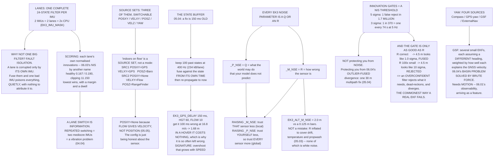

# 06.05 ArduPilot's EKF3: the production estimator

<!-- glance:start -->
<!-- generated by tools/build.py from curriculum/syllabus.yaml — edit the syllabus, not this block -->

| | |
|---|---|
| **Track** | Main path |
| **Difficulty** | Advanced |
| **Time** | 1 h 45 min |
| **Hardware** | none |
| **Software** | ardupilot |
| **Prerequisites** | [06.04 The extended Kalman filter: when the world is nonlinear](06.04-ekf-nonlinear.md)<br>[05.06 Noise, bias, drift — and the calibration procedures that fix them](../05-sensors/05.06-noise-bias-and-calibration.md) |
| **Skip if** | You can describe EKF3's lanes, what each sensor contributes, and the order in which measurements are fused. |

<!-- glance:end -->

## What you will learn

- **Lanes**: why EKF3 runs one complete filter per IMU instead of fusing them, and what that
  costs
- How a lane is scored and when the primary switches — and why a lane switch in a log is
  information, not an error
- **Source sets**: why "indoors on optical flow" is a configuration rather than a mode
- The **state buffer**, and why a 150 ms GNSS delay makes EKF3 fuse measurements into the past
- Every `EK3_*_NSE` parameter translated into
  [06.03](06.03-kalman-from-scratch.md)'s $Q$ and $R$
- **Innovation gates**: what they are really protecting you from, and how an overconfident filter
  rejects the measurements it needs
- The four ways to get yaw, including the one that needs no compass at all

## Why it matters

Four lessons of theory arrive here. EKF3 is [06.04](06.04-ekf-nonlinear.md)'s error-state
extended Kalman filter, with [06.03](06.03-kalman-from-scratch.md)'s $Q$ and $R$ exposed as
parameters, carrying [06.01](06.01-why-estimation.md)'s 22 states, and it is running on your
aircraft right now.

The practical value of this lesson is that **every knob has a meaning you already know**. There
are about forty `EK3_*` parameters and they look like a wall. They are not: roughly a dozen are
$Q$, a dozen are $R$, half a dozen are innovation gates, a handful are measurement delays, and the
rest choose which sensor feeds which state. Once you see that, the wall becomes a short list.

And the failure modes are the ones you have already met — an outlier fused, a covariance
collapsed, a linearisation point out of its basin — wearing production names.

## Prerequisites

<!-- prereqs:start -->
## Prerequisites

You need these first:

- [06.04 The extended Kalman filter: when the world is nonlinear](06.04-ekf-nonlinear.md)
- [05.06 Noise, bias, drift — and the calibration procedures that fix them](../05-sensors/05.06-noise-bias-and-calibration.md)

### Optional prerequisite links

None.

Check your readiness: `python course.py why 06.05`
<!-- prereqs:end -->

## Concept

### Lanes: one whole filter per IMU

EKF3 does **not** fuse several IMUs into one filter. It runs one complete 24-state filter per IMU
— a **lane** — and selects a primary.

| IMUs | Lanes | States carried | Covariance terms | CPU |
|---:|---:|---:|---:|---:|
| 1 | 1 | 24 | 576 | 1× |
| 2 | 2 | 48 | 1,152 | 2× |
| 3 | 3 | 72 | 1,728 | 3× |

> [!IMPORTANT]
> **Why not one big filter? Fault isolation.** A lane is corrupted only by *its own* IMU, so a
> failing gyro takes down one lane and the others carry on. Fuse every IMU into a single filter
> and a bad one poisons the only estimate you have — and, worse, it does so *quietly*, because
> the filter has no way to attribute the inconsistency.

The cost is linear in CPU, which is why `EK3_IMU_MASK` exists: an H743 runs three lanes
comfortably, an F4 does not. It is also why [05.01](../05-sensors/05.01-sensor-roles.md)'s
"two lets you detect, three lets you vote" matters — with two lanes EKF3 can see a disagreement
and pick using secondary evidence; with three it can genuinely out-vote a failure.

**Lane selection.** Each lane scores itself on its own normalised innovations — which is
[06.03](06.03-kalman-from-scratch.md)'s NIS by another name — and the lowest score wins:

| Lane | Innovations | Score |
|---|---|---:|
| lane 0 (IMU1, healthy) | [0.4, 0.3, 0.5] | **0.167** |
| lane 1 (IMU2, healthy) | [0.5, 0.4, 0.4] | 0.190 |
| lane 2 (IMU3, clipping) | [3.1, 2.8, 4.0] | 11.150 |

A switch requires the challenger to be better **by a margin** and to **stay** better, so it does
not chatter. A lane switch in a log is information: it means one IMU became measurably worse than
another. **Repeated** switching means two IMUs are equally mediocre, and that is a vibration
problem ([04.04](../04-frame-and-assembly/04.04-mounting-and-vibration.md)) rather than an
estimator problem.

### Source sets: saying where each state comes from

EKF3 has **three complete source sets**, switchable in flight:

| `EK3_SRCn_` | Options | Default |
|---|---|---|
| POSXY | GPS / Beacon / ExternalNav / None | GPS |
| VELXY | GPS / OpticalFlow / ExternalNav / Wheel / None | GPS |
| POSZ | Baro / RangeFinder / GPS / Beacon / ExternalNav | Baro |
| VELZ | GPS / ExternalNav / None | GPS |
| YAW | Compass / GPS / GPS-with-fallback / ExternalNav / GSF | Compass |

So "indoors on optical flow" is not a flight mode. It is a **source set**:

```text
SRC1:  POSXY = GPS,   VELXY = GPS,           POSZ = Baro
SRC2:  POSXY = None,  VELXY = OpticalFlow,   POSZ = RangeFinder
```

and an RC switch chooses between them (`EK3_SRC_OPTIONS`).

Note what [05.05](../05-sensors/05.05-flow-and-rangefinders.md) said: **flow gives velocity, not
position**. So the flow source set leaves `POSXY` as **None** and lets position drift as the
integral of velocity. That is not a limitation of ArduPilot — it is what the sensor measures, and
the configuration is simply honest about it.

### Time travel: the state buffer

[05.04](../05-sensors/05.04-gnss-receiver.md) established that a GNSS fix describes where you
**were**, about 150 ms ago. EKF3's answer is to keep a ring buffer of past states, fuse each
measurement against the state **from its own time**, and re-propagate forward to now.

Predicting at 400 Hz and buffering to 250 ms:

| | |
|---|---|
| Buffer depth | 100 states |
| Each state | 24 floats plus a 24×24 covariance |
| Memory, 4-byte floats | **234 kB per lane** |

(EKF3 stores the states densely and the covariance only once, re-propagating rather than
replaying, which is what makes this affordable on a microcontroller at all.)

| Delay parameter | Default | Compensates |
|---|---:|---|
| **`EK3_GPS_DELAY`** | **150 ms** | GNSS position and velocity ([05.04](../05-sensors/05.04-gnss-receiver.md)) |
| `EK3_HGT_DELAY` | 60 ms | barometer |
| `EK3_FLOW_DELAY` | 10 ms | optical flow |
| (magnetometer) | 0 ms | fused with no delay |
| `EK3_BCN_DELAY` | 50 ms | range beacons |

And what it costs to get it wrong — an error of $\Delta t$ in the assumed delay places the fix at
the wrong point along your track:

| Ground speed | 50 ms wrong | 100 ms | 200 ms |
|---:|---:|---:|---:|
| 0 m/s | 0.00 m | 0.00 m | 0.00 m |
| 3 m/s | 0.15 m | 0.30 m | 0.60 m |
| 6 m/s | 0.30 m | 0.60 m | 1.20 m |
| 10 m/s | 0.50 m | 1.00 m | 2.00 m |
| 16.8 m/s | 0.84 m | 1.68 m | **3.36 m** |

> [!IMPORTANT]
> **In a hover it costs nothing**, which is exactly why it is so often left wrong. The signature
> is position **overshoot that grows with speed and vanishes when you stop** — and almost nothing
> else on a multirotor has that signature, which makes it an unusually clean diagnosis.

### The parameters, in 06.03's language

| Parameter | Is | Default | Units |
|---|---|---:|---|
| `EK3_GYRO_P_NSE` | **Q**, attitude | 0.015 | rad/s |
| `EK3_ACC_P_NSE` | **Q**, velocity | 0.35 | m/s² |
| `EK3_GBIAS_P_NSE` | **Q**, gyro bias | 0.001 | rad/s² |
| `EK3_ABIAS_P_NSE` | **Q**, accel bias | 0.02 | m/s³ |
| `EK3_WIND_P_NSE` | **Q**, wind | 0.1 | m/s² |
| `EK3_POSNE_M_NSE` | **R**, GNSS horizontal | 0.5 | m |
| `EK3_VELNE_M_NSE` | **R**, GNSS horizontal velocity | 0.3 | m/s |
| `EK3_VELD_M_NSE` | **R**, GNSS vertical velocity | 0.5 | m/s |
| `EK3_ALT_M_NSE` | **R**, barometer | 2.0 | m |
| `EK3_MAG_M_NSE` | **R**, magnetometer | 0.05 | gauss |
| `EK3_FLOW_M_NSE` | **R**, optical flow | 0.25 | rad/s |
| `EK3_RNG_M_NSE` | **R**, rangefinder | 0.5 | m |

- **`_P_NSE` = process noise = $Q$** = what the world may do that the model does not predict.
- **`_M_NSE` = measurement noise = $R$** = how wrong the sensor is.

> [!IMPORTANT]
> **Raising an `_M_NSE` makes the filter trust that sensor less. Raising a `_P_NSE` makes the
> filter trust *itself* less — which makes it trust *every* sensor more.** That asymmetry is the
> thing to hold on to: one parameter is local, the other is global.

Note `EK3_ALT_M_NSE`'s default of **2.0 m** against the barometer's **0.125 m** of noise
([05.03](../05-sensors/05.03-compass-and-baro.md)). That is not a mistake. It is $R$ deliberately
inflated to cover the drift, the temperature scale error and the propwash — the three things
05.03 said ruin a barometer, none of which is white noise and all of which the filter has to
absorb somewhere.

> [!TIP]
> **Ask your teacher:** "My aircraft holds altitude beautifully in a hover and sinks about a metre
> every time I fly a fast pass. Walk me through whether that is `EK3_ALT_M_NSE`, the barometer's
> static port, `EK3_HGT_DELAY`, or the propwash — and how I would separate them from one log."

### Innovation gates: when to ignore a measurement

A gate is a NIS threshold. EKF3 rejects a measurement whose innovation exceeds *gate* standard
deviations, where gate = parameter ÷ 100:

| Parameter | Default | σ | False rejects | Per minute at 5 Hz |
|---|---:|---:|---:|---:|
| `EK3_POS_I_GATE` | 500 | 5.0 | 0.0001 % | 0.000 |
| `EK3_VEL_I_GATE` | 500 | 5.0 | 0.0001 % | 0.000 |
| `EK3_HGT_I_GATE` | 500 | 5.0 | 0.0001 % | 0.000 |
| `EK3_MAG_I_GATE` | 300 | 3.0 | 0.2700 % | 0.810 |
| `EK3_FLOW_I_GATE` | 300 | 3.0 | 0.2700 % | 0.810 |
| `EK3_RNG_I_GATE` | 500 | 5.0 | 0.0001 % | 0.000 |

A 5σ gate on a correctly tuned filter throws away about **one fix in 1.7 million** — effectively
never. A 3σ gate throws away one in 370, which at 5 Hz is one every 74 seconds.

> [!IMPORTANT]
> **The gate is not protecting you from noise.** It is protecting you from
> [06.04](06.04-ekf-nonlinear.md)'s outlier-fused divergence: one 30 m multipath fix
> ([05.04](../05-sensors/05.04-gnss-receiver.md)) that moves the estimate out of its basin and
> from which it never returns.

And the gate is only as good as $R$. A real 4.5 m GNSS error is an ordinary, perfectly fusable
measurement; what the gate makes of it depends entirely on what $R$ says it should be:

| R claims | σ | 4.5 m looks like | 5σ gate |
|---|---:|---:|---|
| the truth | 4.50 m | 1.0σ | fused |
| 10× too small | 1.42 m | 3.2σ | fused |
| **100× too small** | 0.45 m | **10.0σ** | **rejected** |
| `EK3_POSNE_M_NSE` alone | 0.50 m | 9.0σ | rejected |

**The last row matters.** `EK3_POSNE_M_NSE`'s default of 0.5 m is far better than any GNSS you
own — so ArduPilot does **not** use it alone. It takes the **larger** of that floor and the
accuracy the receiver itself reports, so $R$ tracks the fix quality in real time. Set the floor
low and you are trusting the receiver's own accuracy estimate; set it high and you are overriding
it.

An overconfident filter ([06.03](06.03-kalman-from-scratch.md)'s NIS ≫ 1) rejects the very
measurements it needs, then dead-reckons, then diverges. **This is the commonest way a real EKF
fails**, and the log signature is a burst of rejections followed by a position that walks away
smoothly.

### Yaw: the state with the most ways to get it

| `EK3_SRCn_YAW` | What it is | Note |
|---|---|---|
| Compass | the magnetometer, tilt-compensated ([05.03](../05-sensors/05.03-compass-and-baro.md)) | needs calibration; measures your own current |
| GPS yaw | two GNSS antennas, a metre apart | excellent; needs two receivers and a baseline |
| **GSF** | a Gaussian Sum Filter over candidate headings | **no compass at all**; needs motion to converge |
| ExternalNav | motion capture or SLAM | indoor rigs |

**GSF is the interesting one.** It runs several small EKFs, each assuming a different heading, and
weights them by how well each explains the GNSS velocity. It is [06.04](06.04-ekf-nonlinear.md)'s
basin problem solved by **brute force**: if you do not know which basin you are in, start in all
of them and let the data choose.

It needs the aircraft to **move** — which is [06.01](06.01-why-estimation.md)'s observability
argument arriving as a feature rather than a limitation. And it is the reason a modern ArduPilot
aircraft can complete a mission with a failed compass, which was not true a few years ago.

## Technical explanation

### Level 1 — Intuition: three navigators and a chart table

Three navigators, each with their own instruments, each keeping a complete plot. The captain reads
whichever plot has been agreeing best with the landmarks lately, and switches if one starts
disagreeing consistently. Nobody averages the three plots together, because then one navigator's
broken compass would corrupt all of them and nobody would know whose fault it was.

That is lanes. The rest of EKF3 is what one navigator does.

### Level 2 — Practical: the parameters you will actually touch

| Situation | What to change | Why |
|---|---|---|
| Two IMUs, an F4 board | `EK3_IMU_MASK` to 1 | CPU |
| Flying indoors on flow | `EK3_SRC2_*`, `EK3_SRC_OPTIONS` | a source set, not a mode |
| Overshoot that grows with speed | `EK3_GPS_DELAY` | measure it, do not guess |
| Repeated GNSS rejections | `EK3_POSNE_M_NSE` up, or fix the sky view | an overconfident $R$ |
| Altitude wanders in forward flight | baro foam first, then `EK3_ALT_M_NSE` | [05.03](../05-sensors/05.03-compass-and-baro.md) |
| No compass, or a bad one | `EK3_SRC1_YAW` = GSF | needs motion |
| Repeated lane switching | fix vibration | two mediocre IMUs |

And the rule for all of them: **change one thing, fly the same pattern, compare the same log
channel.** An estimator that is tuned by feel is an estimator nobody can debug later.

### Level 3 — Mathematics: what EKF3 adds to a textbook EKF

**Delayed-measurement fusion.** The textbook update assumes $\mathbf z$ describes the state now.
EKF3 stores $\{\hat{\mathbf x}_{t}\}$ for the last 250 ms and, when a measurement stamped $t-\tau$
arrives, forms the innovation against $\hat{\mathbf x}_{t-\tau}$:

$$\mathbf y = \mathbf z_{t-\tau} - h(\hat{\mathbf x}_{t-\tau})$$

then applies the correction and re-propagates to the present. Doing this properly requires the
covariance at $t-\tau$ as well; EKF3 approximates by applying the correction at the current time
with the *historical* innovation, which is exact for a constant-velocity model and very good
otherwise.

**Lane scoring.** Each lane $i$ maintains an error score built from its normalised innovations,
roughly

$$e_i = \max\left(\frac{\|\mathbf y_{vel,i}\|^2}{\text{gate}^2\,\mathbf S_{vel,i}},\
\frac{\|\mathbf y_{pos,i}\|^2}{\text{gate}^2\,\mathbf S_{pos,i}},\
\dots\right)$$

low-pass filtered so a single bad sample cannot cause a switch. A switch happens when a
non-primary lane's score is below the primary's by a margin and has been for a period.

**Observation variance scaling.** For GNSS, $R$ is not the parameter alone:

$$R_{pos} = \max\left(\texttt{EK3\_POSNE\_M\_NSE}^2,\ \sigma_{hAcc}^2\right)$$

where $\sigma_{hAcc}$ is the receiver's own reported horizontal accuracy. This is what lets one
parameter work across open sky and an urban canyon.

### Level 4 — Implementation: your aircraft's EKF3 configuration

Record, for your own build:

1. `EK3_IMU_MASK` and how many lanes you are actually running.
2. Your three source sets, and what switches between them.
3. Your measured `EK3_GPS_DELAY` and how you measured it.
4. Every `_P_NSE` and `_M_NSE` you have changed from default, with the reason.
5. Your gates, and whether you have ever seen a rejection in a log.
6. Your yaw source, and your fallback if it fails.

That document is what [06.06](06.06-ekf-health-and-logs.md) reads against.

## Diagram



## Code

Save as `ekf3.py` and run `python ekf3.py`. Standard library only.

```python
"""06.05 - EKF3 in production: lanes, sources, delays and gates."""
import math
import random

IMU_HZ = 400.0
EKF_HZ = 400.0            # EKF3 predicts at the IMU rate
STATES = 24              # EKF3's internal state count, incl. the 4-el quaternion
BUF_MAX_MS = 250.0        # the longest delay EKF3 will buffer for

# parameter, what it is in 06.03's language, default, units
PARAMS = [
    ("EK3_GYRO_P_NSE", "Q, attitude", 0.015, "rad/s"),
    ("EK3_ACC_P_NSE", "Q, velocity", 0.35, "m/s/s"),
    ("EK3_GBIAS_P_NSE", "Q, gyro bias", 0.001, "rad/s/s"),
    ("EK3_ABIAS_P_NSE", "Q, accel bias", 0.02, "m/s/s/s"),
    ("EK3_WIND_P_NSE", "Q, wind", 0.1, "m/s/s"),
    ("EK3_POSNE_M_NSE", "R, GNSS horizontal", 0.5, "m"),
    ("EK3_VELNE_M_NSE", "R, GNSS horiz velocity", 0.3, "m/s"),
    ("EK3_VELD_M_NSE", "R, GNSS vertical velocity", 0.5, "m/s"),
    ("EK3_ALT_M_NSE", "R, barometer", 2.0, "m"),
    ("EK3_MAG_M_NSE", "R, magnetometer", 0.05, "gauss"),
    ("EK3_FLOW_M_NSE", "R, optical flow", 0.25, "rad/s"),
    ("EK3_RNG_M_NSE", "R, rangefinder", 0.5, "m"),
]

# gate parameter, default (x100 = sigma), what it gates
GATES = [
    ("EK3_POS_I_GATE", 500, "GNSS position"),
    ("EK3_VEL_I_GATE", 500, "GNSS velocity"),
    ("EK3_HGT_I_GATE", 500, "height"),
    ("EK3_MAG_I_GATE", 300, "magnetometer"),
    ("EK3_FLOW_I_GATE", 300, "optical flow"),
    ("EK3_RNG_I_GATE", 500, "rangefinder"),
]

# source, what EK3_SRCn_* can select
SOURCES = [
    ("POSXY", "GPS / Beacon / ExternalNav / None", "GPS"),
    ("VELXY", "GPS / OpticalFlow / ExternalNav / Wheel / None", "GPS"),
    ("POSZ", "Baro / RangeFinder / GPS / Beacon / ExternalNav", "Baro"),
    ("VELZ", "GPS / ExternalNav / None", "GPS"),
    ("YAW", "Compass / GPS / GPS-with-compass-fallback / ExternalNav / GSF",
     "Compass"),
]

DELAYS = [("EK3_GPS_DELAY", 150, "GNSS position and velocity (05.04)"),
          ("EK3_HGT_DELAY", 60, "barometer"),
          ("EK3_FLOW_DELAY", 10, "optical flow"),
          ("(magnetometer)", 0, "fused with no delay"),
          ("EK3_BCN_DELAY", 50, "range beacons")]
SPEEDS = [0, 3, 6, 10, 16.8]


def erfc_approx(x):
    """Abramowitz & Stegun 7.1.26, good to 1.5e-7."""
    z = abs(x)
    t = 1.0 / (1.0 + 0.5 * z)
    y = t * math.exp(-z * z - 1.26551223 + t * (1.00002368 + t * (
        0.37409196 + t * (0.09678418 + t * (-0.18628806 + t * (
            0.27886807 + t * (-1.13520398 + t * (1.48851587 + t * (
                -0.82215223 + t * 0.17087277)))))))))
    return y if x >= 0 else 2.0 - y


def two_sided_p(sigma):
    """Probability a Gaussian sample falls outside +-sigma."""
    return erfc_approx(sigma / math.sqrt(2.0))


def lane_score(innov, var):
    """EKF3 scores a lane by its normalised innovations; lower is better."""
    return sum(i * i / v for i, v in zip(innov, var)) / len(innov)


def bar(t):
    print("\n" + "=" * 70)
    print(t)
    print("=" * 70)


if __name__ == "__main__":
    bar("1. LANES: ONE WHOLE FILTER PER IMU")
    print("  EKF3 does not fuse several IMUs into one filter. It runs one")
    print("  COMPLETE filter per IMU -- a 'lane' -- and picks a primary.")
    print(f"  {'IMUs':>5s} {'lanes':>6s} {'states carried':>15s}"
          f" {'covariance terms':>18s} {'CPU':>6s}")
    for n in (1, 2, 3):
        print(f"  {n:5d} {n:6d} {n * STATES:15d}"
              f" {n * STATES * STATES:18,d} {n:5d}x")
    print("  WHY NOT ONE BIG FILTER? FAULT ISOLATION. A lane is corrupted")
    print("  only by ITS OWN IMU, so a failing gyro takes down one lane and")
    print("  the others carry on. Fuse them all into one filter and a bad")
    print("  IMU poisons the only estimate you have.")
    print("  THE COST IS LINEAR IN CPU, and it is why EK3_IMU_MASK exists:")
    print("  an H743 runs three lanes comfortably; an F4 does not.")

    print("\n  LANE SELECTION. Each lane scores itself on its own normalised")
    print("  innovations -- 06.03's NIS, by another name -- and the lowest")
    print("  score wins. A switch needs the challenger to be better by a")
    print("  margin AND to stay better, so it does not chatter.")
    lanes = [("lane 0 (IMU1, healthy)", [0.4, 0.3, 0.5], [1.0, 1.0, 1.0]),
             ("lane 1 (IMU2, healthy)", [0.5, 0.4, 0.4], [1.0, 1.0, 1.0]),
             ("lane 2 (IMU3, clipping)", [3.1, 2.8, 4.0], [1.0, 1.0, 1.0])]
    print(f"  {'lane':26s} {'innovations':>22s} {'score':>8s}  ")
    best = None
    for name, innov, var in lanes:
        sc = lane_score(innov, var)
        if best is None or sc < best[1]:
            best = (name, sc)
        print(f"  {name:26s} {str(innov):>22s} {sc:8.3f}")
    print(f"  PRIMARY: {best[0]} (score {best[1]:.3f})")
    print("  A lane switch in the log is INFORMATION, not an error: it")
    print("  means one IMU became measurably worse than another. Repeated")
    print("  switching means two IMUs are equally mediocre (06.06).")

    bar("2. SOURCE SETS: SAYING WHERE EACH STATE COMES FROM")
    print("  EKF3 has THREE complete source sets, switchable in flight:")
    print(f"  {'EK3_SRCn_':10s} {'options':52s} default")
    for name, opts, dflt in SOURCES:
        print(f"  {name:10s} {opts:52s} {dflt}")
    print("  So 'indoors on flow' is not a mode -- it is a source set:")
    print("    SRC1: POSXY=GPS,  VELXY=GPS,          POSZ=Baro")
    print("    SRC2: POSXY=None, VELXY=OpticalFlow,  POSZ=RangeFinder")
    print("  and an RC switch chooses between them (EK3_SRC_OPTIONS).")
    print("  NOTE WHAT 05.05 SAID: flow gives VELOCITY, not position, so")
    print("  the flow source set leaves POSXY as None and lets position")
    print("  drift as the integral of velocity. That is not a limitation")
    print("  of ArduPilot; it is what the sensor measures.")

    bar("3. TIME TRAVEL: THE STATE BUFFER")
    print("  05.04: a GNSS fix describes where you WERE, about 150 ms ago.")
    print("  EKF3's answer is to keep a ring buffer of past states, fuse")
    print("  each measurement against the state FROM ITS OWN TIME, and")
    print("  re-propagate forward to now.")
    print(f"  Predicting at {EKF_HZ:.0f} Hz, buffering to {BUF_MAX_MS:.0f} ms:")
    n_buf = int(BUF_MAX_MS / 1000 * EKF_HZ)
    print(f"    buffer depth      {n_buf} states")
    print(f"    each state        {STATES} floats + a {STATES}x{STATES}"
          f" covariance")
    print(f"    memory, 4-byte    "
          f"{n_buf * (STATES + STATES * STATES) * 4 / 1024:.0f} kB per lane")
    print("  (EKF3 stores the states densely and the covariance only once,")
    print("   re-propagating rather than replaying -- which is why this is")
    print("   affordable at all.)")
    print(f"\n  {'delay parameter':18s} {'default':>8s}  what it compensates")
    for name, ms, what in DELAYS:
        print(f"  {name:18s} {ms:6d} ms  {what}")
    print(f"\n  AND WHAT HAPPENS IF YOU GET IT WRONG. An error of dt in the")
    print("  assumed delay places the fix at the wrong point along your")
    print("  track:")
    print(f"  {'ground speed':>13s} {'50 ms wrong':>13s} {'100 ms':>9s}"
          f" {'200 ms':>9s}")
    for v in SPEEDS:
        print(f"  {v:10.1f} m/s {v * 0.05:11.2f} m {v * 0.10:7.2f} m"
              f" {v * 0.20:7.2f} m")
    print("  IN A HOVER IT COSTS NOTHING, which is exactly why it is so")
    print("  often left wrong. The signature is position OVERSHOOT that")
    print("  grows with speed and vanishes when you stop.")

    bar("4. THE PARAMETERS, IN 06.03'S LANGUAGE")
    print("  Every EK3 noise parameter is a Q or an R. That is all they are.")
    print(f"  {'parameter':20s} {'is':26s} {'default':>9s}  units")
    for name, what, dflt, units in PARAMS:
        print(f"  {name:20s} {what:26s} {dflt:9g}  {units}")
    print("  _P_NSE = PROCESS noise = Q = what the world may do that the")
    print("           model does not predict")
    print("  _M_NSE = MEASUREMENT noise = R = how wrong the sensor is")
    print("  RAISING AN _M_NSE MAKES THE FILTER TRUST THAT SENSOR LESS.")
    print("  RAISING A  _P_NSE MAKES THE FILTER TRUST ITSELF LESS,")
    print("  which makes it trust EVERY sensor more.")
    print("  Note EK3_ALT_M_NSE's default of 2.0 m against the barometer's")
    print("  0.125 m of noise (05.03). That is not a mistake: it is R")
    print("  inflated to cover the drift, the temperature scale error and")
    print("  the propwash -- the three things 05.03 said ruin a barometer.")

    bar("5. INNOVATION GATES: WHEN TO IGNORE A MEASUREMENT")
    print("  A gate is a NIS threshold. EKF3 rejects a measurement whose")
    print("  innovation exceeds gate sigmas, where gate = param / 100.")
    print(f"  {'parameter':18s} {'default':>8s} {'sigma':>6s}"
          f" {'false rejects':>14s} {'per minute at 5 Hz':>20s}")
    for name, val, what in GATES:
        sig = val / 100.0
        p = two_sided_p(sig)
        print(f"  {name:18s} {val:8d} {sig:6.1f} {p * 100:12.4f} %"
              f" {p * 5 * 60:18.3f}")
    print("  A 5-sigma gate on a CORRECTLY TUNED filter throws away about")
    print("  one fix in 1.7 million -- i.e. never. A 3-sigma gate throws")
    print("  away one in 370, which at 5 Hz is one every 74 seconds.")
    print("  THE GATE IS NOT PROTECTING YOU FROM NOISE. It is protecting")
    print("  you from 06.04's outlier-fused divergence: one 30 m multipath")
    print("  fix (05.04) that moves the estimate out of its basin.")
    print("\n  AND THE GATE IS ONLY AS GOOD AS R. If R is too small, S is")
    print("  too small, and a perfectly good measurement looks like a")
    print("  5-sigma outlier:")
    print("  A real 4.5 m GNSS error (05.04: HDOP 1.5 x UERE 3.0) is an")
    print("  ordinary, perfectly fusable measurement. What the gate makes")
    print("  of it depends entirely on what R says it should be:")
    print(f"  {'R claims':>16s} {'sigma':>9s} {'4.5 m looks like':>18s}"
          f" {'5-sigma gate':>15s}")
    for sigma_eff, lab in ((4.5, "the truth"), (1.42, "10x too small"),
                           (0.45, "100x too small"),
                           (0.5, "EK3_POSNE_M_NSE alone")):
        sig = 4.5 / sigma_eff
        print(f"  {lab:>16s} {sigma_eff:7.2f} m {sig:16.1f} s"
              f" {'REJECTED' if sig > 5 else 'fused':>15s}")
    print("  THE LAST ROW MATTERS. EK3_POSNE_M_NSE's default is 0.5 m,")
    print("  which is far better than any GNSS you own -- so ArduPilot does")
    print("  NOT use it alone. It takes the LARGER of that floor and the")
    print("  accuracy the receiver itself reports, so R tracks the fix")
    print("  quality in real time. Set the floor low and you are trusting")
    print("  the receiver's own accuracy estimate; set it high and you are")
    print("  overriding it.")
    print("  An overconfident filter (06.03's NIS >> 1) rejects the very")
    print("  measurements it needs, then dead-reckons, then diverges.")
    print("  THIS IS THE COMMONEST WAY A REAL EKF FAILS.")

    bar("6. YAW: THE STATE WITH THE MOST WAYS TO GET IT")
    yaws = [
        ("Compass", "the magnetometer, tilt-compensated (05.03)",
         "needs calibration; measures your own current"),
        ("GPS yaw", "two GNSS antennas, a metre apart",
         "excellent; needs two receivers and a baseline"),
        ("GSF", "a Gaussian Sum Filter over candidate headings",
         "NO COMPASS AT ALL; needs motion to converge"),
        ("ExternalNav", "a motion-capture or SLAM system", "indoor rigs"),
    ]
    print(f"  {'EK3_SRCn_YAW':14s} {'what it is':46s} note")
    for a, b, c in yaws:
        print(f"  {a:14s} {b:46s} {c}")
    print("  GSF IS THE INTERESTING ONE. It runs several small EKFs, each")
    print("  assuming a different heading, and weights them by how well")
    print("  each explains the GNSS velocity. It is 06.04's basin problem")
    print("  solved by BRUTE FORCE: if you do not know which basin you are")
    print("  in, start in all of them and let the data choose.")
    print("  It needs the aircraft to MOVE -- which is 06.01's")
    print("  observability argument, arriving as a feature.")
```

Output:

```text

======================================================================
1. LANES: ONE WHOLE FILTER PER IMU
======================================================================
  EKF3 does not fuse several IMUs into one filter. It runs one
  COMPLETE filter per IMU -- a 'lane' -- and picks a primary.
   IMUs  lanes  states carried   covariance terms    CPU
      1      1              24                576     1x
      2      2              48              1,152     2x
      3      3              72              1,728     3x
  WHY NOT ONE BIG FILTER? FAULT ISOLATION. A lane is corrupted
  only by ITS OWN IMU, so a failing gyro takes down one lane and
  the others carry on. Fuse them all into one filter and a bad
  IMU poisons the only estimate you have.
  THE COST IS LINEAR IN CPU, and it is why EK3_IMU_MASK exists:
  an H743 runs three lanes comfortably; an F4 does not.

  LANE SELECTION. Each lane scores itself on its own normalised
  innovations -- 06.03's NIS, by another name -- and the lowest
  score wins. A switch needs the challenger to be better by a
  margin AND to stay better, so it does not chatter.
  lane                                  innovations    score  
  lane 0 (IMU1, healthy)            [0.4, 0.3, 0.5]    0.167
  lane 1 (IMU2, healthy)            [0.5, 0.4, 0.4]    0.190
  lane 2 (IMU3, clipping)           [3.1, 2.8, 4.0]   11.150
  PRIMARY: lane 0 (IMU1, healthy) (score 0.167)
  A lane switch in the log is INFORMATION, not an error: it
  means one IMU became measurably worse than another. Repeated
  switching means two IMUs are equally mediocre (06.06).

======================================================================
2. SOURCE SETS: SAYING WHERE EACH STATE COMES FROM
======================================================================
  EKF3 has THREE complete source sets, switchable in flight:
  EK3_SRCn_  options                                              default
  POSXY      GPS / Beacon / ExternalNav / None                    GPS
  VELXY      GPS / OpticalFlow / ExternalNav / Wheel / None       GPS
  POSZ       Baro / RangeFinder / GPS / Beacon / ExternalNav      Baro
  VELZ       GPS / ExternalNav / None                             GPS
  YAW        Compass / GPS / GPS-with-compass-fallback / ExternalNav / GSF Compass
  So 'indoors on flow' is not a mode -- it is a source set:
    SRC1: POSXY=GPS,  VELXY=GPS,          POSZ=Baro
    SRC2: POSXY=None, VELXY=OpticalFlow,  POSZ=RangeFinder
  and an RC switch chooses between them (EK3_SRC_OPTIONS).
  NOTE WHAT 05.05 SAID: flow gives VELOCITY, not position, so
  the flow source set leaves POSXY as None and lets position
  drift as the integral of velocity. That is not a limitation
  of ArduPilot; it is what the sensor measures.

======================================================================
3. TIME TRAVEL: THE STATE BUFFER
======================================================================
  05.04: a GNSS fix describes where you WERE, about 150 ms ago.
  EKF3's answer is to keep a ring buffer of past states, fuse
  each measurement against the state FROM ITS OWN TIME, and
  re-propagate forward to now.
  Predicting at 400 Hz, buffering to 250 ms:
    buffer depth      100 states
    each state        24 floats + a 24x24 covariance
    memory, 4-byte    234 kB per lane
  (EKF3 stores the states densely and the covariance only once,
   re-propagating rather than replaying -- which is why this is
   affordable at all.)

  delay parameter     default  what it compensates
  EK3_GPS_DELAY         150 ms  GNSS position and velocity (05.04)
  EK3_HGT_DELAY          60 ms  barometer
  EK3_FLOW_DELAY         10 ms  optical flow
  (magnetometer)          0 ms  fused with no delay
  EK3_BCN_DELAY          50 ms  range beacons

  AND WHAT HAPPENS IF YOU GET IT WRONG. An error of dt in the
  assumed delay places the fix at the wrong point along your
  track:
   ground speed   50 ms wrong    100 ms    200 ms
         0.0 m/s        0.00 m    0.00 m    0.00 m
         3.0 m/s        0.15 m    0.30 m    0.60 m
         6.0 m/s        0.30 m    0.60 m    1.20 m
        10.0 m/s        0.50 m    1.00 m    2.00 m
        16.8 m/s        0.84 m    1.68 m    3.36 m
  IN A HOVER IT COSTS NOTHING, which is exactly why it is so
  often left wrong. The signature is position OVERSHOOT that
  grows with speed and vanishes when you stop.

======================================================================
4. THE PARAMETERS, IN 06.03'S LANGUAGE
======================================================================
  Every EK3 noise parameter is a Q or an R. That is all they are.
  parameter            is                           default  units
  EK3_GYRO_P_NSE       Q, attitude                    0.015  rad/s
  EK3_ACC_P_NSE        Q, velocity                     0.35  m/s/s
  EK3_GBIAS_P_NSE      Q, gyro bias                   0.001  rad/s/s
  EK3_ABIAS_P_NSE      Q, accel bias                   0.02  m/s/s/s
  EK3_WIND_P_NSE       Q, wind                          0.1  m/s/s
  EK3_POSNE_M_NSE      R, GNSS horizontal               0.5  m
  EK3_VELNE_M_NSE      R, GNSS horiz velocity           0.3  m/s
  EK3_VELD_M_NSE       R, GNSS vertical velocity        0.5  m/s
  EK3_ALT_M_NSE        R, barometer                       2  m
  EK3_MAG_M_NSE        R, magnetometer                 0.05  gauss
  EK3_FLOW_M_NSE       R, optical flow                 0.25  rad/s
  EK3_RNG_M_NSE        R, rangefinder                   0.5  m
  _P_NSE = PROCESS noise = Q = what the world may do that the
           model does not predict
  _M_NSE = MEASUREMENT noise = R = how wrong the sensor is
  RAISING AN _M_NSE MAKES THE FILTER TRUST THAT SENSOR LESS.
  RAISING A  _P_NSE MAKES THE FILTER TRUST ITSELF LESS,
  which makes it trust EVERY sensor more.
  Note EK3_ALT_M_NSE's default of 2.0 m against the barometer's
  0.125 m of noise (05.03). That is not a mistake: it is R
  inflated to cover the drift, the temperature scale error and
  the propwash -- the three things 05.03 said ruin a barometer.

======================================================================
5. INNOVATION GATES: WHEN TO IGNORE A MEASUREMENT
======================================================================
  A gate is a NIS threshold. EKF3 rejects a measurement whose
  innovation exceeds gate sigmas, where gate = param / 100.
  parameter           default  sigma  false rejects   per minute at 5 Hz
  EK3_POS_I_GATE          500    5.0       0.0001 %              0.000
  EK3_VEL_I_GATE          500    5.0       0.0001 %              0.000
  EK3_HGT_I_GATE          500    5.0       0.0001 %              0.000
  EK3_MAG_I_GATE          300    3.0       0.2700 %              0.810
  EK3_FLOW_I_GATE         300    3.0       0.2700 %              0.810
  EK3_RNG_I_GATE          500    5.0       0.0001 %              0.000
  A 5-sigma gate on a CORRECTLY TUNED filter throws away about
  one fix in 1.7 million -- i.e. never. A 3-sigma gate throws
  away one in 370, which at 5 Hz is one every 74 seconds.
  THE GATE IS NOT PROTECTING YOU FROM NOISE. It is protecting
  you from 06.04's outlier-fused divergence: one 30 m multipath
  fix (05.04) that moves the estimate out of its basin.

  AND THE GATE IS ONLY AS GOOD AS R. If R is too small, S is
  too small, and a perfectly good measurement looks like a
  5-sigma outlier:
  A real 4.5 m GNSS error (05.04: HDOP 1.5 x UERE 3.0) is an
  ordinary, perfectly fusable measurement. What the gate makes
  of it depends entirely on what R says it should be:
          R claims     sigma   4.5 m looks like    5-sigma gate
         the truth    4.50 m              1.0 s           fused
     10x too small    1.42 m              3.2 s           fused
    100x too small    0.45 m             10.0 s        REJECTED
  EK3_POSNE_M_NSE alone    0.50 m              9.0 s        REJECTED
  THE LAST ROW MATTERS. EK3_POSNE_M_NSE's default is 0.5 m,
  which is far better than any GNSS you own -- so ArduPilot does
  NOT use it alone. It takes the LARGER of that floor and the
  accuracy the receiver itself reports, so R tracks the fix
  quality in real time. Set the floor low and you are trusting
  the receiver's own accuracy estimate; set it high and you are
  overriding it.
  An overconfident filter (06.03's NIS >> 1) rejects the very
  measurements it needs, then dead-reckons, then diverges.
  THIS IS THE COMMONEST WAY A REAL EKF FAILS.

======================================================================
6. YAW: THE STATE WITH THE MOST WAYS TO GET IT
======================================================================
  EK3_SRCn_YAW   what it is                                     note
  Compass        the magnetometer, tilt-compensated (05.03)     needs calibration; measures your own current
  GPS yaw        two GNSS antennas, a metre apart               excellent; needs two receivers and a baseline
  GSF            a Gaussian Sum Filter over candidate headings  NO COMPASS AT ALL; needs motion to converge
  ExternalNav    a motion-capture or SLAM system                indoor rigs
  GSF IS THE INTERESTING ONE. It runs several small EKFs, each
  assuming a different heading, and weights them by how well
  each explains the GNSS velocity. It is 06.04's basin problem
  solved by BRUTE FORCE: if you do not know which basin you are
  in, start in all of them and let the data choose.
  It needs the aircraft to MOVE -- which is 06.01's
  observability argument, arriving as a feature.
```

## Exercise

> [!WARNING]
> Changing `EK3_*` parameters changes how the aircraft believes it is moving, which changes what
> it does in every automatic mode. Change one at a time, verify in
> [SITL](../10-simulation/10.04-ardupilot-sitl.md) first, and re-fly your first hover
> ([11.01](../11-first-flights/11.01-first-flight.md)) in a manual mode before trusting Loiter
> again. A parameter set you cannot roll back is a parameter set you should not have flown.

### Exercise 06.05-E1 — Map your own parameters `[analysis]`

1. Dump your aircraft's full `EK3_*` parameter list.
2. Classify every one as $Q$, $R$, a gate, a delay, a source, or other.
3. Count each category. Report how many you have changed from default, and why.
4. For every non-default value, state which measurement in module 04 or 05 justifies it.

### Exercise 06.05-E2 — Measure your GNSS delay `[measurement]`

1. Fly a straight, fast, repeatable pass — out and back along the same line.
2. Plot EKF position against raw GNSS position for both directions.
3. The lag appears as a **consistent offset in the direction of travel**, reversing when you do.
   Compute the delay from the offset and your ground speed.
4. Compare with `EK3_GPS_DELAY`, set it, and repeat. Report the improvement.

### Exercise 06.05-E3 — Build a flow source set `[ardupilot]`

Even without flow hardware, do this in SITL.

1. Configure `EK3_SRC2_*` for a flow-and-rangefinder aircraft.
2. Switch to it in flight and observe what happens to the position estimate and its covariance.
3. Report how quickly position uncertainty grows with `POSXY = None`, and relate it to
   [05.05](../05-sensors/05.05-flow-and-rangefinders.md)'s random-walk figures.
4. State the longest GNSS-denied leg you would plan, and justify it.

### Exercise 06.05-E4 — Provoke a gate `[coding]`

1. In SITL, inject a single large GNSS position error.
2. With the default 5σ gate, confirm it is rejected and the estimate is unaffected.
3. Now set `EK3_POSNE_M_NSE` ten times too small and repeat. Report what the gate does now, and
   to the *good* measurements as well.
4. Write one sentence connecting this to [06.03](06.03-kalman-from-scratch.md)'s NIS table.

## Expected result

- **06.05-E1:** roughly a dozen $Q$, a dozen $R$, half a dozen gates, four or five delays, fifteen
  source selections. Most builds have changed fewer than five, and a build that has changed twenty
  is usually a build where somebody was chasing a mechanical problem in software.
- **06.05-E2:** a delay between about 100 and 250 ms depending on your receiver and how it is
  connected. Serial at 5 Hz is typically 150–200 ms; CAN is faster. The improvement after setting
  it correctly shows up as reduced overshoot at speed and nothing at all in a hover.
- **06.05-E3:** position variance grows steadily once `POSXY = None`, at a rate set by the flow
  velocity noise — [05.05](../05-sensors/05.05-flow-and-rangefinders.md) predicts about 0.25 m of
  random walk per minute at 2 m, plus a linear term from the height-scale error, which is the one
  that actually limits the leg.
- **06.05-E4:** with the default $R$ the outlier is rejected cleanly and nothing happens. With $R$
  ten times too small the outlier is *still* rejected — and so are many good fixes, and the
  estimate starts dead-reckoning between them. That second effect is the dangerous one.

## Troubleshooting

### Symptom: "EKF3 lane switch" messages in every flight

Two IMUs of similar, mediocre quality. Look at `VIBE` and the clip counters
([04.04](../04-frame-and-assembly/04.04-mounting-and-vibration.md)): the usual cause is vibration
that affects both IMUs enough to make their scores comparable, so the tie is broken by noise. Fix
the vibration; the switching stops.

### Symptom: position overshoots waypoints at speed and is perfect in a hover

`EK3_GPS_DELAY`. Measure it with E2. At 16.8 m/s, being 100 ms wrong is 1.68 m of position error
in the direction of travel — and nothing else on a multirotor produces an error that scales with
speed and vanishes at rest.

### Symptom: frequent GNSS rejections in an open field

Your $R$ is too small for the fix quality you actually have. Check whether your receiver is
reporting a sensible horizontal accuracy — ArduPilot takes the larger of that and
`EK3_POSNE_M_NSE` — and if it is not, raise the floor. Rejections in an *open field* are almost
always a tuning problem; rejections near buildings are multipath and correct behaviour.

### Symptom: altitude drifts in forward flight

Barometer, not estimator. Check the foam over the static port first
([05.03](../05-sensors/05.03-compass-and-baro.md): 61 Pa at 10 m/s is 5.10 m). If the foam is
present and it still drifts, check `EK3_HGT_DELAY`, and only then consider `EK3_ALT_M_NSE`.

### Symptom: the aircraft will not arm, reporting EKF variance

One of the 22 states has a covariance the filter is unhappy about. Give it time — several states
are unobservable stationary ([06.01](06.01-why-estimation.md)) — and check GNSS quality and
compass health. Arming checks exist because an unconverged estimate is
[06.04](06.04-ekf-nonlinear.md)'s basin problem waiting to happen.

### Symptom: yaw is wrong and the compass is fine

Check `EK3_SRCn_YAW`. If it is set to GSF, the estimate needs **motion** to converge and will be
poor on the ground and in a hover. If it is set to Compass, revisit
[05.03](../05-sensors/05.03-compass-and-baro.md) — the commonest cause is a calibration done
indoors or without a GNSS lock, so the declination was wrong.

## Common mistakes

- **Treating `EK3_*` as forty unrelated knobs.** They are $Q$, $R$, gates, delays and sources.
- **Raising a `_P_NSE` to make the filter trust one sensor more.** That is global: it makes the
  filter trust *every* sensor more. Lower that sensor's `_M_NSE` instead.
- **Leaving `EK3_GPS_DELAY` at default without measuring.** Invisible in a hover, metres at
  speed.
- **Lowering `EK3_POSNE_M_NSE` to "trust GPS more".** You will start rejecting good fixes.
- **Treating a lane switch as a fault.** It is the mechanism working. Repeated switching is the
  fault.
- **Configuring a flow source set with `POSXY` set to something.** Flow gives velocity.
- **Enabling three lanes on an F4.** CPU is linear in lanes and there is not enough of it.
- **Tuning the estimator to fix a mechanical problem.** Vibration, a bad static port and a
  miscalibrated compass all look like estimator problems and none of them are.
- **Changing several parameters at once.** You will not know which one did what, and neither will
  anyone reading the log later.

## Knowledge check

<details>
<summary>Why does EKF3 run a separate filter per IMU rather than fusing them?</summary>

**Fault isolation.** A lane is corrupted only by its own IMU, so a failing gyro takes down one
lane and the others continue. Fuse every IMU into a single filter and a bad one poisons the only
estimate you have — quietly, because the filter has no way to attribute the inconsistency to a
particular instrument. The cost is linear in CPU, which is what `EK3_IMU_MASK` is for.
</details>

<details>
<summary>How does EKF3 choose a primary lane, and what does repeated switching tell you?</summary>

Each lane scores itself from its own **normalised innovations** — [06.03](06.03-kalman-from-scratch.md)'s
NIS under another name — and the lowest score wins, with a margin and a dwell time so it does not
chatter. A single switch is **information**: one IMU became measurably worse. **Repeated**
switching means two IMUs are of similar, mediocre quality and the tie is being broken by noise —
which is a vibration problem ([04.04](../04-frame-and-assembly/04.04-mounting-and-vibration.md)),
not an estimator problem.
</details>

<details>
<summary>Why does a flow-based source set set `POSXY` to None?</summary>

Because **optical flow measures velocity, not position**
([05.05](../05-sensors/05.05-flow-and-rangefinders.md)). There is no position measurement to
supply, so the source is None and position becomes the integral of the flow velocity — drifting as
$\sqrt t$ from noise and as $t$ from the height-scale error. Configuring `POSXY` to anything else
would be claiming a measurement that does not exist.
</details>

<details>
<summary>What is the state buffer for, and how would you notice `EK3_GPS_DELAY` was wrong?</summary>

A GNSS fix describes where you were about 150 ms ago
([05.04](../05-sensors/05.04-gnss-receiver.md)), so EKF3 keeps about 100 past states (250 ms at
400 Hz, ~234 kB per lane) and fuses each measurement against the state **from its own time**,
re-propagating afterwards. You would notice a wrong delay as **position overshoot that grows with
speed and vanishes in a hover** — 1.68 m at 16.8 m/s for a 100 ms error. Nothing else on a
multirotor has that signature.
</details>

<details>
<summary>What is the difference between raising `EK3_VELNE_M_NSE` and raising `EK3_ACC_P_NSE`?</summary>

`EK3_VELNE_M_NSE` is **$R$** for one measurement: raising it makes the filter trust **GNSS
velocity** less, and nothing else changes. `EK3_ACC_P_NSE` is **$Q$**: raising it makes the filter
trust **its own prediction** less, so $P$ grows faster, so the gain rises for **every** measurement
— it trusts all sensors more. One is local, the other is global, and reaching for the global knob
to fix a local problem is the commonest estimator-tuning mistake.
</details>

<details>
<summary>The barometer's noise is 0.125 m. Why is `EK3_ALT_M_NSE` 2.0 m by default?</summary>

Because 0.125 m is only the **noise**. $R$ must also absorb the barometer's **drift** (3.05 m over
a flight as the weather moves), its **temperature scale error** (−8.6 m at 100 m on a 42 °C day)
and **propwash at the static port** (5.10 m at 10 m/s) —
[05.03](../05-sensors/05.03-compass-and-baro.md)'s three ruinous effects, none of which is white
noise. Inflating $R$ is how a Kalman filter copes with error it cannot model, at the cost of being
slower to believe a genuine height change.
</details>

<details>
<summary>Why can an overconfident filter be more dangerous than an underconfident one?</summary>

Because the **innovation gates use $S = HPH^T + R$**. If $R$ (or $Q$) is too small, $S$ is too
small, and an ordinary 4.5 m GNSS error looks like a 10σ outlier and is **rejected**. The filter
then dead-reckons between rejections, its estimate walks away, the innovations grow further, and
more measurements are rejected — a runaway. An underconfident filter is merely sluggish; an
overconfident one **stops listening**, and that is [06.04](06.04-ekf-nonlinear.md)'s covariance
collapse under a production name.
</details>

## Practical challenge

Write **`docs/ekf3.md`** for your aircraft.

1. Your `EK3_IMU_MASK`, the lanes you run, and why that number on your board.
2. All three source sets, what switches between them, and what each is for.
3. Your measured `EK3_GPS_DELAY`, with the E2 plot.
4. Every `_P_NSE` and `_M_NSE` you have changed, with the module 04 or 05 measurement that
   justifies it.
5. Your gates, and a log excerpt showing a rejection — or a statement that you have never seen
   one.
6. Your yaw source and your fallback.
7. **A rollback**: the complete parameter set you would restore if a change made things worse.

Item 7 is the one people skip and the one that matters at the field.

## You can skip this if

You can explain why EKF3 runs one filter per IMU and how the primary is chosen, describe source
sets and why a flow configuration leaves `POSXY` unset, explain the state buffer and predict the
error from a wrong `EK3_GPS_DELAY` at a given speed, classify any `EK3_*` noise parameter as $Q$
or $R$ and say what raising it does, explain why `EK3_ALT_M_NSE` is far larger than the
barometer's noise, describe what an innovation gate protects against and how an overconfident $R$
turns it into a failure mode, and name the four yaw sources including the one that needs no
compass.

## Go deeper

- [05.04](../05-sensors/05.04-gnss-receiver.md) (earlier): the 150 ms that makes the state buffer
  necessary.
- [06.01](06.01-why-estimation.md) (earlier): the 22 states EKF3 carries.
- [06.03](06.03-kalman-from-scratch.md) (earlier): the $Q$ and $R$ every parameter here is.
- [06.04](06.04-ekf-nonlinear.md) (earlier): the error-state formulation and the divergence modes.
- [06.06](06.06-ekf-health-and-logs.md) (next): reading all of this from a log.
- [10.04](../10-simulation/10.04-ardupilot-sitl.md) (later): where to change these safely.
- ArduPilot's EKF3 parameter reference, which is the authority for every default here:
  https://ardupilot.org/copter/docs/parameters.html#ek3-parameters
- The EKF3 source-set and affinity documentation:
  https://ardupilot.org/copter/docs/common-ekf-sources.html

## Progress checkpoint

Run `python course.py complete 06.05` when `docs/ekf3.md` exists and your GNSS delay is measured.
Next: [06.06](06.06-ekf-health-and-logs.md) — opening a log and deciding, from the numbers, whether
the estimator was telling the truth.
