# 06.06 EKF health: innovations, variances, and reading it from a log

<!-- glance:start -->
<!-- generated by tools/build.py from curriculum/syllabus.yaml — edit the syllabus, not this block -->

| | |
|---|---|
| **Track** | Main path |
| **Difficulty** | Advanced |
| **Time** | 1 h 30 min |
| **Hardware** | none |
| **Software** | ardupilot, python |
| **Prerequisites** | [06.05 ArduPilot's EKF3: the production estimator](06.05-ekf3-in-ardupilot.md) |
| **Skip if** | You can open a flight log, read the EKF innovation and variance channels, and decide whether the estimator was trustworthy. |

<!-- glance:end -->

## What you will learn

- Where the estimator lives in an ArduPilot log, and why **ninety per cent of diagnosis is one
  message**
- That XKF4's test ratios **are** [06.03](06.03-kalman-from-scratch.md)'s NIS, normalised by the
  gate — with the conversion
- Why ArduPilot's EKF failsafe trips at **0.8** and not at 1.0
- **Five log signatures**, drawn, and a triage tree that tells them apart
- The one failure the ratios **cannot** see, and what to do about it instead
- A seven-step routine for after every flight, and why step seven is the one that pays

## Why it matters

Five lessons of estimator theory are only worth something if you can tell, afterwards, whether
the estimator was telling the truth. A log is the only place that question gets answered — the
aircraft is not going to volunteer it, and neither is the ground station's green bar.

The good news is that the numbers you need are the ones you already understand.
[06.03](06.03-kalman-from-scratch.md)'s NIS appears in the log as a **test ratio**;
[06.04](06.04-ekf-nonlinear.md)'s divergence modes appear as **shapes**; and
[06.05](06.05-ekf3-in-ardupilot.md)'s gates appear as the line those shapes cross.

The bad news is at the end of the triage tree, and it is the same one
[06.04](06.04-ekf-nonlinear.md) ended on: **a filter that is confidently wrong produces a perfect
log.**

## Prerequisites

<!-- prereqs:start -->
## Prerequisites

You need these first:

- [06.05 ArduPilot's EKF3: the production estimator](06.05-ekf3-in-ardupilot.md)

### Optional prerequisite links

None.

Check your readiness: `python course.py why 06.06`
<!-- prereqs:end -->

## Concept

### Where the estimator lives in a log

| Message | Fields | Read it for |
|---|---|---|
| `XKF1` | Roll Pitch Yaw VN VE VD PN PE PD GX GY GZ | the **estimate** itself |
| `XKF2` | AX AY AZ VWN VWE MN ME MD MX MY MZ | accel bias, **wind**, magnetic field |
| `XKF3` | IVN IVE IVD IPN IPE IPD IMX IMY IMZ IYAW IVT | the **innovations**, in metres and m/s |
| **`XKF4`** | **SV SP SH SM SVT** errRP OFN OFE FS TS SS GPS PI | the **test ratios** and health flags |
| `XKF5` | NI FIX FIY AFI HAGL offset RI rng Herr eAng eVel eHgt | flow and rangefinder fusion |
| `XKFS` | PosXY VelXY PosZ VelZ Yaw | which **source set** is active |

`NKF1`–`NKF5` are the same for EKF2. If your log has NKF and not XKF, you are running EKF2 and
should not be.

> [!IMPORTANT]
> **Ninety per cent of estimator diagnosis is `XKF4`.** It is the message that says whether each
> measurement is being **believed** — and almost every estimator problem is ultimately a question
> about belief.

### The test ratios are NIS, normalised by the gate

`XKF4`'s SV, SP, SH, SM and SVT are innovation test ratios:

$$\text{ratio} = \frac{\text{NIS}}{\text{gate}^2}$$

so **ratio < 1.0 means fused** and **ratio > 1.0 means rejected**. That single line connects
everything in this module.

| Field | What | Its gate |
|---|---|---|
| SV | velocity | `EK3_VEL_I_GATE` |
| SP | position | `EK3_POS_I_GATE` |
| SH | height | `EK3_HGT_I_GATE` |
| SM | magnetometer | `EK3_MAG_I_GATE` |
| SVT | airspeed / drag | `EK3_TAS_I_GATE` |

| Ratio | As σ (5σ gate) | Verdict |
|---:|---:|---|
| 0.04 | 1.0σ | healthy |
| 0.16 | 2.0σ | healthy |
| 0.25 | 2.5σ | healthy |
| 0.50 | 3.5σ | marginal — watch it |
| **0.80** | **4.5σ** | **`EKF_CHECK` failsafe territory** |
| 1.00 | 5.0σ | **rejected**, the filter is now dead-reckoning |
| 4.00 | 10.0σ | badly rejected |

> [!IMPORTANT]
> **ArduPilot's EKF failsafe (`EKF_CHECK_THRESH`, default 0.8) trips deliberately *below* 1.0.**
> It fires while measurements are still being fused rather than after the filter has gone deaf —
> because by the time the ratio reaches 1.0, the filter has already stopped listening and
> [06.05](06.05-ekf3-in-ardupilot.md)'s runaway has begun.

### Five signatures

Sixty seconds of flight: hover, accelerate to 16 m/s at t = 20, decelerate at t = 45. Scale:
blank = 0.0, `@` = 1.5.

**Healthy** — everything under 0.5 and flat:

```text
  SP peak 0.49  |..:.::.:::..:..:.:-.::.....:.:::.:-...:.:::.......:...::::-:|
  SV peak 0.40  |::...:.: .::::..:.:: :.....:.::.:::::..::.::.:::::::..::.::.|
```

**GPS glitch** — one ratio spikes briefly and recovers, on an otherwise clean trace:

```text
  SP peak 2.70  |..:.::.:::..:..:.:-.::.....:@@@@@:-...:.:::.......:...::::-:|
  SV peak 1.47  |::...:.: .::::..:.:: :.....:%%%%@::::..::.::.:::::::..::.::.|
```

**Vibration** — *every* ratio climbs together through the flight:

```text
  SP peak 1.07  |..::::.-::::::::.-=------:----==-=+--==-==========+===++++*+|
  SV peak 1.10  |::.:.-:-.::--=---:--:------+====+==++=+++++++******#****+##*|
  SH peak 0.83  |:.:..::.:.::::-::::-:----::=-:-:---=:=::-=-=--======++==-=++|
```

**GNSS delay** — SP rises *only while moving* and falls at rest:

```text
  SP peak 1.04  |..:.::.:::..:..:.:-.+++++==+=+++=**+=++=++++=.....:...::::-:|
  speed         |                    @@@@@@@@@@@@@@@@@@@@@@@@@               |
```

**Yaw diverging** — SM climbs steadily and *leads* the others:

```text
  SM peak 1.78  |..:::.:.:::.::::-----===-=++++=*******#*#####%@%%@@@@@@@@@@@|
  SV peak 0.86  |::...:.: .:::-:::.::.::::::=----=--=---==========+++==++=+++|
```

The code below generates all five and contains a classifier that names each one from the traces
alone — which is the triage tree in executable form.

### The triage tree

| Question | If yes |
|---|---|
| Does **one** ratio spike briefly and recover? | **GPS glitch** or multipath ([05.04](../05-sensors/05.04-gnss-receiver.md)). Check satellite count and HDOP at the same timestamp. Normal near buildings; a problem in the open. |
| Do **all** the ratios climb together through the flight? | **Vibration.** Check `VIBE` and the clip counters. The estimator is not the problem — it is correctly reporting that its IMU has become untrustworthy ([05.06](../05-sensors/05.06-noise-bias-and-calibration.md)'s clipping bias). |
| Does SP rise **only while moving**? | **`EK3_GPS_DELAY`** ([06.05](06.05-ekf3-in-ardupilot.md)). Nothing else on a multirotor produces an error that scales with speed and vanishes at rest. |
| Does SM climb steadily and **lead** the others? | **Yaw.** Either a stale compass calibration ([05.03](../05-sensors/05.03-compass-and-baro.md)) or pack-current coupling ([04.03](../04-frame-and-assembly/04.03-wiring-harness.md)). Check whether it correlates with **current** rather than with time. |
| Is SH the **only** one misbehaving? | **The barometer.** Foam, then `EK3_HGT_DELAY`, then `EK3_ALT_M_NSE` — in that order, because the first is free. |
| Are the ratios all **low** and the aircraft in the wrong place? | **[06.04](06.04-ekf-nonlinear.md)'s confident-and-wrong.** The ratios cannot see this. |

> [!IMPORTANT]
> **Note the last row.** Every other question is one the log can answer. That one is not, and it
> is the dangerous one. A filter that has converged to the wrong solution fits every measurement
> perfectly, so NIS is near 1 and every ratio is green. The only defences are an **independent
> check** — position against a known landmark, heading against a compass you hold yourself — and
> **NEES in SITL** ([10.04](../10-simulation/10.04-ardupilot-sitl.md)), where truth exists.

> [!TIP]
> **Ask your teacher:** "My SP ratio sits at 0.6 for the whole flight — never rejecting, never
> healthy. Walk me through whether that is a marginal GNSS, an `EK3_POSNE_M_NSE` that is slightly
> too small, or a real position error the filter is absorbing, and how I would tell those three
> apart from the same log."

### The other channels, and what each answers

| Channel | Is | What it answers |
|---|---|---|
| `XKF4.PI` | which lane is primary | a switch is information; repeated switching is vibration |
| `XKF4.FS` | the fault-status bit field | which specific fusion step declared a problem |
| `XKF4.SS` | the solution-status bits | what the filter believes it can currently provide |
| `XKF4.GPS` | the GPS-check bit field | **why** a fix was refused, before it ever reached the filter |
| `XKF2.VWN/VWE` | the wind estimate | unobservable in a hover ([06.01](06.01-why-estimation.md)); converges in forward flight |
| `XKF2.AX/AY/AZ` | the accelerometer biases | should be small and **slowly** varying. A jump is a fault |
| `XKF1.GX/GY/GZ` | the gyro biases | [05.02](../05-sensors/05.02-imu.md)'s tempco appears here as a slow ramp after power-up |
| `XKF3.*` | the raw innovations, in metres and m/s | the ratios say "too big"; these say **how** big, and in which axis |
| `XKFS` | the active source set | confirms an in-flight source switch actually happened |

`XKF2`'s gyro-bias trace is worth a special mention: it is where you **see**
[05.02](../05-sensors/05.02-imu.md)'s temperature coefficient, as a slow ramp over the first
minute or two after power-up, and where you can measure your own warm-up time rather than
guessing it.

### The routine, after every flight

1. Open `XKF4`. Are SV, SP, SH and SM all under 0.5 for the whole flight?
2. If any is not, **when** did it rise, and does it match one of the five signatures?
3. Check PI. How many lane switches, and at what moments?
4. Check `XKF2`'s biases. Small, slow, and no steps?
5. Check `VIBE` and the clip counters, **always**, even when `XKF4` is clean.
6. Compare the logged position against something independent.
7. **Write the peak of each ratio in the logbook** ([11.06](../11-first-flights/11.06-emergencies-and-the-logbook.md)).

> [!IMPORTANT]
> **Step 7 is the one that pays.** A single flight's ratios tell you almost nothing — is 0.4
> good? For this aircraft, on this day, at this site? Twenty flights of the same numbers tell you
> what **normal** looks like on **your** aircraft, and then the twenty-first flight's anomaly is
> obvious in a second. Absolute thresholds catch gross faults; your own baseline catches the
> interesting ones.

## Technical explanation

### Level 1 — Intuition: a doctor's chart

None of the numbers on a hospital chart mean much in isolation. A pulse of 62 is fine, or
alarming, depending on whose pulse it usually is. What makes a chart useful is that it is the
**same measurements, taken the same way, every time** — so a change is visible even when no single
reading crosses a threshold.

`XKF4` is that chart. The thresholds catch the emergencies. The history catches everything else.

### Level 2 — Practical: getting the data

| Step | How |
|---|---|
| Get the log | `.bin` from the SD card, or download over MAVLink |
| Open it | Mission Planner's log browser, MAVExplorer, or `pymavlink` |
| Plot the ratios | `XKF4.SV`, `SP`, `SH`, `SM` on one axis, 0 to 1.5 |
| Overlay speed | `XKF1.VN`/`VE` magnitude, to test the moving-versus-still question |
| Overlay current | `BAT.Curr`, to test the yaw-versus-current question |
| Check vibration | `VIBE.VibeX/Y/Z` and `Clip0/1/2`, on the same time axis |

Set `LOG_BITMASK` so you actually have these. A log without `XKF4` is a log you cannot diagnose,
and the discovery always happens after the flight that needed it.

### Level 3 — Mathematics: from innovation to ratio and back

For a measurement with innovation $\mathbf y$ and innovation covariance $\mathbf S$:

$$\text{NIS} = \mathbf y^T\mathbf S^{-1}\mathbf y, \qquad
\text{ratio} = \frac{\text{NIS}}{\gamma^2}$$

where $\gamma$ is the gate in standard deviations (`EK3_*_I_GATE` ÷ 100). So a logged ratio
converts straight back to a number of standard deviations:

$$\sigma_{equiv} = \gamma\sqrt{\text{ratio}}$$

which is the second column of the table above. A ratio of 0.25 on a 5σ gate is a 2.5σ innovation
— perfectly ordinary. A ratio of 1.0 is exactly 5σ, and is rejected.

**Why the failsafe threshold is 0.8 and not 1.0.** Consider the dynamics.
[06.05](06.05-ekf3-in-ardupilot.md) showed that once measurements start being rejected the filter
dead-reckons, its error grows, its innovations grow further, and more measurements are rejected.
That is positive feedback. Tripping at 0.8 — a 4.5σ innovation — intervenes while the loop is
still open. Tripping at 1.0 would intervene after it has closed.

**Expected value of a healthy ratio.** For a scalar measurement, $E[\text{NIS}] = 1$, so
$E[\text{ratio}] = 1/\gamma^2$ — **0.04 for a 5σ gate** and 0.11 for a 3σ gate. If your ratios
habitually sit at 0.5 rather than 0.04, your filter is not rejecting anything but it *is*
overconfident by roughly a factor of twelve in $S$, which means $R$ or $Q$ is about twelve times
too small. That is a useful, quantitative reading of a trace that never trips anything.

### Level 4 — Implementation: your own baseline

Build a table with one row per flight and these columns:

| Date | Site | max SV | max SP | max SH | max SM | lane switches | max VIBE | clips |
|---|---|---|---|---|---|---|---|---|

Fill it in after every flight, from the same log channels, for twenty flights. Then compute the
mean and spread of each column. **That** is your aircraft's normal, and anything outside it is
worth an hour of your time.

It also answers a question no threshold can: *did this change make things better?* Change a
parameter, fly the same pattern, and compare against twenty flights of baseline rather than
against one flight of memory.

## Diagram

```mermaid
flowchart TD
  LOG["THE ESTIMATOR IN AN ARDUPILOT LOG"]
  LOG --> L1["XKF1 the ESTIMATE (attitude, velocity, position, gyro bias)"]
  LOG --> L2["XKF2 accel bias, WIND, magnetic field"]
  LOG --> L3["XKF3 the INNOVATIONS, in metres and m/s"]
  LOG --> L4["XKF4 the TEST RATIOS + health flags <- 90% OF DIAGNOSIS"]
  LOG --> L5["XKF5 flow and rangefinder / XKFS the SOURCE SET"]

  L4 --> R["ratio = NIS / gate^2<br/>so sigma = gate x sqrt(ratio)<br/>< 1.0 FUSED, > 1.0 REJECTED"]
  R --> R2["0.04 = 1.0 sigma = a HEALTHY expectation<br/>0.50 = 3.5 sigma = marginal<br/>0.80 = 4.5 sigma = EKF_CHECK FAILSAFE<br/>1.00 = 5.0 sigma = rejected, now dead-reckoning"]
  R2 --> R3["THE FAILSAFE TRIPS AT 0.8, BELOW 1.0,<br/>because rejection is POSITIVE FEEDBACK:<br/>reject -> dead-reckon -> error grows -><br/>innovations grow -> reject more.<br/>0.8 intervenes while the loop is still OPEN."]

  SIG["FIVE SIGNATURES"]
  SIG --> S1["ONE ratio spikes and recovers<br/>=> GPS GLITCH / multipath (05.04)"]
  SIG --> S2["ALL ratios climb together<br/>=> VIBRATION. The estimator is RIGHT;<br/>   its IMU has become untrustworthy (05.06)"]
  SIG --> S3["SP rises ONLY WHILE MOVING<br/>=> EK3_GPS_DELAY (06.05). Nothing else<br/>   scales with speed and vanishes at rest."]
  SIG --> S4["SM climbs steadily and LEADS<br/>=> YAW: stale calibration (05.03) or<br/>   pack current (04.03). Correlate with CURRENT."]
  SIG --> S5["SH alone misbehaves<br/>=> the BAROMETER. Foam, then HGT_DELAY,<br/>   then ALT_M_NSE -- the first is free."]
  SIG --> S6["ALL RATIOS LOW and the aircraft is in the<br/>WRONG PLACE => 06.04's CONFIDENT-AND-WRONG.<br/>THE RATIOS CANNOT SEE THIS."]
  S6 --> S7["Only defences: an INDEPENDENT check,<br/>and NEES in SITL (10.04), where truth exists."]

  ROUT["AFTER EVERY FLIGHT"]
  ROUT --> RT1["1 XKF4: all four ratios under 0.5?"]
  ROUT --> RT2["2 if not, WHEN did it rise? match a signature"]
  ROUT --> RT3["3 XKF4.PI: how many lane switches?"]
  ROUT --> RT4["4 XKF2 biases: small, slow, no steps?"]
  ROUT --> RT5["5 VIBE + clips, ALWAYS, even if XKF4 is clean"]
  ROUT --> RT6["6 position against something INDEPENDENT"]
  ROUT --> RT7["7 WRITE THE PEAKS IN THE LOGBOOK (11.06)"]
  RT7 --> BASE["STEP 7 IS THE ONE THAT PAYS.<br/>One flight's ratios mean nothing.<br/>Twenty flights tell you what NORMAL is,<br/>and the twenty-first anomaly is obvious."]
```



## Code

Save as `ekf_health.py` and run `python ekf_health.py`. Standard library only; it synthesises
five log traces and classifies them.

```python
"""06.06 - reading an EKF from a log: test ratios, signatures, and a triage tree."""
import math
import random

N = 60                    # samples in each synthetic trace, 1 Hz
BARS = " .:-=+*#%@"       # 10 levels, for the sparklines
EKF_CHECK_THRESH = 0.8    # ArduPilot's failsafe threshold on the test ratios
GATE_SIGMA = 5.0

# log message, fields, what you read it for
CHANNELS = [
    ("XKF1", "Roll Pitch Yaw VN VE VD PN PE PD GX GY GZ",
     "the ESTIMATE itself"),
    ("XKF2", "AX AY AZ VWN VWE MN ME MD MX MY MZ",
     "accel bias, WIND, magnetic field"),
    ("XKF3", "IVN IVE IVD IPN IPE IPD IMX IMY IMZ IYAW IVT",
     "the INNOVATIONS, in metres and m/s"),
    ("XKF4", "SV SP SH SM SVT errRP OFN OFE FS TS SS GPS PI",
     "the TEST RATIOS and the health flags"),
    ("XKF5", "NI FIX FIY AFI HAGL offset RI rng Herr eAng eVel eHgt",
     "flow and rangefinder fusion"),
    ("XKFS", "PosXY VelXY PosZ VelZ Yaw",
     "which SOURCE SET is active"),
]

RATIOS = [("SV", "velocity", "EK3_VEL_I_GATE"),
          ("SP", "position", "EK3_POS_I_GATE"),
          ("SH", "height", "EK3_HGT_I_GATE"),
          ("SM", "magnetometer", "EK3_MAG_I_GATE"),
          ("SVT", "airspeed / drag", "EK3_TAS_I_GATE")]


def spark(vals, lo=0.0, hi=1.5):
    out = []
    for v in vals:
        f = (v - lo) / (hi - lo)
        i = max(0, min(len(BARS) - 1, int(f * (len(BARS) - 1) + 0.5)))
        out.append(BARS[i])
    return "".join(out)


def trace(kind, seed=20260923):
    """Synthesise SP, SV, SH, SM and a speed profile for one fault."""
    rnd = random.Random(seed)
    sp, sv, sh, sm, spd = [], [], [], [], []
    for i in range(N):
        # a flight: hover, accelerate to 16 m/s at t=20, hold, stop at t=45
        v = 0.0 if i < 20 else (16.0 if i < 45 else 0.0)
        base = lambda: abs(rnd.gauss(0.25, 0.08))
        a, b, c, d = base(), base(), base(), base()
        if kind == "healthy":
            pass
        elif kind == "gps glitch":
            if 28 <= i < 33:
                a += 2.4
                b += 1.1
        elif kind == "vibration":
            a += 0.010 * i
            b += 0.014 * i
            c += 0.008 * i
        elif kind == "gps delay":
            if v > 0:
                a += 0.55
                b += 0.35
        elif kind == "yaw diverged":
            d += 0.03 * max(0, i - 10)
            b += 0.012 * max(0, i - 10)
        sp.append(a)
        sv.append(b)
        sh.append(c)
        sm.append(d)
        spd.append(v)
    return {"SP": sp, "SV": sv, "SH": sh, "SM": sm, "speed": spd}


def classify(t):
    """Name the fault from the traces alone. This is the triage tree, coded."""
    sp, sv, sh, sm, spd = t["SP"], t["SV"], t["SH"], t["SM"], t["speed"]
    n = len(sp)

    def mean(xs):
        return sum(xs) / len(xs)

    def slope(xs):
        mx = (n - 1) / 2
        my = mean(xs)
        num = sum((i - mx) * (x - my) for i, x in enumerate(xs))
        den = sum((i - mx) ** 2 for i in range(n))
        return num / den

    moving = [i for i in range(n) if spd[i] > 1.0]
    still = [i for i in range(n) if spd[i] <= 1.0]
    burst = max(sp) > 2.0 and mean(sp) < 1.0
    if burst:
        return "GPS GLITCH -- a brief, large SP spike on an otherwise clean trace"
    if slope(sm) > 0.02 and mean(sm) > mean(sp):
        return "YAW DIVERGING -- SM climbs steadily and leads the others"
    if slope(sp) > 0.008 and slope(sv) > 0.008 and slope(sh) > 0.004:
        return "VIBRATION -- EVERY ratio climbs together through the flight"
    if moving and still:
        d = mean([sp[i] for i in moving]) - mean([sp[i] for i in still])
        if d > 0.3:
            return "GNSS DELAY -- SP rises only while MOVING and falls at rest"
    return "HEALTHY -- everything under 0.5 and flat"


def bar(t):
    print("\n" + "=" * 70)
    print(t)
    print("=" * 70)


if __name__ == "__main__":
    bar("1. WHERE THE ESTIMATOR LIVES IN A LOG")
    print(f"  {'message':8s} {'fields':46s} read it for")
    for name, fields, why in CHANNELS:
        print(f"  {name:8s} {fields:46s} {why}")
    print("  (NKF1..NKF5 are the same for EKF2. If your log has NKF and not")
    print("   XKF, you are running EKF2 and should not be.)")
    print("  NINETY PER CENT OF ESTIMATOR DIAGNOSIS IS XKF4. It is the one")
    print("  that says whether each measurement is being BELIEVED.")

    bar("2. THE TEST RATIOS ARE NIS, NORMALISED BY THE GATE")
    print("  XKF4's SV, SP, SH, SM, SVT are innovation test ratios:")
    print("      ratio = NIS / gate^2")
    print(f"  so ratio < 1.0 means FUSED and ratio > 1.0 means REJECTED.")
    print(f"  {'field':6s} {'what':20s} {'its gate':18s}")
    for f, what, gate in RATIOS:
        print(f"  {f:6s} {what:20s} {gate:18s}")
    print(f"\n  {'ratio':>7s} {'as sigma (5s gate)':>20s} {'verdict':>34s}")
    for r in (0.04, 0.16, 0.25, 0.50, 0.80, 1.00, 4.00):
        sig = math.sqrt(r) * GATE_SIGMA
        v = ("healthy" if r < 0.5 else
             "marginal -- watch it" if r < EKF_CHECK_THRESH else
             "EKF_CHECK failsafe territory" if r < 1.0 else
             "REJECTED, the filter is now dead-reckoning")
        print(f"  {r:7.2f} {sig:18.1f} s {v:>34s}")
    print(f"  ArduPilot's EKF failsafe (EKF_CHECK_THRESH, default"
          f" {EKF_CHECK_THRESH}) trips")
    print("  when the ratios stay above that for about a second. It is")
    print("  deliberately BELOW 1.0, so it fires while measurements are")
    print("  still being fused rather than after the filter has gone deaf.")

    bar("3. FIVE SIGNATURES, AND THE TRIAGE TREE THAT READS THEM")
    print("  Sixty seconds. Hover, accelerate to 16 m/s at t=20,")
    print("  decelerate at t=45. Scale: ' '=0.0  '@'=1.5")
    print(f"  {'':14s} {'0':1s}{' ' * 27}{'30':2s}{' ' * 26}{'60':2s}")
    for kind in ("healthy", "gps glitch", "vibration", "gps delay",
                 "yaw diverged"):
        t = trace(kind)
        print(f"\n  --- {kind.upper()} " + "-" * (50 - len(kind)))
        for f in ("SP", "SV", "SH", "SM"):
            print(f"  {f:>4s} peak {max(t[f]):4.2f}  |{spark(t[f])}|")
        print(f"  {'speed':>4s}          |{spark(t['speed'], 0, 16)}|")
        print(f"  => {classify(t)}")

    bar("4. THE TRIAGE TREE, WRITTEN OUT")
    tree = [
        ("Does ONE ratio spike briefly and recover?",
         "GPS GLITCH or multipath (05.04). Check satellite count and HDOP",
         "at the same timestamp. Normal near buildings; a problem in the",
         "open."),
        ("Do ALL the ratios climb together through the flight?",
         "VIBRATION. Check VIBE and the clip counters. The estimator is",
         "not the problem -- it is correctly reporting that its IMU has",
         "become untrustworthy (05.06's clipping bias)."),
        ("Does SP rise only while MOVING?",
         "EK3_GPS_DELAY (06.05). Nothing else on a multirotor produces an",
         "error that scales with speed and vanishes at rest.", ""),
        ("Does SM climb steadily and lead the others?",
         "YAW. Either the compass calibration is stale (05.03) or the pack",
         "current is coupling (04.03). Check whether it correlates with",
         "CURRENT rather than with time."),
        ("Is SH the only one misbehaving?",
         "The barometer. Foam, then EK3_HGT_DELAY, then EK3_ALT_M_NSE",
         "(05.03, 06.05) -- in that order, because the first is free.", ""),
        ("Are the ratios all LOW and the aircraft in the wrong place?",
         "06.04's confident-and-wrong. The ratios cannot see this. Check",
         "position against something independent, and test with NEES in",
         "SITL (10.04)."),
    ]
    for q, *rest in tree:
        print(f"  Q: {q}")
        for line in rest:
            if line:
                print(f"       {line}")
    print("  NOTE THE LAST ONE. Every other row is a question the log can")
    print("  answer. That one is not, and it is the dangerous one.")

    bar("5. THE OTHER CHANNELS, AND WHAT EACH ANSWERS")
    other = [
        ("XKF4.PI", "which lane is primary",
         "a switch is information; repeated switching is vibration"),
        ("XKF4.FS", "the fault-status bit field",
         "which specific fusion step declared a problem"),
        ("XKF4.SS", "the solution-status bits",
         "what the filter believes it can currently provide"),
        ("XKF4.GPS", "the GPS-check bit field",
         "WHY a fix was refused, before it ever reached the filter"),
        ("XKF2.VWN/VWE", "the wind estimate",
         "unobservable in a hover (06.01); converges in forward flight"),
        ("XKF2.AX/AY/AZ", "the accel biases",
         "should be small and SLOWLY varying. A jump is a fault."),
        ("XKF1.GX/GY/GZ", "the gyro biases",
         "05.02's tempco appears here as a slow ramp after power-up"),
        ("XKF3.*", "the raw innovations, in metres and m/s",
         "the ratios say 'too big'; these say HOW big, and in which axis"),
        ("XKFS", "the active source set",
         "confirms an in-flight source switch actually happened (06.05)"),
    ]
    print(f"  {'channel':16s} {'is':28s} what it answers")
    for a, b, c in other:
        print(f"  {a:16s} {b:28s} {c}")

    bar("6. THE ROUTINE, AFTER EVERY FLIGHT")
    steps = [
        "Open XKF4. Are SV, SP, SH, SM all under 0.5 for the whole flight?",
        "If any is not, WHEN did it rise, and does it match section 4?",
        "Check PI. How many lane switches, and at what moments?",
        "Check XKF2's biases. Small, slow, and no steps?",
        "Check VIBE and the clip counters, ALWAYS, even if XKF4 is clean.",
        "Compare the logged position against something independent.",
        "Write the peak of each ratio in the logbook (11.06).",
    ]
    for i, s in enumerate(steps, 1):
        print(f"  {i}. {s}")
    print("\n  STEP 7 IS THE ONE THAT PAYS. A single flight's ratios tell")
    print("  you almost nothing; twenty flights of the same numbers tell")
    print("  you what NORMAL looks like on YOUR aircraft, and then the")
    print("  twenty-first flight's anomaly is obvious in a second.")
```

Output:

```text

======================================================================
1. WHERE THE ESTIMATOR LIVES IN A LOG
======================================================================
  message  fields                                         read it for
  XKF1     Roll Pitch Yaw VN VE VD PN PE PD GX GY GZ      the ESTIMATE itself
  XKF2     AX AY AZ VWN VWE MN ME MD MX MY MZ             accel bias, WIND, magnetic field
  XKF3     IVN IVE IVD IPN IPE IPD IMX IMY IMZ IYAW IVT   the INNOVATIONS, in metres and m/s
  XKF4     SV SP SH SM SVT errRP OFN OFE FS TS SS GPS PI  the TEST RATIOS and the health flags
  XKF5     NI FIX FIY AFI HAGL offset RI rng Herr eAng eVel eHgt flow and rangefinder fusion
  XKFS     PosXY VelXY PosZ VelZ Yaw                      which SOURCE SET is active
  (NKF1..NKF5 are the same for EKF2. If your log has NKF and not
   XKF, you are running EKF2 and should not be.)
  NINETY PER CENT OF ESTIMATOR DIAGNOSIS IS XKF4. It is the one
  that says whether each measurement is being BELIEVED.

======================================================================
2. THE TEST RATIOS ARE NIS, NORMALISED BY THE GATE
======================================================================
  XKF4's SV, SP, SH, SM, SVT are innovation test ratios:
      ratio = NIS / gate^2
  so ratio < 1.0 means FUSED and ratio > 1.0 means REJECTED.
  field  what                 its gate          
  SV     velocity             EK3_VEL_I_GATE    
  SP     position             EK3_POS_I_GATE    
  SH     height               EK3_HGT_I_GATE    
  SM     magnetometer         EK3_MAG_I_GATE    
  SVT    airspeed / drag      EK3_TAS_I_GATE    

    ratio   as sigma (5s gate)                            verdict
     0.04                1.0 s                            healthy
     0.16                2.0 s                            healthy
     0.25                2.5 s                            healthy
     0.50                3.5 s               marginal -- watch it
     0.80                4.5 s       EKF_CHECK failsafe territory
     1.00                5.0 s REJECTED, the filter is now dead-reckoning
     4.00               10.0 s REJECTED, the filter is now dead-reckoning
  ArduPilot's EKF failsafe (EKF_CHECK_THRESH, default 0.8) trips
  when the ratios stay above that for about a second. It is
  deliberately BELOW 1.0, so it fires while measurements are
  still being fused rather than after the filter has gone deaf.

======================================================================
3. FIVE SIGNATURES, AND THE TRIAGE TREE THAT READS THEM
======================================================================
  Sixty seconds. Hover, accelerate to 16 m/s at t=20,
  decelerate at t=45. Scale: ' '=0.0  '@'=1.5
                 0                           30                          60

  --- HEALTHY -------------------------------------------
    SP peak 0.49  |..:.::.:::..:..:.:-.::.....:.:::.:-...:.:::.......:...::::-:|
    SV peak 0.40  |::...:.: .::::..:.:: :.....:.::.:::::..::.::.:::::::..::.::.|
    SH peak 0.42  |:.:..::.:.:...:....:.::.:..-:...:.::.: ..:.:..:.:::::::...::|
    SM peak 0.38  |..:::.:.:::...:.:.:.:::. .::.:.:::::..:.:.....::.:.::::::..:|
  speed          |                    @@@@@@@@@@@@@@@@@@@@@@@@@               |
  => HEALTHY -- everything under 0.5 and flat

  --- GPS GLITCH ----------------------------------------
    SP peak 2.70  |..:.::.:::..:..:.:-.::.....:@@@@@:-...:.:::.......:...::::-:|
    SV peak 1.47  |::...:.: .::::..:.:: :.....:%%%%@::::..::.::.:::::::..::.::.|
    SH peak 0.42  |:.:..::.:.:...:....:.::.:..-:...:.::.: ..:.:..:.:::::::...::|
    SM peak 0.38  |..:::.:.:::...:.:.:.:::. .::.:.:::::..:.:.....::.:.::::::..:|
  speed          |                    @@@@@@@@@@@@@@@@@@@@@@@@@               |
  => GPS GLITCH -- a brief, large SP spike on an otherwise clean trace

  --- VIBRATION -----------------------------------------
    SP peak 1.07  |..::::.-::::::::.-=------:----==-=+--==-==========+===++++*+|
    SV peak 1.10  |::.:.-:-.::--=---:--:------+====+==++=+++++++******#****+##*|
    SH peak 0.83  |:.:..::.:.::::-::::-:----::=-:-:---=:=::-=-=--======++==-=++|
    SM peak 0.38  |..:::.:.:::...:.:.:.:::. .::.:.:::::..:.:.....::.:.::::::..:|
  speed          |                    @@@@@@@@@@@@@@@@@@@@@@@@@               |
  => VIBRATION -- EVERY ratio climbs together through the flight

  --- GPS DELAY -----------------------------------------
    SP peak 1.04  |..:.::.:::..:..:.:-.+++++==+=+++=**+=++=++++=.....:...::::-:|
    SV peak 0.75  |::...:.: .::::..:.:::=--=--=-========-======-:::::::..::.::.|
    SH peak 0.42  |:.:..::.:.:...:....:.::.:..-:...:.::.: ..:.:..:.:::::::...::|
    SM peak 0.38  |..:::.:.:::...:.:.:.:::. .::.:.:::::..:.:.....::.:.::::::..:|
  speed          |                    @@@@@@@@@@@@@@@@@@@@@@@@@               |
  => GNSS DELAY -- SP rises only while MOVING and falls at rest

  --- YAW DIVERGED --------------------------------------
    SP peak 0.49  |..:.::.:::..:..:.:-.::.....:.:::.:-...:.:::.......:...::::-:|
    SV peak 0.86  |::...:.: .:::-:::.::.::::::=----=--=---==========+++==++=+++|
    SH peak 0.42  |:.:..::.:.:...:....:.::.:..-:...:.::.: ..:.:..:.:::::::...::|
    SM peak 1.78  |..:::.:.:::.::::-----===-=++++=*******#*#####%@%%@@@@@@@@@@@|
  speed          |                    @@@@@@@@@@@@@@@@@@@@@@@@@               |
  => YAW DIVERGING -- SM climbs steadily and leads the others

======================================================================
4. THE TRIAGE TREE, WRITTEN OUT
======================================================================
  Q: Does ONE ratio spike briefly and recover?
       GPS GLITCH or multipath (05.04). Check satellite count and HDOP
       at the same timestamp. Normal near buildings; a problem in the
       open.
  Q: Do ALL the ratios climb together through the flight?
       VIBRATION. Check VIBE and the clip counters. The estimator is
       not the problem -- it is correctly reporting that its IMU has
       become untrustworthy (05.06's clipping bias).
  Q: Does SP rise only while MOVING?
       EK3_GPS_DELAY (06.05). Nothing else on a multirotor produces an
       error that scales with speed and vanishes at rest.
  Q: Does SM climb steadily and lead the others?
       YAW. Either the compass calibration is stale (05.03) or the pack
       current is coupling (04.03). Check whether it correlates with
       CURRENT rather than with time.
  Q: Is SH the only one misbehaving?
       The barometer. Foam, then EK3_HGT_DELAY, then EK3_ALT_M_NSE
       (05.03, 06.05) -- in that order, because the first is free.
  Q: Are the ratios all LOW and the aircraft in the wrong place?
       06.04's confident-and-wrong. The ratios cannot see this. Check
       position against something independent, and test with NEES in
       SITL (10.04).
  NOTE THE LAST ONE. Every other row is a question the log can
  answer. That one is not, and it is the dangerous one.

======================================================================
5. THE OTHER CHANNELS, AND WHAT EACH ANSWERS
======================================================================
  channel          is                           what it answers
  XKF4.PI          which lane is primary        a switch is information; repeated switching is vibration
  XKF4.FS          the fault-status bit field   which specific fusion step declared a problem
  XKF4.SS          the solution-status bits     what the filter believes it can currently provide
  XKF4.GPS         the GPS-check bit field      WHY a fix was refused, before it ever reached the filter
  XKF2.VWN/VWE     the wind estimate            unobservable in a hover (06.01); converges in forward flight
  XKF2.AX/AY/AZ    the accel biases             should be small and SLOWLY varying. A jump is a fault.
  XKF1.GX/GY/GZ    the gyro biases              05.02's tempco appears here as a slow ramp after power-up
  XKF3.*           the raw innovations, in metres and m/s the ratios say 'too big'; these say HOW big, and in which axis
  XKFS             the active source set        confirms an in-flight source switch actually happened (06.05)

======================================================================
6. THE ROUTINE, AFTER EVERY FLIGHT
======================================================================
  1. Open XKF4. Are SV, SP, SH, SM all under 0.5 for the whole flight?
  2. If any is not, WHEN did it rise, and does it match section 4?
  3. Check PI. How many lane switches, and at what moments?
  4. Check XKF2's biases. Small, slow, and no steps?
  5. Check VIBE and the clip counters, ALWAYS, even if XKF4 is clean.
  6. Compare the logged position against something independent.
  7. Write the peak of each ratio in the logbook (11.06).

  STEP 7 IS THE ONE THAT PAYS. A single flight's ratios tell
  you almost nothing; twenty flights of the same numbers tell
  you what NORMAL looks like on YOUR aircraft, and then the
  twenty-first flight's anomaly is obvious in a second.
```

## Exercise

> [!WARNING]
> Nothing in this lesson requires flying, but everything in it is about deciding whether a
> previous flight was safe. Resist the temptation to fly *again* to get a better log while a
> question is open — if `XKF4` showed sustained rejections, the aircraft was dead-reckoning, and
> the next flight will do the same thing for longer.

### Exercise 06.06-E1 — Read your own XKF4 `[analysis]`

1. Open a real flight log and plot SV, SP, SH and SM on one axis, 0 to 1.5.
2. Report the peak and the median of each.
3. Convert each peak to a number of standard deviations using your own gate settings.
4. Compare your medians with the healthy expectation $1/\gamma^2$ and state whether your filter
   is well tuned, overconfident or underconfident.

### Exercise 06.06-E2 — Match a signature `[analysis]`

1. Overlay ground speed on your SP trace and test the moving-versus-still question.
2. Overlay `BAT.Curr` on your SM trace and test the current-versus-time question.
3. Overlay `VIBE` on all four and test the all-climbing-together question.
4. Report which, if any, of the five signatures your aircraft shows — including "none, it is
   healthy", which is a real answer.

### Exercise 06.06-E3 — Extend the classifier `[coding]`

1. Add a sixth synthetic fault to the script: a **barometer** problem, in which SH alone rises
   during forward flight.
2. Add a rule to `classify()` that names it, without breaking the other five.
3. Add a seventh: a **lane switch**, in which the ratios all step down at one instant.
4. State which of your seven the classifier would get wrong if two faults happened at once, and
   what you would do about it.

### Exercise 06.06-E4 — Start your baseline `[measurement]`

1. Build the table from Level 4.
2. Fill it in for every flight you have logs for.
3. Compute the mean and spread of each column.
4. State the value of each that would make you stop and investigate, and justify it from your own
   spread rather than from this lesson's thresholds.

## Expected result

- **06.06-E1:** medians somewhere between 0.05 and 0.3 on a healthy aircraft with 5σ gates.
  Medians near 0.04 mean a well-matched $R$; medians near 0.5 mean $S$ is about twelve times too
  small, which is a real finding even though nothing is being rejected.
- **06.06-E2:** most healthy multirotors show none of the five. The commonest real finding on a
  first build is the **vibration** signature, and the second commonest is the **GNSS delay** one,
  because it is invisible in the hover most people fly.
- **06.06-E3:** the barometer rule is "SH rises and the others do not"; the lane-switch rule is "a
  simultaneous step down in **all** ratios". With two faults at once a single-label classifier
  picks one and hides the other — which is why the tree in section 4 asks questions rather than
  returning an answer, and why a human still reads the plot.
- **06.06-E4:** after twenty flights the spread will be much tighter than you expect, and your own
  investigate-threshold will be well below 0.5.

## Troubleshooting

### Symptom: the log has no `XKF4`

`LOG_BITMASK` does not include the EKF messages. Enable them now, before the flight that needs
them. This is the single commonest reason an estimator question cannot be answered.

### Symptom: the ratios are all flat at exactly zero

That measurement is not being fused at all. Check `XKFS` for the active source set and `XKF4.SS`
for what the filter believes it can provide — a source set with `POSXY = None` will show no SP,
correctly.

### Symptom: the ratios look fine and the aircraft flew badly

Two possibilities. The problem was not the estimator — check the rate loop and the tune
([07.07](../07-control/07.07-filtering-and-methodic-tuning.md)) — or it was
[06.04](06.04-ekf-nonlinear.md)'s confident-and-wrong, which the ratios cannot see. Compare
position against something independent before concluding the estimator was fine.

### Symptom: `EKF_CHECK` failsafe fired and the log looks healthy afterwards

The failsafe fired *because* it intervened. Look at the seconds immediately before the trigger,
not after. `XKF4.FS` will say which fusion step complained.

### Symptom: lane switches every few seconds

Two IMUs of similar, mediocre quality, with the tie broken by noise. This is a vibration finding,
not an estimator finding ([04.04](../04-frame-and-assembly/04.04-mounting-and-vibration.md)).

### Symptom: the gyro-bias trace ramps for the first minute of every flight

That is [05.02](../05-sensors/05.02-imu.md)'s temperature coefficient, and it is normal. What it
gives you is a **measurement** of your own warm-up time: the point at which the ramp flattens is
how long you should wait before arming, and it is usually longer than people assume.

## Common mistakes

- **Flying without `XKF4` in the log bitmask.** You will discover this after the flight that
  needed it.
- **Reading a single flight's ratios as good or bad.** Without a baseline, 0.4 means nothing.
- **Treating a green ground-station bar as proof.** The bars are the ratios, and the ratios cannot
  see a converged-but-wrong filter.
- **Looking only at peaks.** A median of 0.5 that never trips anything is an overconfident filter
  and a real finding.
- **Assuming the estimator is at fault when the ratios rise.** The vibration signature is the
  estimator *correctly reporting* that its IMU has become untrustworthy.
- **Diagnosing SP without overlaying speed.** The moving-versus-still test is the whole diagnosis
  for the delay signature.
- **Diagnosing SM without overlaying current.** Time and current both increase through a flight;
  only one of them is the cause.
- **Investigating XKF4 and skipping `VIBE`.** Check vibration on every flight, even a clean one.
- **Flying again to get a better log.** If the filter was dead-reckoning, the next flight does the
  same thing for longer.

## Knowledge check

<details>
<summary>What exactly is `XKF4.SP`, in the language of 06.03?</summary>

It is the **normalised innovation squared for the position measurement, divided by the square of
the gate**: $\text{ratio} = \text{NIS}/\gamma^2$. So a ratio below 1.0 means the measurement was
**fused** and above 1.0 means it was **rejected**, and you can convert back to standard deviations
with $\sigma = \gamma\sqrt{\text{ratio}}$ — a ratio of 0.25 on a 5σ gate is a 2.5σ innovation.
</details>

<details>
<summary>Your ratios sit at a median of 0.5 all flight and never exceed 0.7. Is the filter healthy?</summary>

**No — it is overconfident**, even though nothing is ever rejected. For a scalar measurement
$E[\text{NIS}] = 1$, so a healthy ratio on a 5σ gate should average $1/25 = 0.04$. A median of 0.5
means the innovations are about $\sqrt{0.5/0.04} \approx 3.5$ times larger than the filter expects
— i.e. $S$ is roughly twelve times too small, so $R$ or $Q$ is roughly twelve times too small.
Nothing trips, and the filter is one bad fix away from rejecting good measurements.
</details>

<details>
<summary>Why does ArduPilot's EKF failsafe trip at 0.8 rather than at 1.0?</summary>

Because rejection is **positive feedback**. Once measurements start being rejected the filter
dead-reckons, its error grows, its innovations grow, and more measurements are rejected —
[06.05](06.05-ekf3-in-ardupilot.md)'s runaway. A threshold of 0.8, which is a 4.5σ innovation,
intervenes while that loop is still open. A threshold of 1.0 would intervene after it has closed
and the filter has already stopped listening.
</details>

<details>
<summary>Your SP ratio rises to 0.9 during every fast pass and returns to 0.3 in the hover. What is it?</summary>

**`EK3_GPS_DELAY`.** Nothing else on a multirotor produces an error that scales with speed and
vanishes at rest — [06.05](06.05-ekf3-in-ardupilot.md) puts it at 1.68 m for a 100 ms error at
16.8 m/s. Confirm by overlaying ground speed on the SP trace; the correlation should be
essentially perfect. Measure the delay from an out-and-back pass rather than guessing it.
</details>

<details>
<summary>All four ratios climb steadily through a flight. Is the estimator broken?</summary>

**No — it is working correctly.** That is the vibration signature, and the estimator is faithfully
reporting that its IMU has become untrustworthy: as vibration rises, the prediction gets worse, so
every innovation grows. The fix is mechanical
([04.04](../04-frame-and-assembly/04.04-mounting-and-vibration.md)), and the thing to check next
is `VIBE` and the clip counters — because a clipped accelerometer is a **bias**
([05.06](../05-sensors/05.06-noise-bias-and-calibration.md)) that no amount of filter tuning can
remove.
</details>

<details>
<summary>Which failure does the triage tree explicitly fail to catch, and what do you do instead?</summary>

**[06.04](06.04-ekf-nonlinear.md)'s confident-and-wrong**: a filter that converged to a different
solution fits every measurement perfectly, so NIS is near 1 and **every ratio is green**. The log
cannot see it. The defences are an **independent check** — position against a known landmark,
heading against a compass you hold yourself — and **NEES in SITL**
([10.04](../10-simulation/10.04-ardupilot-sitl.md)), where truth exists and you can compute the
error directly rather than inferring it.
</details>

<details>
<summary>Why is writing the peak ratios in a logbook more useful than knowing the thresholds?</summary>

Because absolute thresholds only catch gross faults. Is 0.4 good? For this aircraft, on this day,
at this site? You cannot know without a baseline. **Twenty flights of the same numbers tell you
what normal looks like on your aircraft**, and then the twenty-first flight's anomaly is obvious
in a second even though it crosses no threshold. It also answers the question no threshold can:
*did the change I made actually help?*
</details>

## Practical challenge

Add an **estimator-health section to `docs/estimation.md`**, and start the logbook table.

1. Your `LOG_BITMASK`, confirmed to include the EKF messages.
2. Your XKF4 plot from one real flight, with the peak and median of each ratio.
3. Your medians converted to σ, compared with the $1/\gamma^2$ expectation, and your verdict on
   whether the filter is well tuned.
4. Your signature test from E2, with the speed and current overlays.
5. Your extended classifier from E3.
6. **The baseline table**, started, with a row per flight and a note of what you will regard as
   anomalous once you have twenty rows.

Item 6 is the deliverable. Everything else in this lesson exists to tell you which columns to put
in it.

## You can skip this if

You can name the log messages the estimator writes and say which one carries the test ratios,
convert a test ratio to a number of standard deviations and back, explain why the failsafe
threshold sits below the rejection threshold, identify the five signatures from their shapes and
say what distinguishes each, name the failure the ratios cannot detect and the two defences
against it, and describe a post-flight routine that builds a baseline rather than only checking
thresholds.

## Go deeper

- [05.06](../05-sensors/05.06-noise-bias-and-calibration.md) (earlier): the clipping bias behind
  the vibration signature.
- [06.03](06.03-kalman-from-scratch.md) (earlier): NIS, which is what a test ratio is.
- [06.04](06.04-ekf-nonlinear.md) (earlier): the divergence modes these signatures correspond to.
- [06.05](06.05-ekf3-in-ardupilot.md) (earlier): the gates the ratios are normalised by.
- [10.04](../10-simulation/10.04-ardupilot-sitl.md) (later): where NEES is available.
- [11.06](../11-first-flights/11.06-emergencies-and-the-logbook.md) (later): the logbook this
  lesson's table belongs in.
- ArduPilot's log-message reference, including every XKF field:
  https://ardupilot.org/copter/docs/logmessages.html
- ArduPilot's guidance on diagnosing EKF problems from logs:
  https://ardupilot.org/copter/docs/common-measuring-vibration.html

## Progress checkpoint

Run `python course.py complete 06.06` when your baseline table exists with at least one row. That
completes module 06: the aircraft now knows where it is, and you can tell whether it is right.
Next is module 07 — using that estimate to actually control the aircraft.
