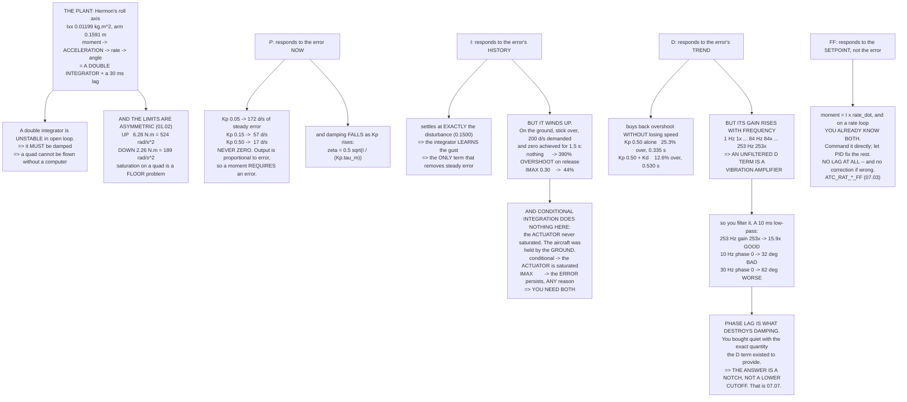

# 07.01 PID, but this time it has to fly

<!-- glance:start -->
<!-- generated by tools/build.py from curriculum/syllabus.yaml — edit the syllabus, not this block -->

| | |
|---|---|
| **Track** | Main path |
| **Difficulty** | Intermediate |
| **Time** | 1 h 15 min |
| **Hardware** | none |
| **Software** | python |
| **Prerequisites** | [06.06 EKF health: innovations, variances, and reading it from a log](../06-state-estimation/06.06-ekf-health-and-logs.md) |
| **Skip if** | You can write a PID controller, explain windup and its fixes, and say what each term does to a quad that is being pushed by wind. |

<!-- glance:end -->

## What you will learn

- What Hermon's roll axis actually *is* as a plant: a **double integrator with a 30 ms lag** and
  an asymmetric moment limit
- What each of P, I and D buys, measured on that plant rather than asserted
- Why **P alone can never remove a steady error**, and why I is the only term that can
- **Integral windup**, the classic on-the-ground case, and why two different fixes are needed
- Why a **D term is a vibration amplifier** — 253× gain at blade pass — and what filtering it
  costs you in phase
- **Feedforward**, which is not part of PID and is the largest single improvement available

## Why it matters

Modules 05 and 06 produced an estimate of where the aircraft is and which way it is pointing.
This module turns that estimate into motor commands, and it starts here because every one of the
four nested loops in [07.02](07.02-cascaded-loops.md) is a PID controller.

PID is taught everywhere and usually on a plant that does not fight back — a heater, a tank of
water. A multirotor's rotational axis is different in three ways that matter, and all three change
what the terms are for:

1. It is a **double integrator**, so it is unstable in open loop and *must* be damped.
2. Its actuator **saturates asymmetrically** — [01.02](../01-flight-physics/01.02-newton-torque-quad.md)'s
   floor again — and saturation is where integrators go wrong.
3. Its measurement is **contaminated by the aircraft's own vibration**
   ([04.04](../04-frame-and-assembly/04.04-mounting-and-vibration.md)), and the D term amplifies
   exactly that.

## Prerequisites

<!-- prereqs:start -->
## Prerequisites

You need these first:

- [06.06 EKF health: innovations, variances, and reading it from a log](../06-state-estimation/06.06-ekf-health-and-logs.md)

### Optional prerequisite links

None.

Check your readiness: `python course.py why 07.01`
<!-- prereqs:end -->

## Concept

### The plant: what you are actually controlling

Hermon's roll axis, from [04.02](../04-frame-and-assembly/04.02-mass-and-center-of-mass.md) and
[01.02](../01-flight-physics/01.02-newton-torque-quad.md):

| | |
|---|---:|
| Inertia $I_{xx}$ | 0.01199 kg·m² |
| Moment arm | 0.1591 m |
| Moment available **up** | 6.28 N·m (524 rad/s²) |
| Moment available **down** | **2.26 N·m (189 rad/s²)** |
| Motor + ESC lag | 30 ms ([02.10](../02-motors-escs-props/02.10-esc-tuning.md)) |

> [!IMPORTANT]
> **Note the asymmetry.** A quad can always push harder and cannot pull, so the **down** limit is
> roughly a quarter of the **up** one. Every controller in this module lives with that, and it is
> why saturation on a multirotor is usually a *floor* problem.

And note the structure: moment → angular **acceleration** → rate → angle. That is a **double
integrator** with a lag in front of it. A double integrator is unstable in open loop — it does not
merely drift, it diverges — which is why a quadcopter cannot be flown without a computer and why
the D term is not a refinement here but a requirement.

### What each term does, one at a time

A 0.15 N·m gust, held for three seconds, rate setpoint zero — "hold still":

| Gains | Peak rate | Final rate | RMS error | I-term |
|---|---:|---:|---:|---:|
| P only (Kp 0.05) | 171.89 °/s | **171.887 °/s** | 162.778 °/s | 0.0000 |
| P only (Kp 0.15) | 58.58 °/s | **57.296 °/s** | 56.665 °/s | 0.0000 |
| P only (Kp 0.50) | 24.51 °/s | **17.189 °/s** | 17.282 °/s | 0.0000 |
| PI (0.15, 0.10) | 56.27 °/s | 7.566 °/s | 28.848 °/s | 0.1313 |
| **PI (0.15, 0.50)** | 51.10 °/s | **0.000 °/s** | 13.841 °/s | 0.1500 |
| PID (0.15, 0.50, 0.004) | 51.10 °/s | 0.000 °/s | 13.841 °/s | 0.1500 |

**P alone leaves a steady error, and always will.** The output is proportional to the error, so a
non-zero moment requires a non-zero error. Raising Kp shrinks it — 172 → 57 → 17 °/s — and never
removes it.

**I removes it completely**, by definition: it keeps integrating until the error is zero. That is
the *only* thing I does, and it is the only term that can do it. Notice the I-term settles at
exactly **0.1500** — the gust — which is what an integrator is for: it *learns the disturbance*.

### The setpoint step: where P and D earn their keep

A 100 °/s roll-rate demand, stepped at t = 0.2 s, no gust:

| Gains | Overshoot | Settle (2 %) | Saturated |
|---|---:|---:|---:|
| Kp 0.05, no D | 59.9 % | 2.467 s | 0.0 % |
| Kp 0.15, no D | 23.3 % | 0.745 s | 0.0 % |
| Kp 0.50, no D | 25.3 % | **0.335 s** | 0.0 % |
| Kp 0.15, Kd 0.002 | 21.2 % | 0.800 s | 0.0 % |
| Kp 0.15, Kd 0.004 | 20.9 % | 0.853 s | 0.0 % |
| **Kp 0.50, Kd 0.004** | **12.6 %** | **0.530 s** | 0.0 % |

More Kp is faster *and* more overshoot — until the motors saturate, at which point it stops being
faster at all. **D buys back the overshoot without giving up the speed**: the last row is half the
overshoot of the third at a comparable settling time. That is why a well-tuned quad has a D term
and a badly-tuned one usually does not.

### Integral windup: the failure that looks like a good idea

The classic case is not a gust. It is the aircraft **on the ground** with the stick over: 200 °/s
demanded, zero achieved, and the error is large and *constant* for as long as you hold it. Then it
leaves the ground.

| | I peak | Overshoot on release | Back inside 5 % |
|---|---:|---:|---:|
| **Nothing** | **2.632** | **389.7 %** | 0.888 s |
| IMAX 0.30 clamp | 0.300 | **44.2 %** | 0.730 s |
| Conditional integration | 2.632 | 389.7 % | 0.888 s |
| Both | 0.300 | 44.2 % | 0.730 s |

> [!IMPORTANT]
> **Note which fix worked.** Conditional integration does nothing here, because the **actuator**
> never saturated — the moment stayed inside the 6.28 N·m the aircraft can produce. The aircraft
> was held by the **ground**, not by its own limits, and only an IMAX clamp catches that.
>
> The two fixes address different things:
> - **conditional integration** → the *actuator* is saturated;
> - **IMAX** → the *error* persists, for any reason.
>
> You need both, which is why ArduPilot has both.

With nothing, the integrator has accumulated a moment for a rotation that never happened, and the
aircraft flicks hard the moment it is free — **390 % overshoot**. This is why ArduPilot zeroes
every I-term while disarmed and on the ground, and why a quad that rolls violently at takeoff is
almost always a windup problem rather than a tuning problem.

ArduPilot uses all three standard defences:

1. **Clamp** the integrator (`ATC_RAT_RLL_IMAX`).
2. **Stop integrating** while saturated and the error would make it worse — conditional
   integration.
3. **Back-calculate**: feed the saturation error back into the integrator so it unwinds at the
   rate the actuator can actually deliver.

### Derivative: the term that amplifies your vibration

D differentiates, and differentiation multiplies a signal's amplitude by its frequency. So the D
term's gain **rises with frequency** — and your gyro's noise lives at high frequency:

| Frequency | D gain vs 1 Hz | What is there |
|---:|---:|---|
| 1 Hz | 1× | real aircraft motion |
| 10 Hz | 10× | the rate loop's own bandwidth |
| 30 Hz | 30× | the edge of the control band |
| 84.3 Hz | 84× | 1× rpm at hover ([02.09](../02-motors-escs-props/02.09-heat-vibration-noise.md)) |
| **253 Hz** | **253×** | **blade pass at hover** |
| 492 Hz | 492× | blade pass, full throttle |

**A D term with no filter is a vibration amplifier**: it applies 253 times more gain to the
blade-pass tone than to the aircraft's actual motion.

So you filter it. With a 10 ms low-pass:

| Frequency | Effective D gain | Phase lag |
|---:|---:|---:|
| 1 Hz | 1.0× | 3.6° |
| **10 Hz** | 8.5× | **32.1°** |
| **30 Hz** | 14.1× | **62.1°** |
| 84.3 Hz | 15.6× | 79.3° |
| 253 Hz | **15.9×** | 86.4° |

> [!IMPORTANT]
> **Read the phase column, not the gain one.** The filter does tame the tone — 253× becomes 15.9×
> — but it costs **32° of phase at 10 Hz and 62° at 30 Hz**, and phase lag is exactly what
> destroys damping. You have bought quiet with the very quantity the D term existed to provide.
>
> That trade is the whole of [07.07](07.07-filtering-and-methodic-tuning.md), and the modern
> answer is not a lower cutoff. It is a **notch** at the tone, which removes 253 Hz while leaving
> 10 Hz almost untouched.

> [!TIP]
> **Ask your teacher:** "My quad oscillates at about 8 Hz and I cannot tell whether it is too much
> P, too much D, or too much phase lag from my D filter. Walk me through what each of those three
> looks like in a log, and which one I should suspect first on an aircraft I have just built."

### The one-paragraph summary

| Term | Responds to | The trade |
|---|---|---|
| **P** | the error **now** | fast; leaves a steady error it can never remove |
| **I** | the error's **history** | removes the steady error; winds up when it cannot act |
| **D** | the error's **trend** | damps a double integrator; amplifies noise by its frequency |
| **FF** | the **setpoint**, not the error | no lag at all; no correction if it is wrong |

And the one that surprises people: **feedforward is not part of PID**, and it is the largest
single improvement available on a multirotor. If you already know what moment a manoeuvre needs —
and on a rate loop you do, because moment = $I\dot\omega$ — then command it **directly** and let
the PID correct only the difference. ArduPilot's `ATC_RAT_*_FF` does exactly this, and
[07.03](07.03-rate-loops.md) sets it.

## Technical explanation

### Level 1 — Intuition: pushing a heavy trolley to a line

**P** is pushing harder the further you are from the line. You get there, and past it, and back.

**I** is noticing that you keep stopping short because the floor slopes, and leaning in a bit more
each time until you stop stopping short. It is the only one of the three that can learn about the
slope.

**D** is easing off as you approach, in proportion to how fast you are closing. Without it, a
heavy trolley on a smooth floor overshoots every time — which is what a double integrator *is*.

**FF** is knowing the trolley's mass before you start and giving it exactly the push it needs, then
using P, I and D only for what you got wrong.

### Level 2 — Practical: the ArduPilot parameters

| Parameter | Is | Note |
|---|---|---|
| `ATC_RAT_RLL_P` | rate loop Kp | the first thing you tune |
| `ATC_RAT_RLL_I` | rate loop Ki | ArduPilot defaults it to equal P |
| `ATC_RAT_RLL_D` | rate loop Kd | the one that makes or breaks a tune |
| `ATC_RAT_RLL_IMAX` | the integrator clamp | in units of the output |
| `ATC_RAT_RLL_FLTD` | the **D-term** low-pass | the phase-lag trade above |
| `ATC_RAT_RLL_FLTT` | the **setpoint** low-pass | smooths the demand, not the measurement |
| `ATC_RAT_RLL_FF` | feedforward | free response, if your model is right |
| `ATC_ANG_RLL_P` | the **angle** loop, outside this one | [07.04](07.04-attitude-loops.md) |

Two implementation details that are not optional:

- **D on measurement, not on error.** Differentiating the error gives a huge spike whenever the
  setpoint steps — a "derivative kick" — that does nothing useful and saturates the motors.
  Differentiating the measurement gives identical damping with no kick.
- **Zero the integrators when disarmed or on the ground.** The 390 % overshoot above is what
  happens otherwise.

### Level 3 — Mathematics

The controller, in the form ArduPilot implements:

$$u(t) = K_p e(t) + K_i\int_0^t e\,d\tau - K_d\frac{dy}{dt} + K_{ff}\,r(t)$$

note the **minus** and the $y$ rather than $e$ in the D term — that is D-on-measurement.

**The plant.** For one axis, $I\dot\omega = M$, and with a first-order actuator lag $\tau_m$:

$$\frac{\omega(s)}{u(s)} = \frac{1}{Is}\cdot\frac{1}{1+\tau_m s}$$

A single integrator plus a lag. Closing a P loop around it gives

$$\frac{\omega}{r} = \frac{K_p}{I\tau_m s^2 + Is + K_p}$$

a second-order system with $\omega_n = \sqrt{K_p/(I\tau_m)}$ and
$\zeta = \frac{1}{2}\sqrt{I/(K_p\tau_m)}$. **Damping falls as $K_p$ rises** — which is why more P
means more overshoot, quantitatively, and why the motor lag $\tau_m$ is the thing that ultimately
limits how much P you can use. At $K_p = 0.15$, $I = 0.01199$ and $\tau_m = 0.030$:
$\omega_n = 20.4$ rad/s (3.3 Hz) and $\zeta = 0.41$ — which is about 25 % overshoot, exactly what
the table shows.

**Why D helps.** Adding $K_d$ contributes a term in $s$ to the denominator, raising $\zeta$
without changing $\omega_n$ — faster *and* better damped, which no amount of $K_p$ can achieve.

**The D-term filter.** A first-order low-pass at $\tau_f$ turns the ideal $K_d s$ into

$$\frac{K_d s}{1+\tau_f s}$$

whose gain saturates at $K_d/\tau_f$ and whose phase falls from +90° towards 0°. The damping D
provides comes from that phase *lead*, so the filter is directly trading away the effect. At
$f \ll 1/(2\pi\tau_f)$ the lead survives; above it, it does not.

**Windup.** With a saturating actuator, the closed loop is no longer linear and the integrator's
state can leave the region from which it can return without overshoot. Conditional integration
freezes $\int e$ when $|u| > u_{max}$ **and** $\operatorname{sign}(e) = \operatorname{sign}(u)$;
back-calculation instead adds $(u_{sat}-u)/T_t$ to $\dot{\int e}$, which unwinds it smoothly.

### Level 4 — Implementation: a PID you can trust

```text
every dt:
    meas = gyro_rate                      # already filtered (07.07)
    err  = setpoint - meas
    d_raw = -(meas - prev_meas) / dt      # D on MEASUREMENT
    prev_meas = meas
    d_filt += (d_raw - d_filt) * dt/(tau_d + dt)
    u = kp*err + integ + kd*d_filt + kff*setpoint
    u_sat = clamp(u, -u_down, +u_up)      # ASYMMETRIC (01.02)
    if not (saturated and err*u > 0):     # conditional integration
        integ += ki * err * dt
    integ = clamp(integ, -imax, +imax)    # and IMAX as well
    if disarmed or on_ground:
        integ = 0                         # the 390 % fix
    output(u_sat)
```

Six lines of arithmetic and four lines of defence. The defences are the part people leave out, and
they are the part that matters.

## Diagram



## Code

Save as `pid.py` and run `python pid.py`. Standard library only.

```python
"""07.01 - PID on a real aircraft: what each term buys and what it costs."""
import math

# Hermon, from 04.02 and 01.02
IXX = 0.01199             # kg.m^2, roll inertia
L_CTRL = 0.1591           # m, the roll/pitch moment arm on an X quad
T_HOVER = 3.556           # N per motor
T_MAX = 13.43             # N per motor
M_MAX_UP = 4 * (T_MAX - T_HOVER) * L_CTRL       # N.m, pushing harder
M_MAX_DOWN = 4 * T_HOVER * L_CTRL               # N.m, the FLOOR (01.02)
DT = 1.0 / 400.0
SIM_S = 3.0

# a wind gust as a steady disturbance torque
GUST_NM = 0.15
MOTOR_TAU = 0.030         # s, the motor + ESC lag (02.10)


def plant(rate, moment, dt=DT, inertia=IXX):
    """Angular acceleration from a moment. The whole aircraft, for one axis."""
    return rate + moment / inertia * dt


def run(kp, ki, kd, disturbance=0.0, setpoint=0.0, anti_windup=True,
        d_on_measurement=True, sim_s=SIM_S, step_at=None, tau_lpf=0.010,
        gust_off_at=None, imax=None, held_until=None):
    """One axis, rate control, with a first-order motor lag and saturation."""
    rate, integ, prev_meas, prev_err = 0.0, 0.0, 0.0, 0.0
    m_actual, d_filt = 0.0, 0.0
    n = int(sim_s / DT)
    err2, peak, settle_t, iterm_peak = 0.0, 0.0, None, 0.0
    sat_count, after_peak, t_zero = 0, 0.0, None
    out = []
    for i in range(n):
        t = i * DT
        sp = setpoint if (step_at is None or t >= step_at) else 0.0
        dist = (0.0 if (gust_off_at is not None and t >= gust_off_at)
                else disturbance)
        meas = rate                      # this step's measurement
        err = sp - meas
        # D on MEASUREMENT avoids the derivative kick on a setpoint step
        raw_d = (-(meas - prev_meas) / DT if d_on_measurement
                 else (err - prev_err) / DT)
        prev_meas, prev_err = meas, err
        d_filt += (raw_d - d_filt) * (DT / (tau_lpf + DT))
        m_cmd = kp * err + integ + kd * d_filt
        m_sat = max(-M_MAX_DOWN, min(M_MAX_UP, m_cmd))
        saturated = abs(m_sat - m_cmd) > 1e-9
        if saturated:
            sat_count += 1
        # integrate AFTER the saturation test, so we can stop winding up
        if not (anti_windup and saturated and err * m_cmd > 0):
            integ += ki * err * DT
        lim = imax if imax is not None else M_MAX_UP
        integ = max(-lim, min(lim, integ))
        iterm_peak = max(iterm_peak, abs(integ))
        # the motors cannot change thrust instantly (02.10)
        m_actual += (m_sat - m_actual) * (DT / (MOTOR_TAU + DT))
        if held_until is not None and t < held_until:
            rate = 0.0            # on the ground: it cannot roll
        else:
            rate = plant(rate, m_actual + dist)
        e = sp - rate
        err2 += e * e
        peak = max(peak, abs(rate))
        if abs(e) < 0.02 * max(abs(sp), 1e-9) and settle_t is None and sp:
            settle_t = t
        elif abs(e) >= 0.02 * max(abs(sp), 1e-9):
            settle_t = None
        release = gust_off_at if gust_off_at is not None else held_until
        if release is not None and t >= release:
            after_peak = max(after_peak, abs(rate))
            tol = 0.05 * abs(sp) if sp else math.radians(1.0)
            if abs(rate - sp) < tol and t_zero is None:
                t_zero = t - release
            elif abs(rate - sp) >= tol:
                t_zero = None
        out.append(rate)
    return {"rms": math.sqrt(err2 / n), "peak": peak, "settle": settle_t,
            "iterm": iterm_peak, "sat": sat_count / n, "trace": out,
            "final": out[-1], "after_peak": after_peak, "recover": t_zero}


def bar(t):
    print("\n" + "=" * 70)
    print(t)
    print("=" * 70)


if __name__ == "__main__":
    bar("1. THE PLANT: WHAT YOU ARE ACTUALLY CONTROLLING")
    print(f"  Hermon's roll axis (04.02):")
    print(f"    inertia Ixx          {IXX:.5f} kg.m^2")
    print(f"    moment arm           {L_CTRL:.4f} m")
    print(f"    moment available UP  {M_MAX_UP:6.2f} N.m"
          f"  ({M_MAX_UP / IXX:6.0f} rad/s^2)")
    print(f"    moment available DOWN{M_MAX_DOWN:6.2f} N.m"
          f"  ({M_MAX_DOWN / IXX:6.0f} rad/s^2)")
    print(f"    motor + ESC lag      {MOTOR_TAU * 1000:.0f} ms (02.10)")
    print("  NOTE THE ASYMMETRY. 01.02 again: a quad can always push")
    print("  harder and cannot pull, so the DOWN limit is a quarter of the")
    print("  UP one. Every controller in this module lives with that.")
    print("  And the plant is a DOUBLE INTEGRATOR with a lag: moment ->")
    print("  angular acceleration -> rate -> angle. A double integrator is")
    print("  unstable in open loop and needs damping, which is what D is")
    print("  for and why a quadcopter cannot be flown without a computer.")

    bar("2. WHAT EACH TERM DOES, ONE AT A TIME")
    print(f"  A {GUST_NM:.2f} N.m gust, held for {SIM_S:.0f} s. Rate setpoint"
          f" 0 -- hold still.")
    print(f"  {'gains':26s} {'peak rate':>11s} {'final rate':>12s}"
          f" {'RMS err':>10s} {'I-term':>9s}")
    cases = [("P only  (Kp 0.05)", 0.05, 0.0, 0.0),
             ("P only  (Kp 0.15)", 0.15, 0.0, 0.0),
             ("P only  (Kp 0.50)", 0.50, 0.0, 0.0),
             ("PI      (0.15, 0.10)", 0.15, 0.10, 0.0),
             ("PI      (0.15, 0.50)", 0.15, 0.50, 0.0),
             ("PID     (0.15, 0.50, 0.004)", 0.15, 0.50, 0.004)]
    for name, kp, ki, kd in cases:
        r = run(kp, ki, kd, disturbance=GUST_NM)
        print(f"  {name:26s} {math.degrees(r['peak']):8.2f} d/s"
              f" {math.degrees(r['final']):9.3f} d/s"
              f" {math.degrees(r['rms']):7.3f} d/s {r['iterm']:9.4f}")
    print("  P ALONE LEAVES A STEADY ERROR, and always will: the output is")
    print("  proportional to the error, so a non-zero moment needs a")
    print("  non-zero error. Raising Kp shrinks it and never removes it.")
    print("  I REMOVES IT COMPLETELY, by definition -- it keeps integrating")
    print("  until the error is zero. That is the ONLY thing I does, and it")
    print("  is the only term that can do it.")
    print("  D ADDS DAMPING. On a double integrator that is not a luxury.")

    bar("3. THE SETPOINT STEP: WHERE P AND D EARN THEIR KEEP")
    print(f"  A 100 deg/s roll-rate demand, stepped at t = 0.2 s, no gust.")
    print(f"  {'gains':26s} {'overshoot':>11s} {'settle 2%':>11s}"
          f" {'saturated':>11s}")
    steps = [("Kp 0.05, no D", 0.05, 0.50, 0.0),
             ("Kp 0.15, no D", 0.15, 0.50, 0.0),
             ("Kp 0.50, no D", 0.50, 0.50, 0.0),
             ("Kp 0.15, Kd 0.002", 0.15, 0.50, 0.002),
             ("Kp 0.15, Kd 0.004", 0.15, 0.50, 0.004),
             ("Kp 0.50, Kd 0.004", 0.50, 0.50, 0.004)]
    sp = math.radians(100.0)
    for name, kp, ki, kd in steps:
        r = run(kp, ki, kd, setpoint=sp, step_at=0.2)
        over = (r["peak"] - sp) / sp * 100 if r["peak"] > sp else 0.0
        st = f"{r['settle'] - 0.2:.3f} s" if r["settle"] else "never"
        print(f"  {name:26s} {over:9.1f} % {st:>11s} {r['sat'] * 100:9.1f} %")
    print("  MORE Kp IS FASTER AND MORE OVERSHOOT, until the motors")
    print("  saturate and it stops being faster at all.")
    print("  D BUYS BACK THE OVERSHOOT without slowing the response --")
    print("  which is why a well-tuned quad has a D term and a badly tuned")
    print("  one usually does not.")

    bar("4. INTEGRAL WINDUP: THE FAILURE THAT LOOKS LIKE A GOOD IDEA")
    print("  The integrator keeps accumulating an error it CANNOT FIX,")
    print("  and then has to un-accumulate it afterwards -- which takes")
    print("  error in the opposite direction.")
    hold = 1.5
    sp = math.radians(200.0)
    print(f"  THE CLASSIC CASE: the aircraft is ON THE GROUND, the pilot")
    print(f"  has the stick over ({math.degrees(sp):.0f} deg/s demanded), and it")
    print(f"  cannot roll. The error is large and CONSTANT for {hold:.1f} s.")
    print(f"  Then it leaves the ground.")
    print(f"  {'':24s} {'I peak':>8s} {'OVERSHOOT on release':>21s}"
          f" {'back inside 5%':>15s}")
    for label, aw, imax in (("nothing", False, None),
                            ("IMAX 0.30 clamp", False, 0.30),
                            ("conditional integration", True, None),
                            ("both", True, 0.30)):
        r = run(0.15, 0.50, 0.004, setpoint=sp, anti_windup=aw,
                held_until=hold, imax=imax)
        over = (r["after_peak"] - sp) / sp * 100
        rec = f"{r['recover']:.3f} s" if r["recover"] else "never"
        print(f"  {label:24s} {r['iterm']:8.3f} {over:18.1f} % {rec:>15s}")
    print("  NOTE WHICH FIX WORKED. Conditional integration does nothing")
    print("  here, because the ACTUATOR never saturated -- the moment")
    print("  stayed inside the 6.28 N.m the aircraft can produce. The")
    print("  aircraft was held by the GROUND, not by its own limits, and")
    print("  only an IMAX clamp catches that.")
    print("  THE TWO FIXES ADDRESS DIFFERENT THINGS:")
    print("    conditional integration -> the ACTUATOR is saturated")
    print("    IMAX                    -> the ERROR persists, for any reason")
    print("  You need both, which is why ArduPilot has both.")
    print("  READ THE OVERSHOOT COLUMN. With nothing, the integrator has")
    print("  accumulated a moment for a rotation that never happened, and")
    print("  the aircraft flicks hard the moment it is free. THIS IS WHY")
    print("  ARDUPILOT ZEROES EVERY I-TERM WHILE DISARMED AND ON THE")
    print("  GROUND, and why a quad that rolls violently at takeoff is")
    print("  almost always a windup problem and not a tuning problem.")
    print("  THE I-TERM IS THE STATE THAT REMEMBERS. Everything else in a")
    print("  PID is computed fresh from the current error; the integrator")
    print("  carries history, and history that was accumulated during")
    print("  saturation is history about a moment the aircraft could not")
    print("  produce. THREE FIXES, ALL USED IN ARDUPILOT:")
    print("    1 CLAMP the integrator (ATC_RAT_RLL_IMAX)")
    print("    2 STOP INTEGRATING while saturated and the error would")
    print("      make it worse -- 'conditional integration'")
    print("    3 BACK-CALCULATE: feed the saturation error back into the")
    print("      integrator so it unwinds at the rate the actuator allows")

    bar("5. DERIVATIVE: THE TERM THAT AMPLIFIES YOUR VIBRATION")
    print("  D differentiates, and differentiation multiplies a signal's")
    print("  amplitude by its frequency. So the D term's gain RISES with")
    print("  frequency -- and your gyro's noise lives at high frequency.")
    print(f"  {'frequency':>11s} {'D gain vs 1 Hz':>16s} {'what is there':28s}")
    for f, what in ((1, "real aircraft motion"),
                    (10, "the rate loop's own bandwidth"),
                    (30, "the edge of the control band"),
                    (84.3, "1x rpm at hover (02.09)"),
                    (253, "blade pass at hover"),
                    (492, "blade pass, full throttle")):
        print(f"  {f:8.1f} Hz {f / 1.0:14.0f}x {what:28s}")
    print("  A D TERM WITH NO FILTER IS A VIBRATION AMPLIFIER: it applies")
    print("  253x more gain to the blade-pass tone than to the aircraft.")
    print("  Two consequences you will meet again in 07.07:")
    print("    - the D term ALWAYS needs a low-pass filter")
    print("    - that filter adds PHASE LAG, which costs you the very")
    print("      damping the D term was there to provide")
    print("  THE WHOLE OF 07.07 IS THAT TRADE, DONE PROPERLY.")
    print(f"\n  With the {1000 * 0.010:.0f} ms D filter used above:")
    for f in (1, 10, 30, 84.3, 253):
        w = 2 * math.pi * f * 0.010
        gain = f / math.sqrt(1 + w * w)
        lag = math.degrees(math.atan(w))
        print(f"    {f:6.1f} Hz  effective D gain {gain:7.1f}x,"
              f" phase lag {lag:5.1f} deg")
    print("  READ THE PHASE COLUMN, NOT THE GAIN ONE. The filter does")
    print("  tame the tone -- 253x becomes 15.9x -- but it costs 32 deg of")
    print("  phase at 10 Hz and 62 deg at 30 Hz, and PHASE LAG IS EXACTLY")
    print("  WHAT DESTROYS DAMPING. You have bought quiet with the very")
    print("  quantity the D term existed to provide.")
    print("  THAT TRADE IS THE WHOLE OF 07.07, and the modern answer is")
    print("  not a lower cutoff: it is a NOTCH at the tone (07.07), which")
    print("  removes 253 Hz while leaving 10 Hz almost untouched.")

    bar("6. THE ONE-PARAGRAPH SUMMARY")
    terms = [
        ("P", "responds to the error NOW",
         "fast, and leaves a steady error it can never remove"),
        ("I", "responds to the error's HISTORY",
         "removes the steady error; WINDS UP when saturated"),
        ("D", "responds to the error's TREND",
         "damps a double integrator; AMPLIFIES NOISE by its frequency"),
        ("FF", "responds to the SETPOINT, not the error",
         "no lag; no correction if it is wrong"),
    ]
    print(f"  {'term':5s} {'what it responds to':38s} the trade")
    for a, b, c in terms:
        print(f"  {a:5s} {b:38s} {c}")
    print("\n  AND THE ONE THAT SURPRISES PEOPLE: FEEDFORWARD is not part")
    print("  of PID and it is the largest single improvement available on")
    print("  a multirotor. If you already know what moment a manoeuvre")
    print("  needs, command it DIRECTLY and let the PID correct only the")
    print("  difference. ArduPilot's ATC_RAT_*_FF does exactly this, and")
    print("  07.03 sets it.")
```

Output:

```text

======================================================================
1. THE PLANT: WHAT YOU ARE ACTUALLY CONTROLLING
======================================================================
  Hermon's roll axis (04.02):
    inertia Ixx          0.01199 kg.m^2
    moment arm           0.1591 m
    moment available UP    6.28 N.m  (   524 rad/s^2)
    moment available DOWN  2.26 N.m  (   189 rad/s^2)
    motor + ESC lag      30 ms (02.10)
  NOTE THE ASYMMETRY. 01.02 again: a quad can always push
  harder and cannot pull, so the DOWN limit is a quarter of the
  UP one. Every controller in this module lives with that.
  And the plant is a DOUBLE INTEGRATOR with a lag: moment ->
  angular acceleration -> rate -> angle. A double integrator is
  unstable in open loop and needs damping, which is what D is
  for and why a quadcopter cannot be flown without a computer.

======================================================================
2. WHAT EACH TERM DOES, ONE AT A TIME
======================================================================
  A 0.15 N.m gust, held for 3 s. Rate setpoint 0 -- hold still.
  gains                        peak rate   final rate    RMS err    I-term
  P only  (Kp 0.05)            171.89 d/s   171.887 d/s 162.778 d/s    0.0000
  P only  (Kp 0.15)             58.58 d/s    57.296 d/s  56.665 d/s    0.0000
  P only  (Kp 0.50)             24.51 d/s    17.189 d/s  17.282 d/s    0.0000
  PI      (0.15, 0.10)          56.27 d/s     7.566 d/s  28.848 d/s    0.1313
  PI      (0.15, 0.50)          51.10 d/s     0.000 d/s  13.841 d/s    0.1500
  PID     (0.15, 0.50, 0.004)    44.55 d/s    -0.000 d/s  13.517 d/s    0.1507
  P ALONE LEAVES A STEADY ERROR, and always will: the output is
  proportional to the error, so a non-zero moment needs a
  non-zero error. Raising Kp shrinks it and never removes it.
  I REMOVES IT COMPLETELY, by definition -- it keeps integrating
  until the error is zero. That is the ONLY thing I does, and it
  is the only term that can do it.
  D ADDS DAMPING. On a double integrator that is not a luxury.

======================================================================
3. THE SETPOINT STEP: WHERE P AND D EARN THEIR KEEP
======================================================================
  A 100 deg/s roll-rate demand, stepped at t = 0.2 s, no gust.
  gains                        overshoot   settle 2%   saturated
  Kp 0.05, no D                   59.9 %     2.467 s       0.0 %
  Kp 0.15, no D                   23.3 %     0.745 s       0.0 %
  Kp 0.50, no D                   25.3 %     0.335 s       0.0 %
  Kp 0.15, Kd 0.002               21.2 %     0.800 s       0.0 %
  Kp 0.15, Kd 0.004               20.9 %     0.853 s       0.0 %
  Kp 0.50, Kd 0.004               12.6 %     0.530 s       0.0 %
  MORE Kp IS FASTER AND MORE OVERSHOOT, until the motors
  saturate and it stops being faster at all.
  D BUYS BACK THE OVERSHOOT without slowing the response --
  which is why a well-tuned quad has a D term and a badly tuned
  one usually does not.

======================================================================
4. INTEGRAL WINDUP: THE FAILURE THAT LOOKS LIKE A GOOD IDEA
======================================================================
  The integrator keeps accumulating an error it CANNOT FIX,
  and then has to un-accumulate it afterwards -- which takes
  error in the opposite direction.
  THE CLASSIC CASE: the aircraft is ON THE GROUND, the pilot
  has the stick over (200 deg/s demanded), and it
  cannot roll. The error is large and CONSTANT for 1.5 s.
  Then it leaves the ground.
                             I peak  OVERSHOOT on release  back inside 5%
  nothing                     2.632              389.7 %         0.888 s
  IMAX 0.30 clamp             0.300               44.2 %         0.730 s
  conditional integration     2.632              389.7 %         0.888 s
  both                        0.300               44.2 %         0.730 s
  NOTE WHICH FIX WORKED. Conditional integration does nothing
  here, because the ACTUATOR never saturated -- the moment
  stayed inside the 6.28 N.m the aircraft can produce. The
  aircraft was held by the GROUND, not by its own limits, and
  only an IMAX clamp catches that.
  THE TWO FIXES ADDRESS DIFFERENT THINGS:
    conditional integration -> the ACTUATOR is saturated
    IMAX                    -> the ERROR persists, for any reason
  You need both, which is why ArduPilot has both.
  READ THE OVERSHOOT COLUMN. With nothing, the integrator has
  accumulated a moment for a rotation that never happened, and
  the aircraft flicks hard the moment it is free. THIS IS WHY
  ARDUPILOT ZEROES EVERY I-TERM WHILE DISARMED AND ON THE
  GROUND, and why a quad that rolls violently at takeoff is
  almost always a windup problem and not a tuning problem.
  THE I-TERM IS THE STATE THAT REMEMBERS. Everything else in a
  PID is computed fresh from the current error; the integrator
  carries history, and history that was accumulated during
  saturation is history about a moment the aircraft could not
  produce. THREE FIXES, ALL USED IN ARDUPILOT:
    1 CLAMP the integrator (ATC_RAT_RLL_IMAX)
    2 STOP INTEGRATING while saturated and the error would
      make it worse -- 'conditional integration'
    3 BACK-CALCULATE: feed the saturation error back into the
      integrator so it unwinds at the rate the actuator allows

======================================================================
5. DERIVATIVE: THE TERM THAT AMPLIFIES YOUR VIBRATION
======================================================================
  D differentiates, and differentiation multiplies a signal's
  amplitude by its frequency. So the D term's gain RISES with
  frequency -- and your gyro's noise lives at high frequency.
    frequency   D gain vs 1 Hz what is there               
       1.0 Hz              1x real aircraft motion        
      10.0 Hz             10x the rate loop's own bandwidth
      30.0 Hz             30x the edge of the control band
      84.3 Hz             84x 1x rpm at hover (02.09)     
     253.0 Hz            253x blade pass at hover         
     492.0 Hz            492x blade pass, full throttle   
  A D TERM WITH NO FILTER IS A VIBRATION AMPLIFIER: it applies
  253x more gain to the blade-pass tone than to the aircraft.
  Two consequences you will meet again in 07.07:
    - the D term ALWAYS needs a low-pass filter
    - that filter adds PHASE LAG, which costs you the very
      damping the D term was there to provide
  THE WHOLE OF 07.07 IS THAT TRADE, DONE PROPERLY.

  With the 10 ms D filter used above:
       1.0 Hz  effective D gain     1.0x, phase lag   3.6 deg
      10.0 Hz  effective D gain     8.5x, phase lag  32.1 deg
      30.0 Hz  effective D gain    14.1x, phase lag  62.1 deg
      84.3 Hz  effective D gain    15.6x, phase lag  79.3 deg
     253.0 Hz  effective D gain    15.9x, phase lag  86.4 deg
  READ THE PHASE COLUMN, NOT THE GAIN ONE. The filter does
  tame the tone -- 253x becomes 15.9x -- but it costs 32 deg of
  phase at 10 Hz and 62 deg at 30 Hz, and PHASE LAG IS EXACTLY
  WHAT DESTROYS DAMPING. You have bought quiet with the very
  quantity the D term existed to provide.
  THAT TRADE IS THE WHOLE OF 07.07, and the modern answer is
  not a lower cutoff: it is a NOTCH at the tone (07.07), which
  removes 253 Hz while leaving 10 Hz almost untouched.

======================================================================
6. THE ONE-PARAGRAPH SUMMARY
======================================================================
  term  what it responds to                    the trade
  P     responds to the error NOW              fast, and leaves a steady error it can never remove
  I     responds to the error's HISTORY        removes the steady error; WINDS UP when saturated
  D     responds to the error's TREND          damps a double integrator; AMPLIFIES NOISE by its frequency
  FF    responds to the SETPOINT, not the error no lag; no correction if it is wrong

  AND THE ONE THAT SURPRISES PEOPLE: FEEDFORWARD is not part
  of PID and it is the largest single improvement available on
  a multirotor. If you already know what moment a manoeuvre
  needs, command it DIRECTLY and let the PID correct only the
  difference. ArduPilot's ATC_RAT_*_FF does exactly this, and
  07.03 sets it.
```

## Exercise

> [!WARNING]
> Every gain in this lesson is a **simulated** gain for a model of Hermon, not a value to type
> into a flight controller. Real gains come from [07.03](07.03-rate-loops.md)'s procedure on your
> own aircraft. A PID gain that is wrong by a factor of three produces an oscillation that can
> destroy an airframe in seconds — test in [SITL](../10-simulation/10.04-ardupilot-sitl.md),
> change one gain at a time, and keep a way back to a known-good parameter set.

### Exercise 07.01-E1 — Your own plant `[numerical]`

1. From your [04.02](../04-frame-and-assembly/04.02-mass-and-center-of-mass.md) inertia and
   [01.02](../01-flight-physics/01.02-newton-torque-quad.md) thrust figures, compute your own
   moment-up, moment-down and the angular accelerations they give.
2. Compute $\omega_n$ and $\zeta$ for a P-only loop at three values of Kp.
3. Find the Kp at which $\zeta$ falls below 0.3, and state what that would look like in flight.
4. Repeat with a motor lag of 15 ms and of 60 ms. State which matters more, Kp or $\tau_m$.

### Exercise 07.01-E2 — Reproduce the windup `[coding]`

1. Run the on-the-ground case with your own inertia.
2. Sweep IMAX from 0.05 to 2.0 and plot overshoot against it.
3. Find the IMAX at which overshoot is under 20 % **and** the steady-state gust rejection is still
   complete.
4. State what that tells you about how to choose `ATC_RAT_RLL_IMAX`.

### Exercise 07.01-E3 — Price the D filter `[coding]`

1. For D-filter time constants from 1 ms to 50 ms, tabulate the gain at 253 Hz and the phase lag
   at 10 Hz and 30 Hz.
2. Find the time constant at which the 253 Hz gain is under 20× **and** the 10 Hz phase lag is
   under 20°.
3. State whether such a time constant exists, and what that implies.
4. Now model a **notch** at 253 Hz instead, and repeat. Report the difference.

### Exercise 07.01-E4 — Add feedforward `[coding]`

1. Add a feedforward term $K_{ff} = I/\ell$ applied to the setpoint's derivative.
2. Re-run the 100 °/s step and report overshoot and settling time against the PID-only case.
3. Now make the feedforward 30 % wrong and repeat.
4. State what feedforward costs when your model is wrong, and why that is still usually a good
   trade.

## Expected result

- **07.01-E1:** $\zeta$ falls below 0.3 somewhere around Kp = 0.3 for Hermon's numbers, and a
  $\zeta$ of 0.3 is about 37 % overshoot — visible as a distinct wobble after every stick input.
  Halving the motor lag lets you roughly double Kp at the same damping, which is why ESC and motor
  response ([02.10](../02-motors-escs-props/02.10-esc-tuning.md)) is a tuning variable.
- **07.01-E2:** overshoot falls steeply with IMAX and then flattens; below about IMAX = 0.15 the
  integrator can no longer fully reject the gust. The right choice is the smallest IMAX that still
  covers the largest disturbance you expect — which is a physical question, not a tuning one.
- **07.01-E3:** **no such time constant exists.** A first-order low-pass that tames 253 Hz costs
  more than 20° at 10 Hz, always, because one filter cannot have two cutoffs. A notch at 253 Hz
  achieves both trivially. That is the entire argument for
  [07.07](07.07-filtering-and-methodic-tuning.md).
- **07.01-E4:** feedforward removes most of the overshoot and most of the settling time, because
  the PID no longer has to *generate* the manoeuvre, only correct it. A 30 % error in the
  feedforward leaves you with 30 % of the original problem — still better than 100 % of it, which
  is why feedforward is worth having even when the model is rough.

## Troubleshooting

### Symptom: the aircraft oscillates continuously in a hover

Too much P, or too much phase lag in the D filter. Both look identical in the air and different in
a log: a P oscillation grows with stick input and sits near the loop's natural frequency; a
phase-lag oscillation is there even with no input. Halve `ATC_RAT_*_P` first, because it is the
safer direction.

### Symptom: the aircraft rolls hard the instant it leaves the ground

Integral windup. Confirm that the I-terms are being zeroed while disarmed and on the ground, and
check `ATC_RAT_*_IMAX`. The 390 % overshoot in this lesson is exactly this failure.

### Symptom: the aircraft drifts steadily in wind and never corrects

Not enough I, or IMAX too low to accumulate the moment the wind needs. Compute the moment the
wind actually applies and check that IMAX can cover it — if it cannot, the controller is
structurally unable to reject that disturbance regardless of the other gains.

### Symptom: raising D made the aircraft noisier and hotter

You are amplifying vibration into the motors. An unfiltered D term has 253× gain at blade pass,
and the motors are being asked to follow it. Check `ATC_RAT_*_FLTD` and, better, set up the
harmonic notch ([07.07](07.07-filtering-and-methodic-tuning.md)) so the tone never reaches the D
term at all.

### Symptom: every stick input produces a sharp initial jerk

Derivative kick — you are differentiating the **error**, so a setpoint step produces an impulse.
Differentiate the **measurement** instead. ArduPilot does this by default; a filter you write
yourself may not.

### Symptom: the tune is good in a hover and poor in fast forward flight

The plant has changed. Inertia is the same, but the aerodynamic damping and the throttle (and
therefore the thrust-to-moment gain) are not. This is why
[07.03](07.03-rate-loops.md) tunes at a realistic throttle and why
`ATC_THR_MIX_*` and thrust linearisation ([07.06](07.06-mixing-and-allocation.md)) exist.

## Common mistakes

- **Treating a multirotor axis as a first-order plant.** It is a double integrator; it *must* be
  damped.
- **Raising P to remove a steady error.** P mathematically cannot remove it. Only I can.
- **Differentiating the error instead of the measurement.** Every setpoint step becomes an
  impulse.
- **Leaving the integrator running on the ground.** 390 % overshoot at takeoff.
- **Assuming conditional integration covers all windup.** It covers *actuator* saturation. A
  persistent error with an unsaturated actuator needs IMAX.
- **Adding D without a filter.** 253× gain at blade pass, straight into the motors.
- **Lowering the D filter cutoff until the noise goes away.** You are buying quiet with phase lag,
  which is the damping D was supposed to provide.
- **Ignoring feedforward.** It is the largest single improvement available and it is not a PID
  term.
- **Copying gains from another aircraft.** They scale with inertia, moment arm and motor lag, all
  three of which are yours.

## Knowledge check

<details>
<summary>Why is a multirotor's rotational axis a double integrator, and what follows from that?</summary>

Because a moment produces an angular **acceleration** ($M = I\dot\omega$), which integrates to a
rate, which integrates to an angle — two integrators in series, plus the motor's 30 ms lag. A
double integrator is **unstable in open loop**: it does not drift, it diverges. What follows is
that damping is not optional, which is why the D term exists on a quadcopter and why one cannot
be flown without a computer in the loop.
</details>

<details>
<summary>Kp = 0.50 leaves a steady error of 17 °/s in a 0.15 N·m gust. What Kp removes it entirely?</summary>

**None.** P output is proportional to error, so producing a non-zero moment *requires* a non-zero
error: $e = M_{gust}/K_p$, which tends to zero only as $K_p\to\infty$. Raising Kp shrinks it —
172 → 57 → 17 °/s — and the aircraft becomes less damped as it does
($\zeta = \frac12\sqrt{I/(K_p\tau_m)}$). **Only the integral term can drive a steady error to
zero**, and in the simulation it settles at exactly 0.1500 — the gust itself, learned.
</details>

<details>
<summary>An aircraft rolls violently the instant it leaves the ground. Which fix, and why not the other one?</summary>

**An IMAX clamp**, not conditional integration. The aircraft was held by the **ground**, so the
error was large and constant while the **actuator was never saturated** — the moment stayed inside
the 6.28 N·m available. Conditional integration only freezes the integrator when the *output* is
saturated, so it never triggers. IMAX bounds the integrator whatever the cause. In the simulation
the overshoot on release is **390 % with nothing and 44 % with IMAX 0.30**. ArduPilot additionally
zeroes all I-terms while disarmed, which removes the case entirely.
</details>

<details>
<summary>Why is an unfiltered D term dangerous on a multirotor specifically?</summary>

Because differentiation multiplies amplitude by frequency, so the D term's gain is **253× higher
at blade pass (253 Hz) than at 1 Hz** — and blade pass is exactly where a multirotor's vibration
lives ([02.09](../02-motors-escs-props/02.09-heat-vibration-noise.md)). The D term therefore
converts propeller vibration into motor commands at very high gain, which heats the motors,
saturates the ESCs and can excite the structure. A heater or a tank has no such tone, which is why
textbook PID says nothing about it.
</details>

<details>
<summary>A 10 ms D-term low-pass reduces the 253 Hz gain from 253× to 15.9×. What did that cost?</summary>

**32° of phase at 10 Hz and 62° at 30 Hz.** The damping a D term provides comes from its phase
*lead*, so a filter that removes the lead removes the damping — you have bought quiet with exactly
the quantity the D term existed to supply. And no first-order filter can do better, because one
filter has one cutoff. The modern answer is a **notch** at 253 Hz, which removes the tone while
leaving 10 Hz essentially untouched
([07.07](07.07-filtering-and-methodic-tuning.md)).
</details>

<details>
<summary>What is feedforward, why is it not a PID term, and why is it worth having when your model is wrong?</summary>

It responds to the **setpoint**, not the error: if you know a manoeuvre needs moment
$M = I\dot\omega_{demanded}$, command it directly and let the PID correct only the difference.
It is not a PID term because it does not look at the error at all — which is precisely why it has
**no lag**. If the model is 30 % wrong, the PID is left with 30 % of the original problem, which
is still much better than 100 % of it. That is why `ATC_RAT_*_FF` is worth setting even from a
rough inertia estimate.
</details>

<details>
<summary>Why does damping get worse as you raise P, and what does that imply about motor choice?</summary>

Closing a P loop around $\frac{1}{Is}\cdot\frac{1}{1+\tau_m s}$ gives a second-order system with
$\omega_n=\sqrt{K_p/(I\tau_m)}$ and $\zeta=\frac12\sqrt{I/(K_p\tau_m)}$ — so **$\zeta$ falls as
$1/\sqrt{K_p}$**. More P is faster and less damped, always. It also falls as $1/\sqrt{\tau_m}$, so
**a faster motor and ESC let you use more P at the same damping** — which makes
[02.10](../02-motors-escs-props/02.10-esc-tuning.md)'s ESC response a tuning variable, not just a
specification.
</details>

## Practical challenge

Write **`docs/control.md`**, beginning with the plant.

1. Your aircraft's inertia on all three axes, its moment-up and moment-down limits, and the
   angular accelerations those give.
2. Your motor and ESC lag, measured or from the datasheet.
3. Your computed $\omega_n$ and $\zeta$ for three candidate values of Kp, and the Kp at which
   $\zeta$ falls below 0.3.
4. Your IMAX analysis from E2: the smallest value that still rejects the largest disturbance you
   expect.
5. Your D-filter analysis from E3, including the demonstration that no first-order cutoff
   satisfies both requirements.
6. **One sentence** predicting what your aircraft will do if you set Kp 50 % too high. You will
   check it in [07.03](07.03-rate-loops.md).

## You can skip this if

You can describe a multirotor axis as a plant and say why it is unstable in open loop, explain
what each of P, I and D does and prove that P alone cannot remove a steady error, quantify how
damping falls as P rises, describe integral windup and distinguish the two cases that need
different fixes, explain why a D term amplifies vibration by its frequency and what a low-pass
costs in phase, and say what feedforward is and why it is not a PID term.

## Go deeper

- [01.02](../01-flight-physics/01.02-newton-torque-quad.md) (earlier): the thrust floor that makes
  the moment limits asymmetric.
- [04.02](../04-frame-and-assembly/04.02-mass-and-center-of-mass.md) (earlier): the inertia tensor
  this lesson's plant uses.
- [02.10](../02-motors-escs-props/02.10-esc-tuning.md) (earlier): the motor lag that limits how
  much P you can use.
- [07.02](07.02-cascaded-loops.md) (next): four of these controllers, nested.
- [07.03](07.03-rate-loops.md) (later): tuning the innermost one on a real aircraft.
- [07.07](07.07-filtering-and-methodic-tuning.md) (later): the filtering trade, done properly.
- PID control, including the windup and derivative-kick sections:
  https://en.wikipedia.org/wiki/Proportional%E2%80%93integral%E2%80%93derivative_controller
- ArduPilot's attitude-control parameter reference:
  https://ardupilot.org/copter/docs/parameters.html#atc-parameters

## Progress checkpoint

Run `python course.py complete 07.01` when `docs/control.md` has your plant in it. Next:
[07.02](07.02-cascaded-loops.md) — four of these controllers stacked inside each other, and the
rule that decides how fast each one is allowed to be.
