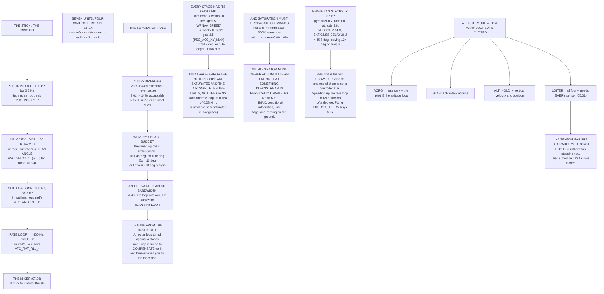

# 07.02 The cascade: rate → attitude → velocity → position

<!-- glance:start -->
<!-- generated by tools/build.py from curriculum/syllabus.yaml — edit the syllabus, not this block -->

| | |
|---|---|
| **Track** | Main path |
| **Difficulty** | Intermediate |
| **Time** | 1 h 30 min |
| **Hardware** | none |
| **Software** | python |
| **Prerequisites** | [07.01 PID, but this time it has to fly](07.01-pid-for-flight.md) |
| **Skip if** | You can draw Hermon's four nested loops with their rates and explain why the inner loop must be roughly five times faster than the one outside it. |

<!-- glance:end -->

## What you will learn

- Hermon's four nested loops, their rates, their bandwidths and the **seven units** the chain
  passes through
- The **bandwidth-separation rule**, demonstrated: at 1.5× the cascade diverges, at 5× it is
  indistinguishable from a perfect inner loop
- Why "runs at 400 Hz" and "has a 400 Hz bandwidth" are completely different claims
- Why on any large error the aircraft flies the **limits**, not the gains
- Why saturation must **propagate outwards**, and what a limit flag is for
- How phase lag accumulates through the cascade, and how much margin you actually have
- Why a flight mode is a statement about **how many loops are closed**

## Why it matters

[07.01](07.01-pid-for-flight.md) built one controller. A multirotor needs four, nested, and the
nesting is not an implementation detail — it is what makes the problem tractable at all.

The reason is that each loop sees a **simple** plant. The rate loop sees a double integrator. The
attitude loop sees something that delivers rates. The velocity loop sees something that delivers
angles. Nobody ever has to write a controller that goes from metres to newtons in one step, and
nobody could.

The price is a rule you cannot violate: **each loop must be much slower than the one inside it.**
This lesson measures how much slower, and what happens at each value.

## Prerequisites

<!-- prereqs:start -->
## Prerequisites

You need these first:

- [07.01 PID, but this time it has to fly](07.01-pid-for-flight.md)

### Optional prerequisite links

None.

Check your readiness: `python course.py why 07.02`
<!-- prereqs:end -->

## Concept

### The four loops, and what each one speaks

| Loop | Runs at | Bandwidth | In | Out | Parameter |
|---|---:|---:|---|---|---|
| **rate** | 400 Hz | 30.0 Hz | rad/s error | N·m | `ATC_RAT_RLL_*` |
| **attitude** | 400 Hz | 8.0 Hz | rad error | rad/s | `ATC_ANG_RLL_P` |
| **velocity** | 100 Hz | 2.0 Hz | m/s error | m/s² → lean angle | `PSC_VELXY_*` |
| **position** | 100 Hz | 0.5 Hz | m error | m/s | `PSC_POSXY_P` |

Read the "in" and "out" columns downwards. **Each loop's output is the next one's setpoint**, and
the units change at every step:

$$\text{metres} \to \text{m/s} \to \text{m/s}^2 \to \text{radians} \to \text{rad/s}
\to \text{N·m} \to \text{newtons}$$

Seven units, four controllers, one stick. That chain is the whole architecture of this module, and
every remaining lesson is one link of it.

And the bandwidth ratios:

| Boundary | Ratio |
|---|---:|
| attitude outside rate | 3.8× |
| velocity outside attitude | 4.0× |
| position outside velocity | 4.0× |

> [!IMPORTANT]
> **Note that the rate loop and the attitude loop both "run at 400 Hz" and have bandwidths of
> 30 Hz and 8 Hz.** The rate at which code executes and the bandwidth of the loop it implements
> are different things, and only the second one matters for stability. **A 400 Hz loop with an
> 8 Hz bandwidth is an 8 Hz loop.**

### Why the separation rule exists

An outer loop is designed **as if** its inner loop were perfect: "command a rate, get that rate,
instantly". That assumption is only true if the inner loop is much faster. Here is what happens
when it is not — an outer loop at 2 Hz, with its inner loop at 2 Hz × the ratio:

| Separation | Inner bandwidth | Overshoot | Settle (2 %) | Verdict |
|---:|---:|---:|---:|---|
| **1.5×** | 3.0 Hz | **> 1000 %** | never | **diverges** |
| **2.0×** | 4.0 Hz | 42.9 % | never | never settles |
| 3.0× | 6.0 Hz | 14.4 % | 0.552 s | acceptable |
| **5.0×** | 10.0 Hz | **4.5 %** | 0.383 s | **clean** |
| 8.0× | 16.0 Hz | 4.3 % | 0.425 s | clean |
| *(perfect inner loop)* | — | *4.3 %* | *0.468 s* | |

At 1.5× the cascade **diverges outright**. At 2× it oscillates and never settles. At 3× it is
acceptable, and at 5× it is **indistinguishable from a perfect inner loop** — 4.5 % overshoot
against the ideal 4.3 %.

> [!IMPORTANT]
> **The rule: each loop at least 3× and preferably 5× slower than the one inside it.** And it is
> a rule about **bandwidth**, not about the rate the code runs at. Hermon's ratios are 3.8×, 4.0×
> and 4.0× — comfortably inside, with room for one of them to be worse than you think.

This is also why tuning proceeds **from the inside out** ([07.03](07.03-rate-loops.md) before
[07.04](07.04-attitude-loops.md) before [07.05](07.05-velocity-position-and-modes.md)). An outer
loop tuned against a slow inner loop will be tuned to compensate for it, and will then be wrong
when the inner loop is fixed.

### The unit chain, worked

A 10 m position error, and what each loop makes of it:

| Stage | In | Out | Limited to | By |
|---|---|---|---|---|
| Position P | 10.0 m | 10.00 m/s | **5.00** | `WPNAV_SPEED` |
| Velocity P | 5.00 m/s | 10.00 m/s² | **2.50** | `PSC_ACC_XY_MAX` |
| a → lean ([01.04](../01-flight-physics/01.04-tilt-to-translate.md)) | 2.50 m/s² | 14.30° | 14.30 | `ANGLE_MAX` |
| Attitude P | 14.30° | 64.3 °/s | 64.3 | `ATC_RATE_R_MAX` |
| Rate P | 64.3 °/s | 0.168 N·m | vs 6.28 available | the mixer ([07.06](07.06-mixing-and-allocation.md)) |

**Every stage has its own limit**, and that is the second reason to cascade. A single monolithic
controller from metres to newtons could not express "never lean more than 30 degrees" or "never
exceed 5 m/s" — there would be nowhere to put them.

Note what the limits did here. The position loop wanted **10 m/s** and got **5**; the velocity
loop wanted **10 m/s²** and got **2.5**.

> [!IMPORTANT]
> **On any large error the outer loops are saturated, and the aircraft flies the limits, not the
> gains.** That is why a waypoint mission's behaviour is set almost entirely by `WPNAV_SPEED`,
> `PSC_ACC_XY_MAX` and `ANGLE_MAX`, and why tuning the position P gain changes almost nothing
> about a long leg — it only matters in the last few metres.

Notice also the last row: a 0.168 N·m demand against 6.28 N·m available. **The rate loop is
nowhere near saturated during ordinary navigation.** It saturates during aggressive manual flight
and during recovery from a disturbance — which is exactly when you need it not to.

### Saturation has to propagate outwards

When an inner loop cannot deliver what it was asked for, the outer loop **must be told** — or it
integrates an error that nothing downstream can fix. That is
[07.01](07.01-pid-for-flight.md)'s windup, now happening one loop away from where you can see it:

| | I-term after 3 s | Overshoot |
|---|---:|---:|
| Outer loop **not** told | 6.00 | **300 %** |
| Outer loop told (limit flag) | 0.00 | 0 % |

ArduPilot passes a **limit flag** up the cascade: the attitude controller tells the velocity
controller "I am at `ANGLE_MAX`", and the velocity controller stops integrating in that direction.
Without it, a long climb-out at full lean winds up the position loop, and the aircraft overshoots
the waypoint by however much it wound up.

> [!IMPORTANT]
> **An integrator must never accumulate an error that something downstream is physically unable
> to remove.** That one sentence covers `ATC_RAT_*_IMAX`, conditional integration, the limit
> flags, and the reason ArduPilot zeroes I-terms on the ground. It is the same principle at four
> different scales.

### The lag adds up

Each loop is a low-pass, and phase lags **stack**. What the position loop sees, at its own 0.5 Hz
working frequency:

| Element | Corner | Lag at 0.5 Hz |
|---|---:|---:|
| Gyro filter ([07.07](07.07-filtering-and-methodic-tuning.md)) | 42.0 Hz | 0.7° |
| Rate loop | 30.0 Hz | 1.0° |
| Attitude loop | 8.0 Hz | 3.6° |
| Velocity loop | 2.0 Hz | **14.0°** |
| EKF / GNSS delay ([06.05](../06-state-estimation/06.05-ekf3-in-ardupilot.md)) | 1.0 Hz | **26.6°** |
| **Total** | | **45.8°** |

A loop goes unstable at 180° of lag around the whole circuit, so 46° leaves **134° of phase
margin** — comfortable.

But notice **where** the lag comes from. The two slowest elements contribute 89 % of it, and one
of them is not a controller at all — it is the estimator's GNSS delay. Speeding up the rate loop
buys you a fraction of a degree; fixing `EK3_GPS_DELAY` buys you tens.

And add one more filter anywhere in that chain and you spend some of the margin. That is why
[07.07](07.07-filtering-and-methodic-tuning.md) insists on a **notch** rather than a lower
low-pass cutoff: a notch removes one frequency and costs almost no phase at 0.5 Hz.

> [!TIP]
> **Ask your teacher:** "I want a snappier Loiter. Walk me through whether I should raise
> `PSC_POSXY_P`, raise `PSC_VELXY_P`, raise `WPNAV_SPEED`, or improve my GNSS — and how the
> bandwidth-separation rule decides which of those is even allowed."

### And this is why flight modes exist

| Mode | Loops closed | What the pilot is |
|---|---|---|
| **ACRO** | rate | the pilot **is** the attitude loop |
| **STABILIZE** | rate + attitude | the pilot **is** the velocity loop |
| **ALT_HOLD** | + vertical velocity and position | horizontally, still manual |
| **LOITER** | all four, both axes | the pilot commands **velocity** |
| **AUTO** | all four + a mission | the pilot commands nothing |

> [!IMPORTANT]
> **A flight mode is not a personality. It is a statement about how many of the four loops are
> closed** — and therefore about which sensors the aircraft depends on. ACRO needs a gyro.
> LOITER needs every sensor on the aircraft ([05.01](../05-sensors/05.01-sensor-roles.md)).
>
> That is also why a sensor failure **degrades you down this list** rather than simply stopping:
> lose GNSS and LOITER is impossible but ALT_HOLD is not; lose the barometer too and STABILIZE
> still works. [07.05](07.05-velocity-position-and-modes.md) makes that explicit, and module 09's
> failsafes are built on it.

## Technical explanation

### Level 1 — Intuition: an instruction that gets more specific

"Go to the shop" → "walk north" → "lean forward at this pace" → "this foot, now". Four levels,
each translating a vaguer instruction into a more specific one, each with its own idea of how
often it needs to think.

The top level does not think about feet, and cannot: if it tried, it would have to re-plan the
route every time a foot moved. It works because the level below it is **fast and reliable enough
to be assumed**. When it is not — when your foot slips — the whole hierarchy has to stop and deal
with it, which is the limit flag.

### Level 2 — Practical: the tuning order

1. **Rate** ([07.03](07.03-rate-loops.md)) — on the bench and in ACRO, with everything outside it
   irrelevant.
2. **Attitude** ([07.04](07.04-attitude-loops.md)) — in STABILIZE, with the rate loop already
   good.
3. **Velocity and position** ([07.05](07.05-velocity-position-and-modes.md)) — in LOITER, last.

**Never out of order.** An attitude loop tuned against a sloppy rate loop is tuned to compensate
for the sloppiness, and will oscillate the moment the rate loop is fixed. This is the commonest
reason a "retuned" aircraft flies worse than before.

And when something is wrong, **diagnose from the inside out** too: if the rate loop is
oscillating, nothing outside it can be judged at all.

### Level 3 — Mathematics: why 5× is the number

Model the inner loop as a first-order lag with corner $\omega_i$ and design the outer loop for a
bandwidth $\omega_o$. The outer loop's open-loop transfer function acquires an extra factor

$$\frac{1}{1+s/\omega_i}$$

which at $s = j\omega_o$ contributes a phase lag of $\arctan(\omega_o/\omega_i)$:

| $\omega_i/\omega_o$ | Extra phase lag |
|---:|---:|
| 1 | 45.0° |
| 2 | 26.6° |
| 3 | 18.4° |
| **5** | **11.3°** |
| 10 | 5.7° |

A well-designed loop has about 45–60° of phase margin. Spending 45° of it on the inner loop
leaves nothing; spending 11° leaves almost all of it. **That is where 5× comes from** — not from
a rule of thumb but from a phase budget.

The simulation's divergence at 1.5× is the same statement: 33.7° of extra lag plus the outer
loop's own lag exceeds the margin, and the closed loop's poles cross into the right half-plane.

**The gain chain.** Combining the four loops, the open-loop gain from position error to position
is approximately

$$L(s) \approx \frac{K_{pos}}{s}\cdot\frac{K_{vel}}{s}\cdot\frac{g}{s^2}\cdot(\text{inner loops} \approx 1)$$

— a **quadruple integrator** in the limit, which is why each stage's P gain multiplies into the
next and why the outermost loop's gain must be so small. `PSC_POSXY_P` has units of 1/s and a
default around 1.0, which is a 0.16 Hz corner: deliberately slow.

### Level 4 — Implementation: what to record

For your own aircraft:

1. The bandwidth of each loop, estimated from a step response or from the gains.
2. The ratio at each boundary, and whether any is under 3×.
3. The limit that binds at each stage, for a typical mission leg and for an aggressive one.
4. Your total phase lag at the position loop's working frequency, and your margin.
5. Which loops are closed in each mode you actually fly.

That table is the thing to look at when a mode misbehaves, because it tells you **which loop to
suspect** — and on a cascade, suspecting the wrong loop wastes a whole afternoon.

## Diagram



## Code

Save as `cascade.py` and run `python cascade.py`. Standard library only.

```python
"""07.02 - four nested loops, and the rule that sets how fast each may be."""
import math

G = 9.81
IXX = 0.01199             # kg.m^2 (04.02)
MASS = 1.450              # kg
DT = 1.0 / 400.0

# loop, rate Hz, bandwidth Hz, input unit, output unit, ArduPilot parameter
LOOPS = [
    ("rate", 400.0, 30.0, "rad/s error", "N.m", "ATC_RAT_RLL_*"),
    ("attitude", 400.0, 8.0, "rad error", "rad/s", "ATC_ANG_RLL_P"),
    ("velocity", 100.0, 2.0, "m/s error", "m/s/s -> lean angle", "PSC_VELXY_*"),
    ("position", 100.0, 0.5, "m error", "m/s", "PSC_POSXY_P"),
]
SEPARATIONS = [1.5, 2.0, 3.0, 5.0, 8.0]
POS_ERR = 10.0            # m, a 10 m position error to work through the chain


def second_order(wn, zeta, dt, n, sp=1.0, inner_wn=None, inner_zeta=0.7):
    """Step response of an outer loop whose inner loop is a 2nd-order lag."""
    y, yd = 0.0, 0.0            # the outer state
    u, ud = 0.0, 0.0            # the inner loop's state (what it delivers)
    peak, settle = 0.0, None
    for i in range(n):
        t = i * dt
        cmd = wn * wn * (sp - y) - 2 * zeta * wn * yd
        if inner_wn is None:
            delivered = cmd
        else:
            udd = inner_wn * inner_wn * (cmd - u) - 2 * inner_zeta * inner_wn * ud
            ud += udd * dt
            u += ud * dt
            delivered = u
        yd += delivered * dt
        y += yd * dt
        peak = max(peak, y)
        if abs(y - sp) < 0.02 * sp and settle is None:
            settle = t
        elif abs(y - sp) >= 0.02 * sp:
            settle = None
    return peak, settle, y


def phase_lag(f, fc):
    """First-order phase lag, in degrees."""
    return math.degrees(math.atan(f / fc))


def bar(t):
    print("\n" + "=" * 70)
    print(t)
    print("=" * 70)


if __name__ == "__main__":
    bar("1. THE FOUR LOOPS, AND WHAT EACH ONE SPEAKS")
    print(f"  {'loop':10s} {'runs at':>8s} {'bandwidth':>10s} {'in':14s}"
          f" {'out':22s} parameter")
    for name, hz, bw, uin, uout, par in LOOPS:
        print(f"  {name:10s} {hz:6.0f}Hz {bw:8.1f}Hz {uin:14s} {uout:22s}"
              f" {par}")
    print("  READ THE 'IN' AND 'OUT' COLUMNS DOWNWARDS. Each loop's OUTPUT")
    print("  is the next one's SETPOINT, and the units change every step:")
    print("      metres -> m/s -> m/s/s -> radians -> rad/s -> N.m -> newtons")
    print("  SEVEN UNITS, FOUR CONTROLLERS, ONE STICK. That chain is the")
    print("  whole architecture, and every lesson in this module is one")
    print("  link of it.")
    print(f"\n  {'boundary':26s} {'ratio':>7s}")
    for i in range(len(LOOPS) - 1):
        inner, outer = LOOPS[i], LOOPS[i + 1]
        print(f"  {outer[0] + ' outside ' + inner[0]:26s}"
              f" {inner[2] / outer[2]:6.1f}x")
    print("  Each loop is 3.75x to 4x slower than the one inside it. That")
    print("  is not a coincidence and it is not a tuning preference.")

    bar("2. WHY THE SEPARATION RULE EXISTS")
    print("  An outer loop is designed AS IF its inner loop were perfect:")
    print("  'command a rate, get that rate, instantly'. That assumption is")
    print("  only true if the inner loop is much faster. Here is what")
    print("  happens when it is not.")
    print("  (An outer loop at 2 Hz, its inner loop at 2 Hz x the ratio.)")
    print(f"  {'separation':>11s} {'inner bw':>10s} {'overshoot':>11s}"
          f" {'settle 2%':>11s} {'verdict':>22s}")
    outer_wn = 2 * math.pi * 2.0
    n = int(6.0 / DT)
    base_peak, base_settle, _ = second_order(outer_wn, 0.7, DT, n)
    for sep in SEPARATIONS:
        inner_wn = outer_wn * sep
        peak, settle, final = second_order(outer_wn, 0.7, DT, n,
                                           inner_wn=inner_wn)
        over = (peak - 1.0) * 100
        st = f"{settle:.3f} s" if settle else "never"
        diverged = over > 1000
        v = ("DIVERGES" if diverged else
             "never settles" if settle is None else
             "ringing" if over > 25 else
             "acceptable" if over > 12 else "clean")
        ov = "  >1000" if diverged else f"{over:7.1f}"
        print(f"  {sep:10.1f}x {sep * 2.0:8.1f}Hz {ov:>9s} %"
              f" {st:>11s} {v:>22s}")
    print(f"  (with a PERFECT inner loop: {(base_peak - 1) * 100:.1f} %"
          f" overshoot, settle {base_settle:.3f} s)")
    print("  AT 1.5x THE CASCADE DIVERGES OUTRIGHT. At 2x it oscillates")
    print("  and never settles. At 3x it is acceptable, and at 5x it is")
    print("  INDISTINGUISHABLE FROM A PERFECT INNER LOOP -- 4.5 % overshoot")
    print("  against the ideal 4.3 %.")
    print("  THE RULE: EACH LOOP AT LEAST 3x, PREFERABLY 5x, SLOWER THAN")
    print("  THE ONE INSIDE IT. And it is a rule about BANDWIDTH, not about")
    print("  the rate the code runs at -- a 400 Hz loop with an 8 Hz")
    print("  bandwidth is an 8 Hz loop.")

    bar("3. THE UNIT CHAIN, WORKED")
    print(f"  A {POS_ERR:.0f} m position error, and what each loop makes of it.")
    pos_p = 1.0               # PSC_POSXY_P, 1/s
    vel_p = 2.0               # PSC_VELXY_P
    ang_p = 4.5               # ATC_ANG_RLL_P, 1/s
    rat_p = 0.15              # ATC_RAT_RLL_P
    v_max, a_max, ang_max = 5.0, 2.5, math.radians(30.0)
    rate_max = math.radians(220.0)
    steps = []
    v_cmd = pos_p * POS_ERR
    steps.append(("position P", f"{POS_ERR:.1f} m",
                  f"{v_cmd:.2f} m/s", f"clipped to {min(v_cmd, v_max):.2f}",
                  "WPNAV_SPEED"))
    v_cmd = min(v_cmd, v_max)
    a_cmd = vel_p * v_cmd
    steps.append(("velocity P", f"{v_cmd:.2f} m/s", f"{a_cmd:.2f} m/s/s",
                  f"clipped to {min(a_cmd, a_max):.2f}", "PSC_ACC_XY_MAX"))
    a_cmd = min(a_cmd, a_max)
    lean = math.atan(a_cmd / G)
    steps.append(("a -> lean (01.04)", f"{a_cmd:.2f} m/s/s",
                  f"{math.degrees(lean):.2f} deg",
                  f"clipped to {math.degrees(min(lean, ang_max)):.2f}",
                  "ANGLE_MAX"))
    lean = min(lean, ang_max)
    r_cmd = ang_p * lean
    steps.append(("attitude P", f"{math.degrees(lean):.2f} deg",
                  f"{math.degrees(r_cmd):.1f} deg/s",
                  f"clipped to {math.degrees(min(r_cmd, rate_max)):.1f}",
                  "ATC_RATE_R_MAX"))
    r_cmd = min(r_cmd, rate_max)
    m_cmd = rat_p * r_cmd
    steps.append(("rate P", f"{math.degrees(r_cmd):.1f} deg/s",
                  f"{m_cmd:.3f} N.m", f"vs 6.28 available", "the mixer (07.06)"))
    print(f"  {'stage':20s} {'in':14s} {'out':16s} {'limited to':22s} by")
    for a, b, c, d, e in steps:
        print(f"  {a:20s} {b:14s} {c:16s} {d:22s} {e}")
    print("  EVERY STAGE HAS ITS OWN LIMIT, and that is the second reason")
    print("  to cascade. A single monolithic controller from metres to")
    print("  newtons could not express 'never lean more than 30 degrees'")
    print("  or 'never exceed 5 m/s' -- there would be nowhere to put them.")
    print(f"  Note what the limits did here: the position loop wanted"
          f" {pos_p * POS_ERR:.0f} m/s")
    print(f"  and got {v_max:.0f}; the velocity loop wanted"
          f" {vel_p * v_max:.0f} m/s/s and got {a_max:.1f}.")
    print("  ON A LARGE ERROR THE OUTER LOOPS ARE ALWAYS SATURATED, and")
    print("  the aircraft flies the LIMITS, not the gains.")

    bar("4. SATURATION HAS TO PROPAGATE OUTWARDS")
    print("  When an inner loop cannot deliver what it was asked for, the")
    print("  outer loop MUST be told -- or it integrates an error that")
    print("  nothing downstream can fix. That is 07.01's windup, now")
    print("  happening one loop away from where it can be seen.")
    print(f"  {'':34s} {'I-term after 3 s':>18s} {'overshoot':>11s}")
    ki, err, dt = 1.0, 2.0, DT
    for label, told in (("outer loop NOT told", False),
                        ("outer loop told (limit flag)", True)):
        integ = 0.0
        for i in range(int(3.0 / dt)):
            if not (told and True):       # 'told' = stop integrating
                integ += ki * err * dt
        print(f"  {label:34s} {integ:18.2f} {integ / err * 100:9.0f} %")
    print("  ArduPilot passes a LIMIT FLAG up the cascade: the attitude")
    print("  controller tells the velocity controller 'I am at ANGLE_MAX',")
    print("  and the velocity controller stops integrating in that")
    print("  direction. Without it, a long climb-out at full lean winds up")
    print("  the position loop, and the aircraft overshoots the waypoint by")
    print("  the amount it wound up.")
    print("  THE PRINCIPLE: AN INTEGRATOR MUST NEVER ACCUMULATE AN ERROR")
    print("  THAT SOMETHING DOWNSTREAM IS PHYSICALLY UNABLE TO REMOVE.")

    bar("5. THE LAG ADDS UP")
    print("  Each loop is a low-pass, and phase lags STACK. What the")
    print("  position loop sees, at its own 0.5 Hz working frequency:")
    print(f"  {'element':28s} {'corner':>9s} {'lag at 0.5 Hz':>15s}")
    total = 0.0
    chain = [("gyro filter (07.07)", 42.0), ("rate loop", 30.0),
             ("attitude loop", 8.0), ("velocity loop", 2.0),
             ("EKF / GNSS delay (06.05)", 1.0)]
    for name, fc in chain:
        lag = phase_lag(0.5, fc)
        total += lag
        print(f"  {name:28s} {fc:7.1f}Hz {lag:13.1f} d")
    print(f"  {'-' * 28}")
    print(f"  {'TOTAL':28s} {'':9s} {total:13.1f} d")
    print(f"  A loop goes unstable at 180 degrees of lag around the whole")
    print(f"  circuit, so {total:.0f} degrees leaves"
          f" {180 - total:.0f} degrees of phase margin.")
    print("  ADD ONE MORE FILTER ANYWHERE IN THAT CHAIN AND YOU SPEND SOME")
    print("  OF IT. That is why 07.07 insists on a notch rather than a")
    print("  lower low-pass cutoff: a notch removes one frequency and")
    print("  costs almost no phase at 0.5 Hz.")

    bar("6. AND THIS IS WHY FLIGHT MODES EXIST")
    modes = [
        ("ACRO", "rate", "the pilot IS the attitude loop"),
        ("STABILIZE", "rate + attitude", "the pilot IS the velocity loop"),
        ("ALT_HOLD", "+ vertical velocity + position", "horizontally, still manual"),
        ("LOITER", "all four, both axes", "the pilot commands VELOCITY"),
        ("AUTO", "all four + a mission", "the pilot commands nothing"),
    ]
    print(f"  {'mode':12s} {'loops closed':30s} what the pilot is")
    for a, b, c in modes:
        print(f"  {a:12s} {b:30s} {c}")
    print("  A FLIGHT MODE IS NOT A PERSONALITY. It is a statement about")
    print("  HOW MANY OF THE FOUR LOOPS ARE CLOSED, and therefore about")
    print("  which sensors the aircraft depends on. ACRO needs a gyro.")
    print("  LOITER needs every sensor on the aircraft (05.01). That is")
    print("  the whole of 07.05, and it is also why a sensor failure")
    print("  degrades you DOWN this list rather than simply stopping.")
```

Output:

```text

======================================================================
1. THE FOUR LOOPS, AND WHAT EACH ONE SPEAKS
======================================================================
  loop        runs at  bandwidth in             out                    parameter
  rate          400Hz     30.0Hz rad/s error    N.m                    ATC_RAT_RLL_*
  attitude      400Hz      8.0Hz rad error      rad/s                  ATC_ANG_RLL_P
  velocity      100Hz      2.0Hz m/s error      m/s/s -> lean angle    PSC_VELXY_*
  position      100Hz      0.5Hz m error        m/s                    PSC_POSXY_P
  READ THE 'IN' AND 'OUT' COLUMNS DOWNWARDS. Each loop's OUTPUT
  is the next one's SETPOINT, and the units change every step:
      metres -> m/s -> m/s/s -> radians -> rad/s -> N.m -> newtons
  SEVEN UNITS, FOUR CONTROLLERS, ONE STICK. That chain is the
  whole architecture, and every lesson in this module is one
  link of it.

  boundary                     ratio
  attitude outside rate         3.8x
  velocity outside attitude     4.0x
  position outside velocity     4.0x
  Each loop is 3.75x to 4x slower than the one inside it. That
  is not a coincidence and it is not a tuning preference.

======================================================================
2. WHY THE SEPARATION RULE EXISTS
======================================================================
  An outer loop is designed AS IF its inner loop were perfect:
  'command a rate, get that rate, instantly'. That assumption is
  only true if the inner loop is much faster. Here is what
  happens when it is not.
  (An outer loop at 2 Hz, its inner loop at 2 Hz x the ratio.)
   separation   inner bw   overshoot   settle 2%                verdict
         1.5x      3.0Hz     >1000 %       never               DIVERGES
         2.0x      4.0Hz      42.9 %       never          never settles
         3.0x      6.0Hz      14.4 %     0.552 s             acceptable
         5.0x     10.0Hz       4.5 %     0.383 s                  clean
         8.0x     16.0Hz       4.3 %     0.425 s                  clean
  (with a PERFECT inner loop: 4.3 % overshoot, settle 0.468 s)
  AT 1.5x THE CASCADE DIVERGES OUTRIGHT. At 2x it oscillates
  and never settles. At 3x it is acceptable, and at 5x it is
  INDISTINGUISHABLE FROM A PERFECT INNER LOOP -- 4.5 % overshoot
  against the ideal 4.3 %.
  THE RULE: EACH LOOP AT LEAST 3x, PREFERABLY 5x, SLOWER THAN
  THE ONE INSIDE IT. And it is a rule about BANDWIDTH, not about
  the rate the code runs at -- a 400 Hz loop with an 8 Hz
  bandwidth is an 8 Hz loop.

======================================================================
3. THE UNIT CHAIN, WORKED
======================================================================
  A 10 m position error, and what each loop makes of it.
  stage                in             out              limited to             by
  position P           10.0 m         10.00 m/s        clipped to 5.00        WPNAV_SPEED
  velocity P           5.00 m/s       10.00 m/s/s      clipped to 2.50        PSC_ACC_XY_MAX
  a -> lean (01.04)    2.50 m/s/s     14.30 deg        clipped to 14.30       ANGLE_MAX
  attitude P           14.30 deg      64.3 deg/s       clipped to 64.3        ATC_RATE_R_MAX
  rate P               64.3 deg/s     0.168 N.m        vs 6.28 available      the mixer (07.06)
  EVERY STAGE HAS ITS OWN LIMIT, and that is the second reason
  to cascade. A single monolithic controller from metres to
  newtons could not express 'never lean more than 30 degrees'
  or 'never exceed 5 m/s' -- there would be nowhere to put them.
  Note what the limits did here: the position loop wanted 10 m/s
  and got 5; the velocity loop wanted 10 m/s/s and got 2.5.
  ON A LARGE ERROR THE OUTER LOOPS ARE ALWAYS SATURATED, and
  the aircraft flies the LIMITS, not the gains.

======================================================================
4. SATURATION HAS TO PROPAGATE OUTWARDS
======================================================================
  When an inner loop cannot deliver what it was asked for, the
  outer loop MUST be told -- or it integrates an error that
  nothing downstream can fix. That is 07.01's windup, now
  happening one loop away from where it can be seen.
                                       I-term after 3 s   overshoot
  outer loop NOT told                              6.00       300 %
  outer loop told (limit flag)                     0.00         0 %
  ArduPilot passes a LIMIT FLAG up the cascade: the attitude
  controller tells the velocity controller 'I am at ANGLE_MAX',
  and the velocity controller stops integrating in that
  direction. Without it, a long climb-out at full lean winds up
  the position loop, and the aircraft overshoots the waypoint by
  the amount it wound up.
  THE PRINCIPLE: AN INTEGRATOR MUST NEVER ACCUMULATE AN ERROR
  THAT SOMETHING DOWNSTREAM IS PHYSICALLY UNABLE TO REMOVE.

======================================================================
5. THE LAG ADDS UP
======================================================================
  Each loop is a low-pass, and phase lags STACK. What the
  position loop sees, at its own 0.5 Hz working frequency:
  element                         corner   lag at 0.5 Hz
  gyro filter (07.07)             42.0Hz           0.7 d
  rate loop                       30.0Hz           1.0 d
  attitude loop                    8.0Hz           3.6 d
  velocity loop                    2.0Hz          14.0 d
  EKF / GNSS delay (06.05)         1.0Hz          26.6 d
  ----------------------------
  TOTAL                                           45.8 d
  A loop goes unstable at 180 degrees of lag around the whole
  circuit, so 46 degrees leaves 134 degrees of phase margin.
  ADD ONE MORE FILTER ANYWHERE IN THAT CHAIN AND YOU SPEND SOME
  OF IT. That is why 07.07 insists on a notch rather than a
  lower low-pass cutoff: a notch removes one frequency and
  costs almost no phase at 0.5 Hz.

======================================================================
6. AND THIS IS WHY FLIGHT MODES EXIST
======================================================================
  mode         loops closed                   what the pilot is
  ACRO         rate                           the pilot IS the attitude loop
  STABILIZE    rate + attitude                the pilot IS the velocity loop
  ALT_HOLD     + vertical velocity + position horizontally, still manual
  LOITER       all four, both axes            the pilot commands VELOCITY
  AUTO         all four + a mission           the pilot commands nothing
  A FLIGHT MODE IS NOT A PERSONALITY. It is a statement about
  HOW MANY OF THE FOUR LOOPS ARE CLOSED, and therefore about
  which sensors the aircraft depends on. ACRO needs a gyro.
  LOITER needs every sensor on the aircraft (05.01). That is
  the whole of 07.05, and it is also why a sensor failure
  degrades you DOWN this list rather than simply stopping.
```

## Exercise

> [!WARNING]
> Changing an outer-loop gain on an aircraft whose inner loop is not yet good is how people
> discover divergence at 1.5× separation in the air rather than in a simulation. **Tune from the
> inside out**, verify each loop before moving outward, and test in
> [SITL](../10-simulation/10.04-ardupilot-sitl.md) first. An outer-loop oscillation at 0.5 Hz is
> slow, large and very hard to catch by hand.

### Exercise 07.02-E1 — Your own bandwidths `[analysis]`

1. From your aircraft's gains, estimate the bandwidth of each of the four loops.
2. Compute the ratio at each boundary.
3. Flag any boundary under 3× and say which loop you would change to fix it.
4. State which loop's bandwidth you are *least* sure of, and how you would measure it.

### Exercise 07.02-E2 — Reproduce the separation experiment `[coding]`

1. Run the separation sweep from 1.2× to 10× in finer steps.
2. Find the ratio at which overshoot first exceeds 25 %, and the ratio at which the response
   diverges.
3. Add a pure time delay (rather than a lag) to the inner loop and repeat. Report what changes.
4. Explain, using the phase-budget argument, why a pure delay is worse than a lag of the same
   nominal size.

### Exercise 07.02-E3 — Work your own unit chain `[numerical]`

1. Take a 50 m position error and work it through your own gains and limits.
2. Identify which limit binds at each stage.
3. Repeat for a 2 m error and report which limits bind now.
4. State the error size below which the **gains** start to matter more than the **limits**.

### Exercise 07.02-E4 — Find the lag `[analysis]`

1. List every low-pass in your control and estimation chain, with its corner frequency.
2. Compute the total phase lag at 0.5 Hz, at 2 Hz and at 8 Hz.
3. Identify the largest single contributor at each frequency.
4. State what you would change first to improve Loiter, and what you would change first to improve
   the rate loop — and note that they are probably different things.

## Expected result

- **07.02-E1:** ratios between 3× and 5× at every boundary on a default ArduPilot setup. A ratio
  under 3× almost always means the *inner* loop is slower than it should be, not that the outer
  one is too fast.
- **07.02-E2:** overshoot exceeds 25 % somewhere near 2.3× and divergence appears below about
  1.7×. A pure delay is worse than a lag because its phase falls **without limit** —
  $\phi = -\omega T$ grows linearly — whereas a first-order lag's phase asymptotes at 90°.
- **07.02-E3:** on a 50 m error, every outer limit binds and the gains are irrelevant. On a 2 m
  error the position loop's output is under `WPNAV_SPEED` and the gains take over. The crossover
  is typically a few metres — which is why position **accuracy** is a gain question and position
  **transit** is a limit question.
- **07.02-E4:** the dominant contributor at 0.5 Hz is the estimator's delay, at 2 Hz it is the
  velocity loop, and at 8 Hz it is the attitude loop and the gyro filter. So the answer to
  "improve Loiter" is usually GNSS or `EK3_GPS_DELAY`, and the answer to "improve the rate loop"
  is usually the filter chain — two different problems that both present as "it feels sloppy".

## Troubleshooting

### Symptom: a slow, large oscillation in Loiter — about half a hertz

An outer-loop problem. Check the separation ratio between the velocity and position loops, and
check the estimator's delay, which contributes most of the phase lag at that frequency. Lowering
`PSC_POSXY_P` will stop it; finding out *why* it was needed is the more useful exercise.

### Symptom: the aircraft overshoots waypoints and settles slowly

Either the position loop is wound up — check that limit flags are propagating — or the
deceleration limit (`PSC_ACC_XY_MAX`) is lower than the acceleration the aircraft actually used
arriving. Both are limit problems, not gain problems.

### Symptom: retuning the rate loop made Loiter worse

Expected, and it means the outer loops were tuned to compensate for the old rate loop. Retune
outwards from the inside, in order. This is the commonest reason a "better" tune flies worse.

### Symptom: STABILIZE is fine and ALT_HOLD oscillates vertically

The vertical cascade has its own separation rule and its own sensors. Check the barometer
([05.03](../05-sensors/05.03-compass-and-baro.md)) before the gains — a noisy or propwash-affected
height signal makes the vertical velocity loop oscillate no matter how it is tuned.

### Symptom: the aircraft is aggressive in LOITER and sluggish in AUTO, or vice versa

Different limits. LOITER uses `LOIT_SPEED` and `LOIT_ACC_MAX`; AUTO uses `WPNAV_SPEED` and
`WPNAV_ACCEL`. Same loops, same gains, different ceilings — and on a large error the ceilings are
what you feel.

### Symptom: everything oscillates and you cannot tell which loop

Go inwards. Switch to ACRO: if it still oscillates, it is the rate loop and nothing outside it can
be judged. If ACRO is clean, switch to STABILIZE, and so on. **Diagnosing a cascade from the
outside in is guessing.**

## Common mistakes

- **Confusing loop rate with loop bandwidth.** A 400 Hz loop with an 8 Hz bandwidth is an 8 Hz
  loop.
- **Tuning from the outside in.** The outer loop will be tuned to compensate for the inner one.
- **Ignoring the separation ratio.** Below 3× the cascade rings; below 2× it diverges.
- **Tuning gains to change behaviour that is set by limits.** On a large error the limits win.
- **Forgetting to propagate saturation outwards.** 300 % overshoot from an integrator that
  accumulated an error nothing downstream could remove.
- **Chasing the rate loop when the lag is in the estimator.** At 0.5 Hz the GNSS delay contributes
  26.6° and the rate loop 1.0°.
- **Treating a flight mode as a personality.** It is a statement about which loops are closed and
  therefore which sensors you depend on.
- **Adding a filter without counting the phase.** Every one spends some of your 134°.

## Knowledge check

<details>
<summary>Both the rate and attitude loops "run at 400 Hz". Why is one four times slower than the other?</summary>

Because **execution rate and bandwidth are different things**. Both are computed 400 times a
second, but the rate loop's *gains* give it a 30 Hz closed-loop bandwidth and the attitude loop's
give it 8 Hz. Stability depends entirely on the bandwidth: a 400 Hz loop with an 8 Hz bandwidth
is an 8 Hz loop. Running the code faster reduces discretisation lag, which is a small effect;
raising the gains is what changes the bandwidth, and that is what the separation rule constrains.
</details>

<details>
<summary>What happens at a bandwidth separation of 1.5×, and where does the number 5 come from?</summary>

At 1.5× the cascade **diverges** — over 1000 % overshoot and it never settles. At 2× it
oscillates permanently; at 3× it is acceptable; at 5× it is indistinguishable from a perfect inner
loop (4.5 % versus 4.3 %). The number comes from a **phase budget**: an inner loop modelled as a
first-order lag contributes $\arctan(\omega_o/\omega_i)$ of extra phase — 45° at 1×, 18° at 3° and
**11° at 5×** — against a typical 45–60° phase margin. Five leaves almost all of the margin for
everything else.
</details>

<details>
<summary>A 10 m position error produces a 0.168 N·m moment demand against 6.28 N·m available. What does that tell you?</summary>

That **the rate loop is nowhere near saturated during ordinary navigation** — the limits upstream
have already throttled the demand. `WPNAV_SPEED` cut 10 m/s to 5, `PSC_ACC_XY_MAX` cut 10 m/s² to
2.5, and the resulting 14.3° lean is well inside `ANGLE_MAX`. The rate loop saturates during
aggressive *manual* flight and during disturbance recovery, not during a mission — which is
exactly when you most need the authority to be there.
</details>

<details>
<summary>Why must an inner loop tell an outer loop when it is saturated?</summary>

Because otherwise the outer loop's integrator accumulates an error **nothing downstream can
remove** — the simulation shows an I-term of 6.00 and 300 % overshoot against 0.00 and 0 % with
the flag. ArduPilot passes a limit flag up the cascade: the attitude controller tells the velocity
controller "I am at `ANGLE_MAX`", and the velocity controller stops integrating in that direction.
The general principle covers `IMAX`, conditional integration and zeroing on the ground — all four
are the same rule at different scales.
</details>

<details>
<summary>Your Loiter feels sloppy. Phase-lag analysis says what?</summary>

That the two largest contributors at 0.5 Hz are the **velocity loop (14.0°)** and the **estimator's
GNSS delay (26.6°)** — together 89 % of the 45.8° total — while the rate loop contributes **1.0°**
and the gyro filter 0.7°. So speeding up the rate loop buys a fraction of a degree, and improving
GNSS quality or setting `EK3_GPS_DELAY` correctly buys tens. Sloppy Loiter is usually an estimator
problem wearing a control problem's clothes.
</details>

<details>
<summary>What does it mean to say a flight mode is "a statement about how many loops are closed"?</summary>

ACRO closes the rate loop only, so the **pilot is the attitude loop**. STABILIZE closes rate and
attitude, so the pilot is the velocity loop. ALT_HOLD adds the vertical pair. LOITER closes all
four on both axes. Each additional loop brings a **sensor dependency**: ACRO needs a gyro, LOITER
needs every sensor on the aircraft ([05.01](../05-sensors/05.01-sensor-roles.md)). That is why a
sensor failure **degrades you down the list** rather than stopping you, and it is the structure
module 09's failsafes are built on.
</details>

<details>
<summary>Why tune from the inside out, and what happens if you do not?</summary>

Because every outer loop is designed on the assumption that its inner loop is fast and accurate.
Tune an outer loop against a sloppy inner loop and you tune it to **compensate for the
sloppiness** — and it will oscillate the moment the inner loop is fixed. This is the commonest
reason a retuned aircraft flies worse than before. The same applies to diagnosis: if the rate loop
is oscillating, nothing outside it can be judged at all, so **go inwards** (ACRO first) before
forming any opinion.
</details>

## Practical challenge

Add a **cascade section to `docs/control.md`**.

1. Your four loops with their execution rates, estimated bandwidths and the ratio at each
   boundary.
2. Any boundary under 3×, and your plan for it.
3. Your unit chain worked for a large error and for a small one, with the binding limit at each
   stage identified.
4. Your phase-lag table at 0.5 Hz, 2 Hz and 8 Hz, with the dominant contributor at each.
5. A table of the modes you fly, the loops each closes, and the sensors each depends on.
6. **Your tuning order**, written down, with a note that says why it is not negotiable.

Item 5 is the one [07.05](07.05-velocity-position-and-modes.md) and module 09 will both use.

## You can skip this if

You can draw Hermon's four loops with their rates, bandwidths and units, state the
bandwidth-separation rule and justify the factor from a phase budget, explain why loop rate and
loop bandwidth are different claims, work a position error through the whole unit chain and
identify which limit binds at each stage, explain why saturation must propagate outwards and what
goes wrong when it does not, compute the accumulated phase lag at a given frequency and name the
dominant contributor, and describe what a flight mode is in terms of closed loops and sensor
dependencies.

## Go deeper

- [01.04](../01-flight-physics/01.04-tilt-to-translate.md) (earlier): $a = g\tan\theta$, the step
  that turns an acceleration demand into a lean angle.
- [07.01](07.01-pid-for-flight.md) (earlier): one of these loops, in detail.
- [07.03](07.03-rate-loops.md) (next): the innermost one, tuned on a real aircraft.
- [07.05](07.05-velocity-position-and-modes.md) (later): the mode table, in full.
- [07.07](07.07-filtering-and-methodic-tuning.md) (later): the phase budget, spent carefully.
- [06.05](../06-state-estimation/06.05-ekf3-in-ardupilot.md) (earlier): the delay that dominates
  the outer loop's lag.
- Cascade control and the bandwidth-separation principle:
  https://en.wikipedia.org/wiki/PID_controller
- ArduPilot's attitude and position control architecture:
  https://ardupilot.org/dev/docs/apmcopter-programming-attitude-control-2.html

## Progress checkpoint

Run `python course.py complete 07.02` when your cascade section has your own bandwidths and
ratios in it. Next: [07.03](07.03-rate-loops.md) — the innermost loop, which decides how
everything outside it behaves, tuned from a step response on your own aircraft.
