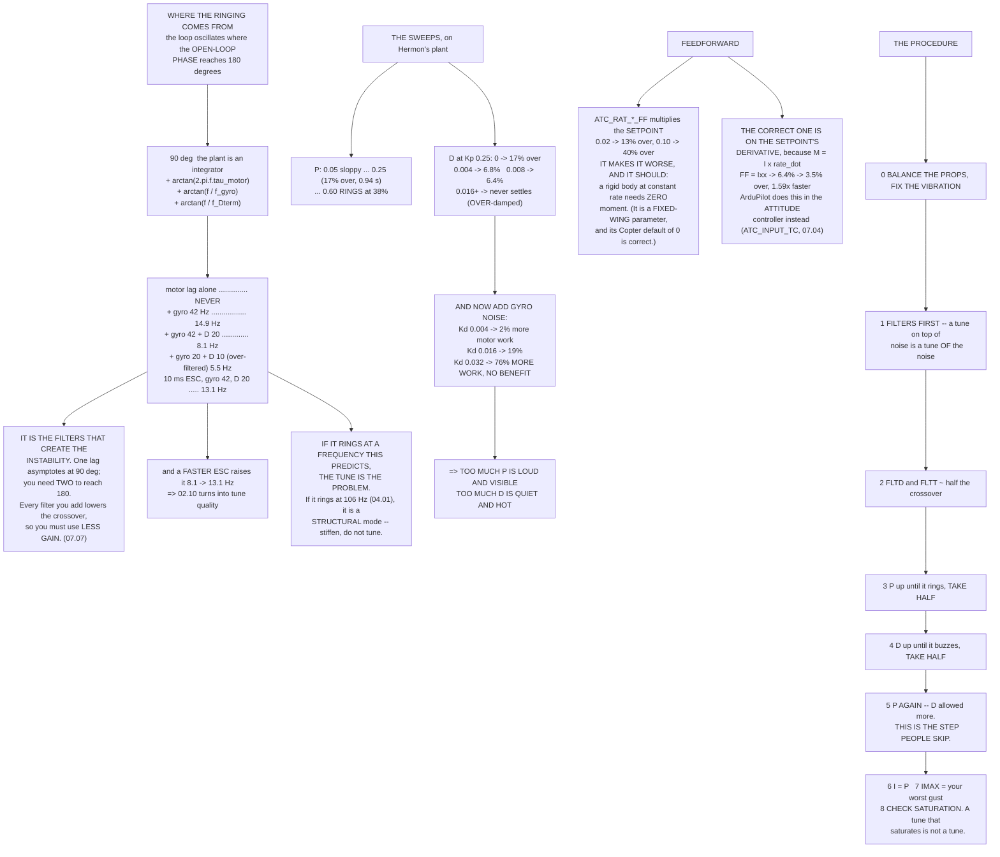

# 07.03 Rate loops: the innermost and the most important

<!-- glance:start -->
<!-- generated by tools/build.py from curriculum/syllabus.yaml — edit the syllabus, not this block -->

| | |
|---|---|
| **Track** | Main path |
| **Difficulty** | Advanced |
| **Time** | 1 h 45 min |
| **Hardware** | none |
| **Software** | python, ardupilot |
| **Prerequisites** | [07.02 The cascade: rate → attitude → velocity → position](07.02-cascaded-loops.md) |
| **Skip if** | You can tune a rate loop from a step response, recognise P, I and D oscillation signatures in a log, and stop before the motors saturate. |

<!-- glance:end -->

## What you will learn

- Every `ATC_RAT_*` parameter, and what each one is in
  [07.01](07.01-pid-for-flight.md)'s language
- **Where the oscillation frequency comes from** — computed from your motor lag and your filters,
  before you ever fly
- The uncomfortable discovery that **it is the filters that create the instability**
- A P sweep and a D sweep on Hermon's actual plant, with the numbers
- Why too much P is **loud** and too much D is **quiet and hot**
- Why `ATC_RAT_*_FF` makes a multirotor *worse*, and what the correct feedforward actually is
- The tuning procedure in order, and the four oscillation signatures with their frequencies

## Why it matters

[07.02](07.02-cascaded-loops.md) established that the cascade must be tuned from the inside out,
and that if the rate loop is oscillating nothing outside it can be judged at all. This is that
loop.

It is also the loop that decides what the aircraft *feels* like. The attitude loop decides whether
it holds an angle; the position loop decides whether it holds a spot; the rate loop decides
whether it is crisp or sloppy, quiet or buzzing, and whether the motors run warm or hot.

And it is the loop people most often tune by feel, which is a shame, because **the frequency it
will ring at is computable from two numbers you already have**.

## Prerequisites

<!-- prereqs:start -->
## Prerequisites

You need these first:

- [07.02 The cascade: rate → attitude → velocity → position](07.02-cascaded-loops.md)

### Optional prerequisite links

None.

Check your readiness: `python course.py why 07.03`
<!-- prereqs:end -->

## Concept

### The parameters

| Parameter | Is | Default | Note |
|---|---|---:|---|
| `ATC_RAT_RLL_P` | rate error → moment | 0.135 | the main gain |
| `ATC_RAT_RLL_I` | removes steady error | 0.135 | ArduPilot defaults I = P |
| `ATC_RAT_RLL_D` | damping | 0.0036 | the one that makes or breaks a tune |
| `ATC_RAT_RLL_FF` | setpoint → moment | **0.0** | and see section 5 |
| `ATC_RAT_RLL_IMAX` | integrator clamp | 0.5 | in output units |
| `ATC_RAT_RLL_FLTT` | **setpoint** low-pass, Hz | 20.0 | smooths the demand |
| `ATC_RAT_RLL_FLTD` | **D-term** low-pass, Hz | 20.0 | the [07.01](07.01-pid-for-flight.md) phase trade |
| `ATC_RAT_RLL_FLTE` | **error** low-pass, Hz | 0.0 | rarely needed |
| `ATC_RATE_R_MAX` | rate limit, °/s | 0.0 | 0 = no limit |

Pitch is `ATC_RAT_PIT_*` and yaw `ATC_RAT_YAW_*`. Roll and pitch should be **close but not
identical**: [04.02](../04-frame-and-assembly/04.02-mass-and-center-of-mass.md) measured
$I_{yy}$ 13 % higher than $I_{xx}$, so pitch wants about 13 % more P.

**Yaw is a different animal.** 04.02 again: 48× less control authority, driven by reaction torque
rather than thrust, so its gains are larger, its response is slower, and its D term is usually
zero.

### Where the oscillation frequency comes from

A loop rings at the frequency where its **open-loop phase reaches 180°**. For a rate loop that is:

$$\phi(f) = \underbrace{90°}_{\text{the plant is an integrator}}
+ \underbrace{\arctan(2\pi f\tau_m)}_{\text{motor and ESC}}
+ \underbrace{\arctan(f/f_{gyro})}_{\text{gyro filter}}
+ \underbrace{\arctan(f/f_{D})}_{\text{D-term filter}}$$

and you can compute it before you ever fly:

| Configuration | Rings at |
|---|---:|
| Motor lag only (30 ms) | **never** |
| + gyro filter 42 Hz | **14.9 Hz** |
| + gyro 42 + D filter 20 Hz | **8.1 Hz** |
| + gyro 20 + D filter 10 Hz (over-filtered) | **5.5 Hz** |
| A faster ESC: 10 ms lag, gyro 42, D 20 | **13.1 Hz** |

> [!IMPORTANT]
> **The first row is not a typo.** A single first-order lag asymptotes at 90°, so the plant's 90°
> plus the motor's 90° only reaches 180° at infinite frequency. A rate loop with no filtering at
> all is, in this model, unconditionally stable — it simply gets noisier as you raise the gain.
>
> **It is the filters that create the instability.** Every filter you add to clean up the gyro
> brings the crossover down, and a lower crossover means less bandwidth, which means less usable
> gain, which means a softer loop at everything. That is the whole argument of
> [07.07](07.07-filtering-and-methodic-tuning.md), arriving early.

And read the last two rows against the middle one. Over-filtering drops the ring frequency from
8.1 Hz to 5.5 Hz; a faster ESC raises it from 8.1 to 13.1 — which is
[02.10](../02-motors-escs-props/02.10-esc-tuning.md) turning directly into tune quality.

> [!IMPORTANT]
> **If your aircraft rings at a frequency this table predicts, the tune is the problem.** If it
> rings somewhere else — 106 Hz on Hermon — look for a **structural mode**
> ([04.01](../04-frame-and-assembly/04.01-frames.md)) instead, and stiffen rather than tune.

### The tuning table

A 100 °/s step on Hermon's plant. P first, D and I at zero:

| Kp | Overshoot | Settle (2 %) | Motor RMS | |
|---:|---:|---:|---:|---|
| 0.050 | 14.8 % | never | 0.026 N·m | sloppy |
| 0.100 | 9.9 % | never | 0.037 N·m | usable |
| 0.150 | 10.3 % | 1.473 s | 0.047 N·m | usable |
| **0.250** | 17.1 % | **0.935 s** | 0.066 N·m | usable |
| 0.400 | 27.4 % | **0.398 s** | 0.094 N·m | usable |
| 0.600 | **38.2 %** | 0.297 s | 0.133 N·m | **ringing** |

Then fix Kp = 0.25 and sweep D:

| Kd | Overshoot | Settle (2 %) | Motor RMS | |
|---:|---:|---:|---:|---|
| 0.0000 | 17.1 % | 0.935 s | 0.066 N·m | ringing |
| 0.0020 | 10.6 % | 1.105 s | 0.061 N·m | clean |
| **0.0040** | **6.8 %** | 1.253 s | 0.058 N·m | **clean** |
| 0.0080 | 6.4 % | 1.498 s | 0.053 N·m | clean |
| 0.0160 | 7.9 % | never | 0.046 N·m | over-damped, slow |
| 0.0320 | 10.7 % | never | 0.040 N·m | over-damped, slow |

D buys back the overshoot, and on a **clean** step it actually *reduces* the motor effort
(0.066 → 0.040 N·m) because there is less overshoot to undo. Past about Kd = 0.016 it stops
settling at all — over-damped is a real failure mode too.

So why is D dangerous? **Because a real gyro is not clean.**

### D and noise: why the motors get hot

The same sweep, now with realistic gyro noise on the measurement. Nothing about the *aircraft*
changed:

| Kd | Overshoot | Motor RMS, quiet | With noise | Extra work |
|---:|---:|---:|---:|---:|
| 0.0000 | 17.1 % | 0.066 N·m | 0.066 | 1 % |
| 0.0040 | 6.4 % | 0.058 N·m | 0.059 | 2 % |
| 0.0080 | 6.4 % | 0.053 N·m | 0.055 | 5 % |
| 0.0160 | 7.6 % | 0.046 N·m | 0.055 | **19 %** |
| **0.0320** | 11.5 % | 0.040 N·m | 0.071 | **76 %** |

At Kd = 0.032 the motors are doing substantially more work **for no control benefit** — they are
chasing gyro noise. In the air that is heat, current, and a characteristic high-pitched buzz.

> [!IMPORTANT]
> **This is the most reliable way to tell "too much D" from "too much P".**
> **Too much P is loud and visible** — you can see the aircraft shaking and hear the motors
> modulating, and it is worse with stick input.
> **Too much D is quiet and hot** — a buzz rather than a wobble, the aircraft looks fine, and the
> motors are too hot to hold after a two-minute hover.

### Feedforward: the one that is usually explained wrong

`ATC_RAT_*_FF` multiplies the rate **setpoint**. Try it:

| | Overshoot | Settle |
|---|---:|---:|
| No feedforward | 6.4 % | 1.498 s |
| FF × setpoint = 0.02 | 12.9 % | never |
| FF × setpoint = 0.05 | 23.0 % | never |
| FF × setpoint = 0.10 | **40.2 %** | never |

**It makes it worse, and it should.** A rigid body at a *constant* angular rate needs **zero**
moment — there is no aerodynamic damping to overcome. Feeding forward a moment proportional to the
*rate* is feeding forward a moment the aircraft does not need, and the loop has to cancel it.

`ATC_RAT_*_FF` exists for fixed-wing aircraft, where a control surface genuinely does need a
steady deflection to hold a steady rate. **Its default on Copter is 0, and that is correct.**

The correct feedforward is on the setpoint's **derivative**, because $M = I\dot\omega$:

| | Overshoot | Settle | vs none |
|---|---:|---:|---:|
| None | 6.4 % | 1.498 s | 1.00× |
| FF × $\dot r$ = I/2 | 4.5 % | 1.163 s | 1.29× |
| **FF × $\dot r$ = I** | **3.5 %** | **0.940 s** | **1.59×** |
| FF × $\dot r$ = 2I | 3.5 % | 0.940 s | 1.59× |

Hermon's $I_{xx}$ is 0.01199 kg·m², so "I" here is the physically correct value and you can read
it straight off [04.02](../04-frame-and-assembly/04.02-mass-and-center-of-mass.md).

On a multirotor ArduPilot does this in the **attitude controller**, by shaping the rate setpoint
with a known acceleration limit (`ATC_INPUT_TC` and `ATC_ACCEL_*_MAX`) rather than as a rate-loop
parameter. That is [07.04](07.04-attitude-loops.md).

> [!TIP]
> **Ask your teacher:** "My aircraft rings at about 8 Hz when I raise P and my computed crossover
> is 8.1 Hz — so far so good. But it also has a peak at 106 Hz that does not move when I change
> gains. Walk me through why the second one is not a tuning problem, and what I should actually do
> about it."

### The procedure, in order

| Step | Do | Why |
|---|---|---|
| **0** | Balance the propellers, fix the vibration | [02.09](../02-motors-escs-props/02.09-heat-vibration-noise.md), [04.04](../04-frame-and-assembly/04.04-mounting-and-vibration.md). Every step below gets easier |
| **1** | Filters first: `INS_GYRO_FILTER`, the harmonic notch | [07.07](07.07-filtering-and-methodic-tuning.md). **A tune on top of noise is a tune of the noise** |
| **2** | Set `FLTD` and `FLTT`, both about half the ring frequency | section 2 predicts that frequency |
| **3** | P up, D and I at zero, until it rings — then take **half** | log `RATE.RDes` against `RATE.R` |
| **4** | D up until the motors buzz or it rings fast — then take half | feel the motors: hot means too much |
| **5** | **P again.** D allowed more P; find the new limit | this iteration is the part people skip |
| **6** | I = P | ArduPilot's default relationship, and a good one |
| **7** | IMAX = the largest disturbance moment you expect | [07.01](07.01-pid-for-flight.md): too small and it cannot reject wind |
| **8** | Check saturation: `RCOU` at the stops, or the limit flags | **a tune that saturates is not a tune** |

And the four signatures, so you know which knob you are on:

| Symptom | Frequency | How it presents |
|---|---|---|
| **P too high** | ~8 Hz (your crossover) | loud, visible, worse with stick input |
| **D too high** | higher, 30–60 Hz | **quiet**, hot motors, a buzz, worse at high throttle |
| **I too high** | 1–3 Hz | a slow wallow that builds **after** an input, not during |
| **A structural mode** | [04.01](../04-frame-and-assembly/04.01-frames.md)'s 106 Hz, fixed | **does not move** when you change gains — stiffen, do not tune |

## Technical explanation

### Level 1 — Intuition: pushing a swing

P is how hard you push for a given error. Too little and the swing never gets where you want; too
much and it goes past and comes back, over and over.

D is watching how fast the swing is already moving and easing off. It is the only thing that lets
you push hard *and* stop cleanly.

The catch is that to know how fast it is moving you have to *measure* it, and if your eyes are
blurry — a noisy gyro — then "easing off in proportion to speed" becomes "twitching in proportion
to blur". That is the D term with vibration, and it is why you fix the vibration before you tune.

### Level 2 — Practical: getting a step response

You need a clean, repeatable input and a log of what happened.

1. **ACRO mode**, so nothing outside the rate loop is involved.
2. A **sharp, brief** roll input — as close to a step as a stick can manage. Or use ArduPilot's
   system-identification mode if your firmware has it.
3. Log at a high rate: `LOG_BITMASK` including `RATE`, and `RATE.RDes` (demanded) against
   `RATE.R` (achieved).
4. Read off: **rise time**, **overshoot**, **settling time**, and whether `RCOU` hit the stops.

Do this at a realistic hover throttle, not on the bench with no thrust: the plant's gain depends
on throttle, because the same motor command produces a different thrust *difference* at different
operating points ([07.06](07.06-mixing-and-allocation.md)'s thrust linearisation).

### Level 3 — Mathematics

**The open-loop transfer function**, with motor lag $\tau_m$, gyro filter $\tau_g$ and D-filter
$\tau_d$:

$$L(s) = \left(K_p + \frac{K_i}{s} + \frac{K_d s}{1+\tau_d s}\right)
\cdot \frac{1}{1+\tau_m s}\cdot\frac{1}{Is}\cdot\frac{1}{1+\tau_g s}$$

The $1/(Is)$ contributes a fixed **−90°**. Each lag contributes $-\arctan(\omega\tau)$, and each
asymptotes at −90°. So:

- **One lag** plus the integrator: −180° only as $\omega\to\infty$. Never crosses.
- **Two lags**: −180° at a finite frequency. That is the crossover, and it is where the loop
  rings.

The D term's $K_d s/(1+\tau_d s)$ contributes *positive* phase (up to +90° at low frequency,
falling to 0 above $1/\tau_d$) — which is exactly the damping it provides, and exactly what
$\tau_d$ takes away.

**Why "take half".** At the gain where the loop just oscillates, the phase margin is zero. Halving
the gain drops the magnitude by 6 dB, which on a typical loop with a −20 to −40 dB/decade rolloff
moves the gain-crossover frequency down enough to recover 30–45° of phase margin. It is not
precise, and it is reliable.

**Ziegler–Nichols**, for reference, says $K_p = 0.6K_u$ and $T_i = T_u/2$ at the ultimate gain
$K_u$ and period $T_u$. That is more aggressive than most multirotor pilots want, and it assumes a
plant with more damping than a quadcopter has — which is why the folk rule is half rather than
0.6.

### Level 4 — Implementation: what to record

| | Your value |
|---|---|
| Motor + ESC lag | |
| `INS_GYRO_FILTER` | |
| `ATC_RAT_RLL_FLTD` | |
| **Computed crossover** | |
| P at which it rang | |
| P chosen (half) | |
| D at which it buzzed | |
| D chosen | |
| Final P after the second iteration | |
| Measured ring frequency, from a log | |
| Does it match the computed crossover? | |

That last row is the whole point. If the measured and computed frequencies agree, you understand
your aircraft. If they do not, something in the chain is not what you think it is — and finding
out what is more valuable than any gain.

## Diagram



## Code

Save as `rate_loop.py` and run `python rate_loop.py`. Standard library only.

```python
"""07.03 - tuning the rate loop: where the oscillation comes from and what stops it."""
import math

G = 9.81
IXX = 0.01199             # kg.m^2 (04.02)
L_CTRL = 0.1591           # m
T_HOVER = 3.556           # N per motor
T_MAX = 13.43             # N per motor
M_UP = 4 * (T_MAX - T_HOVER) * L_CTRL
M_DOWN = 4 * T_HOVER * L_CTRL
MOTOR_TAU = 0.030         # s (02.10)
GYRO_FLT = 42.0           # Hz, INS_GYRO_FILTER default
DT = 1.0 / 400.0

PARAMS = [
    ("ATC_RAT_RLL_P", "rate error -> moment", 0.135, "the main gain"),
    ("ATC_RAT_RLL_I", "removes steady error", 0.135, "ArduPilot defaults I = P"),
    ("ATC_RAT_RLL_D", "damping", 0.0036, "the one that makes or breaks a tune"),
    ("ATC_RAT_RLL_FF", "setpoint -> moment", 0.0, "free response; set it"),
    ("ATC_RAT_RLL_IMAX", "integrator clamp", 0.5, "in output units"),
    ("ATC_RAT_RLL_FLTT", "SETPOINT low-pass, Hz", 20.0, "smooths the demand"),
    ("ATC_RAT_RLL_FLTD", "D-TERM low-pass, Hz", 20.0, "the 07.01 phase trade"),
    ("ATC_RAT_RLL_FLTE", "ERROR low-pass, Hz", 0.0, "rarely needed"),
    ("ATC_RATE_R_MAX", "rate limit, deg/s", 0.0, "0 = no limit"),
]


def phase_total(f, lags):
    """Total open-loop phase, degrees, including the plant's own 90 deg."""
    tot = 90.0
    for kind, val in lags:
        if kind == "tau":
            tot += math.degrees(math.atan(2 * math.pi * f * val))
        else:                                  # a corner frequency in Hz
            tot += math.degrees(math.atan(f / val))
    return tot


def crossover(lags, lo=0.5, hi=400.0):
    """The frequency at which the open loop reaches 180 deg: the ring frequency."""
    if phase_total(hi, lags) < 180.0:
        return None                       # one lag alone never gets there
    for _ in range(200):
        mid = math.sqrt(lo * hi)
        if phase_total(mid, lags) < 180.0:
            lo = mid
        else:
            hi = mid
    return math.sqrt(lo * hi)


def run(kp, ki, kd, ff=0.0, ffd=0.0, sp_dps=100.0, step_at=0.2, sim_s=2.0,
        fltd=20.0, gyro_flt=GYRO_FLT, noise=0.0, seed=1):
    """Rate loop with a filtered gyro, a filtered D term and saturation."""
    import random
    rnd = random.Random(seed)
    sp = math.radians(sp_dps)
    rate, integ, prev_meas, d_filt, m_act, g_filt = 0.0, 0.0, 0.0, 0.0, 0.0, 0.0
    prev_sp = 0.0
    a_g = DT / (1 / (2 * math.pi * gyro_flt) + DT)
    a_d = DT / (1 / (2 * math.pi * fltd) + DT)
    n = int(sim_s / DT)
    peak, settle, sat, out = 0.0, None, 0, []
    m_rms = 0.0
    for i in range(n):
        t = i * DT
        r = sp if t >= step_at else 0.0
        g_filt += (rate + rnd.gauss(0, noise) - g_filt) * a_g
        meas = g_filt
        err = r - meas
        d_raw = -(meas - prev_meas) / DT
        prev_meas = meas
        d_filt += (d_raw - d_filt) * a_d
        r_dot = (r - prev_sp) / DT
        prev_sp = r
        m_cmd = kp * err + integ + kd * d_filt + ff * r + ffd * r_dot
        m_s = max(-M_DOWN, min(M_UP, m_cmd))
        if abs(m_s - m_cmd) > 1e-9:
            sat += 1
        elif True:
            integ += ki * err * DT
        integ = max(-0.5, min(0.5, integ))
        m_act += (m_s - m_act) * (DT / (MOTOR_TAU + DT))
        rate += m_act / IXX * DT
        m_rms += (m_s - (ff * r)) ** 2
        peak = max(peak, rate)
        if t >= step_at:
            if abs(rate - sp) < 0.02 * sp and settle is None:
                settle = t - step_at
            elif abs(rate - sp) >= 0.02 * sp:
                settle = None
        out.append(rate)
    over = (peak - sp) / sp * 100 if peak > sp else 0.0
    return {"over": over, "settle": settle, "sat": sat / n,
            "mrms": math.sqrt(m_rms / n), "trace": out}


def bar(t):
    print("\n" + "=" * 70)
    print(t)
    print("=" * 70)


if __name__ == "__main__":
    bar("1. THE PARAMETERS, AND WHAT EACH ONE IS")
    print(f"  {'parameter':20s} {'is':26s} {'default':>9s}  note")
    for name, what, dflt, note in PARAMS:
        print(f"  {name:20s} {what:26s} {dflt:9g}  {note}")
    print("  Pitch is ATC_RAT_PIT_*, yaw ATC_RAT_YAW_*. Roll and pitch")
    print("  should be CLOSE but not identical: 04.02 measured Iyy 13 %")
    print("  higher than Ixx, so pitch wants about 13 % more P.")
    print("  YAW IS A DIFFERENT ANIMAL -- 04.02 again: 48x less authority,")
    print("  so its gains are larger and its D is usually zero.")

    bar("2. WHERE THE OSCILLATION FREQUENCY COMES FROM")
    print("  A loop rings at the frequency where its OPEN-LOOP PHASE")
    print("  reaches 180 degrees. For a rate loop that is:")
    print("      90 deg (the plant is an integrator)")
    print("    + the motor and ESC lag")
    print("    + the gyro filter")
    print("    + the D-term filter")
    print("  and you can compute it before you ever fly.")
    print(f"  {'configuration':46s} {'rings at':>10s}")
    cfgs = [
        ("motor lag only (30 ms)", [("tau", MOTOR_TAU)]),
        ("+ gyro filter 42 Hz", [("tau", MOTOR_TAU), ("f", 42.0)]),
        ("+ gyro 42 + D filter 20 Hz",
         [("tau", MOTOR_TAU), ("f", 42.0), ("f", 20.0)]),
        ("+ gyro 20 + D filter 10 Hz  (over-filtered)",
         [("tau", MOTOR_TAU), ("f", 20.0), ("f", 10.0)]),
        ("a faster ESC: 10 ms lag, gyro 42, D 20",
         [("tau", 0.010), ("f", 42.0), ("f", 20.0)]),
    ]
    for name, lags in cfgs:
        f = crossover(lags)
        txt = "never" if f is None else f"{f:.1f} Hz"
        print(f"  {name:46s} {txt:>10s}")
    print("  THE FIRST ROW IS NOT A TYPO. A single first-order lag")
    print("  asymptotes at 90 degrees, so the plant's 90 plus the motor's")
    print("  90 only REACHES 180 at infinite frequency -- a rate loop with")
    print("  no filtering at all is (in this model) unconditionally stable")
    print("  and simply gets noisier as you raise the gain. IT IS THE")
    print("  FILTERS THAT CREATE THE INSTABILITY, and 07.07 is about")
    print("  spending them carefully.")
    print("  READ THE LAST TWO ROWS AGAINST THE MIDDLE ONE.")
    print("  OVER-FILTERING DROPS THE RING FREQUENCY, which sounds")
    print("  harmless and is not: a lower crossover means LESS BANDWIDTH,")
    print("  so you must use LESS GAIN, so the loop is softer at")
    print("  everything. And a faster ESC raises it -- which is 02.10")
    print("  turning into tune quality.")
    print("  IF YOUR AIRCRAFT RINGS AT A FREQUENCY THIS TABLE PREDICTS,")
    print("  THE TUNE IS THE PROBLEM. If it rings somewhere else, look for")
    print("  a STRUCTURAL mode (04.01's 106 Hz) instead.")

    bar("3. THE TUNING TABLE: SWEEP P, THEN SWEEP D")
    print(f"  A 100 deg/s step. Rise, overshoot, settling, and the RMS")
    print(f"  moment the motors had to produce.")
    print(f"  {'Kp':>6s} {'Kd':>7s} {'overshoot':>10s} {'settle 2%':>11s}"
          f" {'motor RMS':>11s} {'verdict':>20s}")
    best = None
    for kp in (0.05, 0.10, 0.15, 0.25, 0.40, 0.60):
        r = run(kp, kp, 0.0)
        st = f"{r['settle']:.3f} s" if r["settle"] else "never"
        v = ("sloppy" if r["over"] < 5 and (r["settle"] or 9) > 0.8 else
             "RINGING" if r["over"] > 35 else "usable")
        print(f"  {kp:6.3f} {0.0:7.4f} {r['over']:8.1f} % {st:>11s}"
              f" {r['mrms']:9.3f} N.m {v:>20s}")
    print("  P ALONE: more is faster and rings more, exactly as 07.01 said.")
    print(f"\n  Now fix Kp and sweep D:")
    for kd in (0.0, 0.002, 0.004, 0.008, 0.016, 0.032):
        r = run(0.25, 0.25, kd)
        st = f"{r['settle']:.3f} s" if r["settle"] else "never"
        v = ("over-damped, slow" if r["settle"] is None else
             "over-damped" if r["over"] < 2 else
             "clean" if r["over"] < 12 else "ringing")
        if best is None or (r["over"] < 12 and r["settle"]
                            and r["settle"] < best[1]):
            best = (kd, r["settle"] or 9.9)
        print(f"  {0.25:6.3f} {kd:7.4f} {r['over']:8.1f} % {st:>11s}"
              f" {r['mrms']:9.3f} N.m {v:>20s}")
    print("  D BUYS BACK THE OVERSHOOT, and on a CLEAN step it actually")
    print("  reduces the motor effort (0.066 -> 0.040 N.m) because there")
    print("  is less overshoot to undo. Past about Kd = 0.016 it stops")
    print("  settling at all -- over-damped is a real failure mode too.")
    print("  SO WHY IS D DANGEROUS? Because a real gyro is not clean.")

    bar("4. D AND NOISE: WHY THE MOTORS GET HOT")
    print("  The same sweep, now with realistic gyro noise on the")
    print("  measurement. Nothing about the AIRCRAFT changed.")
    print(f"  {'Kd':>7s} {'overshoot':>10s} {'motor RMS, quiet':>17s}"
          f" {'with noise':>12s} {'extra work':>11s}")
    for kd in (0.0, 0.004, 0.008, 0.016, 0.032):
        q = run(0.25, 0.25, kd, noise=0.0)
        n_ = run(0.25, 0.25, kd, noise=math.radians(2.0))
        extra = (n_["mrms"] / q["mrms"] - 1) * 100 if q["mrms"] else 0
        print(f"  {kd:7.4f} {n_['over']:8.1f} % {q['mrms']:15.3f} N.m"
              f" {n_['mrms']:10.3f} {extra:9.0f} %")
    print("  AT Kd = 0.032 THE MOTORS ARE DOING SUBSTANTIALLY MORE WORK")
    print("  FOR NO CONTROL BENEFIT -- they are chasing gyro noise. In the")
    print("  air that is heat, current and a characteristic high-pitched")
    print("  buzz, and it is the single most reliable way to tell 'too")
    print("  much D' from 'too much P': TOO MUCH P IS LOUD AND VISIBLE,")
    print("  TOO MUCH D IS QUIET AND HOT.")

    bar("5. FEEDFORWARD: THE ONE THAT IS USUALLY EXPLAINED WRONG")
    print("  ArduPilot's ATC_RAT_*_FF multiplies the rate SETPOINT. Try it:")
    print(f"  {'':24s} {'overshoot':>10s} {'settle 2%':>11s}")
    for label, ff in (("no feedforward", 0.0), ("FF x setpoint = 0.02", 0.02),
                      ("FF x setpoint = 0.05", 0.05),
                      ("FF x setpoint = 0.10", 0.10)):
        r = run(0.25, 0.25, 0.008, ff=ff)
        st = f"{r['settle']:.3f} s" if r["settle"] else "never"
        print(f"  {label:24s} {r['over']:8.1f} % {st:>11s}")
    print("  IT MAKES IT WORSE, AND IT SHOULD. A rigid body at a CONSTANT")
    print("  angular rate needs ZERO moment -- there is no aerodynamic")
    print("  damping to overcome. Feeding forward a moment proportional to")
    print("  the RATE is feeding forward a moment the aircraft does not")
    print("  need, and the loop has to cancel it.")
    print("  (ATC_RAT_*_FF exists for fixed-wing, where a control surface")
    print("   DOES need a steady deflection to hold a steady rate. Its")
    print("   default on Copter is 0, and that is correct.)")
    print("\n  THE CORRECT FEEDFORWARD IS ON THE SETPOINT'S DERIVATIVE,")
    print("  because moment = I x rate_dot:")
    print(f"  {'':24s} {'overshoot':>10s} {'settle 2%':>11s}"
          f" {'vs none':>10s}")
    base = run(0.25, 0.25, 0.008)
    for label, ffd in (("none", 0.0),
                       ("FF x rate_dot = I/2", IXX / 2),
                       ("FF x rate_dot = I", IXX),
                       ("FF x rate_dot = 2I", 2 * IXX)):
        r = run(0.25, 0.25, 0.008, ffd=ffd)
        st = f"{r['settle']:.3f} s" if r["settle"] else "never"
        gain = (f"{base['settle'] / r['settle']:.2f}x"
                if r["settle"] and base["settle"] else "--")
        print(f"  {label:24s} {r['over']:8.1f} % {st:>11s} {gain:>10s}")
    print(f"  (Hermon's Ixx is {IXX:.5f} kg.m^2, so 'I' here is the")
    print("   physically correct value and you can read it off 04.02.)")
    print("  ON A MULTIROTOR ARDUPILOT DOES THIS IN THE ATTITUDE")
    print("  CONTROLLER, by shaping the rate setpoint with a known")
    print("  acceleration limit (ATC_INPUT_TC and ATC_ACCEL_*_MAX) rather")
    print("  than as a rate-loop parameter. That is 07.04.")

    bar("6. THE PROCEDURE, IN ORDER")
    steps = [
        ("0. BEFORE ANYTHING", "balance the props, fix the vibration",
         "02.09, 04.04 -- every step below is easier"),
        ("1. filters first", "INS_GYRO_FILTER, the harmonic notch",
         "07.07. A tune on top of noise is a tune of the noise"),
        ("2. set FLTD and FLTT", "both about half the ring frequency",
         "section 2 predicts that frequency"),
        ("3. P up, D and I at 0", "until it rings, then take HALF",
         "listen and watch; log RATE.RDes vs RATE.R"),
        ("4. D up", "until the motors buzz or it rings FAST",
         "then take half. Feel the motors: hot = too much"),
        ("5. P again", "D allowed more P; go back and find the new limit",
         "this iteration is the part people skip"),
        ("6. I = P", "ArduPilot's default relationship, and a good one",
         "raise it only if it drifts in wind"),
        ("7. IMAX", "the largest disturbance moment you expect",
         "07.01: too small and it cannot reject wind"),
        ("8. check saturation", "RCOU at the stops, or the limit flags",
         "a tune that saturates is not a tune"),
    ]
    for a, b, c in steps:
        print(f"  {a}")
        print(f"       {b}")
        print(f"       ({c})")
    print("\n  AND THE THREE SIGNATURES, so you know which knob you are on:")
    sigs = [
        ("P too high", f"{crossover([('tau', MOTOR_TAU), ('f', 42.0), ('f', 20.0)]):.0f} Hz-ish",
         "loud, visible, worse with stick input"),
        ("D too high", "higher than that, 30-60 Hz",
         "QUIET, hot motors, a buzz, worse at high throttle"),
        ("I too high", "1-3 Hz",
         "a slow wallow that builds AFTER an input, not during"),
        ("a structural mode", "04.01's 106 Hz, fixed",
         "does NOT move when you change gains -- stiffen, do not tune"),
    ]
    print(f"  {'symptom':20s} {'frequency':22s} how it presents")
    for a, b, c in sigs:
        print(f"  {a:20s} {b:22s} {c}")
```

Output:

```text

======================================================================
1. THE PARAMETERS, AND WHAT EACH ONE IS
======================================================================
  parameter            is                           default  note
  ATC_RAT_RLL_P        rate error -> moment           0.135  the main gain
  ATC_RAT_RLL_I        removes steady error           0.135  ArduPilot defaults I = P
  ATC_RAT_RLL_D        damping                       0.0036  the one that makes or breaks a tune
  ATC_RAT_RLL_FF       setpoint -> moment                 0  free response; set it
  ATC_RAT_RLL_IMAX     integrator clamp                 0.5  in output units
  ATC_RAT_RLL_FLTT     SETPOINT low-pass, Hz             20  smooths the demand
  ATC_RAT_RLL_FLTD     D-TERM low-pass, Hz               20  the 07.01 phase trade
  ATC_RAT_RLL_FLTE     ERROR low-pass, Hz                 0  rarely needed
  ATC_RATE_R_MAX       rate limit, deg/s                  0  0 = no limit
  Pitch is ATC_RAT_PIT_*, yaw ATC_RAT_YAW_*. Roll and pitch
  should be CLOSE but not identical: 04.02 measured Iyy 13 %
  higher than Ixx, so pitch wants about 13 % more P.
  YAW IS A DIFFERENT ANIMAL -- 04.02 again: 48x less authority,
  so its gains are larger and its D is usually zero.

======================================================================
2. WHERE THE OSCILLATION FREQUENCY COMES FROM
======================================================================
  A loop rings at the frequency where its OPEN-LOOP PHASE
  reaches 180 degrees. For a rate loop that is:
      90 deg (the plant is an integrator)
    + the motor and ESC lag
    + the gyro filter
    + the D-term filter
  and you can compute it before you ever fly.
  configuration                                    rings at
  motor lag only (30 ms)                              never
  + gyro filter 42 Hz                               14.9 Hz
  + gyro 42 + D filter 20 Hz                         8.1 Hz
  + gyro 20 + D filter 10 Hz  (over-filtered)        5.5 Hz
  a faster ESC: 10 ms lag, gyro 42, D 20            13.1 Hz
  THE FIRST ROW IS NOT A TYPO. A single first-order lag
  asymptotes at 90 degrees, so the plant's 90 plus the motor's
  90 only REACHES 180 at infinite frequency -- a rate loop with
  no filtering at all is (in this model) unconditionally stable
  and simply gets noisier as you raise the gain. IT IS THE
  FILTERS THAT CREATE THE INSTABILITY, and 07.07 is about
  spending them carefully.
  READ THE LAST TWO ROWS AGAINST THE MIDDLE ONE.
  OVER-FILTERING DROPS THE RING FREQUENCY, which sounds
  harmless and is not: a lower crossover means LESS BANDWIDTH,
  so you must use LESS GAIN, so the loop is softer at
  everything. And a faster ESC raises it -- which is 02.10
  turning into tune quality.
  IF YOUR AIRCRAFT RINGS AT A FREQUENCY THIS TABLE PREDICTS,
  THE TUNE IS THE PROBLEM. If it rings somewhere else, look for
  a STRUCTURAL mode (04.01's 106 Hz) instead.

======================================================================
3. THE TUNING TABLE: SWEEP P, THEN SWEEP D
======================================================================
  A 100 deg/s step. Rise, overshoot, settling, and the RMS
  moment the motors had to produce.
      Kp      Kd  overshoot   settle 2%   motor RMS              verdict
   0.050  0.0000     14.8 %       never     0.026 N.m               usable
   0.100  0.0000      9.9 %       never     0.037 N.m               usable
   0.150  0.0000     10.3 %     1.473 s     0.047 N.m               usable
   0.250  0.0000     17.1 %     0.935 s     0.066 N.m               usable
   0.400  0.0000     27.4 %     0.398 s     0.094 N.m               usable
   0.600  0.0000     38.2 %     0.297 s     0.133 N.m              RINGING
  P ALONE: more is faster and rings more, exactly as 07.01 said.

  Now fix Kp and sweep D:
   0.250  0.0000     17.1 %     0.935 s     0.066 N.m              ringing
   0.250  0.0020     10.6 %     1.105 s     0.061 N.m                clean
   0.250  0.0040      6.8 %     1.253 s     0.058 N.m                clean
   0.250  0.0080      6.4 %     1.498 s     0.053 N.m                clean
   0.250  0.0160      7.9 %       never     0.046 N.m    over-damped, slow
   0.250  0.0320     10.7 %       never     0.040 N.m    over-damped, slow
  D BUYS BACK THE OVERSHOOT, and on a CLEAN step it actually
  reduces the motor effort (0.066 -> 0.040 N.m) because there
  is less overshoot to undo. Past about Kd = 0.016 it stops
  settling at all -- over-damped is a real failure mode too.
  SO WHY IS D DANGEROUS? Because a real gyro is not clean.

======================================================================
4. D AND NOISE: WHY THE MOTORS GET HOT
======================================================================
  The same sweep, now with realistic gyro noise on the
  measurement. Nothing about the AIRCRAFT changed.
       Kd  overshoot  motor RMS, quiet   with noise  extra work
   0.0000     17.1 %           0.066 N.m      0.066         1 %
   0.0040      6.4 %           0.058 N.m      0.059         2 %
   0.0080      6.4 %           0.053 N.m      0.055         5 %
   0.0160      7.6 %           0.046 N.m      0.055        19 %
   0.0320     11.5 %           0.040 N.m      0.071        76 %
  AT Kd = 0.032 THE MOTORS ARE DOING SUBSTANTIALLY MORE WORK
  FOR NO CONTROL BENEFIT -- they are chasing gyro noise. In the
  air that is heat, current and a characteristic high-pitched
  buzz, and it is the single most reliable way to tell 'too
  much D' from 'too much P': TOO MUCH P IS LOUD AND VISIBLE,
  TOO MUCH D IS QUIET AND HOT.

======================================================================
5. FEEDFORWARD: THE ONE THAT IS USUALLY EXPLAINED WRONG
======================================================================
  ArduPilot's ATC_RAT_*_FF multiplies the rate SETPOINT. Try it:
                            overshoot   settle 2%
  no feedforward                6.4 %     1.498 s
  FF x setpoint = 0.02         12.9 %       never
  FF x setpoint = 0.05         23.0 %       never
  FF x setpoint = 0.10         40.2 %       never
  IT MAKES IT WORSE, AND IT SHOULD. A rigid body at a CONSTANT
  angular rate needs ZERO moment -- there is no aerodynamic
  damping to overcome. Feeding forward a moment proportional to
  the RATE is feeding forward a moment the aircraft does not
  need, and the loop has to cancel it.
  (ATC_RAT_*_FF exists for fixed-wing, where a control surface
   DOES need a steady deflection to hold a steady rate. Its
   default on Copter is 0, and that is correct.)

  THE CORRECT FEEDFORWARD IS ON THE SETPOINT'S DERIVATIVE,
  because moment = I x rate_dot:
                            overshoot   settle 2%    vs none
  none                          6.4 %     1.498 s      1.00x
  FF x rate_dot = I/2           4.5 %     1.163 s      1.29x
  FF x rate_dot = I             3.5 %     0.940 s      1.59x
  FF x rate_dot = 2I            3.5 %     0.940 s      1.59x
  (Hermon's Ixx is 0.01199 kg.m^2, so 'I' here is the
   physically correct value and you can read it off 04.02.)
  ON A MULTIROTOR ARDUPILOT DOES THIS IN THE ATTITUDE
  CONTROLLER, by shaping the rate setpoint with a known
  acceleration limit (ATC_INPUT_TC and ATC_ACCEL_*_MAX) rather
  than as a rate-loop parameter. That is 07.04.

======================================================================
6. THE PROCEDURE, IN ORDER
======================================================================
  0. BEFORE ANYTHING
       balance the props, fix the vibration
       (02.09, 04.04 -- every step below is easier)
  1. filters first
       INS_GYRO_FILTER, the harmonic notch
       (07.07. A tune on top of noise is a tune of the noise)
  2. set FLTD and FLTT
       both about half the ring frequency
       (section 2 predicts that frequency)
  3. P up, D and I at 0
       until it rings, then take HALF
       (listen and watch; log RATE.RDes vs RATE.R)
  4. D up
       until the motors buzz or it rings FAST
       (then take half. Feel the motors: hot = too much)
  5. P again
       D allowed more P; go back and find the new limit
       (this iteration is the part people skip)
  6. I = P
       ArduPilot's default relationship, and a good one
       (raise it only if it drifts in wind)
  7. IMAX
       the largest disturbance moment you expect
       (07.01: too small and it cannot reject wind)
  8. check saturation
       RCOU at the stops, or the limit flags
       (a tune that saturates is not a tune)

  AND THE THREE SIGNATURES, so you know which knob you are on:
  symptom              frequency              how it presents
  P too high           8 Hz-ish               loud, visible, worse with stick input
  D too high           higher than that, 30-60 Hz QUIET, hot motors, a buzz, worse at high throttle
  I too high           1-3 Hz                 a slow wallow that builds AFTER an input, not during
  a structural mode    04.01's 106 Hz, fixed  does NOT move when you change gains -- stiffen, do not tune
```

## Exercise

> [!WARNING]
> Tuning a rate loop means deliberately provoking an oscillation on a real aircraft. **Do it low,
> over soft ground, in a large open area, with the propellers balanced and a way back to a
> known-good parameter set on a switch.** Raise a gain in steps of no more than 25 % and land the
> moment you hear anything new. A rate-loop oscillation at 8 Hz can destroy an airframe in a few
> seconds, and it will not wait for you to decide.

### Exercise 07.03-E1 — Compute your own crossover `[numerical]`

1. Get your motor and ESC lag ([02.10](../02-motors-escs-props/02.10-esc-tuning.md)), your
   `INS_GYRO_FILTER` and your `ATC_RAT_RLL_FLTD`.
2. Compute the frequency at which the open-loop phase reaches 180°.
3. Recompute with the gyro filter at 20 Hz and at 80 Hz. Report how the crossover moves.
4. State the ring frequency you expect to see, and write it down **before** you fly.

### Exercise 07.03-E2 — Sweep P and D in simulation `[coding]`

1. Put your own inertia and moment limits into the script.
2. Reproduce both sweeps and identify your own "rings at" P and your own over-damped D.
3. Add the second P iteration (step 5) and report how much more P the D term allowed.
4. Compare the final gains with your firmware's defaults for an aircraft of your size.

### Exercise 07.03-E3 — Get a real step response `[measurement]`

1. In ACRO, at hover throttle, make the sharpest brief roll input you can and log it.
2. Plot `RATE.RDes` against `RATE.R` and read off rise time, overshoot and settling time.
3. Measure the ring frequency if there is one, and compare with E1's prediction.
4. Repeat at 30 % and at 70 % throttle. Report what changes and why.

### Exercise 07.03-E4 — Find your D limit by temperature `[measurement]`

1. Hover for two minutes at your current D, land, and record each motor's temperature.
2. Raise D by 50 %, repeat, and record again.
3. Repeat until the temperature rise is noticeably worse or you hear a buzz.
4. Report the D at which that happened and set yours to half of it. State the temperature rise at
   your chosen value.

## Expected result

- **07.03-E1:** a crossover between about 6 and 20 Hz for a typical 450-class quad. Lowering the
  gyro filter moves it down sharply — halving the filter frequency roughly halves the crossover —
  which is the quantitative version of "over-filtering makes it soft".
- **07.03-E2:** ringing P somewhere between 0.4 and 0.8 in the model's units, and an over-damped D
  around 0.016. The second P iteration typically allows 30–60 % more P than the first.
- **07.03-E3:** rise time under 100 ms, overshoot under 15 %, and a ring frequency within about
  30 % of your prediction. It is **slower at low throttle** — less thrust means less moment for
  the same command — which is why you tune at hover throttle and why thrust linearisation
  ([07.06](07.06-mixing-and-allocation.md)) exists.
- **07.03-E4:** a clear knee. Below it the temperature barely moves; above it the motors get
  noticeably hotter for no improvement in the step response. That knee is your real D limit, and
  it is usually well below what the step response alone would suggest.

## Troubleshooting

### Symptom: the aircraft rings at about your computed crossover

That is a tuning problem and the table in this lesson tells you which knob. Lower P if it is loud
and visible, lower D if it is quiet and the motors are hot.

### Symptom: it rings at a frequency that does not move when you change gains

Not a tuning problem. That is a **structural mode**
([04.01](../04-frame-and-assembly/04.01-frames.md) predicted 106 Hz for Hermon) and the answer is
mechanical: stiffen, balance, check every fastener
([04.05](../04-frame-and-assembly/04.05-building-hermon.md)). Filtering it is a workaround, not a
fix, and it costs phase.

### Symptom: the tune is good in a hover and sloppy at low throttle

Expected. The plant's gain scales with throttle, because the same motor command produces a
different *thrust difference* at a different operating point. ArduPilot compensates with thrust
linearisation (`MOT_THST_EXPO`,
[07.06](07.06-mixing-and-allocation.md)) — check that it is set for your propellers before you
blame the gains.

### Symptom: the motors are hot after a short hover

Too much D, or a vibration problem the D term is amplifying. Do E4: raise and lower D and watch
the temperature. If D is already modest and they are still hot, the problem is upstream —
`VIBE`, the propellers, the notch.

### Symptom: a slow wallow that builds after each stick input

Too much I, or an IMAX that is too large. The signature is that it builds **after** the input
rather than during it, because an integrator needs time to accumulate.

### Symptom: the aircraft flips on takeoff after a retune

Check for windup ([07.01](07.01-pid-for-flight.md)) and check that P is not wildly too high.
Also check the motor order and direction
([04.05](../04-frame-and-assembly/04.05-building-hermon.md)) — a reversed motor produces exactly
this and is not a tuning problem at all.

## Common mistakes

- **Tuning before fixing vibration.** A tune on top of noise is a tune *of* the noise.
- **Tuning before setting the filters.** The filters set the crossover, and the crossover sets how
  much gain you may use.
- **Over-filtering to make the log look clean.** Every filter lowers the crossover and costs you
  bandwidth.
- **Skipping the second P iteration.** D allows more P, and most people never go back for it.
- **Setting `ATC_RAT_*_FF` on a multirotor.** It makes the response worse; a rigid body needs no
  moment to hold a rate.
- **Judging D by the step response alone.** The step response keeps improving long past the point
  where the motors start cooking.
- **Tuning on the bench or at low throttle.** The plant gain depends on throttle.
- **Treating a fixed-frequency oscillation as a tuning problem.** If it does not move with the
  gains, it is structural.
- **Raising gains in large steps.** 25 % at a time, and land at the first new sound.

## Knowledge check

<details>
<summary>Why does a rate loop with no filters never reach 180° of phase, and why does that matter?</summary>

Because the plant contributes a fixed **−90°** (it is an integrator) and a single first-order lag
contributes at most another **−90°**, reached only as $\omega\to\infty$. Two lags are needed to
cross 180° at a finite frequency. It matters because it means **the filters are what create the
instability**: adding the gyro filter brings the crossover to 14.9 Hz, adding the D filter brings
it to 8.1 Hz, and over-filtering brings it to 5.5 Hz. Every filter you add costs you usable gain.
</details>

<details>
<summary>Your aircraft rings at 8 Hz. Your computed crossover is 8.1 Hz. What do you do?</summary>

**Lower the gain** — this is a tuning problem, and the agreement between the measured and computed
frequencies confirms it. Which gain depends on the character: **loud and visible, worse with stick
input** means P; **quiet with hot motors and a buzz** means D. Take whichever it is down by half,
then re-run the procedure from that step.
</details>

<details>
<summary>Your aircraft rings at 106 Hz, and the frequency does not change when you halve P. What is it?</summary>

A **structural mode** — for Hermon, [04.01](../04-frame-and-assembly/04.01-frames.md) computed the
arm's first bending mode at exactly 106 Hz. A tuning problem's frequency moves when you change the
gains, because the crossover depends on them; a structural resonance is a property of the
airframe and does not. The answer is mechanical: stiffen, balance the propellers, check every
fastener. Notching it works and costs phase, so it is a workaround rather than a fix.
</details>

<details>
<summary>How do you tell too much P from too much D without instruments?</summary>

**Too much P is loud and visible** — the aircraft visibly shakes, the motors audibly modulate, and
it is worse with stick input. **Too much D is quiet and hot** — a high-pitched buzz rather than a
wobble, the aircraft looks fine, and the motors are too hot to hold after a two-minute hover. The
simulation shows why: at Kd = 0.032 with realistic gyro noise the motors do **76 % more work for
no control benefit**, because they are chasing noise rather than the aircraft.
</details>

<details>
<summary>Why does setting `ATC_RAT_RLL_FF` make a multirotor worse?</summary>

Because it multiplies the rate **setpoint**, and **a rigid body at a constant angular rate needs
zero moment** — there is no aerodynamic damping to overcome. So it commands a moment the aircraft
does not need and the feedback loop has to cancel it: in the simulation, 6.4 % overshoot becomes
40.2 % at FF = 0.10. The parameter exists for fixed-wing aircraft, where a control surface *does*
need a steady deflection for a steady rate, and its Copter default of **0** is correct. The
correct multirotor feedforward is on the setpoint's **derivative** ($M = I\dot\omega$), which
ArduPilot implements in the attitude controller.
</details>

<details>
<summary>Why is step 5 — "P again" — the step people skip, and what does it cost them?</summary>

Because after step 4 the aircraft already flies well, and going back to re-raise P feels like
undoing work. But **D adds damping, and damping is what P was limited by** — so with D in place
the aircraft will tolerate noticeably more P, typically 30–60 % more. Skipping it leaves a tune
that is stable and softer than it needs to be: more lag in the rate loop, which
[07.02](07.02-cascaded-loops.md) showed propagates to every loop outside it.
</details>

<details>
<summary>Why must a rate loop be tuned at hover throttle rather than on the bench?</summary>

Because the plant's gain depends on throttle. The rate loop commands a *moment*, which the mixer
delivers as a thrust **difference** between motors — and the thrust produced by a given change in
motor command depends on where on the thrust curve you are ($T \propto n^2$,
[02.06](../02-motors-escs-props/02.06-prop-motor-matching.md)). At low throttle the same command
produces less moment, so the effective loop gain is lower and the aircraft feels sloppy. That is
what `MOT_THST_EXPO` and thrust linearisation ([07.06](07.06-mixing-and-allocation.md)) correct,
and a tune done at the wrong operating point will be wrong at the right one.
</details>

## Practical challenge

Add a **rate-loop section to `docs/control.md`**.

1. Your motor lag, gyro filter and D filter, and your **computed crossover**.
2. Your P sweep and D sweep results, from simulation and from the aircraft.
3. Your final gains, including the second P iteration and how much more P it allowed.
4. Your measured ring frequency from a real log, next to the computed one, **with a sentence on
   whether they agree**.
5. Your D-versus-temperature results from E4, and the D you chose.
6. A `RATE.RDes` versus `RATE.R` plot for your final tune, for roll, pitch and yaw.
7. **The known-good parameter set you would restore**, written out, so a bad tune is one switch
   away from being over.

Item 4 is the one worth the most. If the measured and computed frequencies agree, you understand
your aircraft; if they do not, something is not what you think it is.

## You can skip this if

You can name every `ATC_RAT_*` parameter and say what it is in PID terms, compute the frequency at
which your rate loop will ring from its lags and filters, explain why the filters rather than the
plant create the instability, run a P and D sweep and read a step response, distinguish P, D, I
and structural oscillations by their frequency and character, explain why `ATC_RAT_*_FF` is wrong
for a multirotor and what the correct feedforward is, and carry out the tuning procedure in order
including the second P iteration.

## Go deeper

- [02.10](../02-motors-escs-props/02.10-esc-tuning.md) (earlier): the motor lag that sets your
  crossover.
- [04.01](../04-frame-and-assembly/04.01-frames.md) (earlier): the 106 Hz mode that is not a
  tuning problem.
- [07.01](07.01-pid-for-flight.md) (earlier): what each term does, and windup.
- [07.02](07.02-cascaded-loops.md) (earlier): why this loop is tuned first.
- [07.04](07.04-attitude-loops.md) (next): the loop immediately outside it.
- [07.06](07.06-mixing-and-allocation.md) (later): thrust linearisation, and why throttle changes
  the plant.
- [07.07](07.07-filtering-and-methodic-tuning.md) (later): the filters, and the whole procedure in
  its final form.
- ArduPilot's manual tuning guide, which this procedure follows:
  https://ardupilot.org/copter/docs/tuning-process-instructions.html
- Gain and phase margin, for the crossover argument:
  https://en.wikipedia.org/wiki/Phase_margin

## Progress checkpoint

Run `python course.py complete 07.03` when your rate-loop section has a measured ring frequency
next to a computed one. Next: [07.04](07.04-attitude-loops.md) — the loop that turns an angle
error into the rate setpoint this one has just learned to follow.
