# 07.04 Attitude loops: holding an angle

<!-- glance:start -->
<!-- generated by tools/build.py from curriculum/syllabus.yaml — edit the syllabus, not this block -->

| | |
|---|---|
| **Track** | Main path |
| **Difficulty** | Advanced |
| **Time** | 1 h 30 min |
| **Hardware** | none |
| **Software** | python, ardupilot |
| **Prerequisites** | [07.03 Rate loops: the innermost and the most important](07.03-rate-loops.md) |
| **Skip if** | You can explain how an angle error becomes a rate setpoint and tune the angle P without making the rate loop ring. |

<!-- glance:end -->

## What you will learn

- Why ArduPilot's attitude loop is **P-only**, and what happens when you add I to it
- Why `ATC_ANG_RLL_P` has units of **1/s** and is really a time constant you can check with a
  stopwatch
- The **square-root controller**: why it exists, where it earns its keep, and why it is invisible
  on a well-built small quad
- How much angle P you may use, and the discovery that **your filters set the ceiling**
- `ATC_INPUT_TC` — where a multirotor's feedforward actually lives
- Why an attitude error is a **rotation**, not three numbers — demonstrated by the same 30° of yaw
  becoming a completely different axis at 80° of pitch
- What ArduPilot gives up first when it cannot do everything: **the thrust vector wins**

## Why it matters

[07.03](07.03-rate-loops.md) built a loop that follows a rate demand. This lesson is what
*produces* that demand — and it is much simpler than the rate loop in some ways and much subtler
in others.

Simpler, because it is one gain: no I, no D, and the reasons are worth understanding because they
generalise. Subtler, because the thing being controlled is an **orientation**, and
[06.04](../06-state-estimation/06.04-ekf-nonlinear.md)'s argument about attitude not being a
vector space applies just as hard to the controller as it did to the estimator.

And this is the loop where the aircraft's *feel* is set — not by a gain, but by
`ATC_INPUT_TC`, which is the parameter most people never touch and the one they are usually
actually looking for.

## Prerequisites

<!-- prereqs:start -->
## Prerequisites

You need these first:

- [07.03 Rate loops: the innermost and the most important](07.03-rate-loops.md)

### Optional prerequisite links

None.

Check your readiness: `python course.py why 07.04`
<!-- prereqs:end -->

## Concept

### The attitude loop is P-only, and that is deliberate

| Parameter | Is | Default | Units |
|---|---|---:|---|
| `ATC_ANG_RLL_P` | angle error → rate setpoint | 4.5 | **1/s** |
| `ATC_ANG_PIT_P` | same, pitch | 4.5 | 1/s |
| `ATC_ANG_YAW_P` | same, yaw | 4.5 | 1/s |
| `ATC_ACCEL_R_MAX` | angular acceleration limit, roll | 110,000 | centideg/s² |
| `ATC_ACCEL_P_MAX` | same, pitch | 110,000 | centideg/s² |
| `ATC_ACCEL_Y_MAX` | same, yaw | 27,000 | centideg/s² |
| `ATC_RATE_R_MAX` | rate limit, roll | 0 | °/s, 0 = none |
| `ATC_INPUT_TC` | stick → attitude shaping | 0.15 | s |
| `ANGLE_MAX` | the lean limit | 4,500 | centidegrees |

**No I. No D.** Why not?

**No D** — the rate loop below it already provides the damping. An angle D term differentiates the
angle, which *is* the rate, which the rate loop is already using. It would be a second, worse
copy of a term that already exists.

**No I** — the rate loop's integrator already drives the steady-state angle error to zero, because
a persistent angle error produces a persistent rate demand. A second integrator in series with the
first is two states chasing one error, and they **fight**:

| `ATC_ANG_RLL_I` (if it existed) | Overshoot | Settle (2 %) |
|---:|---:|---:|
| **0.0** | **0.4 %** | **0.473 s** |
| 0.5 | 2.7 % | 0.785 s |
| 2.0 | 8.9 % | 3.888 s |
| 5.0 | 19.9 % | 2.310 s |

Every non-zero value is worse. The angle loop's job is to convert an error into a rate demand, and
P is the whole of that job.

> [!IMPORTANT]
> **Note the units of P: 1/s.** `ATC_ANG_RLL_P` = 4.5 means "close the angle error with a time
> constant of **0.222 s**". That is a claim you can check with a stopwatch, and it is far more
> useful than thinking of it as an abstract gain. Doubling it halves the time constant, and
> [07.02](07.02-cascaded-loops.md)'s separation rule says how far you can go.

### The square-root controller

A pure P controller on a large error demands a rate proportional to the error — and then has to
**stop**. If the demanded rate is higher than the aircraft can shed in the angle remaining, it
overshoots, whatever the rate loop does.

Hermon can physically decelerate in roll at **10,814 °/s²**
([01.02](../01-flight-physics/01.02-newton-torque-quad.md)'s floor-limited figure), but
`ATC_ACCEL_R_MAX` is set to **1,100 °/s²** — a comfort and structural limit well below the
physical one. In **yaw** the configured limit is **270 °/s²**, and
[04.02](../04-frame-and-assembly/04.02-mass-and-center-of-mass.md) says that is close to all the
authority there is.

**So yaw is where the square-root controller earns its keep:**

| Yaw error | Pure P demands | sqrt demands | Can stop from | P is |
|---:|---:|---:|---:|---|
| 5° | 22.5 °/s | 22.5 °/s | 52.0 °/s | OK |
| 10° | 45.0 °/s | 45.0 °/s | 73.5 °/s | OK |
| 20° | 90.0 °/s | 84.9 °/s | 103.9 °/s | OK |
| **45°** | **202.5 °/s** | **143.9 °/s** | 155.9 °/s | **too fast** |
| **90°** | **405.0 °/s** | **212.1 °/s** | 220.5 °/s | **too fast** |
| **180°** | **810.0 °/s** | **305.9 °/s** | 311.8 °/s | **too fast** |

The two are identical below **13°** and diverge above it, where a pure P would demand a rate it
cannot shed.

$$\omega_{demand} = \begin{cases}
P\,e & |e| \le a_{max}/P^2\\[4pt]
\operatorname{sgn}(e)\sqrt{2a_{max}\left(|e| - \tfrac{a_{max}}{2P^2}\right)} & \text{otherwise}
\end{cases}$$

> [!IMPORTANT]
> **The sqrt branch demands exactly the rate from which the aircraft can decelerate to a stop in
> the angle it has left.** It is not a smoothing trick or a rate limit — it is the physics of
> stopping, expressed as a controller. That is why ArduPilot's angle response does not overshoot
> on a full stick input, and why `ATC_ACCEL_*_MAX` is a **control** parameter rather than just a
> comfort setting.

In roll, with 1,100 °/s² configured, the crossover is at 54°:

| Roll error | Pure P | sqrt | Difference |
|---:|---:|---:|---:|
| 20° | 90.0 °/s | 90.0 °/s | 0.0 % |
| 45° | 202.5 °/s | 202.5 °/s | 0.0 % |
| 60° | 270.0 °/s | 268.8 °/s | −0.4 % |
| 90° | 405.0 °/s | 371.8 °/s | −8.2 % |

**On roll and pitch, Hermon has so much authority that the two barely differ.** That is the honest
finding, and the reason the sqrt controller is invisible on a well-built small quad and essential
on a heavy one, on yaw, and any time `ATC_ACCEL_*_MAX` has been lowered for comfort.

### How much angle P may you use?

[07.02](07.02-cascaded-loops.md)'s separation rule, applied. The angle loop's bandwidth is roughly
its P in 1/s, and the rate loop rings at 8.1 Hz = 51 rad/s
([07.03](07.03-rate-loops.md)):

| `ATC_ANG_RLL_P` | Bandwidth | Separation | Overshoot | |
|---:|---:|---:|---:|---|
| 2.0 | 0.32 Hz | 25.4× | 0.0 % | sluggish |
| **4.5 (default)** | **0.72 Hz** | **11.3×** | **0.4 %** | **good** |
| 9.0 | 1.43 Hz | 5.7× | 14.9 % | good |
| 18.0 | 2.86 Hz | **2.8×** | **27.6 %** | **ringing** |
| 36.0 | 5.73 Hz | 1.4× | 30.1 % | ringing |

The rule survives contact with the simulation: below about 5× separation the overshoot climbs,
below 3× it is unusable.

> [!IMPORTANT]
> **Note what sets the ceiling.** It is not the attitude loop at all — it is the **rate loop's
> crossover**, which [07.03](07.03-rate-loops.md) showed is set by your **filters**. A
> better-filtered aircraft can hold an angle more tightly, and there is nothing about the attitude
> loop that would tell you so.
>
> Note also how much headroom the default has: 11.3×. ArduPilot's defaults are deliberately
> conservative, because they have to work on an aircraft nobody has measured.

### `ATC_INPUT_TC`: where the feedforward actually lives

[07.03](07.03-rate-loops.md) found that the correct feedforward on a multirotor is on the
setpoint's **derivative**. ArduPilot generates that here: a stick position becomes a **shaped**
attitude target with a known derivative, and that derivative goes straight to the rate loop.

A full-stick 30° roll demand:

| `ATC_INPUT_TC` | 63 % of target at | Peak rate demand | Feel |
|---:|---:|---:|---|
| 0.05 s | 0.05 s | **600 °/s** | twitchy |
| 0.10 s | 0.10 s | 300 °/s | sharp |
| **0.15 s (default)** | 0.15 s | **200 °/s** | **standard** |
| 0.25 s | 0.25 s | 120 °/s | soft |
| 0.50 s | 0.50 s | 60 °/s | mushy |

A shorter TC is a sharper aircraft **and a larger rate demand**. At TC = 0.05 a 30° stick demands
600 °/s, which is most of anything you would set `ATC_RATE_R_MAX` to — so "sharper" eventually
means "saturated", and then it is not sharper at all.

> [!IMPORTANT]
> **`ATC_INPUT_TC` is the parameter that changes how an aircraft feels without changing any
> gain.** Tune the loops first — they should be right regardless of how you like it to fly — and
> then set this to taste. Almost every "my quad feels sluggish / twitchy" question is really about
> this parameter and gets answered with gain changes that should not have been made.

> [!TIP]
> **Ask your teacher:** "I lowered `ATC_INPUT_TC` to make the aircraft sharper and now it
> overshoots on a full stick input, which it did not before. Walk me through whether that is the
> input shaping, the angle P, the rate loop saturating, or `ATC_ACCEL_R_MAX` — and how the log
> would distinguish them."

### The error is a rotation, not three numbers

[06.04](../06-state-estimation/06.04-ekf-nonlinear.md) argued that attitude is not a vector space.
An attitude *error* is therefore not a difference of Euler angles:

| Case | Euler norm | True angle | Err | Body axis (x, y, z) |
|---|---:|---:|---:|---|
| Small, one axis | 5.00° | 5.00° | 0.0 % | (−1.00, +0.00, +0.00) |
| Small, compound | 8.66° | 8.53° | 1.5 % | (−0.56, −0.61, −0.56) |
| Large, compound | 84.85° | 82.82° | 2.4 % | (−0.65, −0.65, +0.38) |
| **The classic 90 + 90** | **127.28°** | **120.00°** | **5.7 %** | (−0.58, −0.58, +0.58) |
| **30° of yaw, level** | 30.00° | 30.00° | 0.0 % | **(+0.00, +0.00, −1.00)** |
| **30° of yaw at 80° pitch** | 30.00° | 30.00° | 0.0 % | **(+0.98, +0.00, −0.17)** |

Two separate lessons in that table.

**(a) The magnitude.** For small errors the Euler norm and the true rotation agree to a fraction of
a per cent, which is why the mistake survives so long. At 90 + 90 they differ by 6 %, and the true
answer is a single **120° rotation about (1,1,1)/√3** — which is not remotely obvious from the
Euler angles.

**(b) The axis, and this is the one that matters.** Look at the last two rows. The **same 30° of
yaw** is a rotation about the body's **z** axis when level, and about something **almost entirely
different** at 80° of pitch — 98 % about body **x**. Feed "yaw error" to the yaw rate controller
at high pitch and you are commanding the wrong axis.

ArduPilot computes the error as a **quaternion** and converts it to an axis-angle rotation vector
— three numbers that genuinely *are* a vector — which is
[06.04](../06-state-estimation/06.04-ekf-nonlinear.md)'s error-state argument arriving in the
controller instead of the estimator.

### What gets given up first: the thrust vector wins

If the aircraft cannot achieve the whole attitude error at once, something must be sacrificed.
ArduPilot splits the error into two parts and prioritises them:

1. **The thrust vector** (roll and pitch together) — where "up" points. Getting this wrong makes
   you **fall**.
2. **The heading** (yaw about that vector). Getting this wrong makes you **face the wrong way**.

And [04.02](../04-frame-and-assembly/04.02-mass-and-center-of-mass.md)'s numbers say the same
thing:

| | Authority |
|---|---:|
| Roll | **10,814 °/s²** |
| Yaw | **225 °/s²** — **48× less** |

> [!IMPORTANT]
> **The priority is also the only workable choice.** Yaw could not win a fight for authority even
> if you wanted it to. In a log this appears as **yaw error growing during aggressive manoeuvres
> and recovering afterwards**, which is correct behaviour and not a tuning fault.

`ATC_THR_MIX_MAN`, `_MIN` and `_MAX` control the related trade between **attitude** and
**throttle** when the motors saturate, and [07.06](07.06-mixing-and-allocation.md) is where that
is decided.

## Technical explanation

### Level 1 — Intuition: parking a car

You are reversing towards a wall. A "P controller" version of you drives at a speed proportional
to the distance remaining: 10 m away, fast; 1 m away, slow. That works right up to the point where
"proportional to distance" is faster than you can brake — and then you hit the wall no matter how
good your brakes are.

The square-root controller drives at exactly the speed you can stop from: $v = \sqrt{2a d}$. It is
the same answer any driving instructor gives, and it is why ArduPilot's attitude response is
smooth at full stick.

### Level 2 — Practical: tuning the angle loop

1. **The rate loop must already be good.** If it is not, everything below is measuring the rate
   loop.
2. Raise `ATC_ANG_RLL_P` until the aircraft starts to overshoot or ring on a step input, then
   take about **half**.
3. Check the separation: your angle P in 1/s against your rate loop's crossover in rad/s. Aim for
   5× or more.
4. Set `ATC_ACCEL_*_MAX` to what the airframe should be allowed to do, not to what it can.
5. **Then** set `ATC_INPUT_TC` to taste. This changes the feel and nothing about stability.
6. Log `ATT.DesRoll` against `ATT.Roll`. That pair is to this loop what `RATE.RDes` versus
   `RATE.R` is to the rate loop.

### Level 3 — Mathematics

**The square-root controller, derived.** To arrive at the target with zero rate while
decelerating at $a_{max}$, the rate at angle error $e$ must satisfy $\omega^2 = 2a_{max}e$. Using
that directly would give infinite gain at $e=0$, so ArduPilot blends: it uses a pure P below the
error at which the two curves meet, and the sqrt above it. Matching value and slope at the
crossover $e_{lin} = a_{max}/P^2$ gives the offset $a_{max}/2P^2$ in the formula above.

**Why no integrator.** In the cascade, the open-loop transfer from angle error to angle is

$$L_{angle}(s) = P_{ang}\cdot\underbrace{\frac{\omega_{rate}}{s+\omega_{rate}}}_{\text{rate loop}}
\cdot\frac{1}{s}$$

The $1/s$ is the kinematic integration of rate into angle — **the plant already contains an
integrator**. Adding another in the controller makes the open loop $1/s^2$ at low frequency, which
contributes −180° before anything else does, and the loop has no phase margin left to spend. The
steady-state error is already zero without it, because the plant integrates.

**Attitude error as a quaternion.** With $\mathbf q$ the current attitude and $\mathbf q_{des}$
the target, the error rotation in the **body** frame is

$$\mathbf q_{err} = \mathbf q^{*}\otimes\mathbf q_{des}$$

and its axis-angle form $(\theta, \hat{\mathbf n})$ gives a rotation vector
$\theta\hat{\mathbf n}$ that is a genuine 3-vector. ArduPilot then applies the sqrt controller to
its magnitude and distributes the result along $\hat{\mathbf n}$ — which is why the controller
never needs Euler angles at all.

**Thrust-vector prioritisation.** Decompose $\mathbf q_{err}$ into a rotation that aligns the
body **z** axis with the desired thrust direction, followed by a rotation **about** that axis:

$$\mathbf q_{err} = \mathbf q_{twist}\otimes\mathbf q_{swing}$$

The swing (thrust vector) is applied at full gain; the twist (heading) is scaled down when
authority is short. It is a "swing-twist decomposition", and it is the formal version of "do not
fall over while you are turning round".

### Level 4 — Implementation: what to record

| | Your value |
|---|---|
| `ATC_ANG_RLL_P`, `_PIT_P`, `_YAW_P` | |
| Each as a **time constant** (1/P) | |
| Your rate-loop crossover, in rad/s | |
| Separation ratio, per axis | |
| `ATC_ACCEL_R_MAX`, `_P_MAX`, `_Y_MAX` | |
| The sqrt crossover angle each implies ($a_{max}/P^2$) | |
| `ATC_INPUT_TC`, and the peak rate a full stick demands | |
| Measured `ATT.DesRoll` vs `ATT.Roll` overshoot | |

The sqrt-crossover row is the one nobody computes and everybody should: it tells you the angle
above which your aircraft's response stops being a simple P, which is usually much larger than
people assume on roll and much smaller on yaw.

## Diagram

```mermaid
flowchart TD
  PONLY["THE ATTITUDE LOOP IS P-ONLY<br/>ATC_ANG_RLL_P, units of 1/s"]
  PONLY --> NOD["NO D: the rate loop already damps.<br/>An angle D differentiates the angle,<br/>which IS the rate the rate loop uses --<br/>a second, worse copy of an existing term."]
  PONLY --> NOI["NO I: the PLANT already integrates<br/>(rate -> angle is a 1/s), so a persistent<br/>angle error already produces a persistent<br/>rate demand and the rate loop's own I<br/>drives it to zero.<br/>Adding one: 0.4% -> 19.9% overshoot."]
  PONLY --> TC["AND P IS A TIME CONSTANT.<br/>P = 4.5 means 'close the error in 0.222 s'.<br/>Check it with a stopwatch."]

  SQRT["THE SQUARE-ROOT CONTROLLER<br/>P for small errors, sqrt(2.a.e) for large<br/>crossover at e = a_max / P^2"]
  SQRT --> WHY["a pure P demands a rate PROPORTIONAL to<br/>the error -- and then has to STOP.<br/>The sqrt branch demands EXACTLY the rate<br/>it can decelerate from in the angle left.<br/>NOT A SMOOTHING TRICK: THE PHYSICS OF STOPPING."]
  SQRT --> YAW["YAW IS WHERE IT EARNS ITS KEEP<br/>ATC_ACCEL_Y_MAX = 270 deg/s/s, crossover 13 deg<br/>at 90 deg: pure P wants 405 d/s,<br/>sqrt wants 212, it can stop from 220"]
  SQRT --> ROLL["ON ROLL IT IS NEARLY INVISIBLE<br/>crossover 54 deg, and at 90 deg the two<br/>differ by 8 %.<br/>Hermon simply has too much authority.<br/>=> essential on a heavy aircraft, on yaw,<br/>   and whenever ACCEL_MAX is lowered."]

  SEP["HOW MUCH ANGLE P?<br/>rate loop rings at 8.1 Hz = 51 rad/s (07.03)"]
  SEP --> SEP2["P 4.5  -> 11.3x separation, 0.4% over  GOOD<br/>P 9.0  ->  5.7x,          14.9%       good<br/>P 18   ->  2.8x,          27.6%    RINGING"]
  SEP2 --> SEP3["THE CEILING IS NOT THE ATTITUDE LOOP.<br/>It is the RATE loop's crossover, which<br/>07.03 showed is set by YOUR FILTERS.<br/>A better-filtered aircraft holds an angle<br/>more tightly -- and nothing here says so."]

  ITC["ATC_INPUT_TC: WHERE THE FEEDFORWARD LIVES<br/>a stick becomes a SHAPED target whose<br/>DERIVATIVE goes straight to the rate loop<br/>(07.03: that is the correct feedforward)"]
  ITC --> ITC2["0.05 s -> 600 d/s demanded, twitchy<br/>0.15 s -> 200 d/s, standard<br/>0.50 s ->  60 d/s, mushy<br/>SHARPER EVENTUALLY MEANS SATURATED.<br/>It changes the FEEL and no gain.<br/>Tune the loops first, then set this."]

  QUAT["THE ERROR IS A ROTATION (06.04)"]
  QUAT --> Q1["magnitude: small errors agree to 1.5%,<br/>90+90 differs by 5.7% and is really a<br/>single 120 deg turn about (1,1,1)/sqrt3"]
  QUAT --> Q2["AXIS, AND THIS IS THE ONE THAT MATTERS:<br/>30 deg of YAW, level   -> axis (0, 0,-1)<br/>30 deg of YAW at 80 pitch -> (+0.98, 0,-0.17)<br/>THE SAME COMMAND, ALMOST ALL ROLL."]
  Q2 --> Q3["=> compute the error as a QUATERNION and<br/>convert to an axis-angle ROTATION VECTOR,<br/>which IS a 3-vector. 06.04's error state,<br/>in the controller."]

  PRI["WHAT GETS GIVEN UP FIRST"]
  PRI --> PR1["1 THE THRUST VECTOR (roll+pitch): where<br/>  'up' points. Getting it wrong makes you FALL."]
  PRI --> PR2["2 THE HEADING (yaw): getting it wrong<br/>  makes you face the wrong way."]
  PR2 --> PR3["and 04.02 agrees: roll 10,814 deg/s/s,<br/>yaw 225 -- 48x less. Yaw could not win<br/>the fight even if you wanted it to.<br/>IN A LOG: yaw error grows during<br/>aggressive flight and recovers. CORRECT."]
```



## Code

Save as `attitude.py` and run `python attitude.py`. Standard library only.

```python
"""07.04 - the attitude loop: P-only, square-root, and why the error is a rotation."""
import math

IXX = 0.01199             # kg.m^2 (04.02)
L_CTRL = 0.1591           # m
T_HOVER = 3.556
T_MAX = 13.43
M_UP = 4 * (T_MAX - T_HOVER) * L_CTRL
M_DOWN = 4 * T_HOVER * L_CTRL
ACCEL_PHYS = M_DOWN / IXX         # rad/s^2, what the aircraft CAN do (01.02)
ACCEL_MAX = math.radians(1100.0)  # ATC_ACCEL_R_MAX default, 110000 cds^2
ACCEL_YAW = math.radians(270.0)   # ATC_ACCEL_Y_MAX default, 27000 cds^2
IZZ = 0.02236                     # kg.m^2 (04.02)
RATE_MAX = math.radians(220.0)
DT = 1.0 / 400.0

PARAMS = [
    ("ATC_ANG_RLL_P", "angle error -> rate setpoint", 4.5, "1/s"),
    ("ATC_ANG_PIT_P", "same, pitch", 4.5, "1/s"),
    ("ATC_ANG_YAW_P", "same, yaw", 4.5, "1/s"),
    ("ATC_ACCEL_R_MAX", "angular accel limit, roll", 110000, "centideg/s/s"),
    ("ATC_ACCEL_P_MAX", "same, pitch", 110000, "centideg/s/s"),
    ("ATC_ACCEL_Y_MAX", "same, yaw", 27000, "centideg/s/s"),
    ("ATC_RATE_R_MAX", "rate limit, roll", 0, "deg/s, 0 = none"),
    ("ATC_INPUT_TC", "stick -> attitude shaping", 0.15, "s"),
    ("ANGLE_MAX", "the lean limit", 4500, "centidegrees"),
]


def sqrt_controller(err, p, accel_max, dt=DT):
    """ArduPilot's angle controller: P for small errors, sqrt for large ones.

    The crossover is where a pure P demand would need more than accel_max
    to stop in time.
    """
    if accel_max <= 0:
        return p * err
    lin = accel_max / (p * p)          # the error at which the two meet
    if abs(err) <= lin:
        return p * err
    s = math.sqrt(2.0 * accel_max * (abs(err) - lin / 2.0))
    return math.copysign(s, err)


def run(ang_p, sp_deg, sqrt_on=True, rate_p=0.25, rate_d=0.008,
        accel_max=ACCEL_MAX, sim_s=4.0, rate_max=RATE_MAX, ang_i=0.0):
    """Attitude loop outside a rate loop, both on Hermon's plant."""
    sp = math.radians(sp_deg)
    ang, rate, integ_r, integ_a = 0.0, 0.0, 0.0, 0.0
    prev_meas, d_filt, m_act = 0.0, 0.0, 0.0
    a_d = DT / (1 / (2 * math.pi * 20.0) + DT)
    peak_ang, peak_rate, settle = 0.0, 0.0, None
    n = int(sim_s / DT)
    for i in range(n):
        t = i * DT
        err = sp - ang
        integ_a += ang_i * err * DT
        r_sp = (sqrt_controller(err, ang_p, accel_max) if sqrt_on
                else ang_p * err)
        r_sp += integ_a
        r_sp = max(-rate_max, min(rate_max, r_sp))
        # the rate loop
        e_r = r_sp - rate
        d_raw = -(rate - prev_meas) / DT
        prev_meas = rate
        d_filt += (d_raw - d_filt) * a_d
        m_cmd = rate_p * e_r + integ_r + rate_d * d_filt
        m_s = max(-M_DOWN, min(M_UP, m_cmd))
        if abs(m_s - m_cmd) < 1e-9:
            integ_r += rate_p * e_r * DT
        integ_r = max(-0.5, min(0.5, integ_r))
        m_act += (m_s - m_act) * (DT / (0.030 + DT))
        rate += m_act / IXX * DT
        ang += rate * DT
        peak_ang = max(peak_ang, ang)
        peak_rate = max(peak_rate, abs(rate))
        if abs(ang - sp) < 0.02 * abs(sp) and settle is None:
            settle = t
        elif abs(ang - sp) >= 0.02 * abs(sp):
            settle = None
    over = (peak_ang - sp) / sp * 100 if peak_ang > sp else 0.0
    return {"over": over, "settle": settle,
            "peak_rate": math.degrees(peak_rate)}


# --------------------------------------------------------------- quaternions
def q_from_euler(r, p, y):
    cr, sr = math.cos(r / 2), math.sin(r / 2)
    cp, sp = math.cos(p / 2), math.sin(p / 2)
    cy, sy = math.cos(y / 2), math.sin(y / 2)
    return (cr * cp * cy + sr * sp * sy, sr * cp * cy - cr * sp * sy,
            cr * sp * cy + sr * cp * sy, cr * cp * sy - sr * sp * cy)


def q_mul(a, b):
    w1, x1, y1, z1 = a
    w2, x2, y2, z2 = b
    return (w1 * w2 - x1 * x2 - y1 * y2 - z1 * z2,
            w1 * x2 + x1 * w2 + y1 * z2 - z1 * y2,
            w1 * y2 - x1 * z2 + y1 * w2 + z1 * x2,
            w1 * z2 + x1 * y2 - y1 * x2 + z1 * w2)


def q_conj(q):
    return (q[0], -q[1], -q[2], -q[3])


def q_to_axis_angle(q):
    w = max(-1.0, min(1.0, q[0]))
    ang = 2 * math.acos(abs(w))
    s = math.sqrt(max(1 - w * w, 1e-18))
    sign = 1.0 if w >= 0 else -1.0
    return ang, tuple(sign * c / s for c in q[1:])


def bar(t):
    print("\n" + "=" * 70)
    print(t)
    print("=" * 70)


if __name__ == "__main__":
    bar("1. THE ATTITUDE LOOP IS P-ONLY, AND THAT IS DELIBERATE")
    print(f"  {'parameter':20s} {'is':32s} {'default':>9s}  units")
    for name, what, dflt, units in PARAMS:
        print(f"  {name:20s} {what:32s} {dflt:9g}  {units}")
    print("\n  NO I. NO D. Why not?")
    print("    NO D -- the rate loop below it already provides the damping.")
    print("      An angle D term differentiates the angle, which IS the")
    print("      rate, which the rate loop is already using. It would be a")
    print("      second, worse copy of a term that already exists.")
    print("    NO I -- the rate loop's integrator already drives the")
    print("      steady-state angle error to zero, because a persistent")
    print("      angle error produces a persistent rate demand. A second")
    print("      integrator in series with the first is two states chasing")
    print("      one error, and they FIGHT.")
    print("  Here is that fight, with an angle I term added:")
    print(f"  {'ATC_ANG_RLL_I (if it existed)':34s} {'overshoot':>10s}"
          f" {'settle 2%':>11s}")
    for ai in (0.0, 0.5, 2.0, 5.0):
        r = run(4.5, 20.0, ang_i=ai)
        st = f"{r['settle']:.3f} s" if r["settle"] else "never"
        print(f"  {ai:34.1f} {r['over']:8.1f} % {st:>11s}")
    print("  EVERY NON-ZERO VALUE IS WORSE. The angle loop's job is to")
    print("  convert an error into a rate demand, and P is the whole of")
    print("  that job.")
    print(f"\n  AND NOTE THE UNITS OF P: 1/s. ATC_ANG_RLL_P = 4.5 means")
    print(f"  'close the angle error with a time constant of"
          f" {1 / 4.5:.3f} s'.")
    print("  That is a claim you can check with a stopwatch, and it is")
    print("  much more useful than thinking of it as a gain.")

    bar("2. THE SQUARE-ROOT CONTROLLER")
    print("  A pure P controller on a large error demands a rate")
    print("  proportional to the error -- and then has to STOP. If the")
    print("  demanded rate is higher than the aircraft can shed in the")
    print("  angle remaining, IT OVERSHOOTS, whatever the rate loop does.")
    print(f"  Hermon can physically decelerate in roll at"
          f" {math.degrees(ACCEL_PHYS):.0f} deg/s/s (01.02),")
    print(f"  but ATC_ACCEL_R_MAX is set to"
          f" {math.degrees(ACCEL_MAX):.0f} -- a comfort and structural")
    print(f"  limit well below the physical one. In YAW the configured")
    print(f"  limit is {math.degrees(ACCEL_YAW):.0f} deg/s/s, and 04.02")
    print(f"  says that is close to all the authority there is.")
    print("\n  SO YAW IS WHERE THE SQUARE-ROOT CONTROLLER EARNS ITS KEEP.")
    print(f"  {'yaw error':>10s} {'pure P demands':>16s} {'sqrt demands':>14s}"
          f" {'can stop from':>15s} {'P is':>9s}")
    for deg in (5, 10, 20, 45, 90, 180):
        e = math.radians(deg)
        p_cmd = 4.5 * e
        s_cmd = sqrt_controller(e, 4.5, ACCEL_YAW)
        stop = math.sqrt(2 * ACCEL_YAW * e)
        tag = "OK" if p_cmd <= stop * 1.01 else "TOO FAST"
        print(f"  {deg:7d} deg {math.degrees(p_cmd):13.1f} d/s"
              f" {math.degrees(s_cmd):11.1f} d/s"
              f" {math.degrees(stop):12.1f} d/s {tag:>9s}")
    lin_yaw = math.degrees(ACCEL_YAW / (4.5 ** 2))
    print(f"  The two are IDENTICAL below {lin_yaw:.0f} degrees and diverge")
    print("  above it, where a pure P would demand a rate it cannot shed.")
    print("  The sqrt branch demands EXACTLY the rate from which the")
    print("  aircraft can decelerate to a stop in the angle it has left.")
    print("  It is not a smoothing trick. It is the physics of stopping.")

    print(f"\nIn ROLL, with {math.degrees(ACCEL_MAX):.0f} deg/s/s configured,")
    print(f"  the crossover is at"
          f" {math.degrees(ACCEL_MAX / (4.5 ** 2)):.0f} degrees:")
    print(f"  {'roll error':>11s} {'pure P':>12s} {'sqrt':>12s} {'difference':>12s}")
    for deg in (20, 45, 60, 90):
        e = math.radians(deg)
        p_cmd, s_cmd = 4.5 * e, sqrt_controller(e, 4.5, ACCEL_MAX)
        print(f"  {deg:8d} deg {math.degrees(p_cmd):9.1f} d/s"
              f" {math.degrees(s_cmd):9.1f} d/s"
              f" {(s_cmd / p_cmd - 1) * 100:10.1f} %")
    print("  ON ROLL AND PITCH HERMON HAS SO MUCH AUTHORITY THAT THE TWO")
    print("  BARELY DIFFER -- which is the honest finding, and the reason")
    print("  the sqrt controller is invisible on a well-built small quad")
    print("  and essential on a heavy one, on yaw, and any time")
    print("  ATC_ACCEL_*_MAX has been lowered for comfort.")

    bar("3. HOW MUCH ANGLE P MAY YOU USE?")
    print("  07.02's separation rule, applied. The angle loop's bandwidth")
    print("  is roughly its P (in 1/s), so:")
    rate_bw = 8.1 * 2 * math.pi        # 07.03's crossover, in rad/s
    print(f"  the rate loop rings at 8.1 Hz = {rate_bw:.0f} rad/s (07.03)")
    print(f"  {'ATC_ANG_RLL_P':>14s} {'bandwidth':>11s} {'separation':>12s}"
          f" {'overshoot':>10s} {'verdict':>16s}")
    for ap in (2.0, 4.5, 9.0, 18.0, 36.0):
        r = run(ap, 15.0)
        sep = rate_bw / ap
        v = ("sluggish" if ap < 3 else
             "RINGING" if sep < 3 else
             "good" if sep >= 5 else "marginal")
        print(f"  {ap:14.1f} {ap / (2 * math.pi):9.2f}Hz {sep:11.1f}x"
              f" {r['over']:8.1f} % {v:>16s}")
    print("  THE RULE SURVIVES CONTACT WITH THE SIMULATION. Below about")
    print("  5x separation the overshoot climbs; below 3x it is unusable.")
    print("  And note what sets the ceiling: NOT the attitude loop, but")
    print("  the rate loop's crossover -- which 07.03 showed is set by")
    print("  your FILTERS. A better-filtered aircraft can hold an angle")
    print("  more tightly, and that is not obvious from the outside.")

    bar("4. ATC_INPUT_TC: WHERE THE FEEDFORWARD ACTUALLY LIVES")
    print("  07.03 found that the correct feedforward is on the SETPOINT'S")
    print("  DERIVATIVE. ArduPilot generates that here: a stick position")
    print("  becomes a SHAPED attitude target with a known derivative, and")
    print("  that derivative goes straight to the rate loop.")
    print(f"  A full-stick roll demand, shaped by ATC_INPUT_TC:")
    print(f"  {'INPUT_TC':>9s} {'63% of target at':>17s}"
          f" {'peak rate demand':>18s} {'feel':>14s}")
    target = math.radians(30.0)
    for tc in (0.05, 0.10, 0.15, 0.25, 0.50):
        peak_rate = target / tc
        feel = ("twitchy" if tc < 0.08 else "sharp" if tc < 0.13 else
                "standard" if tc < 0.2 else "soft" if tc < 0.35 else "mushy")
        print(f"  {tc:8.2f}s {tc:15.2f} s"
              f" {math.degrees(peak_rate):15.0f} d/s {feel:>14s}")
    print("  A SHORTER TC IS A SHARPER AIRCRAFT AND A LARGER RATE DEMAND.")
    print(f"  At TC = 0.05 a 30 deg stick demands"
          f" {math.degrees(target / 0.05):.0f} deg/s, which is")
    print("  most of ATC_RATE_R_MAX -- so 'sharper' eventually means")
    print("  'saturated', and then it is not sharper at all.")
    print("  ATC_INPUT_TC IS THE PARAMETER THAT CHANGES HOW AN AIRCRAFT")
    print("  FEELS WITHOUT CHANGING ANY GAIN. Tune the loops first, then")
    print("  set this to taste.")

    bar("5. THE ERROR IS A ROTATION, NOT THREE NUMBERS")
    print("  06.04: attitude is not a vector space, so an attitude ERROR")
    print("  is not a difference of Euler angles. Here is a case where")
    print("  subtracting them gives the wrong answer:")
    cases = [("small, one axis", (5, 0, 0), (0, 0, 0)),
             ("small, compound", (5, 5, 5), (0, 0, 0)),
             ("large, compound", (60, 60, 0), (0, 0, 0)),
             ("the classic 90 + 90", (90, 90, 0), (0, 0, 0)),
             ("30 deg of YAW, level", (0, 0, 30), (0, 0, 0)),
             ("30 deg of YAW at 80 pitch", (0, 80, 30), (0, 80, 0))]
    print(f"  {'case':28s} {'Euler norm':>11s} {'TRUE angle':>11s}"
          f" {'err':>6s} {'body axis (x, y, z)':>24s}")
    for name, cur, tgt in cases:
        q_c = q_from_euler(*[math.radians(v) for v in cur])
        q_t = q_from_euler(*[math.radians(v) for v in tgt])
        ang, axis = q_to_axis_angle(q_mul(q_conj(q_c), q_t))
        eul = math.sqrt(sum((c - t) ** 2 for c, t in zip(cur, tgt)))
        ax = f"({axis[0]:+.2f},{axis[1]:+.2f},{axis[2]:+.2f})"
        print(f"  {name:28s} {eul:8.2f} deg {math.degrees(ang):8.2f} deg"
              f" {abs(eul - math.degrees(ang)) / max(eul, 1e-9) * 100:5.1f}%"
              f" {ax:>24s}")
    print("  TWO SEPARATE LESSONS IN THAT TABLE.")
    print("  (a) THE MAGNITUDE. For small errors the Euler norm and the")
    print("      true rotation agree to a fraction of a per cent, which is")
    print("      why the mistake survives so long. At 90+90 they differ by")
    print("      6 %, and the true answer is a single 120 deg rotation")
    print("      about (1,1,1)/sqrt(3) -- which is not obvious from the")
    print("      Euler angles at all.")
    print("  (b) THE AXIS, AND THIS IS THE ONE THAT MATTERS. Look at the")
    print("      last two rows: the SAME 30 degrees of yaw is a rotation")
    print("      about the body's z axis when level, and about something")
    print("      almost entirely DIFFERENT at 80 degrees of pitch.")
    print("      Feed 'yaw error' to the yaw rate controller at high pitch")
    print("      and you are commanding the wrong axis -- which is the")
    print("      controller's version of 06.04's gimbal lock.")
    print("  ARDUPILOT COMPUTES THE ERROR AS A QUATERNION and converts it")
    print("  to an axis-angle rotation vector -- three numbers that ARE a")
    print("  vector, which is 06.04's error-state argument arriving in the")
    print("  controller instead of the estimator.")

    bar("6. WHAT GETS GIVEN UP FIRST: THE THRUST VECTOR WINS")
    print("  If the aircraft cannot achieve the whole attitude error at")
    print("  once, something must be sacrificed. ArduPilot splits the")
    print("  error into two parts and prioritises them:")
    print("    1 THE THRUST VECTOR (roll and pitch together) -- where")
    print("      'up' points. Getting this wrong makes you FALL.")
    print("    2 THE HEADING (yaw about that vector). Getting this wrong")
    print("      makes you face the wrong way.")
    print(f"\n  And the numbers say the same thing (04.02):")
    print(f"    roll authority  {math.degrees(M_DOWN / IXX):8.0f} deg/s/s")
    print(f"    yaw authority   {math.degrees(0.088 / IZZ):8.0f} deg/s/s"
          f"   ({M_DOWN / IXX / (0.088 / IZZ):.0f}x less)")
    print("  SO THE PRIORITY IS ALSO THE ONLY WORKABLE CHOICE: yaw could")
    print("  not win a fight for authority even if you wanted it to.")
    print("  In the log this appears as YAW ERROR GROWING DURING")
    print("  AGGRESSIVE MANOEUVRES and recovering afterwards, which is")
    print("  correct behaviour and not a tuning fault.")
    print("  ATC_THR_MIX_MAN / _MIN / _MAX control the related trade")
    print("  between ATTITUDE and THROTTLE when the motors saturate, and")
    print("  07.06 is where that is decided.")
```

Output:

```text

======================================================================
1. THE ATTITUDE LOOP IS P-ONLY, AND THAT IS DELIBERATE
======================================================================
  parameter            is                                 default  units
  ATC_ANG_RLL_P        angle error -> rate setpoint           4.5  1/s
  ATC_ANG_PIT_P        same, pitch                            4.5  1/s
  ATC_ANG_YAW_P        same, yaw                              4.5  1/s
  ATC_ACCEL_R_MAX      angular accel limit, roll           110000  centideg/s/s
  ATC_ACCEL_P_MAX      same, pitch                         110000  centideg/s/s
  ATC_ACCEL_Y_MAX      same, yaw                            27000  centideg/s/s
  ATC_RATE_R_MAX       rate limit, roll                         0  deg/s, 0 = none
  ATC_INPUT_TC         stick -> attitude shaping             0.15  s
  ANGLE_MAX            the lean limit                        4500  centidegrees

  NO I. NO D. Why not?
    NO D -- the rate loop below it already provides the damping.
      An angle D term differentiates the angle, which IS the
      rate, which the rate loop is already using. It would be a
      second, worse copy of a term that already exists.
    NO I -- the rate loop's integrator already drives the
      steady-state angle error to zero, because a persistent
      angle error produces a persistent rate demand. A second
      integrator in series with the first is two states chasing
      one error, and they FIGHT.
  Here is that fight, with an angle I term added:
  ATC_ANG_RLL_I (if it existed)       overshoot   settle 2%
                                 0.0      0.4 %     0.473 s
                                 0.5      2.7 %     0.785 s
                                 2.0      8.9 %     3.888 s
                                 5.0     19.9 %     2.310 s
  EVERY NON-ZERO VALUE IS WORSE. The angle loop's job is to
  convert an error into a rate demand, and P is the whole of
  that job.

  AND NOTE THE UNITS OF P: 1/s. ATC_ANG_RLL_P = 4.5 means
  'close the angle error with a time constant of 0.222 s'.
  That is a claim you can check with a stopwatch, and it is
  much more useful than thinking of it as a gain.

======================================================================
2. THE SQUARE-ROOT CONTROLLER
======================================================================
  A pure P controller on a large error demands a rate
  proportional to the error -- and then has to STOP. If the
  demanded rate is higher than the aircraft can shed in the
  angle remaining, IT OVERSHOOTS, whatever the rate loop does.
  Hermon can physically decelerate in roll at 10814 deg/s/s (01.02),
  but ATC_ACCEL_R_MAX is set to 1100 -- a comfort and structural
  limit well below the physical one. In YAW the configured
  limit is 270 deg/s/s, and 04.02
  says that is close to all the authority there is.

  SO YAW IS WHERE THE SQUARE-ROOT CONTROLLER EARNS ITS KEEP.
   yaw error   pure P demands   sqrt demands   can stop from      P is
        5 deg          22.5 d/s        22.5 d/s         52.0 d/s        OK
       10 deg          45.0 d/s        45.0 d/s         73.5 d/s        OK
       20 deg          90.0 d/s        84.9 d/s        103.9 d/s        OK
       45 deg         202.5 d/s       143.9 d/s        155.9 d/s  TOO FAST
       90 deg         405.0 d/s       212.1 d/s        220.5 d/s  TOO FAST
      180 deg         810.0 d/s       305.9 d/s        311.8 d/s  TOO FAST
  The two are IDENTICAL below 13 degrees and diverge
  above it, where a pure P would demand a rate it cannot shed.
  The sqrt branch demands EXACTLY the rate from which the
  aircraft can decelerate to a stop in the angle it has left.
  It is not a smoothing trick. It is the physics of stopping.

In ROLL, with 1100 deg/s/s configured,
  the crossover is at 54 degrees:
   roll error       pure P         sqrt   difference
        20 deg      90.0 d/s      90.0 d/s        0.0 %
        45 deg     202.5 d/s     202.5 d/s        0.0 %
        60 deg     270.0 d/s     268.8 d/s       -0.4 %
        90 deg     405.0 d/s     371.8 d/s       -8.2 %
  ON ROLL AND PITCH HERMON HAS SO MUCH AUTHORITY THAT THE TWO
  BARELY DIFFER -- which is the honest finding, and the reason
  the sqrt controller is invisible on a well-built small quad
  and essential on a heavy one, on yaw, and any time
  ATC_ACCEL_*_MAX has been lowered for comfort.

======================================================================
3. HOW MUCH ANGLE P MAY YOU USE?
======================================================================
  07.02's separation rule, applied. The angle loop's bandwidth
  is roughly its P (in 1/s), so:
  the rate loop rings at 8.1 Hz = 51 rad/s (07.03)
   ATC_ANG_RLL_P   bandwidth   separation  overshoot          verdict
             2.0      0.32Hz        25.4x      0.0 %         sluggish
             4.5      0.72Hz        11.3x      0.4 %             good
             9.0      1.43Hz         5.7x     14.9 %             good
            18.0      2.86Hz         2.8x     27.6 %          RINGING
            36.0      5.73Hz         1.4x     30.1 %          RINGING
  THE RULE SURVIVES CONTACT WITH THE SIMULATION. Below about
  5x separation the overshoot climbs; below 3x it is unusable.
  And note what sets the ceiling: NOT the attitude loop, but
  the rate loop's crossover -- which 07.03 showed is set by
  your FILTERS. A better-filtered aircraft can hold an angle
  more tightly, and that is not obvious from the outside.

======================================================================
4. ATC_INPUT_TC: WHERE THE FEEDFORWARD ACTUALLY LIVES
======================================================================
  07.03 found that the correct feedforward is on the SETPOINT'S
  DERIVATIVE. ArduPilot generates that here: a stick position
  becomes a SHAPED attitude target with a known derivative, and
  that derivative goes straight to the rate loop.
  A full-stick roll demand, shaped by ATC_INPUT_TC:
   INPUT_TC  63% of target at   peak rate demand           feel
      0.05s            0.05 s             600 d/s        twitchy
      0.10s            0.10 s             300 d/s          sharp
      0.15s            0.15 s             200 d/s       standard
      0.25s            0.25 s             120 d/s           soft
      0.50s            0.50 s              60 d/s          mushy
  A SHORTER TC IS A SHARPER AIRCRAFT AND A LARGER RATE DEMAND.
  At TC = 0.05 a 30 deg stick demands 600 deg/s, which is
  most of ATC_RATE_R_MAX -- so 'sharper' eventually means
  'saturated', and then it is not sharper at all.
  ATC_INPUT_TC IS THE PARAMETER THAT CHANGES HOW AN AIRCRAFT
  FEELS WITHOUT CHANGING ANY GAIN. Tune the loops first, then
  set this to taste.

======================================================================
5. THE ERROR IS A ROTATION, NOT THREE NUMBERS
======================================================================
  06.04: attitude is not a vector space, so an attitude ERROR
  is not a difference of Euler angles. Here is a case where
  subtracting them gives the wrong answer:
  case                          Euler norm  TRUE angle    err      body axis (x, y, z)
  small, one axis                  5.00 deg     5.00 deg   0.0%      (-1.00,+0.00,+0.00)
  small, compound                  8.66 deg     8.53 deg   1.5%      (-0.56,-0.61,-0.56)
  large, compound                 84.85 deg    82.82 deg   2.4%      (-0.65,-0.65,+0.38)
  the classic 90 + 90            127.28 deg   120.00 deg   5.7%      (-0.58,-0.58,+0.58)
  30 deg of YAW, level            30.00 deg    30.00 deg   0.0%      (+0.00,+0.00,-1.00)
  30 deg of YAW at 80 pitch       30.00 deg    30.00 deg   0.0%      (+0.98,+0.00,-0.17)
  TWO SEPARATE LESSONS IN THAT TABLE.
  (a) THE MAGNITUDE. For small errors the Euler norm and the
      true rotation agree to a fraction of a per cent, which is
      why the mistake survives so long. At 90+90 they differ by
      6 %, and the true answer is a single 120 deg rotation
      about (1,1,1)/sqrt(3) -- which is not obvious from the
      Euler angles at all.
  (b) THE AXIS, AND THIS IS THE ONE THAT MATTERS. Look at the
      last two rows: the SAME 30 degrees of yaw is a rotation
      about the body's z axis when level, and about something
      almost entirely DIFFERENT at 80 degrees of pitch.
      Feed 'yaw error' to the yaw rate controller at high pitch
      and you are commanding the wrong axis -- which is the
      controller's version of 06.04's gimbal lock.
  ARDUPILOT COMPUTES THE ERROR AS A QUATERNION and converts it
  to an axis-angle rotation vector -- three numbers that ARE a
  vector, which is 06.04's error-state argument arriving in the
  controller instead of the estimator.

======================================================================
6. WHAT GETS GIVEN UP FIRST: THE THRUST VECTOR WINS
======================================================================
  If the aircraft cannot achieve the whole attitude error at
  once, something must be sacrificed. ArduPilot splits the
  error into two parts and prioritises them:
    1 THE THRUST VECTOR (roll and pitch together) -- where
      'up' points. Getting this wrong makes you FALL.
    2 THE HEADING (yaw about that vector). Getting this wrong
      makes you face the wrong way.

  And the numbers say the same thing (04.02):
    roll authority     10814 deg/s/s
    yaw authority        225 deg/s/s   (48x less)
  SO THE PRIORITY IS ALSO THE ONLY WORKABLE CHOICE: yaw could
  not win a fight for authority even if you wanted it to.
  In the log this appears as YAW ERROR GROWING DURING
  AGGRESSIVE MANOEUVRES and recovering afterwards, which is
  correct behaviour and not a tuning fault.
  ATC_THR_MIX_MAN / _MIN / _MAX control the related trade
  between ATTITUDE and THROTTLE when the motors saturate, and
  07.06 is where that is decided.
```

## Exercise

> [!WARNING]
> Raising `ATC_ANG_*_P` past the separation limit produces an oscillation that involves the whole
> aircraft attitude, not just a rate — it is slower, larger and more alarming than a rate-loop
> oscillation, and it happens in STABILIZE, which is the mode people test in. Raise it in steps of
> 25 %, keep the rate loop's tune fixed while you do, and have a known-good parameter set on a
> switch.

### Exercise 07.04-E1 — Your own separation `[numerical]`

1. Take your rate loop's crossover from [07.03](07.03-rate-loops.md) and convert it to rad/s.
2. Compute the separation ratio for your current `ATC_ANG_RLL_P`, `_PIT_P` and `_YAW_P`.
3. Compute the maximum angle P that keeps you at 5× separation.
4. State how much headroom your defaults have, and whether you intend to use it.

### Exercise 07.04-E2 — Find your sqrt crossover `[numerical]`

1. For each axis, compute $e_{lin} = a_{max}/P^2$ from your own `ATC_ACCEL_*_MAX` and angle P.
2. State the angle above which each axis stops behaving like a pure P controller.
3. Compare with the largest error you actually generate in flight — a full stick input, or a
   recovery from a gust.
4. State which axes ever use the sqrt branch at all.

### Exercise 07.04-E3 — Prove the error is a rotation `[coding]`

1. Using the script, compute the axis-angle error for your own aircraft's typical attitudes.
2. Find an attitude pair where the Euler norm and the true angle differ by more than 5 %.
3. Show that a pure yaw command at 60° of pitch produces a rotation axis that is mostly **not**
   the body z axis, and quantify it.
4. Explain, in one sentence, what would go wrong if a controller used the Euler difference.

### Exercise 07.04-E4 — Set the feel `[ardupilot]`

1. With the loops tuned, fly the same manoeuvre at `ATC_INPUT_TC` = 0.10, 0.15 and 0.25.
2. Log `ATT.DesRoll` against `ATT.Roll` for each and report the peak rate demanded.
3. Check whether the shortest TC caused any saturation (`RCOU` at the stops, or the limit flags).
4. Choose one, and write down **why** — including what you gave up.

## Expected result

- **07.04-E1:** a separation of about 10× at ArduPilot's default `ATC_ANG_*_P` of 4.5 on a typical
  450-class quad. The headroom is real — most aircraft can use 7–9 — but spending it makes the
  aircraft less tolerant of a rate-loop that degrades, which is what vibration does over a
  season.
- **07.04-E2:** a roll/pitch crossover around 50° and a yaw crossover around 13° with ArduPilot's
  defaults. So **yaw uses the sqrt branch constantly and roll almost never** — which is exactly
  what the authority numbers predict.
- **07.04-E3:** you will struggle to find a 5 % magnitude discrepancy inside normal flight
  attitudes, which is the point: the magnitude rarely matters. The **axis** discrepancy is easy to
  find and large — a yaw command at 60° of pitch is already more than half a roll.
- **07.04-E4:** shorter TC gives a visibly faster `ATT.Roll` response and a much larger peak rate
  demand. If 0.10 saturates anything, the honest answer is that your aircraft is not fast enough
  for that feel, and forcing it makes the response *worse* rather than sharper.

## Troubleshooting

### Symptom: the aircraft overshoots the commanded angle on a large stick input

Check `ATC_ACCEL_*_MAX` first. If it is set very high, the sqrt controller effectively never
engages and you have a pure P controller demanding rates the aircraft cannot shed. If it is
reasonable, check the separation ratio — angle P too high is the other cause and it produces
overshoot on *small* inputs too.

### Symptom: it holds angle well but feels sluggish

Almost certainly `ATC_INPUT_TC`, not a gain. Lower it and re-fly the same manoeuvre. If lowering
it makes the response *worse*, you have found the saturation limit and the answer is a better rate
loop, not a shorter TC.

### Symptom: yaw is slow and roll is crisp

Expected — 48× less authority
([04.02](../04-frame-and-assembly/04.02-mass-and-center-of-mass.md)). Check `ATC_ACCEL_Y_MAX`
against what your aircraft can actually produce, and remember that yaw is driven by motor
*reaction torque*, so anything that reduces motor response
([02.10](../02-motors-escs-props/02.10-esc-tuning.md)) hurts yaw first.

### Symptom: yaw error grows during aggressive flight and recovers afterwards

Correct behaviour. ArduPilot prioritises the thrust vector over the heading when authority is
short, because getting the thrust vector wrong makes you fall. This is not a tuning fault and
should not be tuned out.

### Symptom: a slow oscillation in STABILIZE that is not present in ACRO

An attitude-loop problem, because ACRO does not close it. Check the separation ratio and whether
anything has degraded the rate loop — vibration is the usual culprit, and it lowers the rate
loop's usable bandwidth without anyone changing a parameter.

### Symptom: the attitude estimate and the attitude target disagree in a hover

That is an estimator problem, not a controller one. Check
[06.06](../06-state-estimation/06.06-ekf-health-and-logs.md)'s test ratios and the level
calibration ([05.06](../05-sensors/05.06-noise-bias-and-calibration.md)) before touching a gain:
the controller is holding the angle it was told to hold.

## Common mistakes

- **Adding an I term to the angle loop.** The plant already integrates; a second integrator has no
  phase margin to spend.
- **Adding a D term to the angle loop.** The rate loop's D already does that job, from a better
  signal.
- **Thinking of `ATC_ANG_*_P` as a gain rather than 1/time-constant.** 4.5 means 0.222 s, and that
  is checkable.
- **Setting `ATC_ACCEL_*_MAX` to the aircraft's physical limit.** It is a control parameter: it is
  what tells the sqrt controller how hard it may brake.
- **Raising angle P to make the aircraft feel sharper.** `ATC_INPUT_TC` is the parameter you
  wanted, and it costs no stability.
- **Lowering `ATC_INPUT_TC` past the rate loop's capability.** "Sharper" becomes "saturated".
- **Computing attitude error by subtracting Euler angles.** The magnitude is close for small
  errors and the **axis** can be completely wrong.
- **Treating growing yaw error during aggressive flight as a fault.** It is the thrust-vector
  priority working as designed.
- **Tuning the attitude loop before the rate loop.** Everything you measure will be the rate loop.

## Knowledge check

<details>
<summary>Why does ArduPilot's attitude loop have no integral term?</summary>

Because **the plant already contains an integrator** — rate integrates into angle, so the open
loop already has a $1/s$. A persistent angle error therefore produces a persistent *rate* demand,
which the **rate loop's** integrator drives to zero. Adding a second integrator makes the open
loop $1/s^2$ at low frequency, contributing −180° before anything else does, and leaves no phase
margin. The simulation shows the cost: 0.4 % overshoot becomes 19.9 % at an angle I of 5.
</details>

<details>
<summary>`ATC_ANG_RLL_P` is 4.5. What does that number mean physically?</summary>

Its units are **1/s**, so it is the reciprocal of a time constant: the loop closes an angle error
with a time constant of $1/4.5 = 0.222$ s. That is a claim you can check with a stopwatch on a
step response — command 20° of roll and see how long it takes to reach 63 % of it. Thinking of it
as an abstract gain loses that, and it is one of the few control parameters with a directly
physical meaning.
</details>

<details>
<summary>What is the square-root controller for, and why is it nearly invisible on Hermon's roll axis?</summary>

It demands **exactly the rate from which the aircraft can decelerate to a stop in the angle
remaining** — $\omega = \sqrt{2a_{max}e}$ — rather than a rate proportional to the error. It
matters when a pure P would demand a rate the aircraft cannot shed, which happens above
$e_{lin} = a_{max}/P^2$. On Hermon's roll axis with `ATC_ACCEL_R_MAX` = 1,100 °/s² that crossover
is **54°**, so it barely engages; on yaw, with 270 °/s², it is **13°** and it engages constantly.
Hermon simply has far more roll authority than it needs.
</details>

<details>
<summary>What limits how high you can set `ATC_ANG_RLL_P`, and why is that surprising?</summary>

**The rate loop's crossover** — [07.02](07.02-cascaded-loops.md)'s separation rule requires the
angle loop to be at least 3× and preferably 5× slower. With a rate loop ringing at 8.1 Hz
(51 rad/s), an angle P of 9 gives 5.7× separation and 14.9 % overshoot, and 18 gives 2.8× and
27.6 %. It is surprising because [07.03](07.03-rate-loops.md) showed the rate loop's crossover is
set by your **filters** — so a better-filtered aircraft can hold an angle more tightly, and
nothing about the attitude loop would tell you that.
</details>

<details>
<summary>Your aircraft feels sluggish. Which parameter, and why not a gain?</summary>

**`ATC_INPUT_TC`.** It shapes a stick position into an attitude target with a known derivative, and
that derivative is the feedforward the rate loop receives. Lowering it from 0.15 s to 0.10 s takes
the peak rate demand for a 30° stick from 200 °/s to 300 °/s — a visibly sharper aircraft with no
change to any gain and no effect on stability. Raising the angle P instead would make it sharper
*and* less stable, and would eventually break the separation rule.
</details>

<details>
<summary>The same 30° of yaw at level and at 80° of pitch. What changes, and what would break?</summary>

The **magnitude** does not change — 30° either way — but the **axis** does, completely: level it is
a rotation about body z, (0, 0, −1); at 80° of pitch it is (+0.98, 0, −0.17), which is 98 % about
body **x**. A controller that took the Euler yaw difference and handed it to the yaw rate
controller would be commanding the wrong axis entirely. ArduPilot avoids this by computing
$\mathbf q_{err} = \mathbf q^*\otimes\mathbf q_{des}$ and using its axis-angle rotation vector,
which is a genuine 3-vector.
</details>

<details>
<summary>When the aircraft cannot achieve the whole attitude error, what does it give up and why?</summary>

**The heading**, and it keeps the **thrust vector**. Getting the thrust vector wrong means "up" is
in the wrong place and the aircraft falls; getting the heading wrong means it faces the wrong way.
The authority numbers agree: roll 10,814 °/s² against yaw 225 °/s², **48× less**
([04.02](../04-frame-and-assembly/04.02-mass-and-center-of-mass.md)) — yaw could not win the
contest even if you wanted it to. In a log this shows as yaw error growing during aggressive
manoeuvres and recovering afterwards, which is correct.
</details>

## Practical challenge

Add an **attitude-loop section to `docs/control.md`**.

1. Your `ATC_ANG_*_P` per axis, each expressed as a **time constant**.
2. Your rate-loop crossover and the **separation ratio** per axis.
3. Your `ATC_ACCEL_*_MAX` and the **sqrt crossover angle** each implies.
4. A statement of which axes ever use the sqrt branch in your flying.
5. Your `ATC_INPUT_TC`, the peak rate a full stick demands, and whether that saturates anything.
6. An `ATT.DesRoll` versus `ATT.Roll` plot for a step input, with the measured time constant next
   to the predicted one.
7. **One sentence** on what you would change if you halved your vibration — and note that the
   answer involves this loop even though vibration is a mechanical problem.

## You can skip this if

You can explain why the attitude loop has neither an I nor a D term, read `ATC_ANG_*_P` as a time
constant, derive and explain the square-root controller and compute the angle at which it engages
on each axis, apply the separation rule to decide how much angle P you may use and say what sets
the ceiling, explain what `ATC_INPUT_TC` does and why it is the parameter people actually want,
compute an attitude error as a quaternion and show why the axis matters more than the magnitude,
and describe what ArduPilot sacrifices first when authority runs short.

## Go deeper

- [01.02](../01-flight-physics/01.02-newton-torque-quad.md) (earlier): the floor-limited
  deceleration the sqrt controller uses.
- [04.02](../04-frame-and-assembly/04.02-mass-and-center-of-mass.md) (earlier): the 48 : 1 roll-to-yaw
  authority ratio.
- [06.04](../06-state-estimation/06.04-ekf-nonlinear.md) (earlier): why an attitude error is a
  rotation.
- [07.03](07.03-rate-loops.md) (earlier): the crossover that sets this loop's ceiling.
- [07.05](07.05-velocity-position-and-modes.md) (next): the loops outside this one, and the modes
  they define.
- [07.06](07.06-mixing-and-allocation.md) (later): what happens to the moment this loop demands.
- ArduPilot's attitude controller, including the square-root controller and the quaternion error:
  https://ardupilot.org/dev/docs/apmcopter-programming-attitude-control-2.html
- Swing-twist decomposition, the formal version of thrust-vector prioritisation:
  https://en.wikipedia.org/wiki/Quaternion#Quaternions_and_the_geometry_of_R3

## Progress checkpoint

Run `python course.py complete 07.04` when your attitude section has a measured time constant next
to a predicted one. Next: [07.05](07.05-velocity-position-and-modes.md) — the two outermost loops,
and the realisation that a flight mode is just a choice about which of them are running.
