# 07.05 Velocity and position loops — and flight modes as control configuration

<!-- glance:start -->
<!-- generated by tools/build.py from curriculum/syllabus.yaml — edit the syllabus, not this block -->

| | |
|---|---|
| **Track** | Main path |
| **Difficulty** | Advanced |
| **Time** | 1 h 30 min |
| **Hardware** | none |
| **Software** | ardupilot |
| **Prerequisites** | [07.04 Attitude loops: holding an angle](07.04-attitude-loops.md) |
| **Skip if** | You can say exactly which loops are closed in ACRO, STABILIZE, ALT_HOLD and LOITER, and which sensor each one depends on. |

<!-- glance:end -->

## What you will learn

- Why the **vertical** cascade has three loops and the horizontal one has two
- Why throttle is **not** acceleration, and why the vertical loop's gain doubles between 25 % and
  50 % throttle
- All thirteen Copter flight modes as a **six-bit number**: which loops each one closes
- Why the same stick means **four different physical quantities** depending on mode
- What each loop depends on, and therefore the **failure ladder** — derived rather than decreed
- The tuning order for the outer loops, and the five signatures
- Why the commonest "position loop problem" is not in the position loop

## Why it matters

[07.02](07.02-cascaded-loops.md) drew four loops and said a flight mode is a statement about how
many are closed. This lesson makes that literal: a mode is a six-bit number, and once you see it
that way, three things that seem like separate topics collapse into one.

**Tuning** becomes obvious — you tune the loops a mode closes, in the order the cascade requires.
**The stick meaning** becomes obvious — the stick commands whatever the outermost closed loop
takes as its setpoint. And **failsafes** become obvious: a sensor failure closes off the modes
that needed it, and the correct response is the highest mode still supported.

That last one is module 09's whole subject, and it turns out to be a table you can derive rather
than a policy you have to be told.

## Prerequisites

<!-- prereqs:start -->
## Prerequisites

You need these first:

- [07.04 Attitude loops: holding an angle](07.04-attitude-loops.md)

### Optional prerequisite links

None.

Check your readiness: `python course.py why 07.05`
<!-- prereqs:end -->

## Concept

### The vertical cascade has three loops, not two

| Loop | Parameter | In | Out | Form |
|---|---|---|---|---|
| Altitude | `PSC_POSZ_P` | m | m/s | **P only** |
| Climb rate | `PSC_VELZ_P / _I / _D` | m/s | m/s² | **PID** |
| Vertical acceleration | `PSC_ACCZ_P / _I / _D` | m/s² | throttle | **PID** |

And the horizontal one, for comparison:

| Loop | Parameter | In | Out | Form |
|---|---|---|---|---|
| Position | `PSC_POSXY_P` | m | m/s | P only |
| Velocity | `PSC_VELXY_P / _I / _D` | m/s | m/s² | PID |
| Accel → angle | $a = g\tan\theta$ ([01.04](../01-flight-physics/01.04-tilt-to-translate.md)) | m/s² | rad | **no loop** |

> [!IMPORTANT]
> **Note the third vertical loop.** Horizontally, an acceleration demand becomes a **lean angle**
> and the attitude loop takes over — there is no horizontal acceleration loop because the attitude
> loop *is* it. Vertically, an acceleration demand becomes a **throttle**, and throttle is not
> acceleration: it depends on battery voltage, air density, payload and propeller wear.
>
> So the vertical axis needs a full PID where the horizontal one needs nothing, and `PSC_ACCZ_I`
> is doing the job an I term always does: **learning a disturbance it was not told about**.

### Throttle is not acceleration

Thrust goes as throttle squared ([02.06](../02-motors-escs-props/02.06-prop-motor-matching.md)),
so the **slope** of thrust against throttle changes as you climb the curve:

| Throttle | Thrust | Acceleration | d(accel)/d(throttle) |
|---:|---:|---:|---:|
| 25 % | 3.4 N | −7.49 m/s² | **18.5 m/s²** |
| 35 % | 6.6 N | −5.27 m/s² | 25.9 m/s² |
| **48 % (hover)** | **12.4 N** | **−1.27 m/s²** | **35.6 m/s²** |
| 60 % | 19.3 N | +3.53 m/s² | 44.5 m/s² |
| 80 % | 34.4 N | +13.90 m/s² | 59.3 m/s² |
| 100 % | 53.7 N | +27.24 m/s² | **74.1 m/s²** |

**The gain of the vertical loop doubles between 25 % and 50 % throttle**, and doubles again by
100 %. A controller tuned at hover is over-damped below it and under-damped above it.

That is why `MOT_THST_EXPO` exists ([07.06](07.06-mixing-and-allocation.md)) and why
**`MOT_THST_HOVER` is learned in flight rather than set**: it is the operating point everything
else is linearised about. Hermon hovers at 48 %, near the middle of the usable range —
[02.11](../02-motors-escs-props/02.11-hermon-powertrain-design.md) chose it that way, and this is
one of the reasons.

### The modes, as a six-bit number

`R` rate · `A` attitude · `V` vertical velocity · `P` vertical position · `v` horizontal velocity ·
`p` horizontal position

| Mode | RAVPvp | What the sticks mean |
|---|---|---|
| **ACRO** | `R-----` | roll stick = **roll rate**, throttle = throttle |
| **STABILIZE** | `RA----` | roll stick = **roll angle**, throttle = throttle |
| **ALT_HOLD** | `RAVP--` | throttle = **climb rate**, horizontal still manual |
| SPORT | `RAVP--` | sticks = rate with angle limits, altitude held |
| DRIFT | `RAVP--` | coordinated turns; horizontal still manual |
| POSHOLD | `RAVPVP` | sticks = lean angle, releases to position hold |
| **LOITER** | `RAVPVP` | sticks = **velocity**, centre = hold position |
| BRAKE | `RAVPVP` | no sticks at all: stop and hold |
| CIRCLE | `RAVPVP` | no sticks: fly a circle |
| **AUTO** | `RAVPVP` | no sticks: fly the mission |
| GUIDED | `RAVPVP` | no sticks: obey the companion computer |
| RTL | `RAVPVP` | no sticks: climb, return, land |
| LAND | `RAVPVP` | no sticks: descend at `LAND_SPEED` |

> [!IMPORTANT]
> **Read the middle column downwards.** A flight mode is not a personality — it is a six-bit
> number saying which loops are running. **Eight of these thirteen modes close exactly the same
> loops** and differ only in where the setpoints come from. LOITER takes them from the sticks,
> AUTO from a mission, GUIDED from a companion computer, RTL from the home position — and the
> control code underneath is identical.

And the sticks change meaning, which catches everyone:

| | Means |
|---|---|
| Throttle in STABILIZE | **throttle** — you are flying the motors |
| Throttle in ALT_HOLD | **climb rate** — centre means *hold* |
| Roll in ACRO | **roll rate** — centre means *stop rotating* |
| Roll in STABILIZE | **roll angle** — centre means *level* |
| Roll in LOITER | **velocity** — centre means *stop moving* |

**The same stick, four different physical quantities.** That is the whole reason a mode change
mid-flight is startling, and why
[11.02](../11-first-flights/11.02-manual-modes.md) practises them one at a time, on the ground
first.

The rule behind it is simple: **the stick commands whatever the outermost closed loop takes as
its setpoint.** Close another loop and the stick's meaning moves outwards with it.

### What each loop depends on — and therefore the failure ladder

| Loop | Needs |
|---|---|
| `R` rate | gyro |
| `A` attitude | gyro + accelerometer (+ magnetometer for yaw) |
| `V` vertical velocity | barometer / rangefinder + accelerometer |
| `P` vertical position | barometer / rangefinder |
| `v` horizontal velocity | GNSS or optical flow |
| `p` horizontal position | GNSS (or flow, integrated) |

So:

| Sensor lost | Modes that survive |
|---|---|
| **Gyro** | **none** — nothing flies at all |
| **Accelerometer** | **ACRO** |
| Magnetometer | ACRO, STABILIZE, ALT_HOLD, SPORT, DRIFT |
| **Barometer** | **ACRO, STABILIZE** |
| **GNSS** | ACRO, STABILIZE, ALT_HOLD, SPORT, DRIFT |

And the combinations:

| Lost | Left with |
|---|---|
| GNSS | ACRO, STABILIZE, ALT_HOLD, SPORT, DRIFT |
| Barometer | ACRO, STABILIZE |
| **GNSS + barometer** | **ACRO, STABILIZE** |
| Magnetometer | ACRO, STABILIZE, ALT_HOLD, SPORT, DRIFT |
| Accelerometer | ACRO |

> [!IMPORTANT]
> **This table is module 09's failsafe ladder, derived rather than decreed.** A failsafe does not
> invent a response — it picks the **highest mode still supported by the sensors that are still
> working**. Once you see the six-bit number, the failsafe policy writes itself.
>
> And note the barometer row. Losing the barometer costs you more modes than losing GNSS, because
> every position mode also holds altitude. A 120-shekel sensor under a piece of foam
> ([05.03](../05-sensors/05.03-compass-and-baro.md)) gates eleven of the thirteen modes.

**Lose GNSS and the barometer together and you are in STABILIZE, flying the motors by hand.** That
is survivable, and it is not something to discover for the first time at 80 metres — which is why
[11.02](../11-first-flights/11.02-manual-modes.md) has you fly STABILIZE deliberately, while
everything is working.

> [!TIP]
> **Ask your teacher:** "My aircraft holds altitude beautifully in ALT_HOLD and drifts up about a
> metre every time I fly fast in LOITER. Walk me through whether that is `PSC_ACCZ_I`, the
> barometer's static port, `MOT_THST_HOVER` drifting with the battery, or the position loop asking
> for a lean that costs vertical thrust — and how one log would separate them."

### The tuning order for the outer loops

| Step | What | Why |
|---|---|---|
| **ALT_HOLD first** | `PSC_ACCZ_*`, then `PSC_VELZ_*`, then `PSC_POSZ_P` | inside out, as always ([07.02](07.02-cascaded-loops.md)) |
| Then LOITER | `PSC_VELXY_*`, then `PSC_POSXY_P` | and only after the attitude loop is right |
| Then the limits | `WPNAV_SPEED`, `WPNAV_ACCEL`, `LOIT_SPEED`, `ANGLE_MAX` | on a large error these decide everything |
| Then AUTO | the same loops, different limits | `WPNAV_*` rather than `LOIT_*` |

**The vertical loops are tuned first** because ALT_HOLD is the first mode that closes one, and
because a vertical oscillation while you are trying to tune LOITER is indistinguishable from a
horizontal one at the stick.

And the signatures:

| Symptom | First suspect |
|---|---|
| Vertical bounce, 1–2 Hz | `PSC_ACCZ_P` too high, or barometer noise |
| Slow vertical wander | `PSC_ACCZ_I` too low, or `MOT_THST_HOVER` wrong |
| Horizontal circling, ~0.5 Hz | `PSC_POSXY_P` too high ([07.02](07.02-cascaded-loops.md)) |
| **Toilet-bowling in LOITER** | **the compass**, not the position loop ([05.03](../05-sensors/05.03-compass-and-baro.md)) |
| Drifts downwind and stays there | `PSC_VELXY_I` too low, or IMAX too small |

> [!IMPORTANT]
> **Note the fourth one.** The commonest "position loop problem" is not in the position loop at
> all. A heading error makes the aircraft correct in the *wrong direction*, so instead of
> converging on the target it orbits it — the classic toilet bowl. Check the compass before the
> gains, every time, and remember from
> [04.03](../04-frame-and-assembly/04.03-wiring-harness.md) that an untwisted pack lead is worth
> 31° of heading error at hover.

## Technical explanation

### Level 1 — Intuition: how much of the driving you are doing

Cruise control holds a speed; adaptive cruise control holds a distance; lane keeping holds a
position. Each adds a loop, and each changes what the pedal means — with cruise control engaged,
the accelerator is a *request to go faster than the set speed*, not a throttle.

Nobody finds that confusing in a car because you engage one at a time and you can see the
dashboard. On a multirotor you change three at once with a switch, at 30 metres, and there is no
dashboard. That is the whole of the problem.

### Level 2 — Practical: the parameters, grouped

| Group | Parameters | Tune when |
|---|---|---|
| Vertical acceleration | `PSC_ACCZ_P`, `_I`, `_D`, `_IMAX`, `_FLTE`, `_FLTD` | first, in ALT_HOLD |
| Vertical velocity | `PSC_VELZ_P`, `_I`, `_D` | second |
| Altitude | `PSC_POSZ_P` | third |
| Horizontal velocity | `PSC_VELXY_P`, `_I`, `_D`, `_IMAX` | fourth, in LOITER |
| Horizontal position | `PSC_POSXY_P` | fifth |
| Limits | `PSC_ACC_XY_MAX`, `PSC_VELXY_MAX`, `ANGLE_MAX` | last |
| LOITER feel | `LOIT_SPEED`, `LOIT_ACC_MAX`, `LOIT_BRK_*` | to taste |
| AUTO feel | `WPNAV_SPEED`, `WPNAV_ACCEL`, `WPNAV_RADIUS` | to taste |
| Vertical limits | `PILOT_SPEED_UP`, `PILOT_SPEED_DN`, `PILOT_ACCEL_Z` | to taste |

And the hover-throttle group, which is not a gain and matters more than several of them:
`MOT_THST_HOVER` (learned), `MOT_HOVER_LEARN`, `MOT_THST_EXPO`.

### Level 3 — Mathematics: why throttle needs a PID and lean does not

**Horizontally**, the acceleration demand maps to an angle by
$\theta = \arctan(a/g)$ — an *exact, known* relationship with no unknown parameters. The attitude
loop then delivers $\theta$, and if it delivers $\theta$ the aircraft gets $a$. There is nothing
left to feed back.

**Vertically**, the acceleration demand maps to a throttle by

$$a = \frac{T(\text{thr}, V_{batt}, \rho, \text{prop})}{m} - g$$

which contains the battery voltage (falling through the flight), air density (changing with
altitude and temperature — [03.10](../03-power-system/03.10-lipo-in-israel.md)'s 920 m of density
altitude at 42 °C), the aircraft mass (changing if you drop a payload), and the propellers' state.
**None of those is known**, so the relationship must be *learned*, and learning a slowly varying
unknown offset is exactly what an integrator does.

**The gain schedule.** With $T = T_{max}\,\text{thr}^2$,

$$\frac{\partial a}{\partial \text{thr}} = \frac{2T_{max}\,\text{thr}}{m}$$

which is **linear in throttle** — the loop gain doubles when the throttle doubles. `MOT_THST_EXPO`
inverts the thrust curve so that the *commanded* quantity is closer to thrust than to throttle,
which flattens this out; [07.06](07.06-mixing-and-allocation.md) does it properly.

**Why `MOT_THST_HOVER` is learned.** ArduPilot linearises the vertical loop about the hover
throttle. If the stored value is wrong, every vertical gain is wrong by the ratio of the slopes —
a 10 % error in hover throttle is a 10 % error in the vertical loop's gain, permanently.
`MOT_HOVER_LEARN` updates it from steady hover segments, which is why the *second* flight on a new
aircraft usually holds altitude better than the first.

### Level 4 — Implementation: your own mode table

Build this and keep it with `docs/control.md`:

| Mode | Loops closed | Sensors required | Sticks mean | Do I fly it? |
|---|---|---|---|---|

Then add the derived failure ladder: for each sensor, the modes that survive. When module 09 asks
you to configure a failsafe, the answer will already be written down — and when something fails in
flight, you will know what you still have without thinking about it.

## Diagram

```mermaid
flowchart TD
  VERT["THE VERTICAL CASCADE HAS THREE LOOPS<br/>altitude (P) -> climb rate (PID)<br/>-> vertical ACCELERATION (PID) -> throttle"]
  HORZ["THE HORIZONTAL ONE HAS TWO<br/>position (P) -> velocity (PID)<br/>-> acceleration -> LEAN ANGLE, no loop"]
  VERT --> WHY["WHY THE DIFFERENCE?<br/>a = g tan(theta) is EXACT and KNOWN.<br/>a = T(thr, V_batt, rho, mass, prop)/m - g<br/>is NOT. So the vertical axis has to LEARN<br/>it, and learning a slow unknown offset<br/>is what an integrator is for."]
  HORZ --> WHY

  THR["THROTTLE IS NOT ACCELERATION<br/>T is proportional to throttle^2, so<br/>d(accel)/d(throttle) is LINEAR in throttle"]
  THR --> THR2["25 % -> 18.5 m/s/s per unit throttle<br/>48 % -> 35.6  (hover)<br/>100 % -> 74.1<br/>THE LOOP GAIN DOUBLES BETWEEN 25 % AND 50 %"]
  THR2 --> THR3["=> MOT_THST_EXPO linearises the curve (07.06)<br/>=> MOT_THST_HOVER is LEARNED, because it is<br/>   the operating point everything else is<br/>   linearised about. A 10 % error there is a<br/>   10 % error in every vertical gain."]

  MODE["A FLIGHT MODE IS A SIX-BIT NUMBER<br/>R A V P v p"]
  MODE --> M1["ACRO      R - - - - -"]
  MODE --> M2["STABILIZE R A - - - -"]
  MODE --> M3["ALT_HOLD  R A V P - -   (also SPORT, DRIFT)"]
  MODE --> M4["LOITER    R A V P V P   (also POSHOLD, BRAKE,<br/>          CIRCLE, AUTO, GUIDED, RTL, LAND)"]
  M4 --> M5["EIGHT OF THIRTEEN MODES CLOSE THE SAME LOOPS<br/>and differ ONLY in where the setpoints come<br/>from: sticks, a mission, a companion<br/>computer, or the home position."]

  STK["AND THE STICK MEANS WHATEVER THE OUTERMOST<br/>CLOSED LOOP TAKES AS ITS SETPOINT"]
  STK --> S1["throttle in STABILIZE = THROTTLE<br/>throttle in ALT_HOLD  = CLIMB RATE<br/>roll in ACRO          = ROLL RATE<br/>roll in STABILIZE     = ROLL ANGLE<br/>roll in LOITER        = VELOCITY"]
  S1 --> S2["THE SAME STICK, FOUR PHYSICAL QUANTITIES.<br/>That is why a mode change mid-flight is<br/>startling, and why 11.02 practises them<br/>one at a time."]

  FAIL["EACH LOOP NEEDS SENSORS, SO LOSING ONE<br/>CLOSES OFF MODES"]
  FAIL --> F1["gyro lost .......... NOTHING flies"]
  FAIL --> F2["accel lost ......... ACRO only"]
  FAIL --> F3["BARO lost .......... ACRO, STABILIZE"]
  FAIL --> F4["GNSS lost .......... + ALT_HOLD, SPORT, DRIFT"]
  F3 --> F5["LOSING THE BAROMETER COSTS MORE MODES THAN<br/>LOSING GNSS, because every position mode<br/>also holds altitude. A 120-shekel sensor<br/>under a piece of foam gates 11 of 13 modes."]
  F4 --> F6["THIS IS MODULE 09'S FAILSAFE LADDER,<br/>DERIVED RATHER THAN DECREED:<br/>a failsafe picks the HIGHEST MODE STILL<br/>SUPPORTED by the sensors still working."]

  TUNE["TUNING ORDER: ALT_HOLD BEFORE LOITER<br/>ACCZ -> VELZ -> POSZ, then VELXY -> POSXY,<br/>then the LIMITS, then AUTO"]
  TUNE --> SIGS["vertical bounce 1-2 Hz -> PSC_ACCZ_P or baro noise<br/>slow vertical wander   -> ACCZ_I or MOT_THST_HOVER<br/>circling at 0.5 Hz     -> PSC_POSXY_P<br/>TOILET-BOWLING        -> THE COMPASS (05.03),<br/>                          NOT the position loop<br/>drifts downwind        -> VELXY_I or IMAX"]
```



## Code

Save as `outer_loops.py` and run `python outer_loops.py`. Standard library only.

```python
"""07.05 - the outer loops, and flight modes as a choice of which ones run."""
import math

G = 9.81
MASS = 1.450
HOVER_THR = 0.48          # 48 % (hermon-numbers)
T_MAX_TOTAL = 4 * 13.43   # N

# loop, parameter, in, out, and whether it is a full PID
VERT = [
    ("altitude", "PSC_POSZ_P", "m", "m/s", "P only"),
    ("climb rate", "PSC_VELZ_P / _I / _D", "m/s", "m/s/s", "PID"),
    ("vertical accel", "PSC_ACCZ_P / _I / _D", "m/s/s", "throttle", "PID"),
]
HORIZ = [
    ("position", "PSC_POSXY_P", "m", "m/s", "P only"),
    ("velocity", "PSC_VELXY_P / _I / _D", "m/s", "m/s/s", "PID"),
    ("accel -> angle", "(a = g tan theta, 01.04)", "m/s/s", "rad", "no loop"),
]

# mode, loops closed (rate, att, velZ, posZ, velXY, posXY), what the sticks mean
MODES = [
    ("ACRO", "R.....", "roll stick = ROLL RATE, throttle = THROTTLE"),
    ("STABILIZE", "RA....", "roll stick = ROLL ANGLE, throttle = THROTTLE"),
    ("ALT_HOLD", "RAVP..", "throttle = CLIMB RATE, horizontal still manual"),
    ("SPORT", "RAVP..", "sticks = RATE with angle limits, alt held"),
    ("DRIFT", "RAVP..", "coordinated turns; horizontal still manual"),
    ("POSHOLD", "RAVPVP", "sticks = LEAN ANGLE, releases to position hold"),
    ("LOITER", "RAVPVP", "sticks = VELOCITY, centre = hold position"),
    ("BRAKE", "RAVPVP", "no sticks at all: stop and hold"),
    ("CIRCLE", "RAVPVP", "no sticks: fly a circle"),
    ("AUTO", "RAVPVP", "no sticks: fly the mission"),
    ("GUIDED", "RAVPVP", "no sticks: obey the companion computer"),
    ("RTL", "RAVPVP", "no sticks: climb, return, land"),
    ("LAND", "RAVPVP", "no sticks: descend at LAND_SPEED"),
]
LOOPS = [("R", "rate", "gyro"),
         ("A", "attitude", "gyro + accel (+ mag for yaw)"),
         ("V", "vertical velocity", "baro / rangefinder + accel"),
         ("P", "vertical position", "baro / rangefinder"),
         ("v", "horizontal velocity", "GNSS or optical flow"),
         ("p", "horizontal position", "GNSS (or flow, integrated)")]

# sensor, which loop letters it is required for
SENSOR_NEEDS = [
    ("gyro", "RAVPvp", "nothing flies at all"),
    ("accelerometer", "AVPvp", "ACRO only"),
    ("magnetometer", "vp", "yaw drifts; LOITER degrades (or use GSF, 06.05)"),
    ("barometer", "VP", "no ALT_HOLD; STABILIZE still fine"),
    ("GNSS", "vp", "no LOITER / AUTO / RTL; ALT_HOLD still fine"),
]


def loops_of(code):
    order = "RAVPvp"
    got = []
    c = code.replace(".", " ")
    # the code is 6 chars: R A V P v p, with '.' for not-closed
    for i, ch in enumerate(code):
        if ch != ".":
            got.append(order[i])
    return got


def modes_available(failed):
    """Which modes survive a given set of failed sensors."""
    lost = set()
    for name, letters, _ in SENSOR_NEEDS:
        if name in failed:
            lost |= set(letters)
    out = []
    for m, code, _ in MODES:
        need = set(loops_of(code))
        if not (need & lost):
            out.append(m)
    return out


def thrust_for(throttle):
    """Total thrust at a throttle setting, T proportional to throttle^2 (02.06)."""
    return T_MAX_TOTAL * throttle * throttle


def bar(t):
    print("\n" + "=" * 70)
    print(t)
    print("=" * 70)


if __name__ == "__main__":
    bar("1. THE VERTICAL CASCADE HAS THREE LOOPS, NOT TWO")
    print(f"  {'loop':18s} {'parameter':26s} {'in':8s} {'out':10s} form")
    for a, b, c, d, e in VERT:
        print(f"  {a:18s} {b:26s} {c:8s} {d:10s} {e}")
    print("  NOTE THE THIRD ONE. Horizontally, an acceleration demand")
    print("  becomes a LEAN ANGLE and the attitude loop takes over -- there")
    print("  is no horizontal acceleration loop. Vertically, an")
    print("  acceleration demand becomes a THROTTLE, and throttle is NOT")
    print("  acceleration: it depends on battery voltage, air density,")
    print("  payload and propeller wear.")
    print("  SO THE VERTICAL AXIS NEEDS A FULL PID WHERE THE HORIZONTAL")
    print("  ONE NEEDS NOTHING, and PSC_ACCZ_I is doing the same job as")
    print("  the I term anywhere else: LEARNING A DISTURBANCE it was not")
    print("  told about.")

    print(f"\n  And the horizontal cascade for comparison:")
    print(f"  {'loop':18s} {'parameter':26s} {'in':8s} {'out':10s} form")
    for a, b, c, d, e in HORIZ:
        print(f"  {a:18s} {b:26s} {c:8s} {d:10s} {e}")

    bar("2. THROTTLE IS NOT ACCELERATION")
    print(f"  T is proportional to throttle^2 (02.06), so the SLOPE of")
    print(f"  thrust against throttle changes as you climb the curve:")
    print(f"  {'throttle':>9s} {'thrust':>9s} {'accel':>10s}"
          f" {'d(accel)/d(throttle)':>22s}")
    for thr in (0.25, 0.35, 0.48, 0.60, 0.80, 1.00):
        t = thrust_for(thr)
        a = t / MASS - G
        slope = (thrust_for(thr + 0.01) - thrust_for(thr - 0.01)) / 0.02 / MASS
        tag = "  <- hover" if abs(thr - HOVER_THR) < 0.01 else ""
        print(f"  {thr * 100:7.0f} % {t:8.1f}N {a:+8.2f} m/s/s"
              f" {slope:18.1f} m/s/s{tag}")
    print(f"  THE GAIN OF THE VERTICAL LOOP DOUBLES BETWEEN 25 % AND 50 %")
    print(f"  THROTTLE. A controller tuned at hover is over-damped low and")
    print(f"  under-damped high -- which is why MOT_THST_EXPO exists")
    print(f"  (07.06) and why MOT_THST_HOVER is LEARNED in flight rather")
    print(f"  than set: it is the operating point everything is linearised")
    print(f"  about.")
    print(f"  (Hermon hovers at {HOVER_THR * 100:.0f} %, which puts it near")
    print(f"   the middle of the usable range -- 02.11 chose it that way.)")

    bar("3. THE MODES, AND WHICH LOOPS EACH ONE CLOSES")
    print("  R rate   A attitude   V vert vel   P vert pos"
          "   v horiz vel   p horiz pos")
    print(f"  {'mode':12s} {'RAVPvp':8s} what the sticks mean")
    for m, code, sticks in MODES:
        pretty = "".join(c if c != "." else "-" for c in code)
        print(f"  {m:12s} {pretty:8s} {sticks}")
    print("  READ THE MIDDLE COLUMN DOWNWARDS. A flight mode is not a")
    print("  personality -- it is a SIX-BIT NUMBER saying which loops are")
    print("  running. Eight of these thirteen modes close exactly the same")
    print("  loops and differ only in WHERE THE SETPOINTS COME FROM.")
    print("\n  AND THE STICKS CHANGE MEANING, which catches everyone:")
    sticks = [
        ("throttle in STABILIZE", "THROTTLE -- you are flying the motors"),
        ("throttle in ALT_HOLD", "CLIMB RATE -- centre means HOLD"),
        ("roll in ACRO", "ROLL RATE -- centre means STOP ROTATING"),
        ("roll in STABILIZE", "ROLL ANGLE -- centre means LEVEL"),
        ("roll in LOITER", "VELOCITY -- centre means STOP MOVING"),
    ]
    for a, b in sticks:
        print(f"    {a:24s} = {b}")
    print("  THE SAME STICK, FOUR DIFFERENT PHYSICAL QUANTITIES. That is")
    print("  the whole reason a mode change mid-flight is startling, and")
    print("  why 11.02 practises them one at a time.")

    bar("4. WHAT EACH LOOP DEPENDS ON")
    print(f"  {'loop':22s} {'needs':36s}")
    for letter, name, needs in LOOPS:
        print(f"  {letter}  {name:19s} {needs:36s}")
    print("\n  AND THEREFORE THE FAILURE LADDER:")
    print(f"  {'sensor lost':18s} {'modes that survive':50s}")
    for name, letters, note in SENSOR_NEEDS:
        surv = modes_available({name})
        txt = ", ".join(surv) if surv else "NONE"
        if len(txt) > 48:
            txt = txt[:45] + "..."
        print(f"  {name:18s} {txt:50s}")
        print(f"  {'':18s} ({note})")
    print("  THIS TABLE IS MODULE 09'S FAILSAFE LADDER, DERIVED RATHER")
    print("  THAN DECREED. A failsafe does not invent a response -- it")
    print("  picks the highest mode still supported by the sensors that")
    print("  are still working.")
    print("\n  AND THE COMBINATIONS:")
    for failed in ({"GNSS"}, {"barometer"}, {"GNSS", "barometer"},
                   {"magnetometer"}, {"accelerometer"}):
        surv = modes_available(failed)
        txt = ", ".join(surv) if surv else "NONE -- land immediately"
        if len(txt) > 44:
            txt = txt[:41] + "..."
        print(f"  lost {'+'.join(sorted(failed)):24s} -> {txt}")
    print("  LOSE GNSS AND BAROMETER TOGETHER AND YOU ARE IN STABILIZE,")
    print("  flying the motors by hand. That is survivable and it is not")
    print("  something to discover for the first time at 80 metres.")

    bar("5. THE TUNING ORDER FOR THE OUTER LOOPS")
    order = [
        ("ALT_HOLD first", "PSC_ACCZ_* then PSC_VELZ_* then PSC_POSZ_P",
         "inside out, as always (07.02)"),
        ("then LOITER", "PSC_VELXY_* then PSC_POSXY_P",
         "and only after the attitude loop is right"),
        ("then the limits", "WPNAV_SPEED, WPNAV_ACCEL, LOIT_SPEED, ANGLE_MAX",
         "07.02: on a large error these decide everything"),
        ("then AUTO", "the same loops, different limits",
         "WPNAV_* rather than LOIT_*"),
    ]
    print(f"  {'step':18s} {'what':44s}")
    for a, b, c in order:
        print(f"  {a:18s} {b:44s}")
        print(f"  {'':18s} ({c})")
    print("  THE VERTICAL LOOPS ARE TUNED FIRST because ALT_HOLD is the")
    print("  first mode that closes one, and because a vertical")
    print("  oscillation while you are trying to tune LOITER is")
    print("  indistinguishable from a horizontal one at the stick.")
    print("\n  AND THE SIGNATURES, as in 07.03:")
    sig = [
        ("vertical bounce, 1-2 Hz", "PSC_ACCZ_P too high, or baro noise"),
        ("slow vertical wander", "PSC_ACCZ_I too low, or MOT_THST_HOVER wrong"),
        ("horizontal circling, ~0.5 Hz", "PSC_POSXY_P too high (07.02)"),
        ("toilet-bowling in LOITER", "COMPASS, not the position loop (05.03)"),
        ("drifts downwind and stays", "PSC_VELXY_I too low, or IMAX too small"),
    ]
    print(f"  {'symptom':30s} {'first suspect':40s}")
    for a, b in sig:
        print(f"  {a:30s} {b:40s}")
    print("  NOTE THE FOURTH ONE. The commonest 'position loop problem' is")
    print("  not in the position loop at all -- a heading error makes the")
    print("  aircraft correct in the wrong direction, so it circles. Check")
    print("  the compass before the gains, every time.")
```

Output:

```text

======================================================================
1. THE VERTICAL CASCADE HAS THREE LOOPS, NOT TWO
======================================================================
  loop               parameter                  in       out        form
  altitude           PSC_POSZ_P                 m        m/s        P only
  climb rate         PSC_VELZ_P / _I / _D       m/s      m/s/s      PID
  vertical accel     PSC_ACCZ_P / _I / _D       m/s/s    throttle   PID
  NOTE THE THIRD ONE. Horizontally, an acceleration demand
  becomes a LEAN ANGLE and the attitude loop takes over -- there
  is no horizontal acceleration loop. Vertically, an
  acceleration demand becomes a THROTTLE, and throttle is NOT
  acceleration: it depends on battery voltage, air density,
  payload and propeller wear.
  SO THE VERTICAL AXIS NEEDS A FULL PID WHERE THE HORIZONTAL
  ONE NEEDS NOTHING, and PSC_ACCZ_I is doing the same job as
  the I term anywhere else: LEARNING A DISTURBANCE it was not
  told about.

  And the horizontal cascade for comparison:
  loop               parameter                  in       out        form
  position           PSC_POSXY_P                m        m/s        P only
  velocity           PSC_VELXY_P / _I / _D      m/s      m/s/s      PID
  accel -> angle     (a = g tan theta, 01.04)   m/s/s    rad        no loop

======================================================================
2. THROTTLE IS NOT ACCELERATION
======================================================================
  T is proportional to throttle^2 (02.06), so the SLOPE of
  thrust against throttle changes as you climb the curve:
   throttle    thrust      accel   d(accel)/d(throttle)
       25 %      3.4N    -7.49 m/s/s               18.5 m/s/s
       35 %      6.6N    -5.27 m/s/s               25.9 m/s/s
       48 %     12.4N    -1.27 m/s/s               35.6 m/s/s  <- hover
       60 %     19.3N    +3.53 m/s/s               44.5 m/s/s
       80 %     34.4N   +13.90 m/s/s               59.3 m/s/s
      100 %     53.7N   +27.24 m/s/s               74.1 m/s/s
  THE GAIN OF THE VERTICAL LOOP DOUBLES BETWEEN 25 % AND 50 %
  THROTTLE. A controller tuned at hover is over-damped low and
  under-damped high -- which is why MOT_THST_EXPO exists
  (07.06) and why MOT_THST_HOVER is LEARNED in flight rather
  than set: it is the operating point everything is linearised
  about.
  (Hermon hovers at 48 %, which puts it near
   the middle of the usable range -- 02.11 chose it that way.)

======================================================================
3. THE MODES, AND WHICH LOOPS EACH ONE CLOSES
======================================================================
  R rate   A attitude   V vert vel   P vert pos   v horiz vel   p horiz pos
  mode         RAVPvp   what the sticks mean
  ACRO         R-----   roll stick = ROLL RATE, throttle = THROTTLE
  STABILIZE    RA----   roll stick = ROLL ANGLE, throttle = THROTTLE
  ALT_HOLD     RAVP--   throttle = CLIMB RATE, horizontal still manual
  SPORT        RAVP--   sticks = RATE with angle limits, alt held
  DRIFT        RAVP--   coordinated turns; horizontal still manual
  POSHOLD      RAVPVP   sticks = LEAN ANGLE, releases to position hold
  LOITER       RAVPVP   sticks = VELOCITY, centre = hold position
  BRAKE        RAVPVP   no sticks at all: stop and hold
  CIRCLE       RAVPVP   no sticks: fly a circle
  AUTO         RAVPVP   no sticks: fly the mission
  GUIDED       RAVPVP   no sticks: obey the companion computer
  RTL          RAVPVP   no sticks: climb, return, land
  LAND         RAVPVP   no sticks: descend at LAND_SPEED
  READ THE MIDDLE COLUMN DOWNWARDS. A flight mode is not a
  personality -- it is a SIX-BIT NUMBER saying which loops are
  running. Eight of these thirteen modes close exactly the same
  loops and differ only in WHERE THE SETPOINTS COME FROM.

  AND THE STICKS CHANGE MEANING, which catches everyone:
    throttle in STABILIZE    = THROTTLE -- you are flying the motors
    throttle in ALT_HOLD     = CLIMB RATE -- centre means HOLD
    roll in ACRO             = ROLL RATE -- centre means STOP ROTATING
    roll in STABILIZE        = ROLL ANGLE -- centre means LEVEL
    roll in LOITER           = VELOCITY -- centre means STOP MOVING
  THE SAME STICK, FOUR DIFFERENT PHYSICAL QUANTITIES. That is
  the whole reason a mode change mid-flight is startling, and
  why 11.02 practises them one at a time.

======================================================================
4. WHAT EACH LOOP DEPENDS ON
======================================================================
  loop                   needs                               
  R  rate                gyro                                
  A  attitude            gyro + accel (+ mag for yaw)        
  V  vertical velocity   baro / rangefinder + accel          
  P  vertical position   baro / rangefinder                  
  v  horizontal velocity GNSS or optical flow                
  p  horizontal position GNSS (or flow, integrated)          

  AND THEREFORE THE FAILURE LADDER:
  sensor lost        modes that survive                                
  gyro               NONE                                              
                     (nothing flies at all)
  accelerometer      ACRO                                              
                     (ACRO only)
  magnetometer       ACRO, STABILIZE, ALT_HOLD, SPORT, DRIFT           
                     (yaw drifts; LOITER degrades (or use GSF, 06.05))
  barometer          ACRO, STABILIZE                                   
                     (no ALT_HOLD; STABILIZE still fine)
  GNSS               ACRO, STABILIZE, ALT_HOLD, SPORT, DRIFT           
                     (no LOITER / AUTO / RTL; ALT_HOLD still fine)
  THIS TABLE IS MODULE 09'S FAILSAFE LADDER, DERIVED RATHER
  THAN DECREED. A failsafe does not invent a response -- it
  picks the highest mode still supported by the sensors that
  are still working.

  AND THE COMBINATIONS:
  lost GNSS                     -> ACRO, STABILIZE, ALT_HOLD, SPORT, DRIFT
  lost barometer                -> ACRO, STABILIZE
  lost GNSS+barometer           -> ACRO, STABILIZE
  lost magnetometer             -> ACRO, STABILIZE, ALT_HOLD, SPORT, DRIFT
  lost accelerometer            -> ACRO
  LOSE GNSS AND BAROMETER TOGETHER AND YOU ARE IN STABILIZE,
  flying the motors by hand. That is survivable and it is not
  something to discover for the first time at 80 metres.

======================================================================
5. THE TUNING ORDER FOR THE OUTER LOOPS
======================================================================
  step               what                                        
  ALT_HOLD first     PSC_ACCZ_* then PSC_VELZ_* then PSC_POSZ_P  
                     (inside out, as always (07.02))
  then LOITER        PSC_VELXY_* then PSC_POSXY_P                
                     (and only after the attitude loop is right)
  then the limits    WPNAV_SPEED, WPNAV_ACCEL, LOIT_SPEED, ANGLE_MAX
                     (07.02: on a large error these decide everything)
  then AUTO          the same loops, different limits            
                     (WPNAV_* rather than LOIT_*)
  THE VERTICAL LOOPS ARE TUNED FIRST because ALT_HOLD is the
  first mode that closes one, and because a vertical
  oscillation while you are trying to tune LOITER is
  indistinguishable from a horizontal one at the stick.

  AND THE SIGNATURES, as in 07.03:
  symptom                        first suspect                           
  vertical bounce, 1-2 Hz        PSC_ACCZ_P too high, or baro noise      
  slow vertical wander           PSC_ACCZ_I too low, or MOT_THST_HOVER wrong
  horizontal circling, ~0.5 Hz   PSC_POSXY_P too high (07.02)            
  toilet-bowling in LOITER       COMPASS, not the position loop (05.03)  
  drifts downwind and stays      PSC_VELXY_I too low, or IMAX too small  
  NOTE THE FOURTH ONE. The commonest 'position loop problem' is
  not in the position loop at all -- a heading error makes the
  aircraft correct in the wrong direction, so it circles. Check
  the compass before the gains, every time.
```

## Exercise

> [!WARNING]
> Practising mode changes is the point of this lesson, and it is also where people lose aircraft.
> **Change one mode at a time, at low altitude, in a large open area, with the previous mode on a
> switch you can reach without looking.** Remember that the throttle stick means something
> different after the change: switching from ALT_HOLD to STABILIZE with the throttle centred means
> commanding **half throttle**, and the aircraft will descend. Practise that one on the ground
> first.

### Exercise 07.05-E1 — Build your own mode table `[analysis]`

1. List every mode you have assigned to a switch.
2. For each, write the six-bit loop code and what each stick means.
3. Mark the modes you have actually flown.
4. Identify any mode on a switch that you have never flown, and either fly it deliberately or take
   it off the switch.

### Exercise 07.05-E2 — Derive your failure ladder `[analysis]`

1. For each sensor on your aircraft, list the modes that survive its loss.
2. Do the same for the pairs you consider plausible.
3. Compare with your current `FS_*` failsafe settings.
4. State any case where your configured failsafe selects a mode the failure has made impossible.

### Exercise 07.05-E3 — Measure your throttle curve `[measurement]`

1. From a log, plot vertical acceleration against throttle over a climb and a descent.
2. Fit the slope at three throttle settings and confirm it rises with throttle.
3. Compare your measured `MOT_THST_HOVER` with the throttle you actually hover at.
4. State the gain error you would have if `MOT_THST_HOVER` were 10 % wrong.

### Exercise 07.05-E4 — Fly the ladder `[hardware]`

In a large open area, at low altitude, with a spotter:

1. Hover in LOITER. Note what the sticks do.
2. Switch to ALT_HOLD. Note what changed — specifically, that the aircraft now drifts.
3. Switch to STABILIZE. Note that the throttle is now a throttle.
4. Switch to ACRO if you are confident, or stop at STABILIZE if you are not.
5. Write one sentence per step about what you had to start doing yourself.

## Expected result

- **07.05-E1:** most people have a mode on a switch they have never flown. The commonest is ACRO,
  and the second commonest is a position mode they assume works because LOITER does.
- **07.05-E2:** at least one mismatch. The classic is a GNSS failsafe configured to RTL — which
  needs GNSS.
- **07.05-E3:** a slope that roughly doubles between 30 % and 60 % throttle, matching
  $\partial a/\partial\text{thr} = 2T_{max}\text{thr}/m$. A `MOT_THST_HOVER` 10 % wrong is a
  vertical loop gain 10 % wrong at every altitude.
- **07.05-E4:** the list of things you take over gets longer at every step, and the step that
  surprises people is LOITER → ALT_HOLD, because the aircraft immediately starts moving with the
  wind and nothing tells you it is about to.

## Troubleshooting

### Symptom: the aircraft climbs when you switch from STABILIZE to ALT_HOLD

The throttle stick has changed meaning. Above centre now means "climb", not "more throttle".
Centre it before switching, and remember it means the opposite going the other way — switching
*to* STABILIZE with a centred stick commands half throttle.

### Symptom: LOITER drifts in a slow circle

Almost always the **compass**, not the position loop. A heading error makes the aircraft correct
in the wrong direction, so it orbits rather than converging. Check the calibration, check the pack
lead is twisted ([04.03](../04-frame-and-assembly/04.03-wiring-harness.md)), and run `COMPASS_MOT`
before touching `PSC_POSXY_P`.

### Symptom: altitude wanders slowly up and down over tens of seconds

`PSC_ACCZ_I` too low, or `MOT_THST_HOVER` wrong so the loop is linearised about the wrong
operating point. Check whether `MOT_HOVER_LEARN` is enabled and whether the stored value matches
the throttle you actually hover at.

### Symptom: a fast vertical bounce, once or twice a second

`PSC_ACCZ_P` too high, or the barometer is noisy. Check the foam over the static port first
([05.03](../05-sensors/05.03-compass-and-baro.md)) — a barometer seeing propwash makes the
vertical loop oscillate no matter how it is tuned.

### Symptom: altitude control is good in a hover and poor in fast forward flight

The barometer's static port sees dynamic pressure — 61 Pa at 10 m/s, which is **5.10 m** of
apparent altitude ([05.03](../05-sensors/05.03-compass-and-baro.md)). This is a sensor problem
wearing a control problem's clothes, and no vertical gain will fix it.

### Symptom: the failsafe selected RTL and the aircraft did nothing useful

RTL closes all six loops and needs GNSS. If the failsafe was *triggered by* a GNSS failure, RTL was
never available. Re-derive your ladder from E2 and configure the failsafe to select a mode the
failure leaves possible — usually ALT_HOLD or LAND.

## Common mistakes

- **Thinking of a mode as a personality rather than a set of closed loops.** Eight of Copter's
  thirteen modes close identical loops.
- **Forgetting the stick changes meaning.** The same throttle stick is throttle in STABILIZE and
  climb rate in ALT_HOLD.
- **Tuning LOITER before ALT_HOLD.** Inside out, always — and a vertical oscillation feels like a
  horizontal one at the stick.
- **Blaming the position loop for a toilet bowl.** It is the compass.
- **Setting `MOT_THST_HOVER` by hand and disabling the learning.** It is the linearisation point
  for every vertical gain.
- **Assuming the barometer matters less than GNSS.** Losing it costs you *more* modes.
- **Configuring a failsafe that selects a mode the failure has disabled.** RTL after a GNSS
  failure is the classic.
- **Putting a mode on a switch and never flying it.** The first time you use it should not be the
  time you need it.
- **Tuning gains to fix a limit-bound behaviour.** On a large error, `WPNAV_SPEED` and
  `ANGLE_MAX` decide everything ([07.02](07.02-cascaded-loops.md)).

## Knowledge check

<details>
<summary>Why does the vertical cascade have an acceleration loop when the horizontal one does not?</summary>

Because horizontally the acceleration-to-actuator map is **exact and known**: $\theta =
\arctan(a/g)$, with no unknown parameters, so delivering the angle delivers the acceleration.
Vertically it is $a = T(\text{thr}, V_{batt}, \rho, m, \text{prop})/m - g$, which contains the
battery voltage, the air density, the mass and the propellers' condition — **none of which is
known**. That relationship has to be *learned*, and learning a slowly varying unknown is exactly
what `PSC_ACCZ_I` does.
</details>

<details>
<summary>Your aircraft hovers at 48 % throttle. How much does the vertical loop's gain change between 25 % and 100 %?</summary>

It rises by a factor of **four**, because $T \propto \text{thr}^2$ gives
$\partial a/\partial\text{thr} = 2T_{max}\text{thr}/m$ — **linear in throttle**. The simulation
shows 18.5 m/s² per unit throttle at 25 %, 35.6 at hover and 74.1 at full. A controller tuned at
hover is over-damped below and under-damped above, which is what `MOT_THST_EXPO` flattens and why
`MOT_THST_HOVER` — the point everything is linearised about — is *learned* rather than set.
</details>

<details>
<summary>What does a flight mode actually specify?</summary>

**Which of the six loops are closed.** R rate, A attitude, V vertical velocity, P vertical
position, v horizontal velocity, p horizontal position. ACRO is `R-----`, STABILIZE `RA----`,
ALT_HOLD `RAVP--`, and LOITER `RAVPVP`. **Eight of Copter's thirteen modes close exactly the same
loops** and differ only in where the setpoints come from — sticks, a stored mission, a companion
computer, or the home position. The control code underneath is identical.
</details>

<details>
<summary>Why does the same stick mean different things in different modes, and what is the rule?</summary>

Because **the stick commands whatever the outermost closed loop takes as its setpoint.** Close no
outer loop and the roll stick is a rate; close the attitude loop and it becomes an angle; close
the velocity loop and it becomes a velocity. The throttle stick is a throttle in STABILIZE and a
**climb rate** in ALT_HOLD for the same reason. It is why switching from ALT_HOLD to STABILIZE
with a centred throttle commands half throttle and the aircraft descends.
</details>

<details>
<summary>You lose the barometer. Which modes remain, and why is that worse than losing GNSS?</summary>

**ACRO and STABILIZE only.** Losing GNSS leaves ACRO, STABILIZE, ALT_HOLD, SPORT and DRIFT. The
barometer is worse because **every position mode also holds altitude** — the `V` and `P` bits are
set in eleven of the thirteen modes, and both depend on it. A sensor that costs about ₪120 and
lives under a piece of foam gates eleven of your thirteen flight modes, which is a good argument
for checking that the foam is still there
([05.03](../05-sensors/05.03-compass-and-baro.md)).
</details>

<details>
<summary>Why is a failsafe that selects RTL after a GNSS failure wrong?</summary>

Because RTL closes all six loops, including horizontal position, which **needs GNSS**. The failure
that triggered the failsafe has made the response impossible. The correct policy follows from the
ladder: pick the **highest mode still supported by the sensors that still work** — after a GNSS
failure that is ALT_HOLD (if the barometer is good) or LAND. This is why module 09's failsafe
configuration is a table you derive rather than a policy you are handed.
</details>

<details>
<summary>LOITER drifts in a slow circle. What do you check before touching `PSC_POSXY_P`?</summary>

**The compass.** A heading error makes the aircraft apply its position correction in the wrong
direction, so instead of converging on the target it orbits it — the classic toilet bowl. Check
the calibration, check that the pack lead is twisted
([04.03](../04-frame-and-assembly/04.03-wiring-harness.md): untwisted is 31° of heading error at
hover), and run `COMPASS_MOT`. Lowering the position gain will make the circle slower and larger
and will not fix it.
</details>

## Practical challenge

Add an **outer-loops and modes section to `docs/control.md`**.

1. Your vertical and horizontal cascade parameters, with the tuning order you followed.
2. Your measured throttle curve from E3, with the slope at three settings and your
   `MOT_THST_HOVER`.
3. **Your full mode table**: every mode on a switch, its six-bit loop code, its sensor
   requirements, what each stick means, and whether you have flown it.
4. **Your derived failure ladder** from E2, per sensor and for the plausible pairs.
5. Any mismatch between that ladder and your current `FS_*` settings, and what you changed.
6. Your notes from E4 — one sentence per step about what you had to take over.

Item 4 is the one module 09 will ask for directly, and item 3 is the one that will stop you
reaching for a switch you have never used.

## You can skip this if

You can say exactly which loops are closed in ACRO, STABILIZE, ALT_HOLD and LOITER and which
sensor each depends on, explain why the vertical cascade has an acceleration loop and the
horizontal one does not, quantify how the vertical loop's gain varies with throttle and say what
`MOT_THST_HOVER` is for, state what each stick commands in each mode and why, derive the failure
ladder from the loop-to-sensor mapping, give the tuning order for the outer loops, and name the
sensor to check first when LOITER circles.

## Go deeper

- [01.04](../01-flight-physics/01.04-tilt-to-translate.md) (earlier): $a = g\tan\theta$, the exact
  map the horizontal axis gets for free.
- [02.06](../02-motors-escs-props/02.06-prop-motor-matching.md) (earlier): the thrust curve the
  vertical axis has to linearise.
- [05.03](../05-sensors/05.03-compass-and-baro.md) (earlier): the barometer that gates eleven
  modes, and the compass that causes toilet bowls.
- [07.02](07.02-cascaded-loops.md) (earlier): the cascade, and why the limits win on large errors.
- [07.06](07.06-mixing-and-allocation.md) (next): `MOT_THST_EXPO`, and what happens when the
  motors cannot deliver.
- [09.03](../09-telemetry-datalink/09.03-failsafe-when-the-link-drops.md) (later): the failsafe
  ladder, configured.
- [11.02](../11-first-flights/11.02-manual-modes.md) (later): flying the ladder deliberately.
- ArduPilot's flight-mode reference, one page per mode:
  https://ardupilot.org/copter/docs/flight-modes.html
- The position-controller documentation, including every `PSC_*` parameter:
  https://ardupilot.org/copter/docs/parameters.html#psc-parameters

## Progress checkpoint

Run `python course.py complete 07.05` when your mode table and failure ladder are written down.
Next: [07.06](07.06-mixing-and-allocation.md) — four control demands, four motors, and the
question of what to give up when they cannot all be satisfied.
