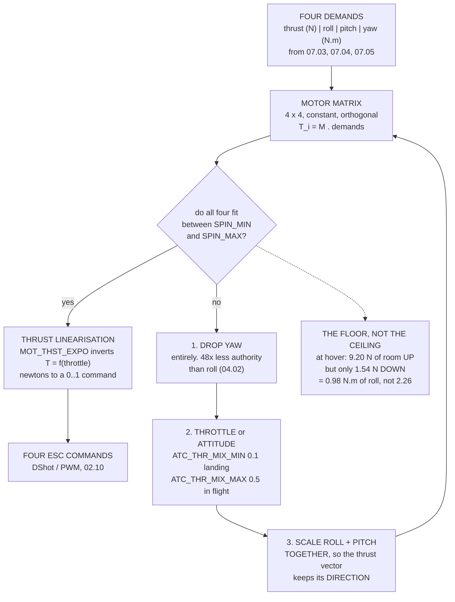

# 07.06 Control allocation: four commands, four motors

<!-- glance:start -->
<!-- generated by tools/build.py from curriculum/syllabus.yaml — edit the syllabus, not this block -->

| | |
|---|---|
| **Track** | Main path |
| **Difficulty** | Advanced |
| **Time** | 1 h 30 min |
| **Hardware** | none |
| **Software** | python |
| **Prerequisites** | [07.02 The cascade: rate → attitude → velocity → position](07.02-cascaded-loops.md)<br>[02.11 Selecting the motor–ESC–prop trio for Hermon (design exercise)](../02-motors-escs-props/02.11-hermon-powertrain-design.md) |
| **Skip if** | You can write Hermon's mixer matrix, invert it, and explain what ArduPilot gives up first when a motor saturates. |

<!-- glance:end -->

## What you will learn

- The **motor matrix**: how four control demands become four motor thrusts, and why the four
  columns of Hermon's mixer are mutually orthogonal
- Why that orthogonality makes the **inverse** a transpose over four — and why a deadcat or a
  damaged hexacopter needs a real pseudo-inverse instead
- Why the mixer works in **newtons** while the ESC takes a **throttle**, and what
  `MOT_THST_EXPO` is actually correcting
- That `MOT_SPIN_MIN` costs Hermon **57 % of its roll authority at hover**
- ArduPilot's **saturation priority**: yaw goes first, completely; the thrust vector's direction
  goes last
- Why a **descending** quad has a third of the roll authority of a hovering one
- What `ATC_THR_MIX_MAN` / `_MIN` / `_MAX` decide, and why the landing value is deliberately low

## Why it matters

Every loop in this module ends at the same place. 07.03 produces a roll moment, 07.04 produces a
thrust vector, 07.05 produces a throttle — and none of them can talk to a motor. Four scalar
demands arrive at the bottom of the stack and four propellers have to satisfy them, and the
thing that decides how is a single matrix multiply followed by a set of priority rules.

Those priority rules are the part nobody reads until something goes wrong. A quadcopter cannot
always do what it is asked: the demands live in a four-dimensional space and the motors live in
a four-dimensional box, and the corner of the box you need is frequently outside it. What
happens then is not a controller decision at all. The rate loop has already done its work; it
asked for 1.5 N·m and it will never learn that it got 0.98. The mixer decides silently,
according to a fixed ranking, and that ranking is the last piece of the aircraft's behaviour
that you have not yet seen.

This lesson also settles an accounting error you have been carrying since 07.01. That lesson
gave Hermon 2.26 N·m of downward roll moment, computed by letting every motor go to zero
thrust. It cannot. `MOT_SPIN_MIN` is a floor, the floor is 15 % of full throttle, and once you
put it back the real number is **0.98 N·m** — 43 % of what the controller was told it had.

## Prerequisites

<!-- prereqs:start -->
## Prerequisites

You need these first:

- [07.02 The cascade: rate → attitude → velocity → position](07.02-cascaded-loops.md)
- [02.11 Selecting the motor–ESC–prop trio for Hermon (design exercise)](../02-motors-escs-props/02.11-hermon-powertrain-design.md)

### Optional prerequisite links

None.

Check your readiness: `python course.py why 07.06`
<!-- prereqs:end -->

## Concept

A quadcopter has four actuators and four things it wants to control: total thrust, roll moment,
pitch moment, yaw moment. Four and four. That is not a coincidence — it is the reason the
quadcopter is the simplest multirotor that can fly, and the reason a tricopter needs a servo.

Each motor contributes to all four. Motor 2 sits at the back left, so spinning it up pushes the
back left corner up: it rolls the aircraft right, pitches the nose up, adds thrust, and — because
it spins counter-clockwise — twists the airframe clockwise. Four contributions, fixed by
geometry, and the same four for every value of every command.

So the mixer is a matrix. Write the four contributions of motor $i$ as a row, stack four rows,
and the whole of control allocation is

$$\begin{bmatrix}T_1\\T_2\\T_3\\T_4\end{bmatrix} = \mathbf{M}\begin{bmatrix}T_{tot}\\M_{roll}\\M_{pitch}\\M_{yaw}\end{bmatrix}$$

with $\mathbf{M}$ constant, known at compile time, and about sixteen multiplies deep. That is
the entire cost of control allocation on a symmetric quad, once per loop at 400 Hz.

The interesting part is what $\mathbf{M}$ *cannot* do. It produces thrusts, but an ESC does not
take a thrust — it takes a number between zero and one, and 02.06 established that thrust goes
roughly as the square of that number. It produces any thrust you ask for, but a motor cannot
produce more than 13.43 N and, per `MOT_SPIN_MIN`, must not produce less than 2.01 N. Both of
those are outside the matrix, and both are where the aircraft's real behaviour lives.

## Technical explanation

### Level 1 — the four rows

Hermon is a 450 mm X quad: four arms at 45° to the nose, four motors 0.225 m from the centre.
The roll and pitch moment arm is not 0.225 m — it is the *component*, $0.225\cos45° = 0.159$ m,
which is why 07.01's plant used 0.1591 and why every moment in this module is smaller than a
naive reading of the wheelbase suggests.

Each row of $\mathbf{M}$ is four numbers:

- **thrust factor**: 1 for every motor. They all push up.
- **roll factor**: $-y/\ell$. Positive roll is right-wing-down, which needs *more* thrust on the
  left, and left is negative $y$.
- **pitch factor**: $-x/\ell$. Positive pitch is nose-up, which needs more thrust at the *back*.
- **yaw factor**: $+1$ for a counter-clockwise motor, $-1$ for a clockwise one. A propeller
  spinning one way twists the airframe the other.

On an X quad every $x$ and $y$ is $\pm\ell$, so every factor is $\pm1$ and the matrix is made
entirely of ones. That is not true of every frame and it is the reason the quad X is the easy
case.

### Level 2 — the columns are orthogonal, and what follows

Take any two different columns of $\mathbf{M}$ and dot them together. You get exactly zero. Dot a
column with itself and you get 4. The matrix is orthogonal up to a factor of four, which has
three consequences that matter.

**The inverse is free.** $\mathbf{M}^{-1} = \mathbf{M}^T/4$. Going from four motor thrusts back
to the four demands they produce — which is what you need in order to ask "what did the aircraft
actually get?" — is the same sixteen multiplies, transposed.

**The axes do not interfere.** Adding roll does not change total thrust, because the roll column
is orthogonal to the thrust column. That is not a lucky property of this frame, it is the reason
the frame is symmetric.

**And it stops being true the moment the frame does.** A deadcat, a Y6, a hexacopter flying on
five motors after a failure: none of those has an orthogonal mixer, and ArduPilot computes a real
pseudo-inverse for them. When you see `AP_Motors` described as doing "control allocation" rather
than "mixing", that is what the extra word is buying.

### Level 3 — thrust linearisation

The mixer's whole contract is that adding $\Delta T$ to one motor and subtracting $\Delta T$ from
another produces a pure moment with **no change in total thrust**. That contract is written in
newtons. The command is a throttle, and thrust goes as throttle squared.

So if you send the thrust straight through as a throttle, a symmetric pair of thrust changes
becomes an asymmetric pair of *thrust results*: the motor going up gains less than the motor
going down loses, because the curve is steeper higher up. The aircraft rolls **and sinks**.

`MOT_THST_EXPO` fixes this by inverting the curve before the command leaves. With expo $e$, the
commanded throttle for a normalised thrust $x$ is the root of $x = (1-e)u + eu^2$:

$$u = \frac{-(1-e) + \sqrt{(1-e)^2 + 4ex}}{2e}$$

At the default $e = 0.65$, asking for half of full thrust means commanding 64.8 % throttle. Send
50 % instead and you get 4.53 N of the 6.71 N you wanted — about a third of full thrust rather
than a half.

> **Roll-to-throttle coupling is the signature of a wrong `MOT_THST_EXPO`.** If the aircraft
> sinks slightly every time you make a sharp roll input and recovers when you centre the stick,
> suspect the expo before the gains.

### Level 4 — saturation, and the order of surrender

Now the box. Every motor is clamped between `MOT_SPIN_MIN` (0.15 → 2.01 N) and `MOT_SPIN_MAX`
(0.95 → 12.76 N). At hover each motor is at 3.556 N, which leaves 9.20 N of room above and
**1.54 N of room below**. 01.02 said the floor is the binding constraint on a quadcopter; here is
the same fact in the mixer's own units.

Four motors × 1.54 N × 0.159 m = **0.98 N·m of roll moment**, against the 2.26 N·m that 07.01
gave you by letting motors stop. The controller does not know. It will ask for 1.5 N·m, get 0.98,
and — if you have configured the limit flags from 07.02 — at least stop integrating.

When the demand does not fit, ArduPilot gives things up in this order:

1. **Yaw**, first and completely.
2. **Throttle or attitude**, according to `ATC_THR_MIX`.
3. **Roll and pitch**, scaled *down together*.
4. The **direction** of the thrust vector, last of all.

Yaw first is not arbitrary. A newton of thrust is worth 0.0206 N·m of yaw torque against 0.159
N·m of roll — the 48:1 gap 04.02 computed from the inertia tensor, arriving here as a
*priority*. Yaw could not win a fight for the motors even if you wanted it to, and losing yaw
means facing the wrong way while losing roll means falling over.

Roll and pitch scaled *together* is the subtle one. Clipping them separately would leave the
thrust vector pointing somewhere nobody asked for. Scaling both keeps the direction and shrinks
only the magnitude — the controller gets a weaker version of what it wanted rather than a
different thing entirely.

## Diagram



## Code

Run the allocator on Hermon's real geometry: build the matrix, verify its orthogonality, mix a
few demands, linearise the thrust, and then saturate it deliberately and watch what survives.

```python
"""07.06 - the mixer: four demands, four motors, and what you give up first."""
import math

L = 0.225                 # m, arm length (hermon-numbers)
LH = L * math.cos(math.radians(45))   # 0.1591 m, the roll/pitch arm
T_MAX = 13.43             # N per motor at full throttle
T_HOVER = 3.556           # N per motor
Q_PER_T = 0.0206          # N.m of reaction torque per newton of thrust
MOT_SPIN_MIN = 0.15       # normalised, ArduPilot default
MOT_SPIN_MAX = 0.95
EXPO = 0.65               # MOT_THST_EXPO default

# motor, x forward (m), y right (m), spin direction (+1 = CCW from above)
MOTORS = [("1 front right", +LH, +LH, +1),
          ("2 back left", -LH, -LH, +1),
          ("3 front left", +LH, -LH, -1),
          ("4 back right", -LH, +LH, -1)]


def mixer_row(m):
    """Thrust, roll, pitch, yaw factors for one motor, normalised."""
    name, x, y, spin = m
    return (1.0, -y / LH, -x / LH, float(spin))


def mix(thrust, roll, pitch, yaw):
    """Four demands -> four motor thrusts, in newtons. No limits applied."""
    out = []
    for m in MOTORS:
        t, r, p, y = mixer_row(m)
        out.append(t * thrust / 4 + r * roll / (4 * LH)
                   + p * pitch / (4 * LH) + y * yaw / (4 * Q_PER_T))
    return out


def unmix(ts):
    """Four motor thrusts -> the four demands they actually produce."""
    thrust = sum(ts)
    roll = sum(t * mixer_row(m)[1] for t, m in zip(ts, MOTORS)) * LH
    pitch = sum(t * mixer_row(m)[2] for t, m in zip(ts, MOTORS)) * LH
    yaw = sum(t * mixer_row(m)[3] for t, m in zip(ts, MOTORS)) * Q_PER_T
    return thrust, roll, pitch, yaw


def thr_from_thrust(t_n, expo=EXPO, t_max=T_MAX):
    """MOT_THST_EXPO: invert the thrust curve to get a linear command."""
    x = max(0.0, min(1.0, t_n / t_max))
    if expo <= 0:
        return x
    return (-(1 - expo) + math.sqrt((1 - expo) ** 2 + 4 * expo * x)) / (2 * expo)


def thrust_from_thr(thr, expo=EXPO, t_max=T_MAX):
    """And the real motor: thrust as a function of the throttle command."""
    return t_max * ((1 - expo) * thr + expo * thr * thr)


def desaturate(ts, spin_min=MOT_SPIN_MIN, spin_max=MOT_SPIN_MAX,
               order=("yaw", "rp", "thrust")):
    """ArduPilot's priority: give up YAW, then scale ROLL/PITCH, then THRUST."""
    thrust, roll, pitch, yaw = unmix(ts)
    lo, hi = spin_min * T_MAX, spin_max * T_MAX
    for step in order:
        cand = mix(thrust, roll, pitch, yaw)
        if min(cand) >= lo - 1e-9 and max(cand) <= hi + 1e-9:
            break
        if step == "yaw":
            for _ in range(60):
                cand = mix(thrust, roll, pitch, yaw)
                if min(cand) >= lo and max(cand) <= hi:
                    break
                yaw *= 0.9
                if abs(yaw) < 1e-6:
                    yaw = 0.0
                    break
        elif step == "rp":
            for _ in range(200):
                cand = mix(thrust, roll, pitch, yaw)
                if min(cand) >= lo and max(cand) <= hi:
                    break
                roll *= 0.97
                pitch *= 0.97
        else:
            for _ in range(400):
                cand = mix(thrust, roll, pitch, yaw)
                if min(cand) >= lo and max(cand) <= hi:
                    break
                mid = (lo + hi) / 2 * 4
                thrust += (mid - thrust) * 0.05
    final = [max(lo, min(hi, t)) for t in mix(thrust, roll, pitch, yaw)]
    return final, unmix(final)


def bar(t):
    print("\n" + "=" * 70)
    print(t)
    print("=" * 70)


if __name__ == "__main__":
    bar("1. THE MIXER MATRIX")
    print("  Four demands -- THRUST, ROLL, PITCH, YAW -- and four motors.")
    print("  Each motor's contribution is a fixed row of factors:")
    print(f"  {'motor':16s} {'x':>7s} {'y':>7s} {'spin':>5s}"
          f" {'thrust':>7s} {'roll':>6s} {'pitch':>6s} {'yaw':>5s}")
    for m in MOTORS:
        t, r, p, y = mixer_row(m)
        print(f"  {m[0]:16s} {m[1]:+6.3f}m {m[2]:+6.3f}m {m[3]:+4d}"
              f" {t:7.2f} {r:+6.2f} {p:+6.2f} {y:+5.0f}")
    print("  ROLL: right wing down needs more LEFT thrust, so the factor")
    print("        is -y. PITCH: nose up needs more REAR thrust, so -x.")
    print("  YAW: a CCW motor exerts a CW reaction on the airframe, so the")
    print("       factor is the spin direction.")
    print("\n  AND NOTE THE STRUCTURE. The four columns are MUTUALLY")
    print("  ORTHOGONAL -- every column dotted with a DIFFERENT column")
    print("  gives exactly zero:")
    cols = [[mixer_row(m)[i] for m in MOTORS] for i in range(4)]
    names = ["thrust", "roll", "pitch", "yaw"]
    print(f"  {'':8s}" + "".join(f"{n:>9s}" for n in names))
    for i, n in enumerate(names):
        row = "".join(f"{sum(a * b for a, b in zip(cols[i], cols[j])):9.1f}"
                      for j in range(4))
        print(f"  {n:8s}{row}")
    print("  A DIAGONAL MATRIX. So the mixer's INVERSE is just its")
    print("  TRANSPOSE divided by 4 -- which is why control allocation on a")
    print("  symmetric quad costs almost nothing, and why an asymmetric")
    print("  frame (a deadcat, a hexacopter with a missing arm) needs a")
    print("  real pseudo-inverse instead.")

    bar("2. A DEMAND, MIXED")
    cases = [("hover, level", 4 * T_HOVER, 0.0, 0.0, 0.0),
             ("hover + 1 N.m roll", 4 * T_HOVER, 1.0, 0.0, 0.0),
             ("hover + 1 N.m pitch", 4 * T_HOVER, 0.0, 1.0, 0.0),
             ("hover + 0.05 N.m yaw", 4 * T_HOVER, 0.0, 0.0, 0.05),
             ("hover + all three", 4 * T_HOVER, 1.0, 1.0, 0.05)]
    print(f"  {'case':22s} {'m1':>7s} {'m2':>7s} {'m3':>7s} {'m4':>7s}"
          f"  (newtons)")
    for name, t, r, p, y in cases:
        ts = mix(t, r, p, y)
        print(f"  {name:22s}" + "".join(f"{v:7.2f}" for v in ts))
    print(f"  Hover is {T_HOVER:.2f} N on each. A 1 N.m roll moment moves")
    print(f"  {1.0 / (4 * LH):.2f} N from each right motor to each left one --")
    print("  and the TOTAL is unchanged, which is the point of the mixer.")
    print("  NOTE THE YAW ROW. 0.05 N.m of yaw needs only 0.6 N of thrust")
    print("  difference, because yaw comes from REACTION TORQUE and a")
    print("  newton of thrust is worth 0.0206 N.m of it (02.06). That")
    print("  ratio is 04.02's 48:1 authority gap, seen from the mixer.")

    bar("3. THRUST LINEARISATION: THE MIXER WORKS IN NEWTONS")
    print("  The mixer produces THRUSTS. The ESC takes a THROTTLE. And")
    print(f"  thrust goes as throttle squared (02.06), so the two are not")
    print(f"  the same thing. MOT_THST_EXPO = {EXPO} inverts the curve:")
    print(f"  {'wanted thrust':>14s} {'naive throttle':>15s}"
          f" {'EXPO throttle':>14s} {'delivered':>11s} {'naive gives':>12s}")
    for frac in (0.1, 0.25, 0.265, 0.5, 0.75, 1.0):
        want = frac * T_MAX
        naive = frac
        corrected = thr_from_thrust(want)
        print(f"  {want:11.2f} N {naive * 100:13.1f} %"
              f" {corrected * 100:12.1f} % {thrust_from_thr(corrected):9.2f} N"
              f" {thrust_from_thr(naive):10.2f} N")
    print("  WITHOUT EXPO, ASKING FOR HALF THRUST GIVES YOU ABOUT A THIRD.")
    print("  With it, asking for half thrust gives you half.")
    print("  WHY THIS MATTERS FOR CONTROL, NOT JUST FOR FEEL: the mixer")
    print("  assumes that adding 0.6 N to one motor and subtracting 0.6 N")
    print("  from another produces a pure moment and NO net thrust change.")
    print("  If the command is not linear in thrust, it does not -- the")
    print("  aircraft ROLLS AND SINKS. Roll-to-throttle coupling is the")
    print("  signature of a wrong MOT_THST_EXPO.")
    print(f"\n  The right value depends on your propeller. ArduPilot's")
    print(f"  default of {EXPO} suits most plastic props; measure yours on")
    print("  the thrust stand (02.07) and fit it.")

    bar("4. SATURATION: WHAT GETS GIVEN UP, AND IN WHAT ORDER")
    print("  07.01 said Hermon has 2.26 N.m of roll moment available")
    print("  DOWNWARDS -- four motors x 3.556 N of hover thrust x the")
    print("  0.159 m arm. THAT NUMBER ASSUMED A MOTOR MAY STOP.")
    lo_n = MOT_SPIN_MIN * T_MAX
    hi_n = MOT_SPIN_MAX * T_MAX
    ideal_down = 4 * T_HOVER * LH
    ideal_up = 4 * (T_MAX - T_HOVER) * LH
    real_fixed = 4 * (T_HOVER - lo_n) * LH
    real_free = 2 * (hi_n - lo_n) * LH
    rows = [
        ("07.01, motors to zero, down", ideal_down,
         "the textbook figure"),
        ("07.01, motors to full, up", ideal_up,
         "never the binding limit at hover"),
        ("with MOT_SPIN_MIN, throttle held", real_fixed,
         "WHAT YOU ACTUALLY HAVE"),
        ("with MOT_SPIN_MIN, throttle free", real_free,
         "and the aircraft climbs at 2.1 g to get it"),
    ]
    print(f"  {'roll authority at hover':34s} {'N.m':>7s} {'of 07.01':>9s}")
    for n, v, note in rows:
        print(f"  {n:34s} {v:7.3f} {v / ideal_down * 100:8.0f} %   {note}")
    print(f"  MOT_SPIN_MIN TAKES {(1 - real_fixed / ideal_down) * 100:.0f} %")
    print("  OF YOUR ROLL AUTHORITY AT HOVER. That is the price of never")
    print("  letting a motor stop, and it is why the mixer -- not the")
    print("  controller -- decides what a saturated aircraft does.")
    print()
    print(f"  Motors are limited to MOT_SPIN_MIN {MOT_SPIN_MIN} and")
    print(f"  MOT_SPIN_MAX {MOT_SPIN_MAX}, i.e."
          f" {MOT_SPIN_MIN * T_MAX:.2f} to {MOT_SPIN_MAX * T_MAX:.2f} N.")
    print("  When a demand cannot be met, ArduPilot gives things up in a")
    print("  FIXED ORDER: YAW first, then ROLL and PITCH together, then")
    print("  the THRUST itself.")
    print(f"  {'demanded':30s} {'T':>6s} {'roll':>6s} {'pitch':>6s} {'yaw':>7s}")
    demands = [
        ("hover, small corrections", 4 * T_HOVER, 0.50, 0.50, 0.020),
        ("hover, firm roll", 4 * T_HOVER, 0.90, 0.00, 0.020),
        ("hover, firm roll + yaw", 4 * T_HOVER, 0.90, 0.00, 0.050),
        ("hover, roll past the floor", 4 * T_HOVER, 1.50, 0.00, 0.050),
        ("DESCENDING, firm roll", 4 * 2.5, 0.90, 0.00, 0.050),
        ("CLIMBING, firm roll", 4 * 8.0, 0.90, 0.00, 0.050),
        ("everything at once", 4 * 8.0, 2.50, 2.50, 0.300),
    ]
    for name, t, r, p_, y in demands:
        _, got = desaturate(mix(t, r, p_, y))
        print(f"  {name:30s} {t:6.1f} {r:6.2f} {p_:6.2f} {y:7.3f}")
        print(f"  {'-> achieved':30s} {got[0]:6.1f} {got[1]:6.2f}"
              f" {got[2]:6.2f} {got[3]:7.3f}")
    print("  READ THE YAW COLUMN. It is the first thing to go, every time,")
    print("  and 07.04 said why: yaw has 48x less authority than roll, so")
    print("  it could not win a fight for the motors even if you wanted it")
    print("  to -- and getting the THRUST VECTOR wrong makes you fall")
    print("  while getting the HEADING wrong only makes you face the wrong")
    print("  way.")
    print("\n  AND NOTE THE LOW-THROTTLE ROW. At low throttle there is")
    print("  almost no room to reduce a motor, because MOT_SPIN_MIN is")
    print("  already close. THAT IS 01.02'S FLOOR, ARRIVING IN THE MIXER:")
    print("  a descending quad has far less control authority than a")
    print("  climbing one, and it is the case you meet on every landing.")

    bar("5. MOT_SPIN_*: WHY A MOTOR MUST NEVER STOP")
    spins = [
        ("MOT_SPIN_ARM", 0.10, "what it does when armed and idle",
         "visible, audible, and a reminder it is live"),
        ("MOT_SPIN_MIN", 0.15, "the lowest the mixer may command in flight",
         "BELOW THIS A MOTOR CAN STOP OR DESYNC"),
        ("MOT_SPIN_MAX", 0.95, "the highest",
         "headroom for the ESC's own current limiting"),
    ]
    print(f"  {'parameter':16s} {'default':>8s} {'is':38s}")
    for n, v, w, why in spins:
        print(f"  {n:16s} {v:8.2f} {w:38s}")
        print(f"  {'':16s} {'':8s} {why}")
    print("  A STOPPED MOTOR IS NOT A MOTOR AT ZERO THRUST. It is a motor")
    print("  that must be RE-STARTED, and a sensorless BLDC start takes")
    print("  tens of milliseconds and can fail (02.03). At the moment the")
    print("  mixer wanted zero thrust from it, the aircraft was already")
    print("  saturated -- so it is the worst possible moment to lose an")
    print("  actuator entirely.")
    print(f"  MOT_SPIN_MIN of {MOT_SPIN_MIN} puts a"
          f" {MOT_SPIN_MIN * T_MAX:.2f} N floor under every")
    print(f"  motor, which is"
          f" {MOT_SPIN_MIN * T_MAX / T_HOVER * 100:.0f} % of hover thrust and"
          f" {(1 - 4 * (T_HOVER - MOT_SPIN_MIN * T_MAX) * LH / (4 * T_HOVER * LH)) * 100:.0f} % of")
    print("  the roll authority from section 4. Real control, spent on")
    print("  reliability. It is a good trade and it is not a free one.")

    bar("6. ATC_THR_MIX: THROTTLE OR ATTITUDE?")
    print("  One more priority decision, above the mixer. When the total")
    print("  demand exceeds what the motors can produce, does the aircraft")
    print("  keep the THROTTLE it was asked for, or the ATTITUDE?")
    mixes = [("ATC_THR_MIX_MAN", 0.5, "manual modes",
              "the pilot is flying; split it"),
             ("ATC_THR_MIX_MIN", 0.1, "during landing and takeoff",
              "favour THROTTLE: do not climb away"),
             ("ATC_THR_MIX_MAX", 0.5, "in flight",
              "favour ATTITUDE: do not fall over")]
    print(f"  {'parameter':18s} {'default':>8s} {'when':26s}")
    for n, v, w, why in mixes:
        print(f"  {n:18s} {v:8.2f} {w:26s}")
        print(f"  {'':18s} {'':8s} {why}")
    print("  LOW VALUES FAVOUR THROTTLE, HIGH VALUES FAVOUR ATTITUDE.")
    print("  ATC_THR_MIX_MIN is low on purpose: during a landing you would")
    print("  rather lose a little attitude authority than climb back into")
    print("  the air. In flight the priority reverses, because attitude is")
    print("  what keeps the thrust pointing up at all.")
    print("  THE WHOLE CHAIN OF PRIORITIES, TOP TO BOTTOM:")
    for i, line in enumerate([
            "YAW goes first, and goes completely.",
            "Then THROTTLE or ATTITUDE, per ATC_THR_MIX.",
            "Then ROLL and PITCH, scaled DOWN TOGETHER.",
            "The thrust vector's DIRECTION is the last thing to go."], 1):
        print(f"    {i}. {line}")
    print("  STEP 3 IS WHY THEY ARE SCALED TOGETHER RATHER THAN CLIPPED")
    print("  SEPARATELY: scaling both keeps the thrust vector pointing the")
    print("  same WAY and only makes the correction SMALLER, where")
    print("  clipping one axis would point it somewhere nobody asked for.")
```

Output:

```text

======================================================================
1. THE MIXER MATRIX
======================================================================
  Four demands -- THRUST, ROLL, PITCH, YAW -- and four motors.
  Each motor's contribution is a fixed row of factors:
  motor                  x       y  spin  thrust   roll  pitch   yaw
  1 front right    +0.159m +0.159m   +1    1.00  -1.00  -1.00    +1
  2 back left      -0.159m -0.159m   +1    1.00  +1.00  +1.00    +1
  3 front left     +0.159m -0.159m   -1    1.00  +1.00  -1.00    -1
  4 back right     -0.159m +0.159m   -1    1.00  -1.00  +1.00    -1
  ROLL: right wing down needs more LEFT thrust, so the factor
        is -y. PITCH: nose up needs more REAR thrust, so -x.
  YAW: a CCW motor exerts a CW reaction on the airframe, so the
       factor is the spin direction.

  AND NOTE THE STRUCTURE. The four columns are MUTUALLY
  ORTHOGONAL -- every column dotted with a DIFFERENT column
  gives exactly zero:
             thrust     roll    pitch      yaw
  thrust        4.0      0.0      0.0      0.0
  roll          0.0      4.0      0.0      0.0
  pitch         0.0      0.0      4.0      0.0
  yaw           0.0      0.0      0.0      4.0
  A DIAGONAL MATRIX. So the mixer's INVERSE is just its
  TRANSPOSE divided by 4 -- which is why control allocation on a
  symmetric quad costs almost nothing, and why an asymmetric
  frame (a deadcat, a hexacopter with a missing arm) needs a
  real pseudo-inverse instead.

======================================================================
2. A DEMAND, MIXED
======================================================================
  case                        m1      m2      m3      m4  (newtons)
  hover, level             3.56   3.56   3.56   3.56
  hover + 1 N.m roll       1.98   5.13   5.13   1.98
  hover + 1 N.m pitch      1.98   5.13   1.98   5.13
  hover + 0.05 N.m yaw     4.16   4.16   2.95   2.95
  hover + all three        1.02   7.31   2.95   2.95
  Hover is 3.56 N on each. A 1 N.m roll moment moves
  1.57 N from each right motor to each left one --
  and the TOTAL is unchanged, which is the point of the mixer.
  NOTE THE YAW ROW. 0.05 N.m of yaw needs only 0.6 N of thrust
  difference, because yaw comes from REACTION TORQUE and a
  newton of thrust is worth 0.0206 N.m of it (02.06). That
  ratio is 04.02's 48:1 authority gap, seen from the mixer.

======================================================================
3. THRUST LINEARISATION: THE MIXER WORKS IN NEWTONS
======================================================================
  The mixer produces THRUSTS. The ESC takes a THROTTLE. And
  thrust goes as throttle squared (02.06), so the two are not
  the same thing. MOT_THST_EXPO = 0.65 inverts the curve:
   wanted thrust  naive throttle  EXPO throttle   delivered  naive gives
         1.34 N          10.0 %         20.7 %      1.34 N       0.56 N
         3.36 N          25.0 %         40.7 %      3.36 N       1.72 N
         3.56 N          26.5 %         42.4 %      3.56 N       1.86 N
         6.71 N          50.0 %         64.8 %      6.71 N       4.53 N
        10.07 N          75.0 %         83.8 %     10.07 N       8.44 N
        13.43 N         100.0 %        100.0 %     13.43 N      13.43 N
  WITHOUT EXPO, ASKING FOR HALF THRUST GIVES YOU ABOUT A THIRD.
  With it, asking for half thrust gives you half.
  WHY THIS MATTERS FOR CONTROL, NOT JUST FOR FEEL: the mixer
  assumes that adding 0.6 N to one motor and subtracting 0.6 N
  from another produces a pure moment and NO net thrust change.
  If the command is not linear in thrust, it does not -- the
  aircraft ROLLS AND SINKS. Roll-to-throttle coupling is the
  signature of a wrong MOT_THST_EXPO.

  The right value depends on your propeller. ArduPilot's
  default of 0.65 suits most plastic props; measure yours on
  the thrust stand (02.07) and fit it.

======================================================================
4. SATURATION: WHAT GETS GIVEN UP, AND IN WHAT ORDER
======================================================================
  07.01 said Hermon has 2.26 N.m of roll moment available
  DOWNWARDS -- four motors x 3.556 N of hover thrust x the
  0.159 m arm. THAT NUMBER ASSUMED A MOTOR MAY STOP.
  roll authority at hover                N.m  of 07.01
  07.01, motors to zero, down          2.263      100 %   the textbook figure
  07.01, motors to full, up            6.284      278 %   never the binding limit at hover
  with MOT_SPIN_MIN, throttle held     0.981       43 %   WHAT YOU ACTUALLY HAVE
  with MOT_SPIN_MIN, throttle free     3.419      151 %   and the aircraft climbs at 2.1 g to get it
  MOT_SPIN_MIN TAKES 57 %
  OF YOUR ROLL AUTHORITY AT HOVER. That is the price of never
  letting a motor stop, and it is why the mixer -- not the
  controller -- decides what a saturated aircraft does.

  Motors are limited to MOT_SPIN_MIN 0.15 and
  MOT_SPIN_MAX 0.95, i.e. 2.01 to 12.76 N.
  When a demand cannot be met, ArduPilot gives things up in a
  FIXED ORDER: YAW first, then ROLL and PITCH together, then
  the THRUST itself.
  demanded                            T   roll  pitch     yaw
  hover, small corrections         14.2   0.50   0.50   0.020
  -> achieved                      14.2   0.50   0.50   0.020
  hover, firm roll                 14.2   0.90   0.00   0.020
  -> achieved                      14.2   0.90  -0.00   0.010
  hover, firm roll + yaw           14.2   0.90   0.00   0.050
  -> achieved                      14.2   0.90   0.00   0.010
  hover, roll past the floor       14.2   1.50   0.00   0.050
  -> achieved                      14.2   0.98  -0.00   0.000
  DESCENDING, firm roll            10.0   0.90   0.00   0.050
  -> achieved                      10.0   0.30   0.00   0.000
  CLIMBING, firm roll              32.0   0.90   0.00   0.050
  -> achieved                      32.0   0.90   0.00   0.050
  everything at once               32.0   2.50   2.50   0.300
  -> achieved                      32.0   1.49   1.49   0.001
  READ THE YAW COLUMN. It is the first thing to go, every time,
  and 07.04 said why: yaw has 48x less authority than roll, so
  it could not win a fight for the motors even if you wanted it
  to -- and getting the THRUST VECTOR wrong makes you fall
  while getting the HEADING wrong only makes you face the wrong
  way.

  AND NOTE THE LOW-THROTTLE ROW. At low throttle there is
  almost no room to reduce a motor, because MOT_SPIN_MIN is
  already close. THAT IS 01.02'S FLOOR, ARRIVING IN THE MIXER:
  a descending quad has far less control authority than a
  climbing one, and it is the case you meet on every landing.

======================================================================
5. MOT_SPIN_*: WHY A MOTOR MUST NEVER STOP
======================================================================
  parameter         default is                                    
  MOT_SPIN_ARM         0.10 what it does when armed and idle      
                            visible, audible, and a reminder it is live
  MOT_SPIN_MIN         0.15 the lowest the mixer may command in flight
                            BELOW THIS A MOTOR CAN STOP OR DESYNC
  MOT_SPIN_MAX         0.95 the highest                           
                            headroom for the ESC's own current limiting
  A STOPPED MOTOR IS NOT A MOTOR AT ZERO THRUST. It is a motor
  that must be RE-STARTED, and a sensorless BLDC start takes
  tens of milliseconds and can fail (02.03). At the moment the
  mixer wanted zero thrust from it, the aircraft was already
  saturated -- so it is the worst possible moment to lose an
  actuator entirely.
  MOT_SPIN_MIN of 0.15 puts a 2.01 N floor under every
  motor, which is 57 % of hover thrust and 57 % of
  the roll authority from section 4. Real control, spent on
  reliability. It is a good trade and it is not a free one.

======================================================================
6. ATC_THR_MIX: THROTTLE OR ATTITUDE?
======================================================================
  One more priority decision, above the mixer. When the total
  demand exceeds what the motors can produce, does the aircraft
  keep the THROTTLE it was asked for, or the ATTITUDE?
  parameter           default when                      
  ATC_THR_MIX_MAN        0.50 manual modes              
                              the pilot is flying; split it
  ATC_THR_MIX_MIN        0.10 during landing and takeoff
                              favour THROTTLE: do not climb away
  ATC_THR_MIX_MAX        0.50 in flight                 
                              favour ATTITUDE: do not fall over
  LOW VALUES FAVOUR THROTTLE, HIGH VALUES FAVOUR ATTITUDE.
  ATC_THR_MIX_MIN is low on purpose: during a landing you would
  rather lose a little attitude authority than climb back into
  the air. In flight the priority reverses, because attitude is
  what keeps the thrust pointing up at all.
  THE WHOLE CHAIN OF PRIORITIES, TOP TO BOTTOM:
    1. YAW goes first, and goes completely.
    2. Then THROTTLE or ATTITUDE, per ATC_THR_MIX.
    3. Then ROLL and PITCH, scaled DOWN TOGETHER.
    4. The thrust vector's DIRECTION is the last thing to go.
  STEP 3 IS WHY THEY ARE SCALED TOGETHER RATHER THAN CLIPPED
  SEPARATELY: scaling both keeps the thrust vector pointing the
  same WAY and only makes the correction SMALLER, where
  clipping one axis would point it somewhere nobody asked for.
```

## Exercise

### Exercise 07.06-E1 — Mix a demand by hand, then check it `[analysis]`

Without running the code: Hermon is hovering (14.22 N total) and the rate controller asks for
0.60 N·m of roll, no pitch, no yaw. Compute all four motor thrusts with a calculator. Then run
`mix(14.224, 0.60, 0.0, 0.0)` and compare. Write down which motors the mixer pushed *down* and
check it against the geometry: positive roll is right-wing-down, so it should be the right-hand
pair.

### Exercise 07.06-E2 — Find the frame's saturation point `[analysis]`

Write a loop that increases the roll demand from 0 in steps of 0.05 N·m at a fixed total thrust,
calls `desaturate`, and records the first demand at which the achieved roll stops tracking the
demanded roll. Repeat for three total-thrust values: 10 N (descending), 14.22 N (hover) and 32 N
(climbing). Tabulate the three saturation points. You should find that the descending aircraft
has roughly a third of the roll authority of the hovering one.

### Exercise 07.06-E3 — Price `MOT_SPIN_MIN` `[analysis]`

Re-run the authority ladder with `MOT_SPIN_MIN` at 0.05, 0.10, 0.15 and 0.20 and tabulate the
roll moment available at hover in each case. Then write two sentences arguing for the value you
would actually fly, naming what you are buying and what you are paying. There is no correct
answer; there is a correct pair of sentences.

### Exercise 07.06-E4 — Fit the expo you measured `[measurement]`

02.07 had you measure Hermon's thrust curve on a stand. Fit $T/T_{max} = (1-e)u + eu^2$ to your
own data by trying $e$ from 0 to 1 in steps of 0.05 and keeping the value with the lowest sum of
squared error. Compare it with ArduPilot's default of 0.65. If they differ by more than 0.1,
your propeller is not a typical one and you should fly your number.

## Expected result

The orthogonality check prints a clean diagonal of 4.0 with zeros everywhere else. The authority
ladder shows 2.263 N·m from 07.01's assumption, 0.981 N·m once `MOT_SPIN_MIN` is real, and 3.419
N·m if the mixer is allowed to raise total thrust — at the cost of a 2.1 g climb.

In the saturation table, yaw tracks perfectly while there is room, drops to half when a firm roll
is also demanded, and hits exactly zero the moment the roll demand passes the floor. Roll tracks
up to 0.98 N·m at hover and then stops dead. The descending row — 10 N total — achieves 0.30 N·m
of a 0.90 N·m demand, and the climbing row achieves all of it.

**07.06-E1**: motors 1 and 4 (the right-hand pair) drop to 2.61 N and motors 2 and 3 rise to
4.50 N, total unchanged at 14.22 N.

**07.06-E2**: saturation points near 0.30, 0.98 and 0.90 N·m for 10 N, 14.22 N and 32 N of total
thrust. The climbing case is not unbounded either: above hover the ceiling eventually bites from
the other side, and the best roll authority on a quadcopter is somewhere in the middle of the
throttle range, not at the top of it.

**07.06-E3**: roll authority at hover runs 1.84, 1.41, 0.98 and 0.55 N·m as `MOT_SPIN_MIN` goes
0.05 → 0.10 → 0.15 → 0.20. It is a straight line: every 0.05 of `MOT_SPIN_MIN` costs a flat
0.43 N·m, and at 0.20 you have given away three quarters of what 07.01 promised you.

**07.06-E4**: a fitted expo within about 0.1 of 0.65 for a normal plastic propeller. A wider gap
means you should fly your measured number, not the default.

## Troubleshooting

**The orthogonality check has non-zero off-diagonal entries.** Your motor order or spin directions
are wrong. On a quad X the two motors sharing a diagonal must spin the same way; if you have
adjacent motors matched instead, the yaw column stops being orthogonal to roll and pitch and the
aircraft will yaw whenever it rolls.

**`unmix(mix(...))` does not return what you put in.** A scale factor is wrong in one column,
almost always yaw. The round trip is the only test that catches this, and it catches it instantly
— run it before you trust any other number.

**The desaturation loop never terminates.** Your demand is outside the box even with everything
given up: usually a total thrust below `4 × MOT_SPIN_MIN × T_max` (8.06 N for Hermon) or above
`4 × MOT_SPIN_MAX × T_max` (51 N). Clamp the total thrust first.

**On the real aircraft: it rolls and sinks.** `MOT_THST_EXPO`. See Level 3.

**On the real aircraft: it yaws slowly and will not correct.** Not a mixer fault. Check for a
motor sitting permanently higher than the others in the `RCOU` log — a bent arm or a mis-levelled
motor makes one motor work harder to hold level, which eats the differential headroom before yaw
is even asked for.

> **Safety.** Every number in this lesson describes an aircraft that has already run out of
> control authority. Do not go looking for these limits in flight. The saturation points belong
> in your simulation and in your log analysis (08.07), and the correct response to finding them
> in a real log is to reduce the demand — lower `ANGLE_MAX`, lower `WPNAV_ACCEL`, or fly a lighter
> aircraft — not to raise `MOT_SPIN_MAX` or lower `MOT_SPIN_MIN`. The floor exists so that a motor
> never stops, and a stopped motor at 60 m is not a recoverable condition.

## Common mistakes

- **Trusting 07.01's 2.26 N·m.** It assumed a motor may reach zero thrust. It may not, and the
  real figure is 43 % of it. Every moment budget that does not mention `MOT_SPIN_MIN` is
  optimistic by that factor.
- **Believing the controller knows it saturated.** It does not, unless you wired the limit flags
  (07.02). Without them the integrator keeps winding against a demand the aircraft cannot meet,
  and 07.01's ground-windup case plays out in the air.
- **Raising `MOT_SPIN_MAX` to get authority.** You get a little, and you give the ESC no room for
  its own current limiting. The headroom is there for a reason (02.10).
- **Setting `MOT_SPIN_MIN` to zero because "the motors restart fine on the bench".** On the bench
  they restart unloaded, warm, and with you watching. In flight they restart under load, in a
  saturated aircraft, at the worst possible moment (02.03).
- **Tuning `MOT_THST_EXPO` by feel.** It has a measurable correct value and you already own the
  stand that measures it (02.07).
- **Treating the priority order as configurable.** Only step 2 is. Yaw always goes first and the
  thrust vector's direction always goes last, in every ArduPilot build.

## Knowledge check

<details>
<summary>Why is Hermon's roll moment arm 0.159 m and not 0.225 m?</summary>

Because the arms are at 45° to the roll axis on an X quad. A motor 0.225 m from the centre along
a 45° arm is only $0.225\cos45° = 0.159$ m to the side of the roll axis, and it is the
perpendicular distance that makes the moment. A plus-configuration quad gets the full 0.225 m on
roll and pitch — and pays for it by having a motor directly in front of the camera.
</details>

<details>
<summary>The four columns of the mixer are orthogonal. Name one practical thing that buys you and
one frame where it is false.</summary>

It buys you the inverse for free: $\mathbf{M}^{-1} = \mathbf{M}^T/4$, so recovering the achieved
demands from the motor thrusts is the same sixteen multiplies. It is false on any asymmetric
frame — a deadcat with swept front arms, a hexacopter continuing on five motors — where
ArduPilot computes a genuine pseudo-inverse instead.
</details>

<details>
<summary>Asking for 50 % of full thrust with no expo gives you about 34 %. Why does that break
the mixer rather than just feeling sluggish?</summary>

Because the mixer's contract is that $+\Delta T$ on one motor and $-\Delta T$ on another produce
a pure moment with zero net thrust change. If the command is not linear in thrust, the motor
going up gains less than the motor going down loses — the curve is steeper higher up — so a pure
roll demand produces a roll **and a loss of lift**. The aircraft sinks every time you roll.
</details>

<details>
<summary>Hermon has 9.20 N of thrust headroom above hover and 1.54 N below. Which one sets its
roll authority, and by how much does `MOT_SPIN_MIN` reduce it?</summary>

The one below — the floor, not the ceiling. A roll is a symmetric exchange, so it is limited by
whichever side runs out first, and at hover that is always the motors being reduced. Four motors
× 1.54 N × 0.159 m = 0.98 N·m, against 2.26 N·m if motors could reach zero. `MOT_SPIN_MIN` costs
**57 %** of the roll authority at hover.
</details>

<details>
<summary>Why is yaw the first thing given up, and why are roll and pitch scaled together rather
than clipped separately?</summary>

Yaw first because a newton of thrust buys 0.0206 N·m of yaw against 0.159 N·m of roll — the 48:1
authority gap from 04.02 — and because a heading error means facing the wrong way while an
attitude error means falling. Roll and pitch together because scaling both preserves the
**direction** of the thrust vector and shrinks only its magnitude; clipping one axis alone would
point the aircraft somewhere no loop asked for.
</details>

<details>
<summary>`ATC_THR_MIX_MIN` is 0.1 and `ATC_THR_MIX_MAX` is 0.5. Why is the landing value the lower
one?</summary>

Low values favour throttle over attitude. During a landing the aircraft is near the ground with
little room to manoeuvre, and the failure you must avoid is climbing away when you asked to
descend — so it keeps the throttle and gives up a little attitude authority. In flight the
priority reverses: attitude is what keeps the thrust vector pointing up at all, so
`ATC_THR_MIX_MAX` protects it.
</details>

<details>
<summary>A pilot reports that the aircraft yaws slowly and will not hold heading, but rolls and
pitches crisply. Where do you look first, and why not at the yaw gains?</summary>

At `RCOU` in the log, for one motor sitting permanently higher than the others. A bent arm, a
mis-levelled motor mount or a twisted propeller makes one motor work harder to hold level, which
consumes the differential headroom that yaw was going to use — and yaw is first in the surrender
order, so it is the first symptom. The gains are innocent; the frame is not.
</details>

## Practical challenge

**Build the allocator for a frame that is not symmetric.**

Take Hermon's four motors and move motor 1 outward by 40 mm and motor 3 inward by 40 mm — the
kind of asymmetry a repaired arm or a badly-printed clamp produces. Build the new mixer matrix
from the geometry, check whether the columns are still orthogonal, and compute the pseudo-inverse
$(\mathbf{M}^T\mathbf{M})^{-1}\mathbf{M}^T$ with `numpy.linalg.pinv`.

Then answer three questions with numbers. How much roll does a pure *thrust* demand now produce,
if you use the naive transpose-over-four inverse instead of the pseudo-inverse? What are the four
hover thrusts once the pseudo-inverse is used — and which motor is now closest to
`MOT_SPIN_MIN`? And how much roll authority has the frame lost?

This is the calculation that decides whether a repaired airframe is airworthy, and it is the same
one ArduPilot runs at boot for every non-standard frame class.

## You can skip this if

You can write Hermon's mixer matrix, invert it, and explain what ArduPilot gives up first when a
motor saturates.

## Go deeper

- [01.02](../01-flight-physics/01.02-newton-torque-quad.md) (earlier): the thrust floor, which this
  lesson finally spends.
- [02.06](../02-motors-escs-props/02.06-prop-motor-matching.md) (earlier): the $T \propto u^2$
  curve that `MOT_THST_EXPO` inverts.
- [02.11](../02-motors-escs-props/02.11-hermon-powertrain-design.md) (earlier): where 13.43 N and
  3.556 N came from.
- [04.02](../04-frame-and-assembly/04.02-mass-and-center-of-mass.md) (earlier): the inertia
  tensor behind the 48:1 yaw gap.
- [07.02](07.02-cascaded-loops.md) (earlier): the limit flags, without which saturation is silent.
- [07.07](07.07-filtering-and-methodic-tuning.md) (next): the filters between the gyro and this
  matrix, and the order in which to set everything in this module.
- [08.07](../08-flight-controller/08.07-logging-and-the-data-path.md) (later): reading `RCOU` and
  `MOTB`, where saturation is visible after the fact.
- ArduPilot's motor and frame-type reference, including every supported motor matrix:
  https://ardupilot.org/copter/docs/connect-escs-and-motors.html
- The `MOT_` parameter group, with `SPIN_ARM`, `SPIN_MIN`, `SPIN_MAX`, `THST_EXPO` and
  `THST_HOVER`: https://ardupilot.org/copter/docs/parameters.html#mot-parameters

> **Ask your teacher:** *"Our mixer gives Hermon 0.98 N·m of roll at hover once `MOT_SPIN_MIN` is
> honoured, but 3.42 N·m if the allocator is allowed to raise total thrust — at the price of a
> 2.1 g climb. ArduPilot's priority order puts that trade under `ATC_THR_MIX`. In what flight
> situations would you rather take the climb than lose the roll authority, and is there a case
> where a fixed parameter is the wrong way to decide?"*

## Progress checkpoint

Run `python course.py complete 07.06` once your mixer round-trips and your authority ladder
matches. Next: [07.07](07.07-filtering-and-methodic-tuning.md) — the filters between the gyro and
this matrix, and the order in which every parameter in module 07 should be set.
