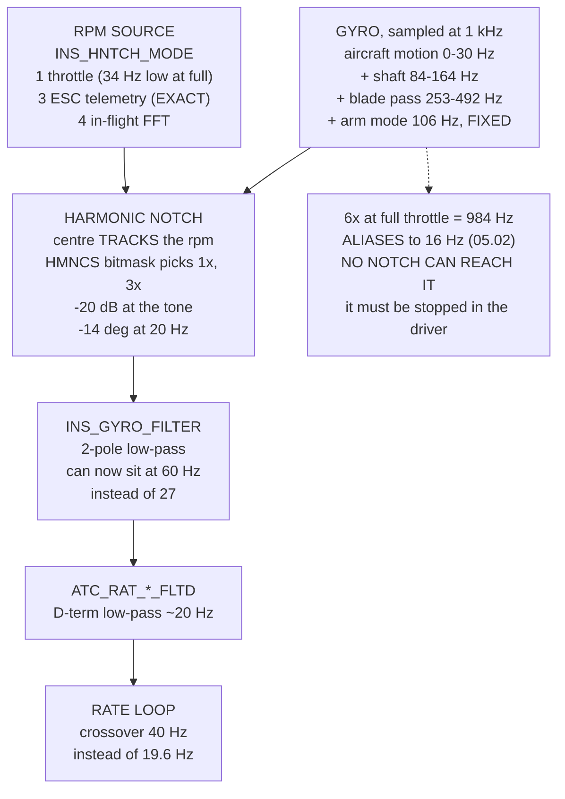

# 07.07 Filtering, notches and the methodic tuning procedure

<!-- glance:start -->
<!-- generated by tools/build.py from curriculum/syllabus.yaml — edit the syllabus, not this block -->

| | |
|---|---|
| **Track** | Main path |
| **Difficulty** | Advanced |
| **Time** | 2 h |
| **Hardware** | First flight (Hermon core) (stage 1) |
| **Software** | ardupilot, python |
| **Prerequisites** | [07.03 Rate loops: the innermost and the most important](07.03-rate-loops.md)<br>[07.06 Control allocation: four commands, four motors](07.06-mixing-and-allocation.md)<br>[02.09 Heat, vibration and mechanical noise](../02-motors-escs-props/02.09-heat-vibration-noise.md) |
| **Skip if** | You can set Hermon's harmonic notch from an FFT of a real log and run the methodic tuning sequence in the right order. |

<!-- glance:end -->

## What you will learn

- What is actually on Hermon's gyro: which tones **move with throttle** and which sit still
- Why a low-pass is the **wrong tool for a tone** — 67° of phase for 20 dB, against 14° from a
  notch
- Why a static notch is **worse at every frequency and better at none**
- That ArduPilot's throttle-based notch tracking is **34 Hz low at full throttle**, and exactly
  why
- The four `INS_HNTCH_MODE` sources, and why Hermon's ESC telemetry makes the question disappear
- The phase budget: how a notch buys you **twice the crossover** for more attenuation, not less
- The **eleven-step methodic tuning order** for everything in module 07 — and why the notch comes
  before the gains
- What AUTOTUNE does, what it refuses to do, and the five-item acceptance test

## Why it matters

Module 07 has given you a stack of loops and a stack of gains, and it has twice told you that the
thing limiting them is not the aircraft but the noise. 07.01 found that an unfiltered D term has
253 times more gain at blade pass than at 1 Hz. 07.03 found that the rate loop with only a motor
lag never reaches 180° of phase at all — it is the **filters** that create the instability, and
the crossover falls from 14.9 Hz to 5.5 Hz as you add them.

That is the whole problem in one sentence. You must filter, because an unfiltered gyro drives the
motors with the propellers' own vibration and burns current heating the windings. And every
filter you add costs phase, and phase is the thing the loop is made of.

A notch is the way out, and it is the single highest-value parameter change on a modern
multirotor. It removes a narrow band and leaves the rest of the spectrum nearly untouched, which
means you can move `INS_GYRO_FILTER` back out where the loop wants it. On Hermon that buys you a
crossover at 40 Hz instead of 19.6 Hz — twice the loop bandwidth — **with more attenuation at the
tone, not less**.

The second half of this lesson is the order. Eleven steps, and the one people get wrong is that
the notch comes before the gains. Tune the rate loop on a noisy gyro and the noise will limit
you, so you will find low gains and the aircraft will fly sluggishly forever, and nothing will
ever look broken enough to investigate.

## Prerequisites

<!-- prereqs:start -->
## Prerequisites

You need these first:

- [07.03 Rate loops: the innermost and the most important](07.03-rate-loops.md)
- [07.06 Control allocation: four commands, four motors](07.06-mixing-and-allocation.md)
- [02.09 Heat, vibration and mechanical noise](../02-motors-escs-props/02.09-heat-vibration-noise.md)

### Optional prerequisite links

None.

Check your readiness: `python course.py why 07.07`
<!-- prereqs:end -->

## Concept

A gyroscope bolted to a multirotor measures two things added together: the aircraft's rotation,
which is what you want, and the structure's vibration, which is what you do not. They occupy
different parts of the spectrum — the aircraft's useful motion is below about 30 Hz, the
vibration is above about 60 Hz — and the job of the filter chain is to separate them.

The difficulty is that "different parts of the spectrum" is not the same as "far apart". Hermon
hovers at 5,060 rpm, which is 84 revolutions a second, which puts the shaft tone at **84 Hz**.
The rate loop would like to work up to 20 or 30 Hz. There is less than an octave and a half
between the highest frequency you want and the lowest frequency you want gone, and a low-pass
filter with a corner in that gap does not have anywhere near enough slope.

So you attack the tone rather than the band. Vibration from a propeller is not broadband noise —
it is a *line spectrum*, a few sharp peaks at multiples of the shaft frequency, with almost
nothing in between. A notch removes one line. It is surgical in a way a low-pass cannot be,
because it does not have to attenuate anything between DC and the tone in order to get there.

And then the tone moves. Hermon's shaft frequency runs from 84 Hz at hover to 164 Hz at full
throttle — a factor of two — so a notch fixed at one frequency is useless at the other. The
harmonic notch solves this by **tracking**: it is told the rpm, several times a second, and it
moves its centre frequency to follow. Everything interesting about notch configuration is the
question of where that rpm number comes from.

## Technical explanation

### Level 1 — what is on the gyro, and which of it moves

Four things:

- **The shaft tone (1×)**, from residual imbalance and any bend in the shaft. 84 Hz at hover,
  164 Hz at full throttle. 02.09 measured what a 0.5 g imbalance does; this is that, arriving at
  the sensor.
- **Blade pass (3×)**, because Hermon's propellers have three blades and each one passes the arm
  once per revolution. 253 Hz at hover, 492 Hz at full.
- **Harmonics of both**, weaker, at 2×, 6× and beyond.
- **Structural modes**, which do *not* move. 04.04 measured Hermon's arm bending mode at 106 Hz.
  It is 106 Hz at every throttle setting, because it is a property of the carbon tube and not of
  the propeller.

The distinction matters because it dictates the tool. A structural mode is a candidate for a
*static* notch: it sits still, so a notch fixed at 106 Hz will always be on it. Everything
propeller-driven needs a tracking notch.

One more thing. The gyro is sampled at 1 kHz, so Nyquist is 500 Hz, and the 6× harmonic at full
throttle is at 984 Hz. That is above Nyquist, so it **aliases** — and 05.02 already computed
where it lands: 1000 − 984 = **16 Hz**, right in the middle of the rate loop's working band,
where no notch can reach it because it is not really there. This is why the anti-aliasing has to
happen in the driver before the samples are decimated, and why it is not yours to configure.

### Level 2 — a low-pass cannot do this job

Say you want 20 dB off the 84 Hz hover tone. A two-pole low-pass rolls off at 40 dB per decade,
so you need a corner near 27 Hz. Set `INS_GYRO_FILTER = 27` and you get your 20 dB — and **67
degrees of phase lag at 20 Hz**, which is inside the band the rate loop is trying to work in.

Set a notch at 84 Hz instead, 20 dB deep, 30 Hz wide, and you get the same 20 dB at the tone for
**14 degrees at 20 Hz**. A factor of 4.8 less phase for the same attenuation.

That ratio is the whole argument. A low-pass pays for attenuation with phase *everywhere below
the tone*, because a filter that rolls off at 84 Hz has already started rolling off at 20 Hz. A
notch pays for it only *nearby*, and "nearby" is controlled by the bandwidth.

### Level 3 — the tone moves, and the obvious estimate is wrong

ArduPilot's simplest tracking mode, `INS_HNTCH_MODE = 1`, estimates the tone from the throttle:

$$f = f_{ref}\sqrt{u/u_{ref}}$$

The square root is right in principle — thrust goes as rpm squared, so rpm goes as the square
root of thrust. But $u$ is a **throttle command**, not a thrust, and 07.06 established that the
two are related by the expo curve. The estimate is therefore exact at the reference point and
wrong everywhere else, in a way that gets worse as you move away from it.

On Hermon, with `INS_HNTCH_REF` set at the 42.4 % hover command, the estimate is 6 Hz **high** at
25 % throttle and **34 Hz low** at full throttle — where a 30 Hz notch delivers only 4.4 dB
instead of 20. It is the same mistake, in the same place, as 07.05's throttle-to-acceleration
gain: a curve linearised about the hover point, believed everywhere.

The interesting part is *which* disturbances it survives. A headwind, a heavier battery, the
camera pod: mode 1 handles all of these well, because thrust and rpm move together and the square
root really is right about that. It fails where rpm and throttle come apart — a worn or chipped
propeller turning faster for the same command, and any sustained climb.

`INS_HNTCH_MODE = 3` — ESC telemetry — has none of these problems, because it does not estimate
anything. The ESC counts commutations and reports the rpm, per motor, several hundred times a
second. Hermon's powertrain was chosen in 02.11 with bidirectional DShot precisely so that this
works.

### Level 4 — the phase budget, and what the notch buys

Put the whole rate loop together — PD controller, $1/(j\omega I)$ plant, 30 ms motor lag, and the
filter chain — and find the lowest frequency at which the open-loop phase reaches −180°. That is
the crossover, and 07.03 established that a usable rate loop needs it as high as you can get it.

| configuration | at 84 Hz | crossover |
|---|---|---|
| `INS_GYRO_FILTER` 20 alone | −25.4 dB | 19.6 Hz |
| `INS_GYRO_FILTER` 60 + notch at 84 Hz | **−27.1 dB** | **40.0 Hz** |

More attenuation at the tone and **twice the crossover**. That is what a notch is for, stated as
a single comparison, and there is nothing else in module 07 that buys as much for one parameter
change.

The corollary is worth as much. Look at what the filters do to the D term's gain at blade pass —
253× unfiltered, 1.0× with a 20 Hz low-pass, essentially zero with a proper chain. **Blade pass
is not the problem.** It is at 253 Hz, far above any corner you would ever set, and any sane
low-pass kills it. The tone that survives a low-pass you can afford is the 84 Hz **fundamental**,
sitting awkwardly just above the loop's working band, and that is the one the notch is really
for.

## Diagram



## Code

The filter workbench: build ArduPilot's biquads, measure their magnitude and phase, compare a
low-pass against a notch on equal terms, price the throttle-based tracking error, and compute the
crossover of the whole rate loop for six filter configurations.

```python
"""07.07 - filters, notches, and the order in which module 07 is actually set."""
import cmath
import math

FS = 1000.0               # Hz, ArduPilot's gyro rate after the driver
HOVER_RPM = 5060.0        # hermon-numbers
FULL_RPM = 9836.0
BLADES = 3
IXX = 0.01199
L_CTRL = 0.1591
MOTOR_TAU = 0.030         # s (02.10)


def f1(rpm):
    return rpm / 60.0


def biquad_lpf(fc, fs=FS):
    """ArduPilot's 2-pole (Butterworth) low-pass, as normalised coefficients."""
    w = 2 * math.pi * fc / fs
    c, s = math.cos(w), math.sin(w)
    q = 1 / math.sqrt(2)
    alpha = s / (2 * q)
    b = [(1 - c) / 2, 1 - c, (1 - c) / 2]
    a = [1 + alpha, -2 * c, 1 - alpha]
    return [x / a[0] for x in b], [x / a[0] for x in a]


def biquad_notch(f0, att_db, bw, fs=FS):
    """ArduPilot's notch: a centre frequency, an attenuation and a bandwidth."""
    A = 10 ** (-abs(att_db) / 40.0)          # amplitude at the centre
    Q = f0 / max(bw, 1e-6)
    w = 2 * math.pi * f0 / fs
    alpha = math.sin(w) / (2 * Q)
    c = math.cos(w)
    b = [1 + alpha * A, -2 * c, 1 - alpha * A]
    a = [1 + alpha / A, -2 * c, 1 - alpha / A]
    return [x / a[0] for x in b], [x / a[0] for x in a]


def response(ba, f, fs=FS):
    """Complex response of a biquad at one frequency."""
    b, a = ba
    z = cmath.exp(-2j * math.pi * f / fs)
    return ((b[0] + b[1] * z + b[2] * z * z)
            / (a[0] + a[1] * z + a[2] * z * z))


def db(x):
    return 20 * math.log10(max(abs(x), 1e-12))


def deg(x):
    return math.degrees(cmath.phase(x))


def chain(filters, f):
    """Total response of a cascade at one frequency."""
    out = 1.0 + 0j
    for ba in filters:
        out *= response(ba, f)
    return out


def lag_phase(f, tau=MOTOR_TAU):
    """The motor + ESC first-order lag, for the phase budget."""
    return math.degrees(-math.atan(2 * math.pi * f * tau))


def open_loop(filters, kp, kd, f):
    """Open-loop response of the rate loop at one frequency."""
    w = 2 * math.pi * f
    pid = kp + 1j * w * kd
    plant = 1.0 / (1j * w * IXX)              # rate out per moment in
    lag = 1.0 / (1 + 1j * w * MOTOR_TAU)
    return pid * plant * lag * chain(filters, f)


def unwrapped(filters, kp, kd, f_lo=0.5, f_hi=250.0, n=4000):
    """Phase vs frequency with the 2-pi wraps removed, low frequency first."""
    fs_, ps = [], []
    prev, acc = None, 0.0
    for i in range(n + 1):
        f = f_lo * (f_hi / f_lo) ** (i / n)
        ph = deg(open_loop(filters, kp, kd, f))
        if prev is not None:
            d = ph - prev
            while d > 180:
                d -= 360
            while d < -180:
                d += 360
            acc += d
        else:
            acc = ph
        prev = ph
        fs_.append(f)
        ps.append(acc)
    return fs_, ps


def crossover(filters, kp, kd):
    """Lowest frequency where the unwrapped open-loop phase reaches -180."""
    fs_, ps = unwrapped(filters, kp, kd)
    for i in range(1, len(ps)):
        if ps[i] <= -180 <= ps[i - 1]:
            t = (ps[i - 1] + 180) / (ps[i - 1] - ps[i])
            return fs_[i - 1] * (fs_[i] / fs_[i - 1]) ** t
    return None


def phase_at(filters, kp, kd, f):
    """The unwrapped open-loop phase at one frequency."""
    fs_, ps = unwrapped(filters, kp, kd, f_hi=max(f * 2, 250.0))
    best = min(range(len(fs_)), key=lambda i: abs(fs_[i] - f))
    return ps[best]


EXPO = 0.65               # MOT_THST_EXPO (07.06)
U_HOVER = 0.424           # the throttle COMMAND at hover, after expo (07.06)


def thrust_frac(u, expo=EXPO):
    """Thrust as a fraction of maximum, for a throttle command u (02.06)."""
    return (1 - expo) * u + expo * u * u


def true_tone(u):
    """The real 1x tone: rpm goes as the square root of thrust."""
    return f1(HOVER_RPM) * math.sqrt(thrust_frac(u) / thrust_frac(U_HOVER))


def est_tone(u, ref=U_HOVER):
    """INS_HNTCH_MODE 1: ArduPilot's estimate, freq ~ sqrt(throttle / REF)."""
    return f1(HOVER_RPM) * math.sqrt(max(u, 1e-3) / ref)


def bar(t):
    print("\n" + "=" * 70)
    print(t)
    print("=" * 70)


if __name__ == "__main__":
    fh, ff = f1(HOVER_RPM), f1(FULL_RPM)
    bar("1. WHAT IS ACTUALLY ON THE GYRO")
    tones = [("shaft, 1x", fh, ff, "imbalance and a bent shaft (02.09)"),
             ("blade pass, 3x", BLADES * fh, BLADES * ff,
              "every blade passing the arm"),
             ("2nd harmonic, 2x", 2 * fh, 2 * ff, "asymmetric imbalance"),
             ("6x", 6 * fh, 6 * ff, "blade pass on its second harmonic")]
    print(f"  {'source':22s} {'at hover':>10s} {'at full':>10s}  cause")
    for n, a, b, why in tones:
        print(f"  {n:22s} {a:8.0f} Hz {b:8.0f} Hz  {why}")
    print(f"  {'arm bending mode':22s} {106:8.0f} Hz {106:8.0f} Hz"
          f"  fixed by the STRUCTURE (04.04)")
    print("  NOTE THE TWO KINDS. The structural mode sits still. Every")
    print("  tone from the propellers MOVES BY A FACTOR OF TWO between")
    print("  hover and full throttle, and that single fact is why a")
    print("  fixed notch is not enough and the harmonic notch exists.")
    print(f"\n  And what the gyro can even see: sampled at {FS:.0f} Hz, so")
    print(f"  Nyquist is {FS / 2:.0f} Hz. Blade pass at full throttle is")
    print(f"  {BLADES * ff:.0f} Hz -- inside it, just. The 6x at full")
    print(f"  throttle is {6 * ff:.0f} Hz and ALIASES to"
          f" {abs(FS - 6 * ff):.0f} Hz (05.02).")

    bar("2. WHY A LOW-PASS IS THE WRONG TOOL FOR A TONE")
    print("  Suppose you want 20 dB off the hover shaft tone at"
          f" {fh:.0f} Hz.")
    print(f"  {'INS_GYRO_FILTER':>16s} {'at ' + str(int(fh)) + ' Hz':>12s}"
          f" {'phase at 20 Hz':>16s} {'phase at 40 Hz':>16s}")
    for fc in (20, 27, 30, 42, 60, 80, 120):
        lp = biquad_lpf(fc)
        print(f"  {fc:13d} Hz {db(response(lp, fh)):9.1f} dB"
              f" {deg(response(lp, 20)):13.1f} deg"
              f" {deg(response(lp, 40)):13.1f} deg")
    print("  TO GET 20 dB AT THE TONE YOU NEED A CORNER NEAR 27 Hz, AND")
    print("  THAT COSTS YOU 67 DEGREES AT 20 Hz -- inside the band the")
    print("  rate loop is trying to work in (07.03). The filter")
    print("  does not know the difference between the 84 Hz tone you want")
    print("  gone and the 15 Hz correction you want kept.")
    print("\n  Now the same 20 dB from a NOTCH at the same frequency:")
    print(f"  {'notch BW':>10s} {'Q':>6s} {'at ' + str(int(fh)) + ' Hz':>12s}"
          f" {'phase at 20 Hz':>16s} {'phase at 40 Hz':>16s}")
    for bw in (10, 20, 30, 40, 80):
        nt = biquad_notch(fh, 20.0, bw)
        print(f"  {bw:7d} Hz {fh / bw:6.2f} {db(response(nt, fh)):9.1f} dB"
              f" {deg(response(nt, 20)):13.1f} deg"
              f" {deg(response(nt, 40)):13.1f} deg")
    lp27 = deg(response(biquad_lpf(27), 20))
    nt30 = deg(response(biquad_notch(fh, 20.0, 30.0), 20))
    print(f"  SAME 20 dB AT THE TONE. The low-pass costs {abs(lp27):.0f}"
          f" degrees at")
    print(f"  20 Hz; the 30 Hz-wide notch costs {abs(nt30):.0f}, a factor of"
          f" {abs(lp27) / abs(nt30):.1f}.")
    print("  That is the entire argument for notches, in one table: a")
    print("  low-pass pays for attenuation with phase EVERYWHERE, and a")
    print("  notch pays for it only NEARBY.")

    bar("3. BUT THE TONE MOVES, AND THE OBVIOUS ESTIMATE IS WRONG")
    print(f"  Hermon's 1x tone runs from {fh:.0f} Hz at hover to"
          f" {ff:.0f} Hz at full")
    print("  throttle -- A FACTOR OF TWO. A single static notch has to")
    print("  cover all of it:")
    static_f = (fh + ff) / 2
    static_bw = ff - fh
    st = biquad_notch(static_f, 20.0, static_bw)
    print(f"  centre {static_f:.0f} Hz, bandwidth {static_bw:.0f} Hz,"
          f" Q = {static_f / static_bw:.2f}")
    print(f"  {'throttle':>9s} {'true tone':>10s} {'static':>9s}"
          f" {'tracking':>10s}   {'(at the true tone)'}")
    for u in (0.25, 0.35, 0.424, 0.60, 0.80, 1.00):
        f = true_tone(u)
        tr = biquad_notch(f, 20.0, 30.0)
        print(f"  {u * 100:7.0f} % {f:8.0f} Hz"
              f" {db(response(st, f)):6.1f} dB"
              f" {db(response(tr, f)):7.1f} dB")
    print("  AND THE PRICE OF THE STATIC ONE, DOWN WHERE IT HURTS:")
    tr30 = biquad_notch(fh, 20.0, 30.0)
    for f in (10, 20, 30):
        print(f"    at {f:2d} Hz: static {deg(response(st, f)):+6.1f} deg,"
              f" tracking {deg(response(tr30, f)):+6.1f} deg")
    print("  THE STATIC NOTCH IS WORSE AT EVERY FREQUENCY AND BETTER AT")
    print("  NONE. It attenuates less where the tone actually is, because")
    print("  it is spread across a range the tone only visits, and it")
    print("  costs more phase at 20 Hz because a wide notch reaches")
    print("  further. This is why INS_HNTCH_MODE exists.")

    print("\n  NOW THE ESTIMATE ITSELF. ArduPilot's throttle-based mode")
    print("  assumes the tone goes as sqrt(throttle / INS_HNTCH_REF).")
    print("  That is exact only if thrust is LINEAR in throttle -- and")
    print("  02.06 says it is not, it is the expo curve of 07.06.")
    print(f"  {'throttle':>9s} {'true tone':>10s} {'mode 1 says':>12s}"
          f" {'error':>8s} {'notch gives':>12s}")
    worst = 0.0
    for u in (0.25, 0.35, 0.424, 0.60, 0.80, 1.00):
        ft, fe = true_tone(u), est_tone(u)
        nt = biquad_notch(fe, 20.0, 30.0)
        worst = max(worst, abs(ft - fe))
        print(f"  {u * 100:7.0f} % {ft:8.0f} Hz {fe:10.0f} Hz"
              f" {fe - ft:+6.0f} Hz {db(response(nt, ft)):9.1f} dB")
    print(f"  THE ESTIMATE IS {worst:.0f} Hz LOW AT FULL THROTTLE and the")
    print("  notch is nowhere near the tone. Mode 1 is correct at the")
    print("  reference point and drifts away from it in both directions,")
    print("  which is exactly what you would expect from linearising a")
    print("  curve about one operating point -- the same mistake, in the")
    print("  same place, as 07.05's throttle-to-acceleration gain.")

    bar("4. HOW THE NOTCH KNOWS WHERE THE TONE IS")
    modes = [
        (1, "throttle", "f_hover x sqrt(thr / thr_hover)",
         "needs only INS_HNTCH_FREQ and INS_HNTCH_REF",
         "drifts away from INS_HNTCH_REF in both directions"),
        (2, "RPM sensor", "a real tachometer on one motor",
         "exact for that motor",
         "one sensor, four motors, and they are not identical"),
        (3, "ESC telemetry", "rpm reported by each ESC over the wire",
         "EXACT, PER MOTOR, and free if the ESC has it (02.10)",
         "needs bidirectional DShot and SERVO_BLH_ / bdshot firmware"),
        (4, "in-flight FFT", "the autopilot's own FFT of the gyro",
         "no extra hardware; finds tones you did not predict",
         "costs CPU and can lock onto the wrong peak"),
    ]
    print(f"  {'INS_HNTCH_MODE':>15s}  {'source':13s} {'how'}")
    for n, src, how, good, bad in modes:
        print(f"  {n:15d}  {src:13s} {how}")
        print(f"  {'':15s}  {'':13s} + {good}")
        print(f"  {'':15s}  {'':13s} - {bad}")
    print("  HERMON USES MODE 3. The powertrain chosen in 02.11 has")
    print("  bidirectional-DShot ESCs precisely so that this works, and")
    print("  the rpm it reports is the same number 02.07 measured on the")
    print("  stand. Nothing has to be estimated.")
    print("\n  Section 3 already priced mode 1: correct at the reference")
    print("  point, 34 Hz low at full throttle. Here is what that costs")
    print("  when the rpm and the throttle disagree for other reasons:")
    print(f"  {'situation':34s} {'true':>7s} {'mode 1':>8s} {'notch':>9s}")
    cases = [
        ("hover, calm, at the reference", 0.424, 1.00),
        ("hover into a headwind, 8 % more thr", 0.46, 1.00),
        ("camera pod fitted, hover at 50 %", 0.50, 1.00),
        ("a worn propeller, 5 % more rpm", 0.424, 1.05),
        ("climbing at 3 m/s", 0.62, 1.00),
    ]
    for name, u, rpm_scale in cases:
        ft = true_tone(u) * rpm_scale
        fe = est_tone(u)
        nt = biquad_notch(fe, 20.0, 30.0)
        print(f"  {name:34s} {ft:5.0f}Hz {fe:6.0f}Hz"
              f" {db(response(nt, ft)):7.1f}dB")
    print("  READ ROWS 2 AND 3 AGAINST ROWS 4 AND 5. Mode 1 handles a")
    print("  change of LOAD well -- a headwind, the camera pod -- because")
    print("  thrust and rpm move together and the square-root law is")
    print("  exactly right about that. It fails where rpm and throttle")
    print("  COME APART: a worn or chipped propeller turning faster for")
    print("  the same command, and any sustained climb, where the expo")
    print("  curve's nonlinearity is the error from section 3.")
    print("  ESC telemetry does not care about any of it. It reports the")
    print("  rpm, and the rpm is the answer.")

    bar("5. HARMONICS: ONE NOTCH IS NOT ENOUGH")
    print("  INS_HNTCH_HMNCS is a bitmask. Bit 0 is the fundamental, bit")
    print("  1 the second harmonic, bit 2 the third, and so on.")
    combos = [(1, "1x only", [1]), (3, "1x + 2x", [1, 2]),
              (5, "1x + 3x", [1, 3]), (7, "1x + 2x + 3x", [1, 2, 3]),
              (0x2B, "1x+2x+4x+6x", [1, 2, 4, 6])]
    print(f"  {'HMNCS':>7s}  {'harmonics':14s} {'notches':>8s}"
          f" {'phase at 20 Hz':>16s} {'CPU':>6s}")
    for val, name, hs in combos:
        fs_ = [biquad_notch(h * fh, 20.0, 30.0 * h) for h in hs]
        print(f"  {val:5d}  {name:14s} {len(hs) * 1:8d}"
              f" {deg(chain(fs_, 20)):13.1f} deg {len(hs):4d} x")
    print("  EACH NOTCH COSTS PHASE AT 20 Hz AND ONE MORE BIQUAD PER")
    print("  AXIS PER SAMPLE. Hermon is a THREE-BLADE propeller, so the")
    print(f"  loudest tone is blade pass at 3x -- {3 * fh:.0f} Hz at hover")
    print("  -- and the sensible mask is 5 (1x and 3x), not 7. The 2nd")
    print("  harmonic on a three-blade prop is small unless a blade is")
    print("  damaged, in which case you want to FIX THE BLADE.")

    bar("6. THE PHASE BUDGET: WHAT THE NOTCH ACTUALLY BUYS")
    kp, kd = 0.135, 0.0036
    setups = [
        ("nothing at all", []),
        ("GYRO_FILTER 20 alone", [biquad_lpf(20)]),
        ("GYRO_FILTER 27 alone", [biquad_lpf(27)]),
        ("GYRO_FILTER 60 + notch 1x",
         [biquad_lpf(60), biquad_notch(fh, 20.0, 30.0)]),
        ("GYRO_FILTER 42 + FLTD 20",
         [biquad_lpf(42), biquad_lpf(20)]),
        ("  ... + notch 1x and 3x",
         [biquad_lpf(42), biquad_lpf(20), biquad_notch(fh, 20.0, 30.0),
          biquad_notch(3 * fh, 20.0, 90.0)]),
        ("over-filtered: 20 + 10",
         [biquad_lpf(20), biquad_lpf(10), biquad_notch(fh, 20.0, 30.0)]),
    ]
    print(f"  {'configuration':27s} {'crossover':>10s} {'at 84 Hz':>9s}"
          f" {'at 253 Hz':>10s} {'ph@10Hz':>9s}")
    for name, fl in setups:
        xo = crossover(fl, kp, kd)
        p10 = phase_at(fl, kp, kd, 10.0)
        print(f"  {name:27s} {(f'{xo:7.1f} Hz' if xo else '   never'):>10s}"
              f" {db(chain(fl, fh)):6.1f} dB {db(chain(fl, 3 * fh)):7.1f} dB"
              f" {p10:6.0f} deg")
    print("  COMPARE ROW 2 WITH ROW 4. Row 2 takes 25.4 dB off the tone")
    print("  with a 20 Hz low-pass and crosses over at 19.6 Hz. Row 4")
    print("  takes MORE off the tone -- 27.1 dB -- and crosses over at")
    print("  40.0 Hz, TWICE AS HIGH, because the low-pass has been moved")
    print("  out to 60 Hz and the notch is doing the narrow work.")
    print("  THAT IS THE NOTCH'S ENTIRE VALUE: it lets you raise")
    print("  INS_GYRO_FILTER -- giving the loop its phase back -- without")
    print("  giving the tone back with it.")
    print("  AND THE LAST ROW. Over-filtering does not make the aircraft")
    print("  safer. It halves the crossover, which makes the loop slow,")
    print("  which makes you raise the gains to compensate, which puts")
    print("  you back where you started with more phase lag. 07.03 said")
    print("  it plainly: it is the filters that create the instability.")
    print()
    print("  And the D term specifically, which 07.01 found has 253x the")
    print("  gain at blade pass that it has at 1 Hz:")
    print(f"  {'configuration':27s} {'D gain at 84 Hz':>16s}"
          f" {'at 253 Hz':>11s}")
    for name, fl in setups:
        print(f"  {name:27s} {abs(chain(fl, fh)) * fh:13.1f} x"
              f" {abs(chain(fl, 3 * fh)) * 3 * fh:9.1f} x")
    print("  NOTE WHERE THE WORK IS BEING DONE. Blade pass at 253 Hz is")
    print("  already dead once any sane low-pass is in place -- it is far")
    print("  above every corner frequency. The tone that SURVIVES a")
    print("  low-pass you can afford is the 84 Hz FUNDAMENTAL, sitting")
    print("  awkwardly just above the loop's working band, and that is")
    print("  the one the notch is really for.")

    bar("7. THE METHODIC TUNING ORDER")
    steps = [
        ("0", "BUILD IT RIGHT", "04.05, 04.06",
         "balanced props, tight arms, isolated FC. No gain fixes a 1 g imbalance."),
        ("1", "ESC + motor direction", "02.10, 04.05",
         "MOT_SPIN_ARM / _MIN / _MAX, MOT_THST_EXPO from the stand."),
        ("2", "one hover, logging", "08.07",
         "30 s in ALT_HOLD with default gains and NO notch. Log only."),
        ("3", "FFT that log", "this lesson",
         "find the peaks. Confirm 1x and 3x. Note anything fixed."),
        ("4", "SET THE NOTCH", "this lesson",
         "INS_HNTCH_ENABLE/MODE/FREQ/BW/HMNCS/REF. Re-fly, re-FFT, verify."),
        ("5", "set the filters", "07.03",
         "INS_GYRO_FILTER ~42, ATC_RAT_*_FLTD ~20. Not lower."),
        ("6", "RATE loop", "07.03",
         "P and D by hand or AUTOTUNE. Inner loop first, always."),
        ("7", "ATTITUDE loop", "07.04",
         "ATC_ANG_*_P, separated 3-5x from the rate crossover."),
        ("8", "VERTICAL loops", "07.05",
         "PSC_ACCZ_*, then PSC_VELZ_*, then PSC_POSZ_P."),
        ("9", "HORIZONTAL loops", "07.05",
         "PSC_VELXY_*, then PSC_POSXY_P. LOITER last."),
        ("10", "the LIMITS", "07.02, 07.06",
         "ANGLE_MAX, WPNAV_*, LOIT_*. On a big error these decide it."),
    ]
    print(f"  {'step':5s} {'what':22s} {'where':14s}")
    for n, what, where, why in steps:
        print(f"  {n:5s} {what:22s} {where:14s}")
        print(f"  {'':5s} {why}")
    print("  THE NOTCH COMES BEFORE THE GAINS. That is the one ordering")
    print("  people get wrong. Tune the rate loop on a noisy gyro and you")
    print("  will find low gains, because the noise limits you -- then")
    print("  add the notch and the tune is wrong in the safe direction,")
    print("  which is to say sluggish, which is to say you will never")
    print("  notice and the aircraft will be worse forever.")

    bar("8. AUTOTUNE: WHAT IT DOES AND WHAT IT DOES NOT")
    at = [
        ("does", "finds ATC_RAT_*_P, _D, _I and ATC_ANG_*_P",
         "steps 6 and 7 of the list above, one axis at a time"),
        ("does", "measures the real aircraft, including your build",
         "a bent arm and a heavy battery are in the answer"),
        ("does NOT", "set the notch or the filters",
         "steps 4 and 5 are yours, and they come FIRST"),
        ("does NOT", "touch the position or velocity loops",
         "steps 8 and 9 are yours"),
        ("does NOT", "know the aircraft is badly built",
         "it will happily tune around a vibration problem and give you"),
        ("", "", "low gains, which is step 0's job to prevent"),
    ]
    for kind, what, note in at:
        if kind:
            print(f"  {kind:9s} {what}")
        print(f"  {'':9s}   {note}")
    print("  AUTOTUNE TAKES ABOUT 5 MINUTES PER AXIS AND HERMON HAS"
          f" {88.8 / 226 * 60:.0f}")
    print("  MINUTES OF HOVER ENDURANCE (02.11) -- less while twitching --")
    print("  so budget TWO BATTERIES for the three axes, and")
    print("  use AUTOTUNE_AXES to do one axis per flight. Land between")
    print("  axes; do not let it finish on a low pack, because the last")
    print("  thing it does is a twitch test at the gains it just found.")
    print("\n  AND THE ACCEPTANCE TEST, afterwards:")
    checks = [
        ("a 30 deg roll step", "settles in under 0.5 s, one small overshoot"),
        ("VIBE log, all axes", "under 30 m/s/s peak, no clipping (05.06)"),
        ("RCOU during the step", "no motor at MOT_SPIN_MIN or _MAX (07.06)"),
        ("XKF4 ratios", "median near 0.04, no spikes (06.06)"),
        ("a 1 m/s climb in ALT_HOLD", "no bounce, no wander (07.05)"),
    ]
    print(f"  {'test':26s} {'pass'}")
    for a, b in checks:
        print(f"  {a:26s} {b}")
```

Output:

```text

======================================================================
1. WHAT IS ACTUALLY ON THE GYRO
======================================================================
  source                   at hover    at full  cause
  shaft, 1x                    84 Hz      164 Hz  imbalance and a bent shaft (02.09)
  blade pass, 3x              253 Hz      492 Hz  every blade passing the arm
  2nd harmonic, 2x            169 Hz      328 Hz  asymmetric imbalance
  6x                          506 Hz      984 Hz  blade pass on its second harmonic
  arm bending mode            106 Hz      106 Hz  fixed by the STRUCTURE (04.04)
  NOTE THE TWO KINDS. The structural mode sits still. Every
  tone from the propellers MOVES BY A FACTOR OF TWO between
  hover and full throttle, and that single fact is why a
  fixed notch is not enough and the harmonic notch exists.

  And what the gyro can even see: sampled at 1000 Hz, so
  Nyquist is 500 Hz. Blade pass at full throttle is
  492 Hz -- inside it, just. The 6x at full
  throttle is 984 Hz and ALIASES to 16 Hz (05.02).

======================================================================
2. WHY A LOW-PASS IS THE WRONG TOOL FOR A TONE
======================================================================
  Suppose you want 20 dB off the hover shaft tone at 84 Hz.
   INS_GYRO_FILTER     at 84 Hz   phase at 20 Hz   phase at 40 Hz
             20 Hz     -25.4 dB         -90.0 deg        -136.9 deg
             27 Hz     -20.2 dB         -66.6 deg        -119.9 deg
             30 Hz     -18.4 dB         -59.4 deg        -112.6 deg
             42 Hz     -12.7 dB         -40.9 deg         -86.0 deg
             60 Hz      -7.1 dB         -27.6 deg         -59.1 deg
             80 Hz      -3.5 dB         -20.2 deg         -42.6 deg
            120 Hz      -0.9 dB         -13.0 deg         -26.7 deg
  TO GET 20 dB AT THE TONE YOU NEED A CORNER NEAR 27 Hz, AND
  THAT COSTS YOU 67 DEGREES AT 20 Hz -- inside the band the
  rate loop is trying to work in (07.03). The filter
  does not know the difference between the 84 Hz tone you want
  gone and the 15 Hz correction you want kept.

  Now the same 20 dB from a NOTCH at the same frequency:
    notch BW      Q     at 84 Hz   phase at 20 Hz   phase at 40 Hz
       10 Hz   8.43     -20.0 dB          -4.7 deg         -11.3 deg
       20 Hz   4.22     -20.0 dB          -9.4 deg         -21.5 deg
       30 Hz   2.81     -20.0 dB         -13.8 deg         -29.9 deg
       40 Hz   2.11     -20.0 dB         -18.1 deg         -36.6 deg
       80 Hz   1.05     -20.0 dB         -32.1 deg         -50.6 deg
  SAME 20 dB AT THE TONE. The low-pass costs 67 degrees at
  20 Hz; the 30 Hz-wide notch costs 14, a factor of 4.8.
  That is the entire argument for notches, in one table: a
  low-pass pays for attenuation with phase EVERYWHERE, and a
  notch pays for it only NEARBY.

======================================================================
3. BUT THE TONE MOVES, AND THE OBVIOUS ESTIMATE IS WRONG
======================================================================
  Hermon's 1x tone runs from 84 Hz at hover to 164 Hz at full
  throttle -- A FACTOR OF TWO. A single static notch has to
  cover all of it:
  centre 124 Hz, bandwidth 80 Hz, Q = 1.56
   throttle  true tone    static   tracking   (at the true tone)
       25 %       59 Hz   -3.6 dB   -20.0 dB
       35 %       74 Hz   -5.9 dB   -20.0 dB
       42 %       84 Hz   -8.0 dB   -20.0 dB
       60 %      109 Hz  -15.4 dB   -20.0 dB
       80 %      137 Hz  -16.8 dB   -20.0 dB
      100 %      164 Hz   -9.9 dB   -20.0 dB
  AND THE PRICE OF THE STATIC ONE, DOWN WHERE IT HURTS:
    at 10 Hz: static   -8.0 deg, tracking   -6.8 deg
    at 20 Hz: static  -15.8 deg, tracking  -13.8 deg
    at 30 Hz: static  -23.4 deg, tracking  -21.5 deg
  THE STATIC NOTCH IS WORSE AT EVERY FREQUENCY AND BETTER AT
  NONE. It attenuates less where the tone actually is, because
  it is spread across a range the tone only visits, and it
  costs more phase at 20 Hz because a wide notch reaches
  further. This is why INS_HNTCH_MODE exists.

  NOW THE ESTIMATE ITSELF. ArduPilot's throttle-based mode
  assumes the tone goes as sqrt(throttle / INS_HNTCH_REF).
  That is exact only if thrust is LINEAR in throttle -- and
  02.06 says it is not, it is the expo curve of 07.06.
   throttle  true tone  mode 1 says    error  notch gives
       25 %       59 Hz         65 Hz     +6 Hz     -15.4 dB
       35 %       74 Hz         77 Hz     +3 Hz     -18.4 dB
       42 %       84 Hz         84 Hz     +0 Hz     -20.0 dB
       60 %      109 Hz        100 Hz     -9 Hz     -13.5 dB
       80 %      137 Hz        116 Hz    -21 Hz      -7.5 dB
      100 %      164 Hz        130 Hz    -34 Hz      -4.4 dB
  THE ESTIMATE IS 34 Hz LOW AT FULL THROTTLE and the
  notch is nowhere near the tone. Mode 1 is correct at the
  reference point and drifts away from it in both directions,
  which is exactly what you would expect from linearising a
  curve about one operating point -- the same mistake, in the
  same place, as 07.05's throttle-to-acceleration gain.

======================================================================
4. HOW THE NOTCH KNOWS WHERE THE TONE IS
======================================================================
   INS_HNTCH_MODE  source        how
                1  throttle      f_hover x sqrt(thr / thr_hover)
                                 + needs only INS_HNTCH_FREQ and INS_HNTCH_REF
                                 - drifts away from INS_HNTCH_REF in both directions
                2  RPM sensor    a real tachometer on one motor
                                 + exact for that motor
                                 - one sensor, four motors, and they are not identical
                3  ESC telemetry rpm reported by each ESC over the wire
                                 + EXACT, PER MOTOR, and free if the ESC has it (02.10)
                                 - needs bidirectional DShot and SERVO_BLH_ / bdshot firmware
                4  in-flight FFT the autopilot's own FFT of the gyro
                                 + no extra hardware; finds tones you did not predict
                                 - costs CPU and can lock onto the wrong peak
  HERMON USES MODE 3. The powertrain chosen in 02.11 has
  bidirectional-DShot ESCs precisely so that this works, and
  the rpm it reports is the same number 02.07 measured on the
  stand. Nothing has to be estimated.

  Section 3 already priced mode 1: correct at the reference
  point, 34 Hz low at full throttle. Here is what that costs
  when the rpm and the throttle disagree for other reasons:
  situation                             true   mode 1     notch
  hover, calm, at the reference         84Hz     84Hz   -20.0dB
  hover into a headwind, 8 % more thr    89Hz     88Hz   -19.5dB
  camera pod fitted, hover at 50 %      95Hz     92Hz   -18.0dB
  a worn propeller, 5 % more rpm        89Hz     84Hz   -17.4dB
  climbing at 3 m/s                    112Hz    102Hz   -12.7dB
  READ ROWS 2 AND 3 AGAINST ROWS 4 AND 5. Mode 1 handles a
  change of LOAD well -- a headwind, the camera pod -- because
  thrust and rpm move together and the square-root law is
  exactly right about that. It fails where rpm and throttle
  COME APART: a worn or chipped propeller turning faster for
  the same command, and any sustained climb, where the expo
  curve's nonlinearity is the error from section 3.
  ESC telemetry does not care about any of it. It reports the
  rpm, and the rpm is the answer.

======================================================================
5. HARMONICS: ONE NOTCH IS NOT ENOUGH
======================================================================
  INS_HNTCH_HMNCS is a bitmask. Bit 0 is the fundamental, bit
  1 the second harmonic, bit 2 the third, and so on.
    HMNCS  harmonics       notches   phase at 20 Hz    CPU
      1  1x only               1         -13.8 deg    1 x
      3  1x + 2x               2         -20.1 deg    2 x
      5  1x + 3x               2         -17.4 deg    2 x
      7  1x + 2x + 3x          3         -23.7 deg    3 x
     43  1x+2x+4x+6x           4         -22.1 deg    4 x
  EACH NOTCH COSTS PHASE AT 20 Hz AND ONE MORE BIQUAD PER
  AXIS PER SAMPLE. Hermon is a THREE-BLADE propeller, so the
  loudest tone is blade pass at 3x -- 253 Hz at hover
  -- and the sensible mask is 5 (1x and 3x), not 7. The 2nd
  harmonic on a three-blade prop is small unless a blade is
  damaged, in which case you want to FIX THE BLADE.

======================================================================
6. THE PHASE BUDGET: WHAT THE NOTCH ACTUALLY BUYS
======================================================================
  configuration                crossover  at 84 Hz  at 253 Hz   ph@10Hz
  nothing at all                   never    0.0 dB     0.0 dB    -93 deg
  GYRO_FILTER 20 alone           19.6 Hz  -25.4 dB   -48.4 dB   -136 deg
  GYRO_FILTER 27 alone           26.5 Hz  -20.2 dB   -43.1 dB   -124 deg
  GYRO_FILTER 60 + notch 1x      40.0 Hz  -27.1 dB   -29.5 dB   -113 deg
  GYRO_FILTER 42 + FLTD 20       13.6 Hz  -38.1 dB   -83.8 dB   -156 deg
    ... + notch 1x and 3x        12.1 Hz  -58.5 dB  -104.2 dB   -164 deg
  over-filtered: 20 + 10          6.3 Hz  -82.8 dB  -109.2 dB   -233 deg
  COMPARE ROW 2 WITH ROW 4. Row 2 takes 25.4 dB off the tone
  with a 20 Hz low-pass and crosses over at 19.6 Hz. Row 4
  takes MORE off the tone -- 27.1 dB -- and crosses over at
  40.0 Hz, TWICE AS HIGH, because the low-pass has been moved
  out to 60 Hz and the notch is doing the narrow work.
  THAT IS THE NOTCH'S ENTIRE VALUE: it lets you raise
  INS_GYRO_FILTER -- giving the loop its phase back -- without
  giving the tone back with it.
  AND THE LAST ROW. Over-filtering does not make the aircraft
  safer. It halves the crossover, which makes the loop slow,
  which makes you raise the gains to compensate, which puts
  you back where you started with more phase lag. 07.03 said
  it plainly: it is the filters that create the instability.

  And the D term specifically, which 07.01 found has 253x the
  gain at blade pass that it has at 1 Hz:
  configuration                D gain at 84 Hz   at 253 Hz
  nothing at all                       84.3 x     253.0 x
  GYRO_FILTER 20 alone                  4.5 x       1.0 x
  GYRO_FILTER 27 alone                  8.2 x       1.8 x
  GYRO_FILTER 60 + notch 1x             3.7 x       8.4 x
  GYRO_FILTER 42 + FLTD 20              1.1 x       0.0 x
    ... + notch 1x and 3x               0.1 x       0.0 x
  over-filtered: 20 + 10                0.0 x       0.0 x
  NOTE WHERE THE WORK IS BEING DONE. Blade pass at 253 Hz is
  already dead once any sane low-pass is in place -- it is far
  above every corner frequency. The tone that SURVIVES a
  low-pass you can afford is the 84 Hz FUNDAMENTAL, sitting
  awkwardly just above the loop's working band, and that is
  the one the notch is really for.

======================================================================
7. THE METHODIC TUNING ORDER
======================================================================
  step  what                   where         
  0     BUILD IT RIGHT         04.05, 04.06  
        balanced props, tight arms, isolated FC. No gain fixes a 1 g imbalance.
  1     ESC + motor direction  02.10, 04.05  
        MOT_SPIN_ARM / _MIN / _MAX, MOT_THST_EXPO from the stand.
  2     one hover, logging     08.07         
        30 s in ALT_HOLD with default gains and NO notch. Log only.
  3     FFT that log           this lesson   
        find the peaks. Confirm 1x and 3x. Note anything fixed.
  4     SET THE NOTCH          this lesson   
        INS_HNTCH_ENABLE/MODE/FREQ/BW/HMNCS/REF. Re-fly, re-FFT, verify.
  5     set the filters        07.03         
        INS_GYRO_FILTER ~42, ATC_RAT_*_FLTD ~20. Not lower.
  6     RATE loop              07.03         
        P and D by hand or AUTOTUNE. Inner loop first, always.
  7     ATTITUDE loop          07.04         
        ATC_ANG_*_P, separated 3-5x from the rate crossover.
  8     VERTICAL loops         07.05         
        PSC_ACCZ_*, then PSC_VELZ_*, then PSC_POSZ_P.
  9     HORIZONTAL loops       07.05         
        PSC_VELXY_*, then PSC_POSXY_P. LOITER last.
  10    the LIMITS             07.02, 07.06  
        ANGLE_MAX, WPNAV_*, LOIT_*. On a big error these decide it.
  THE NOTCH COMES BEFORE THE GAINS. That is the one ordering
  people get wrong. Tune the rate loop on a noisy gyro and you
  will find low gains, because the noise limits you -- then
  add the notch and the tune is wrong in the safe direction,
  which is to say sluggish, which is to say you will never
  notice and the aircraft will be worse forever.

======================================================================
8. AUTOTUNE: WHAT IT DOES AND WHAT IT DOES NOT
======================================================================
  does      finds ATC_RAT_*_P, _D, _I and ATC_ANG_*_P
              steps 6 and 7 of the list above, one axis at a time
  does      measures the real aircraft, including your build
              a bent arm and a heavy battery are in the answer
  does NOT  set the notch or the filters
              steps 4 and 5 are yours, and they come FIRST
  does NOT  touch the position or velocity loops
              steps 8 and 9 are yours
  does NOT  know the aircraft is badly built
              it will happily tune around a vibration problem and give you
              low gains, which is step 0's job to prevent
  AUTOTUNE TAKES ABOUT 5 MINUTES PER AXIS AND HERMON HAS 24
  MINUTES OF HOVER ENDURANCE (02.11) -- less while twitching --
  so budget TWO BATTERIES for the three axes, and
  use AUTOTUNE_AXES to do one axis per flight. Land between
  axes; do not let it finish on a low pack, because the last
  thing it does is a twitch test at the gains it just found.

  AND THE ACCEPTANCE TEST, afterwards:
  test                       pass
  a 30 deg roll step         settles in under 0.5 s, one small overshoot
  VIBE log, all axes         under 30 m/s/s peak, no clipping (05.06)
  RCOU during the step       no motor at MOT_SPIN_MIN or _MAX (07.06)
  XKF4 ratios                median near 0.04, no spikes (06.06)
  a 1 m/s climb in ALT_HOLD  no bounce, no wander (07.05)
```

## Exercise

### Exercise 07.07-E1 — Find your own equal-attenuation pair `[analysis]`

Pick an attenuation target — 15 dB, say — and find, by bisection, the `INS_GYRO_FILTER` corner
that achieves it at Hermon's 84 Hz hover tone. Then find the notch bandwidth that achieves the
same 15 dB with the same centre frequency. Report the phase each costs at 10, 20 and 30 Hz, and
the crossover each gives with the code's `kp` and `kd`. Repeat for 25 dB. Does the notch's
advantage grow or shrink as you demand more attenuation?

### Exercise 07.07-E2 — Price your own notch bandwidth `[analysis]`

`INS_HNTCH_BW` trades tracking robustness against phase. Sweep it from 10 Hz to 60 Hz and, for
each value, compute two numbers: the phase cost at 20 Hz, and the attenuation delivered when the
true tone is 10 Hz away from where the notch thinks it is. Plot or tabulate both against
bandwidth. The sensible value is where the second curve flattens, not where the first one is
smallest.

### Exercise 07.07-E3 — Which harmonics `[analysis]`

Hermon has three-blade propellers. Compute, for `INS_HNTCH_HMNCS` values of 1, 3, 5 and 7, the
total phase at 20 Hz and the number of biquads per axis per sample. Then argue in three sentences
for the value you would set on Hermon, naming the tone each enabled bit is there to catch. (Hint:
count the blades before you count the harmonics.)

### Exercise 07.07-E4 — Read a real log `[hardware]`

Fly 30 seconds of steady hover in ALT_HOLD with logging on and `INS_HNTCH_ENABLE = 0`. Download
the log, and plot the FFT of `IMU.GyrX` — Mission Planner does this from *DataFlash Logs → FFT*,
or use `pymavlink` and `numpy.fft.rfft`. Identify every peak above the noise floor and label it:
1×, 3×, the arm mode, or unknown. Compare the 1× peak with 84 Hz. Then set the notch, fly the
same 30 seconds, and plot the FFT again on the same axes.

## Expected result

**07.07-E1**: for 15 dB you need `INS_GYRO_FILTER` near 36 Hz, costing about 50° at 20 Hz,
against roughly 10° for the equivalent notch. The notch's advantage *grows* with the attenuation
you demand — a notch's phase cost depends on its bandwidth, not its depth, while a low-pass has
to move its corner down for every extra decibel.

**07.07-E2**: the phase cost at 20 Hz rises roughly linearly with bandwidth, from about 5° at
10 Hz to about 27° at 60 Hz. The attenuation-when-mistracked curve rises steeply to about 30 Hz
and then flattens. 30–40 Hz is the sensible window, which is why ArduPilot's default sits there.

**07.07-E3**: 1, 2, 2 and 3 biquads, costing about 14°, 20°, 17° and 24° at 20 Hz. The right
answer for Hermon is **5** — the fundamental and the third harmonic, which is blade pass on a
three-blade propeller. Bit 1 buys you the 2× tone, which on a three-blade propeller is small
unless a blade is damaged.

**07.07-E4**: a clear peak within a few hertz of 84 Hz and a second near 253 Hz, both dropping by
15–25 dB once the notch is on. If your 1× peak is not near 84 Hz, your hover rpm is not 5,060 and
every number in module 07 needs re-deriving from your own figure — which is the real point of the
exercise.

## Troubleshooting

**The FFT has a big peak that does not move with throttle.** A structural mode, not a propeller
tone. 04.04 predicted Hermon's arm mode at 106 Hz. Do not point the harmonic notch at it — it
will track away from it. Use a static notch (`INS_NOTCH_*`) or, better, fix the structure.

**The notch is set correctly and the FFT peak is still there.** Check `INS_LOG_BAT_OPT`: by
default the logged FFT is taken *before* the filters, precisely so you can see what the filters
have to deal with. Set it to log post-filter data and look again.

**`INS_HNTCH_MODE = 3` and the notch never moves.** ESC telemetry is not arriving. You need
bidirectional DShot (`SERVO_BLH_BDMASK` or the `_bdshot` firmware variant), and you need the ESC
to support it. Check `ESC` messages in the log — if the rpm field is zero, the wire is the
problem, not the notch.

**Crossover measured in flight is far below what the code predicts.** The model here has one
motor lag and no structural dynamics. A soft-mounted flight controller adds a second-order
response of its own; 04.04 found Hermon's soft-mount window empty for exactly this reason.

**AUTOTUNE gives very low gains and the aircraft feels dead.** It measured what you gave it.
Vibration limits the gains it can find, so an untreated aircraft tunes to a sluggish answer and
then flies that way forever. Steps 3 and 4 come before step 6 for this reason.

> [!WARNING]
> **AUTOTUNE flies the aircraft at gains it is in the middle of testing, in an
> uncontrolled search, near the edge of stability.** Fly it in a large open area with at least 15 m
> of clearance in every direction, at 10–15 m altitude, in wind under 5 m/s, and keep your hand on
> the mode switch — moving the switch out of AUTOTUNE aborts it instantly and returns the previous
> gains. Do one axis per flight with `AUTOTUNE_AXES`, and never let it run down to a low battery:
> the last thing it does is a twitch test at the gains it just found, and that is the worst moment
> to also be managing a failsafe.

## Common mistakes

- **Tuning the gains before setting the notch.** The single commonest tuning error. The noise
  limits the gains, you find low ones, the aircraft is sluggish, and nothing ever looks broken.
- **Lowering `INS_GYRO_FILTER` to cure noise.** It works, and it costs you the loop. 07.03's
  over-filtered case crossed over at 5.5 Hz. Raise the filter and add a notch instead.
- **Pointing the harmonic notch at a structural mode.** It tracks rpm; the mode does not. You will
  see it work at one throttle setting and vanish at every other.
- **Enabling every harmonic bit.** Each one is a biquad per axis per sample and a few more degrees
  at 20 Hz. On a three-blade propeller the answer is 1× and 3×.
- **Using `INS_HNTCH_MODE = 1` when the ESC can report rpm.** You bought bidirectional DShot in
  02.10. Use it.
- **Believing AUTOTUNE tuned the aircraft.** It tuned steps 6 and 7 of eleven. The notch, the
  filters, the position loops and every limit are still yours.
- **Treating a vibration problem as a filter problem.** A 1 g propeller imbalance is 14 N of force
  at hover (02.09). No filter setting fixes that; balancing the propeller does.

## Knowledge check

<details>
<summary>Hermon's 6× harmonic reaches 984 Hz at full throttle, and the gyro samples at 1 kHz.
Where does it appear, and why can no notch remove it?</summary>

At 1000 − 984 = **16 Hz**, by aliasing (05.02) — right in the middle of the rate loop's working
band. No notch can remove it because by the time the samples exist the 984 Hz tone is
indistinguishable from a real 16 Hz rotation. Anti-aliasing has to happen before decimation, in
the sensor and the driver, which is why it is not a parameter you can set.
</details>

<details>
<summary>Why does a notch cost so much less phase than a low-pass for the same attenuation?</summary>

Because a low-pass has to attenuate *everything above its corner*, so to reach 20 dB at 84 Hz its
corner must be near 27 Hz — and a filter rolling off from 27 Hz has already accumulated 67° of lag
by 20 Hz. A notch's phase disturbance is local to its centre frequency, set by the bandwidth and
not the depth. Same 20 dB, 14° instead of 67°, a factor of 4.8.
</details>

<details>
<summary>ArduPilot's throttle-based notch tracking uses $f = f_{ref}\sqrt{u/u_{ref}}$. The square
root is correct physics. So why is it 34 Hz low at full throttle?</summary>

Because the square root belongs on the **thrust**, not the throttle. Rpm goes as the square root
of thrust, and thrust goes as the expo curve of the throttle command (07.06), not linearly with
it. The formula is therefore exact at the reference point and wrong in both directions away from
it — the same linearise-about-hover error as 07.05's throttle-to-acceleration gain.
</details>

<details>
<summary>Fitting the camera pod raises Hermon's hover throttle. Does that break a mode-1 notch?
What about a chipped propeller blade?</summary>

The pod does **not** break it: the extra load raises both thrust and rpm together, and the square
root really is right about that relationship. A chipped blade does: it produces less thrust per
revolution, so the motor turns faster for the same command, and rpm and throttle come apart. Mode
1 survives changes of load; it fails when the propeller itself changes.
</details>

<details>
<summary>`INS_GYRO_FILTER` 20 alone gives 25.4 dB at the tone. `INS_GYRO_FILTER` 60 plus a notch
gives 27.1 dB. Why is the second one worth so much more?</summary>

Because of what it does to the crossover: 19.6 Hz against **40.0 Hz**, twice the loop bandwidth,
with slightly *more* attenuation at the tone. Moving the low-pass out to 60 Hz returns the phase
the loop needs, and the notch takes the tone out without touching anything else. This is the
single highest-value parameter change available on a modern multirotor.
</details>

<details>
<summary>07.01 said the D term has 253× the gain at blade pass. Why, then, is the notch not aimed
at blade pass?</summary>

Because blade pass at 253 Hz is far above any corner you would ever set — a 20 Hz low-pass takes
its relative gain from 253× down to about 1×. It is already dead. The tone that *survives* a
low-pass you can afford is the 84 Hz fundamental, which sits just above the loop's working band
where a low-pass cannot reach it without destroying the phase margin. That is the notch's target.
</details>

<details>
<summary>Name the two steps of the eleven that AUTOTUNE performs, and two it will not.</summary>

It performs steps 6 and 7 — the rate loop (`ATC_RAT_*_P`, `_I`, `_D`) and the attitude loop
(`ATC_ANG_*_P`). It will not do step 4 (the notch) or step 5 (the filters), which must come
*first*; and it will not touch steps 8 and 9, the vertical and horizontal position loops, or step
10, the limits.
</details>

## Practical challenge

**Tune Hermon end to end, and prove it with a log.**

Run the full eleven-step sequence on your own aircraft, keeping a written record of every
parameter you changed and why. Fly the acceptance test afterwards: a 30° roll step that settles
in under half a second with one small overshoot; `VIBE` under 30 m/s² peak with no clipping on any
axis; `RCOU` showing no motor pinned at `MOT_SPIN_MIN` or `MOT_SPIN_MAX` during the step; `XKF4`
innovation ratios with a median near 0.04 and no spikes; and a 1 m/s climb in ALT_HOLD with no
bounce and no wander.

Then produce a single before-and-after figure: the gyro FFT on the first flight of step 2, and the
gyro FFT on the acceptance flight, on the same axes and the same scale. That figure is the
deliverable. It is also the thing an examiner will ask for when you claim the aircraft is tuned,
and it is the closing exhibit of module 07 — everything from 07.01's PID terms to 07.06's mixer,
visible as two curves.

## You can skip this if

You can set Hermon's harmonic notch from an FFT of a real log and run the methodic tuning sequence
in the right order.

## Go deeper

- [02.09](../02-motors-escs-props/02.09-heat-vibration-noise.md) (earlier): the imbalance that
  makes the 1× tone, and why balancing beats filtering.
- [04.04](../04-frame-and-assembly/04.04-mounting-and-vibration.md) (earlier): the 106 Hz arm mode
  and the empty soft-mount window.
- [05.02](../05-sensors/05.02-imu.md) (earlier): aliasing, and where 984 Hz lands.
- [07.01](07.01-pid-for-flight.md) (earlier): the D term as a vibration amplifier.
- [07.03](07.03-rate-loops.md) (earlier): the crossover, and the finding that it is the filters
  that create the instability.
- [07.06](07.06-mixing-and-allocation.md) (earlier): the expo curve that makes mode 1 wrong.
- [08.07](../08-flight-controller/08.07-logging-and-the-data-path.md) (next module): getting the
  log off the aircraft and reading `IMU`, `VIBE`, `RCOU`, `ESC` and `FTN`.
- [11.03](../11-first-flights/11.03-basic-maneuvers.md) (later): flying this sequence for real.
- ArduPilot's managing-vibration and harmonic-notch guide, with every `INS_HNTCH_` parameter:
  https://ardupilot.org/copter/docs/common-imu-notch-filtering.html
- The methodic-tuning documentation and the AUTOTUNE reference:
  https://ardupilot.org/copter/docs/tuning-process-instructions.html

> **Ask your teacher:** *"Our 1× tone runs 84 Hz to 164 Hz, and ArduPilot's throttle-based
> tracking is 34 Hz low at full throttle because it puts the square root on the throttle rather
> than on the thrust. We have ESC telemetry so we are using mode 3, but it made me wonder: is
> `INS_HNTCH_REF` worth re-fitting to the expo curve when telemetry is not available, and do you
> see people get bitten by mode 1 in sustained climbs?"*

## Progress checkpoint

Run `python course.py complete 07.07` once your before-and-after FFT is saved. That closes module
07 — you now have every loop from the gyro to the ESC, and the order in which to set them all.
Next: [08.01](../08-flight-controller/08.01-autopilot-landscape.md) — the boards that run all of
this, and how to choose Hermon's.
