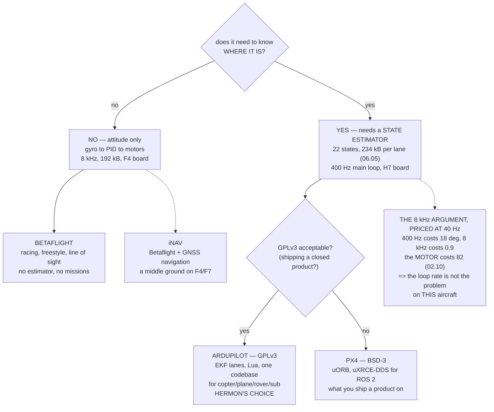

# 08.01 The autopilot world: ArduPilot, PX4, Betaflight, iNav

<!-- glance:start -->
<!-- generated by tools/build.py from curriculum/syllabus.yaml — edit the syllabus, not this block -->

| | |
|---|---|
| **Track** | Main path |
| **Difficulty** | Intermediate |
| **Time** | 1 h |
| **Hardware** | none |
| **Software** | none |
| **Prerequisites** | [07.07 Filtering, notches and the methodic tuning procedure](../07-control/07.07-filtering-and-methodic-tuning.md) |
| **Skip if** | You can justify ArduPilot for Hermon against PX4 and Betaflight on concrete criteria. |

<!-- glance:end -->

## What you will learn

- The four open-source flight stacks, and the one structural difference that separates them
- Why **Betaflight is not a weak autopilot — it is not an autopilot**, and why that is a design
  decision rather than a shortcoming
- What an 8 kHz loop is actually worth on Hermon: **17° of phase against the motor's 82°**
- Why the **right loop rate is a property of the aircraft**, not of the firmware
- The memory argument: three EKF lanes are **366 % of an F405's entire SRAM**
- GPLv3 against BSD-3, and why the licence decides a product before the feature list does
- Hermon's choice, the honest counter-argument, and the five conditions that would reverse it

## Why it matters

You have spent seven modules deriving requirements without naming the software that has to meet
them. Module 06 built a 22-state estimator with switchable lanes and innovation logging. Module
07 built four nested loops, a mixer with a priority order, and a notch tracked from ESC rpm. All
of it was described in ArduPilot's vocabulary, and none of it was justified.

This lesson does the justification backwards, which is the only honest way: it starts from the
requirements the earlier modules produced, and asks which stacks meet them. That turns a
religious argument into a table with twelve rows, and it makes the two genuinely interesting
answers visible — that Betaflight's omissions are a coherent design, and that the ArduPilot/PX4
choice is settled by licensing more often than by capability.

It also matters because the comparison is usually made in the wrong currency. "8 kHz versus
400 Hz" sounds decisive until you price it at the frequency Hermon's loop actually works at, and
find that the whole argument is worth 17 degrees while the motor you already chose is spending
82. That calculation is available to you now because 07.07 measured the crossover, and it would
not have been available before.

## Prerequisites

<!-- prereqs:start -->
## Prerequisites

You need these first:

- [07.07 Filtering, notches and the methodic tuning procedure](../07-control/07.07-filtering-and-methodic-tuning.md)

### Optional prerequisite links

None.

Check your readiness: `python course.py why 08.01`
<!-- prereqs:end -->

## Concept

There are four open-source flight stacks that a hobbyist or a small team would realistically
choose between, and they are not four points on one line.

**Betaflight** controls the aircraft's *attitude* and nothing else. It reads the gyro, runs a PID
loop, and drives the motors, at 8 kHz, with the lowest possible latency and no state estimator at
all. It does not know where it is, how fast it is going, or which way is north, because none of
those are needed to fly a racing quadcopter by sight through a video link.

**iNav** is Betaflight with navigation bolted on: a fork that added GNSS, a barometer, a
compass, position hold and return-to-home, while keeping Betaflight's structure and its F4-class
hardware target.

**ArduPilot** and **PX4** are full autopilots. Both run a real state estimator, both support
missions, geofences, failsafe ladders and companion computers, both run on H7-class hardware, and
both have a simulator that runs the actual flight code.

The structural difference is the **state estimator**. Everything else follows from whether one
exists. A stack with an estimator knows where it is, which means it can hold a position, fly a
mission, come home, and tell you afterwards how confident it was. A stack without one has nothing
to hold a position *with* — and in exchange it fits on a cheap microcontroller and runs its loop
twenty times faster.

## Technical explanation

### Level 1 — the requirements, from the lessons that produced them

Twelve rows, each one a requirement some earlier lesson created. Not a marketing feature list —
if a row is here, you can name the lesson that made it necessary.

ArduPilot meets ten of twelve, PX4 eight and a half, iNav six, Betaflight four. The two rows
Betaflight wins are the two it wins *because* of what it omits: the 8 kHz loop and the 192 kB
board.

### Level 2 — the 8 kHz argument, priced

A discrete control loop adds roughly half a sample of delay — the zero-order hold between one
update and the next. Convert that to phase at the frequency the loop actually works at:

| loop rate | half a sample | phase at 40 Hz |
|---|---|---|
| 400 Hz | 1.250 ms | −18.0° |
| 1 kHz | 0.500 ms | −7.2° |
| 8 kHz | 0.062 ms | −0.9° |
| **motor + ESC (02.10)** | **30 ms** | **−82.4°** |

Hermon's rate loop crosses over at 40 Hz (07.07). Going from 400 Hz to 8 kHz buys back **17.1
degrees** of phase there. The motor and ESC are spending **82**. You would be optimising a term
4.8 times smaller than the one you are ignoring.

And the reverse, which is the actual insight: on a 5-inch racer the propeller has a tenth of the
inertia and the motor lag is a third as long, so the crossover sits near 100 Hz — where a 400 Hz
loop would be spending 45°. **The right loop rate is a property of the aircraft.** Betaflight is
not fast because its authors like speed; it is fast because the aircraft it serves needs it, and
Hermon does not.

### Level 3 — the memory argument, which is why the split exists at all

06.05 measured EKF3's state buffer at **234 kB per lane**, and lanes are what buy the fault
isolation that makes a triple-IMU board worth having.

| lanes | buffers | F405 | F745 | H743 |
|---|---|---|---|---|
| 1 | 234 kB | 122 % | 73 % | 23 % |
| 2 | 468 kB | 244 % | 146 % | 46 % |
| 3 | 702 kB | **366 %** | 219 % | 69 % |

Percentages of the chip's **entire** SRAM, before the scheduler, the logger, the drivers or the
stack have taken any of it. A single lane already does not fit on an F405.

So Betaflight does not omit the state estimator because its authors did not think of one. **It
does not fit.** And once you decide it must fit, you have chosen an H7 board, and with it the
price, the size and the current draw. The firmware choice and the hardware choice are the same
choice, which is why 08.02 and 08.03 follow immediately.

### Level 4 — licensing, which is the difference that does not reverse

ArduPilot, iNav and Betaflight are **GPLv3**. PX4 is **BSD-3-Clause**.

GPLv3 means that if you distribute a product running modified ArduPilot, you must publish your
modifications. BSD-3 means you may modify and ship closed, keeping the copyright notice. For a
course, a hobby build or internal use, GPLv3 costs you nothing at all. For a product it is the
first question, and it is asked before anyone looks at a feature table.

This is the one difference on this page that is neither technical nor cheap to change later. By
the time you discover it matters, you have a year of parameter tuning, mission code and
operational procedure built on one side of it.

## Diagram



## Code

Score the four stacks against Hermon's twelve derived requirements, price the 8 kHz argument in
degrees of phase at the real crossover, and size EKF3's buffers against three real
microcontrollers.

```python
"""08.01 - choosing an autopilot, from Hermon's own requirements."""
import math

F_CROSS = 40.0            # Hz, the rate-loop crossover from 07.07
MOTOR_TAU = 0.030         # s (02.10)
EKF_LANE_KB = 234         # kB per EKF3 lane (06.05)

# requirement, the lesson that created it, and whether each stack has it
# order: ArduPilot, PX4, iNav, Betaflight
REQS = [
    ("22-state EKF, GNSS + baro + mag fused", "06.01", (2, 2, 0, 0)),
    ("several EKF lanes, scored and switched", "06.05", (2, 1, 0, 0)),
    ("innovation logging you can read (XKF4)", "06.06", (2, 2, 0, 0)),
    ("harmonic notch tracked from ESC rpm", "07.07", (2, 2, 2, 2)),
    ("cascaded position + velocity loops", "07.05", (2, 2, 1, 0)),
    ("LOITER / AUTO / RTL / geofence", "07.05, 12.03", (2, 2, 1, 0)),
    ("mission scripting ON the vehicle (Lua)", "12.06", (2, 0, 0, 0)),
    ("high-rate log with pre-filter FFT data", "07.07, 08.07", (2, 2, 1, 1)),
    ("MAVLink 2 telemetry", "08.05", (2, 2, 2, 1)),
    ("SITL that runs the real flight code", "10.04", (2, 2, 1, 0)),
    ("8 kHz gyro loop", "07.03", (0, 0, 2, 2)),
    ("fits an F4 with 192 kB of RAM", "08.02", (0, 0, 2, 2)),
]
MARK = {2: "yes", 1: "part", 0: "-"}
STACKS = ["ArduPilot", "PX4", "iNav", "Betaflight"]

LICENCES = [
    ("ArduPilot", "GPLv3", "any modification you SHIP must be published",
     "fine for a course, a hobby or internal use; a decision for a product"),
    ("PX4", "BSD-3-Clause", "modify and ship closed, keep the notice",
     "why most commercial airframe makers start here"),
    ("iNav", "GPLv3", "same as ArduPilot", "a Betaflight fork, same licence"),
    ("Betaflight", "GPLv3", "same as ArduPilot", "rarely a commercial question"),
]


def loop_phase(rate_hz, f=F_CROSS):
    """Phase lost to one discrete loop: a zero-order hold is half a sample."""
    return -360.0 * f * (0.5 / rate_hz)


def lag_phase(tau=MOTOR_TAU, f=F_CROSS):
    return -math.degrees(math.atan(2 * math.pi * f * tau))


def bar(t):
    print("\n" + "=" * 70)
    print(t)
    print("=" * 70)


if __name__ == "__main__":
    bar("1. WHAT HERMON ACTUALLY NEEDS, AND WHERE THAT CAME FROM")
    print("  Not a feature list. Every row is a requirement some earlier")
    print("  lesson produced, with the lesson that produced it.")
    print(f"  {'requirement':42s} {'from':12s}"
          + "".join(f"{s[:4]:>5s}" for s in STACKS))
    for name, src, have in REQS:
        print(f"  {name:42s} {src:12s}"
              + "".join(f"{MARK[h]:>5s}" for h in have))
    print(f"  {'':42s} {'TOTAL':12s}"
          + "".join(f"{sum(r[2][i] for r in REQS) / 2:5.1f}"
                    for i in range(4)))
    print("  BETAFLIGHT IS NOT A WEAK AUTOPILOT. It is not an autopilot.")
    print("  It has no state estimator, so it has nothing to hold a")
    print("  position WITH, and the last two rows are the price it")
    print("  charges for that: an 8 kHz loop and a board that costs a")
    print("  fifth as much.")

    bar("2. THE 8 kHz ARGUMENT, PRICED")
    print("  Betaflight runs its rate loop at 8 kHz. ArduPilot runs its")
    print(f"  main loop at 400 Hz. Hermon's rate loop crosses over at"
          f" {F_CROSS:.0f} Hz")
    print("  (07.07), so the question is what each rate costs THERE.")
    print(f"  {'loop rate':>10s} {'half a sample':>15s}"
          f" {'phase at ' + str(int(F_CROSS)) + ' Hz':>17s}")
    for r in (100, 200, 400, 1000, 2000, 8000):
        print(f"  {r:7d} Hz {0.5 / r * 1000:12.3f} ms"
              f" {loop_phase(r):14.1f} deg")
    print(f"  {'motor + ESC':>10s} {MOTOR_TAU * 1000:12.1f} ms"
          f" {lag_phase():14.1f} deg   <- 02.10")
    d = loop_phase(400) - loop_phase(8000)
    print(f"  GOING FROM 400 Hz TO 8 kHz SAVES {abs(d):.1f} DEGREES."
          f" The motor")
    print(f"  and ESC are spending {abs(lag_phase()):.0f}. You would be"
          f" buying a"
          f" {abs(lag_phase()) / abs(d):.1f}x")
    print("  smaller term and leaving the big one alone.")
    print("  AND THE REASON IT IS NOT NOTHING EITHER: on a 5-inch racer")
    print("  the propeller is a tenth of the inertia and the motor lag is")
    print("  a third of Hermon's, so the crossover is up near 100 Hz and")
    print(f"  the 400 Hz loop would be spending {abs(loop_phase(400, 100)):.0f}"
          f" degrees there. THE RIGHT")
    print("  LOOP RATE IS A PROPERTY OF THE AIRCRAFT, not of the firmware.")

    bar("3. THE MEMORY ARGUMENT, WHICH IS WHY THE SPLIT EXISTS AT ALL")
    boards = [("STM32F405", 192, 1024, "Betaflight, iNav"),
              ("STM32F745", 320, 1024, "iNav, small ArduPilot builds"),
              ("STM32H743", 1024, 2048, "ArduPilot, PX4")]
    print(f"  {'MCU':12s} {'SRAM':>7s} {'flash':>8s}  typical firmware")
    for n, ram, flash, who in boards:
        print(f"  {n:12s} {ram:5d} kB {flash:6d} kB  {who}")
    print(f"\n  06.05 measured EKF3's state buffer at {EKF_LANE_KB} kB PER"
          f" LANE, and lanes")
    print("  are what buys you the fault isolation. As a share of each")
    print("  chip's ENTIRE memory, before the scheduler, the logger and")
    print("  the drivers have taken any of it:")
    print(f"  {'lanes':>6s} {'buffers':>9s}"
          + "".join(f"{n[5:]:>10s}" for n, _, _, _ in boards))
    for lanes in (1, 2, 3):
        kb = lanes * EKF_LANE_KB
        print(f"  {lanes:6d} {kb:6d} kB"
              + "".join(f"{kb / ram * 100:9.0f}%" for _, ram, _, _ in boards))
    print("  THREE LANES IS 702 kB, WHICH IS 366 % OF AN F405. Betaflight")
    print("  does not omit the state estimator because its authors did")
    print("  not think of one. IT DOES NOT FIT -- and the moment you")
    print("  decide it must, you have chosen an H7 board, and you have")
    print("  chosen its price and its current draw with it.")
    print("  (PX4's EKF2 is smaller per instance. The order of magnitude")
    print("   is the point here, not the exact figure.)")

    bar("4. LICENSING, WHICH IS THE OTHER REAL DIFFERENCE")
    print(f"  {'stack':12s} {'licence':16s} {'what it obliges'}")
    for n, lic, obliges, note in LICENCES:
        print(f"  {n:12s} {lic:16s} {obliges}")
        print(f"  {'':12s} {'':16s} ({note})")
    print("  THIS IS THE ONE DIFFERENCE THAT IS NOT TECHNICAL AND NOT")
    print("  REVERSIBLE. ArduPilot and PX4 are close enough on capability")
    print("  that for a course the choice barely matters; for a product")
    print("  the licence decides it before the feature list does.")

    bar("5. THE DECISION FOR HERMON")
    why = [
        ("it is a course",
         "every parameter in modules 06 and 07 is an ArduPilot",
         "parameter, and its per-parameter documentation is the best"),
        ("it holds a position",
         "which rules out Betaflight outright, by the first three",
         "rows of section 1: there is no estimator to hold it with"),
        ("we want EKF lanes",
         "06.05's scored, switchable lanes are ArduPilot's; PX4 runs",
         "several instances but selects between them differently"),
        ("we want Lua on the vehicle",
         "12.06 writes missions that run with no companion computer",
         ""),
        ("we are not shipping a product",
         "so GPLv3 costs us nothing. If that changes, the answer",
         "changes to PX4, and it changes on the licence alone"),
    ]
    for a, b, c in why:
        print(f"  * {a}")
        print(f"    {b}")
        if c:
            print(f"    {c}")
    print("  AND THE HONEST COUNTER-ARGUMENT: PX4 would also work. It")
    print("  would give you uORB, a cleaner ROS 2 bridge for module 19,")
    print("  and a licence you could build a business on. What it would")
    print("  cost you is the parameter documentation -- which, for")
    print("  somebody learning, is most of the value.")
    print("\n  WHAT WOULD CHANGE THE ANSWER:")
    flips = [
        ("a 5-inch racer", "Betaflight; modules 06 and 12 stop applying"),
        ("shipping a closed product", "PX4, for the BSD licence"),
        ("ROS 2 as the primary interface", "PX4, for uXRCE-DDS"),
        ("GNSS rescue on a cheap F4", "iNav, the middle ground"),
        ("a plane, a rover AND a quad", "ArduPilot, one codebase for all"),
    ]
    print(f"  {'if':34s} {'then'}")
    for a, b in flips:
        print(f"  {a:34s} {b}")
```

Output:

```text

======================================================================
1. WHAT HERMON ACTUALLY NEEDS, AND WHERE THAT CAME FROM
======================================================================
  Not a feature list. Every row is a requirement some earlier
  lesson produced, with the lesson that produced it.
  requirement                                from         Ardu  PX4 iNav Beta
  22-state EKF, GNSS + baro + mag fused      06.01         yes  yes    -    -
  several EKF lanes, scored and switched     06.05         yes part    -    -
  innovation logging you can read (XKF4)     06.06         yes  yes    -    -
  harmonic notch tracked from ESC rpm        07.07         yes  yes  yes  yes
  cascaded position + velocity loops         07.05         yes  yes part    -
  LOITER / AUTO / RTL / geofence             07.05, 12.03  yes  yes part    -
  mission scripting ON the vehicle (Lua)     12.06         yes    -    -    -
  high-rate log with pre-filter FFT data     07.07, 08.07  yes  yes part part
  MAVLink 2 telemetry                        08.05         yes  yes  yes part
  SITL that runs the real flight code        10.04         yes  yes part    -
  8 kHz gyro loop                            07.03           -    -  yes  yes
  fits an F4 with 192 kB of RAM              08.02           -    -  yes  yes
                                             TOTAL        10.0  8.5  6.0  4.0
  BETAFLIGHT IS NOT A WEAK AUTOPILOT. It is not an autopilot.
  It has no state estimator, so it has nothing to hold a
  position WITH, and the last two rows are the price it
  charges for that: an 8 kHz loop and a board that costs a
  fifth as much.

======================================================================
2. THE 8 kHz ARGUMENT, PRICED
======================================================================
  Betaflight runs its rate loop at 8 kHz. ArduPilot runs its
  main loop at 400 Hz. Hermon's rate loop crosses over at 40 Hz
  (07.07), so the question is what each rate costs THERE.
   loop rate   half a sample    phase at 40 Hz
      100 Hz        5.000 ms          -72.0 deg
      200 Hz        2.500 ms          -36.0 deg
      400 Hz        1.250 ms          -18.0 deg
     1000 Hz        0.500 ms           -7.2 deg
     2000 Hz        0.250 ms           -3.6 deg
     8000 Hz        0.062 ms           -0.9 deg
  motor + ESC         30.0 ms          -82.4 deg   <- 02.10
  GOING FROM 400 Hz TO 8 kHz SAVES 17.1 DEGREES. The motor
  and ESC are spending 82. You would be buying a 4.8x
  smaller term and leaving the big one alone.
  AND THE REASON IT IS NOT NOTHING EITHER: on a 5-inch racer
  the propeller is a tenth of the inertia and the motor lag is
  a third of Hermon's, so the crossover is up near 100 Hz and
  the 400 Hz loop would be spending 45 degrees there. THE RIGHT
  LOOP RATE IS A PROPERTY OF THE AIRCRAFT, not of the firmware.

======================================================================
3. THE MEMORY ARGUMENT, WHICH IS WHY THE SPLIT EXISTS AT ALL
======================================================================
  MCU             SRAM    flash  typical firmware
  STM32F405      192 kB   1024 kB  Betaflight, iNav
  STM32F745      320 kB   1024 kB  iNav, small ArduPilot builds
  STM32H743     1024 kB   2048 kB  ArduPilot, PX4

  06.05 measured EKF3's state buffer at 234 kB PER LANE, and lanes
  are what buys you the fault isolation. As a share of each
  chip's ENTIRE memory, before the scheduler, the logger and
  the drivers have taken any of it:
   lanes   buffers      F405      F745      H743
       1    234 kB      122%       73%       23%
       2    468 kB      244%      146%       46%
       3    702 kB      366%      219%       69%
  THREE LANES IS 702 kB, WHICH IS 366 % OF AN F405. Betaflight
  does not omit the state estimator because its authors did
  not think of one. IT DOES NOT FIT -- and the moment you
  decide it must, you have chosen an H7 board, and you have
  chosen its price and its current draw with it.
  (PX4's EKF2 is smaller per instance. The order of magnitude
   is the point here, not the exact figure.)

======================================================================
4. LICENSING, WHICH IS THE OTHER REAL DIFFERENCE
======================================================================
  stack        licence          what it obliges
  ArduPilot    GPLv3            any modification you SHIP must be published
                                (fine for a course, a hobby or internal use; a decision for a product)
  PX4          BSD-3-Clause     modify and ship closed, keep the notice
                                (why most commercial airframe makers start here)
  iNav         GPLv3            same as ArduPilot
                                (a Betaflight fork, same licence)
  Betaflight   GPLv3            same as ArduPilot
                                (rarely a commercial question)
  THIS IS THE ONE DIFFERENCE THAT IS NOT TECHNICAL AND NOT
  REVERSIBLE. ArduPilot and PX4 are close enough on capability
  that for a course the choice barely matters; for a product
  the licence decides it before the feature list does.

======================================================================
5. THE DECISION FOR HERMON
======================================================================
  * it is a course
    every parameter in modules 06 and 07 is an ArduPilot
    parameter, and its per-parameter documentation is the best
  * it holds a position
    which rules out Betaflight outright, by the first three
    rows of section 1: there is no estimator to hold it with
  * we want EKF lanes
    06.05's scored, switchable lanes are ArduPilot's; PX4 runs
    several instances but selects between them differently
  * we want Lua on the vehicle
    12.06 writes missions that run with no companion computer
  * we are not shipping a product
    so GPLv3 costs us nothing. If that changes, the answer
    changes to PX4, and it changes on the licence alone
  AND THE HONEST COUNTER-ARGUMENT: PX4 would also work. It
  would give you uORB, a cleaner ROS 2 bridge for module 19,
  and a licence you could build a business on. What it would
  cost you is the parameter documentation -- which, for
  somebody learning, is most of the value.

  WHAT WOULD CHANGE THE ANSWER:
  if                                 then
  a 5-inch racer                     Betaflight; modules 06 and 12 stop applying
  shipping a closed product          PX4, for the BSD licence
  ROS 2 as the primary interface     PX4, for uXRCE-DDS
  GNSS rescue on a cheap F4          iNav, the middle ground
  a plane, a rover AND a quad        ArduPilot, one codebase for all
```

## Exercise

### Exercise 08.01-E1 — Score a different aircraft `[analysis]`

Take the requirement table and re-score it for a 5-inch freestyle quadcopter flown line-of-sight
through FPV goggles: no missions, no position hold, no companion computer, a 3-minute flight, and
a crossover near 100 Hz. Delete the rows that no longer apply and add any that do. Which stack
wins, and by how much? Then do the same for a 7 kg agricultural sprayer that flies pre-planned
grids. You should find that the table, not your preference, does the work.

### Exercise 08.01-E2 — Find the loop rate that matters `[analysis]`

For a given crossover frequency, find the loop rate at which the loop's own phase contribution
falls to 10 % of the motor lag's. Compute it for crossovers of 10, 20, 40, 80 and 160 Hz with
Hermon's 30 ms motor lag, and again with a 10 ms lag. Tabulate. State in one sentence the rule
that comes out of it.

### Exercise 08.01-E3 — Size your own estimator `[analysis]`

06.05's 234 kB is a buffer of 100 states. Compute the buffer size for 1, 2 and 3 lanes at buffer
depths of 25, 50, 100 and 200 states, and mark which combinations fit in 70 % of an F405's,
F745's and H743's SRAM. Then answer the design question: if you had to run three lanes on an
F745, what would you give up, and what would 06.05 say that costs you?

### Exercise 08.01-E4 — Read two release notes `[research]`

Open the most recent stable release notes for ArduPilot Copter and for PX4. For each, list three
changes that would matter to Hermon and one that would not. Then find one feature in each that
the other does not have. Write the comparison as four sentences, not a table — the exercise is to
distinguish a capability difference from a vocabulary difference.

## Expected result

**08.01-E1**: the racer inverts the table almost completely — Betaflight wins on eight or nine of
the surviving rows, and the two rows it lost on Hermon are the two that now matter most. The
sprayer strengthens ArduPilot: it adds sprayer control, terrain following and Lua mission logic,
all of which are ArduPilot-only.

**08.01-E2**: the rule is that the loop rate stops mattering once its half-sample delay is about
a tenth of the actuator's time constant — around 170 Hz for Hermon's 30 ms motor, and around
500 Hz for a 10 ms one. Both are well below 8 kHz, and both are independent of the crossover
frequency, which is the surprising part.

**08.01-E3**: at a depth of 25 states, one lane is about 59 kB and three lanes about 176 kB,
which fits an F745 and very nearly an F405. What you give up is the delay horizon — 06.05 showed
that `EK3_GPS_DELAY` wrong by 100 ms costs 1.68 m at 16.8 m/s, and a short buffer means you cannot
compensate a long delay at all.

**08.01-E4**: expect ArduPilot's notes to be dense with parameters and PX4's with architecture.
That difference is itself the finding, and it is most of the reason this course uses ArduPilot.

## Troubleshooting

**"Everyone says ArduPilot is for planes and PX4 is for research."** Both statements were true
around 2015 and neither is now. Score the table rather than repeating the folklore — and note
that ArduPilot's single codebase across copter, plane, rover and sub is a real advantage if you
will ever fly more than one.

**"Betaflight flies so much better."** On a 5-inch racer it does, and section 2 says why: that
aircraft's crossover is near 100 Hz, where a 400 Hz loop really is spending 45°. On Hermon the
same argument is worth 17° against the motor's 82. Both facts are true; they are about different
aircraft.

**You are reading a comparison and cannot tell whether a feature is real.** Ask which *parameter*
implements it. A capability with no parameter name, no log message and no documentation page is a
roadmap item.

**You want to change stacks later.** The airframe, the motors, the ESCs and the radio all carry
over; the parameters, the missions, the log analysis and every procedure in modules 06 through 14
do not. Budget weeks, not an afternoon.

## Common mistakes

- **Comparing loop rates without naming a frequency.** "8 kHz versus 400 Hz" is not a comparison
  until you say at what frequency, and 07.07 already told you Hermon's: 40 Hz.
- **Treating Betaflight's omissions as immaturity.** They are a design. It fits a 192 kB chip
  precisely because it declines to carry a state estimator.
- **Choosing on community size.** Both ArduPilot and PX4 are large enough that you will find an
  answer. The parameter documentation is the difference that will actually affect your week.
- **Deferring the licence question.** It is the one decision on this page that is expensive to
  reverse, and it is free to make now.
- **Assuming a stack choice is a firmware choice.** Section 3: it selects your board class, your
  price and your current draw at the same time.
- **Picking the stack before the mission.** E1 shows the table reversing completely for a
  different aircraft. The aircraft decides, not the reader.

## Knowledge check

<details>
<summary>What is the one structural difference that separates Betaflight from ArduPilot, and what
follows from it?</summary>

The **state estimator**. Betaflight has none, so it cannot know where it is, which means no
position hold, no missions, no return-to-home and no innovation logging. In exchange it fits on a
192 kB F4 and runs at 8 kHz. Every other difference between the two stacks follows from this one.
</details>

<details>
<summary>Hermon's rate loop crosses over at 40 Hz. What is an 8 kHz loop worth there, and against
what?</summary>

A 400 Hz loop spends 18.0° of phase at 40 Hz; an 8 kHz loop spends 0.9°. So the upgrade is worth
**17.1°** — against the motor and ESC's 30 ms lag, which is spending **82.4°** at the same
frequency. You would be buying back a term 4.8 times smaller than the one you left alone.
</details>

<details>
<summary>Why can Betaflight not simply add an EKF?</summary>

Because it does not fit. 06.05 measured EKF3's state buffer at 234 kB per lane, and an STM32F405
has 192 kB of SRAM in total — one lane is already 122 % of the entire chip, before the scheduler,
the drivers and the logger. Adding the estimator means moving to an H7, which means a different
board class, a different price and a different current draw.
</details>

<details>
<summary>Both ArduPilot and PX4 would fly Hermon. Name the difference that would settle it for a
commercial product, and which way.</summary>

The **licence**. ArduPilot is GPLv3, so modifications you ship must be published; PX4 is
BSD-3-Clause, so you may ship modified and closed. For a product that decides it in PX4's favour
before anyone opens a feature table, and it is the one difference on the page that is expensive
to reverse later.
</details>

<details>
<summary>A friend says their 5-inch racer flies far crisper on Betaflight than your build does on
ArduPilot, and concludes ArduPilot's control is worse. What is wrong with the inference?</summary>

The aircraft is different, not the control. A 5-inch racer has roughly a tenth of Hermon's
inertia and a third of its motor lag, which puts its crossover near 100 Hz — and at 100 Hz a
400 Hz loop really would be spending about 45° of phase. The loop rate matters there and barely
matters on Hermon. The right loop rate is a property of the aircraft.
</details>

<details>
<summary>Why does this lesson come after module 07 rather than before module 06?</summary>

Because every argument in it is made in numbers the earlier modules produced: the 40 Hz crossover
is 07.07's, the 30 ms motor lag is 02.10's, the 234 kB EKF lane is 06.05's, and all twelve
requirement rows name the lesson that created them. Put this lesson first and it becomes a
feature list you have to take on trust.
</details>

<details>
<summary>What would iNav be the right answer for?</summary>

An aircraft that needs GNSS position hold and return-to-home but not missions, geofences,
companion computers or log-based tuning — and that has to run on cheap F4 or F7 hardware. It is a
genuine middle ground, and it is the right answer more often than either extreme admits.
</details>

## Practical challenge

**Write the decision memo you would hand to someone else.**

One page. State the aircraft and its mission in two sentences. Then give the requirement table
with your own rows — add anything Hermon does not need that yours does, delete anything it does
not. Score the four stacks. Price the loop-rate argument at *your* crossover, not Hermon's. State
the licence position explicitly, even if the answer is "irrelevant, internal use only". Finish
with the decision, the strongest counter-argument to it, and the three conditions that would
reverse it.

Then put it away for a week and read it again. The test of the memo is whether a reader who
disagrees with your conclusion can still follow how you reached it — and whether the numbers in it
came from measurements you made or from somebody's landing page.

## You can skip this if

You can justify ArduPilot for Hermon against PX4 and Betaflight on concrete criteria.

## Go deeper

- [02.10](../02-motors-escs-props/02.10-esc-tuning.md) (earlier): the 30 ms motor lag that
  dominates the phase budget.
- [06.05](../06-state-estimation/06.05-ekf3-in-ardupilot.md) (earlier): the lanes and the 234 kB
  buffer.
- [07.07](../07-control/07.07-filtering-and-methodic-tuning.md) (earlier): the 40 Hz crossover that prices the
  whole loop-rate argument.
- [08.02](08.02-board-anatomy.md) (next): the H7 board the memory argument just committed you to,
  from the inside.
- [08.03](08.03-choosing-hermons-fc.md) (next): the purchase, with the port budget.
- [10.04](../10-simulation/10.04-ardupilot-sitl.md) (later): the simulator that runs the real
  flight code, and why only two of the four have one.
- [15.02](../15-onboard-autonomy/15.02-ros2-for-hermon.md) (later): the ROS 2 interface, and the
  one place PX4's architecture shows through.
- ArduPilot's documentation front page, which is the reason this course uses it:
  https://ardupilot.org/copter/
- PX4's architecture overview, worth reading even if you never fly it:
  https://docs.px4.io/main/en/concept/architecture.html

> **Ask your teacher:** *"We chose ArduPilot over PX4 mostly on the per-parameter documentation
> and on 06.05's scored EKF lanes, and we noted that the licence would flip the answer if we ever
> shipped a product. In your experience, how often does a team actually migrate stacks once they
> have a year of tuning and procedure built up, and what does it really cost them when they do?"*

## Progress checkpoint

Run `python course.py complete 08.01` once your decision memo is written. Next:
[08.02](08.02-board-anatomy.md) — what is actually inside the H7-class board this lesson just
committed you to buying, peripheral by peripheral.
