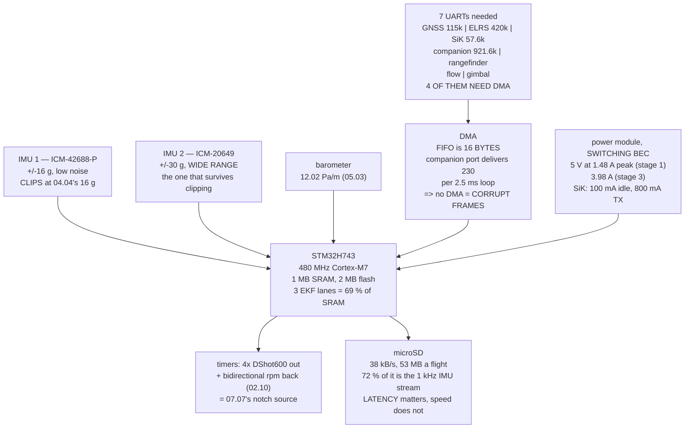

# 08.02 Inside a flight controller: MCU, IMUs, baro, UARTs, power

<!-- glance:start -->
<!-- generated by tools/build.py from curriculum/syllabus.yaml — edit the syllabus, not this block -->

| | |
|---|---|
| **Track** | Main path |
| **Difficulty** | Intermediate |
| **Time** | 1 h 15 min |
| **Hardware** | First flight (Hermon core) (stage 1) |
| **Software** | none |
| **Prerequisites** | [08.01 The autopilot world: ArduPilot, PX4, Betaflight, iNav](08.01-autopilot-landscape.md) |
| **Skip if** | You can read an H7-class FC's spec sheet and map every peripheral you need to a physical port. |

<!-- glance:end -->

## What you will learn

- Hermon's **port budget**, built from peripherals earlier lessons already bought: **seven UARTs,
  four of which need DMA**
- Why **DMA is not an optimisation** — the hardware FIFO is 16 bytes and the companion port
  delivers 230 per loop
- Why the symptom of a missing DMA is a **corrupted frame**, not a slow one
- That **IMU redundancy is not IMU diversity**: three identical IMUs clip at the same instant
- Why a **wide-range second IMU is not a spare** but the only honest instrument in the one
  failure mode that defeats voting
- The 5 V rail: **1.48 A peak at stage 1, 3.98 A at stage 3**, and why the SiK radio sizes it
- Why the SD card's **latency** matters and its bandwidth never does

## Why it matters

08.01 chose ArduPilot, and in doing so chose an H7-class board — because 06.05's EKF lanes need
234 kB each and an F405 has 192 kB in total. That was a firmware argument that turned out to be a
hardware argument. This lesson is the hardware.

The reason to do it carefully is that a flight controller is bought once and lived with for
years. Every peripheral in this course lands on it: the GNSS from 05.04, the ELRS receiver from
09.02, the telemetry radio from 09.04, the rangefinder and flow sensor from 05.05, the ESC
telemetry that 07.07's notch depends on, and eventually a companion computer. Seven serial
devices, four motor outputs, two I²C buses and a 5 V rail that has to survive an 800 mA
transmit burst.

None of those is surprising on its own. The surprise is the total, and that the total is already
close to what an H743 board offers before you have added anything the course does not cover.
08.03 makes the purchase; this lesson builds the requirement it has to satisfy.

There is also one genuinely important idea here that is not about counting ports. 05.06
established that accelerometer clipping is a *bias*, not noise, and 06.05 established that EKF
lanes are scored against each other. Put those together and a fleet of identical IMUs is
worthless in exactly the case that matters: they all clip together, identically, and the scoring
has nothing to choose between. **Diversity, not redundancy.**

## Prerequisites

<!-- prereqs:start -->
## Prerequisites

You need these first:

- [08.01 The autopilot world: ArduPilot, PX4, Betaflight, iNav](08.01-autopilot-landscape.md)

### Optional prerequisite links

None.

Check your readiness: `python course.py why 08.02`
<!-- prereqs:end -->

## Concept

A modern flight controller is one microcontroller and a handful of sensors, and almost everything
interesting about it is *plumbing*: which peripheral is wired to which pin, which pins can reach a
DMA stream, and how much current the little regulator can supply before the whole thing resets.

The microcontroller is an STM32H743 or similar: a 480 MHz Cortex-M7 with 1 MB of SRAM and 2 MB of
flash. That is a hundred times the computer that flew the Apollo guidance system and roughly a
thousandth of a modern phone, which is the right scale for what it does — a fixed set of tasks,
every one of them on a deadline.

Around it: two or three inertial measurement units on SPI, a barometer, sometimes a magnetometer,
an SD card, and a set of serial ports brought out to connectors. Plus a power module that turns
22.2 V of battery into 5 V for all of it, and measures the current on the way past.

The parts of this that bite are not the specifications on the box. They are:

- **Ports.** Seven UARTs is a lot to ask of a board that has eight, once two of them are wired to
  the same connector and one is the USB console.
- **DMA.** Not every port on an H7 can reach a DMA stream, and the ones that cannot will drop
  bytes.
- **Sensor diversity.** Three of the same IMU protects against one being dead and nothing else.
- **The 5 V rail.** It is smaller than the sum of the things plugged into it.
- **The SD card.** Its latency, not its speed.

## Technical explanation

### Level 1 — the port budget

Count what the course has already committed to, with the lesson that committed it:

| peripheral | bus | rate | needs DMA | from |
|---|---|---|---|---|
| GNSS M10 + external compass | UART | 115,200 | yes | 05.04 |
| ELRS receiver (CRSF) | UART | 420,000 | **yes** | 09.02 |
| SiK telemetry, 917–920 MHz | UART | 57,600 | yes | 09.04 |
| companion computer | UART | 921,600 | **yes** | 15.01 |
| downward rangefinder | UART | 115,200 | — | 05.05 |
| optical flow | UART | 115,200 | — | 05.05 |
| gimbal / camera control | UART | 115,200 | — | 14.03 |
| ESC telemetry (bidirectional DShot) | timer | — | yes | 02.10 |
| 4 motor outputs (DShot600) | timer | 600,000 | yes | 02.04 |
| buzzer, safety switch, LEDs | GPIO / I²C | — | — | 04.05 |

**Seven UARTs, four of which really want DMA.** A typical H743 board exposes seven or eight
serial ports and can DMA about half of them. The budget is tight before you have bought anything.

The last three UART rows are stage-2 and stage-3 additions, which is a temptation to defer them.
Do not. You will not rewire a finished aircraft to add a port, and a board bought two ports short
is a board replaced.

### Level 2 — why DMA is not an optimisation

A UART has a small hardware FIFO — typically **16 bytes** on an STM32. If nothing empties it
before it fills, the next byte is lost.

Without DMA, the thing emptying it is an interrupt handler, and in the worst case the main loop.
ArduPilot's main loop runs at 400 Hz, so up to 2.5 ms can pass between services. At 8N1, ten bits
per byte:

| port | baud | bytes per 2.5 ms | FIFO | overruns? |
|---|---|---|---|---|
| SiK telemetry | 57,600 | 14 | 16 | no |
| GNSS | 115,200 | 29 | 16 | **yes** |
| ELRS (CRSF) | 420,000 | 105 | 16 | **yes** |
| companion computer | 921,600 | **230** | 16 | **yes** |

The companion port delivers fourteen FIFOs' worth between two loop iterations.

And the symptom is not "slow". A dropped byte **desynchronises the parser**, so you lose the
message it was in and usually the next one too. On the ELRS port that is a control-link failsafe
(09.03). On the GNSS port it is an EKF innovation spike that looks exactly like the glitch
signature 06.06 taught you to recognise — and you will spend an afternoon suspecting the sky.

DMA moves the bytes into a RAM buffer with no CPU involvement at all. The loop arrives late and
finds everything waiting for it.

### Level 3 — redundancy against diversity

A good board carries two or three IMUs. The naive reading is "if one dies, the others fly the
aircraft", and that is true but small. The failure a second IMU has to survive is not death.

04.04 measured Hermon's worst case at the flight-controller mount: **±16 g**, produced by a 0.5 g
propeller imbalance exciting the 106 Hz arm mode. Now put that against the parts:

| part | accel full scale | headroom | clips? |
|---|---|---|---|
| ICM-42688-P | ±16 g | 0.0 g | **yes** |
| ICM-20649 | ±30 g | 14.0 g | no |
| BMI088 | ±24 g | 8.0 g | no |

Three ICM-42688-Ps would all clip at the same instant, in the same direction, by the same amount.
05.06 established that clipping is a **bias** and not noise — 0.75 m/s² of it is 37.6 m of
position error in ten seconds — and 06.05's lane scoring works by comparing lanes against each
other. Identical sensors producing an identical bias give the scoring nothing to see.

So a wide-range second IMU is not a spare. **It is the only instrument still telling the truth in
the one failure mode that defeats voting.** The ladder:

| what you have | what it protects against |
|---|---|
| two IMUs, same part number | a dead chip, a bad solder joint |
| two IMUs, **different full scale** | + **clipping**, which is common-mode |
| two IMUs, different vendors | + a firmware or errata bug |
| IMU + baro + GNSS | + any single-sensor failure at all (06.05) |

### Level 4 — the 5 V rail and the SD card

Add up everything on 5 V and the total is **520 mA typical and 1,480 mA peak at stage 1**, rising
to 1,720 mA and **3,980 mA** once a companion computer is aboard.

The peak is what sizes the BEC, and the thing that creates it is the **SiK radio**: it idles at
100 mA and transmits at 800. Size the regulator for the average and the flight controller browns
out on the first telemetry burst — and the symptom is a reboot in flight with nothing wrong in the
log, because the thing writing the log rebooted too.

A linear regulator dropping 22.2 V to 5 V at that peak would dissipate **68.5 W**. 03.04 measured
51.6 W for a much smaller load and called it disqualifying. Every power module worth buying uses
a switching regulator, and its rating is the first number you check.

The SD card carries about **38 kB/s** with full logging — 53 MB over a 24-minute flight — of
which 72 % is the 1 kHz IMU stream that 07.07's FFT needs. Any card exceeds that bandwidth by
more than fifty times.

**The bandwidth is never the problem. The latency is.** A cheap card stalls for 100 ms or more
during an internal erase cycle, which at 400 Hz is forty missed loop iterations if the write
blocks. ArduPilot buffers around it, so a bad card shows up as **missing log messages** rather
than a crash — and the messages it drops are the high-rate ones, which are precisely the ones you
needed.

## Diagram



## Code

Build the port budget from the peripherals earlier lessons committed to, price the DMA question
in bytes per loop iteration, test each IMU's full scale against 04.04's measured vibration, size
the 5 V rail and the BEC, and size the log.

```python
"""08.02 - inside an H7 flight controller, sized against Hermon's own needs."""
import math

LOOP_HZ = 400.0
GYRO_HZ = 1000.0
FLIGHT_S = 24 * 60        # 02.11's hover endurance

# name, interface, baud or rate, DMA needed, the lesson that added it
PERIPHERALS = [
    ("GNSS M10 + external compass", "UART", 115200, True, "05.04"),
    ("ELRS receiver (CRSF)", "UART", 420000, True, "09.02"),
    ("SiK telemetry, 917-920 MHz", "UART", 57600, True, "09.04"),
    ("companion computer", "UART", 921600, True, "15.01"),
    ("downward rangefinder", "UART", 115200, False, "05.05"),
    ("optical flow", "UART", 115200, False, "05.05"),
    ("gimbal / camera control", "UART", 115200, False, "16.02"),
    ("ESC telemetry (bidirectional DShot)", "timer", 0, True, "02.10"),
    ("4 motor outputs (DShot600)", "timer", 600000, True, "02.04"),
    ("buzzer + safety switch + LEDs", "GPIO/I2C", 0, False, "04.05"),
]

# sensor, interface, full scale, what it is for
IMUS = [
    ("ICM-42688-P", "SPI", 16, 2000, "the primary: low noise, high rate"),
    ("ICM-20649", "SPI", 30, 4000, "the WIDE-RANGE backup: does not clip"),
    ("BMI088", "SPI", 24, 2000, "a different vendor entirely"),
]

# rail, consumer, typical mA, peak mA, the lesson
RAILS = [
    ("5 V", "flight controller + IMUs", 150, 200, "08.02"),
    ("5 V", "GNSS + compass", 60, 120, "05.04"),
    ("5 V", "ELRS receiver", 100, 120, "09.02"),
    ("5 V", "SiK radio", 100, 800, "09.04"),
    ("5 V", "rangefinder + flow", 80, 120, "05.05"),
    ("5 V", "buzzer + LEDs", 30, 120, "04.05"),
    ("5 V", "companion computer (stage 2)", 1200, 2500, "15.01"),
]

VIBE_PEAK_G = 16.0        # 04.04: the clipping case, +/- 16 g at the mount


def bytes_per_loop(baud, loop_hz=LOOP_HZ):
    """Bytes that arrive on a UART between two main-loop iterations."""
    return baud / 10.0 / loop_hz     # 8N1 = 10 bits per byte


def bar(t):
    print("\n" + "=" * 70)
    print(t)
    print("=" * 70)


if __name__ == "__main__":
    bar("1. THE PORT BUDGET, BUILT FROM WHAT THE COURSE ALREADY BOUGHT")
    print("  Every row was added by an earlier lesson. None of it is")
    print("  optional in the sense that you could forget to plan for it.")
    print(f"  {'peripheral':38s} {'bus':9s} {'rate':>9s} {'DMA':>5s} {'from'}")
    for n, bus, rate, dma, src in PERIPHERALS:
        r = f"{rate:,}" if rate else "-"
        print(f"  {n:38s} {bus:9s} {r:>9s} {('yes' if dma else '-'):>5s}"
              f" {src}")
    uarts = sum(1 for p in PERIPHERALS if p[1] == "UART")
    dma_u = sum(1 for p in PERIPHERALS if p[1] == "UART" and p[3])
    print(f"  UARTS NEEDED: {uarts}, of which {dma_u} REALLY WANT DMA.")
    print("  A typical H743 flight controller exposes 7 or 8 serial")
    print("  ports and can DMA about half of them. THE BUDGET IS TIGHT")
    print("  BEFORE YOU HAVE BOUGHT ANYTHING, which is why 08.03 is a")
    print("  whole lesson about a purchase.")
    print("  (The last three rows are stage-2 and stage-3 additions. Plan")
    print("   the ports for them now; you will not rewire the aircraft.)")

    bar("2. WHY DMA IS NOT AN OPTIMISATION")
    print("  A UART without DMA is serviced by an interrupt, and in the")
    print("  worst case by the main loop. ArduPilot's main loop runs at")
    print(f"  {LOOP_HZ:.0f} Hz, so {1000 / LOOP_HZ:.1f} ms can pass between"
          f" services. Meanwhile:")
    print(f"  {'peripheral':30s} {'baud':>9s} {'bytes per':>11s}"
          f" {'FIFO':>6s} {'overruns?':>10s}")
    for n, bus, rate, dma, src in PERIPHERALS:
        if bus != "UART":
            continue
        b = bytes_per_loop(rate)
        print(f"  {n:30s} {rate:9,d} {b:8.0f}   {16:6d}"
              f" {('YES' if b > 16 else 'no'):>10s}")
    print("  THE HARDWARE FIFO IS 16 BYTES. Every one of these overruns")
    print("  if the main loop is the thing emptying it. DMA moves the")
    print("  bytes into RAM with no CPU involved at all, so the loop")
    print("  finds a full buffer instead of a lost one.")
    print("  AND THE SYMPTOM IS NOT 'slow'. It is CORRUPTED FRAMES: a")
    print("  dropped byte desynchronises the parser, so you lose the")
    print("  whole message and the next one too. On the ELRS port that")
    print("  is a control-link failsafe (09.03); on the GNSS port it is")
    print("  an EKF innovation spike that looks exactly like a glitch")
    print("  (06.06).")

    bar("3. IMU REDUNDANCY IS NOT THE SAME AS IMU DIVERSITY")
    print(f"  {'part':14s} {'bus':5s} {'accel FS':>9s} {'gyro FS':>9s}  role")
    for n, bus, afs, gfs, role in IMUS:
        print(f"  {n:14s} {bus:5s} {afs:7d} g {gfs:7d} d/s  {role}")
    print(f"\n  04.04 measured Hermon's worst case at the mount:"
          f" +/-{VIBE_PEAK_G:.0f} g.")
    print("  Put that against each part's full scale:")
    print(f"  {'part':14s} {'full scale':>11s} {'headroom':>10s}"
          f" {'clips?':>8s}")
    for n, bus, afs, gfs, role in IMUS:
        head = afs - VIBE_PEAK_G
        print(f"  {n:14s} {afs:9d} g {head:8.1f} g"
              f" {('YES' if head <= 0 else 'no'):>8s}")
    print("  THREE IDENTICAL IMUs WOULD ALL CLIP AT THE SAME INSTANT.")
    print("  That is redundancy against a DEAD part and nothing else.")
    print("  05.06 established that clipping is not noise, it is a BIAS:")
    print("  0.75 m/s/s of it is 37.6 m of position error in ten seconds,")
    print("  and it arrives on every clipping sensor at once, identically,")
    print("  so 06.05's lane scoring cannot tell which one to trust.")
    print("  A WIDE-RANGE SECOND IMU IS THEREFORE NOT A SPARE. It is the")
    print("  only instrument still telling the truth in the one failure")
    print("  mode that defeats voting.")
    print("\n  And the same argument, one level up:")
    div = [
        ("two IMUs, same part number", "a dead chip, a bad solder joint"),
        ("two IMUs, different full scale", "+ CLIPPING, which is common-mode"),
        ("two IMUs, different vendors", "+ a firmware or errata bug"),
        ("IMU + baro + GNSS", "+ any single-sensor failure at all (06.05)"),
    ]
    print(f"  {'what you have':34s} {'what it protects against'}")
    for a, b in div:
        print(f"  {a:34s} {b}")

    bar("4. THE 5 V RAIL, WHICH IS SMALLER THAN YOU THINK")
    print(f"  {'consumer':32s} {'typical':>9s} {'peak':>8s} {'from'}")
    t_sum = p_sum = 0
    for rail, n, typ, pk, src in RAILS:
        print(f"  {n:32s} {typ:7d} mA {pk:6d} mA {src}")
        t_sum += typ
        p_sum += pk
    print(f"  {'TOTAL, stage 3':32s} {t_sum:7d} mA {p_sum:6d} mA")
    stage1 = sum(r[2] for r in RAILS if "companion" not in r[1])
    stage1p = sum(r[3] for r in RAILS if "companion" not in r[1])
    print(f"  {'TOTAL, stage 1 (no companion)':32s} {stage1:7d} mA"
          f" {stage1p:6d} mA")
    print(f"\n  At 5 V that is {t_sum * 5 / 1000:.2f} W typical and"
          f" {p_sum * 5 / 1000:.2f} W peak.")
    print("  A LINEAR REGULATOR DROPPING 22.2 V TO 5 V WOULD DISSIPATE")
    print(f"  {(22.2 - 5) * p_sum / 1000:.1f} W AS HEAT at that peak -- 03.04"
          f" measured 51.6 W")
    print("  for a much smaller load and called it disqualifying. The")
    print("  power module's BEC is a SWITCHING regulator for this reason,")
    print("  and its rating is the number you check before you buy.")
    print(f"  {'BEC rating':>12s} {'stage 1':>10s} {'stage 3':>10s}")
    for a in (2.0, 3.0, 5.0, 6.0):
        print(f"  {a:9.1f} A {('ok' if a * 1000 > stage1p else 'NO'):>10s}"
              f" {('ok' if a * 1000 > p_sum else 'NO'):>10s}")
    print("  NOTE THE SiK RADIO. It idles at 100 mA and transmits at 800.")
    print("  A BEC sized for the average browns out the flight controller")
    print("  on the first telemetry burst, and the symptom is a reboot in")
    print("  flight with nothing wrong in the log, because the thing that")
    print("  writes the log also rebooted.")

    bar("5. THE SD CARD, AND WHY 07.07 MAKES IT A REAL CONSTRAINT")
    streams = [
        ("attitude, rate, position at 25 Hz", 25, 60, "the normal log"),
        ("all PID loops at 100 Hz", 100, 80, "07.03 tuning"),
        ("IMU raw, 1 kHz, 2 IMUs", 1000, 28, "07.07's FFT"),
        ("EKF innovations at 10 Hz", 10, 90, "06.06"),
        ("ESC telemetry at 10 Hz", 10, 40, "02.10"),
    ]
    print(f"  {'stream':34s} {'Hz':>6s} {'B/rec':>7s} {'kB/s':>8s}  why")
    total = 0.0
    for n, hz, b, why in streams:
        kbs = hz * b / 1024
        total += kbs
        print(f"  {n:34s} {hz:6d} {b:7d} {kbs:7.1f}   {why}")
    print(f"  {'TOTAL':34s} {'':6s} {'':7s} {total:7.1f}")
    print(f"  Over a {FLIGHT_S / 60:.0f}-minute flight that is"
          f" {total * FLIGHT_S / 1024:.0f} MB, and the")
    print(f"  IMU stream alone is {27.3/37.9*100:.0f} % of it.")
    print(f"  {'card':22s} {'sustained write':>16s} {'margin':>9s}")
    for n, mbs in (("a bad microSD", 2.0), ("class 10 / U1", 10.0),
                   ("A1-rated", 20.0), ("A2-rated", 30.0)):
        print(f"  {n:22s} {mbs:13.0f} MB/s {mbs * 1024 / total:8.0f}x")
    print("  THE BANDWIDTH IS NEVER THE PROBLEM. THE LATENCY IS. A cheap")
    print("  card stalls for 100 ms or more during an internal erase, and")
    print(f"  at {LOOP_HZ:.0f} Hz that is {LOOP_HZ * 0.1:.0f} MISSED LOOP"
          f" ITERATIONS if the write")
    print("  blocks. ArduPilot buffers around it, which is why a bad card")
    print("  shows up as MISSING LOG MESSAGES rather than a crash -- and")
    print("  the messages it drops are the high-rate ones, which are")
    print("  exactly the ones 07.07 needs. Buy an A1 or A2 card and")
    print("  format it with the SD Association's own tool.")
```

Output:

```text

======================================================================
1. THE PORT BUDGET, BUILT FROM WHAT THE COURSE ALREADY BOUGHT
======================================================================
  Every row was added by an earlier lesson. None of it is
  optional in the sense that you could forget to plan for it.
  peripheral                             bus            rate   DMA from
  GNSS M10 + external compass            UART        115,200   yes 05.04
  ELRS receiver (CRSF)                   UART        420,000   yes 09.02
  SiK telemetry, 917-920 MHz             UART         57,600   yes 09.04
  companion computer                     UART        921,600   yes 15.01
  downward rangefinder                   UART        115,200     - 05.05
  optical flow                           UART        115,200     - 05.05
  gimbal / camera control                UART        115,200     - 16.02
  ESC telemetry (bidirectional DShot)    timer             -   yes 02.10
  4 motor outputs (DShot600)             timer       600,000   yes 02.04
  buzzer + safety switch + LEDs          GPIO/I2C          -     - 04.05
  UARTS NEEDED: 7, of which 4 REALLY WANT DMA.
  A typical H743 flight controller exposes 7 or 8 serial
  ports and can DMA about half of them. THE BUDGET IS TIGHT
  BEFORE YOU HAVE BOUGHT ANYTHING, which is why 08.03 is a
  whole lesson about a purchase.
  (The last three rows are stage-2 and stage-3 additions. Plan
   the ports for them now; you will not rewire the aircraft.)

======================================================================
2. WHY DMA IS NOT AN OPTIMISATION
======================================================================
  A UART without DMA is serviced by an interrupt, and in the
  worst case by the main loop. ArduPilot's main loop runs at
  400 Hz, so 2.5 ms can pass between services. Meanwhile:
  peripheral                          baud   bytes per   FIFO  overruns?
  GNSS M10 + external compass      115,200       29       16        YES
  ELRS receiver (CRSF)             420,000      105       16        YES
  SiK telemetry, 917-920 MHz        57,600       14       16         no
  companion computer               921,600      230       16        YES
  downward rangefinder             115,200       29       16        YES
  optical flow                     115,200       29       16        YES
  gimbal / camera control          115,200       29       16        YES
  THE HARDWARE FIFO IS 16 BYTES. Every one of these overruns
  if the main loop is the thing emptying it. DMA moves the
  bytes into RAM with no CPU involved at all, so the loop
  finds a full buffer instead of a lost one.
  AND THE SYMPTOM IS NOT 'slow'. It is CORRUPTED FRAMES: a
  dropped byte desynchronises the parser, so you lose the
  whole message and the next one too. On the ELRS port that
  is a control-link failsafe (09.03); on the GNSS port it is
  an EKF innovation spike that looks exactly like a glitch
  (06.06).

======================================================================
3. IMU REDUNDANCY IS NOT THE SAME AS IMU DIVERSITY
======================================================================
  part           bus    accel FS   gyro FS  role
  ICM-42688-P    SPI        16 g    2000 d/s  the primary: low noise, high rate
  ICM-20649      SPI        30 g    4000 d/s  the WIDE-RANGE backup: does not clip
  BMI088         SPI        24 g    2000 d/s  a different vendor entirely

  04.04 measured Hermon's worst case at the mount: +/-16 g.
  Put that against each part's full scale:
  part            full scale   headroom   clips?
  ICM-42688-P           16 g      0.0 g      YES
  ICM-20649             30 g     14.0 g       no
  BMI088                24 g      8.0 g       no
  THREE IDENTICAL IMUs WOULD ALL CLIP AT THE SAME INSTANT.
  That is redundancy against a DEAD part and nothing else.
  05.06 established that clipping is not noise, it is a BIAS:
  0.75 m/s/s of it is 37.6 m of position error in ten seconds,
  and it arrives on every clipping sensor at once, identically,
  so 06.05's lane scoring cannot tell which one to trust.
  A WIDE-RANGE SECOND IMU IS THEREFORE NOT A SPARE. It is the
  only instrument still telling the truth in the one failure
  mode that defeats voting.

  And the same argument, one level up:
  what you have                      what it protects against
  two IMUs, same part number         a dead chip, a bad solder joint
  two IMUs, different full scale     + CLIPPING, which is common-mode
  two IMUs, different vendors        + a firmware or errata bug
  IMU + baro + GNSS                  + any single-sensor failure at all (06.05)

======================================================================
4. THE 5 V RAIL, WHICH IS SMALLER THAN YOU THINK
======================================================================
  consumer                           typical     peak from
  flight controller + IMUs             150 mA    200 mA 08.02
  GNSS + compass                        60 mA    120 mA 05.04
  ELRS receiver                        100 mA    120 mA 09.02
  SiK radio                            100 mA    800 mA 09.04
  rangefinder + flow                    80 mA    120 mA 05.05
  buzzer + LEDs                         30 mA    120 mA 04.05
  companion computer (stage 2)        1200 mA   2500 mA 15.01
  TOTAL, stage 3                      1720 mA   3980 mA
  TOTAL, stage 1 (no companion)        520 mA   1480 mA

  At 5 V that is 8.60 W typical and 19.90 W peak.
  A LINEAR REGULATOR DROPPING 22.2 V TO 5 V WOULD DISSIPATE
  68.5 W AS HEAT at that peak -- 03.04 measured 51.6 W
  for a much smaller load and called it disqualifying. The
  power module's BEC is a SWITCHING regulator for this reason,
  and its rating is the number you check before you buy.
    BEC rating    stage 1    stage 3
        2.0 A         ok         NO
        3.0 A         ok         NO
        5.0 A         ok         ok
        6.0 A         ok         ok
  NOTE THE SiK RADIO. It idles at 100 mA and transmits at 800.
  A BEC sized for the average browns out the flight controller
  on the first telemetry burst, and the symptom is a reboot in
  flight with nothing wrong in the log, because the thing that
  writes the log also rebooted.

======================================================================
5. THE SD CARD, AND WHY 07.07 MAKES IT A REAL CONSTRAINT
======================================================================
  stream                                 Hz   B/rec     kB/s  why
  attitude, rate, position at 25 Hz      25      60     1.5   the normal log
  all PID loops at 100 Hz               100      80     7.8   07.03 tuning
  IMU raw, 1 kHz, 2 IMUs               1000      28    27.3   07.07's FFT
  EKF innovations at 10 Hz               10      90     0.9   06.06
  ESC telemetry at 10 Hz                 10      40     0.4   02.10
  TOTAL                                                37.9
  Over a 24-minute flight that is 53 MB, and the
  IMU stream alone is 72 % of it.
  card                    sustained write    margin
  a bad microSD                      2 MB/s       54x
  class 10 / U1                     10 MB/s      270x
  A1-rated                          20 MB/s      541x
  A2-rated                          30 MB/s      811x
  THE BANDWIDTH IS NEVER THE PROBLEM. THE LATENCY IS. A cheap
  card stalls for 100 ms or more during an internal erase, and
  at 400 Hz that is 40 MISSED LOOP ITERATIONS if the write
  blocks. ArduPilot buffers around it, which is why a bad card
  shows up as MISSING LOG MESSAGES rather than a crash -- and
  the messages it drops are the high-rate ones, which are
  exactly the ones 07.07 needs. Buy an A1 or A2 card and
  format it with the SD Association's own tool.
```

## Exercise

### Exercise 08.02-E1 — Budget your own ports `[analysis]`

Rewrite the peripheral table for the aircraft you actually intend to build. Delete anything you
will not fit, add anything the course does not cover (a second GNSS, an ADS-B receiver, a
parachute trigger). Mark each as stage 1, 2 or 3. Then state your total: UARTs, I²C devices,
timer outputs, and how many of the UARTs carry more than 16 bytes per 2.5 ms. That total is the
requirement 08.03 has to buy against.

### Exercise 08.02-E2 — Find the baud rate that needs DMA `[analysis]`

For main-loop rates of 100, 200, 400 and 800 Hz, find the baud rate at which a 16-byte FIFO
exactly fills between two services. Tabulate. Then answer: does raising the loop rate rescue a
port with no DMA, and at what cost? (07.02 has the answer to the second half, and it is not the
one you expect.)

### Exercise 08.02-E3 — Price the clipping failure `[analysis]`

Take 04.04's ±16 g and 05.06's finding that a 0.75 m/s² clipping bias costs 37.6 m in ten
seconds. Compute the position error after 10 s for accelerometer full scales of 8, 16, 24 and
30 g, assuming the clipped fraction of a 16 g sinusoid produces a bias proportional to the
overshoot area. Then answer the design question: at what vibration level does a ±30 g part stop
helping, and what would you do about it instead?

### Exercise 08.02-E4 — Size the rail for a brown-out `[analysis]`

Model the 5 V rail as a BEC with a rating, a 200 µF bulk capacitor and the SiK radio's
100 → 800 mA step. Compute the voltage droop during a 20 ms transmit burst for BEC ratings of 1,
2, 3 and 5 A, and mark which ones fall below the flight controller's 4.5 V brown-out threshold.
State the capacitance that would rescue the 2 A case.

## Expected result

**08.02-E1**: most readers land on six to eight UARTs. If you get four, you have forgotten the
companion computer or the gimbal; if you get eleven, you are planning a payload the airframe
cannot lift (17.01).

**08.02-E2**: 12,800 baud at 100 Hz, 25,600 at 200, **51,200 at 400** and 102,400 at 800. Raising
the loop rate does rescue the port in proportion — and 08.01 already priced what a faster loop is
actually worth on Hermon: 17° of phase against the motor's 82. Fixing a wiring problem by
changing a control parameter is the wrong repair.

**08.02-E3**: the error falls steeply between 8 and 24 g and then flattens, because a part whose
full scale exceeds the peak does not clip at all and the bias is zero. The honest answer to the
design question is that **above about 30 g you stop fixing this in the sensor** — you fix it in
the propeller balance (02.09) and the mount (04.04), because a vibration that clips a ±30 g part
is already shaking the airframe apart.

**08.02-E4**: with 200 µF the 1 A BEC droops far past 4.5 V and the 2 A case is marginal; 3 A and
above are fine. The capacitance that rescues 2 A is a few thousand microfarads, which is why
power modules carry a large electrolytic and why adding one near the radio is a real fix.

## Troubleshooting

**A serial device works on the bench and drops out in flight.** Check whether its port has DMA in
the board's `hwdef.dat`. Ports without DMA are usually fine at low baud on the bench, where the
main loop is not busy, and fail when the EKF, the logger and the notch are all running.

**Random reboots with a clean log.** The 5 V rail. Look for a `PM` message showing `Vcc` dipping,
and correlate with telemetry transmit bursts. A logger that reboots cannot log its own reboot,
which is why the absence of evidence is the evidence.

**`VIBE` shows `Clip0` incrementing but the aircraft flies fine.** It is flying fine *now*.
05.06's clipping bias only becomes visible when GNSS is unavailable or rejected, and then it
arrives all at once. Fix the vibration (02.09, 04.04); do not wait for the day it matters.

**Log messages missing at high rates only.** The SD card. Replace it with an A1 or A2 card,
format it with the SD Association's formatter rather than the operating system's, and re-test
with `LOG_BITMASK` unchanged so you are comparing like with like.

**A second IMU reads differently from the first.** It should. They have different noise densities,
different tempcos and different full scales, and 06.05's lane scoring exists precisely to
arbitrate. What would worry you is two IMUs agreeing *exactly*, which usually means one is not
being read at all.

> [!CAUTION]
> **The power module carries full pack current and is the one component on the aircraft that can
> start a fire.** Hermon's pack delivers 57 A at full throttle (02.11) and can source far more
> into a short. When you wire the power module, check polarity twice before the first connection,
> use the anti-spark XT90-S from 03.04, and keep the first power-up on a current-limited bench
> supply if you have one. A reversed power module destroys the flight controller, the GNSS, the
> receiver and the radio in the same instant.

## Common mistakes

- **Counting ports for stage 1 only.** The companion computer and the gimbal are two more UARTs,
  and you will not rewire a finished aircraft to add them.
- **Treating DMA as a performance feature.** It is a correctness feature. Without it the parser
  desynchronises and you lose whole messages.
- **Buying three of the same IMU and calling it redundancy.** They will clip together. Diversity
  of full scale is worth more than a third copy of the same part.
- **Sizing the BEC for average current.** The SiK radio's 800 mA transmit peak is eight times its
  idle, and it arrives on a schedule you do not control.
- **Believing a fast SD card is a good SD card.** The specification you need is write latency
  under an erase cycle, and it is on no box. A1 and A2 ratings are the closest proxy that exists.
- **Putting the compass on the board.** 05.03 measured a twisted pack lead at 31.4° of heading
  error. The magnetometer belongs on a mast, and the board's internal one is a fallback.

## Knowledge check

<details>
<summary>Hermon needs seven UARTs. Name them and say which two you would sacrifice first if the
board had only five.</summary>

GNSS, ELRS receiver, SiK telemetry, companion computer, rangefinder, optical flow, gimbal. The
first two to go are the **gimbal** (a stage-3 payload) and the **optical flow** — which can often
move to I²C or SPI instead. The GNSS, receiver and telemetry are not negotiable, and the
companion port is the one people wrongly defer because stage 2 feels far away.
</details>

<details>
<summary>Why does a UART without DMA fail in a way that looks like a sensor problem?</summary>

Because the hardware FIFO is 16 bytes and a dropped byte **desynchronises the parser**, so you
lose the message it belonged to and usually the next one. On the GNSS port that produces gaps and
jumps in the position stream, which arrive at the EKF as innovation spikes — indistinguishable in
the log from 06.06's multipath-glitch signature. The sky is innocent; the wiring is not.
</details>

<details>
<summary>04.04 measured ±16 g at Hermon's mount. Why does that make three ICM-42688-Ps worse than
one ICM-42688-P plus one ICM-20649?</summary>

The ICM-42688-P's full scale is ±16 g, so all three clip at the same instant, in the same
direction, by the same amount. 05.06 showed clipping is a **bias**, not noise, and 06.05's lane
scoring arbitrates by comparing lanes — identical parts producing an identical bias give the
scoring nothing to see. The ±30 g ICM-20649 does not clip, so it is the only lane still telling
the truth.
</details>

<details>
<summary>What sizes Hermon's 5 V BEC, and what is the symptom of getting it wrong?</summary>

The **SiK radio's transmit peak** — 800 mA against a 100 mA idle, inside a stage-1 total of
1,480 mA peak. Size for the average and the rail sags below the flight controller's brown-out
threshold on the first telemetry burst. The symptom is a reboot in flight with nothing wrong in
the log, because the process writing the log rebooted with everything else.
</details>

<details>
<summary>The log needs 38 kB/s and every microSD card manages fifty times that. Why is the card
still a real decision?</summary>

Because the constraint is **latency**, not bandwidth. A cheap card stalls for 100 ms or more
during an internal erase — forty main-loop iterations at 400 Hz. ArduPilot buffers around it, so
the failure appears as dropped log messages rather than a crash, and the messages dropped are the
high-rate ones: exactly 07.07's 1 kHz IMU stream, which is 72 % of the log and the only thing the
FFT can be built from.
</details>

<details>
<summary>Why does this lesson claim the firmware choice and the board choice are the same
choice?</summary>

Because 08.01's memory argument forced it: three EKF lanes are 702 kB, an F405 has 192 kB, and an
H743 has 1 MB. Deciding that the aircraft must know where it is decided the microcontroller
class, and with it the board's price, size, current draw and port count. There was never a second
decision to make.
</details>

<details>
<summary>An ADS-B receiver arrives and there are no free UARTs. What are your options, in order of
preference?</summary>

Move a low-rate device to I²C or CAN if it supports it (rangefinders and flow sensors often do);
share a port using a CAN node or a serial multiplexer designed for it; drop a stage-3 peripheral;
replace the board. Never split a UART's RX line between two talkers — the bytes interleave and
both parsers desynchronise, which is section 2's failure with an additional cause.
</details>

## Practical challenge

**Draw the wiring diagram before you buy the board.**

One page, every connector on it. Start from your E1 port budget. For each peripheral: which
physical connector, which `SERIALn` number, which baud rate, whether that port has DMA, what it
draws from the 5 V rail, and which lesson added it. Mark each row stage 1, 2 or 3.

Then total three columns — UARTs, I²C addresses, 5 V milliamps at peak — and write the three
numbers at the bottom of the page in large type. Those three numbers are the specification you
will hand to 08.03, and the point of writing them down now is that they are the ones people
discover afterwards.

Add the two failure annotations as well: circle every port that needs DMA, and circle the single
largest 5 V transient. If you cannot name both from memory in a week, re-read sections 2 and 4.

## You can skip this if

You can read an H7-class FC's spec sheet and map every peripheral you need to a physical port.

## Go deeper

- [02.10](../02-motors-escs-props/02.10-esc-tuning.md) (earlier): bidirectional DShot, the rpm
  source the notch depends on.
- [03.04](../03-power-system/03.04-power-distribution.md) (earlier): linear regulator
  heat, and the XT90-S.
- [04.04](../04-frame-and-assembly/04.04-mounting-and-vibration.md) (earlier): the ±16 g at the
  mount, and where it comes from.
- [05.06](../05-sensors/05.06-noise-bias-and-calibration.md) (earlier): clipping as a bias, and
  what it costs in metres.
- [06.05](../06-state-estimation/06.05-ekf3-in-ardupilot.md) (earlier): the lanes, the scoring,
  and the 234 kB.
- [08.03](08.03-choosing-hermons-fc.md) (next): the purchase, against exactly this budget.
- [08.07](08.07-logging-and-the-data-path.md) (later): the scheduler that makes the 2.5 ms real,
  and the full latency chain.
- ArduPilot's board-specific documentation, one page per flight controller, including the serial
  port map and which ports carry DMA:
  https://ardupilot.org/copter/docs/common-autopilots.html
- ST's STM32H743 product page, for the memory map, DMA controllers and peripheral count:
  https://www.st.com/en/microcontrollers-microprocessors/stm32h743-753.html

> **Ask your teacher:** *"We found that Hermon needs seven UARTs and four of them carry more than
> a FIFO's worth per main-loop iteration, and that our primary IMU's ±16 g full scale is exactly
> at 04.04's measured mount vibration. In practice, how often do you see boards chosen on IMU
> diversity rather than on IMU count, and have you seen a clipping bias caught in the log before
> it caused a flyaway?"*

## Progress checkpoint

Run `python course.py complete 08.02` once your wiring diagram and its three totals are written
down. Next: [08.03](08.03-choosing-hermons-fc.md) — buying the board that satisfies them, with a
stocked Israeli substitute for when it is not available.
