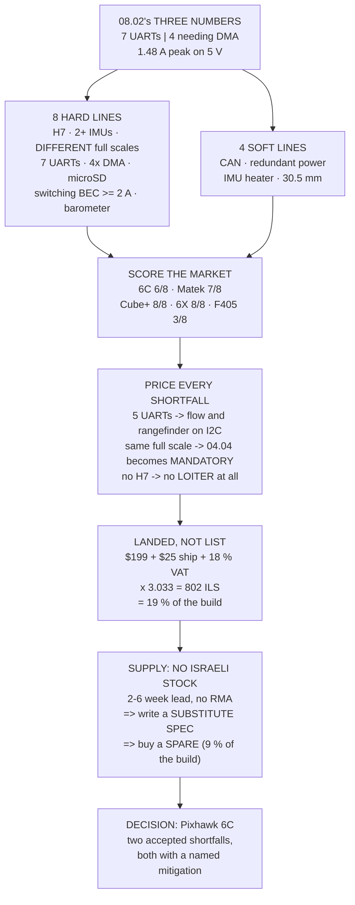

# 08.03 Choosing Hermon's flight controller (purchase decision)

<!-- glance:start -->
<!-- generated by tools/build.py from curriculum/syllabus.yaml — edit the syllabus, not this block -->

| | |
|---|---|
| **Track** | Main path |
| **Difficulty** | Intermediate |
| **Time** | 1 h 15 min |
| **Hardware** | First flight (Hermon core) (stage 1) |
| **Software** | none |
| **Prerequisites** | [08.02 Inside a flight controller: MCU, IMUs, baro, UARTs, power](08.02-board-anatomy.md) |
| **Version-sensitive** | yes — see [curriculum/versions.yaml](../curriculum/versions.yaml) |
| **Skip if** | You have picked Hermon's FC, checked its ports against every peripheral in the build, and found a stocked substitute. |

<!-- glance:end -->

## What you will learn

- 08.02's port budget restated as **eight hard requirements and four soft ones**
- Five real boards scored against it — and that the **recommended board fails two hard lines**
- What each shortfall actually costs, in the vocabulary of the lessons that created it
- The **landed cost**, which is not the price: $199 becomes **₪802** after shipping and VAT
- Why the Israeli supply position makes a **written substitute spec** more valuable than a part
  number
- Why "an ArduPilot `hwdef` that already exists upstream" is the clause nobody reads and everybody
  needs

> **Version-sensitive.** Prices, exchange rate, the personal-import exemption and board
> availability were checked in **September 2026** against `references/research/`. The exemption
> moved three times in 2025–26 and board revisions are silent. Re-check every number here before
> you place an order; the *method* is what this lesson is for.

## Why it matters

08.02 ended with three numbers written large at the bottom of a page: UARTs, I²C addresses, and
peak milliamps on the 5 V rail. This lesson spends them.

The reason to make the purchase a whole lesson is that the flight controller is the one component
where a mistake is not a swap. The motors bolt on, the propellers unscrew, the battery has a
connector. The flight controller has every wire in the aircraft terminating on it, and replacing
it means re-making every one of those connections and re-doing the setup from 08.04 onwards. In
Israel it also means a two-to-six-week wait, because no shop in the country stocks an
ArduPilot-class board.

There is also a result in here that is genuinely uncomfortable, and it is the reason to run the
scoring rather than trust a recommendation. **The board this course's hardware list recommends —
the Holybro Pixhawk 6C — fails two of the eight hard requirements.** Five UARTs against seven,
and two IMUs at the same full scale, which is exactly the case 08.02 said defeats lane voting.
Those are accepted shortfalls with named mitigations, and the value of the table is that you know
about them now instead of when the gimbal arrives.

## Prerequisites

<!-- prereqs:start -->
## Prerequisites

You need these first:

- [08.02 Inside a flight controller: MCU, IMUs, baro, UARTs, power](08.02-board-anatomy.md)

### Optional prerequisite links

None.

Check your readiness: `python course.py why 08.03`
<!-- prereqs:end -->

## Concept

A purchase decision is a requirement document plus a market, and the mistake almost everyone
makes is to start with the market.

Starting with the market means reading reviews, comparing feature lists, and converging on
whatever is popular — which produces a board that is fine for the median build and unexamined
against yours. Starting with the requirement means writing down what you need before you know
what exists, scoring the market against it, and then making the trade-offs **explicitly**, in
writing, with the mitigation next to each one.

The difference shows up six months later. Both readers end up with a board. One of them knows
that the rangefinder is on I²C because the UART budget ran out, and that the vibration work in
04.04 is load-bearing because both IMUs clip at the same threshold. The other has a mysterious
intermittent and no idea where to start.

So this lesson has a specific shape: the requirement first (section 1), the candidates second
(section 2), the cost of every shortfall third (section 3), and only then price, supply and the
decision. The order is the method.

## Technical explanation

### Level 1 — the requirement, split hard from soft

Twelve lines, eight of them hard. Hard means **the aircraft as this course builds it will not
work without it**; soft means you would like it and can proceed without.

Hard: an H7-class MCU (08.01's memory argument), two or more IMUs, IMUs with *different* full
scales, seven UARTs, DMA on four of them, a microSD slot, a switching 5 V BEC of at least 2 A,
and a barometer.

Soft: CAN, a redundant power input, an IMU heater, and a 30.5 mm mounting pattern.

The split is the useful part, and it is a judgement you are making, not a fact. Move "redundant
power input" from soft to hard and the decision changes; that is allowed, provided you write down
why.

### Level 2 — the candidates, scored

| board | USD | MCU | IMUs | scales | UARTs | DMA | hard |
|---|---|---|---|---|---|---|---|
| Holybro Pixhawk 6C | 199 | H743 | 2 | 16/16 | 5 | 4 | **6/8** |
| Matek H743-SLIM | 85 | H743 | 2 | 16/16 | 7 | 4 | **7/8** |
| CubePilot Cube Orange+ | 350 | H757 | 3 | 16/16/30 | 7 | 5 | 8/8 |
| Holybro Pixhawk 6X | 400 | H753 | 3 | 16/16/30 | 8 | 6 | 8/8 |
| SpeedyBee F405 V4 | 40 | F405 | 1 | 16 | 5 | 2 | 3/8 |

Three things to read out of it.

**The recommended board scores 6 of 8.** It is short two UARTs and its two IMUs share a full
scale. Neither is fatal and both have mitigations, but both are real.

**The cheap board scores better than the expensive one on ports.** The Matek H743-SLIM has seven
UARTs against the Pixhawk's five, at 43 % of the price. What the Pixhawk buys is a redundant
power input, a vendor that answers, and status as ArduPilot's reference platform — which matters
more than it sounds like, because every guide and every default parameter assumes it.

**The F405 row is 08.01 arriving as a price.** It is a fifth of the cost and it fails five hard
lines, four of which are the same line: it cannot run the estimator. That whole lesson, in one
row of a table.

### Level 3 — what each shortfall costs

A scoring table is useless without this column, because "fails" is not a decision until you know
what failing does.

- **Five UARTs instead of seven.** The rangefinder and the optical flow move to I²C, or you add a
  CAN node. Both are real solutions and both spend a bus you wanted for something else.
- **Two IMUs at the same full scale.** 08.02's clipping argument is simply gone. The mitigation is
  that the vibration work in 02.09 and 04.04 stops being good practice and becomes **the
  mitigation** — nothing may ever reach 16 g.
- **One IMU.** No lane scoring at all (06.05). A single sensor failure becomes a crash, and the
  log tells you which sensor afterwards.
- **An F4 instead of an H7.** No EKF3, so no LOITER, AUTO, RTL or geofence.
- **No CAN.** 13.03's RTK GNSS goes on a UART, which you are already short of.
- **No redundant power input.** A single BEC failure is a total loss of control (09.03). The
  mitigation is a second BEC, which costs a port and 30 g.

### Level 4 — the landed cost, and supply

Israel's personal-import VAT exemption is **$75**, and above it you owe **18 %** on the whole
declared value including shipping. At 1 USD = ₪3.033 and $25 of shipping:

| board | list | landed | share of a ₪4,300 build |
|---|---|---|---|
| SpeedyBee F405 V4 | $40 | ₪197 | 5 % |
| Matek H743-SLIM | $85 | **₪394** | 9 % |
| Holybro Pixhawk 6C | $199 | **₪802** | 19 % |
| CubePilot Cube Orange+ | $350 | ₪1,342 | 31 % |
| Holybro Pixhawk 6X | $400 | ₪1,521 | 35 % |

Note how flat the middle is. The Matek and the Pixhawk 6C differ by 11 % of the build.

And the supply position, unchanged from the research file: **no Israeli shop stocks an
ArduPilot-class board.** Cell-Tec's entire flight-controller catalogue is F4 all-in-one boards
for 5-inch racers. Every option above is an import, which means a two-to-six-week lead time you
do not control, 18 % above $75, no local RMA, and silent hardware revisions you will only catch
by reading the actual product page rather than a review.

The mitigation for all of that is not a part number. **It is a written spec**, so that the build
survives a component going out of stock — and a **spare board**, which at ₪394 for the Matek is
9 % of the build and turns a six-week outage into an afternoon. It also gives you something to
break on the bench, which 08.04 is about to need.

## Diagram



## Code

Score five real boards against 08.02's requirement, price every shortfall, compute the landed
cost through the exemption and VAT, and print the substitute spec.

```python
"""08.03 - buying Hermon's flight controller against 08.02's own budget."""

ILS = 3.033               # 1 USD, Bank of Israel rate carried in the research file
VAT = 0.18
EXEMPT_USD = 75.0         # personal-import VAT exemption
BUILD_ILS = 4300.0        # stage 1, recommended path (hardware/stage-1)

# 08.02's requirement, and how much each shortfall actually costs you
NEED = [
    ("H7-class MCU (EKF3 lanes)", "08.01", "hard"),
    ("2+ IMUs", "08.02", "hard"),
    ("IMUs with DIFFERENT full scale", "08.02", "hard"),
    ("7 UARTs broken out", "08.02", "hard"),
    ("DMA on 4 of them", "08.02", "hard"),
    ("microSD slot", "08.02", "hard"),
    ("switching BEC >= 2 A on 5 V", "08.02", "hard"),
    ("barometer", "05.03", "hard"),
    ("CAN bus", "13.03", "soft"),
    ("redundant power input", "09.03", "soft"),
    ("IMU heater", "05.02", "soft"),
    ("fits a 30.5 mm mount", "04.04", "soft"),
]

# board, USD, MCU, IMUs, full scales, UARTs, DMA'd, SD, BEC A, CAN, dual power,
# heater, 30.5 mm
BOARDS = [
    ("Holybro Pixhawk 6C", 199.0, "H743", 2, (16, 16), 5, 4, 1, 3.0,
     1, 1, 0, 1),
    ("Matek H743-SLIM", 85.0, "H743", 2, (16, 16), 7, 4, 1, 2.0,
     1, 0, 0, 1),
    ("CubePilot Cube Orange+", 350.0, "H757", 3, (16, 16, 30), 7, 5, 1, 2.5,
     1, 1, 1, 1),
    ("Holybro Pixhawk 6X", 400.0, "H753", 3, (16, 16, 30), 8, 6, 1, 3.0,
     1, 1, 1, 1),
    ("SpeedyBee F405 V4", 40.0, "F405", 1, (16,), 5, 2, 1, 2.0,
     0, 0, 0, 1),
]
COLS = ["board", "usd", "mcu", "n_imu", "fs", "uarts", "dma", "sd", "bec",
        "can", "dualpwr", "heater", "mount"]

NEED_UARTS = 7
NEED_DMA = 4


def landed_ils(usd, shipping=25.0):
    """Import cost in shekels, with the $75 exemption and 18 % VAT."""
    cif = usd + shipping
    vat = cif * VAT if cif > EXEMPT_USD else 0.0
    return (cif + vat) * ILS


def score(b):
    d = dict(zip(COLS, b))
    hard, soft, misses = 0, 0, []
    checks = [
        ("H7-class MCU (EKF3 lanes)", d["mcu"][0] == "H", "hard"),
        ("2+ IMUs", d["n_imu"] >= 2, "hard"),
        ("IMUs with DIFFERENT full scale", len(set(d["fs"])) > 1, "hard"),
        ("7 UARTs broken out", d["uarts"] >= NEED_UARTS, "hard"),
        ("DMA on 4 of them", d["dma"] >= NEED_DMA, "hard"),
        ("microSD slot", d["sd"] == 1, "hard"),
        ("switching BEC >= 2 A on 5 V", d["bec"] >= 2.0, "hard"),
        ("barometer", True, "hard"),
        ("CAN bus", d["can"] == 1, "soft"),
        ("redundant power input", d["dualpwr"] == 1, "soft"),
        ("IMU heater", d["heater"] == 1, "soft"),
        ("fits a 30.5 mm mount", d["mount"] == 1, "soft"),
    ]
    for name, ok, kind in checks:
        if ok:
            if kind == "hard":
                hard += 1
            else:
                soft += 1
        else:
            misses.append((name, kind))
    return hard, soft, misses


def bar(t):
    print("\n" + "=" * 70)
    print(t)
    print("=" * 70)


if __name__ == "__main__":
    bar("1. THE REQUIREMENT, RESTATED AS A SHOPPING LIST")
    print("  08.02 produced the numbers. This is them as pass/fail lines,")
    print("  split into what you cannot give up and what you can.")
    print(f"  {'requirement':36s} {'from':8s} {'kind'}")
    for n, src, kind in NEED:
        print(f"  {n:36s} {src:8s} {kind.upper()}")
    print(f"  {sum(1 for n in NEED if n[2] == 'hard')} HARD requirements,"
          f" {sum(1 for n in NEED if n[2] == 'soft')} SOFT.")
    print("  A board failing ONE hard line is not a cheaper board. It is")
    print("  a board that cannot fly this aircraft as this course builds")
    print("  it, and finding that out after the wiring is the expensive")
    print("  way to learn it.")

    bar("2. THE CANDIDATES")
    print(f"  {'board':24s} {'USD':>7s} {'MCU':>5s} {'IMU':>4s}"
          f" {'scales':>10s} {'UART':>5s} {'DMA':>4s} {'BEC':>5s}")
    for b in BOARDS:
        d = dict(zip(COLS, b))
        fs = "/".join(str(x) for x in d["fs"])
        print(f"  {d['board']:24s} {d['usd']:7.0f} {d['mcu']:>5s}"
              f" {d['n_imu']:4d} {fs:>10s} {d['uarts']:5d} {d['dma']:4d}"
              f" {d['bec']:4.1f}A")

    print(f"\n  {'board':24s} {'hard':>6s} {'soft':>6s}  {'fails HARD':28s} fails soft")
    for b in BOARDS:
        h, s, misses = score(b)
        hard_miss = [m[0] for m in misses if m[1] == "hard"]
        soft_miss = [m[0] for m in misses if m[1] == "soft"]
        SHORT = {"H7-class MCU (EKF3 lanes)": "H7",
                 "2+ IMUs": "2 IMUs",
                 "IMUs with DIFFERENT full scale": "IMU diversity",
                 "7 UARTs broken out": "7 UARTs",
                 "DMA on 4 of them": "4x DMA",
                 "microSD slot": "SD",
                 "switching BEC >= 2 A on 5 V": "BEC",
                 "CAN bus": "CAN",
                 "redundant power input": "dual power",
                 "IMU heater": "heater",
                 "fits a 30.5 mm mount": "30.5 mm"}
        txt = ", ".join(SHORT[m] for m in hard_miss) or "nothing"
        soft_txt = ", ".join(SHORT[m] for m in soft_miss) or "nothing"
        print(f"  {b[0]:24s} {h:3d}/8  {s:3d}/4  {txt:28s} {soft_txt}")
    print("  READ THE PIXHAWK 6C ROW. It is the board the course's")
    print("  hardware list recommends, and it FAILS TWO HARD LINES: five")
    print("  UARTs against seven, and two IMUs with the SAME full scale.")
    print("  That is not a reason to reject it -- it is the reason 08.02")
    print("  existed, so that you find this out now rather than when the")
    print("  gimbal arrives.")
    print("  AND THE SPEEDYBEE ROW IS 08.01, ARRIVING AS A PRICE. It is")
    print("  a fifth of the cost and it cannot run the estimator, which")
    print("  is the whole argument of that lesson in one line of a table.")

    bar("3. WHAT EACH SHORTFALL ACTUALLY COSTS")
    fixes = [
        ("5 UARTs instead of 7",
         "move the rangefinder and the flow sensor to I2C, or add a CAN",
         "node. Real, and it costs you a bus you wanted for something else"),
        ("two IMUs at the same full scale",
         "08.02's clipping argument is gone. Mitigate by fixing the",
         "vibration (02.09, 04.04) so nothing ever reaches 16 g"),
        ("one IMU",
         "no lane scoring at all (06.05). A single sensor failure is now",
         "a crash, and the log will tell you which one afterwards"),
        ("an F4 instead of an H7",
         "no EKF3, so no LOITER, AUTO, RTL or geofence (08.01)",
         ""),
        ("no CAN",
         "the RTK GNSS of 13.03 goes on a UART instead, which you",
         "are already short of"),
        ("no redundant power input",
         "a single BEC failure is a total loss of control (09.03). The",
         "mitigation is a second BEC, which costs a port and 30 g"),
    ]
    for a, b, c in fixes:
        print(f"  * {a}")
        print(f"    {b}")
        if c:
            print(f"    {c}")

    bar("4. THE LANDED COST, WHICH IS NOT THE PRICE")
    print(f"  Israel's personal-import VAT exemption is ${EXEMPT_USD:.0f};"
          f" above it you owe")
    print(f"  {VAT * 100:.0f} % on the whole declared value including"
          f" shipping. At 1 USD =")
    print(f"  {ILS:.3f} ILS, assuming $25 of shipping:")
    print(f"  {'board':24s} {'list':>7s} {'+ship':>7s} {'VAT':>7s}"
          f" {'landed':>9s} {'of build':>9s}")
    for b in BOARDS:
        usd = b[1]
        cif = usd + 25.0
        vat = cif * VAT if cif > EXEMPT_USD else 0.0
        landed = landed_ils(usd)
        print(f"  {b[0]:24s} {usd:6.0f}$ {cif:6.0f}$ {vat:6.0f}$"
              f" {landed:7.0f}ILS {landed / BUILD_ILS * 100:8.0f}%")
    print(f"  The build is about {BUILD_ILS:.0f} ILS all-in"
          f" (hardware/stage-1), so the")
    print("  flight controller is between 5 % and 40 % of it depending")
    print("  on what you choose. NOTE HOW FLAT THE MIDDLE IS: the Matek")
    print("  and the Pixhawk 6C differ by 11 % of the build, and the")
    print("  Pixhawk buys you a redundant power input and a support")
    print("  channel that answers.")

    bar("5. SUPPLY RISK, WHICH IS THE ISRAELI PART")
    print("  The research file's finding, unchanged: NO ISRAELI SHOP")
    print("  STOCKS AN ARDUPILOT-CLASS BOARD. Cell-Tec's catalogue is")
    print("  F4 AIO boards for 5-inch racers. Every option in section 2")
    print("  is an import, which means:")
    risks = [
        ("lead time", "2-6 weeks, and it is not under your control"),
        ("a dead board", "is a 2-6 week outage, not a drive to a shop"),
        ("customs", "18 % above $75, and the threshold has moved three "
         "times in two years"),
        ("no local RMA", "the vendor's warranty is a shipping problem"),
        ("revisions", "'Pixhawk 6C' has had silent hardware revisions; "
         "read the actual product page, not a review"),
    ]
    print(f"  {'risk':14s} {'what it means'}")
    for a, b in risks:
        print(f"  {a:14s} {b}")
    print("\n  THE MITIGATION IS A SPEC, NOT A PART NUMBER. Write down")
    print("  the eight hard lines from section 1 and buy anything that")
    print("  meets them. That is what makes the build survive a part")
    print("  going out of stock, and it is why this lesson is a")
    print("  requirement table rather than a recommendation.")
    print("\n  AND BUY THE SPARE. A second flight controller is"
          f" {landed_ils(85):.0f} ILS")
    print(f"  for the Matek -- {landed_ils(85) / BUILD_ILS * 100:.0f} % of"
          f" the build -- and it turns a six-week")
    print("  outage into an afternoon. It also gives you a bench board to")
    print("  break things on, which 08.04 is about to need.")

    bar("6. THE DECISION")
    print("  HERMON: Holybro Pixhawk 6C, with two accepted shortfalls.")
    dec = [
        ("five UARTs, not seven",
         "the rangefinder and flow sensor go on I2C; the gimbal waits"),
        ("two IMUs at the same full scale",
         "so 04.04's vibration work is not optional, it is the mitigation"),
        ("+ redundant power input", "which the Matek does not have"),
        ("+ a vendor that answers", "and publishes its hwdef"),
        ("+ the ArduPilot reference platform",
         "so every guide and every parameter default assumes it"),
    ]
    for a, b in dec:
        print(f"  {a:34s} {b}")
    print("\n  THE SUBSTITUTE SPEC, if it is out of stock:")
    print("    STM32H7, >= 2 IMUs (different full scales preferred),")
    print("    >= 5 UARTs with DMA on at least 4, microSD, barometer,")
    print("    a switching 5 V BEC of 2 A or more, and an ArduPilot")
    print("    hwdef that already exists upstream.")
    print("  THAT LAST CLAUSE IS THE ONE PEOPLE SKIP. A board with no")
    print("  upstream hwdef is a board you are porting, and porting is")
    print("  not a beginner project -- it is where you find out which")
    print("  pins reach a DMA stream, the hard way (08.02).")
```

Output:

```text

======================================================================
1. THE REQUIREMENT, RESTATED AS A SHOPPING LIST
======================================================================
  08.02 produced the numbers. This is them as pass/fail lines,
  split into what you cannot give up and what you can.
  requirement                          from     kind
  H7-class MCU (EKF3 lanes)            08.01    HARD
  2+ IMUs                              08.02    HARD
  IMUs with DIFFERENT full scale       08.02    HARD
  7 UARTs broken out                   08.02    HARD
  DMA on 4 of them                     08.02    HARD
  microSD slot                         08.02    HARD
  switching BEC >= 2 A on 5 V          08.02    HARD
  barometer                            05.03    HARD
  CAN bus                              13.03    SOFT
  redundant power input                09.03    SOFT
  IMU heater                           05.02    SOFT
  fits a 30.5 mm mount                 04.04    SOFT
  8 HARD requirements, 4 SOFT.
  A board failing ONE hard line is not a cheaper board. It is
  a board that cannot fly this aircraft as this course builds
  it, and finding that out after the wiring is the expensive
  way to learn it.

======================================================================
2. THE CANDIDATES
======================================================================
  board                        USD   MCU  IMU     scales  UART  DMA   BEC
  Holybro Pixhawk 6C           199  H743    2      16/16     5    4  3.0A
  Matek H743-SLIM               85  H743    2      16/16     7    4  2.0A
  CubePilot Cube Orange+       350  H757    3   16/16/30     7    5  2.5A
  Holybro Pixhawk 6X           400  H753    3   16/16/30     8    6  3.0A
  SpeedyBee F405 V4             40  F405    1         16     5    2  2.0A

  board                      hard   soft  fails HARD                   fails soft
  Holybro Pixhawk 6C         6/8    3/4  IMU diversity, 7 UARTs       heater
  Matek H743-SLIM            7/8    2/4  IMU diversity                dual power, heater
  CubePilot Cube Orange+     8/8    4/4  nothing                      nothing
  Holybro Pixhawk 6X         8/8    4/4  nothing                      nothing
  SpeedyBee F405 V4          3/8    1/4  H7, 2 IMUs, IMU diversity, 7 UARTs, 4x DMA CAN, dual power, heater
  READ THE PIXHAWK 6C ROW. It is the board the course's
  hardware list recommends, and it FAILS TWO HARD LINES: five
  UARTs against seven, and two IMUs with the SAME full scale.
  That is not a reason to reject it -- it is the reason 08.02
  existed, so that you find this out now rather than when the
  gimbal arrives.
  AND THE SPEEDYBEE ROW IS 08.01, ARRIVING AS A PRICE. It is
  a fifth of the cost and it cannot run the estimator, which
  is the whole argument of that lesson in one line of a table.

======================================================================
3. WHAT EACH SHORTFALL ACTUALLY COSTS
======================================================================
  * 5 UARTs instead of 7
    move the rangefinder and the flow sensor to I2C, or add a CAN
    node. Real, and it costs you a bus you wanted for something else
  * two IMUs at the same full scale
    08.02's clipping argument is gone. Mitigate by fixing the
    vibration (02.09, 04.04) so nothing ever reaches 16 g
  * one IMU
    no lane scoring at all (06.05). A single sensor failure is now
    a crash, and the log will tell you which one afterwards
  * an F4 instead of an H7
    no EKF3, so no LOITER, AUTO, RTL or geofence (08.01)
  * no CAN
    the RTK GNSS of 13.03 goes on a UART instead, which you
    are already short of
  * no redundant power input
    a single BEC failure is a total loss of control (09.03). The
    mitigation is a second BEC, which costs a port and 30 g

======================================================================
4. THE LANDED COST, WHICH IS NOT THE PRICE
======================================================================
  Israel's personal-import VAT exemption is $75; above it you owe
  18 % on the whole declared value including shipping. At 1 USD =
  3.033 ILS, assuming $25 of shipping:
  board                       list   +ship     VAT    landed  of build
  Holybro Pixhawk 6C          199$    224$     40$     802ILS       19%
  Matek H743-SLIM              85$    110$     20$     394ILS        9%
  CubePilot Cube Orange+      350$    375$     68$    1342ILS       31%
  Holybro Pixhawk 6X          400$    425$     76$    1521ILS       35%
  SpeedyBee F405 V4            40$     65$      0$     197ILS        5%
  The build is about 4300 ILS all-in (hardware/stage-1), so the
  flight controller is between 5 % and 40 % of it depending
  on what you choose. NOTE HOW FLAT THE MIDDLE IS: the Matek
  and the Pixhawk 6C differ by 11 % of the build, and the
  Pixhawk buys you a redundant power input and a support
  channel that answers.

======================================================================
5. SUPPLY RISK, WHICH IS THE ISRAELI PART
======================================================================
  The research file's finding, unchanged: NO ISRAELI SHOP
  STOCKS AN ARDUPILOT-CLASS BOARD. Cell-Tec's catalogue is
  F4 AIO boards for 5-inch racers. Every option in section 2
  is an import, which means:
  risk           what it means
  lead time      2-6 weeks, and it is not under your control
  a dead board   is a 2-6 week outage, not a drive to a shop
  customs        18 % above $75, and the threshold has moved three times in two years
  no local RMA   the vendor's warranty is a shipping problem
  revisions      'Pixhawk 6C' has had silent hardware revisions; read the actual product page, not a review

  THE MITIGATION IS A SPEC, NOT A PART NUMBER. Write down
  the eight hard lines from section 1 and buy anything that
  meets them. That is what makes the build survive a part
  going out of stock, and it is why this lesson is a
  requirement table rather than a recommendation.

  AND BUY THE SPARE. A second flight controller is 394 ILS
  for the Matek -- 9 % of the build -- and it turns a six-week
  outage into an afternoon. It also gives you a bench board to
  break things on, which 08.04 is about to need.

======================================================================
6. THE DECISION
======================================================================
  HERMON: Holybro Pixhawk 6C, with two accepted shortfalls.
  five UARTs, not seven              the rangefinder and flow sensor go on I2C; the gimbal waits
  two IMUs at the same full scale    so 04.04's vibration work is not optional, it is the mitigation
  + redundant power input            which the Matek does not have
  + a vendor that answers            and publishes its hwdef
  + the ArduPilot reference platform so every guide and every parameter default assumes it

  THE SUBSTITUTE SPEC, if it is out of stock:
    STM32H7, >= 2 IMUs (different full scales preferred),
    >= 5 UARTs with DMA on at least 4, microSD, barometer,
    a switching 5 V BEC of 2 A or more, and an ArduPilot
    hwdef that already exists upstream.
  THAT LAST CLAUSE IS THE ONE PEOPLE SKIP. A board with no
  upstream hwdef is a board you are porting, and porting is
  not a beginner project -- it is where you find out which
  pins reach a DMA stream, the hard way (08.02).
```

## Exercise

### Exercise 08.03-E1 — Score your own shortlist `[research]`

Take three boards you could actually buy today — read the *vendor's* product page, not a review
or a marketplace listing — and fill in every column of the candidate table: MCU, IMU count, each
IMU's accelerometer full scale, UARTs broken out to connectors, how many of those carry DMA, SD
slot, BEC rating. Several of those are not on the marketing page and are in the board's ArduPilot
documentation page or its `hwdef.dat`. Score all three. Note which columns you could not find,
because that is a finding about the vendor.

### Exercise 08.03-E2 — Move one line from soft to hard `[analysis]`

Promote "redundant power input" from soft to hard and re-score. Which boards survive, and what
does the cheapest surviving board cost, landed? Then do the same for "CAN bus". Write two
sentences on whether either promotion is worth its price for the aircraft you are building.

### Exercise 08.03-E3 — Find the exemption cliff `[analysis]`

Model the landed cost as a function of list price from $40 to $500 in $10 steps, with $25 of
shipping and the $75 exemption. Plot or tabulate the landed-cost curve and find the discontinuity.
Then answer: over what list-price range is a *more expensive* board cheaper to land than a
slightly cheaper one, and does any real board fall in it?

### Exercise 08.03-E4 — Write the substitute spec `[analysis]`

Write your own substitute spec as a single paragraph that a person who has never read this course
could shop with. It must be checkable — every clause either passes or fails against a product
page, with no judgement calls. Then test it: find one board that passes it and one that looks
similar and fails, and say which clause catches the second one.

## Expected result

**08.03-E1**: expect to find UART count and BEC rating easily, IMU part numbers with some
searching, and DMA availability nowhere except `hwdef.dat`. A vendor that publishes its `hwdef`
and an ArduPilot documentation page is telling you something real about how it will behave when
you have a problem.

**08.03-E2**: promoting redundant power eliminates the Matek and leaves the Pixhawk 6C at ₪802 as
the cheapest survivor — a ₪408 premium, which is 9 % of the build to remove a single point of
failure that 09.03 says is a total loss of control. Promoting CAN changes nothing, because every
H7 board on the list has it.

**08.03-E3**: the cliff is at a $50 list price — $50 + $25 shipping = $75, exactly the exemption
— and the landed cost jumps 18 % across it. Between roughly $50 and $59 list, a $49 board lands
cheaper than a board costing a few dollars more. No board on the shortlist falls in the gap, but
accessories frequently do, which is a real argument for consolidating orders.

**08.03-E4**: a good spec is about forty words and has no adjectives in it. "STM32H7, two or more
IMUs, at least five UARTs with DMA on four, microSD, barometer, switching 5 V BEC of 2 A or more,
and an ArduPilot `hwdef` already merged upstream." The last clause is the one that catches
look-alikes.

## Troubleshooting

**The vendor's page does not say how many UARTs have DMA.** Almost none do. Find the board's
`hwdef.dat` in ArduPilot's source tree under `libraries/AP_HAL_ChibiOS/hwdef/<boardname>/` and
read the `NODMA` markers. If the board has no directory there, see the next item.

**The board has no upstream ArduPilot `hwdef`.** Then you are porting it. Porting is not a
beginner project — it is where you discover which pins reach a DMA stream, by making the mistakes
08.02 described. Treat "an upstream `hwdef` exists" as a hard requirement even though it sounds
like a soft one.

**Two boards with the same name behave differently.** Silent hardware revisions are normal in
this market. The IMU part numbers change between production runs without the name changing. Check
`INS_ACC_ID` and the boot messages on the board in front of you, not the page you bought from.

**Customs charged more than 18 %.** Above $500 declared, duty and purchase tax may apply on top.
Split large orders, and declare accurately — the saving from under-declaring is 18 % and the
downside is your parcel and your name.

**The board arrived dead.** This is why section 5 argues for a spare. Photograph the packaging
before opening it, test on a bench supply before it goes in the aircraft, and open the RMA the
same day — an international RMA is measured in weeks.

> [!WARNING]
> **Do not power a new flight controller from the flight battery on its first connection.** Use
> USB, or a bench supply with the current limit set to 500 mA. A reversed or mis-wired power
> module puts 22.2 V onto a 5 V rail and destroys the flight controller, the GNSS, the receiver
> and the radio in the same instant — everything you just imported, in one moment, with a six-week
> replacement time. Check the power module's polarity with a multimeter before the connector ever
> goes in, exactly as 04.05's five checks describe.

## Common mistakes

- **Shopping before writing the requirement.** You will converge on what is popular, which is
  fine for the median build and unexamined against yours.
- **Treating the recommendation as the answer.** The recommended board scores 6 of 8. Knowing
  *which* two it fails is the entire value of the exercise.
- **Comparing list prices across a customs border.** $199 is ₪802 landed. $85 is ₪394. The ratio
  is preserved but the numbers you budget with are not.
- **Buying no spare.** 9 % of the build, against a six-week outage and no bench board for 08.04.
- **Ignoring "upstream `hwdef` exists".** It reads like a nicety and it is the difference between
  flashing firmware and writing it.
- **Counting UARTs from the marketing page.** Count the ones brought out to *connectors*, and
  subtract the USB console. Two of them are often on the same physical plug.
- **Deferring the stage-2 and stage-3 ports.** 08.02 said it and it is worth repeating: you will
  not rewire a finished aircraft.

## Knowledge check

<details>
<summary>The Pixhawk 6C is this course's recommended board and it fails two hard requirements.
Name them, and name the mitigation for each.</summary>

**Five UARTs against seven** — mitigated by moving the rangefinder and optical flow to I²C, or by
adding a CAN node, at the cost of a bus you wanted elsewhere. And **two IMUs at the same ±16 g
full scale** — which removes 08.02's clipping defence entirely, so the mitigation is that 02.09's
propeller balancing and 04.04's mounting work become mandatory rather than good practice.
</details>

<details>
<summary>The Matek H743-SLIM scores 7 of 8 and the Pixhawk 6C scores 6 of 8, at less than half the
price. Why does the course recommend the Pixhawk?</summary>

For a soft line and two things not on the table: the Matek has **no redundant power input**, and
the Pixhawk is ArduPilot's **reference platform** with a vendor that answers support mail. Every
guide, every default parameter and every troubleshooting thread assumes it. The premium is ₪408,
which is 9 % of the build — and it is a judgement, not a fact. E2 is where you re-make it.
</details>

<details>
<summary>Why is "an ArduPilot `hwdef` that already exists upstream" a hard requirement rather than
a convenience?</summary>

Because without one you are porting the board, and a port is where you discover by hand which
pins reach a DMA stream, which timers can drive four DShot outputs, and which of them conflict.
08.02 described what a missing DMA does: corrupted frames that look like sensor faults. Doing
that discovery yourself, on your first build, is not a beginner project.
</details>

<details>
<summary>A $199 board and a $40 board are quoted. What do they actually cost landed in Israel, and
why is the ratio not preserved as a share of the build?</summary>

₪802 and ₪197. The $40 board plus $25 shipping is $65, **below the $75 exemption**, so it pays no
VAT at all; the $199 board pays 18 % on $224. The ratio of list prices is 5:1 and the ratio of
landed costs is 4:1, because the exemption compresses the bottom end. That discontinuity is E3.
</details>

<details>
<summary>No Israeli shop stocks an ArduPilot-class board. Name the two mitigations this lesson
argues for, and what each one actually buys.</summary>

A **written substitute spec** — eight checkable clauses — which lets the build survive a part
going out of stock without re-opening the decision. And a **spare board**, at 9 % of the build,
which converts a two-to-six-week outage into an afternoon and gives you a bench board to break
during 08.04's firmware work.
</details>

<details>
<summary>Why does this lesson insist on the order requirement → candidates → cost of shortfall →
price?</summary>

Because reversing it produces a board chosen on popularity and never examined against your build.
The scoring is only useful if the requirement was written before you knew what existed, and the
"cost of shortfall" column is what turns a fail into a decision — without it, "fails two lines"
is either fatal or ignorable and you have no way to tell which.
</details>

<details>
<summary>You promote "redundant power input" from soft to hard. What happens, and is that the
wrong answer?</summary>

The Matek is eliminated and the cheapest survivor is the Pixhawk 6C at ₪802 — a ₪408 premium to
remove what 09.03 calls a total loss of control. It is not the wrong answer; the soft/hard split
is a judgement you make, and the only mistake would be making it without writing down why. On a
training aircraft flown over an empty field the soft classification is defensible; over anything
else it is not.
</details>

## Practical challenge

**Buy it — or write the memo that says why not yet.**

Produce a one-page purchase document. The requirement table with your own hard/soft split and a
sentence justifying each promotion or demotion. Your three-board shortlist with every column
filled from vendor pages and `hwdef.dat`, and a note against every column you could not find. The
landed cost of each, computed through the current exemption and the current exchange rate — look
both up, do not copy the numbers from this page. Your decision, with the accepted shortfalls and
their mitigations named. The substitute spec. And the spare, or a written reason not to buy one.

Then place the order, or file the page until you can. Either is a finished exercise; an order
placed without the page is not.

## You can skip this if

You have picked Hermon's FC, checked its ports against every peripheral in the build, and found a
stocked substitute.

## Go deeper

- [04.05](../04-frame-and-assembly/04.05-building-hermon.md) (earlier): the five multimeter checks
  before first power-up, which this lesson's warning depends on.
- [06.05](../06-state-estimation/06.05-ekf3-in-ardupilot.md) (earlier): the lanes that make IMU
  count a real specification.
- [08.01](08.01-autopilot-landscape.md) (earlier): why the board must be H7-class at all.
- [08.02](08.02-board-anatomy.md) (earlier): the port budget this lesson spends.
- [08.04](08.04-firmware-and-parameters.md) (next): flashing it, and why you want a spare to
  break.
- [09.03](../09-telemetry-datalink/09.03-failsafe-when-the-link-drops.md) (later): what a single
  BEC failure actually does.
- `hardware/stage-1-first-flight.md` and `references/research/` in this repository: the current
  Israeli prices, suppliers and import rules behind every number here.
- ArduPilot's supported-autopilot list, which is the authoritative answer to "does a `hwdef`
  exist": https://ardupilot.org/copter/docs/common-autopilots.html
- Israel Tax Authority guidance on personal imports and the exemption threshold:
  https://www.gov.il/en/departments/israel_tax_authority

> **Ask your teacher:** *"We scored the Pixhawk 6C at 6 of 8 hard requirements — it is two UARTs
> short and both its IMUs are ±16 g, which is exactly 04.04's measured mount vibration. We are
> accepting both with mitigations. In your experience, which of those two bites first on a real
> build, and have you seen a team actually have to move a rangefinder to I²C mid-project?"*

## Progress checkpoint

Run `python course.py complete 08.03` once your purchase page is written, ordered or filed. Next:
[08.04](08.04-firmware-and-parameters.md) — putting firmware on it, the parameter tree, and how to
undo a change that made things worse.
