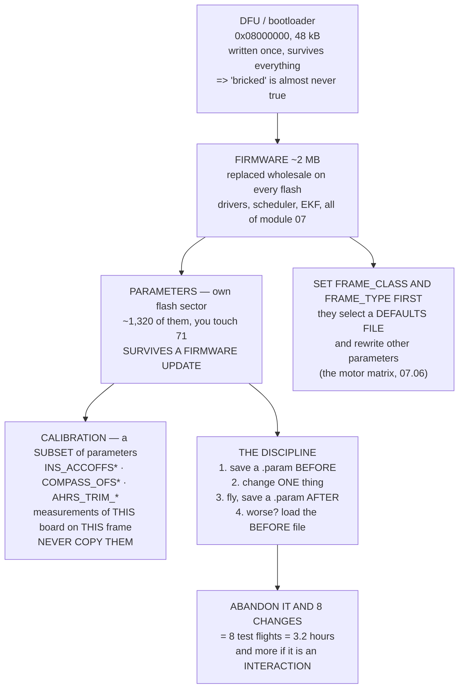

# 08.04 Flashing firmware and the parameter system

<!-- glance:start -->
<!-- generated by tools/build.py from curriculum/syllabus.yaml — edit the syllabus, not this block -->

| | |
|---|---|
| **Track** | Main path |
| **Difficulty** | Intermediate |
| **Time** | 1 h 30 min |
| **Hardware** | First flight (Hermon core) (stage 1) |
| **Software** | ardupilot, qgc |
| **Prerequisites** | [08.03 Choosing Hermon's flight controller (purchase decision)](08.03-choosing-hermons-fc.md) |
| **Version-sensitive** | yes — see [curriculum/versions.yaml](../curriculum/versions.yaml) |
| **Skip if** | You can flash ArduPilot, load a parameter file, diff two parameter sets and roll back a bad change. |

<!-- glance:end -->

## What you will learn

- What is actually in the board's flash, and why **"bricked" is almost always the wrong word**
- That the course has named **71 parameters out of about 1,320** — and why the naming *scheme*
  is worth more than the list
- That a `.param` file is plain text, and `diff` is the only tool you need
- Which parameters may be copied between two aircraft and which **must never** be — and what
  copying a compass offset actually costs
- `FRAME_CLASS` and `FRAME_TYPE`, which change defaults rather than just recording a fact
- The rollback discipline in four lines, and what abandoning it costs in test flights

> **Version-sensitive.** Parameter names, the total count and the ground-station workflow track
> ArduPilot Copter **4.5**, checked September 2026. Parameters are added and occasionally renamed
> between minor versions. The method is stable; the names are not.

## Why it matters

You now have a board. This is the lesson where it stops being hardware and starts being an
aircraft, and it is also the lesson where the largest number of people quietly lose a weekend.

Not to anything difficult. Flashing firmware takes ninety seconds. The weekend goes to a
different failure: a parameter changed six days ago that nobody wrote down, a tune restored from
somebody else's aircraft, a compass calibration copied along with it, an aircraft that flies
worse than it did and no record of what changed. Every one of those is a **process** failure, and
every one of them is prevented by a habit that costs four seconds.

So this lesson is half mechanism and half discipline. The mechanism: what is in flash, what
survives an update, what a parameter file is, and how `FRAME_CLASS` quietly rewrites your
defaults. The discipline: one change at a time, a `.param` file before and after, and a filename
that says why.

The discipline half is priced. Change eight parameters, fly, and find it worse: that is eight
test flights to isolate, three and a bit hours of flying, and more if the cause is an
interaction. Change one: it is never a question.

## Prerequisites

<!-- prereqs:start -->
## Prerequisites

You need these first:

- [08.03 Choosing Hermon's flight controller (purchase decision)](08.03-choosing-hermons-fc.md)

### Optional prerequisite links

None.

Check your readiness: `python course.py why 08.04`
<!-- prereqs:end -->

## Concept

A flight controller's flash is in layers, and the useful mental model is which layer survives
what.

The **bootloader** sits at the bottom, in its own sector, and is written once at the factory. Its
whole job is to accept new firmware over USB. A normal firmware flash never touches it.

The **firmware** sits above it and is replaced wholesale every time you flash. It is about 2 MB
of ArduPilot: the drivers, the scheduler, the EKF, every loop from module 07 and every parameter
definition.

The **parameters** live in a dedicated flash sector, separately, and **survive a firmware
update**. That is a feature — you can upgrade ArduPilot without losing your tune — and it is also
the source of the strangest bugs in this hobby, because a parameter set from an old version can
persist across an upgrade that changed what it means.

And within the parameters there is a subset that is fundamentally different: the **calibration**.
Accelerometer offsets, compass offsets, board level trim, sensor IDs. These are not settings.
They are measurements of one physical board on one physical airframe, and they are the ones a
careless restore will overwrite with somebody else's.

## Technical explanation

### Level 1 — the flash layout, and what "bricked" means

| layer | where | survives | recovery |
|---|---|---|---|
| bootloader | 0x08000000, 48 kB | everything you will do | DFU, with the BOOT pin shorted |
| firmware | 0x0800C000 on, ~2 MB | replaced on every flash | USB — the bootloader is still there |
| parameters | a dedicated sector | **a firmware update** | `FORMAT_VERSION = 0`, or a full erase |
| calibration | parameters, but per-aircraft | everything | redo it; there is no shortcut |
| SD card | removable | — | a missing card is a warning, not a failure |

The practical consequence: **a board that will not boot its firmware still enumerates as a DFU
device and will take a new one.** What you lose is an evening, not ₪802. Genuine bricking needs a
corrupt bootloader, which needs you to have deliberately flashed one.

### Level 2 — the parameter tree

ArduPilot Copter exposes about **1,320 parameters**. This course, across modules 02 to 07, has
named **71** — **5.4 %** of them.

That ratio is the lesson. The tree is not something to learn; it is a reference to look things up
in. What you learn is the naming scheme, which is almost perfectly regular:

| prefix | means | from |
|---|---|---|
| `ATC_` | attitude control | 07.03, 07.04 |
| `PSC_` | position control | 07.05 |
| `INS_` | inertial sensors and their filters | 05.02, 07.07 |
| `EK3_` | the third-generation EKF | 06.05 |
| `MOT_` | the mixer and the motors | 07.06 |
| `COMPASS_` | the magnetometers | 05.03 |
| `SERIALn_` | one physical serial port | 08.02 |
| `*_NSE` | a noise term — an R or a Q | 06.05 |
| `*_FLTD` | a D-term low-pass corner | 07.03 |
| `*_MAX` / `*_MIN` | a limit, which wins on a large error | 07.02 |

Given the scheme you can guess most parameter names, and the documentation confirms or corrects
you in seconds. That is a far better use of your memory than the list.

**`FRAME_CLASS` and `FRAME_TYPE` are different from the rest**, and this is the part people miss.
Setting `FRAME_CLASS = 1` (quad) and `FRAME_TYPE = 1` (X) does not merely record a fact — it
selects a **defaults file** that changes a batch of other parameters at once, including the motor
matrix from 07.06. Set it *first*, before anything else, and set it *again* after any firmware
change that might have reset it. A quadcopter configured as a hexacopter will arm, spin up, and
flip.

### Level 3 — a parameter file is text

The format is `NAME,VALUE`, one per line. That is the entire specification. Which means the tool
you need already exists on your computer, and the second tool you need is fifteen lines of Python.

Here is a real diff — 07.07's steps 4, 5 and 6, as a parameter change:

```text
~ ATC_RAT_RLL_D       0.0036 -> 0.0062   1.72x
~ ATC_RAT_RLL_I       0.1350 -> 0.1850   1.37x
~ ATC_RAT_RLL_P       0.1350 -> 0.1850   1.37x
~ INS_GYRO_FILTER    20.0000 -> 60.0000  3.00x
~ INS_HNTCH_ENABLE    0      -> 1        on
+ INS_HNTCH_BW                   30.0000
+ INS_HNTCH_FREQ                 84.0000
+ INS_HNTCH_MODE                  3.0000
```

Read it as a story. The notch went on, tracked from ESC telemetry at 84 Hz with 30 Hz of
bandwidth. Because the notch is there, `INS_GYRO_FILTER` could move from 20 to 60 — and 07.07
showed that moving the crossover from 19.6 Hz to 40.0 Hz. Because the crossover moved, the rate
gains could go up 37 %.

**Every number in a good diff has a reason, and if one does not, that is the one to
investigate.**

### Level 4 — what may be copied, and what must never be

| parameters | are | copy between aircraft? |
|---|---|---|
| `ATC_*`, `PSC_*` | the tune | same airframe only |
| `INS_HNTCH_*` | the notch | same airframe only |
| `MOT_*` | the powertrain | same powertrain only |
| `EK3_*_NSE`, `EK3_SRC*` | estimator configuration | **usually yes** |
| `SERIALn_*`, `*_TYPE` | the wiring | same wiring only |
| `INS_ACCOFFS*`, `INS_ACCSCAL*` | accelerometer calibration | **never** |
| `COMPASS_OFS*`, `_DIA*`, `_ODI*` | compass calibration | **never** |
| `AHRS_TRIM_*` | board level trim | **never** |
| `*_ID` | which physical chips were detected | **never** |

The `EK3_*_NSE` row is the interesting one: those are safe to copy because they describe a
**sensor class**, not this sensor. "A barometer of this kind has about this much noise" travels
fine between two aircraft with the same barometer.

The four `never` rows are the ones that cause crashes, and they are exactly the ones a naive
"restore my parameters" will copy. 05.03 measured what an uncorrected hard-iron offset does: 31.8
degrees of heading error, which in LOITER is an aircraft correcting in the wrong direction — the
toilet bowl from 07.05. **Copying somebody else's offsets is worse than having none**, because
the aircraft now believes it is calibrated and will not warn you.

## Diagram



## Code

Model the flash layers, count the parameters this course actually names against the whole tree,
build a working `.param` differ and run it on a real before/after pair, classify every parameter
family by whether it may be copied, and price the one-change-at-a-time rule in test flights.

```python
"""08.04 - firmware, the parameter tree, and a real parameter differ."""
import io
import math
import re

TOTAL_PARAMS = 1320       # ArduPilot Copter 4.5, order of magnitude

# stage of the boot chain, where it lives, what happens if it is broken
BOOT = [
    ("bootloader", "flash 0x08000000, 48 kB", "write-protected in practice",
     "recoverable ONLY over DFU with the BOOT pin shorted"),
    ("firmware", "flash 0x0800C000 onward, ~2 MB",
     "replaced on every flash",
     "recoverable over USB: the bootloader is still there"),
    ("parameters", "a dedicated flash sector, or the SD card",
     "survives a firmware update",
     "reset with FORMAT_VERSION = 0, or a full erase"),
    ("calibration", "parameters, but PER AIRCRAFT",
     "survives everything, and MUST NOT be copied",
     "redo the calibration; there is no shortcut"),
    ("the SD card", "removable", "logs, terrain, scripts, missions",
     "a missing card is a warning, not a failure"),
]

# parameters this course has actually named, module by module
NAMED = {
    "02": ["MOT_PWM_TYPE", "SERVO_BLH_AUTO", "SERVO_BLH_BDMASK",
           "MOT_THST_EXPO"],
    "04": ["FRAME_CLASS", "FRAME_TYPE", "AHRS_ORIENTATION"],
    "05": ["INS_ACCOFFS_X", "INS_ACCSCAL_X", "COMPASS_OFS_X",
           "COMPASS_DIA_X", "COMPASS_ODI_X", "COMPASS_DEC",
           "GPS_TYPE", "GPS_GNSS_MODE", "RNGFND1_TYPE", "FLOW_TYPE",
           "BARO_PRIMARY", "INS_GYR_CAL"],
    "06": ["EK3_ENABLE", "EK3_IMU_MASK", "EK3_SRC1_POSXY", "EK3_SRC1_VELZ",
           "EK3_GPS_DELAY", "EK3_ALT_M_NSE", "EK3_POSNE_M_NSE",
           "EK3_GYRO_P_NSE", "EK3_ACC_P_NSE", "EK3_POS_I_GATE",
           "EK3_GLITCH_RAD", "EKF_CHECK_THRESH", "EK3_YAW_M_NSE"],
    "07": ["ATC_RAT_RLL_P", "ATC_RAT_RLL_I", "ATC_RAT_RLL_D",
           "ATC_RAT_RLL_IMAX", "ATC_RAT_RLL_FLTD", "ATC_RAT_RLL_FF",
           "ATC_ANG_RLL_P", "ATC_ANG_PIT_P", "ATC_ANG_YAW_P",
           "ATC_ACCEL_R_MAX", "ATC_ACCEL_Y_MAX", "ATC_INPUT_TC",
           "ATC_THR_MIX_MAN", "ATC_THR_MIX_MIN", "ATC_THR_MIX_MAX",
           "PSC_POSZ_P", "PSC_VELZ_P", "PSC_ACCZ_P", "PSC_ACCZ_I",
           "PSC_POSXY_P", "PSC_VELXY_P", "PSC_VELXY_I",
           "MOT_SPIN_ARM", "MOT_SPIN_MIN", "MOT_SPIN_MAX",
           "MOT_THST_HOVER", "ANGLE_MAX", "WPNAV_SPEED", "WPNAV_ACCEL",
           "LOIT_SPEED", "INS_GYRO_FILTER", "INS_HNTCH_ENABLE",
           "INS_HNTCH_MODE", "INS_HNTCH_FREQ", "INS_HNTCH_BW",
           "INS_HNTCH_HMNCS", "INS_HNTCH_REF", "INS_LOG_BAT_OPT",
           "AUTOTUNE_AXES"],
}

# a parameter prefix, and whether it may be copied between two aircraft
COPYABLE = [
    ("ATC_*, PSC_*", "tune", "SAME airframe only",
     "a tune is a property of the mass, the inertia and the props"),
    ("INS_HNTCH_*", "notch", "SAME airframe only",
     "the tone follows the propeller and the rpm (07.07)"),
    ("MOT_*", "powertrain", "SAME powertrain only",
     "MOT_THST_HOVER is learned in flight and is mass-dependent"),
    ("EK3_*_NSE, EK3_SRC*", "estimator config", "YES, usually",
     "these describe the SENSOR CLASS, not this sensor"),
    ("SERIALn_*, *_TYPE", "wiring", "SAME wiring only",
     "they describe which plug you used"),
    ("INS_ACCOFFS*, INS_ACCSCAL*", "accel calibration", "NEVER",
     "a property of one chip on one board"),
    ("COMPASS_OFS*, _DIA*, _ODI*", "compass calibration", "NEVER",
     "05.03: hard iron is 31.8 deg of heading error uncorrected"),
    ("AHRS_TRIM_*", "level calibration", "NEVER",
     "a property of how THIS board sits on THIS frame"),
    ("*_ID, INS_ACC_ID etc", "hardware identity", "NEVER",
     "they name the physical chips that were detected"),
]

SAMPLE_OLD = """ATC_RAT_RLL_P,0.135000
ATC_RAT_RLL_D,0.003600
ATC_RAT_RLL_I,0.135000
ATC_ANG_RLL_P,4.500000
INS_GYRO_FILTER,20.000000
INS_HNTCH_ENABLE,0.000000
MOT_SPIN_MIN,0.150000
MOT_THST_EXPO,0.650000
COMPASS_OFS_X,-41.200000
PSC_ACCZ_I,1.000000
"""

SAMPLE_NEW = """ATC_RAT_RLL_P,0.185000
ATC_RAT_RLL_D,0.006200
ATC_RAT_RLL_I,0.185000
ATC_ANG_RLL_P,4.500000
INS_GYRO_FILTER,60.000000
INS_HNTCH_ENABLE,1.000000
INS_HNTCH_MODE,3.000000
INS_HNTCH_FREQ,84.000000
INS_HNTCH_BW,30.000000
MOT_SPIN_MIN,0.150000
MOT_THST_EXPO,0.650000
COMPASS_OFS_X,-41.200000
PSC_ACCZ_I,1.000000
"""


def read_params(text):
    """A .param file is NAME,VALUE per line. That is the whole format."""
    out = {}
    for line in text.splitlines():
        line = line.strip()
        if not line or line.startswith("#"):
            continue
        parts = re.split(r"[,\s]+", line, maxsplit=1)
        if len(parts) == 2:
            try:
                out[parts[0]] = float(parts[1])
            except ValueError:
                pass
    return out


def diff_params(a, b):
    """Added, removed and changed. The only tool you really need."""
    added = sorted(set(b) - set(a))
    removed = sorted(set(a) - set(b))
    changed = sorted(k for k in set(a) & set(b) if a[k] != b[k])
    return added, removed, changed


def flights_to_find(n, one_at_a_time=True):
    """How many test flights to isolate one bad change among n."""
    return n if one_at_a_time else math.ceil(math.log2(n)) if n > 1 else 1


def bar(t):
    print("\n" + "=" * 70)
    print(t)
    print("=" * 70)


if __name__ == "__main__":
    bar("1. WHAT IS ACTUALLY ON THE BOARD, AND WHAT SURVIVES WHAT")
    print(f"  {'layer':14s} {'where':34s}")
    for n, where, survives, recover in BOOT:
        print(f"  {n:14s} {where:34s}")
        print(f"  {'':14s} {survives}")
        print(f"  {'':14s} -> {recover}")
    print("  THE WORD 'BRICKED' IS ALMOST ALWAYS WRONG. The bootloader")
    print("  lives in its own protected sector and a firmware flash never")
    print("  touches it, so a board that will not boot its firmware will")
    print("  still enumerate as a DFU device and take a new one. What you")
    print("  actually lose is TIME, not the board.")

    bar("2. THE PARAMETER TREE IS BIG AND YOU TOUCH ALMOST NONE OF IT")
    print(f"  {'module':8s} {'parameters named':>17s}  what they configure")
    labels = {"02": "the powertrain", "04": "the frame and orientation",
              "05": "the sensors and their calibration",
              "06": "the estimator", "07": "every loop and every filter"}
    total_named = 0
    for k in sorted(NAMED):
        n = len(NAMED[k])
        total_named += n
        print(f"  {k:8s} {n:17d}  {labels[k]}")
    print(f"  {'TOTAL':8s} {total_named:17d}")
    print(f"  ArduPilot Copter exposes about {TOTAL_PARAMS:,}."
          f" This course has named")
    print(f"  {total_named}, which is {total_named / TOTAL_PARAMS * 100:.1f} %"
          f" of them.")
    print("  THAT RATIO IS THE POINT. The tree is not a thing to learn; it")
    print("  is a reference to look things up in. What you learn is the")
    print("  NAMING SCHEME, because it is completely regular:")
    scheme = [
        ("ATC_", "attitude control", "07.03, 07.04"),
        ("PSC_", "position control", "07.05"),
        ("INS_", "inertial sensors and their filters", "05.02, 07.07"),
        ("EK3_", "the third-generation EKF", "06.05"),
        ("MOT_", "the mixer and the motors", "07.06"),
        ("COMPASS_", "the magnetometers", "05.03"),
        ("SERIALn_", "one physical serial port", "08.02"),
        ("*_NSE", "a noise term: an R or a Q", "06.05"),
        ("*_FLTD", "a D-term low-pass corner", "07.03"),
        ("*_MAX / *_MIN", "a limit, which wins on a large error", "07.02"),
    ]
    print(f"  {'prefix':14s} {'means':38s} {'from'}")
    for a, b, c in scheme:
        print(f"  {a:14s} {b:38s} {c}")
    print("  GIVEN THE SCHEME YOU CAN GUESS MOST PARAMETER NAMES, AND")
    print("  THE DOCUMENTATION WILL CONFIRM OR CORRECT YOU IN SECONDS.")
    print("  That is a far better use of your memory than the list.")

    bar("3. A .param FILE IS TEXT, AND diff IS THE ONLY TOOL YOU NEED")
    old = read_params(SAMPLE_OLD)
    new = read_params(SAMPLE_NEW)
    added, removed, changed = diff_params(old, new)
    print(f"  before: {len(old)} parameters   after: {len(new)}")
    print(f"  {'':2s}{'parameter':22s} {'before':>12s} {'after':>12s}"
          f" {'x':>7s}")
    for k in changed:
        r = (f"{new[k] / old[k]:6.2f}x" if old[k] else
             f"{'on' if new[k] else 'off':>7s}")
        print(f"  ~ {k:22s} {old[k]:12.4f} {new[k]:12.4f} {r:>7s}")
    for k in added:
        print(f"  + {k:22s} {'-':>12s} {new[k]:12.4f}")
    for k in removed:
        print(f"  - {k:22s} {old[k]:12.4f} {'-':>12s}")
    print(f"  {len(changed)} changed, {len(added)} added,"
          f" {len(removed)} removed.")
    print("  THIS IS 07.07'S STEPS 4 AND 5 AND 6, AS A DIFF. The notch")
    print("  went on, INS_GYRO_FILTER went from 20 to 60 because the")
    print("  notch made that safe, and the rate gains went up 37 % because")
    print("  the crossover moved from 19.6 Hz to 40.0 Hz. Every number in")
    print("  the diff has a reason, and if one does not, that is the one")
    print("  to investigate.")
    print("  SAVE A .param FILE BEFORE AND AFTER EVERY SESSION. It costs")
    print("  four seconds and it is the only record of what you did.")

    bar("4. WHAT MAY BE COPIED BETWEEN TWO AIRCRAFT, AND WHAT MAY NOT")
    print(f"  {'parameters':26s} {'is':18s} {'copy?':>18s}")
    for pat, what, ok, why in COPYABLE:
        print(f"  {pat:26s} {what:18s} {ok:>18s}")
        print(f"  {'':26s} {why}")
    print("  THE FOUR 'NEVER' ROWS ARE THE ONES THAT CAUSE CRASHES, and")
    print("  they are the ones a naive 'restore my parameters' does copy.")
    print("  05.03 measured what an uncorrected hard-iron offset does:")
    print("  31.8 degrees of heading error, which in LOITER is an aircraft")
    print("  correcting in the wrong direction -- the toilet bowl of")
    print("  07.05. Copying SOMEONE ELSE'S offsets is not better than")
    print("  having none; it is worse, because the aircraft now believes")
    print("  it is calibrated.")

    bar("5. ONE CHANGE AT A TIME, PRICED")
    print("  You changed n parameters and the aircraft now flies badly.")
    print("  How many test flights to find out which one?")
    print(f"  {'changes':>8s} {'one at a time':>15s} {'bisecting':>11s}"
          f" {'at 24 min each':>16s}")
    for n in (1, 2, 4, 8, 16, 32):
        a = flights_to_find(n, True)
        b = flights_to_find(n, False)
        print(f"  {n:8d} {a:12d} fl {b:8d} fl {a * 24 / 60:13.1f} h")
    print("  BISECTING IS FASTER AND IT IS NOT ALWAYS AVAILABLE: it needs")
    print("  the failure to be caused by exactly ONE change, and tuning")
    print("  failures are frequently interactions (07.02's separation")
    print("  ratios are precisely an interaction between two loops).")
    print("  THE REAL ANSWER IS THE THIRD COLUMN'S ABSENCE. Change one")
    print("  thing, fly, save a .param file, repeat. Then n is always 1")
    print("  and the table never applies to you.")
    print("\n  AND THE ROLLBACK DISCIPLINE, in four lines:")
    for i, s in enumerate([
            "save a .param file BEFORE you change anything",
            "change ONE thing, and write down why in the filename",
            "fly it, and save a .param file AFTER",
            "if it is worse, load the BEFORE file and start again"], 1):
        print(f"    {i}. {s}")
    print("  A filename like '2026-09-23-notch-on-gyro60.param' is worth")
    print("  more six months later than any note you meant to write.")
```

Output:

```text

======================================================================
1. WHAT IS ACTUALLY ON THE BOARD, AND WHAT SURVIVES WHAT
======================================================================
  layer          where                             
  bootloader     flash 0x08000000, 48 kB           
                 write-protected in practice
                 -> recoverable ONLY over DFU with the BOOT pin shorted
  firmware       flash 0x0800C000 onward, ~2 MB    
                 replaced on every flash
                 -> recoverable over USB: the bootloader is still there
  parameters     a dedicated flash sector, or the SD card
                 survives a firmware update
                 -> reset with FORMAT_VERSION = 0, or a full erase
  calibration    parameters, but PER AIRCRAFT      
                 survives everything, and MUST NOT be copied
                 -> redo the calibration; there is no shortcut
  the SD card    removable                         
                 logs, terrain, scripts, missions
                 -> a missing card is a warning, not a failure
  THE WORD 'BRICKED' IS ALMOST ALWAYS WRONG. The bootloader
  lives in its own protected sector and a firmware flash never
  touches it, so a board that will not boot its firmware will
  still enumerate as a DFU device and take a new one. What you
  actually lose is TIME, not the board.

======================================================================
2. THE PARAMETER TREE IS BIG AND YOU TOUCH ALMOST NONE OF IT
======================================================================
  module    parameters named  what they configure
  02                       4  the powertrain
  04                       3  the frame and orientation
  05                      12  the sensors and their calibration
  06                      13  the estimator
  07                      39  every loop and every filter
  TOTAL                   71
  ArduPilot Copter exposes about 1,320. This course has named
  71, which is 5.4 % of them.
  THAT RATIO IS THE POINT. The tree is not a thing to learn; it
  is a reference to look things up in. What you learn is the
  NAMING SCHEME, because it is completely regular:
  prefix         means                                  from
  ATC_           attitude control                       07.03, 07.04
  PSC_           position control                       07.05
  INS_           inertial sensors and their filters     05.02, 07.07
  EK3_           the third-generation EKF               06.05
  MOT_           the mixer and the motors               07.06
  COMPASS_       the magnetometers                      05.03
  SERIALn_       one physical serial port               08.02
  *_NSE          a noise term: an R or a Q              06.05
  *_FLTD         a D-term low-pass corner               07.03
  *_MAX / *_MIN  a limit, which wins on a large error   07.02
  GIVEN THE SCHEME YOU CAN GUESS MOST PARAMETER NAMES, AND
  THE DOCUMENTATION WILL CONFIRM OR CORRECT YOU IN SECONDS.
  That is a far better use of your memory than the list.

======================================================================
3. A .param FILE IS TEXT, AND diff IS THE ONLY TOOL YOU NEED
======================================================================
  before: 10 parameters   after: 13
    parameter                    before        after       x
  ~ ATC_RAT_RLL_D                0.0036       0.0062   1.72x
  ~ ATC_RAT_RLL_I                0.1350       0.1850   1.37x
  ~ ATC_RAT_RLL_P                0.1350       0.1850   1.37x
  ~ INS_GYRO_FILTER             20.0000      60.0000   3.00x
  ~ INS_HNTCH_ENABLE             0.0000       1.0000      on
  + INS_HNTCH_BW                      -      30.0000
  + INS_HNTCH_FREQ                    -      84.0000
  + INS_HNTCH_MODE                    -       3.0000
  5 changed, 3 added, 0 removed.
  THIS IS 07.07'S STEPS 4 AND 5 AND 6, AS A DIFF. The notch
  went on, INS_GYRO_FILTER went from 20 to 60 because the
  notch made that safe, and the rate gains went up 37 % because
  the crossover moved from 19.6 Hz to 40.0 Hz. Every number in
  the diff has a reason, and if one does not, that is the one
  to investigate.
  SAVE A .param FILE BEFORE AND AFTER EVERY SESSION. It costs
  four seconds and it is the only record of what you did.

======================================================================
4. WHAT MAY BE COPIED BETWEEN TWO AIRCRAFT, AND WHAT MAY NOT
======================================================================
  parameters                 is                              copy?
  ATC_*, PSC_*               tune               SAME airframe only
                             a tune is a property of the mass, the inertia and the props
  INS_HNTCH_*                notch              SAME airframe only
                             the tone follows the propeller and the rpm (07.07)
  MOT_*                      powertrain         SAME powertrain only
                             MOT_THST_HOVER is learned in flight and is mass-dependent
  EK3_*_NSE, EK3_SRC*        estimator config         YES, usually
                             these describe the SENSOR CLASS, not this sensor
  SERIALn_*, *_TYPE          wiring               SAME wiring only
                             they describe which plug you used
  INS_ACCOFFS*, INS_ACCSCAL* accel calibration               NEVER
                             a property of one chip on one board
  COMPASS_OFS*, _DIA*, _ODI* compass calibration              NEVER
                             05.03: hard iron is 31.8 deg of heading error uncorrected
  AHRS_TRIM_*                level calibration               NEVER
                             a property of how THIS board sits on THIS frame
  *_ID, INS_ACC_ID etc       hardware identity               NEVER
                             they name the physical chips that were detected
  THE FOUR 'NEVER' ROWS ARE THE ONES THAT CAUSE CRASHES, and
  they are the ones a naive 'restore my parameters' does copy.
  05.03 measured what an uncorrected hard-iron offset does:
  31.8 degrees of heading error, which in LOITER is an aircraft
  correcting in the wrong direction -- the toilet bowl of
  07.05. Copying SOMEONE ELSE'S offsets is not better than
  having none; it is worse, because the aircraft now believes
  it is calibrated.

======================================================================
5. ONE CHANGE AT A TIME, PRICED
======================================================================
  You changed n parameters and the aircraft now flies badly.
  How many test flights to find out which one?
   changes   one at a time   bisecting   at 24 min each
         1            1 fl        1 fl           0.4 h
         2            2 fl        1 fl           0.8 h
         4            4 fl        2 fl           1.6 h
         8            8 fl        3 fl           3.2 h
        16           16 fl        4 fl           6.4 h
        32           32 fl        5 fl          12.8 h
  BISECTING IS FASTER AND IT IS NOT ALWAYS AVAILABLE: it needs
  the failure to be caused by exactly ONE change, and tuning
  failures are frequently interactions (07.02's separation
  ratios are precisely an interaction between two loops).
  THE REAL ANSWER IS THE THIRD COLUMN'S ABSENCE. Change one
  thing, fly, save a .param file, repeat. Then n is always 1
  and the table never applies to you.

  AND THE ROLLBACK DISCIPLINE, in four lines:
    1. save a .param file BEFORE you change anything
    2. change ONE thing, and write down why in the filename
    3. fly it, and save a .param file AFTER
    4. if it is worse, load the BEFORE file and start again
  A filename like '2026-09-23-notch-on-gyro60.param' is worth
  more six months later than any note you meant to write.
```

## Exercise

### Exercise 08.04-E1 — Flash it and read the boot messages `[hardware]`

Flash ArduPilot Copter to your board over USB, then connect and read the startup messages in the
ground station's message pane before doing anything else. Write down: the firmware version and
git hash, the board name it identifies as, every IMU it detected with its part number, the
barometer, and any pre-arm failure it is already reporting. Compare the IMU part numbers against
what the vendor's page claimed in 08.03 — silent revisions are normal and this is where you catch
one.

### Exercise 08.04-E2 — Diff your own parameter sets `[analysis]`

Save a `.param` file, change exactly three things you can justify, save a second file, and run the
differ on the pair. Then do it wrong on purpose: run the ground station's "restore defaults",
save a third file, and diff *that* against your first. Count how many parameters changed that you
did not expect, and find at least one from the `never copy` list in it.

### Exercise 08.04-E3 — Prove that `FRAME_CLASS` moves other parameters `[analysis]`

Save a `.param` file. Change `FRAME_CLASS` from 1 (quad) to 2 (hexa), reboot, and save another.
Diff them. List every parameter that changed as a side effect, and explain each one in terms of
07.06's motor matrix. Then set it back to 1, reboot, diff again — and check whether everything
returned, because it does not always.

### Exercise 08.04-E4 — Price your own bisection `[analysis]`

Take the last tuning session you or someone you know actually did, and count the parameters that
changed in it. Compute the isolation cost at your own flight time: one-at-a-time, and bisecting.
Then add the case the table does not cover — two changes that are individually fine and bad
together — and say how many flights *that* costs and how you would even detect it.

## Expected result

**08.04-E1**: the boot messages name the firmware version, the board, and every IMU by part
number. If your board claims two IMUs and reports one, stop and find out why before you fly —
08.02 explained what the second one is for, and 08.03 may have sold you a revision.

**08.04-E2**: the honest change is three lines. The "restore defaults" diff should be dozens of
lines and must include at least one calibration parameter — `INS_ACCOFFS_X` or `COMPASS_OFS_X`.
That is the demonstration: a single menu item silently discards work that took you twenty minutes
and a six-position dance to produce.

**08.04-E3**: `FRAME_CLASS` changes the motor mapping and a batch of `MOT_` and `SERVOn_FUNCTION`
values. Going back to 1 restores most of them but not reliably all — which is why the rule is
*set it first, before anything else*, and why a `.param` file taken beforehand is the only clean
way back.

**08.04-E4**: eight changes is eight flights at 24 minutes each, so 3.2 hours plus setup, plus
two batteries per flight. Bisecting brings it to three flights — but only if the cause is one
change. An interaction is invisible to bisection, needs pairs rather than singles, and the only
practical defence is never to have created it.

## Troubleshooting

**The board will not appear on USB after a failed flash.** Short the BOOT pins (or hold the boot
button) while plugging it in, and it will enumerate as an STM32 DFU device. Flash the bootloader,
then the firmware. This is the recovery path that makes "bricked" almost always wrong.

**Parameters reverted after a firmware update.** They should not — they live in their own sector.
If they did, the update changed `FORMAT_VERSION`, which forces a reset. This is why you keep a
`.param` file, and why you keep the one from *before* the update specifically.

**A parameter you set does not appear in the saved file.** `.param` files often save only
parameters that differ from defaults. That is usually what you want, and it means a diff between
two such files can show a parameter "disappearing" when it merely returned to its default.

**Pre-arm: "Compass not calibrated" after restoring a backup.** You restored a file that omitted
the calibration, or the board is reporting different sensor `*_ID` values than the file expected.
Both are correct behaviour. Re-run the calibration; do not hunt for a way to suppress the check.

**The aircraft flies worse after a session and you do not know which change did it.** Section 5
is the price list. Load the `.param` file you saved before the session, verify the aircraft is
good again, and start over one change at a time. If you have no such file, that is the lesson.

> [!CAUTION]
> **Remove the propellers before you flash firmware, change `FRAME_CLASS`, or load a parameter
> file.** Any of the three can leave the motor outputs in a state the previous configuration did
> not imply, and a firmware flash re-initialises every output. 04.06 computed what a propeller at
> hover carries: **9.06 J**, delivered as 906 N over 10 mm. The safety switch and `MOT_SPIN_ARM`
> are not a substitute for the propellers being in your other hand.

## Common mistakes

- **Setting `FRAME_CLASS` after tuning.** It rewrites defaults, including the motor matrix. Set
  it first, and re-check it after every firmware change.
- **Restoring a parameter file from another aircraft.** The tune might transfer; the calibration
  never does, and it is in the same file.
- **Changing several things before a test flight.** Eight changes is eight flights to isolate, or
  three if you are lucky enough that it is not an interaction.
- **Not saving a file before the session.** The four-second habit that makes the previous two
  mistakes recoverable.
- **Treating the parameter list as something to learn.** It is 1,320 entries and you will touch
  71. Learn the prefixes.
- **Filenames like `params.param` and `params2.param`.** In six months the only thing that helps
  is `2026-09-23-notch-on-gyro60.param`.
- **Assuming a firmware update is neutral.** Read the release notes for parameter changes, and
  diff your set before and after.

## Knowledge check

<details>
<summary>Why is "I bricked my flight controller" almost always wrong?</summary>

Because the bootloader lives in its own flash sector at 0x08000000 and a normal firmware flash
never writes to it. A board that will not boot its firmware still enumerates as an STM32 DFU
device with the BOOT pins shorted, and will accept a new firmware image. Real bricking requires
having deliberately flashed a bad bootloader. What a failed flash costs you is an evening.
</details>

<details>
<summary>ArduPilot has about 1,320 parameters and this course names 71. What should you actually
memorise?</summary>

The **prefixes**, because the scheme is regular: `ATC_` is attitude control, `PSC_` position
control, `INS_` inertial sensors and their filters, `EK3_` the estimator, `MOT_` the mixer.
Within them, `*_NSE` is always a noise term (an R or a Q), `*_FLTD` is always a D-term filter
corner, `*_MAX`/`*_MIN` is always a limit. Given the scheme you can guess a name and have the
documentation confirm it in seconds.
</details>

<details>
<summary>`EK3_ALT_M_NSE` may be copied between two aircraft but `COMPASS_OFS_X` may not. What is
the distinction?</summary>

`EK3_ALT_M_NSE` describes a **sensor class** — "a barometer of this kind has about this much
noise" — which is true of every board carrying that part. `COMPASS_OFS_X` is a **measurement of
one physical aircraft**: the hard-iron field produced by this board, in this frame, with these
wires routed this way. The first travels; the second is a property of the airframe and travels
nowhere.
</details>

<details>
<summary>Why is copying someone else's compass offsets worse than having none at all?</summary>

Because the aircraft then believes it is calibrated. With no calibration, the pre-arm check fires
and you fix it. With wrong calibration the check passes, and 05.03's 31.8° of uncorrected
hard-iron error becomes an aircraft that corrects in the wrong direction in LOITER — 07.05's
toilet bowl — with nothing in the log saying why.
</details>

<details>
<summary>What is different about `FRAME_CLASS` compared with, say, `ATC_RAT_RLL_P`?</summary>

It is not just a value — it **selects a defaults file** and rewrites a batch of other parameters,
including the motor matrix of 07.06. So it must be set *first*, before any tuning, and re-checked
after any firmware change. A quadcopter configured as a hexacopter will pass pre-arm, spin up and
flip, because the mixer is solving for motors that are not there.
</details>

<details>
<summary>You changed eight parameters, flew, and it is worse. What does isolating the cause
cost, and what does bisection not cover?</summary>

Eight test flights one at a time — 3.2 hours of flying at Hermon's 24-minute endurance, plus
setup and batteries. Bisection brings it to three flights, but **only if exactly one change is
responsible**. Two changes that are individually fine and bad together are invisible to
bisection; 07.02's loop-separation ratios are exactly that kind of interaction. The only
practical defence is not creating the situation.
</details>

<details>
<summary>What four things belong in the rollback discipline, and what does the filename do?</summary>

Save a `.param` file before changing anything; change **one** thing; fly and save a file after;
if it is worse, load the "before" file and start again. The filename carries the *reason* —
`2026-09-23-notch-on-gyro60.param` — because in six months it is the only record of what you were
trying, and it is worth more than the note you meant to write.
</details>

## Practical challenge

**Build your own parameter repository, and prove you can roll back.**

Create a directory beside your build notes. Flash the firmware, do the full initial setup, and
save `00-baseline.param`. Then work through 07.07's methodic order, saving a dated, named file at
every step: the notch, the filters, the rate loop, the attitude loop, the vertical loops, the
horizontal loops, the limits. Seven or eight files, each one differing from the last by one
coherent change.

Now test the repository, which is the actual exercise. Deliberately break the aircraft's
configuration — set `ATC_RAT_RLL_P` to five times its value, on the bench, propellers off — and
restore it from your files without touching the ground station's undo. Then diff the restored set
against the file you meant to restore, and confirm they are identical.

Finally, write a one-page `PARAMETERS.md` for the aircraft: where the files live, what each one
means, which parameters in them must never be copied to another airframe, and the four-line
discipline. That page is what a second person needs in order to fly your aircraft safely, and it
is what you will need yourself after a six-month gap.

## You can skip this if

You can flash ArduPilot, load a parameter file, diff two parameter sets and roll back a bad
change.

## Go deeper

- [04.06](../04-frame-and-assembly/04.06-preflight-and-airworthiness.md) (earlier): the 9.06 J a
  propeller carries, which is why the caution above exists.
- [05.03](../05-sensors/05.03-compass-and-baro.md) (earlier): the compass calibration this lesson
  forbids you to copy, and the 31.8° it is worth.
- [06.05](../06-state-estimation/06.05-ekf3-in-ardupilot.md) (earlier): every `EK3_*_NSE`, and why
  they are the copyable ones.
- [07.07](../07-control/07.07-filtering-and-methodic-tuning.md) (earlier): the eleven-step order that the
  parameter repository mirrors.
- [08.03](08.03-choosing-hermons-fc.md) (earlier): the spare board, which is the one to break
  during E3.
- [08.05](08.05-mavlink.md) (next): the protocol underneath every parameter read and write.
- [08.06](08.06-ground-stations.md) (next): the tools that do all of this with a mouse.
- ArduPilot's complete Copter parameter list, which is the reference you look things up in rather
  than learn: https://ardupilot.org/copter/docs/parameters.html
- The firmware-loading guide, including DFU recovery when the board will not enumerate normally:
  https://ardupilot.org/copter/docs/common-loading-firmware-onto-pixhawk.html

> **Ask your teacher:** *"We are keeping one `.param` file per step of 07.07's tuning order, with
> the reason in the filename, because we priced eight-changes-at-once at eight test flights. In
> practice, how disciplined are working teams about this, and have you seen a case where the
> failure was an interaction between two changes rather than one of them — where bisecting would
> have given the wrong answer?"*

## Progress checkpoint

Run `python course.py complete 08.04` once your parameter repository exists and you have restored
from it successfully. Next: [08.05](08.05-mavlink.md) — the protocol that carried every one of
those parameter reads and writes, read byte by byte.
