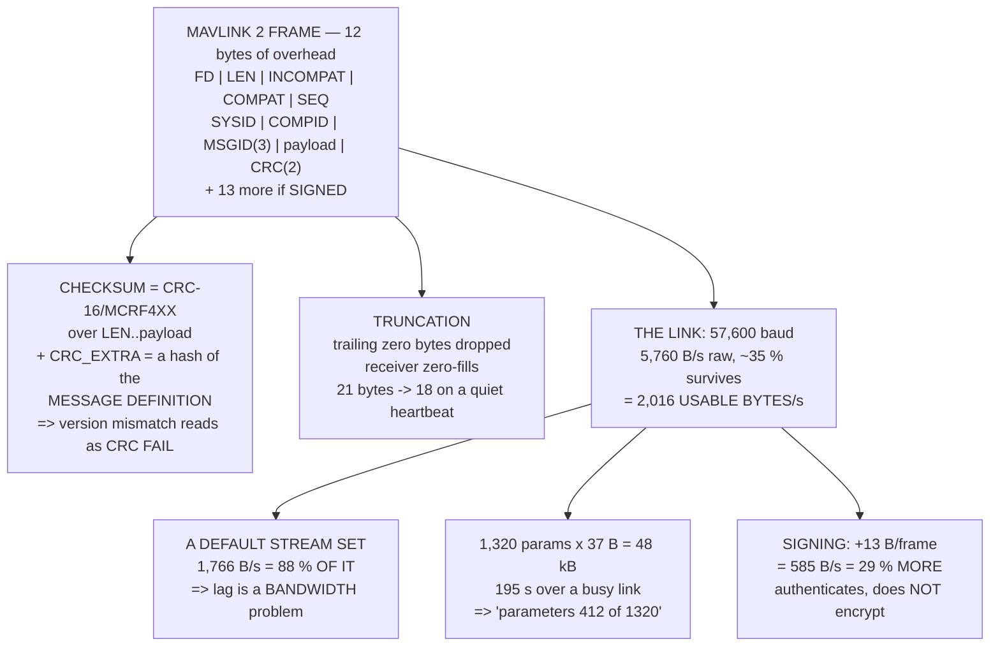

# 08.05 MAVLink: the protocol of drones

<!-- glance:start -->
<!-- generated by tools/build.py from curriculum/syllabus.yaml — edit the syllabus, not this block -->

| | |
|---|---|
| **Track** | Main path |
| **Difficulty** | Intermediate |
| **Time** | 1 h 30 min |
| **Hardware** | none |
| **Software** | python, pymavlink |
| **Prerequisites** | [08.04 Flashing firmware and the parameter system](08.04-firmware-and-parameters.md) |
| **Skip if** | You can read a MAVLink frame by hand and write Python that connects, reads a heartbeat and requests a data stream. |

<!-- glance:end -->

## What you will learn

- A MAVLink 2 frame **byte by byte**, built and verified from scratch
- Why the `CRC_EXTRA` byte means a **protocol mismatch is reported as a CRC failure** rather than
  as garbage data
- How MAVLink 2's **trailing-zero truncation** pays for its larger header
- That a default stream set uses **88 % of a 57,600 baud link** — and that telemetry lag is
  almost always a bandwidth problem
- Why the parameter download that sticks at "412 of 1,320" is **arithmetic**, not a fault
- `COMMAND_LONG`, `COMMAND_ACK` and the retry rule that makes commands **idempotent**
- What signing costs (13 bytes a frame, 29 % of the link) and what it does *not* do

## Why it matters

Everything you have done with the aircraft so far went over MAVLink. Every parameter read in
08.04, every calibration in 05.03, every log download, every mode change, and — in module 15 —
every command your own code will send. It is the one protocol in this course you cannot work
around.

Most people never look inside it, and that is defensible right up to the first time something is
wrong. Then the symptoms are these: the map lags the aircraft by three seconds, the parameter
download sticks at a number and never finishes, a command appears to be ignored, the ground
station says "no heartbeat" on a link whose radios are both blinking happily. Not one of those is
diagnosable from the outside, and every one of them is obvious once you can count bytes.

The counting is the lesson. A 57,600 baud radio gives you about **2,000 usable bytes per
second**, and a default ground-station stream set asks for 1,766. That is 88 % of the link before
you have done anything, and it explains the lag, the stuck download and half the "radio problems"
in this hobby in one number.

And because the protocol is small, you can build it. Forty lines of Python produce a frame that a
real autopilot will accept, and the same forty lines let you verify that a byte you flipped is
caught.

## Prerequisites

<!-- prereqs:start -->
## Prerequisites

You need these first:

- [08.04 Flashing firmware and the parameter system](08.04-firmware-and-parameters.md)

### Optional prerequisite links

None.

Check your readiness: `python course.py why 08.05`
<!-- prereqs:end -->

## Concept

MAVLink is a framing protocol for small, frequent messages over an unreliable byte stream. That
sentence contains all of its design decisions.

**Small**: the header is ten bytes and the payloads are tens of bytes, because the link is a
57,600 baud radio and not an Ethernet cable.

**Frequent**: there is no acknowledgement for telemetry. `ATTITUDE` arrives ten times a second,
and if one is lost the next is 100 ms away. Retrying would cost more than it is worth.

**Unreliable byte stream**: so every frame starts with a magic byte you can hunt for, carries its
own length, and ends with a checksum. A parser that loses synchronisation re-finds it by scanning
for `0xFD`.

Two things are layered on top. **Commands** are the exception to "no acknowledgement" — they are
one-shot, consequential, and answered with an explicit result code. And **signing** is an
optional 13-byte suffix that authenticates a frame, which matters because the default protocol
has no notion of who is talking.

The thing to hold onto is that MAVLink is a *budget*. Every message you enable costs bytes per
second forever, on a link that has about two thousand of them.

## Technical explanation

### Level 1 — the frame

A MAVLink 2 frame, in order:

| field | bytes | what it is |
|---|---|---|
| `STX` | 1 | `0xFD`. (`0xFE` is v1.) |
| `LEN` | 1 | payload length *after* truncation |
| `INCOMPAT_FLAGS` | 1 | bit 0 = signed. A node that does not understand a bit here **must drop the frame** |
| `COMPAT_FLAGS` | 1 | flags a node may safely ignore |
| `SEQ` | 1 | wraps at 256. **Gaps in it are your packet loss** |
| `SYSID` | 1 | which vehicle |
| `COMPID` | 1 | which component on it |
| `MSGID` | 3 | 24 bits — 16.7 million messages, against v1's 256 |
| payload | `LEN` | the fields, little-endian |
| checksum | 2 | CRC-16/MCRF4XX over everything from `LEN`, plus `CRC_EXTRA` |
| signature | 13 | only if `INCOMPAT_FLAGS` bit 0 is set |

A `HEARTBEAT` — message 0, nine bytes of payload — is 21 bytes on the wire:

```text
fd 09 00 00 2a 01 01 00 00 00 | 00 00 00 00 02 03 51 03 03 | 16 9d
```

### Level 2 — `CRC_EXTRA`, which is the clever part

The checksum is CRC-16/MCRF4XX, and you can verify any implementation against the standard test
vector: the CRC of `"123456789"` is `0x6F91`. The code in this lesson checks exactly that before
doing anything else, because a subtly wrong checksum produces frames that look perfect and are
rejected by every real autopilot, with nothing to read.

After checksumming the frame, MAVLink folds in **one more byte**: `CRC_EXTRA`, a hash of the
*message definition* — its field names, types and order. Two nodes built from different versions
of the same message therefore produce different checksums and simply cannot talk.

That is deliberate, and it is the best idea in the protocol. **A definition mismatch is reported
as a CRC failure rather than as plausible-looking wrong data.** A ground station built against an
older message set does not show you a subtly mis-parsed altitude; it shows you nothing, which is
the failure mode you can actually debug.

### Level 3 — truncation, and why v2's bigger header is free

MAVLink 2 **drops trailing zero bytes** from the payload and the receiver zero-fills. The same
`HEARTBEAT`, from a vehicle that has not booted far enough to report a status:

```text
fd 06 00 00 2b 01 01 00 00 00 | 00 00 00 00 02 03 | bf a7
```

Eighteen bytes instead of twenty-one, and it decodes to the same six fields. On messages with
empty or zero fields — which is most of them, most of the time — this is free compression, and it
is why v2's two extra header bytes and one extra `MSGID` byte do not cost what they look like.

### Level 4 — the budget, which is the real constraint

The SiK radio runs at 57,600 baud: 5,760 bytes per second of raw serial. After the air protocol,
framing and retries, about **35 % of that survives — call it 2,016 usable bytes per second.**

Now a fairly ordinary ground-station stream set:

| message | on the wire | Hz | B/s |
|---|---|---|---|
| `ATTITUDE` | 40 | 10 | 400 |
| `RAW_IMU` | 38 | 10 | 380 |
| `RC_CHANNELS` | 54 | 5 | 270 |
| `GLOBAL_POSITION_INT` | 40 | 5 | 200 |
| `SERVO_OUTPUT_RAW` | 33 | 5 | 165 |
| `VFR_HUD` | 32 | 4 | 128 |
| `SYS_STATUS` | 43 | 2 | 86 |
| `EKF_STATUS_REPORT` | 34 | 2 | 68 |
| `BATTERY_STATUS` | 48 | 1 | 48 |
| `HEARTBEAT` | 21 | 1 | 21 |
| **total** | | | **1,766** |

**88 % of the link.** Add one more 10 Hz message and you are over — and the symptom is not an
error. The radio's buffer fills, so every message arrives late and increasingly so, and the map
lags the aircraft by seconds. **Telemetry latency is almost always a bandwidth problem, not a
radio problem.**

Over USB the same stream is 15 % of the link, which is why everything feels fine on the bench.

And the parameter download. 08.04 counted about 1,320 parameters; each arrives as a `PARAM_VALUE`
at 37 bytes on the wire, so the whole tree is **48 kB**:

| link | bytes/s | seconds |
|---|---|---|
| SiK, sharing with the stream above | 250 | **195** |
| SiK, idle | 2,016 | 24 |
| USB at 115,200 | 11,520 | 4.2 |
| USB at 921,600 | 92,160 | 0.5 |

Three and a quarter minutes over a busy link, and most ground stations time out and retry long
before then. That is the "parameters: 412 of 1,320" that sticks forever. **The fix is to turn the
stream rates down, not to reconnect.**

## Diagram



## Code

Build MAVLink 2 from the bytes up: verify the checksum against a published test vector, encode
and decode a `HEARTBEAT`, demonstrate truncation, corrupt a frame and watch it be rejected, then
budget a real stream set and a parameter download against a 57,600 baud link.

```python
"""08.05 - MAVLink 2 from the bytes up: frame it, check it, and budget it."""
import struct

STX2 = 0xFD
STX1 = 0xFE
LINK_BPS = 57600          # the SiK radio's serial rate (09.04)
LINK_EFFICIENCY = 0.35    # air protocol, framing, retries: measured, not ideal
TOTAL_PARAMS = 1320       # 08.04

# msgid, name, CRC_EXTRA, payload bytes, the struct format, field names
MSGS = {
    0: ("HEARTBEAT", 50, "<IBBBBB",
        ["custom_mode", "type", "autopilot", "base_mode", "system_status",
         "mavlink_version"]),
    30: ("ATTITUDE", 39, "<Iffffff",
         ["time_boot_ms", "roll", "pitch", "yaw", "rollspeed", "pitchspeed",
          "yawspeed"]),
    33: ("GLOBAL_POSITION_INT", 104, "<IiiiihhhH",
         ["time_boot_ms", "lat", "lon", "alt", "relative_alt", "vx", "vy",
          "vz", "hdg"]),
}

# what a ground station asks for by default, and what it costs
STREAM = [
    ("HEARTBEAT", 9, 1.0, "the link is alive (09.03)"),
    ("SYS_STATUS", 31, 2.0, "battery, sensor health, errors"),
    ("ATTITUDE", 28, 10.0, "the artificial horizon"),
    ("GLOBAL_POSITION_INT", 28, 5.0, "the map"),
    ("VFR_HUD", 20, 4.0, "speed, altitude, climb, throttle"),
    ("RC_CHANNELS", 42, 5.0, "stick positions"),
    ("SERVO_OUTPUT_RAW", 21, 5.0, "07.06's RCOU, live"),
    ("RAW_IMU", 26, 10.0, "vibration, live"),
    ("EKF_STATUS_REPORT", 22, 2.0, "06.06's ratios, live"),
    ("BATTERY_STATUS", 36, 1.0, "03.06's failsafe inputs"),
]

V2_OVERHEAD = 12          # 10 header + 2 checksum
V1_OVERHEAD = 8           # 6 header + 2 checksum
SIG_OVERHEAD = 13         # the optional signature block


def crc_accumulate(b, crc):
    """MAVLink's CRC-16/MCRF4XX, one byte at a time. Straight from the spec."""
    tmp = b ^ (crc & 0xFF)
    tmp = (tmp ^ (tmp << 4)) & 0xFF
    return ((crc >> 8) ^ (tmp << 8) ^ (tmp << 3) ^ (tmp >> 4)) & 0xFFFF


def crc16(data, crc=0xFFFF):
    for b in data:
        crc = crc_accumulate(b, crc)
    return crc


def truncate(payload):
    """MAVLink 2 drops trailing zero bytes. This is where v2 gets cheaper."""
    end = len(payload)
    while end > 1 and payload[end - 1] == 0:
        end -= 1
    return payload[:end]


def encode_v2(msgid, payload, seq=0, sysid=1, compid=1, signed=False):
    """Build one MAVLink 2 frame, checksum and all."""
    name, crc_extra, _, _ = MSGS[msgid]
    body = truncate(payload)
    head = struct.pack("<BBBBBB", len(body), 0x01 if signed else 0x00, 0,
                       seq, sysid, compid)
    head += bytes([msgid & 0xFF, (msgid >> 8) & 0xFF, (msgid >> 16) & 0xFF])
    crc = crc16(head + body)
    crc = crc_accumulate(crc_extra, crc)
    return bytes([STX2]) + head + body + struct.pack("<H", crc)


def decode_v2(frame):
    """Parse one frame and verify it. Returns (name, fields) or raises."""
    if frame[0] != STX2:
        raise ValueError(f"not a MAVLink 2 frame: 0x{frame[0]:02x}")
    ln, incompat, compat, seq, sysid, compid = struct.unpack("<BBBBBB",
                                                             frame[1:7])
    msgid = frame[7] | (frame[8] << 8) | (frame[9] << 16)
    body = frame[10:10 + ln]
    got = struct.unpack("<H", frame[10 + ln:12 + ln])[0]
    if msgid not in MSGS:
        raise ValueError(f"unknown msgid {msgid}")
    name, crc_extra, fmt, fields = MSGS[msgid]
    crc = crc16(frame[1:10 + ln])
    crc = crc_accumulate(crc_extra, crc)
    if crc != got:
        raise ValueError(f"CRC mismatch: computed {crc:#06x}, frame {got:#06x}")
    full = body + bytes(struct.calcsize(fmt) - len(body))
    return name, dict(zip(fields, struct.unpack(fmt, full))), seq, sysid


def bar(t):
    print("\n" + "=" * 70)
    print(t)
    print("=" * 70)


if __name__ == "__main__":
    bar("1. THE CHECKSUM, VERIFIED AGAINST SOMETHING INDEPENDENT")
    check = crc16(b"123456789")
    print(f"  MAVLink uses CRC-16/MCRF4XX. The standard test vector for")
    print(f"  that algorithm is the ASCII string '123456789', and the")
    print(f"  published answer is 0x6F91.")
    print(f"  ours: {check:#06x}   "
          f"{'MATCHES' if check == 0x6F91 else 'DOES NOT MATCH'}")
    print("  THAT ONE LINE IS WHY THE REST OF THIS FILE CAN BE TRUSTED.")
    print("  A checksum implementation that is subtly wrong produces")
    print("  frames that look perfect and are rejected by every real")
    print("  autopilot, and you cannot tell by reading them.")
    print("\n  AND THE CRC_EXTRA BYTE, which is the clever part. After")
    print("  checksumming the frame, MAVLink folds in ONE MORE BYTE that")
    print("  is a hash of the MESSAGE DEFINITION -- its field names,")
    print("  types and order. So two nodes built from different versions")
    print("  of the same message definition produce different checksums")
    print("  and simply cannot talk. A PROTOCOL MISMATCH IS REPORTED AS")
    print("  A CRC FAILURE RATHER THAN AS GARBAGE DATA, which is the")
    print("  whole design intent.")

    bar("2. A HEARTBEAT, BYTE BY BYTE")
    payload = struct.pack("<IBBBBB", 0, 2, 3, 81, 3, 3)
    frame = encode_v2(0, payload, seq=42, sysid=1, compid=1)
    print(f"  HEARTBEAT, {len(frame)} bytes on the wire:")
    print("  " + " ".join(f"{b:02x}" for b in frame))
    labels = [("STX", 1, "0xFD = MAVLink 2 (0xFE would be v1)"),
              ("LEN", 1, "payload length AFTER truncation"),
              ("INCOMPAT", 1, "bit 0 = signed. A node that does not "
               "understand a bit here MUST drop the frame"),
              ("COMPAT", 1, "flags a node may safely ignore"),
              ("SEQ", 1, "wraps at 256. GAPS IN IT ARE YOUR PACKET LOSS"),
              ("SYSID", 1, "which vehicle"),
              ("COMPID", 1, "which component on it"),
              ("MSGID", 3, "24 bits: 16.7 M messages, against v1's 256"),
              ("PAYLOAD", len(truncate(payload)), "the fields"),
              ("CRC", 2, "over everything above, plus CRC_EXTRA")]
    off = 0
    for n, w, why in labels:
        chunk = " ".join(f"{b:02x}" for b in frame[off:off + w])
        print(f"  {n:9s} {chunk:14s} {why}")
        off += w
    name, fields, seq, sysid = decode_v2(frame)
    print(f"\n  Decoded: {name} from system {sysid}, seq {seq}")
    for k, v in fields.items():
        print(f"    {k:18s} {v}")
    print("  THE PAYLOAD IS THE FULL 9 BYTES HERE, because the last")
    print("  field is non-zero. Now a frame whose tail IS zero -- a")
    print("  vehicle that has not booted far enough to report a status:")
    quiet = struct.pack("<IBBBBB", 0, 2, 3, 0, 0, 0)
    qframe = encode_v2(0, quiet, seq=43)
    print("  " + " ".join(f"{b:02x}" for b in qframe))
    print(f"  {len(qframe)} bytes instead of {len(frame)}:"
          f" the payload truncated from 9 to")
    print(f"  {len(truncate(quiet))}, because MAVLINK 2 DROPS TRAILING"
          f" ZEROS and the receiver")
    print("  zero-fills. It still decodes to the same six fields:")
    qn, qf, _, _ = decode_v2(qframe)
    print(f"    {qn}: " + ", ".join(f"{k}={v}" for k, v in qf.items()))
    print("  FREE COMPRESSION ON EXACTLY THE MESSAGES WITH EMPTY FIELDS,")
    print("  which is why v2's larger header does not cost what it looks")
    print("  like it costs. On a real stream it is worth a few per cent.")

    bar("3. WHAT A CORRUPTED FRAME LOOKS LIKE")
    bad = bytearray(frame)
    bad[12] ^= 0x01                      # flip one bit in the payload
    try:
        decode_v2(bytes(bad))
        print("  accepted -- WHICH WOULD BE A BUG")
    except ValueError as e:
        print(f"  one bit flipped in the payload -> {e}")
    bad2 = bytearray(frame)
    bad2[5] = (bad2[5] + 1) & 0xFF       # SYSID, in the header
    try:
        decode_v2(bytes(bad2))
        print("  accepted -- WHICH WOULD ALSO BE A BUG")
    except ValueError as e:
        print(f"  one byte of the header changed -> {e}")
    print("  EVERY BYTE FROM LEN ONWARDS IS UNDER THE CHECKSUM. 08.02")
    print("  said a UART without DMA drops bytes; this is what the other")
    print("  end sees when it does. Not wrong data -- NO data, because")
    print("  the frame is discarded and the parser then has to re-find")
    print("  the next 0xFD, which costs it the following message too.")

    bar("4. THE BANDWIDTH BUDGET, WHICH IS THE REAL CONSTRAINT")
    usable = LINK_BPS / 10.0 * LINK_EFFICIENCY
    print(f"  The SiK radio runs at {LINK_BPS:,} baud, which is"
          f" {LINK_BPS / 10:,.0f} bytes/s")
    print(f"  of raw serial. After the air protocol, framing and retries,")
    print(f"  call it {LINK_EFFICIENCY * 100:.0f} %:"
          f" {usable:.0f} BYTES PER SECOND USABLE.")
    print(f"  {'message':22s} {'payload':>8s} {'+ovh':>6s} {'Hz':>6s}"
          f" {'B/s':>8s}  why you asked for it")
    total = 0.0
    for n, pl, hz, why in STREAM:
        bps = (pl + V2_OVERHEAD) * hz
        total += bps
        print(f"  {n:22s} {pl:7d}B {pl + V2_OVERHEAD:5d}B {hz:6.1f}"
              f" {bps:7.0f}   {why}")
    print(f"  {'TOTAL':22s} {'':8s} {'':6s} {'':6s} {total:7.0f}")
    print(f"  That is {total / usable * 100:.0f} % OF THE LINK for a"
          f" default-ish stream set.")
    print("  ADD ONE MORE 10 Hz MESSAGE AND YOU ARE OVER. The symptom is")
    print("  not an error -- it is the radio's buffer filling, so every")
    print("  message arrives LATE and increasingly so, and the map lags")
    print("  the aircraft by seconds. TELEMETRY LATENCY IS ALMOST ALWAYS")
    print("  A BANDWIDTH PROBLEM, not a radio problem.")
    print(f"\n  {'if you halve the rates':28s} {total / 2:6.0f} B/s"
          f" = {total / 2 / usable * 100:3.0f} %")
    print(f"  {'over USB (real 115200+)':28s} {total:6.0f} B/s"
          f" = {total / (115200 / 10) * 100:3.0f} %")
    print("  WHICH IS WHY EVERYTHING FEELS FINE ON THE BENCH.")

    bar("5. THE PARAMETER DOWNLOAD, PRICED")
    pv = 25 + V2_OVERHEAD
    total_bytes = TOTAL_PARAMS * pv
    print(f"  08.04 counted about {TOTAL_PARAMS:,} parameters. Each one")
    print(f"  arrives as a PARAM_VALUE: 25 bytes of payload,"
          f" {pv} on the wire.")
    print(f"  {'link':26s} {'bytes/s':>9s} {'seconds':>9s}")
    for n, bps in (("SiK telemetry, shared", usable - total),
                   ("SiK telemetry, idle", usable),
                   ("USB at 115200", 115200 / 10),
                   ("USB at 921600", 921600 / 10)):
        if bps <= 0:
            print(f"  {n:26s} {'NEGATIVE':>9s} {'never':>9s}")
            continue
        print(f"  {n:26s} {bps:9.0f} {total_bytes / bps:9.1f}")
    print(f"  {total_bytes / 1024:.0f} kB of parameters. OVER A BUSY"
          f" TELEMETRY LINK THAT IS OVER")
    print("  THREE MINUTES, because section 4's stream set has already")
    print("  taken 88 % of the link -- and most ground stations time out")
    print("  and retry long before then. THAT is the 'parameters: 412 of")
    print("  1320' that sticks forever and never finishes. THE FIX IS TO")
    print("  TURN THE STREAM RATES DOWN, not to reconnect.")

    bar("6. COMMANDS, ACKS, AND SIGNING")
    print("  Telemetry is a STREAM: send it and forget it, because the")
    print("  next one is 100 ms away. A COMMAND is not. COMMAND_LONG")
    print("  carries a command id and seven float parameters, and it MUST")
    print("  be answered by a COMMAND_ACK with a result code:")
    acks = [("ACCEPTED", 0, "done, or started"),
            ("TEMPORARILY_REJECTED", 1, "right command, wrong moment"),
            ("DENIED", 2, "not allowed in this state"),
            ("UNSUPPORTED", 3, "this vehicle does not implement it"),
            ("FAILED", 4, "tried and could not"),
            ("IN_PROGRESS", 5, "working; expect another ACK")]
    print(f"  {'MAV_RESULT':24s} {'code':>5s}  means")
    for n, c, why in acks:
        print(f"  {n:24s} {c:5d}  {why}")
    print("  THE RETRY RULE: resend the command until an ACK arrives, and")
    print("  make the command IDEMPOTENT so a duplicate is harmless. An")
    print("  arm command sent twice must arm once. A 'take off 10 m' sent")
    print("  twice must not climb 20.")
    print("\n  AND SIGNING, which most builds leave off and should not.")
    sign = [
        ("what it is", "HMAC-SHA-256 over the frame, truncated to 48 bits,"),
        ("", "plus a 6-byte timestamp and a link id"),
        ("what it stops", "an attacker injecting MAVLink into your link"),
        ("what it costs", f"{SIG_OVERHEAD} bytes per frame"),
        ("", f"= {SIG_OVERHEAD * sum(s[2] for s in STREAM):.0f} B/s on the"
         f" stream above"),
        ("what it does NOT do", "encrypt. The contents are still readable"),
        ("the catch", "both ends need the same 32-byte key, and the"),
        ("", "timestamp must be monotonic across reboots"),
    ]
    for a, b in sign:
        print(f"  {a:22s} {b}")
    sig_bps = SIG_OVERHEAD * sum(s[2] for s in STREAM)
    print(f"  Signing the default stream costs {sig_bps:.0f} B/s, which is")
    print(f"  {sig_bps / usable * 100:.0f} % of the link ON TOP OF the"
          f" {total / usable * 100:.0f} % already used.")
    print("  ON A SHARED 57600 LINK THAT IS THE DIFFERENCE BETWEEN")
    print("  WORKING AND NOT. Sign the link, then turn the stream rates")
    print("  down to pay for it -- and 09.05 has the argument for why")
    print("  the trade is worth making.")
```

Output:

```text

======================================================================
1. THE CHECKSUM, VERIFIED AGAINST SOMETHING INDEPENDENT
======================================================================
  MAVLink uses CRC-16/MCRF4XX. The standard test vector for
  that algorithm is the ASCII string '123456789', and the
  published answer is 0x6F91.
  ours: 0x6f91   MATCHES
  THAT ONE LINE IS WHY THE REST OF THIS FILE CAN BE TRUSTED.
  A checksum implementation that is subtly wrong produces
  frames that look perfect and are rejected by every real
  autopilot, and you cannot tell by reading them.

  AND THE CRC_EXTRA BYTE, which is the clever part. After
  checksumming the frame, MAVLink folds in ONE MORE BYTE that
  is a hash of the MESSAGE DEFINITION -- its field names,
  types and order. So two nodes built from different versions
  of the same message definition produce different checksums
  and simply cannot talk. A PROTOCOL MISMATCH IS REPORTED AS
  A CRC FAILURE RATHER THAN AS GARBAGE DATA, which is the
  whole design intent.

======================================================================
2. A HEARTBEAT, BYTE BY BYTE
======================================================================
  HEARTBEAT, 21 bytes on the wire:
  fd 09 00 00 2a 01 01 00 00 00 00 00 00 00 02 03 51 03 03 16 9d
  STX       fd             0xFD = MAVLink 2 (0xFE would be v1)
  LEN       09             payload length AFTER truncation
  INCOMPAT  00             bit 0 = signed. A node that does not understand a bit here MUST drop the frame
  COMPAT    00             flags a node may safely ignore
  SEQ       2a             wraps at 256. GAPS IN IT ARE YOUR PACKET LOSS
  SYSID     01             which vehicle
  COMPID    01             which component on it
  MSGID     00 00 00       24 bits: 16.7 M messages, against v1's 256
  PAYLOAD   00 00 00 00 02 03 51 03 03 the fields
  CRC       16 9d          over everything above, plus CRC_EXTRA

  Decoded: HEARTBEAT from system 1, seq 42
    custom_mode        0
    type               2
    autopilot          3
    base_mode          81
    system_status      3
    mavlink_version    3
  THE PAYLOAD IS THE FULL 9 BYTES HERE, because the last
  field is non-zero. Now a frame whose tail IS zero -- a
  vehicle that has not booted far enough to report a status:
  fd 06 00 00 2b 01 01 00 00 00 00 00 00 00 02 03 bf a7
  18 bytes instead of 21: the payload truncated from 9 to
  6, because MAVLINK 2 DROPS TRAILING ZEROS and the receiver
  zero-fills. It still decodes to the same six fields:
    HEARTBEAT: custom_mode=0, type=2, autopilot=3, base_mode=0, system_status=0, mavlink_version=0
  FREE COMPRESSION ON EXACTLY THE MESSAGES WITH EMPTY FIELDS,
  which is why v2's larger header does not cost what it looks
  like it costs. On a real stream it is worth a few per cent.

======================================================================
3. WHAT A CORRUPTED FRAME LOOKS LIKE
======================================================================
  one bit flipped in the payload -> CRC mismatch: computed 0x1ca9, frame 0x9d16
  one byte of the header changed -> CRC mismatch: computed 0x4568, frame 0x9d16
  EVERY BYTE FROM LEN ONWARDS IS UNDER THE CHECKSUM. 08.02
  said a UART without DMA drops bytes; this is what the other
  end sees when it does. Not wrong data -- NO data, because
  the frame is discarded and the parser then has to re-find
  the next 0xFD, which costs it the following message too.

======================================================================
4. THE BANDWIDTH BUDGET, WHICH IS THE REAL CONSTRAINT
======================================================================
  The SiK radio runs at 57,600 baud, which is 5,760 bytes/s
  of raw serial. After the air protocol, framing and retries,
  call it 35 %: 2016 BYTES PER SECOND USABLE.
  message                 payload   +ovh     Hz      B/s  why you asked for it
  HEARTBEAT                    9B    21B    1.0      21   the link is alive (09.03)
  SYS_STATUS                  31B    43B    2.0      86   battery, sensor health, errors
  ATTITUDE                    28B    40B   10.0     400   the artificial horizon
  GLOBAL_POSITION_INT         28B    40B    5.0     200   the map
  VFR_HUD                     20B    32B    4.0     128   speed, altitude, climb, throttle
  RC_CHANNELS                 42B    54B    5.0     270   stick positions
  SERVO_OUTPUT_RAW            21B    33B    5.0     165   07.06's RCOU, live
  RAW_IMU                     26B    38B   10.0     380   vibration, live
  EKF_STATUS_REPORT           22B    34B    2.0      68   06.06's ratios, live
  BATTERY_STATUS              36B    48B    1.0      48   03.06's failsafe inputs
  TOTAL                                            1766
  That is 88 % OF THE LINK for a default-ish stream set.
  ADD ONE MORE 10 Hz MESSAGE AND YOU ARE OVER. The symptom is
  not an error -- it is the radio's buffer filling, so every
  message arrives LATE and increasingly so, and the map lags
  the aircraft by seconds. TELEMETRY LATENCY IS ALMOST ALWAYS
  A BANDWIDTH PROBLEM, not a radio problem.

  if you halve the rates          883 B/s =  44 %
  over USB (real 115200+)        1766 B/s =  15 %
  WHICH IS WHY EVERYTHING FEELS FINE ON THE BENCH.

======================================================================
5. THE PARAMETER DOWNLOAD, PRICED
======================================================================
  08.04 counted about 1,320 parameters. Each one
  arrives as a PARAM_VALUE: 25 bytes of payload, 37 on the wire.
  link                         bytes/s   seconds
  SiK telemetry, shared            250     195.4
  SiK telemetry, idle             2016      24.2
  USB at 115200                  11520       4.2
  USB at 921600                  92160       0.5
  48 kB of parameters. OVER A BUSY TELEMETRY LINK THAT IS OVER
  THREE MINUTES, because section 4's stream set has already
  taken 88 % of the link -- and most ground stations time out
  and retry long before then. THAT is the 'parameters: 412 of
  1320' that sticks forever and never finishes. THE FIX IS TO
  TURN THE STREAM RATES DOWN, not to reconnect.

======================================================================
6. COMMANDS, ACKS, AND SIGNING
======================================================================
  Telemetry is a STREAM: send it and forget it, because the
  next one is 100 ms away. A COMMAND is not. COMMAND_LONG
  carries a command id and seven float parameters, and it MUST
  be answered by a COMMAND_ACK with a result code:
  MAV_RESULT                code  means
  ACCEPTED                     0  done, or started
  TEMPORARILY_REJECTED         1  right command, wrong moment
  DENIED                       2  not allowed in this state
  UNSUPPORTED                  3  this vehicle does not implement it
  FAILED                       4  tried and could not
  IN_PROGRESS                  5  working; expect another ACK
  THE RETRY RULE: resend the command until an ACK arrives, and
  make the command IDEMPOTENT so a duplicate is harmless. An
  arm command sent twice must arm once. A 'take off 10 m' sent
  twice must not climb 20.

  AND SIGNING, which most builds leave off and should not.
  what it is             HMAC-SHA-256 over the frame, truncated to 48 bits,
                         plus a 6-byte timestamp and a link id
  what it stops          an attacker injecting MAVLink into your link
  what it costs          13 bytes per frame
                         = 585 B/s on the stream above
  what it does NOT do    encrypt. The contents are still readable
  the catch              both ends need the same 32-byte key, and the
                         timestamp must be monotonic across reboots
  Signing the default stream costs 585 B/s, which is
  29 % of the link ON TOP OF the 88 % already used.
  ON A SHARED 57600 LINK THAT IS THE DIFFERENCE BETWEEN
  WORKING AND NOT. Sign the link, then turn the stream rates
  down to pay for it -- and 09.05 has the argument for why
  the trade is worth making.
```

## Exercise

### Exercise 08.05-E1 — Decode a frame by hand `[analysis]`

Take the `HEARTBEAT` hex in Level 1 and, on paper, identify every field without running the code.
Then answer three questions from the bytes alone: which MAVLink version is it, what is the
sequence number in decimal, and how many payload bytes does it carry. Finally, run the decoder
and check yourself. This is the skill the `skip_if` is asking for.

### Exercise 08.05-E2 — Talk to a real autopilot `[hardware]`

Install `pymavlink` and connect to your board over USB. Print the first ten messages that arrive,
with their names, sizes and the sender's system id. Then request a specific stream with
`MAV_CMD_SET_MESSAGE_INTERVAL` and confirm the rate changed by timing the arrivals. Finally read
one parameter and write it back to the same value, and confirm you get a `PARAM_VALUE` echo.

### Exercise 08.05-E3 — Budget your own stream set `[analysis]`

Take the stream table and build the set *you* actually want in flight. Add anything the table
omits — `ATTITUDE_QUATERNION`, `SCALED_PRESSURE`, `GPS_RAW_INT`, `MISSION_CURRENT`. Compute the
total. If it exceeds 80 % of 2,016 B/s, cut it until it does not, and write one sentence per cut
saying what you gave up. Then compute the same set at the 115,200 baud you would use over USB.

### Exercise 08.05-E4 — Make a command idempotent `[analysis]`

Write the retry logic for a `COMMAND_LONG` in pseudocode: send, wait for `COMMAND_ACK`, resend on
timeout, give up after N attempts, and handle each of the six `MAV_RESULT` codes distinctly. Then
identify two commands where a duplicate is harmless and two where it is not, and say how you
would make the dangerous two safe.

## Expected result

**08.05-E1**: `0xFD` so MAVLink 2; `SEQ` is `0x2a` = 42; `LEN` is `0x09` = 9 payload bytes, for a
total of 21 on the wire. If you counted the `MSGID` as one byte you got the payload offset wrong
by two — that is the v1 habit, and it is the commonest hand-decoding error.

**08.05-E2**: expect `HEARTBEAT`, `ATTITUDE`, `SYS_STATUS`, `GLOBAL_POSITION_INT` and friends,
mostly from system 1, component 1. A board with no GNSS lock still sends `GLOBAL_POSITION_INT`
with zeros — which, thanks to truncation, is a notably short frame.

**08.05-E3**: almost every honest wish-list exceeds 2,016 B/s. The usual cuts are `RAW_IMU` (you
want it in the log, not on the link) and `RC_CHANNELS` (you are holding the transmitter). Halving
`ATTITUDE` from 10 Hz to 5 Hz frees 200 B/s on its own and costs you nothing you can see on a
screen.

**08.05-E4**: `SET_MODE` and `MAV_CMD_DO_SET_HOME` are naturally idempotent — sending them twice
produces the same state. `MAV_CMD_NAV_TAKEOFF` and anything relative (`DO_CHANGE_ALTITUDE` with a
delta) are not. The fix is to make every command **absolute** rather than relative, and to carry a
command sequence number your own code checks.

## Troubleshooting

**"No heartbeat" with both radios blinking.** The radios have a link; MAVLink does not. Check the
baud rate on both `SERIALn_BAUD` and the radio's own `ATS`, check `SERIALn_PROTOCOL` is 2
(MAVLink 2), and check that something else is not already using that port.

**The map lags by seconds and gets worse over the flight.** Section 4. Total your stream rates.
Over 2,000 B/s on a 57,600 link and the buffer fills monotonically — the lag grows because the
queue does, and it never recovers until you stop transmitting.

**The parameter download sticks at a number.** Same cause. Turn the stream rates to near zero,
download, then turn them back up. Or download over USB, which takes four seconds.

**Everything works over USB and fails on telemetry.** That is the diagnosis, not the mystery. The
stream set that is 15 % of a USB link is 88 % of a radio link.

**`COMMAND_ACK` says `TEMPORARILY_REJECTED`.** The command was understood and the vehicle is not
in a state to do it — usually disarmed, or without a position estimate. Retry after fixing the
state, not faster.

**CRC failures on every frame from one device.** A `CRC_EXTRA` mismatch: the two ends were built
from different message definitions. Check the dialect and the MAVLink version on both sides. This
is the failure mode `CRC_EXTRA` was designed to produce, and it is telling you something true.

## Common mistakes

- **Enabling every stream because they look useful.** Each one costs bytes per second forever.
  `RAW_IMU` at 10 Hz is 380 B/s of a 2,016 B/s link, and you wanted it in the log anyway.
- **Blaming the radio for lag.** Count the bytes first. The radio is usually innocent.
- **Reconnecting to fix a stuck parameter download.** It restarts the download against the same
  saturated link. Cut the stream rates instead.
- **Writing a MAVLink parser without `CRC_EXTRA`.** Your frames will be silently rejected and you
  will have nothing to look at.
- **Treating a command like telemetry.** Commands need an ACK and a retry. Fire-and-forget works
  for `ATTITUDE` because another one is 100 ms away; there is no second arm command coming.
- **Relative commands with retries.** Send "climb 10 m" twice and you climb twenty. Make commands
  absolute.
- **Assuming signing means encryption.** It authenticates the sender. Anyone listening still reads
  everything.

## Knowledge check

<details>
<summary>What does `CRC_EXTRA` add, and why is producing a CRC failure the *desired* behaviour on
a version mismatch?</summary>

It folds a hash of the **message definition** — field names, types and order — into the checksum,
so two nodes built from different versions of the same message cannot validate each other's
frames. That is desirable because the alternative is worse: a receiver parsing a changed message
with the old layout produces plausible-looking wrong values. A CRC failure is a symptom you can
debug; a subtly wrong altitude is not.
</details>

<details>
<summary>A `HEARTBEAT` is 21 bytes on the wire but sometimes 18. What changed, and does the
receiver see different data?</summary>

MAVLink 2 **drops trailing zero bytes** from the payload. A heartbeat whose last three fields are
zero carries 6 payload bytes instead of 9. The receiver zero-fills, so it decodes to exactly the
same six fields. It is free compression on messages with empty fields, and it is how v2 pays for
its larger header.
</details>

<details>
<summary>A 57,600 baud SiK link and a stream set totalling 1,766 B/s. Why does the map lag, and
why does the lag get worse rather than staying constant?</summary>

2,016 B/s is usable and you are asking for 1,766 — 88 %. Any burst, any retry, any extra message
pushes you over, and then the radio's buffer fills faster than it drains. The lag grows because
the **queue** grows: it is not a fixed delay, it is an accumulating backlog, and it does not
recover until you stop sending.
</details>

<details>
<summary>Why does the parameter download stick at "412 of 1,320" and what is the correct fix?</summary>

1,320 parameters × 37 bytes is 48 kB. With the stream set consuming 1,766 of 2,016 B/s, about
250 B/s remain, so the download needs **195 seconds** — and most ground stations time out and
retry before then, restarting against the same saturated link. The fix is to cut the stream rates
(or use USB, where it takes four seconds), not to reconnect.
</details>

<details>
<summary>Why does telemetry need no acknowledgement while a command does?</summary>

Because telemetry is periodic and self-correcting: if one `ATTITUDE` is lost the next arrives in
100 ms, and retrying would cost more bandwidth than the message is worth. A command is one-shot
and consequential — there is no second arm request on the way — so `COMMAND_LONG` must be
answered by a `COMMAND_ACK` with a result code, and the sender must retry until it gets one.
</details>

<details>
<summary>What does MAVLink signing give you, what does it cost, and what does it explicitly not
do?</summary>

It authenticates each frame with a truncated HMAC-SHA-256 plus a timestamp and link id, which
stops an attacker injecting MAVLink into your link. It costs **13 bytes per frame** — 585 B/s on
the stream set above, 29 % of the link on top of the 88 % already used. It does **not** encrypt:
every field is still readable by anyone listening.
</details>

<details>
<summary>Why must a retried command be idempotent, and how do you make one that is not?</summary>

Because you cannot distinguish "the command was lost" from "the ACK was lost", so you will
sometimes send a command that already executed. Sending arm twice must arm once. The fix for a
relative command is to make it **absolute** — "go to 20 m", not "climb 10 m" — and to carry your
own sequence number that the receiver checks against the last one it acted on.
</details>

## Practical challenge

**Write a telemetry budget tool, and then a link monitor.**

Part one: take the stream table from the code and turn it into a script that reads your aircraft's
actual `SRn_*` parameters (or the intervals your ground station requested) and prints the
resulting bytes per second, as a percentage of a link speed you give it. Run it against your own
configuration. Most readers find they are over 80 %.

Part two: connect with `pymavlink` and watch the `SEQ` field. Every gap is a lost frame. Count
them over sixty seconds and print a loss percentage, then repeat at increasing distance from the
ground station until the loss becomes visible. You now have a measured range curve, and 09.01 will
give you the link budget to compare it against.

Keep both scripts. The first one is what you run before a flight when the map feels sluggish; the
second is what you run when someone says "the radio is bad" and you would like to know whether
that is true.

## You can skip this if

You can read a MAVLink frame by hand and write Python that connects, reads a heartbeat and
requests a data stream.

## Go deeper

- [06.06](../06-state-estimation/06.06-ekf-health-and-logs.md) (earlier): the `EKF_STATUS_REPORT`
  in the stream table, and what its numbers mean.
- [08.02](08.02-board-anatomy.md) (earlier): the DMA argument — this is what the other end sees
  when a UART drops a byte.
- [08.04](08.04-firmware-and-parameters.md) (earlier): the 1,320 parameters this lesson prices.
- [08.06](08.06-ground-stations.md) (next): the tools that speak all of this for you, and their
  stream-rate settings.
- [09.01](../09-telemetry-datalink/09.01-rf-and-link-budget.md) (later): where the 35 % link
  efficiency comes from, and the range curve to compare your measurement against.
- [09.04](../09-telemetry-datalink/09.04-telemetry-917.md) (later): the SiK radio itself, at
  917–920 MHz.
- [15.04](../15-onboard-autonomy/15.04-offboard-control.md) (later): commanding the aircraft
  from your own code, on top of everything here.
- The MAVLink 2 packet-format specification, including the signing scheme:
  https://mavlink.io/en/guide/serialization.html
- `pymavlink`, which is the library every example in this course uses:
  https://github.com/ArduPilot/pymavlink

> **Ask your teacher:** *"We budgeted a fairly ordinary stream set at 1,766 B/s against about
> 2,016 usable on a 57,600 SiK link — 88 % — and found that signing would add another 29 %. We are
> planning to sign and cut the rates to pay for it. In operational flying, how often do you see
> teams actually sign the link, and what do they give up to afford it?"*

## Progress checkpoint

Run `python course.py complete 08.05` once your budget tool runs against your own parameters and
your `SEQ` monitor reports a loss percentage. Next: [08.06](08.06-ground-stations.md) — the two
ground stations, and where every number in this lesson is a setting you can see.
