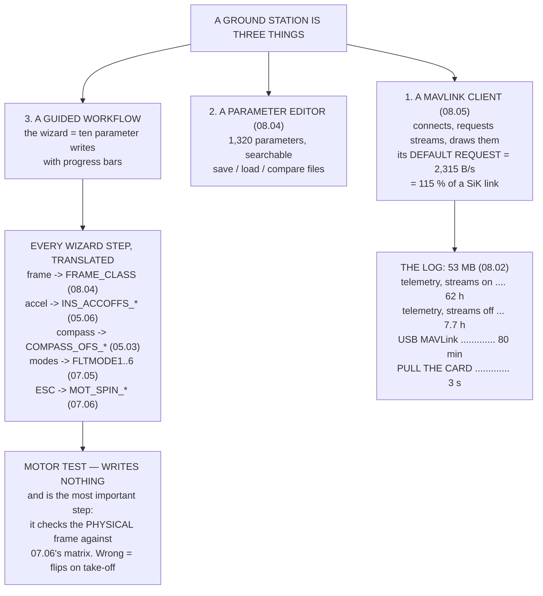

# 08.06 Ground stations: QGroundControl and Mission Planner

<!-- glance:start -->
<!-- generated by tools/build.py from curriculum/syllabus.yaml — edit the syllabus, not this block -->

| | |
|---|---|
| **Track** | Main path |
| **Difficulty** | Beginner |
| **Time** | 1 h |
| **Hardware** | First flight (Hermon core) (stage 1) |
| **Software** | qgc |
| **Prerequisites** | [08.05 MAVLink: the protocol of drones](08.05-mavlink.md) |
| **Version-sensitive** | yes — see [curriculum/versions.yaml](../curriculum/versions.yaml) |
| **Skip if** | You can do a full vehicle setup, edit parameters and pull a log in QGroundControl without a tutorial. |

<!-- glance:end -->

## What you will learn

- That the setup wizard is **a parameter editor with a nicer face** — every step, translated
- The one wizard step that writes **nothing** and matters most
- Which ground station is better at what, and why the honest answer is **install both**
- That a ground station's default stream request is **115 % of a SiK link** — more than exists
- Why downloading a log over telemetry takes **sixty hours** and pulling the card takes three
  seconds
- How to read the pre-flight screen against the numbers modules 05 and 06 produced

> **Version-sensitive.** Menu layouts, wizard step names and default stream rates change between
> releases of both ground stations, and were checked in **September 2026** against Mission
> Planner 1.3.82 and QGroundControl 4.4. The *parameters* each step writes are stable; the
> buttons are not.

## Why it matters

This is the lesson where the aircraft becomes usable, and it is deliberately the beginner lesson
of the module — because by now you already know everything in it.

That is the point. A ground station's setup wizard has about ten steps, and every one of them
writes parameters you have already met: `FRAME_CLASS` from 08.04, the accelerometer calibration
from 05.06, the compass calibration from 05.03, the flight modes from 07.05, `MOT_SPIN_MIN` from
07.06. There is nothing new in the wizard. What there is, is a **convenient order** — and the
knowledge of which parameter each step was trying to write, which is exactly what you need on the
day a step fails.

Two things in here are genuinely new, and both are arithmetic. A ground station requests a set of
telemetry streams when it connects, usually without telling you, and on a 57,600 SiK link that
request is **115 % of the available bandwidth**. And the "download log" button, over that same
link, is a sixty-hour operation on a 53 MB log — which is why the button is not the workflow, and
a card reader is.

## Prerequisites

<!-- prereqs:start -->
## Prerequisites

You need these first:

- [08.05 MAVLink: the protocol of drones](08.05-mavlink.md)

### Optional prerequisite links

None.

Check your readiness: `python course.py why 08.06`
<!-- prereqs:end -->

## Concept

A ground station is three things wearing one window.

It is a **MAVLink client**: it connects over USB or telemetry, reads the heartbeat, requests
streams, and draws what arrives. Everything 08.05 described is happening underneath, and every
number in that lesson is a setting somewhere in this one.

It is a **parameter editor**: a searchable view of the 1,320 parameters from 08.04, with the
documentation inline, plus the ability to save, load and compare files.

And it is a **guided workflow**: the wizard, the calibrations, the mission planner, the log
downloader. This is the part that looks like the product and is the thinnest layer — it is a
sequence of parameter writes with progress bars.

Understanding which of the three you are using at any moment is most of what makes a ground
station easy. When the wizard fails, you drop to the parameter editor. When the parameter editor
is confusing, you save a file and read it in a text editor. When the connection is wrong, you are
back in 08.05 counting bytes.

## Technical explanation

### Level 1 — the wizard, translated

| step | writes | and it is |
|---|---|---|
| Frame type | `FRAME_CLASS`, `FRAME_TYPE` | a **defaults file**, not just a value (08.04) |
| Accelerometer | `INS_ACCOFFS_*`, `INS_ACCSCAL_*`, `AHRS_TRIM_*` | six faces, because each axis needs +1 g **and** −1 g (05.06) |
| Compass | `COMPASS_OFS_*`, `_DIA_*`, `_ODI_*` | 31.8° → 3.8° (sphere) → 0.2° (ellipsoid) (05.03) |
| Declination | `COMPASS_DEC` | +4.6° E in Israel = 80 m of error per km (05.03) |
| Radio | `RCn_MIN/MAX/TRIM/REVERSED` | what the sticks mean, per channel (09.02) |
| Flight modes | `FLTMODE1..6`, `FLTMODE_CH` | 07.05's six-bit `RAVPvp` number, six at a time |
| Failsafes | `FS_THR_ENABLE`, `FS_GCS_ENABLE`, `BATT_FS_*` | the ladder 07.05 **derived** rather than decreed |
| Battery monitor | `BATT_MONITOR`, `BATT_VOLT_MULT`, `BATT_AMP_PERVLT` | 03.06's 15 %-low sensor, if you skip the calibration |
| ESC calibration | `MOT_PWM_TYPE`, `MOT_SPIN_ARM/_MIN/_MAX` | 07.06's floor, which costs 57 % of roll authority |
| **Motor test** | **nothing** | see below |

The motor test writes no parameters at all and is the most important step on the list. It spins
one motor at a time, in ArduPilot's numbering, so you can check the physical aircraft against
07.06's matrix: motor 1 front right, 2 back left, 3 front left, 4 back right, and the two on each
diagonal turning the same way. **Get that wrong and the aircraft flips on take-off**, and no
amount of tuning helps, because the mixer is solving for a frame that is not there.

### Level 2 — which ground station

| task | better | why |
|---|---|---|
| full parameter tree + compare | **Mission Planner** | 08.04's file-diff, built in |
| log download and graphing | **Mission Planner** | and a built-in FFT for 07.07 |
| Lua script upload | **Mission Planner** | 12.06 needs it |
| log review on Linux/macOS | **QGroundControl** | MP is Windows-first |
| running on a tablet | **QGroundControl** | the only real option in the field |
| PX4 as well as ArduPilot | **QGroundControl** | MP is ArduPilot-only |
| setup wizard, parameter search, missions, stream rates | either | both are fine |

Three wins each and four draws. **So install both.** They speak the same protocol (08.05) to the
same aircraft, there is no state to migrate between them, and the answer to "which one" is
"whichever does the thing you are doing right now".

If you must pick one for this course: Mission Planner on Windows, for the parameter-compare tool
and the built-in FFT that 07.07's workflow depends on. On Linux, macOS, or a tablet in the field:
QGroundControl, and pull logs off the card by hand.

### Level 3 — stream rates, which the ground station sets without telling you

ArduPilot groups telemetry into eight streams with their own rate parameters. A ground station
writes them on connect.

| parameter | default Hz | B/s | contains |
|---|---|---|---|
| `SR0_RC_CHAN` | 5 | 435 | `RC_CHANNELS`, `SERVO_OUTPUT_RAW` |
| `SR0_EXTRA1` | 10 | 400 | `ATTITUDE`, `SIMSTATE`, `AHRS2` |
| `SR0_POSITION` | 5 | 400 | `GLOBAL_POSITION_INT`, `LOCAL_POSITION_NED` |
| `SR0_EXTRA2` | 10 | 320 | `VFR_HUD` |
| `SR0_EXT_STAT` | 2 | 280 | `SYS_STATUS`, `POWER_STATUS`, `GPS_RAW_INT` |
| `SR0_EXTRA3` | 2 | 260 | `AHRS`, `HWSTATUS`, `WIND`, `EKF_STATUS` |
| `SR0_RAW_SENS` | 2 | 220 | `RAW_IMU`, `SCALED_PRESSURE` |
| **total** | | **2,315** | |

Against 2,016 usable bytes per second (08.05), that is **115 % of the link — more than there
is.** The radio's buffer fills, the lag grows monotonically, and the map ends up seconds behind
the aircraft.

Two cuts fix it. Drop `SR0_RAW_SENS` (you want vibration in the *log*, not on the link) and
`SR0_RC_CHAN` (you are holding the transmitter): 1,660 B/s, **82 %**. Then halve `SR0_EXTRA1`
from 10 Hz to 5 — nobody can see an artificial horizon update at 10 Hz — and you are at **72 %**,
with headroom for a parameter download and room to enable signing later.

### Level 4 — getting the log off

08.02 sized one 24-minute flight at **53 MB**, of which 72 % is the 1 kHz IMU stream 07.07's FFT
is built from.

| route | bytes/s | time |
|---|---|---|
| over telemetry, streams running | 250 | **62 hours** |
| over telemetry, streams off | 2,016 | 7.7 hours |
| over USB MAVLink at 115,200 | 11,520 | 80 min |
| over USB at 921,600 | 92,160 | 10 min |
| **pull the SD card** | 20 MB/s | **3 seconds** |

The download button your ground station offers by default is a **sixty-hour operation**. Walking
to the aircraft, removing the card and putting it in a reader takes about a minute, of which
three seconds are the copy.

**The button is not the workflow.** Use the telemetry download only for a short log you need
right now, in the field, without walking anywhere — which is a real case, and is why it exists.
And `LOG_BITMASK` is the other half: log what you need for the flight you are about to do. The
FFT work needs the IMU stream; a routine mission does not, and turning it off cuts the log by
nearly three quarters.

## Diagram



## Code

Translate every wizard step into the parameters it writes and the lesson that explains them,
score the two ground stations task by task, total the default stream request against the link,
and price five ways of getting a log off the aircraft.

```python
"""08.06 - what a ground station actually does, in parameters and bytes."""

LOG_MB = 53.0             # one 24-minute flight with full logging (08.02)
SIK_BPS = 2016            # usable bytes/s on a 57,600 SiK link (08.05)
STREAM_BPS = 1766         # what a default stream set already uses (08.05)

# the wizard's step, the parameters it writes, and the lesson that explains them
WIZARD = [
    ("Frame type", "FRAME_CLASS, FRAME_TYPE",
     "selects a DEFAULTS FILE, not just a value", "08.04, 07.06"),
    ("Accelerometer calibration", "INS_ACCOFFS_*, INS_ACCSCAL_*, AHRS_TRIM_*",
     "six faces, because each axis needs +1 g AND -1 g", "05.06"),
    ("Compass calibration", "COMPASS_OFS_*, COMPASS_DIA_*, COMPASS_ODI_*",
     "hard iron 31.8 deg -> 3.8 sphere -> 0.2 ellipsoid", "05.03"),
    ("Compass declination", "COMPASS_DEC",
     "+4.6 deg E in Israel = 80 m of error per km", "05.03"),
    ("Radio calibration", "RCn_MIN, RCn_MAX, RCn_TRIM, RCn_REVERSED",
     "what the sticks mean, per channel", "09.02"),
    ("Flight modes", "FLTMODE1..6, FLTMODE_CH",
     "07.05's six-bit RAVPvp number, chosen six at a time", "07.05"),
    ("Failsafes", "FS_THR_ENABLE, FS_GCS_ENABLE, BATT_FS_*, FS_EKF_THRESH",
     "the ladder 07.05 derived rather than decreed", "07.05, 09.03"),
    ("Battery monitor", "BATT_MONITOR, BATT_VOLT_MULT, BATT_AMP_PERVLT",
     "03.06's 15 %-low sensor, if you skip the calibration", "03.06"),
    ("ESC calibration", "MOT_PWM_TYPE, MOT_SPIN_ARM/_MIN/_MAX",
     "07.06's floor, which costs 57 % of roll authority", "07.06, 02.10"),
    ("Motor test", "(writes nothing)",
     "verifies 07.06's motor matrix against the physical frame", "07.06"),
]

# what the two ground stations are actually good at
GCS = [
    ("first-time setup wizard", "both", "MP slightly deeper for ArduPilot"),
    ("parameter editor with search", "both", "MP shows the metadata inline"),
    ("full parameter tree + compare", "MP", "the file-diff of 08.04, built in"),
    ("log download and graphing", "MP", "and a built-in FFT for 07.07"),
    ("log REVIEW on Linux/macOS", "QGC", "MP is Windows-first (mono elsewhere)"),
    ("mission planning", "both", "QGC's survey patterns are better"),
    ("stream-rate control", "both", "SRn_* in MP, a slider in QGC"),
    ("PX4 as well as ArduPilot", "QGC", "MP is ArduPilot-only"),
    ("running on a tablet", "QGC", "the only real option in the field"),
    ("Lua script upload", "MP", "12.06 needs this"),
]

# stream group, what is in it, and the default rate
SR_GROUPS = [
    ("SR0_EXTRA1", "ATTITUDE, SIMSTATE, AHRS2", 10.0, 40),
    ("SR0_EXTRA2", "VFR_HUD", 10.0, 32),
    ("SR0_EXTRA3", "AHRS, HWSTATUS, WIND, BATTERY2, EKF_STATUS", 2.0, 130),
    ("SR0_POSITION", "GLOBAL_POSITION_INT, LOCAL_POSITION_NED", 5.0, 80),
    ("SR0_RAW_SENS", "RAW_IMU, SCALED_PRESSURE, SENSOR_OFFSETS", 2.0, 110),
    ("SR0_RC_CHAN", "RC_CHANNELS, SERVO_OUTPUT_RAW", 5.0, 87),
    ("SR0_EXT_STAT", "SYS_STATUS, POWER_STATUS, GPS_RAW_INT, MISSION_CUR",
     2.0, 140),
    ("SR0_PARAMS", "PARAM_VALUE (only during a download)", 10.0, 37),
]


def bar(t):
    print("\n" + "=" * 70)
    print(t)
    print("=" * 70)


def hms(seconds):
    if seconds < 90:
        return f"{seconds:.0f} s"
    if seconds < 5400:
        return f"{seconds / 60:.0f} min"
    return f"{seconds / 3600:.1f} h"


if __name__ == "__main__":
    bar("1. THE SETUP WIZARD IS A PARAMETER EDITOR WITH A NICER FACE")
    print("  Every step writes parameters you already understand. This")
    print("  table is the whole wizard, translated:")
    print(f"  {'step':28s} {'writes':46s}")
    for step, params, why, src in WIZARD:
        print(f"  {step:28s} {params:46s}")
        print(f"  {'':28s} {why}  [{src}]")
    print("  THERE IS NOTHING IN THE WIZARD YOU HAVE NOT ALREADY MET.")
    print("  That is the point of doing modules 05 and 07 first: the")
    print("  wizard is a convenient order to do things in, not a source")
    print("  of knowledge, and when a step fails you need to know which")
    print("  parameter it was trying to write.")
    print("\n  AND THE ONE STEP THAT WRITES NOTHING IS THE MOST IMPORTANT.")
    print("  The motor test spins one motor at a time, in ArduPilot's")
    print("  numbering, so you can check the physical frame against")
    print("  07.06's matrix: motor 1 front right, 2 back left, 3 front")
    print("  left, 4 back right, and the two on each diagonal spinning")
    print("  the same way. GET THAT WRONG AND THE AIRCRAFT FLIPS ON")
    print("  TAKE-OFF, and no amount of tuning helps.")

    bar("2. WHICH GROUND STATION, FOR WHAT")
    print(f"  {'task':34s} {'better':8s} why")
    for task, who, why in GCS:
        print(f"  {task:34s} {who:8s} {why}")
    mp = sum(1 for g in GCS if g[1] == "MP")
    qgc = sum(1 for g in GCS if g[1] == "QGC")
    both = sum(1 for g in GCS if g[1] == "both")
    print(f"  Mission Planner wins {mp}, QGroundControl wins {qgc},"
          f" {both} are a draw.")
    print("  SO INSTALL BOTH. They speak the same protocol to the same")
    print("  aircraft (08.05), you can run them one after the other with")
    print("  no state to migrate, and the answer to 'which one' is")
    print("  'whichever does the thing you are doing right now'.")
    print("  IF YOU MUST PICK ONE FOR THIS COURSE: Mission Planner, for")
    print("  the parameter-compare tool of 08.04 and the built-in FFT")
    print("  that 07.07 needs -- on Windows. On Linux or macOS, or on a")
    print("  tablet in the field, QGroundControl, and pull logs off the")
    print("  SD card by hand.")

    bar("3. STREAM RATES ARE A GROUND-STATION SETTING WITH A PRICE")
    print("  ArduPilot groups its telemetry into eight streams, each with")
    print("  its own rate parameter. The ground station sets them on")
    print("  connect, usually without telling you.")
    print(f"  {'parameter':16s} {'default':>8s} {'bytes':>7s} {'B/s':>7s}"
          f"  contains")
    total = 0.0
    for name, contains, hz, nbytes in SR_GROUPS:
        if "only during" in contains:
            print(f"  {name:16s} {hz:7.0f}  {nbytes:6d} {'(burst)':>7s}"
                  f"  {contains}")
            continue
        bps = hz * nbytes
        total += bps
        print(f"  {name:16s} {hz:7.0f}  {nbytes:6d} {bps:7.0f}  {contains}")
    print(f"  {'TOTAL':16s} {'':8s} {'':7s} {total:7.0f}")
    print(f"  Against {SIK_BPS} usable bytes/s on the SiK link (08.05),")
    print(f"  that is {total / SIK_BPS * 100:.0f} % OF THE LINK --"
          f" MORE THAN THERE IS.")
    print("  (08.05 budgeted a hand-picked message list at 88 %. This is")
    print("   the same arithmetic against what a ground station ACTUALLY")
    print("   requests on connect, which is more, because the SRn groups")
    print("   carry messages you did not ask for individually.)")
    print("\n  Now the same set with the two you do not need in the air:")
    trimmed = total - 2.0 * 110 - 5.0 * 87
    print(f"  {'drop SR0_RAW_SENS':28s} -{2.0 * 110:5.0f} B/s"
          f"  (you want vibration in the LOG, not on the link)")
    print(f"  {'drop SR0_RC_CHAN':28s} -{5.0 * 87:5.0f} B/s"
          f"  (you are holding the transmitter)")
    print(f"  {'':28s} {trimmed:6.0f} B/s"
          f" = {trimmed / SIK_BPS * 100:.0f} % of the link")
    print(f"  AND HALVING SR0_EXTRA1 FROM 10 Hz TO 5 saves another"
          f" {5.0 * 40:.0f} B/s")
    print(f"  for an artificial horizon nobody can see update at 10 Hz")
    print(f"  anyway: {(trimmed - 200) / SIK_BPS * 100:.0f} % of the link,"
          f" and the map stops lagging.")

    bar("4. GETTING THE LOG OFF, WHICH IS WHERE PEOPLE LOSE AN EVENING")
    print(f"  08.02 sized one 24-minute flight's log at {LOG_MB:.0f} MB,"
          f" of which")
    print("  72 % is the 1 kHz IMU stream 07.07's FFT is built from.")
    nbytes = LOG_MB * 1024 * 1024
    routes = [
        ("over telemetry, sharing", SIK_BPS - STREAM_BPS,
         "the default, and it is a trap"),
        ("over telemetry, streams off", SIK_BPS, "still hopeless"),
        ("over USB MAVLink", 115200 / 10, "the usual answer, and it is slow"),
        ("over USB at 921600", 921600 / 10, "if the board and GCS allow it"),
        ("PULL THE SD CARD", 20 * 1024 * 1024, "a card reader, 20 MB/s"),
    ]
    print(f"  {'route':28s} {'bytes/s':>10s} {'time':>10s}  note")
    for n, bps, note in routes:
        print(f"  {n:28s} {bps:10.0f} {hms(nbytes / bps):>10s}  {note}")
    print("  READ THE FIRST AND LAST ROWS TOGETHER. The download your")
    print("  ground station offers by default -- over telemetry, with the")
    print("  streams still running -- takes SIXTY HOURS. Turn every")
    print("  stream off first and it is still nearly eight. Walking to")
    print("  the aircraft, removing the card and putting it in a reader")
    print("  takes about a minute, of which three seconds are the copy.")
    print("  THE BUTTON IS NOT THE WORKFLOW. Pull the card. Use the")
    print("  telemetry download only for a short log you need RIGHT NOW,")
    print("  in the field, without walking anywhere -- which is a real")
    print("  case, and is why the button exists.")
    print(f"\n  And if you only need the last minute of a"
          f" {LOG_MB:.0f} MB flight:")
    for frac, label in ((1 / 24, "one minute"), (0.25, "six minutes")):
        b = nbytes * frac
        print(f"    {label:12s} = {b / 1024 / 1024:5.1f} MB ="
              f" {hms(b / (SIK_BPS - STREAM_BPS)):>7s} over telemetry,"
              f" {hms(b / (115200 / 10)):>7s} over USB")
    print("  LOG_BITMASK IS THE OTHER HALF OF THIS. Log what you need for")
    print("  the flight you are about to do. 07.07's FFT work needs the")
    print("  IMU stream; a routine mission does not, and turning it off")
    print("  cuts the log by nearly three quarters.")

    bar("5. THE PRE-FLIGHT SCREEN, READ PROPERLY")
    checks = [
        ("EKF variance bars", "all green, and STAYING green for 30 s",
         "06.06: the ratios are NIS/gate^2, healthy median 0.04"),
        ("GPS: fix type and HDOP", "3D fix, HDOP under 1.5, 12+ sats",
         "05.04: 4 sats overhead is HDOP 4.17 = 12.5 m"),
        ("Vibe bars (X, Y, Z)", "under 30 m/s/s, and NO clip counter moving",
         "05.06: clipping is a BIAS, 0.75 m/s/s = 37.6 m in 10 s"),
        ("battery voltage and current", "matches your multimeter",
         "03.06: a 15 %-low sensor takes you to 94 % DoD"),
        ("compass heading", "matches a phone compass within 5 deg",
         "05.03: 31.8 deg of hard iron looks fine until LOITER"),
        ("mode, and the mode switch", "the six modes you chose, verified",
         "07.05: the same stick means four different things"),
        ("pre-arm messages", "ZERO of them, not 'only the usual one'",
         "every one is a check somebody added after a crash"),
    ]
    print(f"  {'widget':28s} {'what good looks like':42s}")
    for a, b, why in checks:
        print(f"  {a:28s} {b:42s}")
        print(f"  {'':28s} {why}")
    print("  THE LAST ROW IS THE ONE THAT MATTERS. A pre-arm message you")
    print("  have learned to ignore is a check that has stopped working.")
    print("  If it fires every flight, either fix the cause or turn the")
    print("  check off deliberately and write down why -- but do not")
    print("  leave it firing, because then you will not notice the day it")
    print("  is a different message.")
```

Output:

```text

======================================================================
1. THE SETUP WIZARD IS A PARAMETER EDITOR WITH A NICER FACE
======================================================================
  Every step writes parameters you already understand. This
  table is the whole wizard, translated:
  step                         writes                                        
  Frame type                   FRAME_CLASS, FRAME_TYPE                       
                               selects a DEFAULTS FILE, not just a value  [08.04, 07.06]
  Accelerometer calibration    INS_ACCOFFS_*, INS_ACCSCAL_*, AHRS_TRIM_*     
                               six faces, because each axis needs +1 g AND -1 g  [05.06]
  Compass calibration          COMPASS_OFS_*, COMPASS_DIA_*, COMPASS_ODI_*   
                               hard iron 31.8 deg -> 3.8 sphere -> 0.2 ellipsoid  [05.03]
  Compass declination          COMPASS_DEC                                   
                               +4.6 deg E in Israel = 80 m of error per km  [05.03]
  Radio calibration            RCn_MIN, RCn_MAX, RCn_TRIM, RCn_REVERSED      
                               what the sticks mean, per channel  [09.02]
  Flight modes                 FLTMODE1..6, FLTMODE_CH                       
                               07.05's six-bit RAVPvp number, chosen six at a time  [07.05]
  Failsafes                    FS_THR_ENABLE, FS_GCS_ENABLE, BATT_FS_*, FS_EKF_THRESH
                               the ladder 07.05 derived rather than decreed  [07.05, 09.03]
  Battery monitor              BATT_MONITOR, BATT_VOLT_MULT, BATT_AMP_PERVLT 
                               03.06's 15 %-low sensor, if you skip the calibration  [03.06]
  ESC calibration              MOT_PWM_TYPE, MOT_SPIN_ARM/_MIN/_MAX          
                               07.06's floor, which costs 57 % of roll authority  [07.06, 02.10]
  Motor test                   (writes nothing)                              
                               verifies 07.06's motor matrix against the physical frame  [07.06]
  THERE IS NOTHING IN THE WIZARD YOU HAVE NOT ALREADY MET.
  That is the point of doing modules 05 and 07 first: the
  wizard is a convenient order to do things in, not a source
  of knowledge, and when a step fails you need to know which
  parameter it was trying to write.

  AND THE ONE STEP THAT WRITES NOTHING IS THE MOST IMPORTANT.
  The motor test spins one motor at a time, in ArduPilot's
  numbering, so you can check the physical frame against
  07.06's matrix: motor 1 front right, 2 back left, 3 front
  left, 4 back right, and the two on each diagonal spinning
  the same way. GET THAT WRONG AND THE AIRCRAFT FLIPS ON
  TAKE-OFF, and no amount of tuning helps.

======================================================================
2. WHICH GROUND STATION, FOR WHAT
======================================================================
  task                               better   why
  first-time setup wizard            both     MP slightly deeper for ArduPilot
  parameter editor with search       both     MP shows the metadata inline
  full parameter tree + compare      MP       the file-diff of 08.04, built in
  log download and graphing          MP       and a built-in FFT for 07.07
  log REVIEW on Linux/macOS          QGC      MP is Windows-first (mono elsewhere)
  mission planning                   both     QGC's survey patterns are better
  stream-rate control                both     SRn_* in MP, a slider in QGC
  PX4 as well as ArduPilot           QGC      MP is ArduPilot-only
  running on a tablet                QGC      the only real option in the field
  Lua script upload                  MP       12.06 needs this
  Mission Planner wins 3, QGroundControl wins 3, 4 are a draw.
  SO INSTALL BOTH. They speak the same protocol to the same
  aircraft (08.05), you can run them one after the other with
  no state to migrate, and the answer to 'which one' is
  'whichever does the thing you are doing right now'.
  IF YOU MUST PICK ONE FOR THIS COURSE: Mission Planner, for
  the parameter-compare tool of 08.04 and the built-in FFT
  that 07.07 needs -- on Windows. On Linux or macOS, or on a
  tablet in the field, QGroundControl, and pull logs off the
  SD card by hand.

======================================================================
3. STREAM RATES ARE A GROUND-STATION SETTING WITH A PRICE
======================================================================
  ArduPilot groups its telemetry into eight streams, each with
  its own rate parameter. The ground station sets them on
  connect, usually without telling you.
  parameter         default   bytes     B/s  contains
  SR0_EXTRA1            10      40     400  ATTITUDE, SIMSTATE, AHRS2
  SR0_EXTRA2            10      32     320  VFR_HUD
  SR0_EXTRA3             2     130     260  AHRS, HWSTATUS, WIND, BATTERY2, EKF_STATUS
  SR0_POSITION           5      80     400  GLOBAL_POSITION_INT, LOCAL_POSITION_NED
  SR0_RAW_SENS           2     110     220  RAW_IMU, SCALED_PRESSURE, SENSOR_OFFSETS
  SR0_RC_CHAN            5      87     435  RC_CHANNELS, SERVO_OUTPUT_RAW
  SR0_EXT_STAT           2     140     280  SYS_STATUS, POWER_STATUS, GPS_RAW_INT, MISSION_CUR
  SR0_PARAMS            10      37 (burst)  PARAM_VALUE (only during a download)
  TOTAL                                2315
  Against 2016 usable bytes/s on the SiK link (08.05),
  that is 115 % OF THE LINK -- MORE THAN THERE IS.
  (08.05 budgeted a hand-picked message list at 88 %. This is
   the same arithmetic against what a ground station ACTUALLY
   requests on connect, which is more, because the SRn groups
   carry messages you did not ask for individually.)

  Now the same set with the two you do not need in the air:
  drop SR0_RAW_SENS            -  220 B/s  (you want vibration in the LOG, not on the link)
  drop SR0_RC_CHAN             -  435 B/s  (you are holding the transmitter)
                                 1660 B/s = 82 % of the link
  AND HALVING SR0_EXTRA1 FROM 10 Hz TO 5 saves another 200 B/s
  for an artificial horizon nobody can see update at 10 Hz
  anyway: 72 % of the link, and the map stops lagging.

======================================================================
4. GETTING THE LOG OFF, WHICH IS WHERE PEOPLE LOSE AN EVENING
======================================================================
  08.02 sized one 24-minute flight's log at 53 MB, of which
  72 % is the 1 kHz IMU stream 07.07's FFT is built from.
  route                           bytes/s       time  note
  over telemetry, sharing             250     61.7 h  the default, and it is a trap
  over telemetry, streams off        2016      7.7 h  still hopeless
  over USB MAVLink                  11520     80 min  the usual answer, and it is slow
  over USB at 921600                92160     10 min  if the board and GCS allow it
  PULL THE SD CARD               20971520        3 s  a card reader, 20 MB/s
  READ THE FIRST AND LAST ROWS TOGETHER. The download your
  ground station offers by default -- over telemetry, with the
  streams still running -- takes SIXTY HOURS. Turn every
  stream off first and it is still nearly eight. Walking to
  the aircraft, removing the card and putting it in a reader
  takes about a minute, of which three seconds are the copy.
  THE BUTTON IS NOT THE WORKFLOW. Pull the card. Use the
  telemetry download only for a short log you need RIGHT NOW,
  in the field, without walking anywhere -- which is a real
  case, and is why the button exists.

  And if you only need the last minute of a 53 MB flight:
    one minute   =   2.2 MB =   2.6 h over telemetry,   3 min over USB
    six minutes  =  13.2 MB =  15.4 h over telemetry,  20 min over USB
  LOG_BITMASK IS THE OTHER HALF OF THIS. Log what you need for
  the flight you are about to do. 07.07's FFT work needs the
  IMU stream; a routine mission does not, and turning it off
  cuts the log by nearly three quarters.

======================================================================
5. THE PRE-FLIGHT SCREEN, READ PROPERLY
======================================================================
  widget                       what good looks like                      
  EKF variance bars            all green, and STAYING green for 30 s     
                               06.06: the ratios are NIS/gate^2, healthy median 0.04
  GPS: fix type and HDOP       3D fix, HDOP under 1.5, 12+ sats          
                               05.04: 4 sats overhead is HDOP 4.17 = 12.5 m
  Vibe bars (X, Y, Z)          under 30 m/s/s, and NO clip counter moving
                               05.06: clipping is a BIAS, 0.75 m/s/s = 37.6 m in 10 s
  battery voltage and current  matches your multimeter                   
                               03.06: a 15 %-low sensor takes you to 94 % DoD
  compass heading              matches a phone compass within 5 deg      
                               05.03: 31.8 deg of hard iron looks fine until LOITER
  mode, and the mode switch    the six modes you chose, verified         
                               07.05: the same stick means four different things
  pre-arm messages             ZERO of them, not 'only the usual one'    
                               every one is a check somebody added after a crash
  THE LAST ROW IS THE ONE THAT MATTERS. A pre-arm message you
  have learned to ignore is a check that has stopped working.
  If it fires every flight, either fix the cause or turn the
  check off deliberately and write down why -- but do not
  leave it firing, because then you will not notice the day it
  is a different message.
```

## Exercise

### Exercise 08.06-E1 — Do the wizard, and watch it in the parameter editor `[hardware]`

Run the full setup wizard on your aircraft. Before each step, save a `.param` file; after it,
save another and diff them with 08.04's tool. Confirm that each step writes the parameters this
lesson's table claims, and note any it writes that the table does not mention. Propellers off
throughout.

### Exercise 08.06-E2 — Total your own stream request `[analysis]`

Connect your ground station, then read every `SR0_*` and `SR1_*` parameter from the aircraft.
Note that there are *two sets* — one per serial port — and that both are live if both ports are
connected. Total the bytes per second using the table in the code, for each port, and compare
against the link each port is on. Most readers find at least one port over 100 %.

### Exercise 08.06-E3 — Race the log download `[hardware]`

Take a real flight log. Start a telemetry download, note the time and the percentage after two
minutes, then cancel it. Extrapolate to a completion time. Now pull the card and copy the same
file, timing it. Report both numbers. Then compute what `LOG_BITMASK` without the IMU stream
would have made the file, and re-run the card copy on a log recorded that way.

### Exercise 08.06-E4 — Read a pre-flight screen against the numbers `[analysis]`

Take a screenshot of your ground station's pre-flight display with the aircraft powered and
outside. For each widget — EKF variance, GPS fix and HDOP, vibration, battery, compass heading,
mode — write the number it shows, the number this course says is acceptable, and the lesson that
produced the threshold. Any widget you cannot source to a lesson is one you are reading by
superstition.

## Expected result

**08.06-E1**: each step writes what the table says plus a few housekeeping parameters
(`COMPASS_LEARN`, `INS_ACC_ID`). The frame-type step writes far more than two parameters, which
is 08.04's point about defaults files arriving in person.

**08.06-E2**: a single telemetry port at defaults totals around 2,315 B/s against 2,016 usable —
over 100 %. If you have USB and telemetry connected at once, both stream sets are running and the
aircraft is generating well over 4,000 B/s, which is why "it lags when I have Mission Planner and
QGC open at the same time" is not a coincidence.

**08.06-E3**: the extrapolated telemetry time should land in the tens of hours. The card copy
should be a few seconds. With the IMU stream out of `LOG_BITMASK` the log is roughly a quarter
the size — which matters for the telemetry route and not at all for the card.

**08.06-E4**: expect to source most widgets: EKF variance to 06.06's ratios, HDOP to 05.04's
12.5 m at HDOP 4.17, vibration to 05.06's clipping bias. The one people usually cannot source is
the compass heading, because they have never checked it against anything — and 05.03 says a 31.8°
hard-iron error looks completely normal until you switch to LOITER.

## Troubleshooting

**The wizard step fails with no useful message.** Drop to the parameter editor and write the
parameter yourself. The table in Level 1 tells you which one. Most wizard failures are a
parameter write rejected because the vehicle is armed, or because a prerequisite parameter has
not been set.

**Compass calibration will not converge.** You are not rotating through enough orientations.
05.03 measured what a half-hearted dance leaves behind: the *z* axis 6.13 µT wrong, which passes
the check and is still wrong. Rotate about all three axes, fully.

**The map lags, the horizon stutters, and the radios look fine.** Level 3. Read your `SR0_*`
values and total them. This is the single commonest "my telemetry is bad" and it is a
configuration, not a radio.

**Two ground stations connected at once and everything is slow.** Both requested full stream sets,
on different ports, and the aircraft is generating both. Close one.

**The log download starts and then stalls at a percentage.** Same cause as 08.05's parameter
download: the streams are using the link. Set every `SR0_*` to 0, download, set them back. Or pull
the card.

**Mission Planner runs badly on Linux.** It is a Windows application on mono. Use QGroundControl
for the live work and Mission Planner in a virtual machine only when you need the parameter-compare
tool or the FFT.

> [!WARNING]
> **The motor test spins real propellers.** Remove them before running it, every time, without
> exception. 04.06 computed that a propeller at hover carries **9.06 J** — 906 N delivered over
> 10 mm — and the motor test runs at your chosen throttle with the aircraft on a bench, not
> restrained, and often with someone's hands nearby holding it steady. The safety switch is
> disengaged during the test by definition, because that is what the test does.

## Common mistakes

- **Treating the wizard as the source of truth.** It is a convenient order for writes you already
  understand. When it fails, you need to know which parameter it wanted.
- **Skipping the motor test because "the wiring is obviously right".** It is the only check
  between 07.06's matrix and the physical frame, and the failure mode is a flip on take-off.
- **Leaving the stream rates at their defaults.** 115 % of the link. Every lag complaint in this
  hobby starts here.
- **Using the "download log" button on a full log.** Sixty hours over telemetry. Pull the card.
- **Logging everything on every flight.** The IMU stream is 72 % of the file and you need it for
  tuning flights, not routine ones.
- **Having both ground stations connected at once.** Two stream sets, one aircraft.
- **Reading the pre-flight screen for colour rather than number.** Green means "within a threshold
  somebody chose". E4 is about knowing which threshold and why.

## Knowledge check

<details>
<summary>The setup wizard has ten steps. What is genuinely new in it, and what does that say about
when to do it?</summary>

Nothing is new. Every step writes parameters from modules 03 to 08 — `FRAME_CLASS`,
`INS_ACCOFFS_*`, `COMPASS_OFS_*`, `FLTMODE1..6`, `MOT_SPIN_*`. What the wizard provides is a
convenient *order*. That is why it comes after the modules that explain the parameters rather
than before: when a step fails you need to know which parameter it was trying to write, and the
wizard will not tell you.
</details>

<details>
<summary>Which wizard step writes no parameters at all, and why is it the most important?</summary>

The **motor test**. It spins one motor at a time in ArduPilot's numbering so you can verify the
physical aircraft against 07.06's motor matrix — 1 front right, 2 back left, 3 front left, 4 back
right, diagonals matched for spin direction. It is the only check between the mixer's assumptions
and the frame you actually built, and getting it wrong means a flip on take-off that no tuning
can fix.
</details>

<details>
<summary>A ground station connects and requests its default streams. What does that cost on a
57,600 SiK link, and what are the two cheapest cuts?</summary>

**2,315 bytes per second against 2,016 usable — 115 %, more than exists.** The two cheapest cuts
are `SR0_RC_CHAN` (435 B/s — you are holding the transmitter) and `SR0_RAW_SENS` (220 B/s — you
want vibration in the log, not on the link). Together they bring it to 1,660 B/s, or
82 %, and halving `SR0_EXTRA1` to 5 Hz takes it to 72 %.
</details>

<details>
<summary>Why does downloading a 53 MB log over telemetry take sixty hours rather than the eight
that the link speed suggests?</summary>

Because the streams are still running. 2,016 B/s is the whole link and the default stream set is
using about 1,766 of it, leaving roughly 250 B/s for the download — a factor of eight worse than
the idle link. Setting every `SR0_*` to zero first brings it to 7.7 hours, which is still
hopeless. Pulling the card takes three seconds.
</details>

<details>
<summary>Mission Planner and QGroundControl each win three categories. What is the practical
conclusion, and what is the one-tool fallback?</summary>

**Install both**: they speak the same protocol to the same aircraft and there is no state to
migrate, so the answer is whichever does the current task. If you must choose one for this
course, Mission Planner on Windows — for 08.04's parameter-compare tool and the built-in FFT that
07.07's workflow needs. On Linux, macOS or a tablet, QGroundControl, and pull logs by hand.
</details>

<details>
<summary>The pre-flight screen shows a green EKF bar and a 3D GPS fix. Name two more things you
must check and the lesson that sets each threshold.</summary>

**Vibration** — under 30 m/s² with the clip counter not moving, because 05.06 showed clipping is
a bias worth 37.6 m in ten seconds. And the **compass heading** against a phone, because 05.03
measured 31.8° of hard-iron error that passes every automatic check and only reveals itself as
07.05's toilet bowl in LOITER. `HDOP` matters too: 05.04 put four satellites overhead at HDOP
4.17, which is 12.5 m.
</details>

<details>
<summary>Why is a pre-arm message that fires on every flight worse than one that fires rarely?</summary>

Because you learn to ignore it, and a check you ignore has stopped working. Every pre-arm message
exists because somebody crashed. If one fires every time, either fix the cause or disable that
specific check deliberately and write down why — but do not leave it firing, because then you will
not notice the day it is a *different* message.
</details>

## Practical challenge

**Configure the aircraft twice: once with the wizard, once without.**

First pass: do the whole wizard, saving a `.param` file before and after every step, and keep the
files. When you are done you have a complete, working configuration and a record of exactly which
parameters each step wrote.

Second pass: reset the board to defaults and reach the *same* configuration using only the
parameter editor and your own notes, without opening the wizard. Compare the final `.param` file
against the first pass with 08.04's differ. They should differ only in the calibration values,
which are measurements and will not repeat exactly.

Then write the third artefact, which is the one you will use: a one-page **field setup checklist**
for this aircraft. The stream rates you decided on and why. The `LOG_BITMASK` for a tuning flight
and for a routine one. The pre-flight widgets with your own thresholds and the lesson behind each.
And how you get the log off, with the card reader named.

That page is what turns a ground station from a thing you explore into a thing you operate.

## You can skip this if

You can do a full vehicle setup, edit parameters and pull a log in QGroundControl without a
tutorial.

## Go deeper

- [05.03](../05-sensors/05.03-compass-and-baro.md) (earlier): what the compass calibration step is
  actually solving, and the 31.8° it removes.
- [05.06](../05-sensors/05.06-noise-bias-and-calibration.md) (earlier): why the accelerometer
  calibration has six faces.
- [07.05](../07-control/07.05-velocity-position-and-modes.md) (earlier): the flight modes the
  wizard asks you to pick six of.
- [07.06](../07-control/07.06-mixing-and-allocation.md) (earlier): the motor matrix the motor test
  verifies.
- [08.04](08.04-firmware-and-parameters.md) (earlier): the parameter files this lesson diffs.
- [08.05](08.05-mavlink.md) (earlier): the byte budget every stream rate spends.
- [08.07](08.07-logging-and-the-data-path.md) (next): what is *in* the log you just learned to
  download.
- [11.01](../11-first-flights/11.01-first-flight.md) (later): the pre-flight screen, read for
  real, with the aircraft about to leave the ground.
- Mission Planner's documentation, including the parameter-compare tool and the log FFT:
  https://ardupilot.org/planner/
- QGroundControl's user guide, which is also the better reference for the tablet workflow:
  https://docs.qgroundcontrol.com/master/en/qgc-user-guide/

> **Ask your teacher:** *"We totalled our ground station's default stream request at 2,315 B/s
> against about 2,016 usable on the SiK link — over 100 % before we did anything — and we are
> cutting `SR0_RAW_SENS` and `SR0_RC_CHAN` to get to 82 %. Do you set stream rates deliberately in
> operational flying, and is there a message you have learned to always turn off?"*

## Progress checkpoint

Run `python course.py complete 08.06` once your field setup checklist exists and you have reached
the same configuration twice. Next: [08.07](08.07-logging-and-the-data-path.md) — what is inside
that log, and the full path from a gyro sample to a DShot frame.
