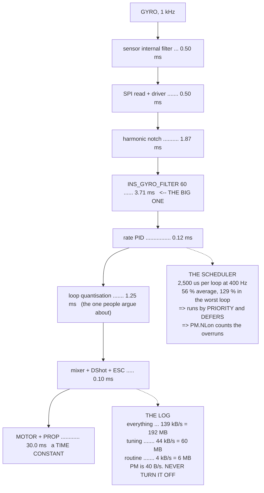

# 08.07 Logging, and the full path from sensor sample to motor command

<!-- glance:start -->
<!-- generated by tools/build.py from curriculum/syllabus.yaml — edit the syllabus, not this block -->

| | |
|---|---|
| **Track** | Main path |
| **Difficulty** | Advanced |
| **Time** | 1 h 30 min |
| **Hardware** | none |
| **Software** | ardupilot, python |
| **Prerequisites** | [08.06 Ground stations: QGroundControl and Mission Planner](08.06-ground-stations.md)<br>[07.06 Control allocation: four commands, four motors](../07-control/07.06-mixing-and-allocation.md) |
| **Skip if** | You can trace one gyro sample through ArduPilot's scheduler to a DShot frame and state the latency of each stage. |

<!-- glance:end -->

## What you will learn

- ArduPilot's **scheduler**, and why 56 % average load still overruns
- The **whole latency chain**, stage by stage: 8.0 ms of software against the motor's 30 ms
- That the largest software delay is **not the loop rate** — it is the gyro low-pass
- That 07.07's notch buys **5.7 ms of latency**, 4.6× what an 8 kHz loop would
- Every log message this course has taught you to read, with the lesson beside it
- `LOG_BITMASK` priced: **139 kB/s** for everything, **4.4 kB/s** for a routine flight
- The five things to check in any log, **in order**, before the thing you came for

## Why it matters

Nine lessons have forward-referenced this one. Every time a lesson said "and you will see this in
the log", it meant a message defined here. This is where the vocabulary is settled.

It is also where the module's argument closes. 08.01 claimed that Hermon's loop rate is not the
thing limiting it, and priced that claim at 17° of phase against the motor's 82. This lesson
decomposes the whole path — sensor filter, SPI read, notch, gyro low-pass, PID, quantisation,
mixer, DShot frame, ESC — and finds **8.0 ms of software against 30 ms of motor**. Same
conclusion, now itemised.

And the itemisation produces something new. The largest software term is not the loop rate at
1.25 ms; it is the **gyro low-pass at 3.71 ms**. 07.07 showed that a notch lets you move
`INS_GYRO_FILTER` from 20 Hz to 60 Hz and gain twice the crossover. It also, it turns out, saves
**5.7 ms of latency** — 4.6 times what switching to an 8 kHz flight stack would buy, for the
price of four parameters.

The rest of the lesson is practical: what the scheduler actually does when it runs out of time,
what is in the log, what each bit of `LOG_BITMASK` costs, and the fixed order in which to open a
log. Four of the five things in that order have cost somebody a day of tuning a gain that was
never the problem.

## Prerequisites

<!-- prereqs:start -->
## Prerequisites

You need these first:

- [08.06 Ground stations: QGroundControl and Mission Planner](08.06-ground-stations.md)
- [07.06 Control allocation: four commands, four motors](../07-control/07.06-mixing-and-allocation.md)

### Optional prerequisite links

None.

Check your readiness: `python course.py why 08.07`
<!-- prereqs:end -->

## Concept

Two ideas run through this lesson, and they are the same idea seen twice.

The first is the **budget**. A 400 Hz main loop has 2,500 µs per iteration, and a fixed set of
work to do in it. Some of that work happens every loop (the rate controller, the EKF, the motor
output) and some happens rarely and expensively (the 1 Hz housekeeping task, at 900 µs). Averaged
over a second the total is comfortable. In the *one* loop where every slow task comes due at
once, it is not — and a scheduler exists precisely to decide what gets deferred.

The second is the **chain**. A gyro sample becomes a motor command by passing through nine
stages, each adding delay, and the useful question is never "how fast is it" but "which stage
dominates". Once you ask that, most tuning arguments dissolve: the loop rate is 1.25 ms of an
8.0 ms software path inside a 38 ms total, and the gyro filter is three times larger.

The log is where both become visible. `PM` shows you the budget being exceeded. `IMU`, `RATE` and
`RCOU` show you the chain, sampled at each end. Everything else in the log is a lesson from
modules 03 to 07, written down four hundred times a second.

## Technical explanation

### Level 1 — the scheduler

Fifteen tasks, at rates from 400 Hz down to 1 Hz. Averaged per loop:

| task | Hz | µs/run | µs/loop |
|---|---|---|---|
| EKF3 predict + fusion | 400 | 620 | **620** |
| IMU read + filters | 400 | 210 | 210 |
| logging (batched) | 400 | 145 | 145 |
| GCS send/receive | 400 | 130 | 130 |
| rate controller + mixer | 400 | 120 | 120 |
| attitude + position loops | 400 | 90 | 90 |
| motor output (DShot) | 400 | 35 | 35 |
| GNSS update | 50 | 240 | 30 |
| everything slower | ≤20 | — | 25 |
| **total** | | | **1,405** |

**56 % of the 2,500 µs budget** — which sounds fine and is the wrong number to look at. The 400 Hz
tasks alone are 1,350 µs, 54 %. But if every slow task falls due in the same iteration, that loop
needs **3,220 µs — 129 % of its budget**.

That is what the scheduler is for. It runs tasks in priority order and **stops when the budget is
spent**, deferring the rest to the next loop. The rate controller always runs; the terrain
database waits. A scheduler that did not do this would drop a rate-loop iteration in order to
update a fence.

You see it in the `PM` message: `NLon` counts long loops, `MaxT` is the worst single iteration,
`Load` is the scheduler's own estimate. **`NLon` should be zero or a handful** — a few per minute
is an SD card erase (08.02). Hundreds means the board cannot do what you have asked of it, and
what it drops is whatever was last in the priority list.

### Level 2 — the latency chain

| stage | ms | what it is |
|---|---|---|
| sensor internal filter | 0.50 | the IMU's own anti-alias **[E]** |
| SPI read + driver | 0.50 | sampled at 1 kHz, read at 400: half a sample of age |
| harmonic notch | 1.87 | 84 Hz, 30 Hz wide (07.07) |
| **`INS_GYRO_FILTER` 60** | **3.71** | a 2-pole Butterworth |
| rate loop compute | 0.12 | the PID itself |
| loop quantisation | 1.25 | zero-order hold: half a sample |
| mixer + expo | 0.02 | sixteen multiplies (07.06) |
| DShot600 frame | 0.03 | 16 bits on the wire |
| ESC commutation update | 0.05 | next PWM cycle (02.10) |
| **software + electrical** | **8.04** | |
| motor + propeller | **30.00** | a *time constant*, not a delay (02.10) |

The actuator dominates by **3.7×**, which is 08.01's conclusion arrived at from the other
direction.

### Level 3 — the term nobody optimises

Look at which software stage is largest. It is not the loop rate. A two-pole Butterworth's group
delay at DC is $\sqrt2/\omega_c$, so:

| `INS_GYRO_FILTER` | delay |
|---|---|
| 10 Hz | 22.73 ms |
| 20 Hz | 11.27 ms |
| 42 Hz | 5.33 ms |
| 60 Hz | 3.71 ms |
| 120 Hz | 1.79 ms |

Now compare 07.07's two configurations honestly, paying for the notch's own delay:

- `INS_GYRO_FILTER` 20 alone — **11.27 ms**
- `INS_GYRO_FILTER` 60 + notch — 3.71 + 1.87 = **5.58 ms**

A net saving of **5.7 ms**, for *more* attenuation at the tone and twice the crossover. And it is
**4.6 times** what moving from a 400 Hz loop to an 8 kHz one would buy you (08.01), for the price
of four parameters rather than a different flight stack.

**The harmonic notch buys latency as well as phase margin.** 07.07 did not say that, and it is
the single strongest argument for setting it.

### Level 4 — the log, and what it costs

Every message this course has taught you to read:

| message | holds | and it is |
|---|---|---|
| `ERR` | Subsys, ECode | every failsafe, and which (09.03) |
| `PM` | NLon, NLoop, MaxT, Load, Mem | **loop overruns** — check this first |
| `VIBE` | VibeX/Y/Z, Clip0/1/2 | clipping is a bias, not noise (05.06) |
| `XKF3` | innovations | measurement minus prediction (06.06) |
| `XKF4` | test ratios | NIS/gate², healthy median 0.04 (06.06) |
| `RATE` | R/RDes, ROut… | the rate loop, and whether it saturated (07.03) |
| `ATT` | DesRoll/Roll… | does it do what it is told? (07.04) |
| `RCOU` | C1…C8 | the mixer's real output (07.06) |
| `IMU` | GyrX/Y/Z, AccX/Y/Z | the FFT input (07.07) |
| `ESC` | RPM, Volt, Curr, Temp | the notch's rpm source (02.10) |
| `MODE` | Mode, **Rsn** | and *why* it changed (07.05) |

And `LOG_BITMASK` is what you pay for them:

| set | bytes/s | 24-minute flight |
|---|---|---|
| everything, including `IMU_RAW` | 139,760 | 192 MB |
| a **tuning** flight | 43,760 | 60 MB |
| a **routine** flight | 4,360 | **6 MB** |

The routine set is 10 % of the tuning set. You are not saving card space — cards are enormous.
You are saving **write latency**, and 08.02 showed that a stalled write drops the high-rate
messages first. Logging less means the messages you kept actually arrive.

Bit 3, `PM`, costs 40 bytes a second and is the first thing you look at in any log. **Never turn
it off.**

## Diagram



## Code

Budget the scheduler task by task and find the worst-case loop, measure every stage of the
latency chain (with the filter delays computed numerically from the real biquads), list every log
message against the lesson that taught it, and price `LOG_BITMASK` three ways.

```python
"""08.07 - the scheduler, the latency chain, and what is in the log."""
import cmath
import math

LOOP_HZ = 400.0
GYRO_HZ = 1000.0
LOOP_BUDGET_US = 1e6 / LOOP_HZ
MOTOR_TAU_MS = 30.0       # 02.10
FS = 1000.0

# task, Hz, typical microseconds, what it is, and the lesson that built it
TASKS = [
    ("rate controller + mixer", 400, 120, "07.03 and 07.06"),
    ("EKF3 predict + fusion", 400, 620, "06.05, and it is the big one"),
    ("attitude + position loops", 400, 90, "07.04, 07.05"),
    ("motor output (DShot)", 400, 35, "02.04"),
    ("IMU read + filters", 400, 210, "05.02, 07.07"),
    ("logging (batched write)", 400, 145, "this lesson"),
    ("GCS send / receive", 400, 130, "08.05"),
    ("GNSS update", 50, 240, "05.04"),
    ("rangefinder + flow", 20, 180, "05.05"),
    ("compass + barometer", 10, 160, "05.03"),
    ("battery monitor", 10, 40, "03.06"),
    ("failsafe checks", 10, 60, "09.03"),
    ("mode + arming logic", 10, 70, "07.05"),
    ("terrain, fence, mission", 10, 220, "12.03, 12.01"),
    ("housekeeping (1 Hz)", 1, 900, "parameters, health, notify"),
]

# LOG_BITMASK bit, name, bytes/s, and why you would want it
LOGBITS = [
    (0, "ATTITUDE_FAST", 8000, "ATT at 400 Hz. Tuning only"),
    (1, "ATTITUDE_MED", 500, "ATT at 25 Hz. Always on"),
    (2, "GPS", 400, "GPS, GPA. Always on"),
    (3, "PM", 40, "PERFORMANCE: loop timing. ALWAYS ON"),
    (4, "CTUN", 800, "throttle, altitude, climb rate (07.05)"),
    (5, "NTUN", 600, "navigation errors (07.05)"),
    (6, "RCIN", 500, "stick inputs"),
    (7, "IMU", 27300, "raw IMU at 1 kHz. 07.07's FFT NEEDS THIS"),
    (8, "CMD", 20, "mission commands as they execute"),
    (9, "CURRENT", 200, "BAT: voltage, current, consumed mAh"),
    (10, "RCOUT", 700, "RCOU: what the mixer actually sent (07.06)"),
    (11, "OPTFLOW", 300, "flow sensor (05.05)"),
    (12, "PID", 3200, "every PID's P, I, D and target. Tuning only"),
    (13, "COMPASS", 300, "MAG, all instances (05.03)"),
    (15, "IMU_RAW", 96000, "UNFILTERED IMU. Almost never"),
    (17, "VIDEO_STABILISATION", 0, "off unless you need it"),
    (18, "FTN", 900, "in-flight FFT bins (07.07)"),
]

# a log message, what it holds, and which lesson taught you to read it
MESSAGES = [
    ("ATT", "DesRoll/Roll, DesPitch/Pitch, DesYaw/Yaw",
     "does the aircraft do what it is told?", "07.04"),
    ("RATE", "R/RDes, P/PDes, Y/YDes, ROut/POut/YOut",
     "the rate loop, and whether it saturated", "07.03"),
    ("RCOU", "C1..C8, the actual motor outputs",
     "07.06's mixer, and whether a motor hit a limit", "07.06"),
    ("IMU", "GyrX/Y/Z, AccX/Y/Z, at LOG_BITMASK's rate",
     "the FFT input, and the only place the tones are", "07.07"),
    ("VIBE", "VibeX/Y/Z, Clip0/1/2",
     "clipping is a BIAS, not noise", "05.06"),
    ("XKF1", "Roll, Pitch, Yaw, VN/VE/VD, PN/PE/PD",
     "the estimate itself", "06.05"),
    ("XKF3", "IVN, IVE, IVD, IPN, IPE, IPD, IMX/Y/Z",
     "the INNOVATIONS: measurement minus prediction", "06.06"),
    ("XKF4", "SV, SP, SH, SM, SVT, errRP, and the test ratios",
     "NIS / gate^2. Healthy median 0.04", "06.06"),
    ("PM", "NLon, NLoop, MaxT, Mem, Load",
     "LOOP OVERRUNS. The first thing to check", "this lesson"),
    ("ESC", "RPM, Volt, Curr, Temp, per motor",
     "the notch's rpm source, and motor health", "02.10, 07.07"),
    ("BAT", "Volt, Curr, CurrTot, Res, Temp",
     "03.06's failsafe inputs, after the fact", "03.06"),
    ("POS", "Lat, Lng, Alt, RelHomeAlt",
     "where it thought it was", "05.04"),
    ("MODE", "Mode, ModeNum, Rsn",
     "and WHY it changed, which is the Rsn column", "07.05"),
    ("ERR", "Subsys, ECode",
     "every failsafe and every subsystem fault", "09.03"),
]


def biquad_lpf(fc, fs=FS):
    w = 2 * math.pi * fc / fs
    c, s = math.cos(w), math.sin(w)
    alpha = s / (2 * (1 / math.sqrt(2)))
    b = [(1 - c) / 2, 1 - c, (1 - c) / 2]
    a = [1 + alpha, -2 * c, 1 - alpha]
    return [x / a[0] for x in b], [x / a[0] for x in a]


def biquad_notch(f0, att_db, bw, fs=FS):
    A = 10 ** (-abs(att_db) / 40.0)
    Q = f0 / bw
    w = 2 * math.pi * f0 / fs
    alpha = math.sin(w) / (2 * Q)
    c = math.cos(w)
    b = [1 + alpha * A, -2 * c, 1 - alpha * A]
    a = [1 + alpha / A, -2 * c, 1 - alpha / A]
    return [x / a[0] for x in b], [x / a[0] for x in a]


def response(ba, f, fs=FS):
    b, a = ba
    z = cmath.exp(-2j * math.pi * f / fs)
    return ((b[0] + b[1] * z + b[2] * z * z)
            / (a[0] + a[1] * z + a[2] * z * z))


def group_delay_ms(ba, f=1.0, df=0.25):
    """-d(phase)/d(omega), measured numerically near DC. In milliseconds."""
    p1 = cmath.phase(response(ba, f - df))
    p2 = cmath.phase(response(ba, f + df))
    dp = p2 - p1
    while dp > math.pi:
        dp -= 2 * math.pi
    while dp < -math.pi:
        dp += 2 * math.pi
    return -dp / (2 * math.pi * 2 * df) * 1000.0


def bar(t):
    print("\n" + "=" * 70)
    print(t)
    print("=" * 70)


if __name__ == "__main__":
    bar("1. THE SCHEDULER: EVERYTHING, INSIDE 2500 MICROSECONDS")
    print(f"  ArduPilot's main loop runs at {LOOP_HZ:.0f} Hz, so every")
    print(f"  iteration has {LOOP_BUDGET_US:.0f} us to do everything in.")
    print(f"  {'task':28s} {'Hz':>5s} {'us/run':>7s} {'us/loop':>8s}  from")
    total = 0.0
    for n, hz, us, src in TASKS:
        per_loop = us * hz / LOOP_HZ
        total += per_loop
        print(f"  {n:28s} {hz:5d} {us:7d} {per_loop:8.1f}  {src}")
    print(f"  {'TOTAL':28s} {'':5s} {'':7s} {total:8.1f}")
    print(f"  {total / LOOP_BUDGET_US * 100:.0f} % OF THE BUDGET, AVERAGED."
          f" Which sounds fine, and")
    print("  is not the number that matters -- because the slow tasks do")
    print("  not spread themselves out. The 1 Hz housekeeping task takes")
    print(f"  {TASKS[-1][2]} us IN ONE LOOP, and that loop's budget is"
          f" {LOOP_BUDGET_US:.0f}.")
    fast = sum(u * h / LOOP_HZ for _, h, u, _ in TASKS if h >= 400)
    worst = fast + sum(u for _, h, u, _ in TASKS if h < 400)
    print(f"  {'the 400 Hz tasks alone':34s} {fast:7.1f} us"
          f" = {fast / LOOP_BUDGET_US * 100:3.0f} %")
    print(f"  {'+ EVERY slow task in one loop':34s} {worst:7.1f} us"
          f" = {worst / LOOP_BUDGET_US * 100:3.0f} %")
    print("  THAT IS WHAT THE SCHEDULER IS FOR. It runs tasks in priority")
    print("  order and STOPS when the budget is spent, deferring the rest")
    print("  to the next loop. The rate controller always runs; the")
    print("  terrain database waits. A scheduler that did not do this")
    print("  would drop a rate-loop iteration to update a fence.")
    print("\n  AND THE PM LOG MESSAGE IS HOW YOU SEE IT HAPPEN:")
    pm = [("NLon", "long loops: iterations that overran the budget"),
          ("NLoop", "total iterations in the period"),
          ("MaxT", "the longest single iteration, in us"),
          ("Load", "scheduler load, 0 to 1000"),
          ("Mem", "free memory, in bytes")]
    for a, b in pm:
        print(f"    {a:7s} {b}")
    print(f"  NLon SHOULD BE ZERO OR NEARLY. A few per minute is normal")
    print(f"  (an SD card erase, 08.02). Hundreds means the board cannot")
    print(f"  do what you have asked, and the thing it drops is whichever")
    print(f"  task was last in the priority list.")

    bar("2. THE LATENCY CHAIN: ONE GYRO SAMPLE TO ONE MOTOR")
    lpf60 = biquad_lpf(60)
    lpf20 = biquad_lpf(20)
    notch = biquad_notch(84.3, 20.0, 30.0)
    stages = [
        ("sensor internal filter", 0.5, "the IMU's own anti-alias [E]"),
        ("SPI read + driver", 0.5,
         f"sampled at {GYRO_HZ:.0f} Hz, read at {LOOP_HZ:.0f}: half a"
         f" sample of age"),
        ("harmonic notch", group_delay_ms(notch),
         "84 Hz, 30 Hz wide (07.07)"),
        ("INS_GYRO_FILTER 60", group_delay_ms(lpf60),
         "a 2-pole Butterworth"),
        ("rate loop compute", 0.12, "the PID itself. Almost free"),
        ("loop quantisation", 0.5 / LOOP_HZ * 1000,
         "zero-order hold: half a sample"),
        ("mixer + expo", 0.02, "sixteen multiplies (07.06)"),
        ("DShot600 frame", 16 / 600000 * 1000, "16 bits on the wire"),
        ("ESC commutation update", 0.05, "next PWM cycle (02.10)"),
    ]
    print(f"  {'stage':28s} {'ms':>7s}  what it is")
    sw = 0.0
    for n, ms, why in stages:
        sw += ms
        print(f"  {n:28s} {ms:7.2f}  {why}")
    print(f"  {'SOFTWARE + ELECTRICAL TOTAL':28s} {sw:7.2f}")
    print(f"  {'motor + propeller (02.10)':28s} {MOTOR_TAU_MS:7.2f}"
          f"  a TIME CONSTANT, not a delay")
    print(f"  THE WHOLE COMPUTATIONAL PATH IS {sw:.1f} ms AND THE MOTOR IS")
    print(f"  {MOTOR_TAU_MS:.0f}. That is 08.01's argument, decomposed:"
          f" the actuator")
    print(f"  dominates by {MOTOR_TAU_MS / sw:.1f}x.")
    print("\n  BUT NOTE WHICH SOFTWARE TERM IS LARGEST. Not the loop rate")
    print(f"  ({0.5 / LOOP_HZ * 1000:.2f} ms) -- the GYRO LOW-PASS"
          f" ({group_delay_ms(lpf60):.2f} ms). And 07.07")
    print("  already showed you what sets that:")
    for fc in (10, 20, 42, 60, 80, 120):
        lp = biquad_lpf(fc)
        print(f"    INS_GYRO_FILTER {fc:3d} Hz -> {group_delay_ms(lp):5.2f}"
              f" ms of delay")
    d20, d60 = group_delay_ms(lpf20), group_delay_ms(lpf60)
    dn = group_delay_ms(notch)
    print("  AND 07.07'S TWO CONFIGURATIONS, COMPARED HONESTLY -- because")
    print("  the notch has a delay of its own and it has to be paid for:")
    print(f"    GYRO_FILTER 20 alone      {d20:6.2f} ms")
    print(f"    GYRO_FILTER 60 + notch    {d60:6.2f} + {dn:.2f}"
          f" = {d60 + dn:5.2f} ms")
    saved = d20 - (d60 + dn)
    print(f"  A NET SAVING OF {saved:.1f} ms, for MORE attenuation at the")
    print(f"  tone and twice the crossover (07.07). And it is"
          f" {saved / (0.5 / LOOP_HZ * 1000):.1f} TIMES")
    print("  what going from a 400 Hz loop to an 8 kHz one would buy you")
    print("  (08.01), for the price of four parameters rather than a")
    print("  different flight stack. THE NOTCH BUYS LATENCY AS WELL AS")
    print("  PHASE MARGIN, which is a consequence 07.07 did not state.")

    bar("3. WHAT IS IN THE LOG, AND WHICH LESSON TAUGHT YOU TO READ IT")
    print(f"  {'message':7s} {'holds':44s}")
    for m, holds, why, src in MESSAGES:
        print(f"  {m:7s} {holds:44s}")
        print(f"  {'':7s} {why}  [{src}]")
    print("  THE COURSE IS IN THIS TABLE. Every analysis technique from")
    print("  modules 05, 06 and 07 ends at one of these messages, and")
    print("  everything module 16 does begins at one.")

    bar("4. LOG_BITMASK, PRICED")
    print("  Every bit is a stream, and every stream is bytes per second")
    print("  on a card whose LATENCY is the constraint (08.02).")
    print(f"  {'bit':>4s} {'name':22s} {'B/s':>8s}  why")
    for bit, name, bps, why in LOGBITS:
        print(f"  {bit:4d} {name:22s} {bps:8d}  {why}")
    tuning = sum(b[2] for b in LOGBITS if b[0] != 15)
    routine = sum(b[2] for b in LOGBITS
                  if b[0] not in (0, 7, 12, 15, 18))
    everything = sum(b[2] for b in LOGBITS)
    print(f"  {'':4s} {'EVERYTHING':22s} {everything:8d}")
    print(f"  {'':4s} {'a TUNING flight':22s} {tuning:8d}"
          f"  (all but IMU_RAW)")
    print(f"  {'':4s} {'a ROUTINE flight':22s} {routine:8d}"
          f"  (no IMU, PID, FTN or ATT_FAST)")
    mins = 24
    for label, bps in (("everything", everything), ("tuning", tuning),
                       ("routine", routine)):
        mb = bps * mins * 60 / 1024 / 1024
        print(f"  a {mins}-minute flight, {label:10s}: {mb:6.1f} MB")
    print("  (08.02 sized a tuning flight at 53 MB from a shorter list.")
    print("   60 MB is the same flight with everything a tuning session")
    print("   actually wants switched on.)")
    print(f"  THE ROUTINE SET IS {routine / tuning * 100:.0f} % OF THE"
          f" TUNING SET. You are not saving")
    print("  card space -- cards are enormous -- you are saving WRITE")
    print("  LATENCY, and 08.02 showed that a stalled write drops the")
    print("  HIGH-RATE messages first. Logging less means the messages")
    print("  you kept actually arrive.")
    print("  AND NOTE BIT 3, PM. It is 40 bytes a second and it is the")
    print("  first thing you look at in any log. NEVER TURN IT OFF.")

    bar("5. THE FIRST FIVE THINGS TO LOOK AT, IN ORDER")
    order = [
        ("ERR", "NO entries at all",
         "any entry means a failsafe fired, and names which"),
        ("PM.NLon", "zero, or a handful", "if the loop overran, nothing"
         " else in the log means what you think"),
        ("VIBE + Clip", "under 30 m/s/s, clip counters FLAT",
         "05.06: clipping is a bias that defeats lane voting"),
        ("XKF4 ratios", "median near 0.04, no sustained spikes",
         "06.06: NIS/gate^2, and the five signatures"),
        ("RCOU", "no channel pinned at SPIN_MIN or SPIN_MAX",
         "07.06: a saturated mixer is silently not obeying you"),
    ]
    print(f"  {'#':2s} {'look at':14s} {'good looks like':40s}")
    for i, (what, good, why) in enumerate(order, 1):
        print(f"  {i:2d} {what:14s} {good:40s}")
        print(f"  {'':2s} {'':14s} {why}")
    print("  ONLY THEN DO YOU LOOK AT THE THING YOU CAME TO LOOK AT.")
    print("  Four of these five have caused someone to spend a day")
    print("  tuning a gain that was never the problem, and the order is")
    print("  cheapest-to-check first: ERR is one glance, XKF4 is a plot.")
```

Output:

```text

======================================================================
1. THE SCHEDULER: EVERYTHING, INSIDE 2500 MICROSECONDS
======================================================================
  ArduPilot's main loop runs at 400 Hz, so every
  iteration has 2500 us to do everything in.
  task                            Hz  us/run  us/loop  from
  rate controller + mixer        400     120    120.0  07.03 and 07.06
  EKF3 predict + fusion          400     620    620.0  06.05, and it is the big one
  attitude + position loops      400      90     90.0  07.04, 07.05
  motor output (DShot)           400      35     35.0  02.04
  IMU read + filters             400     210    210.0  05.02, 07.07
  logging (batched write)        400     145    145.0  this lesson
  GCS send / receive             400     130    130.0  08.05
  GNSS update                     50     240     30.0  05.04
  rangefinder + flow              20     180      9.0  05.05
  compass + barometer             10     160      4.0  05.03
  battery monitor                 10      40      1.0  03.06
  failsafe checks                 10      60      1.5  09.03
  mode + arming logic             10      70      1.8  07.05
  terrain, fence, mission         10     220      5.5  12.03, 12.01
  housekeeping (1 Hz)              1     900      2.2  parameters, health, notify
  TOTAL                                        1405.0
  56 % OF THE BUDGET, AVERAGED. Which sounds fine, and
  is not the number that matters -- because the slow tasks do
  not spread themselves out. The 1 Hz housekeeping task takes
  900 us IN ONE LOOP, and that loop's budget is 2500.
  the 400 Hz tasks alone              1350.0 us =  54 %
  + EVERY slow task in one loop       3220.0 us = 129 %
  THAT IS WHAT THE SCHEDULER IS FOR. It runs tasks in priority
  order and STOPS when the budget is spent, deferring the rest
  to the next loop. The rate controller always runs; the
  terrain database waits. A scheduler that did not do this
  would drop a rate-loop iteration to update a fence.

  AND THE PM LOG MESSAGE IS HOW YOU SEE IT HAPPEN:
    NLon    long loops: iterations that overran the budget
    NLoop   total iterations in the period
    MaxT    the longest single iteration, in us
    Load    scheduler load, 0 to 1000
    Mem     free memory, in bytes
  NLon SHOULD BE ZERO OR NEARLY. A few per minute is normal
  (an SD card erase, 08.02). Hundreds means the board cannot
  do what you have asked, and the thing it drops is whichever
  task was last in the priority list.

======================================================================
2. THE LATENCY CHAIN: ONE GYRO SAMPLE TO ONE MOTOR
======================================================================
  stage                             ms  what it is
  sensor internal filter          0.50  the IMU's own anti-alias [E]
  SPI read + driver               0.50  sampled at 1000 Hz, read at 400: half a sample of age
  harmonic notch                  1.87  84 Hz, 30 Hz wide (07.07)
  INS_GYRO_FILTER 60              3.71  a 2-pole Butterworth
  rate loop compute               0.12  the PID itself. Almost free
  loop quantisation               1.25  zero-order hold: half a sample
  mixer + expo                    0.02  sixteen multiplies (07.06)
  DShot600 frame                  0.03  16 bits on the wire
  ESC commutation update          0.05  next PWM cycle (02.10)
  SOFTWARE + ELECTRICAL TOTAL     8.04
  motor + propeller (02.10)      30.00  a TIME CONSTANT, not a delay
  THE WHOLE COMPUTATIONAL PATH IS 8.0 ms AND THE MOTOR IS
  30. That is 08.01's argument, decomposed: the actuator
  dominates by 3.7x.

  BUT NOTE WHICH SOFTWARE TERM IS LARGEST. Not the loop rate
  (1.25 ms) -- the GYRO LOW-PASS (3.71 ms). And 07.07
  already showed you what sets that:
    INS_GYRO_FILTER  10 Hz -> 22.73 ms of delay
    INS_GYRO_FILTER  20 Hz -> 11.27 ms of delay
    INS_GYRO_FILTER  42 Hz ->  5.33 ms of delay
    INS_GYRO_FILTER  60 Hz ->  3.71 ms of delay
    INS_GYRO_FILTER  80 Hz ->  2.75 ms of delay
    INS_GYRO_FILTER 120 Hz ->  1.79 ms of delay
  AND 07.07'S TWO CONFIGURATIONS, COMPARED HONESTLY -- because
  the notch has a delay of its own and it has to be paid for:
    GYRO_FILTER 20 alone       11.27 ms
    GYRO_FILTER 60 + notch      3.71 + 1.87 =  5.58 ms
  A NET SAVING OF 5.7 ms, for MORE attenuation at the
  tone and twice the crossover (07.07). And it is 4.6 TIMES
  what going from a 400 Hz loop to an 8 kHz one would buy you
  (08.01), for the price of four parameters rather than a
  different flight stack. THE NOTCH BUYS LATENCY AS WELL AS
  PHASE MARGIN, which is a consequence 07.07 did not state.

======================================================================
3. WHAT IS IN THE LOG, AND WHICH LESSON TAUGHT YOU TO READ IT
======================================================================
  message holds                                       
  ATT     DesRoll/Roll, DesPitch/Pitch, DesYaw/Yaw    
          does the aircraft do what it is told?  [07.04]
  RATE    R/RDes, P/PDes, Y/YDes, ROut/POut/YOut      
          the rate loop, and whether it saturated  [07.03]
  RCOU    C1..C8, the actual motor outputs            
          07.06's mixer, and whether a motor hit a limit  [07.06]
  IMU     GyrX/Y/Z, AccX/Y/Z, at LOG_BITMASK's rate   
          the FFT input, and the only place the tones are  [07.07]
  VIBE    VibeX/Y/Z, Clip0/1/2                        
          clipping is a BIAS, not noise  [05.06]
  XKF1    Roll, Pitch, Yaw, VN/VE/VD, PN/PE/PD        
          the estimate itself  [06.05]
  XKF3    IVN, IVE, IVD, IPN, IPE, IPD, IMX/Y/Z       
          the INNOVATIONS: measurement minus prediction  [06.06]
  XKF4    SV, SP, SH, SM, SVT, errRP, and the test ratios
          NIS / gate^2. Healthy median 0.04  [06.06]
  PM      NLon, NLoop, MaxT, Mem, Load                
          LOOP OVERRUNS. The first thing to check  [this lesson]
  ESC     RPM, Volt, Curr, Temp, per motor            
          the notch's rpm source, and motor health  [02.10, 07.07]
  BAT     Volt, Curr, CurrTot, Res, Temp              
          03.06's failsafe inputs, after the fact  [03.06]
  POS     Lat, Lng, Alt, RelHomeAlt                   
          where it thought it was  [05.04]
  MODE    Mode, ModeNum, Rsn                          
          and WHY it changed, which is the Rsn column  [07.05]
  ERR     Subsys, ECode                               
          every failsafe and every subsystem fault  [09.03]
  THE COURSE IS IN THIS TABLE. Every analysis technique from
  modules 05, 06 and 07 ends at one of these messages, and
  everything module 16 does begins at one.

======================================================================
4. LOG_BITMASK, PRICED
======================================================================
  Every bit is a stream, and every stream is bytes per second
  on a card whose LATENCY is the constraint (08.02).
   bit name                        B/s  why
     0 ATTITUDE_FAST              8000  ATT at 400 Hz. Tuning only
     1 ATTITUDE_MED                500  ATT at 25 Hz. Always on
     2 GPS                         400  GPS, GPA. Always on
     3 PM                           40  PERFORMANCE: loop timing. ALWAYS ON
     4 CTUN                        800  throttle, altitude, climb rate (07.05)
     5 NTUN                        600  navigation errors (07.05)
     6 RCIN                        500  stick inputs
     7 IMU                       27300  raw IMU at 1 kHz. 07.07's FFT NEEDS THIS
     8 CMD                          20  mission commands as they execute
     9 CURRENT                     200  BAT: voltage, current, consumed mAh
    10 RCOUT                       700  RCOU: what the mixer actually sent (07.06)
    11 OPTFLOW                     300  flow sensor (05.05)
    12 PID                        3200  every PID's P, I, D and target. Tuning only
    13 COMPASS                     300  MAG, all instances (05.03)
    15 IMU_RAW                   96000  UNFILTERED IMU. Almost never
    17 VIDEO_STABILISATION           0  off unless you need it
    18 FTN                         900  in-flight FFT bins (07.07)
       EVERYTHING               139760
       a TUNING flight           43760  (all but IMU_RAW)
       a ROUTINE flight           4360  (no IMU, PID, FTN or ATT_FAST)
  a 24-minute flight, everything:  191.9 MB
  a 24-minute flight, tuning    :   60.1 MB
  a 24-minute flight, routine   :    6.0 MB
  (08.02 sized a tuning flight at 53 MB from a shorter list.
   60 MB is the same flight with everything a tuning session
   actually wants switched on.)
  THE ROUTINE SET IS 10 % OF THE TUNING SET. You are not saving
  card space -- cards are enormous -- you are saving WRITE
  LATENCY, and 08.02 showed that a stalled write drops the
  HIGH-RATE messages first. Logging less means the messages
  you kept actually arrive.
  AND NOTE BIT 3, PM. It is 40 bytes a second and it is the
  first thing you look at in any log. NEVER TURN IT OFF.

======================================================================
5. THE FIRST FIVE THINGS TO LOOK AT, IN ORDER
======================================================================
  #  look at        good looks like                         
   1 ERR            NO entries at all                       
                    any entry means a failsafe fired, and names which
   2 PM.NLon        zero, or a handful                      
                    if the loop overran, nothing else in the log means what you think
   3 VIBE + Clip    under 30 m/s/s, clip counters FLAT      
                    05.06: clipping is a bias that defeats lane voting
   4 XKF4 ratios    median near 0.04, no sustained spikes   
                    06.06: NIS/gate^2, and the five signatures
   5 RCOU           no channel pinned at SPIN_MIN or SPIN_MAX
                    07.06: a saturated mixer is silently not obeying you
  ONLY THEN DO YOU LOOK AT THE THING YOU CAME TO LOOK AT.
  Four of these five have caused someone to spend a day
  tuning a gain that was never the problem, and the order is
  cheapest-to-check first: ERR is one glance, XKF4 is a plot.
```

## Exercise

### Exercise 08.07-E1 — Read your own `PM` message `[hardware]`

Take a real flight log and plot `PM.NLon` against time, alongside `PM.MaxT` and `PM.Load`.
Identify every spike. Then correlate them: do they coincide with mode changes, with the start of
logging, with GNSS updates, with nothing? Report `NLon` as a percentage of `NLoop` over the whole
flight. Under 0.1 % is healthy; over 1 % means something needs turning off.

### Exercise 08.07-E2 — Measure your own latency chain `[analysis]`

Rebuild the latency table with *your* parameters: your `INS_GYRO_FILTER`, your
`ATC_RAT_*_FLTD`, your notch bandwidth, your loop rate, your ESC protocol. Compute the group
delay of each filter numerically rather than from a formula. Then answer: what is your software
total, what fraction of the motor's time constant is it, and which single parameter change would
reduce it most?

### Exercise 08.07-E3 — Price your own `LOG_BITMASK` `[analysis]`

Work out the three bitmask values you actually want: a **tuning** flight (everything 07.07 needs),
a **routine** flight, and a **debugging** flight for one specific problem you have. Give each as a
decimal number you could paste into a parameter editor. Compute the bytes per second and the file
size for a flight of your own duration, and check each against your card's real sustained write
rate.

### Exercise 08.07-E4 — Trace one sample end to end in a real log `[analysis]`

Pick one sharp stick input in a log. Find it in `RCIN`, then find the resulting change in `RATE`'s
desired column, then in `RATE`'s measured column, then in `RCOU`. Measure the time between each
pair. Compare the total with your E2 prediction. The measurement will be coarser than the
prediction — log rates are 25–400 Hz — so state the resolution you actually have, and say what
you would need to log to do better.

## Expected result

**08.07-E1**: a healthy aircraft shows `NLon` under 0.1 % of `NLoop`, with occasional isolated
spikes. Spikes clustered at the start of the log are SD card initialisation. Spikes that grow
through the flight are a card going bad. A steady high `NLon` with `Load` near 1000 means the
board is saturated — turn off `IMU_RAW`, or a stream, or a feature.

**08.07-E2**: most readers land between 6 and 12 ms of software path, against a 30 ms motor. The
single most effective change is almost always `INS_GYRO_FILTER`, and it is only safe to raise it
once the notch is set — which is why 07.07's order puts the notch first.

**08.07-E3**: a routine mask around 4 kB/s and a tuning mask around 44 kB/s. Both are far inside
any card's bandwidth and that was never the constraint; the point of the exercise is to have the
two numbers ready so you can switch deliberately rather than logging everything forever.

**08.07-E4**: expect the measurement to bracket the prediction rather than confirm it. At 400 Hz
logging your resolution is 2.5 ms, and the whole software path is 8. To do better you would log
`ATTITUDE_FAST` and `PID` and still be measuring at the loop rate — which is the honest limit,
and the reason the prediction is computed rather than measured.

## Troubleshooting

**`NLon` is in the hundreds.** Something is over budget. The usual suspects, in order:
`IMU_RAW` logging, a bad SD card, a serial port without DMA busy-waiting (08.02), too many EKF
lanes for the board, or a Lua script. Turn them off one at a time — 08.04's discipline applies
here too.

**`MaxT` shows a single 50,000 µs loop.** That is a 50 ms stall, and it is almost always the SD
card's erase cycle. 08.02 predicted it. If it recurs, replace the card.

**The log has gaps in the high-rate messages and not the low-rate ones.** By design: when the
write buffer fills, ArduPilot drops the messages that are cheapest to drop. The gap is telling you
the card or the bitmask is the problem, not the sensor.

**`RATE`'s desired and measured columns diverge and the gains look right.** Check `RCOU` first.
07.06 showed a saturated mixer silently delivers less than it was asked for, and the rate loop is
never told.

**Everything in the log looks fine and the aircraft flew badly.** Check `ERR` and `MODE.Rsn`. A
failsafe that fired and cleared leaves almost no other trace, and `Rsn` is the only column that
says *why* the mode changed.

**The FFT in the ground station is empty.** Bit 7 (`IMU`) was not set in `LOG_BITMASK`, or
`INS_LOG_BAT_OPT` is logging post-filter data. 07.07 has both.

## Common mistakes

- **Reading average scheduler load and concluding there is headroom.** 56 % average and 129 % in
  the worst loop are the same configuration.
- **Optimising the loop rate.** It is 1.25 ms of an 8 ms software path inside a 38 ms total. The
  gyro filter is three times larger and free to change.
- **Turning off `PM` to save space.** Forty bytes a second, and it is the first thing you look at.
- **Logging everything on every flight.** 192 MB, and the write stalls drop the messages you
  wanted.
- **Opening a log at the thing you came to look at.** The five-step order exists because four of
  the five have wasted somebody's day.
- **Trusting `RATE` without `RCOU`.** A saturated mixer makes a perfectly tuned rate loop look
  broken.
- **Believing the latency chain is measurable from the log.** At 400 Hz your resolution is 2.5 ms
  and the whole path is 8. Compute it; use the log to bracket it.

## Knowledge check

<details>
<summary>The scheduler's average load is 56 % of the loop budget. Why is that not the number that
matters?</summary>

Because slow tasks do not spread themselves out. The 400 Hz tasks alone are 1,350 µs (54 %), but
if every slow task — GNSS, compass, terrain, the 900 µs 1 Hz housekeeping — falls due in the same
iteration, that loop needs **3,220 µs against a 2,500 µs budget**: 129 %. The scheduler exists to
run tasks in priority order and defer what does not fit, so the rate controller runs and the
terrain database waits.
</details>

<details>
<summary>Name every stage between a gyro sample and a motor turning, and say which one
dominates.</summary>

Sensor internal filter (0.50 ms), SPI read and driver (0.50), harmonic notch (1.87),
`INS_GYRO_FILTER` (3.71), rate PID (0.12), loop quantisation (1.25), mixer (0.02), DShot frame
(0.03), ESC commutation (0.05) — **8.04 ms of software and electronics** — and then the motor and
propeller at **30 ms**. The actuator dominates by 3.7×, which is 08.01's argument itemised.
</details>

<details>
<summary>Which software stage is largest, and what does that say about the usual loop-rate
argument?</summary>

The **gyro low-pass**, at 3.71 ms with `INS_GYRO_FILTER` at 60 Hz — three times the 1.25 ms of
loop quantisation. The loop rate is the term everyone argues about and it is not the biggest one.
A two-pole Butterworth's group delay is $\sqrt2/\omega_c$, so the filter corner is worth far more
than the loop rate, and it costs nothing to change.
</details>

<details>
<summary>07.07 justified the notch on phase margin. What does this lesson add, and what is the
honest accounting?</summary>

It adds **latency**. `INS_GYRO_FILTER` 20 alone is 11.27 ms of delay; 60 Hz plus a notch is
3.71 + 1.87 = 5.58 ms — paying the notch's own 1.87 ms honestly. That is a net saving of
**5.7 ms**, with *more* attenuation at the tone and twice the crossover, and it is **4.6×** what
moving to an 8 kHz flight stack would buy (08.01), for four parameters.
</details>

<details>
<summary>What does a routine flight's log cost against a tuning flight's, and why does the
difference matter if cards are cheap?</summary>

4,360 B/s against 43,760 — 6 MB against 60 MB for a 24-minute flight, or 10 %. Card space is not
the issue. **Write latency** is: 08.02 showed a cheap card stalls for 100 ms during an erase, and
when the buffer fills ArduPilot drops the high-rate messages first. Logging less means the
messages you kept actually arrive.
</details>

<details>
<summary>List the five things to check in any log before the thing you came for, in order, and
say why that order.</summary>

`ERR` (did a failsafe fire?), `PM.NLon` (did the loop overrun — if so nothing else means what you
think), `VIBE` and its clip counters (05.06: a bias that defeats lane voting), `XKF4` ratios
(06.06: NIS/gate², median near 0.04), `RCOU` (07.06: a saturated mixer is silently disobeying
you). The order is cheapest-to-check first — `ERR` is one glance, `XKF4` is a plot — and four of
the five have caused someone to spend a day tuning a gain that was never the problem.
</details>

<details>
<summary>`RATE` shows the measured rate lagging the desired rate badly, and the gains look
correct. What do you check, and why is it not a tuning problem?</summary>

`RCOU`, for any channel pinned at `MOT_SPIN_MIN` or `MOT_SPIN_MAX`. 07.06 showed the mixer gives
things up in a fixed order when it cannot satisfy a demand, and **the rate loop is never told** —
it asked for 1.5 N·m, got 0.98, and will keep integrating against the difference. No gain change
fixes a saturated actuator; reducing the demand does.
</details>

## Practical challenge

**Write the log-review script you will actually use.**

With `pymavlink`'s `DFReader` (or `MAVExplorer`), open a `.bin` log and print a one-page report:
the flight duration and mode timeline with `Rsn` for each change; every `ERR` entry decoded;
`NLon` as a percentage of `NLoop` with the worst `MaxT`; peak and median `VIBE` per axis with the
final clip counters; the median and 95th percentile of each `XKF4` test ratio; the minimum and
maximum of every `RCOU` channel with the time spent within 2 % of either limit; and the battery's
starting voltage, ending voltage and total consumed.

That is the five-step order, automated, plus the context you always want anyway. Run it on every
log before you open a plotting tool.

Then extend it once: add the FFT of `IMU.GyrX` with the top three peaks labelled, and their ratio
to the mean `ESC.RPM` over the same window. If the strongest peak is not at 1× or 3× the shaft
frequency, the script should say so — because that is 07.07's structural-mode case, and it is
worth being told rather than having to look.

## You can skip this if

You can trace one gyro sample through ArduPilot's scheduler to a DShot frame and state the latency
of each stage.

## Go deeper

- [02.10](../02-motors-escs-props/02.10-esc-tuning.md) (earlier): the 30 ms motor time constant
  that dominates the chain.
- [05.06](../05-sensors/05.06-noise-bias-and-calibration.md) (earlier): why `VIBE`'s clip counters
  are step three.
- [06.06](../06-state-estimation/06.06-ekf-health-and-logs.md) (earlier): `XKF3`, `XKF4` and the
  five signatures.
- [07.06](../07-control/07.06-mixing-and-allocation.md) (earlier): why `RCOU` must be read before
  `RATE` is believed.
- [07.07](../07-control/07.07-filtering-and-methodic-tuning.md) (earlier): the notch whose latency
  saving this lesson computes.
- [08.01](08.01-autopilot-landscape.md) (earlier): the loop-rate argument, here itemised.
- [08.02](08.02-board-anatomy.md) (earlier): the SD card whose latency shows up as `MaxT`.
- [16.03](../16-testing-analysis/16.03-reading-flight-logs.md) (later): log analysis as a discipline,
  built on everything here.
- ArduPilot's log-message reference, which defines every field of every message:
  https://ardupilot.org/copter/docs/logmessages.html
- The diagnosing-problems-with-logs guide, which is the practical companion to this lesson:
  https://ardupilot.org/copter/docs/common-diagnosing-problems-using-logs.html

> **Ask your teacher:** *"We found the software path from gyro sample to ESC command is about
> 8 ms against the motor's 30 ms time constant, and that the largest software term is the gyro
> low-pass rather than the loop rate — so moving `INS_GYRO_FILTER` from 20 to 60 with a notch
> saves 5.7 ms. Do you see teams reach for a faster loop when a filter change would do more, and
> what is the first thing you check in a log?"*

## Progress checkpoint

Run `python course.py complete 08.07` once your log-review script produces its one-page report.
That closes module 08 — you have a board, firmware on it, a parameter discipline, the protocol, the
tools and the log. Next: [09.01](../09-telemetry-datalink/09.01-rf-and-link-budget.md) — the radio
links that carry all of it, and why 2,016 bytes per second is the number it is.
