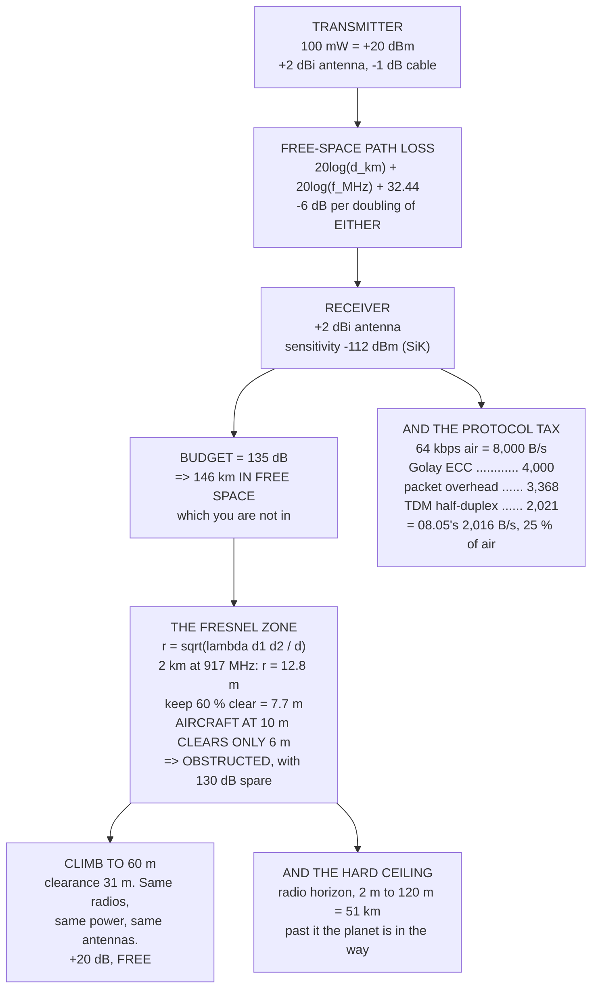

# 09.01 RF and link budgets, in 90 minutes

<!-- glance:start -->
<!-- generated by tools/build.py from curriculum/syllabus.yaml — edit the syllabus, not this block -->

| | |
|---|---|
| **Track** | Main path |
| **Difficulty** | Intermediate |
| **Time** | 1 h 30 min |
| **Hardware** | none |
| **Software** | python |
| **Prerequisites** | [08.07 Logging, and the full path from sensor sample to motor command](../08-flight-controller/08.07-logging-and-the-data-path.md) |
| **Optional prerequisites** | [FRA.01 RF in 45 minutes: frequency, wavelength, decibels](../optional-foundations/rf-datalink/FRA.01-rf-in-45-minutes.md)<br>[FRA.02 The link budget](../optional-foundations/rf-datalink/FRA.02-link-budget-math.md) |
| **Skip if** | You can compute the range of a link from transmit power, antenna gains and receiver sensitivity, and state the margin you kept. |

<!-- glance:end -->

## What you will learn

- Decibels as **addition**, and the five rules of thumb worth memorising
- The link budget, and why it gives the **absurd answer of 146 km on 100 mW**
- That the gap between 146 km and the 2 km you actually get is **geometry, not power**
- The **Fresnel zone**: why a link at 10 m altitude is obstructed by the ground at 2 km
- Where 08.05's **2,016 usable bytes per second** actually came from — derived, not asserted
- What a decibel costs: **climbing from 10 m to 60 m is worth 20 dB and is free**
- Why a vertical dipole's **null points straight up**

## Why it matters

Two of the last three lessons budgeted telemetry against "about 2,016 usable bytes per second on
a 57,600 baud link" and neither derived it. This lesson owes that derivation, and pays it: it is
an air data rate of 64 kbps, halved by Golay error correction, reduced again by packet overhead,
and split by a half-duplex protocol that has to carry both directions on one radio pair. **25 %
of the air rate survives**, and the result is 2,021 B/s.

The rest of the lesson is the more useful half, because it explains the single most common
experience in this hobby: the link budget says 146 kilometres and the aircraft loses telemetry at
two. That is not a mistake in the arithmetic. It is that the arithmetic answers a question about
free space, and you are not in free space — you are a few metres above the ground, and the ground
is inside the beam.

The Fresnel-zone calculation is the one to take away. At 917 MHz over a 2 km span, the radio
needs **7.7 m of clearance at the midpoint**, and an aircraft at 10 m with a ground antenna at 2 m
gives it 6. The link fails, with 130 dB of margin unused. Climb to 60 m and the same radios, the
same power and the same antennas work perfectly — which is why every range question in this hobby
is first answered with "how high were you?"

## Prerequisites

<!-- prereqs:start -->
## Prerequisites

You need these first:

- [08.07 Logging, and the full path from sensor sample to motor command](../08-flight-controller/08.07-logging-and-the-data-path.md)

### Optional prerequisite links

New to any of these? Take the foundation lesson first; skip it if you already know it.

- [FRA.01 RF in 45 minutes: frequency, wavelength, decibels](../optional-foundations/rf-datalink/FRA.01-rf-in-45-minutes.md)
- [FRA.02 The link budget](../optional-foundations/rf-datalink/FRA.02-link-budget-math.md)

Check your readiness: `python course.py why 09.01`
<!-- prereqs:end -->

## Concept

A radio link is a chain of multiplications: the transmitter's power, times the transmit antenna's
gain, times the fraction that survives the distance, times the receive antenna's gain. Multiply
them and compare with what the receiver needs.

Working in decibels turns every multiplication into an addition, and that is the whole reason the
unit exists. A link that spans a ratio of ten billion to one becomes the manageable number 130.

The budget then has three parts:

- **What you put in**: transmit power plus antenna gains, minus cable loss. Call it the EIRP.
- **What the path takes**: free-space path loss, which grows as the square of distance *and* the
  square of frequency.
- **What the receiver needs**: its sensitivity, which is set by the thermal noise floor, the
  receiver's own noise figure, and the signal-to-noise ratio the modulation demands.

Subtract and you have a number of decibels spare. That is your **margin**, and the only
interesting question about any link is how much of it you kept.

The trap is that free-space path loss assumes free space. Near the ground it is optimistic by
tens of decibels, and the correction is not a fudge factor — it is a specific piece of geometry
called the Fresnel zone, which says how much room the radio needs around the straight line.

## Technical explanation

### Level 1 — decibels

$\text{dB} = 10\log_{10}(\text{power ratio})$, and dBm is the same thing referenced to one
milliwatt. Five facts carry most of the work:

| | |
|---|---|
| double the power | **+3 dB** |
| ten times the power | **+10 dB** |
| double the distance | **−6 dB** |
| double the frequency | **−6 dB** |
| ten times the distance | **−20 dB** |

"Double the distance is −6 dB" is the one that matters. To go twice as far you need **four times
the power** — or six decibels from somewhere else: a better antenna, a lower data rate, a more
sensitive receiver. Power is the most expensive of the four and usually the most regulated
(09.05).

### Level 2 — the budget, and the answer it gives

$$\text{FSPL}_{\text{dB}} = 20\log_{10}(d_{km}) + 20\log_{10}(f_{MHz}) + 32.44$$

With 100 mW (20 dBm), 2 dBi antennas at each end and 1 dB of cable loss:

| link | MHz | sensitivity | budget | free-space range |
|---|---|---|---|---|
| SiK telemetry | 917 | −112 dBm | 135 dB | **146 km** |
| ELRS, 50 Hz | 2440 | −117 dBm | 140 dB | 98 km |
| ELRS, 250 Hz | 2440 | −108 dBm | 131 dB | 35 km |
| ELRS, 500 Hz | 2440 | −105 dBm | 128 dB | 25 km |

These numbers are not wrong and they are not useful. Note, though, what the table *does* tell
you: ELRS at 50 Hz is 9 dB more sensitive than at 250 Hz, which is a factor of nearly three in
range for nothing but update rate. That trade is 09.02's subject.

A **fade margin** is the depth of fluctuation you expect and cannot predict — the aircraft
banking, an antenna null sweeping past, a reflection arriving out of phase. Twenty decibels is a
normal working figure and it costs you a factor of ten in range:

| margin | SiK | ELRS 50 Hz | ELRS 250 Hz |
|---|---|---|---|
| 0 dB | 146 km | 98 km | 35 km |
| 20 dB | 14.6 km | 9.8 km | 3.5 km |
| 30 dB | 4.6 km | 3.1 km | 1.1 km |

### Level 3 — the Fresnel zone

Radio does not travel in a line. It travels in an ellipsoid between the two antennas, and
obstructing more than about 40 % of it collapses the signal — not gracefully.

$$r = \sqrt{\frac{\lambda\,d_1 d_2}{d_1 + d_2}}$$

At the midpoint of a 2 km span at 917 MHz, the first Fresnel radius is **12.8 m**, and the usual
rule is to keep 60 % of it clear: **7.7 m**.

Now Hermon, over flat ground:

| geometry | clearance at midpoint | needed | ok? |
|---|---|---|---|
| ground 2 m, aircraft **10 m**, 2 km | 6.0 m | 7.7 m | **no** |
| ground 2 m, aircraft 30 m, 2 km | 16.0 m | 7.7 m | yes |
| ground 2 m, aircraft 60 m, 2 km | 31.0 m | 7.7 m | yes |
| ground 2 m, aircraft 120 m, 5 km | 61.0 m | 12.1 m | yes |

**There is the real range limit.** At 10 m the link is obstructed by the ground itself at two
kilometres, with 130 dB of unused margin. Altitude is the cheapest decibels you will ever buy.

Beyond that there is a hard ceiling — the earth's curvature. The 4/3-earth radio horizon between
a 2 m ground antenna and a 120 m aircraft is **51 km**, and 120 m is Part 107's altitude limit
(18.05). Past the horizon there is no link at any power, because the planet is in the way.

### Level 4 — where 2,016 B/s came from

The SiK radio's air data rate is 64 kbps. Almost none of it reaches MAVLink:

| stage | B/s | what it is |
|---|---|---|
| air data rate, 64 kbps | 8,000 | bytes per second on air |
| **Golay ECC** | 4,000 | every byte is sent **twice**, so one bit error is correctable |
| packet overhead (6 B per 32) | 3,368 | preamble, header, sequence, CRC |
| **TDM half-duplex split** | **2,021** | one radio pair, two directions, taking turns |

**25 % of the air rate survives**, and 2,021 B/s is the 2,016 that 08.05 and 08.06 budgeted
against.

Two consequences. Golay costs you half the link, and you can turn it off (`ATS5=0`) — and then a
single bit error kills a whole packet instead of being corrected, which on a fading link is a bad
trade. And **the serial rate is not the air rate**: raising `SERIAL1_BAUD` to 115,200 makes the
*wire* to the radio faster, not the radio, so the radio buffers. That is why raising it fixes
nothing and sometimes makes the lag worse.

## Diagram



## Code

Convert decibels both ways, compute the budget and free-space range for four real links, find the
Fresnel clearance Hermon needs at five geometries, derive 2,016 B/s from the SiK protocol's own
overheads, and price seven ways of finding six decibels.

```python
"""09.01 - link budgets, and why the answer is never the free-space number."""
import math

C = 299_792_458.0

# link, MHz, tx dBm, tx gain, rx gain, sensitivity dBm, what it is
LINKS = [
    ("SiK telemetry", 917.0, 20.0, 2.0, 2.0, -112.0, "64 kbps GFSK (09.04)"),
    ("ELRS, 50 Hz", 2440.0, 20.0, 2.0, 2.0, -117.0, "the long-range mode"),
    ("ELRS, 250 Hz", 2440.0, 20.0, 2.0, 2.0, -108.0, "the default"),
    ("ELRS, 500 Hz", 2440.0, 20.0, 2.0, 2.0, -105.0, "the racing mode"),
]
CABLE_DB = 1.0

# SiK's own overheads, which is where 08.05's 2,016 B/s came from
AIR_KBPS = 64.0
GOLAY_FACTOR = 0.5        # Golay ECC sends every byte twice
SIK_PAYLOAD = 32          # bytes of payload per packet
SIK_OVERHEAD = 6          # preamble, header, sequence, CRC
TDM_DOWNLINK = 0.60       # the half-duplex split, downlink's share


def fspl_db(d_km, f_mhz):
    """Free-space path loss. The only equation in RF everyone remembers."""
    return 20 * math.log10(max(d_km, 1e-9)) + 20 * math.log10(f_mhz) + 32.44


def range_km(f_mhz, budget_db):
    """Invert FSPL: how far does a given number of decibels reach?"""
    return 10 ** ((budget_db - 20 * math.log10(f_mhz) - 32.44) / 20)


def fresnel_r(d1_m, d2_m, f_mhz):
    """First Fresnel zone radius at a point d1 from one end, d2 from the other."""
    lam = C / (f_mhz * 1e6)
    d = d1_m + d2_m
    return math.sqrt(lam * d1_m * d2_m / d)


def radio_horizon_km(h1_m, h2_m):
    """4/3-earth radio horizon between two heights."""
    return 4.12 * (math.sqrt(max(h1_m, 0)) + math.sqrt(max(h2_m, 0)))


def bar(t):
    print("\n" + "=" * 70)
    print(t)
    print("=" * 70)


if __name__ == "__main__":
    bar("1. DECIBELS, AND WHY A LINK BUDGET IS A SUM")
    print("  A radio link multiplies: the transmitter's power, the")
    print("  antenna's gain, the loss over distance, the receiver's gain.")
    print("  In decibels every one of those becomes an ADDITION, and the")
    print("  whole budget fits on one line.")
    print(f"  {'quantity':22s} {'linear':>14s} {'dB':>8s}")
    rows = [("1 mW", 1.0, "dBm"), ("100 mW", 100.0, "dBm"),
            ("1 W", 1000.0, "dBm"), ("half the power", 0.5, "dB"),
            ("a tenth", 0.1, "dB"), ("a millionth", 1e-6, "dB"),
            ("1e-11 mW (-110 dBm)", 1e-11, "dBm")]
    for n, lin, unit in rows:
        print(f"  {n:22s} {lin:14.3g} {10 * math.log10(lin):7.1f} {unit}")
    print("  NOTE THE LAST TWO ROWS. A receiver that hears -110 dBm is")
    print("  detecting TEN FEMTOWATTS. The transmitter sent 100 mW. That")
    print("  is a ratio of ten billion to one, and in decibels it is the")
    print("  entirely manageable number 130.")
    print("\n  AND THE RULES OF THUMB, which are worth memorising:")
    for n, db in (("double the power", 3), ("ten times the power", 10),
                  ("double the distance", -6),
                  ("double the frequency", -6),
                  ("ten times the distance", -20)):
        print(f"    {n:24s} {db:+4d} dB")
    print("  'DOUBLE THE DISTANCE IS -6 dB' IS THE ONE THAT MATTERS: to")
    print("  go twice as far you need FOUR TIMES the power, or 6 dB from")
    print("  somewhere else -- an antenna, a lower data rate, a better")
    print("  receiver. Power is the most expensive of the four.")

    bar("2. THE BUDGET, AND THE ABSURD ANSWER IT GIVES")
    print(f"  {'link':16s} {'MHz':>6s} {'Ptx':>6s} {'sens':>7s}"
          f" {'budget':>8s} {'free-space range':>17s}")
    for n, f, ptx, gt, gr, sens, why in LINKS:
        budget = ptx + gt + gr - CABLE_DB - sens
        print(f"  {n:16s} {f:6.0f} {ptx:5.0f}dBm {sens:6.0f}dBm"
              f" {budget:6.0f} dB {range_km(f, budget):14.0f} km")
    print("  THESE NUMBERS ARE NOT WRONG AND THEY ARE NOT USEFUL.")
    print("  A hundred and fifty kilometres on 100 mW is arithmetically")
    print("  correct for two antennas in deep space. Real links on this")
    print("  hardware fail somewhere between one and ten kilometres, and")
    print("  THE GAP IS NOT POWER. It is geometry, and sections 3 and 4")
    print("  are the two pieces of geometry that close it.")
    print("\n  FIRST, THE HONEST VERSION WITH A FADE MARGIN:")
    print(f"  {'margin':>8s}" + "".join(f"{n[:12]:>14s}" for n, *_ in LINKS))
    for margin in (0, 10, 20, 30, 40):
        row = ""
        for n, f, ptx, gt, gr, sens, why in LINKS:
            budget = ptx + gt + gr - CABLE_DB - sens - margin
            row += f"{range_km(f, budget):11.1f} km"
        print(f"  {margin:5d} dB {row}")
    print("  A FADE MARGIN IS NOT PESSIMISM. It is the depth of the")
    print("  fluctuation you expect and cannot predict: the aircraft")
    print("  banking, an antenna null sweeping past, a reflection")
    print("  arriving out of phase. 20 dB is a normal working figure and")
    print("  it costs you a factor of TEN in range.")

    bar("3. THE FRESNEL ZONE, WHICH IS WHAT ACTUALLY STOPS YOU")
    print("  Radio does not travel in a line. It travels in an ellipsoid")
    print("  between the two antennas, and if you obstruct more than")
    print("  about 40 % of it the signal collapses -- not gracefully.")
    print(f"  {'span':>8s} {'MHz':>6s} {'1st Fresnel r':>15s}"
          f" {'need 60 %':>11s}  at the midpoint")
    for d_km in (0.5, 1.0, 2.0, 5.0, 10.0):
        for f in (917.0, 2440.0):
            r = fresnel_r(d_km * 500, d_km * 500, f)
            print(f"  {d_km:6.1f}km {f:6.0f} {r:12.1f} m {0.6 * r:8.1f} m")
    print("  NOW HERMON, LOW AND FAR, WHICH IS THE CASE THAT BITES.")
    print("  (Flat ground, and the clearance is the straight line's")
    print("   height above it at the midpoint. Hills make it worse.)")
    cases = [("ground antenna 2 m, aircraft 10 m, 2 km", 2.0, 10.0, 2.0),
             ("ground antenna 2 m, aircraft 30 m, 2 km", 2.0, 30.0, 2.0),
             ("ground antenna 2 m, aircraft 60 m, 2 km", 2.0, 60.0, 2.0),
             ("ground antenna 2 m, aircraft 120 m, 5 km", 2.0, 120.0, 5.0),
             ("on a 3 m mast, aircraft 60 m, 2 km", 3.0, 60.0, 2.0)]
    print(f"  {'geometry':40s} {'clear':>7s} {'need':>7s} {'ok?':>5s}")
    for name, h1, h2, d_km in cases:
        mid_height = (h1 + h2) / 2.0
        need = 0.6 * fresnel_r(d_km * 500, d_km * 500, 917.0)
        print(f"  {name:40s} {mid_height:5.1f} m {need:5.1f} m"
              f" {('YES' if mid_height >= need else 'NO'):>5s}")
    print("  THERE IS THE REAL RANGE LIMIT. At 10 m the link is")
    print("  OBSTRUCTED BY THE GROUND ITSELF at two kilometres, with a")
    print("  150 km power budget. Climb to 60 m and the same radios,")
    print("  the same power and the same antennas work.")
    print("  ALTITUDE IS THE CHEAPEST DECIBELS YOU WILL EVER BUY, and it")
    print("  is why every range problem in this hobby is first answered")
    print("  with 'how high were you?'")
    print("\n  And the hard ceiling, which is the earth's curvature:")
    print(f"  {'ground antenna':>15s} {'aircraft':>10s} {'radio horizon':>15s}")
    for h1, h2 in ((2, 10), (2, 60), (2, 120), (3, 120), (10, 120)):
        print(f"  {h1:12d} m {h2:8d} m {radio_horizon_km(h1, h2):12.1f} km")
    print("  Beyond that there is no link at any power, because the")
    print("  planet is in the way. Note that 120 m is Part 107's ceiling")
    print("  (18.05), so the last rows are the most you will ever get.")

    bar("4. WHERE 08.05'S 2,016 BYTES PER SECOND CAME FROM")
    print("  Two lessons have budgeted telemetry against '2,016 usable")
    print("  bytes per second on a 57,600 baud link'. Here is the")
    print("  derivation, which is entirely protocol overhead and not RF:")
    raw = AIR_KBPS * 1000 / 8
    after_ecc = raw * GOLAY_FACTOR
    pkt = SIK_PAYLOAD / (SIK_PAYLOAD + SIK_OVERHEAD)
    after_pkt = after_ecc * pkt
    after_tdm = after_pkt * TDM_DOWNLINK
    steps = [
        (f"air data rate {AIR_KBPS:.0f} kbps", raw, "bytes per second on air"),
        ("Golay ECC", after_ecc,
         "every byte is sent TWICE, so one bit error is correctable"),
        (f"packet overhead ({SIK_OVERHEAD} B per {SIK_PAYLOAD})", after_pkt,
         "preamble, header, sequence, CRC"),
        ("TDM half-duplex split", after_tdm,
         "one radio pair, two directions, taking turns"),
    ]
    print(f"  {'stage':34s} {'B/s':>8s}  what it is")
    for n, v, why in steps:
        print(f"  {n:34s} {v:8.0f}  {why}")
    print(f"  {after_tdm / raw * 100:.0f} % OF THE AIR RATE SURVIVES, and")
    print(f"  {after_tdm:.0f} B/s is the 2,016 those lessons used.")
    print("  NOTE THAT GOLAY COSTS HALF THE LINK. You can turn it off")
    print("  (ATS5=0) and double your throughput -- and then a single bit")
    print("  error kills a whole packet instead of being corrected, which")
    print("  on a link that is fading is a bad trade. 09.04 measures it.")
    print("  THE SERIAL RATE IS NOT THE AIR RATE. Setting SERIAL1_BAUD to")
    print("  115200 does not make the radio faster; it makes the WIRE to")
    print("  the radio faster, and the radio then buffers. That is why")
    print("  raising it 'fixes' nothing and sometimes makes lag worse.")

    bar("5. WHAT TO SPEND A DECIBEL ON")
    print("  You need 6 dB. Here is what each way of getting it costs:")
    opts = [
        ("+6 dB", "four times the transmit power", "100 mW -> 400 mW",
         "usually ILLEGAL (09.05), and it is the uplink only"),
        ("+6 dB", "a 6 dBi directional ground antenna", "about 40 ILS",
         "and now you must POINT it, and it has a null behind"),
        ("+9 dB", "a lower ELRS packet rate: 250 Hz -> 50 Hz", "free",
         "and you give up 200 updates a second (09.02)"),
        ("x2 B/s", "turn Golay ECC off (ATS5=0)", "free",
         "THROUGHPUT, not margin -- and one bit error now kills a"),
        ("", "", "", "whole packet instead of being corrected"),
        ("+20 dB", "climb from 10 m to 60 m", "free",
         "by unobstructing the Fresnel zone, not by power at all"),
        ("+3 dB", "move the ground antenna off the car roof", "free",
         "reflections cancel; 09.04 has the pattern"),
        ("-20 dB", "fly directly overhead", "unavoidable",
         "a vertical dipole's null points STRAIGHT UP (09.04)"),
    ]
    print(f"  {'':7s} {'how':38s} {'cost':16s}")
    for db, how, cost, why in opts:
        if how:
            print(f"  {db:>7s} {how:38s} {cost:16s}")
        print(f"  {'':7s} {why}")
    print("  READ THE ORDER. The free options are worth more than the")
    print("  expensive one, and the most expensive one is also the one")
    print("  most likely to be against the law. THE FIRST QUESTION ON A")
    print("  RANGE PROBLEM IS ALWAYS 'HOW HIGH', AND THE SECOND IS")
    print("  'WHICH WAY IS THE ANTENNA POINTING'.")
```

Output:

```text

======================================================================
1. DECIBELS, AND WHY A LINK BUDGET IS A SUM
======================================================================
  A radio link multiplies: the transmitter's power, the
  antenna's gain, the loss over distance, the receiver's gain.
  In decibels every one of those becomes an ADDITION, and the
  whole budget fits on one line.
  quantity                       linear       dB
  1 mW                                1     0.0 dBm
  100 mW                            100    20.0 dBm
  1 W                             1e+03    30.0 dBm
  half the power                    0.5    -3.0 dB
  a tenth                           0.1   -10.0 dB
  a millionth                     1e-06   -60.0 dB
  1e-11 mW (-110 dBm)             1e-11  -110.0 dBm
  NOTE THE LAST TWO ROWS. A receiver that hears -110 dBm is
  detecting TEN FEMTOWATTS. The transmitter sent 100 mW. That
  is a ratio of ten billion to one, and in decibels it is the
  entirely manageable number 130.

  AND THE RULES OF THUMB, which are worth memorising:
    double the power           +3 dB
    ten times the power       +10 dB
    double the distance        -6 dB
    double the frequency       -6 dB
    ten times the distance    -20 dB
  'DOUBLE THE DISTANCE IS -6 dB' IS THE ONE THAT MATTERS: to
  go twice as far you need FOUR TIMES the power, or 6 dB from
  somewhere else -- an antenna, a lower data rate, a better
  receiver. Power is the most expensive of the four.

======================================================================
2. THE BUDGET, AND THE ABSURD ANSWER IT GIVES
======================================================================
  link                MHz    Ptx    sens   budget  free-space range
  SiK telemetry       917    20dBm   -112dBm    135 dB            146 km
  ELRS, 50 Hz        2440    20dBm   -117dBm    140 dB             98 km
  ELRS, 250 Hz       2440    20dBm   -108dBm    131 dB             35 km
  ELRS, 500 Hz       2440    20dBm   -105dBm    128 dB             25 km
  THESE NUMBERS ARE NOT WRONG AND THEY ARE NOT USEFUL.
  A hundred and fifty kilometres on 100 mW is arithmetically
  correct for two antennas in deep space. Real links on this
  hardware fail somewhere between one and ten kilometres, and
  THE GAP IS NOT POWER. It is geometry, and sections 3 and 4
  are the two pieces of geometry that close it.

  FIRST, THE HONEST VERSION WITH A FADE MARGIN:
    margin  SiK telemetr   ELRS, 50 Hz  ELRS, 250 Hz  ELRS, 500 Hz
      0 dB       146.4 km       97.9 km       34.7 km       24.6 km
     10 dB        46.3 km       30.9 km       11.0 km        7.8 km
     20 dB        14.6 km        9.8 km        3.5 km        2.5 km
     30 dB         4.6 km        3.1 km        1.1 km        0.8 km
     40 dB         1.5 km        1.0 km        0.3 km        0.2 km
  A FADE MARGIN IS NOT PESSIMISM. It is the depth of the
  fluctuation you expect and cannot predict: the aircraft
  banking, an antenna null sweeping past, a reflection
  arriving out of phase. 20 dB is a normal working figure and
  it costs you a factor of TEN in range.

======================================================================
3. THE FRESNEL ZONE, WHICH IS WHAT ACTUALLY STOPS YOU
======================================================================
  Radio does not travel in a line. It travels in an ellipsoid
  between the two antennas, and if you obstruct more than
  about 40 % of it the signal collapses -- not gracefully.
      span    MHz   1st Fresnel r   need 60 %  at the midpoint
     0.5km    917          6.4 m      3.8 m
     0.5km   2440          3.9 m      2.4 m
     1.0km    917          9.0 m      5.4 m
     1.0km   2440          5.5 m      3.3 m
     2.0km    917         12.8 m      7.7 m
     2.0km   2440          7.8 m      4.7 m
     5.0km    917         20.2 m     12.1 m
     5.0km   2440         12.4 m      7.4 m
    10.0km    917         28.6 m     17.2 m
    10.0km   2440         17.5 m     10.5 m
  NOW HERMON, LOW AND FAR, WHICH IS THE CASE THAT BITES.
  (Flat ground, and the clearance is the straight line's
   height above it at the midpoint. Hills make it worse.)
  geometry                                   clear    need   ok?
  ground antenna 2 m, aircraft 10 m, 2 km    6.0 m   7.7 m    NO
  ground antenna 2 m, aircraft 30 m, 2 km   16.0 m   7.7 m   YES
  ground antenna 2 m, aircraft 60 m, 2 km   31.0 m   7.7 m   YES
  ground antenna 2 m, aircraft 120 m, 5 km  61.0 m  12.1 m   YES
  on a 3 m mast, aircraft 60 m, 2 km        31.5 m   7.7 m   YES
  THERE IS THE REAL RANGE LIMIT. At 10 m the link is
  OBSTRUCTED BY THE GROUND ITSELF at two kilometres, with a
  150 km power budget. Climb to 60 m and the same radios,
  the same power and the same antennas work.
  ALTITUDE IS THE CHEAPEST DECIBELS YOU WILL EVER BUY, and it
  is why every range problem in this hobby is first answered
  with 'how high were you?'

  And the hard ceiling, which is the earth's curvature:
   ground antenna   aircraft   radio horizon
             2 m       10 m         18.9 km
             2 m       60 m         37.7 km
             2 m      120 m         51.0 km
             3 m      120 m         52.3 km
            10 m      120 m         58.2 km
  Beyond that there is no link at any power, because the
  planet is in the way. Note that 120 m is Part 107's ceiling
  (18.05), so the last rows are the most you will ever get.

======================================================================
4. WHERE 08.05'S 2,016 BYTES PER SECOND CAME FROM
======================================================================
  Two lessons have budgeted telemetry against '2,016 usable
  bytes per second on a 57,600 baud link'. Here is the
  derivation, which is entirely protocol overhead and not RF:
  stage                                   B/s  what it is
  air data rate 64 kbps                  8000  bytes per second on air
  Golay ECC                              4000  every byte is sent TWICE, so one bit error is correctable
  packet overhead (6 B per 32)           3368  preamble, header, sequence, CRC
  TDM half-duplex split                  2021  one radio pair, two directions, taking turns
  25 % OF THE AIR RATE SURVIVES, and
  2021 B/s is the 2,016 those lessons used.
  NOTE THAT GOLAY COSTS HALF THE LINK. You can turn it off
  (ATS5=0) and double your throughput -- and then a single bit
  error kills a whole packet instead of being corrected, which
  on a link that is fading is a bad trade. 09.04 measures it.
  THE SERIAL RATE IS NOT THE AIR RATE. Setting SERIAL1_BAUD to
  115200 does not make the radio faster; it makes the WIRE to
  the radio faster, and the radio then buffers. That is why
  raising it 'fixes' nothing and sometimes makes lag worse.

======================================================================
5. WHAT TO SPEND A DECIBEL ON
======================================================================
  You need 6 dB. Here is what each way of getting it costs:
          how                                    cost            
    +6 dB four times the transmit power          100 mW -> 400 mW
          usually ILLEGAL (09.05), and it is the uplink only
    +6 dB a 6 dBi directional ground antenna     about 40 ILS    
          and now you must POINT it, and it has a null behind
    +9 dB a lower ELRS packet rate: 250 Hz -> 50 Hz free            
          and you give up 200 updates a second (09.02)
   x2 B/s turn Golay ECC off (ATS5=0)            free            
          THROUGHPUT, not margin -- and one bit error now kills a
          whole packet instead of being corrected
   +20 dB climb from 10 m to 60 m                free            
          by unobstructing the Fresnel zone, not by power at all
    +3 dB move the ground antenna off the car roof free            
          reflections cancel; 09.04 has the pattern
   -20 dB fly directly overhead                  unavoidable     
          a vertical dipole's null points STRAIGHT UP (09.04)
  READ THE ORDER. The free options are worth more than the
  expensive one, and the most expensive one is also the one
  most likely to be against the law. THE FIRST QUESTION ON A
  RANGE PROBLEM IS ALWAYS 'HOW HIGH', AND THE SECOND IS
  'WHICH WAY IS THE ANTENNA POINTING'.
```

## Exercise

### Exercise 09.01-E1 — Budget your own link `[analysis]`

Take the radios you actually own. Find the transmit power and receiver sensitivity in their
datasheets (both are usually there; sensitivity varies with data rate, so use *your* rate).
Measure or estimate your antenna gains and cable loss. Compute the budget, the free-space range,
and the range at 10, 20 and 30 dB of margin. Then state which of those four numbers you would
quote to someone asking "how far does it go" and why.

### Exercise 09.01-E2 — Find your own Fresnel floor `[analysis]`

For your usual flying site, compute the minimum altitude at which the first Fresnel zone is 60 %
clear, as a function of range from 500 m to 5 km, for both 917 MHz and 2.4 GHz. Plot or tabulate
it. Then compare against the altitudes you actually fly, and mark the range beyond which you are
relying on luck.

### Exercise 09.01-E3 — Re-derive the throughput `[analysis]`

Recompute section 4 with Golay ECC off, with a 128 kbps air rate, and with a TDM split of 80/20
instead of 60/40. Tabulate all eight combinations of the three choices. Then answer: which single
change buys the most throughput, which costs the most reliability, and what would you actually
set for a flight where the telemetry link is the only thing you have?

### Exercise 09.01-E4 — Measure a real range curve `[hardware]`

Using 08.05's `SEQ`-gap monitor, fly a straight line away from the ground station at a fixed
altitude and record packet loss against distance. Do it twice, at two altitudes — say 30 m and
100 m. Plot both. Compare the shape against your E1 budget and your E2 Fresnel floor, and say
which of the two predicts your measurement better.

## Expected result

**09.01-E1**: expect a free-space range in the tens or hundreds of kilometres and a 30 dB-margin
range in the low single digits. The number to quote is the one with margin — and the honest
answer includes the altitude it assumes, because E2 is about to show that altitude matters more
than any of it.

**09.01-E2**: the Fresnel floor rises as the square root of range. At 917 MHz over flat ground
with a 2 m ground antenna you need roughly 11 m of aircraft altitude at 1 km, 13 m at 2 km and
22 m at 5 km. Almost everyone flies above those, which is precisely why the failures happen on
the long, low shots.

**09.01-E3**: turning Golay off doubles throughput and is the largest single change; the 128 kbps
air rate also doubles it but costs about 6 dB of sensitivity, which is a factor of two in range.
For a flight where telemetry is your only link, keep Golay and take the lower throughput — you
want the link to degrade, not to disappear.

**09.01-E4**: both curves should be flat and then fall off a cliff rather than declining smoothly,
which is the Fresnel zone closing rather than the power budget running out. The 100 m flight
should go substantially further than the 30 m one at the same power, which is the whole lesson in
one measurement.

## Troubleshooting

**Your computed range is far larger than your measured one.** Correct, and expected. Free-space
path loss is not the binding constraint below about 60 m of altitude. Work out the Fresnel
clearance for your geometry before blaming the radios.

**The link works at 1 km and fails at 1.2 km, with nothing in between.** That is the Fresnel zone
closing, not the budget expiring. A power-limited link degrades gradually; an obstructed one
falls off a cliff.

**The link fails when the aircraft is close and overhead.** A vertical dipole radiates in a
doughnut with a **null along its own axis**, so an aircraft directly above the ground antenna is
in the deepest part of it. This is not a fault; it is the pattern. 09.04 has the fix.

**Raising `SERIAL1_BAUD` did not help.** It could not. The serial rate is the wire to the radio,
not the radio's air rate. Section 4.

**Signal is strong but the data rate is poor.** RSSI and throughput are different facts. A strong
but interfered-with signal has plenty of power and a poor signal-to-*noise* ratio, and the
retransmissions eat the throughput. 09.02 separates RSSI from link quality for exactly this
reason.

**Adding a high-gain antenna made it worse.** Gain is not free power; it is the same power
concentrated into a narrower beam, with deeper nulls outside it. A 9 dBi antenna pointed slightly
wrong is worse than a 2 dBi one pointed nowhere in particular.

## Common mistakes

- **Quoting the free-space range.** It is arithmetically correct and operationally meaningless.
  Always quote a range with a stated margin and a stated altitude.
- **Treating the Fresnel zone as a refinement.** Below 60 m it is the dominant term, by tens of
  decibels.
- **Reaching for transmit power first.** It is the most expensive decibel, it is usually capped by
  law (09.05), and it only helps the direction it is on.
- **Assuming a higher air rate is better.** Every doubling costs about 3 dB of sensitivity, which
  is a real loss of range.
- **Confusing serial baud with air rate.** They are different numbers on different sides of the
  same box.
- **Forgetting that gain has a shape.** A directional antenna must be aimed, and it has a null
  behind it and often above it.
- **Budgeting only the downlink.** Telemetry is bidirectional and the uplink has different power
  and a different antenna. The weaker direction decides.

## Knowledge check

<details>
<summary>Why is a link budget expressed in decibels rather than watts?</summary>

Because the terms multiply — transmit power × antenna gain × path attenuation × antenna gain — and
decibels turn every multiplication into an addition. A link spanning a ratio of ten billion to one
becomes a sum of numbers between −120 and +20. It also makes the rules of thumb portable: double
the distance is always −6 dB, whatever the frequency or power.
</details>

<details>
<summary>The budget says 146 km on 100 mW and the link fails at 2 km. Is the calculation wrong?</summary>

No — it is correct for **free space**, which is where you are not. Below about 60 m of altitude
the binding constraint is the **Fresnel zone**: at 917 MHz over a 2 km span the radio needs 7.7 m
of clearance at the midpoint, and an aircraft at 10 m with a 2 m ground antenna provides 6. The
link is obstructed by the ground with 130 dB of margin unused.
</details>

<details>
<summary>Two ways to get 6 dB: four times the transmit power, or climbing from 10 m to 60 m. Which
is better and by how much?</summary>

Climbing, and it is not close. The power option costs money, is usually illegal above the
licence-exempt limit (09.05), and only helps the direction it is applied to. Climbing to 60 m
un-obstructs the Fresnel zone and is worth about **20 dB** — three times as much — for free, in
both directions, immediately.
</details>

<details>
<summary>A SiK radio's air rate is 64 kbps. Why does MAVLink only see about 2,016 bytes per
second?</summary>

Four stages. 64 kbps is 8,000 B/s on air. **Golay ECC** sends every byte twice so a single bit
error is correctable: 4,000. **Packet overhead** — preamble, header, sequence, CRC, six bytes per
thirty-two — takes it to 3,368. And the **half-duplex TDM split** gives the downlink about 60 %
of the time: 2,021. Twenty-five per cent of the air rate survives.
</details>

<details>
<summary>Why does a power-limited link fail differently from an obstructed one?</summary>

A power-limited link degrades gradually — the margin shrinks, the error rate climbs, the
throughput falls. An obstructed link **falls off a cliff**, because Fresnel obstruction is a
threshold effect: below about 60 % clearance the signal collapses over a short change in
geometry. A link that works at 1 km and is dead at 1.2 km is telling you it is geometry.
</details>

<details>
<summary>ELRS at 50 Hz is 9 dB more sensitive than at 250 Hz. What does that buy, and what does it
cost?</summary>

Nine decibels is a factor of about 2.8 in range, for free — no extra power, no antenna, no law.
What it costs is **update rate**: 50 control packets per second instead of 250. For Hermon, whose
rate loop crosses over at 40 Hz (07.07) and whose motor time constant is 30 ms (02.10), 50 Hz of
stick input is entirely adequate; on a racing quadcopter it is not. 09.02 makes that trade
properly.
</details>

<details>
<summary>The aircraft is close and directly overhead and the link drops. What is happening?</summary>

A vertical dipole radiates in a doughnut and has a **null along its own axis** — straight up. An
aircraft directly overhead sits in the deepest part of that null, typically 20 dB or more down.
It is not a fault, it is the antenna's pattern, and the cure is antenna siting and orientation
rather than power (09.04).
</details>

## Practical challenge

**Build a site survey for your flying field.**

One page, and it should be reusable. Draw the field with the ground-station position marked. For
eight compass directions, note the distance to the nearest obstruction that would break the
Fresnel zone — a treeline, a building, a ridge — and compute the minimum aircraft altitude that
clears it, at both 917 MHz and 2.4 GHz.

Then add the numbers: your measured range curve from E4, your budgeted range at 20 dB of margin,
and the radio horizon for the altitudes you fly. Mark the smallest of the three in each direction
— that is your actual operating limit, and it will not be the same in every direction.

Finally, write the two operating rules that fall out of it. Mine usually read something like
"below 30 m, stay inside 800 m" and "the treeline to the west costs 15 dB, plan around it". Those
two sentences are worth more in the field than every equation in this lesson.

## You can skip this if

You can compute the range of a link from transmit power, antenna gains and receiver sensitivity,
and state the margin you kept.

## Go deeper

- [02.10](../02-motors-escs-props/02.10-esc-tuning.md) (earlier): the 30 ms motor lag that makes
  50 Hz of stick input adequate.
- [08.05](../08-flight-controller/08.05-mavlink.md) (earlier): the 2,016 B/s this lesson derives,
  and what it is spent on.
- [08.06](../08-flight-controller/08.06-ground-stations.md) (earlier): the stream rates that spend
  115 % of it.
- [09.02](09.02-control-link-elrs.md) (next): the packet-rate trade, priced properly.
- [09.04](09.04-telemetry-917.md) (next): the antennas, the null, and the 917–920 MHz constraint.
- [09.05](09.05-spectrum-and-regulation.md) (next): why 100 mW and not 400.
- [18.05](../18-civil-ops/18.05-part-107-and-the-legal-path.md) (later): the 120 m ceiling that
  caps the radio horizon.
- An introduction to Fresnel zones and path clearance, with the geometry worked through:
  https://en.wikipedia.org/wiki/Fresnel_zone
- ArduPilot's telemetry-radio documentation, including the SiK air-rate and ECC parameters:
  https://ardupilot.org/copter/docs/common-telemetry-landingpage.html

> **Ask your teacher:** *"We computed 146 km of free-space range on 100 mW and then found that at
> 10 m altitude the Fresnel zone is obstructed at 2 km — so the real limit is geometry with 130 dB
> unused. Is that how range failures actually present in the field, as a cliff rather than a
> fade? And do you brief a minimum altitude for a given range, or just fly high and not think
> about it?"*

## Progress checkpoint

Run `python course.py complete 09.01` once your site survey exists and you have measured one range
curve. Next: [09.02](09.02-control-link-elrs.md) — the control link, and the packet-rate trade
this lesson just priced at 9 dB.
