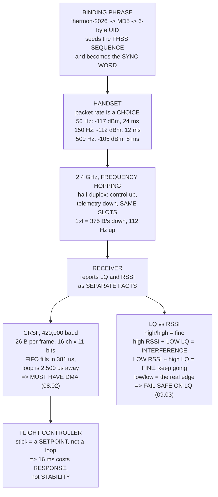

# 09.02 The control link: ExpressLRS 2.4 GHz

<!-- glance:start -->
<!-- generated by tools/build.py from curriculum/syllabus.yaml — edit the syllabus, not this block -->

| | |
|---|---|
| **Track** | Main path |
| **Difficulty** | Intermediate |
| **Time** | 1 h 30 min |
| **Hardware** | First flight (Hermon core) (stage 1) |
| **Software** | elrs |
| **Prerequisites** | [09.01 RF and link budgets, in 90 minutes](09.01-rf-and-link-budget.md) |
| **Version-sensitive** | yes — see [curriculum/versions.yaml](../curriculum/versions.yaml) |
| **Skip if** | You can bind an ELRS pair, choose a packet rate for Hermon's mission, and read LQ and RSSI as separate facts. |

<!-- glance:end -->

## What you will learn

- The packet-rate trade, priced in **both** currencies: 16 ms of latency against **4× the range**
- The distinction that decides it — **setpoint delay is not feedback delay**
- **LQ and RSSI are two different facts**, and all four combinations mean something different
- Why you must **fail safe on LQ, not on RSSI**
- The telemetry slot: what a 1:4 ratio carries, and what it costs the control rate
- That a **binding phrase is the link** — it seeds the hop sequence and the sync word
- Why CRSF at 420,000 baud is one of 08.02's four ports that must have DMA

> **Version-sensitive.** ExpressLRS packet rates, sensitivity figures and the configurator's
> layout change between major versions, and were checked against **ELRS 3.x** in September 2026.
> The trades are stable; the menu is not, and the sensitivity numbers are the vendor's.

## Why it matters

The control link is the one radio on the aircraft whose failure is not an inconvenience. Lose
telemetry and you lose visibility; lose the control link and you have handed the aircraft to
whatever failsafe you configured — which is 09.03, and which is only as good as the settings you
chose today.

09.01 gave you the tools to think about it, and left one result hanging: ELRS at 50 Hz is nine
decibels more sensitive than at 250 Hz. This lesson turns that into a decision, and the decision
turns out to rest on a distinction the course has been using without naming. **Sixteen
milliseconds of extra stick latency is half of Hermon's motor time constant** — which sounds
serious, until you notice that the stick does not close a loop. It sets a *setpoint*, and delay
on a setpoint costs response time and nothing else. Delay *inside* a loop costs you stability.

That one sentence decides the packet rate for Hermon, and decides it the other way for a racing
quadcopter flown in ACRO, where the pilot genuinely is the inner loop.

The other thing this lesson fixes is a habit. Most pilots watch RSSI and fly by it. RSSI is the
wrong number: it says how far away you are, which is not a fault. **LQ** says what fraction of
your commands arrived, which is.

## Prerequisites

<!-- prereqs:start -->
## Prerequisites

You need these first:

- [09.01 RF and link budgets, in 90 minutes](09.01-rf-and-link-budget.md)

### Optional prerequisite links

None.

Check your readiness: `python course.py why 09.02`
<!-- prereqs:end -->

## Concept

ExpressLRS is a LoRa-based control link. Three design choices make it what it is.

**It frequency-hops.** The link moves across dozens of channels on a sequence derived from your
binding phrase, so a jammer or another user on one channel costs you one packet in many rather
than the link.

**It is half-duplex on one radio.** Control packets go up, telemetry comes down, and they share
the same slots. A telemetry ratio of 1:4 means one packet in four is a downlink — which is why
telemetry bandwidth and control rate trade directly against each other.

**Its packet rate is a user choice**, and the choice moves the receiver's sensitivity. A lower
rate spends longer on each transmission, so the receiver integrates more energy and hears a
weaker signal. You are buying range with update rate, and both sides are measurable.

Binding is a phrase rather than a button. You type the same words into the transmitter and the
receiver; the phrase is hashed into a 6-byte UID; the UID seeds the hop sequence and becomes the
sync word. Two links with different phrases hop differently and never collide — and a replacement
receiver binds by typing, with no aircraft present.

## Technical explanation

### Level 1 — the packet-rate trade

| rate | sensitivity | vs 250 Hz | range × | stick latency |
|---|---|---|---|---|
| 50 Hz | −117 dBm | +9 dB | **2.82×** | 23.9 ms |
| 100 Hz | −112 dBm | +4 dB | 1.58× | 15.4 ms |
| **150 Hz** | −112 dBm | +4 dB | 1.58× | **12.2 ms** |
| 250 Hz | −108 dBm | 0 dB | 1.00× | 9.7 ms |
| 500 Hz | −105 dBm | −3 dB | 0.71× | 7.9 ms |

Stick latency here is the whole chain: handset processing (4 ms **[E]**), the mean wait for the
next slot, the LoRa time on air, the CRSF frame at 420,000 baud, and half a flight-controller
loop.

So the full span of the argument is **16 ms** — 23.9 at 50 Hz against 7.9 at 500 — and it buys
**4× the range**.

### Level 2 — setpoint delay is not feedback delay

Sixteen milliseconds against Hermon's 30 ms motor time constant is not nothing. It is about half
of it. The reason it is still the right trade is a distinction 07.02 set up and did not name.

**The stick does not close a loop.** In STABILIZE it sets an *angle*, and ArduPilot's 400 Hz
attitude loop tracks it. Delay *inside* a loop eats phase margin and costs you stability — that
is 07.03's entire subject. Delay on the *setpoint* costs you response time and nothing else: the
aircraft does the same thing, sixteen milliseconds later, just as stably.

For scale: at the attitude loop's 8 Hz bandwidth (07.02), 16 ms would be **46° of phase** if it
were inside the loop. It is not, so it is 16 ms of a slightly softer stick.

For a 5-inch racer flown by hand in ACRO, the pilot *is* the outer loop and the delay really is
inside one. That is why the same table produces the opposite answer there — 08.01's finding
again, with a refinement: the right answer is a property of the aircraft **and of the mode**.

Hermon flies at **150 Hz**. Not 50, because the range is already far beyond visual line of sight
and 09.05 says you may not fly beyond it. Not 500, because it buys two milliseconds.

### Level 3 — LQ and RSSI

**RSSI** is how loud the signal is, in dBm. **LQ** is what fraction of the expected packets
arrived, 0–100. They are independent, and all four combinations happen:

| RSSI | LQ | means | what to do |
|---|---|---|---|
| high | high | healthy | nothing |
| high | **low** | **interference** | loud and unreadable. Another transmitter |
| **low** | high | at range, and clean | **this is fine. Keep going** |
| low | low | the actual edge | turn back, climb, or slow the rate |

**Row three is the one people get wrong.** A weak but clean link is a link that is *working*.
RSSI falling is exactly what is supposed to happen as you fly away, and the system is designed to
operate down to its sensitivity limit. Turning back at −95 dBm with LQ at 100 throws away most of
your range.

Row two is the one that hurts, because no amount of power fixes it. 09.05 has the list of who
else is legally in the 2.4 GHz band, and the answer is everyone.

**Therefore: fail safe on LQ, not on RSSI.** ArduPilot can use either (`RSSI_TYPE`). LQ is the
number that means "I am not receiving your commands". RSSI only means "you are far away", which
is not a fault. 09.03 configures it.

### Level 4 — the telemetry slot, and CRSF

At a 150 Hz packet rate, a minimal but real ground picture — heartbeat, system status, position
and attitude at 2 Hz, a HUD — needs **256 B/s**:

| ratio | available | fits? | control rate | lost |
|---|---|---|---|---|
| 1:2 | 750 B/s | yes | 75 Hz | 75 |
| **1:4** | **375 B/s** | **yes** | **112 Hz** | 38 |
| 1:8 | 188 B/s | no | 131 Hz | 19 |
| 1:16 | 94 B/s | no | 141 Hz | 9 |

The cheapest ratio that fits is **1:4**, costing 38 Hz of control rate — which, by Level 2, is
setpoint delay and therefore cheap. And a second radio is not free either: 22 g, an antenna, a
UART, and the 800 mA transmit peak that sizes 08.02's whole 5 V rail.

The honest position: fly the SiK radio while you are tuning, because 08.06's full stream set
needs it. Once the aircraft is tuned and the missions are routine, a 1:4 ELRS slot carries
everything you actually watch.

**CRSF** is the wire from receiver to flight controller: 420,000 baud, 26-byte frames for 16
channels packed at 11 bits each. At 150 Hz that is 3,900 B/s — 9 % of the wire, which sounds
comfortable and misses 08.02's point. A byte arrives every 23.8 µs, so a 16-byte FIFO **fills in
381 µs** and the main loop is 2,500 µs away. Without DMA the frame is corrupted, the CRC fails,
the packet is dropped, and **LQ falls** — which you will read as a range problem and spend an
afternoon chasing outdoors.

CRSF also carries `LINK_STATISTICS`, which is the only reason the flight controller can see LQ at
all. Without it ArduPilot has RSSI on an analogue pin, which Level 3 just argued is the wrong
thing to fail on.

## Diagram



## Code

Price the packet-rate trade in sensitivity and in milliseconds, lay out the LQ/RSSI quadrant,
find the cheapest telemetry ratio that carries a usable ground picture, hash four binding phrases
into their UIDs, and check the CRSF wire against 08.02's FIFO argument.

```python
"""09.02 - ExpressLRS: the packet-rate trade, LQ vs RSSI, and the telemetry slot."""
import hashlib
import math

CRSF_BAUD = 420000
CRSF_RC_FRAME = 26        # bytes: addr, len, type, 22 of packed channels, crc
LOOP_HZ = 400.0
MOTOR_TAU_MS = 30.0       # 02.10
TX_PROCESS_MS = 4.0       # gimbal ADC, mixing, framing on the handset [E]
MAVLINK_NEED = 1766       # B/s for 08.05's stream set

# rate Hz, sensitivity dBm, time-on-air ms, what it is for
RATES = [
    (50, -117.0, 8.0, "maximum range, minimum update"),
    (100, -112.0, 4.5, "a sensible middle"),
    (150, -112.0, 3.0, "ArduPilot's usual default"),
    (250, -108.0, 1.8, "ELRS's own default"),
    (500, -105.0, 1.0, "racing"),
]

# telemetry ratio denominator: 1 downlink packet in N
TLM_RATIOS = [2, 4, 8, 16, 32, 64, 128]
TLM_PAYLOAD = 10          # usable bytes per downlink slot, MAVLink over CRSF [E]


def stick_latency_ms(rate_hz, toa_ms):
    """Handset stick to a value the flight controller can act on."""
    return (TX_PROCESS_MS
            + 1000.0 / rate_hz / 2.0          # mean wait for the next slot
            + toa_ms                          # LoRa time on air
            + CRSF_RC_FRAME * 10 / CRSF_BAUD * 1000   # the CRSF frame
            + 0.5 / LOOP_HZ * 1000)           # the FC's own loop


def uid_from_phrase(phrase):
    """ELRS binds on a PHRASE: the UID is the first 6 bytes of its MD5."""
    return list(hashlib.md5(("-DMY_BINDING_PHRASE_BYTES=\""
                             + phrase + "\"").encode()).digest()[:6])


def fhss_seed(uid):
    """The UID seeds the hop sequence AND the sync word. Same phrase, same link."""
    return (uid[2] << 24) | (uid[3] << 16) | (uid[4] << 8) | uid[5]


def bar(t):
    print("\n" + "=" * 70)
    print(t)
    print("=" * 70)


if __name__ == "__main__":
    bar("1. THE PACKET-RATE TRADE, PRICED IN BOTH CURRENCIES")
    print("  A lower packet rate spends longer on each transmission, so")
    print("  the receiver can integrate more energy and hear a weaker")
    print("  signal. You buy RANGE with UPDATE RATE, and both are")
    print("  measurable.")
    print(f"  {'rate':>6s} {'sens':>8s} {'vs 250 Hz':>10s} {'range x':>8s}"
          f" {'stick latency':>14s}  what it is for")
    ref = next(s for r, s, t, w in RATES if r == 250)
    for r, sens, toa, why in RATES:
        gain = ref - sens
        print(f"  {r:5d}Hz {sens:7.0f}dBm {gain:+8.0f}dB"
              f" {10 ** (gain / 20):7.2f}x {stick_latency_ms(r, toa):11.1f} ms"
              f"  {why}")
    print("  NOW PUT THE LATENCY COLUMN AGAINST SOMETHING REAL. Hermon's")
    print(f"  motor and propeller have a {MOTOR_TAU_MS:.0f} ms time"
          f" constant (02.10), and")
    print("  08.07 measured the whole software path at 8 ms.")
    l50 = stick_latency_ms(50, 8.0)
    l500 = stick_latency_ms(500, 1.0)
    print(f"  {'50 Hz link':22s} {l50:6.1f} ms of stick latency")
    print(f"  {'500 Hz link':22s} {l500:6.1f} ms")
    print(f"  {'the difference':22s} {l50 - l500:6.1f} ms")
    print(f"  {'the MOTOR':22s} {MOTOR_TAU_MS:6.1f} ms")
    print(f"  SIXTEEN MILLISECONDS AGAINST A {MOTOR_TAU_MS:.0f} ms ACTUATOR"
          f" IS NOT NOTHING.")
    print("  It is about half of it. The reason it is still the right")
    print("  trade for Hermon is a distinction 07.02 set up and did not")
    print("  name: THIS IS SETPOINT DELAY, NOT FEEDBACK DELAY.")
    print("  The stick does not close a loop. In STABILIZE it sets an")
    print("  ANGLE, and ArduPilot's 400 Hz attitude loop tracks it. Delay")
    print("  INSIDE a loop eats phase margin and costs you stability")
    print("  (07.03). Delay on the SETPOINT costs you response time and")
    print("  nothing else -- the aircraft does the same thing, 16 ms")
    print("  later, just as stably.")
    print(f"  For comparison, at the attitude loop's 8 Hz bandwidth"
          f" (07.02),")
    print(f"  16 ms would be {360 * 8 * 0.016:.0f} degrees of phase IF it"
          f" were inside the loop.")
    print("  It is not, so it is 16 ms of a slightly softer stick.")
    print(f"  AND IT BUYS {10 ** ((RATES[0][1] - RATES[-1][1]) / -20):.1f}x"
          f" THE RANGE.")
    print("  FOR HERMON THAT IS NOT A CLOSE DECISION. For a 5-inch racer")
    print("  flown by hand in ACRO -- where the PILOT IS THE OUTER LOOP")
    print("  and the delay really is inside a loop -- it is the opposite")
    print("  decision. 08.01's finding again: THE RIGHT ANSWER IS A")
    print("  PROPERTY OF THE AIRCRAFT, and here also of the MODE.")
    print("\n  Hermon flies at 150 Hz. Not 50, because the range is")
    print("  already far beyond visual line of sight and 09.05 says you")
    print("  may not fly beyond it. Not 500, because it buys 2 ms.")

    bar("2. LQ AND RSSI ARE TWO DIFFERENT FACTS")
    print("  RSSI is HOW LOUD the signal is, in dBm.")
    print("  LQ is WHAT FRACTION of the expected packets arrived, 0-100.")
    print("  They are independent, and all four combinations happen:")
    quad = [
        ("high RSSI", "high LQ", "healthy", "nothing to do"),
        ("high RSSI", "LOW LQ", "INTERFERENCE",
         "someone else is on your channels. Loud AND unreadable"),
        ("LOW RSSI", "high LQ", "at range, and CLEAN",
         "this is FINE. Keep going; the link is working as designed"),
        ("LOW RSSI", "LOW LQ", "the actual edge",
         "turn back, climb, or slow the packet rate"),
    ]
    print(f"  {'RSSI':10s} {'LQ':8s} {'means':16s} {'what to do'}")
    for a, b, c, d in quad:
        print(f"  {a:10s} {b:8s} {c:16s} {d}")
    print("  ROW 3 IS THE ONE PEOPLE GET WRONG. A weak but clean link is")
    print("  a link that is WORKING. RSSI falling is what is supposed to")
    print("  happen as you fly away, and the system is designed to")
    print("  operate down to its sensitivity limit. Turning back at")
    print("  -95 dBm with LQ at 100 is throwing away most of your range.")
    print("  ROW 2 IS THE ONE THAT HURTS. Loud and unreadable means")
    print("  another transmitter, and no amount of power fixes it --")
    print("  09.05 has who else is legally in the 2.4 GHz band, and it")
    print("  is everyone.")
    print("\n  AND THEREFORE: FAIL SAFE ON LQ, NOT ON RSSI.")
    print("  ArduPilot can use either as its RC failsafe trigger")
    print("  (RSSI_TYPE). LQ is the one that means 'I am not receiving");
    print("  your commands'. RSSI only means 'you are far away', which")
    print("  is not a fault. 09.03 configures this.")

    bar("3. THE TELEMETRY SLOT, AND WHAT IT COSTS THE CONTROL LINK")
    print("  ELRS is half-duplex on one radio. A telemetry ratio of 1:N")
    print("  means one packet in N carries DOWNLINK instead of control --")
    print("  so telemetry bandwidth and control rate trade directly.")
    rate = 150
    print(f"  At a {rate} Hz packet rate:")
    print(f"  {'ratio':>7s} {'tlm pkt/s':>10s} {'tlm B/s':>9s}"
          f" {'control Hz':>11s} {'of 08.05 need':>14s}")
    for n in TLM_RATIOS:
        tlm = rate / n
        ctl = rate - tlm
        bps = tlm * TLM_PAYLOAD
        print(f"  1:{n:<5d} {tlm:10.1f} {bps:9.0f} {ctl:11.1f}"
              f" {bps / MAVLINK_NEED * 100:12.0f} %")
    print("  NOTE THE FIRST ROW. At 1:2 you get 750 B/s of telemetry and")
    print("  your control rate has HALVED to 75 Hz. And 750 B/s is still")
    print(f"  only {750 / MAVLINK_NEED * 100:.0f} % of what 08.05's stream"
          f" set wants.")
    print("  SO ELRS TELEMETRY DOES NOT REPLACE THE SiK RADIO on the")
    print("  stream set 08.06 configured. It replaces it if you cut the")
    print("  stream set hard -- and for a lot of flying that is the right")
    print("  answer, because it removes a radio, an antenna, 22 g and")
    print("  08.02's 800 mA transmit peak from the aircraft.")
    print("\n  So: what is the CHEAPEST ratio that carries a usable")
    print("  ground picture? A minimal but real stream set:")
    minimal = [("HEARTBEAT", 21, 1.0), ("SYS_STATUS", 43, 1.0),
               ("GLOBAL_POSITION_INT", 40, 2.0), ("ATTITUDE", 40, 2.0),
               ("VFR_HUD", 32, 1.0)]
    need = sum(b * h for _, b, h in minimal)
    for n, b, h in minimal:
        print(f"    {n:22s} {h:4.1f} Hz {b * h:5.0f} B/s")
    print(f"    {'TOTAL':22s} {'':4s}    {need:5.0f} B/s")
    print(f"  {'ratio':>7s} {'available':>10s} {'fits?':>7s}"
          f" {'control Hz':>11s} {'lost':>6s}")
    best = None
    for n in TLM_RATIOS:
        avail = rate / n * TLM_PAYLOAD
        ctl = rate - rate / n
        ok = avail >= need
        if ok:
            best = n      # the LAST that fits is the cheapest one
        print(f"  1:{n:<5d} {avail:9.0f} B/s {('YES' if ok else 'no'):>7s}"
              f" {ctl:11.1f} {rate - ctl:5.1f}")
    print(f"  THE CHEAPEST RATIO THAT FITS IS 1:{best}, AND IT COSTS")
    print(f"  {rate / best:.0f} Hz OF CONTROL RATE --")
    print(f"  {rate} Hz becomes {rate - rate / best:.0f}. Which, by the"
          f" argument in section 1,")
    print("  is setpoint delay and therefore cheap. A SECOND RADIO IS")
    print("  NOT FREE EITHER: 22 g, an antenna, a UART, and 08.02's")
    print("  800 mA transmit peak that sizes the whole 5 V rail.")
    print("  THE HONEST POSITION: fly the SiK radio while you are tuning")
    print("  and analysing, because 08.06's full stream set needs it.")
    print("  Once the aircraft is tuned and the missions are routine, a")
    print(f"  1:{best} ELRS telemetry slot carries everything you actually")
    print("  watch, and the second radio can come off.")

    bar("4. BINDING IS A PHRASE, AND THE PHRASE IS THE LINK")
    print("  ELRS has no bind button in the usual sense. You type the")
    print("  same PHRASE into the transmitter and the receiver, and the")
    print("  phrase is hashed into a 6-byte UID:")
    for phrase in ("hermon-2026", "hermon-2027", "drone", "drone "):
        uid = uid_from_phrase(phrase)
        print(f"    {repr(phrase):16s} -> UID"
              f" {'-'.join(f'{b:3d}' for b in uid)}"
              f"  seed {fhss_seed(uid):#010x}")
    print("  AND THAT UID IS EVERYTHING. It seeds the frequency-hopping")
    print("  sequence, so two links with different phrases hop")
    print("  differently and do not collide. It becomes the sync word,")
    print("  so a receiver ignores packets that are not for it. And it")
    print("  is derived deterministically, so a replacement receiver")
    print("  binds by TYPING, with no aircraft present.")
    print("  NOTE ROWS 3 AND 4. 'drone' and 'drone ' are different")
    print("  phrases and produce completely different UIDs -- a hash has")
    print("  no notion of 'nearly'. But 'drone' is also a phrase somebody")
    print("  ELSE will choose, and then you share a hop sequence with a")
    print("  stranger. USE SOMETHING NOBODY ELSE WOULD TYPE.")

    bar("5. CRSF: THE WIRE FROM THE RECEIVER TO THE FLIGHT CONTROLLER")
    print(f"  CRSF runs at {CRSF_BAUD:,} baud, which 08.02 flagged as one")
    print("  of the four ports that MUST have DMA. Here is why:")
    print(f"  {'packet rate':>12s} {'frames/s':>9s} {'B/s':>8s}"
          f" {'% of the wire':>14s} {'B per FC loop':>14s}")
    for r, sens, toa, why in RATES:
        bps = r * CRSF_RC_FRAME
        print(f"  {r:9d} Hz {r:9d} {bps:8d}"
              f" {bps * 10 / CRSF_BAUD * 100:12.1f} %"
              f" {bps / LOOP_HZ:13.1f}")
    print("  THE WIRE IS NOWHERE NEAR FULL -- and that is not the point.")
    print("  08.02's argument was about the FIFO, not the average: at")
    print(f"  {CRSF_BAUD:,} baud a byte arrives every"
          f" {1e6 * 10 / CRSF_BAUD:.1f} us, so a 16-byte")
    print(f"  FIFO fills in {16 * 1e6 * 10 / CRSF_BAUD:.0f} us and the"
          f" main loop is {1e6 / LOOP_HZ:.0f} us away.")
    print("  WITHOUT DMA THE FRAME IS CORRUPTED, the CRC fails, the")
    print("  packet is dropped, and LQ falls -- which you will read as a")
    print("  RANGE problem and spend an afternoon chasing outdoors.")
    print("\n  And what CRSF carries besides the sticks:")
    for n, w in (("RC_CHANNELS_PACKED", "16 channels x 11 bits = 22 bytes"),
                 ("LINK_STATISTICS", "uplink/downlink RSSI, LQ, SNR, tx power"),
                 ("DEVICE_PING / INFO", "the Lua config menu on the handset"),
                 ("MAVLINK_ENVELOPE", "MAVLink tunnelled over the same wire")):
        print(f"    {n:20s} {w}")
    print("  LINK_STATISTICS IS WHY THE FLIGHT CONTROLLER CAN SEE LQ AT")
    print("  ALL. Without it ArduPilot has only RSSI on an analogue pin,")
    print("  which section 2 just argued is the wrong thing to fail on.")
```

Output:

```text

======================================================================
1. THE PACKET-RATE TRADE, PRICED IN BOTH CURRENCIES
======================================================================
  A lower packet rate spends longer on each transmission, so
  the receiver can integrate more energy and hear a weaker
  signal. You buy RANGE with UPDATE RATE, and both are
  measurable.
    rate     sens  vs 250 Hz  range x  stick latency  what it is for
     50Hz    -117dBm       +9dB    2.82x        23.9 ms  maximum range, minimum update
    100Hz    -112dBm       +4dB    1.58x        15.4 ms  a sensible middle
    150Hz    -112dBm       +4dB    1.58x        12.2 ms  ArduPilot's usual default
    250Hz    -108dBm       +0dB    1.00x         9.7 ms  ELRS's own default
    500Hz    -105dBm       -3dB    0.71x         7.9 ms  racing
  NOW PUT THE LATENCY COLUMN AGAINST SOMETHING REAL. Hermon's
  motor and propeller have a 30 ms time constant (02.10), and
  08.07 measured the whole software path at 8 ms.
  50 Hz link               23.9 ms of stick latency
  500 Hz link               7.9 ms
  the difference           16.0 ms
  the MOTOR                30.0 ms
  SIXTEEN MILLISECONDS AGAINST A 30 ms ACTUATOR IS NOT NOTHING.
  It is about half of it. The reason it is still the right
  trade for Hermon is a distinction 07.02 set up and did not
  name: THIS IS SETPOINT DELAY, NOT FEEDBACK DELAY.
  The stick does not close a loop. In STABILIZE it sets an
  ANGLE, and ArduPilot's 400 Hz attitude loop tracks it. Delay
  INSIDE a loop eats phase margin and costs you stability
  (07.03). Delay on the SETPOINT costs you response time and
  nothing else -- the aircraft does the same thing, 16 ms
  later, just as stably.
  For comparison, at the attitude loop's 8 Hz bandwidth (07.02),
  16 ms would be 46 degrees of phase IF it were inside the loop.
  It is not, so it is 16 ms of a slightly softer stick.
  AND IT BUYS 4.0x THE RANGE.
  FOR HERMON THAT IS NOT A CLOSE DECISION. For a 5-inch racer
  flown by hand in ACRO -- where the PILOT IS THE OUTER LOOP
  and the delay really is inside a loop -- it is the opposite
  decision. 08.01's finding again: THE RIGHT ANSWER IS A
  PROPERTY OF THE AIRCRAFT, and here also of the MODE.

  Hermon flies at 150 Hz. Not 50, because the range is
  already far beyond visual line of sight and 09.05 says you
  may not fly beyond it. Not 500, because it buys 2 ms.

======================================================================
2. LQ AND RSSI ARE TWO DIFFERENT FACTS
======================================================================
  RSSI is HOW LOUD the signal is, in dBm.
  LQ is WHAT FRACTION of the expected packets arrived, 0-100.
  They are independent, and all four combinations happen:
  RSSI       LQ       means            what to do
  high RSSI  high LQ  healthy          nothing to do
  high RSSI  LOW LQ   INTERFERENCE     someone else is on your channels. Loud AND unreadable
  LOW RSSI   high LQ  at range, and CLEAN this is FINE. Keep going; the link is working as designed
  LOW RSSI   LOW LQ   the actual edge  turn back, climb, or slow the packet rate
  ROW 3 IS THE ONE PEOPLE GET WRONG. A weak but clean link is
  a link that is WORKING. RSSI falling is what is supposed to
  happen as you fly away, and the system is designed to
  operate down to its sensitivity limit. Turning back at
  -95 dBm with LQ at 100 is throwing away most of your range.
  ROW 2 IS THE ONE THAT HURTS. Loud and unreadable means
  another transmitter, and no amount of power fixes it --
  09.05 has who else is legally in the 2.4 GHz band, and it
  is everyone.

  AND THEREFORE: FAIL SAFE ON LQ, NOT ON RSSI.
  ArduPilot can use either as its RC failsafe trigger
  (RSSI_TYPE). LQ is the one that means 'I am not receiving
  your commands'. RSSI only means 'you are far away', which
  is not a fault. 09.03 configures this.

======================================================================
3. THE TELEMETRY SLOT, AND WHAT IT COSTS THE CONTROL LINK
======================================================================
  ELRS is half-duplex on one radio. A telemetry ratio of 1:N
  means one packet in N carries DOWNLINK instead of control --
  so telemetry bandwidth and control rate trade directly.
  At a 150 Hz packet rate:
    ratio  tlm pkt/s   tlm B/s  control Hz  of 08.05 need
  1:2           75.0       750        75.0           42 %
  1:4           37.5       375       112.5           21 %
  1:8           18.8       188       131.2           11 %
  1:16           9.4        94       140.6            5 %
  1:32           4.7        47       145.3            3 %
  1:64           2.3        23       147.7            1 %
  1:128          1.2        12       148.8            1 %
  NOTE THE FIRST ROW. At 1:2 you get 750 B/s of telemetry and
  your control rate has HALVED to 75 Hz. And 750 B/s is still
  only 42 % of what 08.05's stream set wants.
  SO ELRS TELEMETRY DOES NOT REPLACE THE SiK RADIO on the
  stream set 08.06 configured. It replaces it if you cut the
  stream set hard -- and for a lot of flying that is the right
  answer, because it removes a radio, an antenna, 22 g and
  08.02's 800 mA transmit peak from the aircraft.

  So: what is the CHEAPEST ratio that carries a usable
  ground picture? A minimal but real stream set:
    HEARTBEAT               1.0 Hz    21 B/s
    SYS_STATUS              1.0 Hz    43 B/s
    GLOBAL_POSITION_INT     2.0 Hz    80 B/s
    ATTITUDE                2.0 Hz    80 B/s
    VFR_HUD                 1.0 Hz    32 B/s
    TOTAL                            256 B/s
    ratio  available   fits?  control Hz   lost
  1:2           750 B/s     YES        75.0  75.0
  1:4           375 B/s     YES       112.5  37.5
  1:8           188 B/s      no       131.2  18.8
  1:16           94 B/s      no       140.6   9.4
  1:32           47 B/s      no       145.3   4.7
  1:64           23 B/s      no       147.7   2.3
  1:128          12 B/s      no       148.8   1.2
  THE CHEAPEST RATIO THAT FITS IS 1:4, AND IT COSTS
  38 Hz OF CONTROL RATE --
  150 Hz becomes 112. Which, by the argument in section 1,
  is setpoint delay and therefore cheap. A SECOND RADIO IS
  NOT FREE EITHER: 22 g, an antenna, a UART, and 08.02's
  800 mA transmit peak that sizes the whole 5 V rail.
  THE HONEST POSITION: fly the SiK radio while you are tuning
  and analysing, because 08.06's full stream set needs it.
  Once the aircraft is tuned and the missions are routine, a
  1:4 ELRS telemetry slot carries everything you actually
  watch, and the second radio can come off.

======================================================================
4. BINDING IS A PHRASE, AND THE PHRASE IS THE LINK
======================================================================
  ELRS has no bind button in the usual sense. You type the
  same PHRASE into the transmitter and the receiver, and the
  phrase is hashed into a 6-byte UID:
    'hermon-2026'    -> UID 133- 66-106- 65-245- 50  seed 0x6a41f532
    'hermon-2027'    -> UID 239-183- 11-242-227- 13  seed 0x0bf2e30d
    'drone'          -> UID 172- 16-188-163-110- 59  seed 0xbca36e3b
    'drone '         -> UID 179-157- 71-115- 97-112  seed 0x47736170
  AND THAT UID IS EVERYTHING. It seeds the frequency-hopping
  sequence, so two links with different phrases hop
  differently and do not collide. It becomes the sync word,
  so a receiver ignores packets that are not for it. And it
  is derived deterministically, so a replacement receiver
  binds by TYPING, with no aircraft present.
  NOTE ROWS 3 AND 4. 'drone' and 'drone ' are different
  phrases and produce completely different UIDs -- a hash has
  no notion of 'nearly'. But 'drone' is also a phrase somebody
  ELSE will choose, and then you share a hop sequence with a
  stranger. USE SOMETHING NOBODY ELSE WOULD TYPE.

======================================================================
5. CRSF: THE WIRE FROM THE RECEIVER TO THE FLIGHT CONTROLLER
======================================================================
  CRSF runs at 420,000 baud, which 08.02 flagged as one
  of the four ports that MUST have DMA. Here is why:
   packet rate  frames/s      B/s  % of the wire  B per FC loop
         50 Hz        50     1300          3.1 %           3.2
        100 Hz       100     2600          6.2 %           6.5
        150 Hz       150     3900          9.3 %           9.8
        250 Hz       250     6500         15.5 %          16.2
        500 Hz       500    13000         31.0 %          32.5
  THE WIRE IS NOWHERE NEAR FULL -- and that is not the point.
  08.02's argument was about the FIFO, not the average: at
  420,000 baud a byte arrives every 23.8 us, so a 16-byte
  FIFO fills in 381 us and the main loop is 2500 us away.
  WITHOUT DMA THE FRAME IS CORRUPTED, the CRC fails, the
  packet is dropped, and LQ falls -- which you will read as a
  RANGE problem and spend an afternoon chasing outdoors.

  And what CRSF carries besides the sticks:
    RC_CHANNELS_PACKED   16 channels x 11 bits = 22 bytes
    LINK_STATISTICS      uplink/downlink RSSI, LQ, SNR, tx power
    DEVICE_PING / INFO   the Lua config menu on the handset
    MAVLINK_ENVELOPE     MAVLink tunnelled over the same wire
  LINK_STATISTICS IS WHY THE FLIGHT CONTROLLER CAN SEE LQ AT
  ALL. Without it ArduPilot has only RSSI on an analogue pin,
  which section 2 just argued is the wrong thing to fail on.
```

## Exercise

### Exercise 09.02-E1 — Bind a pair and read the statistics `[hardware]`

Flash matching ELRS firmware to your transmitter module and receiver, set a binding phrase that
nobody else would type, and bind. Then connect the receiver to the flight controller over CRSF,
set `RSSI_TYPE = 3` (CRSF), and confirm that ArduPilot reports **both** LQ and RSSI. Write down
both at arm's length, at 50 m, and with your hand wrapped around the receiver's antenna.

### Exercise 09.02-E2 — Measure the packet-rate trade `[hardware]`

Fly (or walk, with the aircraft disarmed and propellers off) a straight line away from the
transmitter, logging LQ and RSSI, at 250 Hz. Repeat at 50 Hz. Plot both. Measure the distance at
which LQ first drops below 90 in each case, and compare the ratio against the 2.82× the datasheet
sensitivities predict. Report the discrepancy and one hypothesis for it.

### Exercise 09.02-E3 — Size your own telemetry slot `[analysis]`

Decide what you actually need to see on the ground during a routine mission. Write it as a
message list with rates, total the bytes per second using 08.05's frame sizes, and find the
cheapest ELRS telemetry ratio that carries it at your packet rate. Then state, in one sentence,
what you would lose by removing the SiK radio entirely.

### Exercise 09.02-E4 — Collide two links on purpose `[hardware]`

With a friend, bind two ELRS pairs to the *same* phrase and power both transmitters. Observe LQ on
each. Then change one phrase and repeat. Report the LQ in both cases, and explain the result in
terms of the hop sequence and the sync word. (Do this on the bench, propellers off, both aircraft
disarmed.)

## Expected result

**09.02-E1**: LQ should read 100 at every distance you can walk, and RSSI should fall steadily
with distance. Your hand around the antenna should drop RSSI by 20 dB or more and leave LQ at
100 — which is Level 3's row three, demonstrated in one second.

**09.02-E2**: expect 50 Hz to reach substantially further, but probably not the full 2.82×. The
usual reason is that you ran into 09.01's Fresnel floor rather than the sensitivity limit — at
walking height the ground obstructs the link long before the receiver runs out of sensitivity.
Repeat it at 60 m of altitude and the ratio should come closer.

**09.02-E3**: a minimal set lands near 250 B/s and fits a 1:4 ratio at 150 Hz. What you lose by
removing the SiK radio is the ability to do 08.06's full-rate work — parameter downloads, log
downloads, high-rate tuning telemetry — in the field. Keep it for tuning; remove it for routine
missions if the weight matters.

**09.02-E4**: two links on the same phrase share a hop sequence and a sync word, so both receivers
accept both transmitters' packets and LQ collapses on both — the classic "my link went bad at the
field" with another ELRS user nearby. Different phrases give different sequences, and both links
read 100.

## Troubleshooting

**LQ is 100 and RSSI is −95, and you turned back.** You did not need to. Level 3, row three. The
link is working as designed; RSSI falling with distance is the system doing its job.

**LQ is poor and RSSI is strong.** Interference, not range. Change the packet rate (which changes
the hop timing), move, or accept it. Power does not help when the problem is somebody else's
signal.

**LQ drops the moment the motors spin up.** Not RF. Either the receiver antenna is next to an ESC
or a motor lead (04.03 measured those fields), or the receiver is browning out on a sagging 5 V
rail (08.02). Check `PM`'s `Vcc` and the antenna routing before touching the radio.

**LQ is erratic on the bench and fine in the air.** The receiver is too close to the transmitter.
ELRS receivers can be overloaded at a metre; stand back before judging the link.

**ArduPilot reports RSSI but not LQ.** `RSSI_TYPE` is not set to the CRSF option, so it is reading
an analogue pin rather than the `LINK_STATISTICS` frame. Fix it — Level 3 says why it matters.

**The receiver will not bind.** The phrase must match exactly, including case and spaces:
`'drone'` and `'drone '` hash to completely different UIDs, because a hash has no notion of
"nearly". Retype both ends rather than checking them.

> [!WARNING]
> **Test the packet rate and the failsafe on the bench with propellers off, every time you change
> either.** Changing the packet rate re-establishes the link and can, on some firmware
> combinations, leave the receiver briefly in failsafe while the flight controller is armed.
> 04.06 computed that a propeller at hover carries 9.06 J. Walk away from the transmitter with the
> aircraft on the bench, watch what the flight controller does at the timeout, and only then take
> it outside — 09.03 is the whole lesson on that test.

## Common mistakes

- **Flying by RSSI.** It tells you how far away you are. LQ tells you whether your commands are
  arriving; that is the one to watch and the one to fail safe on.
- **Choosing 500 Hz because it sounds better.** It costs you 3 dB against 250 and 12 dB against
  50, and buys two milliseconds of a *setpoint*.
- **Choosing 50 Hz because range sounds better.** You may not legally fly beyond visual line of
  sight (09.05), so the extra range is mostly margin — useful margin, but do not pay 12 ms of
  stick feel for range you cannot use.
- **A binding phrase somebody else would type.** `drone`, `test`, `1234`. Two links on one phrase
  share a hop sequence, and both fail.
- **Running CRSF on a port without DMA.** The frames corrupt, LQ falls, and you will diagnose it
  as a range problem in a field (08.02).
- **Treating the telemetry ratio as free.** Every downlink slot is a control packet that did not
  happen.
- **Judging the link at one metre.** The receiver is overloaded that close. Stand back.

## Knowledge check

<details>
<summary>50 Hz costs 16 ms of stick latency against 500 Hz, on an aircraft whose motor time
constant is 30 ms. Why is that still the right trade for Hermon?</summary>

Because it is **setpoint delay, not feedback delay**. The stick does not close a loop — in
STABILIZE it sets an angle and the 400 Hz attitude loop tracks it. Delay inside a loop eats phase
margin and costs stability (07.03); delay on a setpoint costs only response time. The aircraft
does the same thing 16 ms later, just as stably. On a racer flown in ACRO the pilot *is* the inner
loop, and the answer reverses.
</details>

<details>
<summary>RSSI is −95 dBm and LQ is 100. What is happening, and what should you do?</summary>

The link is **working as designed**. RSSI falling with distance is expected; the receiver is
specified to operate down to its sensitivity limit, and LQ at 100 means every packet is arriving.
Turning back here throws away most of your range. The combination to worry about is strong RSSI
with poor LQ, which is interference and which no amount of power will fix.
</details>

<details>
<summary>Why should the RC failsafe trigger on LQ rather than RSSI?</summary>

Because LQ means "I am not receiving your commands" and RSSI means "you are far away", and only
the first is a fault. A link can be quiet and perfect (low RSSI, LQ 100) or loud and useless
(high RSSI, LQ 20). Failing safe on RSSI triggers on the first case and misses the second.
`RSSI_TYPE` must be set to the CRSF option so ArduPilot reads `LINK_STATISTICS` rather than an
analogue pin.
</details>

<details>
<summary>A 1:4 telemetry ratio at 150 Hz gives 375 B/s. What does it cost, and is that a good
trade?</summary>

It costs **38 Hz of control rate** — 150 becomes 112 — because every downlink slot is a control
packet that did not happen. By the setpoint-delay argument that is cheap. Against it, removing the
SiK radio saves 22 g, an antenna, a UART and the 800 mA transmit peak that sizes the entire 5 V
rail (08.02). For routine missions it is a good trade; for tuning it is not, because 08.06's full
stream set needs 1,766 B/s.
</details>

<details>
<summary>What exactly does the binding phrase do, and why is `drone` a bad one?</summary>

It is hashed into a 6-byte UID, which **seeds the frequency-hopping sequence** and **becomes the
sync word**. Two links with different phrases hop differently and ignore each other's packets.
`drone` is bad because somebody else at the field will type it — and then you share a hop
sequence with a stranger, both receivers accept both transmitters, and LQ collapses on both
links.
</details>

<details>
<summary>CRSF at 420,000 baud uses only 9 % of the wire at 150 Hz. Why does 08.02 still list it as
a port that must have DMA?</summary>

Because the constraint is the **FIFO**, not the average. At 420,000 baud a byte arrives every
23.8 µs, so a 16-byte hardware FIFO fills in **381 µs** — and the main loop is up to 2,500 µs
away. Without DMA the frame overruns and is corrupted, the CRC fails, the packet is dropped, and
**LQ falls**, which you will misdiagnose as a range problem.
</details>

<details>
<summary>LQ collapses the moment the motors spin up. Name two causes that are not radio
problems.</summary>

The receiver's antenna is routed alongside an ESC or a motor lead — 04.03 measured those fields
and found a pack lead's field equalling Earth's at 50 mm. Or the receiver is browning out on a
5 V rail that sags under load, which 08.02 sized and which shows as `Vcc` dipping in the `PM`
message. Check the antenna routing and the rail before you touch a radio setting.
</details>

## Practical challenge

**Write and test the link's operating envelope.**

One page. Your chosen packet rate with the reason in one sentence. Your telemetry ratio with the
message list it has to carry. Your binding phrase's *policy* — not the phrase itself — and where
the phrase is written down, because a receiver failure at the field means retyping it.

Then the numbers you will fly by: the LQ at which you turn back, the LQ at which you trigger RTL,
and the RSSI you expect to see at your normal working range so that a deviation is visible. Make
the first two different, and make the first one a decision you take rather than one the aircraft
takes.

Then test all of it on the bench with propellers off: walk away until LQ falls, confirm the
flight controller does what you configured at each threshold, and write the observed distances on
the page. The page is worthless until those numbers are measured rather than assumed — and 09.03
is the lesson that makes the test a procedure.

## You can skip this if

You can bind an ELRS pair, choose a packet rate for Hermon's mission, and read LQ and RSSI as
separate facts.

## Go deeper

- [04.03](../04-frame-and-assembly/04.03-wiring-harness.md) (earlier): the motor-lead fields that
  ruin a badly routed receiver antenna.
- [07.02](../07-control/07.02-cascaded-loops.md) (earlier): the loop structure that makes stick
  input a setpoint rather than a feedback path.
- [08.02](../08-flight-controller/08.02-board-anatomy.md) (earlier): the DMA argument and the
  800 mA transmit peak.
- [08.05](../08-flight-controller/08.05-mavlink.md) (earlier): the message sizes the telemetry
  ratio has to carry.
- [09.01](09.01-rf-and-link-budget.md) (earlier): the 9 dB this lesson spends.
- [09.03](09.03-failsafe-when-the-link-drops.md) (next): what happens when LQ reaches zero, and
  how to test it.
- [09.05](09.05-spectrum-and-regulation.md) (next): who else is in the 2.4 GHz band, and the
  visual-line-of-sight rule that caps the useful range.
- The ExpressLRS documentation, including the packet-rate table and the binding-phrase mechanism:
  https://www.expresslrs.org/quick-start/getting-started/
- ArduPilot's RC-systems page, including `RSSI_TYPE` and the CRSF integration:
  https://ardupilot.org/copter/docs/common-rc-systems.html

> **Ask your teacher:** *"We chose 150 Hz over 50 Hz on the argument that the extra 12 ms is
> setpoint delay rather than feedback delay, and over 500 Hz because that only buys 2 ms. We are
> also planning to fail safe on LQ rather than RSSI. In operational flying, what LQ do you
> actually turn back at, and have you seen a team caught out by the loud-but-unreadable case?"*

## Progress checkpoint

Run `python course.py complete 09.02` once your link envelope page has measured numbers on it.
Next: [09.03](09.03-failsafe-when-the-link-drops.md) — what the aircraft does when LQ reaches
zero, and how to prove it before you need it.
