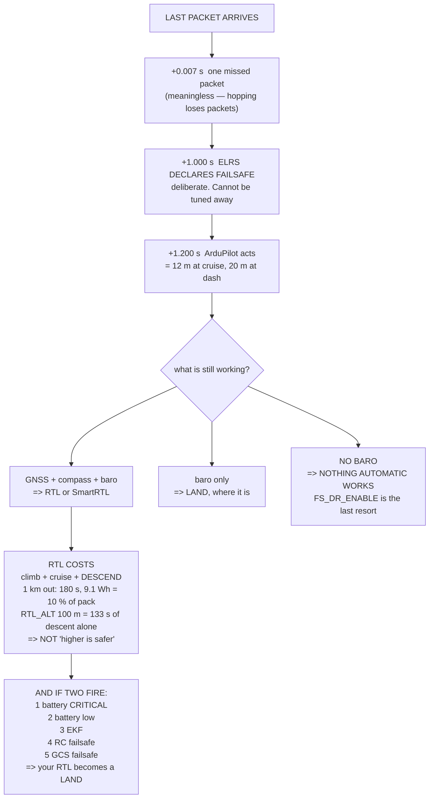

# 09.03 Failsafe: what happens when the link drops

<!-- glance:start -->
<!-- generated by tools/build.py from curriculum/syllabus.yaml — edit the syllabus, not this block -->

| | |
|---|---|
| **Track** | Main path |
| **Difficulty** | Intermediate |
| **Time** | 1 h 15 min |
| **Hardware** | First flight (Hermon core) (stage 1) |
| **Software** | ardupilot |
| **Prerequisites** | [09.02 The control link: ExpressLRS 2.4 GHz](09.02-control-link-elrs.md) |
| **Skip if** | You have configured and physically tested Hermon's RC and GCS failsafes and can state what happens at each timeout. |

<!-- glance:end -->

## What you will learn

- The failsafe chain, timed: **1.2 seconds** from the last packet to the first action, and why
  you cannot shorten it
- Which failsafe actions survive which **sensor** loss — 07.05's ladder, applied
- That losing the **barometer** takes away every automatic action at once
- What RTL actually costs: **9.1 Wh from a kilometre out**, and why the descent is the long part
- Why `RTL_ALT` is **not** "higher is safer"
- Eight failsafes, their timeouts, and **which one wins when two fire**
- The six-step test — including the step everybody skips

## Why it matters

Every lesson so far has been about making the aircraft do what you want. This one is about what
it does when nobody is telling it anything, which is the only case where the configuration you
chose months ago is the whole story.

Three numbers set the shape of it. The aircraft takes **1.2 seconds** to notice the link is gone,
almost all of it in the receiver, and you cannot tune that away — 09.02's frequency hopping means
brief losses are normal and a receiver that panicked on one packet would trigger constantly. Then
it does whatever you configured, and from a kilometre out that costs **180 seconds and 9.1 Wh**,
which is 10 % of the usable pack. And if two failsafes fire at once, **the more severe action
wins** — so the RTL you configured becomes a LAND you did not.

There is also a result here that 07.05 set up and this lesson completes. Every automatic failsafe
action needs a height estimate, so **losing the barometer takes all of them away simultaneously**
— Land, RTL, SmartRTL, Brake, everything. Losing GNSS leaves you Land. Losing the baro leaves you
nothing, with nobody at the sticks.

The last third of the lesson is the test, and it is the point. A failsafe you have not watched
happen is a guess.

## Prerequisites

<!-- prereqs:start -->
## Prerequisites

You need these first:

- [09.02 The control link: ExpressLRS 2.4 GHz](09.02-control-link-elrs.md)

### Optional prerequisite links

None.

Check your readiness: `python course.py why 09.03`
<!-- prereqs:end -->

## Concept

A failsafe is three things in sequence: a **detection**, a **decision**, and an **action**. Most
confusion in this area comes from conflating them.

The **detection** is not instant and mostly is not ArduPilot's. The receiver declares failsafe
after about a second of no packets; the flight controller then notices within about 0.2 s. Total,
1.2 seconds — and the long part of it is deliberate.

The **decision** is which action to take, and it is made against the sensors that are still
working. RTL needs GNSS and a compass. Land needs a barometer. SmartRTL needs a path buffer as
well. A failsafe can arrive on an aircraft that has *already* lost something, and the ladder from
07.05 is what tells you what is left.

The **action** takes time and energy, and both are computable. RTL is a climb, a cruise and a
descent, and the descent is usually the longest because `LAND_SPEED` is slow on purpose.

And then there is the case nobody plans: two failsafes at once. ArduPilot resolves it by
severity, which means your configured action can be quietly overridden by a more urgent one.

## Technical explanation

### Level 1 — the timing

| stage | seconds | what sets it |
|---|---|---|
| one missed packet | 0.007 | at 150 Hz (09.02). Meaningless alone |
| **ELRS declares failsafe** | **1.000** | the receiver stops outputting |
| ArduPilot detects it | 0.100 | no-signal on the CRSF frame |
| FS debounce | 0.100 | it will not act on a single sample |
| **total** | **1.207** | before anything happens at all |

At cruise (10 m/s) that is 12 m; at 07.02's dash speed, 20 m. Not much — and it is the wrong
thing to worry about, because the expensive delay is the one after.

**You cannot tune the one-second receiver timeout away**, and you should not want to. 09.02's
frequency hopping means brief losses are normal; a receiver that declared failsafe on one missed
packet would declare it constantly. The second is the price of not having false alarms.

### Level 2 — what is available, and what it needs

| action | needs | does |
|---|---|---|
| **Disabled** | nothing | keeps flying on the last stick values. **Never.** |
| Land | baro | descends at `LAND_SPEED` where it is |
| RTL | GNSS + compass | climbs to `RTL_ALT`, flies home, lands |
| SmartRTL | GNSS + compass + path buffer | retraces the path it flew in |
| Brake then Land | GNSS | stops, holds 4 s, then lands |
| Auto continue | GNSS + a mission | finishes the mission (12.01) |

Now apply 07.05's ladder — a link failsafe can arrive on an aircraft that has already lost a
sensor:

| also lost | actions still available |
|---|---|
| GNSS | Land |
| compass | Land, Brake then Land, Auto continue |
| **barometer** | **none** |

**Read the barometer row.** Every automatic action needs a height estimate, so losing the
barometer takes all of them away at once. That is 07.05's finding restated — the barometer gates
more modes than the GNSS does — and here it means the aircraft has no safe automatic behaviour
left, with nobody at the sticks. A downward rangefinder (05.05) rescues it below about 20 m,
which is one more reason to fit one.

This is also why `FS_DR_ENABLE` exists: fly the last known velocity for a few seconds, then land.
It is not a good outcome. It is a better one than the alternative.

### Level 3 — what RTL costs

Three phases: climb to `RTL_ALT`, cruise home at `WPNAV_SPEED`, descend at `LAND_SPEED`
(0.75 m/s).

| from | at | `RTL_ALT` | climb | cruise | descend | total | Wh |
|---|---|---|---|---|---|---|---|
| 300 m | 40 m | 30 m | 0 s | 60 s | 40 s | 100 s | 5.0 |
| 1000 m | 40 m | 30 m | 0 s | 100 s | 40 s | 140 s | 7.0 |
| 1000 m | **15 m** | 60 m | **18 s** | 100 s | 80 s | 198 s | 10.0 |
| 1000 m | 100 m | 60 m | 0 s | 100 s | 80 s | 180 s | 9.1 |
| 3000 m | 100 m | 60 m | 0 s | 300 s | 80 s | 380 s | 19.1 |

Against 88.8 Wh usable (03.06) and 24 minutes of hover.

Two things to read out of it. On every short-range row the **descent is the longest phase**,
because `LAND_SPEED` is deliberately slow and `RTL_ALT` multiplies it. An `RTL_ALT` of 100 m costs
more than two minutes of descent, burning hover power over your own home point. **So `RTL_ALT` is
not "higher is safer"** — set it just above the tallest obstacle between you and home, and no
higher.

And row three is the one that surprises people: at 15 m with `RTL_ALT` 60, the aircraft goes
**up** for eighteen seconds before it starts coming home. That is correct behaviour and it is
alarming to watch if you did not expect it.

The reserve this implies:

| from | RTL needs | of the usable pack |
|---|---|---|
| 500 m | 6.5 Wh | 7.4 % |
| 1,000 m | 9.1 Wh | 10.2 % |
| 3,000 m | 19.1 Wh | 21.5 % |
| 5,000 m | 29.2 Wh | 32.8 % |

That percentage is your **minimum reserve at that distance**, and `BATT_LOW_VOLT` has to fire
while you still have it. 03.06 set the threshold on voltage; this is the range that threshold
implies.

### Level 4 — eight failsafes, and who wins

| failsafe | parameter | timeout |
|---|---|---|
| RC / control link | `FS_THR_ENABLE` | 1.2 s |
| GCS / telemetry | `FS_GCS_ENABLE` | 5 s of no `HEARTBEAT` |
| battery low | `BATT_FS_LOW_ACT` | `BATT_LOW_TIMER` (03.06) |
| battery critical | `BATT_FS_CRT_ACT` | overrides everything below |
| EKF | `FS_EKF_ACTION` | `EKF_CHECK_THRESH` 0.8 sustained (06.06) |
| vibration | `FS_VIBE_ENABLE` | clipping + innovation growth (05.06) |
| terrain lost | `FS_OPTIONS` bit | only if terrain-following (12.05) |
| dead reckoning | `FS_DR_ENABLE` | GNSS lost in flight |

**The GCS failsafe is the one that surprises people.** It fires after five seconds with no
heartbeat from the ground station — which includes closing your laptop lid, unplugging the
telemetry radio, or a ground station that crashed. If you fly with a ground station connected,
this is a real failsafe with a real trigger, and most people leave it at a default they have not
read.

And when two fire at once, severity decides:

1. battery **critical** — land, now
2. battery low
3. EKF failure
4. RC failsafe — your `FS_THR` action
5. GCS failsafe — your `FS_GCS` action

**So an RC failsafe configured to RTL, on a low battery, lands instead.** That is correct, it is
not what you configured, and it is the commonest surprise in a post-flight review.
`MODE.Rsn` in the log says which one won (08.07).

## Diagram



## Code

Time the detection chain and convert it to metres, apply 07.05's sensor ladder to the six
failsafe actions, cost RTL in seconds and watt-hours from five distances, list eight failsafes
with their timeouts and their priority order, and lay out the six-step test.

```python
"""09.03 - failsafe: the timing, the ladder, and the test that proves it."""

PACKET_HZ = 150.0         # 09.02
CRUISE_MS = 10.0          # 03.09's spec cruise
DASH_MS = 16.8            # 07.02's fast case
ENDURANCE_MIN = 24.0      # 02.11
CRUISE_W = 181.0          # 03.09
USABLE_WH = 88.8          # 03.06

# stage, seconds, what it is, and what sets it
CHAIN = [
    ("one missed packet", 1.0 / PACKET_HZ,
     "at 150 Hz (09.02). Meaningless on its own"),
    ("ELRS declares failsafe", 1.0,
     "the receiver stops outputting, or outputs its failsafe values"),
    ("ArduPilot detects it", 0.1,
     "no-signal on the CRSF frame, or FS_THR_VALUE on a PWM receiver"),
    ("FS debounce", 0.1, "ArduPilot will not act on a single sample"),
    ("the action begins", 0.0, "mode change, logged as MODE.Rsn"),
]

# the failsafe action, what it needs, and what it does
ACTIONS = [
    ("Disabled", "nothing", "keeps flying on the last stick values",
     "NEVER. This is how an aircraft leaves the country"),
    ("Land", "baro", "descends at LAND_SPEED where it is",
     "the only option with no GNSS. Use it as the FALLBACK"),
    ("RTL", "GNSS + compass", "climbs to RTL_ALT, flies home, lands",
     "the default answer, and it needs two more sensors than Land"),
    ("SmartRTL", "GNSS + compass + the path buffer",
     "retraces the path it flew in",
     "for flying inside or behind things. Falls back to RTL"),
    ("Brake then Land", "GNSS", "stops, holds 4 s, then lands",
     "when you might get the link back"),
    ("Auto continue", "GNSS + a mission", "finishes the mission",
     "for a survey you would rather not repeat (12.01)"),
]

# what 07.05 derived: sensor -> which failsafe actions survive
SENSOR_NEEDS = {
    "GNSS": ["RTL", "SmartRTL", "Brake then Land", "Auto continue"],
    "compass": ["RTL", "SmartRTL"],
    "barometer": ["Land", "RTL", "SmartRTL", "Brake then Land",
                  "Auto continue"],
}

# failsafe, its parameter, and its own timeout
FAILSAFES = [
    ("RC / control link", "FS_THR_ENABLE", 1.2,
     "the receiver stops, then ArduPilot notices"),
    ("GCS / telemetry", "FS_GCS_ENABLE", 5.0,
     "FS_GCS_TIMEOUT, default 5 s of no HEARTBEAT"),
    ("battery low", "BATT_FS_LOW_ACT", 10.0,
     "BATT_LOW_VOLT sustained for BATT_LOW_TIMER (03.06)"),
    ("battery critical", "BATT_FS_CRT_ACT", 10.0,
     "BATT_CRT_VOLT. OVERRIDES everything below it"),
    ("EKF", "FS_EKF_ACTION", 1.0,
     "EKF_CHECK_THRESH 0.8 sustained (06.06)"),
    ("vibration", "FS_VIBE_ENABLE", 1.0,
     "clipping and innovation growth together (05.06)"),
    ("terrain data lost", "FS_OPTIONS bit", 0.0,
     "only if you fly terrain-following (12.05)"),
    ("dead reckoning", "FS_DR_ENABLE", 0.0,
     "GNSS lost in flight: fly on the last velocity, then land"),
]


def rtl_seconds(distance_m, rtl_alt_m, cur_alt_m, speed_ms,
                climb_ms=2.5, descend_ms=0.75):
    """Climb to RTL_ALT, fly home, descend. The three phases, timed."""
    climb = max(0.0, rtl_alt_m - cur_alt_m) / climb_ms
    cruise = distance_m / speed_ms
    descend = rtl_alt_m / descend_ms
    return climb, cruise, descend


def bar(t):
    print("\n" + "=" * 70)
    print(t)
    print("=" * 70)


if __name__ == "__main__":
    bar("1. HOW LONG IT TAKES TO NOTICE, AND HOW FAR THAT IS")
    print("  A failsafe is not instant, and the delay is mostly in the")
    print("  receiver rather than the autopilot:")
    print(f"  {'stage':26s} {'seconds':>8s}  what sets it")
    total = 0.0
    for n, s, why in CHAIN:
        total += s
        print(f"  {n:26s} {s:8.3f}  {why}")
    print(f"  {'TOTAL':26s} {total:8.3f}")
    print(f"  {'':26s} {'':8s}  before the aircraft does anything at all")
    print(f"\n  {'speed':>10s} {'distance in that time':>22s}")
    for v, label in ((5.0, "loiter"), (CRUISE_MS, "cruise (03.09)"),
                     (DASH_MS, "dash (07.02)")):
        print(f"  {v:7.1f} m/s {v * total:18.1f} m   {label}")
    print("  TWENTY METRES IS NOT MUCH -- and it is the wrong thing to")
    print("  worry about. THE EXPENSIVE DELAY IS THE ONE AFTER, because")
    print("  the aircraft then has to get home, and that is section 3.")
    print("\n  AND NOTE THE FIRST ROW IS NOT THE BOTTLENECK. One missed")
    print(f"  packet at 150 Hz is {1000 / PACKET_HZ:.1f} ms. The receiver waits a")
    print("  FULL SECOND before declaring failsafe, and it is right to:")
    print("  09.02's frequency hopping means brief losses are normal, and")
    print("  a receiver that panicked on one packet would trigger")
    print("  constantly. YOU CANNOT TUNE THIS AWAY -- the second is the")
    print("  price of not having false alarms.")

    bar("2. WHAT THE AIRCRAFT CAN DO, AND WHAT EACH OPTION NEEDS")
    print(f"  {'action':18s} {'needs':24s} {'does'}")
    for n, needs, does, why in ACTIONS:
        print(f"  {n:18s} {needs:24s} {does}")
        print(f"  {'':18s} {'':24s} -> {why}")
    print("\n  AND 07.05'S LADDER, APPLIED: which actions survive which")
    print("  SENSOR loss, because a link failsafe can arrive on an")
    print("  aircraft that has already lost something else.")
    print(f"  {'also lost':14s} {'actions still available':46s}")
    for sensor, needs in SENSOR_NEEDS.items():
        surv = [a[0] for a in ACTIONS
                if a[0] not in needs and a[0] != "Disabled"]
        txt = ", ".join(surv) if surv else "NONE"
        print(f"  {sensor:14s} {txt:46s}")
    both = [a[0] for a in ACTIONS
            if a[0] not in SENSOR_NEEDS["GNSS"]
            and a[0] not in SENSOR_NEEDS["barometer"]
            and a[0] != "Disabled"]
    print(f"  {'GNSS + baro':14s} {', '.join(both) if both else 'NONE':46s}")
    print("  READ THE BAROMETER ROW. EVERY automatic action needs a")
    print("  height estimate, so losing the barometer takes all of them")
    print("  at once -- which is 07.05's finding restated: the baro gates")
    print("  more modes than the GNSS does, and losing it leaves you in")
    print("  STABILIZE, flying by hand, with nobody at the sticks.")
    print("  (A downward rangefinder (05.05) rescues this below about")
    print("   20 m, which is one more reason to fit one.)")
    print("  THAT IS WHY FS_DR_ENABLE EXISTS: fly the last known velocity")
    print("  for a few seconds, then land. It is not a good outcome. It")
    print("  is a better one than the alternative.")

    bar("3. WHAT RTL ACTUALLY COSTS, IN SECONDS AND IN WATT-HOURS")
    print("  RTL is three phases: climb to RTL_ALT, fly home at")
    print("  WPNAV_SPEED, descend. Each one is timed and each one costs")
    print("  energy you may not have.")
    print(f"  {'from':>8s} {'at':>6s} {'RTL_ALT':>8s} {'climb':>7s}"
          f" {'cruise':>8s} {'descend':>8s} {'total':>8s} {'Wh':>6s}")
    for dist, cur, rtl_alt, speed in ((300, 40, 30, 5.0),
                                      (1000, 40, 30, 5.0),
                                      (1000, 40, 30, 10.0),
                                      (1000, 15, 60, 10.0),
                                      (1000, 100, 60, 10.0),
                                      (3000, 100, 60, 10.0),
                                      (3000, 100, 100, 16.8)):
        c, cr, d = rtl_seconds(dist, rtl_alt, cur, speed)
        t = c + cr + d
        wh = CRUISE_W * t / 3600
        print(f"  {dist:6d} m {cur:4d} m {rtl_alt:6d} m {c:6.0f} s"
              f" {cr:7.0f} s {d:7.0f} s {t:7.0f} s {wh:5.1f}")
    print(f"  Against {USABLE_WH:.1f} Wh usable (03.06) and"
          f" {ENDURANCE_MIN:.0f} minutes of hover.")
    print("  NOTE THE DESCENT COLUMN. On every short-range row it is the")
    print("  LONGEST phase, because LAND_SPEED is deliberately slow --")
    print("  0.75 m/s -- and RTL_ALT is the number that multiplies it.")
    print("  AN RTL_ALT OF 100 m COSTS YOU MORE THAN TWO MINUTES OF")
    print("  DESCENT, and the aircraft is over its home point the whole")
    print("  time, burning hover power to come down slowly.")
    print("  AND NOTE ROW 4, the only one that climbs: at 15 m with")
    print("  RTL_ALT 60 the aircraft goes UP for 18 seconds before it")
    print("  starts coming home, which is correct behaviour and is very")
    print("  surprising to watch if you did not expect it.")
    print("  SO RTL_ALT IS NOT 'HIGHER IS SAFER'. Set it just above the")
    print("  tallest obstacle between you and home, and no higher. 09.01")
    print("  will also tell you that climbing helps the link -- that is a")
    print("  real benefit, and it is not worth two minutes of hover.")
    print("\n  AND THE RESERVE CHECK, which is the one people skip:")
    for dist in (500, 1000, 2000, 3000, 5000):
        c, cr, d = rtl_seconds(dist, 60, 100, 10.0)
        wh = CRUISE_W * (c + cr + d) / 3600
        print(f"    from {dist:5d} m: RTL needs {wh:5.1f} Wh ="
              f" {wh / USABLE_WH * 100:4.1f} % of the usable pack")
    print("  THAT PERCENTAGE IS YOUR MINIMUM RESERVE AT THAT DISTANCE,")
    print("  and BATT_LOW_VOLT has to be set so the failsafe fires while")
    print("  you still have it. 03.06 set the threshold on voltage; this")
    print("  is the RANGE that threshold implies.")

    bar("4. EIGHT FAILSAFES, AND WHAT HAPPENS WHEN TWO FIRE")
    print(f"  {'failsafe':22s} {'parameter':20s} {'timeout':>8s}")
    for n, p, t, why in FAILSAFES:
        print(f"  {n:22s} {p:20s} {t:7.1f}s")
        print(f"  {'':22s} {why}")
    print("  THE GCS FAILSAFE IS THE ONE THAT SURPRISES PEOPLE. It fires")
    print("  after 5 s with no HEARTBEAT from the ground station -- which")
    print("  includes closing your laptop lid, unplugging the telemetry")
    print("  radio, or a ground station that crashed. If you fly with a")
    print("  ground station connected, FS_GCS_ENABLE is a REAL failsafe")
    print("  with a REAL trigger, and most people leave it at a default")
    print("  they have not read.")
    print("\n  AND WHEN TWO FIRE AT ONCE, the more severe action wins:")
    prio = ["battery CRITICAL (land, now)",
            "battery low (RTL, or land)",
            "EKF failure (land)",
            "RC failsafe (your FS_THR action)",
            "GCS failsafe (your FS_GCS action)"]
    for i, s in enumerate(prio, 1):
        print(f"    {i}. {s}")
    print("  SO AN RC FAILSAFE THAT TRIGGERS RTL, ON A LOW BATTERY, LANDS")
    print("  INSTEAD -- which is correct and is not what you configured,")
    print("  and is the single most common surprise in a post-flight")
    print("  review. MODE.Rsn in the log tells you which one won (08.07).")

    bar("5. THE TEST, WHICH IS THE WHOLE POINT OF THE LESSON")
    steps = [
        ("bench, propellers OFF, disarmed",
         "turn the transmitter off. Watch the flight controller's",
         "messages. Confirm it reports an RC failsafe at all"),
        ("bench, propellers OFF, ARMED",
         "turn the transmitter off. Confirm the MODE changes to what",
         "you configured, and check MODE.Rsn in the log afterwards"),
        ("bench, transmitter back ON",
         "does it give control back, or stay in RTL? THIS IS THE STEP",
         "EVERYONE SKIPS, and the answer depends on FS_OPTIONS"),
        ("hover at 2 m, over grass, ready to catch it",
         "turn the transmitter off. Watch what it does for 5 seconds,",
         "then turn it back on and recover"),
        ("50 m up, 100 m away, in a big empty field",
         "turn the transmitter off. Let the full RTL run. Time it.",
         "Compare against section 3's prediction"),
        ("the GCS failsafe, separately",
         "unplug the telemetry radio mid-flight and watch. Five seconds",
         "later something happens, and you should know what"),
    ]
    print(f"  {'step':40s}")
    for i, (where, what, then) in enumerate(steps, 1):
        print(f"  {i}. {where}")
        print(f"     {what}")
        print(f"     {then}")
    print("  STEP 3 IS THE ONE THAT MATTERS AND THE ONE NOBODY DOES.")
    print("  An aircraft that enters RTL and will not give control back")
    print("  when the link returns is going to land at home whatever you")
    print("  do -- which may be fine, and may be into the tree you were")
    print("  avoiding. FS_OPTIONS decides it, and you should decide it")
    print("  deliberately and then WATCH IT HAPPEN on a bench.")
```

Output:

```text

======================================================================
1. HOW LONG IT TAKES TO NOTICE, AND HOW FAR THAT IS
======================================================================
  A failsafe is not instant, and the delay is mostly in the
  receiver rather than the autopilot:
  stage                       seconds  what sets it
  one missed packet             0.007  at 150 Hz (09.02). Meaningless on its own
  ELRS declares failsafe        1.000  the receiver stops outputting, or outputs its failsafe values
  ArduPilot detects it          0.100  no-signal on the CRSF frame, or FS_THR_VALUE on a PWM receiver
  FS debounce                   0.100  ArduPilot will not act on a single sample
  the action begins             0.000  mode change, logged as MODE.Rsn
  TOTAL                         1.207
                                       before the aircraft does anything at all

       speed  distance in that time
      5.0 m/s                6.0 m   loiter
     10.0 m/s               12.1 m   cruise (03.09)
     16.8 m/s               20.3 m   dash (07.02)
  TWENTY METRES IS NOT MUCH -- and it is the wrong thing to
  worry about. THE EXPENSIVE DELAY IS THE ONE AFTER, because
  the aircraft then has to get home, and that is section 3.

  AND NOTE THE FIRST ROW IS NOT THE BOTTLENECK. One missed
  packet at 150 Hz is 6.7 ms. The receiver waits a
  FULL SECOND before declaring failsafe, and it is right to:
  09.02's frequency hopping means brief losses are normal, and
  a receiver that panicked on one packet would trigger
  constantly. YOU CANNOT TUNE THIS AWAY -- the second is the
  price of not having false alarms.

======================================================================
2. WHAT THE AIRCRAFT CAN DO, AND WHAT EACH OPTION NEEDS
======================================================================
  action             needs                    does
  Disabled           nothing                  keeps flying on the last stick values
                                              -> NEVER. This is how an aircraft leaves the country
  Land               baro                     descends at LAND_SPEED where it is
                                              -> the only option with no GNSS. Use it as the FALLBACK
  RTL                GNSS + compass           climbs to RTL_ALT, flies home, lands
                                              -> the default answer, and it needs two more sensors than Land
  SmartRTL           GNSS + compass + the path buffer retraces the path it flew in
                                              -> for flying inside or behind things. Falls back to RTL
  Brake then Land    GNSS                     stops, holds 4 s, then lands
                                              -> when you might get the link back
  Auto continue      GNSS + a mission         finishes the mission
                                              -> for a survey you would rather not repeat (12.01)

  AND 07.05'S LADDER, APPLIED: which actions survive which
  SENSOR loss, because a link failsafe can arrive on an
  aircraft that has already lost something else.
  also lost      actions still available                       
  GNSS           Land                                          
  compass        Land, Brake then Land, Auto continue          
  barometer      NONE                                          
  GNSS + baro    NONE                                          
  READ THE BAROMETER ROW. EVERY automatic action needs a
  height estimate, so losing the barometer takes all of them
  at once -- which is 07.05's finding restated: the baro gates
  more modes than the GNSS does, and losing it leaves you in
  STABILIZE, flying by hand, with nobody at the sticks.
  (A downward rangefinder (05.05) rescues this below about
   20 m, which is one more reason to fit one.)
  THAT IS WHY FS_DR_ENABLE EXISTS: fly the last known velocity
  for a few seconds, then land. It is not a good outcome. It
  is a better one than the alternative.

======================================================================
3. WHAT RTL ACTUALLY COSTS, IN SECONDS AND IN WATT-HOURS
======================================================================
  RTL is three phases: climb to RTL_ALT, fly home at
  WPNAV_SPEED, descend. Each one is timed and each one costs
  energy you may not have.
      from     at  RTL_ALT   climb   cruise  descend    total     Wh
     300 m   40 m     30 m      0 s      60 s      40 s     100 s   5.0
    1000 m   40 m     30 m      0 s     200 s      40 s     240 s  12.1
    1000 m   40 m     30 m      0 s     100 s      40 s     140 s   7.0
    1000 m   15 m     60 m     18 s     100 s      80 s     198 s  10.0
    1000 m  100 m     60 m      0 s     100 s      80 s     180 s   9.1
    3000 m  100 m     60 m      0 s     300 s      80 s     380 s  19.1
    3000 m  100 m    100 m      0 s     179 s     133 s     312 s  15.7
  Against 88.8 Wh usable (03.06) and 24 minutes of hover.
  NOTE THE DESCENT COLUMN. On every short-range row it is the
  LONGEST phase, because LAND_SPEED is deliberately slow --
  0.75 m/s -- and RTL_ALT is the number that multiplies it.
  AN RTL_ALT OF 100 m COSTS YOU MORE THAN TWO MINUTES OF
  DESCENT, and the aircraft is over its home point the whole
  time, burning hover power to come down slowly.
  AND NOTE ROW 4, the only one that climbs: at 15 m with
  RTL_ALT 60 the aircraft goes UP for 18 seconds before it
  starts coming home, which is correct behaviour and is very
  surprising to watch if you did not expect it.
  SO RTL_ALT IS NOT 'HIGHER IS SAFER'. Set it just above the
  tallest obstacle between you and home, and no higher. 09.01
  will also tell you that climbing helps the link -- that is a
  real benefit, and it is not worth two minutes of hover.

  AND THE RESERVE CHECK, which is the one people skip:
    from   500 m: RTL needs   6.5 Wh =  7.4 % of the usable pack
    from  1000 m: RTL needs   9.1 Wh = 10.2 % of the usable pack
    from  2000 m: RTL needs  14.1 Wh = 15.9 % of the usable pack
    from  3000 m: RTL needs  19.1 Wh = 21.5 % of the usable pack
    from  5000 m: RTL needs  29.2 Wh = 32.8 % of the usable pack
  THAT PERCENTAGE IS YOUR MINIMUM RESERVE AT THAT DISTANCE,
  and BATT_LOW_VOLT has to be set so the failsafe fires while
  you still have it. 03.06 set the threshold on voltage; this
  is the RANGE that threshold implies.

======================================================================
4. EIGHT FAILSAFES, AND WHAT HAPPENS WHEN TWO FIRE
======================================================================
  failsafe               parameter             timeout
  RC / control link      FS_THR_ENABLE            1.2s
                         the receiver stops, then ArduPilot notices
  GCS / telemetry        FS_GCS_ENABLE            5.0s
                         FS_GCS_TIMEOUT, default 5 s of no HEARTBEAT
  battery low            BATT_FS_LOW_ACT         10.0s
                         BATT_LOW_VOLT sustained for BATT_LOW_TIMER (03.06)
  battery critical       BATT_FS_CRT_ACT         10.0s
                         BATT_CRT_VOLT. OVERRIDES everything below it
  EKF                    FS_EKF_ACTION            1.0s
                         EKF_CHECK_THRESH 0.8 sustained (06.06)
  vibration              FS_VIBE_ENABLE           1.0s
                         clipping and innovation growth together (05.06)
  terrain data lost      FS_OPTIONS bit           0.0s
                         only if you fly terrain-following (12.05)
  dead reckoning         FS_DR_ENABLE             0.0s
                         GNSS lost in flight: fly on the last velocity, then land
  THE GCS FAILSAFE IS THE ONE THAT SURPRISES PEOPLE. It fires
  after 5 s with no HEARTBEAT from the ground station -- which
  includes closing your laptop lid, unplugging the telemetry
  radio, or a ground station that crashed. If you fly with a
  ground station connected, FS_GCS_ENABLE is a REAL failsafe
  with a REAL trigger, and most people leave it at a default
  they have not read.

  AND WHEN TWO FIRE AT ONCE, the more severe action wins:
    1. battery CRITICAL (land, now)
    2. battery low (RTL, or land)
    3. EKF failure (land)
    4. RC failsafe (your FS_THR action)
    5. GCS failsafe (your FS_GCS action)
  SO AN RC FAILSAFE THAT TRIGGERS RTL, ON A LOW BATTERY, LANDS
  INSTEAD -- which is correct and is not what you configured,
  and is the single most common surprise in a post-flight
  review. MODE.Rsn in the log tells you which one won (08.07).

======================================================================
5. THE TEST, WHICH IS THE WHOLE POINT OF THE LESSON
======================================================================
  step                                    
  1. bench, propellers OFF, disarmed
     turn the transmitter off. Watch the flight controller's
     messages. Confirm it reports an RC failsafe at all
  2. bench, propellers OFF, ARMED
     turn the transmitter off. Confirm the MODE changes to what
     you configured, and check MODE.Rsn in the log afterwards
  3. bench, transmitter back ON
     does it give control back, or stay in RTL? THIS IS THE STEP
     EVERYONE SKIPS, and the answer depends on FS_OPTIONS
  4. hover at 2 m, over grass, ready to catch it
     turn the transmitter off. Watch what it does for 5 seconds,
     then turn it back on and recover
  5. 50 m up, 100 m away, in a big empty field
     turn the transmitter off. Let the full RTL run. Time it.
     Compare against section 3's prediction
  6. the GCS failsafe, separately
     unplug the telemetry radio mid-flight and watch. Five seconds
     later something happens, and you should know what
  STEP 3 IS THE ONE THAT MATTERS AND THE ONE NOBODY DOES.
  An aircraft that enters RTL and will not give control back
  when the link returns is going to land at home whatever you
  do -- which may be fine, and may be into the tree you were
  avoiding. FS_OPTIONS decides it, and you should decide it
  deliberately and then WATCH IT HAPPEN on a bench.
```

## Exercise

### Exercise 09.03-E1 — Measure your own detection time `[hardware]`

On the bench, propellers off, armed, with logging on: turn the transmitter off and note the
time. Afterwards, find the `ERR` entry and the `MODE` change in the log and measure the interval
from the last `RCIN` update to the mode change. Compare against the 1.207 s this lesson predicts.
Repeat at two different ELRS packet rates and say whether the packet rate changed the answer.

### Exercise 09.03-E2 — Compute your own RTL reserve `[analysis]`

For your own aircraft and your own `RTL_ALT`, `WPNAV_SPEED` and `LAND_SPEED`, compute the RTL
time and energy from 250 m, 500 m, 1 km and the furthest you intend to fly. Express each as a
percentage of your usable pack. Then find the `BATT_LOW_VOLT` that leaves that reserve at your
furthest point, using 03.06's discharge curve, and say whether it is the value you currently have
set.

### Exercise 09.03-E3 — Build your own failsafe matrix `[analysis]`

Take the six actions and the sensor ladder and produce a decision table for *your* aircraft:
which action you have configured for RC loss, for GCS loss, for battery low and for battery
critical, and what each one degrades to if GNSS, compass or baro is also gone. Mark any cell
where the answer is "nothing", and write one sentence on what you would do about it.

### Exercise 09.03-E4 — Run the six-step test `[hardware]`

Work through the test in section 5 of the code, in order, and record the observed behaviour at
each step in writing. Do not skip step 3 — what happens when the link *returns*. Note the `ERR`
codes and `MODE.Rsn` values from each log.

## Expected result

**09.03-E1**: expect something close to 1.2 s, dominated by the receiver. The packet rate should
make almost no difference, because the receiver's failsafe timeout is a fixed wall-clock value
rather than a packet count — which is itself the finding.

**09.03-E2**: at 1 km, roughly 10 % of the usable pack, rising to about a third at 5 km. Most
readers find their `BATT_LOW_VOLT` is set for a reserve that is fine at 500 m and inadequate at
their actual maximum range. The fix is either a higher threshold or a shorter leash.

**09.03-E3**: every honest matrix has at least one "nothing" cell, and it is almost always the
barometer column. The reasonable responses are to fit a rangefinder (05.05), to enable
`FS_DR_ENABLE`, and to fly where a dead-stick descent is survivable — in that order.

**09.03-E4**: step 3 is the one that produces the surprise. Depending on `FS_OPTIONS`, an
aircraft in failsafe RTL may or may not hand control back when the transmitter returns. Whichever
it does, you should have chosen it, and you should have watched it happen on a bench rather than
discovered it at 60 m.

## Troubleshooting

**Nothing happens when you turn the transmitter off.** `FS_THR_ENABLE` is off, or the receiver is
configured to hold its last values rather than signal loss-of-signal. On CRSF the receiver should
stop sending frames entirely; check `RCIN` in the log for the gap. A receiver set to "hold" is
the most dangerous configuration in this lesson.

**The failsafe fires constantly in normal flight.** Either the receiver's timeout is set
implausibly short, or LQ really is collapsing — and 09.02's troubleshooting has three causes that
are not RF, starting with the antenna routing and the 5 V rail.

**The aircraft climbed instead of coming home.** Correct, if its altitude was below `RTL_ALT`.
Level 3, row three: eighteen seconds of climb before the cruise begins.

**The aircraft landed where it was rather than returning.** Either GNSS was unavailable and it
fell back to Land, or a more severe failsafe won. Check `MODE.Rsn` and `ERR` — Level 4's priority
list is the answer.

**RTL brought it back and then it would not respond.** `FS_OPTIONS`. Some configurations keep the
aircraft in the failsafe mode even after the link returns. That is a choice, and E4 step 3 is
where you make it deliberately.

**The GCS failsafe fired and you did not know you had one.** You closed the laptop, or the ground
station lost the radio. Five seconds of no heartbeat is all it takes. Decide what you want that to
do, rather than leaving the default.

> [!CAUTION]
> **Every failsafe test involving an armed aircraft is a test of an aircraft you have
> deliberately stopped controlling.** Do steps 1–3 on a bench with the propellers **off**, every
> time. For step 4, hover at two metres over grass, with a spotter, ready to recover. Never test a
> failsafe for the first time at altitude, over anything you care about, or with anyone
> downwind — and never test one by flying out of range, because the aircraft that does not come
> back is not a test result, it is a lost aircraft.

## Common mistakes

- **Configuring a failsafe and never testing it.** It is a guess until you have watched it happen.
- **Skipping the link-returns test.** Whether the aircraft gives control back is a setting, and
  the wrong answer is discovered at the worst moment.
- **Setting `RTL_ALT` high "to be safe".** 100 m costs more than two minutes of descent over your
  own home point, and burns hover power the whole way down.
- **Forgetting that a failsafe can arrive on a degraded aircraft.** The ladder in Level 2 exists
  because that is the interesting case.
- **Assuming your configured action is the one that runs.** A low battery outranks it.
- **Leaving `FS_GCS_ENABLE` at its default without reading it.** Closing a laptop lid is a valid
  trigger.
- **Setting `BATT_LOW_VOLT` without a range in mind.** The reserve you need is a function of how
  far you fly, and Level 3 computes it.

## Knowledge check

<details>
<summary>It takes 1.2 seconds from the last packet to the first failsafe action. Where does that
time go, and why should you not try to shorten it?</summary>

A full second of it is the **receiver** waiting before it declares failsafe; ArduPilot's own
detection and debounce are 0.2 s. The second is deliberate: 09.02's frequency hopping means brief
packet losses are normal, so a receiver that declared failsafe on one missed packet would declare
it constantly. The second is the price of not having false alarms. At cruise it costs 12 m.
</details>

<details>
<summary>Which sensor loss removes *every* automatic failsafe action, and why?</summary>

The **barometer**. Land, RTL, SmartRTL, Brake and Auto all need a height estimate, and without a
baro there is none. Losing GNSS leaves you Land; losing the barometer leaves you nothing, with
nobody at the sticks. This is 07.05's finding restated — the barometer gates more modes than the
GNSS does. A downward rangefinder (05.05) rescues it below about 20 m.
</details>

<details>
<summary>RTL from 1 km at 100 m altitude with `RTL_ALT` 60 takes 180 s. Which phase is longest,
and what does that say about `RTL_ALT`?</summary>

The **descent** — 80 s of it, against 100 s of cruise, and on shorter flights it dominates
outright — because `LAND_SPEED` is deliberately 0.75 m/s and `RTL_ALT` multiplies it. So
`RTL_ALT` is **not** "higher is safer": every extra metre is 1.3 s of descent burning hover power
over your own home point. Set it just above the tallest obstacle between you and home.
</details>

<details>
<summary>RTL from 1 km costs 9.1 Wh. What does that number actually decide?</summary>

Your **minimum battery reserve**, which is 10.2 % of the usable pack at that distance and 33 % at
5 km. `BATT_LOW_VOLT` must fire while you still have it — so the voltage threshold 03.06 set and
the maximum range you fly are the same decision, made twice. If your threshold is tuned for 500 m
and you fly to 3 km, the failsafe fires too late to be a failsafe.
</details>

<details>
<summary>You configured the RC failsafe to RTL. The aircraft landed where it was. Give two
explanations and say how you would tell them apart.</summary>

Either **GNSS was unavailable**, so RTL was not possible and it fell back to Land; or a **more
severe failsafe won** — battery critical, battery low or EKF all outrank an RC failsafe.
`MODE.Rsn` in the log names the reason for the mode change and `ERR` names the subsystem, so the
two are distinguishable in one glance (08.07).
</details>

<details>
<summary>What triggers the GCS failsafe, and why does it catch people out?</summary>

Five seconds with no `HEARTBEAT` from the ground station — which includes **closing your laptop
lid**, unplugging the telemetry radio, or the ground station crashing. It catches people out
because it is a real failsafe with a mundane trigger, and because most pilots have never read what
`FS_GCS_ENABLE` is set to on their aircraft.
</details>

<details>
<summary>Which step of the six-step test does almost everyone skip, and what does skipping it
cost?</summary>

**Step 3: turning the transmitter back on.** Whether the aircraft returns control or stays in its
failsafe mode is decided by `FS_OPTIONS`, and both behaviours are defensible. What is not
defensible is finding out at 60 m, while trying to steer around the tree the aircraft is now
determined to land next to.
</details>

## Practical challenge

**Write the failsafe card, and then earn the right to it.**

One card, laminated if you are being serious, that lives with the aircraft. On it: every failsafe
you have configured with its parameter and its value; what each one does; what each one degrades
to if a sensor is missing; the priority order; your `RTL_ALT` with the obstacle height it was
chosen against; and your minimum reserve in per cent with the range it assumes.

Then the part that makes it a card rather than a wish: beside each entry, the **date you last
watched it happen**, and the observed behaviour in your own words. An entry with no date is a
configuration; an entry with a date is a failsafe.

Re-test after every firmware update, after any change to the receiver, and after any change to
`FS_OPTIONS` — and re-date the card. 08.04's parameter files pair with this: the card says what
should happen and the `.param` file is the evidence of what is set.

## You can skip this if

You have configured and physically tested Hermon's RC and GCS failsafes and can state what
happens at each timeout.

## Go deeper

- [03.06](../03-power-system/03.06-battery-monitoring.md) (earlier): the voltage
  thresholds whose reserve this lesson computes.
- [05.05](../05-sensors/05.05-flow-and-rangefinders.md) (earlier): the rangefinder that rescues
  the barometer row.
- [06.06](../06-state-estimation/06.06-ekf-health-and-logs.md) (earlier): `EKF_CHECK_THRESH` and
  why it sits at 0.8.
- [07.05](../07-control/07.05-velocity-position-and-modes.md) (earlier): the ladder this lesson
  applies.
- [08.07](../08-flight-controller/08.07-logging-and-the-data-path.md) (earlier): `ERR` and
  `MODE.Rsn`, the two columns that say which failsafe won.
- [09.02](09.02-control-link-elrs.md) (earlier): LQ as the thing to fail safe on.
- [12.04](../12-autonomous-flight/12.04-rtl-and-the-failsafe-tree.md) (later): the same tree, in
  an autonomous mission.
- ArduPilot's Copter failsafe documentation, one page per failsafe with every parameter:
  https://ardupilot.org/copter/docs/failsafe-landing-page.html
- The RTL-mode reference, including `RTL_ALT`, `RTL_ALT_FINAL` and the `FS_OPTIONS` bits:
  https://ardupilot.org/copter/docs/rtl-mode.html

> **Ask your teacher:** *"We computed that RTL from a kilometre out costs about 10 % of the usable
> pack, and that an `RTL_ALT` of 100 m spends more than two minutes descending over the home
> point. We are setting `RTL_ALT` to just clear the tallest obstacle instead. In operational
> flying, do you set it per-site, and have you seen a case where the aircraft climbing first —
> before turning for home — caused a problem?"*

## Progress checkpoint

Run `python course.py complete 09.03` once your failsafe card has a date beside every entry. Next:
[09.04](09.04-telemetry-917.md) — the telemetry radio itself, constrained to Israel's
licence-exempt window, and the antennas that decide whether any of this reaches you.
