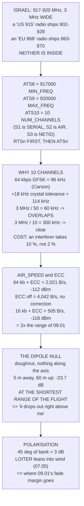

# 09.04 MAVLink telemetry on 917–920 MHz (and the antennas that make it work)

<!-- glance:start -->
<!-- generated by tools/build.py from curriculum/syllabus.yaml — edit the syllabus, not this block -->

| | |
|---|---|
| **Track** | Main path |
| **Difficulty** | Intermediate |
| **Time** | 1 h 30 min |
| **Hardware** | First flight (Hermon core) (stage 1) |
| **Software** | qgc |
| **Prerequisites** | [09.03 Failsafe: what happens when the link drops](09.03-failsafe-when-the-link-drops.md) |
| **Optional prerequisites** | [FRA.03 Antennas: gain, pattern, polarisation](../optional-foundations/rf-datalink/FRA.03-antennas-and-polarisation.md) |
| **Skip if** | You can constrain a 900 MHz SiK pair to 917-920 MHz, prove it from the radio's own parameters, and site antennas so the null is not pointed at the aircraft. |

<!-- glance:end -->

## What you will learn

- The SiK registers **with their real numbers** — and why S1, S2 and S3 are not the ones you want
- The command sequence, and why the **remote radio must be changed first**
- Why `NUM_CHANNELS` is **10 and not the default 50** — derived from Carson's rule, not chosen
- What a 3 MHz window costs you: one interferer takes **10 % of your packets instead of 2 %**
- The air-rate and ECC trade, in bytes per second and in decibels
- The antenna null: **−23.7 dB with the aircraft hovering overhead**, at the shortest range of the
  flight
- Why a 45° bank costs 3 dB of polarisation, and where 09.01's fade margin actually goes

## Why it matters

Israel's licence-exempt sub-GHz window is **917–920 MHz**, and neither of the two telemetry
radios you can buy is configured for it. A radio sold as "915 MHz" ships set up for the US band
902–928 MHz; one sold as "868 MHz" ships for the European 863–870. Neither default is inside the
window, so the radio has to be constrained before its first transmission.

That constraint is three register writes, and this lesson exists partly because getting them
wrong is easy and expensive. **The frequency registers are S8, S9 and S10** — S1 is the serial
speed, S2 is the air speed and S3 is the network ID. Writing 917000 to S1 does not move the radio
into the window; it sets the wire speed to a value that does not exist, and takes away the console
you were typing on.

The 3 MHz window then produces a second, derived constraint that nobody tells you about. A 64 kbps
GFSK signal is 96 kHz wide by Carson's rule, plus crystal tolerance — call it 114 kHz of channel.
Fifty channels in 3 MHz is 60 kHz apart, which **overlaps**, so `NUM_CHANNELS` has to come down to
about ten. And ten channels dilute an interferer five times less well than fifty do.

The second half of the lesson is antennas, and it contains the single most useful number in
module 09: with the aircraft hovering sixty metres above the ground station and five metres away
horizontally, both antennas vertical, you are **23.7 dB down** — at the shortest range of the
entire flight.

## Prerequisites

<!-- prereqs:start -->
## Prerequisites

You need these first:

- [09.03 Failsafe: what happens when the link drops](09.03-failsafe-when-the-link-drops.md)

### Optional prerequisite links

New to any of these? Take the foundation lesson first; skip it if you already know it.

- [FRA.03 Antennas: gain, pattern, polarisation](../optional-foundations/rf-datalink/FRA.03-antennas-and-polarisation.md)

Check your readiness: `python course.py why 09.04`
<!-- prereqs:end -->

## Concept

A SiK radio is a small microcontroller wrapped around a sub-GHz transceiver, running open-source
firmware, configured over its own serial port with AT commands. It is deliberately dumb: it
presents a transparent serial link and hides frequency hopping, error correction and a half-duplex
time-division protocol underneath.

Three groups of settings matter.

**Where it transmits.** `MIN_FREQ`, `MAX_FREQ` and `NUM_CHANNELS` define a hopping window. This
is the regulatory setting and the one that must be right before the radio is ever keyed.

**How fast and how robustly.** `AIR_SPEED` and `ECC` trade throughput against range and
reliability, and 09.01 showed that only about a quarter of the air rate reaches MAVLink.

**Who it talks to.** `NETID` must match across the pair and differ from anyone else nearby.

And then, outside the radio entirely, the antennas — which on a link this marginal are worth more
decibels than any register. A vertical dipole radiates in a doughnut with a deep null along its
own axis, and an aircraft hovering overhead sits in it.

## Technical explanation

### Level 1 — the registers, and the order

`ATSn` sets the **local** radio; `RTSn` sets the **remote** one over the air. Both must end up the
same.

| reg | name | Hermon | what it is |
|---|---|---|---|
| `ATS1` | `SERIAL_SPEED` | 57 | kbps on the **wire**. Not the air rate |
| `ATS2` | `AIR_SPEED` | 64 | kbps on the **air** |
| `ATS3` | `NETID` | 25 | match the pair, differ from the neighbours |
| `ATS4` | `TXPOWER` | 20 | dBm. 20 = 100 mW (09.05 says what is legal) |
| `ATS5` | `ECC` | 1 | Golay. Costs **half** the throughput |
| `ATS6` | `MAVLINK` | 1 | frame-aware: do not split a MAVLink message |
| **`ATS8`** | **`MIN_FREQ`** | **917000** | kHz |
| **`ATS9`** | **`MAX_FREQ`** | **920000** | kHz |
| **`ATS10`** | **`NUM_CHANNELS`** | **10** | derived in Level 2 |
| `ATS11` | `DUTY_CYCLE` | 100 | percent of time allowed to transmit (09.05) |

The sequence, on the ground radio's console:

```text
+++            (wait 1 s either side. No newline)
ATI5           list everything, and write it down FIRST
RTS8=917000    the REMOTE radio first, ALWAYS
RTS9=920000
RTS10=10
RT&W
RTZ            reboot it — the link drops here
ATS8=917000    now the LOCAL one
ATS9=920000
ATS10=10
AT&W
ATZ            and the link comes back
```

**Remote first, always.** Change the local radio first and it hops out of the remote's window
immediately, and you have no way to reach the remote except a wire and a desk.

### Level 2 — why ten channels

The window is 3 MHz wide. A US radio's default is 26 MHz with 50 channels — 520 kHz apart.

A 64 kbps GFSK signal at modulation index 0.5 occupies, by Carson's rule,
$2(\Delta f + f_m) = 2(16 + 32) = 96$ kHz. Add ±10 ppm of crystal tolerance at both ends
(±9.2 kHz each) and you need **114 kHz of channel**.

| channels | spacing | needed | fits? |
|---|---|---|---|
| 50 | 60 kHz | 114 kHz | **no** |
| 30 | 100 kHz | 114 kHz | **no** |
| 20 | 150 kHz | 114 kHz | yes |
| **10** | **300 kHz** | 114 kHz | yes |

The window holds at most **26** non-overlapping channels, and ten is the sensible value: 300 kHz
apart, comfortably clear, and a round number you will remember at the field.

And what it costs:

| channels | one interferer takes |
|---|---|
| 50 | 2.0 % of your slots |
| 20 | 5.0 % |
| **10** | **10.0 %** |
| 5 | 20.0 % |

Frequency hopping is a **dilution** strategy, and a narrow window dilutes less. That is the price
of the Israeli window, it is not optional, and ECC is what you have left to pay for it.

### Level 3 — air rate and ECC

| `AIR_SPEED` | ECC | usable B/s | sensitivity |
|---|---|---|---|
| 250 kb | on | 7,895 | −106 dBm |
| 128 kb | on | 4,042 | −109 dBm |
| **64 kb** | **on** | **2,021** | **−112 dBm** |
| 64 kb | off | 4,042 | −112 dBm |
| 32 kb | on | 1,011 | −115 dBm |
| 16 kb | on | 505 | −118 dBm |

The 64 kbps ECC-on row is 09.01's figure. It covers 08.05's hand-picked stream set (1,766 B/s)
with 12 % to spare, and does **not** cover what a ground station asks for on connect — 08.06
totalled that at 2,315 — so you still have to cut streams.

Turning ECC off doubles the throughput and removes the error correction from a link whose whole
job is to keep working as it fades. **Wrong for telemetry; right for a log download while
standing next to the aircraft.**

Dropping the air rate buys sensitivity: 16 kbps is 6 dB better than 64, which 09.01 prices at
twice the range — for 505 B/s, which is a heartbeat, a position, an attitude and a battery. That
is a real configuration for a long, boring survey where the only question you ask is "where are
you".

### Level 4 — the null, and the polarisation

A half-wave dipole at 917 MHz is 16.3 cm long and radiates in a doughnut about its own axis:

| angle from the axis | gain |
|---|---|
| 0° (straight up) | **−∞** |
| 5° | −21.1 dBi |
| 15° | −11.5 dBi |
| 30° | −5.4 dBi |
| 90° (the horizon) | **+2.1 dBi** |

Turn that into flying. Both antennas vertical; the angle that matters is the aircraft's
**elevation** above the ground station:

| ground distance | altitude | elevation | vs the horizon |
|---|---|---|---|
| **5 m** | 60 m | 85.2° | **−23.7 dB** |
| 20 m | 60 m | 71.6° | −11.9 dB |
| 50 m | 60 m | 50.2° | −5.1 dB |
| 100 m | 60 m | 31.0° | −1.9 dB |
| 1,000 m | 60 m | 3.4° | −0.0 dB |

**The top row is the one that bites.** The aircraft hovering almost directly overhead, at the
shortest range of the whole flight, is in the deepest part of the null. People report "it drops
out right above me and works fine at a kilometre", assume the radio is faulty, and buy another
one. It is the pattern, it is symmetric at both ends, and it is why the link gets *worse* as you
come home.

And polarisation is the other half of the geometry. Two dipoles at an angle lose
$-20\log_{10}(\cos\theta)$:

| angle | loss |
|---|---|
| 30° | 1.2 dB |
| **45°** | **3.0 dB** |
| 60° | 6.0 dB |
| 90° | ≫ 20 dB |

A 45° bank costs 3 dB on its own — and 07.05's LOITER leans the aircraft to hold position in
wind, so on a windy day you are flying permanently 10–15° off. **That is where 09.01's fade
margin goes.**

## Diagram



## Code

Lay out every SiK register with its real number and the command order, derive `NUM_CHANNELS` from
Carson's rule and crystal tolerance, tabulate the air-rate and ECC trade against 08.05's need,
compute the dipole pattern and turn it into elevation angles you will actually fly, and price
polarisation and ground planes.

```python
"""09.04 - a SiK radio inside Israel's 917-920 MHz window, and the antennas."""
import math

C = 299_792_458.0
WIN_LO_KHZ = 917_000
WIN_HI_KHZ = 920_000
AIR_KBPS = 64.0
USABLE_BPS = 2016         # 09.01's derivation

# the SiK registers that matter, with their REAL numbers
REGS = [
    (1, "SERIAL_SPEED", "57", "kbps on the WIRE. Not the air rate (09.01)"),
    (2, "AIR_SPEED", "64", "kbps on the AIR. Halve it for +3 dB"),
    (3, "NETID", "25", "must MATCH the pair and DIFFER from the neighbours"),
    (4, "TXPOWER", "20", "dBm. 20 = 100 mW. 09.05 says what is legal"),
    (5, "ECC", "1", "Golay. Costs HALF the throughput (09.01)"),
    (6, "MAVLINK", "1", "frame-aware: do not split a MAVLink message"),
    (7, "OPPRESEND", "1", "opportunistic resend when the slot is free"),
    (8, "MIN_FREQ", "917000", "kHz. THE ISRAELI WINDOW STARTS HERE"),
    (9, "MAX_FREQ", "920000", "kHz. AND ENDS HERE"),
    (10, "NUM_CHANNELS", "10", "hops. See section 2 -- this is DERIVED"),
    (11, "DUTY_CYCLE", "100", "percent of time allowed to transmit (09.05)"),
    (12, "LBT_RSSI", "0", "listen-before-talk threshold, 0 = off"),
    (15, "MAX_WINDOW", "131", "ms. The TDM slot length. Latency vs throughput"),
]

# antenna, gain dBi, pattern, where the null is
ANTENNAS = [
    ("1/4-wave whip + ground plane", 2.15, "doughnut",
     "STRAIGHT UP the antenna's axis"),
    ("1/2-wave dipole", 2.15, "doughnut", "straight up AND straight down"),
    ("3 dBi 'rubber duck'", 2.0, "doughnut, squashed", "up, and it is deeper"),
    ("6 dBi collinear", 6.0, "flat doughnut", "up, and MUCH deeper"),
    ("9 dBi patch", 9.0, "a beam, ~60 deg wide", "everywhere but the beam"),
]


def lam_m(f_khz):
    return C / (f_khz * 1000.0)


def carson_bw_khz(air_kbps, mod_index=0.5):
    """Carson's rule for GFSK: BW = 2(deviation + modulating frequency)."""
    fm = air_kbps / 2.0                   # kHz, half the bit rate
    dev = mod_index * air_kbps / 2.0      # kHz
    return 2.0 * (dev + fm)


def dipole_gain_db(theta_deg):
    """A half-wave dipole's pattern. theta from the antenna's AXIS."""
    t = math.radians(theta_deg)
    if abs(math.sin(t)) < 1e-9:
        return -60.0
    num = math.cos(math.pi / 2 * math.cos(t))
    return 20 * math.log10(max(abs(num / math.sin(t)), 1e-6)) + 2.15


def elevation_from(ground_dist_m, alt_m):
    return math.degrees(math.atan2(alt_m, max(ground_dist_m, 1e-6)))


def bar(t):
    print("\n" + "=" * 70)
    print(t)
    print("=" * 70)


if __name__ == "__main__":
    bar("1. THE REGISTERS, WITH THEIR REAL NUMBERS")
    print("  A SiK radio is configured over its own serial port with AT")
    print("  commands. ATSn sets the LOCAL radio, RTSn sets the REMOTE")
    print("  one over the air, and both have to end up the same.")
    print(f"  {'reg':>5s} {'name':14s} {'Hermon':>9s}  what it is")
    for n, name, val, why in REGS:
        print(f"  ATS{n:<2d} {name:14s} {val:>9s}  {why}")
    print("  THE REGISTER NUMBERS ARE NOT GUESSABLE. S1 is the SERIAL")
    print("  speed and S2 is the AIR speed -- two different things with")
    print("  similar names -- and the frequency registers are S8, S9 and")
    print("  S10. Setting S1 to 917000 does not move the radio into the")
    print("  Israeli window; it sets the wire speed to a value that does")
    print("  not exist, and you lose the console you were typing on.")
    print("\n  THE SEQUENCE, in full, on the GROUND radio's console:")
    for line in ("+++            (wait 1 s either side. No newline)",
                 "ATI5           list everything, and write it down FIRST",
                 "RTS8=917000    the REMOTE radio first, ALWAYS",
                 "RTS9=920000",
                 "RTS10=10",
                 "RT&W           write it",
                 "RTZ            reboot it -- the link drops here",
                 "ATS8=917000    now the LOCAL one",
                 "ATS9=920000",
                 "ATS10=10",
                 "AT&W",
                 "ATZ            and the link comes back"):
        print(f"    {line}")
    print("  REMOTE FIRST, ALWAYS. Change the local radio first and it")
    print("  hops out of the remote's window immediately, and you have")
    print("  no way to reach the remote except a wire and a desk.")

    bar("2. WHY NUM_CHANNELS IS 10 AND NOT THE DEFAULT 50")
    span_khz = WIN_HI_KHZ - WIN_LO_KHZ
    need = carson_bw_khz(AIR_KBPS)
    tol_khz = 917000 * 10e-6 * 2          # +/-10 ppm at each end
    total_need = need + tol_khz
    print(f"  The Israeli licence-exempt window is"
          f" {WIN_LO_KHZ / 1000:.0f}-{WIN_HI_KHZ / 1000:.0f} MHz:")
    print(f"  {span_khz / 1000:.0f} MHz WIDE. A US radio's default is"
          f" 902-928 MHz, 26 MHz, with")
    print("  50 channels. Keep 50 channels in a 3 MHz window and:")
    print(f"  {'channels':>9s} {'spacing':>10s} {'need':>9s} {'fits?':>7s}")
    for n in (50, 30, 20, 16, 10, 8, 5):
        sp = span_khz / n
        print(f"  {n:9d} {sp:8.0f}kHz {total_need:7.0f}kHz"
              f" {('yes' if sp >= total_need else 'NO'):>7s}")
    print(f"  THE SIGNAL ITSELF IS {need:.0f} kHz WIDE (Carson's rule for")
    print(f"  {AIR_KBPS:.0f} kbps GFSK), plus {tol_khz:.0f} kHz for"
          f" +/-10 ppm of crystal")
    print(f"  tolerance at both ends: {total_need:.0f} kHz of channel needed.")
    max_ch = int(span_khz // total_need)
    print(f"  SO THE WINDOW HOLDS AT MOST {max_ch} NON-OVERLAPPING CHANNELS,")
    print(f"  and 10 is the sensible value: {span_khz / 10:.0f} kHz apart,"
          f" comfortably")
    print("  clear, and a round number you will remember at the field.")
    print("\n  AND WHAT YOU GIVE UP BY HAVING TEN INSTEAD OF FIFTY:")
    for n in (50, 20, 10, 5):
        print(f"    {n:2d} channels: one interferer costs you"
              f" {100 / n:5.1f} % of your slots")
    print("  FREQUENCY HOPPING IS A DILUTION STRATEGY, and a narrow")
    print("  window dilutes less. Ten channels means one persistent")
    print("  interferer takes 10 % of your packets rather than 2 %. That")
    print("  is the price of the window, it is not optional, and ECC")
    print("  (ATS5) is what you have left to pay for it.")

    bar("3. AIR RATE, ECC AND THE THREE-WAY TRADE")
    print("  Three registers move the same three quantities: throughput,")
    print("  range and latency. They cannot all go up.")
    print(f"  {'AIR_SPEED':>10s} {'ECC':>4s} {'usable B/s':>11s}"
          f" {'vs 08.05 need':>14s} {'sens':>7s}")
    for air in (250, 128, 64, 32, 16):
        for ecc in (1, 0):
            raw = air * 1000 / 8
            usable = raw * (0.5 if ecc else 1.0) * (32 / 38) * 0.60
            sens = -112.0 - 3 * math.log2(64.0 / air)
            print(f"  {air:7d}kb {ecc:4d} {usable:11.0f}"
                  f" {usable / 1766 * 100:12.0f} % {sens:6.0f}dBm")
    print("  READ THE 64 kbps, ECC-ON ROW. 2,021 B/s is 09.01's figure")
    print("  and it covers 08.05's hand-picked stream set (1,766 B/s)")
    print("  with 12 % to spare. It does NOT cover what a ground station")
    print("  asks for on connect -- 08.06 totalled that at 2,315 -- so")
    print("  you still have to cut streams, and that lesson says which.")
    print("  TURNING ECC OFF DOUBLES THE THROUGHPUT and removes the")
    print("  error correction, on a link whose whole job is to keep")
    print("  working as it fades. THAT IS THE WRONG TRADE for telemetry")
    print("  and the right one for a log download you are doing while")
    print("  standing next to the aircraft.")
    print("  AND DROPPING THE AIR RATE BUYS SENSITIVITY: 16 kbps is 6 dB")
    print("  better than 64, which 09.01 prices at 2x the range -- for")
    print("  505 B/s with ECC on, which is a heartbeat, a position, an")
    print("  attitude and a battery, and nothing else. THAT IS A REAL")
    print("  CONFIGURATION for a long, boring survey where the only")
    print("  question you ever ask the aircraft is 'where are you'.")

    bar("4. THE ANTENNA PATTERN, AND THE NULL YOU WILL FLY INTO")
    print(f"  A half-wave dipole at {917:.0f} MHz is"
          f" {lam_m(917000) / 2 * 100:.1f} cm long, and it")
    print("  radiates in a DOUGHNUT around its own axis. Along the axis")
    print("  there is nothing at all.")
    print(f"  {'angle from axis':>16s} {'gain':>8s}  where that points")
    for th, where in ((0, "STRAIGHT UP, if the antenna is vertical"),
                      (5, "almost overhead"),
                      (15, "nearly overhead"),
                      (30, "high above you"),
                      (45, "a 45-degree climb"),
                      (60, ""),
                      (90, "the horizon. MAXIMUM GAIN")):
        print(f"  {th:13d} deg {dipole_gain_db(th):7.1f} dBi  {where}")
    print("  NOW TURN THAT INTO FLYING. Ground antenna VERTICAL, aircraft")
    print("  antenna VERTICAL, and the angle that matters is the")
    print("  ELEVATION of the aircraft above the ground station:")
    print(f"  {'ground dist':>12s} {'altitude':>9s} {'elevation':>10s}"
          f" {'gain':>8s} {'vs horizon':>11s}")
    for d, alt in ((5, 60), (20, 60), (50, 60), (100, 60), (300, 60),
                   (1000, 60), (1000, 120)):
        el = elevation_from(d, alt)
        g = dipole_gain_db(90 - el)
        print(f"  {d:9d} m {alt:7d} m {el:8.1f} deg {g:7.1f} dBi"
              f" {g - dipole_gain_db(90):10.1f} dB")
    print("  THE TOP ROW IS THE ONE THAT BITES: the aircraft hovering")
    print("  almost directly over the ground station, at the SHORTEST")
    print("  range of the whole flight, IN THE DEEPEST NULL. People")
    print("  report 'it drops out right above me and works fine at a")
    print("  kilometre' and assume the radio is faulty. It is the")
    print("  pattern, it is symmetric on both ends, and it is why the")
    print("  link gets WORSE as you come home.")
    print("\n  WHAT TO DO ABOUT IT, in order of how much it helps:")
    fixes = [
        ("tilt the GROUND antenna 30-45 deg", "the null moves off vertical"),
        ("mount the AIRCRAFT antenna horizontally", "but see polarisation"),
        ("use two ground antennas at right angles", "if the radio supports it"),
        ("do not hover over the ground station", "free, and you were not"),
        ("accept it", "it is the shortest range you will ever have"),
    ]
    for a, b in fixes:
        print(f"    {a:38s} {b}")
    print("\n  AND POLARISATION, which is the other half of the geometry:")
    for ang, loss in ((0, 0.0), (30, 1.2), (45, 3.0), (60, 6.0),
                      (80, 15.2), (90, 30.0)):
        print(f"    antennas {ang:2d} deg apart: {loss:4.1f} dB lost"
              f"{'   <- a BANKED aircraft' if ang == 45 else ''}")
    print("  A 45-DEGREE BANK COSTS YOU 3 dB, all by itself, on top of")
    print("  everything else -- and 07.05's LOITER leans the aircraft to")
    print("  hold position in wind, so on a windy day you are flying")
    print("  permanently 10-15 degrees off. THAT is the fade margin of")
    print("  09.01, and this is where it goes.")

    bar("5. THE GROUND PLANE, AND WHERE TO PUT THE RADIO")
    print("  A quarter-wave whip is HALF AN ANTENNA. The other half is")
    print("  the ground plane it is mounted on, and without one the")
    print("  pattern is not a doughnut and the impedance is not 50 ohms.")
    print(f"  A quarter wave at 918 MHz is"
          f" {lam_m(918000) / 4 * 100:.1f} cm; the ground plane wants to be")
    print(f"  at least that in every direction --"
          f" {lam_m(918000) / 4 * 2 * 100:.0f} cm across.")
    sites = [
        ("on the aircraft, hanging below the frame", "GOOD",
         "the airframe IS the ground plane, and it is above the antenna"),
        ("on the aircraft, cable-tied to an arm", "BAD",
         "carbon fibre is conductive: it detunes AND blocks (04.01)"),
        ("on the aircraft, next to the pack leads", "BAD",
         "04.03 measured those fields. Noise, not detuning"),
        ("ground, on a car roof", "MIXED",
         "an excellent ground plane and a reflector that makes nulls"),
        ("ground, on a 2 m plastic mast", "BEST",
         "09.01: altitude is the cheapest decibels, at BOTH ends"),
        ("ground, in your hand", "BAD",
         "you are 70 % salt water and you are absorbing it"),
    ]
    print(f"  {'where':42s} {'':6s}")
    for a, verdict, why in sites:
        print(f"  {a:42s} {verdict:6s}")
        print(f"  {'':42s} {why}")
    print("  THE HAND ONE IS NOT A JOKE. A body absorbs several")
    print("  decibels at 900 MHz, and the usual posture -- holding the")
    print("  tablet with the radio behind it, facing the aircraft --")
    print("  puts you exactly between the two antennas. Put the ground")
    print("  radio on a mast and stand beside it.")
```

Output:

```text

======================================================================
1. THE REGISTERS, WITH THEIR REAL NUMBERS
======================================================================
  A SiK radio is configured over its own serial port with AT
  commands. ATSn sets the LOCAL radio, RTSn sets the REMOTE
  one over the air, and both have to end up the same.
    reg name              Hermon  what it is
  ATS1  SERIAL_SPEED          57  kbps on the WIRE. Not the air rate (09.01)
  ATS2  AIR_SPEED             64  kbps on the AIR. Halve it for +3 dB
  ATS3  NETID                 25  must MATCH the pair and DIFFER from the neighbours
  ATS4  TXPOWER               20  dBm. 20 = 100 mW. 09.05 says what is legal
  ATS5  ECC                    1  Golay. Costs HALF the throughput (09.01)
  ATS6  MAVLINK                1  frame-aware: do not split a MAVLink message
  ATS7  OPPRESEND              1  opportunistic resend when the slot is free
  ATS8  MIN_FREQ          917000  kHz. THE ISRAELI WINDOW STARTS HERE
  ATS9  MAX_FREQ          920000  kHz. AND ENDS HERE
  ATS10 NUM_CHANNELS          10  hops. See section 2 -- this is DERIVED
  ATS11 DUTY_CYCLE           100  percent of time allowed to transmit (09.05)
  ATS12 LBT_RSSI               0  listen-before-talk threshold, 0 = off
  ATS15 MAX_WINDOW           131  ms. The TDM slot length. Latency vs throughput
  THE REGISTER NUMBERS ARE NOT GUESSABLE. S1 is the SERIAL
  speed and S2 is the AIR speed -- two different things with
  similar names -- and the frequency registers are S8, S9 and
  S10. Setting S1 to 917000 does not move the radio into the
  Israeli window; it sets the wire speed to a value that does
  not exist, and you lose the console you were typing on.

  THE SEQUENCE, in full, on the GROUND radio's console:
    +++            (wait 1 s either side. No newline)
    ATI5           list everything, and write it down FIRST
    RTS8=917000    the REMOTE radio first, ALWAYS
    RTS9=920000
    RTS10=10
    RT&W           write it
    RTZ            reboot it -- the link drops here
    ATS8=917000    now the LOCAL one
    ATS9=920000
    ATS10=10
    AT&W
    ATZ            and the link comes back
  REMOTE FIRST, ALWAYS. Change the local radio first and it
  hops out of the remote's window immediately, and you have
  no way to reach the remote except a wire and a desk.

======================================================================
2. WHY NUM_CHANNELS IS 10 AND NOT THE DEFAULT 50
======================================================================
  The Israeli licence-exempt window is 917-920 MHz:
  3 MHz WIDE. A US radio's default is 902-928 MHz, 26 MHz, with
  50 channels. Keep 50 channels in a 3 MHz window and:
   channels    spacing      need   fits?
         50       60kHz     114kHz      NO
         30      100kHz     114kHz      NO
         20      150kHz     114kHz     yes
         16      188kHz     114kHz     yes
         10      300kHz     114kHz     yes
          8      375kHz     114kHz     yes
          5      600kHz     114kHz     yes
  THE SIGNAL ITSELF IS 96 kHz WIDE (Carson's rule for
  64 kbps GFSK), plus 18 kHz for +/-10 ppm of crystal
  tolerance at both ends: 114 kHz of channel needed.
  SO THE WINDOW HOLDS AT MOST 26 NON-OVERLAPPING CHANNELS,
  and 10 is the sensible value: 300 kHz apart, comfortably
  clear, and a round number you will remember at the field.

  AND WHAT YOU GIVE UP BY HAVING TEN INSTEAD OF FIFTY:
    50 channels: one interferer costs you   2.0 % of your slots
    20 channels: one interferer costs you   5.0 % of your slots
    10 channels: one interferer costs you  10.0 % of your slots
     5 channels: one interferer costs you  20.0 % of your slots
  FREQUENCY HOPPING IS A DILUTION STRATEGY, and a narrow
  window dilutes less. Ten channels means one persistent
  interferer takes 10 % of your packets rather than 2 %. That
  is the price of the window, it is not optional, and ECC
  (ATS5) is what you have left to pay for it.

======================================================================
3. AIR RATE, ECC AND THE THREE-WAY TRADE
======================================================================
  Three registers move the same three quantities: throughput,
  range and latency. They cannot all go up.
   AIR_SPEED  ECC  usable B/s  vs 08.05 need    sens
      250kb    1        7895          447 %   -106dBm
      250kb    0       15789          894 %   -106dBm
      128kb    1        4042          229 %   -109dBm
      128kb    0        8084          458 %   -109dBm
       64kb    1        2021          114 %   -112dBm
       64kb    0        4042          229 %   -112dBm
       32kb    1        1011           57 %   -115dBm
       32kb    0        2021          114 %   -115dBm
       16kb    1         505           29 %   -118dBm
       16kb    0        1011           57 %   -118dBm
  READ THE 64 kbps, ECC-ON ROW. 2,021 B/s is 09.01's figure
  and it covers 08.05's hand-picked stream set (1,766 B/s)
  with 12 % to spare. It does NOT cover what a ground station
  asks for on connect -- 08.06 totalled that at 2,315 -- so
  you still have to cut streams, and that lesson says which.
  TURNING ECC OFF DOUBLES THE THROUGHPUT and removes the
  error correction, on a link whose whole job is to keep
  working as it fades. THAT IS THE WRONG TRADE for telemetry
  and the right one for a log download you are doing while
  standing next to the aircraft.
  AND DROPPING THE AIR RATE BUYS SENSITIVITY: 16 kbps is 6 dB
  better than 64, which 09.01 prices at 2x the range -- for
  505 B/s with ECC on, which is a heartbeat, a position, an
  attitude and a battery, and nothing else. THAT IS A REAL
  CONFIGURATION for a long, boring survey where the only
  question you ever ask the aircraft is 'where are you'.

======================================================================
4. THE ANTENNA PATTERN, AND THE NULL YOU WILL FLY INTO
======================================================================
  A half-wave dipole at 917 MHz is 16.3 cm long, and it
  radiates in a DOUGHNUT around its own axis. Along the axis
  there is nothing at all.
   angle from axis     gain  where that points
              0 deg   -60.0 dBi  STRAIGHT UP, if the antenna is vertical
              5 deg   -21.1 dBi  almost overhead
             15 deg   -11.5 dBi  nearly overhead
             30 deg    -5.4 dBi  high above you
             45 deg    -1.9 dBi  a 45-degree climb
             60 deg     0.4 dBi  
             90 deg     2.1 dBi  the horizon. MAXIMUM GAIN
  NOW TURN THAT INTO FLYING. Ground antenna VERTICAL, aircraft
  antenna VERTICAL, and the angle that matters is the
  ELEVATION of the aircraft above the ground station:
   ground dist  altitude  elevation     gain  vs horizon
          5 m      60 m     85.2 deg   -21.5 dBi      -23.7 dB
         20 m      60 m     71.6 deg    -9.7 dBi      -11.9 dB
         50 m      60 m     50.2 deg    -2.9 dBi       -5.1 dB
        100 m      60 m     31.0 deg     0.3 dBi       -1.9 dB
        300 m      60 m     11.3 deg     1.9 dBi       -0.2 dB
       1000 m      60 m      3.4 deg     2.1 dBi       -0.0 dB
       1000 m     120 m      6.8 deg     2.1 dBi       -0.1 dB
  THE TOP ROW IS THE ONE THAT BITES: the aircraft hovering
  almost directly over the ground station, at the SHORTEST
  range of the whole flight, IN THE DEEPEST NULL. People
  report 'it drops out right above me and works fine at a
  kilometre' and assume the radio is faulty. It is the
  pattern, it is symmetric on both ends, and it is why the
  link gets WORSE as you come home.

  WHAT TO DO ABOUT IT, in order of how much it helps:
    tilt the GROUND antenna 30-45 deg      the null moves off vertical
    mount the AIRCRAFT antenna horizontally but see polarisation
    use two ground antennas at right angles if the radio supports it
    do not hover over the ground station   free, and you were not
    accept it                              it is the shortest range you will ever have

  AND POLARISATION, which is the other half of the geometry:
    antennas  0 deg apart:  0.0 dB lost
    antennas 30 deg apart:  1.2 dB lost
    antennas 45 deg apart:  3.0 dB lost   <- a BANKED aircraft
    antennas 60 deg apart:  6.0 dB lost
    antennas 80 deg apart: 15.2 dB lost
    antennas 90 deg apart: 30.0 dB lost
  A 45-DEGREE BANK COSTS YOU 3 dB, all by itself, on top of
  everything else -- and 07.05's LOITER leans the aircraft to
  hold position in wind, so on a windy day you are flying
  permanently 10-15 degrees off. THAT is the fade margin of
  09.01, and this is where it goes.

======================================================================
5. THE GROUND PLANE, AND WHERE TO PUT THE RADIO
======================================================================
  A quarter-wave whip is HALF AN ANTENNA. The other half is
  the ground plane it is mounted on, and without one the
  pattern is not a doughnut and the impedance is not 50 ohms.
  A quarter wave at 918 MHz is 8.2 cm; the ground plane wants to be
  at least that in every direction -- 16 cm across.
  where                                            
  on the aircraft, hanging below the frame   GOOD  
                                             the airframe IS the ground plane, and it is above the antenna
  on the aircraft, cable-tied to an arm      BAD   
                                             carbon fibre is conductive: it detunes AND blocks (04.01)
  on the aircraft, next to the pack leads    BAD   
                                             04.03 measured those fields. Noise, not detuning
  ground, on a car roof                      MIXED 
                                             an excellent ground plane and a reflector that makes nulls
  ground, on a 2 m plastic mast              BEST  
                                             09.01: altitude is the cheapest decibels, at BOTH ends
  ground, in your hand                       BAD   
                                             you are 70 % salt water and you are absorbing it
  THE HAND ONE IS NOT A JOKE. A body absorbs several
  decibels at 900 MHz, and the usual posture -- holding the
  tablet with the radio behind it, facing the aircraft --
  puts you exactly between the two antennas. Put the ground
  radio on a mast and stand beside it.
```

## Exercise

### Exercise 09.04-E1 — Constrain the pair, and prove it `[hardware]`

Connect to the ground radio, run `ATI5` and save the full register dump to a file **before**
changing anything. Then constrain both radios to 917–920 MHz with ten channels, remote first.
Run `ATI5` again on both and diff the two dumps. Confirm S8, S9 and S10 changed and nothing else
did. The diff is your proof; keep it with the aircraft's documents.

### Exercise 09.04-E2 — Derive your own `NUM_CHANNELS` `[analysis]`

Recompute Level 2 for the air rates 16, 32, 64, 128 and 250 kbps. For each one, find the maximum
number of non-overlapping channels the 3 MHz window holds, and the value you would actually set.
Then answer: does a lower air rate let you hop more, and is that worth anything?

### Exercise 09.04-E3 — Map your own null `[hardware]`

With the aircraft on a bench and the telemetry connected, carry the **ground** radio on a walk: 5,
10, 20, 50 and 100 m away, at ground level, logging RSSI at each. Then repeat with the ground
radio raised on a 2 m mast, and again with it tilted 45°. Plot all three. You are measuring the
pattern, and the tilted case should be visibly better close in and slightly worse far out.

### Exercise 09.04-E4 — Fly the null `[hardware]`

Fly a simple profile: hover at 40 m directly over the ground station for 30 seconds, then fly
out to 300 m at the same altitude and hover again. Log RSSI and packet loss throughout. Compare
the two hovers. Level 4 predicts the close one is 15–20 dB worse; report what you actually
measured and whether the link degraded or just weakened.

## Expected result

**09.04-E1**: exactly three registers changed on each radio, and the link came back after both
reboots. If it did not come back, you changed the local radio first — Level 1's warning — and
the fix is a USB cable and the remote radio on a desk.

**09.04-E2**: lower air rates are narrower and do fit more channels: 16 kbps needs about 42 kHz
of channel, so the window holds around 70. Whether it is worth anything depends on interference —
more channels dilute an interferer better, and if your window is quiet it buys nothing at all.

**09.04-E3**: the ground-level walk should show RSSI *rising* for the first few metres as you
leave the null, which looks wrong and is correct. The mast helps everywhere; the 45° tilt helps
close in and costs a little at range, which is the trade Level 4 describes.

**09.04-E4**: expect the overhead hover to be substantially worse than the distant one — 15–20 dB
is typical — and expect the link to still *work*, because you have 130 dB of budget and are
spending 24 of it. What you are demonstrating is that RSSI is a geometry measurement, not a range
measurement, which is 09.02's LQ-versus-RSSI argument arriving from a different direction.

## Troubleshooting

**The link did not come back after the configuration.** You changed the local radio before the
remote one. Connect the remote radio directly over USB and set it to match. This is why Level 1
puts `RTSn` first in bold.

**`+++` does nothing.** It needs a full second of silence before and after, and **no newline**.
Most terminal programs send one. Use a terminal that lets you suppress it, or use the ground
station's built-in SiK configuration screen.

**The registers are set correctly and the link is poor.** Check `NETID` matches, check both
radios actually rebooted, and check `ATI5` on *both* rather than assuming `RTSn` took. Then read
Level 4, because it is probably the antennas.

**RSSI is worse close in than far away.** That is the null, and it is correct (Level 4). Tilt the
ground antenna, or stop hovering over the ground station.

**Telemetry is fine hovering and drops out in fast forward flight.** Polarisation. The aircraft
is pitched forward by 07.02's lean angle, and at 15° you have already lost 0.3 dB — but combined
with a bank in a turn it adds up, and the turns are where it drops.

**Throughput is far below 2,016 B/s.** Check `ECC` (halves it), `AIR_SPEED` (may not be 64), and
`MAVLINK` mode. Then check `DUTY_CYCLE` — if it is below 100 the radio is deliberately idling,
and 09.05 is where you find out whether it should be.

> [!WARNING]
> **Do not transmit outside 917–920 MHz in Israel, including during configuration.** A radio
> powered up with its factory 902–928 MHz settings is transmitting in a band that is not
> licence-exempt here, and "I was only testing" is not a defence. Configure the radios **before**
> the first power-up if you can, on a bench, at the lowest `TXPOWER` the firmware allows, and with
> the antennas fitted — a transmitter keyed without an antenna can damage its own output stage.
> 09.05 has the regulatory detail and it is the lesson that makes this a rule rather than advice.

## Common mistakes

- **Writing to S1, S2 and S3.** They are the serial speed, the air speed and the network ID. The
  frequency registers are **S8, S9, S10**.
- **Changing the local radio first.** You lose the remote one, and the recovery is a desk and a
  cable.
- **Leaving `NUM_CHANNELS` at 50.** In a 3 MHz window that is 60 kHz apart and the channels
  overlap. Ten.
- **Forgetting `AT&W`.** Without it the settings are live and not saved, and the next power cycle
  undoes everything.
- **Blaming the radio for the overhead dropout.** It is the antenna pattern, it is symmetric, and
  every dipole does it.
- **Mounting the aircraft antenna along a carbon arm.** Carbon is conductive: it detunes and
  blocks (04.01). Hang it below the frame instead.
- **Holding the ground radio.** You are 70 % salt water and several decibels of loss, usually
  positioned exactly between the two antennas.

## Knowledge check

<details>
<summary>Which SiK registers set the hopping window, and what happens if you use S1, S2 and
S3?</summary>

**S8 (`MIN_FREQ`), S9 (`MAX_FREQ`) and S10 (`NUM_CHANNELS`)**. S1 is `SERIAL_SPEED`, S2 is
`AIR_SPEED` and S3 is `NETID` — so writing 917000 to S1 tries to set the wire speed to a value
that does not exist and takes away the console you were typing on. The register numbers are not
guessable and two of them have confusingly similar names.
</details>

<details>
<summary>Why must the remote radio be configured before the local one?</summary>

Because the moment the local radio's window changes, it stops hopping where the remote one is
listening — and the remote radio is on the aircraft. You would then have no way to reach it except
a USB cable and a desk. `RTSn` writes to the remote radio *over the existing link*, so you spend
the link you are about to break on the thing you cannot otherwise reach.
</details>

<details>
<summary>Why is `NUM_CHANNELS` 10 rather than the default 50, and what does that cost?</summary>

Because a 64 kbps GFSK signal is 96 kHz wide by Carson's rule, plus 18 kHz of crystal tolerance —
**114 kHz of channel** — and 3 MHz divided by 50 is only 60 kHz, so the channels would overlap. Ten
gives 300 kHz, comfortably clear. The cost is dilution: with ten channels one persistent
interferer takes 10 % of your packets instead of 2 %.
</details>

<details>
<summary>ECC doubles nothing and halves your throughput. When would you turn it off?</summary>

When the link is not fading and you want the bytes: a **log download while standing next to the
aircraft**, or a bench session. Never for flight telemetry, where the entire job of the link is to
keep working as the signal weakens — and where Level 2 just told you that the narrow Israeli
window gives an interferer five times more of your packets than a wide one would.
</details>

<details>
<summary>The aircraft is hovering 60 m up, 5 m away. How much signal have you lost, and why?</summary>

**23.7 dB**, because both antennas are vertical dipoles and the aircraft is at 85° elevation —
almost exactly in the null along the antenna's own axis. It is the shortest range of the entire
flight and the worst signal of it. This is the origin of "it drops out right above me and works
fine at a kilometre", and it is the pattern rather than a fault.
</details>

<details>
<summary>What does a 45° bank cost, and why does it matter more on a windy day?</summary>

**3 dB** of polarisation mismatch, from $-20\log_{10}(\cos 45°)$. It matters more in wind because
07.05's LOITER leans the aircraft into the wind to hold position, so instead of being level most
of the time and banked occasionally, you are flying permanently 10–15° off — a standing loss
rather than an occasional one. This is a large part of what 09.01's fade margin is for.
</details>

<details>
<summary>Why is a quarter-wave whip "half an antenna", and where should the ground radio live?</summary>

Because the other half is the **ground plane** it is mounted on — without one, the pattern is not
a doughnut and the impedance is not 50 Ω. A quarter wave at 918 MHz is 8.2 cm, so the plane wants
to be about 16 cm across. The ground radio belongs on a **2 m plastic mast**, standing beside it:
09.01 showed altitude is the cheapest decibels and it applies at both ends, and a body between the
antennas costs several decibels of absorption.
</details>

## Practical challenge

**Commission the link, and document it as a configuration you could reproduce.**

Produce three artefacts. First, the `ATI5` dumps from both radios, before and after, with the diff
— that is your evidence the pair is inside 917–920 MHz, and it is the thing to show if anyone
asks. Second, a one-page settings sheet: every register you changed with its value and the reason,
your `NETID` and where it is recorded, and the `AIR_SPEED`/`ECC` combination with the throughput
it implies.

Third, and most useful: the **antenna page**. A sketch of where each antenna is mounted and why;
the measured RSSI from E3 at five distances for three ground configurations; your chosen ground
antenna height and tilt; and the one operational rule that falls out of it. Mine reads "do not
hover over the ground station, and if you must, expect twenty decibels".

Keep all three with 09.03's failsafe card. Between them they are the aircraft's radio
documentation, and they take an afternoon to produce and years to be glad of.

## You can skip this if

You can constrain a 900 MHz SiK pair to 917–920 MHz, prove it from the radio's own parameters,
and site antennas so the null is not pointed at the aircraft.

## Go deeper

- [04.01](../04-frame-and-assembly/04.01-frames.md) (earlier): carbon fibre, which is conductive
  and is not a place to tie an antenna.
- [04.03](../04-frame-and-assembly/04.03-wiring-harness.md) (earlier): the pack-lead fields that
  a receiver antenna should not sit in.
- [07.05](../07-control/07.05-velocity-position-and-modes.md) (earlier): the lean angle that
  becomes a polarisation loss.
- [08.05](../08-flight-controller/08.05-mavlink.md) (earlier): the 1,766 B/s this link has to
  carry.
- [08.06](../08-flight-controller/08.06-ground-stations.md) (earlier): the 2,315 B/s it asks for,
  and which streams to cut.
- [09.01](09.01-rf-and-link-budget.md) (earlier): the fade margin that Level 4 spends.
- [09.05](09.05-spectrum-and-regulation.md) (next): why the window is 917–920, what `TXPOWER` and
  `DUTY_CYCLE` are allowed to be, and the three-track Israeli approval system.
- The SiK radio documentation, including the full `ATSn` register list:
  https://ardupilot.org/copter/docs/common-sik-telemetry-radio.html
- A reference on dipole radiation patterns and polarisation loss:
  https://en.wikipedia.org/wiki/Dipole_antenna

> **Ask your teacher:** *"We constrained the pair to 917–920 MHz with ten channels — ten because a
> 64 kbps GFSK signal plus crystal tolerance needs 114 kHz and fifty channels would only be 60 kHz
> apart. We also measured about 24 dB of loss with the aircraft hovering overhead. Do you tilt the
> ground antenna as a matter of course, and have you ever had an interference problem that the
> narrow window made worse?"*

## Progress checkpoint

Run `python course.py complete 09.04` once your before/after `ATI5` diff and your antenna page
exist. Next: [09.05](09.05-spectrum-and-regulation.md) — why the window is where it is, what you
are allowed to transmit in it, and what the same question looks like under Part 107.
