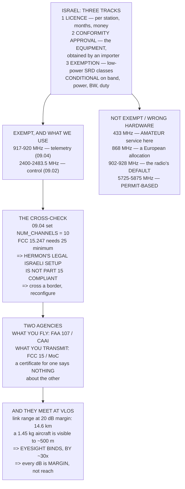

# 09.05 Spectrum and regulation: what you may transmit, in Israel and under Part 107

<!-- glance:start -->
<!-- generated by tools/build.py from curriculum/syllabus.yaml — edit the syllabus, not this block -->

| | |
|---|---|
| **Track** | Main path |
| **Difficulty** | Intermediate |
| **Time** | 1 h 15 min |
| **Hardware** | none |
| **Software** | none |
| **Prerequisites** | [09.04 MAVLink telemetry on 917-920 MHz (and the antennas that make it work)](09.04-telemetry-917.md) |
| **Optional prerequisites** | [FRA.04 Protocols and bands: SBUS, CRSF, MAVLink, and who owns the spectrum](../optional-foundations/rf-datalink/FRA.04-protocols-and-bands.md) |
| **Version-sensitive** | yes — see [curriculum/versions.yaml](../curriculum/versions.yaml) |
| **Skip if** | You can say which bands and powers you may legally transmit on in Israel, and what Part 107 and FCC Part 15 say for the US side. |

<!-- glance:end -->

## What you will learn

- Israel's **three tracks** — licence, conformity approval, exemption — and which one you are on
- Which bands are licence-exempt here, which are not, and which are **the wrong hardware** rather
  than the wrong setting
- The cross-check that makes the point: **Hermon's legal Israeli configuration is not Part 15
  compliant in the US**
- That **two different agencies** answer "what may I fly" and "what may I transmit", and a
  certificate for one says nothing about the other
- Why your **legal range is set by your eyesight**, by a factor of about thirty — and what that
  means for every decibel module 09 found you
- Why this course deliberately requires no FPV video link
- The seven-question check, and the duty-cycle condition that would decide your whole telemetry
  architecture

> **Version-sensitive.** Every regulatory figure here carries a confidence label — **[V]**
> verified against a primary source, **[S]** from a search snippet, **[E]** an estimate — and was
> checked in **September 2026**. Allocations get reassigned, thresholds move, and the Israeli
> import exemption alone changed three times in 2025–26. **This lesson is a method and a snapshot,
> not legal advice.** Verify every number against the current regulator before you transmit.

## Why it matters

Module 09 has spent four lessons finding decibels. This one says what you may do with them, and
the answer is narrower than the radio's capability by a large factor — which is the correct
relationship and is worth stating plainly.

Three things in here are genuinely useful rather than merely cautionary.

The first is that two of the radios on sale are **the wrong hardware for Israel**, not the wrong
setting. A 433 MHz telemetry radio transmits in the amateur service here; an "868 MHz" one is
built for a European allocation Israel does not share. No amount of configuration fixes either.

The second is a cross-check that shows what "licence-exempt" actually means. 09.04 set
`NUM_CHANNELS` to 10, derived from the 3 MHz Israeli window. FCC Part 15.247 requires at least
**25** hopping channels for a compliant FHSS system in 902–928 MHz. So **Hermon's legal Israeli
configuration would not be Part 15 compliant in the United States** — not on power, which is well
under either limit, but on channel count. Exemption is a set of conditions, and the conditions
differ.

The third is the scale comparison. 09.01 gave you 14.6 km of link at a 20 dB margin. A 1.45 kg
aircraft is invisible beyond about 500 m. **Your legal range is set by your eyesight, not your
radio**, by roughly thirty to one — so every decibel this module found you is *margin*, which is
the right way to spend it.

## Prerequisites

<!-- prereqs:start -->
## Prerequisites

You need these first:

- [09.04 MAVLink telemetry on 917-920 MHz (and the antennas that make it work)](09.04-telemetry-917.md)

### Optional prerequisite links

New to any of these? Take the foundation lesson first; skip it if you already know it.

- [FRA.04 Protocols and bands: SBUS, CRSF, MAVLink, and who owns the spectrum](../optional-foundations/rf-datalink/FRA.04-protocols-and-bands.md)

Check your readiness: `python course.py why 09.05`
<!-- prereqs:end -->

## Concept

Radio regulation answers one question: who may radiate what, where, and how much. Every country
answers it differently, and the vocabulary is treacherous because the same words mean different
things in different places.

"ISM band" is the worst offender. It is an ITU and US term for a band set aside for industrial,
scientific and medical equipment — it is *not* a permission, and a band being ISM somewhere says
nothing about whether you may transmit in it here.

Israel's framework has three tracks. A **licence** is a per-station authorisation for real
transmitters. **Conformity approval** is type approval of the *equipment* for the Israeli market,
obtained by an importer. And **exemption** is a set of classes of low-power short-range devices
that need neither — provided they satisfy a band, a power, a bandwidth and sometimes a duty
cycle.

Everything in this course is on the exemption track, and the thing to understand about that track
is that it is **conditional**. A device that misses one of the conditions is unlicensed
transmission, whatever it cost and whatever the box said.

And separately from all of it, a different agency regulates the *flight*. Whether you may fly and
whether you may transmit are two questions with two answers from two authorities, and an operator
needs both.

## Technical explanation

### Level 1 — the three tracks

| track | is | note |
|---|---|---|
| **Licence** (רישיון) | a per-station radio licence from the Ministry of Communications | months, money, a named licensee |
| **Conformity approval** (אישור התאמה) | type approval of the **equipment** for the Israeli market | what an importer obtains; your personal import does not have it |
| **Exemption** (פטור) | classes of low-power short-range devices needing neither | **conditional**: band, power, bandwidth, sometimes duty cycle |

Every radio in this course is on track three. Note what track two means for 08.03's purchase:
personal imports arrive without conformity approval, which for genuinely low-power SRD equipment
is normally tolerated for personal use **[E]** — and is the honest reason to buy the low-power
SKU rather than the 1 W one.

### Level 2 — the bands

| band | Israel | | the course uses it for |
|---|---|---|---|
| 433.05–434.79 MHz | **amateur service, not SRD** | [V] | **nothing — wrong hardware** |
| 863–870 MHz | not an Israeli allocation | [V] | **nothing — wrong hardware** |
| 902–928 MHz | **not licence-exempt** | [V] | the radio's *default*, which you must change |
| **917–920 MHz** | **licence-exempt** (MoC, LoRaWAN-class) | [V] | **MAVLink telemetry** (09.04) |
| 2400–2483.5 MHz | licence-exempt | [V] | **the control link** (09.02) |
| 5150–5350 MHz | licence-exempt, indoor restrictions | [S] | Wi-Fi to a companion, on the ground |
| 5725–5875 MHz | **permit-based**, not exempt | [S] | FPV video — check first |

The first two rows are **purchasing advice, not radio theory**. Neither is a configuration
problem; both are the wrong hardware, and 08.03's substitute spec should say so.

Row three is the trap. 902–928 MHz is what your radio ships configured for, and it is not
licence-exempt here. 09.04 fixes it, and the fix has to happen before the first transmission.

### Level 3 — the cross-check

09.04 derived `NUM_CHANNELS = 10` from the 3 MHz window: a 64 kbps GFSK signal needs 114 kHz of
channel, and 3 MHz will not hold more than 26 of those. Now FCC Part 15.247(a)(1), which governs
frequency hopping in 902–928 MHz **[V]**:

| hopping channels | maximum power |
|---|---|
| 50 or more | 1 W |
| 25 to 49 | 0.25 W |
| **fewer than 25** | **not a compliant FHSS system** |

**Hermon hops on ten.** Under Part 15.247(a)(1) that is not a compliant frequency-hopping
system — not because the power is wrong, but because the Israeli window cannot hold 25
non-overlapping channels at 64 kbps.

That is not a contradiction. It is exactly what "licence-exempt" means: a different set of
conditions in each jurisdiction, and a device satisfying one may fail another. **Carry this
aircraft across a border and you reconfigure the radio**, and 09.04's `ATI5` dump is how you prove
you did.

The reverse is worse. A US-configured radio hops across 26 MHz of Israeli spectrum that is not
exempt, at up to ten times the power — and that is the state it arrives in.

### Level 4 — two agencies, and the range that actually binds

| the question | who answers it | about |
|---|---|---|
| what you **fly** | FAA Part 107 (US) / CAAI (Israel) | certificate, VLOS, 120 m, night, over people |
| what you **transmit** | FCC Part 15 (US) / MoC (Israel) | band, power, bandwidth, duty cycle, approval |

**A Part 107 certificate says nothing about your radio**, and an FCC-certified radio says nothing
about whether you may fly. Two agencies, two questions, and an operator needs both answers. The
same split exists in Israel: the Civil Aviation Authority regulates the flight, the Ministry of
Communications regulates the transmission **[V]**.

Where they meet is **visual line of sight**. Part 107 requires it absent a waiver; the Israeli
framework does too **[S]**. And 09.01 gave you 14.6 km of link at a 20 dB margin, while a 1.45 kg
aircraft is invisible beyond about 500 m **[E]**.

**So your legal range is set by your eyesight, by a factor of about thirty.** Every decibel this
module found is margin rather than reach — which is the right way to spend it, and is worth saying
out loud, because the whole of module 09 reads like a range-extension project and is not one.

### Level 5 — video, and why this course has none

| what | band | power | status |
|---|---|---|---|
| analogue 5.8 GHz | 5725–5875 | 25 mW typical, 600 mW sold | permit-based in Israel **[S]** |
| digital (DJI, Walksnail) | 5725–5875 | 700 mW+ | same band, more power |
| 2.4 GHz video | 2400–2483.5 | — | legal band, **terrible idea** |
| Wi-Fi to a companion | 5150–5350 | indoor restrictions **[S]** | fine on the ground |

The band is permit-based here, the equipment is sold at powers that are not exempt anywhere, and
none of it is needed to fly the syllabus. Module 14 does vision with a camera that **records** and
a companion computer that **processes**, which transmits nothing.

Row three is a real mistake people make: putting video on 2.4 GHz because it is exempt. It is
exempt, and it is where your control link lives — 09.02's "loud and unreadable" quadrant is what
you get. **You have jammed yourself, legally.**

## Diagram



## Code

Lay out the three tracks and the band table with confidence labels, run the Part 15.247
cross-check against 09.04's ten channels, separate the two agencies and compare the link range
against the visual one, and work the seven-question pre-transmit check including the duty-cycle
arithmetic.

```python
"""09.05 - what you may transmit: Israel's three tracks, and the US comparison.

Every regulatory figure below carries the course's confidence label:
  [V] verified against a primary source   [S] from a search snippet
  [E] an estimate or an inference
Regulations change. This file is a METHOD and a snapshot, not legal advice.
"""
import math

# band, Israel status, US status, what the course uses it for, confidence
BANDS = [
    ("433.05-434.79 MHz", "AMATEUR service. NOT SRD", "ISM (Part 15)",
     "NOTHING. Do not buy a 433 MHz radio", "V"),
    ("863-870 MHz", "not an Israeli allocation", "not a US allocation",
     "NOTHING. Do not buy the '868' SKU", "V"),
    ("902-928 MHz", "NOT licence-exempt", "ISM, Part 15.247",
     "the radio's DEFAULT, which you must change", "V"),
    ("917-920 MHz", "LICENCE-EXEMPT (MoC, LoRaWAN-class)", "inside 902-928",
     "MAVLINK TELEMETRY (09.04)", "V"),
    ("2400-2483.5 MHz", "licence-exempt", "ISM, Part 15.247",
     "THE CONTROL LINK (09.02)", "V"),
    ("5150-5350 MHz", "licence-exempt, INDOOR restrictions", "U-NII-1/2A",
     "Wi-Fi to a companion computer, on the ground", "S"),
    ("5725-5875 MHz", "PERMIT-BASED, not exempt", "ISM / U-NII-3",
     "analogue and digital FPV video -- CHECK FIRST", "S"),
]

# Israel's three tracks
TRACKS = [
    ("Licence (rishayon)", "a per-station radio licence from the MoC",
     "broadcast, commercial links, anything with real power",
     "months, money, and a named licensee"),
    ("Conformity approval (ishur hat'ama)",
     "type approval of the EQUIPMENT for the Israeli market",
     "what an importer or reseller obtains",
     "the thing a shop's product has and your AliExpress parcel does not"),
    ("Exemption (ptor)",
     "classes of low-power short-range devices needing neither",
     "the 917-920 and 2.4 GHz windows this course uses",
     "CONDITIONAL: band, power, bandwidth and sometimes duty cycle"),
]

# FCC Part 15.247 FHSS in 902-928 MHz
FCC_FHSS = [
    (50, 1000, "at least 50 hopping frequencies: up to 1 W"),
    (25, 250, "25 to 49 hopping frequencies: 0.25 W"),
    (0, 0, "fewer than 25: NOT a compliant FHSS system under 15.247(a)"),
]

HERMON_CHANNELS = 10      # 09.04, derived from the 3 MHz window
HERMON_TXPOWER_DBM = 20.0

# two different agencies, two different rule sets
AGENCIES = [
    ("what you FLY", "FAA Part 107 (US) / CAAI (Israel)",
     "certificate, VLOS, 120 m, night, over people"),
    ("what you TRANSMIT", "FCC Part 15 (US) / MoC (Israel)",
     "band, power, bandwidth, duty cycle, type approval"),
]


def range_ratio(db):
    return 10 ** (db / 20.0)


def bar(t):
    print("\n" + "=" * 70)
    print(t)
    print("=" * 70)


if __name__ == "__main__":
    bar("1. ISRAEL HAS THREE TRACKS, AND YOU WANT THE THIRD")
    for name, what, who, note in TRACKS:
        print(f"  {name}")
        print(f"    is:   {what}")
        print(f"    for:  {who}")
        print(f"    note: {note}")
    print("  EVERY RADIO IN THIS COURSE IS ON TRACK 3, and track 3 is not")
    print("  'anything goes'. It is a SET OF CONDITIONS -- a band, a")
    print("  power, a bandwidth, sometimes a duty cycle -- and a device")
    print("  that meets them needs no licence. A device that misses ONE")
    print("  of them is unlicensed transmission, whatever it cost and")
    print("  whatever the box said.")
    print("  AND NOTE TRACK 2. Conformity approval attaches to the")
    print("  EQUIPMENT and is obtained by the importer. Personal imports")
    print("  (08.03) arrive without it. For genuinely low-power SRD")
    print("  equipment that is normally tolerated for personal use [E],")
    print("  and it is the honest reason to buy the low-power SKU.")

    bar("2. THE BANDS, AND WHAT EACH ONE IS FOR")
    print(f"  {'band':20s} {'Israel':36s} {'':2s}")
    for band, il, us, use, conf in BANDS:
        print(f"  {band:20s} {il:36s} [{conf}]")
        print(f"  {'':20s} US: {us}")
        print(f"  {'':20s} -> {use}")
    print("  THE FIRST TWO ROWS ARE PURCHASING ADVICE, not radio theory.")
    print("  A 433 MHz telemetry radio is sold everywhere and 430-440 MHz")
    print("  is the AMATEUR service here -- you would need an amateur")
    print("  licence and you would still not be allowed to use it for")
    print("  this. An '868 MHz' radio is built for a European allocation")
    print("  Israel does not share. NEITHER IS A CONFIGURATION PROBLEM;")
    print("  both are the wrong hardware.")
    print("  AND THE THIRD ROW IS THE TRAP. 902-928 MHz is the US ISM")
    print("  band and is what your radio ships configured for, and it is")
    print("  NOT licence-exempt in Israel. 09.04 is the lesson that fixes")
    print("  it, and it has to happen BEFORE the first transmission.")

    bar("3. THE CROSS-CHECK: HERMON'S RADIO UNDER US RULES")
    print("  09.04 set NUM_CHANNELS to 10, derived from the 3 MHz")
    print("  window. Now read FCC Part 15.247(a)(1), which governs")
    print("  frequency-hopping systems in 902-928 MHz: [V]")
    print(f"  {'hopping channels':>18s} {'max power':>10s}  rule")
    for n, mw, rule in FCC_FHSS:
        p = f"{mw} mW" if mw else "NOT FHSS"
        print(f"  {n:>14d} +  {p:>10s}  {rule}")
    ok = any(HERMON_CHANNELS >= n and n > 0 for n, mw, r in FCC_FHSS)
    print(f"\n  HERMON HOPS ON {HERMON_CHANNELS} CHANNELS.")
    print(f"  Under Part 15.247(a)(1) that is"
          f" {'COMPLIANT' if ok else 'NOT A COMPLIANT FHSS SYSTEM'}.")
    print("  THE SAME RADIO, CONFIGURED LEGALLY FOR ISRAEL, WOULD NOT BE")
    print("  PART 15 COMPLIANT IN THE UNITED STATES. Not because the")
    print("  power is wrong -- 100 mW is well under either limit -- but")
    print("  because the 3 MHz window cannot hold 25 non-overlapping")
    print("  channels at 64 kbps, and 25 is the floor.")
    print("  THAT IS NOT A CONTRADICTION. It is what 'licence-exempt'")
    print("  means: a DIFFERENT SET OF CONDITIONS in each jurisdiction,")
    print("  and a device that satisfies one may fail another. IF YOU")
    print("  CARRY THIS AIRCRAFT ACROSS A BORDER, YOU RECONFIGURE THE")
    print("  RADIO, and 09.04's ATI5 dump is how you prove you did.")
    print("\n  And the other way round, for completeness:")
    print("  a US-configured radio (902-928, 50 channels, up to 1 W)")
    print("  transmits across 26 MHz of Israeli spectrum that is not")
    print("  exempt, at up to ten times the power. THAT is the default")
    print("  your radio arrives in.")

    bar("4. TWO AGENCIES, TWO RULE SETS, AND THE CONFUSION BETWEEN THEM")
    print(f"  {'the question':18s} {'who answers it':34s}")
    for q, who, what in AGENCIES:
        print(f"  {q:18s} {who:34s}")
        print(f"  {'':18s} {what}")
    print("  A PART 107 CERTIFICATE SAYS NOTHING ABOUT YOUR RADIO, and")
    print("  an FCC-certified radio says nothing about whether you may")
    print("  fly. They are different agencies answering different")
    print("  questions, and an operator needs BOTH answers.")
    print("  The same split exists in Israel: the Civil Aviation")
    print("  Authority regulates the FLIGHT and the Ministry of")
    print("  Communications regulates the TRANSMISSION. [V]")
    print("\n  WHERE THEY DO MEET: visual line of sight.")
    vlos = [
        ("Part 107 requires VLOS", "unless you hold a waiver"),
        ("so does the Israeli framework", "[S] -- verify for your case"),
        ("and 09.01 gave you 14.6 km of link", "at a 20 dB margin"),
        ("a 1.45 kg aircraft is invisible", "beyond about 500 m [E]"),
    ]
    for a, b in vlos:
        print(f"    {a:38s} {b}")
    print("  SO YOUR LEGAL RANGE IS SET BY YOUR EYESIGHT, NOT BY YOUR")
    print("  RADIO, by a factor of about thirty. Every decibel 09.01 and")
    print("  09.04 found you is MARGIN, not reach -- which is the right")
    print("  way to spend it, and is worth saying out loud because the")
    print("  whole of module 09 reads like a range-extension project.")

    bar("5. VIDEO, WHICH THIS COURSE DELIBERATELY DOES NOT REQUIRE")
    video = [
        ("analogue 5.8 GHz", "5725-5875 MHz", "25 mW typical, 600 mW sold",
         "PERMIT-BASED in Israel [S]. Not exempt"),
        ("digital (DJI, Walksnail)", "5725-5875 MHz", "up to 700 mW+",
         "same band, same permit question, more power"),
        ("2.4 GHz video", "2400-2483.5 MHz", "shared with the CONTROL link",
         "legal band, terrible idea: 09.02's row 2"),
        ("Wi-Fi to a companion", "5150-5350 MHz", "indoor restrictions [S]",
         "fine on the ground, not a flight link"),
    ]
    print(f"  {'what':26s} {'band':16s} {'power'}")
    for a, b, c, d in video:
        print(f"  {a:26s} {b:16s} {c}")
        print(f"  {'':26s} {'':16s} {d}")
    print("  THE COURSE DOES NOT REQUIRE AN FPV VIDEO LINK, and this is")
    print("  why: the band is permit-based here, the equipment is sold")
    print("  at powers that are not exempt anywhere, and none of it is")
    print("  needed to fly the syllabus. Module 14 does vision with a")
    print("  camera that RECORDS and a companion computer that PROCESSES,")
    print("  which transmits nothing.")
    print("  ROW 3 IS A REAL MISTAKE PEOPLE MAKE: putting video on 2.4")
    print("  GHz because it is exempt. It is exempt and it is where your")
    print("  CONTROL LINK lives, and 09.02's second row -- loud and")
    print("  unreadable -- is what you get. You have jammed yourself,")
    print("  legally.")

    bar("6. THE CHECK, BEFORE YOU TRANSMIT ANYWHERE")
    checks = [
        ("What band is this device actually on?",
         "Measured or configured, not what the box says"),
        ("Is that band exempt HERE, today?",
         "Not 'is it ISM' -- ISM is a US and ITU term, not a permission"),
        ("What is the power limit, and what am I set to?",
         "ATS4 on a SiK, the power menu on ELRS"),
        ("Is there a bandwidth or channel-count condition?",
         "Section 3: this is the one that catches people"),
        ("Is there a duty-cycle condition?",
         "ATS11. A 10 % cap would leave 202 B/s of the 2,016"),
        ("Can I PROVE the configuration?",
         "09.04's ATI5 dump, saved with the aircraft's documents"),
        ("Has anything changed since I last checked?",
         "Bands get reallocated. This file is dated for a reason"),
    ]
    for i, (q, a) in enumerate(checks, 1):
        print(f"  {i}. {q}")
        print(f"     {a}")
    print("\n  AND THE DUTY-CYCLE LINE IS NOT HYPOTHETICAL:")
    for pct in (100, 50, 10, 1):
        print(f"    DUTY_CYCLE {pct:3d} % -> {2016 * pct / 100:6.0f} B/s"
              f" = {2016 * pct / 100 / 1766 * 100:5.1f} % of 08.05's need")
    print("  A 1 % DUTY CYCLE -- which some European SRD sub-bands")
    print("  impose -- would leave 20 bytes a second, which is one")
    print("  heartbeat and nothing else. IF A DUTY-CYCLE CONDITION")
    print("  APPLIES TO YOUR BAND, IT DECIDES YOUR WHOLE TELEMETRY")
    print("  ARCHITECTURE, and it is the first thing to establish rather")
    print("  than the last. [S] for whether one applies at 917-920.")
```

Output:

```text

======================================================================
1. ISRAEL HAS THREE TRACKS, AND YOU WANT THE THIRD
======================================================================
  Licence (rishayon)
    is:   a per-station radio licence from the MoC
    for:  broadcast, commercial links, anything with real power
    note: months, money, and a named licensee
  Conformity approval (ishur hat'ama)
    is:   type approval of the EQUIPMENT for the Israeli market
    for:  what an importer or reseller obtains
    note: the thing a shop's product has and your AliExpress parcel does not
  Exemption (ptor)
    is:   classes of low-power short-range devices needing neither
    for:  the 917-920 and 2.4 GHz windows this course uses
    note: CONDITIONAL: band, power, bandwidth and sometimes duty cycle
  EVERY RADIO IN THIS COURSE IS ON TRACK 3, and track 3 is not
  'anything goes'. It is a SET OF CONDITIONS -- a band, a
  power, a bandwidth, sometimes a duty cycle -- and a device
  that meets them needs no licence. A device that misses ONE
  of them is unlicensed transmission, whatever it cost and
  whatever the box said.
  AND NOTE TRACK 2. Conformity approval attaches to the
  EQUIPMENT and is obtained by the importer. Personal imports
  (08.03) arrive without it. For genuinely low-power SRD
  equipment that is normally tolerated for personal use [E],
  and it is the honest reason to buy the low-power SKU.

======================================================================
2. THE BANDS, AND WHAT EACH ONE IS FOR
======================================================================
  band                 Israel                                 
  433.05-434.79 MHz    AMATEUR service. NOT SRD             [V]
                       US: ISM (Part 15)
                       -> NOTHING. Do not buy a 433 MHz radio
  863-870 MHz          not an Israeli allocation            [V]
                       US: not a US allocation
                       -> NOTHING. Do not buy the '868' SKU
  902-928 MHz          NOT licence-exempt                   [V]
                       US: ISM, Part 15.247
                       -> the radio's DEFAULT, which you must change
  917-920 MHz          LICENCE-EXEMPT (MoC, LoRaWAN-class)  [V]
                       US: inside 902-928
                       -> MAVLINK TELEMETRY (09.04)
  2400-2483.5 MHz      licence-exempt                       [V]
                       US: ISM, Part 15.247
                       -> THE CONTROL LINK (09.02)
  5150-5350 MHz        licence-exempt, INDOOR restrictions  [S]
                       US: U-NII-1/2A
                       -> Wi-Fi to a companion computer, on the ground
  5725-5875 MHz        PERMIT-BASED, not exempt             [S]
                       US: ISM / U-NII-3
                       -> analogue and digital FPV video -- CHECK FIRST
  THE FIRST TWO ROWS ARE PURCHASING ADVICE, not radio theory.
  A 433 MHz telemetry radio is sold everywhere and 430-440 MHz
  is the AMATEUR service here -- you would need an amateur
  licence and you would still not be allowed to use it for
  this. An '868 MHz' radio is built for a European allocation
  Israel does not share. NEITHER IS A CONFIGURATION PROBLEM;
  both are the wrong hardware.
  AND THE THIRD ROW IS THE TRAP. 902-928 MHz is the US ISM
  band and is what your radio ships configured for, and it is
  NOT licence-exempt in Israel. 09.04 is the lesson that fixes
  it, and it has to happen BEFORE the first transmission.

======================================================================
3. THE CROSS-CHECK: HERMON'S RADIO UNDER US RULES
======================================================================
  09.04 set NUM_CHANNELS to 10, derived from the 3 MHz
  window. Now read FCC Part 15.247(a)(1), which governs
  frequency-hopping systems in 902-928 MHz: [V]
    hopping channels  max power  rule
              50 +     1000 mW  at least 50 hopping frequencies: up to 1 W
              25 +      250 mW  25 to 49 hopping frequencies: 0.25 W
               0 +    NOT FHSS  fewer than 25: NOT a compliant FHSS system under 15.247(a)

  HERMON HOPS ON 10 CHANNELS.
  Under Part 15.247(a)(1) that is NOT A COMPLIANT FHSS SYSTEM.
  THE SAME RADIO, CONFIGURED LEGALLY FOR ISRAEL, WOULD NOT BE
  PART 15 COMPLIANT IN THE UNITED STATES. Not because the
  power is wrong -- 100 mW is well under either limit -- but
  because the 3 MHz window cannot hold 25 non-overlapping
  channels at 64 kbps, and 25 is the floor.
  THAT IS NOT A CONTRADICTION. It is what 'licence-exempt'
  means: a DIFFERENT SET OF CONDITIONS in each jurisdiction,
  and a device that satisfies one may fail another. IF YOU
  CARRY THIS AIRCRAFT ACROSS A BORDER, YOU RECONFIGURE THE
  RADIO, and 09.04's ATI5 dump is how you prove you did.

  And the other way round, for completeness:
  a US-configured radio (902-928, 50 channels, up to 1 W)
  transmits across 26 MHz of Israeli spectrum that is not
  exempt, at up to ten times the power. THAT is the default
  your radio arrives in.

======================================================================
4. TWO AGENCIES, TWO RULE SETS, AND THE CONFUSION BETWEEN THEM
======================================================================
  the question       who answers it                    
  what you FLY       FAA Part 107 (US) / CAAI (Israel) 
                     certificate, VLOS, 120 m, night, over people
  what you TRANSMIT  FCC Part 15 (US) / MoC (Israel)   
                     band, power, bandwidth, duty cycle, type approval
  A PART 107 CERTIFICATE SAYS NOTHING ABOUT YOUR RADIO, and
  an FCC-certified radio says nothing about whether you may
  fly. They are different agencies answering different
  questions, and an operator needs BOTH answers.
  The same split exists in Israel: the Civil Aviation
  Authority regulates the FLIGHT and the Ministry of
  Communications regulates the TRANSMISSION. [V]

  WHERE THEY DO MEET: visual line of sight.
    Part 107 requires VLOS                 unless you hold a waiver
    so does the Israeli framework          [S] -- verify for your case
    and 09.01 gave you 14.6 km of link     at a 20 dB margin
    a 1.45 kg aircraft is invisible        beyond about 500 m [E]
  SO YOUR LEGAL RANGE IS SET BY YOUR EYESIGHT, NOT BY YOUR
  RADIO, by a factor of about thirty. Every decibel 09.01 and
  09.04 found you is MARGIN, not reach -- which is the right
  way to spend it, and is worth saying out loud because the
  whole of module 09 reads like a range-extension project.

======================================================================
5. VIDEO, WHICH THIS COURSE DELIBERATELY DOES NOT REQUIRE
======================================================================
  what                       band             power
  analogue 5.8 GHz           5725-5875 MHz    25 mW typical, 600 mW sold
                                              PERMIT-BASED in Israel [S]. Not exempt
  digital (DJI, Walksnail)   5725-5875 MHz    up to 700 mW+
                                              same band, same permit question, more power
  2.4 GHz video              2400-2483.5 MHz  shared with the CONTROL link
                                              legal band, terrible idea: 09.02's row 2
  Wi-Fi to a companion       5150-5350 MHz    indoor restrictions [S]
                                              fine on the ground, not a flight link
  THE COURSE DOES NOT REQUIRE AN FPV VIDEO LINK, and this is
  why: the band is permit-based here, the equipment is sold
  at powers that are not exempt anywhere, and none of it is
  needed to fly the syllabus. Module 14 does vision with a
  camera that RECORDS and a companion computer that PROCESSES,
  which transmits nothing.
  ROW 3 IS A REAL MISTAKE PEOPLE MAKE: putting video on 2.4
  GHz because it is exempt. It is exempt and it is where your
  CONTROL LINK lives, and 09.02's second row -- loud and
  unreadable -- is what you get. You have jammed yourself,
  legally.

======================================================================
6. THE CHECK, BEFORE YOU TRANSMIT ANYWHERE
======================================================================
  1. What band is this device actually on?
     Measured or configured, not what the box says
  2. Is that band exempt HERE, today?
     Not 'is it ISM' -- ISM is a US and ITU term, not a permission
  3. What is the power limit, and what am I set to?
     ATS4 on a SiK, the power menu on ELRS
  4. Is there a bandwidth or channel-count condition?
     Section 3: this is the one that catches people
  5. Is there a duty-cycle condition?
     ATS11. A 10 % cap would leave 202 B/s of the 2,016
  6. Can I PROVE the configuration?
     09.04's ATI5 dump, saved with the aircraft's documents
  7. Has anything changed since I last checked?
     Bands get reallocated. This file is dated for a reason

  AND THE DUTY-CYCLE LINE IS NOT HYPOTHETICAL:
    DUTY_CYCLE 100 % ->   2016 B/s = 114.2 % of 08.05's need
    DUTY_CYCLE  50 % ->   1008 B/s =  57.1 % of 08.05's need
    DUTY_CYCLE  10 % ->    202 B/s =  11.4 % of 08.05's need
    DUTY_CYCLE   1 % ->     20 B/s =   1.1 % of 08.05's need
  A 1 % DUTY CYCLE -- which some European SRD sub-bands
  impose -- would leave 20 bytes a second, which is one
  heartbeat and nothing else. IF A DUTY-CYCLE CONDITION
  APPLIES TO YOUR BAND, IT DECIDES YOUR WHOLE TELEMETRY
  ARCHITECTURE, and it is the first thing to establish rather
  than the last. [S] for whether one applies at 917-920.
```

## Exercise

### Exercise 09.05-E1 — Verify one row yourself `[research]`

Pick the 917–920 MHz row and chase it to a primary source: the Ministry of Communications'
own publication, not a forum post or a vendor page. Record the document, its date, and the exact
conditions it attaches — band edges, maximum power, bandwidth, duty cycle. Then update the
confidence label in your own copy of the table, and note anything the course's **[V]** was
glossing over.

### Exercise 09.05-E2 — Run the cross-check for your own configuration `[analysis]`

Take your actual SiK settings — `MIN_FREQ`, `MAX_FREQ`, `NUM_CHANNELS`, `AIR_SPEED`, `TXPOWER` —
and check them against both the Israeli exemption conditions and FCC Part 15.247. For each rule,
say pass or fail and why. Then find the configuration that would satisfy **both**, if one exists,
and say what it costs.

### Exercise 09.05-E3 — Price a duty-cycle condition `[analysis]`

Assume a 10 % duty-cycle cap applies to your telemetry band. Recompute 08.05's stream budget
under it: what fits in 202 B/s? Design the minimum stream set that still lets you fly safely, and
state what you gave up. Then do it again at 1 %, and say at what point you would stop flying
beyond visual range of the aircraft's own lights.

### Exercise 09.05-E4 — Write your own two-agency summary `[research]`

For the jurisdiction you actually fly in, write half a page: who regulates the flight, who
regulates the transmission, what each requires of you personally (a certificate? a registration?
nothing?), and what each requires of your equipment. Cite a source for each claim. Mark anything
you could not verify, because that list is your homework.

## Expected result

**09.05-E1**: expect the primary source to be harder to find than the secondary ones and to say
less than you hoped. That difficulty is the finding — most of what circulates about this band is
repetition, and the confidence labels in this course exist because of it.

**09.05-E2**: your Israeli configuration will fail the FCC channel-count rule, and a
Part 15-compliant one (25+ channels) will not fit inside 917–920 MHz at 64 kbps. The
configuration that satisfies both, if you want one, is a **lower air rate** — 16 kbps needs about
42 kHz of channel, so the 3 MHz window holds enough of them. It costs you 505 B/s instead of
2,021.

**09.05-E3**: at 202 B/s you can carry a heartbeat, a position at 1 Hz, a battery at 0.5 Hz and
almost nothing else — no attitude, no HUD, no EKF status. At 20 B/s you have a heartbeat. The
honest answer to the second half is that once telemetry is down to a heartbeat you are flying by
eye and by 09.03's failsafes, and you should size the flight accordingly.

**09.05-E4**: most readers find the flight side well documented and the transmission side sparse,
and end with several unverified lines. That is the normal state of this subject. Keep the list;
it is what you ask a regulator or an experienced operator about.

## Troubleshooting

**"It is an ISM band, so it must be fine."** ISM is an ITU and US classification, not a
permission. 902–928 MHz is ISM in the US and not licence-exempt in Israel, which is the whole
subject of 09.04.

**"The radio is CE marked, so it is approved here."** CE is a European conformity mark. It is
evidence of a European assessment, and Israel's conformity-approval track is its own **[V]**. It
helps; it is not the same thing.

**"I bought it in a shop in Israel, so it must be legal."** A shop's stock has conformity
approval for the equipment. That says nothing about the configuration you then load into it —
and 09.04 showed the radio ships set to a band that is not exempt here.

**You cannot find a primary source.** That is normal, and it is why this lesson uses confidence
labels rather than pretending. Mark it **[S]**, act conservatively, and ask someone who has had
to know.

**The rules changed since you last read them.** They will. The import exemption moved three times
in two years. Date every regulatory note you write, and re-check before anything that matters.

**A vendor says their 1 W radio is "for Israel".** Ask which exemption class, at which power,
with what bandwidth. If the answer is not specific, it is marketing.

> [!WARNING]
> **Transmitting outside an exemption is unlicensed transmission, and the consequences are not
> proportional to your intentions.** Interference with aviation, emergency or licensed services is
> taken seriously everywhere, and "it was only 100 mW" is not a defence. Configure before you
> power up, at the lowest power that works, never key a transmitter without an antenna, and if you
> are not sure whether a band is exempt, **do not transmit in it** — the cost of asking first is
> an afternoon, and the cost of being wrong is not.

## Common mistakes

- **Treating "ISM" as permission.** It is a classification, and it is somebody else's.
- **Buying 433 MHz or 868 MHz hardware for Israel.** Neither is a configuration problem.
- **Powering up a new telemetry radio before configuring it.** Its factory setting is a band that
  is not exempt here.
- **Assuming a flight certificate covers the radio.** Two agencies, two questions.
- **Chasing range you may not legally use.** VLOS binds at about 500 m and your link reaches
  kilometres. Spend the difference as margin.
- **Putting video on 2.4 GHz because it is exempt.** You have jammed your own control link,
  legally.
- **Writing a regulatory note without a date and a confidence label.** In a year you will not
  remember which parts you verified.

## Knowledge check

<details>
<summary>Israel has three regulatory tracks. Which is this course on, and why is "exempt" not the
same as "unrestricted"?</summary>

The **exemption** track. Exemption is a set of *conditions* — a band, a maximum power, a
bandwidth, sometimes a duty cycle — and a device that satisfies all of them needs neither a
licence nor its own authorisation. A device that misses **one** of them is unlicensed
transmission, whatever it cost and whatever the box said.
</details>

<details>
<summary>Why are 433 MHz and 868 MHz telemetry radios the wrong *hardware* rather than the wrong
*setting*?</summary>

430–440 MHz is the **amateur service** in Israel, not a short-range-device allocation — you would
need an amateur licence and still could not use it for this. And 863–870 MHz is a European
allocation Israel does not share; the radio's front end is filtered for it and will not perform at
918 MHz anyway. Neither can be configured into compliance.
</details>

<details>
<summary>Hermon's telemetry radio is configured legally for Israel. Why would the same
configuration be illegal in the United States?</summary>

Because FCC Part 15.247(a)(1) requires at least **25 hopping channels** for a compliant FHSS
system in 902–928 MHz, and 09.04 derived **ten** — the 3 MHz Israeli window cannot hold 25
non-overlapping 114 kHz channels at 64 kbps. It is not a power problem; 100 mW is far under either
limit. Exemption is jurisdiction-specific by construction.
</details>

<details>
<summary>What does a Part 107 certificate tell you about your radio?</summary>

**Nothing.** Part 107 is the FAA regulating *flight* — certification, visual line of sight, the
120 m ceiling, night operations, flight over people. Spectrum is the FCC's, under Part 15. The
same split exists in Israel between the Civil Aviation Authority and the Ministry of
Communications, and an operator needs both answers.
</details>

<details>
<summary>09.01 found 14.6 km of link at a 20 dB margin. Why is that not your operating range?</summary>

Because **visual line of sight** binds first. A 1.45 kg aircraft is invisible beyond roughly
500 m, and both Part 107 and the Israeli framework require VLOS absent a waiver. Your legal range
is set by your eyesight, by a factor of about thirty — so every decibel module 09 found is
**margin**, not reach, which is the right way to spend it.
</details>

<details>
<summary>Why does this course require no FPV video link?</summary>

Because 5725–5875 MHz is **permit-based in Israel, not exempt** **[S]**, the equipment is sold at
powers that are not exempt anywhere, and none of it is needed for the syllabus. Module 14 does
vision with a camera that records and a companion computer that processes — which transmits
nothing at all.
</details>

<details>
<summary>Someone suggests putting the video downlink on 2.4 GHz "because it is licence-exempt".
What is wrong with that?</summary>

The band is exempt and it is where the **control link** lives (09.02). A video transmitter beside
your ELRS receiver produces exactly 09.02's second quadrant — strong RSSI, collapsed LQ, loud and
unreadable — and no amount of power fixes it, because the interferer is yours. You have jammed
yourself, legally.
</details>

## Practical challenge

**Write the aircraft's radio compliance sheet.**

One page, dated, with a confidence label against every claim. For each transmitter on the
aircraft: the band it is configured to, the power, the bandwidth or channel plan, the exemption
class you believe it falls under, and the source you believe it from. Attach 09.04's `ATI5` dumps
as the evidence for the telemetry radio, and the ELRS configurator's power setting for the control
link.

Then the two lists that make it useful. **What you verified** — with the document and its date.
**What you could not** — marked **[S]** or **[E]**, which is the list you take to a regulator, a
club, or somebody who has had to answer the question professionally.

Re-date the sheet every time you change a radio setting, and re-check it annually regardless. It
is the least interesting document you will produce for this aircraft and the only one anybody
official will ever ask for.

## You can skip this if

You can say which bands and powers you may legally transmit on in Israel, and what Part 107 and
FCC Part 15 say for the US side.

## Go deeper

- [08.03](../08-flight-controller/08.03-choosing-hermons-fc.md) (earlier): the personal-import
  question, and the conformity-approval track it lands on.
- [09.01](09.01-rf-and-link-budget.md) (earlier): the 14.6 km this lesson compares against your
  eyesight.
- [09.02](09.02-control-link-elrs.md) (earlier): the interference quadrant that self-jamming
  produces.
- [09.04](09.04-telemetry-917.md) (earlier): the ten channels this lesson cross-checks, and the
  `ATI5` dump that is your evidence.
- [14.01](../14-vision-perception/14.01-cameras-for-uavs.md) (later): vision without a video
  transmitter.
- [18.04](../18-civil-ops/18.04-airspace-in-operations.md) (later): the airspace side of the flight
  question.
- [18.05](../18-civil-ops/18.05-part-107-and-the-legal-path.md) (later): Part 107 in full, which
  is the certification this course targets.
- `references/research/israel-drone-hardware-2026-09.md` in this repository: every source behind
  the Israeli rows, with its confidence label and the date it was checked.
- The FCC's Part 15 rules, including 15.247 on frequency hopping and digital modulation:
  https://www.ecfr.gov/current/title-47/chapter-I/subchapter-A/part-15
- Israel's Ministry of Communications, which is the authority for the transmission side:
  https://www.gov.il/en/departments/ministry_of_communications

> **Ask your teacher:** *"We found that our legal Israeli radio configuration — ten hopping
> channels inside 917–920 MHz — would not satisfy FCC Part 15.247, which needs at least
> twenty-five. And we found the link reaches 14.6 km while visual line of sight binds at about
> 500 m. How do working operators handle the cross-border case, and is there a practical route to
> a beyond-visual-line-of-sight waiver here?"*

## Progress checkpoint

Run `python course.py complete 09.05` once your radio compliance sheet is written and dated. That
closes module 09 — you have both links, their budgets, their failure modes and the rules that
govern them. Next: [10.01](../10-simulation/10.01-why-simulate.md) — flying all of it without
leaving the desk.
