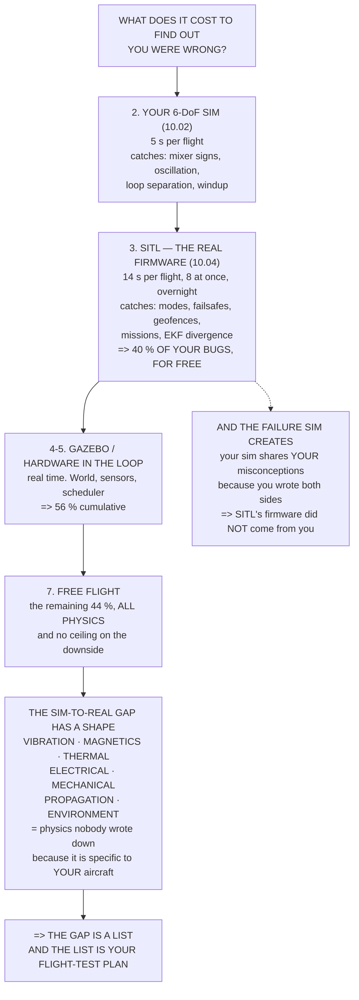

# 10.01 Why simulate: the cost of a crash

<!-- glance:start -->
<!-- generated by tools/build.py from curriculum/syllabus.yaml — edit the syllabus, not this block -->

| | |
|---|---|
| **Track** | Main path |
| **Difficulty** | Beginner |
| **Time** | 45 min |
| **Hardware** | none |
| **Software** | none |
| **Prerequisites** | [07.07 Filtering, notches and the methodic tuning procedure](../07-control/07.07-filtering-and-methodic-tuning.md) |
| **Skip if** | You can say which Hermon failures you will only ever find in simulation and which ones simulation will lie to you about. |

<!-- glance:end -->

## What you will learn

- What a test costs in the two currencies that matter — and that 07.03's gain sweep is
  **101 hours of flying or three minutes of SITL**
- The **seven-rung fidelity ladder**, and the one jump that matters
- Which of twenty-five real failure modes each rung first catches: **40 % for free**
- What simulation will **lie** to you about, and why the list has a shape
- That the sim-to-real gap **is a list, and the list is your flight-test plan**
- The one failure mode simulation *creates*, and why SITL is the defence against it

## Why it matters

Everything in modules 01 to 09 was derived in code and then had to be believed. This module is
where the code starts flying, and it opens with a question of economics rather than physics:
what does it cost to find out you were wrong?

The answer is stark. 07.03 swept the rate loop's P from 0.05 to 0.60 and its D from 0 to 0.032 —
about 108 combinations. In flight that is **101 hours**, twelve working days, 216 battery cycles
and 108 separate opportunities to crash on gains you deliberately chose to be wrong. On eight
cores in SITL it is **three minutes**, unattended, with nothing at risk.

But the argument is not that simulation is cheap. It is *which* bugs it catches. Sort
twenty-five failure modes this course has already found by the lowest rung that would catch
them, and the ten caught by a Python script or a SITL run are all the same kind of thing: a sign,
an ordering, a threshold, a state machine. **Logic bugs — and logic is exactly what a simulator
reproduces perfectly, because logic is all it is.**

The remaining eleven are all physics: vibration, magnetics, heat, sag, desync, fasteners,
Fresnel zones, multipath. No simulator in this course models any of them, and that is the
deliverable of this lesson. **The gap is a list**, you write it down, and it is exactly what
flight testing is for.

## Prerequisites

<!-- prereqs:start -->
## Prerequisites

You need these first:

- [07.07 Filtering, notches and the methodic tuning procedure](../07-control/07.07-filtering-and-methodic-tuning.md)

### Optional prerequisite links

None.

Check your readiness: `python course.py why 10.01`
<!-- prereqs:end -->

## Concept

There are two reasons to simulate, and confusing them wastes a lot of time.

The first is **economics**. A simulated flight costs seconds instead of hours, runs in parallel,
runs overnight, and risks nothing. That argument is about *throughput*, and it is strongest for
things you have to do many times: parameter sweeps, regression tests, bisecting a bad change.

The second is **access**. Some things cannot be tested in flight at any price, because testing
them means breaking the aircraft. What does the failsafe do if the GNSS glitches at exactly the
moment the battery goes low? You are not going to arrange that in the air. In simulation you
arrange it in a line of code.

Against both stands the **fidelity question**, and the honest answer is a ladder rather than a
number. Each rung models more and costs more, from an analytical equation through your own
6-DoF simulator, through the real firmware running in a process, through a simulated world, to
hardware in the loop, to a tethered hover, to free flight. Higher rungs catch more and every
one of them is still a model of something.

And the top rung is the only one with no ceiling on the downside.

## Technical explanation

### Level 1 — what a test costs

| | flight | SITL |
|---|---|---|
| one 24-minute test | 0.6 h | **14 s** |
| plus the trip to the field | 1.5 h | 0 |
| battery wear per test | 3.5 ₪ | 0 |
| worst case if it goes wrong | **4,300 ₪** (04.06) | 0 |
| how many at once | 1 | 8 |
| runs while you sleep | no | **yes** |

Put 07.03's 108-point gain sweep through it:

| | |
|---|---|
| in flight | **101.7 h** = 12.7 working days, 216 battery cycles |
| in SITL, one core | 25.9 min |
| in SITL, eight cores | **3.2 min** |

And 08.04's bisection, which was the other expensive thing: eight changes to isolate is **7.5 h
of flying** or **two minutes** in SITL.

### Level 2 — the fidelity ladder

| rung | per 24-minute flight | what it adds |
|---|---|---|
| 1 analytical model | 0.5 s | the equation you wrote |
| 2 **6-DoF Python sim** (10.02) | 5 s | control logic, saturation, mode transitions |
| 3 **SITL** (10.04) | **14 s** | the *real firmware*: every mode, failsafe, parameter, log |
| 4 SITL + Gazebo (10.05) | 24 min | obstacles, cameras, wind fields, terrain |
| 5 hardware in the loop | 24 min | the scheduler, real timing, real CPU load (08.07) |
| 6 tethered / 2 m hover | 24 min | **everything physical**, at survivable energy |
| 7 free flight | 24 min | everything — and no ceiling on the downside |

**The jump that matters is 2 to 3.** A simulator you wrote tests *your* controller; SITL tests
*ArduPilot's* — the same binary, the same parameters from 08.04, the same modes from 07.05, the
same failsafes from 09.03, producing the same log format from 08.07. 10.02 exists to teach you
the dynamics; 10.04 exists to test the aircraft.

### Level 3 — what each rung catches

Twenty-five failure modes from earlier lessons, by the lowest rung that finds them:

| rung | modes | cumulative |
|---|---|---|
| 2 | 4 | 16 % |
| 3 | 6 | **40 %** |
| 4 | 2 | 48 % |
| 5 | 2 | **56 %** |
| 7 | **11** | 100 % |

The level-2 and level-3 list: a sign error in the mixer, an oscillating rate loop, loop
separation too tight, ground windup, a mode missing from the switch, a failsafe doing the wrong
thing, two failsafes racing, a geofence with a gap, a mission that never terminates, EKF
divergence on a glitch.

Every one is a **logic** bug, and a simulator reproduces logic perfectly because logic is all it
is. Forty per cent of your bugs, for free, unattended, with nothing at risk.

### Level 4 — what it lies about

The eleven at level 7 are not an odd assortment. They have a shape:

| kind | from | why no sim has it |
|---|---|---|
| **vibration** | 07.07, 05.06, 04.04 | no sim generates an 84 Hz tone or a 106 Hz arm mode, so the notch cannot be tuned and clipping never happens |
| **magnetics** | 05.03, 04.03 | no sim has *your* wiring, so hard iron is always zero |
| **thermal** | 02.09, 03.07 | nothing gets hot, so nothing derates and nothing fails late |
| **electrical** | 03.02, 02.03 | the pack never sags and the ESC never desyncs |
| **mechanical** | 04.05, 04.06 | no fastener loosens, no nut backs off, nothing wears |
| **propagation** | 09.01, 09.04 | the link is perfect or absent, never Fresnel-obstructed |
| **environment** | 05.04, 01.10 | no multipath, no real turbulence, no sun in the rangefinder |

**Simulation models what somebody wrote down**, and every item above is physics nobody bothered
to write down because it is specific to *your* aircraft.

Which gives you the deliverable: **the gap is a list, and the list is your flight-test plan.**
Write down what your simulator does not model, and that list is exactly what flight testing is
for — and it is much shorter than "test everything", which is why module 16 can be five lessons
rather than fifty.

## Diagram



## Code

Cost a test flight against a SITL run in time, money and risk; put 07.03's gain sweep and 08.04's
bisection through both; lay out the seven-rung ladder; sort twenty-five real failure modes by the
rung that first catches them; and name the three ways a simulator fools you.

```python
"""10.01 - the economics of simulation, and the list of what it lies about."""

REBUILD_ILS = 4300.0      # 04.06: a full rebuild
FLIGHT_MIN = 24.0         # 02.11: hover endurance
PACK_ILS = 443.0          # 03.10: one 6S 5000 pack, Sollan
PACK_CYCLES = 250.0       # 03.07: before resistance retires it
FIELD_OVERHEAD_H = 1.5    # travel, setup, packing, per session [E]
SESSION_FLIGHTS = 4       # how many flights one trip is worth [E]
SITL_SPEEDUP = 10.0       # a conservative SITL --speedup
CORES = 8

# level, what it is, seconds per 24-min flight, what it catches, what it misses
LADDER = [
    ("1 analytical model", "the code blocks of modules 01-07", 0.5,
     "the equation you wrote", "everything you did not write"),
    ("2 6-DoF Python sim", "10.02: your dynamics, your controller", 5.0,
     "control logic, saturation, mode transitions",
     "anything the model omits -- which is most of section 3"),
    ("3 SITL", "10.04: the REAL firmware, real parameters", 144.0,
     "every mode, every failsafe, every parameter, real logs",
     "vibration, magnetics, heat, power sag, mechanical failure"),
    ("4 SITL + Gazebo", "10.05: a world, with terrain and sensors", 1440.0,
     "+ obstacles, cameras, wind fields, terrain following",
     "the same physical list, plus it is 10x slower"),
    ("5 hardware in the loop", "the real board, simulated sensors", 1440.0,
     "+ the scheduler, the real timing, real CPU load (08.07)",
     "still no vibration and no magnetics"),
    ("6 tethered / 2 m hover", "the real aircraft, one metre up", 1440.0,
     "+ EVERYTHING physical, at survivable energy",
     "nothing -- except it cannot go anywhere"),
    ("7 free flight", "the whole thing", 1440.0,
     "everything", "nothing, and that is the problem"),
]

# failure mode, which level first catches it, and the lesson that found it
MODES = [
    ("a sign error in the mixer", 2, "07.06"),
    ("a rate loop that oscillates", 2, "07.03"),
    ("loop separation too tight", 2, "07.02"),
    ("integrator windup on the ground", 2, "07.01"),
    ("a mode that does not exist on the switch", 3, "07.05"),
    ("a failsafe that does the wrong thing", 3, "09.03"),
    ("two failsafes racing each other", 3, "09.03"),
    ("a geofence with a gap in it", 3, "12.03"),
    ("a mission that never terminates", 3, "12.01"),
    ("EKF divergence on a GNSS glitch", 3, "06.06"),
    ("an SD card that stalls the loop", 5, "08.02"),
    ("a scheduler overrun at 400 Hz", 5, "08.07"),
    ("terrain following into a hill", 4, "12.05"),
    ("a camera pipeline too slow", 4, "14.06"),
    ("PROPELLER VIBRATION at 84 Hz", 7, "07.07"),
    ("ACCELEROMETER CLIPPING at 16 g", 7, "05.06"),
    ("HARD IRON: 31.8 deg of heading error", 7, "05.03"),
    ("PACK SAG at 57 A", 7, "03.02"),
    ("MOTOR HEAT after 20 minutes", 7, "02.09"),
    ("ESC DESYNC on a hard throttle step", 7, "02.03"),
    ("A PROPELLER NUT BACKING OFF", 7, "04.05"),
    ("FASTENERS LOOSENING over 50 flights", 7, "04.06"),
    ("THE FRESNEL ZONE closing at 2 km", 7, "09.01"),
    ("THE ANTENNA NULL overhead", 7, "09.04"),
    ("GNSS MULTIPATH near a building", 7, "05.04"),
]


def flight_cost_ils():
    """One 24-minute test flight, honestly costed."""
    packs = 2.0                              # 07.07: budget two per axis
    pack_wear = packs * PACK_ILS / PACK_CYCLES
    return pack_wear


def session_hours(n_flights):
    """Wall-clock hours for n flights, including the trip."""
    trips = max(1.0, n_flights / SESSION_FLIGHTS)
    return trips * FIELD_OVERHEAD_H + n_flights * (FLIGHT_MIN + 10) / 60.0


def sitl_hours(n_runs, seconds_each=144.0, cores=1):
    return n_runs * seconds_each / 3600.0 / cores


def bar(t):
    print("\n" + "=" * 70)
    print(t)
    print("=" * 70)


if __name__ == "__main__":
    bar("1. WHAT A TEST COSTS, IN THE TWO CURRENCIES THAT MATTER")
    print("  Not money -- TIME and RISK. Money barely enters it until")
    print("  something breaks.")
    print(f"  {'':34s} {'flight':>12s} {'SITL':>12s}")
    rows = [
        ("one 24-minute test", f"{(FLIGHT_MIN + 10) / 60:.1f} h",
         f"{144 / SITL_SPEEDUP:.0f} s"),
        ("...plus the trip to the field", f"{FIELD_OVERHEAD_H:.1f} h", "0"),
        ("battery wear per test",
         f"{flight_cost_ils():.1f} ILS", "0"),
        ("worst case if it goes wrong",
         f"{REBUILD_ILS:.0f} ILS", "0"),
        ("how many can run at once", "1", f"{CORES}"),
        ("does it run while you sleep", "no", "YES"),
    ]
    for a, b, c in rows:
        print(f"  {a:34s} {b:>12s} {c:>12s}")
    print("\n  NOW PUT REAL WORK THROUGH IT. 07.03 swept the rate loop's")
    print("  P from 0.05 to 0.60 and its D from 0 to 0.032 -- call it")
    print("  12 x 9 = 108 combinations:")
    n = 108
    fh = session_hours(n)
    print(f"  {'in flight':28s} {fh:8.1f} h = {fh / 8:5.1f} working days")
    print(f"  {'':28s} {n * 2:8.0f} battery cycles")
    print(f"  {'in SITL, one core':28s}"
          f" {sitl_hours(n, 144 / SITL_SPEEDUP) * 60:8.1f} min")
    print(f"  {'in SITL, {} cores'.format(CORES):28s}"
          f" {sitl_hours(n, 144 / SITL_SPEEDUP, CORES) * 60:8.1f} min"
          f"  = one coffee, unattended")
    print(f"  A FACTOR OF"
          f" {fh / sitl_hours(n, 144 / SITL_SPEEDUP, CORES):.0f}, and the"
          f" flight version is not")
    print("  merely slower -- it is 108 opportunities to crash, on gains")
    print("  you deliberately chose to be wrong.")
    print("\n  AND 08.04'S BISECTION, WHICH WAS THE OTHER EXPENSIVE THING:")
    for k in (2, 4, 8, 16):
        print(f"    {k:2d} changes to isolate: {session_hours(k):5.1f} h of"
              f" flying, {sitl_hours(k, 144 / SITL_SPEEDUP):5.2f} h in SITL")

    bar("2. THE FIDELITY LADDER")
    print(f"  {'level':24s} {'per 24-min flight':>18s}")
    for name, what, secs, catches, misses in LADDER:
        rt = secs / SITL_SPEEDUP if name.startswith("3") else secs
        label = (f"{rt:.1f} s" if rt < 120 else f"{rt / 60:.0f} min")
        print(f"  {name:24s} {label:>18s}  {what}")
        print(f"  {'':24s} {'+ catches':>18s}  {catches}")
        print(f"  {'':24s} {'- misses':>18s}  {misses}")
    print("  THE JUMP THAT MATTERS IS 2 TO 3. A simulator you wrote")
    print("  tests YOUR controller; SITL tests ARDUPILOT'S -- the same")
    print("  binary, the same parameters from 08.04, the same modes from")
    print("  07.05, the same failsafes from 09.03, producing the same")
    print("  log format from 08.07. 10.02 exists to teach you the")
    print("  dynamics; 10.04 exists to test the aircraft.")
    print("  AND THE JUMP FROM 6 TO 7 IS THE ONE WITH NO CEILING ON THE")
    print("  DOWNSIDE. Everything below it is survivable by construction.")

    bar("3. WHERE EACH FAILURE IS FIRST CAUGHT")
    print("  Twenty-five failure modes this course has already found,")
    print("  sorted by the lowest rung that would catch them:")
    print(f"  {'level':>6s}  {'failure mode':38s} {'from'}")
    for lvl in range(2, 8):
        for name, at, src in MODES:
            if at == lvl:
                print(f"  {lvl:6d}  {name:38s} {src}")
    counts = {}
    for name, at, src in MODES:
        counts[at] = counts.get(at, 0) + 1
    print(f"\n  {'level':>6s} {'modes':>6s} {'cumulative':>11s}")
    cum = 0
    for lvl in sorted(counts):
        cum += counts[lvl]
        print(f"  {lvl:6d} {counts[lvl]:6d} {cum:10d} /"
              f" {len(MODES)} = {cum / len(MODES) * 100:.0f} %")
    cheap = sum(c for l, c in counts.items() if l <= 3)
    all_sim = sum(c for l, c in counts.items() if l <= 5)
    print(f"  LEVELS 2 AND 3 ALONE -- a Python script and a SITL run,")
    print(f"  both free and both unattended -- CATCH {cheap} OF"
          f" {len(MODES)}, or"
          f" {cheap / len(MODES) * 100:.0f} %.")
    print(f"  Everything simulable catches {all_sim}, or"
          f" {all_sim / len(MODES) * 100:.0f} %.")
    print("  THAT IS THE ARGUMENT, and it is not that simulation is")
    print("  realistic. Read the level-2 and level-3 list again: every")
    print("  one of them is a LOGIC bug -- a sign, an ordering, a")
    print("  threshold, a state machine -- and logic is exactly what a")
    print("  simulator reproduces PERFECTLY, because logic is all it is.")
    print(f"  AND THE OTHER {len(MODES) - all_sim} ARE ALL PHYSICS, which")
    print("  is section 4.")

    bar("4. WHAT SIMULATION WILL LIE TO YOU ABOUT")
    print("  Every mode at level 7 in section 3 is a thing NO simulator")
    print("  in this course models, and they are not an odd assortment.")
    print("  They have a shape:")
    kinds = [
        ("VIBRATION", "07.07, 05.06, 04.04",
         "no sim generates an 84 Hz tone or a 106 Hz arm mode, so the"),
        ("", "", "notch cannot be tuned in one and clipping never happens"),
        ("MAGNETICS", "05.03, 04.03",
         "no sim has your wiring, so hard iron is always zero"),
        ("THERMAL", "02.09, 03.07",
         "nothing gets hot, so nothing derates and nothing fails late"),
        ("ELECTRICAL", "03.02, 02.03",
         "the pack never sags and the ESC never desyncs"),
        ("MECHANICAL", "04.05, 04.06",
         "no fastener loosens, no nut backs off, nothing wears"),
        ("PROPAGATION", "09.01, 09.04",
         "the link is perfect or absent, never Fresnel-obstructed"),
        ("THE ENVIRONMENT", "05.04, 01.10",
         "no multipath, no real turbulence, no sun in the rangefinder"),
    ]
    for a, src, why in kinds:
        if a:
            print(f"  {a:16s} [{src}]")
        print(f"  {'':16s} {why}")
    print("  THE SHAPE IS: SIMULATION MODELS WHAT SOMEBODY WROTE DOWN,")
    print("  AND EVERY ITEM ABOVE IS PHYSICS NOBODY BOTHERED TO WRITE")
    print("  DOWN because it is specific to YOUR aircraft.")
    print("\n  AND THAT GIVES YOU THE DELIVERABLE OF THIS LESSON:")
    print("  THE GAP IS A LIST, AND THE LIST IS YOUR FLIGHT-TEST PLAN.")
    print("  Write down what your simulator does not model. That list is")
    print("  EXACTLY what flight testing is for, and it is much shorter")
    print("  than 'test everything' -- which is why module 16 can be")
    print("  five lessons rather than fifty.")

    bar("5. THE ONE FAILURE MODE SIMULATION CREATES")
    print("  Not a gap -- an ADDITION. A simulator that agrees with you")
    print("  is not evidence, and there are three ways to be fooled:")
    traps = [
        ("the model and the controller share an assumption",
         "10.02 will use 01.04's a = g tan(theta) for BOTH the plant and",
         "the controller. It cannot be wrong in the sim. It can be wrong"),
        ("the sim is tuned until it matches",
         "if you fit the model to one flight, it predicts that flight and",
         "nothing else. Fit it on one and TEST it on another"),
        ("the sim is the only thing that ever ran",
         "a mission that has only ever flown in SITL has never met a gust,",
         "a magnetic anomaly or a real GNSS. 10.05 is where CI makes it"),
        ("", "cheap to run BOTH, every time", ""),
    ]
    for a, b, c in traps:
        if a:
            print(f"  * {a}")
        print(f"    {b}")
        if c:
            print(f"    {c}")
    print("  THE FIRST ONE IS THE SUBTLE ONE AND IT IS UNAVOIDABLE. Any")
    print("  simulator you write yourself shares your misconceptions by")
    print("  construction. THAT IS THE STRONGEST ARGUMENT FOR SITL: the")
    print("  firmware under test was not written by you, so when it")
    print("  disagrees with your model, ONE OF YOU IS WRONG AND YOU GET")
    print("  TO FIND OUT WHICH.")
```

Output:

```text

======================================================================
1. WHAT A TEST COSTS, IN THE TWO CURRENCIES THAT MATTER
======================================================================
  Not money -- TIME and RISK. Money barely enters it until
  something breaks.
                                           flight         SITL
  one 24-minute test                        0.6 h         14 s
  ...plus the trip to the field             1.5 h            0
  battery wear per test                   3.5 ILS            0
  worst case if it goes wrong            4300 ILS            0
  how many can run at once                      1            8
  does it run while you sleep                  no          YES

  NOW PUT REAL WORK THROUGH IT. 07.03 swept the rate loop's
  P from 0.05 to 0.60 and its D from 0 to 0.032 -- call it
  12 x 9 = 108 combinations:
  in flight                       101.7 h =  12.7 working days
                                    216 battery cycles
  in SITL, one core                25.9 min
  in SITL, 8 cores                  3.2 min  = one coffee, unattended
  A FACTOR OF 1883, and the flight version is not
  merely slower -- it is 108 opportunities to crash, on gains
  you deliberately chose to be wrong.

  AND 08.04'S BISECTION, WHICH WAS THE OTHER EXPENSIVE THING:
     2 changes to isolate:   2.6 h of flying,  0.01 h in SITL
     4 changes to isolate:   3.8 h of flying,  0.02 h in SITL
     8 changes to isolate:   7.5 h of flying,  0.03 h in SITL
    16 changes to isolate:  15.1 h of flying,  0.06 h in SITL

======================================================================
2. THE FIDELITY LADDER
======================================================================
  level                     per 24-min flight
  1 analytical model                    0.5 s  the code blocks of modules 01-07
                                    + catches  the equation you wrote
                                     - misses  everything you did not write
  2 6-DoF Python sim                    5.0 s  10.02: your dynamics, your controller
                                    + catches  control logic, saturation, mode transitions
                                     - misses  anything the model omits -- which is most of section 3
  3 SITL                               14.4 s  10.04: the REAL firmware, real parameters
                                    + catches  every mode, every failsafe, every parameter, real logs
                                     - misses  vibration, magnetics, heat, power sag, mechanical failure
  4 SITL + Gazebo                      24 min  10.05: a world, with terrain and sensors
                                    + catches  + obstacles, cameras, wind fields, terrain following
                                     - misses  the same physical list, plus it is 10x slower
  5 hardware in the loop               24 min  the real board, simulated sensors
                                    + catches  + the scheduler, the real timing, real CPU load (08.07)
                                     - misses  still no vibration and no magnetics
  6 tethered / 2 m hover               24 min  the real aircraft, one metre up
                                    + catches  + EVERYTHING physical, at survivable energy
                                     - misses  nothing -- except it cannot go anywhere
  7 free flight                        24 min  the whole thing
                                    + catches  everything
                                     - misses  nothing, and that is the problem
  THE JUMP THAT MATTERS IS 2 TO 3. A simulator you wrote
  tests YOUR controller; SITL tests ARDUPILOT'S -- the same
  binary, the same parameters from 08.04, the same modes from
  07.05, the same failsafes from 09.03, producing the same
  log format from 08.07. 10.02 exists to teach you the
  dynamics; 10.04 exists to test the aircraft.
  AND THE JUMP FROM 6 TO 7 IS THE ONE WITH NO CEILING ON THE
  DOWNSIDE. Everything below it is survivable by construction.

======================================================================
3. WHERE EACH FAILURE IS FIRST CAUGHT
======================================================================
  Twenty-five failure modes this course has already found,
  sorted by the lowest rung that would catch them:
   level  failure mode                           from
       2  a sign error in the mixer              07.06
       2  a rate loop that oscillates            07.03
       2  loop separation too tight              07.02
       2  integrator windup on the ground        07.01
       3  a mode that does not exist on the switch 07.05
       3  a failsafe that does the wrong thing   09.03
       3  two failsafes racing each other        09.03
       3  a geofence with a gap in it            12.03
       3  a mission that never terminates        12.01
       3  EKF divergence on a GNSS glitch        06.06
       4  terrain following into a hill          12.05
       4  a camera pipeline too slow             14.06
       5  an SD card that stalls the loop        08.02
       5  a scheduler overrun at 400 Hz          08.07
       7  PROPELLER VIBRATION at 84 Hz           07.07
       7  ACCELEROMETER CLIPPING at 16 g         05.06
       7  HARD IRON: 31.8 deg of heading error   05.03
       7  PACK SAG at 57 A                       03.02
       7  MOTOR HEAT after 20 minutes            02.09
       7  ESC DESYNC on a hard throttle step     02.03
       7  A PROPELLER NUT BACKING OFF            04.05
       7  FASTENERS LOOSENING over 50 flights    04.06
       7  THE FRESNEL ZONE closing at 2 km       09.01
       7  THE ANTENNA NULL overhead              09.04
       7  GNSS MULTIPATH near a building         05.04

   level  modes  cumulative
       2      4          4 / 25 = 16 %
       3      6         10 / 25 = 40 %
       4      2         12 / 25 = 48 %
       5      2         14 / 25 = 56 %
       7     11         25 / 25 = 100 %
  LEVELS 2 AND 3 ALONE -- a Python script and a SITL run,
  both free and both unattended -- CATCH 10 OF 25, or 40 %.
  Everything simulable catches 14, or 56 %.
  THAT IS THE ARGUMENT, and it is not that simulation is
  realistic. Read the level-2 and level-3 list again: every
  one of them is a LOGIC bug -- a sign, an ordering, a
  threshold, a state machine -- and logic is exactly what a
  simulator reproduces PERFECTLY, because logic is all it is.
  AND THE OTHER 11 ARE ALL PHYSICS, which
  is section 4.

======================================================================
4. WHAT SIMULATION WILL LIE TO YOU ABOUT
======================================================================
  Every mode at level 7 in section 3 is a thing NO simulator
  in this course models, and they are not an odd assortment.
  They have a shape:
  VIBRATION        [07.07, 05.06, 04.04]
                   no sim generates an 84 Hz tone or a 106 Hz arm mode, so the
                   notch cannot be tuned in one and clipping never happens
  MAGNETICS        [05.03, 04.03]
                   no sim has your wiring, so hard iron is always zero
  THERMAL          [02.09, 03.07]
                   nothing gets hot, so nothing derates and nothing fails late
  ELECTRICAL       [03.02, 02.03]
                   the pack never sags and the ESC never desyncs
  MECHANICAL       [04.05, 04.06]
                   no fastener loosens, no nut backs off, nothing wears
  PROPAGATION      [09.01, 09.04]
                   the link is perfect or absent, never Fresnel-obstructed
  THE ENVIRONMENT  [05.04, 01.10]
                   no multipath, no real turbulence, no sun in the rangefinder
  THE SHAPE IS: SIMULATION MODELS WHAT SOMEBODY WROTE DOWN,
  AND EVERY ITEM ABOVE IS PHYSICS NOBODY BOTHERED TO WRITE
  DOWN because it is specific to YOUR aircraft.

  AND THAT GIVES YOU THE DELIVERABLE OF THIS LESSON:
  THE GAP IS A LIST, AND THE LIST IS YOUR FLIGHT-TEST PLAN.
  Write down what your simulator does not model. That list is
  EXACTLY what flight testing is for, and it is much shorter
  than 'test everything' -- which is why module 16 can be
  five lessons rather than fifty.

======================================================================
5. THE ONE FAILURE MODE SIMULATION CREATES
======================================================================
  Not a gap -- an ADDITION. A simulator that agrees with you
  is not evidence, and there are three ways to be fooled:
  * the model and the controller share an assumption
    10.02 will use 01.04's a = g tan(theta) for BOTH the plant and
    the controller. It cannot be wrong in the sim. It can be wrong
  * the sim is tuned until it matches
    if you fit the model to one flight, it predicts that flight and
    nothing else. Fit it on one and TEST it on another
  * the sim is the only thing that ever ran
    a mission that has only ever flown in SITL has never met a gust,
    a magnetic anomaly or a real GNSS. 10.05 is where CI makes it
    cheap to run BOTH, every time
  THE FIRST ONE IS THE SUBTLE ONE AND IT IS UNAVOIDABLE. Any
  simulator you write yourself shares your misconceptions by
  construction. THAT IS THE STRONGEST ARGUMENT FOR SITL: the
  firmware under test was not written by you, so when it
  disagrees with your model, ONE OF YOU IS WRONG AND YOU GET
  TO FIND OUT WHICH.
```

## Exercise

### Exercise 10.01-E1 — Cost your own sweep `[analysis]`

Take a parameter study you actually intend to run — your own rate gains, your notch bandwidth,
your `RTL_ALT` — and count the combinations. Compute the flight cost in hours, battery cycles and
trips to the field, using your own endurance and travel time. Then compute the SITL cost on your
own machine's core count. State the ratio, and state how many of the combinations you would
realistically fly if simulation did not exist.

### Exercise 10.01-E2 — Write your own gap list `[analysis]`

Go through modules 02 to 09 and find ten failure modes this lesson's table does **not** list.
For each one, decide which rung would first catch it and say why. Then separate them into
"logic" and "physics", and check the ratio against this lesson's 40 %. If your list is mostly
physics, your simulator is going to be less useful than this lesson claims — and that is worth
knowing before you write it.

### Exercise 10.01-E3 — Find a shared assumption `[analysis]`

10.02 will build a simulator whose plant uses 01.04's $a = g\tan\theta$, and whose controller
uses the same relation. Identify two more places where the simulator and the controller in this
course would share an assumption, and describe an aircraft behaviour that each shared assumption
would make invisible. Then say, for each, how SITL would or would not help.

### Exercise 10.01-E4 — Price your own risk `[analysis]`

Put a number on what a crash costs you: the rebuild from your own BOM, the lead time from 08.03's
supply analysis, the flights you would lose while waiting, and anything the aircraft would have
been doing. Then compute how many simulated flights would have to prevent one crash for the
simulation to have paid for itself, and compare against how many you can run in an hour.

## Expected result

**10.01-E1**: most honest sweeps are 50 to 300 combinations, a factor of several hundred to a few
thousand in wall-clock time, and the answer to the last question is almost always "five or six" —
which is the real point. Without simulation you do not run a smaller sweep; you run a *different,
worse* experiment.

**10.01-E2**: expect your ten to split roughly the same way, with logic bugs clustering in modules
06, 07, 09 and 12 and physics bugs in 02, 03, 04 and 05. That split is not a coincidence: the
later modules are about software and the earlier ones are about hardware.

**10.01-E3**: the two most valuable answers are the **motor model** (10.02 will use 02.10's 30 ms
first-order lag for both the plant and the latency budget, so a real ESC's nonlinearity is
invisible) and the **mixer** (07.06's matrix appears on both sides, so a frame-geometry error
cancels out exactly). SITL helps with the second — ArduPilot's mixer is not yours — and does not
help with the first, because SITL's motor model is also first-order.

**10.01-E4**: at a 4,300 ₪ rebuild plus a two-to-six-week lead time from 08.03, the break-even is
a handful of simulated flights preventing one crash — and you can run hundreds in an hour. The
economics are not close, which is why the interesting question is never "is it worth simulating"
but "what is it still lying about".

## Troubleshooting

**"Simulation is not realistic enough to be useful."** It does not have to be. Level 3 showed
that 40 % of real failure modes are logic bugs, and logic is the one thing a simulator gets
exactly right. Judge it by which bugs it catches, not by how real it feels.

**"My simulator agrees with my controller perfectly."** That is section 5's first trap, and it is
expected: you wrote both sides, so they share your misconceptions. It is evidence of consistency,
not of correctness.

**"I tuned the simulator until it matched my flight data."** Then it predicts that flight and
nothing else. Fit on one flight and *test* on a different one, exactly as you would with any
model.

**"The mission works in SITL and fails in the air."** Good — you have found an item for your gap
list. Work out which of the seven physical categories it belongs to, and write it down; that is
how the list gets built.

**"SITL runs slower than real time."** Check `--speedup`, and check whether Gazebo is attached —
rung 4 is real time by construction because it is rendering a world.

**"Everything passes and I am still nervous."** Correct instinct. The 44 % that simulation cannot
reach is all physics, and 10.01's whole point is that you now know what it is.

## Common mistakes

- **Arguing about realism instead of coverage.** The useful question is which failure modes each
  rung catches, and that is a list you can write.
- **Treating your own simulator as a test of the aircraft.** It is a test of your controller
  against your model. SITL is the first rung that tests something you did not write.
- **Believing a simulator that agrees with you.** You wrote both halves.
- **Skipping the gap list.** Without it, flight testing becomes "fly it and see", which is both
  more expensive and less thorough.
- **Simulating things you could compute.** Rung 1 is free and exact for what it models; a great
  many questions in modules 01 to 09 never needed a simulator at all.
- **Not running the simulation overnight.** Eight cores and no supervision is the whole economic
  argument, and it is thrown away by running things interactively.

## Knowledge check

<details>
<summary>07.03's gain sweep is 108 combinations. What does it cost in flight and in SITL, and what
is the non-obvious cost of the flight version?</summary>

In flight, **101.7 hours** — twelve working days, 216 battery cycles, and about 27 separate trips
to a field. In SITL on eight cores, **3.2 minutes**, unattended. The non-obvious cost is risk:
108 flights on gains you *deliberately chose to be wrong* is 108 opportunities to crash, at a
4,300 ₪ rebuild and a two-to-six-week lead time (08.03).
</details>

<details>
<summary>Which rung of the ladder is the important jump, and why?</summary>

**2 to 3** — from your own simulator to SITL. Your simulator tests *your* controller against
*your* model, and shares every assumption you hold. SITL runs the **real ArduPilot binary** with
your real parameters, your real flight modes and your real failsafes, and produces the real log
format. When it disagrees with your model, one of you is wrong and you get to find out which.
</details>

<details>
<summary>Simulation catches 40 % of this course's failure modes. What do those forty per cent have
in common?</summary>

They are all **logic** bugs: a sign error in the mixer, an oscillating rate loop, loop separation
too tight, ground windup, a missing mode, a wrong failsafe action, two failsafes racing, a gap in
a geofence, a non-terminating mission, EKF divergence on a glitch. Logic is exactly what a
simulator reproduces perfectly, because logic is all a simulator is.
</details>

<details>
<summary>Name the seven categories of thing simulation cannot model, and what they have in
common.</summary>

Vibration, magnetics, thermal, electrical, mechanical, propagation and environment. What they
have in common is that each is **physics specific to your aircraft that nobody wrote down** — no
simulator generates *your* 84 Hz propeller tone, *your* wiring's hard-iron field, *your* pack's
internal resistance or *your* field's treeline. A simulator models what somebody modelled.
</details>

<details>
<summary>What is the deliverable of this lesson, and why does it make flight testing cheaper?</summary>

**The gap list**: a written record of what your simulator does not model. It makes flight testing
cheaper because it turns "test everything" into a specific, short list — the eleven physical
modes rather than all twenty-five — which is why module 16 can be five lessons rather than fifty.
</details>

<details>
<summary>Why is a simulator that agrees with your controller not evidence that the controller is
right?</summary>

Because you wrote both halves and they share your assumptions. 10.02's plant will use 01.04's
$a = g\tan\theta$ and so will its controller, so that relation **cannot be wrong inside the
simulation** — and it can be wrong on the aircraft. Agreement between two things you wrote is
consistency, not correctness.
</details>

<details>
<summary>What is the one new failure mode that simulation introduces, and what is the defence?</summary>

Confidence without evidence — in three forms: a shared assumption between plant and controller, a
model tuned until it matched one flight, and a mission that has only ever run in simulation. The
defences are, in order: **SITL**, whose firmware you did not write; fitting on one flight and
testing on another; and 10.05's CI, which makes it cheap to run both the simulation and a real
flight every time.
</details>

## Practical challenge

**Write the gap list, before you write the simulator.**

Two columns on one page. On the left, everything your planned simulator *will* model: rigid-body
dynamics, the mixer, the motor lag, the control loops, sensor noise if you add it. On the right,
everything it will not — and be specific. Not "vibration" but "the 84 Hz shaft tone and the 106 Hz
arm mode, so `INS_HNTCH_*` cannot be tuned here". Not "magnetics" but "hard iron from the pack
leads, 31.8° uncorrected".

Then annotate the right-hand column with the **rung** that would catch each item, and the lesson
that established it. Anything at rung 6 (tethered hover) is something you can test safely and
should; anything at rung 7 is something that needs a deliberate flight test and a written
procedure.

Keep the page. Revisit it after 10.02, 10.03 and 10.05 — each of those moves items from the right
column to the left, and the ones that never move are module 16's entire agenda.

## You can skip this if

You can say which Hermon failures you will only ever find in simulation and which ones simulation
will lie to you about.

## Go deeper

- [04.06](../04-frame-and-assembly/04.06-preflight-and-airworthiness.md) (earlier): the 4,300 ₪
  rebuild that sets the risk side of the economics.
- [07.03](../07-control/07.03-rate-loops.md) (earlier): the gain sweep this lesson costs.
- [07.07](../07-control/07.07-filtering-and-methodic-tuning.md) (earlier): the notch that cannot
  be tuned in simulation, and why.
- [08.04](../08-flight-controller/08.04-firmware-and-parameters.md) (earlier): the bisection
  problem simulation makes free.
- [10.02](10.02-quad-sim-in-python.md) (next): building rung 2 out of parts you have already
  written and verified.
- [10.04](10.04-ardupilot-sitl.md) (next): rung 3, and the firmware you did not write.
- [16.01](../16-testing-analysis/16.01-testing-a-flying-machine.md) (later): the flight-test
  discipline that your gap list becomes.
- ArduPilot's SITL introduction, which is rung 3 in one page:
  https://ardupilot.org/dev/docs/sitl-simulator-software-in-the-loop.html
- A readable survey of the sim-to-real gap in robotics, which is the same problem with legs:
  https://en.wikipedia.org/wiki/Robotics_simulator

> **Ask your teacher:** *"We costed 07.03's 108-point gain sweep at 101 hours of flying against
> three minutes of SITL, and found that simulation catches about 40 % of the failure modes this
> course has met — all of them logic bugs. Does that ratio match your experience, and which
> physical failure has most often surprised a team that had simulated carefully?"*

## Progress checkpoint

Run `python course.py complete 10.01` once your gap list exists. Next:
[10.02](10.02-quad-sim-in-python.md) — building rung 2 of the ladder, almost entirely out of code
you have already written and verified.
