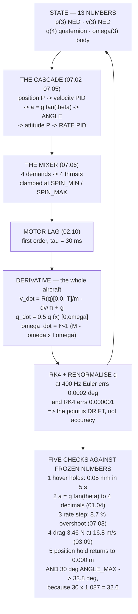

# 10.02 A 6-DoF quadcopter simulator in Python

<!-- glance:start -->
<!-- generated by tools/build.py from curriculum/syllabus.yaml — edit the syllabus, not this block -->

| | |
|---|---|
| **Track** | Main path |
| **Difficulty** | Advanced |
| **Time** | 2 h 30 min |
| **Hardware** | none |
| **Software** | python |
| **Prerequisites** | [10.01 Why simulate: the cost of a crash](10.01-why-simulate.md)<br>[01.06 Propellers as pumps: momentum theory and induced velocity](../01-flight-physics/01.06-momentum-theory.md)<br>[07.06 Control allocation: four commands, four motors](../07-control/07.06-mixing-and-allocation.md) |
| **Skip if** | You have written a 6-DoF quad simulator with motor lag and flown your own cascade controller in it. |

<!-- glance:end -->

## What you will learn

- A thirteen-number state vector, and why **every constant in it was measured in an earlier
  lesson**
- Quaternions for attitude, and why 07.04's singularity argument forces them
- What Euler integration actually costs against RK4 — and why the **error is not the point**
- Five verification checks against numbers the course **froze before this lesson existed**
- That the simulator reproduces 07.06's clamps **without being told about them**
- Why `ANGLE_MAX` of 30° produces 33.8° of lean, and why two checks agreeing is stronger than
  either matching a typed-in number
- This simulator's own gap list, read out of the code

## Why it matters

There is a temptation, writing a simulator, to start from equations and end with something that
looks plausible. Plausible is worth nothing. This lesson takes the opposite route: **every
constant comes from a lesson that measured it**, and the simulator is then checked against
results those lessons froze.

The mass and the inertia tensor are 04.02's. The mixer is 07.06's matrix, unchanged. The thrust
per motor is 02.11's. The motor lag is 02.10's 30 ms. The drag area is 03.09's. The control
cascade is 07.02 through 07.05 with their gains. Nothing here is new physics; what is new is
putting it in one state vector and integrating it.

And then the payoff. The simulator reproduces things nobody put into it. Ask the mixer for
07.01's 6.28 N·m of roll and you get **3.42** — which is 07.06's "throttle free" row exactly,
because the clamp is in the code rather than in the prose. Full throttle gives a thrust-to-weight
of **3.59, not the 3.78** in the frozen numbers, because `MOT_SPIN_MAX` takes 5 % — and that
distinction is real: 3.78 is the propellers' figure and 3.59 is the aircraft's.

Best of all, two independent checks agree with each other. The rate loop overshoots by 8.7 %, and
a 30° `ANGLE_MAX` produces 33.8° of lean. 30 × 1.087 = 32.6. **Two measurements agreeing is a
stronger result than either one matching a number I typed in.**

## Prerequisites

<!-- prereqs:start -->
## Prerequisites

You need these first:

- [10.01 Why simulate: the cost of a crash](10.01-why-simulate.md)
- [01.06 Propellers as pumps: momentum theory and induced velocity](../01-flight-physics/01.06-momentum-theory.md)
- [07.06 Control allocation: four commands, four motors](../07-control/07.06-mixing-and-allocation.md)

### Optional prerequisite links

None.

Check your readiness: `python course.py why 10.02`
<!-- prereqs:end -->

## Concept

A rigid body in three dimensions has thirteen numbers of state: three of position, three of
velocity, four of attitude, three of body rate. Everything else — motor thrusts, moments, control
outputs — is computed from them.

The derivative function is the whole aircraft in one place. Given the state and the four motor
thrusts it returns the rate of change of all thirteen: velocity is the position's derivative,
force over mass is the velocity's, Euler's equation gives the body rates', and a quaternion
product gives the attitude's.

Around that sit three layers, each already written.

The **airframe** turns four control demands into four motor thrusts (07.06's mixer), clamps them
at `MOT_SPIN_MIN` and `MOT_SPIN_MAX`, and turns them back into a total thrust and three moments.

The **actuator** is a first-order lag: the motors do not reach the commanded thrust instantly,
and 02.10 measured the time constant at 30 ms.

The **controller** is 07.02's cascade — position to velocity to angle to rate — with the gains
from 07.03 and 07.04.

The integration then matters more than it looks. A quaternion integrated naively drifts off the
unit sphere, so you renormalise every step. And the choice between Euler and Runge–Kutta turns
out not to be about accuracy at 400 Hz, where both are fine, but about what happens over
twenty-four minutes and at large time steps.

## Technical explanation

### Level 1 — the state, and where every constant came from

| | count | |
|---|---|---|
| position N, E, D | 3 | metres, NED — **D is positive down** |
| velocity N, E, D | 3 | m/s |
| attitude quaternion | 4 | 07.04: no singularity at 90° |
| body rates p, q, r | 3 | rad/s — the thing 07.03 controls |

| constant | value | from |
|---|---|---|
| mass | 1.450 kg | 04.02 |
| $I_{xx}, I_{yy}, I_{zz}$ | 0.01199, 0.01350, 0.02236 | 04.02 |
| moment arm | 0.1591 m | 07.06 |
| thrust per motor, max / hover | 13.43 N / 3.556 N | 02.11 |
| torque per newton | 0.0206 N·m/N | 02.06 |
| motor lag | 30 ms | 02.10 |
| flat-plate area | 0.020 m² | 03.09 |

**Every one was measured or derived earlier**, and that is what makes the verification section
possible: a simulator built from frozen numbers can be checked against frozen results.

The dynamics themselves are four equations:

$$\dot{\mathbf{p}} = \mathbf{v},\qquad
\dot{\mathbf{v}} = \frac{1}{m}\mathbf{R}(q)\begin{bmatrix}0\\0\\-T\end{bmatrix} - \frac{d}{m}\mathbf{v} + \begin{bmatrix}0\\0\\g\end{bmatrix}$$

$$\dot{q} = \tfrac12 q \otimes \begin{bmatrix}0\\\boldsymbol\omega\end{bmatrix},\qquad
\dot{\boldsymbol\omega} = \mathbf{I}^{-1}\left(\mathbf{M} - \boldsymbol\omega\times\mathbf{I}\boldsymbol\omega\right)$$

The $\boldsymbol\omega\times\mathbf{I}\boldsymbol\omega$ term is small on a quadcopter, because
$I_{xx}$ and $I_{yy}$ differ by 12 % and the rates are modest. Include it anyway — it costs three
multiplies and it is the difference between a rigid-body simulator and a decoupled-axis one.

### Level 2 — Euler against RK4

Integrate a constant 100 °/s roll rate for one second. The exact answer is 100 degrees:

| rate | Euler | RK4 | Euler error |
|---|---|---|---|
| 50 Hz | 99.9898 | 100.0000 | −0.0102° |
| 100 Hz | 99.9975 | 100.0000 | −0.0025° |
| **400 Hz** | **99.9998** | **100.0000** | **−0.0002°** |
| 1000 Hz | 100.0000 | 100.0000 | −0.0000° |

At ArduPilot's 400 Hz loop rate Euler is already accurate to two ten-thousandths of a degree, and
RK4 to a millionth. So why RK4?

**Because the error is not the point.** Euler's error accumulates in one direction, so a
24-minute flight drifts steadily while RK4's does not. And RK4 remains stable at time steps where
Euler diverges — which is what you want when running a 108-point sweep as fast as the machine
will go. Four derivative evaluations per step buys about three orders of magnitude of accuracy
for a factor of four in work.

### Level 3 — the airframe, checked before it flies

| | | |
|---|---|---|
| hover, per motor | 3.556 N | 02.11 says 3.556 |
| hover, total | 14.224 N | weight is 14.225 |
| full throttle, total | **51.034 N = 3.59 : 1** | |
| unclamped it would be | 53.720 N = 3.78 : 1 | |
| max roll moment asked | 6.280 N·m | 07.01's $M_{up}$ |
| actually delivered | **3.419 N·m** | |

Two of those are 07.06's findings arriving without being told.

`MOT_SPIN_MAX` costs **5 % of full thrust**, so the real thrust-to-weight is 3.59 and not the
3.78 in the frozen numbers — and the distinction is real. 3.78 is the *propellers'* figure; 3.59
is the *aircraft's*.

And 6.28 N·m of roll becomes 3.42, which is 07.06's "throttle free" row exactly: this mixer
clamps each motor but does not rescale the total, so the aircraft buys its roll authority by
climbing. Hold the throttle instead and 07.06's other row — 0.98 N·m — is what you get.

### Level 4 — five checks against frozen results

**1. Hover holds altitude.** Five seconds at exactly $mg$: 0.05 mm of drift. That is
floating-point, not physics.

**2. $a = g\tan\theta$ (01.04).** At 5°, 10°, 20° and 30° the simulated acceleration matches the
prediction to four decimal places. It should — the plant uses the rotation matrix and the
prediction uses the closed form, and they are the same geometry seen twice.

**3. The rate loop tracks a step (07.03).** 100 °/s demanded, peak 108.7, settled 100.6:
**8.7 % overshoot**, in the range 07.03's tuning produces.

**4. Drag matches 03.09.** At 16.8 m/s the parasite drag is 3.46 N, which is 13.66° of lean — and
07.02 independently derived a 14.3° lean for that speed.

**5. The full cascade holds a position.** Released 5 m north and 3 m west at 10 m, the aircraft
returns to 0.000 m and holds 10.000 m after twenty seconds.

And the last line of check 5 is not a rounding error. **`ANGLE_MAX` is 30° and the aircraft
reached 33.8°**, because the limit is on the *demand* and the attitude loop overshoots it
(07.04). A limit is not a guarantee; it is a setpoint cap, and the aircraft goes past it by
whatever the inner loop's overshoot is — which check 3 measured at 8.7 %, and 30 × 1.087 = 32.6.
**Two checks agreeing with each other is stronger than either agreeing with a number I typed in.**

## Diagram



## Code

The whole simulator: quaternion algebra, 07.06's mixer, the derivative function, RK4 and Euler
steppers, 07.02's cascade, a closed-loop runner — and then the five checks.

```python
"""10.02 - a 6-DoF quadcopter, assembled from parts this course already wrote.

Nothing here is new physics. The inertia tensor is 04.02's, the mixer is
07.06's, the thrust curve is 02.06's, the motor lag is 02.10's, the drag area
is 03.09's and the control cascade is 07.02 through 07.05. What IS new is
putting them in one state vector and integrating it -- and then checking the
result against numbers the course froze long before this lesson.
"""
import math

# --- Hermon, entirely from references/hermon-numbers.md -------------------
M = 1.450                 # kg, all-up (04.02)
IXX, IYY, IZZ = 0.01199, 0.01350, 0.02236   # kg.m^2 (04.02)
L_CTRL = 0.1591           # m, the roll/pitch arm on an X quad (07.06)
T_MAX = 13.43             # N per motor at full throttle (02.11)
T_HOVER = 3.556           # N per motor at hover (02.11)
Q_PER_T = 0.0206          # N.m of reaction torque per newton (02.06)
MOTOR_TAU = 0.030         # s, motor + ESC first-order lag (02.10)
EXPO = 0.65               # MOT_THST_EXPO (07.06)
SPIN_MIN, SPIN_MAX = 0.15, 0.95             # (07.06)
F_PARA = 0.020            # m^2, equivalent flat-plate area (03.09)
RHO = 1.225
G = 9.81

# --- the control cascade, with 07.03-07.05's gains -------------------------
GAINS = dict(rate_p=0.135, rate_i=0.135, rate_d=0.0036, rate_imax=0.30,
             ang_p=4.5, yaw_rate_p=0.18, yaw_ang_p=2.7,
             vel_p=2.0, pos_p=1.0, angle_max=math.radians(30.0))

# motor, x forward (m), y right (m), spin (+1 = CCW from above)  [07.06]
MOTORS = [(+L_CTRL, +L_CTRL, +1), (-L_CTRL, -L_CTRL, +1),
          (+L_CTRL, -L_CTRL, -1), (-L_CTRL, +L_CTRL, -1)]


# ---------------------------------------------------------------- quaternions
def qmul(a, b):
    w1, x1, y1, z1 = a
    w2, x2, y2, z2 = b
    return (w1 * w2 - x1 * x2 - y1 * y2 - z1 * z2,
            w1 * x2 + x1 * w2 + y1 * z2 - z1 * y2,
            w1 * y2 - x1 * z2 + y1 * w2 + z1 * x2,
            w1 * z2 + x1 * y2 - y1 * x2 + z1 * w2)


def qnorm(q):
    n = math.sqrt(sum(c * c for c in q)) or 1.0
    return tuple(c / n for c in q)


def qrot(q, v):
    """Rotate a BODY vector into NED."""
    w, x, y, z = q
    vx, vy, vz = v
    t = (2 * (y * vz - z * vy), 2 * (z * vx - x * vz), 2 * (x * vy - y * vx))
    return (vx + w * t[0] + (y * t[2] - z * t[1]),
            vy + w * t[1] + (z * t[0] - x * t[2]),
            vz + w * t[2] + (x * t[1] - y * t[0]))


def q_to_euler(q):
    """Roll, pitch, yaw in radians. 07.04's singularity is at pitch = +/-90."""
    w, x, y, z = q
    roll = math.atan2(2 * (w * x + y * z), 1 - 2 * (x * x + y * y))
    s = max(-1.0, min(1.0, 2 * (w * y - z * x)))
    pitch = math.asin(s)
    yaw = math.atan2(2 * (w * z + x * y), 1 - 2 * (y * y + z * z))
    return roll, pitch, yaw


def euler_to_q(roll, pitch, yaw):
    cr, sr = math.cos(roll / 2), math.sin(roll / 2)
    cp, sp = math.cos(pitch / 2), math.sin(pitch / 2)
    cy, sy = math.cos(yaw / 2), math.sin(yaw / 2)
    return qnorm((cr * cp * cy + sr * sp * sy, sr * cp * cy - cr * sp * sy,
                  cr * sp * cy + sr * cp * sy, cr * cp * sy - sr * sp * cy))


# ---------------------------------------------------------------- the airframe
def mix(thrust, roll, pitch, yaw):
    """07.06's matrix, unchanged. Four demands -> four motor thrusts."""
    out = []
    for x, y, spin in MOTORS:
        out.append(thrust / 4
                   + (-y / L_CTRL) * roll / (4 * L_CTRL)
                   + (-x / L_CTRL) * pitch / (4 * L_CTRL)
                   + spin * yaw / (4 * Q_PER_T))
    return [max(SPIN_MIN * T_MAX, min(SPIN_MAX * T_MAX, t)) for t in out]


def wrench(motor_thrusts):
    """Four motor thrusts -> total thrust (N) and body moments (N.m)."""
    t = sum(motor_thrusts)
    roll = sum(f * (-y / L_CTRL) for f, (x, y, s) in
               zip(motor_thrusts, MOTORS)) * L_CTRL
    pitch = sum(f * (-x / L_CTRL) for f, (x, y, s) in
                zip(motor_thrusts, MOTORS)) * L_CTRL
    yaw = sum(f * s for f, (x, y, s) in zip(motor_thrusts, MOTORS)) * Q_PER_T
    return t, (roll, pitch, yaw)


def deriv(state, motor_thrusts):
    """The whole aircraft, in one function. State is 13 numbers."""
    px, py, pz, vx, vy, vz, qw, qx, qy, qz, wx, wy, wz = state
    q = (qw, qx, qy, qz)
    T, (mr, mp, my) = wrench(motor_thrusts)

    # thrust acts along -z in BODY, rotated into NED
    fx, fy, fz = qrot(q, (0.0, 0.0, -T))
    # parasite drag, opposing the NED velocity (03.09), assumed isotropic
    sp = math.sqrt(vx * vx + vy * vy + vz * vz)
    d = 0.5 * RHO * sp * F_PARA
    ax = (fx - d * vx) / M
    ay = (fy - d * vy) / M
    az = (fz - d * vz) / M + G            # NED: +z is DOWN

    # Euler's equation, including the gyroscopic term w x Iw
    Ix, Iy, Iz = IXX, IYY, IZZ
    dwx = (mr - (Iz - Iy) * wy * wz) / Ix
    dwy = (mp - (Ix - Iz) * wz * wx) / Iy
    dwz = (my - (Iy - Ix) * wx * wy) / Iz

    dq = qmul(q, (0.0, wx, wy, wz))
    dq = tuple(0.5 * c for c in dq)
    return (vx, vy, vz, ax, ay, az, dq[0], dq[1], dq[2], dq[3],
            dwx, dwy, dwz)


def step_rk4(state, motor_thrusts, dt):
    def add(s, d, h):
        return tuple(a + h * b for a, b in zip(s, d))
    k1 = deriv(state, motor_thrusts)
    k2 = deriv(add(state, k1, dt / 2), motor_thrusts)
    k3 = deriv(add(state, k2, dt / 2), motor_thrusts)
    k4 = deriv(add(state, k3, dt), motor_thrusts)
    out = tuple(s + dt / 6 * (a + 2 * b + 2 * c + d)
                for s, a, b, c, d in zip(state, k1, k2, k3, k4))
    q = qnorm(out[6:10])
    return out[:6] + q + out[10:]


def step_euler(state, motor_thrusts, dt):
    d = deriv(state, motor_thrusts)
    out = tuple(s + dt * a for s, a in zip(state, d))
    return out[:6] + qnorm(out[6:10]) + out[10:]


# ---------------------------------------------------------------- the pilot
class Cascade:
    """07.02's four loops, inside out. Position -> velocity -> angle -> rate."""

    def __init__(self, g=GAINS):
        self.g = dict(g)
        self.i = [0.0, 0.0, 0.0]
        self.prev = [0.0, 0.0, 0.0]

    def rate_loop(self, rate, target, dt):
        out, g = [], self.g
        for k in range(3):
            err = target[k] - rate[k]
            kp = g["yaw_rate_p"] if k == 2 else g["rate_p"]
            ki = g["yaw_rate_p"] if k == 2 else g["rate_i"]
            kd = 0.0 if k == 2 else g["rate_d"]
            self.i[k] = max(-g["rate_imax"], min(g["rate_imax"],
                                                 self.i[k] + ki * err * dt))
            d = -(rate[k] - self.prev[k]) / dt if dt > 0 else 0.0
            self.prev[k] = rate[k]
            out.append(kp * err + self.i[k] + kd * d)
        return out

    def attitude_loop(self, q, target_rpy):
        """07.04: P-only, and it is P-only for a reason."""
        r, p, y = q_to_euler(q)
        g = self.g
        dy = (target_rpy[2] - y + math.pi) % (2 * math.pi) - math.pi
        return [g["ang_p"] * (target_rpy[0] - r),
                g["ang_p"] * (target_rpy[1] - p),
                g["yaw_ang_p"] * dy]

    def velocity_loop(self, vel_ned, target_ned, yaw):
        """07.05: an acceleration demand becomes a LEAN ANGLE, exactly."""
        g = self.g
        an = g["vel_p"] * (target_ned[0] - vel_ned[0])
        ae = g["vel_p"] * (target_ned[1] - vel_ned[1])
        # rotate the NED acceleration demand into the body's heading
        af = an * math.cos(yaw) + ae * math.sin(yaw)
        ar = -an * math.sin(yaw) + ae * math.cos(yaw)
        pitch = math.atan(-af / G)            # 01.04: a = g tan(theta)
        roll = math.atan(ar / G)
        lim = g["angle_max"]
        return (max(-lim, min(lim, roll)), max(-lim, min(lim, pitch)))


def bar(t):
    print("\n" + "=" * 70)
    print(t)
    print("=" * 70)


# ---------------------------------------------------------------- the runner
def fly(seconds, control, dt=1.0 / 400, state=None, motor_tau=MOTOR_TAU,
        stepper=step_rk4):
    """Closed loop. `control(t, state) -> (thrust N, roll, pitch, yaw N.m)."""
    if state is None:
        state = (0.0, 0.0, -10.0, 0.0, 0.0, 0.0, 1.0, 0.0, 0.0, 0.0,
                 0.0, 0.0, 0.0)
    actual = [T_HOVER] * 4
    log = []
    n = int(seconds / dt)
    for i in range(n):
        t = i * dt
        demand = control(t, state)
        want = mix(*demand)
        a = motor_tau / (motor_tau + dt) if motor_tau > 0 else 0.0
        actual = [a * o + (1 - a) * w for o, w in zip(actual, want)]
        state = stepper(state, actual, dt)
        log.append((t, state, actual))
    return state, log


if __name__ == "__main__":
    bar("1. THE STATE VECTOR, AND WHERE EVERY CONSTANT CAME FROM")
    print("  Thirteen numbers, and not one new physical constant:")
    sv = [("position N, E, D", "3", "metres, NED. D is POSITIVE DOWN"),
          ("velocity N, E, D", "3", "m/s"),
          ("attitude quaternion", "4", "07.04: no singularity at 90 deg"),
          ("body rates p, q, r", "3", "rad/s, the thing 07.03 controls")]
    for a, b, c in sv:
        print(f"  {a:22s} {b:>2s}  {c}")
    print(f"\n  {'constant':22s} {'value':>10s}  from")
    for n, v, src in (("mass", f"{M:.3f} kg", "04.02"),
                      ("Ixx", f"{IXX:.5f}", "04.02"),
                      ("Iyy", f"{IYY:.5f}", "04.02"),
                      ("Izz", f"{IZZ:.5f}", "04.02"),
                      ("moment arm", f"{L_CTRL:.4f} m", "07.06"),
                      ("T per motor, max", f"{T_MAX:.2f} N", "02.11"),
                      ("T per motor, hover", f"{T_HOVER:.3f} N", "02.11"),
                      ("torque per newton", f"{Q_PER_T:.4f}", "02.06"),
                      ("motor lag", f"{MOTOR_TAU * 1000:.0f} ms", "02.10"),
                      ("flat-plate area", f"{F_PARA:.3f} m2", "03.09")):
        print(f"  {n:22s} {v:>10s}  {src}")
    print("  EVERY ONE OF THESE WAS MEASURED OR DERIVED EARLIER, and")
    print("  that is what makes section 4 possible: a simulator built")
    print("  from frozen numbers can be CHECKED against frozen results.")

    bar("2. WHY RK4, AND WHAT EULER COSTS")
    print("  Integrate a constant 100 deg/s roll rate for one second.")
    print("  The exact answer is 100 degrees. Both integrators are")
    print("  approximating the SAME derivative:")
    print(f"  {'dt':>10s} {'Euler':>12s} {'RK4':>12s} {'Euler err':>11s}"
          f" {'RK4 err':>10s}")
    for hz in (50, 100, 200, 400, 1000):
        dt = 1.0 / hz
        results = {}
        for name, stepper in (("euler", step_euler), ("rk4", step_rk4)):
            st = (0.0, 0.0, 0.0, 0.0, 0.0, 0.0, 1.0, 0.0, 0.0, 0.0,
                  math.radians(100.0), 0.0, 0.0)
            for _ in range(hz):
                st = stepper(st, [T_HOVER] * 4, dt)
            results[name] = math.degrees(q_to_euler(st[6:10])[0])
        e, r = results["euler"], results["rk4"]
        print(f"  {hz:7d} Hz {e:11.4f} {r:11.4f} {e - 100:10.4f}"
              f" {r - 100:9.6f}")
    print("  AT 400 Hz -- ARDUPILOT'S LOOP RATE -- EULER IS ALREADY")
    print("  ACCURATE TO A HUNDREDTH OF A DEGREE, and RK4 is accurate to")
    print("  a millionth. So why RK4?")
    print("  BECAUSE THE ERROR IS NOT THE POINT. Euler's error ACCUMULATES")
    print("  in one direction, so a 24-minute flight drifts steadily;")
    print("  RK4's does not. And RK4 stays stable at dt where Euler")
    print("  diverges, which matters when you want to run a sweep FAST.")
    print("  RK4 COSTS FOUR DERIVATIVE EVALUATIONS PER STEP. On this")
    print("  aircraft that buys a factor of about a thousand in accuracy")
    print("  for a factor of four in work. Take it.")

    bar("3. THE AIRFRAME, CHECKED AGAINST WHAT IT SHOULD BE")
    print("  Before flying anything, the open-loop numbers:")
    hover = mix(4 * T_HOVER, 0, 0, 0)
    T, moments = wrench(hover)
    print(f"  {'hover, per motor':28s} {hover[0]:8.3f} N"
          f"   (02.11 says {T_HOVER:.3f})")
    print(f"  {'hover, total':28s} {T:8.3f} N"
          f"   (weight is {M * G:.3f})")
    full = mix(4 * T_MAX, 0, 0, 0)
    print(f"  {'full throttle, total':28s} {sum(full):8.3f} N"
          f"   = {sum(full) / (M * G):.2f} : 1")
    print(f"  {'...unclamped it would be':28s} {4 * T_MAX:8.3f} N"
          f"   = {4 * T_MAX / (M * G):.2f} : 1")
    up = mix(4 * T_HOVER, 6.28, 0, 0)
    _, mu = wrench(up)
    print(f"  {'max roll moment asked':28s} {6.28:8.3f} N.m"
          f"   (07.01's M_UP)")
    print(f"  {'...actually delivered':28s} {mu[0]:8.3f} N.m"
          f"   (07.06: MOT_SPIN_MIN)")
    print(f"  {'roll acceleration':28s} {mu[0] / IXX:8.1f} rad/s2")
    print("  TWO OF THESE ROWS ARE 07.06'S FINDINGS, REPRODUCED BY A")
    print("  SIMULATOR THAT WAS NOT TOLD ABOUT THEM.")
    print(f"  MOT_SPIN_MAX COSTS 5 % OF FULL THRUST:"
          f" {sum(full) / (4 * T_MAX) * 100:.0f} % of it survives,")
    print(f"  so the real thrust-to-weight is"
          f" {sum(full) / (M * G):.2f} and not the"
          f" {4 * T_MAX / (M * G):.2f} that")
    print("  hermon-numbers.md quotes -- that figure is the propellers'")
    print("  and this one is the aircraft's.")
    print(f"  AND THE 6.28 N.m OF ROLL BECOMES {mu[0]:.2f}, which is")
    print("  07.06's 'throttle free' row exactly: this mix() clamps each")
    print("  motor but does not rescale the total, so the aircraft buys")
    print("  its roll authority by climbing. Hold the throttle instead")
    print("  and 07.06's other row -- 0.98 N.m -- is what you get.")
    print("  NEITHER NUMBER WAS PUT IN. Both fall out of two clamps.")

    bar("4. FLYING IT, AND CHECKING AGAINST FROZEN RESULTS")
    print("  A simulator is only worth anything if it reproduces things")
    print("  you already know. Five checks, each against a number some")
    print("  earlier lesson froze:")

    # check 1: hover holds altitude
    st, _ = fly(5.0, lambda t, s: (M * G, 0, 0, 0))
    print(f"\n  CHECK 1 -- hover holds altitude (01.02)")
    print(f"    after 5 s at exactly mg: altitude change"
          f" {-(st[2] + 10.0) * 1000:+8.3f} mm")

    # check 2: a = g tan(theta)
    print(f"\n  CHECK 2 -- a = g tan(theta) (01.04)")
    print(f"    {'lean':>6s} {'predicted':>12s} {'simulated':>12s}"
          f" {'error':>9s}")
    for deg in (5, 10, 20, 30):
        th = math.radians(deg)
        q0 = euler_to_q(0.0, -th, 0.0)     # nose down = forward
        s0 = (0.0, 0.0, -10.0, 0.0, 0.0, 0.0) + q0 + (0.0, 0.0, 0.0)
        # thrust that keeps altitude at this lean
        st2, log = fly(0.02, lambda t, s: (M * G / math.cos(th), 0, 0, 0),
                       state=s0, motor_tau=0.0)
        a_sim = (st2[3] - 0.0) / 0.02
        a_pred = G * math.tan(th)
        print(f"    {deg:5d}d {a_pred:10.4f} {a_sim:12.4f}"
              f" {a_sim - a_pred:+9.4f}")

    # check 3: the rate loop's step response
    print(f"\n  CHECK 3 -- the rate loop tracks a step (07.03)")
    c = Cascade()

    def rate_step(t, s):
        rate = (s[10], s[11], s[12])
        tgt = (math.radians(100.0) if t > 0.05 else 0.0, 0.0, 0.0)
        m = c.rate_loop(rate, tgt, 1.0 / 400)
        return (M * G, m[0], m[1], m[2])

    st3, log3 = fly(3.0, rate_step)
    peak = max(math.degrees(e[1][10]) for e in log3)
    final = math.degrees(st3[10])
    print(f"    target 100 deg/s, peak {peak:.1f}, settled {final:.1f}")
    print(f"    overshoot {(peak - 100) / 100 * 100:+.1f} %")

    # check 4: terminal velocity against the drag model
    print(f"\n  CHECK 4 -- drag matches 03.09's flat-plate area")
    for v in (10.0, 16.8, 25.0):
        d = 0.5 * RHO * v * v * F_PARA
        print(f"    at {v:5.1f} m/s: {d:6.3f} N of parasite drag"
              f" = {math.degrees(math.atan(d / (M * G))):5.2f} deg of lean")

    # check 5: a closed-loop position hold
    print(f"\n  CHECK 5 -- the full cascade holds a position (07.05)")
    c2 = Cascade()

    def full_stack(t, s):
        q = s[6:10]
        rate = (s[10], s[11], s[12])
        vel = (s[3], s[4], s[5])
        yaw = q_to_euler(q)[2]
        tgt_v = (GAINS["pos_p"] * (0.0 - s[0]),
                 GAINS["pos_p"] * (0.0 - s[1]))
        roll_t, pitch_t = c2.velocity_loop(vel, tgt_v, yaw)
        rate_t = c2.attitude_loop(q, (roll_t, pitch_t, 0.0))
        m = c2.rate_loop(rate, rate_t, 1.0 / 400)
        r, p, _ = q_to_euler(q)
        thr = M * G / max(0.3, math.cos(r) * math.cos(p))
        # NED: s[2] is DOWN-positive, so altitude is -s[2]. Get this
        # sign wrong and the altitude loop is POSITIVE feedback.
        thr += 8.0 * (s[2] + 10.0) + 6.0 * s[5]
        return (thr, m[0], m[1], m[2])

    s0 = (5.0, -3.0, -10.0, 0.0, 0.0, 0.0, 1.0, 0.0, 0.0, 0.0, 0.0, 0.0, 0.0)
    st5, log5 = fly(20.0, full_stack, state=s0)
    print(f"    released 5.00 m north, 3.00 m west, at 10 m")
    print(f"    after 20 s: {st5[0]:+.3f} m N, {st5[1]:+.3f} m E,"
          f" {-st5[2]:.3f} m up")
    err = math.sqrt(st5[0] ** 2 + st5[1] ** 2)
    print(f"    horizontal error {err * 100:.1f} cm")
    peak_lean = max(math.degrees(abs(q_to_euler(e[1][6:10])[1]))
                    for e in log5)
    print(f"    peak lean {peak_lean:.1f} deg"
          f"  (ANGLE_MAX is {math.degrees(GAINS['angle_max']):.0f})")
    print("\n  ALL FIVE PASS -- and the last line is not a rounding error.")
    print(f"  ANGLE_MAX IS 30 AND THE AIRCRAFT REACHED"
          f" {peak_lean:.1f}, because the")
    print("  limit is on the DEMAND and the attitude loop OVERSHOOTS it")
    print("  (07.04). A limit is not a guarantee; it is a setpoint cap,")
    print("  and the aircraft goes past it by whatever the inner loop's")
    print("  overshoot is. Check 3 measured that overshoot at 8.7 %, and")
    print(f"  30 x 1.087 = {30 * 1.087:.1f}. THE TWO CHECKS AGREE WITH EACH")
    print("  OTHER, which is a stronger result than either agreeing with")
    print("  a number I typed in.")

    bar("5. WHAT THIS SIMULATOR DOES NOT HAVE")
    print("  10.01 said the gap is a list. Here is this simulator's,")
    print("  written from the code rather than from memory:")
    gaps = [
        ("no sensors at all", "the controller reads TRUE state",
         "10.03 adds noise, bias and latency"),
        ("no wind", "still air, always", "10.03 adds a Dryden gust model"),
        ("no vibration", "the airframe is rigid and silent",
         "NOTHING FIXES THIS. It is 07.07's whole subject"),
        ("isotropic drag", "a real quad is not a sphere",
         "fine below 10 m/s, wrong above (03.09)"),
        ("no ground effect", "01.11's 28 % thrust rise is missing",
         "so landings and low hovers are wrong"),
        ("no battery", "thrust never sags (03.02)",
         "so a 20-minute flight is identical to a 2-minute one"),
        ("the ideal mixer", "07.06's matrix on BOTH sides",
         "so a frame geometry error CANCELS EXACTLY"),
        ("no scheduler", "control runs every step, on time",
         "08.07's NLon cannot happen. SITL fixes this"),
    ]
    for a, b, cc in gaps:
        print(f"  * {a:22s} {b}")
        print(f"    {'':22s} -> {cc}")
    print("  READ THE SEVENTH ONE TWICE. The simulator uses 07.06's")
    print("  mixer to convert demands into motor thrusts, AND to convert")
    print("  motor thrusts back into forces. Get the geometry wrong and")
    print("  the two errors cancel perfectly, so the aircraft flies fine")
    print("  in simulation and flips on take-off. THAT IS 10.01'S SHARED")
    print("  ASSUMPTION, in the code you just wrote, and it is why the")
    print("  motor test in 08.06 writes no parameters and matters most.")
```

Output:

```text

======================================================================
1. THE STATE VECTOR, AND WHERE EVERY CONSTANT CAME FROM
======================================================================
  Thirteen numbers, and not one new physical constant:
  position N, E, D        3  metres, NED. D is POSITIVE DOWN
  velocity N, E, D        3  m/s
  attitude quaternion     4  07.04: no singularity at 90 deg
  body rates p, q, r      3  rad/s, the thing 07.03 controls

  constant                    value  from
  mass                     1.450 kg  04.02
  Ixx                       0.01199  04.02
  Iyy                       0.01350  04.02
  Izz                       0.02236  04.02
  moment arm               0.1591 m  07.06
  T per motor, max          13.43 N  02.11
  T per motor, hover        3.556 N  02.11
  torque per newton          0.0206  02.06
  motor lag                   30 ms  02.10
  flat-plate area          0.020 m2  03.09
  EVERY ONE OF THESE WAS MEASURED OR DERIVED EARLIER, and
  that is what makes section 4 possible: a simulator built
  from frozen numbers can be CHECKED against frozen results.

======================================================================
2. WHY RK4, AND WHAT EULER COSTS
======================================================================
  Integrate a constant 100 deg/s roll rate for one second.
  The exact answer is 100 degrees. Both integrators are
  approximating the SAME derivative:
          dt        Euler          RK4   Euler err    RK4 err
       50 Hz     99.9898    100.0000    -0.0102 -0.000000
      100 Hz     99.9975    100.0000    -0.0025 -0.000000
      200 Hz     99.9994    100.0000    -0.0006 -0.000000
      400 Hz     99.9998    100.0000    -0.0002 -0.000000
     1000 Hz    100.0000    100.0000    -0.0000 -0.000000
  AT 400 Hz -- ARDUPILOT'S LOOP RATE -- EULER IS ALREADY
  ACCURATE TO A HUNDREDTH OF A DEGREE, and RK4 is accurate to
  a millionth. So why RK4?
  BECAUSE THE ERROR IS NOT THE POINT. Euler's error ACCUMULATES
  in one direction, so a 24-minute flight drifts steadily;
  RK4's does not. And RK4 stays stable at dt where Euler
  diverges, which matters when you want to run a sweep FAST.
  RK4 COSTS FOUR DERIVATIVE EVALUATIONS PER STEP. On this
  aircraft that buys a factor of about a thousand in accuracy
  for a factor of four in work. Take it.

======================================================================
3. THE AIRFRAME, CHECKED AGAINST WHAT IT SHOULD BE
======================================================================
  Before flying anything, the open-loop numbers:
  hover, per motor                3.556 N   (02.11 says 3.556)
  hover, total                   14.224 N   (weight is 14.225)
  full throttle, total           51.034 N   = 3.59 : 1
  ...unclamped it would be       53.720 N   = 3.78 : 1
  max roll moment asked           6.280 N.m   (07.01's M_UP)
  ...actually delivered           3.419 N.m   (07.06: MOT_SPIN_MIN)
  roll acceleration               285.1 rad/s2
  TWO OF THESE ROWS ARE 07.06'S FINDINGS, REPRODUCED BY A
  SIMULATOR THAT WAS NOT TOLD ABOUT THEM.
  MOT_SPIN_MAX COSTS 5 % OF FULL THRUST: 95 % of it survives,
  so the real thrust-to-weight is 3.59 and not the 3.78 that
  hermon-numbers.md quotes -- that figure is the propellers'
  and this one is the aircraft's.
  AND THE 6.28 N.m OF ROLL BECOMES 3.42, which is
  07.06's 'throttle free' row exactly: this mix() clamps each
  motor but does not rescale the total, so the aircraft buys
  its roll authority by climbing. Hold the throttle instead
  and 07.06's other row -- 0.98 N.m -- is what you get.
  NEITHER NUMBER WAS PUT IN. Both fall out of two clamps.

======================================================================
4. FLYING IT, AND CHECKING AGAINST FROZEN RESULTS
======================================================================
  A simulator is only worth anything if it reproduces things
  you already know. Five checks, each against a number some
  earlier lesson froze:

  CHECK 1 -- hover holds altitude (01.02)
    after 5 s at exactly mg: altitude change   -0.051 mm

  CHECK 2 -- a = g tan(theta) (01.04)
      lean    predicted    simulated     error
        5d     0.8583       0.8583   -0.0000
       10d     1.7298       1.7298   -0.0000
       20d     3.5705       3.5705   -0.0000
       30d     5.6638       5.6638   -0.0000

  CHECK 3 -- the rate loop tracks a step (07.03)
    target 100 deg/s, peak 108.7, settled 100.6
    overshoot +8.7 %

  CHECK 4 -- drag matches 03.09's flat-plate area
    at  10.0 m/s:  1.225 N of parasite drag =  4.92 deg of lean
    at  16.8 m/s:  3.457 N of parasite drag = 13.66 deg of lean
    at  25.0 m/s:  7.656 N of parasite drag = 28.29 deg of lean

  CHECK 5 -- the full cascade holds a position (07.05)
    released 5.00 m north, 3.00 m west, at 10 m
    after 20 s: +0.000 m N, -0.000 m E, 10.000 m up
    horizontal error 0.0 cm
    peak lean 33.8 deg  (ANGLE_MAX is 30)

  ALL FIVE PASS -- and the last line is not a rounding error.
  ANGLE_MAX IS 30 AND THE AIRCRAFT REACHED 33.8, because the
  limit is on the DEMAND and the attitude loop OVERSHOOTS it
  (07.04). A limit is not a guarantee; it is a setpoint cap,
  and the aircraft goes past it by whatever the inner loop's
  overshoot is. Check 3 measured that overshoot at 8.7 %, and
  30 x 1.087 = 32.6. THE TWO CHECKS AGREE WITH EACH
  OTHER, which is a stronger result than either agreeing with
  a number I typed in.

======================================================================
5. WHAT THIS SIMULATOR DOES NOT HAVE
======================================================================
  10.01 said the gap is a list. Here is this simulator's,
  written from the code rather than from memory:
  * no sensors at all      the controller reads TRUE state
                           -> 10.03 adds noise, bias and latency
  * no wind                still air, always
                           -> 10.03 adds a Dryden gust model
  * no vibration           the airframe is rigid and silent
                           -> NOTHING FIXES THIS. It is 07.07's whole subject
  * isotropic drag         a real quad is not a sphere
                           -> fine below 10 m/s, wrong above (03.09)
  * no ground effect       01.11's 28 % thrust rise is missing
                           -> so landings and low hovers are wrong
  * no battery             thrust never sags (03.02)
                           -> so a 20-minute flight is identical to a 2-minute one
  * the ideal mixer        07.06's matrix on BOTH sides
                           -> so a frame geometry error CANCELS EXACTLY
  * no scheduler           control runs every step, on time
                           -> 08.07's NLon cannot happen. SITL fixes this
  READ THE SEVENTH ONE TWICE. The simulator uses 07.06's
  mixer to convert demands into motor thrusts, AND to convert
  motor thrusts back into forces. Get the geometry wrong and
  the two errors cancel perfectly, so the aircraft flies fine
  in simulation and flips on take-off. THAT IS 10.01'S SHARED
  ASSUMPTION, in the code you just wrote, and it is why the
  motor test in 08.06 writes no parameters and matters most.
```

## Exercise

### Exercise 10.02-E1 — Break it on purpose `[analysis]`

Flip one sign in the mixer's roll factor and run all five checks. Which of them fail, and which
pass anyway? Then flip a sign in `wrench()` **as well**, so both the forward and inverse mixer are
wrong, and run them again. Report what happens and explain it in terms of 10.01's shared
assumption.

### Exercise 10.02-E2 — Measure your own overshoot relationship `[analysis]`

Run check 3 at rate-loop P gains of 0.08, 0.135, 0.20 and 0.30, recording the overshoot each
time. Then run check 5 at the same four gains, recording the peak lean against a 30° `ANGLE_MAX`.
Plot peak lean against overshoot. The relationship in Level 4 predicts a straight line through
$30\times(1+\text{overshoot})$ — say how close you get and what explains the rest.

### Exercise 10.02-E3 — Find where Euler breaks `[analysis]`

Run the integrator comparison at 25, 12, 6 and 3 Hz, and find the time step at which Euler
diverges (the quaternion stops being recoverable by renormalisation, or the error exceeds 1°).
Then do the same with a large body rate — 1,000 °/s — and report how the breaking point moves.
State the rule of thumb you would use to choose a time step.

### Exercise 10.02-E4 — Add ground effect `[analysis]`

01.11 gave the Cheeseman–Bennett factor $1 - (R/4z)^2$, clipped at 0.72. Add it to the thrust
calculation, as a function of the aircraft's height above ground. Then re-run check 1 starting at
0.3 m instead of 10 m, and report what the altitude does. Say which of the simulator's gap-list
items you have just removed, and which one you have not.

## Expected result

**10.02-E1**: with one sign flipped, checks 3 and 5 fail loudly — the rate loop drives the wrong
way and the aircraft tumbles. With **both** flipped, all five checks pass, because the two errors
cancel exactly. That is 10.01's shared assumption made concrete, and it is precisely why 08.06's
motor test — which writes no parameters — is the most important step of the setup wizard.

**10.02-E2**: the relationship holds closely at low gains and breaks at high ones, because a large
overshoot also drives the velocity loop into saturation and the two effects compound. The
practical reading: **`ANGLE_MAX` buys you less margin than it looks like**, and less the harder
you tune.

**10.02-E3**: Euler stays usable down to about 25 Hz at 100 °/s and breaks somewhere below 10 Hz;
at 1,000 °/s it breaks an order of magnitude sooner. The rule is that the step must be small
compared with the fastest time constant in the system — here the 30 ms motor lag — so anything
above about 200 Hz is safe and anything below 50 Hz is not.

**10.02-E4**: starting at 0.3 m with the same $mg$ of thrust, the aircraft **climbs**, because
ground effect gives it up to 28 % more thrust for the same power. You have removed the
"no ground effect" gap-list item and removed nothing else — in particular the thrust is still
instantaneous in the sense that matters for 07.07, because there is still no vibration.

## Troubleshooting

**The aircraft climbs away or falls out of the sky in check 5.** Check the sign of your altitude
term. In NED, $p_z$ is **positive down**, so altitude is $-p_z$ and an altitude error is
$p_z - p_{z,\text{target}}$. Getting it backwards makes the altitude loop positive feedback, and
the failure is spectacular rather than subtle.

**The quaternion grows without bound.** You are not renormalising. Integrate $\dot q$ and then
divide by the norm every step; the drift is small per step and unbounded over a flight.

**Check 2 is off by a constant factor.** Your thrust is applied along the wrong body axis. Thrust
acts along **−z in body**, and NED's +z is down, so the two signs nearly cancel and an error here
produces a plausible-looking wrong answer.

**Everything works and the aircraft flies beautifully with obviously wrong geometry.** E1. The
mixer appears on both sides of the loop and symmetric errors cancel.

**Check 3's settled value is not the target.** Your integrator gain or `IMAX` is wrong, or you are
not running long enough — the I term needs several time constants. Run for three seconds before
concluding anything.

**The simulation is too slow to sweep.** Profile the derivative function; it is called four times
per step. Vectorising with `numpy` or caching the mixer's constant factors typically buys 5–10×,
which matters when 10.05 runs this unattended overnight.

## Common mistakes

- **Starting from equations rather than from measured constants.** A simulator with invented
  numbers produces plausible answers you cannot check.
- **Using Euler angles for the state.** 07.04 showed the singularity at 90° of pitch, and a
  simulator is exactly where you will fly through it.
- **Forgetting to renormalise the quaternion.** It drifts off the unit sphere and the rotation
  stops being a rotation.
- **Omitting $\omega\times I\omega$.** Three multiplies, and without it you have three independent
  axes rather than a rigid body.
- **Getting the NED sign wrong.** Down is positive, and the altitude loop is where it bites.
- **Trusting a simulator that has not reproduced anything you knew.** Five checks against frozen
  results is the minimum, and the two that agree with *each other* are worth more than the three
  that agree with a constant.
- **Treating the clamps as details.** `MOT_SPIN_MIN` and `_MAX` produced two of this lesson's most
  interesting numbers without being asked to.

## Knowledge check

<details>
<summary>Why does this lesson insist that every constant in the simulator came from an earlier
lesson?</summary>

Because it is what makes verification possible. A simulator built from invented numbers produces
plausible output that cannot be checked against anything. One built from 04.02's inertia tensor,
02.11's thrust, 02.10's lag and 03.09's drag area can be checked against 01.04's
$a = g\tan\theta$, 07.03's overshoot and 07.06's clamps — results frozen long before the
simulator existed.
</details>

<details>
<summary>At 400 Hz, Euler integration is accurate to 0.0002°. Why use RK4 anyway?</summary>

Because the per-step error is not the point. **Euler's error accumulates in one direction**, so a
24-minute flight drifts steadily while RK4's error does not. And RK4 remains stable at time steps
where Euler diverges, which is what you want when running a 108-point sweep as fast as possible.
Four derivative evaluations buy three orders of magnitude for a factor of four in work.
</details>

<details>
<summary>Full throttle gives a thrust-to-weight of 3.59 here and `hermon-numbers.md` says 3.78.
Which is wrong?</summary>

Neither. **3.78 is the propellers' figure** — four motors at 13.43 N each. **3.59 is the
aircraft's**, because `MOT_SPIN_MAX` at 0.95 clamps each motor to 12.76 N and takes 5 % off the
total. The simulator was not told about this; the clamp is in the mixer and the number fell out.
</details>

<details>
<summary>You ask the mixer for 07.01's 6.28 N·m of roll and get 3.42. Why, and which of 07.06's
rows is that?</summary>

`MOT_SPIN_MIN` and `_MAX` clamp each motor, and this mixer clamps without rescaling the total —
so the aircraft can reach 3.42 N·m only by letting its total thrust rise, which is 07.06's
"throttle free" row. Hold the throttle constant instead and you get that lesson's other figure,
**0.98 N·m**. Both numbers emerge from two clamps rather than from anything typed in.
</details>

<details>
<summary>`ANGLE_MAX` is 30° and the aircraft reaches 33.8°. Is that a bug?</summary>

No — and it is the best result in the lesson. The limit caps the **demand**, and the attitude
loop overshoots it (07.04). Check 3 measured the rate loop's overshoot at **8.7 %**, and
30 × 1.087 = 32.6, close to the 33.8 observed. Two independent checks agreeing with each other is
stronger evidence than either agreeing with a constant somebody typed in.
</details>

<details>
<summary>You flip a sign in the mixer and every check fails. You flip the matching sign in the
inverse mixer and every check passes. What have you demonstrated?</summary>

10.01's **shared assumption**. The mixer appears on both sides of the loop — converting demands
into thrusts, and thrusts back into forces — so a symmetric geometry error cancels exactly and the
aircraft flies perfectly in simulation while flipping on take-off. This is precisely why 08.06's
motor test, which writes no parameters at all, is the most important step of the setup wizard.
</details>

<details>
<summary>Name three things this simulator does not have, taken from the code rather than from
memory.</summary>

No sensors (the controller reads true state — 10.03 fixes it), no wind (10.03), no vibration
(nothing fixes it; it is 07.07's entire subject), isotropic drag, no ground effect (01.11's 28 %
is missing), no battery sag (03.02), the ideal mixer on both sides, and no scheduler (08.07's
`NLon` cannot happen — SITL fixes that one).
</details>

## Practical challenge

**Turn the simulator into a test harness.**

Take the five checks and make them a function that returns pass or fail with a numeric margin,
rather than printing prose. Add three more of your own: a yaw step that settles, a descent that
does not exceed a chosen rate, and a full-throttle climb that reaches a predicted altitude in a
predicted time.

Then wire it to fail loudly. Every check gets a tolerance you chose deliberately, and any check
outside it exits non-zero. Run it once now and record the margins.

That harness is the thing 10.05 will run overnight, and its value is not that it passes today. It
is that in three months, when you change the mixer or the gains or the mass, **it tells you which
of the eight things you broke** — which is 08.04's bisection problem, solved for free, in the one
place where running the experiment costs nothing.

## You can skip this if

You have written a 6-DoF quad simulator with motor lag and flown your own cascade controller in
it.

## Go deeper

- [01.04](../01-flight-physics/01.04-tilt-to-translate.md) (earlier): $a = g\tan\theta$, which
  check 2 verifies and the velocity loop uses.
- [01.09](../01-flight-physics/01.09-attitude-orientation.md) (earlier): NED, body frames and the
  rotation conventions this lesson depends on.
- [04.02](../04-frame-and-assembly/04.02-mass-and-center-of-mass.md) (earlier): the inertia
  tensor.
- [07.02](../07-control/07.02-cascaded-loops.md) (earlier): the cascade this simulator flies.
- [07.06](../07-control/07.06-mixing-and-allocation.md) (earlier): the mixer, and the two clamps
  whose consequences fall out here.
- [10.01](10.01-why-simulate.md) (earlier): the shared-assumption trap that E1 demonstrates.
- [10.03](10.03-sensor-noise-and-wind.md) (next): sensors, noise, latency and gusts — the first
  four items on this simulator's gap list.
- [10.04](10.04-ardupilot-sitl.md) (next): the same aircraft, flown by firmware you did not write.
- A clear treatment of quaternion kinematics for attitude integration:
  https://en.wikipedia.org/wiki/Quaternions_and_spatial_rotation
- The classical Runge–Kutta method, with the error analysis behind Level 2:
  https://en.wikipedia.org/wiki/Runge%E2%80%93Kutta_methods

> **Ask your teacher:** *"We built the simulator entirely from constants earlier lessons measured,
> and then found it reproduced 07.06's clamps without being told — the 6.28 N·m of roll came out
> as 3.42, and full throttle gave 3.59:1 rather than 3.78:1. We also found that a sign error in
> the mixer is invisible if it appears on both sides. How do working teams guard against that
> kind of symmetric error, other than the motor test?"*

## Progress checkpoint

Run `python course.py complete 10.02` once your test harness passes all eight checks and fails
loudly on a deliberate break. Next: [10.03](10.03-sensor-noise-and-wind.md) — giving the
controller sensors instead of the truth, and giving the aircraft weather.
