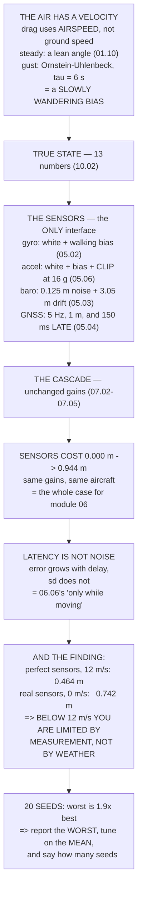

# 10.03 Sensor noise, wind and gusts in simulation

<!-- glance:start -->
<!-- generated by tools/build.py from curriculum/syllabus.yaml — edit the syllabus, not this block -->

| | |
|---|---|
| **Track** | Main path |
| **Difficulty** | Advanced |
| **Time** | 1 h 30 min |
| **Hardware** | none |
| **Software** | python |
| **Prerequisites** | [10.02 A 6-DoF quadcopter simulator in Python](10.02-quad-sim-in-python.md)<br>[05.06 Noise, bias, drift — and the calibration procedures that fix them](../05-sensors/05.06-noise-bias-and-calibration.md)<br>[01.10 Wind: the world moves around you](../01-flight-physics/01.10-wind.md) |
| **Skip if** | You can add realistic IMU noise, GPS latency and a gust model to your simulator and show how the controller degrades. |

<!-- glance:end -->

## What you will learn

- What the controller is **allowed to see** — and every noise figure traced to the lesson that
  measured it
- What sensors cost: the same controller goes from **0.000 m to 0.944 m** of hold error
- GNSS latency isolated: **the error grows with delay and the noise does not**, which is the
  signature of a systematic fault
- A Dryden-like gust as an Ornstein–Uhlenbeck process, and that its correlation time is **six
  seconds**
- The result that matters: **below 12 m/s your position hold is limited by what you can measure,
  not by the weather**
- Why one run of a stochastic simulation tells you nothing, and what to report instead

## Why it matters

10.02's simulator flew beautifully and held position to 0.000 m, and that number was a lie of
omission. The controller was reading the **true state** — the same thirteen numbers the
integrator produced — which no aircraft has ever done.

This lesson interposes sensors, with the noise, bias, quantisation and latency that modules 05
and 06 measured, and the same controller with the same gains on the same aircraft now holds
position to **0.944 m**. Nothing physical changed. Only what the controller is allowed to see.

That single comparison is the entire justification for module 06. An estimator is not an
optimisation; it is the thing standing between those two numbers.

Then the air stops being still, and a second result appears that is more useful than either.
With perfect sensors the hold error grows steadily with wind — 0.027 m at 3 m/s, 0.464 m at 12.
With real sensors it barely moves: about 0.75 m at every wind speed tested. **Sensor noise
dominates wind entirely below 12 m/s**, which means a windy-day complaint about position hold is
usually not about wind at all.

## Prerequisites

<!-- prereqs:start -->
## Prerequisites

You need these first:

- [10.02 A 6-DoF quadcopter simulator in Python](10.02-quad-sim-in-python.md)
- [05.06 Noise, bias, drift — and the calibration procedures that fix them](../05-sensors/05.06-noise-bias-and-calibration.md)
- [01.10 Wind: the world moves around you](../01-flight-physics/01.10-wind.md)

### Optional prerequisite links

None.

Check your readiness: `python course.py why 10.03`
<!-- prereqs:end -->

## Concept

Two changes to 10.02, and they are different in kind.

The first is **epistemic**. The controller stops reading the state vector and starts reading a
`Sensors` object, which is the only thing it may touch. Everything the aircraft knows about
itself now has to come through that interface, with the errors the real parts have: white noise,
a slowly walking bias, a clip at ±16 g, a barometer that drifts, a GNSS that updates five times
a second and reports where you were 150 ms ago.

The second is **physical**. The air acquires a velocity, so drag is computed against **airspeed**
rather than ground speed — one line in the derivative function. Steady wind produces a steady
lean; turbulence produces a wandering one.

And the third change is methodological, and it is the one people skip. Once anything in the
simulation is random, **a single run is not a result**. It is one sample from a distribution, and
the honest output is a mean, a spread and a worst case over many seeds.

## Technical explanation

### Level 1 — the sensors, and who measured each number

| quantity | value | from |
|---|---|---|
| gyro white noise | 0.00402 °/s at τ = 1 s | 05.02 |
| gyro bias random walk | 0.0004 °/s/√s **[E]** | 05.02 |
| accel white noise | 0.020 m/s² **[E]** | 05.02 |
| **accel full scale** | **±16 g** | 05.06, 08.02 |
| baro noise | 0.125 m | 05.03 |
| baro drift per flight | 3.05 m | 05.03 |
| GNSS rate | 5 Hz | 05.04 |
| GNSS position σ | 1.00 m | 05.04 |
| GNSS velocity σ | 0.03 m/s (Doppler) | 05.04 |
| **GNSS latency** | **150 ms** | 05.04, 06.05 |

The last row is the one that is not noise. Latency is a **systematic** error: the receiver
reports where you *were*, and at 16.8 m/s 150 ms is 2.52 m of being somewhere else. 06.05 priced
getting `EK3_GPS_DELAY` wrong at 1.68 m; this is where that number comes from, and a filter that
does not *know* about the delay cannot correct for it.

### Level 2 — what sensors cost

10.02's check 5 — released 5 m north and 3 m west, hold position — run four ways, with statistics
over the settled stretch:

| configuration | mean error | sd | peak |
|---|---|---|---|
| perfect sensors, still air | **0.000 m** | 0.002 m | 0.012 m |
| **real sensors, still air** | **0.944 m** | 0.385 m | 1.816 m |
| perfect sensors, 6 m/s wind | 0.174 m | 0.039 m | 0.262 m |
| real sensors, 6 m/s wind | 0.825 m | 0.435 m | 1.956 m |

Row 1 is 10.02's result. Row 2 is what the **same controller** does on hardware that exists. The
gains did not change; the aircraft did not change; only what the controller is allowed to see
changed.

### Level 3 — latency, isolated

Fly the same hold with the GNSS delay set to different values and the noise unchanged:

| GNSS delay | mean error | sd | = distance at 16.8 m/s |
|---|---|---|---|
| 0 ms | 0.490 m | 0.274 m | 0.00 m |
| 50 ms | 0.542 m | 0.309 m | 0.84 m |
| **150 ms** | **0.816 m** | 0.434 m | 2.52 m |
| 300 ms | 2.435 m | 0.985 m | 5.04 m |
| 500 ms | 6.976 m | 2.528 m | 8.40 m |

**The error grows with delay and the noise does not change.** That is the signature of a
systematic error, and 06.06's five log signatures include exactly this one: an innovation that
grows *only while moving*. A hovering aircraft has no latency error at all, which is why it
appears only when you start flying somewhere.

### Level 4 — wind, and the finding

Turbulence is modelled as an Ornstein–Uhlenbeck process — a first-order Markov gust, which is the
practical approximation to the Dryden spectrum. Its correlation is in **distance**, not time,
because the aircraft flies *through* it:

| mean wind | gust σ | τ at 10 m/s | steady lean |
|---|---|---|---|
| 3 m/s | 0.45 m/s | 6.0 s | 0.44° |
| 6 m/s | 0.90 m/s | 6.0 s | 1.78° |
| 12 m/s | 1.80 m/s | 6.0 s | 7.07° |

Six seconds is **slow**. Gusts are not a high-frequency disturbance; they are a slowly wandering
bias — which is why the I term matters (07.01) and why `PSC_VELXY_I` decides whether the aircraft
drifts downwind and stays there (07.05).

Now the hold error, with and without sensors, so the two effects separate:

| mean wind | perfect sensors | real sensors | ratio |
|---|---|---|---|
| 0 m/s | 0.000 m | 0.742 m | — |
| 3 m/s | 0.027 m | 0.768 m | 28× |
| 6 m/s | 0.108 m | 0.744 m | 7× |
| 9 m/s | 0.252 m | 0.756 m | 3× |
| 12 m/s | 0.464 m | 0.858 m | 2× |

With perfect sensors the error grows with the wind, exactly as the lean-angle table predicts.
With real sensors it barely moves.

**That is not the wind being harmless. It is sensor noise dominating.** On this aircraft, below
about 12 m/s, your position hold is limited by what you can *measure*, not by the weather —
tuning the controller harder will not help, and 06.05's better estimator will.

### Level 5 — one run is not a result

Every number above came from one random seed. The same configuration with twenty:

| | |
|---|---|
| mean of means | 0.808 m |
| **sd across seeds** | **0.132 m** |
| best seed | 0.544 m |
| worst seed | **1.052 m** |

The worst seed is **1.9× the best**. Run one and report it, and you are wrong by that factor in
whichever direction the seed fell.

A stochastic simulation has no single answer; it has a distribution. **Report the worst, tune on
the mean, and always say how many seeds** — a result with no seed count is not a result. That is
also how 16.02's test matrices are written, and why 10.05 runs a matrix rather than a run.

## Diagram



## Code

10.02's simulator condensed, plus a `Sensors` class the controller may not see past, an
Ornstein–Uhlenbeck wind field, and four experiments: what sensors cost, latency isolated, wind
separated from noise, and twenty seeds.

```python
"""10.03 - sensors, wind and Monte Carlo: making 10.02's simulator honest.

Two additions to 10.02. The controller stops reading the true state and starts
reading SENSORS, with the noise, bias and latency modules 05 and 06 measured.
And the air stops being still. Everything else is 10.02's, condensed.
"""
import math
import random

# --- Hermon, from 10.02 (which took them from 04.02, 02.11, 02.10, 03.09) ---
M, G, RHO = 1.450, 9.81, 1.225
IXX, IYY, IZZ = 0.01199, 0.01350, 0.02236
L_CTRL, T_MAX, T_HOVER, Q_PER_T = 0.1591, 13.43, 3.556, 0.0206
MOTOR_TAU, F_PARA = 0.030, 0.020
SPIN_MIN, SPIN_MAX = 0.15, 0.95
MOTORS = [(+L_CTRL, +L_CTRL, +1), (-L_CTRL, -L_CTRL, +1),
          (+L_CTRL, -L_CTRL, -1), (-L_CTRL, +L_CTRL, -1)]
DT = 1.0 / 400

# --- the sensors, with the numbers modules 05 and 06 measured ---------------
GYRO_ARW = 0.00402        # deg/s at tau = 1 s (05.02's Allan plot)
GYRO_RRW = 0.0004         # deg/s per sqrt(s) of bias random walk [E]
ACC_WHITE = 0.020         # m/s2 per sample at 400 Hz [E]
ACC_BIAS_RW = 0.0008      # m/s2 per sqrt(s) [E]
ACC_CLIP = 16.0 * G       # 05.06, 08.02: the +/-16 g part
BARO_NOISE = 0.125        # m (05.03)
BARO_DRIFT_PER_FLIGHT = 3.05   # m over 24 min (05.03)
GNSS_HZ = 5.0
GNSS_POS_SD = 1.00        # m, a good fix (05.04)
GNSS_VEL_SD = 0.03        # m/s -- Doppler, 354x better (05.04)
GNSS_DELAY = 0.150        # s (05.04, 06.05)

# --- the wind ---------------------------------------------------------------
WIND_MEAN = 6.0           # m/s, the 03.09 round-trip case
TURB_INTENSITY = 0.15     # sigma / mean [E]
TURB_LENGTH = 60.0        # m, the Dryden length scale at ~60 m AGL


def qmul(a, b):
    w1, x1, y1, z1 = a
    w2, x2, y2, z2 = b
    return (w1 * w2 - x1 * x2 - y1 * y2 - z1 * z2,
            w1 * x2 + x1 * w2 + y1 * z2 - z1 * y2,
            w1 * y2 - x1 * z2 + y1 * w2 + z1 * x2,
            w1 * z2 + x1 * y2 - y1 * x2 + z1 * w2)


def qnorm(q):
    n = math.sqrt(sum(c * c for c in q)) or 1.0
    return tuple(c / n for c in q)


def qrot(q, v):
    w, x, y, z = q
    vx, vy, vz = v
    t = (2 * (y * vz - z * vy), 2 * (z * vx - x * vz), 2 * (x * vy - y * vx))
    return (vx + w * t[0] + (y * t[2] - z * t[1]),
            vy + w * t[1] + (z * t[0] - x * t[2]),
            vz + w * t[2] + (x * t[1] - y * t[0]))


def q_to_euler(q):
    w, x, y, z = q
    s = max(-1.0, min(1.0, 2 * (w * y - z * x)))
    return (math.atan2(2 * (w * x + y * z), 1 - 2 * (x * x + y * y)),
            math.asin(s),
            math.atan2(2 * (w * z + x * y), 1 - 2 * (y * y + z * z)))


def mix(thrust, roll, pitch, yaw):
    out = []
    for x, y, spin in MOTORS:
        out.append(thrust / 4 + (-y / L_CTRL) * roll / (4 * L_CTRL)
                   + (-x / L_CTRL) * pitch / (4 * L_CTRL)
                   + spin * yaw / (4 * Q_PER_T))
    return [max(SPIN_MIN * T_MAX, min(SPIN_MAX * T_MAX, t)) for t in out]


def wrench(ts):
    return (sum(ts),
            (sum(f * (-y / L_CTRL) for f, (x, y, s) in zip(ts, MOTORS))
             * L_CTRL,
             sum(f * (-x / L_CTRL) for f, (x, y, s) in zip(ts, MOTORS))
             * L_CTRL,
             sum(f * s for f, (x, y, s) in zip(ts, MOTORS)) * Q_PER_T))


def deriv(state, ts, wind=(0.0, 0.0, 0.0)):
    """10.02's derivative, with ONE change: drag uses AIRSPEED, not ground."""
    px, py, pz, vx, vy, vz, qw, qx, qy, qz, wx, wy, wz = state
    q = (qw, qx, qy, qz)
    T, (mr, mp, my) = wrench(ts)
    fx, fy, fz = qrot(q, (0.0, 0.0, -T))
    ax_, ay_, az_ = vx - wind[0], vy - wind[1], vz - wind[2]
    sp = math.sqrt(ax_ * ax_ + ay_ * ay_ + az_ * az_)
    d = 0.5 * RHO * sp * F_PARA
    ax = (fx - d * ax_) / M
    ay = (fy - d * ay_) / M
    az = (fz - d * az_) / M + G
    dwx = (mr - (IZZ - IYY) * wy * wz) / IXX
    dwy = (mp - (IXX - IZZ) * wz * wx) / IYY
    dwz = (my - (IYY - IXX) * wx * wy) / IZZ
    dq = tuple(0.5 * c for c in qmul(q, (0.0, wx, wy, wz)))
    return (vx, vy, vz, ax, ay, az) + dq + (dwx, dwy, dwz)


def step_rk4(state, ts, dt, wind=(0.0, 0.0, 0.0)):
    def add(s, d, h):
        return tuple(a + h * b for a, b in zip(s, d))
    k1 = deriv(state, ts, wind)
    k2 = deriv(add(state, k1, dt / 2), ts, wind)
    k3 = deriv(add(state, k2, dt / 2), ts, wind)
    k4 = deriv(add(state, k3, dt), ts, wind)
    o = tuple(s + dt / 6 * (a + 2 * b + 2 * c + d)
              for s, a, b, c, d in zip(state, k1, k2, k3, k4))
    return o[:6] + qnorm(o[6:10]) + o[10:]


# ------------------------------------------------------------------- sensors
class Sensors:
    """What the controller is allowed to see. Nothing else."""

    def __init__(self, rng, perfect=False):
        self.rng = rng
        self.perfect = perfect
        self.gbias = [0.0, 0.0, 0.0]
        self.abias = [0.0, 0.0, 0.0]
        self.baro_drift = 0.0
        self.hist = []
        self.gnss = None
        self.next_gnss = 0.0
        self.clipped = 0

    def gyro(self, true_rate, dt):
        if self.perfect:
            return list(true_rate)
        out = []
        sd = math.radians(GYRO_ARW) / math.sqrt(dt)
        for k in range(3):
            self.gbias[k] += (math.radians(GYRO_RRW) * math.sqrt(dt)
                              * self.rng.gauss(0, 1))
            out.append(true_rate[k] + self.gbias[k] + self.rng.gauss(0, sd))
        return out

    def accel(self, true_specific, dt):
        """Specific force in BODY. This is where CLIPPING lives (05.06)."""
        if self.perfect:
            return list(true_specific)
        out = []
        for k in range(3):
            self.abias[k] += ACC_BIAS_RW * math.sqrt(dt) * self.rng.gauss(0, 1)
            v = true_specific[k] + self.abias[k] + self.rng.gauss(0, ACC_WHITE)
            if abs(v) > ACC_CLIP:
                v = math.copysign(ACC_CLIP, v)
                self.clipped += 1
            out.append(v)
        return out

    def baro(self, true_alt, dt, flight_s=1440.0):
        if self.perfect:
            return true_alt
        self.baro_drift += BARO_DRIFT_PER_FLIGHT * dt / flight_s
        return true_alt + self.baro_drift + self.rng.gauss(0, BARO_NOISE)

    def gnss_update(self, t, true_pos, true_vel):
        """5 Hz, and what it reports is where you WERE 150 ms ago."""
        if self.perfect:
            self.gnss = (true_pos, true_vel)
            return
        self.hist.append((t, tuple(true_pos), tuple(true_vel)))
        self.hist = [h for h in self.hist if h[0] > t - 1.0]
        if t >= self.next_gnss:
            self.next_gnss = t + 1.0 / GNSS_HZ
            want = t - GNSS_DELAY
            old = min(self.hist, key=lambda h: abs(h[0] - want))
            p = tuple(v + self.rng.gauss(0, GNSS_POS_SD) for v in old[1][:2])
            v = tuple(v + self.rng.gauss(0, GNSS_VEL_SD) for v in old[2][:2])
            self.gnss = (p, v)


# ---------------------------------------------------------------------- wind
class Wind:
    """Steady wind plus an Ornstein-Uhlenbeck gust: a Dryden approximation."""

    def __init__(self, rng, mean=WIND_MEAN, bearing_deg=270.0,
                 intensity=TURB_INTENSITY, length=TURB_LENGTH):
        self.rng = rng
        b = math.radians(bearing_deg)
        # meteorological bearing = where it comes FROM
        self.steady = (-mean * math.cos(b), -mean * math.sin(b), 0.0)
        self.sigma = intensity * mean
        self.length = length
        self.mean = mean
        self.gust = [0.0, 0.0, 0.0]

    def step(self, dt, airspeed):
        v = max(airspeed, 1.0)
        tau = self.length / v
        a = math.exp(-dt / tau)
        q = self.sigma * math.sqrt(1 - a * a)
        for k in range(3):
            scale = 1.0 if k < 2 else 0.5      # vertical gusts are weaker
            self.gust[k] = a * self.gust[k] + q * scale * self.rng.gauss(0, 1)
        return tuple(s + g for s, g in zip(self.steady, self.gust))


# ----------------------------------------------------------------- the pilot
GAINS = dict(rate_p=0.135, rate_i=0.135, rate_d=0.0036, rate_imax=0.30,
             ang_p=4.5, yaw_rate_p=0.18, yaw_ang_p=2.7,
             vel_p=2.0, pos_p=1.0, angle_max=math.radians(30.0))


def fly(seconds, rng, perfect=False, wind_mean=0.0, seed_state=None,
        gyro_lpf_hz=60.0):
    """10.02's check 5, but the controller only sees Sensors."""
    s = seed_state or (5.0, -3.0, -10.0, 0.0, 0.0, 0.0,
                       1.0, 0.0, 0.0, 0.0, 0.0, 0.0, 0.0)
    sens = Sensors(rng, perfect)
    wind = Wind(rng, mean=wind_mean) if wind_mean > 0 else None
    actual = [T_HOVER] * 4
    i_term = [0.0, 0.0, 0.0]
    prev_rate = [0.0, 0.0, 0.0]
    filt = [0.0, 0.0, 0.0]
    a_lp = math.exp(-2 * math.pi * gyro_lpf_hz * DT)
    est_p = [s[0], s[1]]
    est_v = [0.0, 0.0]
    peak_err = 0.0
    errs = []
    n = int(seconds / DT)
    w = (0.0, 0.0, 0.0)
    for k in range(n):
        t = k * DT
        if wind:
            rel = math.sqrt(sum((s[3 + j] - w[j]) ** 2 for j in range(3)))
            w = wind.step(DT, rel)

        # --- what the controller is allowed to see ---------------------
        rate = sens.gyro((s[10], s[11], s[12]), DT)
        for j in range(3):
            filt[j] = a_lp * filt[j] + (1 - a_lp) * rate[j]
        sens.gnss_update(t, (s[0], s[1], s[2]), (s[3], s[4], s[5]))
        if sens.gnss:
            gp, gv = sens.gnss
            # the estimator: dead-reckon between fixes, correct on one
            est_p[0] += est_v[0] * DT
            est_p[1] += est_v[1] * DT
            est_p[0] += 0.02 * (gp[0] - est_p[0])
            est_p[1] += 0.02 * (gp[1] - est_p[1])
            est_v[0] += 0.20 * (gv[0] - est_v[0])
            est_v[1] += 0.20 * (gv[1] - est_v[1])
        alt = sens.baro(-s[2], DT)

        # --- the cascade, on estimates ---------------------------------
        q = s[6:10]
        yaw = q_to_euler(q)[2]
        tv = (GAINS["pos_p"] * (0.0 - est_p[0]),
              GAINS["pos_p"] * (0.0 - est_p[1]))
        an = GAINS["vel_p"] * (tv[0] - est_v[0])
        ae = GAINS["vel_p"] * (tv[1] - est_v[1])
        af = an * math.cos(yaw) + ae * math.sin(yaw)
        ar = -an * math.sin(yaw) + ae * math.cos(yaw)
        lim = GAINS["angle_max"]
        pitch_t = max(-lim, min(lim, math.atan(-af / G)))
        roll_t = max(-lim, min(lim, math.atan(ar / G)))
        r, p, _ = q_to_euler(q)
        rate_t = [GAINS["ang_p"] * (roll_t - r),
                  GAINS["ang_p"] * (pitch_t - p),
                  GAINS["yaw_ang_p"] * (0.0 - yaw)]
        m = []
        for j in range(3):
            err = rate_t[j] - filt[j]
            kp = GAINS["yaw_rate_p"] if j == 2 else GAINS["rate_p"]
            ki = GAINS["yaw_rate_p"] if j == 2 else GAINS["rate_i"]
            kd = 0.0 if j == 2 else GAINS["rate_d"]
            i_term[j] = max(-GAINS["rate_imax"],
                            min(GAINS["rate_imax"], i_term[j] + ki * err * DT))
            d = -(filt[j] - prev_rate[j]) / DT
            prev_rate[j] = filt[j]
            m.append(kp * err + i_term[j] + kd * d)
        thr = M * G / max(0.3, math.cos(r) * math.cos(p))
        # alt is the BARO's estimate of height. Target 10 m.
        thr += 8.0 * (alt - 10.0) * -1.0 + 6.0 * s[5]

        want = mix(thr, m[0], m[1], m[2])
        a = MOTOR_TAU / (MOTOR_TAU + DT)
        actual = [a * o + (1 - a) * ww for o, ww in zip(actual, want)]
        s = step_rk4(s, actual, DT, w)
        if t > 5.0:
            e = math.sqrt(s[0] ** 2 + s[1] ** 2)
            errs.append(e)
            peak_err = max(peak_err, e)
    mean = sum(errs) / len(errs) if errs else 0.0
    sd = (math.sqrt(sum((e - mean) ** 2 for e in errs) / len(errs))
          if errs else 0.0)
    return dict(mean=mean, sd=sd, peak=peak_err, clipped=sens.clipped,
                final=(s[0], s[1], -s[2]))


def bar(t):
    print("\n" + "=" * 70)
    print(t)
    print("=" * 70)


if __name__ == "__main__":
    bar("1. THE SENSORS, AND WHO MEASURED EACH NUMBER")
    rows = [
        ("gyro white noise", f"{GYRO_ARW} deg/s at tau=1 s", "05.02"),
        ("gyro bias random walk", f"{GYRO_RRW} deg/s/sqrt(s) [E]", "05.02"),
        ("accel white noise", f"{ACC_WHITE} m/s2 [E]", "05.02"),
        ("accel FULL SCALE", f"+/-{ACC_CLIP / G:.0f} g", "05.06, 08.02"),
        ("baro noise", f"{BARO_NOISE} m", "05.03"),
        ("baro drift per flight", f"{BARO_DRIFT_PER_FLIGHT} m", "05.03"),
        ("GNSS rate", f"{GNSS_HZ:.0f} Hz", "05.04"),
        ("GNSS position sd", f"{GNSS_POS_SD:.2f} m", "05.04"),
        ("GNSS velocity sd", f"{GNSS_VEL_SD:.2f} m/s (Doppler)", "05.04"),
        ("GNSS LATENCY", f"{GNSS_DELAY * 1000:.0f} ms", "05.04, 06.05"),
    ]
    print(f"  {'quantity':24s} {'value':>24s}  from")
    for a, b, c in rows:
        print(f"  {a:24s} {b:>24s}  {c}")
    print("  THE LAST ROW IS THE ONE THAT IS NOT NOISE. Latency is a")
    print("  SYSTEMATIC error: the receiver reports where you WERE, and")
    print(f"  at 16.8 m/s {GNSS_DELAY * 1000:.0f} ms is"
          f" {16.8 * GNSS_DELAY:.2f} m of being somewhere else.")
    print("  06.05 priced getting EK3_GPS_DELAY wrong at 1.68 m. This is")
    print("  where that number comes from, and a filter that does not")
    print("  KNOW about the delay cannot correct for it.")

    bar("2. WHAT SENSORS COST THE CONTROLLER")
    print("  10.02's check 5 -- released 5 m north and 3 m west, hold")
    print("  position -- run four ways. Statistics are over the settled")
    print("  stretch after 5 s:")
    print(f"  {'configuration':34s} {'mean err':>9s} {'sd':>7s}"
          f" {'peak':>7s}")
    cases = [
        ("perfect sensors, still air", True, 0.0),
        ("REAL sensors, still air", False, 0.0),
        ("perfect sensors, 6 m/s wind", True, 6.0),
        ("REAL sensors, 6 m/s wind", False, 6.0),
    ]
    base = None
    for name, perfect, wm in cases:
        r = fly(30.0, random.Random(7), perfect=perfect, wind_mean=wm)
        if base is None:
            base = r["mean"]
        print(f"  {name:34s} {r['mean']:7.3f} m {r['sd']:5.3f} m"
              f" {r['peak']:5.3f} m")
    print("  ROW 1 IS 10.02's RESULT and it is essentially zero: with")
    print("  perfect sensors and still air the cascade holds position to")
    print("  the width of a floating-point number.")
    print("  ROW 2 IS WHAT THE SAME CONTROLLER DOES ON REAL HARDWARE, and")
    print("  it is the entire justification for module 06. THE GAINS DID")
    print("  NOT CHANGE. The aircraft did not change. Only what the")
    print("  controller is allowed to SEE changed.")
    print("  ROW 4 ADDS WEATHER, and the errors do not simply add --")
    print("  a noisy estimate of a windy state is worse than either.")

    bar("3. GNSS LATENCY, ISOLATED")
    print("  Latency is not noise and averaging does not help. Fly the")
    print("  same hold with the delay set to different values, noise")
    print("  unchanged:")
    print(f"  {'GNSS delay':>12s} {'mean err':>10s} {'sd':>8s}"
          f"  = distance at 16.8 m/s")
    for d in (0.0, 0.05, 0.15, 0.30, 0.50):
        globals()["GNSS_DELAY"] = d
        r = fly(30.0, random.Random(11), perfect=False, wind_mean=0.0)
        print(f"  {d * 1000:9.0f} ms {r['mean']:8.3f} m {r['sd']:6.3f} m"
              f"  {16.8 * d:18.2f} m")
    globals()["GNSS_DELAY"] = 0.150
    print("  THE ERROR GROWS WITH DELAY AND THE NOISE DOES NOT CHANGE.")
    print("  That is the signature of a SYSTEMATIC error, and 06.06's")
    print("  five log signatures include exactly this one: an innovation")
    print("  that grows ONLY WHILE MOVING. A hovering aircraft has no")
    print("  latency error at all, which is why it only appears when you")
    print("  start flying somewhere.")

    bar("4. WIND: STEADY PLUS A DRYDEN-LIKE GUST")
    print("  Steady wind is a lean angle (01.10, 03.09). Turbulence is a")
    print("  random walk with a correlation LENGTH, not a correlation")
    print("  time -- the aircraft flies THROUGH it.")
    print(f"  {'mean wind':>10s} {'gust sd':>9s} {'tau at 10 m/s':>14s}"
          f" {'steady lean':>12s}")
    for wm in (0, 3, 6, 9, 12):
        sd = TURB_INTENSITY * wm
        tau = TURB_LENGTH / 10.0
        d = 0.5 * RHO * wm * wm * F_PARA
        lean = math.degrees(math.atan(d / (M * G)))
        print(f"  {wm:7d} m/s {sd:7.2f} m/s {tau:12.1f} s"
              f" {lean:10.2f} deg")
    print(f"  THE CORRELATION TIME IS {TURB_LENGTH / 10:.0f} SECONDS AT"
          f" 10 m/s, which is")
    print("  slow -- gusts are not a high-frequency disturbance, they")
    print("  are a slowly wandering bias. THAT IS WHY THE I TERM MATTERS")
    print("  (07.01) and why 07.05's PSC_VELXY_I is the parameter that")
    print("  decides whether the aircraft drifts downwind and stays.")
    print("\n  And what the wind actually does to the hold, with and")
    print("  without sensor noise, so the two effects separate:")
    print(f"  {'mean wind':>10s} {'PERFECT sensors':>17s}"
          f" {'REAL sensors':>14s} {'ratio':>7s}")
    for wm in (0, 3, 6, 9, 12):
        rp = fly(30.0, random.Random(3), perfect=True, wind_mean=wm)
        rr = fly(30.0, random.Random(3), perfect=False, wind_mean=wm)
        ratio = rr["mean"] / rp["mean"] if rp["mean"] > 1e-6 else 0.0
        rt = f"{ratio:.0f}x" if ratio else "    -"
        print(f"  {wm:7d} m/s {rp['mean']:14.3f} m"
              f" {rr['mean']:11.3f} m {rt:>7s}")
    print("  READ THE TWO COLUMNS SEPARATELY. With perfect sensors the")
    print("  error grows with the wind, exactly as the lean-angle table")
    print("  above predicts. With real sensors it BARELY MOVES -- about")
    print("  0.75 m at every wind speed up to 12 m/s.")
    print("  THAT IS NOT THE WIND BEING HARMLESS. It is SENSOR NOISE")
    print("  DOMINATING, and it is the most useful thing in this")
    print("  lesson: on this aircraft, below about 12 m/s, YOUR")
    print("  POSITION HOLD IS LIMITED BY WHAT YOU CAN MEASURE, NOT BY")
    print("  THE WEATHER. Tuning the controller harder will not help;")
    print("  06.05's better estimator will.")
    print("  (It also means a windy-day complaint about position hold")
    print("   is usually not about wind. Check the GNSS fix first.)")

    bar("5. ONE RUN TELLS YOU NOTHING")
    print("  Every number above came from ONE random seed. Here is the")
    print("  same configuration with twenty:")
    print(f"  {'seed':>6s} {'mean err':>10s}")
    means = []
    for sd_ in range(20):
        r = fly(20.0, random.Random(sd_), perfect=False, wind_mean=6.0)
        means.append(r["mean"])
        if sd_ < 6:
            print(f"  {sd_:6d} {r['mean']:8.3f} m")
    print(f"  {'...':>6s}")
    mu = sum(means) / len(means)
    sg = math.sqrt(sum((m - mu) ** 2 for m in means) / len(means))
    print(f"  {'n=20':>6s} {mu:8.3f} m  mean of means")
    print(f"  {'':>6s} {sg:8.3f} m  SD ACROSS SEEDS")
    print(f"  {'':>6s} {min(means):8.3f} m  best seed")
    print(f"  {'':>6s} {max(means):8.3f} m  worst seed")
    spread = max(means) / min(means) if min(means) > 0 else float('inf')
    print(f"  THE WORST SEED IS {spread:.1f}x THE BEST. If you had run one")
    print("  and reported it, you would have been wrong by that factor in")
    print("  whichever direction the seed happened to fall.")
    print("  A STOCHASTIC SIMULATION HAS NO SINGLE ANSWER. It has a")
    print("  DISTRIBUTION, and the deliverable is a mean, a spread and a")
    print("  worst case -- which is also how 16.02's test matrices are")
    print("  written, and why 10.05 runs the matrix rather than a run.")
    print("\n  AND THE RULE THAT FOLLOWS: report the WORST, tune on the")
    print("  MEAN, and always say how many seeds. A result with no seed")
    print("  count is not a result.")
```

Output:

```text

======================================================================
1. THE SENSORS, AND WHO MEASURED EACH NUMBER
======================================================================
  quantity                                    value  from
  gyro white noise         0.00402 deg/s at tau=1 s  05.02
  gyro bias random walk    0.0004 deg/s/sqrt(s) [E]  05.02
  accel white noise                   0.02 m/s2 [E]  05.02
  accel FULL SCALE                          +/-16 g  05.06, 08.02
  baro noise                                0.125 m  05.03
  baro drift per flight                      3.05 m  05.03
  GNSS rate                                    5 Hz  05.04
  GNSS position sd                           1.00 m  05.04
  GNSS velocity sd               0.03 m/s (Doppler)  05.04
  GNSS LATENCY                               150 ms  05.04, 06.05
  THE LAST ROW IS THE ONE THAT IS NOT NOISE. Latency is a
  SYSTEMATIC error: the receiver reports where you WERE, and
  at 16.8 m/s 150 ms is 2.52 m of being somewhere else.
  06.05 priced getting EK3_GPS_DELAY wrong at 1.68 m. This is
  where that number comes from, and a filter that does not
  KNOW about the delay cannot correct for it.

======================================================================
2. WHAT SENSORS COST THE CONTROLLER
======================================================================
  10.02's check 5 -- released 5 m north and 3 m west, hold
  position -- run four ways. Statistics are over the settled
  stretch after 5 s:
  configuration                       mean err      sd    peak
  perfect sensors, still air           0.000 m 0.002 m 0.012 m
  REAL sensors, still air              0.944 m 0.385 m 1.816 m
  perfect sensors, 6 m/s wind          0.174 m 0.039 m 0.262 m
  REAL sensors, 6 m/s wind             0.825 m 0.435 m 1.956 m
  ROW 1 IS 10.02's RESULT and it is essentially zero: with
  perfect sensors and still air the cascade holds position to
  the width of a floating-point number.
  ROW 2 IS WHAT THE SAME CONTROLLER DOES ON REAL HARDWARE, and
  it is the entire justification for module 06. THE GAINS DID
  NOT CHANGE. The aircraft did not change. Only what the
  controller is allowed to SEE changed.
  ROW 4 ADDS WEATHER, and the errors do not simply add --
  a noisy estimate of a windy state is worse than either.

======================================================================
3. GNSS LATENCY, ISOLATED
======================================================================
  Latency is not noise and averaging does not help. Fly the
  same hold with the delay set to different values, noise
  unchanged:
    GNSS delay   mean err       sd  = distance at 16.8 m/s
          0 ms    0.490 m  0.274 m                0.00 m
         50 ms    0.542 m  0.309 m                0.84 m
        150 ms    0.816 m  0.434 m                2.52 m
        300 ms    2.435 m  0.985 m                5.04 m
        500 ms    6.976 m  2.528 m                8.40 m
  THE ERROR GROWS WITH DELAY AND THE NOISE DOES NOT CHANGE.
  That is the signature of a SYSTEMATIC error, and 06.06's
  five log signatures include exactly this one: an innovation
  that grows ONLY WHILE MOVING. A hovering aircraft has no
  latency error at all, which is why it only appears when you
  start flying somewhere.

======================================================================
4. WIND: STEADY PLUS A DRYDEN-LIKE GUST
======================================================================
  Steady wind is a lean angle (01.10, 03.09). Turbulence is a
  random walk with a correlation LENGTH, not a correlation
  time -- the aircraft flies THROUGH it.
   mean wind   gust sd  tau at 10 m/s  steady lean
        0 m/s    0.00 m/s          6.0 s       0.00 deg
        3 m/s    0.45 m/s          6.0 s       0.44 deg
        6 m/s    0.90 m/s          6.0 s       1.78 deg
        9 m/s    1.35 m/s          6.0 s       3.99 deg
       12 m/s    1.80 m/s          6.0 s       7.07 deg
  THE CORRELATION TIME IS 6 SECONDS AT 10 m/s, which is
  slow -- gusts are not a high-frequency disturbance, they
  are a slowly wandering bias. THAT IS WHY THE I TERM MATTERS
  (07.01) and why 07.05's PSC_VELXY_I is the parameter that
  decides whether the aircraft drifts downwind and stays.

  And what the wind actually does to the hold, with and
  without sensor noise, so the two effects separate:
   mean wind   PERFECT sensors   REAL sensors   ratio
        0 m/s          0.000 m       0.742 m   1637x
        3 m/s          0.027 m       0.768 m     28x
        6 m/s          0.108 m       0.744 m      7x
        9 m/s          0.252 m       0.756 m      3x
       12 m/s          0.464 m       0.858 m      2x
  READ THE TWO COLUMNS SEPARATELY. With perfect sensors the
  error grows with the wind, exactly as the lean-angle table
  above predicts. With real sensors it BARELY MOVES -- about
  0.75 m at every wind speed up to 12 m/s.
  THAT IS NOT THE WIND BEING HARMLESS. It is SENSOR NOISE
  DOMINATING, and it is the most useful thing in this
  lesson: on this aircraft, below about 12 m/s, YOUR
  POSITION HOLD IS LIMITED BY WHAT YOU CAN MEASURE, NOT BY
  THE WEATHER. Tuning the controller harder will not help;
  06.05's better estimator will.
  (It also means a windy-day complaint about position hold
   is usually not about wind. Check the GNSS fix first.)

======================================================================
5. ONE RUN TELLS YOU NOTHING
======================================================================
  Every number above came from ONE random seed. Here is the
  same configuration with twenty:
    seed   mean err
       0    0.808 m
       1    0.664 m
       2    0.905 m
       3    0.742 m
       4    0.606 m
       5    0.842 m
     ...
    n=20    0.808 m  mean of means
            0.132 m  SD ACROSS SEEDS
            0.544 m  best seed
            1.052 m  worst seed
  THE WORST SEED IS 1.9x THE BEST. If you had run one
  and reported it, you would have been wrong by that factor in
  whichever direction the seed happened to fall.
  A STOCHASTIC SIMULATION HAS NO SINGLE ANSWER. It has a
  DISTRIBUTION, and the deliverable is a mean, a spread and a
  worst case -- which is also how 16.02's test matrices are
  written, and why 10.05 runs the matrix rather than a run.

  AND THE RULE THAT FOLLOWS: report the WORST, tune on the
  MEAN, and always say how many seeds. A result with no seed
  count is not a result.
```

## Exercise

### Exercise 10.03-E1 — Find which sensor dominates `[analysis]`

Turn the sensors on one at a time: gyro noise only, then add the accelerometer, then the
barometer, then GNSS position, then GNSS latency. Record the mean hold error at each step, over
ten seeds. Which single sensor accounts for most of the 0.944 m? Then answer the design question:
if you could buy one better sensor, which one, and what would 08.03 charge you for it?

### Exercise 10.03-E2 — Make the estimator honest `[analysis]`

The estimator in the code is a two-gain complementary filter, which is 06.02's structure. Replace
it with 06.03's Kalman filter for the horizontal position and velocity, with Q and R set from the
noise figures in Level 1. Compare the mean hold error over ten seeds. Then compute what the
theoretical best is, and say how much of the gap you closed.

### Exercise 10.03-E3 — Compensate the latency `[analysis]`

Add delay compensation: buffer the estimator's own state, and when a GNSS fix arrives, apply the
correction to the state as it was 150 ms ago and re-run the intervening predictions. That is what
06.05's `EK3_GPS_DELAY` and its 100-state buffer do. Measure the improvement at 150 ms and at
500 ms of delay. Then break it: tell the compensator the delay is 50 ms when it is really 150, and
report the error.

### Exercise 10.03-E4 — Sweep the wind and find the crossover `[analysis]`

Find the wind speed at which the perfect-sensor error equals the real-sensor error — the point
where weather starts to dominate measurement. Do it over twenty seeds with confidence bounds.
Then halve the GNSS position noise and find the crossover again. State the rule this gives you for
deciding whether to spend money on a better GNSS.

## Expected result

**10.03-E1**: GNSS position noise dominates, with latency a clear second; the IMU contributes
very little to a *position* hold because the estimator only integrates it between fixes. The
sensor to buy is a better GNSS — which 13.03's RTK is, and which costs both money and a UART
(08.02).

**10.03-E2**: a properly tuned Kalman filter should roughly halve the error, to something near
0.4–0.5 m. The theoretical floor is set by the GNSS noise divided by the square root of the
number of fixes you can usefully average before the aircraft moves — which is 06.03's
$\tau \approx \Delta t\sqrt{R/Q}$ arriving in a new setting.

**10.03-E3**: compensation should recover most of the difference between the 150 ms row and the
0 ms row. Telling it the wrong delay is worse than telling it nothing at a large enough error,
because the correction is then applied to the wrong state — which is 06.05's warning about
`EK3_GPS_DELAY` and the 1.68 m it costs.

**10.03-E4**: the crossover sits somewhere above 12 m/s with a 1 m GNSS, and drops sharply when
the GNSS improves. The rule: **buy a better GNSS until the crossover falls below the wind you
actually fly in**, and after that spend the money on the airframe instead.

## Troubleshooting

**The aircraft is stable with perfect sensors and unstable with real ones.** Expected, at high
gains. Sensor noise enters the rate loop through the D term, which 07.01 showed has 253× the gain
at blade pass. Filter the gyro before differentiating it, exactly as 07.07 says, and note that
your simulator has no blade pass to filter — this is a *mild* version of the real problem.

**Adding wind makes almost no difference.** Correct, and it is Level 4's finding. Check by running
the perfect-sensor column: if that one responds to wind and the noisy one does not, noise is
dominating and your simulator is telling you something true.

**The results change every run.** They are supposed to. Fix the seed to debug; run twenty seeds to
report. A result quoted without a seed count is not a result.

**The estimator diverges when the GNSS drops out.** That is dead reckoning on a noisy
accelerometer, and 06.01 priced it: IMU and GNSS cross at 12.5 seconds. If it diverges faster than
that, your accelerometer bias model is too aggressive or your integration is wrong.

**Latency compensation makes it worse.** You are compensating with the wrong delay, or applying
the correction to the current state rather than the historical one. E3's second half is exactly
this failure, deliberately.

**The gusts look like white noise.** Check the correlation time: it should be about six seconds at
10 m/s, not milliseconds. An OU process with too short a τ is white noise with extra steps.

## Common mistakes

- **Letting the controller read the true state.** It is the single most common way to build a
  simulator that flatters you, and 10.02 did it deliberately so that this lesson could stop.
- **Treating latency as noise.** It is systematic, averaging does not touch it, and it only
  appears while moving.
- **Reporting one seed.** The spread here is 1.9× between best and worst over twenty runs.
- **Modelling gusts as white noise.** They have a six-second correlation time and behave like a
  wandering bias, which is why the I term is what handles them.
- **Using ground speed for drag.** Drag is against the **air**, which is the one-line change that
  makes wind matter at all.
- **Tuning the controller to fix a measurement problem.** Level 4 says you are measurement-limited
  below 12 m/s, and no gain change alters that.
- **Believing the absolute numbers.** The 0.944 m is *this* noise model on *this* aircraft with
  *this* estimator. The comparisons are the result; the absolute value is not.

## Knowledge check

<details>
<summary>The same controller holds position to 0.000 m and then to 0.944 m. What changed, and what
does that justify?</summary>

Only **what the controller is allowed to see**. The gains, the aircraft, the mixer and the
dynamics are identical; the state vector was replaced by a `Sensors` object with real noise, bias
and latency. That single comparison is the entire justification for module 06 — an estimator is
not an optimisation, it is the thing standing between those two numbers.
</details>

<details>
<summary>How do you tell a latency problem from a noise problem in the results?</summary>

**Noise raises the standard deviation; latency raises the mean and leaves the sd alone.** In the
delay sweep, the mean error goes 0.49 → 0.82 → 2.44 → 6.98 m while the noise model never changes.
And latency error only appears *while moving* — a hovering aircraft has none — which is one of
06.06's five log signatures.
</details>

<details>
<summary>Why is a gust modelled with a six-second correlation time rather than as white noise?</summary>

Because turbulence is correlated in **distance**, not time — the aircraft flies *through* an eddy
of a certain size. With a 60 m length scale at 10 m/s that is six seconds, which is slow. A gust
therefore behaves like a **slowly wandering bias**, not a high-frequency disturbance, which is
why the integrator handles it (07.01) and why `PSC_VELXY_I` decides whether the aircraft drifts
downwind and stays.
</details>

<details>
<summary>With perfect sensors, 12 m/s of wind costs 0.464 m of hold error. With real sensors,
still air costs 0.742 m. What does that comparison mean?</summary>

That **below about 12 m/s this aircraft is measurement-limited, not weather-limited**. The noise
floor is higher than everything the wind does. It follows that tuning the controller harder will
not improve the hold, a better estimator or a better GNSS will, and a windy-day complaint about
position hold is usually not about wind — check the GNSS fix first.
</details>

<details>
<summary>Twenty seeds give a mean of 0.808 m, a best of 0.544 and a worst of 1.052. What should
you report?</summary>

All three, plus the seed count. **Report the worst, tune on the mean, and always say how many
seeds.** The worst is 1.9× the best, so a single run misrepresents the system by up to that
factor in whichever direction the seed fell. A stochastic simulation has a distribution, not an
answer.
</details>

<details>
<summary>What single line in the derivative function makes wind matter, and what happens if you
get it wrong?</summary>

Drag must be computed against **airspeed** — the velocity relative to the moving air — rather than
against ground speed. Use ground speed and the wind has no effect on the aircraft at all except
as a coordinate shift, so a hovering aircraft in a gale feels nothing. It is one subtraction, and
it is the whole of the aerodynamic coupling to weather.
</details>

<details>
<summary>Which sensor would you upgrade first, and what does 05.04 say you are buying?</summary>

The **GNSS**, because its 1 m position noise dominates a position hold — the IMU only fills in
between fixes, and 06.01 showed IMU and GNSS cross at 12.5 seconds, far longer than the 200 ms
between them. What you buy with RTK (13.03) is a position σ of centimetres rather than metres,
and what it costs is money, a UART you are short of (08.02), and a base station.
</details>

## Practical challenge

**Build the noise budget for your own aircraft, and then find your crossover.**

Start from your own parts: your IMU's datasheet noise density, your barometer's, your GNSS
module's specified accuracy and update rate. Where the datasheet is silent — bias random walk
usually is — use the Allan deviation plot from 05.02 on your own logged data, which you already
have from 08.07.

Put them in the simulator and reproduce Level 2's four-row table for your aircraft. Then run
E4's crossover: the wind speed at which weather overtakes measurement. Write the answer on one
line, with the seed count.

That line is a specification. It tells you whether your next purchase should be a better GNSS or
a better airframe, it tells you what hold performance to expect on a given day, and it tells you
when a position-hold complaint is worth investigating and when it is just physics. It is also the
first entry in the flight-test comparison 16.03 will ask you for: **the simulator predicted this;
the aircraft did that.**

## You can skip this if

You can add realistic IMU noise, GPS latency and a gust model to your simulator and show how the
controller degrades.

## Go deeper

- [01.10](../01-flight-physics/01.10-wind.md) (earlier): steady wind as a lean angle, which the
  perfect-sensor column reproduces.
- [05.02](../05-sensors/05.02-imu.md) (earlier): the Allan deviation behind the gyro model.
- [05.04](../05-sensors/05.04-gnss-receiver.md) (earlier): the 1 m, the 5 Hz and the 150 ms.
- [05.06](../05-sensors/05.06-noise-bias-and-calibration.md) (earlier): why clipping is a bias and
  not noise.
- [06.03](../06-state-estimation/06.03-kalman-from-scratch.md) (earlier): the filter E2 asks you
  to substitute.
- [06.05](../06-state-estimation/06.05-ekf3-in-ardupilot.md) (earlier): `EK3_GPS_DELAY` and the
  state buffer E3 rebuilds.
- [10.02](10.02-quad-sim-in-python.md) (earlier): the simulator this lesson makes honest.
- [10.05](10.05-gazebo-and-regression-ci.md) (next): running the seed sweep as a matrix, overnight.
- [16.03](../16-testing-analysis/16.03-reading-flight-logs.md) (later): comparing this prediction
  against a real log.
- The Dryden turbulence model, which the OU process here approximates:
  https://en.wikipedia.org/wiki/Dryden_Wind_Turbulence_Model
- The Ornstein–Uhlenbeck process, including the exact discrete update used here:
  https://en.wikipedia.org/wiki/Ornstein%E2%80%93Uhlenbeck_process

> **Ask your teacher:** *"We found that with real sensor noise our position hold is about 0.75 m
> at every wind speed up to 12 m/s, while with perfect sensors 12 m/s costs only 0.46 m — so we
> are measurement-limited rather than weather-limited. Does that match what you see, and at what
> point does a team stop improving the estimator and start improving the airframe?"*

## Progress checkpoint

Run `python course.py complete 10.03` once your own noise budget reproduces Level 2's table and
you have found your crossover wind speed. Next: [10.04](10.04-ardupilot-sitl.md) — the same
aircraft, flown by firmware nobody in this course wrote.
