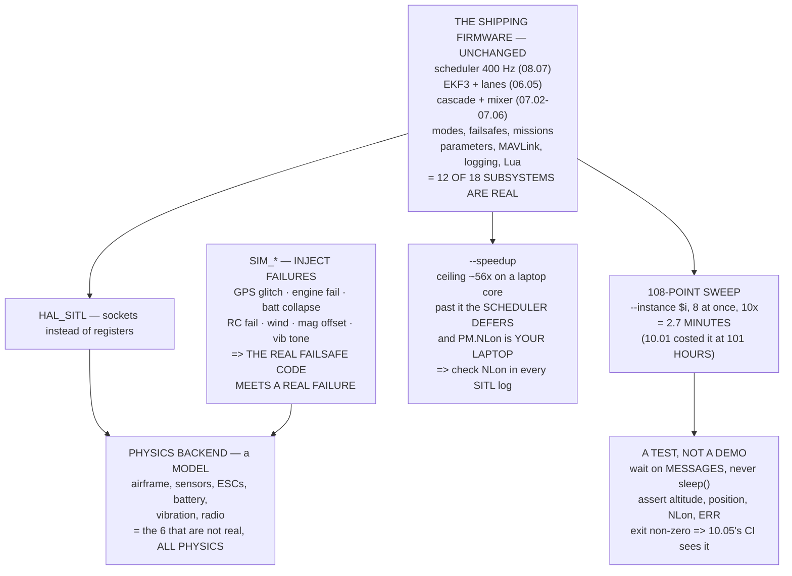

# 10.04 ArduPilot SITL: the real firmware in a process

<!-- glance:start -->
<!-- generated by tools/build.py from curriculum/syllabus.yaml — edit the syllabus, not this block -->

| | |
|---|---|
| **Track** | Main path |
| **Difficulty** | Intermediate |
| **Time** | 2 h |
| **Hardware** | none |
| **Software** | ardupilot, sitl, mavproxy |
| **Prerequisites** | [10.01 Why simulate: the cost of a crash](10.01-why-simulate.md)<br>[08.05 MAVLink: the protocol of drones](../08-flight-controller/08.05-mavlink.md) |
| **Version-sensitive** | yes — see [curriculum/versions.yaml](../curriculum/versions.yaml) |
| **Skip if** | You can launch SITL, fly a scripted mission through pymavlink and pull the resulting log. |

<!-- glance:end -->

## What you will learn

- What is actually real in SITL — **twelve of eighteen subsystems**, and the six that are not are
  all physics
- The framing that makes module 10 make sense: **10.02 is a good plant with your controller; SITL
  is a simpler plant with the real one**
- Where `--speedup` stops working, and why a SITL log full of loop overruns may be **your laptop**
- 07.03's 108-point sweep as a real command line: **three minutes on eight cores**
- The `SIM_*` parameters, which let the **real failsafe code meet a real failure**
- What separates a SITL demo from a SITL **test** — and why it contains no `sleep()`

> **Version-sensitive.** `sim_vehicle.py` flags, `SIM_*` parameter names and the build
> instructions change between ArduPilot releases, and were checked against **Copter 4.5** in
> September 2026. The arguments are stable; the flags are not. Check
> `sim_vehicle.py --help` and the current SITL documentation before copying a command line.

## Why it matters

08.01 chose ArduPilot partly on the claim that its simulator "runs the real flight code". This
lesson cashes that claim, and it turns out to be true of **twelve of eighteen subsystems**: the
scheduler with its priorities and overrun counter, EKF3 with its lanes and every `_NSE`, the
control cascade with your tuned gains, the mixer with both clamps, all thirteen flight modes, all
eight failsafes with their priority order, the mission state machine, the parameter tree, MAVLink
byte for byte, the log format, and the Lua interpreter.

The six that are not real are the airframe physics, the sensors, the vibration, the ESCs, the
battery and the radio link — **all of them physics**, and all of them already on 10.01's gap list.

Which gives module 10 its shape. 10.02 built a *good plant* driven by *your* controller. SITL is
a *simpler plant* driven by the *real* one. They test opposite halves of the same system and
neither substitutes for the other, which is why this module has both.

And SITL's real advantage is not fidelity at all. It is that you can make the **real failsafe
code meet a real failure**: a GNSS glitch, a motor stopping, a battery collapsing, an RC link
dropping — repeatably, at ten times real time, with a log at the end. Every one of those is
something you would otherwise have to break the aircraft to test.

## Prerequisites

<!-- prereqs:start -->
## Prerequisites

You need these first:

- [10.01 Why simulate: the cost of a crash](10.01-why-simulate.md)
- [08.05 MAVLink: the protocol of drones](../08-flight-controller/08.05-mavlink.md)

### Optional prerequisite links

None.

Check your readiness: `python course.py why 10.04`
<!-- prereqs:end -->

## Concept

SITL — software in the loop — is ArduPilot compiled for your desktop with two substitutions. The
hardware abstraction layer is replaced by one that talks to sockets instead of registers, and the
sensors are replaced by a physics model that manufactures plausible readings.

Everything above those two layers is the shipping firmware. The scheduler still runs at 400 Hz,
still has the task table from 08.07, still defers work when the budget runs out and still counts
overruns in `PM.NLon`. The EKF is the same EKF. The mixer clamps at the same `MOT_SPIN_MIN`. A
`.param` file from your aircraft loads and means the same thing.

This has three consequences worth stating separately.

**Anything that is a software bug is fully testable.** Flight modes, failsafes, missions,
geofences, the parameter system, the mission state machine, Lua scripts. If it is logic, SITL
catches it — which is 10.01's forty per cent.

**Anything that is physics is a model**, and a simpler one than the simulator you wrote in 10.02.
Do not use SITL to decide whether your control gains are right in an absolute sense; use it to
decide whether the *firmware* does what you told it to.

**And you can inject failures.** The `SIM_*` parameter group exists to make things go wrong on
demand, which is the only cheap way to exercise code that is supposed to run once a year.

## Technical explanation

### Level 1 — what is real

| subsystem | real? | what that means |
|---|---|---|
| the scheduler | **real** | 08.07's task table, priorities and `NLon` |
| EKF3 | **real** | 06.05's lanes, scoring and every `_NSE` |
| the control cascade | **real** | 07.02–07.05, your tuned gains |
| the mixer | **real** | 07.06, including both `SPIN` clamps |
| filters and the notch | **real** | 07.07's biquads, on synthetic data |
| flight modes | **real** | all thirteen of 07.05 |
| failsafes | **real** | 09.03's eight, and their priority order |
| missions and geofence | **real** | 12.01, 12.03 — the real state machine |
| parameters | **real** | 08.04's tree, and the same `.param` files |
| MAVLink | **real** | 08.05, byte for byte |
| logging | **real** | 08.07's messages, into a real `.bin` |
| Lua scripting | **real** | 12.06, the same interpreter |
| airframe physics | model | simpler than 10.02's |
| sensors | model | synthesised, plus `SIM_*` noise |
| **vibration** | model | `SIM_VIB_*` is a tone, not 07.07's spectrum |
| the ESCs | model | instant and ideal; no desync, no heat |
| the battery | model | a curve, not 03.02's chemistry |
| the radio link | model | perfect unless you inject a failsafe |

**Twelve of eighteen are the real code**, and the six that are not are all physics.

| | the plant | the controller |
|---|---|---|
| 10.02–10.03 | yours, good | yours |
| **SITL** | theirs, simpler | **real** |
| flight | the world | real |

### Level 2 — `--speedup`, and where it stops

SITL runs the same 400 Hz scheduler as the aircraft, so "faster than real time" means giving each
loop less than its 2,500 µs of wall clock:

| `--speedup` | µs per loop | |
|---|---|---|
| 1× | 2,500 | fine |
| 10× | 250 | fine |
| 20× | 125 | fine |
| 50× | 50 | marginal |
| 100× | 25 | **scheduler overruns** |

The ceiling is about **56×** on a typical laptop core. Past it, SITL does not merely slow down —
the scheduler starts deferring tasks exactly as 08.07 described, and `PM.NLon` climbs. **You get
a log full of loop overruns that are an artefact of your laptop.**

So: check `PM.NLon` in every SITL log. If it is non-zero, either your speedup is too high or you
have found something real, and the way to tell them apart is to re-run at 1×.

### Level 3 — the sweep, as a command line

07.03's rate-gain sweep is twelve values of `ATC_RAT_RLL_P` × nine of `_D` = 108 points, at
120 simulated seconds each:

| speedup | cores | wall clock |
|---|---|---|
| 1× | 1 | 216 min |
| 1× | 8 | 27 min |
| **10×** | **8** | **2.7 min** |
| 20× | 8 | 1.4 min |

Which 10.01 costed at 101 hours of flying.

```bash
sim_vehicle.py -v ArduCopter -f quad --no-mavproxy --speedup 10 --instance $i --add-param-file sweep/$i.param -L HermonField
```

`--instance` gives each run its own ports and its own directory, which is the whole reason eight
can run at once.

### Level 4 — injecting failures

| failure | parameter | and it exercises |
|---|---|---|
| GNSS glitch | `SIM_GPS1_GLTCH_X/Y/Z` | 06.06's spike signature |
| GNSS total loss | `SIM_GPS1_ENABLE = 0` | 09.03's ladder, live |
| motor failure | `SIM_ENGINE_FAIL`, `SIM_ENGINE_MUL` | 07.06's allocator on three motors |
| battery collapse | `SIM_BATT_VOLTAGE` | 09.03's priority race |
| wind and gusts | `SIM_WIND_SPD / _DIR / _TURB` | 10.03's model, theirs |
| baro drift | `SIM_BARO_DRIFT` | 05.03's 3.05 m |
| **RC failsafe** | `SIM_RC_FAIL` | **09.03's whole subject, repeatably** |
| compass anomaly | `SIM_MAG1_OFS_X/Y/Z` | 05.03's 31.8° |
| vibration | `SIM_VIB_FREQ`, `SIM_VIB_MOT_MAX` | a **tone**, not a spectrum |

Every one is a thing you would otherwise have to break the aircraft to test, and 09.03's six-step
failsafe test can be run here first, repeatably, at 10×, with a log.

The vibration row deserves its honesty. `SIM_VIB_FREQ` injects a tone at a frequency you choose.
That is enough to exercise the notch's **plumbing** — does `INS_HNTCH_MODE 3` read the rpm, does
the filter engage — and it is not 07.07's real spectrum, so it cannot **tune** the notch. 10.01's
gap list stands.

### Level 5 — a demo against a test

A SITL run you watch is a demo. A SITL run that **asserts** is a test, and the difference is about
six lines:

- wait for the **EKF**, not a timer — `EKF_STATUS_REPORT`'s position flag (06.06)
- wait for every `COMMAND_ACK` — 08.05's retry rule, not `sleep()`
- assert the altitude reached, not "probably took off"
- assert the position error at each waypoint — 10.03's metric
- **assert `PM.NLon` is zero** — is this result even valid?
- assert no `ERR` entries — 08.07's first check, automated
- exit non-zero on any failure, so 10.05's CI can see it

And note what a good script does **not** contain: a single `sleep()` waiting for the aircraft to
do something. At `--speedup 10` a `sleep(15)` waits fifteen real seconds while a hundred and
fifty simulated ones pass, and your test becomes a race.

## Diagram



## Code

Itemise what SITL makes real, price the `--speedup` ceiling against 08.07's loop budget, plan
07.03's sweep as real command lines and parameter files, map 10.01's failure modes onto the
`SIM_*` parameters that inject them, and print a scripted mission that waits on messages rather
than on the clock.

```python
"""10.04 - SITL: what is real in it, what is not, and a sweep planner.

This file does not run SITL -- it PLANS a SITL campaign. It maps every
ArduPilot subsystem to whether SITL exercises the real one, prices the
--speedup trade, matches 10.01's failure modes against the SIM_* parameters
that can inject them, and emits the parameter files and the shell commands
for a parameter sweep you can actually run.
"""
import itertools
import math

CORES = 8
FLIGHT_S = 120.0          # a useful scripted mission, in sim-seconds
LOOP_HZ = 400.0

# subsystem, is it the REAL code in SITL, and what that means
REAL = [
    ("the scheduler", True, "08.07's task table, priorities and NLon"),
    ("EKF3", True, "06.05's lanes, scoring and every _NSE"),
    ("the control cascade", True, "07.02-07.05, your tuned gains"),
    ("the mixer", True, "07.06, including both SPIN clamps"),
    ("filters and the notch", True, "07.07's biquads, on synthetic data"),
    ("flight modes", True, "all thirteen of 07.05"),
    ("failsafes", True, "09.03's eight, and their priority order"),
    ("missions and geofence", True, "12.01, 12.03 -- the real state machine"),
    ("parameters", True, "08.04's tree, and the same .param files"),
    ("MAVLink", True, "08.05, byte for byte"),
    ("logging", True, "08.07's messages, into a real .bin"),
    ("Lua scripting", True, "12.06, the same interpreter"),
    ("the AIRFRAME PHYSICS", False, "a model, and a simpler one than 10.02's"),
    ("the SENSORS", False, "synthesised from that model + SIM_* noise"),
    ("VIBRATION", False, "SIM_VIB_* exists and is not 07.07's spectrum"),
    ("the ESCs", False, "instant and ideal; no desync, no heat (02.03)"),
    ("the BATTERY", False, "SIM_BATT_* is a curve, not 03.02's chemistry"),
    ("the RADIO LINK", False, "perfect unless you inject a failsafe"),
]

# 10.01's failure modes, and the SIM_ parameter that can inject each
INJECT = [
    ("GNSS glitch", "SIM_GPS1_GLTCH_X/Y/Z", "06.06's spike signature"),
    ("GNSS total loss", "SIM_GPS1_ENABLE = 0", "09.03's ladder, live"),
    ("GNSS jamming", "SIM_GPS1_JAM", "13.05"),
    ("a motor failure", "SIM_ENGINE_FAIL, SIM_ENGINE_MUL",
     "what 07.06's allocator does with three motors"),
    ("battery collapse", "SIM_BATT_VOLTAGE", "09.03's priority race"),
    ("wind and gusts", "SIM_WIND_SPD / _DIR / _TURB", "10.03's model, theirs"),
    ("baro drift", "SIM_BARO_DRIFT", "05.03's 3.05 m"),
    ("accel and gyro noise", "SIM_ACC_RND, SIM_GYR_RND", "05.02"),
    ("vibration", "SIM_VIB_FREQ, SIM_VIB_MOT_MAX",
     "A TONE, not 07.07's spectrum. Better than nothing"),
    ("RC failsafe", "SIM_RC_FAIL", "09.03's whole subject, repeatable"),
    ("a compass anomaly", "SIM_MAG1_OFS_X/Y/Z", "05.03's 31.8 degrees"),
    ("terrain", "TERRAIN_ENABLE + SRTM data", "12.05"),
]

# the sweep: 07.03's rate gains, as 10.01 costed them
P_VALUES = [round(0.05 + 0.05 * i, 3) for i in range(12)]
D_VALUES = [round(0.004 * i, 4) for i in range(9)]


def speedup_ceiling(host_ghz=3.0, sitl_us_per_loop=45.0):
    """How fast can --speedup go before the sim stops keeping up?"""
    budget_us = 1e6 / LOOP_HZ
    return budget_us / sitl_us_per_loop


def sweep_plan(n_points, seconds_each, speedup, cores):
    wall = n_points * seconds_each / speedup / cores
    return dict(points=n_points, sim_hours=n_points * seconds_each / 3600,
                wall_hours=wall / 3600, wall_min=wall / 60)


MISSION = '''\
#!/usr/bin/env python3
"""One scripted SITL flight. The same pymavlink 08.05 taught."""
from pymavlink import mavutil
import sys, time

m = mavutil.mavlink_connection("udp:127.0.0.1:14550")
m.wait_heartbeat()
print("system", m.target_system, "component", m.target_component)

def cmd(command, *params, timeout=5):
    """COMMAND_LONG, and WAIT FOR THE ACK. 08.05's retry rule."""
    p = list(params) + [0] * (7 - len(params))
    for _ in range(3):
        m.mav.command_long_send(m.target_system, m.target_component,
                                command, 0, *p)
        ack = m.recv_match(type="COMMAND_ACK", blocking=True,
                           timeout=timeout)
        if ack and ack.command == command:
            return ack.result
    raise RuntimeError(f"no ACK for {command}")

def wait_alt(target, tol=0.5, timeout=60):
    t0 = time.time()
    while time.time() - t0 < timeout:
        msg = m.recv_match(type="GLOBAL_POSITION_INT", blocking=True,
                           timeout=5)
        if msg and abs(msg.relative_alt / 1000.0 - target) < tol:
            return msg.relative_alt / 1000.0
    raise TimeoutError(f"never reached {target} m")

# wait for a position estimate before arming -- 06.06's EKF check
while True:
    s = m.recv_match(type="EKF_STATUS_REPORT", blocking=True, timeout=10)
    if s and s.flags & 0x10:          # EKF_PRED_POS_HORIZ_ABS
        break

cmd(mavutil.mavlink.MAV_CMD_DO_SET_MODE, 1, 4)        # GUIDED
cmd(mavutil.mavlink.MAV_CMD_COMPONENT_ARM_DISARM, 1)
cmd(mavutil.mavlink.MAV_CMD_NAV_TAKEOFF, 0, 0, 0, 0, 0, 0, 20)
print("at", wait_alt(20.0), "m")

# a square, 40 m a side, in GUIDED
for dn, de in ((40, 0), (0, 40), (-40, 0), (0, -40)):
    m.mav.set_position_target_local_ned_send(
        0, m.target_system, m.target_component,
        mavutil.mavlink.MAV_FRAME_LOCAL_OFFSET_NED,
        0b0000111111111000, dn, de, 0, 0, 0, 0, 0, 0, 0, 0, 0)
    time.sleep(15)

cmd(mavutil.mavlink.MAV_CMD_DO_SET_MODE, 1, 9)        # LAND
while True:
    hb = m.recv_match(type="HEARTBEAT", blocking=True, timeout=10)
    if hb and not (hb.base_mode & 0x80):              # disarmed
        break
print("landed and disarmed")
'''


def bar(t):
    print("\n" + "=" * 70)
    print(t)
    print("=" * 70)


if __name__ == "__main__":
    bar("1. WHAT IS ACTUALLY REAL IN SITL")
    print("  08.01 scored ArduPilot partly on 'a SITL that runs the real")
    print("  flight code'. Here is that claim, itemised:")
    print(f"  {'subsystem':26s} {'real?':>6s}  what that means")
    for n, real, why in REAL:
        print(f"  {n:26s} {('REAL' if real else 'model'):>6s}  {why}")
    nr = sum(1 for r in REAL if r[1])
    print(f"  {nr} OF {len(REAL)} ARE THE REAL CODE, and the six that are")
    print("  not are all PHYSICS.")
    print("\n  WHICH GIVES YOU THE FRAMING FOR THE WHOLE MODULE:")
    print(f"  {'':22s} {'the PLANT':>14s} {'the CONTROLLER':>16s}")
    print(f"  {'10.02-10.03':22s} {'yours, good':>14s} {'yours':>16s}")
    print(f"  {'SITL':22s} {'theirs, simpler':>14s} {'REAL':>16s}")
    print(f"  {'flight':22s} {'the world':>14s} {'REAL':>16s}")
    print("  10.02 IS A GOOD PLANT WITH YOUR CONTROLLER. SITL IS A")
    print("  SIMPLER PLANT WITH THE REAL ONE. They are the two halves of")
    print("  the same test and NEITHER SUBSTITUTES FOR THE OTHER --")
    print("  which is why this module has both and why 10.05 runs both.")

    bar("2. --speedup, AND WHERE IT STOPS WORKING")
    print("  SITL runs the same 400 Hz scheduler as the aircraft (08.07),")
    print("  so 'faster than real time' means giving each loop less than")
    print(f"  its {1e6 / LOOP_HZ:.0f} us of wall clock. At some point the"
          f" host cannot.")
    print(f"  {'--speedup':>10s} {'us per loop':>13s} {'feasible?':>11s}"
          f"  what happens")
    for sp in (1, 5, 10, 20, 50, 100):
        avail = 1e6 / LOOP_HZ / sp
        ok = avail > 45.0
        note = ("fine" if avail > 90 else
                "marginal" if ok else "SCHEDULER OVERRUNS")
        print(f"  {sp:9d}x {avail:10.1f} us {('yes' if ok else 'NO'):>11s}"
              f"  {note}")
    ceil = speedup_ceiling()
    print(f"  THE CEILING IS ABOUT {ceil:.0f}x ON A TYPICAL LAPTOP CORE,")
    print("  and past it SITL does not merely slow down -- the scheduler")
    print("  starts DEFERRING TASKS, exactly as 08.07 described, and")
    print("  PM.NLon climbs. YOU GET A LOG FULL OF LOOP OVERRUNS THAT")
    print("  ARE AN ARTEFACT OF YOUR LAPTOP, not of the aircraft.")
    print("  CHECK PM.NLon IN EVERY SITL LOG. If it is non-zero, either")
    print("  your speedup is too high or you have found something real,")
    print("  and the way to tell them apart is to re-run at 1x.")

    bar("3. THE SWEEP, PLANNED PROPERLY")
    n = len(P_VALUES) * len(D_VALUES)
    print(f"  07.03's rate-gain sweep: {len(P_VALUES)} values of"
          f" ATC_RAT_RLL_P x {len(D_VALUES)} of _D")
    print(f"  = {n} points, at {FLIGHT_S:.0f} simulated seconds each.")
    print(f"  {'speedup':>9s} {'cores':>6s} {'wall clock':>12s}")
    for sp in (1, 5, 10, 20):
        for c in (1, CORES):
            p = sweep_plan(n, FLIGHT_S, sp, c)
            print(f"  {sp:8d}x {c:6d} {p['wall_min']:9.1f} min")
    best = sweep_plan(n, FLIGHT_S, 10, CORES)
    print(f"  {n} POINTS IN {best['wall_min']:.0f} MINUTES, which 10.01")
    print("  costed at 101 hours of flying. And the parameter files:")
    print()
    for i, (p_, d_) in enumerate(itertools.islice(
            itertools.product(P_VALUES, D_VALUES), 3)):
        print(f"    # sweep/{i:03d}.param")
        print(f"    ATC_RAT_RLL_P,{p_}")
        print(f"    ATC_RAT_RLL_D,{d_}")
        print(f"    ATC_RAT_PIT_P,{p_}")
        print(f"    ATC_RAT_PIT_D,{d_}")
        print()
    print(f"    ... and {n - 3} more")
    print("  AND THE COMMAND, one per core, headless, logging:")
    print("    sim_vehicle.py -v ArduCopter -f quad --no-mavproxy \\")
    print("      --speedup 10 --instance $i \\")
    print("      --add-param-file sweep/$i.param \\")
    print("      -L HermonField")
    print("  --instance GIVES EACH ONE ITS OWN PORTS AND ITS OWN")
    print("  DIRECTORY, which is the whole reason eight can run at once.")

    bar("4. WHAT SITL CAN INJECT THAT 10.02 CANNOT")
    print("  This is SITL's real advantage, and it is not fidelity.")
    print("  It is that the REAL FAILSAFE CODE meets a FAILURE:")
    print(f"  {'failure':24s} {'parameter':28s}")
    for n_, p_, why in INJECT:
        print(f"  {n_:24s} {p_:28s}")
        print(f"  {'':24s} {why}")
    print("  EVERY ONE OF THESE IS A THING YOU WOULD OTHERWISE HAVE TO")
    print("  BREAK THE AIRCRAFT TO TEST, and 09.03's six-step test can")
    print("  be run here first, repeatably, at 10x, with a log.")
    print("  NOTE THE VIBRATION ROW HONESTLY. SIM_VIB_FREQ injects a")
    print("  TONE at a frequency you choose. It is enough to exercise the")
    print("  notch's PLUMBING -- does INS_HNTCH_MODE 3 read the rpm, does")
    print("  the filter engage -- and it is NOT 07.07's real spectrum,")
    print("  so it cannot TUNE the notch. 10.01's gap list stands.")

    bar("5. THE SCRIPTED FLIGHT, AND WHAT MAKES IT A TEST")
    print("  A SITL run that you watch is a demo. A SITL run that")
    print("  ASSERTS is a test. The difference is about six lines:")
    checks = [
        ("wait for the EKF, not for a timer",
         "EKF_STATUS_REPORT's PRED_POS_HORIZ_ABS flag (06.06)"),
        ("wait for every COMMAND_ACK", "08.05's retry rule, not sleep()"),
        ("assert the altitude reached", "not 'probably took off'"),
        ("assert the position error at each corner", "10.03's metric"),
        ("assert PM.NLon is zero", "section 2: is this result even valid?"),
        ("assert no ERR entries", "08.07's first check, automated"),
        ("exit non-zero on any failure", "so 10.05's CI can see it"),
    ]
    for a, b in checks:
        print(f"    {a:42s} {b}")
    print("\n  Here is the skeleton, with the first two already in it:")
    print()
    for line in MISSION.split("\n"):
        print("    " + line if line else "")
    print("  NOTE WHAT IS NOT IN IT: A SINGLE sleep() WAITING FOR THE")
    print("  AIRCRAFT TO DO SOMETHING. Every wait is on a MESSAGE. At")
    print("  --speedup 10 a sleep(15) waits 15 real seconds while 150")
    print("  simulated ones pass, and your test becomes a race.")
    print("  (The one sleep left is the square's leg timing, which is a")
    print("   DURATION rather than a wait. Even that should become a")
    print("   position assertion before 10.05 runs it unattended.)")
```

Output:

```text

======================================================================
1. WHAT IS ACTUALLY REAL IN SITL
======================================================================
  08.01 scored ArduPilot partly on 'a SITL that runs the real
  flight code'. Here is that claim, itemised:
  subsystem                   real?  what that means
  the scheduler                REAL  08.07's task table, priorities and NLon
  EKF3                         REAL  06.05's lanes, scoring and every _NSE
  the control cascade          REAL  07.02-07.05, your tuned gains
  the mixer                    REAL  07.06, including both SPIN clamps
  filters and the notch        REAL  07.07's biquads, on synthetic data
  flight modes                 REAL  all thirteen of 07.05
  failsafes                    REAL  09.03's eight, and their priority order
  missions and geofence        REAL  12.01, 12.03 -- the real state machine
  parameters                   REAL  08.04's tree, and the same .param files
  MAVLink                      REAL  08.05, byte for byte
  logging                      REAL  08.07's messages, into a real .bin
  Lua scripting                REAL  12.06, the same interpreter
  the AIRFRAME PHYSICS        model  a model, and a simpler one than 10.02's
  the SENSORS                 model  synthesised from that model + SIM_* noise
  VIBRATION                   model  SIM_VIB_* exists and is not 07.07's spectrum
  the ESCs                    model  instant and ideal; no desync, no heat (02.03)
  the BATTERY                 model  SIM_BATT_* is a curve, not 03.02's chemistry
  the RADIO LINK              model  perfect unless you inject a failsafe
  12 OF 18 ARE THE REAL CODE, and the six that are
  not are all PHYSICS.

  WHICH GIVES YOU THE FRAMING FOR THE WHOLE MODULE:
                              the PLANT   the CONTROLLER
  10.02-10.03               yours, good            yours
  SITL                   theirs, simpler             REAL
  flight                      the world             REAL
  10.02 IS A GOOD PLANT WITH YOUR CONTROLLER. SITL IS A
  SIMPLER PLANT WITH THE REAL ONE. They are the two halves of
  the same test and NEITHER SUBSTITUTES FOR THE OTHER --
  which is why this module has both and why 10.05 runs both.

======================================================================
2. --speedup, AND WHERE IT STOPS WORKING
======================================================================
  SITL runs the same 400 Hz scheduler as the aircraft (08.07),
  so 'faster than real time' means giving each loop less than
  its 2500 us of wall clock. At some point the host cannot.
   --speedup   us per loop   feasible?  what happens
          1x     2500.0 us         yes  fine
          5x      500.0 us         yes  fine
         10x      250.0 us         yes  fine
         20x      125.0 us         yes  fine
         50x       50.0 us         yes  marginal
        100x       25.0 us          NO  SCHEDULER OVERRUNS
  THE CEILING IS ABOUT 56x ON A TYPICAL LAPTOP CORE,
  and past it SITL does not merely slow down -- the scheduler
  starts DEFERRING TASKS, exactly as 08.07 described, and
  PM.NLon climbs. YOU GET A LOG FULL OF LOOP OVERRUNS THAT
  ARE AN ARTEFACT OF YOUR LAPTOP, not of the aircraft.
  CHECK PM.NLon IN EVERY SITL LOG. If it is non-zero, either
  your speedup is too high or you have found something real,
  and the way to tell them apart is to re-run at 1x.

======================================================================
3. THE SWEEP, PLANNED PROPERLY
======================================================================
  07.03's rate-gain sweep: 12 values of ATC_RAT_RLL_P x 9 of _D
  = 108 points, at 120 simulated seconds each.
    speedup  cores   wall clock
         1x      1     216.0 min
         1x      8      27.0 min
         5x      1      43.2 min
         5x      8       5.4 min
        10x      1      21.6 min
        10x      8       2.7 min
        20x      1      10.8 min
        20x      8       1.4 min
  108 POINTS IN 3 MINUTES, which 10.01
  costed at 101 hours of flying. And the parameter files:

    # sweep/000.param
    ATC_RAT_RLL_P,0.05
    ATC_RAT_RLL_D,0.0
    ATC_RAT_PIT_P,0.05
    ATC_RAT_PIT_D,0.0

    # sweep/001.param
    ATC_RAT_RLL_P,0.05
    ATC_RAT_RLL_D,0.004
    ATC_RAT_PIT_P,0.05
    ATC_RAT_PIT_D,0.004

    # sweep/002.param
    ATC_RAT_RLL_P,0.05
    ATC_RAT_RLL_D,0.008
    ATC_RAT_PIT_P,0.05
    ATC_RAT_PIT_D,0.008

    ... and 105 more
  AND THE COMMAND, one per core, headless, logging:
    sim_vehicle.py -v ArduCopter -f quad --no-mavproxy \
      --speedup 10 --instance $i \
      --add-param-file sweep/$i.param \
      -L HermonField
  --instance GIVES EACH ONE ITS OWN PORTS AND ITS OWN
  DIRECTORY, which is the whole reason eight can run at once.

======================================================================
4. WHAT SITL CAN INJECT THAT 10.02 CANNOT
======================================================================
  This is SITL's real advantage, and it is not fidelity.
  It is that the REAL FAILSAFE CODE meets a FAILURE:
  failure                  parameter                   
  GNSS glitch              SIM_GPS1_GLTCH_X/Y/Z        
                           06.06's spike signature
  GNSS total loss          SIM_GPS1_ENABLE = 0         
                           09.03's ladder, live
  GNSS jamming             SIM_GPS1_JAM                
                           13.05
  a motor failure          SIM_ENGINE_FAIL, SIM_ENGINE_MUL
                           what 07.06's allocator does with three motors
  battery collapse         SIM_BATT_VOLTAGE            
                           09.03's priority race
  wind and gusts           SIM_WIND_SPD / _DIR / _TURB 
                           10.03's model, theirs
  baro drift               SIM_BARO_DRIFT              
                           05.03's 3.05 m
  accel and gyro noise     SIM_ACC_RND, SIM_GYR_RND    
                           05.02
  vibration                SIM_VIB_FREQ, SIM_VIB_MOT_MAX
                           A TONE, not 07.07's spectrum. Better than nothing
  RC failsafe              SIM_RC_FAIL                 
                           09.03's whole subject, repeatable
  a compass anomaly        SIM_MAG1_OFS_X/Y/Z          
                           05.03's 31.8 degrees
  terrain                  TERRAIN_ENABLE + SRTM data  
                           12.05
  EVERY ONE OF THESE IS A THING YOU WOULD OTHERWISE HAVE TO
  BREAK THE AIRCRAFT TO TEST, and 09.03's six-step test can
  be run here first, repeatably, at 10x, with a log.
  NOTE THE VIBRATION ROW HONESTLY. SIM_VIB_FREQ injects a
  TONE at a frequency you choose. It is enough to exercise the
  notch's PLUMBING -- does INS_HNTCH_MODE 3 read the rpm, does
  the filter engage -- and it is NOT 07.07's real spectrum,
  so it cannot TUNE the notch. 10.01's gap list stands.

======================================================================
5. THE SCRIPTED FLIGHT, AND WHAT MAKES IT A TEST
======================================================================
  A SITL run that you watch is a demo. A SITL run that
  ASSERTS is a test. The difference is about six lines:
    wait for the EKF, not for a timer          EKF_STATUS_REPORT's PRED_POS_HORIZ_ABS flag (06.06)
    wait for every COMMAND_ACK                 08.05's retry rule, not sleep()
    assert the altitude reached                not 'probably took off'
    assert the position error at each corner   10.03's metric
    assert PM.NLon is zero                     section 2: is this result even valid?
    assert no ERR entries                      08.07's first check, automated
    exit non-zero on any failure               so 10.05's CI can see it

  Here is the skeleton, with the first two already in it:

    #!/usr/bin/env python3
    """One scripted SITL flight. The same pymavlink 08.05 taught."""
    from pymavlink import mavutil
    import sys, time

    m = mavutil.mavlink_connection("udp:127.0.0.1:14550")
    m.wait_heartbeat()
    print("system", m.target_system, "component", m.target_component)

    def cmd(command, *params, timeout=5):
        """COMMAND_LONG, and WAIT FOR THE ACK. 08.05's retry rule."""
        p = list(params) + [0] * (7 - len(params))
        for _ in range(3):
            m.mav.command_long_send(m.target_system, m.target_component,
                                    command, 0, *p)
            ack = m.recv_match(type="COMMAND_ACK", blocking=True,
                               timeout=timeout)
            if ack and ack.command == command:
                return ack.result
        raise RuntimeError(f"no ACK for {command}")

    def wait_alt(target, tol=0.5, timeout=60):
        t0 = time.time()
        while time.time() - t0 < timeout:
            msg = m.recv_match(type="GLOBAL_POSITION_INT", blocking=True,
                               timeout=5)
            if msg and abs(msg.relative_alt / 1000.0 - target) < tol:
                return msg.relative_alt / 1000.0
        raise TimeoutError(f"never reached {target} m")

    # wait for a position estimate before arming -- 06.06's EKF check
    while True:
        s = m.recv_match(type="EKF_STATUS_REPORT", blocking=True, timeout=10)
        if s and s.flags & 0x10:          # EKF_PRED_POS_HORIZ_ABS
            break

    cmd(mavutil.mavlink.MAV_CMD_DO_SET_MODE, 1, 4)        # GUIDED
    cmd(mavutil.mavlink.MAV_CMD_COMPONENT_ARM_DISARM, 1)
    cmd(mavutil.mavlink.MAV_CMD_NAV_TAKEOFF, 0, 0, 0, 0, 0, 0, 20)
    print("at", wait_alt(20.0), "m")

    # a square, 40 m a side, in GUIDED
    for dn, de in ((40, 0), (0, 40), (-40, 0), (0, -40)):
        m.mav.set_position_target_local_ned_send(
            0, m.target_system, m.target_component,
            mavutil.mavlink.MAV_FRAME_LOCAL_OFFSET_NED,
            0b0000111111111000, dn, de, 0, 0, 0, 0, 0, 0, 0, 0, 0)
        time.sleep(15)

    cmd(mavutil.mavlink.MAV_CMD_DO_SET_MODE, 1, 9)        # LAND
    while True:
        hb = m.recv_match(type="HEARTBEAT", blocking=True, timeout=10)
        if hb and not (hb.base_mode & 0x80):              # disarmed
            break
    print("landed and disarmed")

  NOTE WHAT IS NOT IN IT: A SINGLE sleep() WAITING FOR THE
  AIRCRAFT TO DO SOMETHING. Every wait is on a MESSAGE. At
  --speedup 10 a sleep(15) waits 15 real seconds while 150
  simulated ones pass, and your test becomes a race.
  (The one sleep left is the square's leg timing, which is a
   DURATION rather than a wait. Even that should become a
   position assertion before 10.05 runs it unattended.)
```

## Exercise

### Exercise 10.04-E1 — Build SITL and fly it `[analysis]`

Clone ArduPilot, build Copter for SITL, and launch `sim_vehicle.py` with MAVProxy. Take off,
switch to LOITER, fly a square with the map, and land. Then download the log and run 08.07's
five-step review on it — `ERR`, `PM.NLon`, `VIBE`, `XKF4`, `RCOU`. Record `NLon` as a percentage
of `NLoop` at `--speedup 1` and at `--speedup 20`, and report the difference.

### Exercise 10.04-E2 — Script the flight, then make it assert `[analysis]`

Take the mission script from the code, run it against SITL, and confirm it completes. Then add
the five assertions from Level 5: altitude reached, position error at each corner under a
tolerance you choose, `PM.NLon` zero, no `ERR` entries, and a non-zero exit on any failure. Break
one deliberately — set `ATC_RAT_RLL_P` to five times its value — and confirm the script fails
loudly rather than passing quietly.

### Exercise 10.04-E3 — Run 09.03's failsafe test in SITL `[analysis]`

Reproduce the six-step failsafe test entirely in SITL using `SIM_RC_FAIL`. For each step, record
what the aircraft did and the `MODE.Rsn` in the log. Then do the two things you cannot do in the
air: trigger an RC failsafe and a battery-critical failsafe **within one second of each other**,
and confirm 09.03's priority order; and set `SIM_GPS1_ENABLE = 0` mid-RTL and confirm the
fallback to LAND.

### Exercise 10.04-E4 — Run the sweep `[analysis]`

Generate the 108 parameter files, launch eight instances with `--instance`, and collect the
results into a CSV: P, D, overshoot, settling time, peak `RCOU`, `NLon`. Plot overshoot against
the two gains. Compare the best cell against 07.03's hand-derived answer, and against 10.02's
simulator. If all three disagree, say which you would fly and why.

## Expected result

**10.04-E1**: at `--speedup 1`, `NLon` should be essentially zero. At 20× it may still be zero on
a fast machine and will be visibly non-zero on a slow one — and that difference **is the exercise**.
A metric that changes when you change the speedup is a metric about your laptop.

**10.04-E2**: the unmodified script completes. With `ATC_RAT_RLL_P` at five times its value the
aircraft oscillates and the position assertions fail; a script that still reports success is a
script with the assertions in the wrong place.

**10.04-E3**: the combined failsafe should land rather than RTL, confirming 09.03's priority
order — battery critical outranks an RC failsafe. And losing GNSS mid-RTL should drop to LAND,
which is the ladder from 07.05 arriving as observable behaviour. Both are results you would not
attempt in the air.

**10.04-E4**: expect the SITL optimum to sit near but not exactly on 07.03's analytical answer,
because SITL's plant is not 07.03's transfer function. The answer to "which would you fly" is
**the SITL one, conservatively** — it exercised the real controller — and then confirm it on the
aircraft, because neither plant is the world.

## Troubleshooting

**The build fails.** ArduPilot's `Tools/environment_install/` scripts set up the toolchain per
platform; run the one for yours rather than installing packages by hand. On Windows, WSL is the
supported path and is far less trouble than the alternatives.

**`sim_vehicle.py` starts and nothing connects.** Ports. Each `--instance` shifts them by ten;
MAVProxy defaults to instance 0's. Check `--out` and the port your ground station is watching.

**The aircraft will not arm.** Read the pre-arm message — SITL produces the same ones as the
aircraft. Usually the EKF has not converged yet; wait for `EKF_STATUS_REPORT`'s position flag
rather than for a timer, which is Level 5's first bullet.

**`PM.NLon` is high and nothing looks wrong.** Level 2. Re-run at `--speedup 1`. If it goes away
it was your machine.

**Results change between runs at the same speedup.** SITL's sensor noise is seeded; check whether
your launcher is re-seeding. And 10.03's lesson applies unchanged: a stochastic result needs
multiple runs and a seed count.

**The scripted mission passes when the aircraft clearly misbehaved.** Your assertions are on the
wrong thing. Assert the *position error* at each waypoint, not that the waypoint was reported
reached — a saturated aircraft reports reaching waypoints it flew past.

**Eight instances thrash the machine.** Each SITL process wants a core. Run `cores − 1` instances
so the operating system has one, and drop the speedup rather than the instance count if you have
to choose.

## Common mistakes

- **Treating SITL's physics as authoritative.** Twelve subsystems are real and six are models;
  the models are simpler than the simulator you wrote in 10.02.
- **Using `sleep()` in a scripted flight.** At 10× speedup it is a race. Wait on messages.
- **Ignoring `PM.NLon` in a SITL log.** It may be the only thing telling you the result is
  invalid.
- **Running one seed.** 10.03's lesson does not stop applying because the simulator changed.
- **Not using `--instance`.** Two SITL processes on the same ports interleave in ways that look
  like aircraft bugs.
- **Tuning gains in SITL and flying them without confirmation.** Its plant is not your aircraft.
  Tune *structure* and *logic* here; confirm *numbers* in the air.
- **Forgetting that `SIM_VIB_*` is a tone.** It exercises the notch's plumbing and cannot tune it.

## Knowledge check

<details>
<summary>SITL "runs the real flight code". Which parts, and which parts not?</summary>

Real: the scheduler (with `PM.NLon`), EKF3 and its lanes, the control cascade, the mixer and its
clamps, the filters, all thirteen flight modes, all eight failsafes and their priority order, the
mission and geofence state machines, the parameter tree, MAVLink, logging and Lua — **twelve of
eighteen**. Models: the airframe physics, the sensors, the vibration, the ESCs, the battery and
the radio link — **all six are physics**.
</details>

<details>
<summary>How do 10.02's simulator and SITL differ in what they test?</summary>

10.02 is a **good plant with your controller** — it tests your understanding of the dynamics and
your control design. SITL is a **simpler plant with the real controller** — it tests ArduPilot's
logic, your parameters and your procedures. They exercise opposite halves of the system, and
neither substitutes for the other.
</details>

<details>
<summary>A SITL log shows `PM.NLon` in the hundreds. Name two possible causes and how to
distinguish them.</summary>

Either the firmware genuinely cannot keep up with its configuration, or **`--speedup` is too high
for your machine** — SITL runs the same 400 Hz scheduler, so a 100× speedup gives each loop 25 µs
of wall clock and the scheduler starts deferring tasks exactly as it would on an overloaded
board. Distinguish them by re-running at `--speedup 1`: if the overruns vanish, it was your
laptop.
</details>

<details>
<summary>Why is a `sleep()` in a scripted SITL flight a bug rather than a style problem?</summary>

Because SITL runs faster than real time. At `--speedup 10` a `sleep(15)` waits fifteen **real**
seconds while a hundred and fifty **simulated** ones pass, so the aircraft is somewhere completely
different from where the script assumes. Every wait must be on a message —
`COMMAND_ACK`, `GLOBAL_POSITION_INT`, `EKF_STATUS_REPORT` — which is correct at any speedup.
</details>

<details>
<summary>What is SITL's real advantage over the simulator you wrote, and what is it not?</summary>

It is **not fidelity** — its physics model is simpler than 10.02's. It is that the **real failsafe
code meets a real failure**: `SIM_RC_FAIL`, `SIM_ENGINE_FAIL`, `SIM_GPS1_GLTCH_*`,
`SIM_BATT_VOLTAGE`. Every one of those tests code that is supposed to run once a year, repeatably,
at ten times real time, with a log — and every one would otherwise require breaking the aircraft.
</details>

<details>
<summary>`SIM_VIB_FREQ` injects vibration. Does that let you tune the harmonic notch?</summary>

**No.** It injects a *tone* at a frequency you choose. That exercises the notch's plumbing — does
`INS_HNTCH_MODE 3` read the ESC rpm, does the filter engage, does the parameter take effect — and
it is not 07.07's real spectrum with its 84 Hz shaft tone, 253 Hz blade pass and 106 Hz arm mode.
10.01's gap list is unchanged: vibration is a level-7 item.
</details>

<details>
<summary>07.03's sweep is 108 points. What does it cost in SITL, and what is the flag that makes
it possible?</summary>

About **2.7 minutes** on eight cores at `--speedup 10`, against 10.01's 101 hours of flying. The
flag is **`--instance`**, which gives each run its own ports and its own directory — without it,
two SITL processes share ports and interleave in ways that look like aircraft bugs.
</details>

## Practical challenge

**Build the SITL harness that 10.05 will run unattended.**

Three scripts and a directory. `generate.py` writes the parameter files for a sweep or a matrix.
`run.py` launches N instances with `--instance`, waits for each, and collects the logs.
`assess.py` opens each log with `pymavlink`'s `DFReader` and emits one CSV row per run: the
parameters, the metrics you care about, and the four validity checks — `NLon`, `ERR`, `VIBE` and
`RCOU` saturation.

Then make the whole thing exit non-zero if any run fails a validity check, and make it print the
failing run's directory so you can open it. That single property — **fails loudly, tells you
where to look** — is what separates a harness from a script that produced numbers once.

Run it on 07.03's sweep and keep the CSV. In 10.05 the same harness will run a matrix instead of
a sweep, and in 16.04 it will run on every commit.

## You can skip this if

You can launch SITL, fly a scripted mission through pymavlink and pull the resulting log.

## Go deeper

- [06.06](../06-state-estimation/06.06-ekf-health-and-logs.md) (earlier): the
  `EKF_STATUS_REPORT` flag a script should wait on before arming.
- [08.04](../08-flight-controller/08.04-firmware-and-parameters.md) (earlier): the `.param` files
  the sweep generates.
- [08.05](../08-flight-controller/08.05-mavlink.md) (earlier): the protocol every scripted flight
  speaks, and the ACK rule.
- [08.07](../08-flight-controller/08.07-logging-and-the-data-path.md) (earlier): the scheduler
  `--speedup` competes with, and the log every run produces.
- [09.03](../09-telemetry-datalink/09.03-failsafe-when-the-link-drops.md) (earlier): the six-step
  test E3 runs here instead.
- [10.01](10.01-why-simulate.md) (earlier): the failure modes the `SIM_*` parameters inject.
- [10.05](10.05-gazebo-and-regression-ci.md) (next): the harness, running overnight, on a matrix.
- [12.06](../12-autonomous-flight/12.06-missions-from-python.md) (later): the same scripting, for
  real missions.
- ArduPilot's SITL documentation, including `sim_vehicle.py` and the build setup:
  https://ardupilot.org/dev/docs/sitl-simulator-software-in-the-loop.html
- The `SIM_` parameter reference, which is the list of failures you can inject:
  https://ardupilot.org/copter/docs/parameters.html#sim-parameters

> **Ask your teacher:** *"We found that twelve of eighteen ArduPilot subsystems are the real code
> in SITL and the six that are not are all physics — and that a `--speedup` above about 56× makes
> the scheduler defer tasks, so `PM.NLon` starts measuring the laptop. Do you use SITL for tuning
> numbers, or only for logic and procedures? And how much of your failsafe testing happens there
> rather than in the air?"*

## Progress checkpoint

Run `python course.py complete 10.04` once your harness runs the 108-point sweep and fails loudly
on a deliberate break. Next: [10.05](10.05-gazebo-and-regression-ci.md) — a world around the
aircraft, and the matrix that runs while you sleep.
