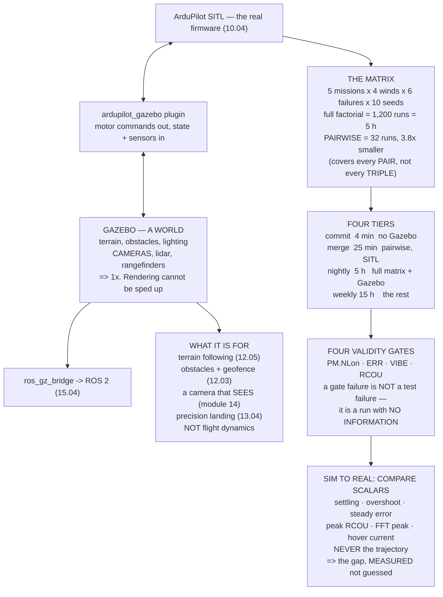

# 10.05 Gazebo, sim-to-real, and a regression matrix that runs overnight

<!-- glance:start -->
<!-- generated by tools/build.py from curriculum/syllabus.yaml — edit the syllabus, not this block -->

| | |
|---|---|
| **Track** | Main path |
| **Difficulty** | Advanced |
| **Time** | 2 h |
| **Hardware** | none |
| **Software** | gazebo, ros2, ardupilot, docker |
| **Prerequisites** | [10.04 ArduPilot SITL: the real firmware in a process](10.04-ardupilot-sitl.md)<br>[10.03 Sensor noise, wind and gusts in simulation](10.03-sensor-noise-and-wind.md) |
| **Version-sensitive** | yes — see [curriculum/versions.yaml](../curriculum/versions.yaml) |
| **Skip if** | You have a headless SITL/Gazebo job that runs a mission matrix unattended and fails loudly on a regression. |

<!-- glance:end -->

## What you will learn

- What Gazebo adds — **a world, and sensors that can see it** — and that it costs your entire
  speedup
- That Gazebo is for **perception and environment**, not flight dynamics
- Why the simulator belongs in a container **pinned by digest**, not by tag
- The test matrix, and why **pairwise beats full factorial by 3.8×**
- The four-tier schedule, and why the four-minute tier decides whether any of it survives
- The four **validity gates** — and that a run failing one is not a failing test
- How to compare simulation with flight: **scalars, not trajectories**

> **Version-sensitive.** Gazebo's package names, the `ardupilot_gazebo` plugin's build, the ROS 2
> bridge and the container tooling all move faster than anything else in this course. The commands
> here track **Gazebo Harmonic and ROS 2 Jazzy**, checked September 2026. The *architecture* and
> the *matrix arithmetic* are stable; the package names are not.

## Why it matters

This lesson closes module 10 with two things: a world, and a discipline.

The world is Gazebo, and the useful thing to know about it is what it is **for**. It does not
improve your flight dynamics — SITL's built-in physics is adequate and Gazebo's is not
dramatically better. What it adds is an **environment** and **sensors that perceive it**: terrain
for 12.05 to follow, obstacles for 12.03's geofence to matter near, a camera for all of module 14,
a landing target for 13.04. None of that is about how the aircraft flies.

And it costs everything. SITL alone runs at ten times real time; attach Gazebo and rendering
becomes the bottleneck, so 10.04's 108-point sweep goes from **2.7 minutes to 27**. You do not pay
that for a control-gain sweep, which needs no world at all.

The discipline is the matrix. Five missions × four winds × six failures × ten seeds is **1,200
runs** — five hours with Gazebo, thirty minutes without. A **pairwise** covering array gets every
*pair* of settings in **32 runs instead of 120**, which is the difference between a nightly job
and a weekly one.

And the module's closing question: how do you actually compare a simulation with an aircraft? Not
by trajectory — two noisy systems diverge and the divergence rate means nothing. By **scalars**: a
settling time, an overshoot, a steady-state error, a peak frequency. Each one is a number the
simulator predicted, and each disagreement points at exactly one thing.

## Prerequisites

<!-- prereqs:start -->
## Prerequisites

You need these first:

- [10.04 ArduPilot SITL: the real firmware in a process](10.04-ardupilot-sitl.md)
- [10.03 Sensor noise, wind and gusts in simulation](10.03-sensor-noise-and-wind.md)

### Optional prerequisite links

None.

Check your readiness: `python course.py why 10.05`
<!-- prereqs:end -->

## Concept

Three processes and a bridge.

**ArduPilot SITL** is unchanged from 10.04 — the real firmware, the real scheduler, the real EKF.
**Gazebo** simulates a world with rigid bodies, terrain, lighting and sensors. The
**`ardupilot_gazebo` plugin** connects them: SITL sends motor commands, Gazebo returns the state
and the synthesised sensor readings. And **`ros_gz_bridge`** exposes Gazebo's topics to ROS 2, so
that 15.04's autonomy code can see the same camera the aircraft would.

That is the architecture, and its cost is that every one of those four things can be the bug. A
mission that fails in this stack might be failing in your ROS node, in the bridge, in the Gazebo
world file, in the plugin, or in ArduPilot — and the first diagnostic step is always to reproduce
it in SITL alone, which removes three of the five.

Around it sits the second half of the lesson, which is not about simulation at all. It is about
**running experiments**: how many, in what combinations, on what schedule, and how you tell a
failing test from an invalid run.

## Technical explanation

### Level 1 — what Gazebo adds, and what it costs

| layer | speedup | adds | costs |
|---|---|---|---|
| SITL alone | **10×** | the real firmware (10.04) | no world at all |
| SITL + Gazebo, headless | **1×** | a world, and sensors that see it | the speedup is gone |
| SITL + Gazebo + GUI | 0.6× | you can watch | slower than real time |
| + ROS 2 nodes | 0.5× | your autonomy code (15.04) | three processes and a bridge |

10.04's 108-point sweep took 2.7 minutes in SITL alone. With Gazebo attached it takes **27**,
because rendering cannot be sped up.

So what Gazebo is actually for:

| | |
|---|---|
| terrain following | 12.05 needs a terrain, not a plane |
| geofences near obstacles | 12.03, with something to hit |
| a camera that sees something | all of module 14, otherwise untestable |
| precision landing on a target | 13.04's marker |
| your ROS 2 autonomy code | 15.04, with a real world |

**None of those are about flight dynamics.** Keep using SITL alone for everything that is not
perception or environment.

### Level 2 — headless, and in a container

Headless is the easy half: `gz sim -s`, ArduPilot with `--no-mavproxy`. On the full 1,200-run
matrix that is **8.3 hours with a GUI against 5.0 without** — 3.3 hours saved by not drawing
pictures nobody is awake to look at.

Containerised is the half that matters more than it looks. **A simulation's result depends on its
library versions in a way a program's output usually does not.** A different physics-engine build,
a different BLAS, a different compiler's floating-point contraction — any of them can move your
last decimal place, and 10.03 showed that the last decimal place is where the seeds live.

**Pin the image by digest, not by tag.** `latest` is not a version, and a nightly job that
silently changed its simulator is a nightly job producing fiction.

### Level 3 — the matrix

Five missions, four winds, six failures, ten seeds:

| | runs | SITL 10× | Gazebo 1× |
|---|---|---|---|
| one configuration, one seed | 1 | — | — |
| full factorial, one seed | 120 | 0.05 h | 0.50 h |
| **full factorial, all seeds** | **1,200** | **0.50 h** | **5.00 h** |
| **pairwise, one seed** | **32** | 0.01 h | 0.13 h |
| pairwise, all seeds | 320 | 0.13 h | 1.33 h |

A **pairwise covering array** guarantees that every *pair* of settings appears together at least
once — every mission with every wind, every wind with every failure, every mission with every
failure — in **32 runs instead of 120**, a factor of 3.8.

What it does not cover is a three-way interaction: a survey grid, in 12 m/s of gusts, with a motor
failure. **If you believe such a case exists, test it explicitly** rather than buying the whole
factorial to find it.

### Level 4 — what runs when, and the validity gates

| when | budget | what |
|---|---|---|
| **every commit** | **4 min** | 10.02's unit checks + three SITL smoke missions. **No Gazebo** |
| every merge | 25 min | the pairwise matrix in SITL, one seed |
| nightly | 5 h | the full matrix in SITL, all seeds, plus the Gazebo vision missions |
| weekly | 15 h | long-duration, and every failure × every mission |

**The first row decides whether any of this survives.** A four-minute check gets run; a
forty-minute one gets skipped, then disabled, then deleted.

And every tier needs the same four **validity gates** from 10.04:

- `PM.NLon == 0` — is this result even real?
- no `ERR` entries — did a failsafe fire unasked?
- `VIBE` within limits — 05.06's clipping
- `RCOU` not saturated — 07.06's silent disobedience

**A run that fails a validity gate is not a failing test.** It is a run that produced no
information, and the harness must report it differently — otherwise you will spend a morning
debugging the aircraft when the answer was your laptop.

### Level 5 — sim to real

You have a simulator and you have an aircraft. What do you compare?

| quantity | compare? | why |
|---|---|---|
| settling time after a step | **yes** | a scalar, robust to initial state |
| overshoot per cent | **yes** | 10.02 measured 8.7 % |
| steady-state error in LOITER | **yes** | 10.03's metric, and 16.03's |
| peak `RCOU` during a manoeuvre | **yes** | 07.06's saturation, both sides |
| the gyro FFT's peak frequency | **yes** | the one place sim is plainly wrong |
| current at hover | **yes** | 03.02 against the model's guess |
| **the trajectory, point by point** | **no** | it will never match, and teaches nothing |
| absolute position error | no | depends on GNSS geometry on the day |
| anything averaged over one run | no | 10.03: one seed is not a result |

The trajectory comparison is the tempting one. It looks like the most thorough thing you could
do, and it teaches nothing: two chaotic systems with different noise diverge, and the divergence
rate is not a property of your model.

Compare scalars that mean something. And keep the table:

| metric | sim | flight | verdict |
|---|---|---|---|
| rate step overshoot | 8.7 % | ? | 10.02 predicted it |
| LOITER error, calm | 0.94 m | ? | 10.03 predicted it |
| LOITER error, 6 m/s | 0.83 m | ? | 10.03 predicted it |
| hover current | 10.2 A | ? | 02.11 predicted it |
| **gyro FFT peak** | **none** | ? | **sim has no tone (07.07)** |
| **`VIBE` peak** | **~0** | ? | **sim has no vibration** |
| RTL time from 1 km | 180 s | ? | 09.03 predicted it |

Fill in the third column after every test flight. Rows that agree tell you the model is sound
*there*. Rows that disagree are the sim-to-real gap **measured rather than guessed** — and 10.01's
gap list said the last two would disagree before you ever flew.

**A model that is wrong in the way you expected is a model you understand.** A model that is wrong
somewhere you did not expect is a finding, and it belongs in the gap list before the next flight
rather than after it.

## Diagram



## Code

Price what each simulation layer costs in speedup, size the headless saving on the real matrix,
generate a pairwise covering array and compare it with full factorial, lay out the four-tier
schedule with its validity gates, and build the sim-to-real comparison table.

```python
"""10.05 - Gazebo, the regression matrix, and how to compare sim with flight."""
import itertools
import random

CORES = 8
RUN_S = 120.0             # one scripted mission, in simulated seconds
SITL_SPEEDUP = 10.0
GZ_SPEEDUP = 1.0          # Gazebo renders; it does not go fast

# what each layer adds, and what it costs
LAYERS = [
    ("SITL alone", 10.0, "the real firmware (10.04)",
     "no world: no terrain, no obstacles, no camera"),
    ("SITL + Gazebo, headless", 1.0, "+ a WORLD, and sensors that SEE it",
     "rendering is the bottleneck; speedup is gone"),
    ("SITL + Gazebo + GUI", 0.6, "+ you can watch it",
     "and it is slower than real time on a laptop"),
    ("+ ROS 2 nodes", 0.5, "+ YOUR autonomy code, in the loop (15.04)",
     "three processes and a bridge, all of which can be the bug"),
]

# the test matrix, as four independent dimensions
MISSIONS = ["hover 60 s", "square 40 m", "survey grid 200 m",
            "waypoint climb to 120 m", "precision land"]
WINDS = ["calm", "6 m/s steady", "6 m/s + gusts", "12 m/s + gusts"]
FAILURES = ["none", "GPS glitch", "GPS loss", "RC failsafe",
            "motor fail", "battery critical"]
SEEDS = 10

# what runs when
PYRAMID = [
    ("every commit", 4.0, "the 10.02 unit checks + 3 SITL smoke missions",
     "must finish before you lose interest. NO Gazebo"),
    ("every merge", 25.0, "the pairwise matrix in SITL, 1 seed",
     "catches an interaction between two settings"),
    ("nightly", 300.0, "the FULL matrix in SITL, all seeds",
     "and the Gazebo vision missions, headless"),
    ("weekly", 900.0, "+ long-duration, + every failure x every mission",
     "the runs nobody would wait for"),
]

# the sim-to-real comparison: what to compare, and what NOT to
COMPARE = [
    ("settling time after a step", True, "a scalar, robust to initial state"),
    ("overshoot per cent", True, "10.02 measured 8.7 %; the aircraft will differ"),
    ("steady-state error in LOITER", True, "10.03's metric, and 16.03's"),
    ("peak RCOU during a manoeuvre", True, "07.06's saturation, both sides"),
    ("the gyro FFT's peak frequency", True,
     "the ONE place sim will be plainly wrong (07.07)"),
    ("current at hover", True, "03.02 vs the model's guess"),
    ("the trajectory, point by point", False,
     "it will NEVER match and comparing it teaches nothing"),
    ("absolute position error", False,
     "depends on GNSS geometry on the day (05.04)"),
    ("anything averaged over one run", False, "10.03: one seed is not a result"),
]


def pairwise(dims, tries=40, seed=0):
    """A greedy covering array: every PAIR of levels appears at least once."""
    rng = random.Random(seed)
    names = list(dims)
    pairs = set()
    for a, b in itertools.combinations(range(len(names)), 2):
        for x in dims[names[a]]:
            for y in dims[names[b]]:
                pairs.add((a, x, b, y))
    rows = []
    while pairs:
        best, best_cov = None, -1
        for _ in range(tries):
            cand = [rng.choice(dims[n]) for n in names]
            cov = sum(1 for (a, x, b, y) in pairs
                      if cand[a] == x and cand[b] == y)
            if cov > best_cov:
                best, best_cov = cand, cov
        if best_cov <= 0:
            break
        rows.append(best)
        pairs = {(a, x, b, y) for (a, x, b, y) in pairs
                 if not (best[a] == x and best[b] == y)}
    return rows


def hours(n_runs, seconds_each, speedup, cores):
    return n_runs * seconds_each / speedup / cores / 3600.0


def bar(t):
    print("\n" + "=" * 70)
    print(t)
    print("=" * 70)


if __name__ == "__main__":
    bar("1. WHAT GAZEBO ADDS, AND WHAT IT COSTS")
    print("  SITL's built-in physics has no WORLD. Gazebo is a world,")
    print("  and -- far more importantly -- sensors that can SEE it.")
    print(f"  {'layer':26s} {'speedup':>8s}  adds / costs")
    for n, sp, adds, cost in LAYERS:
        print(f"  {n:26s} {sp:7.1f}x  + {adds}")
        print(f"  {'':26s} {'':8s}  - {cost}")
    print("  THE SPEEDUP COLUMN IS THE WHOLE TRADE. 10.04's 108-point")
    print(f"  sweep took {hours(108, RUN_S, 10, CORES) * 60:.1f} minutes in"
          f" SITL alone. The same sweep")
    print(f"  with Gazebo attached takes"
          f" {hours(108, RUN_S, 1, CORES) * 60:.0f} minutes, because")
    print("  RENDERING CANNOT BE SPED UP. You do not pay that for a")
    print("  control-gain sweep, which needs no world at all.")
    print("\n  SO WHAT IS GAZEBO ACTUALLY FOR:")
    for a, b in (("terrain following", "12.05 needs a terrain, not a plane"),
                 ("geofences near obstacles", "12.03, with something to hit"),
                 ("a camera that sees something",
                  "all of module 14, which is otherwise untestable"),
                 ("precision landing on a target", "13.04's ArUco marker"),
                 ("your ROS 2 autonomy code", "15.04, with a real world")):
        print(f"    {a:28s} {b}")
    print("  NONE OF THOSE ARE ABOUT FLIGHT DYNAMICS. Gazebo is for the")
    print("  PERCEPTION and the ENVIRONMENT, and you keep using SITL")
    print("  alone for everything that is not.")

    bar("2. HEADLESS AND IN A CONTAINER, AND WHY")
    print("  Two habits, and the second one matters more than it looks.")
    n_full = len(MISSIONS) * len(WINDS) * len(FAILURES) * SEEDS
    print("  HEADLESS: no GUI. gz sim -s, and ArduPilot with")
    print(f"  --no-mavproxy. On section 3's full {n_full}-run matrix:")
    print(f"    with a GUI:   {hours(n_full, RUN_S, 0.6, CORES):5.1f} h")
    print(f"    headless:     {hours(n_full, RUN_S, 1.0, CORES):5.1f} h")
    print(f"    = {hours(n_full, RUN_S, 0.6, CORES) - hours(n_full, RUN_S, 1.0, CORES):.1f} h saved by not drawing pictures")
    print("    nobody is awake to look at.")
    print("  CONTAINERISED: because a simulation's RESULT depends on its")
    print("  library versions in a way a program's output usually does")
    print("  not. A different physics engine build, a different BLAS, a")
    print("  different compiler's floating-point contraction -- any of")
    print("  them can move your last decimal place, and 10.03 showed")
    print("  that the last decimal place is where the seeds live.")
    print("  PIN THE IMAGE BY DIGEST, not by tag. 'latest' is not a")
    print("  version, and a nightly job that silently changed its")
    print("  simulator is a nightly job producing fiction.")

    bar("3. THE MATRIX, AND WHY FULL FACTORIAL IS THE WRONG SHAPE")
    dims = {"mission": MISSIONS, "wind": WINDS, "failure": FAILURES}
    full = len(MISSIONS) * len(WINDS) * len(FAILURES)
    print(f"  Four dimensions: {len(MISSIONS)} missions x {len(WINDS)} winds"
          f" x {len(FAILURES)} failures x {SEEDS} seeds")
    print(f"  {'':34s} {'runs':>7s} {'SITL 10x':>10s} {'Gazebo 1x':>11s}")
    for name, n in (("one configuration, one seed", 1),
                    ("full factorial, one seed", full),
                    ("full factorial, all seeds", full * SEEDS)):
        print(f"  {name:34s} {n:7d} {hours(n, RUN_S, 10, CORES):8.2f} h"
              f" {hours(n, RUN_S, 1, CORES):9.2f} h")
    rows = pairwise(dims)
    print(f"  {'PAIRWISE, one seed':34s} {len(rows):7d}"
          f" {hours(len(rows), RUN_S, 10, CORES):8.2f} h"
          f" {hours(len(rows), RUN_S, 1, CORES):9.2f} h")
    print(f"  {'PAIRWISE, all seeds':34s} {len(rows) * SEEDS:7d}"
          f" {hours(len(rows) * SEEDS, RUN_S, 10, CORES):8.2f} h"
          f" {hours(len(rows) * SEEDS, RUN_S, 1, CORES):9.2f} h")
    print(f"  PAIRWISE IS {full / len(rows):.1f}x SMALLER and covers every")
    print("  PAIR of settings -- every mission with every wind, every")
    print("  wind with every failure, every mission with every failure.")
    print("  WHAT IT DOES NOT COVER is a three-way interaction: a")
    print("  survey grid, in 12 m/s of gusts, with a motor failure. If")
    print("  you believe such a thing exists, TEST IT EXPLICITLY rather")
    print("  than buying the whole factorial to find it.")
    print("\n  The first eight rows of the covering array:")
    print(f"  {'#':>3s} {'mission':26s} {'wind':16s} {'failure'}")
    for i, r in enumerate(rows[:8]):
        print(f"  {i:3d} {r[0]:26s} {r[1]:16s} {r[2]}")
    print(f"  ... and {len(rows) - 8} more")

    bar("4. WHAT RUNS WHEN")
    print("  One matrix, four schedules. The rule is that each tier must")
    print("  finish before the person who triggered it stops caring.")
    print(f"  {'when':16s} {'budget':>9s}  what")
    for when, mins, what, why in PYRAMID:
        print(f"  {when:16s} {mins:7.0f} m  {what}")
        print(f"  {'':16s} {'':9s}  {why}")
    print("  THE FIRST ROW IS THE ONE THAT DECIDES WHETHER ANY OF THIS")
    print("  SURVIVES. A four-minute check gets run; a forty-minute one")
    print("  gets skipped, then disabled, then deleted. Put the cheap")
    print("  logic checks there -- 10.02's eight assertions and three")
    print("  SITL smoke missions -- and push everything with a world in")
    print("  it to the nightly tier.")
    print("\n  AND EVERY TIER NEEDS THE SAME FOUR VALIDITY GATES (10.04):")
    for g in ("PM.NLon == 0        -- is this result even real?",
              "no ERR entries      -- did a failsafe fire unasked?",
              "VIBE within limits  -- 05.06's clipping",
              "RCOU not saturated  -- 07.06's silent disobedience"):
        print(f"    {g}")
    print("  A RUN THAT FAILS A VALIDITY GATE IS NOT A FAILING TEST. It")
    print("  is a run that produced no information, and the harness must")
    print("  say so differently -- otherwise you will spend a morning")
    print("  debugging the aircraft when the answer was your laptop.")

    bar("5. SIM TO REAL: HOW TO ACTUALLY COMPARE")
    print("  The closing question of the module. You have a simulator")
    print("  and you have an aircraft. What do you compare?")
    print(f"  {'quantity':38s} {'compare?':>9s}")
    for n, ok, why in COMPARE:
        print(f"  {n:38s} {('YES' if ok else 'NO'):>9s}  {why}")
    print("  THE THREE 'NO' ROWS ARE THE TEMPTING ONES. A trajectory")
    print("  comparison looks like the most thorough thing you could do")
    print("  and teaches nothing: two chaotic systems with different")
    print("  noise diverge, and the divergence rate is not a property of")
    print("  your model.")
    print("  COMPARE SCALARS THAT MEAN SOMETHING: a settling time, an")
    print("  overshoot, a steady-state error, a peak output, a peak")
    print("  frequency. Each one is a number your simulator PREDICTED,")
    print("  and each disagreement points at ONE thing.")
    print("\n  AND THE TABLE TO KEEP, which is the module's real output:")
    print(f"  {'metric':30s} {'sim':>8s} {'flight':>8s} {'verdict'}")
    ex = [("rate step overshoot", "8.7 %", "?", "10.02 predicted it"),
          ("LOITER error, calm", "0.94 m", "?", "10.03 predicted it"),
          ("LOITER error, 6 m/s", "0.83 m", "?", "10.03 predicted it"),
          ("hover current", "10.2 A", "?", "02.11 predicted it"),
          ("gyro FFT peak", "none", "?", "SIM HAS NO TONE (07.07)"),
          ("VIBE peak", "~0", "?", "SIM HAS NO VIBRATION"),
          ("RTL time from 1 km", "180 s", "?", "09.03 predicted it")]
    for a, b, c, d in ex:
        print(f"  {a:30s} {b:>8s} {c:>8s}  {d}")
    print("  FILL IN THE THIRD COLUMN AFTER EVERY TEST FLIGHT. Rows that")
    print("  agree tell you the model is sound THERE. Rows that disagree")
    print("  are the sim-to-real gap, MEASURED rather than guessed -- and")
    print("  10.01's gap list said the last two would disagree before")
    print("  you ever flew.")
    print("\n  AND THE POINT OF PREDICTING THEM IN ADVANCE: a model that")
    print("  is wrong in the way you EXPECTED is a model you understand.")
    print("  A model that is wrong somewhere you did not expect is a")
    print("  finding, and it belongs in the gap list before the next")
    print("  flight rather than after it.")
```

Output:

```text

======================================================================
1. WHAT GAZEBO ADDS, AND WHAT IT COSTS
======================================================================
  SITL's built-in physics has no WORLD. Gazebo is a world,
  and -- far more importantly -- sensors that can SEE it.
  layer                       speedup  adds / costs
  SITL alone                    10.0x  + the real firmware (10.04)
                                       - no world: no terrain, no obstacles, no camera
  SITL + Gazebo, headless        1.0x  + + a WORLD, and sensors that SEE it
                                       - rendering is the bottleneck; speedup is gone
  SITL + Gazebo + GUI            0.6x  + + you can watch it
                                       - and it is slower than real time on a laptop
  + ROS 2 nodes                  0.5x  + + YOUR autonomy code, in the loop (15.04)
                                       - three processes and a bridge, all of which can be the bug
  THE SPEEDUP COLUMN IS THE WHOLE TRADE. 10.04's 108-point
  sweep took 2.7 minutes in SITL alone. The same sweep
  with Gazebo attached takes 27 minutes, because
  RENDERING CANNOT BE SPED UP. You do not pay that for a
  control-gain sweep, which needs no world at all.

  SO WHAT IS GAZEBO ACTUALLY FOR:
    terrain following            12.05 needs a terrain, not a plane
    geofences near obstacles     12.03, with something to hit
    a camera that sees something all of module 14, which is otherwise untestable
    precision landing on a target 13.04's ArUco marker
    your ROS 2 autonomy code     15.04, with a real world
  NONE OF THOSE ARE ABOUT FLIGHT DYNAMICS. Gazebo is for the
  PERCEPTION and the ENVIRONMENT, and you keep using SITL
  alone for everything that is not.

======================================================================
2. HEADLESS AND IN A CONTAINER, AND WHY
======================================================================
  Two habits, and the second one matters more than it looks.
  HEADLESS: no GUI. gz sim -s, and ArduPilot with
  --no-mavproxy. On section 3's full 1200-run matrix:
    with a GUI:     8.3 h
    headless:       5.0 h
    = 3.3 h saved by not drawing pictures
    nobody is awake to look at.
  CONTAINERISED: because a simulation's RESULT depends on its
  library versions in a way a program's output usually does
  not. A different physics engine build, a different BLAS, a
  different compiler's floating-point contraction -- any of
  them can move your last decimal place, and 10.03 showed
  that the last decimal place is where the seeds live.
  PIN THE IMAGE BY DIGEST, not by tag. 'latest' is not a
  version, and a nightly job that silently changed its
  simulator is a nightly job producing fiction.

======================================================================
3. THE MATRIX, AND WHY FULL FACTORIAL IS THE WRONG SHAPE
======================================================================
  Four dimensions: 5 missions x 4 winds x 6 failures x 10 seeds
                                        runs   SITL 10x   Gazebo 1x
  one configuration, one seed              1     0.00 h      0.00 h
  full factorial, one seed               120     0.05 h      0.50 h
  full factorial, all seeds             1200     0.50 h      5.00 h
  PAIRWISE, one seed                      32     0.01 h      0.13 h
  PAIRWISE, all seeds                    320     0.13 h      1.33 h
  PAIRWISE IS 3.8x SMALLER and covers every
  PAIR of settings -- every mission with every wind, every
  wind with every failure, every mission with every failure.
  WHAT IT DOES NOT COVER is a three-way interaction: a
  survey grid, in 12 m/s of gusts, with a motor failure. If
  you believe such a thing exists, TEST IT EXPLICITLY rather
  than buying the whole factorial to find it.

  The first eight rows of the covering array:
    # mission                    wind             failure
    0 waypoint climb to 120 m    12 m/s + gusts   none
    1 square 40 m                6 m/s + gusts    GPS glitch
    2 hover 60 s                 6 m/s steady     RC failsafe
    3 waypoint climb to 120 m    calm             battery critical
    4 precision land             6 m/s + gusts    GPS loss
    5 hover 60 s                 calm             GPS loss
    6 survey grid 200 m          6 m/s steady     motor fail
    7 square 40 m                calm             RC failsafe
  ... and 24 more

======================================================================
4. WHAT RUNS WHEN
======================================================================
  One matrix, four schedules. The rule is that each tier must
  finish before the person who triggered it stops caring.
  when                budget  what
  every commit           4 m  the 10.02 unit checks + 3 SITL smoke missions
                              must finish before you lose interest. NO Gazebo
  every merge           25 m  the pairwise matrix in SITL, 1 seed
                              catches an interaction between two settings
  nightly              300 m  the FULL matrix in SITL, all seeds
                              and the Gazebo vision missions, headless
  weekly               900 m  + long-duration, + every failure x every mission
                              the runs nobody would wait for
  THE FIRST ROW IS THE ONE THAT DECIDES WHETHER ANY OF THIS
  SURVIVES. A four-minute check gets run; a forty-minute one
  gets skipped, then disabled, then deleted. Put the cheap
  logic checks there -- 10.02's eight assertions and three
  SITL smoke missions -- and push everything with a world in
  it to the nightly tier.

  AND EVERY TIER NEEDS THE SAME FOUR VALIDITY GATES (10.04):
    PM.NLon == 0        -- is this result even real?
    no ERR entries      -- did a failsafe fire unasked?
    VIBE within limits  -- 05.06's clipping
    RCOU not saturated  -- 07.06's silent disobedience
  A RUN THAT FAILS A VALIDITY GATE IS NOT A FAILING TEST. It
  is a run that produced no information, and the harness must
  say so differently -- otherwise you will spend a morning
  debugging the aircraft when the answer was your laptop.

======================================================================
5. SIM TO REAL: HOW TO ACTUALLY COMPARE
======================================================================
  The closing question of the module. You have a simulator
  and you have an aircraft. What do you compare?
  quantity                                compare?
  settling time after a step                   YES  a scalar, robust to initial state
  overshoot per cent                           YES  10.02 measured 8.7 %; the aircraft will differ
  steady-state error in LOITER                 YES  10.03's metric, and 16.03's
  peak RCOU during a manoeuvre                 YES  07.06's saturation, both sides
  the gyro FFT's peak frequency                YES  the ONE place sim will be plainly wrong (07.07)
  current at hover                             YES  03.02 vs the model's guess
  the trajectory, point by point                NO  it will NEVER match and comparing it teaches nothing
  absolute position error                       NO  depends on GNSS geometry on the day (05.04)
  anything averaged over one run                NO  10.03: one seed is not a result
  THE THREE 'NO' ROWS ARE THE TEMPTING ONES. A trajectory
  comparison looks like the most thorough thing you could do
  and teaches nothing: two chaotic systems with different
  noise diverge, and the divergence rate is not a property of
  your model.
  COMPARE SCALARS THAT MEAN SOMETHING: a settling time, an
  overshoot, a steady-state error, a peak output, a peak
  frequency. Each one is a number your simulator PREDICTED,
  and each disagreement points at ONE thing.

  AND THE TABLE TO KEEP, which is the module's real output:
  metric                              sim   flight verdict
  rate step overshoot               8.7 %        ?  10.02 predicted it
  LOITER error, calm               0.94 m        ?  10.03 predicted it
  LOITER error, 6 m/s              0.83 m        ?  10.03 predicted it
  hover current                    10.2 A        ?  02.11 predicted it
  gyro FFT peak                      none        ?  SIM HAS NO TONE (07.07)
  VIBE peak                            ~0        ?  SIM HAS NO VIBRATION
  RTL time from 1 km                180 s        ?  09.03 predicted it
  FILL IN THE THIRD COLUMN AFTER EVERY TEST FLIGHT. Rows that
  agree tell you the model is sound THERE. Rows that disagree
  are the sim-to-real gap, MEASURED rather than guessed -- and
  10.01's gap list said the last two would disagree before
  you ever flew.

  AND THE POINT OF PREDICTING THEM IN ADVANCE: a model that
  is wrong in the way you EXPECTED is a model you understand.
  A model that is wrong somewhere you did not expect is a
  finding, and it belongs in the gap list before the next
  flight rather than after it.
```

## Exercise

### Exercise 10.05-E1 — Stand up the stack and fly it `[analysis]`

Build `ardupilot_gazebo`, launch a Gazebo world with an Iris-class quadcopter, and connect SITL to
it. Fly a square. Then add a downward camera to the model and confirm you can see its images —
through `gz topic` first, and through `ros_gz_bridge` second. Record the real-time factor Gazebo
reports, with and without the GUI, and compare against Level 1's table.

### Exercise 10.05-E2 — Build your own covering array `[analysis]`

Define the dimensions that matter for *your* aircraft and missions. Generate the pairwise array
and count the rows. Then verify it: for every pair of dimensions, check that every combination of
their levels appears at least once. Report the ratio against full factorial, and name one
three-way interaction you would add as an explicit extra row.

### Exercise 10.05-E3 — Make the harness distinguish failures from invalid runs `[analysis]`

Extend 10.04's harness so each run exits with three possible states: **pass**, **fail** (an
assertion was violated) and **invalid** (a validity gate was violated). Make the summary report
all three separately, and make `invalid` runs re-queue once at `--speedup 1` before being
reported. Run the pairwise matrix and report the counts.

### Exercise 10.05-E4 — Fill in the sim-to-real table `[hardware]`

Fly the aircraft through the same profile your simulator runs: a rate step, a LOITER hold in calm
air, a LOITER hold in wind, a hover at a measured current, and an RTL from a measured distance.
Fill in the flight column of Level 5's table from the logs. Mark every row agree or disagree, and
for each disagreement say which of 10.01's seven physical categories it belongs to.

## Expected result

**10.05-E1**: Gazebo should report a real-time factor near 1.0 headless and noticeably below it
with the GUI on a laptop, which matches Level 1. If you see a factor well above 1, you have not
attached the sensors yet — physics alone is fast, and it is rendering and sensor generation that
cost.

**10.05-E2**: most real dimension sets shrink by a factor of three to six. The three-way
interaction worth adding explicitly is almost always *the longest mission, in the worst wind, with
the failure that triggers an RTL* — because that combination is where 09.03's energy reserve
and 12.04's failsafe tree meet, and neither alone would catch it.

**10.05-E3**: on a healthy setup, invalid runs should be rare and clustered — several at once,
usually when the machine was busy. Scattered invalid runs across the matrix mean your speedup is
too high for your hardware, which is 10.04's Level 2.

**10.05-E4**: expect the control metrics to agree within tens of per cent and the two physical
rows — the FFT peak and the `VIBE` peak — to disagree completely, because the simulator has no
vibration at all. **That is a successful result**: you predicted those two disagreements in 10.01,
before writing any of the simulator.

## Troubleshooting

**Gazebo and SITL will not connect.** The plugin's port and SITL's `--model` argument must agree,
and both must match the world file. Start from the plugin's own example world before writing your
own; a hand-written world file is the commonest cause and the hardest to see.

**Everything is very slow.** Turn off the GUI, turn off shadows, reduce the camera resolution and
frame rate, and check whether you are rendering a sensor you are not using. Sensors cost more than
physics.

**Results differ between your machine and CI.** Level 2. Pin the container by digest, and check
whether you are actually running the image you think you are.

**A run failed and you cannot tell why.** Check the validity gates first — `PM.NLon`, `ERR`,
`VIBE`, `RCOU`. A run that failed a gate has no information in it, and debugging the aircraft from
an invalid run is how mornings disappear.

**The nightly matrix takes longer than the night.** Move the Gazebo runs to weekly and keep the
SITL matrix nightly. Level 3's arithmetic says the Gazebo tier is ten times the cost for the small
fraction of tests that actually need a world.

**The sim and the aircraft disagree about a control metric by a factor of two.** Check the mass
and the inertia tensor first — 04.02's numbers are the ones most likely to have drifted since you
last weighed the aircraft, and everything in 10.02 is built on them.

**They agree suspiciously well.** Check that you are not comparing the simulator with itself:
a metric extracted by the same script from a SITL log and a real log is fine, but a *prediction*
that was tuned to match one flight is 10.01's second trap.

## Common mistakes

- **Using Gazebo for flight dynamics.** It costs your entire speedup and adds nothing to the
  dynamics. Use it for perception and environment.
- **Running the GUI in a batch job.** 3.3 hours of the 1,200-run matrix, spent on pictures nobody
  sees.
- **Pinning a container by tag.** `latest` is not a version, and a simulator that changed silently
  invalidates every result since.
- **Running the full factorial.** Pairwise is 3.8× smaller and covers every pair; add the
  three-way cases you actually believe in.
- **Putting a forty-minute check on every commit.** It will be skipped, then disabled, then
  deleted.
- **Treating a validity-gate failure as a test failure.** One is a bug; the other is a wasted run,
  and confusing them wastes a morning.
- **Comparing trajectories.** Compare scalars. Two noisy systems diverge and the divergence rate
  is not a property of your model.

## Knowledge check

<details>
<summary>What does Gazebo add over SITL's built-in physics, and what does it cost?</summary>

It adds a **world** — terrain, obstacles, lighting — and, more importantly, **sensors that can
perceive it**: cameras, lidar, rangefinders. It costs your entire speedup: SITL alone runs at 10×
and Gazebo runs at 1×, because rendering cannot be accelerated. 10.04's 108-point sweep goes from
2.7 minutes to 27.
</details>

<details>
<summary>Name three things Gazebo is for and one it is not.</summary>

For: terrain following (12.05), geofences near real obstacles (12.03), a camera that sees
something (module 14), precision landing on a marker (13.04), and ROS 2 autonomy in a real world
(15.04). **Not** for: flight dynamics. Its physics is not meaningfully better than SITL's and it
is ten times slower, so a control-gain sweep should never touch it.
</details>

<details>
<summary>Why pin a simulation container by digest rather than by tag?</summary>

Because **a simulation's result depends on its library versions in a way a program's output
usually does not** — a different physics build, BLAS or floating-point contraction can move the
last decimal place, and 10.03 showed that is where the seeds live. A tag like `latest` can change
under you, and a nightly job whose simulator silently changed is producing fiction while looking
identical.
</details>

<details>
<summary>Full factorial is 120 runs and pairwise is 32. What does pairwise guarantee, and what
does it miss?</summary>

It guarantees that **every pair of settings appears together at least once** — every mission with
every wind, every wind with every failure, every mission with every failure. It misses **three-way
interactions**: a survey grid, in 12 m/s of gusts, with a motor failure. The correct response is
to add the three-way cases you actually believe in as explicit extra rows, not to buy the whole
factorial.
</details>

<details>
<summary>Why is the four-minute tier the one that decides whether the whole scheme survives?</summary>

Because a check that finishes before the person who triggered it loses interest gets **run**, and
one that does not gets skipped, then disabled, then deleted. So the per-commit tier holds only the
cheap logic checks — 10.02's assertions and three SITL smoke missions, no Gazebo — and everything
with a world in it moves to nightly.
</details>

<details>
<summary>A run fails `PM.NLon`. Is that a failing test?</summary>

**No.** It is an **invalid run** — one that produced no information, because the scheduler was
deferring tasks and nothing else in the log means what it appears to. The harness must report it
differently from an assertion failure, and ideally re-queue it at `--speedup 1`. Confusing the two
is how you spend a morning debugging an aircraft when the answer was your laptop.
</details>

<details>
<summary>Why compare scalars rather than trajectories between simulation and flight?</summary>

Because two chaotic systems with different noise realisations diverge, and **the divergence rate
is not a property of your model** — so a trajectory comparison looks thorough and teaches nothing.
Scalars — settling time, overshoot, steady-state error, peak `RCOU`, FFT peak frequency, hover
current — are each a number the simulator predicted, and each disagreement points at exactly one
thing.
</details>

## Practical challenge

**Ship the pipeline, and then fill in the third column.**

Part one is the pipeline. Take 10.04's harness, add the pairwise generator, add the three-state
result (pass, fail, invalid), containerise the whole thing pinned by digest, and wire it to your
CI with the four tiers. Run it. The success criterion is not that everything passes — it is that
you can point at any red result and say within a minute whether it is a bug in the aircraft, a bug
in the test, or a run that never produced information.

Part two is the table, and it is the real deliverable of module 10. Seven rows, sim column filled
from the simulator, flight column filled from the aircraft, and a verdict on each. Keep it in the
repository next to the parameter files from 08.04 and the failsafe card from 09.03.

Then do the thing that makes it worth having: **update 10.01's gap list from it.** Every row that
agreed moves an item from the right column to the left. Every row that disagreed unexpectedly is a
new entry. After a few flights that list stops being a guess about what simulation cannot model
and becomes a measurement of what *your* simulation does not model — which is the only version of
it that is worth anything.

## You can skip this if

You have a headless SITL/Gazebo job that runs a mission matrix unattended and fails loudly on a
regression.

## Go deeper

- [10.01](10.01-why-simulate.md) (earlier): the gap list this lesson finally measures.
- [10.02](10.02-quad-sim-in-python.md) (earlier): the unit checks that belong in the four-minute
  tier.
- [10.03](10.03-sensor-noise-and-wind.md) (earlier): why the seed count is part of every result.
- [10.04](10.04-ardupilot-sitl.md) (earlier): the harness this lesson extends, and the validity
  gates.
- [12.05](../12-autonomous-flight/12.05-auto-takeoff-land-precision.md) (later): terrain and
  precision landing, which need a world.
- [14.06](../14-vision-perception/14.06-edge-compute-and-latency.md) (later): the vision pipeline
  that only Gazebo can exercise.
- [15.04](../15-onboard-autonomy/15.04-offboard-control.md) (later): your own code in this loop.
- [16.04](../16-testing-analysis/16.04-failure-injection-and-ci.md) (later): the same pipeline,
  as a testing discipline rather than a simulation one.
- ArduPilot's Gazebo integration, including the plugin and example worlds:
  https://ardupilot.org/dev/docs/sitl-with-gazebo.html
- An introduction to pairwise (all-pairs) testing and covering arrays:
  https://en.wikipedia.org/wiki/All-pairs_testing

> **Ask your teacher:** *"We sized our regression matrix at 1,200 runs full-factorial and 320
> pairwise, and put the four-minute logic checks on every commit with the Gazebo runs nightly. We
> are also keeping a seven-row sim-versus-flight table and expect two rows — the FFT peak and the
> vibration — to disagree completely because the simulator has neither. In practice, how much of a
> team's confidence comes from the matrix and how much from the flights?"*

## Progress checkpoint

Run `python course.py complete 10.05` once your pipeline runs unattended and your sim-to-real
table has a flight column. That closes module 10 — you have a simulator you built, one you did
not, a world around them and a matrix that runs while you sleep. Next:
[11.01](../11-first-flights/11.01-first-flight.md) — the aircraft leaves the ground.
