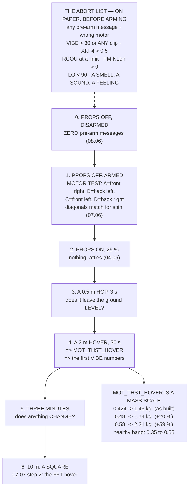

# 11.01 The first flight: props off → motors up → hover

<!-- glance:start -->
<!-- generated by tools/build.py from curriculum/syllabus.yaml — edit the syllabus, not this block -->

| | |
|---|---|
| **Track** | Main path |
| **Difficulty** | Intermediate |
| **Time** | 2 h |
| **Hardware** | First flight (Hermon core) (stage 1) |
| **Software** | ardupilot, qgc |
| **Prerequisites** | [04.06 Pre-flight inspection, prop safety and airworthiness](../04-frame-and-assembly/04.06-preflight-and-airworthiness.md)<br>[08.06 Ground stations: QGroundControl and Mission Planner](../08-flight-controller/08.06-ground-stations.md)<br>[09.03 Failsafe: what happens when the link drops](../09-telemetry-datalink/09.03-failsafe-when-the-link-drops.md)<br>[10.04 ArduPilot SITL: the real firmware in a process](../10-simulation/10.04-ardupilot-sitl.md) |
| **Skip if** | Hermon has hovered, and you can state the abort criteria you had written down before you armed it. |

<!-- glance:end -->

## What you will learn

- The first flight as **seven flights**, each with one question and a go/no-go gate
- That the whole ladder fits in **one battery with 72 % to spare** — and why that is deliberate
- The props-off test in 07.06's numbering, and why **A, B, C, D is not the order round the frame**
- The **abort criteria, written down before you arm**, with every threshold traced to a lesson
- Why `MOT_THST_HOVER` has **three different predictions** and what the measurement actually tells
  you
- That a measured hover throttle is a **mass scale** — and what 0.58 would mean
- Which rows of 10.05's sim-versus-flight table this flight fills in

## Why it matters

Ten modules have been building toward a hover that will last thirty seconds, and the temptation
is to treat it as a ceremony. It is not. It is the first time every number in the course meets the
world at once, and the single most valuable thing you can do is arrange for that meeting to happen
**one question at a time**.

So this lesson is a ladder of seven steps, each answering one thing: are the motors where the
mixer thinks they are, does it leave the ground level, what is the hover throttle, does anything
change over three minutes. Each has a gate, and the whole ladder costs **25 Wh of an 88.8 Wh
pack** — which is deliberate, because a first-flight session that needs a battery change has a
pause in it, and the pause is where you convince yourself the thing you noticed was fine.

Two results come out of it that are worth the whole day. The first is the **abort list**: nine
criteria with thresholds from 05.06, 06.06, 07.06, 08.06, 08.07 and 09.02, written on paper
*before* you arm — because after you arm, every one of them becomes negotiable.

The second is that `MOT_THST_HOVER`, read off the log after a thirty-second hover, is a **mass
scale**. It should read between 0.42 and 0.52. If it reads 0.58 you are flying 2.3 kg and you
weighed 1.45, and that is a finding on the first day rather than in a field two months later.

## Prerequisites

<!-- prereqs:start -->
## Prerequisites

You need these first:

- [04.06 Pre-flight inspection, prop safety and airworthiness](../04-frame-and-assembly/04.06-preflight-and-airworthiness.md)
- [08.06 Ground stations: QGroundControl and Mission Planner](../08-flight-controller/08.06-ground-stations.md)
- [09.03 Failsafe: what happens when the link drops](../09-telemetry-datalink/09.03-failsafe-when-the-link-drops.md)
- [10.04 ArduPilot SITL: the real firmware in a process](../10-simulation/10.04-ardupilot-sitl.md)

### Optional prerequisite links

None.

Check your readiness: `python course.py why 11.01`
<!-- prereqs:end -->

## Concept

A first flight has one enemy, and it is not the aircraft. It is the **pressure to combine steps**.

You have driven somewhere. The weather is good. The aircraft is assembled and the temptation is
to arm it, hover, and see. And if something is wrong, you will have changed ten things
simultaneously and learned nothing about any of them.

The defence is a ladder with gates. Each step asks one question that the previous step made
answerable, and each has a written pass criterion. Propellers off, motors in the right places.
Propellers on, nothing loose. A hop — does it leave the ground level? A thirty-second hover —
what is the hover throttle, and what does the log say? Three minutes — does anything *change*?

And the second defence is the **abort list**, written in advance. Not because you will forget the
criteria, but because a criterion decided before you drove to the field is a decision, and a
criterion decided in the field is a preference.

## Technical explanation

### Level 1 — the ladder

| step | Wh | the one question |
|---|---|---|
| 0 props **off**, disarmed | 0.0 | every pre-arm message is **gone** |
| 1 props **off**, armed, motor test | 0.5 | motor **order and direction** (07.06) |
| 2 props on, armed, 25 % throttle | 0.3 | nothing rattles, nothing slips (04.05) |
| 3 a 0.5 m **hop**, 3 seconds | 0.2 | does it leave the ground **level**? |
| 4 a 2 m **hover**, 30 seconds | 1.5 | `MOT_THST_HOVER`, and the log |
| 5 a 2 m hover, **3 minutes** | 9.0 | does anything **change** with time? |
| 6 10 m, a slow square | 12.0 | 07.07's step-2 hover, for the FFT |
| **total** | **23.5 Wh** | **26 % of one pack** |

All seven fit in one battery with 74 % to spare, and the order is not negotiable: you cannot read
`MOT_THST_HOVER` before it hovers, and you must not hover before you know the motors are in the
right places.

### Level 2 — the props-off test

The motor test spins one at a time. What you are checking is the **physical frame against the
mixer's model** from 07.06:

| test | position | spin | roll | pitch | yaw |
|---|---|---|---|---|---|
| A / 1 | **front right** | CCW | −1 | −1 | +1 |
| B / 2 | **back left** | CCW | +1 | +1 | +1 |
| C / 3 | **front left** | CW | +1 | −1 | −1 |
| D / 4 | **back right** | CW | −1 | +1 | −1 |

Ground stations label them A, B, C, D and ArduPilot numbers them 1, 2, 3, 4 — **and that order is
not the order round the frame**. Test A and watch the front right motor. If a different one
turns, stop.

And the diagonals must match: 1 and 2 are both CCW, 3 and 4 are both CW. Get that wrong and the
yaw column of the mixer is inconsistent, the aircraft yaws whenever it rolls, and no tuning fixes
it.

Four things to confirm, propellers **off**:

1. the right motor turns for the right letter
2. each one turns the right **way** — mark the shaft with tape
3. all four start at the same throttle; a late one is an ESC
4. nothing is loose when you stop it with your hand

Then fit the propellers and check each one's direction against its motor — 04.05's step that
everyone does by eye and half of them get wrong.

### Level 3 — the abort criteria

| if | from |
|---|---|
| **any** pre-arm message | 08.06 |
| a motor in the wrong place or direction | 07.06 |
| it will not leave the ground level | 04.02, 08.06 |
| `VIBE` above 30 m/s² on any axis, or **any** clip counter moving | 05.06 |
| `XKF4` ratios above 0.5 | 06.06 |
| any `RCOU` channel at `SPIN_MIN` or `SPIN_MAX` | 07.06 |
| `PM.NLon` above zero | 08.07 |
| LQ below 90 at any point | 09.02 |
| **a smell, a sound, or a feeling** | — |

Write it out, on paper, before you arm. After you arm, every one becomes negotiable: you will have
driven somewhere, the light will be good, and the aircraft will be "nearly" fine.

The last row is not a joke. It is the only unquantified entry and it has saved more aircraft than
the other eight, because it fires on the failure modes nobody listed.

### Level 4 — `MOT_THST_HOVER`, and the mass scale

ArduPilot **learns** its hover throttle and stores it. Predicting it is not as simple as it looks,
because three different models give three answers:

| model | predicts |
|---|---|
| electrical duty from KV (02.11) | 5060 / (470 × 22.2) = **48.5 %** |
| thrust curve, no expo ($T\propto u^2$) | $\sqrt{3.556/13.43}$ = **51.5 %** |
| thrust curve, `MOT_THST_EXPO` 0.65 (07.06) | **42.3 %** |

So the prediction is a **band, 42 % to 52 %**, and the frozen 48 % sits inside it. These are not a
contradiction — they are three different quantities that the word "throttle" is doing duty for,
and the measurement tells you which model your powertrain actually follows.

And the measurement is a **mass scale**:

| `MOT_THST_HOVER` | implied thrust | implied mass | vs 1.450 kg |
|---|---|---|---|
| 35.0 % | 10.86 N | 1.107 kg | −23.7 % |
| **42.4 %** | 14.25 N | **1.453 kg** | +0.2 % |
| 48.0 % | 17.07 N | 1.740 kg | +20.0 % |
| 52.0 % | 19.22 N | 1.959 kg | +35.1 % |
| **58.0 %** | 22.65 N | **2.309 kg** | **+59.2 %** |

If it reads 0.58 you are flying 2.3 kg and you weighed 1.45. One of three things is true: the
aircraft is heavier than the build sheet — did you weigh it **assembled**? — the propellers make
less thrust than 02.07 measured, or the pack is sagging (03.02). All three are findings, and all
three change 11.05's endurance budget.

The inference assumes the expo model, which the three predictions just told you might be wrong.
**So weigh the aircraft as well**: two independent measurements of the same mass is how you find
out which model is off.

The healthy range is **0.35 to 0.55**. Below it the aircraft is over-propped and 07.06's floor is
very close; above it you have no climb authority and 01.02's headroom is gone.

### Level 5 — what this flight fills in

| metric | sim said | from | note |
|---|---|---|---|
| hover current | 10.2 A | step 4 | 03.02 and 02.11 predicted it |
| `MOT_THST_HOVER` | 0.42–0.52 | step 4 | Level 4's band |
| **`VIBE` peak** | **~0** | step 4 | **sim has none. Expect disagreement** |
| gyro FFT peak | none | step 6 | 07.07's 84 Hz, if it is there |

Row three is the one to look forward to. The simulator said the vibration would be about zero,
because it has none. The aircraft will say something else, and the difference is **10.01's gap
list, measured, on the first day**.

## Diagram



## Code

Cost the seven-step ladder against one pack, lay out the props-off test in 07.06's numbering,
print the abort list with every threshold's source, compute the three hover-throttle predictions
and the band they bracket, and turn a measured `MOT_THST_HOVER` into an implied all-up mass.

```python
"""11.01 - the first flight, as a written procedure with numbers in it."""
import math

M, G = 1.450, 9.81
T_MAX = 13.43             # N per motor (02.11)
T_HOVER = 3.556           # N per motor (02.11)
EXPO = 0.65               # MOT_THST_EXPO default (07.06)
KV, V_PACK = 470.0, 22.2  # 02.11
RPM_HOVER, RPM_FULL = 5060.0, 9836.0
HOVER_W = 226.0           # W (02.11)
USABLE_WH = 88.8          # (03.06)

# the escalation ladder: what, how long, how much energy, and the go/no-go
LADDER = [
    ("0  props OFF, disarmed", 0.0, "every pre-arm message is GONE",
     "08.06's screen, and ZERO messages, not 'only the usual one'"),
    ("1  props OFF, armed, motor test", 0.5, "motor ORDER and DIRECTION",
     "07.06's matrix against the physical frame"),
    ("2  props ON, armed, 25 % throttle", 0.3, "nothing rattles, nothing slips",
     "04.05's torque check, verified by ear and by hand"),
    ("3  a 0.5 m HOP, 3 seconds", 0.2, "does it leave the ground LEVEL?",
     "any drift is a trim, a CoM or a motor problem"),
    ("4  a 2 m HOVER, 30 seconds", 1.5, "MOT_THST_HOVER, and the log",
     "section 4's band, and the first VIBE numbers"),
    ("5  a 2 m HOVER, 3 minutes", 9.0, "does anything CHANGE with time?",
     "heat, sag, a fastener. 04.06's 0.2 % per flight"),
    ("6  10 m, a slow square", 12.0, "the loops, and the first real log",
     "07.07 step 2: the hover that the FFT is built from"),
]

# the abort criteria, and where each threshold came from
ABORT = [
    ("ANY pre-arm message", "arm anyway is the commonest first-flight error",
     "08.06"),
    ("a motor in the wrong place or direction", "flips on take-off", "07.06"),
    ("it will not leave the ground level", "CoM, trim, or a motor",
     "04.02, 08.06"),
    ("VIBE above 30 m/s/s on any axis", "or Clip0/1/2 moving at all",
     "05.06"),
    ("XKF4 ratios above 0.5", "the estimator is not confident", "06.06"),
    ("any RCOU channel at SPIN_MIN or SPIN_MAX", "a saturated mixer",
     "07.06"),
    ("PM.NLon above zero", "the board cannot do what you asked", "08.07"),
    ("LQ below 90 at any point", "the control link, not the range", "09.02"),
    ("a smell, a sound, or a feeling", "the only unquantified one, and it",
     "is the one that has saved the most aircraft"),
]

# 10.05's sim-to-real table: which rows THIS flight can fill
FILLS = [
    ("hover current", "10.2 A", "step 4", "03.02 and 02.11 predicted it"),
    ("MOT_THST_HOVER", "0.42-0.52", "step 4", "section 4's band"),
    ("VIBE peak", "~0 in sim", "step 4", "SIM HAS NONE. Expect disagreement"),
    ("gyro FFT peak", "none in sim", "step 6", "07.07's 84 Hz, if it is there"),
    ("hover endurance", "24 min", "not yet", "11.05 measures it properly"),
    ("LOITER error, calm", "0.94 m", "not yet", "11.03, once it is trimmed"),
]


def thrust_frac(u, expo=EXPO):
    """MOT_THST_EXPO's curve: thrust as a fraction of maximum."""
    return (1 - expo) * u + expo * u * u


def hover_u(expo=EXPO, frac=T_HOVER / T_MAX):
    """Invert it: what output command gives hover thrust?"""
    if expo <= 0:
        return math.sqrt(frac)
    return (-(1 - expo) + math.sqrt((1 - expo) ** 2 + 4 * expo * frac)) \
        / (2 * expo)


def implied_mass(u, expo=EXPO):
    """A measured hover throttle, read backwards into an all-up mass."""
    return 4 * T_MAX * thrust_frac(u, expo) / G


def bar(t):
    print("\n" + "=" * 70)
    print(t)
    print("=" * 70)


if __name__ == "__main__":
    bar("1. THE LADDER: SEVEN STEPS, AND A GATE AT EACH ONE")
    print("  The first flight is not a flight. It is seven of them, each")
    print("  with ONE question and a go/no-go answer.")
    print(f"  {'step':32s} {'Wh':>5s}  what it answers")
    total = 0.0
    for name, wh, q, why in LADDER:
        total += wh
        print(f"  {name:32s} {wh:5.1f}  {q}")
        print(f"  {'':32s} {'':5s}  ({why})")
    print(f"  {'TOTAL':32s} {total:5.1f} Wh ="
          f" {total / USABLE_WH * 100:.0f} % of one pack")
    print(f"  ALL SEVEN STEPS FIT IN ONE BATTERY, with"
          f" {100 - total / USABLE_WH * 100:.0f} % to spare.")
    print("  THAT IS DELIBERATE. A first-flight session that needs a")
    print("  battery change has a pause in it, and the pause is where")
    print("  you convince yourself the thing you noticed was fine.")
    print("  AND THE ORDER IS NOT NEGOTIABLE. Each step's question can")
    print("  only be asked once the previous one is answered: you cannot")
    print("  read MOT_THST_HOVER before it hovers, and you must not")
    print("  hover before you know the motors are in the right places.")

    bar("2. STEP 1: THE PROPS-OFF TEST, IN 07.06'S NUMBERING")
    print("  The motor test spins one motor at a time. What you are")
    print("  checking is the PHYSICAL frame against the MIXER's model:")
    L = 0.1591
    motors = [("A / 1", "FRONT RIGHT", "CCW", "+1", "-1", "+1"),
              ("B / 2", "BACK LEFT", "CCW", "+1", "+1", "+1"),
              ("C / 3", "FRONT LEFT", "CW", "+1", "-1", "-1"),
              ("D / 4", "BACK RIGHT", "CW", "+1", "+1", "-1")]
    print(f"  {'test':8s} {'position':13s} {'spin':5s}"
          f" {'thr':>4s} {'roll':>5s} {'pitch':>6s} {'yaw':>4s}")
    for t_, pos, spin, th, pi, yw in motors:
        rl = "-1" if "RIGHT" in pos else "+1"
        print(f"  {t_:8s} {pos:13s} {spin:5s} {th:>4s} {rl:>5s}"
              f" {pi:>6s} {yw:>4s}")
    print("  MISSION PLANNER AND QGC LABEL THEM A, B, C, D and ArduPilot")
    print("  NUMBERS THEM 1, 2, 3, 4 -- AND THE ORDER IS NOT THE SAME AS")
    print("  GOING ROUND THE FRAME. Test A and watch the FRONT RIGHT")
    print("  motor. If a different one turns, stop.")
    print("  AND THE DIAGONALS MUST MATCH: 1 and 2 are both CCW, 3 and 4")
    print("  are both CW. Get that wrong and the yaw column of 07.06's")
    print("  matrix is inconsistent, the aircraft yaws whenever it rolls,")
    print("  and no tuning fixes it.")
    print("\n  THE FOUR THINGS TO CONFIRM, WITH PROPELLERS OFF:")
    for i, s in enumerate([
            "the right motor turns for the right letter",
            "each one turns the right WAY (mark the shaft with tape)",
            "all four start at the same throttle -- a late one is an ESC",
            "nothing is loose when you stop it with your hand"], 1):
        print(f"    {i}. {s}")
    print("  THEN FIT THE PROPELLERS, and check the DIRECTION of each")
    print("  one against its motor: 04.05's step that everyone does by")
    print("  eye and half of them get wrong.")

    bar("3. THE ABORT CRITERIA -- WRITTEN DOWN BEFORE YOU ARM")
    print("  This list is the whole lesson. Write it out, on paper, and")
    print("  put it where you can see it. Every threshold is somebody")
    print("  else's measurement:")
    print(f"  {'if':44s} {'from'}")
    for what, why, src in ABORT:
        print(f"  {what:44s} {src}")
        print(f"  {'':44s} {why}")
    print("  THE REASON IT GOES ON PAPER BEFORE YOU ARM is that after")
    print("  you arm, every one of these becomes negotiable. You will")
    print("  have driven somewhere, the light will be good, and the")
    print("  aircraft will be 'nearly' fine. A criterion decided in")
    print("  advance is a decision; a criterion decided in the field is")
    print("  a preference.")
    print("  AND THE LAST ROW IS NOT A JOKE. It is the only unquantified")
    print("  entry and it has saved more aircraft than the other eight,")
    print("  because it fires on the failure modes nobody listed.")

    bar("4. STEP 4: WHAT MOT_THST_HOVER SHOULD BE, AND WHAT IT TELLS YOU")
    print("  ArduPilot LEARNS its hover throttle in flight and stores it")
    print("  in MOT_THST_HOVER. Predicting it is not as simple as it")
    print("  looks, because two different models give two answers:")
    preds = [
        ("electrical duty, from KV (02.11)", RPM_HOVER / (KV * V_PACK),
         "5060 rpm / (470 KV x 22.2 V). The ESC's duty cycle"),
        ("thrust curve, no expo (T ~ u^2)", hover_u(0.0),
         "sqrt(3.556 / 13.43). What a square law predicts"),
        ("thrust curve, MOT_THST_EXPO 0.65", hover_u(0.65),
         "07.06's inverted curve. What ArduPilot commands"),
    ]
    for n, v, why in preds:
        print(f"  {n:36s} {v * 100:5.1f} %")
        print(f"  {'':36s} {why}")
    lo = min(p[1] for p in preds)
    hi = max(p[1] for p in preds)
    print(f"  SO THE PREDICTION IS A BAND: {lo * 100:.0f} % to"
          f" {hi * 100:.0f} %, and the frozen")
    print("  48 % sits inside it. THE THREE NUMBERS ARE NOT A")
    print("  CONTRADICTION -- they are three different quantities that")
    print("  the word 'throttle' is doing duty for, and the measurement")
    print("  tells you which model your powertrain actually follows.")
    print("\n  AND THE MEASUREMENT IS A MASS SCALE. Read MOT_THST_HOVER")
    print("  after step 4 and work backwards:")
    print(f"  {'MOT_THST_HOVER':>15s} {'implied thrust':>15s}"
          f" {'implied mass':>14s} {'vs 1.450 kg':>12s}")
    for u in (0.35, 0.40, 0.424, 0.45, 0.48, 0.52, 0.58):
        m = implied_mass(u)
        print(f"  {u * 100:13.1f} % {4 * T_MAX * thrust_frac(u):12.2f} N"
              f" {m:12.3f} kg {(m / M - 1) * 100:+10.1f} %")
    print("  IF IT READS 0.58 YOU ARE FLYING 2.3 kg AND YOU WEIGHED")
    print("  1.45. One of three things is true: the aircraft is heavier")
    print("  than the build sheet (04.02 -- did you weigh it ASSEMBLED?),")
    print("  the propellers make less thrust than 02.07 measured, or the")
    print("  pack is sagging (03.02). ALL THREE ARE FINDINGS, and all")
    print("  three change 11.05's endurance budget.")
    print("  (THE INFERENCE ASSUMES THE EXPO MODEL, which the three")
    print("   predictions above just told you might be wrong. So weigh")
    print("   the aircraft as well: two independent measurements of the")
    print("   same mass is how you find out which model is off.)")
    print("  THE HEALTHY RANGE IS 0.35 TO 0.55. Below it the aircraft is")
    print("  over-propped and 07.06's floor is very close; above it you")
    print("  have no climb authority and 01.02's headroom is gone.")

    bar("5. WHAT THIS FLIGHT FILLS IN")
    print("  10.05 built a sim-versus-flight table with an empty third")
    print("  column. The first flight fills in the first four rows:")
    print(f"  {'metric':22s} {'sim said':>12s} {'from':>8s}  note")
    for n, sim, step, why in FILLS:
        print(f"  {n:22s} {sim:>12s} {step:>8s}  {why}")
    print("  ROW 3 IS THE ONE TO LOOK FORWARD TO. The simulator said")
    print("  the vibration would be about zero, because it has none. The")
    print("  aircraft will say something else, and the difference is")
    print("  10.01's gap list, MEASURED, on the first day.")
    print("\n  AND THE LOG IS THE DELIVERABLE, not the hover. Run 08.07's")
    print("  five checks on it before you fly again:")
    for i, s in enumerate(["ERR -- any entry at all",
                           "PM.NLon -- zero, or a handful",
                           "VIBE + Clip -- under 30, counters FLAT",
                           "XKF4 -- median near 0.04",
                           "RCOU -- nothing pinned at either limit"], 1):
        print(f"    {i}. {s}")
    print("  A FIRST FLIGHT WITH NO LOG IS A STORY. A first flight with")
    print("  a log is the first row of a dataset that module 16 will")
    print("  still be using in a year.")
```

Output:

```text

======================================================================
1. THE LADDER: SEVEN STEPS, AND A GATE AT EACH ONE
======================================================================
  The first flight is not a flight. It is seven of them, each
  with ONE question and a go/no-go answer.
  step                                Wh  what it answers
  0  props OFF, disarmed             0.0  every pre-arm message is GONE
                                          (08.06's screen, and ZERO messages, not 'only the usual one')
  1  props OFF, armed, motor test    0.5  motor ORDER and DIRECTION
                                          (07.06's matrix against the physical frame)
  2  props ON, armed, 25 % throttle   0.3  nothing rattles, nothing slips
                                          (04.05's torque check, verified by ear and by hand)
  3  a 0.5 m HOP, 3 seconds          0.2  does it leave the ground LEVEL?
                                          (any drift is a trim, a CoM or a motor problem)
  4  a 2 m HOVER, 30 seconds         1.5  MOT_THST_HOVER, and the log
                                          (section 4's band, and the first VIBE numbers)
  5  a 2 m HOVER, 3 minutes          9.0  does anything CHANGE with time?
                                          (heat, sag, a fastener. 04.06's 0.2 % per flight)
  6  10 m, a slow square            12.0  the loops, and the first real log
                                          (07.07 step 2: the hover that the FFT is built from)
  TOTAL                             23.5 Wh = 26 % of one pack
  ALL SEVEN STEPS FIT IN ONE BATTERY, with 74 % to spare.
  THAT IS DELIBERATE. A first-flight session that needs a
  battery change has a pause in it, and the pause is where
  you convince yourself the thing you noticed was fine.
  AND THE ORDER IS NOT NEGOTIABLE. Each step's question can
  only be asked once the previous one is answered: you cannot
  read MOT_THST_HOVER before it hovers, and you must not
  hover before you know the motors are in the right places.

======================================================================
2. STEP 1: THE PROPS-OFF TEST, IN 07.06'S NUMBERING
======================================================================
  The motor test spins one motor at a time. What you are
  checking is the PHYSICAL frame against the MIXER's model:
  test     position      spin   thr  roll  pitch  yaw
  A / 1    FRONT RIGHT   CCW     +1    -1     -1   +1
  B / 2    BACK LEFT     CCW     +1    +1     +1   +1
  C / 3    FRONT LEFT    CW      +1    +1     -1   -1
  D / 4    BACK RIGHT    CW      +1    -1     +1   -1
  MISSION PLANNER AND QGC LABEL THEM A, B, C, D and ArduPilot
  NUMBERS THEM 1, 2, 3, 4 -- AND THE ORDER IS NOT THE SAME AS
  GOING ROUND THE FRAME. Test A and watch the FRONT RIGHT
  motor. If a different one turns, stop.
  AND THE DIAGONALS MUST MATCH: 1 and 2 are both CCW, 3 and 4
  are both CW. Get that wrong and the yaw column of 07.06's
  matrix is inconsistent, the aircraft yaws whenever it rolls,
  and no tuning fixes it.

  THE FOUR THINGS TO CONFIRM, WITH PROPELLERS OFF:
    1. the right motor turns for the right letter
    2. each one turns the right WAY (mark the shaft with tape)
    3. all four start at the same throttle -- a late one is an ESC
    4. nothing is loose when you stop it with your hand
  THEN FIT THE PROPELLERS, and check the DIRECTION of each
  one against its motor: 04.05's step that everyone does by
  eye and half of them get wrong.

======================================================================
3. THE ABORT CRITERIA -- WRITTEN DOWN BEFORE YOU ARM
======================================================================
  This list is the whole lesson. Write it out, on paper, and
  put it where you can see it. Every threshold is somebody
  else's measurement:
  if                                           from
  ANY pre-arm message                          08.06
                                               arm anyway is the commonest first-flight error
  a motor in the wrong place or direction      07.06
                                               flips on take-off
  it will not leave the ground level           04.02, 08.06
                                               CoM, trim, or a motor
  VIBE above 30 m/s/s on any axis              05.06
                                               or Clip0/1/2 moving at all
  XKF4 ratios above 0.5                        06.06
                                               the estimator is not confident
  any RCOU channel at SPIN_MIN or SPIN_MAX     07.06
                                               a saturated mixer
  PM.NLon above zero                           08.07
                                               the board cannot do what you asked
  LQ below 90 at any point                     09.02
                                               the control link, not the range
  a smell, a sound, or a feeling               is the one that has saved the most aircraft
                                               the only unquantified one, and it
  THE REASON IT GOES ON PAPER BEFORE YOU ARM is that after
  you arm, every one of these becomes negotiable. You will
  have driven somewhere, the light will be good, and the
  aircraft will be 'nearly' fine. A criterion decided in
  advance is a decision; a criterion decided in the field is
  a preference.
  AND THE LAST ROW IS NOT A JOKE. It is the only unquantified
  entry and it has saved more aircraft than the other eight,
  because it fires on the failure modes nobody listed.

======================================================================
4. STEP 4: WHAT MOT_THST_HOVER SHOULD BE, AND WHAT IT TELLS YOU
======================================================================
  ArduPilot LEARNS its hover throttle in flight and stores it
  in MOT_THST_HOVER. Predicting it is not as simple as it
  looks, because two different models give two answers:
  electrical duty, from KV (02.11)      48.5 %
                                       5060 rpm / (470 KV x 22.2 V). The ESC's duty cycle
  thrust curve, no expo (T ~ u^2)       51.5 %
                                       sqrt(3.556 / 13.43). What a square law predicts
  thrust curve, MOT_THST_EXPO 0.65      42.3 %
                                       07.06's inverted curve. What ArduPilot commands
  SO THE PREDICTION IS A BAND: 42 % to 51 %, and the frozen
  48 % sits inside it. THE THREE NUMBERS ARE NOT A
  CONTRADICTION -- they are three different quantities that
  the word 'throttle' is doing duty for, and the measurement
  tells you which model your powertrain actually follows.

  AND THE MEASUREMENT IS A MASS SCALE. Read MOT_THST_HOVER
  after step 4 and work backwards:
   MOT_THST_HOVER  implied thrust   implied mass  vs 1.450 kg
           35.0 %        10.86 N        1.107 kg      -23.7 %
           40.0 %        13.11 N        1.336 kg       -7.9 %
           42.4 %        14.25 N        1.453 kg       +0.2 %
           45.0 %        15.53 N        1.583 kg       +9.2 %
           48.0 %        17.07 N        1.740 kg      +20.0 %
           52.0 %        19.22 N        1.959 kg      +35.1 %
           58.0 %        22.65 N        2.309 kg      +59.2 %
  IF IT READS 0.58 YOU ARE FLYING 2.3 kg AND YOU WEIGHED
  1.45. One of three things is true: the aircraft is heavier
  than the build sheet (04.02 -- did you weigh it ASSEMBLED?),
  the propellers make less thrust than 02.07 measured, or the
  pack is sagging (03.02). ALL THREE ARE FINDINGS, and all
  three change 11.05's endurance budget.
  (THE INFERENCE ASSUMES THE EXPO MODEL, which the three
   predictions above just told you might be wrong. So weigh
   the aircraft as well: two independent measurements of the
   same mass is how you find out which model is off.)
  THE HEALTHY RANGE IS 0.35 TO 0.55. Below it the aircraft is
  over-propped and 07.06's floor is very close; above it you
  have no climb authority and 01.02's headroom is gone.

======================================================================
5. WHAT THIS FLIGHT FILLS IN
======================================================================
  10.05 built a sim-versus-flight table with an empty third
  column. The first flight fills in the first four rows:
  metric                     sim said     from  note
  hover current                10.2 A   step 4  03.02 and 02.11 predicted it
  MOT_THST_HOVER            0.42-0.52   step 4  section 4's band
  VIBE peak                 ~0 in sim   step 4  SIM HAS NONE. Expect disagreement
  gyro FFT peak           none in sim   step 6  07.07's 84 Hz, if it is there
  hover endurance              24 min  not yet  11.05 measures it properly
  LOITER error, calm           0.94 m  not yet  11.03, once it is trimmed
  ROW 3 IS THE ONE TO LOOK FORWARD TO. The simulator said
  the vibration would be about zero, because it has none. The
  aircraft will say something else, and the difference is
  10.01's gap list, MEASURED, on the first day.

  AND THE LOG IS THE DELIVERABLE, not the hover. Run 08.07's
  five checks on it before you fly again:
    1. ERR -- any entry at all
    2. PM.NLon -- zero, or a handful
    3. VIBE + Clip -- under 30, counters FLAT
    4. XKF4 -- median near 0.04
    5. RCOU -- nothing pinned at either limit
  A FIRST FLIGHT WITH NO LOG IS A STORY. A first flight with
  a log is the first row of a dataset that module 16 will
  still be using in a year.
```

## Exercise

### Exercise 11.01-E1 — Write your own abort card `[analysis]`

Take the nine criteria and turn them into a card for **your** aircraft, with your thresholds and
your reasons. Add anything your build has that Hermon does not. Then do the part that makes it
real: for each criterion, write the *observation* that would trigger it — not "vibration too high"
but "the `VIBE` bars on the ground-station screen go past the second mark". A criterion you cannot
observe in the field is not a criterion.

### Exercise 11.01-E2 — Predict your own hover throttle three ways `[analysis]`

Compute the three predictions for your powertrain: from KV and your hover rpm, from the square
law, and from your measured `MOT_THST_EXPO` (02.07 measured it). Report the band. Then say which
one you expect to be closest and why — and write it down before you fly, because a prediction made
afterwards is not one.

### Exercise 11.01-E3 — Fly the ladder `[hardware]`

Run all seven steps in order, with the abort card visible, and record the answer to each step's
question in writing before moving on. Download the log after steps 4, 5 and 6 and run 08.07's
five checks on each. Report `MOT_THST_HOVER`, the implied mass, and the aircraft's weighed mass.

### Exercise 11.01-E4 — Fill in four rows `[analysis]`

From step 4's and step 6's logs, fill in the four rows of 10.05's table that this flight can
answer: hover current, `MOT_THST_HOVER`, peak `VIBE`, and the gyro FFT's strongest peak. Mark each
agree or disagree against the simulator's prediction. For each disagreement, name which of 10.01's
seven physical categories it belongs to.

## Expected result

**11.01-E1**: a card with nine to twelve rows, each with an observable trigger. If you cannot
write an observation for a criterion, either instrument it before you fly or drop it — an
unobservable criterion is a feeling with a number attached.

**11.01-E2**: a band of roughly ten percentage points, as Hermon's is. The KV prediction is
usually closest for a well-matched powertrain and the expo prediction is closest once
`MOT_THST_EXPO` has been measured rather than defaulted.

**11.01-E3**: expect step 3 to reveal something. A hop that drifts consistently in one direction
is a centre-of-mass offset (04.02) or a trim; one that drifts differently each time is wind or
ground effect (01.11). Either way it is worth fixing before step 4, because a hover that fights a
trim gives you a `MOT_THST_HOVER` that is not the aircraft's.

**11.01-E4**: hover current and `MOT_THST_HOVER` should agree within 10–20 %. `VIBE` and the FFT
peak will disagree completely — the simulator predicted approximately zero and the aircraft will
show 84 Hz — and that is the **expected** result. It is 10.01's gap list, measured, on day one.

## Troubleshooting

**It will not arm and the message is unhelpful.** Read it in the ground station's message pane
rather than the LED pattern; ArduPilot's text is specific. The commonest first-flight ones are the
EKF not yet converged, the compass not calibrated, and the safety switch. None of them is a reason
to force arming.

**It leaves the ground and immediately rolls.** Land, disarm, and go back to step 1. A consistent
roll on take-off is almost always a motor in the wrong place or a propeller on backwards — 07.06's
matrix meeting a frame that does not match it.

**It hovers but drifts steadily in one direction.** A centre-of-mass offset (04.02) or a
level-calibration error. Re-run the accelerometer calibration on a surface you have checked with
a spirit level, and check `AHRS_TRIM_*`.

**`MOT_THST_HOVER` is outside 0.35–0.55.** Level 4. Weigh the aircraft assembled, check the
propeller pitch against what 02.07 measured, and check the pack's voltage under load (03.02).

**`VIBE` is above 30 on the first hover.** Land. Balance the propellers (02.09) and check the
flight-controller mount (04.04). 05.06 showed clipping is a bias that defeats lane voting, and it
is the one abort criterion that gets worse rather than better with flight time.

**Everything passes and you are still nervous.** Fly step 5 twice. Three minutes twice tells you
more than six minutes once, because the second one starts warm.

> [!CAUTION]
> **Steps 0 to 2 happen with the propellers off, and step 2 is the first time they go on.** 04.06
> computed that a propeller at hover carries **9.06 J** — 906 N over 10 mm. Before every armed
> step: everyone behind the aircraft, nothing in front of it for 10 m, and your hand on the mode
> switch or the disarm. Choose the landing site before you take off, and choose it so that an
> uncontrolled descent hits grass rather than a car, a fence or a person. **The first flight is
> the one most likely to go wrong and the one you are least practised at recovering from.**

## Common mistakes

- **Combining steps.** The entire method is one question at a time; combining two means learning
  about neither.
- **Deciding the abort criteria in the field.** Then they are preferences.
- **Skipping the props-off motor test.** It is the only check between 07.06's matrix and the frame
  you built, and its failure mode is a flip on take-off.
- **Arming with a pre-arm message you have decided is harmless.** 08.06: a message you have learned
  to ignore is a check that has stopped working.
- **Flying step 4 before step 3.** A hover that is fighting a trim gives you a `MOT_THST_HOVER`
  belonging to a different aircraft.
- **Not downloading the log.** The deliverable of a first flight is a log, not a hover.
- **Weighing the aircraft in pieces.** 04.02's budget is 730 g dry; the number that matters is the
  assembled all-up mass with the pack in it.

## Knowledge check

<details>
<summary>Why is the first flight seven flights rather than one, and why does the whole ladder fit
in one battery?</summary>

Because each step asks **one question** that the previous step made answerable, with a written
pass criterion — combining them means changing several things at once and learning about none.
The one-battery constraint is deliberate: a session that needs a battery change has a pause in it,
and the pause is where you talk yourself out of the thing you noticed. The whole ladder is 23.5 Wh
of an 88.8 Wh pack.
</details>

<details>
<summary>The motor test labels motors A, B, C, D. What are you actually verifying, and what is the
trap?</summary>

You are verifying the **physical frame against 07.06's mixer matrix**: A is front right, B is back
left, C is front left, D is back right. The trap is that **this is not the order round the
frame** — it is diagonal — so someone checking "clockwise from the front" will pass a frame that
is wired wrong. Also check the spin directions: 1 and 2 CCW, 3 and 4 CW, or the yaw column is
inconsistent.
</details>

<details>
<summary>Why must the abort criteria be written before arming rather than decided in the
field?</summary>

Because after you arm, every one becomes negotiable. You have driven somewhere, the light is good,
and the aircraft is "nearly" fine — and each individual relaxation is defensible. A criterion
decided in advance is a **decision**; the same criterion decided in the field is a **preference**,
and preferences move.
</details>

<details>
<summary>`MOT_THST_HOVER` has three different predictions. Are they contradictory?</summary>

No — they are three different quantities the word "throttle" is doing duty for. The **electrical
duty** from KV and hover rpm gives 48.5 %; the **square law** on thrust gives 51.5 %; and
**ArduPilot's post-expo output command** gives 42.3 %. Together they bracket a band of 42–52 %,
and the measurement tells you which model your powertrain actually follows.
</details>

<details>
<summary>Your first hover reports `MOT_THST_HOVER` = 0.58. What does that mean and what are the
three explanations?</summary>

It implies **2.31 kg of all-up mass** against the 1.45 kg you weighed — 59 % heavy. Either the
aircraft really is heavier than the build sheet (did you weigh it **assembled**, with the pack?),
the propellers make less thrust than 02.07 measured, or the pack is sagging under load (03.02).
All three are findings, and all three change 11.05's endurance budget. Weigh it again as a cross
check, because the inference assumes the expo model.
</details>

<details>
<summary>Which row of 10.05's sim-versus-flight table will certainly disagree after this flight,
and why is that a success?</summary>

The **`VIBE` peak** — the simulator predicted approximately zero because it has no vibration at
all, and the aircraft will show real numbers. It is a success because **10.01 predicted that
disagreement before the simulator was written**. A model that is wrong in the way you expected is
a model you understand.
</details>

<details>
<summary>What is the actual deliverable of a first flight?</summary>

**The log.** A first flight with no log is a story; a first flight with a log is the first row of a
dataset module 16 will still be using in a year. Run 08.07's five checks on it — `ERR`, `PM.NLon`,
`VIBE` and its clip counters, `XKF4`, `RCOU` — before flying again.
</details>

## Practical challenge

**Fly the ladder, and produce three documents.**

The **abort card**, written before you leave, with an observable trigger for every criterion and
the lesson that set each threshold. Take it with you and keep it afterwards — it becomes 11.06's
emergency card and 16.05's safety case.

The **step sheet**: seven rows, each with its question, your written answer, and the time. Any
step whose answer is "I think so" is a step that has not been completed.

And the **first four rows of 10.05's table**: hover current, `MOT_THST_HOVER`, peak `VIBE`, FFT
peak, each with the simulator's prediction beside the measurement and a verdict.

Then do the thing that turns a good day into a method: put all three in the repository, beside
the parameter files from 08.04. The next aircraft you build starts from these rather than from
nothing, and the difference between the first flight and the second is most of what an
experienced builder actually has.

## You can skip this if

Hermon has hovered, and you can state the abort criteria you had written down before you armed it.

## Go deeper

- [02.11](../02-motors-escs-props/02.11-hermon-powertrain-design.md) (earlier): the 48 % hover
  throttle, and which of Level 4's three quantities it is.
- [04.05](../04-frame-and-assembly/04.05-building-hermon.md) (earlier): the torque checks step 2
  verifies.
- [04.06](../04-frame-and-assembly/04.06-preflight-and-airworthiness.md) (earlier): the ten-item
  preflight, and the 9.06 J.
- [07.06](../07-control/07.06-mixing-and-allocation.md) (earlier): the mixer matrix the props-off
  test checks the frame against.
- [08.06](../08-flight-controller/08.06-ground-stations.md) (earlier): the pre-flight screen, and
  the motor test.
- [08.07](../08-flight-controller/08.07-logging-and-the-data-path.md) (earlier): the five checks
  to run on the log.
- [10.05](../10-simulation/10.05-gazebo-and-regression-ci.md) (earlier): the table this flight
  starts filling in.
- [11.02](11.02-manual-modes.md) (next): the modes, once it hovers.
- [11.05](11.05-battery-discipline.md) (later): measuring the endurance properly.
- ArduPilot's first-flight guide, which is the shorter version of this procedure:
  https://ardupilot.org/copter/docs/flying-arducopter.html
- The arming and pre-arm checks reference, so that every message has a meaning:
  https://ardupilot.org/copter/docs/common-prearm-safety-checks.html

> **Ask your teacher:** *"We are flying the first hover as seven separate steps with a written
> abort card, and we are going to read `MOT_THST_HOVER` as a mass scale — 0.42 means we weigh what
> we think, 0.58 would mean 2.3 kg. Is that a check you use? And in your experience which step of
> a first flight most often produces the surprise?"*

## Progress checkpoint

Run `python course.py complete 11.01` once Hermon has hovered, the step sheet is complete and four
rows of the table have flight numbers in them. Next: [11.02](11.02-manual-modes.md) — the modes,
and what changes under the sticks when you switch.
