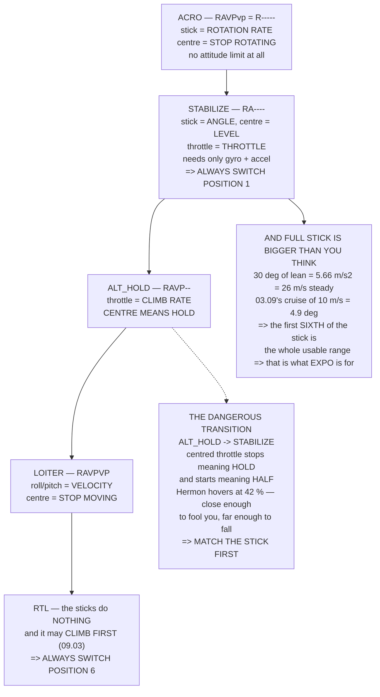

# 11.02 Manual modes: rates versus angles

<!-- glance:start -->
<!-- generated by tools/build.py from curriculum/syllabus.yaml — edit the syllabus, not this block -->

| | |
|---|---|
| **Track** | Main path |
| **Difficulty** | Intermediate |
| **Time** | 1 h 30 min |
| **Hardware** | First flight (Hermon core) (stage 1) |
| **Software** | ardupilot |
| **Prerequisites** | [11.01 The first flight: props off → motors up → hover](11.01-first-flight.md)<br>[07.05 Velocity and position loops — and flight modes as control configuration](../07-control/07.05-velocity-position-and-modes.md) |
| **Skip if** | You can fly Hermon in STABILIZE and ALT_HOLD, switch modes in the air, and explain what changed under the sticks. |

<!-- glance:end -->

## What you will learn

- 07.05's six-bit mode number, with a transmitter in your hands: **the same stick, five different
  meanings**
- The transition that has killed the most aircraft, and the one habit that prevents it
- What full stick actually commands — and that **30° of lean is a steady 26 m/s**
- Why Hermon's low drag means **small stick is the whole usable range**, and what expo does about it
- Why **STABILIZE is position 1 and RTL is position 6**, on every aircraft, always
- The six mode transitions that matter, and which one is dangerous
- Whether you need ACRO — honestly

## Why it matters

11.01 got the aircraft hovering. This lesson is about the switch in your left hand, and it exists
because of one line from 07.05 that reads differently once you are holding a transmitter: **the
same stick means four different physical quantities depending on the mode.**

That is not a curiosity. In STABILIZE the throttle stick is a throttle; in ALT_HOLD it is a climb
rate, and centred means *hold this height*. Switch from ALT_HOLD to STABILIZE with the stick
centred and the aircraft goes from holding altitude to about half throttle — and Hermon hovers at
**42 %**, so centre is *close*. Close enough that it does not obviously fall, and far enough that
it does not hold. That single transition, done without thinking, is the commonest way a working
aircraft ends up in the ground.

There is also a number here worth having before you fly. Full roll stick in STABILIZE is 30° of
lean, which by 01.04 is 5.66 m/s² — and because Hermon has very little drag (03.09's 0.020 m²),
that lean does not settle at a comfortable speed. It settles at **26 m/s, 93 km/h**. Meanwhile
03.09's spec cruise of 10 m/s is **4.9 degrees**.

So in STABILIZE, the first sixth of the stick is the whole usable range. That is what expo is for.

## Prerequisites

<!-- prereqs:start -->
## Prerequisites

You need these first:

- [11.01 The first flight: props off → motors up → hover](11.01-first-flight.md)
- [07.05 Velocity and position loops — and flight modes as control configuration](../07-control/07.05-velocity-position-and-modes.md)

### Optional prerequisite links

None.

Check your readiness: `python course.py why 11.02`
<!-- prereqs:end -->

## Concept

A flight mode is a choice about **which loops close and where the setpoints come from** — that was
07.05. From the pilot's side it is a choice about what the sticks *mean*, and the two views are
the same fact.

Close the rate loop only, and the stick commands a rotation rate: ACRO. Close the attitude loop
too, and it commands an angle: STABILIZE. Add the vertical loops and the throttle stops being a
throttle and becomes a climb rate: ALT_HOLD. Add the horizontal ones and the aircraft holds
position when you let go: POSHOLD and LOITER.

Each step up removes one thing you have to do and adds one thing that can fail. STABILIZE needs
only the gyro and the accelerometer, which is why it survives almost everything. LOITER needs the
GNSS and the compass, which is why 07.05's failure ladder puts it at the top.

And every step also changes what your hands are doing, mid-air, on a switch. **The skill this
lesson teaches is not flying — it is switching.**

## Technical explanation

### Level 1 — the same sticks, five meanings

| mode | `RAVPvp` | roll stick | pitch stick | throttle |
|---|---|---|---|---|
| ACRO | `R-----` | roll **rate** | pitch **rate** | throttle |
| STABILIZE | `RA----` | roll **angle** | pitch **angle** | throttle |
| ALT_HOLD | `RAVP--` | roll angle | pitch angle | **climb rate** |
| POSHOLD | `RAVPVP` | roll angle | pitch angle | climb rate |
| LOITER | `RAVPVP` | **velocity** | **velocity** | climb rate |

Read the roll column downwards. The same physical stick, moved the same distance, commands a
rate, an angle or a velocity depending on a switch you flicked.

The throttle column is worse, because in three of these five it is not a throttle at all: **centre
means hold**, not idle.

**Always match the stick to the hover position before switching out of an altitude-holding mode.**

### Level 2 — what full stick commands

| parameter | Hermon | scales |
|---|---|---|
| `ANGLE_MAX` | 30° | lean, in STABILIZE / ALT_HOLD / POSHOLD |
| `ACRO_RP_RATE` | 200 °/s | ACRO roll and pitch |
| `ATC_RATE_Y_MAX` | 90 °/s | yaw rate in every non-ACRO mode |
| `PILOT_SPEED_UP` / `_DN` | 2.5 / 1.5 m/s | ALT_HOLD climb and descent |
| `LOIT_SPEED` | 5 m/s | LOITER horizontal |

And what those numbers feel like:

| lean | acceleration | 0→10 m/s | **steady speed** |
|---|---|---|---|
| 5° | 0.86 m/s² | 11.7 s | 10.1 m/s |
| 10° | 1.73 m/s² | 5.8 s | 14.3 m/s |
| 20° | 3.57 m/s² | 2.8 s | 20.6 m/s |
| **30°** | **5.66 m/s²** | **1.8 s** | **25.9 m/s** |

Full stick is a steady **26 m/s — 93 km/h** — far past anything you would fly deliberately, or
than 02.11's powertrain can sustain.

The steady-speed column is the one to notice. Hermon has very little drag, so a lean angle does
not settle at a comfortable speed; it keeps accelerating for a long time. 03.09's spec cruise of
10 m/s is only **4.9° of lean**, which is a sixth of full stick.

### Level 3 — expo

Expo does not change full stick. It changes the **sensitivity near centre**, which is where every
real input lives:

| stick | expo 0.0 | expo 0.3 | expo 0.5 | expo 0.7 |
|---|---|---|---|---|
| 10 % | 10.0 % | 7.0 % | 5.1 % | 3.1 % |
| 25 % | 25.0 % | 18.0 % | 13.3 % | 8.6 % |
| 50 % | 50.0 % | 38.7 % | 31.2 % | 23.8 % |
| **100 %** | **100 %** | **100 %** | **100 %** | **100 %** |
| *gain at centre* | 1.00× | 0.70× | 0.50× | 0.30× |

At expo 0.5 the stick is half as sensitive around centre and exactly as powerful at the stop.

**Start at 0.2 and work up.** Too much expo makes the centre *dead*, and a dead centre is worse
than a sensitive one — you stop making small corrections because you cannot feel them, and then
you make one large one.

And put it in the **transmitter**, not in `RCn_EXPO`, so that the aircraft's parameters describe
the aircraft and your preferences travel with you. 08.04's copying rules get simpler.

### Level 4 — the switch, and the transitions

| position | mode | why there |
|---|---|---|
| **1** | **STABILIZE** | the one that always works — gyro and accel only |
| 2 | ALT_HOLD | one less thing to fly |
| 3 | LOITER | the working mode, when GNSS is good |
| 4 | POSHOLD | LOITER with angle sticks |
| 5 | AUTO | the mission |
| **6** | **RTL** | the panic slot |

Two rules that never move between aircraft. **STABILIZE is position 1**, because 07.05's ladder
says it needs the fewest sensors — whatever has failed, it is still available, so the mode you
fall back to is the one you reach for without looking. **RTL is position 6**, because it is the
end of the travel: in an emergency you do not count clicks, you push the switch as far as it
goes. Any mode that needs counting is a mode you will select wrong under pressure.

And the transitions, which are the actual skill:

| transition | what changes | and |
|---|---|---|
| STABILIZE → ALT_HOLD | throttle becomes **climb rate** | centre it first. Safe |
| **ALT_HOLD → STABILIZE** | throttle becomes **throttle** | **dangerous.** Match the hover position |
| ALT_HOLD → LOITER | roll/pitch become **velocity** | safe; it drifts to a stop. Let it |
| LOITER → POSHOLD | roll/pitch become **angle** | safe, and it feels faster because it is |
| anything → RTL | the sticks do **nothing** | and it may **climb first** (09.03) |
| RTL → anything | you have control again, maybe | `FS_OPTIONS` decides (09.03's step 3) |

### Level 5 — ACRO

| | STABILIZE | ACRO |
|---|---|---|
| loops closed | 2 (R, A) | **1 (R)** |
| stick centred means | **level** | stop rotating |
| if you let go | it levels | it keeps what it has |
| wind | it leans and drifts | you fly it |
| max lean | `ANGLE_MAX` = 30° | **none** |
| needs the accelerometer | yes | no |
| time to learn | one flight | twenty |

**Hermon does not need ACRO.** It is a 1.45 kg aircraft that surveys and delivers, and nothing in
modules 12 to 17 asks for a manoeuvre STABILIZE cannot do.

But learn it anyway, **on a small cheap aircraft**, because it teaches one thing nothing else
does: what the aircraft is *actually doing* when the attitude loop is not hiding it. After twenty
ACRO flights, 07.04's P-only attitude loop stops being a parameter and becomes something you have
felt.

And the safety argument against learning it on Hermon: 04.06 put **9.06 J** in each propeller at
hover, and ACRO has no attitude limit at all. Learn it on 200 g of foam.

## Diagram



## Code

Put 07.05's mode table beside what each stick physically commands, price `ANGLE_MAX` in
acceleration and steady speed against 03.09's drag, compute the expo curve and its centre
sensitivity, lay out the switch and the six transitions, and compare ACRO with STABILIZE line by
line.

```python
"""11.02 - what the sticks mean in each mode, with numbers on every axis."""
import math

M, G, RHO = 1.450, 9.81, 1.225
F_PARA = 0.020            # m^2 (03.09)
T_HOVER_U = 0.424         # 11.01's expo-model hover command

# ArduPilot's stick-scaling parameters, with Hermon's values
SCALE = [
    ("ANGLE_MAX", 30.0, "deg", "STABILIZE / ALT_HOLD / POSHOLD lean limit"),
    ("ACRO_RP_RATE", 200.0, "deg/s", "ACRO roll and pitch, full stick"),
    ("ACRO_Y_RATE", 90.0, "deg/s", "ACRO yaw"),
    ("ATC_RATE_Y_MAX", 90.0, "deg/s", "yaw rate in EVERY other mode"),
    ("PILOT_SPEED_UP", 2.5, "m/s", "ALT_HOLD climb, full up stick"),
    ("PILOT_SPEED_DN", 1.5, "m/s", "ALT_HOLD descent"),
    ("LOIT_SPEED", 5.0, "m/s", "LOITER horizontal, full stick"),
    ("PILOT_ACCEL_Z", 2.5, "m/s/s", "how fast the climb rate changes"),
]

# mode, the six-bit RAVPvp code (07.05), and what each stick DOES
MODES = [
    ("ACRO", "R.....", "ROLL RATE", "PITCH RATE", "YAW RATE", "THROTTLE"),
    ("STABILIZE", "RA....", "ROLL ANGLE", "PITCH ANGLE", "YAW RATE",
     "THROTTLE"),
    ("ALT_HOLD", "RAVP..", "ROLL ANGLE", "PITCH ANGLE", "YAW RATE",
     "CLIMB RATE"),
    ("POSHOLD", "RAVPVP", "ROLL ANGLE", "PITCH ANGLE", "YAW RATE",
     "CLIMB RATE"),
    ("LOITER", "RAVPVP", "VELOCITY E", "VELOCITY N", "YAW RATE",
     "CLIMB RATE"),
]

# a six-position switch, and why each slot is where it is
SWITCH = [
    (1, "STABILIZE", "the one that always works. Needs only the gyro+accel"),
    (2, "ALT_HOLD", "one less thing to fly. The first upgrade"),
    (3, "LOITER", "the working mode, when GNSS is good"),
    (4, "POSHOLD", "LOITER with angle sticks. The comfortable middle"),
    (5, "AUTO", "the mission. Never the first thing you reach for"),
    (6, "RTL", "the panic slot. ALWAYS the last position"),
]


def speed_at_lean(deg):
    """Steady-state speed at a lean angle: thrust component = drag (03.09)."""
    th = math.radians(deg)
    f = M * G * math.tan(th)
    return math.sqrt(2 * f / (RHO * F_PARA))


def expo_out(x, e):
    """ArduPilot's / OpenTX's cubic expo. x and the result are -1 to +1."""
    return (1 - e) * x + e * x ** 3


def expo_gain_at(x, e, h=1e-4):
    """Stick sensitivity: d(output)/d(stick) at a stick position."""
    return (expo_out(x + h, e) - expo_out(x - h, e)) / (2 * h)


def bar(t):
    print("\n" + "=" * 70)
    print(t)
    print("=" * 70)


if __name__ == "__main__":
    bar("1. THE SAME FOUR STICKS, FIVE DIFFERENT MEANINGS")
    print("  07.05 wrote the modes as a six-bit RAVPvp number. Here is")
    print("  the same table with a transmitter in your hands:")
    print(f"  {'mode':11s} {'RAVPvp':8s} {'roll stick':12s} {'pitch stick':12s}"
          f" {'throttle'}")
    for m, code, r, p, y, t in MODES:
        pretty = "".join(c if c != "." else "-" for c in code)
        print(f"  {m:11s} {pretty:8s} {r:12s} {p:12s} {t}")
    print("  READ THE ROLL COLUMN DOWNWARDS. The same physical stick,")
    print("  moved the same distance, commands a RATE, an ANGLE or a")
    print("  VELOCITY depending on a switch you flicked. And the")
    print("  THROTTLE column is worse, because in two of these five it")
    print("  is not a throttle at all: CENTRE MEANS HOLD, not idle.")
    print("\n  THE ONE THAT HAS KILLED THE MOST AIRCRAFT: switching from")
    print("  ALT_HOLD to STABILIZE with the throttle stick centred. In")
    print("  ALT_HOLD centred meant 'hold this height'. In STABILIZE it")
    print("  means 'about half throttle', and Hermon hovers at"
          f" {T_HOVER_U * 100:.0f} %")
    print("  (11.01), so centre is CLOSE -- close enough that it does")
    print("  not obviously fall, and far enough that it does not hold.")
    print("  ALWAYS MATCH THE STICK TO THE HOVER POSITION BEFORE")
    print("  SWITCHING OUT OF AN ALTITUDE-HOLDING MODE.")

    bar("2. WHAT FULL STICK ACTUALLY COMMANDS")
    print(f"  {'parameter':18s} {'Hermon':>8s} {'unit':>6s}  what it scales")
    for n, v, u, why in SCALE:
        print(f"  {n:18s} {v:8.1f} {u:>6s}  {why}")
    print("\n  AND WHAT THOSE NUMBERS FEEL LIKE. Full roll stick in")
    print("  STABILIZE is 30 degrees of lean, which by 01.04 is:")
    print(f"  {'lean':>6s} {'accel':>11s} {'0-10 m/s in':>13s}"
          f" {'steady speed':>14s}")
    for deg in (5, 10, 20, 30, 45):
        a = G * math.tan(math.radians(deg))
        print(f"  {deg:5d}d {a:9.2f} m/s2 {10 / a:11.1f} s"
              f" {speed_at_lean(deg):12.1f} m/s")
    print(f"  FULL STICK IS 5.7 m/s2 AND A STEADY"
          f" {speed_at_lean(30):.0f} m/s, which is")
    print(f"  {speed_at_lean(30) * 3.6:.0f} km/h and far past anything you will fly")
    print("  deliberately -- or than 02.11's powertrain can sustain.")
    print("  THE STEADY-SPEED COLUMN IS THE ONE TO NOTICE: Hermon has")
    print("  very little drag (03.09's 0.020 m2), so a lean angle does")
    print("  not settle at a comfortable speed -- IT KEEPS ACCELERATING")
    print("  for a long time. 03.09's spec cruise of 10 m/s is only")
    print(f"  {math.degrees(math.atan(0.5 * RHO * 100 * F_PARA / (M * G))):.1f} degrees of lean.")
    print("  SO IN STABILIZE, SMALL STICK IS THE WHOLE USABLE RANGE, and")
    print("  that is what expo is for.")

    bar("3. EXPO: MOVING THE RESOLUTION TO WHERE YOU USE IT")
    print("  Expo does not change full stick. It changes the SENSITIVITY")
    print("  near centre, which is where every real input lives.")
    print(f"  {'stick':>7s}" + "".join(f"{f'expo {e:.1f}':>11s}"
                                       for e in (0.0, 0.3, 0.5, 0.7)))
    for x in (0.0, 0.1, 0.25, 0.5, 0.75, 1.0):
        row = "".join(f"{expo_out(x, e) * 100:10.1f}%"
                      for e in (0.0, 0.3, 0.5, 0.7))
        print(f"  {x * 100:6.0f}%{row}")
    print(f"  {'gain at 0':>7s}" + "".join(f"{expo_gain_at(0.0, e):10.2f}x"
                                           for e in (0.0, 0.3, 0.5, 0.7)))
    print("  AT EXPO 0.5 THE STICK IS HALF AS SENSITIVE AROUND CENTRE and")
    print("  exactly as powerful at the stop. In 30 degrees of ANGLE_MAX")
    print("  that turns a twitchy 30 degrees of travel into:")
    for e in (0.0, 0.3, 0.5):
        print(f"    expo {e:.1f}: half stick = {expo_out(0.5, e) * 30:4.1f} deg"
              f"  of lean = {speed_at_lean(max(expo_out(0.5, e) * 30, 0.1)):5.1f} m/s steady")
    print("  START AT 0.2 AND WORK UP. Too much expo makes the centre")
    print("  DEAD, and a dead centre is worse than a sensitive one --")
    print("  you stop making small corrections because you cannot feel")
    print("  them, and then you make one large one.")
    print("  AND PUT IT IN THE TRANSMITTER, NOT IN RCn_EXPO, so that the")
    print("  aircraft's parameters describe the AIRCRAFT and your")
    print("  preferences live with you. 08.04's copy rules get simpler.")

    bar("4. THE SWITCH, AND WHY RTL IS ALWAYS LAST")
    print(f"  {'pos':>4s} {'mode':11s} why it is there")
    for p, m, why in SWITCH:
        print(f"  {p:4d} {m:11s} {why}")
    print("  THE TWO RULES: STABILIZE IS POSITION 1 and RTL IS POSITION")
    print("  6, and neither moves between aircraft.")
    print("  POSITION 1 BECAUSE 07.05'S LADDER SAYS IT NEEDS THE FEWEST")
    print("  SENSORS -- gyro and accelerometer only. Whatever has failed,")
    print("  STABILIZE is still available, so the mode you fall back to")
    print("  is the one you reach for without looking.")
    print("  POSITION 6 BECAUSE IT IS THE END OF THE TRAVEL. In an")
    print("  emergency you do not count clicks; you push the switch as")
    print("  far as it goes. Any mode that needs counting is a mode you")
    print("  will select wrong under pressure.")
    print("\n  AND THE TRANSITIONS, WHICH ARE THE ACTUAL SKILL:")
    trans = [
        ("STABILIZE -> ALT_HOLD", "throttle becomes CLIMB RATE",
         "centre it FIRST. Safe: the aircraft holds where it is"),
        ("ALT_HOLD -> STABILIZE", "throttle becomes THROTTLE",
         "DANGEROUS. Match the hover position before you switch"),
        ("ALT_HOLD -> LOITER", "roll/pitch become VELOCITY",
         "safe, and it will DRIFT TO A STOP -- let it"),
        ("LOITER -> POSHOLD", "roll/pitch become ANGLE again",
         "safe, and it feels faster because it is"),
        ("anything -> RTL", "the sticks do NOTHING",
         "and the aircraft may CLIMB first (09.03). Expect it"),
        ("RTL -> anything", "you have control again, maybe",
         "FS_OPTIONS decides. 09.03's step 3, tested on a bench"),
    ]
    for a, b, c in trans:
        print(f"  {a:24s} {b}")
        print(f"  {'':24s} {c}")

    bar("5. ACRO, AND WHETHER YOU NEED IT")
    print("  ACRO closes ONE loop -- the rate loop -- and hands you")
    print("  everything else. The stick commands a rotation RATE, centre")
    print("  means STOP ROTATING, and the aircraft holds whatever")
    print("  attitude you left it in. Including upside down.")
    print(f"  {'':26s} {'STABILIZE':>12s} {'ACRO':>10s}")
    rows = [("loops closed", "2 (R, A)", "1 (R)"),
            ("stick centred means", "LEVEL", "stop rotating"),
            ("if you let go", "it levels", "it keeps what it has"),
            ("wind", "it leans and drifts", "you fly it"),
            ("max lean", "ANGLE_MAX = 30 deg", "no limit"),
            ("needs the accelerometer", "YES", "no"),
            ("time to learn", "one flight", "twenty")]
    for a, b, c in rows:
        print(f"  {a:26s} {b:>12s} {c:>10s}")
    print("  HERMON DOES NOT NEED ACRO. It is a 1.45 kg aircraft that")
    print("  surveys and delivers; none of module 12 through 17 asks for")
    print("  a manoeuvre STABILIZE cannot do, and 07.04 showed the")
    print("  attitude loop costs almost nothing.")
    print("  BUT LEARN IT ANYWAY, ON A SMALL CHEAP AIRCRAFT, because it")
    print("  teaches one thing nothing else does: WHAT THE AIRCRAFT IS")
    print("  ACTUALLY DOING when the attitude loop is not hiding it.")
    print("  After twenty ACRO flights, 07.04's P-only attitude loop")
    print("  stops being a parameter and becomes something you have felt.")
    print("  AND THE SAFETY ARGUMENT AGAINST LEARNING IT ON HERMON:")
    print(f"  04.06 put {9.06:.2f} J in each propeller at hover, and ACRO")
    print("  has no attitude limit at all. Learn it on 200 g of foam.")
```

Output:

```text

======================================================================
1. THE SAME FOUR STICKS, FIVE DIFFERENT MEANINGS
======================================================================
  07.05 wrote the modes as a six-bit RAVPvp number. Here is
  the same table with a transmitter in your hands:
  mode        RAVPvp   roll stick   pitch stick  throttle
  ACRO        R-----   ROLL RATE    PITCH RATE   THROTTLE
  STABILIZE   RA----   ROLL ANGLE   PITCH ANGLE  THROTTLE
  ALT_HOLD    RAVP--   ROLL ANGLE   PITCH ANGLE  CLIMB RATE
  POSHOLD     RAVPVP   ROLL ANGLE   PITCH ANGLE  CLIMB RATE
  LOITER      RAVPVP   VELOCITY E   VELOCITY N   CLIMB RATE
  READ THE ROLL COLUMN DOWNWARDS. The same physical stick,
  moved the same distance, commands a RATE, an ANGLE or a
  VELOCITY depending on a switch you flicked. And the
  THROTTLE column is worse, because in two of these five it
  is not a throttle at all: CENTRE MEANS HOLD, not idle.

  THE ONE THAT HAS KILLED THE MOST AIRCRAFT: switching from
  ALT_HOLD to STABILIZE with the throttle stick centred. In
  ALT_HOLD centred meant 'hold this height'. In STABILIZE it
  means 'about half throttle', and Hermon hovers at 42 %
  (11.01), so centre is CLOSE -- close enough that it does
  not obviously fall, and far enough that it does not hold.
  ALWAYS MATCH THE STICK TO THE HOVER POSITION BEFORE
  SWITCHING OUT OF AN ALTITUDE-HOLDING MODE.

======================================================================
2. WHAT FULL STICK ACTUALLY COMMANDS
======================================================================
  parameter            Hermon   unit  what it scales
  ANGLE_MAX              30.0    deg  STABILIZE / ALT_HOLD / POSHOLD lean limit
  ACRO_RP_RATE          200.0  deg/s  ACRO roll and pitch, full stick
  ACRO_Y_RATE            90.0  deg/s  ACRO yaw
  ATC_RATE_Y_MAX         90.0  deg/s  yaw rate in EVERY other mode
  PILOT_SPEED_UP          2.5    m/s  ALT_HOLD climb, full up stick
  PILOT_SPEED_DN          1.5    m/s  ALT_HOLD descent
  LOIT_SPEED              5.0    m/s  LOITER horizontal, full stick
  PILOT_ACCEL_Z           2.5  m/s/s  how fast the climb rate changes

  AND WHAT THOSE NUMBERS FEEL LIKE. Full roll stick in
  STABILIZE is 30 degrees of lean, which by 01.04 is:
    lean       accel   0-10 m/s in   steady speed
      5d      0.86 m/s2        11.7 s         10.1 m/s
     10d      1.73 m/s2         5.8 s         14.3 m/s
     20d      3.57 m/s2         2.8 s         20.6 m/s
     30d      5.66 m/s2         1.8 s         25.9 m/s
     45d      9.81 m/s2         1.0 s         34.1 m/s
  FULL STICK IS 5.7 m/s2 AND A STEADY 26 m/s, which is
  93 km/h and far past anything you will fly
  deliberately -- or than 02.11's powertrain can sustain.
  THE STEADY-SPEED COLUMN IS THE ONE TO NOTICE: Hermon has
  very little drag (03.09's 0.020 m2), so a lean angle does
  not settle at a comfortable speed -- IT KEEPS ACCELERATING
  for a long time. 03.09's spec cruise of 10 m/s is only
  4.9 degrees of lean.
  SO IN STABILIZE, SMALL STICK IS THE WHOLE USABLE RANGE, and
  that is what expo is for.

======================================================================
3. EXPO: MOVING THE RESOLUTION TO WHERE YOU USE IT
======================================================================
  Expo does not change full stick. It changes the SENSITIVITY
  near centre, which is where every real input lives.
    stick   expo 0.0   expo 0.3   expo 0.5   expo 0.7
       0%       0.0%       0.0%       0.0%       0.0%
      10%      10.0%       7.0%       5.1%       3.1%
      25%      25.0%      18.0%      13.3%       8.6%
      50%      50.0%      38.7%      31.2%      23.8%
      75%      75.0%      65.2%      58.6%      52.0%
     100%     100.0%     100.0%     100.0%     100.0%
  gain at 0      1.00x      0.70x      0.50x      0.30x
  AT EXPO 0.5 THE STICK IS HALF AS SENSITIVE AROUND CENTRE and
  exactly as powerful at the stop. In 30 degrees of ANGLE_MAX
  that turns a twitchy 30 degrees of travel into:
    expo 0.0: half stick = 15.0 deg  of lean =  17.6 m/s steady
    expo 0.3: half stick = 11.6 deg  of lean =  15.5 m/s steady
    expo 0.5: half stick =  9.4 deg  of lean =  13.8 m/s steady
  START AT 0.2 AND WORK UP. Too much expo makes the centre
  DEAD, and a dead centre is worse than a sensitive one --
  you stop making small corrections because you cannot feel
  them, and then you make one large one.
  AND PUT IT IN THE TRANSMITTER, NOT IN RCn_EXPO, so that the
  aircraft's parameters describe the AIRCRAFT and your
  preferences live with you. 08.04's copy rules get simpler.

======================================================================
4. THE SWITCH, AND WHY RTL IS ALWAYS LAST
======================================================================
   pos mode        why it is there
     1 STABILIZE   the one that always works. Needs only the gyro+accel
     2 ALT_HOLD    one less thing to fly. The first upgrade
     3 LOITER      the working mode, when GNSS is good
     4 POSHOLD     LOITER with angle sticks. The comfortable middle
     5 AUTO        the mission. Never the first thing you reach for
     6 RTL         the panic slot. ALWAYS the last position
  THE TWO RULES: STABILIZE IS POSITION 1 and RTL IS POSITION
  6, and neither moves between aircraft.
  POSITION 1 BECAUSE 07.05'S LADDER SAYS IT NEEDS THE FEWEST
  SENSORS -- gyro and accelerometer only. Whatever has failed,
  STABILIZE is still available, so the mode you fall back to
  is the one you reach for without looking.
  POSITION 6 BECAUSE IT IS THE END OF THE TRAVEL. In an
  emergency you do not count clicks; you push the switch as
  far as it goes. Any mode that needs counting is a mode you
  will select wrong under pressure.

  AND THE TRANSITIONS, WHICH ARE THE ACTUAL SKILL:
  STABILIZE -> ALT_HOLD    throttle becomes CLIMB RATE
                           centre it FIRST. Safe: the aircraft holds where it is
  ALT_HOLD -> STABILIZE    throttle becomes THROTTLE
                           DANGEROUS. Match the hover position before you switch
  ALT_HOLD -> LOITER       roll/pitch become VELOCITY
                           safe, and it will DRIFT TO A STOP -- let it
  LOITER -> POSHOLD        roll/pitch become ANGLE again
                           safe, and it feels faster because it is
  anything -> RTL          the sticks do NOTHING
                           and the aircraft may CLIMB first (09.03). Expect it
  RTL -> anything          you have control again, maybe
                           FS_OPTIONS decides. 09.03's step 3, tested on a bench

======================================================================
5. ACRO, AND WHETHER YOU NEED IT
======================================================================
  ACRO closes ONE loop -- the rate loop -- and hands you
  everything else. The stick commands a rotation RATE, centre
  means STOP ROTATING, and the aircraft holds whatever
  attitude you left it in. Including upside down.
                                STABILIZE       ACRO
  loops closed                   2 (R, A)      1 (R)
  stick centred means               LEVEL stop rotating
  if you let go                 it levels it keeps what it has
  wind                       it leans and drifts you fly it
  max lean                   ANGLE_MAX = 30 deg   no limit
  needs the accelerometer             YES         no
  time to learn                one flight     twenty
  HERMON DOES NOT NEED ACRO. It is a 1.45 kg aircraft that
  surveys and delivers; none of module 12 through 17 asks for
  a manoeuvre STABILIZE cannot do, and 07.04 showed the
  attitude loop costs almost nothing.
  BUT LEARN IT ANYWAY, ON A SMALL CHEAP AIRCRAFT, because it
  teaches one thing nothing else does: WHAT THE AIRCRAFT IS
  ACTUALLY DOING when the attitude loop is not hiding it.
  After twenty ACRO flights, 07.04's P-only attitude loop
  stops being a parameter and becomes something you have felt.
  AND THE SAFETY ARGUMENT AGAINST LEARNING IT ON HERMON:
  04.06 put 9.06 J in each propeller at hover, and ACRO
  has no attitude limit at all. Learn it on 200 g of foam.
```

## Exercise

### Exercise 11.02-E1 — Write your own stick card `[analysis]`

Make a card, one row per switch position, with four columns: what roll does, what pitch does, what
yaw does, what throttle does. Add your own parameter values. Then add the column that matters:
**what changes when you enter this mode from the one above it**. Tape it to your transmitter for
the first ten flights.

### Exercise 11.02-E2 — Measure your own stick scaling `[hardware]`

In a safe open area at 20 m, in ALT_HOLD, apply exactly half roll stick for two seconds and
release. From the log, measure the peak lean angle and the peak ground speed. Compare against the
prediction for your `ANGLE_MAX` and expo. Repeat at full stick — briefly — and report both.

### Exercise 11.02-E3 — Practise the dangerous transition `[hardware]`

At 20 m in ALT_HOLD, hovering, note where your throttle stick is. Now do it properly: move the
stick to the *hover* position you measured in 11.01, **then** switch to STABILIZE, and observe
whether the aircraft holds. Then — still at 20 m, with room below — do it wrong on purpose, from
the centred stick, and observe how much altitude you lose before you catch it. Report both.

### Exercise 11.02-E4 — Fly the ladder of modes `[hardware]`

One flight, one mode at a time, thirty seconds each, in order: STABILIZE, ALT_HOLD, LOITER,
POSHOLD, back to ALT_HOLD, back to STABILIZE. Say out loud, before each switch, what the sticks
are about to mean. Then do it again with your eyes on the aircraft and your hand finding the
switch by feel.

## Expected result

**11.02-E1**: five or six rows, and the "what changes" column will be the one you actually read.
If any cell says "nothing changes", check it against the table in Level 1 — POSHOLD to LOITER
looks like nothing and changes roll and pitch from angles to velocities.

**11.02-E2**: half stick at expo 0.2 should give roughly 40 % of `ANGLE_MAX` — about 12° — and a
speed that is still climbing after two seconds, because Level 2's steady speed at 12° is over
15 m/s. That is the finding: **you cannot reach the steady speed in a two-second input**, which is
why the aircraft feels gentle and is not.

**11.02-E3**: done properly, the altitude does not move. Done from a centred stick, expect to lose
one to three metres before you react — enough to be a non-event at 20 m and a crash at 3 m. That
asymmetry is why the habit matters more than the reflex.

**11.02-E4**: the second run is the exercise. Finding the switch by feel, with your eyes on the
aircraft, is the skill — and if you cannot, either the switch is in the wrong place or you need
more repetitions on the ground with the propellers off.

## Troubleshooting

**The aircraft climbs when you switch into ALT_HOLD.** Your throttle stick was above the hold
band when you switched. ArduPilot takes the current altitude as the target and the stick as a
climb-rate demand, so anything off-centre is a command. Centre it first.

**The aircraft sinks when you switch into STABILIZE.** Level 1's dangerous transition. Match the
stick to your measured hover position before switching, not after.

**LOITER drifts when you release the sticks.** It should stop, not hold instantly — the velocity
demand goes to zero and the aircraft decelerates. If it *keeps* drifting, see 07.05: the commonest
"position loop problem" is the compass, not the position loop.

**It feels twitchy in STABILIZE and sluggish in LOITER.** Correct, and it is Level 1 again:
STABILIZE's stick is an angle (immediate) and LOITER's is a velocity (through two more loops).
They are meant to feel different.

**Full stick barely does anything.** Check `ANGLE_MAX` and check that your transmitter's endpoints
are calibrated (08.06's radio step). A channel that only reaches 80 % of its range gives you 80 %
of `ANGLE_MAX`, silently.

**Your expo makes it feel dead.** Reduce it. A dead centre stops you making small corrections, and
the correction you eventually make is a large one.

> [!WARNING]
> **Every mode change in this lesson happens at altitude, over open ground, with room below.**
> Practise transitions at 20 m, never at 3 m — Level 1's ALT_HOLD-to-STABILIZE case costs one to
> three metres of altitude while you react, which is a non-event high up and a crash low down. And
> practise the switch itself on the ground first, propellers off, until you can find every
> position by feel: a pilot looking down at a transmitter is a pilot not looking at an aircraft,
> and 04.06's 9.06 J per propeller has not changed.

## Common mistakes

- **Switching out of an altitude-holding mode with the throttle centred.** The single most
  expensive habit in this lesson.
- **Not knowing what the sticks will mean *before* you flick the switch.** Say it out loud for the
  first ten flights.
- **Putting RTL anywhere but the last position.** Under pressure you push the switch to the stop;
  you do not count.
- **Putting expo in `RCn_EXPO`.** Then your preferences are in the aircraft's parameter file, and
  08.04's copying rules get harder.
- **Assuming full stick is usable.** 30° of lean is 26 m/s steady. The first sixth of the stick is
  the flying range.
- **Learning ACRO on the expensive aircraft.** No attitude limit and 9.06 J per propeller. Learn
  it on foam.
- **Looking at the transmitter to find a switch.** Practise on the ground until it is by feel.

## Knowledge check

<details>
<summary>The same roll stick, in ACRO, STABILIZE and LOITER. What does it command in each?</summary>

In **ACRO** a roll **rate** — centre means stop rotating, and the aircraft keeps whatever attitude
you left it in. In **STABILIZE** a roll **angle** — centre means level. In **LOITER** a
**velocity** — centre means stop moving. Three different physical quantities from one stick, and
the only thing that changed was a switch.
</details>

<details>
<summary>Why is switching ALT_HOLD → STABILIZE with a centred throttle stick dangerous?</summary>

Because in ALT_HOLD a centred throttle means **hold this height**, and in STABILIZE it means about
**half throttle**. Hermon hovers at 42 % (11.01), so centre is *close* — close enough that the
aircraft does not obviously fall, and far enough that it does not hold. The fix is a habit: move
the stick to the measured hover position **before** you switch.
</details>

<details>
<summary>Full roll stick in STABILIZE is 30° of lean. What speed does that settle at, and why is
that surprising?</summary>

**25.9 m/s — 93 km/h.** It is surprising because Hermon has very little parasite drag (03.09's
0.020 m²), so a lean angle does not settle at a comfortable speed; it keeps accelerating for a
long time. 03.09's spec cruise of 10 m/s is only **4.9° of lean**, so the first sixth of the
stick is the entire usable range.
</details>

<details>
<summary>What does expo change and what does it not?</summary>

It changes the **sensitivity near centre** — at expo 0.5 the stick is half as sensitive there. It
does **not** change full stick at all: 100 % in gives 100 % out at every expo value. Start at 0.2
and work up, and stop before the centre feels dead, because a dead centre stops you making small
corrections and the one you eventually make is large.
</details>

<details>
<summary>Why is STABILIZE always switch position 1 and RTL always position 6?</summary>

STABILIZE because 07.05's ladder shows it needs the **fewest sensors** — gyro and accelerometer
only — so whatever has failed, it is still available and must be the mode you reach for without
looking. RTL because position 6 is **the end of the travel**: in an emergency you push the switch
as far as it goes rather than counting clicks, and a mode that needs counting is one you will
select wrong under pressure.
</details>

<details>
<summary>You switch to RTL and the aircraft climbs. Is something wrong?</summary>

No — 09.03's Level 3. If the current altitude is below `RTL_ALT`, the aircraft climbs to it
**before** turning for home, which is correct behaviour and very surprising to watch if you did
not expect it. At 15 m with `RTL_ALT` 60 that is eighteen seconds of climbing away from you.
</details>

<details>
<summary>Does Hermon need ACRO, and should you learn it?</summary>

It does not need it: nothing in modules 12 to 17 asks for a manoeuvre STABILIZE cannot do. You
should still learn it — **on a small cheap aircraft** — because it is the only thing that teaches
what the airframe is really doing when the attitude loop is not hiding it. Not on Hermon: ACRO has
no attitude limit and 04.06 put 9.06 J in each propeller.
</details>

## Practical challenge

**Build the mode discipline, then prove it by feel.**

Part one is the card from E1, taped to the transmitter. Part two is the ground drill: propellers
off, aircraft disarmed, and go through all six switch positions fifty times, saying the mode and
what the sticks mean, without looking down. It takes ten minutes and it is the difference between
a mode change being a decision and being a fumble.

Part three is the flight: E4's ladder, twice, the second time by feel. And part four is the one
that makes it stick — **do the dangerous transition deliberately, at altitude, both ways**, and
write down how much height you lost when you did it wrong. A number you measured yourself is worth
more than a warning you read.

Then add one line to 11.01's abort card: *"if I am not sure what the sticks mean right now,
switch to position 1 and take my time."* That is the only recovery procedure that works when you
have lost track of the mode, and it works because position 1 is always the same mode.

## You can skip this if

You can fly Hermon in STABILIZE and ALT_HOLD, switch modes in the air, and explain what changed
under the sticks.

## Go deeper

- [01.04](../01-flight-physics/01.04-tilt-to-translate.md) (earlier): $a = g\tan\theta$, which
  turns `ANGLE_MAX` into an acceleration.
- [03.09](../03-power-system/03.09-endurance-prediction.md) (earlier): the drag that decides the
  steady speed at a lean angle.
- [07.04](../07-control/07.04-attitude-loops.md) (earlier): the attitude loop ACRO turns off.
- [07.05](../07-control/07.05-velocity-position-and-modes.md) (earlier): the six-bit mode number
  this lesson puts a transmitter behind.
- [08.06](../08-flight-controller/08.06-ground-stations.md) (earlier): the radio calibration and
  the flight-mode step of the wizard.
- [09.03](../09-telemetry-datalink/09.03-failsafe-when-the-link-drops.md) (earlier): why RTL may
  climb first, and what `FS_OPTIONS` does on the way back.
- [11.01](11.01-first-flight.md) (earlier): the measured hover throttle this lesson tells you to
  match.
- [11.03](11.03-basic-maneuvers.md) (next): the manoeuvres, once the modes are automatic.
- ArduPilot's flight-mode reference, one page per mode:
  https://ardupilot.org/copter/docs/flight-modes.html
- The pilot-input parameter reference — `ANGLE_MAX`, `PILOT_SPEED_*`, `LOIT_SPEED`, `ACRO_*`:
  https://ardupilot.org/copter/docs/parameters.html

> **Ask your teacher:** *"We found that 30° of `ANGLE_MAX` settles at 26 m/s on our airframe
> because the drag is so low, so cruise is under five degrees and the first sixth of the stick is
> the whole range. And we are drilling the ALT_HOLD-to-STABILIZE transition deliberately. Which
> mode transition have you seen catch people out most, and do you teach ACRO at all?"*

## Progress checkpoint

Run `python course.py complete 11.02` once your stick card exists and you can find every switch
position by feel. Next: [11.03](11.03-basic-maneuvers.md) — the manoeuvres that turn a hover into
flying.
