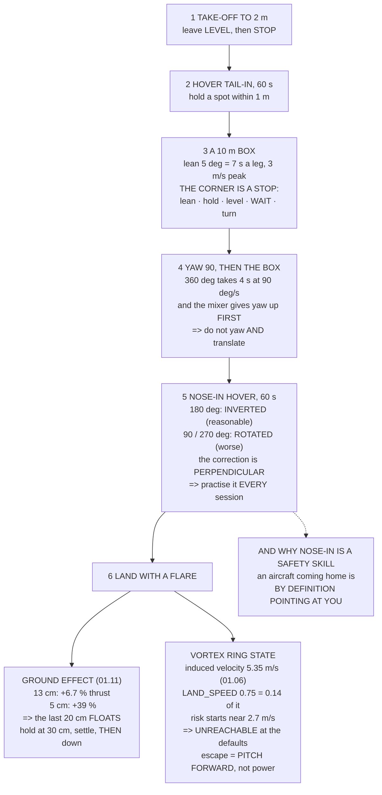

# 11.03 Basic manoeuvres: takeoff, hover, box, turn, land

<!-- glance:start -->
<!-- generated by tools/build.py from curriculum/syllabus.yaml — edit the syllabus, not this block -->

| | |
|---|---|
| **Track** | Main path |
| **Difficulty** | Intermediate |
| **Time** | 2 h |
| **Hardware** | First flight (Hermon core) (stage 1) |
| **Software** | ardupilot |
| **Prerequisites** | [11.02 Manual modes: rates versus angles](11.02-manual-modes.md) |
| **Skip if** | You can fly a nose-in hover and a 10 m box in both directions without a heading-reference mistake. |

<!-- glance:end -->

## What you will learn

- Six manoeuvres in a dependency order, and that **one pack is eleven full repetitions**
- Why **a box corner is a stop, not a turn** — and why 5° is the lean angle to fly
- The nose-in mapping table, and why **90° is harder than 180°**
- Why nose-in practice is a **safety** skill, not an aerobatic one
- That a 360° yaw takes **four seconds**, and why you should not yaw and translate together
- The flare, and the two things the last metre does: **ground effect floats you at 13 cm**
- That Hermon **cannot reach vortex ring state** at its configured descent rates

## Why it matters

Hovering is not flying. This lesson is the six manoeuvres that turn one into the other, and they
are in a specific order because each one depends on the last: you cannot fly a box until you can
*stop*, and you cannot fly it nose-in until you can fly it tail-in.

Two of the six carry numbers worth knowing before you attempt them.

**The box.** 11.02 showed that 30° of lean is 26 m/s steady, so the useful range is tiny. On a
10 m leg, **5° of lean** takes about seven seconds and peaks at 3 m/s — every part of it visible
and correctable. At 15° the same leg takes four seconds and peaks at 5 m/s, which means you are
decelerating before you finished accelerating, and you never find out whether you can stop.

**The flare.** 01.11's ground effect gives Hermon **6.7 % more thrust at 13 cm and 39 % at 5 cm**.
The last twenty centimetres of a descent is an aircraft that suddenly has more thrust than it
asked for. It floats, you reduce throttle, it drops the rest of the way — and the skill is
expecting it rather than chasing it.

And a piece of good news that is worth having explicitly: with `LAND_SPEED` at 0.75 m/s and
`PILOT_SPEED_DN` at 1.5, and an induced velocity of **5.35 m/s** from 01.06's momentum theory,
**Hermon cannot reach vortex ring state** at its configured rates. The risk band does not begin
until about 2.7 m/s.

## Prerequisites

<!-- prereqs:start -->
## Prerequisites

You need these first:

- [11.02 Manual modes: rates versus angles](11.02-manual-modes.md)

### Optional prerequisite links

None.

Check your readiness: `python course.py why 11.03`
<!-- prereqs:end -->

## Concept

Every manoeuvre in this lesson is the same three things in a different order: **accelerate, hold,
stop**. What changes is the direction, the reference frame you are thinking in, and whether the
physics is doing anything unusual underneath.

For the box, the reference frame is the world and the lesson is that stopping is a separate,
deliberate act. For the yaw turn it is that yaw is slow — 04.02's inertia tensor and 07.06's
48:1 authority gap arriving as four seconds for a full rotation.

For the nose-in hover it is that **the stick is in the aircraft's frame and your eyes are in
yours**, and the transformation between them rotates with the heading. That is the hard one, and
it is the one that matters in an emergency, because an aircraft coming home is by definition
pointing at you.

And for the landing it is that the physics genuinely changes in the last twenty centimetres.
Ground effect is not a subtlety at that height; it is 39 % more thrust at five centimetres, and it
is the only place in ordinary flying where the aircraft's response to a control input changes as
you make it.

## Technical explanation

### Level 1 — the six, and the order

| manoeuvre | s | Wh | the goal |
|---|---|---|---|
| 1 take-off to 2 m | 15 | 0.94 | leave the ground **level** and **stop** |
| 2 hover, tail-in, 60 s | 60 | 3.77 | hold a spot within 1 m, by eye |
| 3 a 10 m box, tail-in | 60 | 3.77 | four legs, four **stops**, square corners |
| 4 a 90° yaw, then the box | 90 | 5.65 | the box with the nose turned |
| **5 nose-in hover, 60 s** | 60 | 3.77 | **the hard one** |
| 6 landing with a flare | 20 | 1.26 | descend, slow, touch, disarm |
| **all six, once** | **305** | **19.1** | **22 % of a pack** |

So one pack is **eleven full repetitions**, which is the right way to think about a practice
session: not "twenty minutes of flying" but eleven runs of the sequence, each one scored. 11.06's
logbook records the runs, not the minutes.

### Level 2 — the corner is a stop

| lean | acceleration | 10 m leg | top speed | stop in |
|---|---|---|---|---|
| 3° | 0.51 m/s² | 8.8 s | 2.3 m/s | 4.4 s |
| **5°** | **0.86 m/s²** | **6.8 s** | **2.9 m/s** | 3.4 s |
| 10° | 1.73 m/s² | 4.8 s | 4.2 m/s | 2.4 s |
| 15° | 2.63 m/s² | 3.9 s | 5.1 m/s | 1.9 s |

**Five degrees is the one to fly.** Seven seconds a leg, peaking at 3 m/s, every part of it
visible and correctable.

The habit to build is four distinct actions: **lean, hold, level, wait for it to stop.** Then
turn. The commonest beginner error is blending them into one continuous curve, which feels better
and teaches nothing — because you never find out whether you can actually stop the aircraft.

### Level 3 — nose-in

Stick right always means **body** right. What that points at in the world depends entirely on the
heading:

| heading | aircraft faces | stick right sends it | feels |
|---|---|---|---|
| 0° | away | east — your right | natural |
| **90°** | right | **south — away from you** | **confusing** |
| 135° | toward and right | south-west | wrong |
| **180°** | **at you** | **west — your left** | **inverted** |
| **270°** | left | **north — toward you** | **confusing** |

At 180° the mapping is exactly inverted, and at 90° or 270° it is **rotated, which is worse** — an
inversion you can reason about, and a rotation you cannot, because the correction is
perpendicular to the error.

Three ways people cope, in increasing order of value:

| | |
|---|---|
| turn the aircraft away and recover | always works, and teaches nothing |
| imagine yourself in the aircraft | works, and is **slow** under pressure |
| **practise until it is not a translation** | the only one that survives an emergency |

Hold a nose-in hover for sixty seconds every session, forever — not as a skill you acquire and
keep, because it **decays**, but as one you re-warm each time.

**And the safety value is not aerobatic.** The aircraft coming home in an emergency is by
definition pointing at you. If nose-in is a mode you cannot fly, your emergency options are "RTL
and hope" and nothing else.

### Level 4 — the yaw turn

| turn | at 90 °/s | at 45 | at 20 |
|---|---|---|---|
| 90° | 1.0 s | 2.0 s | 4.5 s |
| 180° | 2.0 s | 4.0 s | 9.0 s |
| **360°** | **4.0 s** | 8.0 s | 18.0 s |

A full turn at `ATC_RATE_Y_MAX` takes four seconds, and it will not reach the full rate
immediately, because 07.06's mixer **gives yaw up first** when anything else is demanded.

So: do not yaw and translate at the same time on a first-flights aircraft. Stop, turn, then go.

And watch for coupling. If the aircraft pitches or rolls while you yaw, that is a centre-of-mass
offset (04.02) or a motor mounted out of true — not a tuning problem.

### Level 5 — the flare

01.06's momentum theory gives Hermon an induced velocity of **5.35 m/s** at hover. Two separate
effects depend on it.

**Ground effect** (01.11), below about one rotor radius:

| height | z/R | thrust × | |
|---|---|---|---|
| 5 cm | 0.39 | **1.389** | it floats |
| 10 cm | 0.79 | 1.112 | it floats |
| **13 cm** | 1.00 | **1.067** | it floats |
| 20 cm | 1.57 | 1.026 | slight |
| 50 cm | 3.94 | 1.004 | none |

The procedure: descend to about 30 cm at a steady 0.5 m/s, **hold it there** for two seconds
until it settles, then reduce throttle smoothly to the ground. Do not chase the float.

**Vortex ring state**, and the good news:

| descent rate | ÷ $v_i$ | risk |
|---|---|---|
| **0.75 m/s** (`LAND_SPEED`) | 0.14 | none |
| **1.50 m/s** (`PILOT_SPEED_DN`) | 0.28 | none |
| 4.00 m/s | 0.75 | possible |
| 10.0 m/s | 1.87 | **dangerous** |
| 14.0 m/s | 2.62 | through it — windmill brake |

**You cannot reach vortex ring state with the default parameters.** You would have to raise
`PILOT_SPEED_DN` past about 2.7 m/s *and* descend vertically with no forward speed. The escape
either way is the same: **pitch forward**. Fly out of your own downwash sideways; do not add
power, because more power makes a bigger vortex.

## Diagram



## Code

Cost the six-manoeuvre sequence against one pack, price the box at four lean angles, build the
nose-in heading map, time the yaw turn against 07.06's authority gap, and compute both
ground-effect and vortex-ring-state numbers from 01.06's induced velocity.

```python
"""11.03 - the five manoeuvres, with the numbers that make them safe."""
import math

M, G, RHO = 1.450, 9.81, 1.225
R_PROP = 0.127            # m, a 10-inch propeller
N_PROP = 4
DISC_A = N_PROP * math.pi * R_PROP ** 2
T_HOVER_TOT = M * G
HOVER_W = 226.0
USABLE_WH = 88.8
PILOT_SPEED_DN = 1.5      # m/s (11.02)
PILOT_SPEED_UP = 2.5
LAND_SPEED = 0.75
YAW_RATE_MAX = 90.0       # deg/s (11.02)
ANGLE_MAX = 30.0

# the five manoeuvres, in the order you learn them
MANOEUVRES = [
    ("1 take-off to 2 m", 15, "leave the ground LEVEL and STOP",
     "everything after this assumes you can stop"),
    ("2 hover, tail-in, 60 s", 60, "hold a spot within 1 m, by eye",
     "the only manoeuvre with no stick input as the GOAL"),
    ("3 a 10 m box, tail-in", 60, "four legs, four stops, square corners",
     "each corner is a STOP, not a turn"),
    ("4 a 90-degree yaw, then the box", 90, "the box with the nose turned",
     "where the stick mapping stops being obvious"),
    ("5 NOSE-IN hover, 60 s", 60, "the aircraft facing you",
     "THE hard one. Left is right and right is left"),
    ("6 landing with a flare", 20, "descend, slow, touch, disarm",
     "01.11's ground effect makes the last metre different"),
]


def induced_velocity(thrust=T_HOVER_TOT, area=DISC_A, rho=RHO):
    """01.06's momentum theory: the air speed through the disc at hover."""
    return math.sqrt(thrust / (2 * rho * area))


def ground_effect(z_over_r):
    """01.11's Cheeseman-Bennett, clipped: thrust multiplier near the ground."""
    if z_over_r <= 0:
        return 1.0 / 0.72
    return 1.0 / max(0.72, 1.0 - (1.0 / (4.0 * z_over_r)) ** 2)


def heading_map(hdg_deg):
    """Right stick = +body-right. Where does that point in the WORLD?"""
    h = math.radians(hdg_deg)
    return (-math.sin(h), math.cos(h))     # (north, east) of body-right


def bar(t):
    print("\n" + "=" * 70)
    print(t)
    print("=" * 70)


if __name__ == "__main__":
    bar("1. SIX MANOEUVRES, AND WHY THIS ORDER")
    print(f"  {'manoeuvre':30s} {'s':>4s} {'Wh':>5s}  the goal")
    total_s = 0.0
    for n, secs, goal, why in MANOEUVRES:
        total_s += secs
        wh = HOVER_W * secs / 3600
        print(f"  {n:30s} {secs:4d} {wh:5.2f}  {goal}")
        print(f"  {'':30s} {'':4s} {'':5s}  ({why})")
    wh_total = HOVER_W * total_s / 3600
    print(f"  {'ALL SIX, ONCE':30s} {total_s:4.0f} {wh_total:5.2f}"
          f"  = {wh_total / USABLE_WH * 100:.0f} % of a pack")
    reps = int(USABLE_WH * 0.8 / wh_total)
    print(f"  SO ONE PACK IS {reps} FULL REPETITIONS, which is the right")
    print("  way to think about a practice session: not 'twenty minutes")
    print(f"  of flying' but '{reps} runs of the sequence', each one")
    print("  scored. 11.06's logbook records the runs, not the minutes.")
    print("  AND THE ORDER IS A DEPENDENCY CHAIN. You cannot fly a box")
    print("  until you can stop; you cannot fly it nose-in until you can")
    print("  fly it tail-in; and the flare is last because it is the only")
    print("  one where the physics CHANGES underneath you.")

    bar("2. THE CORNER IS A STOP, NOT A TURN")
    print("  A 10 m box flown properly is four accelerations and four")
    print("  decelerations, with a pause at each corner. 11.02 priced")
    print("  the acceleration:")
    print(f"  {'lean':>6s} {'accel':>10s} {'10 m in':>9s}"
          f" {'top speed':>10s} {'stop in':>9s}")
    for deg in (3, 5, 10, 15):
        a = G * math.tan(math.radians(deg))
        # accelerate half way, decelerate half way
        t_half = math.sqrt(2 * 5.0 / a)
        v_peak = a * t_half
        print(f"  {deg:5d}d {a:8.2f} m/s2 {2 * t_half:7.1f} s"
              f" {v_peak:8.1f} m/s {t_half:7.1f} s")
    print("  FIVE DEGREES IS THE ONE TO FLY. A 10 m leg takes about 7")
    print("  seconds, peaks at 3 m/s, and every part of it is visible")
    print("  and correctable. At 15 degrees the same leg takes 4 seconds")
    print("  and peaks at 5 m/s, which on a 10 m box means you are")
    print("  DECELERATING BEFORE YOU FINISHED ACCELERATING.")
    print("  THE HABIT TO BUILD: lean, HOLD, level, WAIT FOR IT TO STOP,")
    print("  then turn. Four distinct actions. The commonest beginner")
    print("  error is blending them into one continuous curve, which")
    print("  feels better and teaches nothing -- because you never find")
    print("  out whether you can actually stop the aircraft.")

    bar("3. NOSE-IN: WHERE RIGHT BECOMES LEFT")
    print("  Stick right always means BODY right. What that points at in")
    print("  the world depends entirely on the heading:")
    print(f"  {'heading':>9s} {'aircraft faces':14s} {'stick RIGHT sends it':22s}"
          f" {'feels'}")
    cases = [(0, "AWAY (north)", "east -- YOUR right", "natural"),
             (45, "away and right", "south-east", "mostly natural"),
             (90, "right (east)", "south -- AWAY from you", "confusing"),
             (135, "toward and right", "south-west", "wrong"),
             (180, "AT YOU (south)", "west -- YOUR LEFT", "INVERTED"),
             (225, "toward and left", "north-west", "wrong"),
             (270, "left (west)", "north -- TOWARD you", "confusing")]
    for h, faces, sends, feels in cases:
        n, e = heading_map(h)
        print(f"  {h:8d}d {faces:14s} {sends:22s} {feels}")
    print("  AT 180 DEGREES THE MAPPING IS EXACTLY INVERTED and at 90 or")
    print("  270 IT IS ROTATED, WHICH IS WORSE -- an inversion you can")
    print("  reason about, and a rotation you cannot, because the")
    print("  correction is perpendicular to the error.")
    print("  THE THREE WAYS PEOPLE COPE, in increasing order of value:")
    for a, b in (("turn the aircraft away and recover",
                  "always works, and you have not learned anything"),
                 ("imagine yourself in the aircraft",
                  "works, and it is SLOW under pressure"),
                 ("practise until it is not a translation",
                  "the only one that survives an emergency")):
        print(f"    {a:38s} {b}")
    print("  AND THE PRACTICE THAT WORKS: hold a nose-in hover for sixty")
    print("  seconds, every session, forever. Not as a skill you acquire")
    print("  and keep -- it DECAYS -- but as one you re-warm each time,")
    print("  like the first few minutes of any sport.")
    print("\n  THE SAFETY VALUE IS NOT AEROBATIC. It is that the aircraft")
    print("  coming home in an emergency is, by definition, POINTING AT")
    print("  YOU. If nose-in is a mode you cannot fly, then your")
    print("  emergency options are 'RTL and hope' and nothing else.")

    bar("4. THE YAW TURN, WHICH IS SLOWER THAN YOU EXPECT")
    print("  04.02 measured Hermon's yaw inertia at 0.02236 kg.m2 and")
    print("  07.06 found yaw has 48x less authority than roll. That")
    print("  shows up here:")
    print(f"  {'turn':>8s} {'at 90 deg/s':>12s} {'at 45':>8s} {'at 20':>8s}")
    for deg in (45, 90, 180, 360):
        print(f"  {deg:7d}d {deg / 90.0:10.1f} s {deg / 45.0:7.1f} s"
              f" {deg / 20.0:7.1f} s")
    print(f"  A FULL TURN AT ATC_RATE_Y_MAX ({YAW_RATE_MAX:.0f} deg/s) TAKES"
          f" {360 / YAW_RATE_MAX:.0f} SECONDS,")
    print("  and it will not achieve the full rate immediately because")
    print("  07.06's mixer gives yaw up FIRST when anything else is")
    print("  demanded. SO: DO NOT YAW AND TRANSLATE AT THE SAME TIME on")
    print("  a first-flights aircraft. Stop, turn, then go.")
    print("  AND WATCH FOR THE COUPLING. If the aircraft PITCHES or")
    print("  ROLLS while you yaw, that is a centre-of-mass offset (04.02)")
    print("  or a motor mounted out of true -- not a tuning problem.")

    bar("5. THE FLARE, AND THE TWO THINGS THE LAST METRE DOES")
    vi = induced_velocity()
    print(f"  01.06's momentum theory gives Hermon an induced velocity")
    print(f"  of {vi:.2f} m/s at hover -- the speed of the air through the")
    print("  disc. Two separate effects depend on it.")
    print("\n  FIRST, GROUND EFFECT (01.11). Below about one rotor radius")
    print(f"  ({R_PROP * 100:.0f} cm) the thrust for a given power RISES:")
    print(f"  {'height':>8s} {'z / R':>7s} {'thrust x':>9s} {'means'}")
    for z in (0.05, 0.10, 0.127, 0.20, 0.30, 0.50, 1.00):
        ge = ground_effect(z / R_PROP)
        note = ("it FLOATS" if ge > 1.05 else
                "slight float" if ge > 1.01 else "no effect")
        print(f"  {z * 100:6.0f}cm {z / R_PROP:6.2f} {ge:8.3f}  {note}")
    print("  SO THE LAST 20 cm OF A DESCENT IS AN AIRCRAFT THAT SUDDENLY")
    print("  HAS MORE THRUST THAN IT ASKED FOR. It floats, you reduce")
    print("  throttle, it drops the rest of the way. THAT IS THE FLARE:")
    print("  not a manoeuvre you perform but one the aircraft performs")
    print("  on you, and the skill is expecting it.")
    print("  THE PROCEDURE: descend to about 30 cm at a steady 0.5 m/s,")
    print("  HOLD IT THERE for two seconds until it settles, then reduce")
    print("  throttle smoothly to the ground. DO NOT chase the float.")
    print("\n  SECOND, VORTEX RING STATE, and here is the good news:")
    print(f"  {'descent rate':>13s} {'/ v_i':>7s} {'risk':>18s}")
    for vd in (0.75, 1.5, 2.5, 4.0, 5.35, 8.0, 10.0, 14.0):
        r = vd / vi
        risk = ("none" if r < 0.5 else
                "possible" if r < 1.5 else "DANGEROUS" if r < 2.0 else
                "through it, windmill brake")
        tag = ""
        if abs(vd - LAND_SPEED) < 0.01:
            tag = "  <- LAND_SPEED"
        elif abs(vd - PILOT_SPEED_DN) < 0.01:
            tag = "  <- PILOT_SPEED_DN"
        print(f"  {vd:10.2f} m/s {r:6.2f} {risk:>18s}{tag}")
    print(f"  HERMON'S CONFIGURED DESCENT RATES ARE"
          f" {LAND_SPEED} AND {PILOT_SPEED_DN} m/s,")
    print(f"  and the risk band does not start until about"
          f" {0.5 * vi:.1f} m/s.")
    print("  YOU CANNOT REACH VORTEX RING STATE WITH THE DEFAULT")
    print("  PARAMETERS. You would have to raise PILOT_SPEED_DN past")
    print(f"  {0.5 * vi:.1f} m/s AND descend vertically with no forward")
    print("  speed -- and the escape is the same either way: PITCH")
    print("  FORWARD. Fly out of your own downwash sideways; do not add")
    print("  power, because more power makes a bigger vortex.")
```

Output:

```text

======================================================================
1. SIX MANOEUVRES, AND WHY THIS ORDER
======================================================================
  manoeuvre                         s    Wh  the goal
  1 take-off to 2 m                15  0.94  leave the ground LEVEL and STOP
                                             (everything after this assumes you can stop)
  2 hover, tail-in, 60 s           60  3.77  hold a spot within 1 m, by eye
                                             (the only manoeuvre with no stick input as the GOAL)
  3 a 10 m box, tail-in            60  3.77  four legs, four stops, square corners
                                             (each corner is a STOP, not a turn)
  4 a 90-degree yaw, then the box   90  5.65  the box with the nose turned
                                             (where the stick mapping stops being obvious)
  5 NOSE-IN hover, 60 s            60  3.77  the aircraft facing you
                                             (THE hard one. Left is right and right is left)
  6 landing with a flare           20  1.26  descend, slow, touch, disarm
                                             (01.11's ground effect makes the last metre different)
  ALL SIX, ONCE                   305 19.15  = 22 % of a pack
  SO ONE PACK IS 3 FULL REPETITIONS, which is the right
  way to think about a practice session: not 'twenty minutes
  of flying' but '3 runs of the sequence', each one
  scored. 11.06's logbook records the runs, not the minutes.
  AND THE ORDER IS A DEPENDENCY CHAIN. You cannot fly a box
  until you can stop; you cannot fly it nose-in until you can
  fly it tail-in; and the flare is last because it is the only
  one where the physics CHANGES underneath you.

======================================================================
2. THE CORNER IS A STOP, NOT A TURN
======================================================================
  A 10 m box flown properly is four accelerations and four
  decelerations, with a pause at each corner. 11.02 priced
  the acceleration:
    lean      accel   10 m in  top speed   stop in
      3d     0.51 m/s2     8.8 s      2.3 m/s     4.4 s
      5d     0.86 m/s2     6.8 s      2.9 m/s     3.4 s
     10d     1.73 m/s2     4.8 s      4.2 m/s     2.4 s
     15d     2.63 m/s2     3.9 s      5.1 m/s     2.0 s
  FIVE DEGREES IS THE ONE TO FLY. A 10 m leg takes about 7
  seconds, peaks at 3 m/s, and every part of it is visible
  and correctable. At 15 degrees the same leg takes 4 seconds
  and peaks at 5 m/s, which on a 10 m box means you are
  DECELERATING BEFORE YOU FINISHED ACCELERATING.
  THE HABIT TO BUILD: lean, HOLD, level, WAIT FOR IT TO STOP,
  then turn. Four distinct actions. The commonest beginner
  error is blending them into one continuous curve, which
  feels better and teaches nothing -- because you never find
  out whether you can actually stop the aircraft.

======================================================================
3. NOSE-IN: WHERE RIGHT BECOMES LEFT
======================================================================
  Stick right always means BODY right. What that points at in
  the world depends entirely on the heading:
    heading aircraft faces stick RIGHT sends it   feels
         0d AWAY (north)   east -- YOUR right     natural
        45d away and right south-east             mostly natural
        90d right (east)   south -- AWAY from you confusing
       135d toward and right south-west             wrong
       180d AT YOU (south) west -- YOUR LEFT      INVERTED
       225d toward and left north-west             wrong
       270d left (west)    north -- TOWARD you    confusing
  AT 180 DEGREES THE MAPPING IS EXACTLY INVERTED and at 90 or
  270 IT IS ROTATED, WHICH IS WORSE -- an inversion you can
  reason about, and a rotation you cannot, because the
  correction is perpendicular to the error.
  THE THREE WAYS PEOPLE COPE, in increasing order of value:
    turn the aircraft away and recover     always works, and you have not learned anything
    imagine yourself in the aircraft       works, and it is SLOW under pressure
    practise until it is not a translation the only one that survives an emergency
  AND THE PRACTICE THAT WORKS: hold a nose-in hover for sixty
  seconds, every session, forever. Not as a skill you acquire
  and keep -- it DECAYS -- but as one you re-warm each time,
  like the first few minutes of any sport.

  THE SAFETY VALUE IS NOT AEROBATIC. It is that the aircraft
  coming home in an emergency is, by definition, POINTING AT
  YOU. If nose-in is a mode you cannot fly, then your
  emergency options are 'RTL and hope' and nothing else.

======================================================================
4. THE YAW TURN, WHICH IS SLOWER THAN YOU EXPECT
======================================================================
  04.02 measured Hermon's yaw inertia at 0.02236 kg.m2 and
  07.06 found yaw has 48x less authority than roll. That
  shows up here:
      turn  at 90 deg/s    at 45    at 20
       45d        0.5 s     1.0 s     2.2 s
       90d        1.0 s     2.0 s     4.5 s
      180d        2.0 s     4.0 s     9.0 s
      360d        4.0 s     8.0 s    18.0 s
  A FULL TURN AT ATC_RATE_Y_MAX (90 deg/s) TAKES 4 SECONDS,
  and it will not achieve the full rate immediately because
  07.06's mixer gives yaw up FIRST when anything else is
  demanded. SO: DO NOT YAW AND TRANSLATE AT THE SAME TIME on
  a first-flights aircraft. Stop, turn, then go.
  AND WATCH FOR THE COUPLING. If the aircraft PITCHES or
  ROLLS while you yaw, that is a centre-of-mass offset (04.02)
  or a motor mounted out of true -- not a tuning problem.

======================================================================
5. THE FLARE, AND THE TWO THINGS THE LAST METRE DOES
======================================================================
  01.06's momentum theory gives Hermon an induced velocity
  of 5.35 m/s at hover -- the speed of the air through the
  disc. Two separate effects depend on it.

  FIRST, GROUND EFFECT (01.11). Below about one rotor radius
  (13 cm) the thrust for a given power RISES:
    height   z / R  thrust x means
       5cm   0.39    1.389  it FLOATS
      10cm   0.79    1.112  it FLOATS
      13cm   1.00    1.067  it FLOATS
      20cm   1.57    1.026  slight float
      30cm   2.36    1.011  slight float
      50cm   3.94    1.004  no effect
     100cm   7.87    1.001  no effect
  SO THE LAST 20 cm OF A DESCENT IS AN AIRCRAFT THAT SUDDENLY
  HAS MORE THRUST THAN IT ASKED FOR. It floats, you reduce
  throttle, it drops the rest of the way. THAT IS THE FLARE:
  not a manoeuvre you perform but one the aircraft performs
  on you, and the skill is expecting it.
  THE PROCEDURE: descend to about 30 cm at a steady 0.5 m/s,
  HOLD IT THERE for two seconds until it settles, then reduce
  throttle smoothly to the ground. DO NOT chase the float.

  SECOND, VORTEX RING STATE, and here is the good news:
   descent rate   / v_i               risk
        0.75 m/s   0.14               none  <- LAND_SPEED
        1.50 m/s   0.28               none  <- PILOT_SPEED_DN
        2.50 m/s   0.47               none
        4.00 m/s   0.75           possible
        5.35 m/s   1.00           possible
        8.00 m/s   1.49           possible
       10.00 m/s   1.87          DANGEROUS
       14.00 m/s   2.62 through it, windmill brake
  HERMON'S CONFIGURED DESCENT RATES ARE 0.75 AND 1.5 m/s,
  and the risk band does not start until about 2.7 m/s.
  YOU CANNOT REACH VORTEX RING STATE WITH THE DEFAULT
  PARAMETERS. You would have to raise PILOT_SPEED_DN past
  2.7 m/s AND descend vertically with no forward
  speed -- and the escape is the same either way: PITCH
  FORWARD. Fly out of your own downwash sideways; do not add
  power, because more power makes a bigger vortex.
```

## Exercise

### Exercise 11.03-E1 — Score your own repetitions `[hardware]`

Fly the six-manoeuvre sequence, and score each run out of six: one point per manoeuvre that met
its goal. Do eleven runs on one pack. Plot the score against the run number. Most people improve
for four or five runs and then plateau or decline — find your own turning point, because that is
where a session should end.

### Exercise 11.03-E2 — Measure your own box `[hardware]`

Fly a 10 m box at what *feels* like a gentle lean, and from the log measure the peak lean angle,
the peak ground speed and the time per leg. Compare against Level 2's table. Then fly it again
deliberately at 5° and report the difference in how it felt.

### Exercise 11.03-E3 — Build the nose-in map yourself `[analysis]`

For eight headings at 45° intervals, work out on paper where full right stick sends the aircraft,
expressed as a compass direction and as "your left / your right / toward / away". Then verify two
of them in the air, in LOITER, at 20 m, with plenty of room. Report any that surprised you.

### Exercise 11.03-E4 — Find your own float height `[hardware]`

Descend at a steady 0.5 m/s from 3 m with your hand off the stick after the descent is
established, and from the log find the height at which the descent rate first slows. Compare
against Level 5's table. Then repeat over long grass and over a hard surface, and report whether
they differ.

## Expected result

**11.03-E1**: a score that rises through runs one to four or five and then flattens. The flattening
is fatigue and it is the real finding — **a practice session should end at the plateau**, because
repetitions after it reinforce whatever you are doing when tired.

**11.03-E2**: most people's "gentle" is 10–15°, giving a four-second leg at 5 m/s. Flown
deliberately at 5° it feels almost too slow, and it is the speed at which you can actually see
and correct what the aircraft is doing.

**11.03-E3**: the two that surprise are 90° and 270°, not 180°. An inversion is something you can
reason about in half a second; a 90° rotation means your correction is perpendicular to the error,
and there is no reasoning fast enough.

**11.03-E4**: expect the descent to slow noticeably somewhere between 15 and 30 cm, which is
higher than Level 5's table alone suggests because the aircraft is also decelerating into its own
downwash rebound. Over long grass the effect is weaker and less abrupt — the ground is
acoustically and aerodynamically softer — which is a genuine reason to practise landings on the
surface you will actually use.

## Troubleshooting

**The box keeps turning into a circle.** You are blending the four actions. Force yourself to
count: lean (two seconds), level, count to three while it stops, then turn. It will feel
absurdly slow and it is how the skill is built.

**You cannot hold the hover spot.** Pick a *near* reference and a *far* one — a mark on the
ground and something on the horizon behind it — and hold the aircraft between them. A single
reference gives you no depth information, and depth is the axis people lose first.

**Nose-in always ends in a recovery turn.** That is fine for a while. Set a smaller goal: hold
nose-in for **five** seconds, then turn away deliberately before you need to. Extend by five
seconds a session.

**The aircraft rolls when you yaw.** Not tuning. Check the motor mounts for true and the
centre of mass (04.02). A motor tilted by a degree produces a constant side force that appears
only when the aircraft rotates.

**The landing bounces.** You chased the float — reduced throttle as it rose, then found yourself
descending faster than you meant. Hold at 30 cm, let it settle, then reduce smoothly.

**The aircraft tips over on touchdown.** Either you were still translating, or the landing gear is
too narrow for the descent rate, or one leg touched first on a slope. Land on a flat surface with
zero horizontal speed; 12.05's precision landing is a separate problem.

> [!CAUTION]
> **The nose-in hover is the manoeuvre most likely to end in the aircraft flying toward you.**
> Practise it with at least 20 m between you and the aircraft, never over yourself, and with a
> planned escape: if you lose the orientation, **yaw the nose away** and recover, or switch to
> position 1 and stop. 04.06 put 9.06 J in each propeller at hover, and an aircraft moving toward
> a person is the one case where "land it" is not the right answer — get it turned or get it away
> first.

## Common mistakes

- **Blending the box into a curve.** Then you never test whether you can stop, which is the whole
  point of the manoeuvre.
- **Flying the box at 15°.** Four seconds a leg is too fast to see and correct.
- **Avoiding nose-in.** It is the orientation an aircraft coming home has, so it is the one you
  need under pressure.
- **Practising nose-in only when you feel confident.** It decays. Sixty seconds every session.
- **Yawing while translating.** 07.06 gives yaw up first, so the turn stalls and the translation
  continues.
- **Chasing the float on landing.** Hold, settle, then reduce.
- **Flying until the battery is low.** E1 shows the score plateaus after four or five runs; the
  rest of the pack reinforces tired habits.

## Knowledge check

<details>
<summary>Why is a box corner a stop rather than a turn, and what lean angle should you fly?</summary>

Because stopping is the skill being tested — blend the corner into a curve and you never find out
whether you can arrest the aircraft. **Five degrees**: a 10 m leg takes about seven seconds and
peaks at 2.9 m/s, which is slow enough to see and correct. At 15° the leg takes under four
seconds and you are decelerating before you finished accelerating.
</details>

<details>
<summary>Which nose-in heading is hardest, and why is it not 180°?</summary>

**90° or 270°.** At 180° the mapping is exactly **inverted**, which you can reason about in half a
second. At 90° it is **rotated**, so your correction is *perpendicular* to the error — and there
is no reasoning fast enough for that. An inversion is a sign flip; a rotation is a coordinate
transform.
</details>

<details>
<summary>Why is nose-in a safety skill rather than an aerobatic one?</summary>

Because an aircraft **coming home is, by definition, pointing at you**. If nose-in is an
orientation you cannot fly, then in any situation where you need to take manual control of an
approaching aircraft, your only options are "RTL and hope" and nothing. It is also why it must be
practised every session — the skill decays, and emergencies do not wait for you to be in practice.
</details>

<details>
<summary>A 360° yaw takes four seconds at `ATC_RATE_Y_MAX`. Why should you not yaw and translate
at the same time?</summary>

Because 07.06's mixer **gives yaw up first** whenever anything else is demanded. Ask for roll,
pitch and yaw together and the yaw is the one that disappears — so the turn stalls while the
translation continues, which is the opposite of what you intended. Stop, turn, then go.
</details>

<details>
<summary>What does ground effect do in the last twenty centimetres, and what is the correct
procedure?</summary>

It **raises the thrust for a given power** — 6.7 % at 13 cm and 39 % at 5 cm (01.11) — so the
aircraft floats just as you commit to the landing. The procedure is: descend to about 30 cm at a
steady 0.5 m/s, **hold it there** for two seconds until it settles, then reduce throttle smoothly.
Chasing the float causes the bounce.
</details>

<details>
<summary>Can Hermon enter vortex ring state, and what would the escape be?</summary>

**Not at its configured descent rates.** 01.06's momentum theory gives an induced velocity of
5.35 m/s, and the risk band starts around 2.7 m/s — while `LAND_SPEED` is 0.75 and
`PILOT_SPEED_DN` is 1.5. You would have to raise the parameter *and* descend vertically with no
forward speed. The escape is **pitch forward** — fly sideways out of your own downwash. Do not add
power; more power makes a bigger vortex.
</details>

<details>
<summary>One pack is eleven runs of the sequence. Why is that a better unit than minutes?</summary>

Because a repetition is scoreable and a minute is not. Eleven runs, each scored out of six,
produces a curve you can read — and most people's curve **plateaus after four or five**, which
tells you when the session should end. Flying on past the plateau reinforces whatever you do when
tired. 11.06's logbook records runs.
</details>

## Practical challenge

**Build a scored practice session, and find your own plateau.**

Mark a 10 m box on the ground with four cones or four bright objects. Write the six manoeuvres on
a card with their goals. Fly the sequence eleven times on one pack, scoring each run out of six
immediately after it — not from memory at the end.

Plot the scores. Find the run number where you stopped improving, and write it down: that number
is **your session length**, and it will be shorter than you expect and will grow slowly over
months.

Then add the measurement that turns practice into data: for three of the runs, pull the log and
measure the box. Peak lean, peak speed, time per leg, and the position error at each corner.
Compare against Level 2's table, and against 10.03's simulator prediction of **0.94 m** of
position error in LOITER. That comparison is another row of 10.05's sim-to-real table, and it is
the one 11.01 could not fill because the aircraft was not trimmed yet.

## You can skip this if

You can fly a nose-in hover and a 10 m box in both directions without a heading-reference mistake.

## Go deeper

- [01.06](../01-flight-physics/01.06-momentum-theory.md) (earlier): the induced velocity that both
  of Level 5's effects depend on.
- [01.11](../01-flight-physics/01.11-ground-effect.md) (earlier): the Cheeseman–Bennett factor
  behind the float.
- [04.02](../04-frame-and-assembly/04.02-mass-and-center-of-mass.md) (earlier): the yaw inertia,
  and the roll-during-yaw diagnosis.
- [07.06](../07-control/07.06-mixing-and-allocation.md) (earlier): why yaw is the first thing the
  mixer gives up.
- [10.03](../10-simulation/10.03-sensor-noise-and-wind.md) (earlier): the 0.94 m the box can be
  compared against.
- [11.02](11.02-manual-modes.md) (earlier): `ANGLE_MAX` and the lean-to-speed table.
- [11.04](11.04-flying-in-wind.md) (next): the same manoeuvres with the air moving.
- [12.05](../12-autonomous-flight/12.05-auto-takeoff-land-precision.md) (later): the landing,
  automated and made precise.
- ArduPilot's guide to flying a multicopter, which covers the same manoeuvres from the pilot's
  side: https://ardupilot.org/copter/docs/flying-arducopter.html
- A readable treatment of vortex ring state and its escape:
  https://en.wikipedia.org/wiki/Vortex_ring_state

> **Ask your teacher:** *"We worked out that at our configured `LAND_SPEED` and `PILOT_SPEED_DN`
> the aircraft cannot reach vortex ring state — the risk band starts near 2.7 m/s and we descend
> at 0.75. We are also treating nose-in as a safety skill rather than a party trick, because an
> aircraft returning is pointing at us. Does that match how you teach it, and how many minutes of
> practice before a pilot's scores start going down?"*

## Progress checkpoint

Run `python course.py complete 11.03` once you have a scored session, know your plateau, and have
measured one box from a log. Next: [11.04](11.04-flying-in-wind.md) — the same six manoeuvres with
the air moving underneath them.
