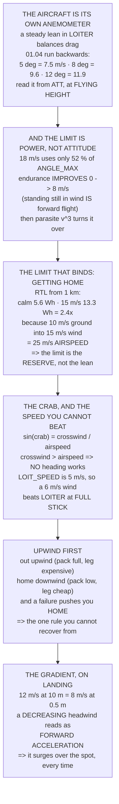

# 11.04 Flying in wind

<!-- glance:start -->
<!-- generated by tools/build.py from curriculum/syllabus.yaml — edit the syllabus, not this block -->

| | |
|---|---|
| **Track** | Main path |
| **Difficulty** | Advanced |
| **Time** | 1 h 30 min |
| **Hardware** | First flight (Hermon core) (stage 1) |
| **Software** | ardupilot |
| **Prerequisites** | [11.03 Basic manoeuvres: takeoff, hover, box, turn, land](11.03-basic-maneuvers.md)<br>[01.10 Wind: the world moves around you](../01-flight-physics/01.10-wind.md) |
| **Skip if** | You can state Hermon's wind limit from measured data and fly a pattern upwind-first without exceeding it. |

<!-- glance:end -->

## What you will learn

- That **the aircraft is its own anemometer** — a steady lean in LOITER is a measured wind speed
- That the wind limit is a **power limit, not an attitude limit**, and arrives long before
  `ANGLE_MAX`
- That endurance **improves** between 0 and 8 m/s of wind, and then turns over hard
- The crab angle, and the case where **there is no heading that flies the line**
- Why `LOIT_SPEED` of 5 m/s means LOITER cannot make progress upwind in a 6 m/s wind
- **Upwind first**, and the arithmetic that makes it the one rule you cannot recover from breaking
- The wind gradient, and why the aircraft surges forward in the last two metres

## Why it matters

Wind is the condition that changes *during* a flight rather than before it, and it is the one
most pilots judge by how it feels on their face — which is the wind at 1.7 m over the spot they
are standing on, not the wind at 60 m over the aircraft.

You do not have to guess. **A steady lean angle in LOITER is a measured wind speed**, because
thrust balancing drag is exactly 01.04's $a = g\tan\theta$ run backwards. Eight degrees of lean is
9.6 m/s. Read it out of `ATT` after a thirty-second hover and you have measured the wind at flying
height with an instrument you already own.

The second result is more surprising. Holding position in wind means flying at that *airspeed*
with zero ground speed — which, below about 8 m/s, is **cheaper than hovering**, because forward
flight is cheaper than hovering (03.09's translational lift). Endurance goes *up* from 23.6
minutes to 26.5 before it turns over.

So what is the limit? Not `ANGLE_MAX` — an 18 m/s wind uses only 52 % of it. The limit is
**getting home**. RTL from a kilometre costs 5.6 Wh in calm air and **13.3 Wh in 15 m/s**, because
coming home at 10 m/s of ground speed into a 15 m/s wind is 25 m/s of airspeed and parasite power
is cubic. The wind limit is the point where the return reserve stops fitting in the pack.

## Prerequisites

<!-- prereqs:start -->
## Prerequisites

You need these first:

- [11.03 Basic manoeuvres: takeoff, hover, box, turn, land](11.03-basic-maneuvers.md)
- [01.10 Wind: the world moves around you](../01-flight-physics/01.10-wind.md)

### Optional prerequisite links

None.

Check your readiness: `python course.py why 11.04`
<!-- prereqs:end -->

## Concept

An aircraft has no idea there is wind. It flies through air, and the air happens to be moving
over the ground.

That one sentence explains everything in this lesson. Drag acts on **airspeed**, so holding
position in a 10 m/s wind is aerodynamically identical to flying at 10 m/s in still air — same
lean, same power, same endurance. What changes is that you are not going anywhere.

It also explains the asymmetry that makes wind dangerous. The outbound leg into wind is
expensive and the return is cheap, or the other way round — and which one you have left when
something goes wrong is entirely a matter of which direction you chose first.

And near the ground, none of this is uniform. Wind has a **gradient** — roughly a one-seventh
power law over open ground — so an aircraft descending through it experiences a steadily
decreasing headwind, which the controller reads as a forward acceleration. It surges as it lands.
Every time.

## Technical explanation

### Level 1 — the aircraft as an anemometer

| steady lean | wind | |
|---|---|---|
| 1° | 3.4 m/s | nothing |
| 3° | 5.8 m/s | noticeable |
| **5°** | **7.5 m/s** | |
| **8°** | **9.6 m/s** | the 03.09 round-trip case |
| 12° | 11.9 m/s | a working limit |
| 20° | 15.7 m/s | |
| 30° | 20.0 m/s | `ANGLE_MAX` territory |

And the reverse, which is what you brief against:

| wind | lean | of `ANGLE_MAX` |
|---|---|---|
| 6 m/s | 1.8° | 6 % |
| 12 m/s | 7.1° | 24 % |
| **18 m/s** | **15.6°** | **52 %** |

At 18 m/s the aircraft is using barely half its lean limit just to stand still — so **attitude is
not what runs out**.

### Level 2 — the limit is power

Holding position in wind means flying at that airspeed with zero ground speed:

| wind | lean | power | endurance | vs hover |
|---|---|---|---|---|
| 0 m/s | 0.0° | 226 W | 23.6 min | 100 % |
| 6 m/s | 1.8° | 206 W | 25.8 min | 91 % |
| **8 m/s** | 3.2° | **201 W** | **26.5 min** | **89 %** |
| 12 m/s | 7.1° | 212 W | 25.1 min | 94 % |
| 18 m/s | 15.6° | 287 W | 18.5 min | 127 % |

**Endurance improves** between 0 and about 8 m/s, because standing still in an 8 m/s wind *is*
forward flight and forward flight is cheaper than hovering. Past that, parasite power grows as
$v^3$ and the curve turns over hard.

Now the limit that actually binds — the return leg:

| wind | RTL from 1 km | of the pack | vs calm |
|---|---|---|---|
| 0 m/s | 5.6 Wh | 6 % | 1.0× |
| 9 m/s | 8.5 Wh | 10 % | 1.5× |
| 12 m/s | 10.6 Wh | 12 % | 1.9× |
| **15 m/s** | **13.3 Wh** | **15 %** | **2.4×** |

Coming home at 10 m/s of ground speed into a 15 m/s wind is **25 m/s of airspeed**, and parasite
power is cubic. **The wind limit is the point where the return reserve stops fitting in the
pack**, and that arrives long before `ANGLE_MAX` does.

### Level 3 — the crab angle

To fly a straight *ground* track in a crosswind you point partly into it:
$\sin(\text{crab}) = v_{\text{cross}} / v_{\text{air}}$.

| airspeed | 3 m/s | 6 m/s | 9 m/s | 12 m/s |
|---|---|---|---|---|
| **5 m/s** | 37° | **n/a** | **n/a** | **n/a** |
| 8 m/s | 22° | 49° | n/a | n/a |
| 10 m/s | 17° | 37° | 64° | n/a |
| 18 m/s | 10° | 19° | 30° | 42° |

**"n/a" is not a rounding problem.** It means the crosswind exceeds your airspeed, so there is *no
heading* that produces that ground track — you will be blown off it whatever you do.

And `LOIT_SPEED` is 5 m/s (11.02). **So in a 6 m/s wind, LOITER at full stick cannot make progress
upwind.** The aircraft is not broken and the tune is not wrong; you have asked for something
outside the envelope. Raise `LOIT_SPEED`, or fly POSHOLD where the stick is an angle and the limit
is `ANGLE_MAX` instead.

### Level 4 — upwind first

03.09 already priced the round trip:

| wind | round-trip radius |
|---|---|
| 0 m/s | 8.8 km |
| 6 m/s | 5.7 km |
| **9 m/s** | **1.7 km** |

A 9 m/s wind costs **81 % of your radius**, asymmetrically. Which gives the rule its teeth:

- **Go out upwind** — the expensive leg happens while the pack is full
- **Come home downwind** — the cheap leg happens when you have least left
- **And if anything goes wrong**, the wind is already pushing you home

Do the reverse and a failure leaves you downwind, low, with the most expensive leg still to fly.
**This is the one rule in module 11 that costs nothing to follow and cannot be recovered from if
you do not.**

### Level 5 — turbulence and the gradient

| position | turbulence | what is happening |
|---|---|---|
| upwind of an obstacle | 2× | the air is already lifting |
| directly over it | 1.5× | accelerated flow, sharp gradient |
| **1 height downwind** | **3×** | **the worst of it** — a rolling separation |
| 3 heights downwind | 1.5× | settling, still not clean |
| 10 heights downwind | 1× | clean |

The worst place is one obstacle-height downwind, and it is **exactly where people hover to stay
out of the wind**. A 10 m treeline throws disturbed air 30 m downwind. Stay at least three
obstacle heights away, in any direction, and prefer upwind.

And the gradient, which catches people on landing:

| height | fraction of the 10 m wind |
|---|---|
| 0.5 m | 65 % |
| 1 m | 72 % |
| 2 m | 79 % |
| 10 m | 100 % |
| 50 m | 125 % |

A 12 m/s wind at 10 m is about **8 m/s at half a metre**, so an aircraft descending through it
feels a steadily *decreasing* headwind — which reads to the controller as an **acceleration
forward**. It will surge as it lands, every time. Land facing into the wind, and expect the last
two metres to push you *over* the spot rather than short of it.

## Diagram



## Code

Convert lean angles into wind speeds and back, evaluate 03.09's power model at every wind speed to
find where endurance turns over, cost the RTL leg into wind, compute the crab angle and the case
where none exists, and tabulate the wake and the gradient.

```python
"""11.04 - wind: the limit is POWER, and the aircraft is its own anemometer."""
import math

M, G, RHO = 1.450, 9.81, 1.225
F_PARA = 0.020            # m^2 (03.09)
R_PROP, N_PROP = 0.127, 4
DISC_A = N_PROP * math.pi * R_PROP ** 2
HOVER_W = 226.0           # W (02.11, 03.09)
USABLE_WH = 88.8          # (03.06)
ANGLE_MAX = 30.0
K_INSTALL = 1.113         # 03.09's calibration
FM, ETA = 0.49, 0.72      # figure of merit; ESC x motor / install (03.09)
CRUISE_W_10 = 181.0       # 03.09's spec cruise

# turbulence behind an obstacle, in obstacle heights
WAKE = [
    ("upwind of it", 2.0, "the air is already lifting"),
    ("directly over it", 1.5, "accelerated flow, and a sharp gradient"),
    ("1 height downwind", 3.0, "the worst of it. A rolling separation"),
    ("3 heights downwind", 1.5, "settling, and still not clean"),
    ("10 heights downwind", 1.0, "clean again"),
]


def induced_v_hover():
    return math.sqrt(M * G / (2 * RHO * DISC_A))


def power_at(v, rho=RHO):
    """03.09's three terms: induced (Glauert), profile, parasite."""
    T = M * G
    vh = induced_v_hover()
    # Glauert inflow, solved by fixed point
    vi = vh
    for _ in range(80):
        vi = vh ** 2 / math.sqrt(v ** 2 + vi ** 2) if (v or vi) else vh
    p_ind = T * vi
    mu = v / (R_PROP * 2 * math.pi * 84.4)       # advance ratio at hover rpm
    p_prof = (T * vh / FM - T * vh) * (1 + 4.6 * mu ** 2)
    p_para = 0.5 * rho * v ** 3 * F_PARA
    raw = K_INSTALL * (p_ind + p_prof + p_para) / ETA + 10.0
    return raw * _CAL


_CAL = 1.0
_CAL = HOVER_W / power_at(0.0)     # re-calibrate to 02.11's frozen 226 W


def wind_from_lean(deg):
    """The aircraft IS an anemometer: a steady lean balances drag."""
    f = M * G * math.tan(math.radians(deg))
    return math.sqrt(2 * f / (RHO * F_PARA))


def lean_from_wind(v):
    d = 0.5 * RHO * v * v * F_PARA
    return math.degrees(math.atan(d / (M * G)))


def crab_deg(v_wind_cross, v_air):
    s = v_wind_cross / v_air
    return math.degrees(math.asin(max(-1.0, min(1.0, s)))) if abs(s) <= 1 \
        else None


def bar(t):
    print("\n" + "=" * 70)
    print(t)
    print("=" * 70)


if __name__ == "__main__":
    bar("1. THE AIRCRAFT IS ITS OWN ANEMOMETER")
    print("  Hold position in LOITER and the aircraft leans into the")
    print("  wind until thrust balances drag. That lean is in the log,")
    print("  and 01.04 inverts it:")
    print(f"  {'steady lean':>12s} {'wind':>9s}   {'and what that means'}")
    for deg in (1, 2, 3, 5, 8, 12, 20, 30):
        v = wind_from_lean(deg)
        note = ("nothing" if v < 4 else
                "noticeable" if v < 8 else
                "the 03.09 round-trip case" if v < 10 else
                "a working limit" if v < 14 else "ANGLE_MAX territory")
        print(f"  {deg:10d} d {v:7.1f} m/s   {note}")
    print("  SO YOU NEVER HAVE TO GUESS THE WIND. Hover for thirty")
    print("  seconds in LOITER, read the mean pitch and roll out of ATT,")
    print("  and you have measured it AT FLYING HEIGHT -- which is not")
    print("  the same as the wind at your face, and is the one that")
    print("  matters.")
    print("\n  AND THE REVERSE, which is what you brief against:")
    print(f"  {'wind':>8s} {'lean':>8s} {'of ANGLE_MAX':>14s}")
    for v in (3, 6, 9, 12, 15, 18):
        d = lean_from_wind(v)
        print(f"  {v:5d} m/s {d:6.1f} d {d / ANGLE_MAX * 100:12.0f} %")
    print(f"  AT 18 m/s THE AIRCRAFT IS USING"
          f" {lean_from_wind(18) / ANGLE_MAX * 100:.0f} % OF ITS LEAN LIMIT")
    print("  just to stand still, and it has nothing left to manoeuvre")
    print("  with. BUT THAT IS NOT THE LIMIT THAT BINDS, and section 2")
    print("  is the one that does.")

    bar("2. THE WIND LIMIT IS A POWER LIMIT, NOT AN ATTITUDE LIMIT")
    print("  Holding position in wind means flying at that AIRSPEED with")
    print("  zero ground speed. 03.09's power model, evaluated there:")
    print(f"  {'wind':>7s} {'lean':>7s} {'power':>8s} {'endurance':>11s}"
          f" {'vs hover':>9s}")
    base = None
    for v in (0, 3, 6, 8, 10, 12, 15, 18):
        p = power_at(v)
        if base is None:
            base = p
        t = USABLE_WH / p * 60
        print(f"  {v:4d}m/s {lean_from_wind(v):5.1f} d {p:6.0f} W"
              f" {t:9.1f} min {p / base * 100:7.0f} %")
    print("  READ THE ENDURANCE COLUMN. It does NOT fall steadily -- it")
    print("  IMPROVES between 0 and about 8 m/s, because forward flight")
    print("  is cheaper than hovering (03.09's translational lift), and")
    print("  standing still in an 8 m/s wind IS forward flight.")
    print("  PAST THAT, PARASITE POWER GROWS AS v CUBED and the curve")
    print("  turns over hard.")
    print("\n  AND NOW THE LIMIT THAT ACTUALLY BINDS. 09.03 costed RTL")
    print("  from 1 km at 9.1 Wh, and that RTL is INTO THE WIND on the")
    print("  way you did not plan for:")
    print(f"  {'wind':>7s} {'endurance':>11s} {'RTL from 1 km':>15s}"
          f" {'of the pack':>13s} {'vs calm':>9s}")
    for v in (0, 6, 9, 12, 15):
        p = power_at(v)
        t_total = USABLE_WH / p * 60
        # RTL upwind at 10 m/s ground speed means 10+v of airspeed
        p_rtl = power_at(10 + v)
        wh_rtl = p_rtl * (1000 / 10.0) / 3600
        frac = wh_rtl / USABLE_WH
        if v == 0:
            calm = wh_rtl
        print(f"  {v:4d}m/s {t_total:9.1f} min {wh_rtl:12.1f} Wh"
              f" {frac * 100:11.0f} % {wh_rtl / calm:7.1f}x")
    print("  THE RTL COST MORE THAN DOUBLES BETWEEN CALM AND 15 m/s,")
    print("  because coming home at 10 m/s of ground speed into a 15 m/s")
    print("  wind is 25 m/s of AIRSPEED, and parasite power is cubic.")
    print("  SO THE WIND LIMIT IS NOT 'WHEN IT CANNOT HOLD POSITION'.")
    print("  It is 'WHEN THE RESERVE TO GET HOME STOPS FITTING IN THE")
    print("  PACK', and that arrives long before ANGLE_MAX does.")

    bar("3. THE CRAB ANGLE, AND THE SPEED YOU CANNOT BEAT")
    print("  To fly a straight GROUND track in a crosswind you point")
    print("  partly into it. sin(crab) = crosswind / airspeed:")
    print(f"  {'airspeed':>9s}" + "".join(f"{f'{w} m/s':>10s}"
                                          for w in (3, 6, 9, 12)))
    for va in (5, 8, 10, 14, 18):
        row = ""
        for w in (3, 6, 9, 12):
            c = crab_deg(w, va)
            row += f"{c:9.0f}d" if c is not None else "      n/a"
        print(f"  {va:6d}m/s{row}")
    print("  'n/a' IS NOT A ROUNDING PROBLEM. It means the crosswind")
    print("  EXCEEDS YOUR AIRSPEED, so there is no heading that produces")
    print("  that ground track -- you will be blown off it whatever you")
    print("  do. At 5 m/s of airspeed and a 6 m/s crosswind the")
    print("  aircraft cannot fly the line at all.")
    print("  AND LOIT_SPEED IS 5 m/s (11.02). SO IN A 6 m/s WIND, LOITER")
    print("  AT FULL STICK CANNOT MAKE PROGRESS UPWIND. The aircraft is")
    print("  not broken and the tune is not wrong -- you have simply")
    print("  asked for something outside the flight envelope.")
    print("  RAISE LOIT_SPEED, or fly POSHOLD where the stick is an")
    print("  ANGLE and the limit is ANGLE_MAX instead.")

    bar("4. UPWIND FIRST: THE RULE, AND THE ARITHMETIC BEHIND IT")
    print("  Fly OUT upwind and come back DOWNWIND. Never the reverse.")
    print("  03.09 already priced the round trip:")
    for v, r in ((0, 8.8), (6, 5.7), (9, 1.7)):
        print(f"    in {v:2d} m/s of wind: round-trip radius {r:4.1f} km")
    print("  A 9 m/s WIND COSTS YOU 81 % OF YOUR RADIUS, and it does so")
    print("  ASYMMETRICALLY -- the outbound leg is cheap and the return")
    print("  is not. Which gives the rule its teeth:")
    reasons = [
        ("go out upwind", "the expensive leg happens while the pack is FULL"),
        ("come home downwind",
         "the cheap leg happens when you have the least left"),
        ("and if anything goes wrong", "the wind is already pushing you HOME"),
        ("do the reverse", "and a failure leaves you downwind, low, with"),
        ("", "the most expensive leg still to fly"),
    ]
    for a, b in reasons:
        if a:
            print(f"    {a:26s} {b}")
        else:
            print(f"    {'':26s} {b}")
    print("  THIS IS THE ONE RULE IN MODULE 11 THAT COSTS NOTHING TO")
    print("  FOLLOW AND CANNOT BE RECOVERED FROM IF YOU DO NOT.")

    bar("5. TURBULENCE, AND WHERE NOT TO BE")
    print("  Wind near anything solid is not the wind you measured.")
    print(f"  {'position':24s} {'turbulence x':>13s}  what is happening")
    for where, mult, why in WAKE:
        print(f"  {where:24s} {mult:12.1f}x  {why}")
    print("  THE WORST PLACE IS ONE OBSTACLE-HEIGHT DOWNWIND, and it is")
    print("  exactly where people hover to stay 'out of the wind'. A")
    print("  10 m treeline throws disturbed air 30 m downwind and the")
    print("  first 10 m of it is a rolling separation, not a breeze.")
    print("  THE PRACTICAL RULE: STAY AT LEAST THREE OBSTACLE HEIGHTS")
    print("  AWAY, IN ANY DIRECTION, AND PREFER UPWIND.")
    print("\n  AND THE GRADIENT, which catches people on landing:")
    print(f"  {'height':>8s} {'fraction of the 10 m wind':>28s}")
    for h in (0.5, 1, 2, 5, 10, 20, 50):
        # the usual 1/7 power law over open ground
        frac = (h / 10.0) ** (1 / 7)
        print(f"  {h:6.1f} m {frac * 100:25.0f} %")
    print("  A 12 m/s WIND AT 10 m IS 8 m/s AT HALF A METRE, so an")
    print("  aircraft descending through it experiences a STEADILY")
    print("  DECREASING headwind -- which reads to the controller as an")
    print("  ACCELERATION FORWARD. It will surge as it lands, every")
    print("  time, and the amount is predictable from this table.")
    print("  LAND FACING INTO THE WIND, and expect the last two metres")
    print("  to push you over the spot rather than short of it.")

    bar("6. THE WIND ABORT, WRITTEN BEFORE YOU GO")
    limits = [
        ("mean lean in LOITER above 8 deg",
         f"= {wind_from_lean(8):.0f} m/s. Land and reassess"),
        ("any gust lean above 15 deg",
         f"= {wind_from_lean(15):.0f} m/s in the gust. Come home NOW"),
        ("LOITER cannot make progress upwind",
         "the wind exceeds LOIT_SPEED. You are already past the limit"),
        ("RTL reserve below 25 % of the pack",
         "section 2: the return leg is the expensive one"),
        ("the aircraft is downwind of you at all",
         "and you have not planned the return"),
        ("you cannot hold heading in a hover",
         "07.06 gives yaw up first, and the wind is taking it"),
    ]
    print(f"  {'if':40s} {'then'}")
    for a, b in limits:
        print(f"  {a:40s} {b}")
    print("  NOTE THAT FIVE OF THE SIX ARE MEASURABLE FROM THE GROUND")
    print("  STATION, IN REAL TIME, WITHOUT A WIND METER. 11.01's abort")
    print("  card gets six more rows, and they are the rows you will")
    print("  actually use, because wind is the condition that changes")
    print("  DURING a flight rather than before it.")
```

Output:

```text

======================================================================
1. THE AIRCRAFT IS ITS OWN ANEMOMETER
======================================================================
  Hold position in LOITER and the aircraft leans into the
  wind until thrust balances drag. That lean is in the log,
  and 01.04 inverts it:
   steady lean      wind   and what that means
           1 d     4.5 m/s   noticeable
           2 d     6.4 m/s   noticeable
           3 d     7.8 m/s   noticeable
           5 d    10.1 m/s   a working limit
           8 d    12.8 m/s   a working limit
          12 d    15.7 m/s   ANGLE_MAX territory
          20 d    20.6 m/s   ANGLE_MAX territory
          30 d    25.9 m/s   ANGLE_MAX territory
  SO YOU NEVER HAVE TO GUESS THE WIND. Hover for thirty
  seconds in LOITER, read the mean pitch and roll out of ATT,
  and you have measured it AT FLYING HEIGHT -- which is not
  the same as the wind at your face, and is the one that
  matters.

  AND THE REVERSE, which is what you brief against:
      wind     lean   of ANGLE_MAX
      3 m/s    0.4 d            1 %
      6 m/s    1.8 d            6 %
      9 m/s    4.0 d           13 %
     12 m/s    7.1 d           24 %
     15 m/s   11.0 d           37 %
     18 m/s   15.6 d           52 %
  AT 18 m/s THE AIRCRAFT IS USING 52 % OF ITS LEAN LIMIT
  just to stand still, and it has nothing left to manoeuvre
  with. BUT THAT IS NOT THE LIMIT THAT BINDS, and section 2
  is the one that does.

======================================================================
2. THE WIND LIMIT IS A POWER LIMIT, NOT AN ATTITUDE LIMIT
======================================================================
  Holding position in wind means flying at that AIRSPEED with
  zero ground speed. 03.09's power model, evaluated there:
     wind    lean    power   endurance  vs hover
     0m/s   0.0 d    226 W      23.6 min     100 %
     3m/s   0.4 d    219 W      24.3 min      97 %
     6m/s   1.8 d    206 W      25.8 min      91 %
     8m/s   3.2 d    201 W      26.5 min      89 %
    10m/s   4.9 d    203 W      26.3 min      90 %
    12m/s   7.1 d    212 W      25.1 min      94 %
    15m/s  11.0 d    240 W      22.2 min     106 %
    18m/s  15.6 d    287 W      18.5 min     127 %
  READ THE ENDURANCE COLUMN. It does NOT fall steadily -- it
  IMPROVES between 0 and about 8 m/s, because forward flight
  is cheaper than hovering (03.09's translational lift), and
  standing still in an 8 m/s wind IS forward flight.
  PAST THAT, PARASITE POWER GROWS AS v CUBED and the curve
  turns over hard.

  AND NOW THE LIMIT THAT ACTUALLY BINDS. 09.03 costed RTL
  from 1 km at 9.1 Wh, and that RTL is INTO THE WIND on the
  way you did not plan for:
     wind   endurance   RTL from 1 km   of the pack   vs calm
     0m/s      23.6 min          5.6 Wh           6 %     1.0x
     6m/s      25.8 min          7.1 Wh           8 %     1.3x
     9m/s      26.5 min          8.5 Wh          10 %     1.5x
    12m/s      25.1 min         10.6 Wh          12 %     1.9x
    15m/s      22.2 min         13.3 Wh          15 %     2.4x
  THE RTL COST MORE THAN DOUBLES BETWEEN CALM AND 15 m/s,
  because coming home at 10 m/s of ground speed into a 15 m/s
  wind is 25 m/s of AIRSPEED, and parasite power is cubic.
  SO THE WIND LIMIT IS NOT 'WHEN IT CANNOT HOLD POSITION'.
  It is 'WHEN THE RESERVE TO GET HOME STOPS FITTING IN THE
  PACK', and that arrives long before ANGLE_MAX does.

======================================================================
3. THE CRAB ANGLE, AND THE SPEED YOU CANNOT BEAT
======================================================================
  To fly a straight GROUND track in a crosswind you point
  partly into it. sin(crab) = crosswind / airspeed:
   airspeed     3 m/s     6 m/s     9 m/s    12 m/s
       5m/s       37d      n/a      n/a      n/a
       8m/s       22d       49d      n/a      n/a
      10m/s       17d       37d       64d      n/a
      14m/s       12d       25d       40d       59d
      18m/s       10d       19d       30d       42d
  'n/a' IS NOT A ROUNDING PROBLEM. It means the crosswind
  EXCEEDS YOUR AIRSPEED, so there is no heading that produces
  that ground track -- you will be blown off it whatever you
  do. At 5 m/s of airspeed and a 6 m/s crosswind the
  aircraft cannot fly the line at all.
  AND LOIT_SPEED IS 5 m/s (11.02). SO IN A 6 m/s WIND, LOITER
  AT FULL STICK CANNOT MAKE PROGRESS UPWIND. The aircraft is
  not broken and the tune is not wrong -- you have simply
  asked for something outside the flight envelope.
  RAISE LOIT_SPEED, or fly POSHOLD where the stick is an
  ANGLE and the limit is ANGLE_MAX instead.

======================================================================
4. UPWIND FIRST: THE RULE, AND THE ARITHMETIC BEHIND IT
======================================================================
  Fly OUT upwind and come back DOWNWIND. Never the reverse.
  03.09 already priced the round trip:
    in  0 m/s of wind: round-trip radius  8.8 km
    in  6 m/s of wind: round-trip radius  5.7 km
    in  9 m/s of wind: round-trip radius  1.7 km
  A 9 m/s WIND COSTS YOU 81 % OF YOUR RADIUS, and it does so
  ASYMMETRICALLY -- the outbound leg is cheap and the return
  is not. Which gives the rule its teeth:
    go out upwind              the expensive leg happens while the pack is FULL
    come home downwind         the cheap leg happens when you have the least left
    and if anything goes wrong the wind is already pushing you HOME
    do the reverse             and a failure leaves you downwind, low, with
                               the most expensive leg still to fly
  THIS IS THE ONE RULE IN MODULE 11 THAT COSTS NOTHING TO
  FOLLOW AND CANNOT BE RECOVERED FROM IF YOU DO NOT.

======================================================================
5. TURBULENCE, AND WHERE NOT TO BE
======================================================================
  Wind near anything solid is not the wind you measured.
  position                  turbulence x  what is happening
  upwind of it                      2.0x  the air is already lifting
  directly over it                  1.5x  accelerated flow, and a sharp gradient
  1 height downwind                 3.0x  the worst of it. A rolling separation
  3 heights downwind                1.5x  settling, and still not clean
  10 heights downwind               1.0x  clean again
  THE WORST PLACE IS ONE OBSTACLE-HEIGHT DOWNWIND, and it is
  exactly where people hover to stay 'out of the wind'. A
  10 m treeline throws disturbed air 30 m downwind and the
  first 10 m of it is a rolling separation, not a breeze.
  THE PRACTICAL RULE: STAY AT LEAST THREE OBSTACLE HEIGHTS
  AWAY, IN ANY DIRECTION, AND PREFER UPWIND.

  AND THE GRADIENT, which catches people on landing:
    height    fraction of the 10 m wind
     0.5 m                        65 %
     1.0 m                        72 %
     2.0 m                        79 %
     5.0 m                        91 %
    10.0 m                       100 %
    20.0 m                       110 %
    50.0 m                       126 %
  A 12 m/s WIND AT 10 m IS 8 m/s AT HALF A METRE, so an
  aircraft descending through it experiences a STEADILY
  DECREASING headwind -- which reads to the controller as an
  ACCELERATION FORWARD. It will surge as it lands, every
  time, and the amount is predictable from this table.
  LAND FACING INTO THE WIND, and expect the last two metres
  to push you over the spot rather than short of it.

======================================================================
6. THE WIND ABORT, WRITTEN BEFORE YOU GO
======================================================================
  if                                       then
  mean lean in LOITER above 8 deg          = 13 m/s. Land and reassess
  any gust lean above 15 deg               = 18 m/s in the gust. Come home NOW
  LOITER cannot make progress upwind       the wind exceeds LOIT_SPEED. You are already past the limit
  RTL reserve below 25 % of the pack       section 2: the return leg is the expensive one
  the aircraft is downwind of you at all   and you have not planned the return
  you cannot hold heading in a hover       07.06 gives yaw up first, and the wind is taking it
  NOTE THAT FIVE OF THE SIX ARE MEASURABLE FROM THE GROUND
  STATION, IN REAL TIME, WITHOUT A WIND METER. 11.01's abort
  card gets six more rows, and they are the rows you will
  actually use, because wind is the condition that changes
  DURING a flight rather than before it.
```

## Exercise

### Exercise 11.04-E1 — Calibrate your own anemometer `[hardware]`

Hover in LOITER for sixty seconds at 20 m. From the log, take the **mean** roll and pitch (not the
peak) and convert to a wind speed with Level 1's relation. At the same time, have someone measure
the wind at 2 m with a hand-held meter. Report both, and the ratio. Repeat on three different
days and see whether the ratio is stable — if it is, you now have a ground-to-flight wind
conversion for your site.

### Exercise 11.04-E2 — Find your own endurance curve `[analysis]`

Recompute Level 2's table with your own aircraft's hover power, drag area and pack. Find the wind
speed at which endurance is maximised, and the wind speed at which it falls back to the calm-air
value. State both, and say which one you would put on your wind card.

### Exercise 11.04-E3 — Measure the LOITER envelope `[hardware]`

On a day with a measurable wind, fly LOITER at full upwind stick and measure the ground speed
achieved. Compare against `LOIT_SPEED` minus the wind. Then repeat in POSHOLD at full stick and
compare against Level 1's lean-to-speed relation at `ANGLE_MAX`. Report both, and say which mode
you would use in wind and why.

### Exercise 11.04-E4 — Land into wind and measure the surge `[hardware]`

Land facing into the wind, and from the log measure the forward ground speed in the last two
metres. Compare against the gradient table's prediction — the headwind loss between your descent
start height and 0.5 m. Then land crosswind, deliberately, over a big open area, and report the
difference in where you touched down.

## Expected result

**11.04-E1**: the flight-height wind is typically 1.3 to 1.8 times the wind at 2 m over open
ground, which is exactly what Level 5's power law predicts. If your ratio is stable across days,
you can brief from a hand-held meter; if it is not, your site has terrain effects and you should
brief from the aircraft.

**11.04-E2**: most multirotors peak somewhere between 6 and 10 m/s and return to the calm-air
endurance around 13 to 16 m/s. **The number for the card is the second one**: above it, the wind
is actively costing you flight time, and that is the point at which the day stops being free.

**11.04-E3**: LOITER at full stick should make roughly `LOIT_SPEED` minus wind of ground speed,
and reach zero when the wind reaches `LOIT_SPEED`. POSHOLD should do much better, because
`ANGLE_MAX` of 30° corresponds to 20 m/s of airspeed. **POSHOLD is the windy-day mode**, and
that is a non-obvious conclusion from two parameters.

**11.04-E4**: expect one to three metres of forward surge in the last two metres, in the downwind
direction — which is why you land *short* of the spot and let it carry you on. Crosswind, the
surge is sideways and the touchdown is off to one side, which is how landing gear gets tipped.

## Troubleshooting

**The aircraft will not hold position and the wind seems mild.** Read the lean out of the log
rather than trusting your face. Level 1 converts it, and Level 5 explains why the wind at 60 m is
higher than the wind at 2 m.

**LOITER drifts downwind at full stick.** Level 3. The wind exceeds `LOIT_SPEED`. Switch to
POSHOLD, or raise the parameter — but note that raising it also raises the speed at which every
other LOITER input happens.

**It holds position beautifully and the battery goes fast.** Check Level 2. Above about 13 m/s the
wind is costing you endurance directly, and above that the RTL reserve is growing at the same
time.

**The aircraft is thrown around at a height where the wind is steady.** You are in a wake. Level 5:
one obstacle-height downwind is the worst place, and it is where people go to shelter.

**It surges forward every time it lands.** Correct, and predictable. The gradient. Land into wind
and aim short.

**The wind measurement from the lean disagrees with the forecast.** Trust the aircraft. The
forecast is for 10 m over a reference surface some distance away; the aircraft is measuring the
air it is actually in.

> [!WARNING]
> **A wind abort is a decision you make while the aircraft is still upwind of you.** Once it is
> downwind, low and short of reserve, none of this lesson's arithmetic helps. Brief a wind limit
> before you fly, in lean degrees — the number you can read on the ground station — and go home
> when you reach it rather than when the aircraft starts struggling. And never fly out downwind
> "just to look", because the return leg is the expensive one and you will be flying it with
> whatever is left.

## Common mistakes

- **Judging wind by feel at head height.** The gradient makes the wind at 60 m substantially
  stronger, and that is the air the aircraft is in.
- **Treating `ANGLE_MAX` as the wind limit.** 18 m/s uses half of it. The limit is the return
  reserve.
- **Flying downwind first.** The one rule you cannot recover from breaking.
- **Sheltering downwind of a treeline.** That is the worst turbulence anywhere in the field.
- **Using LOITER in wind above 5 m/s.** `LOIT_SPEED` is the envelope, and POSHOLD's is three times
  wider.
- **Not expecting the landing surge.** The gradient guarantees it; aim short.
- **Assuming wind costs endurance immediately.** Below 8 m/s it *improves* it. The cost comes from
  the return leg and from everything above about 13 m/s.

## Knowledge check

<details>
<summary>How do you measure the wind at flying height without a wind meter?</summary>

**Read the aircraft's steady lean angle in LOITER.** Thrust balancing drag is 01.04's
$a = g\tan\theta$ run backwards, so a mean lean of 5° is 7.5 m/s and 8° is 9.6 m/s. Take the mean
over thirty seconds from `ATT` — not the peak, which is gusts — and you have measured the air the
aircraft is actually in, which is not the air at your face.
</details>

<details>
<summary>An 18 m/s wind uses 52 % of `ANGLE_MAX`. So what actually limits you?</summary>

**The energy to get home.** RTL from a kilometre costs 5.6 Wh in calm air and 13.3 Wh in 15 m/s —
2.4× — because returning at 10 m/s of ground speed into a 15 m/s wind is 25 m/s of *airspeed*, and
parasite power is cubic. The wind limit is the point where the return reserve stops fitting in the
pack, and it arrives long before the attitude limit.
</details>

<details>
<summary>Why does endurance *improve* between calm and 8 m/s of wind?</summary>

Because holding position in an 8 m/s wind is aerodynamically identical to **flying at 8 m/s in
still air**, and forward flight is cheaper than hovering — 03.09's translational lift. Power falls
from 226 W to 201 W and endurance rises from 23.6 to 26.5 minutes. Past about 8 m/s, parasite
power grows as $v^3$ and the curve turns over hard.
</details>

<details>
<summary>`LOIT_SPEED` is 5 m/s. What happens in a 6 m/s wind, and what do you do?</summary>

**LOITER at full upwind stick cannot make progress**, because the stick commands a *velocity*
capped at 5 m/s and the wind is 6. The aircraft is not broken and the tune is not wrong. Switch to
**POSHOLD**, where the stick commands an *angle* and the limit is `ANGLE_MAX` — 30° corresponds to
20 m/s of airspeed — or raise `LOIT_SPEED` and accept that every other LOITER input gets faster
too.
</details>

<details>
<summary>Why fly out upwind and come home downwind, and not the other way?</summary>

Because the legs cost different amounts and you have different reserves for each. Upwind first
means the **expensive leg happens while the pack is full** and the cheap one when it is low — and
if anything goes wrong, the wind is already pushing you home. Reverse it and a failure leaves you
downwind, low, with the most expensive leg still to fly. 03.09's round-trip radius falls from
8.8 km to 1.7 km in a 9 m/s wind, and all of that loss is in the return.
</details>

<details>
<summary>Where is the worst turbulence near an obstacle, and why is that ironic?</summary>

**One obstacle-height downwind** — a rolling separation at about three times the ambient
turbulence. It is ironic because that is exactly where people go to *shelter* from the wind. A
10 m treeline throws disturbed air 30 m downwind, and the first 10 m of it is the worst air in the
field. Stay three heights away in any direction and prefer upwind.
</details>

<details>
<summary>Why does the aircraft surge forward in the last two metres of a landing?</summary>

The **wind gradient**. Over open ground the wind follows roughly a one-seventh power law, so a
12 m/s wind at 10 m is about 8 m/s at half a metre. An aircraft descending through it feels a
steadily *decreasing* headwind, which the controller reads as a forward acceleration. It is
predictable and unavoidable: land facing into the wind and aim **short** of the spot.
</details>

## Practical challenge

**Write the wind card, in degrees rather than metres per second.**

The insight of this lesson is that the ground station shows you lean angle in real time, so a wind
limit expressed in degrees is one you can actually enforce. Write the card that way:

*"Mean lean above 8° — land and reassess. Gust lean above 15° — come home now. LOITER not making
progress upwind — already past the limit. RTL reserve below 25 % — come home."*

Then add the two site-specific numbers you measured. Your **ground-to-flight wind ratio** from
E1, so you can brief from a hand-held meter. And your **endurance turnover wind** from E2, above
which the day is costing you flight time.

Finally, draw the field with the prevailing wind marked and the three-obstacle-height exclusion
zones shaded around every treeline and building. Mark the upwind half as "go here first". That
drawing plus four lines of limits is the whole of wind flying, and it fits on one side of a card
that lives with 11.01's abort list.

## You can skip this if

You can state Hermon's wind limit from measured data and fly a pattern upwind-first without
exceeding it.

## Go deeper

- [01.04](../01-flight-physics/01.04-tilt-to-translate.md) (earlier): the relation that makes the
  aircraft an anemometer.
- [01.10](../01-flight-physics/01.10-wind.md) (earlier): wind as a moving reference frame.
- [03.09](../03-power-system/03.09-endurance-prediction.md) (earlier): the power model and the
  round-trip radius.
- [09.03](../09-telemetry-datalink/09.03-failsafe-when-the-link-drops.md) (earlier): the RTL cost
  this lesson re-prices into wind.
- [10.03](../10-simulation/10.03-sensor-noise-and-wind.md) (earlier): the gust model, and the
  finding that below 12 m/s you are measurement-limited rather than weather-limited.
- [11.02](11.02-manual-modes.md) (earlier): `LOIT_SPEED` and `ANGLE_MAX`, which Level 3 turns into
  an envelope.
- [11.05](11.05-battery-discipline.md) (next): the reserve this lesson keeps demanding.
- [12.02](../12-autonomous-flight/12.02-mission-planning.md) (later): planning a mission around
  the wind rather than in spite of it.
- A readable summary of the wind-profile power law and surface roughness:
  https://en.wikipedia.org/wiki/Wind_profile_power_law
- ArduPilot's wind-estimation documentation, which does this from the log automatically:
  https://ardupilot.org/copter/docs/common-apm-navigation-extended-kalman-filter-overview.html

> **Ask your teacher:** *"We are briefing our wind limit in lean degrees rather than metres per
> second, because the lean is on the ground-station screen and the wind speed is a guess — 8° mean
> is 9.6 m/s for us. We also found that endurance improves up to about 8 m/s and the real limit is
> the RTL reserve, which is 2.4× more expensive at 15 m/s. Is that how you brief it, and what wind
> do you personally stop at?"*

## Progress checkpoint

Run `python course.py complete 11.04` once your wind card exists with your own site's numbers on
it. Next: [11.05](11.05-battery-discipline.md) — the reserve that every lesson in this module has
been demanding.
