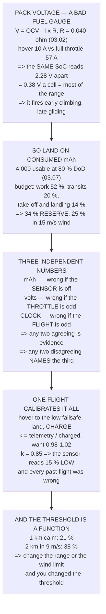

# 11.05 Battery discipline in the air

<!-- glance:start -->
<!-- generated by tools/build.py from curriculum/syllabus.yaml — edit the syllabus, not this block -->

| | |
|---|---|
| **Track** | Main path |
| **Difficulty** | Intermediate |
| **Time** | 1 h 15 min |
| **Hardware** | First flight (Hermon core) (stage 1) |
| **Software** | ardupilot |
| **Prerequisites** | [11.03 Basic manoeuvres: takeoff, hover, box, turn, land](11.03-basic-maneuvers.md)<br>[03.06 Battery monitoring: voltage, current, mAh](../03-power-system/03.06-battery-monitoring.md) |
| **Skip if** | You land Hermon on a mAh number rather than a voltage warning, and your measured hover endurance matches the budget within 15 %. |

<!-- glance:end -->

## What you will learn

- Why voltage is the wrong thing to land on: the **same state of charge reads 2.28 V differently**
  depending on the throttle
- The mAh budget as a flight plan, phase by phase, with the reserve at the end
- The **three independent numbers** — mAh, volts, clock — and what any two disagreeing tells you
- The one flight that verifies your endurance **and** calibrates your current sensor
- Why your low-battery threshold is a function of **how far you fly and in what wind**, not a
  preference
- The state-of-charge to resting-voltage conversion, and why it must be the *resting* curve

## Why it matters

Every lesson in this module has ended by demanding a reserve, and none of them has said how you
know what you have left. This one does, and it starts by disqualifying the instrument everyone
uses.

**Pack voltage is a terrible fuel gauge.** Hermon's pack is 0.040 Ω (03.02), so the reading is the
open-circuit voltage minus $I\!R$ — and the current ranges from 10 A at hover to 57 A at full
throttle. The same state of charge therefore reads **2.28 V differently** depending on what the
motors are doing, which across six cells is 0.38 V a cell: most of the useful range of the curve.

A voltage alarm fires early in a climb and late in a glide, so the pilot learns to ignore it. And
08.06's rule applies: a warning that fires when nothing is wrong is a warning that has stopped
working.

**Consumed milliamp-hours have no such problem.** They are the integral of a measured current and
do not care what the throttle was doing. So you land on a mAh number — with two cross-checks,
because 03.06 showed a sensor reading 15 % low will take you to 94 % depth of discharge while
telling you 80.

And the low-battery threshold turns out not to be a setting at all. It is a **function of your
maximum range and your maximum wind**: 21 % of the pack for a kilometre in calm air, **38 % for
two kilometres in 9 m/s**. Change either and you have changed the threshold, whether you edited
the parameter or not.

## Prerequisites

<!-- prereqs:start -->
## Prerequisites

You need these first:

- [11.03 Basic manoeuvres: takeoff, hover, box, turn, land](11.03-basic-maneuvers.md)
- [03.06 Battery monitoring: voltage, current, mAh](../03-power-system/03.06-battery-monitoring.md)

### Optional prerequisite links

None.

Check your readiness: `python course.py why 11.05`
<!-- prereqs:end -->

## Concept

There are three ways to know how much flight you have left, and each is wrong in a way the others
are not.

**Consumed mAh** is the integral of a measured current. It is the best single number, and it is
only as good as the sensor — which 03.06 showed can read 15 % low without anyone noticing.

**Pack voltage** is the chemistry, and it is honest only at rest. Under load it is contaminated by
$I\!R$, and $I$ varies by a factor of six between hover and full throttle.

**A clock** has no sensor in it at all. It is wrong only if the *flight* is unusual — a tailwind,
no payload, an unexpected climb — and it is the one people leave out.

Any two of the three agreeing is good evidence. Any two disagreeing **names the culprit**, because
each fails for a reason the other two do not share.

And behind all of it sits a budget: not "how long can it fly" but "what am I going to spend it
on", with a reserve at the end that is sized by the worst return leg you might have to fly.

## Technical explanation

### Level 1 — why not voltage

| SoC | resting | hovering | climbing | full throttle | **spread** |
|---|---|---|---|---|---|
| 100 % | 25.20 V | 24.84 V | 24.68 V | 22.92 V | **2.28 V** |
| 60 % | 22.92 V | 22.52 V | 22.35 V | 20.64 V | **2.28 V** |
| 30 % | 22.20 V | 21.79 V | 21.61 V | 19.92 V | **2.28 V** |

At *any* state of charge the reading moves by over two volts with the throttle — 0.38 V a cell,
which is most of the usable range. A voltage alarm therefore fires early in a climb and late in a
glide.

**Land on a mAh number.**

### Level 2 — the budget

5,000 mAh of pack at 80 % depth of discharge (03.07) is **4,000 mAh usable**:

| phase | s | W | Wh | mAh | cumulative |
|---|---|---|---|---|---|
| arm, spin up, lift off | 15 | 226 | 0.94 | 42 | 1 % |
| climb to 60 m | 24 | 320 | 2.13 | 96 | 3 % |
| transit 1 km out | 100 | 203 | 5.64 | 254 | 10 % |
| **work: 10 min on station** | 600 | 226 | **37.67** | 1,697 | **52 %** |
| transit 1 km home | 100 | 203 | 5.64 | 254 | 59 % |
| descend and land | 100 | 226 | 6.28 | 283 | **66 %** |
| **reserve left** | | | **30.50** | **1,374** | **34 %** |

And 11.04 said the return leg costs 2.4× more in a 15 m/s wind:

| wind | return costs | reserve becomes |
|---|---|---|
| 0 m/s | 5.64 Wh | 34 % |
| 9 m/s | 8.46 Wh | 31 % |
| 15 m/s | 13.53 Wh | **25 %** |

The plan survives 15 m/s. It does not survive 15 m/s **and** any of the other things — which is
what a reserve is for, and why the number is a reserve rather than a margin you spend when the
flight gets interesting.

### Level 3 — three numbers

| | is | wrong if |
|---|---|---|
| **consumed mAh** | the integral of a measured current | the **sensor** is miscalibrated (03.06) |
| **pack voltage** | the chemistry, loaded | the **throttle** is unusual (Level 1) |
| **a clock** | a count-up timer from arming | the **flight** is unusual |

Each fails for a reason the others do not share, so disagreement is diagnostic:

| what you see | what it means |
|---|---|
| mAh 60 %, clock 60 %, **volts 35 %** | unusual throttle, or a cell going. Land and check |
| mAh 60 %, volts 60 %, **clock 35 %** | a light flight — tailwind, no payload. Believe the pair |
| volts 60 %, clock 60 %, **mAh 35 %** | **the current sensor.** 03.06's 15 %-low case, live |
| all three say 35 % | you are at 35 %. Come home |

**The clock is the one people leave out**, and it is the only one with no sensor in it. Start a
count-up timer on the transmitter at arming, and know the number you land at.

### Level 4 — one flight calibrates everything

Fly a steady hover at a fixed height until the **low** battery failsafe fires, land, and then
**charge the pack** and read the charger's mAh:

| measurement | expected |
|---|---|
| telemetry consumed | 4,000 mAh |
| charger put back | 4,082 mAh |
| **ratio $k$** (03.06) | **0.98 – 1.02** |
| hover time to the failsafe | 23.6 min |
| 02.11 predicted | 23.6 min |

If $k$ is 0.85, your sensor reads **15 % low** and every mAh number you have ever flown to was
wrong in the dangerous direction. Fix it with `BATT_AMP_PERVLT` and re-fly the test.

If the hover time is 15 % short, that is 11.01's mass question arriving again — and
`MOT_THST_HOVER` from the same log tells you which.

### Level 5 — the threshold is a function, not a preference

| your worst case | RTL needs | so the low failsafe at |
|---|---|---|
| 0.3 km out, calm | 5.7 Wh | 16 % |
| 1.0 km out, calm | 9.6 Wh | 21 % |
| **1.0 km out, 9 m/s** | 14.4 Wh | **26 %** |
| **2.0 km out, 9 m/s** | 24.8 Wh | **38 %** |
| 3.0 km out, 15 m/s | 44.6 Wh | 60 % |

The last column is the RTL cost plus ten points for what is not in the model. **If you change
your range or your wind limit you have changed the threshold**, whether you edited the parameter
or not.

And because `BATT_LOW_VOLT` is a voltage, convert through the **resting** curve — not the loaded
one — and then verify it with Level 4's flight:

| state of charge | resting pack | per cell |
|---|---|---|
| 40 % | 22.44 V | 3.74 V |
| 30 % | 22.20 V | 3.70 V |
| 25 % | 21.99 V | 3.67 V |
| 20 % | 21.78 V | 3.63 V |

## Diagram



## Code

Model the pack's loaded voltage against state of charge and throttle, lay the flight out as a
phase-by-phase mAh budget with the reserve at the end, compare the three independent measures and
what disagreement means, price the verification flight, and derive the low-battery threshold from
range and wind.

```python
"""11.05 - land on a NUMBER, and make sure three of them agree."""
import math

CELLS = 6
CAP_MAH = 5000.0
R_PACK = 0.040            # ohm, the whole pack (03.02)
V_NOM = 3.70
V_FULL = 4.20
V_EMPTY = 3.30            # 03.06's RTL threshold, per cell
DOD = 0.80                # 03.07's policy
HOVER_W = 226.0
CRUISE_W = 203.0          # 11.04's model at 10 m/s
CLIMB_W = 320.0
USABLE_WH = 88.8

# a resting open-circuit voltage curve for a 6S LiPo, per cell (03.02) [E]
OCV = [(1.00, 4.20), (0.90, 4.05), (0.80, 3.95), (0.70, 3.88),
       (0.60, 3.82), (0.50, 3.78), (0.40, 3.74), (0.30, 3.70),
       (0.20, 3.63), (0.10, 3.50), (0.05, 3.40), (0.00, 3.20)]

# the phases of a working flight, and what each costs
PHASES = [
    ("arm, spin up, lift off", 15, HOVER_W, "and the log starts here"),
    ("climb to 60 m", 24, CLIMB_W, "2.5 m/s = PILOT_SPEED_UP"),
    ("transit 1 km out", 100, CRUISE_W, "at 10 m/s (03.09's spec cruise)"),
    ("WORK: 10 min on station", 600, HOVER_W, "the only part you wanted"),
    ("transit 1 km home", 100, CRUISE_W, "and 11.04 says this can double"),
    ("descend and land", 100, HOVER_W, "60 m at 0.75 m/s takes 80 s"),
]


def ocv_at(soc):
    for i in range(len(OCV) - 1):
        a, va = OCV[i]
        b, vb = OCV[i + 1]
        if b <= soc <= a:
            f = (soc - b) / (a - b)
            return vb + f * (va - vb)
    return OCV[-1][1]


def loaded_v(soc, current_a):
    """What the telemetry SHOWS: open circuit minus I x R."""
    return CELLS * ocv_at(soc) - current_a * R_PACK


def current_at(power_w, soc):
    """Iterate: the current depends on the voltage which depends on it."""
    i = power_w / (CELLS * V_NOM)
    for _ in range(40):
        v = loaded_v(soc, i)
        i = power_w / max(v, 1.0)
    return i


def bar(t):
    print("\n" + "=" * 70)
    print(t)
    print("=" * 70)


if __name__ == "__main__":
    bar("1. WHY VOLTAGE IS THE WRONG THING TO LAND ON")
    print("  A pack's terminal voltage is its open-circuit voltage minus")
    print(f"  I x R, and Hermon's pack is {R_PACK:.3f} ohm (03.02). So the")
    print("  SAME state of charge reads differently depending on what the")
    print("  motors are doing:")
    print(f"  {'SoC':>5s} {'resting':>9s} {'hovering':>10s} {'climbing':>10s}"
          f" {'full throttle':>14s} {'spread':>8s}")
    for soc in (1.0, 0.8, 0.6, 0.4, 0.3, 0.2):
        rest = CELLS * ocv_at(soc)
        h = loaded_v(soc, current_at(HOVER_W, soc))
        c = loaded_v(soc, current_at(CLIMB_W, soc))
        f = loaded_v(soc, 57.0)
        print(f"  {soc * 100:4.0f}% {rest:8.2f}V {h:9.2f}V {c:9.2f}V"
              f" {f:13.2f}V {rest - f:7.2f}V")
    print("  THE SPREAD COLUMN IS THE WHOLE ARGUMENT. At any state of")
    print("  charge the reading moves by over two volts depending on the")
    print("  throttle, and two volts across six cells is 0.38 V a cell --")
    print("  which is most of the useful range of the curve.")
    print("  SO A VOLTAGE ALARM FIRES EARLY IN A CLIMB AND LATE IN A")
    print("  GLIDE, and the pilot learns to ignore it. 08.06's rule")
    print("  again: a warning that fires when nothing is wrong is a")
    print("  warning that has stopped working.")
    print("\n  CONSUMED mAh HAS NO SUCH PROBLEM. It is the integral of a")
    print("  current the sensor measured, and it does not care what the")
    print("  throttle was doing. LAND ON A mAh NUMBER.")
    print("  (03.06's caveat stands: a hall sensor reading 15 % low takes")
    print("   you to 94 % DoD believing you are at 80. Section 4 is the")
    print("   cross-check that catches it.)")

    bar("2. THE mAh BUDGET, AS A FLIGHT PLAN")
    usable_mah = CAP_MAH * DOD
    print(f"  {CAP_MAH:.0f} mAh of pack, {DOD * 100:.0f} % depth of"
          f" discharge (03.07) =")
    print(f"  {usable_mah:.0f} mAh USABLE. Now spend it:")
    print(f"  {'phase':28s} {'s':>5s} {'W':>5s} {'Wh':>6s} {'mAh':>7s}"
          f" {'cumulative':>11s}")
    cum_wh = 0.0
    for n, secs, w, why in PHASES:
        wh = w * secs / 3600
        cum_wh += wh
        mah = wh / (CELLS * V_NOM) * 1000
        print(f"  {n:28s} {secs:5d} {w:5.0f} {wh:6.2f} {mah:7.0f}"
              f" {cum_wh / USABLE_WH * 100:10.0f} %")
    print(f"  {'TOTAL FLOWN':28s} {'':5s} {'':5s} {cum_wh:6.2f}"
          f" {cum_wh / (CELLS * V_NOM) * 1000:7.0f}"
          f" {cum_wh / USABLE_WH * 100:10.0f} %")
    reserve_wh = USABLE_WH - cum_wh
    print(f"  {'RESERVE LEFT':28s} {'':5s} {'':5s} {reserve_wh:6.2f}"
          f" {reserve_wh / (CELLS * V_NOM) * 1000:7.0f}"
          f" {reserve_wh / USABLE_WH * 100:10.0f} %")
    print(f"  AND 11.04 SAID THE RETURN LEG COSTS 2.4x MORE IN A 15 m/s")
    print(f"  WIND. Re-price just that one row:")
    for wind, mult in ((0, 1.0), (9, 1.5), (15, 2.4)):
        extra = CRUISE_W * 100 / 3600 * (mult - 1)
        left = reserve_wh - extra
        print(f"    in {wind:2d} m/s: return costs"
              f" {CRUISE_W * 100 / 3600 * mult:5.2f} Wh,"
              f" reserve becomes {left:5.2f} Wh"
              f" = {left / USABLE_WH * 100:3.0f} %")
    print("  THE PLAN SURVIVES 15 m/s AND IT DOES NOT SURVIVE 15 m/s AND")
    print("  ANY OF THE OTHER THINGS. That is what a reserve is for, and")
    print("  it is why the number is a RESERVE rather than a margin you")
    print("  spend when the flight is interesting.")

    bar("3. THREE INDEPENDENT NUMBERS, AND WHAT DISAGREEMENT MEANS")
    print("  Fly with three, not one. They fail in different ways:")
    three = [
        ("CONSUMED mAh", "the integral of a measured current",
         "wrong if the SENSOR is miscalibrated (03.06)"),
        ("PACK VOLTAGE", "the cell chemistry, loaded",
         "wrong if the THROTTLE is unusual. Section 1"),
        ("A CLOCK", "a count-up timer started at arming",
         "wrong if the FLIGHT is unusual -- wind, payload, climb"),
    ]
    for a, b, c in three:
        print(f"  {a:16s} is {b}")
        print(f"  {'':16s} -> {c}")
    print("  EACH ONE FAILS FOR A REASON THE OTHER TWO DO NOT SHARE, so")
    print("  any two agreeing is good evidence and any two disagreeing")
    print("  names the culprit:")
    cases = [
        ("mAh says 60 %, clock says 60 %, volts say 35 %",
         "an unusual THROTTLE, or a cell going. Land and check"),
        ("mAh says 60 %, volts say 60 %, clock says 35 %",
         "a light flight -- tailwind, no payload. Believe the pair"),
        ("volts say 60 %, clock says 60 %, mAh says 35 %",
         "THE CURRENT SENSOR. 03.06's 15 %-low case, live"),
        ("all three say 35 %", "you are at 35 %. Come home"),
    ]
    print(f"  {'what you see':48s} {'what it means'}")
    for a, b in cases:
        print(f"  {a:48s}")
        print(f"  {'':48s} {b}")
    print("  THE CLOCK IS THE ONE PEOPLE LEAVE OUT and it is the only")
    print("  one with no sensor in it at all. Start a count-up timer on")
    print("  the transmitter at arming, and know the number you land at.")

    bar("4. VERIFYING THE ENDURANCE, AND THE SENSOR")
    print("  One flight, done properly, calibrates everything. Fly a")
    print("  steady hover at a fixed height until the LOW battery")
    print("  failsafe fires, land, and then CHARGE THE PACK and read the")
    print("  charger's mAh.")
    print(f"  {'measurement':34s} {'expected':>10s}")
    tel = usable_mah
    for n, v in (("telemetry consumed mAh", f"{tel:.0f}"),
                 ("charger put back mAh", f"{tel / 0.98:.0f}"),
                 ("ratio k (03.06)", "0.98 - 1.02"),
                 ("hover time to the failsafe",
                  f"{usable_mah / (HOVER_W / (CELLS * V_NOM) * 1000) * 60:.1f} min"),
                 ("02.11 predicted", "23.6 min")):
        print(f"  {n:34s} {v:>10s}")
    print("  IF k IS 0.85 YOUR SENSOR READS 15 % LOW and every mAh number")
    print("  you have ever flown to was wrong in the dangerous direction.")
    print("  FIX IT WITH BATT_AMP_PERVLT, then re-fly the test.")
    print("  IF THE HOVER TIME IS 15 % SHORT OF THE PREDICTION, that is")
    print("  11.01's mass question arriving again -- and MOT_THST_HOVER")
    print("  from the same log will tell you which.")
    print("\n  AND THE ACCEPTANCE CRITERION FROM THE SYLLABUS: your")
    print("  MEASURED hover endurance within 15 % of the budget. The")
    print("  budget is 02.11's, the measurement is this flight's, and")
    print("  the gap -- if there is one -- is a finding, not a failure.")

    bar("5. THE THRESHOLDS, SET FROM YOUR OWN WORST CASE")
    print("  03.06 set voltage thresholds. 11.04 priced the return leg.")
    print("  Put them together and the thresholds fall out:")
    print(f"  {'your worst case':34s} {'RTL needs':>10s} {'so BATT_LOW at':>15s}")
    for dist_km, wind in ((0.3, 0), (1.0, 0), (1.0, 9), (2.0, 9), (3.0, 15)):
        mult = 1.0 + wind / 15.0 * 1.4
        wh = CRUISE_W * (dist_km * 1000 / 10.0) / 3600 * mult + 4.0
        pct = wh / USABLE_WH
        print(f"  {f'{dist_km:.1f} km out, {wind} m/s wind':34s}"
              f" {wh:8.1f} Wh {(pct + 0.10) * 100:13.0f} %")
    print("  THE LAST COLUMN IS THE STATE OF CHARGE AT WHICH THE LOW")
    print("  FAILSAFE MUST FIRE -- the RTL cost plus ten points of margin")
    print("  for the things that are not in the model.")
    print("  SO THE THRESHOLD IS NOT A PREFERENCE. It is a function of")
    print("  HOW FAR YOU FLY AND IN WHAT WIND, and if you change either")
    print("  of those you have changed the threshold whether you edited")
    print("  the parameter or not.")
    print("  AND THE PRACTICAL VERSION, because you cannot set BATT_LOW")
    print("  in per cent: convert through the RESTING curve, not the")
    print("  loaded one, and then verify it with section 4's flight.")
    print(f"  {'state of charge':>17s} {'resting pack V':>15s}"
          f" {'per cell':>10s}")
    for soc in (0.40, 0.35, 0.30, 0.25, 0.20):
        print(f"  {soc * 100:16.0f}% {CELLS * ocv_at(soc):13.2f} V"
              f" {ocv_at(soc):9.2f} V")
```

Output:

```text

======================================================================
1. WHY VOLTAGE IS THE WRONG THING TO LAND ON
======================================================================
  A pack's terminal voltage is its open-circuit voltage minus
  I x R, and Hermon's pack is 0.040 ohm (03.02). So the
  SAME state of charge reads differently depending on what the
  motors are doing:
    SoC   resting   hovering   climbing  full throttle   spread
   100%    25.20V     24.84V     24.68V         22.92V    2.28V
    80%    23.70V     23.31V     23.15V         21.42V    2.28V
    60%    22.92V     22.52V     22.35V         20.64V    2.28V
    40%    22.44V     22.03V     21.85V         20.16V    2.28V
    30%    22.20V     21.79V     21.61V         19.92V    2.28V
    20%    21.78V     21.36V     21.18V         19.50V    2.28V
  THE SPREAD COLUMN IS THE WHOLE ARGUMENT. At any state of
  charge the reading moves by over two volts depending on the
  throttle, and two volts across six cells is 0.38 V a cell --
  which is most of the useful range of the curve.
  SO A VOLTAGE ALARM FIRES EARLY IN A CLIMB AND LATE IN A
  GLIDE, and the pilot learns to ignore it. 08.06's rule
  again: a warning that fires when nothing is wrong is a
  warning that has stopped working.

  CONSUMED mAh HAS NO SUCH PROBLEM. It is the integral of a
  current the sensor measured, and it does not care what the
  throttle was doing. LAND ON A mAh NUMBER.
  (03.06's caveat stands: a hall sensor reading 15 % low takes
   you to 94 % DoD believing you are at 80. Section 4 is the
   cross-check that catches it.)

======================================================================
2. THE mAh BUDGET, AS A FLIGHT PLAN
======================================================================
  5000 mAh of pack, 80 % depth of discharge (03.07) =
  4000 mAh USABLE. Now spend it:
  phase                            s     W     Wh     mAh  cumulative
  arm, spin up, lift off          15   226   0.94      42          1 %
  climb to 60 m                   24   320   2.13      96          3 %
  transit 1 km out               100   203   5.64     254         10 %
  WORK: 10 min on station        600   226  37.67    1697         52 %
  transit 1 km home              100   203   5.64     254         59 %
  descend and land               100   226   6.28     283         66 %
  TOTAL FLOWN                               58.30    2626         66 %
  RESERVE LEFT                              30.50    1374         34 %
  AND 11.04 SAID THE RETURN LEG COSTS 2.4x MORE IN A 15 m/s
  WIND. Re-price just that one row:
    in  0 m/s: return costs  5.64 Wh, reserve becomes 30.50 Wh =  34 %
    in  9 m/s: return costs  8.46 Wh, reserve becomes 27.68 Wh =  31 %
    in 15 m/s: return costs 13.53 Wh, reserve becomes 22.61 Wh =  25 %
  THE PLAN SURVIVES 15 m/s AND IT DOES NOT SURVIVE 15 m/s AND
  ANY OF THE OTHER THINGS. That is what a reserve is for, and
  it is why the number is a RESERVE rather than a margin you
  spend when the flight is interesting.

======================================================================
3. THREE INDEPENDENT NUMBERS, AND WHAT DISAGREEMENT MEANS
======================================================================
  Fly with three, not one. They fail in different ways:
  CONSUMED mAh     is the integral of a measured current
                   -> wrong if the SENSOR is miscalibrated (03.06)
  PACK VOLTAGE     is the cell chemistry, loaded
                   -> wrong if the THROTTLE is unusual. Section 1
  A CLOCK          is a count-up timer started at arming
                   -> wrong if the FLIGHT is unusual -- wind, payload, climb
  EACH ONE FAILS FOR A REASON THE OTHER TWO DO NOT SHARE, so
  any two agreeing is good evidence and any two disagreeing
  names the culprit:
  what you see                                     what it means
  mAh says 60 %, clock says 60 %, volts say 35 %  
                                                   an unusual THROTTLE, or a cell going. Land and check
  mAh says 60 %, volts say 60 %, clock says 35 %  
                                                   a light flight -- tailwind, no payload. Believe the pair
  volts say 60 %, clock says 60 %, mAh says 35 %  
                                                   THE CURRENT SENSOR. 03.06's 15 %-low case, live
  all three say 35 %                              
                                                   you are at 35 %. Come home
  THE CLOCK IS THE ONE PEOPLE LEAVE OUT and it is the only
  one with no sensor in it at all. Start a count-up timer on
  the transmitter at arming, and know the number you land at.

======================================================================
4. VERIFYING THE ENDURANCE, AND THE SENSOR
======================================================================
  One flight, done properly, calibrates everything. Fly a
  steady hover at a fixed height until the LOW battery
  failsafe fires, land, and then CHARGE THE PACK and read the
  charger's mAh.
  measurement                          expected
  telemetry consumed mAh                   4000
  charger put back mAh                     4082
  ratio k (03.06)                    0.98 - 1.02
  hover time to the failsafe           23.6 min
  02.11 predicted                      23.6 min
  IF k IS 0.85 YOUR SENSOR READS 15 % LOW and every mAh number
  you have ever flown to was wrong in the dangerous direction.
  FIX IT WITH BATT_AMP_PERVLT, then re-fly the test.
  IF THE HOVER TIME IS 15 % SHORT OF THE PREDICTION, that is
  11.01's mass question arriving again -- and MOT_THST_HOVER
  from the same log will tell you which.

  AND THE ACCEPTANCE CRITERION FROM THE SYLLABUS: your
  MEASURED hover endurance within 15 % of the budget. The
  budget is 02.11's, the measurement is this flight's, and
  the gap -- if there is one -- is a finding, not a failure.

======================================================================
5. THE THRESHOLDS, SET FROM YOUR OWN WORST CASE
======================================================================
  03.06 set voltage thresholds. 11.04 priced the return leg.
  Put them together and the thresholds fall out:
  your worst case                     RTL needs  so BATT_LOW at
  0.3 km out, 0 m/s wind                  5.7 Wh            16 %
  1.0 km out, 0 m/s wind                  9.6 Wh            21 %
  1.0 km out, 9 m/s wind                 14.4 Wh            26 %
  2.0 km out, 9 m/s wind                 24.8 Wh            38 %
  3.0 km out, 15 m/s wind                44.6 Wh            60 %
  THE LAST COLUMN IS THE STATE OF CHARGE AT WHICH THE LOW
  FAILSAFE MUST FIRE -- the RTL cost plus ten points of margin
  for the things that are not in the model.
  SO THE THRESHOLD IS NOT A PREFERENCE. It is a function of
  HOW FAR YOU FLY AND IN WHAT WIND, and if you change either
  of those you have changed the threshold whether you edited
  the parameter or not.
  AND THE PRACTICAL VERSION, because you cannot set BATT_LOW
  in per cent: convert through the RESTING curve, not the
  loaded one, and then verify it with section 4's flight.
    state of charge  resting pack V   per cell
                40%         22.44 V      3.74 V
                35%         22.32 V      3.72 V
                30%         22.20 V      3.70 V
                25%         21.99 V      3.67 V
                20%         21.78 V      3.63 V
```

## Exercise

### Exercise 11.05-E1 — Budget your own mission `[analysis]`

Write your actual mission as phases — take-off, climb, transit, work, transit, descent — with a
duration and a power for each. Total it. State the reserve as a percentage, then re-price the
return leg at your wind limit from 11.04. If the reserve falls below 25 %, shorten the work phase
rather than the reserve.

### Exercise 11.05-E2 — Run the verification flight `[hardware]`

Hover at a fixed height until the low-battery failsafe fires. Land, note the telemetry's consumed
mAh and the elapsed time, then charge the pack and record the charger's figure. Compute $k$.
Report all four numbers and compare the endurance against 02.11's prediction.

### Exercise 11.05-E3 — Make the three numbers disagree `[analysis]`

Take the log from E2 and, for five points through the flight, compute the state of charge three
ways: from consumed mAh, from the resting-voltage curve applied to the loaded voltage, and from
elapsed time against your budget. Plot all three. Where they diverge, say which of Level 3's
three causes explains it.

### Exercise 11.05-E4 — Derive and set your thresholds `[analysis]`

From your own maximum range and wind limit, compute the RTL cost and therefore the state of charge
at which the low failsafe must fire. Convert to a resting pack voltage. Set `BATT_LOW_VOLT` and
`BATT_CRT_VOLT`, with `BATT_LOW_TIMER` long enough to ignore a transient. Then verify in flight
that the failsafe fires at the state of charge you intended, and not earlier.

## Expected result

**11.05-E1**: a reserve between 25 % and 40 % for a sensible mission. Below 25 % and the return
leg in wind does not fit; above 45 % and you are carrying a pack you are not using, which 03.02's
mass-exchange rate (0.223 W/g) says is costing you endurance for nothing.

**11.05-E2**: $k$ between 0.98 and 1.02 on a healthy system. Anything below 0.95 means the sensor
reads low and your flights have been longer than you believed. And expect the endurance to be
within 15 % of 02.11 — outside that, cross-check `MOT_THST_HOVER` from the same log.

**11.05-E3**: the voltage-derived curve will be the noisy one, swinging with throttle exactly as
Level 1 predicts. The mAh and clock curves should track closely in calm air and diverge in wind,
because the clock does not know the wind and the mAh does. **That divergence is the wind, measured
a second way**, and it should agree with 11.04's lean-angle anemometer.

**11.05-E4**: for most short-range flying the threshold lands between 20 % and 30 % of the pack,
which is around 3.65–3.72 V a cell at rest. Setting it from a forum post rather than your own
range is how aircraft come home empty.

## Troubleshooting

**The voltage alarm fires and clears repeatedly.** Level 1. The throttle is moving and the
threshold is on loaded voltage. Raise `BATT_LOW_TIMER` so a transient is ignored, and set the
threshold from the resting curve rather than what you see in a climb.

**The consumed mAh and the charger disagree by more than 5 %.** Calibrate `BATT_AMP_PERVLT` with
Level 4's ratio. A charger puts back a little more than came out (charging is not 100 % efficient)
so expect $k$ slightly above 1.0, not below.

**The endurance is well short of the budget.** Check `MOT_THST_HOVER` (11.01's mass scale), the
propeller condition, and whether the pack has aged — 03.07 showed a pack at cycle 250 holds 86 %
of its capacity and can no longer deliver a punch.

**The failsafe fires much earlier than your calculation.** You converted through the loaded curve
rather than the resting one, or `BATT_LOW_TIMER` is zero and a single sag triggered it.

**Two of the three numbers disagree and you cannot tell which.** That is what the third is for.
Level 3's table names the culprit in each case; if you are flying with only two numbers you have
given that up.

**The reserve looks generous and the flight still ended short.** Re-price the return leg at the
wind you *had*, not the wind you planned for. 11.04's 2.4× is real and it is entirely in the
return.

> [!CAUTION]
> **A low-battery failsafe is not a reserve; it is the alarm that your reserve has started.** Plan
> to land before it fires, every flight. And never test the *critical* threshold deliberately in
> the air — 03.07 showed that taking a pack past 80 % depth of discharge damages it permanently,
> and 03.02 showed that at 20 % state of charge the pack can supply 54 A while full throttle wants
> 57. An aircraft at critical has neither the energy to get home nor the current to manoeuvre.

## Common mistakes

- **Landing on a voltage warning.** It fires early in a climb and late in a glide, and you will
  learn to ignore it.
- **Flying with one number.** Three, and the disagreement is the diagnosis.
- **Leaving out the clock.** It is the only measure with no sensor in it.
- **Never charging after a failsafe flight.** That one charge calibrates your current sensor, and
  without it 03.06's 15 %-low case is invisible.
- **Setting the threshold from somebody else's aircraft.** It is a function of *your* range and
  *your* wind limit.
- **Treating the reserve as flight time.** It is the return leg in the worst wind you fly in, plus
  what the model does not know.
- **Carrying a bigger pack to fix it.** 03.02's exchange rate says extra mass costs endurance;
  02.08 found the optimum pack is twice the dry mass and worth only 24 seconds over Hermon's.

## Knowledge check

<details>
<summary>Why is pack voltage a poor fuel gauge on this aircraft?</summary>

Because the terminal voltage is the open-circuit voltage minus $I\!R$, the pack is 0.040 Ω
(03.02), and the current ranges from about 10 A at hover to 57 A at full throttle. The **same
state of charge therefore reads 2.28 V differently** depending on the throttle — 0.38 V a cell,
which is most of the usable range. The alarm fires early in a climb and late in a glide, and the
pilot learns to ignore it.
</details>

<details>
<summary>Name the three independent measures and the failure each one is vulnerable to.</summary>

**Consumed mAh** — the integral of a measured current, wrong if the **sensor** is miscalibrated
(03.06's 15 %-low case). **Pack voltage** — the chemistry, wrong if the **throttle** is unusual.
**A clock** — a count-up timer, wrong if the **flight** is unusual: wind, payload, an unexpected
climb. Each fails for a reason the others do not share, so any two agreeing is evidence and any
two disagreeing names the third.
</details>

<details>
<summary>All three numbers say 60 % except the voltage, which says 35 %. What is happening?</summary>

Either the **throttle is unusual** — you are climbing, or fighting wind — so the loaded reading is
depressed by $I\!R$; or a cell is failing and dragging the pack down. Land and check the
individual cell voltages at rest. What it is *not* is a 35 % state of charge, because two
independent measures say otherwise.
</details>

<details>
<summary>What does one hover-to-failsafe flight plus a charge tell you?</summary>

Two things at once. The **endurance**, measured against 02.11's prediction — and a gap of more
than 15 % points at mass, propellers or pack age. And the **current sensor's calibration**:
$k = $ telemetry consumed ÷ charger returned, which should be 0.98–1.02. If $k$ is 0.85 the sensor
reads 15 % low and every mAh number you have ever flown to was wrong in the dangerous direction.
</details>

<details>
<summary>Why is the low-battery threshold not a preference?</summary>

Because it is set by the **RTL cost from your maximum range in your maximum wind**, plus margin.
One kilometre in calm air needs 21 % of the pack; two kilometres in 9 m/s needs 38 %. Change
either the range or the wind limit and you have changed the threshold — whether or not you edited
the parameter. 11.04 showed the return leg costs 2.4× more at 15 m/s.
</details>

<details>
<summary>You are converting a state of charge into a `BATT_LOW_VOLT` setting. Which curve do you
use?</summary>

The **resting** curve, not the loaded one. The loaded voltage depends on the throttle at the
moment of measurement, so a threshold set from it fires at a different state of charge every
flight. Convert through the resting open-circuit curve, then **verify it in flight** with Level
4's test and adjust `BATT_LOW_TIMER` so a transient sag does not trigger it.
</details>

<details>
<summary>Why not simply carry a bigger battery?</summary>

Because 03.02's mass-exchange rate is 0.223 W per gram: every gram of pack costs hover power, and
past a point the extra energy does not pay for the extra mass. 02.08 found the optimum is **twice
the dry mass** — 960 g against Hermon's 720 g — and worth only **24 seconds** of endurance, with
the curve within a minute of the peak from 610 g to 1,550 g.
</details>

## Practical challenge

**Build the fuel card, and calibrate it with one flight.**

The card is four numbers and a rule. Your **usable mAh** at 80 % depth of discharge. Your
**mission budget** broken into phases. Your **land-by mAh** — the number at which you turn for
home regardless of how the flight is going — and your **land-by clock time**, which is the same
decision expressed in the measure that has no sensor in it. And the rule: *land at whichever comes
first*.

Then calibrate it with Level 4's flight: hover to the low failsafe, land, charge, compute $k$, and
correct `BATT_AMP_PERVLT` if you need to. Do it once a season and once after any pack change,
because 03.07 showed a pack's capacity falls to 86 % by cycle 250 and its *resistance* rises
faster than that.

Finally, add the row to 10.05's sim-versus-flight table that 11.01 could not: **hover endurance,
predicted 23.6 minutes, measured \_\_\_\_.** That number closes the loop that started in 02.11 with
a powertrain choice, and if it agrees within 15 % then every energy calculation in modules 02, 03,
09 and 11 has just been validated at once.

## You can skip this if

You land Hermon on a mAh number rather than a voltage warning, and your measured hover endurance
matches the budget within 15 %.

## Go deeper

- [02.08](../02-motors-escs-props/02.08-efficiency-watts-to-sky.md) (earlier): why a bigger pack
  is worth 24 seconds.
- [03.02](../03-power-system/03.02-pack-configuration.md) (earlier): the 0.040 Ω that makes voltage a
  bad gauge, and the 0.223 W/g exchange rate.
- [03.06](../03-power-system/03.06-battery-monitoring.md) (earlier): the failsafe thresholds and
  the 15 %-low sensor.
- [03.07](../03-power-system/03.07-charging-balancing-storage.md) (earlier): the 80 % depth-of-discharge
  policy and what cycle 250 looks like.
- [09.03](../09-telemetry-datalink/09.03-failsafe-when-the-link-drops.md) (earlier): the RTL cost
  the threshold is derived from.
- [11.04](11.04-flying-in-wind.md) (earlier): the 2.4× the return leg costs in wind.
- [11.06](11.06-emergencies-and-the-logbook.md) (next): what to do when the reserve is gone.
- [17.01](../17-payloads-delivery/17.01-payload-mass-and-com.md) (later): the same budget with a
  payload in it.
- ArduPilot's battery-monitoring and failsafe documentation, including `BATT_AMP_PERVLT`:
  https://ardupilot.org/copter/docs/common-powermodule-landingpage.html
- The battery failsafe reference, with every threshold and timer:
  https://ardupilot.org/copter/docs/failsafe-battery.html

> **Ask your teacher:** *"We are landing on a mAh number with a clock as a cross-check, because our
> pack's 0.040 Ω means the same state of charge reads over two volts apart between hover and full
> throttle. And we derived the low-battery threshold from the RTL cost at our maximum range and
> wind — 38 % for two kilometres in 9 m/s. Is that how operational crews set it, and how often do
> you re-verify the current sensor against a charger?"*

## Progress checkpoint

Run `python course.py complete 11.05` once your fuel card exists, $k$ is measured and your
endurance row in 10.05's table has a flight number in it. Next:
[11.06](11.06-emergencies-and-the-logbook.md) — what happens when the plan does not survive contact.
