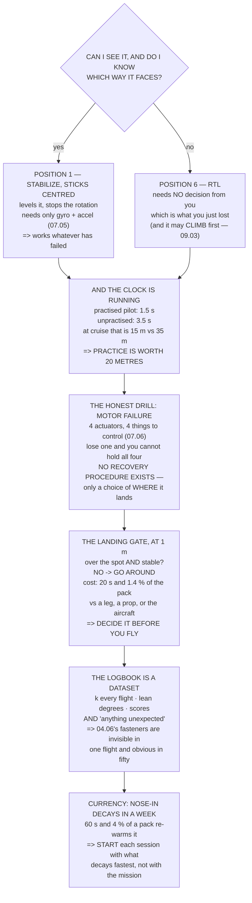

# 11.06 Emergencies, precision landings, and the pilot's logbook

<!-- glance:start -->
<!-- generated by tools/build.py from curriculum/syllabus.yaml — edit the syllabus, not this block -->

| | |
|---|---|
| **Track** | Main path |
| **Difficulty** | Advanced |
| **Time** | 1 h 45 min |
| **Hardware** | First flight (Hermon core) (stage 1) |
| **Software** | ardupilot |
| **Prerequisites** | [11.04 Flying in wind](11.04-flying-in-wind.md)<br>[11.05 Battery discipline in the air](11.05-battery-discipline.md) |
| **Skip if** | You have rehearsed RTL, link-loss and low-battery emergencies in the air and keep a logbook with hours and incidents. |

<!-- glance:end -->

## What you will learn

- That there are **only two first actions**, and one question selects between them
- How much time you do not have: practice is worth **20 metres at cruise**
- Seven drills, each one sentence long — and why five of them start identically
- The motor-failure drill, which is honest: **a quadcopter has no recovery procedure**
- The precision landing as four phases, of which the third is a **decision made before you fly**
- The logbook as a **dataset**, with every field earning its place by being computable
- What decays, how fast, and why **nose-in orientation decays in about a week**

## Why it matters

Everything in module 11 so far has assumed the flight goes to plan. This lesson is the other
case, and it is built around a single observation: **under pressure you do not choose between
seven procedures.**

So there are two. One question selects between them — *can I see it, and do I know which way it
faces?* — and the answer sends your hand to switch position 1 or switch position 6, which 11.02
deliberately put at the two ends of the travel so that neither requires counting.

The second half is time. From "something is wrong" to "the aircraft is doing something different"
there is a human delay, and a practised pilot's is about 1.5 seconds while an unpractised one
takes 2 more deciding what to do. At cruise that difference is **20 metres** — the gap between an
aircraft that stopped over the field and one that stopped over the road. And the drill is not
*knowing* what to do. Everyone knows. The drill is that your hand moves before you have finished
thinking, which is a motor skill built on a bench with the propellers off.

And then the logbook, which is not a record of achievement. It is a **dataset**: 11.05's $k$
tracked flight by flight, 11.04's wind read from the lean, and 04.06's fasteners loosening at
0.2 % a flight — which nobody notices in one flight and everybody notices as a sentence that
appears three times in a logbook.

## Prerequisites

<!-- prereqs:start -->
## Prerequisites

You need these first:

- [11.04 Flying in wind](11.04-flying-in-wind.md)
- [11.05 Battery discipline in the air](11.05-battery-discipline.md)

### Optional prerequisite links

None.

Check your readiness: `python course.py why 11.06`
<!-- prereqs:end -->

## Concept

An emergency procedure has to survive being executed by a frightened person who has stopped
reasoning well. That constraint rules out most of what looks like good procedure design.

It rules out **branching**: a decision tree with four nodes is a decision tree you will get lost
in. It rules out **precision**: "switch to position 3 and apply gentle forward pitch" is two
things to get right. And it rules out **novelty**: whatever you do in an emergency will be
something you have done before, whether or not it was the right thing.

What survives is a **single first action**, chosen so that it is almost always correct and never
harmful, executed before the analysis begins. Everything after it is what you do with the time it
bought.

The same logic runs through the landing. The go-around decision arrives at one metre, at the
moment when going around feels like an admission — so you make it on the ground, in advance, as a
number. And it runs through the logbook, which exists because your memory of what happened three
flights ago is not evidence.

## Technical explanation

### Level 1 — the only two first actions

> **Can I see it, and do I know which way it faces?**
>
> **Yes →** position 1 (STABILIZE), sticks centred.
> **No →** position 6 (RTL).

Position 1 works because 07.05's ladder says it needs the fewest sensors — gyro and accelerometer.
Whatever has failed, it is still available; it levels the aircraft and stops the rotation.

Position 6 works because it **needs no decision from you**. You do not have to know where the
aircraft is or which way it is pointing, which is exactly what you have just lost.

Everything else in this lesson is what you do *after* the first action, and the first action buys
the time to think about it.

### Level 2 — the time you do not have

| | seconds |
|---|---|
| the failsafe chain (09.03) — link loss only | 1.21 |
| a **practised** pilot recognising and acting | **1.50** |
| an **unpractised** one deciding what to do | **+2.00** |

And what that is in metres:

| speed | practised | unpractised | + link loss |
|---|---|---|---|
| 5 m/s (LOITER stick) | 7.5 m | 17.5 m | 23.5 m |
| **10 m/s (cruise)** | **15.0 m** | **35.0 m** | 47.1 m |
| 16.8 m/s (dash) | 25.2 m | 58.8 m | 79.1 m |

**Practice is worth 20 metres at cruise.** And the drill is not "know what to do" — everyone
reading this knows what to do. The drill is that **your hand moves before you have finished
thinking**, which is a motor skill, built by repetition, on a bench, with the propellers off.

### Level 3 — seven drills

| situation | first action | then |
|---|---|---|
| I have **lost the orientation** | **position 1, sticks centred** | it levels and stops rotating. Then look |
| it is **moving and I did not ask** | **position 1, sticks centred** | if it still moves it is wind; if it stops, the fault was in a loop you just turned off |
| I **cannot see it** | **position 6 — RTL** | it climbs to `RTL_ALT` and comes home. Do not guess a heading |
| the **link is gone** | *(the aircraft has decided)* | watch, and be ready when it returns (09.03's `FS_OPTIONS`) |
| the **battery is past the reserve** | **position 6 — RTL** | and if RTL will not make it, land where it is |
| a **motor or ESC has failed** | **land immediately, wherever** | you have seconds, not minutes |
| a **person has entered the area** | **climb, and hold** | do not land toward them, do not fly over them |

Five of the seven begin with the same two actions. The two that do not are the two where there is
nothing to decide: the link is gone (the aircraft has already chosen) and a motor has failed (you
are landing).

**The motor-failure row is the honest one.** A quadcopter has four actuators and four things to
control (07.06). Lose one and you cannot hold all four — yaw goes first, then the thrust vector.
There is **no recovery procedure**, only a choice of where it lands, and you have seconds to make
it.

### Level 4 — the landing, and the gate

| phase | what |
|---|---|
| 1 approach | arrive over the spot at 3–5 m, **stopped** |
| 2 descend | 0.5 m/s, level, nose into wind (11.04's gradient will push you forward) |
| **3 the gate** | **at 1 m: am I over the spot and stable?** Yes → continue. **No → go around** |
| 4 touch | hold at 30 cm, let it settle (11.03's float), then down |

**Phase 3 is the whole lesson.** A go-around costs twenty seconds and 1.26 Wh — **1.4 % of the
pack**. A bad landing costs a leg, a propeller, or the aircraft.

The price ratio is about a thousand to one, and people still do not go around, because the
decision arrives at the moment when going around feels like an admission. **So decide it before
you fly and write it on the card** — then the decision at one metre is not a judgement, it is a
lookup.

### Level 5 — the logbook as a dataset

| field | what it is for |
|---|---|
| date, site, aircraft | the row's identity |
| pack used, and its cycle count | 03.07 retires packs on cycles |
| flight time, armed to disarmed | 11.05's clock, recorded |
| **mAh consumed, and mAh charged** | **11.05's $k$, every flight** |
| wind: **lean degrees**, not a guess | 11.04's anemometer |
| modes flown | so "currency" means something |
| what you practised, and the score | 11.03's runs |
| **anything unexpected** | **the most valuable field** |
| the log filename | so the row points at the evidence |

The "anything unexpected" field is the valuable one and the one that gets left blank, because at
the time it never seems worth writing down. 04.06 measured fasteners loosening at **0.2 % a
flight — 91 % of them by flight 50** — and nobody notices that in one flight. You notice it in a
logbook, as a sentence that appears three times.

What the dataset lets you compute: $k$ drifting over months, your real endurance and when the pack
starts ageing, 11.04's ground-to-flight wind ratio for *your* site, incidents per hundred flights,
and days since you last practised something.

### Level 6 — currency

Skills are not acquired and kept. They are **re-warmed**, and the intervals are shorter than
anyone expects **[E]**:

| skill | decays in | re-warm with |
|---|---|---|
| **nose-in orientation** | **7 days** | 60 s of nose-in hover |
| manual landing | 14 days | three landings |
| the emergency drills | 30 days | one bench rehearsal |
| mode transitions by feel | 30 days | 11.02's ground drill |
| wind judgement | 60 days | one LOITER hover, read the lean |
| mission planning | 90 days | re-fly a known mission |

The top row is the one that matters, and 11.03 said why: **an aircraft coming home is pointing at
you**. A pilot who last practised nose-in a month ago has, in the only situation where it counts,
no more than "RTL and hope".

The fix costs sixty seconds and 3.8 Wh — 4 % of a pack — and it is the single highest-value minute
in this module.

**So start every session with the things that decay fastest**, not with the thing you came to do.
A nose-in hover, three landings and one emergency drill: nine minutes, and then fly the mission.

## Diagram



## Code

State the two first actions and the question that selects them, price a practised against an
unpractised reaction in metres at three speeds, lay out seven one-sentence drills, cost the
go-around against a bad landing, list the logbook fields with what each computes, and tabulate
what decays and how fast.

```python
"""11.06 - emergencies rehearsed, landings flown, and a logbook that pays."""
import math

FS_DETECT_S = 1.207       # 09.03's chain
REACT_S = 1.5             # a practised pilot, recognising and acting [E]
DECIDE_S = 2.0            # an UNpractised one, deciding what to do [E]
LOIT_SPEED = 5.0
CRUISE = 10.0
DASH = 16.8

# emergency, the FIRST action, and why it is that one
DRILLS = [
    ("I have lost the orientation", "SWITCH TO POSITION 1, STICKS CENTRED",
     "STABILIZE levels it and stops the rotation. THEN look",
     "07.05: it needs the fewest sensors, so it always works"),
    ("it is moving and I did not ask", "SWITCH TO POSITION 1, STICKS CENTRED",
     "removes every outer loop. If it still moves, it is WIND",
     "if it stops, the fault was in a loop you just turned off"),
    ("I cannot see it any more", "SWITCH TO POSITION 6 -- RTL",
     "it climbs to RTL_ALT and comes home. Do NOT guess a heading",
     "09.03: and it may climb FIRST, which is correct"),
    ("the link is gone", "(the aircraft has already decided)",
     "your job is to WATCH and be ready when it returns",
     "09.03's step 3: FS_OPTIONS decides if you get control back"),
    ("the battery is past the reserve", "SWITCH TO POSITION 6 -- RTL",
     "and if RTL will not make it, LAND WHERE IT IS",
     "11.05: the reserve WAS the return leg. It is spent"),
    ("a motor or ESC has failed", "LAND IMMEDIATELY, WHEREVER",
     "a quad has no redundancy. 07.06's allocator is already",
     "saturated and you have seconds, not minutes"),
    ("a person has entered the area", "CLIMB, and hold",
     "do not land toward them and do not fly over them",
     "04.06: 9.06 J per propeller. Height is separation"),
]

# the logbook's fields, and what each one is FOR
FIELDS = [
    ("date, site, aircraft", "the row's identity"),
    ("pack used, and its cycle count", "03.07 retires packs on cycles"),
    ("flight time, armed to disarmed", "11.05's clock, recorded"),
    ("mAh consumed, and mAh charged", "11.05's k, every flight"),
    ("wind: LEAN DEGREES, not a guess", "11.04's anemometer"),
    ("modes flown", "so 'currency' means something"),
    ("what you PRACTISED", "and the score, from 11.03"),
    ("anything unexpected", "THE MOST VALUABLE FIELD"),
    ("the log filename", "so the row points at the evidence"),
]

# what decays, how fast, and what re-warms it
CURRENCY = [
    ("nose-in orientation", 7, "60 s of nose-in hover", "11.03"),
    ("manual landing", 14, "three landings", "11.03"),
    ("the emergency drills", 30, "one rehearsal on the bench", "this lesson"),
    ("mode transitions by feel", 30, "the ground drill", "11.02"),
    ("wind judgement", 60, "one LOITER hover, read the lean", "11.04"),
    ("mission planning", 90, "re-fly a known mission", "12.02"),
]


def travel(seconds, speed):
    return seconds * speed


def bar(t):
    print("\n" + "=" * 70)
    print(t)
    print("=" * 70)


if __name__ == "__main__":
    bar("1. THE ONLY TWO FIRST ACTIONS")
    print("  Under pressure you do not choose between seven procedures.")
    print("  So there are two, and ONE QUESTION selects between them:")
    print()
    print("      CAN I SEE IT, AND DO I KNOW WHICH WAY IT FACES?")
    print()
    print("      YES -> POSITION 1 (STABILIZE), STICKS CENTRED")
    print("      NO  -> POSITION 6 (RTL)")
    print()
    print("  EVERYTHING ELSE IN THIS LESSON IS WHAT YOU DO AFTER THE")
    print("  FIRST ACTION, and the first action buys you the time to")
    print("  think about it.")
    print("  POSITION 1 WORKS BECAUSE 07.05'S LADDER SAYS IT NEEDS THE")
    print("  FEWEST SENSORS -- gyro and accelerometer. Whatever has")
    print("  failed, it is still available, it levels the aircraft and it")
    print("  stops the rotation.")
    print("  POSITION 6 WORKS BECAUSE IT NEEDS NO DECISION FROM YOU. You")
    print("  do not have to know where the aircraft is or which way it")
    print("  is pointing, which is exactly what you have just lost.")
    print("  AND 11.02 PUT THEM AT THE TWO ENDS OF THE SWITCH so that")
    print("  neither requires counting.")

    bar("2. HOW MUCH TIME YOU DO NOT HAVE")
    print("  From 'something is wrong' to 'the aircraft is doing")
    print("  something different' there are two delays, and they add:")
    print(f"  {'':34s} {'seconds':>9s}")
    rows = [("the failsafe chain (09.03)", FS_DETECT_S,
             "only for link loss. Zero if YOU noticed"),
            ("a PRACTISED pilot recognising and acting", REACT_S,
             "the drill is rehearsed and the hand moves"),
            ("an UNPRACTISED one deciding what to do", DECIDE_S,
             "ON TOP of the above. This is what practice removes")]
    for n, s, why in rows:
        print(f"  {n:34s} {s:9.2f}  {why}")
    prac = REACT_S
    unprac = REACT_S + DECIDE_S
    print(f"\n  {'and what that is, in metres':34s}")
    print(f"  {'speed':>10s} {'practised':>12s} {'unpractised':>13s}"
          f" {'+ link loss':>13s}")
    for v, label in ((LOIT_SPEED, "LOITER stick"), (CRUISE, "cruise"),
                     (DASH, "dash")):
        print(f"  {v:7.1f}m/s {travel(prac, v):9.1f} m"
              f" {travel(unprac, v):11.1f} m"
              f" {travel(unprac + FS_DETECT_S, v):11.1f} m   {label}")
    print("  THE MIDDLE COLUMN IS WHAT PRACTICE BUYS. At cruise it is")
    print(f"  {travel(unprac, CRUISE) - travel(prac, CRUISE):.0f} metres --"
          f" the difference between an aircraft that")
    print("  stopped over the field and one that stopped over the road.")
    print("  AND THE DRILL IS NOT 'KNOW WHAT TO DO'. Everyone reading")
    print("  this knows what to do. THE DRILL IS THAT YOUR HAND MOVES")
    print("  BEFORE YOU HAVE FINISHED THINKING, and that is a motor")
    print("  skill, built by repetition, on a bench, with the props off.")

    bar("3. SEVEN DRILLS, EACH ONE SENTENCE LONG")
    for what, first, then, why in DRILLS:
        print(f"  * {what}")
        print(f"      FIRST: {first}")
        print(f"      THEN:  {then}")
        print(f"      ({why})")
    print("  NOTE THAT FIVE OF THE SEVEN BEGIN WITH THE SAME TWO")
    print("  ACTIONS, and the two that do not are the two where there is")
    print("  nothing to decide: the link is gone (the aircraft has")
    print("  already chosen) and a motor has failed (you are landing).")
    print("  THE MOTOR-FAILURE ROW IS THE HONEST ONE. A quadcopter has")
    print("  FOUR actuators and FOUR things to control (07.06). Lose one")
    print("  and you cannot hold all four -- yaw goes first, then the")
    print("  thrust vector. There is no recovery procedure, only a")
    print("  choice of where it lands, and you have seconds to make it.")

    bar("4. THE PRECISION LANDING, AND THE GO-AROUND DECIDED IN ADVANCE")
    print("  A hand-flown landing onto a spot is four phases, and the")
    print("  third one is a DECISION rather than a control input:")
    phases = [
        ("1 approach", "arrive over the spot at 3-5 m, STOPPED",
         "11.03: the corner is a stop. So is this"),
        ("2 descend", "0.5 m/s, wings level, nose into wind",
         "11.04: the gradient will push you forward"),
        ("3 THE GATE", "at 1 m: am I over the spot and stable?",
         "YES -> continue. NO -> GO AROUND. Decide BEFORE you fly"),
        ("4 touch", "hold at 30 cm, let it settle, then down",
         "11.03: ground effect floats you. Do not chase it"),
    ]
    for a, b, c in phases:
        print(f"  {a:12s} {b}")
        print(f"  {'':12s} {c}")
    print("  PHASE 3 IS THE WHOLE LESSON. A go-around costs you twenty")
    print(f"  seconds and {226 * 20 / 3600:.2f} Wh --"
          f" {226 * 20 / 3600 / 88.8 * 100:.1f} % of the pack. A bad")
    print("  landing costs a leg, a propeller, or the aircraft.")
    print("  THE PRICE RATIO IS ABOUT A THOUSAND TO ONE and people still")
    print("  do not go around, because the decision arrives at the")
    print("  moment when going around feels like an admission.")
    print("  SO DECIDE IT BEFORE YOU FLY, WRITE IT ON THE CARD, and then")
    print("  the decision at 1 m is not a judgement -- it is a lookup.")

    bar("5. THE LOGBOOK, AND WHAT IT IS ACTUALLY FOR")
    print("  Not a record of achievement. A DATASET, and every field")
    print("  earns its place by being something you will compute with:")
    print(f"  {'field':34s} {'what it is for'}")
    for a, b in FIELDS:
        print(f"  {a:34s} {b}")
    print("  THE 'ANYTHING UNEXPECTED' FIELD IS THE VALUABLE ONE and it")
    print("  is the one that gets left blank, because at the time it")
    print("  never seems worth writing down. 04.06 measured fasteners")
    print("  loosening at 0.2 % a flight -- 91 % of them by flight 50 --")
    print("  and NOBODY notices that in one flight. You notice it in a")
    print("  logbook, as a sentence that appears three times.")
    print("\n  AND WHAT THE DATASET LETS YOU COMPUTE:")
    for a, b in (("mAh consumed / mAh charged, per flight",
                  "11.05's k, tracked. A drifting sensor is visible"),
                 ("flight time vs mAh, per flight",
                  "your endurance, and when the pack starts aging"),
                 ("lean degrees vs the day's forecast",
                  "11.04's ground-to-flight ratio, for YOUR site"),
                 ("incidents per hundred flights",
                  "the only honest measure of whether you are improving"),
                 ("days since you last practised X",
                  "section 6, which is the one that surprises people")):
        print(f"    {a:40s} {b}")

    bar("6. CURRENCY: WHAT DECAYS, AND HOW FAST")
    print("  Skills are not acquired and kept. They are re-warmed, and")
    print("  the intervals are shorter than anyone expects: [E]")
    print(f"  {'skill':30s} {'decays in':>10s}  {'re-warm with'}")
    for n, days, fix, src in CURRENCY:
        print(f"  {n:30s} {days:8d} d  {fix}  [{src}]")
    print("  THE TOP ROW IS THE ONE THAT MATTERS. Nose-in orientation")
    print("  decays in about a WEEK, and 11.03 said why it matters: an")
    print("  aircraft coming home is pointing at you. A pilot who last")
    print("  practised nose-in a month ago has, in the only situation")
    print("  where it counts, no more than 'RTL and hope'.")
    print("  AND THE CHEAP FIX: sixty seconds, every session, before")
    print("  anything else. It costs 3.8 Wh -- 4 % of a pack -- and it is")
    print("  the single highest-value minute in this module.")
    print("\n  THE RULE THAT FALLS OUT: START EVERY SESSION WITH THE")
    print("  THINGS THAT DECAY FASTEST, not with the thing you came to")
    print("  do. A nose-in hover, three landings, and one emergency")
    print("  drill -- nine minutes -- and then fly the mission.")
```

Output:

```text

======================================================================
1. THE ONLY TWO FIRST ACTIONS
======================================================================
  Under pressure you do not choose between seven procedures.
  So there are two, and ONE QUESTION selects between them:

      CAN I SEE IT, AND DO I KNOW WHICH WAY IT FACES?

      YES -> POSITION 1 (STABILIZE), STICKS CENTRED
      NO  -> POSITION 6 (RTL)

  EVERYTHING ELSE IN THIS LESSON IS WHAT YOU DO AFTER THE
  FIRST ACTION, and the first action buys you the time to
  think about it.
  POSITION 1 WORKS BECAUSE 07.05'S LADDER SAYS IT NEEDS THE
  FEWEST SENSORS -- gyro and accelerometer. Whatever has
  failed, it is still available, it levels the aircraft and it
  stops the rotation.
  POSITION 6 WORKS BECAUSE IT NEEDS NO DECISION FROM YOU. You
  do not have to know where the aircraft is or which way it
  is pointing, which is exactly what you have just lost.
  AND 11.02 PUT THEM AT THE TWO ENDS OF THE SWITCH so that
  neither requires counting.

======================================================================
2. HOW MUCH TIME YOU DO NOT HAVE
======================================================================
  From 'something is wrong' to 'the aircraft is doing
  something different' there are two delays, and they add:
                                       seconds
  the failsafe chain (09.03)              1.21  only for link loss. Zero if YOU noticed
  a PRACTISED pilot recognising and acting      1.50  the drill is rehearsed and the hand moves
  an UNPRACTISED one deciding what to do      2.00  ON TOP of the above. This is what practice removes

  and what that is, in metres       
       speed    practised   unpractised   + link loss
      5.0m/s       7.5 m        17.5 m        23.5 m   LOITER stick
     10.0m/s      15.0 m        35.0 m        47.1 m   cruise
     16.8m/s      25.2 m        58.8 m        79.1 m   dash
  THE MIDDLE COLUMN IS WHAT PRACTICE BUYS. At cruise it is
  20 metres -- the difference between an aircraft that
  stopped over the field and one that stopped over the road.
  AND THE DRILL IS NOT 'KNOW WHAT TO DO'. Everyone reading
  this knows what to do. THE DRILL IS THAT YOUR HAND MOVES
  BEFORE YOU HAVE FINISHED THINKING, and that is a motor
  skill, built by repetition, on a bench, with the props off.

======================================================================
3. SEVEN DRILLS, EACH ONE SENTENCE LONG
======================================================================
  * I have lost the orientation
      FIRST: SWITCH TO POSITION 1, STICKS CENTRED
      THEN:  STABILIZE levels it and stops the rotation. THEN look
      (07.05: it needs the fewest sensors, so it always works)
  * it is moving and I did not ask
      FIRST: SWITCH TO POSITION 1, STICKS CENTRED
      THEN:  removes every outer loop. If it still moves, it is WIND
      (if it stops, the fault was in a loop you just turned off)
  * I cannot see it any more
      FIRST: SWITCH TO POSITION 6 -- RTL
      THEN:  it climbs to RTL_ALT and comes home. Do NOT guess a heading
      (09.03: and it may climb FIRST, which is correct)
  * the link is gone
      FIRST: (the aircraft has already decided)
      THEN:  your job is to WATCH and be ready when it returns
      (09.03's step 3: FS_OPTIONS decides if you get control back)
  * the battery is past the reserve
      FIRST: SWITCH TO POSITION 6 -- RTL
      THEN:  and if RTL will not make it, LAND WHERE IT IS
      (11.05: the reserve WAS the return leg. It is spent)
  * a motor or ESC has failed
      FIRST: LAND IMMEDIATELY, WHEREVER
      THEN:  a quad has no redundancy. 07.06's allocator is already
      (saturated and you have seconds, not minutes)
  * a person has entered the area
      FIRST: CLIMB, and hold
      THEN:  do not land toward them and do not fly over them
      (04.06: 9.06 J per propeller. Height is separation)
  NOTE THAT FIVE OF THE SEVEN BEGIN WITH THE SAME TWO
  ACTIONS, and the two that do not are the two where there is
  nothing to decide: the link is gone (the aircraft has
  already chosen) and a motor has failed (you are landing).
  THE MOTOR-FAILURE ROW IS THE HONEST ONE. A quadcopter has
  FOUR actuators and FOUR things to control (07.06). Lose one
  and you cannot hold all four -- yaw goes first, then the
  thrust vector. There is no recovery procedure, only a
  choice of where it lands, and you have seconds to make it.

======================================================================
4. THE PRECISION LANDING, AND THE GO-AROUND DECIDED IN ADVANCE
======================================================================
  A hand-flown landing onto a spot is four phases, and the
  third one is a DECISION rather than a control input:
  1 approach   arrive over the spot at 3-5 m, STOPPED
               11.03: the corner is a stop. So is this
  2 descend    0.5 m/s, wings level, nose into wind
               11.04: the gradient will push you forward
  3 THE GATE   at 1 m: am I over the spot and stable?
               YES -> continue. NO -> GO AROUND. Decide BEFORE you fly
  4 touch      hold at 30 cm, let it settle, then down
               11.03: ground effect floats you. Do not chase it
  PHASE 3 IS THE WHOLE LESSON. A go-around costs you twenty
  seconds and 1.26 Wh -- 1.4 % of the pack. A bad
  landing costs a leg, a propeller, or the aircraft.
  THE PRICE RATIO IS ABOUT A THOUSAND TO ONE and people still
  do not go around, because the decision arrives at the
  moment when going around feels like an admission.
  SO DECIDE IT BEFORE YOU FLY, WRITE IT ON THE CARD, and then
  the decision at 1 m is not a judgement -- it is a lookup.

======================================================================
5. THE LOGBOOK, AND WHAT IT IS ACTUALLY FOR
======================================================================
  Not a record of achievement. A DATASET, and every field
  earns its place by being something you will compute with:
  field                              what it is for
  date, site, aircraft               the row's identity
  pack used, and its cycle count     03.07 retires packs on cycles
  flight time, armed to disarmed     11.05's clock, recorded
  mAh consumed, and mAh charged      11.05's k, every flight
  wind: LEAN DEGREES, not a guess    11.04's anemometer
  modes flown                        so 'currency' means something
  what you PRACTISED                 and the score, from 11.03
  anything unexpected                THE MOST VALUABLE FIELD
  the log filename                   so the row points at the evidence
  THE 'ANYTHING UNEXPECTED' FIELD IS THE VALUABLE ONE and it
  is the one that gets left blank, because at the time it
  never seems worth writing down. 04.06 measured fasteners
  loosening at 0.2 % a flight -- 91 % of them by flight 50 --
  and NOBODY notices that in one flight. You notice it in a
  logbook, as a sentence that appears three times.

  AND WHAT THE DATASET LETS YOU COMPUTE:
    mAh consumed / mAh charged, per flight   11.05's k, tracked. A drifting sensor is visible
    flight time vs mAh, per flight           your endurance, and when the pack starts aging
    lean degrees vs the day's forecast       11.04's ground-to-flight ratio, for YOUR site
    incidents per hundred flights            the only honest measure of whether you are improving
    days since you last practised X          section 6, which is the one that surprises people

======================================================================
6. CURRENCY: WHAT DECAYS, AND HOW FAST
======================================================================
  Skills are not acquired and kept. They are re-warmed, and
  the intervals are shorter than anyone expects: [E]
  skill                           decays in  re-warm with
  nose-in orientation                   7 d  60 s of nose-in hover  [11.03]
  manual landing                       14 d  three landings  [11.03]
  the emergency drills                 30 d  one rehearsal on the bench  [this lesson]
  mode transitions by feel             30 d  the ground drill  [11.02]
  wind judgement                       60 d  one LOITER hover, read the lean  [11.04]
  mission planning                     90 d  re-fly a known mission  [12.02]
  THE TOP ROW IS THE ONE THAT MATTERS. Nose-in orientation
  decays in about a WEEK, and 11.03 said why it matters: an
  aircraft coming home is pointing at you. A pilot who last
  practised nose-in a month ago has, in the only situation
  where it counts, no more than 'RTL and hope'.
  AND THE CHEAP FIX: sixty seconds, every session, before
  anything else. It costs 3.8 Wh -- 4 % of a pack -- and it is
  the single highest-value minute in this module.

  THE RULE THAT FALLS OUT: START EVERY SESSION WITH THE
  THINGS THAT DECAY FASTEST, not with the thing you came to
  do. A nose-in hover, three landings, and one emergency
  drill -- nine minutes -- and then fly the mission.
```

## Exercise

### Exercise 11.06-E1 — Build the emergency card and drill it `[hardware]`

Write the seven drills on one card, each one sentence. Then rehearse on the bench, propellers off,
aircraft disarmed: have someone call a situation at random and time how long until your hand is on
the right switch position. Do fifty. Report your first ten times and your last ten, and compute
the improvement in metres at cruise using Level 2.

### Exercise 11.06-E2 — Fly the landing gate `[hardware]`

Fly ten approaches to a marked spot. At one metre, apply the gate honestly: over the spot and
stable, or go around. Record how many you continued and how many you went around, and — this is
the exercise — how many you continued that you should not have. Then repeat with a friend calling
the gate for you, and compare.

### Exercise 11.06-E3 — Start the logbook and compute from it `[analysis]`

Set up the logbook with Level 5's fields, and backfill every flight you have already made from
11.01 onwards using the logs you downloaded. Then compute three things: your $k$ for each flight,
your endurance against 02.11's prediction, and your ground-to-flight wind ratio. Plot $k$ against
flight number and say whether it is drifting.

### Exercise 11.06-E4 — Rehearse the one with no procedure `[analysis]`

Motor failure has no recovery. In SITL (10.04), use `SIM_ENGINE_FAIL` to stop one motor at 40 m
and observe: what does 07.06's allocator give up first, how long until the aircraft is
uncontrollable, and how far does it travel in that time? Then write the one-sentence drill you
would actually use, and say where on your usual site you would want it to happen.

## Expected result

**11.06-E1**: expect the first ten to average 3–4 seconds and the last ten under 1.5. That
improvement is the 20 metres from Level 2, bought in fifteen minutes on a bench. Re-drill monthly
— Level 6 says it decays in thirty days.

**11.06-E2**: most people continue two or three approaches they should have gone around on, and
almost nobody goes around when they are alone. With a friend calling the gate, the number of
honest go-arounds roughly doubles — which is the finding, and the reason the decision belongs on
a card rather than in your judgement at the moment.

**11.06-E3**: $k$ should be flat within a couple of per cent. A slow drift means the sensor or the
pack is changing; a step change means something was modified. And the ground-to-flight wind ratio
should be stable for your site, around 1.3 to 1.8, exactly as 11.04's power law predicts.

**11.06-E4**: yaw goes first — the aircraft begins spinning within a second — then the thrust
vector, and it is uncontrollable in two to four seconds, having travelled 20–40 m. The honest
drill is *"land immediately, wherever"*, and the answer to "where would you want it to happen"
is the reason to fly upwind of yourself and over the open half of the field.

## Troubleshooting

**You freeze rather than acting.** Normal, and it is exactly what the drill removes. Fifty bench
repetitions with someone calling situations at random builds the hand movement; knowing the
procedure does not.

**You reached for the wrong switch position.** Either the switch is not where 11.02 says it should
be, or you have not drilled by feel. Both are ground work.

**RTL made things worse.** Check 09.03's step 3 and your `RTL_ALT`. An aircraft below `RTL_ALT`
climbs first, which is correct and alarming; and `FS_OPTIONS` decides whether you get control back
when you switch out.

**You never go around.** E2. Get someone to call the gate for you until continuing a bad approach
feels wrong rather than normal.

**The logbook has gaps.** Fill them from the logs — every flight from 11.01 onward produced one,
and the fields in Level 5 are all recoverable from a `.bin` except "anything unexpected". Start
writing that one now.

**Your skills feel fine after a month off.** They will, right up until the first thing goes wrong.
Level 6 is about the skills you only need when something has already happened, and those are
exactly the ones you cannot self-assess.

> [!CAUTION]
> **Every drill in this lesson is rehearsed on a bench with the propellers off before it is ever
> used in the air.** An emergency is not the time to discover that your switch is in a different
> position than you remembered or that RTL climbs first. And of the seven drills, the one with a
> person in it has no compromise: **climb and hold**. Do not attempt to land away from them, do not
> fly over them to get somewhere safer, and do not land quickly. 04.06 put 9.06 J in each
> propeller at hover, and altitude is the only separation you control instantly.

## Common mistakes

- **Having seven procedures instead of two first actions.** Under pressure you will not choose.
- **Practising by reading.** The drill is a hand movement, not a fact.
- **Not deciding the go-around in advance.** At one metre it feels like an admission and it costs
  1.4 % of a pack.
- **Leaving "anything unexpected" blank.** It is the field that catches 04.06's slow failures.
- **Treating the logbook as a record of achievement.** It is a dataset; every field should be
  something you compute with.
- **Assuming skills persist.** Nose-in decays in about a week, and it is the one you need when an
  aircraft is coming at you.
- **Starting a session with the mission.** Start with what decays fastest: nine minutes buys back
  everything.

## Knowledge check

<details>
<summary>There are only two first actions. What are they, and what single question selects
between them?</summary>

**Can I see it, and do I know which way it faces?** Yes → **position 1 (STABILIZE), sticks
centred** — it needs only the gyro and accelerometer, so it survives almost any failure, and it
levels the aircraft and stops the rotation. No → **position 6 (RTL)** — because it requires no
decision from you, which is exactly what you have just lost.
</details>

<details>
<summary>What is practice actually worth, in metres?</summary>

About **20 metres at cruise**. A practised pilot recognises and acts in about 1.5 s; an
unpractised one spends about 2 s more deciding what to do. At 10 m/s that is 15 m against 35 m —
the difference between an aircraft that stopped over the field and one that stopped over the road.
And what practice removes is the *deciding*, not the knowing.
</details>

<details>
<summary>Five of the seven drills start identically. Which two do not, and why?</summary>

**Link loss**, because the aircraft has already decided — your job is to watch and be ready when
control returns (09.03's `FS_OPTIONS`). And **motor failure**, because you are landing regardless.
In both cases there is nothing for the first action to buy time for.
</details>

<details>
<summary>What is the recovery procedure for a motor failure on a quadcopter?</summary>

**There is none.** A quad has four actuators and four things to control (07.06); lose one and you
cannot hold all four — yaw goes first, then the thrust vector. The drill is "land immediately,
wherever", and the only thing you influence is *where*. You have seconds, which is a good reason
to fly over the open half of the field.
</details>

<details>
<summary>What does a go-around cost, what does a bad landing cost, and why do people still not go
around?</summary>

A go-around is twenty seconds and 1.26 Wh — **1.4 % of the pack**. A bad landing is a leg, a
propeller or the aircraft: roughly a thousand times more. People do not go around because the
decision arrives at one metre, at the moment when it feels like an admission. **So decide it on
the ground**, write it on the card, and then at one metre it is a lookup rather than a judgement.
</details>

<details>
<summary>Which logbook field is the most valuable, and what would it have caught?</summary>

**"Anything unexpected."** 04.06 measured fasteners loosening at 0.2 % a flight — 91 % of them by
flight 50 — which nobody notices in a single flight. You notice it in a logbook, as the same
sentence appearing three times. It is also the field that gets left blank, because at the time
nothing ever seems worth writing down.
</details>

<details>
<summary>What decays fastest, how fast, and what does re-warming it cost?</summary>

**Nose-in orientation**, in about a week **[E]**. Re-warming it is sixty seconds of nose-in hover
— **3.8 Wh, 4 % of a pack** — and it is the highest-value minute in this module, because 11.03
showed that an aircraft coming home is by definition pointing at you. The rule that follows: start
every session with what decays fastest, not with the mission.
</details>

## Practical challenge

**Close module 11 with three documents and one habit.**

The **emergency card**: seven drills, one sentence each, with the two first actions at the top.
Laminate it and put it with the transmitter, not in a folder.

The **logbook**, backfilled from every flight since 11.01, with $k$ computed for each and plotted.
The plot is the deliverable — a flat line means your fuel measurement is trustworthy, and a
drifting one means it is not.

The **session opener**, written as a checklist: nose-in hover 60 s, three landings through the
gate, one emergency drill called by someone else. Nine minutes. It goes at the *top* of every
session, before the interesting flying, because Level 6 says those are the skills that decay while
the fun ones do not.

And the habit, which is the point of the whole module: **after every flight, before you pack up,
write the row.** Date, pack, time, mAh both ways, lean degrees, what you practised, what surprised
you, the log filename. Ninety seconds. In a year it is the only honest record of whether you are
getting better, and it is the input to every analysis module 16 will ask you for.

## You can skip this if

You have rehearsed RTL, link-loss and low-battery emergencies in the air and keep a logbook with
hours and incidents.

## Go deeper

- [04.06](../04-frame-and-assembly/04.06-preflight-and-airworthiness.md) (earlier): the fasteners
  that loosen at 0.2 % a flight, and the 9.06 J.
- [07.06](../07-control/07.06-mixing-and-allocation.md) (earlier): why a quad has no recovery from
  a motor failure.
- [09.03](../09-telemetry-datalink/09.03-failsafe-when-the-link-drops.md) (earlier): the failsafe
  chain, and `FS_OPTIONS`.
- [10.04](../10-simulation/10.04-ardupilot-sitl.md) (earlier): `SIM_ENGINE_FAIL`, which is how E4
  is done safely.
- [11.03](11.03-basic-maneuvers.md) (earlier): nose-in, and why it is a safety skill.
- [11.05](11.05-battery-discipline.md) (earlier): the reserve, and the $k$ the logbook tracks.
- [16.05](../16-testing-analysis/16.05-field-protocols-and-the-safety-case.md) (later): the
  logbook and the cards, as a safety case.
- [18.06](../18-civil-ops/18.06-maintenance-and-qualification.md) (later): currency and
  maintenance as an operator's obligation rather than a habit.
- ArduPilot's emergency and troubleshooting guidance, including in-flight mode changes:
  https://ardupilot.org/copter/docs/common-diagnosing-problems-using-logs.html
- The FAA's recurrency and currency framework for remote pilots, which is the professional version
  of Level 6: https://www.faa.gov/uas/commercial_operators

> **Ask your teacher:** *"We have reduced our emergency procedures to two first actions selected by
> one question, because under pressure nobody chooses between seven. We also found that practice is
> worth about twenty metres at cruise, and that nose-in orientation decays in roughly a week. Does
> that match how you drill, and what do you personally do in the first minute of every session?"*

## Progress checkpoint

Run `python course.py complete 11.06` once your emergency card is drilled, your logbook is
backfilled and your session opener is written. That closes module 11 — Hermon flies, you can fly
it, and you have the records to prove both. Next:
[12.01](../12-autonomous-flight/12.01-waypoints.md) — flying without holding the sticks at all.
