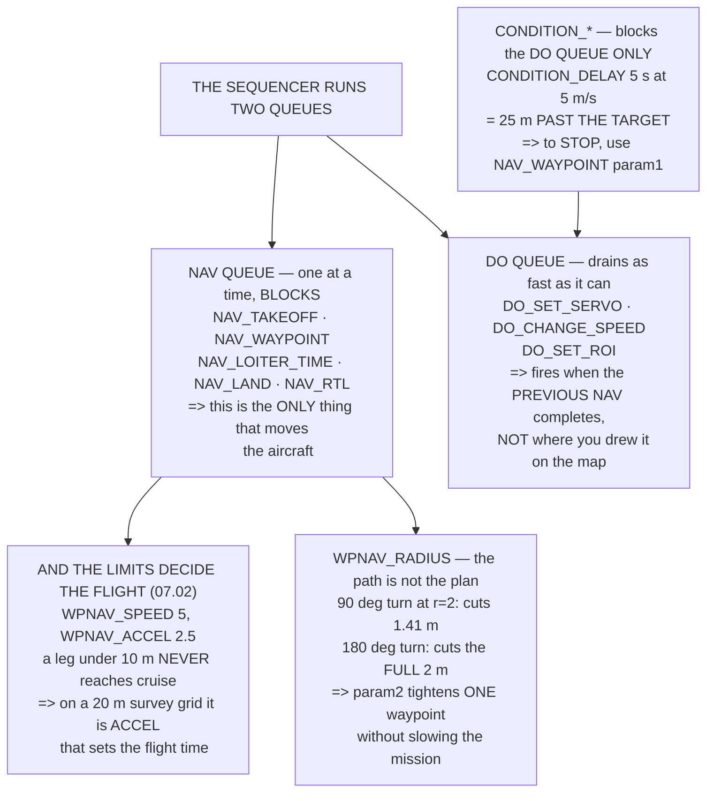

# 12.01 Waypoints: the mission as a list of commands

<!-- glance:start -->
<!-- generated by tools/build.py from curriculum/syllabus.yaml — edit the syllabus, not this block -->

| | |
|---|---|
| **Track** | Main path |
| **Difficulty** | Intermediate |
| **Time** | 1 h 15 min |
| **Hardware** | none |
| **Software** | ardupilot, qgc |
| **Prerequisites** | [11.06 Emergencies, precision landings, and the pilot's logbook](../11-first-flights/11.06-emergencies-and-the-logbook.md) |
| **Skip if** | You can write a mission by hand in MAVLink mission-item form and explain how the FC sequences it. |

<!-- glance:end -->

## What you will learn

- The three command families, and that **only one of them blocks**
- Why a `DO_` item fires when the *previous waypoint* is reached, not where you drew it
- Every field of a mission item, and the two that mean different things per command
- The `CONDITION_DELAY` trap: five seconds at 5 m/s is **25 metres past the target**
- Why a leg shorter than **10 m never reaches `WPNAV_SPEED`** — and what that does to a survey
- The acceptance radius, and why at a 180° turn the aircraft **cuts the full radius**

## Why it matters

A mission looks like a line on a map. It is not. It is a **list of commands executed by a state
machine**, and the gap between those two pictures is where almost every autonomous-flight mistake
lives.

The sequencer runs **two queues at once**. Navigation commands block — the aircraft goes to the
waypoint and the mission waits. `DO_` commands do not: they execute the instant the *previous*
navigation item completes, and then the sequencer moves on. So a `DO_SET_SERVO` that you dragged
onto the map halfway along a leg does not fire halfway along the leg. It fires at the start of it.

And `CONDITION_DELAY`, which looks like it holds the aircraft, delays only the **`DO` queue**. Put
one between a waypoint and a release and the aircraft flies on while the seconds tick: five
seconds at 5 m/s is **25 metres past the target**, which for 17.02's payload release is the
difference between a delivery and an incident.

The other half of the lesson is timing. `WPNAV_SPEED` is 5 m/s and `WPNAV_ACCEL` is 2.5 m/s², so
**a leg shorter than 10 m never reaches cruise speed at all**. On a survey grid with 20 m line
spacing, every cross leg is in that regime — and the parameter that decides your flight time is
`WPNAV_ACCEL`, not `WPNAV_SPEED`.

## Prerequisites

<!-- prereqs:start -->
## Prerequisites

You need these first:

- [11.06 Emergencies, precision landings, and the pilot's logbook](../11-first-flights/11.06-emergencies-and-the-logbook.md)

### Optional prerequisite links

None.

Check your readiness: `python course.py why 12.01`
<!-- prereqs:end -->

## Concept

ArduPilot stores a mission as a numbered list of **mission items**, each one a command with four
floating-point parameters and a position. Item 0 is always the home position, set at arming.

Three families, and they behave completely differently.

**`NAV_*`** changes where the aircraft is going, and **blocks**: the sequencer waits for it to
complete before advancing. `NAV_WAYPOINT`, `NAV_TAKEOFF`, `NAV_LAND`, `NAV_LOITER_TIME`.

**`DO_*`** changes a setting or fires an action, and **does not block**: it executes and the
sequencer advances immediately. `DO_SET_SERVO`, `DO_CHANGE_SPEED`, `DO_SET_ROI`.

**`CONDITION_*`** delays the **`DO` queue** — and only that queue. `CONDITION_DELAY`,
`CONDITION_DISTANCE`.

Once you hold those three facts, missions stop being mysterious. The aircraft's *position* is
driven entirely by the `NAV` queue; everything else happens alongside it, as fast as the
`CONDITION`s allow.

## Technical explanation

### Level 1 — three families, one queue that blocks

| family | does | timing |
|---|---|---|
| `NAV_*` | changes where the aircraft is going | **blocks** — the sequencer waits |
| `CONDITION_*` | delays the next `DO` | blocks **the `DO` queue**, not the navigation |
| `DO_*` | changes a setting or fires an action | **does not block** |

**A `DO_` item between two waypoints fires the instant the previous waypoint is reached** — not
when the aircraft gets to where you drew it on the map. That is the commonest mission-planning
error, and it is invisible in the ground station, because the map draws `DO` items at a location
the aircraft does not use.

**If you need something to happen at a place, put a waypoint there and the `DO_` item after it.**

### Level 2 — one item, field by field

| field | type | typical | |
|---|---|---|---|
| `seq` | uint16 | 0, 1, 2… | item 0 is the **home position** |
| `frame` | uint8 | `GLOBAL_RELATIVE_ALT` (3) | what `z` means |
| `command` | uint16 | 16 = `NAV_WAYPOINT` | which of ~40 |
| `autocontinue` | uint8 | 1 | 0 stops the mission dead here |
| **`param1..4`** | float | varies | **meaning depends on the command** |
| `x`, `y` | int32 | lat/lon × 10⁷ | one unit is **1.1 cm** |
| `z` | float | altitude, m | in whatever `frame` says |

Two fields deserve more than a line.

**`frame` decides what `z` means.** `GLOBAL_RELATIVE_ALT` is relative to the home altitude where
the aircraft armed; `GLOBAL` is above mean sea level; `TERRAIN` is above the ground under the
aircraft (12.05). **Mixing them in one mission is legal and almost always a mistake.**

**`param1..4` mean different things for every command.** For `NAV_WAYPOINT`, `param1` is a hold
time; for `NAV_LOITER_TURNS` it is a number of turns; for `DO_SET_SERVO` it is a channel number.
There is no way to read a mission item without knowing which command it is.

And the precision: at 1.1 cm per unit, a mission is stored far finer than 05.04's GNSS can fly it,
so **the waypoint is never the limit**.

### Level 3 — a worked mission, and the trap

| # | command | at | alt |
|---|---|---|---|
| 1 | `NAV_TAKEOFF` | — | 40 m |
| 2 | `DO_CHANGE_SPEED` | — | — |
| 3 | `NAV_WAYPOINT` | 300 m | 40 m |
| 4 | `DO_SET_ROI` | — | — |
| 5 | `NAV_WAYPOINT` | 600 m | 40 m |
| **6** | **`CONDITION_DELAY` 5 s** | — | — |
| **7** | **`DO_SET_SERVO`** — the release | — | — |
| 8 | `NAV_WAYPOINT` | 300 m | 40 m |
| 9 | `NAV_RETURN_TO_LAUNCH` | — | — |

Items 2 and 4 fire *immediately* after 1 and 3 complete — the speed change applies from the start
of leg 3, and the region-of-interest locks the nose the moment waypoint 3 is reached.

**Now items 6 and 7.** A reasonable reading is: hold at waypoint 5, wait five seconds, release.
That is not what happens. `CONDITION_DELAY` delays the `DO` queue, not the navigation — so the
moment waypoint 5 is reached the aircraft starts flying toward item 8, and the five seconds tick
away while it does. **At 5 m/s that is 25 metres past the target**, and 17.02's release fires
there.

If you want the aircraft to *stop*, that is `NAV_WAYPOINT` with `param1 = 5`, or
`NAV_LOITER_TIME`. `CONDITION_DELAY` is for sequencing two `DO` items against each other, and for
nothing else.

### Level 4 — timing the mission

With `WPNAV_SPEED` 5 m/s and `WPNAV_ACCEL` 2.5 m/s²:

| leg | time | peak speed | reaches cruise? |
|---|---|---|---|
| **5 m** | 2.8 s | 3.54 m/s | **no** |
| 10 m | 4.0 s | 5.00 m/s | yes |
| 100 m | 22.0 s | 5.00 m/s | yes |
| 1000 m | 202.0 s | 5.00 m/s | yes |

**A leg shorter than 10 m never reaches `WPNAV_SPEED`**, because it is still accelerating when it
has to start stopping. On a survey grid with 20 m spacing, the cross legs are all in that regime,
and the parameter that decides flight time is **`WPNAV_ACCEL`**, not `WPNAV_SPEED`.

And the whole mission: **351 seconds, 5.8 minutes, about 22 % of the pack** — which leaves 11.05's
reserve intact. **Time the mission before you upload it**, because a ground station will happily
draw one that does not fit.

### Level 5 — the acceptance radius

`WPNAV_RADIUS` is 2 m: the aircraft considers a waypoint reached when it is that close and starts
the next leg. **It does not fly to the point.**

| turn | cut at r = 2 m | r = 5 m | r = 10 m |
|---|---|---|---|
| 30° | 0.52 m | 1.29 m | 2.59 m |
| 90° | 1.41 m | 3.54 m | 7.07 m |
| **180°** | **2.00 m** | **5.00 m** | **10.00 m** |

A large radius makes the flight smooth and the path wrong. On a survey that is fine — you care
about coverage, not about passing through points. On a delivery (17.05) it is not, and **`param2`
lets you set a tighter radius on the one waypoint that matters** rather than slowing the whole
mission.

And at 180° — the turn at the end of every survey line — the cut is the **full radius**, which is
why 12.02's grid spacing has to account for it.

## Diagram



## Code

Separate the three command families by whether they block, lay out every field of a mission item,
walk a worked mission through the sequencer including the `CONDITION_DELAY` trap, time each leg
against `WPNAV_SPEED` and `WPNAV_ACCEL`, and compute the corner cut at five turn angles.

```python
"""12.01 - a mission is a list of commands, and the sequencer is a state machine."""
import math

WPNAV_SPEED = 5.0         # m/s
WPNAV_ACCEL = 2.5         # m/s^2
WPNAV_RADIUS = 2.0        # m
WPNAV_SPEED_UP = 2.5
WPNAV_SPEED_DN = 1.5
CRUISE_W = 203.0
HOVER_W = 226.0
USABLE_WH = 88.8

# the three FAMILIES of mission command, which behave completely differently
FAMILIES = [
    ("NAV_*", "changes where the aircraft is going",
     "BLOCKS: the sequencer waits for it to complete",
     "NAV_WAYPOINT, NAV_TAKEOFF, NAV_LAND, NAV_LOITER_TIME, NAV_RTL"),
    ("CONDITION_*", "delays the NEXT do-command",
     "BLOCKS the DO queue, not the navigation",
     "CONDITION_DELAY, CONDITION_DISTANCE, CONDITION_YAW"),
    ("DO_*", "changes a setting or fires an action",
     "DOES NOT BLOCK. Executes and moves on IMMEDIATELY",
     "DO_SET_SERVO, DO_CHANGE_SPEED, DO_SET_ROI, DO_DIGICAM_CONTROL"),
]

# one mission item, field by field, as MAVLink actually carries it
ITEM = [
    ("seq", "uint16", "0, 1, 2...", "the index. Item 0 is the HOME position"),
    ("frame", "uint8", "MAV_FRAME_GLOBAL_RELATIVE_ALT",
     "3 = altitude is RELATIVE TO HOME, which is what you want"),
    ("command", "uint16", "16 = NAV_WAYPOINT", "which of the ~40 commands"),
    ("current", "uint8", "0 or 1", "1 marks the item being executed"),
    ("autocontinue", "uint8", "1", "0 stops the mission dead at this item"),
    ("param1", "float", "hold time, s", "MEANING DEPENDS ON THE COMMAND"),
    ("param2", "float", "acceptance radius, m", "0 = use WPNAV_RADIUS"),
    ("param3", "float", "pass-through radius", "0 = stop AT the waypoint"),
    ("param4", "float", "yaw, deg", "NaN = keep the current heading"),
    ("x", "int32", "lat x 1e7", "INTEGER degrees. 1 unit = 1.1 cm"),
    ("y", "int32", "lon x 1e7", "same"),
    ("z", "float", "altitude, m", "in whatever FRAME says"),
]

# a worked mission, as a list
MISSION = [
    (0, "HOME", 0, 0, "set at arming, not by you"),
    (1, "NAV_TAKEOFF", 0, 40, "climbs straight up to 40 m"),
    (2, "DO_CHANGE_SPEED", 0, 40, "set 8 m/s. Does NOT block"),
    (3, "NAV_WAYPOINT", 300, 40, "and hold 0 s"),
    (4, "DO_SET_ROI", 300, 40, "point the nose at a target. No block"),
    (5, "NAV_WAYPOINT", 600, 40, "flying with the nose locked on the ROI"),
    (6, "CONDITION_DELAY", 600, 40, "wait 5 s before the next DO"),
    (7, "DO_SET_SERVO", 600, 40, "the release (17.02). Fires after the 5 s"),
    (8, "NAV_WAYPOINT", 300, 40, "back"),
    (9, "NAV_RETURN_TO_LAUNCH", 0, 0, "and home"),
]


def leg_time(dist, speed=WPNAV_SPEED, accel=WPNAV_ACCEL):
    """Trapezoidal: accelerate, cruise, decelerate. 07.02's limits."""
    d_acc = speed ** 2 / (2 * accel)
    if 2 * d_acc >= dist:
        return 2 * math.sqrt(dist / accel), math.sqrt(dist * accel)
    return (2 * speed / accel + (dist - 2 * d_acc) / speed), speed


def radius_error(radius, speed, turn_deg):
    """Cutting a corner: how far inside the waypoint do you actually pass?"""
    return radius * math.sin(math.radians(turn_deg) / 2)


def bar(t):
    print("\n" + "=" * 70)
    print(t)
    print("=" * 70)


if __name__ == "__main__":
    bar("1. THREE FAMILIES, AND ONLY ONE OF THEM BLOCKS")
    for fam, does, blocks, examples in FAMILIES:
        print(f"  {fam}")
        print(f"    does:   {does}")
        print(f"    timing: {blocks}")
        print(f"    e.g.    {examples}")
    print("  THE SEQUENCER RUNS TWO QUEUES AT ONCE. The NAV queue moves")
    print("  one item at a time and waits; the DO queue drains as fast as")
    print("  it can until it hits a CONDITION.")
    print("  SO A DO_ ITEM BETWEEN TWO WAYPOINTS FIRES THE INSTANT THE")
    print("  PREVIOUS WAYPOINT IS REACHED -- not when the aircraft gets")
    print("  to where you drew it on the map. That is the single")
    print("  commonest mission-planning error and it is invisible in the")
    print("  ground station, because the map draws DO items at a")
    print("  location that the aircraft does not use.")
    print("  IF YOU NEED SOMETHING TO HAPPEN AT A PLACE, PUT A WAYPOINT")
    print("  THERE AND THE DO_ ITEM AFTER IT.")

    bar("2. ONE MISSION ITEM, FIELD BY FIELD")
    print(f"  {'field':14s} {'type':8s} {'typical':32s}")
    for f, t, ex, why in ITEM:
        print(f"  {f:14s} {t:8s} {ex:32s}")
        print(f"  {'':14s} {'':8s} {why}")
    print("  TWO FIELDS DESERVE MORE THAN A LINE.")
    print("  FRAME decides what 'z' means. GLOBAL_RELATIVE_ALT (3) is")
    print("  relative to the HOME altitude, which is where the aircraft")
    print("  armed. GLOBAL (0) is above mean sea level, and TERRAIN (10)")
    print("  is above the ground under the aircraft (12.05). MIXING")
    print("  THEM IN ONE MISSION IS LEGAL AND ALMOST ALWAYS A MISTAKE.")
    print("  AND PARAM1-4 MEAN DIFFERENT THINGS FOR EVERY COMMAND. For")
    print("  NAV_WAYPOINT param1 is a hold time; for NAV_LOITER_TURNS it")
    print("  is a number of turns; for DO_SET_SERVO it is a channel")
    print("  number. There is no way to read a mission item without")
    print("  knowing which command it is.")
    print(f"\n  AND THE PRECISION: lat and lon are int32 x 1e7, so one")
    print(f"  unit is {1.11e7 / 1e7 * 1e-7 * 111320:.3f} m at the equator."
          f" A mission is stored to")
    print("  about a centimetre, which is far finer than 05.04's GNSS")
    print("  can fly it -- so the waypoint is never the limit.")

    bar("3. A WORKED MISSION, AND WHAT THE SEQUENCER DOES")
    print(f"  {'#':>3s} {'command':22s} {'at m':>6s} {'alt':>5s}  note")
    for i, cmd, d, alt, note in MISSION:
        print(f"  {i:3d} {cmd:22s} {d:6d} {alt:5d}  {note}")
    print("  WALK THE TIMELINE. Items 2 and 4 are DO_ commands and they")
    print("  fire IMMEDIATELY after items 1 and 3 complete -- the speed")
    print("  change applies from the start of leg 3, and the ROI locks")
    print("  the nose the moment waypoint 3 is reached.")
    print("  NOW ITEMS 6 AND 7, WHICH ARE THE TRAP. A reasonable")
    print("  reading is: hold at waypoint 5, wait five seconds, release.")
    print("  THAT IS NOT WHAT HAPPENS. CONDITION_DELAY delays the DO")
    print("  QUEUE, not the navigation -- so the moment waypoint 5 is")
    print("  reached the aircraft starts flying toward item 8, and the")
    print("  five seconds tick away while it does.")
    print(f"  AT {WPNAV_SPEED} m/s THAT IS"
          f" {WPNAV_SPEED * 5:.0f} METRES PAST THE TARGET, and 17.02's")
    print("  release fires there.")
    print("  IF YOU WANT THE AIRCRAFT TO STOP, that is NAV_WAYPOINT with")
    print("  param1 = 5, or NAV_LOITER_TIME. CONDITION_DELAY is for")
    print("  sequencing two DO items against each other, and for nothing")
    print("  else.")

    bar("4. TIMING THE MISSION BEFORE YOU FLY IT")
    print(f"  WPNAV_SPEED {WPNAV_SPEED} m/s, WPNAV_ACCEL {WPNAV_ACCEL} m/s2.")
    print("  07.02 said the LIMITS decide a large error, and this is")
    print("  where they decide the whole flight:")
    print(f"  {'leg':>8s} {'time':>8s} {'peak v':>8s} {'reaches speed?':>15s}")
    for d in (5, 10, 20, 50, 100, 300, 1000):
        t, v = leg_time(d)
        print(f"  {d:6d} m {t:6.1f} s {v:6.2f} m/s"
              f" {('yes' if v >= WPNAV_SPEED - 1e-6 else 'NO'):>15s}")
    print(f"  A LEG SHORTER THAN"
          f" {WPNAV_SPEED ** 2 / WPNAV_ACCEL:.0f} m NEVER REACHES WPNAV_SPEED,")
    print("  because it is still accelerating when it has to start")
    print("  stopping. On a survey grid with 20 m spacing, the cross")
    print("  legs are ALL in that regime and WPNAV_SPEED is not the")
    print("  parameter that decides the flight time -- WPNAV_ACCEL is.")
    print("\n  AND THE WHOLE MISSION, TIMED AND COSTED:")
    legs = [(0, 40, "climb", WPNAV_SPEED_UP), (300, 0, "out", WPNAV_SPEED),
            (300, 0, "to the far point", WPNAV_SPEED),
            (300, 0, "back", WPNAV_SPEED), (600, 0, "RTL", WPNAV_SPEED),
            (0, 40, "descend", WPNAV_SPEED_DN)]
    total_s = 0.0
    print(f"  {'leg':20s} {'m':>6s} {'s':>7s} {'Wh':>6s}")
    for d, alt, name, sp in legs:
        if alt:
            t = alt / sp
            w = HOVER_W * 1.3
        else:
            t, _ = leg_time(d, sp)
            w = CRUISE_W
        total_s += t
        print(f"  {name:20s} {max(d, alt):6d} {t:7.1f} {w * t / 3600:6.2f}")
    print(f"  {'TOTAL':20s} {'':6s} {total_s:7.1f}"
          f" ({total_s / 60:.1f} min)")
    print(f"  AND 11.05's BUDGET SAYS THAT IS ABOUT"
          f" {CRUISE_W * total_s / 3600 / USABLE_WH * 100:.0f} % OF THE PACK,")
    print("  which leaves the reserve intact. TIME THE MISSION BEFORE")
    print("  YOU UPLOAD IT, because a ground station will happily draw")
    print("  one that does not fit.")

    bar("5. THE ACCEPTANCE RADIUS, AND WHY THE PATH IS NOT THE PLAN")
    print(f"  WPNAV_RADIUS is {WPNAV_RADIUS} m: the aircraft considers a")
    print("  waypoint REACHED when it is that close, and starts the next")
    print("  leg. It does not fly to the point.")
    print(f"  {'turn angle':>11s} {'cut at r=2':>12s} {'r=5':>8s}"
          f" {'r=10':>8s}  what that looks like")
    for turn in (30, 60, 90, 120, 180):
        c2 = radius_error(2.0, WPNAV_SPEED, turn)
        c5 = radius_error(5.0, WPNAV_SPEED, turn)
        c10 = radius_error(10.0, WPNAV_SPEED, turn)
        note = ("a gentle bend" if turn < 60 else
                "a visible corner cut" if turn < 120 else
                "it turns round early")
        print(f"  {turn:10d}d {c2:10.2f} m {c5:6.2f} m {c10:6.2f} m  {note}")
    print("  A LARGE RADIUS MAKES THE FLIGHT SMOOTH AND THE PATH WRONG.")
    print("  On a survey (12.02) that is fine -- you care about coverage,")
    print("  not about passing through points. On a delivery (17.05) it")
    print("  is not, and param2 lets you set a tighter radius on the ONE")
    print("  waypoint that matters rather than slowing the whole mission.")
    print("  AND AT 180 DEGREES -- the turn at the end of every survey")
    print(f"  line -- the cut is the FULL RADIUS, {WPNAV_RADIUS:.0f} m,")
    print("  which is why 12.02's grid spacing has to account for it.")
```

Output:

```text

======================================================================
1. THREE FAMILIES, AND ONLY ONE OF THEM BLOCKS
======================================================================
  NAV_*
    does:   changes where the aircraft is going
    timing: BLOCKS: the sequencer waits for it to complete
    e.g.    NAV_WAYPOINT, NAV_TAKEOFF, NAV_LAND, NAV_LOITER_TIME, NAV_RTL
  CONDITION_*
    does:   delays the NEXT do-command
    timing: BLOCKS the DO queue, not the navigation
    e.g.    CONDITION_DELAY, CONDITION_DISTANCE, CONDITION_YAW
  DO_*
    does:   changes a setting or fires an action
    timing: DOES NOT BLOCK. Executes and moves on IMMEDIATELY
    e.g.    DO_SET_SERVO, DO_CHANGE_SPEED, DO_SET_ROI, DO_DIGICAM_CONTROL
  THE SEQUENCER RUNS TWO QUEUES AT ONCE. The NAV queue moves
  one item at a time and waits; the DO queue drains as fast as
  it can until it hits a CONDITION.
  SO A DO_ ITEM BETWEEN TWO WAYPOINTS FIRES THE INSTANT THE
  PREVIOUS WAYPOINT IS REACHED -- not when the aircraft gets
  to where you drew it on the map. That is the single
  commonest mission-planning error and it is invisible in the
  ground station, because the map draws DO items at a
  location that the aircraft does not use.
  IF YOU NEED SOMETHING TO HAPPEN AT A PLACE, PUT A WAYPOINT
  THERE AND THE DO_ ITEM AFTER IT.

======================================================================
2. ONE MISSION ITEM, FIELD BY FIELD
======================================================================
  field          type     typical                         
  seq            uint16   0, 1, 2...                      
                          the index. Item 0 is the HOME position
  frame          uint8    MAV_FRAME_GLOBAL_RELATIVE_ALT   
                          3 = altitude is RELATIVE TO HOME, which is what you want
  command        uint16   16 = NAV_WAYPOINT               
                          which of the ~40 commands
  current        uint8    0 or 1                          
                          1 marks the item being executed
  autocontinue   uint8    1                               
                          0 stops the mission dead at this item
  param1         float    hold time, s                    
                          MEANING DEPENDS ON THE COMMAND
  param2         float    acceptance radius, m            
                          0 = use WPNAV_RADIUS
  param3         float    pass-through radius             
                          0 = stop AT the waypoint
  param4         float    yaw, deg                        
                          NaN = keep the current heading
  x              int32    lat x 1e7                       
                          INTEGER degrees. 1 unit = 1.1 cm
  y              int32    lon x 1e7                       
                          same
  z              float    altitude, m                     
                          in whatever FRAME says
  TWO FIELDS DESERVE MORE THAN A LINE.
  FRAME decides what 'z' means. GLOBAL_RELATIVE_ALT (3) is
  relative to the HOME altitude, which is where the aircraft
  armed. GLOBAL (0) is above mean sea level, and TERRAIN (10)
  is above the ground under the aircraft (12.05). MIXING
  THEM IN ONE MISSION IS LEGAL AND ALMOST ALWAYS A MISTAKE.
  AND PARAM1-4 MEAN DIFFERENT THINGS FOR EVERY COMMAND. For
  NAV_WAYPOINT param1 is a hold time; for NAV_LOITER_TURNS it
  is a number of turns; for DO_SET_SERVO it is a channel
  number. There is no way to read a mission item without
  knowing which command it is.

  AND THE PRECISION: lat and lon are int32 x 1e7, so one
  unit is 0.012 m at the equator. A mission is stored to
  about a centimetre, which is far finer than 05.04's GNSS
  can fly it -- so the waypoint is never the limit.

======================================================================
3. A WORKED MISSION, AND WHAT THE SEQUENCER DOES
======================================================================
    # command                  at m   alt  note
    0 HOME                        0     0  set at arming, not by you
    1 NAV_TAKEOFF                 0    40  climbs straight up to 40 m
    2 DO_CHANGE_SPEED             0    40  set 8 m/s. Does NOT block
    3 NAV_WAYPOINT              300    40  and hold 0 s
    4 DO_SET_ROI                300    40  point the nose at a target. No block
    5 NAV_WAYPOINT              600    40  flying with the nose locked on the ROI
    6 CONDITION_DELAY           600    40  wait 5 s before the next DO
    7 DO_SET_SERVO              600    40  the release (17.02). Fires after the 5 s
    8 NAV_WAYPOINT              300    40  back
    9 NAV_RETURN_TO_LAUNCH        0     0  and home
  WALK THE TIMELINE. Items 2 and 4 are DO_ commands and they
  fire IMMEDIATELY after items 1 and 3 complete -- the speed
  change applies from the start of leg 3, and the ROI locks
  the nose the moment waypoint 3 is reached.
  NOW ITEMS 6 AND 7, WHICH ARE THE TRAP. A reasonable
  reading is: hold at waypoint 5, wait five seconds, release.
  THAT IS NOT WHAT HAPPENS. CONDITION_DELAY delays the DO
  QUEUE, not the navigation -- so the moment waypoint 5 is
  reached the aircraft starts flying toward item 8, and the
  five seconds tick away while it does.
  AT 5.0 m/s THAT IS 25 METRES PAST THE TARGET, and 17.02's
  release fires there.
  IF YOU WANT THE AIRCRAFT TO STOP, that is NAV_WAYPOINT with
  param1 = 5, or NAV_LOITER_TIME. CONDITION_DELAY is for
  sequencing two DO items against each other, and for nothing
  else.

======================================================================
4. TIMING THE MISSION BEFORE YOU FLY IT
======================================================================
  WPNAV_SPEED 5.0 m/s, WPNAV_ACCEL 2.5 m/s2.
  07.02 said the LIMITS decide a large error, and this is
  where they decide the whole flight:
       leg     time   peak v  reaches speed?
       5 m    2.8 s   3.54 m/s              NO
      10 m    4.0 s   5.00 m/s             yes
      20 m    6.0 s   5.00 m/s             yes
      50 m   12.0 s   5.00 m/s             yes
     100 m   22.0 s   5.00 m/s             yes
     300 m   62.0 s   5.00 m/s             yes
    1000 m  202.0 s   5.00 m/s             yes
  A LEG SHORTER THAN 10 m NEVER REACHES WPNAV_SPEED,
  because it is still accelerating when it has to start
  stopping. On a survey grid with 20 m spacing, the cross
  legs are ALL in that regime and WPNAV_SPEED is not the
  parameter that decides the flight time -- WPNAV_ACCEL is.

  AND THE WHOLE MISSION, TIMED AND COSTED:
  leg                       m       s     Wh
  climb                    40    16.0   1.31
  out                     300    62.0   3.50
  to the far point        300    62.0   3.50
  back                    300    62.0   3.50
  RTL                     600   122.0   6.88
  descend                  40    26.7   2.18
  TOTAL                         350.7 (5.8 min)
  AND 11.05's BUDGET SAYS THAT IS ABOUT 22 % OF THE PACK,
  which leaves the reserve intact. TIME THE MISSION BEFORE
  YOU UPLOAD IT, because a ground station will happily draw
  one that does not fit.

======================================================================
5. THE ACCEPTANCE RADIUS, AND WHY THE PATH IS NOT THE PLAN
======================================================================
  WPNAV_RADIUS is 2.0 m: the aircraft considers a
  waypoint REACHED when it is that close, and starts the next
  leg. It does not fly to the point.
   turn angle   cut at r=2      r=5     r=10  what that looks like
          30d       0.52 m   1.29 m   2.59 m  a gentle bend
          60d       1.00 m   2.50 m   5.00 m  a visible corner cut
          90d       1.41 m   3.54 m   7.07 m  a visible corner cut
         120d       1.73 m   4.33 m   8.66 m  it turns round early
         180d       2.00 m   5.00 m  10.00 m  it turns round early
  A LARGE RADIUS MAKES THE FLIGHT SMOOTH AND THE PATH WRONG.
  On a survey (12.02) that is fine -- you care about coverage,
  not about passing through points. On a delivery (17.05) it
  is not, and param2 lets you set a tighter radius on the ONE
  waypoint that matters rather than slowing the whole mission.
  AND AT 180 DEGREES -- the turn at the end of every survey
  line -- the cut is the FULL RADIUS, 2 m,
  which is why 12.02's grid spacing has to account for it.
```

## Exercise

### Exercise 12.01-E1 — Write a mission by hand `[analysis]`

Write a five-item mission as a plain-text `.waypoints` file — the tab-separated format ground
stations read — without using a ground station. Take off to 30 m, fly 200 m north, hold 10 s,
return, land. Then load it into a ground station and confirm it draws what you intended. Any
difference between your intent and the drawing is a field you got wrong.

### Exercise 12.01-E2 — Find the `DO` timing in SITL `[analysis]`

Build a mission with a `DO_SET_SERVO` placed visually halfway along a 200 m leg. Fly it in SITL
(10.04) and, from the log, find where the servo actually moved. Report the distance from where you
drew it. Then fix it by inserting a waypoint, and confirm.

### Exercise 12.01-E3 — Time your own survey `[analysis]`

For a 200 m × 200 m survey at 20 m line spacing, count the legs and compute the total time with
the trapezoidal model. Then compute it again assuming every leg reaches `WPNAV_SPEED`. Report the
ratio, and say what changing `WPNAV_ACCEL` from 2.5 to 4.0 would do — and what 07.02 says that
costs you.

### Exercise 12.01-E4 — Measure the corner cut `[analysis]`

In SITL, fly a square with 100 m sides at `WPNAV_RADIUS` of 2, 5 and 10 m, and from the log
measure how close the aircraft actually passed to each corner. Compare against Level 5's table.
Then set `param2` on one corner to 0.5 m and confirm it is tighter without slowing the rest.

## Expected result

**12.01-E1**: expect to get `frame` or a `param` wrong on the first attempt — those are the two
fields with no visual representation. The hold at the waypoint is `param1`, and if you put it
anywhere else the aircraft will not stop.

**12.01-E2**: the servo moves at the **start** of the leg, roughly 100 m from where you drew it.
Inserting a waypoint at the intended location and putting the `DO_` after it fixes it exactly —
and that is the whole rule from Level 1.

**12.01-E3**: with 20 m spacing the cross legs are 20 m and the long legs 200 m; the
constant-speed estimate is optimistic by 20–30 % because every turn is a full stop and restart.
Raising `WPNAV_ACCEL` to 4.0 helps noticeably — and 07.02 says the cost is that a large position
error now demands more of the attitude loop, so check the overshoot before you keep it.

**12.01-E4**: the measured cut should match $r\sin(\theta/2)$ closely at the smaller radii and be
slightly larger at 10 m, because the aircraft is also still decelerating. `param2` works exactly
as documented and is the right tool: it is per-item, so the delivery waypoint can be tight while
the transit waypoints stay smooth.

## Troubleshooting

**The aircraft flies past a waypoint and comes back.** `WPNAV_RADIUS` is too small for your speed,
so it overshoots before registering arrival. Either raise the radius or lower `WPNAV_SPEED` on
that leg with `DO_CHANGE_SPEED`.

**A `DO_` action happens far from where you placed it.** Level 1. It fired when the previous
waypoint was reached. Insert a waypoint where you want it and put the `DO_` after.

**The aircraft does not stop where you expected.** `CONDITION_DELAY` does not stop it. Use
`NAV_WAYPOINT` with `param1`, or `NAV_LOITER_TIME`.

**The altitudes are wrong by tens of metres.** Check `frame` on every item. A mission with a mix of
`GLOBAL` and `GLOBAL_RELATIVE_ALT` will fly one leg above sea level and the next above home, and
the difference is your site's elevation.

**The mission stops partway.** `autocontinue` is 0 on that item, or the item after it is invalid.
Check the ground station's mission-download rather than its editor — what you uploaded and what it
still shows are different things.

**The mission takes far longer than planned.** Level 4. Short legs never reach `WPNAV_SPEED`, and
every waypoint with a non-zero `param1` is a deliberate stop.

> [!CAUTION]
> **Upload a mission, then download it again and read what came back.** Ground stations edit a
> local copy and the upload can partially fail — leaving the aircraft holding a mission that is
> neither the old one nor the new one. The download is the only evidence of what the aircraft will
> actually fly, and checking it costs ten seconds. Before the first AUTO flight of any new mission,
> fly it in SITL first (10.04): it is free, it is faster than real time, and it will show you the
> `DO_` timing that the map does not.

## Common mistakes

- **Dragging a `DO_` item onto a leg.** It fires at the start of the leg, not where you dropped it.
- **Using `CONDITION_DELAY` to hold position.** It delays the `DO` queue and the aircraft flies on.
- **Mixing altitude frames.** Legal, and almost always wrong by your site's elevation.
- **Reading a `param` without knowing the command.** They mean different things for every one.
- **Assuming the path is the plan.** `WPNAV_RADIUS` cuts every corner, fully at 180°.
- **Planning by distance instead of time.** Short legs never reach cruise speed; time it.
- **Not downloading the mission after uploading it.** The only proof of what is aboard.

## Knowledge check

<details>
<summary>Which mission command family blocks the sequencer, and what follows for the others?</summary>

Only **`NAV_*`** blocks — the aircraft goes to the waypoint and the mission waits. `DO_*` executes
and the sequencer advances immediately, and `CONDITION_*` delays **only the `DO` queue**. So the
aircraft's *position* is driven entirely by the `NAV` queue, and everything else happens alongside
it as fast as the conditions allow.
</details>

<details>
<summary>You drag a `DO_SET_SERVO` halfway along a 200 m leg. Where does it fire?</summary>

**At the start of the leg** — the instant the previous waypoint is reached, about 100 m from where
you drew it. The ground station draws `DO_` items at a location the aircraft does not use. If you
need an action at a place, **put a waypoint there and the `DO_` after it**.
</details>

<details>
<summary>What does `CONDITION_DELAY` actually delay, and what does five seconds cost at cruise?</summary>

The **`DO` queue**, not the navigation. The aircraft starts flying to the next waypoint
immediately and the delay ticks while it does — so at `WPNAV_SPEED` of 5 m/s, five seconds is
**25 metres past the target**. To make the aircraft stop, use `NAV_WAYPOINT` with `param1` or
`NAV_LOITER_TIME`.
</details>

<details>
<summary>Why does a leg shorter than 10 m never reach `WPNAV_SPEED`, and what does that imply for a
survey?</summary>

Because the acceleration distance is $v^2/2a = 5$ m at each end, so 10 m is the shortest leg that
has any cruise in it at all. On a survey with 20 m line spacing every cross leg is in that regime,
which means **`WPNAV_ACCEL` — not `WPNAV_SPEED` — decides the flight time**. Raising the speed
parameter does nothing on those legs.
</details>

<details>
<summary>At a 180° turn, how much of `WPNAV_RADIUS` does the aircraft cut?</summary>

**All of it.** The cut is $r\sin(\theta/2)$, which at 180° is $r$. Every survey line ends in a 180°
turn, so a 2 m radius means each line is effectively 2 m short at the turn — which 12.02's grid
spacing must account for. The fix for a waypoint that genuinely matters is `param2`, which sets a
tighter radius per item without slowing the whole mission.
</details>

<details>
<summary>What is the difference between `GLOBAL`, `GLOBAL_RELATIVE_ALT` and `TERRAIN` frames?</summary>

`GLOBAL` is **above mean sea level**; `GLOBAL_RELATIVE_ALT` is **relative to the home altitude**
where the aircraft armed; `TERRAIN` is **above the ground under the aircraft** (12.05). Mixing
them in one mission is legal and almost always a mistake — the aircraft will fly one leg at one
datum and the next at another, and the difference is your site's elevation.
</details>

<details>
<summary>Why download a mission after uploading it?</summary>

Because ground stations edit a **local copy** and the upload can partially fail, leaving the
aircraft holding a mission that is neither the old one nor the new one. What the editor shows you
is not evidence; the download is. It costs ten seconds and it is the only proof of what the
aircraft will actually fly.
</details>

## Practical challenge

**Write a mission checker that reads what the aircraft actually holds.**

With `pymavlink`, download the mission from the aircraft (or from SITL) and print a report: every
item with its command decoded, its frame named, its parameters labelled *for that command*, and
the leg distance and predicted time to the next `NAV` item.

Then make it check four things and fail loudly on each. **Mixed altitude frames.** **A `DO_` item
that is not immediately after the waypoint it belongs to.** **A `CONDITION_DELAY` followed by
something that should have been a `NAV_LOITER_TIME`.** And **a total predicted time or energy that
exceeds 11.05's budget with the reserve intact.**

Run it on every mission before you upload, and again after — the second run is the one that
catches a partial upload. In 12.06 the same checker becomes part of the Python mission generator,
and in 16.04 it runs in CI, so that a mission is validated before anyone has driven to a field.

## You can skip this if

You can write a mission by hand in MAVLink mission-item form and explain how the FC sequences it.

## Go deeper

- [05.04](../05-sensors/05.04-gnss-receiver.md) (earlier): why 1.1 cm of waypoint precision is far
  finer than the aircraft can fly.
- [07.02](../07-control/07.02-cascaded-loops.md) (earlier): the limits that win on a large error,
  which is exactly what `WPNAV_*` are.
- [07.05](../07-control/07.05-velocity-position-and-modes.md) (earlier): AUTO as a `RAVPvp`
  configuration, closing the same loops as LOITER.
- [10.04](../10-simulation/10.04-ardupilot-sitl.md) (earlier): where every mission should fly
  first.
- [11.05](../11-first-flights/11.05-battery-discipline.md) (earlier): the budget a mission has to
  fit inside.
- [12.02](12.02-mission-planning.md) (next): the survey grid, where Level 4's short legs dominate.
- [12.06](12.06-missions-from-python.md) (next): generating these items from code.
- [17.02](../17-payloads-delivery/17.02-release-mechanisms.md) (later): the `DO_SET_SERVO` whose
  timing this lesson is really about.
- The MAVLink mission-command reference — every command and what its parameters mean:
  https://mavlink.io/en/messages/common.html#mav_commands
- ArduPilot's mission-command list, with Copter-specific behaviour:
  https://ardupilot.org/copter/docs/mission-command-list.html

> **Ask your teacher:** *"We found that `CONDITION_DELAY` delays the `DO` queue rather than the
> navigation, so a five-second delay before a release is twenty-five metres of overshoot at our
> `WPNAV_SPEED`. And we found that on a 20 m survey grid every cross leg is too short to reach
> cruise speed, so `WPNAV_ACCEL` is the parameter that matters. Are those the two that catch people
> out, or is there a third?"*

## Progress checkpoint

Run `python course.py complete 12.01` once your mission checker reports on a downloaded mission
and fails on a deliberately broken one. Next: [12.02](12.02-mission-planning.md) — a real survey,
planned against wind, overlap and the budget.
