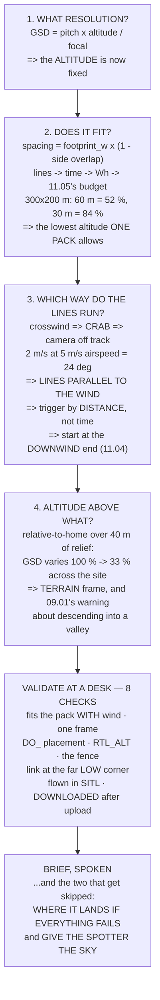

# 12.02 Planning a real mission in a ground station

<!-- glance:start -->
<!-- generated by tools/build.py from curriculum/syllabus.yaml — edit the syllabus, not this block -->

| | |
|---|---|
| **Track** | Main path |
| **Difficulty** | Intermediate |
| **Time** | 1 h 30 min |
| **Hardware** | First flight (Hermon core) (stage 1) |
| **Software** | qgc |
| **Prerequisites** | [12.01 Waypoints: the mission as a list of commands](12.01-waypoints.md) |
| **Skip if** | You can plan a survey grid with correct overlap and altitude and validate it before uploading. |

<!-- glance:end -->

## What you will learn

- That a survey grid is **the camera, divided** — every number is one arithmetic step
- Why Part 107's 120 m ceiling caps your **area**, not your resolution
- The altitude trade, priced: **60 m fits one pack and 30 m needs two, with 884 images**
- Which way the lines run, and why the wind decides — **parallel to it, never across**
- Why `DO_SET_CAM_TRIGG_DIST` makes the overlap correct in any wind
- That 40 m of relief flown relative to home changes the **GSD by a third across the site**
- Eight validation checks you can do at a desk, and the brief you speak before arming

## Why it matters

12.01 made a mission a list of commands. This lesson makes it a **job**, and the useful discovery
is how little of it is a judgement call.

A survey grid is the camera divided by arithmetic. Ground sample distance is pixel pitch times
altitude over focal length. The footprint is the sensor scaled the same way. Line spacing is the
footprint width times one minus the side overlap, and the trigger interval is the footprint height
times one minus the forward overlap. **Once you have chosen a resolution and two overlaps,
everything else is determined** — and the ground station's survey tool is doing exactly this
behind a slider.

What that buys you is a decision you can make before anyone drives anywhere. A 300 × 200 m area at
60 m gives 2.06 cm/px, **52 % of a pack, 252 images**. The same area at 30 m gives 1.03 cm/px —
and **84 % of a pack, two flights, 884 images**. Halving the altitude halves the GSD and
quadruples the work, and 11.05's reserve decides which one you can actually fly.

And two things that only wind and terrain reveal. **Fly the lines parallel to the wind**, because
a crosswind means a crab angle and a crab angle is the camera pointing off the track — 2 m/s of
crosswind at 5 m/s of airspeed is 24°. And a 60 m survey over 40 m of relief, flown relative to
home, has a **GSD that varies by a third across the site**, which is how a photogrammetry run
fails after the flight.

## Prerequisites

<!-- prereqs:start -->
## Prerequisites

You need these first:

- [12.01 Waypoints: the mission as a list of commands](12.01-waypoints.md)

### Optional prerequisite links

None.

Check your readiness: `python course.py why 12.02`
<!-- prereqs:end -->

## Concept

Planning a mission is answering four questions in order, and the order matters because each
answer constrains the next.

**What resolution do you need?** That sets the altitude, through the camera geometry, and nothing
else in the plan can change it.

**Does it fit?** The altitude sets the number of lines, the lines set the flight time, and 11.05's
budget says whether that leaves a reserve. If it does not, you fly higher or you fly twice.

**Which way do the lines run?** The wind decides — parallel to it, so the crab is zero and the
camera points along the track.

**What is the altitude measured from?** Relative to home is simple and wrong on a slope. Terrain
frame is right and needs data or a rangefinder.

Then the validation, which is eight checks at a desk, and the brief, which is spoken. Both exist
because a mission that fails validation costs nothing and a mission that fails in the air costs
everything.

## Technical explanation

### Level 1 — the grid is the camera, divided

A 4000 × 3000 sensor, 6.17 × 4.55 mm, 4.5 mm lens — pixel pitch 1.54 µm **[E]**:

| altitude | GSD | footprint | line spacing | trigger |
|---|---|---|---|---|
| 30 m | 1.03 cm | 41 × 30 m | 12.3 m | 1.2 s |
| **60 m** | **2.06 cm** | 82 × 61 m | **24.7 m** | 2.4 s |
| 100 m | 3.43 cm | 137 × 101 m | 41.1 m | 4.0 s |
| 120 m | 4.11 cm | 165 × 121 m | 49.4 m | 4.9 s |

$$\text{GSD} = \frac{\text{pitch}\times h}{f},\qquad
\text{spacing} = \text{footprint}_w(1-\text{side overlap})$$

**Nothing here is a preference.** Choose a GSD and two overlaps and the altitude, the spacing and
the trigger rate are all determined.

And the ceiling works the other way round from how it sounds. 120 m is Part 107's limit (18.05),
and at 120 m this camera gives its **coarsest** image. The ceiling does not cap your resolution —
it caps how much **area** one flight can cover, because the footprint cannot get any wider.

### Level 2 — the altitude trade, priced

A 300 × 200 m area, 70 % side and 80 % forward overlap:

| alt | GSD | lines | time | Wh | of pack | images |
|---|---|---|---|---|---|---|
| **30 m** | 1.03 cm | 26 | 20.1 min | 74.9 | **84 %** | **884** |
| 40 m | 1.37 cm | 20 | 15.7 min | 60.3 | 68 % | 520 |
| **60 m** | 2.06 cm | 14 | 11.3 min | 46.2 | **52 %** | **252** |
| 100 m | 3.43 cm | 9 | 7.7 min | 35.2 | 40 % | 99 |

**Halving the altitude halves the GSD and quadruples the work**, because you need twice as many
lines each covering half as much ground per frame.

Read the "of pack" column against 11.05's budget. Anything over about 60 % leaves no reserve once
11.04's wind is priced in — so **the lowest altitude this area can be flown at in one pack is a
number**, and it is the first thing to compute when somebody asks for "the best resolution".

At 30 m: two packs and 884 images to process (14.06). At 60 m: one pack and 252.

### Level 3 — which way the lines run

| wind | crab at 5 m/s | smear across a 60 m frame |
|---|---|---|
| 0 m/s | 0° | 0 m |
| **2 m/s** | **24°** | 24.3 m |
| 4 m/s | 53° | 48.5 m |
| **6 m/s** | **no heading works** | — |

**Fly the lines parallel to the wind, not across it.** Each line is then a headwind or a tailwind,
the crab is zero, and the camera points along the track on every pass.

The cost is that alternate lines fly at different ground speeds — which matters only if you
trigger by *time*. **Trigger by distance** (`DO_SET_CAM_TRIGG_DIST`) and the overlap is correct on
every line whatever the wind is doing.

And 11.04's upwind-first rule still applies: **start the grid at the downwind end**, so the
aircraft works its way upwind while the pack is full and drifts home if anything fails.

### Level 4 — altitude above what

| frame | means | when |
|---|---|---|
| `GLOBAL_RELATIVE_ALT` | above the **home point** | flat sites |
| `GLOBAL` (AMSL) | above mean sea level | when home elevation is unreliable |
| **`TERRAIN`** | above the **ground under the aircraft** | the only one that keeps GSD constant |

A 60 m survey over 40 m of relief, flown relative to home:

| ground rises by | true AGL | GSD | vs planned |
|---|---|---|---|
| 0 m | 60 m | 2.06 cm | 100 % |
| 20 m | 40 m | 1.37 cm | 67 % |
| **40 m** | **20 m** | **0.69 cm** | **33 %** |

**The GSD changes by a third across the site**, and the overlap changes with it — so the high
ground is over-sampled and the low ground may not overlap at all, which is how a photogrammetry
run fails *after* the flight.

Terrain frame fixes it, and needs either SRTM data loaded (12.05) or a rangefinder (05.05). And
09.01 has a warning: following terrain **down** into a valley also takes you below the Fresnel
clearance for your link.

### Level 5 — validate, then brief

Eight checks, all at a desk:

1. Does it **fit the pack**, with 11.05's reserve *and* 11.04's wind?
2. Is every altitude in the **same frame**?
3. Is every `DO_` item after the waypoint it belongs to (12.01)?
4. Is `RTL_ALT` above the tallest thing on the route (09.03)?
5. Does the fence contain the whole grid, with margin (12.03)?
6. At the far corner, and the **lowest** point of the route, is the link still clear (09.01)?
7. **Has it flown in SITL** (10.04)?
8. Did you **download it** after uploading (12.01)?

And the brief, which is spoken: the area and whose it is; the wind **in lean degrees**; the time
and energy against the budget; `RTL_ALT` and the tallest obstacle; the fence; the abort criteria;
**where it lands if everything fails**; and who is watching, for what.

The last two get skipped. "Where it lands if everything fails" has an answer on every site and it
is never the middle of the grid. And a spotter without a specific job watches the aircraft, which
is what the pilot is already doing — **give the spotter the sky.**

## Diagram



## Code

Derive the grid from the camera geometry at six altitudes, price the altitude trade in packs and
images, compute the crab angle that decides the line direction, show what 40 m of relief does to
the GSD, and list the eight validation checks and the brief.

```python
"""12.02 - a survey grid, derived from the camera and checked against the pack."""
import math

# the camera (14.01 will measure yours; these are a typical 1/2.3" module) [E]
SENSOR_W, SENSOR_H = 6.17e-3, 4.55e-3     # m
PIX_W, PIX_H = 4000, 3000
FOCAL = 4.5e-3            # m
PITCH = SENSOR_W / PIX_W  # m per pixel

# the aircraft
WPNAV_SPEED = 5.0
WPNAV_ACCEL = 2.5
WPNAV_RADIUS = 2.0
CRUISE_W = 203.0
HOVER_W = 226.0
USABLE_WH = 88.8
CLIMB_MS = 2.5

# the job
AREA_W, AREA_H = 300.0, 200.0             # m
SIDE_OVERLAP = 0.70
FWD_OVERLAP = 0.80

# what a preflight brief has to contain, and who it is for
BRIEF = [
    ("the area, and who owns it", "permission is not a technicality"),
    ("the wind, in LEAN DEGREES", "11.04. Measured, not forecast"),
    ("the mission time and energy", "against 11.05's budget WITH reserve"),
    ("the RTL_ALT and the tallest obstacle", "09.03: not 'higher is safer'"),
    ("the fence, and what it does", "12.03"),
    ("the abort criteria", "11.01's card, still current"),
    ("where it lands if everything fails", "chosen, not discovered"),
    ("who is watching, and for what", "a spotter with a job, not an audience"),
]


def gsd(alt, pitch=PITCH, f=FOCAL):
    """Ground sample distance: metres per pixel, at that height."""
    return pitch * alt / f


def footprint(alt):
    """How much ground one frame covers, across and along track."""
    return SENSOR_W * alt / FOCAL, SENSOR_H * alt / FOCAL


def leg_time(dist, speed=WPNAV_SPEED, accel=WPNAV_ACCEL):
    d_acc = speed ** 2 / (2 * accel)
    if 2 * d_acc >= dist:
        return 2 * math.sqrt(dist / accel)
    return 2 * speed / accel + (dist - 2 * d_acc) / speed


def grid(alt, area_w=AREA_W, area_h=AREA_H,
         side=SIDE_OVERLAP, fwd=FWD_OVERLAP, speed=WPNAV_SPEED):
    """The whole survey, from the camera geometry."""
    fw, fh = footprint(alt)
    spacing = fw * (1 - side)
    lines = max(1, math.ceil(area_w / spacing) + 1)
    trigger_m = fh * (1 - fwd)
    shots_per_line = math.ceil(area_h / trigger_m) + 1
    t_line = leg_time(area_h, speed)
    t_turn = leg_time(spacing, speed)
    t_total = lines * t_line + (lines - 1) * t_turn
    return dict(alt=alt, gsd=gsd(alt), spacing=spacing, lines=lines,
                trigger_m=trigger_m, trigger_s=trigger_m / speed,
                shots=lines * shots_per_line,
                flown_m=lines * area_h + (lines - 1) * spacing,
                t=t_total, wh=CRUISE_W * t_total / 3600)


def bar(t):
    print("\n" + "=" * 70)
    print(t)
    print("=" * 70)


if __name__ == "__main__":
    bar("1. THE GRID IS NOT A DRAWING -- IT IS THE CAMERA, DIVIDED")
    print(f"  A {PIX_W}x{PIX_H} sensor, {SENSOR_W * 1000:.2f} x"
          f" {SENSOR_H * 1000:.2f} mm, {FOCAL * 1000:.1f} mm lens. [E]")
    print(f"  Pixel pitch {PITCH * 1e6:.2f} um. Everything else follows.")
    print(f"  {'altitude':>9s} {'GSD':>10s} {'footprint':>16s}"
          f" {'line spacing':>13s} {'trigger':>10s}")
    for alt in (30, 40, 60, 80, 100, 120):
        g = grid(alt)
        fw, fh = footprint(alt)
        print(f"  {alt:7d} m {g['gsd'] * 100:7.2f} cm {fw:6.0f} x {fh:3.0f} m"
              f" {g['spacing']:11.1f} m {g['trigger_s']:8.1f} s")
    print("  EVERY COLUMN IS ONE DIVISION. GSD is pitch x altitude over")
    print("  focal length. The footprint is the sensor, scaled the same")
    print("  way. Line spacing is the footprint WIDTH times one minus")
    print("  the side overlap. And the trigger interval is the footprint")
    print("  HEIGHT times one minus the forward overlap, over the speed.")
    print("  NOTHING HERE IS A PREFERENCE. Once you have chosen a GSD")
    print("  and two overlaps, the altitude, the spacing and the trigger")
    print("  rate are all determined -- and the ground station's survey")
    print("  tool is doing exactly this arithmetic behind a slider.")
    print("\n  AND THE CEILING WORKS THE OTHER WAY ROUND FROM HOW IT")
    print("  SOUNDS. 120 m is Part 107's limit (18.05), and at 120 m")
    print(f"  this camera gives {gsd(120) * 100:.1f} cm/px -- the COARSEST it will")
    print("  ever produce. The ceiling does not cap your resolution;")
    print("  it caps how much AREA one flight can cover, because the")
    print("  footprint cannot get any wider. Resolution is capped by")
    print("  how low you are willing to fly, and section 2 prices it.")

    bar("2. THE ALTITUDE TRADE, IN FLIGHT TIME AND IN PIXELS")
    print(f"  A {AREA_W:.0f} x {AREA_H:.0f} m area, {SIDE_OVERLAP * 100:.0f} %"
          f" side and {FWD_OVERLAP * 100:.0f} % forward overlap:")
    print(f"  {'alt':>5s} {'GSD':>8s} {'lines':>6s} {'flown':>8s}"
          f" {'time':>8s} {'Wh':>6s} {'of pack':>8s} {'shots':>7s}")
    for alt in (30, 40, 60, 80, 100, 120):
        g = grid(alt)
        climb = alt / CLIMB_MS
        wh = g['wh'] + HOVER_W * 1.3 * climb / 3600 + 6.0
        print(f"  {alt:4d}m {g['gsd'] * 100:6.2f}cm {g['lines']:6d}"
              f" {g['flown_m']:7.0f}m {g['t'] / 60:6.1f}min {wh:6.1f}"
              f" {wh / USABLE_WH * 100:7.0f}% {g['shots']:7d}")
    print("  THE TRADE IS BRUTAL AND IT IS NOT LINEAR. Halving the")
    print("  altitude halves the GSD -- twice the detail -- and")
    print("  QUADRUPLES the work, because you need twice as many lines")
    print("  each covering half as much ground per frame.")
    print("  READ THE 'OF PACK' COLUMN AGAINST 11.05's BUDGET. Anything")
    print("  over about 60 % leaves no reserve once 11.04's wind is")
    print("  priced in, so THE LOWEST ALTITUDE THIS AREA CAN BE FLOWN AT")
    print("  IN ONE PACK is a number, and it is the first thing to")
    print("  compute when somebody asks for 'the best resolution'.")
    for alt in (30, 40, 60):
        g = grid(alt)
        wh = g['wh'] + HOVER_W * 1.3 * (alt / CLIMB_MS) / 3600 + 6.0
        packs = math.ceil(wh / (USABLE_WH * 0.65))
        print(f"    at {alt:3d} m: {packs} pack(s), and"
              f" {g['shots']} images to process (14.06)")

    bar("3. WHICH WAY DO THE LINES RUN? THE WIND DECIDES")
    print("  11.04 gave two facts that settle this. A crosswind needs a")
    print("  CRAB ANGLE, and the crab angle is the camera pointing off")
    print("  the track. And LOIT_SPEED loses to a 6 m/s wind.")
    print(f"  {'wind':>6s} {'crab at 5 m/s':>14s} {'GSD smear across':>18s}")
    for w in (0, 2, 4, 6, 8):
        s = w / WPNAV_SPEED
        if s >= 1.0:
            print(f"  {w:4d}m/s {'NO HEADING WORKS':>14s} {'-':>18s}")
            continue
        crab = math.degrees(math.asin(s))
        fw, fh = footprint(60)
        smear = fh * math.sin(math.radians(crab))
        print(f"  {w:4d}m/s {crab:12.0f} d {smear:15.1f} m")
    print("  SO FLY THE LINES PARALLEL TO THE WIND, not across it. Each")
    print("  line is then a headwind or a tailwind, the crab is zero,")
    print("  and the camera points along the track on every pass.")
    print("  THE COST IS THAT ALTERNATE LINES FLY AT DIFFERENT GROUND")
    print("  SPEEDS, which matters only if you trigger by TIME. TRIGGER")
    print("  BY DISTANCE (DO_SET_CAM_TRIGG_DIST) and the overlap is")
    print("  correct on every line whatever the wind is doing.")
    print("  AND 11.04's UPWIND-FIRST RULE STILL APPLIES: start the grid")
    print("  at the DOWNWIND end, so the aircraft works its way upwind")
    print("  while the pack is full and drifts home if anything fails.")

    bar("4. ALTITUDE ABOVE WHAT? THE THREE ANSWERS")
    frames = [
        ("GLOBAL_RELATIVE_ALT", "above the HOME point",
         "flat sites. Simple, and wrong on a slope"),
        ("GLOBAL (AMSL)", "above mean sea level",
         "when the ground station's home elevation is unreliable"),
        ("TERRAIN", "above the GROUND, from SRTM or a rangefinder",
         "the only one that keeps the GSD constant over terrain"),
    ]
    print(f"  {'frame':22s} {'means':34s}")
    for a, b, c in frames:
        print(f"  {a:22s} {b:34s}")
        print(f"  {'':22s} {c}")
    print("  A 60 m SURVEY OVER 40 m OF RELIEF, FLOWN RELATIVE TO HOME:")
    print(f"  {'ground rises by':>16s} {'true AGL':>10s} {'GSD':>9s}"
          f" {'vs planned':>11s}")
    for rise in (0, 10, 20, 30, 40):
        agl = 60 - rise
        print(f"  {rise:14d} m {agl:8d} m {gsd(agl) * 100:7.2f}cm"
              f" {gsd(agl) / gsd(60) * 100:9.0f} %")
    print("  THE GSD CHANGES BY A THIRD ACROSS THE SITE and the overlap")
    print("  changes with it -- so the high ground is over-sampled and")
    print("  the low ground may not overlap at all, which is how a")
    print("  photogrammetry run fails AFTER the flight.")
    print("  TERRAIN FRAME FIXES IT, and it needs either SRTM data")
    print("  loaded (12.05) or a rangefinder (05.05) -- and 09.01 has a")
    print("  warning: following terrain DOWN into a valley also takes")
    print("  you below the Fresnel clearance for your link.")

    bar("5. VALIDATE BEFORE YOU UPLOAD, AND BRIEF BEFORE YOU ARM")
    print("  Eight checks, all of which can be done at a desk:")
    checks = [
        ("does it FIT the pack, with 11.05's reserve?",
         "section 2's 'of pack' column, plus wind"),
        ("is every altitude in the SAME frame?", "12.01, and section 4"),
        ("is every DO_ item after the waypoint it belongs to?", "12.01"),
        ("is RTL_ALT above the tallest thing on the route?", "09.03"),
        ("does the fence contain the whole grid, with margin?", "12.03"),
        ("at the far corner, is the link still clear?",
         "09.01's Fresnel floor, at the LOWEST point of the route"),
        ("has it flown in SITL?", "10.04. Free, and faster than real time"),
        ("did you DOWNLOAD it after uploading?", "12.01's caution"),
    ]
    for i, (q, why) in enumerate(checks, 1):
        print(f"  {i}. {q}")
        print(f"     ({why})")
    print("\n  AND THE BRIEF, which is spoken rather than written:")
    print(f"  {'item':38s} {'why'}")
    for a, b in BRIEF:
        print(f"  {a:38s} {b}")
    print("  THE LAST TWO ARE THE ONES THAT GET SKIPPED. 'Where it lands")
    print("  if everything fails' has an answer on every site and it is")
    print("  never the middle of the grid -- and a spotter without a")
    print("  specific job watches the aircraft, which is the one thing")
    print("  the pilot is already doing.")
    print("  GIVE THE SPOTTER A JOB: watch the SKY, not the aircraft.")
```

Output:

```text

======================================================================
1. THE GRID IS NOT A DRAWING -- IT IS THE CAMERA, DIVIDED
======================================================================
  A 4000x3000 sensor, 6.17 x 4.55 mm, 4.5 mm lens. [E]
  Pixel pitch 1.54 um. Everything else follows.
   altitude        GSD        footprint  line spacing    trigger
       30 m    1.03 cm     41 x  30 m        12.3 m      1.2 s
       40 m    1.37 cm     55 x  40 m        16.5 m      1.6 s
       60 m    2.06 cm     82 x  61 m        24.7 m      2.4 s
       80 m    2.74 cm    110 x  81 m        32.9 m      3.2 s
      100 m    3.43 cm    137 x 101 m        41.1 m      4.0 s
      120 m    4.11 cm    165 x 121 m        49.4 m      4.9 s
  EVERY COLUMN IS ONE DIVISION. GSD is pitch x altitude over
  focal length. The footprint is the sensor, scaled the same
  way. Line spacing is the footprint WIDTH times one minus
  the side overlap. And the trigger interval is the footprint
  HEIGHT times one minus the forward overlap, over the speed.
  NOTHING HERE IS A PREFERENCE. Once you have chosen a GSD
  and two overlaps, the altitude, the spacing and the trigger
  rate are all determined -- and the ground station's survey
  tool is doing exactly this arithmetic behind a slider.

  AND THE CEILING WORKS THE OTHER WAY ROUND FROM HOW IT
  SOUNDS. 120 m is Part 107's limit (18.05), and at 120 m
  this camera gives 4.1 cm/px -- the COARSEST it will
  ever produce. The ceiling does not cap your resolution;
  it caps how much AREA one flight can cover, because the
  footprint cannot get any wider. Resolution is capped by
  how low you are willing to fly, and section 2 prices it.

======================================================================
2. THE ALTITUDE TRADE, IN FLIGHT TIME AND IN PIXELS
======================================================================
  A 300 x 200 m area, 70 % side and 80 % forward overlap:
    alt      GSD  lines    flown     time     Wh  of pack   shots
    30m   1.03cm     26    5508m   20.1min   74.9      84%     884
    40m   1.37cm     20    4313m   15.7min   60.3      68%     520
    60m   2.06cm     14    3121m   11.3min   46.2      52%     252
    80m   2.74cm     11    2529m    9.1min   39.5      44%     154
   100m   3.43cm      9    2129m    7.7min   35.2      40%      99
   120m   4.11cm      8    1946m    7.0min   33.6      38%      80
  THE TRADE IS BRUTAL AND IT IS NOT LINEAR. Halving the
  altitude halves the GSD -- twice the detail -- and
  QUADRUPLES the work, because you need twice as many lines
  each covering half as much ground per frame.
  READ THE 'OF PACK' COLUMN AGAINST 11.05's BUDGET. Anything
  over about 60 % leaves no reserve once 11.04's wind is
  priced in, so THE LOWEST ALTITUDE THIS AREA CAN BE FLOWN AT
  IN ONE PACK is a number, and it is the first thing to
  compute when somebody asks for 'the best resolution'.
    at  30 m: 2 pack(s), and 884 images to process (14.06)
    at  40 m: 2 pack(s), and 520 images to process (14.06)
    at  60 m: 1 pack(s), and 252 images to process (14.06)

======================================================================
3. WHICH WAY DO THE LINES RUN? THE WIND DECIDES
======================================================================
  11.04 gave two facts that settle this. A crosswind needs a
  CRAB ANGLE, and the crab angle is the camera pointing off
  the track. And LOIT_SPEED loses to a 6 m/s wind.
    wind  crab at 5 m/s   GSD smear across
     0m/s            0 d             0.0 m
     2m/s           24 d            24.3 m
     4m/s           53 d            48.5 m
     6m/s NO HEADING WORKS                  -
     8m/s NO HEADING WORKS                  -
  SO FLY THE LINES PARALLEL TO THE WIND, not across it. Each
  line is then a headwind or a tailwind, the crab is zero,
  and the camera points along the track on every pass.
  THE COST IS THAT ALTERNATE LINES FLY AT DIFFERENT GROUND
  SPEEDS, which matters only if you trigger by TIME. TRIGGER
  BY DISTANCE (DO_SET_CAM_TRIGG_DIST) and the overlap is
  correct on every line whatever the wind is doing.
  AND 11.04's UPWIND-FIRST RULE STILL APPLIES: start the grid
  at the DOWNWIND end, so the aircraft works its way upwind
  while the pack is full and drifts home if anything fails.

======================================================================
4. ALTITUDE ABOVE WHAT? THE THREE ANSWERS
======================================================================
  frame                  means                             
  GLOBAL_RELATIVE_ALT    above the HOME point              
                         flat sites. Simple, and wrong on a slope
  GLOBAL (AMSL)          above mean sea level              
                         when the ground station's home elevation is unreliable
  TERRAIN                above the GROUND, from SRTM or a rangefinder
                         the only one that keeps the GSD constant over terrain
  A 60 m SURVEY OVER 40 m OF RELIEF, FLOWN RELATIVE TO HOME:
   ground rises by   true AGL       GSD  vs planned
               0 m       60 m    2.06cm       100 %
              10 m       50 m    1.71cm        83 %
              20 m       40 m    1.37cm        67 %
              30 m       30 m    1.03cm        50 %
              40 m       20 m    0.69cm        33 %
  THE GSD CHANGES BY A THIRD ACROSS THE SITE and the overlap
  changes with it -- so the high ground is over-sampled and
  the low ground may not overlap at all, which is how a
  photogrammetry run fails AFTER the flight.
  TERRAIN FRAME FIXES IT, and it needs either SRTM data
  loaded (12.05) or a rangefinder (05.05) -- and 09.01 has a
  warning: following terrain DOWN into a valley also takes
  you below the Fresnel clearance for your link.

======================================================================
5. VALIDATE BEFORE YOU UPLOAD, AND BRIEF BEFORE YOU ARM
======================================================================
  Eight checks, all of which can be done at a desk:
  1. does it FIT the pack, with 11.05's reserve?
     (section 2's 'of pack' column, plus wind)
  2. is every altitude in the SAME frame?
     (12.01, and section 4)
  3. is every DO_ item after the waypoint it belongs to?
     (12.01)
  4. is RTL_ALT above the tallest thing on the route?
     (09.03)
  5. does the fence contain the whole grid, with margin?
     (12.03)
  6. at the far corner, is the link still clear?
     (09.01's Fresnel floor, at the LOWEST point of the route)
  7. has it flown in SITL?
     (10.04. Free, and faster than real time)
  8. did you DOWNLOAD it after uploading?
     (12.01's caution)

  AND THE BRIEF, which is spoken rather than written:
  item                                   why
  the area, and who owns it              permission is not a technicality
  the wind, in LEAN DEGREES              11.04. Measured, not forecast
  the mission time and energy            against 11.05's budget WITH reserve
  the RTL_ALT and the tallest obstacle   09.03: not 'higher is safer'
  the fence, and what it does            12.03
  the abort criteria                     11.01's card, still current
  where it lands if everything fails     chosen, not discovered
  who is watching, and for what          a spotter with a job, not an audience
  THE LAST TWO ARE THE ONES THAT GET SKIPPED. 'Where it lands
  if everything fails' has an answer on every site and it is
  never the middle of the grid -- and a spotter without a
  specific job watches the aircraft, which is the one thing
  the pilot is already doing.
  GIVE THE SPOTTER A JOB: watch the SKY, not the aircraft.
```

## Exercise

### Exercise 12.02-E1 — Derive the grid for your own camera `[analysis]`

Find your camera's sensor size, pixel count and focal length — from the specification, and from
14.02's calibration if you have done it. Compute GSD, footprint, line spacing and trigger interval
at five altitudes. Then check your numbers against what your ground station's survey tool produces
for the same overlaps. Any disagreement is a specification you have wrong.

### Exercise 12.02-E2 — Find your one-pack altitude `[analysis]`

For an area you actually want to survey, compute the pack fraction at each altitude including the
climb and a landing reserve. Add 11.04's wind penalty at your wind limit. Report the lowest
altitude that fits in one pack with 25 % reserve, and the GSD it gives. Then answer the client's
question honestly: *"to do better than that, we need two flights."*

### Exercise 12.02-E3 — Plan the same grid twice `[analysis]`

Plan the survey with lines parallel to the wind and again with lines across it. Compute for each:
the crab angle, the flight time (the across-wind version is symmetric, the along-wind one has fast
and slow legs), and whether the trigger interval needs to change. Say which you would fly and what
the along-wind version costs you.

### Exercise 12.02-E4 — Validate a deliberately broken mission `[analysis]`

Build a mission with four planted faults: a mixed altitude frame, a `DO_` item on the wrong side
of a waypoint, an `RTL_ALT` below a known obstacle, and a total energy that does not leave a
reserve. Run 12.01's mission checker on it and confirm it catches all four. Then fly it in SITL
and see which of the four SITL *also* catches — and which it does not.

## Expected result

**12.02-E1**: your numbers should match the ground station's within a per cent if the
specification is right. The commonest error is using the *35 mm equivalent* focal length with the
*real* sensor size, which gives a GSD wrong by a factor of five.

**12.02-E2**: for a 300 × 200 m area on a Hermon-class aircraft, expect the one-pack altitude to
land between 50 and 70 m with a 2–3 cm GSD. Below that you are into two flights, which is not a
failure — it is a plan, and it is a plan you can tell someone about in advance.

**12.02-E3**: the across-wind version has a constant crab (which is the camera pointing off track
on every frame) and a symmetric flight time; the along-wind one has zero crab and legs that differ
in duration by the wind fraction. **Along-wind wins**, and the cost is nothing at all if you
trigger by distance.

**12.02-E4**: 12.01's checker should catch all four. SITL catches the `RTL_ALT` (if you have
terrain) and the energy (if you model the battery), and it does **not** catch the mixed frames or
the `DO_` placement, because both produce a mission that flies perfectly — just not the one you
meant. That is 10.01's point about logic bugs arriving in a specific form.

## Troubleshooting

**The photogrammetry run will not stitch.** Check the overlap actually achieved, not the planned
one. Level 4's relief and Level 3's crab both reduce it, and 12.01's acceptance radius cuts the
ends off every line.

**The mission is much longer than the ground station predicted.** Ground stations often assume
constant speed. 12.01's Level 4 showed that short legs never reach `WPNAV_SPEED`, and every turn
is a stop and a restart.

**The images are blurred in one direction only.** Motion blur along the track — the exposure is
too long for the ground speed. 14.03 has the shutter-speed rule; the short version is that the
image must not move more than about one pixel during the exposure, which at 2 cm GSD and 5 m/s is
4 ms.

**The aircraft runs out of battery mid-grid.** Level 2, plus wind. Re-plan at a higher altitude or
split into two flights with a planned break point — which is much better than discovering the
break point at 20 % state of charge.

**Half the survey is at the wrong resolution.** Level 4. You flew relative to home over sloping
ground.

**The link drops at the far corner.** 09.01's Fresnel floor, and check the **lowest** point of the
route rather than the average. A terrain-following mission descending into a valley is exactly the
case.

> [!WARNING]
> **A mission that validates is not a mission that is safe.** The eight checks confirm that the
> plan is internally consistent and fits the aircraft; they say nothing about what is under the
> flight path. Walk or overfly the route once before the first automated run of any new site, and
> mark on the plan where people, roads, livestock and power lines are. An AUTO mission does not
> look down, does not hear anything and will fly the line you drew whatever has moved onto it —
> which is why the brief includes a spotter whose job is the sky and the ground, not the aircraft.

## Common mistakes

- **Choosing the altitude before checking the budget.** Level 2 makes it a two-flight job without
  telling you.
- **Flying lines across the wind.** Constant crab, and the camera points off track on every frame.
- **Triggering by time.** In any wind the overlap then varies line by line.
- **Using the 35 mm-equivalent focal length.** The GSD comes out wrong by a large factor.
- **Flying relative to home over sloping ground.** A third of the GSD and all of the overlap.
- **Planning the grid and forgetting the fence.** 12.03, and the margin has to be outside the
  turns, not the lines.
- **A spotter with no job.** They watch the aircraft, which is what you are doing.

## Knowledge check

<details>
<summary>Once you have chosen a GSD and two overlaps, what is left to decide?</summary>

**Almost nothing.** The altitude follows from the GSD ($\text{GSD} = \text{pitch}\times h / f$);
the footprint follows from the altitude; the line spacing is the footprint width times one minus
the side overlap; the trigger interval is the footprint height times one minus the forward
overlap. The ground station's survey tool is doing exactly this behind a slider. What is left is
the *direction* of the lines, which the wind decides.
</details>

<details>
<summary>Part 107 caps you at 120 m. Does that cap your resolution?</summary>

**No — it caps your area.** At 120 m the camera produces its *coarsest* image; the ceiling limits
how much ground one flight can cover, because the footprint cannot get wider. Resolution is capped
by how **low** you are willing to fly, and that in turn is capped by the battery: Level 2 shows a
300 × 200 m area at 30 m needs two packs.
</details>

<details>
<summary>Halving the survey altitude halves the GSD. What does it do to the work?</summary>

**Quadruples it.** Twice as many lines, because the footprint width halves — and each line
produces twice as many images, because the footprint height halves too. For a 300 × 200 m area,
60 m is 14 lines, 11 minutes and 252 images; 30 m is 26 lines, 20 minutes and **884 images**, and
does not fit in one pack.
</details>

<details>
<summary>Why fly survey lines parallel to the wind rather than across it?</summary>

Because a crosswind requires a **crab angle**, and a crab angle is the camera pointing off the
track on every frame — 2 m/s of crosswind at 5 m/s of airspeed is **24°**. Flying parallel to the
wind makes every line a headwind or a tailwind with zero crab. The cost is that alternate legs
have different ground speeds, which matters only if you trigger by time — so **trigger by
distance** and it costs nothing.
</details>

<details>
<summary>A 60 m survey is flown relative to home over 40 m of relief. What happens?</summary>

The true height above ground varies from 60 m to 20 m, so the **GSD varies by a factor of three**
across the site — 2.06 cm down to 0.69 cm. The overlap varies with it: the high ground is
over-sampled and the low ground may not overlap at all, which is how a photogrammetry run fails
*after* the flight. `TERRAIN` frame fixes it, with SRTM data or a rangefinder.
</details>

<details>
<summary>Which validation check is about the link, and where exactly do you evaluate it?</summary>

Check 6: at the **far corner and the lowest point** of the route. 09.01 showed the Fresnel zone
needs 7.7 m of clearance at 2 km, and a terrain-following mission descending into a valley is the
case where a link that was fine on the plan is obstructed in the air. Evaluate the worst geometry,
not the average one.
</details>

<details>
<summary>What are the two items of the brief that get skipped, and why do they matter?</summary>

**"Where it lands if everything fails"** — which has an answer on every site and is never the
middle of the grid, so it has to be chosen rather than discovered. And **"who is watching, and for
what"** — because a spotter without a specific job watches the aircraft, which is exactly what the
pilot is already doing. **Give the spotter the sky.**
</details>

## Practical challenge

**Plan one real survey, and produce the three artefacts a client would accept.**

The **plan**: area, altitude, GSD, overlaps, line direction with the wind marked, number of lines,
predicted flight time and energy as a percentage of the pack, number of images, and — if it does
not fit — where the break between flights falls and why there.

The **validation sheet**: the eight checks, each with a yes and the evidence. Check 7 means a SITL
log; check 8 means a downloaded mission file. Both are attachments, not assertions.

The **brief**: eight lines, written out so you can read them aloud, including the abort criteria
from 11.01 and the landing-out point chosen from the map.

Then fly it, and afterwards add the fourth artefact: the **comparison**. Planned time against
actual, planned energy against actual, planned GSD against measured from one image with a known
object in it. Those three comparisons validate the whole chain from 02.11's powertrain to this
lesson's camera arithmetic, and they are what turns a survey into a repeatable service rather than
a flight that happened to work.

## You can skip this if

You can plan a survey grid with correct overlap and altitude and validate it before uploading.

## Go deeper

- [03.09](../03-power-system/03.09-endurance-prediction.md) (earlier): the cruise power every
  grid is costed against.
- [09.01](../09-telemetry-datalink/09.01-rf-and-link-budget.md) (earlier): the Fresnel clearance
  that check 6 evaluates at the lowest point of the route.
- [11.04](../11-first-flights/11.04-flying-in-wind.md) (earlier): the crab angle, and upwind-first.
- [11.05](../11-first-flights/11.05-battery-discipline.md) (earlier): the budget and reserve that
  decide the altitude.
- [12.01](12.01-waypoints.md) (earlier): the `DO_` placement and the acceptance radius that cuts
  every line short.
- [12.03](12.03-geofence.md) (next): the fence that has to contain the turns as well as the lines.
- [12.05](12.05-auto-takeoff-land-precision.md) (next): terrain following, and the data it needs.
- [14.01](../14-vision-perception/14.01-cameras-for-uavs.md) (later): the camera whose numbers
  this lesson assumed.
- [14.03](../14-vision-perception/14.03-gimbals-and-stabilisation.md) (later): motion blur and the
  shutter-speed rule.
- ArduPilot's camera and survey documentation, including `DO_SET_CAM_TRIGG_DIST`:
  https://ardupilot.org/copter/docs/common-camera-shutter-with-servo.html
- A clear treatment of ground sample distance and photogrammetric overlap:
  https://en.wikipedia.org/wiki/Ground_sample_distance

> **Ask your teacher:** *"We derived the whole survey grid from the camera — GSD, spacing and
> trigger interval are all one division — and found that our 300 × 200 m area fits one pack at
> 60 m and needs two at 30 m with 884 images. We are also flying the lines parallel to the wind
> because 2 m/s of crosswind is 24° of crab. Is that how survey work is actually planned, and how
> often does the answer come back as 'two flights'?"*

## Progress checkpoint

Run `python course.py complete 12.02` once your plan, validation sheet and brief exist for a real
site. Next: [12.03](12.03-geofence.md) — the boundary that makes the aircraft refuse.
