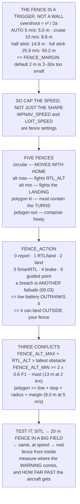

# 12.03 Geofence: making the aircraft refuse

<!-- glance:start -->
<!-- generated by tools/build.py from curriculum/syllabus.yaml — edit the syllabus, not this block -->

| | |
|---|---|
| **Track** | Main path |
| **Difficulty** | Intermediate |
| **Time** | 1 h 15 min |
| **Hardware** | First flight (Hermon core) (stage 1) |
| **Software** | ardupilot |
| **Prerequisites** | [12.02 Planning a real mission in a ground station](12.02-mission-planning.md) |
| **Skip if** | You have a tested fence around Hermon's field and can state what the aircraft does at the boundary. |

<!-- glance:end -->

## What you will learn

- That a fence is **not a wall — it is a trigger**, and the aircraft keeps going for a stopping
  distance after it fires
- Why `FENCE_MARGIN` is **derived**, not chosen: it is `v² / 2a` for the fastest mode you fly, and
  the 2 m default is **30× too small** at full stick
- The five fences (circular, altitude max, altitude min, polygon inclusion, polygon exclusion) and
  the specific trap in each
- Why the circular fence is the dangerous one: **it moves when home moves**
- The six `FENCE_ACTION` values, and why a fence breach on a low battery **lands outside your fence**
- Three conflicts you must resolve before flying: the ceiling against `RTL_ALT`, the floor against
  the radio link, and the fence against your survey turns
- How to test a fence with **180 m of grass around you** instead of at the edge of a quarry

## Why it matters

Everything you have built so far makes the aircraft *do* things. The fence is the first system in
this course whose entire job is to make it **refuse** — and refusal is what keeps a drone out of a
road, a school, a crowd, or the boundary of the airspace you were cleared into.

It is also the most commonly mis-set system on a hobby aircraft, because it looks like a drawing.
You open the ground station, you drag a shape around your field, and it feels finished. It is not
finished, because the shape you drew is where the aircraft **starts** stopping, not where it stops.
At the full-stick speed [11.02](../11-first-flights/11.02-manual-modes.md) measured, the
difference is fifty-nine metres, and fifty-nine metres is most of a small field.

There is a second reason, and it is the one that gets people in trouble with a regulator. A fence
is the only mechanism you have that **enforces** the limits you claimed on a flight plan. Saying
"I will stay within 400 ft and inside the field" is an intention. A fence is a control. When a
reviewer asks how you know you stayed inside the area, the honest answers are a log and a fence —
and only one of those works *during* the flight.

> [!WARNING]
> A fence is not a substitute for a pilot. Every action in this lesson assumes the aircraft is
> still flying, still navigating, and still has a position estimate. A fence cannot stop a
> mechanical failure, a lost pack, or an EKF that has given up — and
> [09.03](../09-telemetry-datalink/09.03-failsafe-when-the-link-drops.md) showed that losing the
> barometer removes every automatic action the aircraft has, the fence included.

## Prerequisites

<!-- prereqs:start -->
## Prerequisites

You need these first:

- [12.02 Planning a real mission in a ground station](12.02-mission-planning.md)

### Optional prerequisite links

None.

Check your readiness: `python course.py why 12.03`
<!-- prereqs:end -->

## Concept

Think about the last time you drove toward a red light. You did not stop **at** the light — you
began stopping well before it, and the distance you needed depended entirely on how fast you were
going. A hundred metres out at 30 km/h is luxurious. The same hundred metres at 130 km/h is an
emergency.

A geofence is exactly that red light, with one cruel difference: the aircraft does not see it
coming. There is no anticipation, no easing off. The aircraft flies at full commanded speed right
up to the line, the breach fires, and only *then* does it start decelerating — using the same
limited acceleration that [11.02](../11-first-flights/11.02-manual-modes.md) derived from the
lean angle. Whatever distance that takes, the aircraft spends **outside** the boundary you drew.

That single fact reorganises everything else in this lesson. It means a fence has two numbers, not
one: the shape, and the margin. It means the margin is a consequence of your **speed limits**, so
capping `WPNAV_SPEED` is a fence setting even though it does not have the word "fence" in it. And
it means the useful question is never "where is my fence?" but "where does the aircraft actually
come to rest if it hits the fence going as fast as it can go?"

The second idea is that a fence is a **constraint added to a system that already had constraints**,
and constraints fight. Your `RTL_ALT` clears the trees; your ceiling caps the height; those two
numbers must be ordered correctly or the fence quietly overrides your obstacle clearance. Your
radio link needs Fresnel clearance, which is a minimum altitude in disguise; your floor fence must
respect it. Your survey turns swing wide of the outermost line; your polygon must contain them.

Nobody discovers these conflicts by looking at the map. You discover them by writing the numbers
down next to each other — which is what this lesson's code does.

## Technical explanation

### Level 1 — the fence is where it starts stopping

Deceleration is bounded by the same physics as acceleration. In `AUTO` the bound is
`WPNAV_ACCEL` (2.5 m/s² by default). In a manual mode it is the lean angle:
`a = g·tan(ANGLE_MAX)`, which at 30° is 5.66 m/s². The distance to stop from speed `v` is `v²/2a`,
and it is **quadratic** — doubling the speed quadruples the overshoot.

Run the code and read the first table. `AUTO` at 5 m/s overshoots 5.0 m. `POSHOLD` at 03.09's 10 m/s
cruise overshoots 8.8 m. Half of full stick overshoots **14.8 m**, and
[11.02](../11-first-flights/11.02-manual-modes.md)'s full-stick 25.9 m/s overshoots **59.2 m**.
The default `FENCE_MARGIN` is 2 m. It is between 2× and 30× too small depending on what mode
the pilot happens to be in when they reach the line.

So the rule is derived rather than chosen:

```text
FENCE_MARGIN >= v² / (2a)   for the FASTEST mode you fly
```

The uncomfortable corollary is what this does to a small field. A 100 m radius fence with the
61 m margin that full stick demands leaves **39 m of usable radius**. You have two levers: lower
the margin, or lower the speed. Only one of those is under your control during the flight, and it
is the speed — `WPNAV_SPEED` and `LOIT_SPEED` are the real fence settings.

### Level 2 — five fences, five traps

The code's second table lists them. The circular fence (`FENCE_RADIUS`) is measured **from home**,
and home is set where the aircraft armed. Walk fifty metres down the field, re-arm, and the entire
fence has moved fifty metres with you — including away from the thing you were fencing *out*. That
is the worst trap in the lesson because it is completely invisible: the parameter did not change,
the map did not change, and the fence is somewhere else.

A polygon fence lives in absolute coordinates and does not move. For any site you fly more than
once, the polygon is the plan and the circular fence is a backstop.

Exclusion polygons are the mirror image and they are how you protect something specific — a
building, a car park, the neighbour's greenhouse. Several are allowed, and they compose with the
inclusion fence: you may fly inside the inclusion shape and outside every exclusion shape.

### Level 3 — what it does at the boundary, and who wins

`FENCE_ACTION` selects the response: report only (0), RTL-or-land (1, the default), always land
(2), SmartRTL (3), brake-or-land (4), or guided-to-a-point (6).

The part people miss is that a fence breach is **another failsafe**, and
[09.03](../09-telemetry-datalink/09.03-failsafe-when-the-link-drops.md)'s severity ladder still
applies. A fence breach that triggers RTL, on a low battery, **lands** — because battery-low
outranks it. That is almost always the correct engineering decision, and it means the aircraft can
come to rest **outside** the fence you put it inside.

If landing outside the fence is genuinely unacceptable — a fence around a road, water, or people —
then action 6 is the only one that does not assume home is reachable *or* that the ground under
the aircraft is safe.

### Level 4 — the three conflicts

**Ceiling against `RTL_ALT`.** The default fence action is RTL, and RTL *climbs* first. If
`RTL_ALT` exceeds `FENCE_ALT_MAX`, the fence's response to a breach is a second breach. ArduPilot
resolves this by clamping the climb to the fence, which does not crash anything but does mean your
carefully chosen obstacle clearance has been silently reduced. Order the three numbers:
`FENCE_ALT_MAX > RTL_ALT > the tallest thing on the route`.

**Floor against the link.** [09.01](../09-telemetry-datalink/09.01-rf-and-link-budget.md)'s
Fresnel clearance is a minimum altitude in disguise. With the ground antenna at 2 m over flat
ground the link midpoint sits halfway up, so the aircraft must fly at roughly twice the required
clearance. The code's table gives **5.7 m at 500 m, 13.3 m at 2 km, 16.8 m at 3 km**. A 3 km link
needs about seventeen metres of altitude before it needs anything else. `FENCE_ALT_MIN` is how you
stop yourself descending out of your own radio link — and the catch is that a floor fence fights
the landing, which is why it is disabled below a height and off by default.

**Fence against the survey turns.** [12.01](12.01-waypoints.md) showed that a 180° turn cuts the
full acceptance radius, and the turn needs room to decelerate on top of that. At 5 m/s the fence
must sit **9.0 m** outside the outermost survey line; at 8 m/s, **16.8 m**. The ground station
will happily draw a fence that hugs the grid. Draw it around the turns.

### Level 5 — testing without risking anything

Four steps, each safe by construction: the real fence file in SITL
([10.04](../10-simulation/10.04-ardupilot-sitl.md)); a **tiny** fence in a big field; the same
tiny fence at flying speed; then the real fence approached from inside and turned away from early.

Step 2 is the one everybody skips and it is the cheapest test in the course. A 20 m fence in a
200 m field lets you breach it repeatedly, at any speed, with 180 m of run-off in every direction —
and it answers every question the real fence raises for the price of one pack.

> [!TIP]
> **Ask your teacher:** "If my fence action is RTL and my battery is low when I breach, what does
> the aircraft actually do — and is the place it lands inside or outside the fence?" The answer is
> in Level 3, and it is the question that separates people who set a fence from people who
> understand one.

## Diagram



## Code

Compute the stopping distance for five modes and the margin each one demands, list the five fence
types with their traps and the six actions with their meanings, resolve the three conflicts
numerically, and lay out the four-step test.

```python
"""12.03 - the fence is where the aircraft STARTS stopping, not where it stops."""
import math

G = 9.81
ANGLE_MAX = 30.0
WPNAV_SPEED, WPNAV_ACCEL = 5.0, 2.5
LOIT_SPEED = 5.0
CRUISE = 10.0             # 03.09's cruise
FULL = 25.9               # 11.02: full stick, steady
FENCE_MARGIN_DEFAULT = 2.0
MAST = 2.0                # ground antenna height, 09.01
WPNAV_RADIUS = 2.0

# fence type, parameter, what it bounds, and the trap in it
TYPES = [
    ("circular", "FENCE_RADIUS", "distance from HOME",
     "HOME moves if you re-arm somewhere else"),
    ("altitude, max", "FENCE_ALT_MAX", "height above home",
     "conflicts with 09.01's Fresnel floor. See section 4"),
    ("altitude, min", "FENCE_ALT_MIN", "a FLOOR, for BVLOS work",
     "and it fights the LANDING, so it is disabled below a height"),
    ("polygon, inclusion", "a fence file", "stay INSIDE this shape",
     "must contain the TURNS, not just the lines (12.02)"),
    ("polygon, exclusion", "a fence file", "stay OUT of this shape",
     "several are allowed. This is how you protect a building"),
]

# FENCE_ACTION, and how it interacts with 09.03's priority ladder
ACTIONS = [
    (0, "report only", "a message and nothing else",
     "for learning where your fence actually is"),
    (1, "RTL or LAND", "RTL if it can, LAND if it cannot",
     "THE DEFAULT, and the right answer for most flying"),
    (2, "always LAND", "descend where it is",
     "when coming home across the fence is worse than landing out"),
    (3, "SmartRTL or RTL or LAND", "retrace, else RTL, else land",
     "for flying behind or inside things (09.03)"),
    (4, "brake or LAND", "stop dead, then land",
     "when you want it to stay put while you think"),
    (6, "guided to a point", "fly to a nominated recovery point",
     "the only action that does not assume HOME is safe"),
]


def stop_dist(v, a):
    return v * v / (2 * a)


def manual_accel(deg=ANGLE_MAX):
    return G * math.tan(math.radians(deg))


def fresnel_r(d_m, f_mhz=917.0):
    lam = 299_792_458.0 / (f_mhz * 1e6)
    return math.sqrt(lam * (d_m / 2) * (d_m / 2) / d_m)


def bar(t):
    print("\n" + "=" * 70)
    print(t)
    print("=" * 70)


if __name__ == "__main__":
    bar("1. THE FENCE IS WHERE IT STARTS STOPPING")
    print("  A fence is not a wall. It is a TRIGGER, and between the")
    print("  trigger and the aircraft actually stopping there is a")
    print("  stopping distance -- 11.02's lean limits, again.")
    print(f"  {'mode / speed':28s} {'accel':>9s} {'stops in':>10s}"
          f" {'vs FENCE_MARGIN 2 m':>21s}")
    cases = [("AUTO, WPNAV_SPEED 5", WPNAV_SPEED, WPNAV_ACCEL),
             ("LOITER, full stick", LOIT_SPEED, WPNAV_ACCEL),
             ("POSHOLD at 03.09's cruise", CRUISE, manual_accel()),
             ("STABILIZE, half of full", FULL / 2, manual_accel()),
             ("STABILIZE, full stick (11.02)", FULL, manual_accel())]
    for n, v, a in cases:
        d = stop_dist(v, a)
        print(f"  {n:28s} {a:7.2f} m/s2 {d:8.1f} m"
              f" {d / FENCE_MARGIN_DEFAULT:17.0f} x over")
    print("  THE DEFAULT FENCE_MARGIN IS 2 METRES AND THE AIRCRAFT NEEDS")
    print(f"  {stop_dist(FULL, manual_accel()):.0f} TO STOP FROM 11.02'S FULL"
          f"-STICK SPEED. The fence does not")
    print("  fail gracefully at that point -- the aircraft crosses it,")
    print("  the action fires, and the recovery happens OUTSIDE the")
    print("  boundary you drew.")
    print("\n  SO THE RULE IS DERIVED, NOT CHOSEN:")
    print("      FENCE_MARGIN >= v^2 / (2a) FOR THE FASTEST MODE YOU FLY")
    print(f"  {'if the fastest mode you fly is':34s} {'set margin to':>14s}")
    for n, v, a in cases:
        print(f"  {n:34s} {math.ceil(stop_dist(v, a)) + 1:12.0f} m")
    print("  AND NOTE WHAT THAT MEANS FOR A SMALL FIELD. A 100 m radius")
    print(f"  fence with the {math.ceil(stop_dist(FULL, manual_accel())) + 1:.0f} m margin full stick"
          f" demands leaves you"
          f" {100 - math.ceil(stop_dist(FULL, manual_accel())) - 1:.0f} m of")
    print("  usable radius -- so either the margin comes down or the")
    print("  SPEED does, and the speed is the one you can actually")
    print("  control: cap it with WPNAV_SPEED and LOIT_SPEED rather than")
    print("  hoping nobody pushes the stick.")

    bar("2. FIVE KINDS OF FENCE, AND THE TRAP IN EACH")
    print(f"  {'type':20s} {'parameter':16s} {'bounds'}")
    for t, p, b, trap in TYPES:
        print(f"  {t:20s} {p:16s} {b}")
        print(f"  {'':20s} {'':16s} TRAP: {trap}")
    print("  THE CIRCULAR FENCE'S TRAP IS THE WORST because it is")
    print("  invisible. FENCE_RADIUS is measured from HOME, and HOME is")
    print("  set WHERE THE AIRCRAFT ARMED. Move fifty metres down the")
    print("  field, re-arm, and the whole fence has moved fifty metres")
    print("  with you -- including away from the thing you were fencing")
    print("  OUT.")
    print("  A POLYGON FENCE IS IN ABSOLUTE COORDINATES AND DOES NOT")
    print("  MOVE. For any site you fly more than once, that is the one")
    print("  to use, and the circular fence becomes a backstop rather")
    print("  than the plan.")

    bar("3. WHAT IT DOES AT THE BOUNDARY, AND WHO WINS")
    print(f"  {'FENCE_ACTION':>13s}  {'does':38s}")
    for v, n, does, why in ACTIONS:
        print(f"  {v:11d}  {n:16s} {does}")
        print(f"  {'':13s}  {'':16s} {why}")
    print("  AND THE INTERACTION 09.03 SET UP: a fence breach is ANOTHER")
    print("  failsafe, and the severity ladder still applies. A fence")
    print("  breach that triggers RTL, on a low battery, LANDS -- because")
    print("  battery-low outranks it.")
    print("  THAT IS USUALLY CORRECT and it is worth knowing in advance,")
    print("  because it means the aircraft can land OUTSIDE the fence you")
    print("  put it inside. If landing outside the fence is unacceptable")
    print("  -- a fence around a road, a crowd, water -- then ACTION 6,")
    print("  guided to a nominated point, is the only one that does not")
    print("  assume home is reachable or that landing here is safe.")

    bar("4. THREE CONFLICTS YOU HAVE TO RESOLVE BEFORE FLYING")
    print("  A fence is a constraint added to a system that already had")
    print("  constraints, and three of them fight it.")

    print("\n  CONFLICT 1 -- THE CEILING AGAINST ITS OWN RECOVERY (09.03).")
    print("  FENCE_ACTION 1 is RTL. RTL CLIMBS to RTL_ALT first. So if")
    print("  RTL_ALT is above FENCE_ALT_MAX, the fence's own response to")
    print("  a breach is a second breach.")
    print(f"  {'FENCE_ALT_MAX':>14s} {'RTL_ALT':>9s} {'RTL climbs to':>14s}"
          f" {'result':>22s}")
    for ceil, rtl in ((30, 15), (30, 30), (30, 50), (60, 50), (120, 50)):
        climbs = max(rtl, 0)
        ok = "fine" if climbs <= ceil else "BREACHES THE CEILING"
        print(f"  {ceil:12d} m {rtl:7d} m {climbs:12d} m {ok:>22s}")
    print("  ARDUPILOT DOES NOT LET THE AIRCRAFT FALL OUT OF THE SKY OVER")
    print("  THIS -- it clamps the RTL climb to the fence -- but you now")
    print("  have an RTL that comes home LOWER than the altitude you")
    print("  chose in 09.03 for clearing obstacles. The fence quietly")
    print("  overrode your obstacle clearance.")
    print("  SO: FENCE_ALT_MAX > RTL_ALT > the tallest thing on the route.")
    print("  Three numbers, in that order, every site.")

    print("\n  CONFLICT 2 -- THE FLOOR AGAINST THE LINK (09.01).")
    print("  09.01's Fresnel clearance is a MINIMUM ALTITUDE in disguise.")
    print("  With the ground antenna at 2 m over flat ground, the link")
    print("  midpoint sits halfway up, so the aircraft has to fly at")
    print("  least twice the required clearance, less the mast:")
    print(f"  {'range':>7s} {'F1':>7s} {'need 60 %':>10s}"
          f" {'so fly at least':>16s}")
    for d in (500, 1000, 2000, 3000):
        f1 = fresnel_r(d)
        need = 0.6 * f1
        h = 2 * need - MAST
        print(f"  {d:5d} m {f1:5.1f} m {need:8.1f} m {h:14.1f} m")
    print("  A 3 km LINK NEEDS ABOUT 17 METRES OF ALTITUDE BEFORE IT")
    print("  NEEDS ANYTHING ELSE. That is not a comfort setting; it is")
    print("  the link budget, expressed as a height. If you are flying a")
    print("  low survey at range, FENCE_ALT_MIN is how you stop yourself")
    print("  descending out of your own radio link.")
    print("  AND THE CATCH: a minimum-altitude fence fights the LANDING,")
    print("  which is why ArduPilot disables it below a height and why it")
    print("  is off by default. Turn it on deliberately, for the flights")
    print("  that need it, and know it is off for the rest.")

    print("\n  CONFLICT 3 -- THE FENCE AGAINST THE SURVEY TURNS (12.02).")
    print("  12.01 showed a 180-degree turn cuts the FULL acceptance")
    print("  radius, and the turn itself needs room to decelerate:")
    print(f"  {'at WPNAV_SPEED':>15s} {'stop':>7s} {'+ radius':>10s}"
          f" {'+ margin':>10s} {'fence must be':>15s}")
    for v in (3.0, 5.0, 8.0):
        st = stop_dist(v, WPNAV_ACCEL)
        need = st + WPNAV_RADIUS + FENCE_MARGIN_DEFAULT
        print(f"  {v:12.1f}m/s {st:6.1f}m {WPNAV_RADIUS:8.1f}m"
              f" {FENCE_MARGIN_DEFAULT:8.1f}m {need:13.1f} m")
    print("  SO THE FENCE HAS TO SIT AT LEAST THAT FAR OUTSIDE THE")
    print("  OUTERMOST SURVEY LINE, on every side, and the ground station")
    print("  will happily draw a fence that hugs the grid.")
    print("  DRAW THE FENCE AROUND THE TURNS, NOT AROUND THE LINES.")

    bar("5. TESTING A FENCE WITHOUT BREACHING ANYTHING THAT MATTERS")
    print("  A fence you have not tested is a parameter. Four steps, in")
    print("  order, and each one is safe by construction:")
    steps = [
        ("SITL, the real fence file", "10.04. Fly at it deliberately",
         "and check FENCE_ACTION does what you configured"),
        ("a TINY fence, in a big field", "FENCE_RADIUS 20 m, at 10 m alt",
         "breach it at walking pace and WATCH. Nothing is at risk"),
        ("the same, at FLYING speed", "so you see the stopping distance",
         "section 1's number, measured rather than computed"),
        ("the real fence, from INSIDE", "fly toward it and turn away early",
         "confirming where the warning comes, not where the action is"),
    ]
    for i, (a, b, c) in enumerate(steps, 1):
        print(f"  {i}. {a}")
        print(f"     {b}")
        print(f"     {c}")
    print("  STEP 2 IS THE ONE PEOPLE SKIP AND IT IS THE CHEAPEST TEST")
    print("  IN THE COURSE. A 20 m fence in a 200 m field lets you")
    print("  breach it repeatedly, at any speed, with 180 m of run-off in")
    print("  every direction -- and it answers every question the real")
    print("  fence raises, for the price of one pack.")
    print("\n  AND THE THING TO MEASURE IN STEP 3:")
    for a, b in (("where the WARNING appears",
                  "FENCE_MARGIN before the boundary"),
                 ("where the ACTION starts", "at the boundary"),
                 ("HOW FAR PAST IT THE AIRCRAFT GETS",
                  "section 1's stopping distance, for real"),
                 ("what it does next", "and whether you can override it")):
        print(f"    {a:34s} {b}")
    print("  THAT LAST ONE MATTERS. Some FENCE_ACTIONs hand control back")
    print("  when you return inside and some do not, exactly like")
    print("  09.03's FS_OPTIONS -- and the time to find out is with 180 m")
    print("  of grass around you, not at the edge of a quarry.")
```

Output:

```text

======================================================================
1. THE FENCE IS WHERE IT STARTS STOPPING
======================================================================
  A fence is not a wall. It is a TRIGGER, and between the
  trigger and the aircraft actually stopping there is a
  stopping distance -- 11.02's lean limits, again.
  mode / speed                     accel   stops in   vs FENCE_MARGIN 2 m
  AUTO, WPNAV_SPEED 5             2.50 m/s2      5.0 m                 2 x over
  LOITER, full stick              2.50 m/s2      5.0 m                 2 x over
  POSHOLD at 03.09's cruise       5.66 m/s2      8.8 m                 4 x over
  STABILIZE, half of full         5.66 m/s2     14.8 m                 7 x over
  STABILIZE, full stick (11.02)    5.66 m/s2     59.2 m                30 x over
  THE DEFAULT FENCE_MARGIN IS 2 METRES AND THE AIRCRAFT NEEDS
  59 TO STOP FROM 11.02'S FULL-STICK SPEED. The fence does not
  fail gracefully at that point -- the aircraft crosses it,
  the action fires, and the recovery happens OUTSIDE the
  boundary you drew.

  SO THE RULE IS DERIVED, NOT CHOSEN:
      FENCE_MARGIN >= v^2 / (2a) FOR THE FASTEST MODE YOU FLY
  if the fastest mode you fly is      set margin to
  AUTO, WPNAV_SPEED 5                           6 m
  LOITER, full stick                            6 m
  POSHOLD at 03.09's cruise                    10 m
  STABILIZE, half of full                      16 m
  STABILIZE, full stick (11.02)                61 m
  AND NOTE WHAT THAT MEANS FOR A SMALL FIELD. A 100 m radius
  fence with the 61 m margin full stick demands leaves you 39 m of
  usable radius -- so either the margin comes down or the
  SPEED does, and the speed is the one you can actually
  control: cap it with WPNAV_SPEED and LOIT_SPEED rather than
  hoping nobody pushes the stick.

======================================================================
2. FIVE KINDS OF FENCE, AND THE TRAP IN EACH
======================================================================
  type                 parameter        bounds
  circular             FENCE_RADIUS     distance from HOME
                                        TRAP: HOME moves if you re-arm somewhere else
  altitude, max        FENCE_ALT_MAX    height above home
                                        TRAP: conflicts with 09.01's Fresnel floor. See section 4
  altitude, min        FENCE_ALT_MIN    a FLOOR, for BVLOS work
                                        TRAP: and it fights the LANDING, so it is disabled below a height
  polygon, inclusion   a fence file     stay INSIDE this shape
                                        TRAP: must contain the TURNS, not just the lines (12.02)
  polygon, exclusion   a fence file     stay OUT of this shape
                                        TRAP: several are allowed. This is how you protect a building
  THE CIRCULAR FENCE'S TRAP IS THE WORST because it is
  invisible. FENCE_RADIUS is measured from HOME, and HOME is
  set WHERE THE AIRCRAFT ARMED. Move fifty metres down the
  field, re-arm, and the whole fence has moved fifty metres
  with you -- including away from the thing you were fencing
  OUT.
  A POLYGON FENCE IS IN ABSOLUTE COORDINATES AND DOES NOT
  MOVE. For any site you fly more than once, that is the one
  to use, and the circular fence becomes a backstop rather
  than the plan.

======================================================================
3. WHAT IT DOES AT THE BOUNDARY, AND WHO WINS
======================================================================
   FENCE_ACTION  does                                  
            0  report only      a message and nothing else
                                  for learning where your fence actually is
            1  RTL or LAND      RTL if it can, LAND if it cannot
                                  THE DEFAULT, and the right answer for most flying
            2  always LAND      descend where it is
                                  when coming home across the fence is worse than landing out
            3  SmartRTL or RTL or LAND retrace, else RTL, else land
                                  for flying behind or inside things (09.03)
            4  brake or LAND    stop dead, then land
                                  when you want it to stay put while you think
            6  guided to a point fly to a nominated recovery point
                                  the only action that does not assume HOME is safe
  AND THE INTERACTION 09.03 SET UP: a fence breach is ANOTHER
  failsafe, and the severity ladder still applies. A fence
  breach that triggers RTL, on a low battery, LANDS -- because
  battery-low outranks it.
  THAT IS USUALLY CORRECT and it is worth knowing in advance,
  because it means the aircraft can land OUTSIDE the fence you
  put it inside. If landing outside the fence is unacceptable
  -- a fence around a road, a crowd, water -- then ACTION 6,
  guided to a nominated point, is the only one that does not
  assume home is reachable or that landing here is safe.

======================================================================
4. THREE CONFLICTS YOU HAVE TO RESOLVE BEFORE FLYING
======================================================================
  A fence is a constraint added to a system that already had
  constraints, and three of them fight it.

  CONFLICT 1 -- THE CEILING AGAINST ITS OWN RECOVERY (09.03).
  FENCE_ACTION 1 is RTL. RTL CLIMBS to RTL_ALT first. So if
  RTL_ALT is above FENCE_ALT_MAX, the fence's own response to
  a breach is a second breach.
   FENCE_ALT_MAX   RTL_ALT  RTL climbs to                 result
            30 m      15 m           15 m                   fine
            30 m      30 m           30 m                   fine
            30 m      50 m           50 m   BREACHES THE CEILING
            60 m      50 m           50 m                   fine
           120 m      50 m           50 m                   fine
  ARDUPILOT DOES NOT LET THE AIRCRAFT FALL OUT OF THE SKY OVER
  THIS -- it clamps the RTL climb to the fence -- but you now
  have an RTL that comes home LOWER than the altitude you
  chose in 09.03 for clearing obstacles. The fence quietly
  overrode your obstacle clearance.
  SO: FENCE_ALT_MAX > RTL_ALT > the tallest thing on the route.
  Three numbers, in that order, every site.

  CONFLICT 2 -- THE FLOOR AGAINST THE LINK (09.01).
  09.01's Fresnel clearance is a MINIMUM ALTITUDE in disguise.
  With the ground antenna at 2 m over flat ground, the link
  midpoint sits halfway up, so the aircraft has to fly at
  least twice the required clearance, less the mast:
    range      F1  need 60 %  so fly at least
    500 m   6.4 m      3.8 m            5.7 m
   1000 m   9.0 m      5.4 m            8.8 m
   2000 m  12.8 m      7.7 m           13.3 m
   3000 m  15.7 m      9.4 m           16.8 m
  A 3 km LINK NEEDS ABOUT 17 METRES OF ALTITUDE BEFORE IT
  NEEDS ANYTHING ELSE. That is not a comfort setting; it is
  the link budget, expressed as a height. If you are flying a
  low survey at range, FENCE_ALT_MIN is how you stop yourself
  descending out of your own radio link.
  AND THE CATCH: a minimum-altitude fence fights the LANDING,
  which is why ArduPilot disables it below a height and why it
  is off by default. Turn it on deliberately, for the flights
  that need it, and know it is off for the rest.

  CONFLICT 3 -- THE FENCE AGAINST THE SURVEY TURNS (12.02).
  12.01 showed a 180-degree turn cuts the FULL acceptance
  radius, and the turn itself needs room to decelerate:
   at WPNAV_SPEED    stop   + radius   + margin   fence must be
           3.0m/s    1.8m      2.0m      2.0m           5.8 m
           5.0m/s    5.0m      2.0m      2.0m           9.0 m
           8.0m/s   12.8m      2.0m      2.0m          16.8 m
  SO THE FENCE HAS TO SIT AT LEAST THAT FAR OUTSIDE THE
  OUTERMOST SURVEY LINE, on every side, and the ground station
  will happily draw a fence that hugs the grid.
  DRAW THE FENCE AROUND THE TURNS, NOT AROUND THE LINES.

======================================================================
5. TESTING A FENCE WITHOUT BREACHING ANYTHING THAT MATTERS
======================================================================
  A fence you have not tested is a parameter. Four steps, in
  order, and each one is safe by construction:
  1. SITL, the real fence file
     10.04. Fly at it deliberately
     and check FENCE_ACTION does what you configured
  2. a TINY fence, in a big field
     FENCE_RADIUS 20 m, at 10 m alt
     breach it at walking pace and WATCH. Nothing is at risk
  3. the same, at FLYING speed
     so you see the stopping distance
     section 1's number, measured rather than computed
  4. the real fence, from INSIDE
     fly toward it and turn away early
     confirming where the warning comes, not where the action is
  STEP 2 IS THE ONE PEOPLE SKIP AND IT IS THE CHEAPEST TEST
  IN THE COURSE. A 20 m fence in a 200 m field lets you
  breach it repeatedly, at any speed, with 180 m of run-off in
  every direction -- and it answers every question the real
  fence raises, for the price of one pack.

  AND THE THING TO MEASURE IN STEP 3:
    where the WARNING appears          FENCE_MARGIN before the boundary
    where the ACTION starts            at the boundary
    HOW FAR PAST IT THE AIRCRAFT GETS  section 1's stopping distance, for real
    what it does next                  and whether you can override it
  THAT LAST ONE MATTERS. Some FENCE_ACTIONs hand control back
  when you return inside and some do not, exactly like
  09.03's FS_OPTIONS -- and the time to find out is with 180 m
  of grass around you, not at the edge of a quarry.
```

## Exercise

### Exercise 12.03-E1 — Derive your own margin `[analysis]`

Take your own `WPNAV_SPEED`, `LOIT_SPEED` and `ANGLE_MAX` and compute the stopping distance for
each mode you actually fly. Set `FENCE_MARGIN` to the largest one, rounded up. Then look at your
field and check whether the fence still leaves you usable space. If it does not, lower a speed
parameter and recompute — do not lower the margin.

### Exercise 12.03-E2 — Order the three altitudes `[analysis]`

Write down, for your site: the tallest obstacle on any route you fly, your `RTL_ALT`, and your
`FENCE_ALT_MAX`. Confirm they are in ascending order with real gaps. If `RTL_ALT` exceeds the
ceiling, decide which one you were wrong about before changing either.

### Exercise 12.03-E3 — Fence a survey grid properly `[analysis]`

Take the 300 × 200 m grid from [12.02](12.02-mission-planning.md) and draw the inclusion polygon.
Compute the offset from the outermost line using Level 4's arithmetic, apply it on **all four
sides**, and then check the turn at each end actually fits inside the result.

### Exercise 12.03-E4 — The twenty-metre fence `[build]`

Set `FENCE_RADIUS` to 20 m, `FENCE_ALT_MAX` to 10 m, and `FENCE_ACTION` to 0 (report only). Fly
out slowly until the warning appears, note where you were, then do it again at a brisk walking
pace and note how much further past the line you got. Then set the action to 1 and repeat once.

> [!CAUTION]
> Do E4 in an open field with at least 150 m of clear space in every direction, and brief a
> spotter first. You are deliberately provoking an automatic mode change while flying manually,
> which is exactly the transition [11.03](../11-first-flights/11.03-basic-maneuvers.md) called the
> dangerous one. Hand on the mode switch, thumb ready to take it back.

## Expected result

**12.03-E1**: for a Hermon-class aircraft flown in `AUTO` and `LOITER` only, expect a margin
around 6 m. If you fly `STABILIZE` or `POSHOLD` at speed, expect 10 m to 60 m, and expect that
number to make a small field feel much smaller than it looked.

**12.03-E2**: the commonest failure here is `RTL_ALT` set high "to be safe" and a ceiling set low
"to be legal", with the ceiling winning. If you find them inverted, you have just discovered that
your RTL has been coming home lower than you thought on every flight.

**12.03-E3**: the offset should be about 9 m at the default `WPNAV_SPEED`. The turns at the ends
of the lines are where it binds — the sides of the grid usually have room to spare, which is why
a fence drawn by eye fails at exactly two corners.

**12.03-E4**: the warning should appear `FENCE_MARGIN` before the boundary, and the distance you
travel past the line should track Level 1's arithmetic reasonably well — expect it to be a little
longer than computed, because the aircraft spends a few tenths of a second deciding. Under action
1 you should see the mode change announce itself and the aircraft take itself home.

## Troubleshooting

**The fence will not enable — pre-arm failure.** The commonest cause is a polygon fence file that
is not closed or has fewer than three points. The second commonest is `FENCE_ALT_MIN` set above
the current altitude while the aircraft is on the ground.

**The aircraft breached the fence and nothing happened.** Check `FENCE_ACTION` is not 0, and check
`FENCE_ENABLE`. Also check the fence type bitmask — enabling the fence system does not enable
every fence, and a polygon loaded but not selected is inert.

**The fence is in the wrong place.** If it is circular, this is Level 2's trap: home moved. Check
where the aircraft armed, not where you are standing now.

**RTL after a breach came home much lower than expected.** Level 4, conflict 1. The ceiling
clamped the climb.

**The link dropped during a low survey and the fence did not help.** It would not. A fence is a
position constraint, not a link constraint — but `FENCE_ALT_MIN` set from conflict 2's table would
have stopped you descending below the Fresnel clearance in the first place.

**The aircraft landed outside the fence.** Level 3. A higher-priority failsafe outranked the
fence action. If that outcome is unacceptable on your site, action 6 with a nominated recovery
point is the fix.

## Common mistakes

- **Treating the drawn shape as where the aircraft stops.** It is where it starts stopping.
  Everything else in this lesson follows from getting this wrong.
- **Leaving `FENCE_MARGIN` at 2 m.** It is correct for a slow `AUTO` mission and wrong for every
  manual mode.
- **Using the circular fence on a site you fly repeatedly.** It moves with home. Use a polygon.
- **Setting `RTL_ALT` and `FENCE_ALT_MAX` independently.** They interact, and the fence wins.
- **Drawing the fence around the survey lines instead of around the turns.** [12.02](12.02-mission-planning.md)
  warned about this and the arithmetic is in Level 4.
- **Testing the fence for the first time with the real fence.** The twenty-metre version answers
  the same questions for free.
- **Assuming the fence guarantees you land inside it.** It does not, and Level 3 says why.
- **Enabling a minimum-altitude fence and forgetting it is disabled near the ground.** It has to
  be, or you could not land — but that means it protects the cruise, not the approach.

## Knowledge check

<details>
<summary>Your `FENCE_MARGIN` is 2 m and you fly `POSHOLD` at 12 m/s. How far past the boundary does
the aircraft get?</summary>

About 12.7 m, using `v²/2a` with `a = g·tan(30°) = 5.66 m/s²` — roughly six times the margin. The
margin is a warning distance; the overshoot is physics, and the two are unrelated unless you set
them to be.
</details>

<details>
<summary>Why is the circular fence more dangerous than a polygon fence, even though both are
simple shapes?</summary>

`FENCE_RADIUS` is measured from **home**, and home is set wherever the aircraft armed. If you
launch from a different spot the whole fence translates with you, silently — no parameter changed
and the map looks identical. A polygon fence is in absolute coordinates and stays put.
</details>

<details>
<summary>`FENCE_ALT_MAX` is 30 m and `RTL_ALT` is 50 m. What happens when the fence triggers an
RTL?</summary>

ArduPilot clamps the RTL climb to the fence, so the aircraft comes home at 30 m instead of 50 m.
Nothing dramatic happens — which is the problem, because the obstacle clearance you chose in 09.03
was silently reduced and you will not notice until the day it matters.
</details>

<details>
<summary>You breach the fence with a low battery and `FENCE_ACTION` is 1 (RTL or land). What does
the aircraft do?</summary>

It lands, because battery-low outranks the fence breach in 09.03's severity ladder — and it lands
where it is, which is **outside** the fence. If that is unacceptable on your site, action 6 flying
to a nominated recovery point is the only action that assumes neither that home is reachable nor
that the ground below is safe.
</details>

<details>
<summary>You want to fly a 2 km link. What minimum altitude does that imply, and which parameter
enforces it?</summary>

About 13.3 m, from twice the 60 % Fresnel clearance (7.7 m) less the 2 m mast. `FENCE_ALT_MIN`
enforces it — though it is disabled near the ground so the aircraft can still land, meaning it
protects the cruise rather than the approach.
</details>

<details>
<summary>At `WPNAV_SPEED` 5 m/s, how far outside the outermost survey line must the inclusion
polygon sit, and why?</summary>

9.0 m: 5.0 m of stopping distance, plus the 2 m acceptance radius that a 180° turn cuts in full
(12.01), plus a 2 m margin. The binding case is the turns at the ends of the lines, not the sides —
which is why a fence drawn by eye around a grid fails at exactly two corners.
</details>

<details>
<summary>Why is a 20 m fence in a 200 m field the best fence test available to you?</summary>

Because every question the real fence raises — where the warning comes, how far past the line the
aircraft gets, what the action does, whether you can take control back — is answered identically
by a small fence, and a small fence leaves 180 m of run-off in every direction while you find out.
It costs one pack.
</details>

## Practical challenge

Build and test the real fence for the field you fly at, and produce a one-page fence card for it.

1. Draw the inclusion polygon in your ground station using real boundaries — the actual edge of
   the field, offset inward by anything you must not overfly.
2. Add at least one exclusion polygon for something specific, even if it is small. A shed, a
   parked car, the approach to a gate.
3. Compute `FENCE_MARGIN` from your own speeds, per E1, and set it.
4. Order `FENCE_ALT_MAX`, `RTL_ALT` and your tallest obstacle, per E2, and set the ceiling.
5. Decide `FENCE_ACTION` deliberately, and write down the one sentence justifying it.
6. Fly the fence file in SITL and breach it from three different directions.
7. Do the twenty-metre test in the field before trusting the real one.
8. Write the card: the shape, the margin, the three altitudes, the action, and the sentence saying
   what happens if the battery is low when it fires.

The card is the deliverable. If you cannot fill it in without looking things up, the fence is not
yet a system you understand — it is a shape you drew.

## You can skip this if

You have a tested fence around Hermon's field and can state what the aircraft does at the
boundary. "Tested" means you have actually breached it, at flying speed, and watched — not that
you set the parameters and they took.

## Go deeper

- ArduPilot's own fence documentation, including the full parameter list and the fence file
  format: <https://ardupilot.org/copter/docs/common-geofencing-landing-page.html>
- The complete parameter reference for `FENCE_*`, which is the authoritative source for what each
  action does on your firmware version: <https://ardupilot.org/copter/docs/parameters.html>
- FAA Part 107 §107.51 sets the altitude and speed limits a ceiling fence enforces; read it
  alongside the ceiling you chose: <https://www.ecfr.gov/current/title-14/part-107>

**Version-sensitive:** `FENCE_ACTION` values and the fence type bitmask have both changed across
ArduPilot major versions, and multiple simultaneous polygon fences arrived in Copter 4.2. Check
your own parameter list rather than trusting a value copied from a forum post.

## Progress checkpoint

You can now state, without looking anything up: how far your aircraft travels past a fence at its
fastest, why that number sets `FENCE_MARGIN`, which fence moves when you re-arm somewhere else,
what the aircraft does at the boundary and who outranks that decision, and the correct ordering of
your ceiling, your `RTL_ALT` and your tallest obstacle.

Next, [12.04](12.04-rtl-and-the-failsafe-tree.md) takes the RTL this lesson kept invoking and
opens it up — what "home" really means, why SmartRTL exists, and how the whole failsafe tree fits
together.
