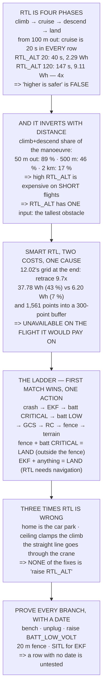

# 12.04 RTL and the failsafe decision tree

<!-- glance:start -->
<!-- generated by tools/build.py from curriculum/syllabus.yaml — edit the syllabus, not this block -->

| | |
|---|---|
| **Track** | Main path |
| **Difficulty** | Advanced |
| **Time** | 1 h 30 min |
| **Hardware** | First flight (Hermon core) (stage 1) |
| **Software** | ardupilot |
| **Prerequisites** | [12.03 Geofence: making the aircraft refuse](12.03-geofence.md)<br>[09.03 Failsafe: what happens when the link drops](../09-telemetry-datalink/09.03-failsafe-when-the-link-drops.md)<br>[11.05 Battery discipline in the air](../11-first-flights/11.05-battery-discipline.md) |
| **Skip if** | You can draw Hermon's full failsafe decision tree and prove each branch from a log or a bench test. |

<!-- glance:end -->

## What you will learn

- That RTL is **four phases** — climb, cruise, descend, land — and only one of them goes home
- Why **"higher is safer" is false**: a 120 m `RTL_ALT` from 100 m out costs **4× the energy and
  3.7× the time** of a 20 m one, to cover the same 100 m
- That a high `RTL_ALT` is cheap on a long flight and expensive on a short one — the opposite of
  how it is usually set
- Why SmartRTL is **unavailable on exactly the flights it would pay on**, and that both halves of
  that sentence come from the same cause
- The failsafe ladder written as **a function you can run**, and what it returns for nine
  combinations
- That an EKF failsafe **removes RTL from the menu entirely**, whatever you configured
- Three situations where RTL is the wrong answer, and the fact that none of the fixes is "raise
  `RTL_ALT`"

## Why it matters

RTL is the button every pilot reaches for, the action most failsafes default to, and the one
manoeuvre in this course that people trust without ever having measured. It is also, by a wide
margin, the most common cause of a flight ending somewhere unexpected — not because it is broken,
but because it does exactly what it was configured to do and the configuration was never checked.

[09.03](../09-telemetry-datalink/09.03-failsafe-when-the-link-drops.md) gave you the triggers.
[11.05](../11-first-flights/11.05-battery-discipline.md) gave you the energy budget.
[12.03](12.03-geofence.md) gave you a fence that fires an action. This lesson is where those three
meet, because in the air they arrive **together** — a low battery and a lost link and a fence
breach are not three separate flights, they are one bad afternoon — and the aircraft will pick
exactly one action out of all of them.

The purpose of this lesson is that you can draw that decision on one page and defend every branch.
Not "it will RTL" but "given these two conditions, it does this, and I have proved it on this
date." That page is what a check ride, an incident report, and your own memory at the worst moment
all need, and it is the deliverable at the end.

> [!WARNING]
> Every action on the ladder assumes the aircraft can still fly and still knows where it is. The
> EKF branch exists precisely because that assumption fails, and it is the branch that surprises
> people: a navigation failure does not give you a careful flight home, it gives you a landing
> wherever you happen to be.

## Prerequisites

<!-- prereqs:start -->
## Prerequisites

You need these first:

- [12.03 Geofence: making the aircraft refuse](12.03-geofence.md)
- [09.03 Failsafe: what happens when the link drops](../09-telemetry-datalink/09.03-failsafe-when-the-link-drops.md)
- [11.05 Battery discipline in the air](../11-first-flights/11.05-battery-discipline.md)

### Optional prerequisite links

None.

Check your readiness: `python course.py why 12.04`
<!-- prereqs:end -->

## Concept

Imagine a fire alarm in a building with four different alarms — smoke, flood, intruder, power
failure — and one set of doors. When two alarms sound at once, the doors do one thing. The
building's designers had to decide, in advance, which alarm wins, and that decision is far more
important than any individual alarm's threshold.

Your aircraft is that building. It has perhaps eight conditions that can fire, and exactly one
flight path. ArduPilot has already decided the ordering for you, and it is a good ordering — but
it is not the one most pilots would guess, and it produces results that look wrong until you see
the reasoning. A fence breach on a critical battery **lands the aircraft outside the fence**. An
EKF failsafe with a perfectly healthy battery and a perfectly good radio link **still lands**.

The second idea is that RTL is not one thing. It is a sequence: climb to `RTL_ALT`, fly home at
`RTL_SPEED`, descend to `RTL_ALT_FINAL`, land. Three of those four phases make no progress toward
home at all. So `RTL_ALT` is not a free safety margin — it is a purchase, paid for in seconds and
watt-hours, and on a short flight it is the dominant cost of the whole manoeuvre.

The third idea is the one that connects them. SmartRTL exists because a straight line home is
sometimes unsafe, and it works by remembering where you have been. Remembering costs buffer, and
retracing costs energy, and both of those scale with the length of the path. So the flights where
SmartRTL would help most are the flights where it has already turned itself off. Once you see
that, you stop treating SmartRTL as "the better RTL" and start treating it as what it is: a
mechanism for short, twisty flights near obstacles.

## Technical explanation

### Level 1 — RTL priced in four phases

Run the code. From 100 m out at 20 m altitude, an `RTL_ALT` of 20 m takes 40 s and 2.29 Wh. An
`RTL_ALT` of 120 m takes **147 s and 9.11 Wh** — four times the energy, 3.7 times the time, to
cover the same 100 m.

Read the cruise column: it does not change. Twenty seconds, every row. Every second the higher
ceiling adds is spent climbing and then descending again, and none of it is spent going home.

The second table asks where the climb stops dominating. At 50 m out, the vertical phases are
**89 %** of the manoeuvre. At 500 m they are 46 %. At 2 km, 17 %. So a high `RTL_ALT` is cheap on
a long flight and expensive on a short one — which is precisely backwards from how it usually gets
set, because the short flights happen over the home field where people feel relaxed enough to
raise it "just in case".

`RTL_ALT` has exactly one input: the tallest obstacle on the route, plus a margin. Not your
comfort, not the ceiling, not a round number.

### Level 2 — SmartRTL, and the trap of the long flight

SmartRTL retraces your path. The code's first table shows the cost as a multiple of the direct
line at the worst moment of four flights. Three of them cost between 1.0× and 1.4× — essentially
nothing. The fourth, [12.02](12.02-mission-planning.md)'s survey grid at the end of the mission,
costs **9.7×**: a 3,121 m flight home instead of a 321 m one, **37.78 Wh instead of 6.20**, which
is 43 % of the usable pack against 7 %.

And remember *why* you are in SmartRTL: usually a low battery. It is the expensive option, chosen
at the moment you can least afford it.

Now the second cost. SmartRTL stores a point every `SRTL_ACCURACY` (2 m) into a buffer of
`SRTL_POINTS` (300). The grid needs **1,561 points**. The buffer holds 300. When it fills,
SmartRTL deactivates — and ArduPilot says so once, early in the flight, in a message you were not
reading because nothing was wrong yet.

Put the two tables side by side. The three flights where SmartRTL is cheap are the three where it
is available, and the one where it would cost 43 % of the pack is the one where the buffer is
already full. That is not a coincidence — both columns are driven by the same quantity, the path
length. **SmartRTL is a mechanism for short, twisty flights near obstacles**, and it quietly stops
being one the moment the flight gets long.

### Level 3 — the ladder, as a function

The code writes the failsafe ladder as a list in severity order and `resolve()` as a
first-match-wins function. That is not a simplification of ArduPilot — it is the shape of the real
thing, and writing it this way makes the combinations testable.

Nine combinations are run. Four are worth memorising:

- **RC failsafe + GCS failsafe → RTL.** Both links gone, still one action. Failsafes do not stack.
- **Fence breach + battery LOW → RTL.** Both say RTL; no conflict.
- **Fence breach + battery CRITICAL → LAND.** Outside the fence you drew.
  [12.03](12.03-geofence.md) warned about this; this is the mechanism.
- **EKF failsafe + anything → LAND.** RTL is a *navigation* action and navigation is what failed.

That last one is the one people get wrong, and it is worth stating plainly: whatever you set
`FS_*_ACTION` to, an EKF failsafe gives you a landing where you are.

### Level 4 — three ways RTL is the wrong answer

**Home is not where you think.** Home is set at arm. If you armed in the car park and walked to
the field, RTL flies to the car park. The fix is to set home deliberately or arm where you stand —
not to raise `RTL_ALT`.

**`RTL_ALT` is above the fence ceiling.** [12.03](12.03-geofence.md)'s first conflict: the climb
gets clamped, so RTL comes home lower than the obstacle clearance you chose. The fix is to order
the three altitudes.

**The straight line home is not safe.** RTL avoids nothing. It is a straight line, and it will fly
it through the crane, the power line, or your own exclusion zone. The fix is SmartRTL — if the
buffer is still alive — or `FENCE_ACTION` 6 to a nominated recovery point.

### Level 5 — proving every branch

A failsafe you have not triggered on purpose is a guess. The code's last section gives a safe way
to provoke each one: the transmitter off on the bench with props removed; the telemetry radio
unplugged mid-flight (if `FS_GCS_ENABLE` is even on — know which); `BATT_LOW_VOLT` raised for a
single test flight with the original value **written down first**;
[12.03](12.03-geofence.md)'s twenty-metre fence; and the EKF branch in SITL only, with a GPS
glitch injected.

> [!TIP]
> **Ask your teacher:** "Is `FS_GCS_ENABLE` on for our aircraft, and if I unplug the telemetry
> radio right now, does anything happen?" Most people do not know, and it is a one-minute answer
> that changes what a lost ground station means.

## Diagram



## Code

Price RTL's four phases at five ceilings and six distances, compare SmartRTL's retrace and buffer
across four flights, run the failsafe ladder as a function over nine condition sets, and list the
three failures of RTL with their fixes and the safe way to provoke each branch.

```python
"""12.04 - RTL priced in four phases, and the failsafe tree as a function."""
import math

HOVER_W, CRUISE_W = 226.0, 203.0      # 02.11 / 03.09
USABLE_WH = 88.8                      # 11.05's usable energy
CLIMB_MS, DESC_MS = 2.5, 1.5          # RTL defaults
CLIMB_K, DESC_K = 1.30, 0.85          # power vs hover, climbing / descending [E]
RTL_SPEED = 5.0                       # = WPNAV_SPEED by default
LAND_MS = 0.5                         # LAND_SPEED, final
RTL_ALT_FINAL = 5.0
SRTL_POINTS = 300                     # SRTL_POINTS default
SRTL_ACCURACY = 2.0                   # m between stored points

# the failsafe tree, most severe first. Each entry is
#   (condition, action, why it outranks everything below it)
LADDER = [
    ("crash detected", "DISARM",
     "nothing else can help and the motors are the hazard"),
    ("EKF failsafe", "LAND (or the pilot, if in a manual mode)",
     "no position estimate means RTL has nowhere to go (09.03)"),
    ("battery CRITICAL", "LAND",
     "there is not enough energy to reach home. 11.05"),
    ("battery LOW", "RTL",
     "enough to come home, not enough to finish the job"),
    ("GCS failsafe", "RTL",
     "you have lost the link you were commanding through"),
    ("RC failsafe", "RTL",
     "09.03's 1.207 s to detect, then this"),
    ("fence breach", "RTL / LAND / BRAKE / GUIDED",
     "12.03. Outranked by both battery levels"),
    ("terrain data lost", "RTL",
     "a terrain-following mission cannot continue blind"),
]

CASES = [
    (["RC failsafe"], "one trigger, the simple case"),
    (["RC failsafe", "GCS failsafe"], "both links gone -- still ONE action"),
    (["fence breach"], "12.03's default"),
    (["fence breach", "battery LOW"], "the fence still wins: both say RTL"),
    (["fence breach", "battery CRITICAL"],
     "IT LANDS. Outside the fence you drew"),
    (["battery LOW", "RC failsafe"], "same action from two directions"),
    (["EKF failsafe", "battery LOW"], "RTL is not available. It lands"),
    (["EKF failsafe", "RC failsafe"], "the worst pair in the list"),
    (["crash detected", "battery CRITICAL"], "disarm outranks everything"),
    ([], "nothing wrong. The mission continues"),
]


def resolve(active):
    """The tree, as a function. First match down the ladder wins."""
    for cond, action, why in LADDER:
        if cond in active:
            return cond, action, why
    return None, "continue the mission", "no condition is active"


def rtl_energy(dist_m, alt_now, rtl_alt, speed=RTL_SPEED):
    """Four phases: climb, cruise home, descend, land."""
    climb_m = max(0.0, rtl_alt - alt_now)
    t_climb = climb_m / CLIMB_MS
    t_cruise = dist_m / speed
    t_desc = max(0.0, rtl_alt - RTL_ALT_FINAL) / DESC_MS
    t_land = RTL_ALT_FINAL / LAND_MS
    wh = (HOVER_W * CLIMB_K * t_climb
          + CRUISE_W * t_cruise
          + HOVER_W * DESC_K * t_desc
          + HOVER_W * t_land) / 3600.0
    return dict(t=t_climb + t_cruise + t_desc + t_land, wh=wh,
                t_climb=t_climb, t_cruise=t_cruise,
                t_desc=t_desc, t_land=t_land)


def srtl_points(path_m, acc=SRTL_ACCURACY):
    return math.ceil(path_m / acc)


def bar(t):
    print("\n" + "=" * 70)
    print(t)
    print("=" * 70)


if __name__ == "__main__":
    bar("1. RTL IS FOUR PHASES, AND ONLY ONE OF THEM GOES HOME")
    print("  Climb to RTL_ALT. Cruise home. Descend to RTL_ALT_FINAL.")
    print("  Land. Price all four, from 100 m out, at 20 m altitude:")
    print(f"  {'RTL_ALT':>8s} {'climb':>7s} {'cruise':>7s} {'desc':>7s}"
          f" {'land':>6s} {'TOTAL':>8s} {'Wh':>6s} {'of pack':>8s}")
    for ra in (20, 30, 50, 80, 120):
        r = rtl_energy(100.0, 20.0, ra)
        print(f"  {ra:6d} m {r['t_climb']:6.0f}s {r['t_cruise']:6.0f}s"
              f" {r['t_desc']:6.0f}s {r['t_land']:5.0f}s {r['t']:7.0f}s"
              f" {r['wh']:6.2f} {r['wh'] / USABLE_WH * 100:7.1f}%")
    print("  READ THE CRUISE COLUMN. IT DOES NOT CHANGE. Every second")
    print("  added by a higher RTL_ALT is spent going UP and then back")
    print("  DOWN, and none of it is spent going home.")
    print(f"  {'from 100 m out':>15s} {'RTL_ALT 20':>12s} {'RTL_ALT 120':>12s}")
    a, b = rtl_energy(100, 20, 20), rtl_energy(100, 20, 120)
    print(f"  {'time':>15s} {a['t']:10.0f} s {b['t']:10.0f} s")
    print(f"  {'energy':>15s} {a['wh']:9.2f} Wh {b['wh']:9.2f} Wh")
    print(f"  A 120 m RTL_ALT FROM 100 m OUT COSTS"
          f" {b['wh'] / a['wh']:.1f}x THE ENERGY AND")
    print(f"  {b['t'] / a['t']:.1f}x THE TIME of a 20 m one -- to cover the"
          f" same 100 m.")
    print("  'HIGHER IS SAFER' IS FALSE. Higher is safer ONLY against")
    print("  obstacles. Against the battery, and against the weather")
    print("  window, and against the pilot's patience, higher is worse.")
    print("\n  AND THE CROSSOVER IS A DISTANCE. At what range does the")
    print("  climb stop dominating?")
    print(f"  {'distance':>9s} {'climb+desc':>11s} {'cruise':>8s}"
          f" {'climb is':>10s}")
    for d in (50, 100, 250, 500, 1000, 2000):
        r = rtl_energy(d, 20.0, 80.0)
        over = r['t_climb'] + r['t_desc'] + r['t_land']
        print(f"  {d:7d} m {over:9.0f} s {r['t_cruise']:7.0f} s"
              f" {over / r['t']* 100:8.0f} %")
    print("  SO A HIGH RTL_ALT IS CHEAP ON A LONG FLIGHT AND EXPENSIVE ON")
    print("  A SHORT ONE -- which is the opposite of how people set it,")
    print("  because the short flights are the ones over the home field")
    print("  where they feel safe enough to raise it 'just in case'.")
    print("  SET RTL_ALT FROM THE TALLEST OBSTACLE ON THE ROUTE, PLUS A")
    print("  MARGIN. That is the only input it has.")

    bar("2. SMART RTL, AND WHY IT IS NOT THERE WHEN YOU WANT IT")
    print("  SmartRTL retraces the path you flew instead of flying")
    print("  straight home. That is exactly right when the straight line")
    print("  goes through a building -- and it has two costs.")
    print("  (name, total path flown, distance BACK along it, direct line)")
    print(f"  {'flight, at the worst moment':32s} {'path':>7s}"
          f" {'retrace':>8s} {'direct':>7s} {'cost':>6s}")
    #  name, path flown so far, distance back along it, straight-line home
    flights = [
        ("200 m out-and-back, at the turn", 200.0, 200.0, 200.0),
        ("50 m box circuit, far corner", 100.0, 100.0, 70.7),
        ("400 m dogleg around a hangar", 400.0, 400.0, 283.0),
        ("12.02's 300x200 grid, at the END", 3121.0, 3121.0, 321.0),
    ]
    for n, path, retr, direct in flights:
        print(f"  {n:32s} {path:5.0f} m {retr:6.0f} m {direct:5.0f} m"
              f" {retr / direct:5.1f} x")
    print("  COST ONE IS ENERGY, and for three of those four rows it is")
    print("  almost nothing. The fourth is the whole mission:")
    n, path, retr, direct = flights[3]
    rr, rd = rtl_energy(retr, 60.0, 60.0), rtl_energy(direct, 60.0, 60.0)
    print(f"    SmartRTL:  {retr:5.0f} m, {rr['wh']:5.2f} Wh"
          f" -- {rr['wh'] / USABLE_WH * 100:4.0f} % of the pack")
    print(f"    plain RTL: {direct:5.0f} m, {rd['wh']:5.2f} Wh"
          f" -- {rd['wh'] / USABLE_WH * 100:4.0f} % of the pack")
    print("  AND REMEMBER WHY YOU ARE IN SMART RTL AT ALL: usually a LOW")
    print("  BATTERY. The retrace is the expensive option chosen at the")
    print("  moment you can least afford it.")
    print("\n  COST TWO IS THE ONE NOBODY EXPECTS. SmartRTL stores a")
    print(f"  point every {SRTL_ACCURACY:.0f} m into a buffer of"
          f" {SRTL_POINTS} (SRTL_POINTS):")
    print(f"  {'flight':32s} {'points':>8s} {'buffer':>8s}"
          f" {'available?':>12s}")
    for n, path, retr, direct in flights:
        p = srtl_points(path)
        ok = "yes" if p <= SRTL_POINTS else "NO -- FULL"
        print(f"  {n:32s} {p:8d} {SRTL_POINTS:8d} {ok:>12s}")
    print("  WHEN THE BUFFER FILLS, SMART RTL DEACTIVATES -- and")
    print("  ArduPilot says so once, early in the flight, in a message")
    print("  you were not reading because nothing was wrong yet.")
    print("  NOW PUT THE TWO TABLES SIDE BY SIDE. THE THREE FLIGHTS WHERE")
    print("  SMART RTL IS CHEAP ARE THE THREE WHERE IT IS AVAILABLE, AND")
    print(f"  THE ONE WHERE IT WOULD COST {rr['wh'] / USABLE_WH * 100:.0f}"
          f" % OF THE PACK IS THE ONE")
    print("  WHERE THE BUFFER IS ALREADY FULL.")
    print("  That is not a coincidence -- both columns are driven by the")
    print("  same thing, the length of the path. SmartRTL is a mechanism")
    print("  for SHORT, TWISTY flights near obstacles, and it quietly")
    print("  stops being one the moment the flight gets long.")
    print("  SO: CHECK IT IS STILL ARMED BEFORE YOU NEED IT, and make")
    print("  sure FENCE_ACTION and FS_*_ACTION fall back to something")
    print("  that works when it is not.")

    bar("3. THE TREE IS A FUNCTION. HERE IT IS, AND HERE IT IS TESTED")
    print("  Most severe first. The FIRST match wins, and there is only")
    print("  ever ONE action:")
    print(f"  {'#':>2s} {'condition':22s} {'action'}")
    for i, (c, a, w) in enumerate(LADDER, 1):
        print(f"  {i:2d} {c:22s} {a}")
        print(f"     {'':22s} ({w})")
    print("\n  AND THE COMBINATIONS, WHICH ARE WHERE PEOPLE GUESS WRONG:")
    print(f"  {'active conditions':38s} {'-> action'}")
    for active, note in CASES:
        cond, action, why = resolve(active)
        label = " + ".join(active) if active else "(none)"
        print(f"  {label:38s} -> {action}")
        print(f"  {'':38s}    {note}")
    print("  THE THIRD-FROM-LAST ROW IS THE ONE TO REMEMBER. An EKF")
    print("  failsafe removes RTL from the menu entirely, because RTL is")
    print("  a NAVIGATION action and navigation is exactly what has")
    print("  failed. Whatever you configured, you get a landing.")
    print("  AND THE PAIR ABOVE IT: a fence breach on a critical battery")
    print("  lands the aircraft OUTSIDE the fence. 12.03 said so; this is")
    print("  the mechanism.")

    bar("4. THREE WAYS RTL IS THE WRONG ANSWER")
    wrong = [
        ("HOME IS NOT WHERE YOU THINK",
         "home is set at ARM, and updated at each arm",
         "if you armed in the car park and walked to the field, RTL "
         "flies to the car park"),
        ("RTL_ALT IS ABOVE THE FENCE CEILING",
         "12.03's conflict 1: the climb gets clamped",
         "so RTL comes home lower than the obstacle clearance you chose"),
        ("THE STRAIGHT LINE HOME IS NOT SAFE",
         "RTL does not avoid anything -- it is a straight line",
         "through the crane, the power line, or the exclusion zone"),
    ]
    for t, a, b in wrong:
        print(f"  {t}")
        print(f"    {a}")
        print(f"    => {b}")
    print("  EACH HAS A FIX AND NONE OF THE FIXES IS 'RAISE RTL_ALT'.")
    fixes = [
        ("home is wrong", "SET HOME deliberately, or arm where you stand"),
        ("ceiling clamps the climb", "order the three altitudes (12.03)"),
        ("the line is not safe", "SmartRTL, or FENCE_ACTION 6 to a "
                                 "nominated point"),
    ]
    for a, b in fixes:
        print(f"    {a:28s} {b}")

    bar("5. PROVE EVERY BRANCH BEFORE YOU NEED ONE")
    print("  A failsafe you have not triggered on purpose is a guess.")
    print("  Each branch has a way to provoke it safely:")
    proofs = [
        ("RC failsafe", "turn the transmitter off, ON THE BENCH, props off",
         "watch the mode change and the 09.03 timing"),
        ("GCS failsafe", "unplug the telemetry radio mid-flight",
         "if FS_GCS_ENABLE is on -- and know whether it is"),
        ("battery LOW", "set BATT_LOW_VOLT high for one test flight",
         "then put it back. Write the original value down FIRST"),
        ("fence breach", "12.03's twenty-metre fence",
         "the cheapest test in the course"),
        ("EKF failsafe", "SITL, with a GPS glitch injected (10.04)",
         "do NOT try to provoke this one in the air"),
        ("SmartRTL availability", "read the messages in the first minute",
         "and check the buffer against section 2's table"),
    ]
    for a, b, c in proofs:
        print(f"  {a:22s} {b}")
        print(f"  {'':22s} {c}")
    print("  THE OUTPUT OF THIS LESSON IS ONE PAGE: your conditions, in")
    print("  severity order, each with the action it produces and the")
    print("  date you last proved it. If a row has no date, that branch")
    print("  is untested and you should assume it does something else.")
```

Output:

```text

======================================================================
1. RTL IS FOUR PHASES, AND ONLY ONE OF THEM GOES HOME
======================================================================
  Climb to RTL_ALT. Cruise home. Descend to RTL_ALT_FINAL.
  Land. Price all four, from 100 m out, at 20 m altitude:
   RTL_ALT   climb  cruise    desc   land    TOTAL     Wh  of pack
      20 m      0s     20s     10s    10s      40s   2.29     2.6%
      30 m      4s     20s     17s    10s      51s   2.97     3.3%
      50 m     12s     20s     30s    10s      72s   4.34     4.9%
      80 m     24s     20s     50s    10s     104s   6.38     7.2%
     120 m     40s     20s     77s    10s     147s   9.11    10.3%
  READ THE CRUISE COLUMN. IT DOES NOT CHANGE. Every second
  added by a higher RTL_ALT is spent going UP and then back
  DOWN, and none of it is spent going home.
   from 100 m out   RTL_ALT 20  RTL_ALT 120
             time         40 s        147 s
           energy      2.29 Wh      9.11 Wh
  A 120 m RTL_ALT FROM 100 m OUT COSTS 4.0x THE ENERGY AND
  3.7x THE TIME of a 20 m one -- to cover the same 100 m.
  'HIGHER IS SAFER' IS FALSE. Higher is safer ONLY against
  obstacles. Against the battery, and against the weather
  window, and against the pilot's patience, higher is worse.

  AND THE CROSSOVER IS A DISTANCE. At what range does the
  climb stop dominating?
   distance  climb+desc   cruise   climb is
       50 m        84 s      10 s       89 %
      100 m        84 s      20 s       81 %
      250 m        84 s      50 s       63 %
      500 m        84 s     100 s       46 %
     1000 m        84 s     200 s       30 %
     2000 m        84 s     400 s       17 %
  SO A HIGH RTL_ALT IS CHEAP ON A LONG FLIGHT AND EXPENSIVE ON
  A SHORT ONE -- which is the opposite of how people set it,
  because the short flights are the ones over the home field
  where they feel safe enough to raise it 'just in case'.
  SET RTL_ALT FROM THE TALLEST OBSTACLE ON THE ROUTE, PLUS A
  MARGIN. That is the only input it has.

======================================================================
2. SMART RTL, AND WHY IT IS NOT THERE WHEN YOU WANT IT
======================================================================
  SmartRTL retraces the path you flew instead of flying
  straight home. That is exactly right when the straight line
  goes through a building -- and it has two costs.
  (name, total path flown, distance BACK along it, direct line)
  flight, at the worst moment         path  retrace  direct   cost
  200 m out-and-back, at the turn    200 m    200 m   200 m   1.0 x
  50 m box circuit, far corner       100 m    100 m    71 m   1.4 x
  400 m dogleg around a hangar       400 m    400 m   283 m   1.4 x
  12.02's 300x200 grid, at the END  3121 m   3121 m   321 m   9.7 x
  COST ONE IS ENERGY, and for three of those four rows it is
  almost nothing. The fourth is the whole mission:
    SmartRTL:   3121 m, 37.78 Wh --   43 % of the pack
    plain RTL:   321 m,  6.20 Wh --    7 % of the pack
  AND REMEMBER WHY YOU ARE IN SMART RTL AT ALL: usually a LOW
  BATTERY. The retrace is the expensive option chosen at the
  moment you can least afford it.

  COST TWO IS THE ONE NOBODY EXPECTS. SmartRTL stores a
  point every 2 m into a buffer of 300 (SRTL_POINTS):
  flight                             points   buffer   available?
  200 m out-and-back, at the turn       100      300          yes
  50 m box circuit, far corner           50      300          yes
  400 m dogleg around a hangar          200      300          yes
  12.02's 300x200 grid, at the END     1561      300   NO -- FULL
  WHEN THE BUFFER FILLS, SMART RTL DEACTIVATES -- and
  ArduPilot says so once, early in the flight, in a message
  you were not reading because nothing was wrong yet.
  NOW PUT THE TWO TABLES SIDE BY SIDE. THE THREE FLIGHTS WHERE
  SMART RTL IS CHEAP ARE THE THREE WHERE IT IS AVAILABLE, AND
  THE ONE WHERE IT WOULD COST 43 % OF THE PACK IS THE ONE
  WHERE THE BUFFER IS ALREADY FULL.
  That is not a coincidence -- both columns are driven by the
  same thing, the length of the path. SmartRTL is a mechanism
  for SHORT, TWISTY flights near obstacles, and it quietly
  stops being one the moment the flight gets long.
  SO: CHECK IT IS STILL ARMED BEFORE YOU NEED IT, and make
  sure FENCE_ACTION and FS_*_ACTION fall back to something
  that works when it is not.

======================================================================
3. THE TREE IS A FUNCTION. HERE IT IS, AND HERE IT IS TESTED
======================================================================
  Most severe first. The FIRST match wins, and there is only
  ever ONE action:
   # condition              action
   1 crash detected         DISARM
                            (nothing else can help and the motors are the hazard)
   2 EKF failsafe           LAND (or the pilot, if in a manual mode)
                            (no position estimate means RTL has nowhere to go (09.03))
   3 battery CRITICAL       LAND
                            (there is not enough energy to reach home. 11.05)
   4 battery LOW            RTL
                            (enough to come home, not enough to finish the job)
   5 GCS failsafe           RTL
                            (you have lost the link you were commanding through)
   6 RC failsafe            RTL
                            (09.03's 1.207 s to detect, then this)
   7 fence breach           RTL / LAND / BRAKE / GUIDED
                            (12.03. Outranked by both battery levels)
   8 terrain data lost      RTL
                            (a terrain-following mission cannot continue blind)

  AND THE COMBINATIONS, WHICH ARE WHERE PEOPLE GUESS WRONG:
  active conditions                      -> action
  RC failsafe                            -> RTL
                                            one trigger, the simple case
  RC failsafe + GCS failsafe             -> RTL
                                            both links gone -- still ONE action
  fence breach                           -> RTL / LAND / BRAKE / GUIDED
                                            12.03's default
  fence breach + battery LOW             -> RTL
                                            the fence still wins: both say RTL
  fence breach + battery CRITICAL        -> LAND
                                            IT LANDS. Outside the fence you drew
  battery LOW + RC failsafe              -> RTL
                                            same action from two directions
  EKF failsafe + battery LOW             -> LAND (or the pilot, if in a manual mode)
                                            RTL is not available. It lands
  EKF failsafe + RC failsafe             -> LAND (or the pilot, if in a manual mode)
                                            the worst pair in the list
  crash detected + battery CRITICAL      -> DISARM
                                            disarm outranks everything
  (none)                                 -> continue the mission
                                            nothing wrong. The mission continues
  THE THIRD-FROM-LAST ROW IS THE ONE TO REMEMBER. An EKF
  failsafe removes RTL from the menu entirely, because RTL is
  a NAVIGATION action and navigation is exactly what has
  failed. Whatever you configured, you get a landing.
  AND THE PAIR ABOVE IT: a fence breach on a critical battery
  lands the aircraft OUTSIDE the fence. 12.03 said so; this is
  the mechanism.

======================================================================
4. THREE WAYS RTL IS THE WRONG ANSWER
======================================================================
  HOME IS NOT WHERE YOU THINK
    home is set at ARM, and updated at each arm
    => if you armed in the car park and walked to the field, RTL flies to the car park
  RTL_ALT IS ABOVE THE FENCE CEILING
    12.03's conflict 1: the climb gets clamped
    => so RTL comes home lower than the obstacle clearance you chose
  THE STRAIGHT LINE HOME IS NOT SAFE
    RTL does not avoid anything -- it is a straight line
    => through the crane, the power line, or the exclusion zone
  EACH HAS A FIX AND NONE OF THE FIXES IS 'RAISE RTL_ALT'.
    home is wrong                SET HOME deliberately, or arm where you stand
    ceiling clamps the climb     order the three altitudes (12.03)
    the line is not safe         SmartRTL, or FENCE_ACTION 6 to a nominated point

======================================================================
5. PROVE EVERY BRANCH BEFORE YOU NEED ONE
======================================================================
  A failsafe you have not triggered on purpose is a guess.
  Each branch has a way to provoke it safely:
  RC failsafe            turn the transmitter off, ON THE BENCH, props off
                         watch the mode change and the 09.03 timing
  GCS failsafe           unplug the telemetry radio mid-flight
                         if FS_GCS_ENABLE is on -- and know whether it is
  battery LOW            set BATT_LOW_VOLT high for one test flight
                         then put it back. Write the original value down FIRST
  fence breach           12.03's twenty-metre fence
                         the cheapest test in the course
  EKF failsafe           SITL, with a GPS glitch injected (10.04)
                         do NOT try to provoke this one in the air
  SmartRTL availability  read the messages in the first minute
                         and check the buffer against section 2's table
  THE OUTPUT OF THIS LESSON IS ONE PAGE: your conditions, in
  severity order, each with the action it produces and the
  date you last proved it. If a row has no date, that branch
  is untested and you should assume it does something else.
```

## Exercise

### Exercise 12.04-E1 — Price your own RTL `[analysis]`

Take your furthest planned waypoint and your current `RTL_ALT`, and compute the four phases. Then
compute it again with `RTL_ALT` set to the tallest obstacle on the route plus 15 m. Compare the
watt-hours against [11.05](../11-first-flights/11.05-battery-discipline.md)'s reserve.

### Exercise 12.04-E2 — Find your SmartRTL horizon `[analysis]`

Using your own `SRTL_POINTS` and `SRTL_ACCURACY`, compute the path length at which the buffer
fills. Then look at your last three flight logs and mark which of them exceeded it.

### Exercise 12.04-E3 — Run the ladder on your own conditions `[analysis]`

Extend the code's `CASES` list with five combinations that are realistic for *your* flying —
include at least one you are genuinely unsure about — and predict each answer before running it.
Score yourself.

### Exercise 12.04-E4 — Bench-prove two branches `[build]`

With props removed and the aircraft restrained, provoke the RC failsafe and one other branch.
Record: how long until the mode changed, what the mode changed *to*, and whether the ground
station told you clearly or you had to go looking.

> [!CAUTION]
> Props off, battery strapped down, and nobody holding the airframe by hand when you arm. A
> failsafe test is the one time you are *deliberately* asking the aircraft to change mode without
> warning, and a mode change with props fitted is how bench tests put people in hospital.

## Expected result

**12.04-E1**: for most sites the obstacle-derived `RTL_ALT` is lower than what was set, and the
saving is a few watt-hours — small in absolute terms and large as a fraction of the reserve. If
your obstacle-derived number comes out *higher*, you have just found something more valuable than
a saving.

**12.04-E2**: with the defaults the horizon is 600 m of path. Expect most of your survey and
inspection flights to be over it, and most of your practice flights to be under it.

**12.04-E3**: expect to get the pure cases right and at least one combination wrong. The usual
misses are the EKF branch (people expect RTL) and the fence-plus-critical-battery pair (people
expect the fence to win because it is more specific).

**12.04-E4**: the RC failsafe should trigger in around a second — [09.03](../09-telemetry-datalink/09.03-failsafe-when-the-link-drops.md)
derived 1.207 s — and the mode change should be announced. If you had to go looking for it in a
message log, fix that before your next flight, because you will be looking at the aircraft and not
the screen when it matters.

## Troubleshooting

**RTL flew to the wrong place.** Home was set at arm, in a different place. Check the log's home
position rather than your memory.

**RTL came home lower than `RTL_ALT`.** The fence ceiling clamped the climb.
[12.03](12.03-geofence.md), conflict 1.

**SmartRTL is not in the mode list.** Either the buffer filled (Level 2) or it was never populated
because the aircraft armed without a position. It is not a mode you can select at any time.

**A failsafe fired and the aircraft did something other than what I configured.** Run the ladder.
Something more severe was also active — and the log will show both.

**Two failsafes fired and only one message appeared.** That is correct. First match wins; the rest
are not evaluated.

**RTL descended into something on the way home.** RTL is a straight line at a fixed altitude and
avoids nothing. Level 4, third case.

**The aircraft landed instead of returning, with a healthy battery.** Almost always the EKF
branch. Check the EKF variance in the log rather than the battery.

## Common mistakes

- **Raising `RTL_ALT` as a general safety measure.** It is a purchase, and on short flights it is
  the dominant cost of the whole manoeuvre.
- **Assuming SmartRTL is available.** Check the buffer against your path length before you need it.
- **Assuming failsafes stack.** One action, first match.
- **Assuming the fence action survives a critical battery.** It does not, and the aircraft lands
  outside the fence.
- **Assuming RTL works without navigation.** The EKF branch exists because it does not.
- **Arming somewhere other than where you intend home to be.** The single most common cause of
  RTL going somewhere strange.
- **Never having triggered a failsafe deliberately.** Every branch on your page needs a date.
- **Changing `BATT_LOW_VOLT` for a test and forgetting to change it back.** Write the original
  down before you touch it.

## Knowledge check

<details>
<summary>From 100 m out at 20 m altitude, why does raising `RTL_ALT` from 20 m to 120 m quadruple
the energy when the distance home has not changed?</summary>

Because three of RTL's four phases are vertical. The cruise phase stays at 20 s in every row; the
extra 107 s is climbing at 1.3× hover power and descending at 0.85×. None of it makes progress
toward home.
</details>

<details>
<summary>Is a high `RTL_ALT` more expensive on a short flight or a long one, and why does that
matter?</summary>

On a short one. At 50 m out the vertical phases are 89 % of the manoeuvre; at 2 km they are 17 %.
It matters because people raise `RTL_ALT` on the flights over their home field, which are exactly
the short ones where it costs the most and buys the least.
</details>

<details>
<summary>Why is SmartRTL unavailable on [12.02](12.02-mission-planning.md)'s survey grid?</summary>

The grid is 3,121 m of path, which at one point every 2 m is 1,561 points against a 300-point
buffer. The buffer fills early in the flight and SmartRTL deactivates — with one message, at a
moment when nothing was wrong.
</details>

<details>
<summary>What connects SmartRTL's energy cost and its availability?</summary>

Path length drives both. A long path costs a lot to retrace *and* overflows the buffer, so
SmartRTL is cheap exactly when it is available and unavailable exactly when it would be expensive.
It is a mechanism for short, twisty flights near obstacles — not a better RTL.
</details>

<details>
<summary>A fence breach and a critical battery fire at the same moment. What happens, and where
does the aircraft end up?</summary>

It lands, because battery-critical outranks the fence on the ladder — and it lands where it is,
which is outside the fence you drew. If that is unacceptable for your site, the fence action has
to be 6, to a nominated recovery point, and even that assumes the aircraft can still navigate.
</details>

<details>
<summary>You have configured every failsafe to RTL. An EKF failsafe fires. What does the aircraft
do?</summary>

It lands. RTL is a navigation action and navigation is exactly what has failed, so RTL is not on
the menu regardless of configuration. This is the branch people most often predict wrongly.
</details>

<details>
<summary>Name the three situations where RTL is the wrong answer, and say what none of the fixes
is.</summary>

Home is not where you think (set at arm); `RTL_ALT` is above the fence ceiling (the climb gets
clamped); and the straight line home is not safe (RTL avoids nothing). None of the fixes is
"raise `RTL_ALT`" — they are set home deliberately, order the three altitudes, and use SmartRTL or
a nominated recovery point.
</details>

## Practical challenge

Produce Hermon's failsafe page and prove it.

1. List every condition your aircraft can detect, in severity order. Use the code's ladder as a
   starting point and check each one against your own parameter list.
2. Beside each, write the action it produces on *your* configuration — not the default.
3. Beside that, write the date you last proved it and how.
4. Compute `RTL_ALT` from the tallest obstacle on each route you fly, and note if different sites
   need different values. They usually do.
5. Compute your SmartRTL horizon and write it on the page as a distance.
6. Run four combinations through the ladder and write the answers down.
7. Bench-prove the RC branch and one other, and fill in two dates.
8. Fly one flight where you trigger a failsafe deliberately, at altitude, over open ground, with a
   spotter, and compare what happened to what your page says.

Any row without a date is a row you are guessing about. The page is finished when there are no
blanks — not when it is written.

## You can skip this if

You can draw Hermon's full failsafe decision tree and prove each branch from a log or a bench
test. "Prove" means you have a date and an artefact, not a recollection.

## Go deeper

- ArduPilot's failsafe landing page, which links each failsafe's own parameter documentation and
  states the current priority ordering:
  <https://ardupilot.org/copter/docs/failsafe-landing-page.html>
- The RTL and SmartRTL mode documentation, including `RTL_ALT_FINAL`, `RTL_LOIT_TIME` and the
  `SRTL_*` parameters: <https://ardupilot.org/copter/docs/rtl-mode.html>
- FAA Part 107 §107.19 makes the remote pilot in command responsible for the aircraft's condition
  and its response to a failure — which is the regulatory reason this page exists:
  <https://www.ecfr.gov/current/title-14/part-107>

**Version-sensitive:** the failsafe priority ordering, the available `FS_*_ACTION` values, and
`FS_OPTIONS` have all changed across ArduPilot major versions, and SmartRTL's buffer behaviour was
revised in Copter 4.x. Read your own parameter list and your own firmware's release notes rather
than a forum post.

## Progress checkpoint

You can now price an RTL in four phases and explain why `RTL_ALT` is a purchase rather than a
margin, say at what path length your SmartRTL turns itself off and why that is the same cause as
its energy cost, run the failsafe ladder for any combination of conditions and get the answer
right, and name the three situations where RTL is the wrong tool.

Next, [12.05](12.05-auto-takeoff-land-precision.md) takes the two phases RTL ends with — descent
and landing — and makes them work on purpose, including landing on a marked pad.
