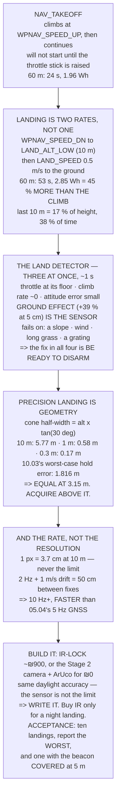

# 12.05 Auto takeoff, auto land, and precision landing

<!-- glance:start -->
<!-- generated by tools/build.py from curriculum/syllabus.yaml — edit the syllabus, not this block -->

| | |
|---|---|
| **Track** | Main path |
| **Difficulty** | Advanced |
| **Time** | 1 h 45 min |
| **Hardware** | First flight (Hermon core) (stage 1), Precision landing & final (stage 5) |
| **Software** | ardupilot |
| **Prerequisites** | [12.04 RTL and the failsafe decision tree](12.04-rtl-and-the-failsafe-tree.md) |
| **Skip if** | Hermon takes off and lands automatically, and lands on a marked pad within its stated accuracy. |

<!-- glance:end -->

## What you will learn

- That **coming down costs more energy than going up** — 45 % more from 60 m, **three times** from
  10 m — on an aircraft where descending needs less power
- That the last ten metres of a landing are **17 % of the height and 38 % of the time**, and that
  this is correct rather than a bug
- The land detector's **three simultaneous conditions**, and that **ground effect is its sensor**
- The four surfaces where the detector fails, and why the fix in all four is the same
- Why precision landing's problem is **acquisition, not resolution**: the sensor cone is narrower
  than the GPS error below **3.15 m**
- That the `LANDING_TARGET` message must run **faster than the GNSS it replaces**
- The two ways to build precision landing in Israel, why they land to the same accuracy in
  daylight, and which one this course recommends

## Why it matters

Every flight you have made so far started and ended with you flying the aircraft. This lesson is
where both ends become automatic, and the ground is the only thing in aviation that is
unforgiving in both directions: hit it too fast and you break the aircraft, stop the motors too
early and you drop it.

It also closes the loop on the capstone. A delivery mission, an inspection flight that recharges
between legs, a survey that repeats weekly from the same pad — all of them need the aircraft to
put itself back on a specific square of ground, not merely somewhere near home.
[10.03](../10-simulation/10.03-sensor-noise-and-wind.md) measured what "near" means with real
sensors: **0.944 m RMS and 1.816 m worst case**, in still air. A 75 cm pad is smaller than the
error.

And there is one more reason, which is that the landing is where the most dangerous decision in
the whole autopilot is made. Stopping the motors is irreversible, it happens without warning, and
it happens while people are often walking toward the aircraft. Knowing what triggers it — and
what fails to trigger it — is not a detail.

> [!WARNING]
> The land detector can fail to fire with the aircraft on the ground and the motors still
> spinning. On a slope or in wind this is common, not exotic. Know your disarm gesture, know it
> works, and never approach an aircraft whose motors are still turning — the autopilot has not
> yet agreed that the flight is over.

## Prerequisites

<!-- prereqs:start -->
## Prerequisites

You need these first:

- [12.04 RTL and the failsafe decision tree](12.04-rtl-and-the-failsafe-tree.md)

### Optional prerequisite links

None.

Check your readiness: `python course.py why 12.05`
<!-- prereqs:end -->

## Concept

A lift does not stop at a floor by measuring the floor. It slows, creeps, and then a sensor
confirms it has arrived. The creeping is not inefficiency — it is the time the confirmation needs.

Your aircraft lands the same way, and for the same reason. It descends fast to `LAND_ALT_LOW` and
then crawls at `LAND_SPEED` for the last stretch, because the thing that will eventually stop the
motors is not a contact switch. There is no contact switch. There is a controller noticing that
the air got stiffer — ground effect, the +39 % extra thrust at 5 cm that
[11.03](../11-first-flights/11.03-basic-maneuvers.md) measured — and deducing from that, plus two
other signals, that the ground has arrived.

Once you see that the detector is an *inference* rather than a measurement, every landing failure
becomes predictable. Inference needs the right conditions. On a slope the aircraft tips and the
attitude error grows instead of shrinking. In wind the aircraft is still correcting horizontally,
so the attitude never settles. In long grass it keeps sinking. On a grating there is no ground
effect at all and the descent simply does not slow.

The second idea concerns precision landing, and it is geometric. A downward-looking sensor sees a
cone. The cone's width scales with altitude; your position error does not. High up, the cone is
enormous and the target is trivially inside it. Close to the ground, the cone has shrunk to less
than a metre and the target may be outside it entirely. **Precision landing therefore gets harder
as you approach, not easier** — which is the opposite of the intuition, and it means the whole
system lives or dies on whether you acquired the target high enough.

## Technical explanation

### Level 1 — the five places automatic flight touches the ground

`NAV_TAKEOFF` climbs to an altitude and then continues the mission — but it will not start until
the throttle stick is raised, even in `AUTO`. The first two metres are where ground effect, prop
wash and the least control authority all coincide. `NAV_LAND` and RTL's last phase both descend at
**two rates, not one**. The land detector is what actually stops the motors. And precision landing
corrects the *target*, not the descent — the descent rate is unchanged.

### Level 2 — coming down costs more than going up

Run the code. From 60 m, the climb takes 24 s and 1.96 Wh; the landing takes 53 s and 2.85 Wh.
From 120 m the landing costs 27 % more than the takeoff; from 60 m, 45 %; from 10 m, **three
times as much**. On an aircraft where descending needs *less* power than climbing.

Time beats power, and the time is all in the last ten metres, which is why the ratio gets worse as
the flight gets shorter. A hop to 10 m and back is mostly a landing. The last 10 m of a 60 m
landing is 17 % of the height and **38 % of the time**.

That is deliberate and it is correct. The crawl gives the detector time to be sure, and it turns
a touchdown on an unexpected rock into a nudge rather than a strike. Shortening it is the
commonest "optimisation" in this part of the course and the one that produces tip-overs.

If you do shorten it, shorten the right parameter. The code's second table drops `LAND_ALT_LOW`
from 10 m to 5, 3 and 1. At 3 m you save 9 s and still have **6 s of crawl** — enough. At 1 m you
have 2 s left, which is about the length of the detector's own confirmation window, so you have
removed the margin entirely.

### Level 3 — the land detector wants three things at once

Throttle demand at its floor (something other than the motors is holding the aircraft up); climb
rate near zero (it stopped descending without being told to); and attitude error small (it is not
being held up by a hand, a tree or a wall). All three, together, for about a second.

The second condition is the interesting one. Ground effect gives **39 % more thrust at 5 cm**, so
as the aircraft settles the same throttle produces more lift, the descent slows, and it stops
descending shortly before it touches anything. **Ground effect is the land detector's sensor.**

Which tells you exactly when it fails. On a slope, one leg touches, the aircraft tips, and the
attitude error *grows* — condition 3 never satisfies, the motors keep running, and over it goes.
In wind, the aircraft is still correcting horizontally, so the attitude error stays large and it
can sit there, on its feet, armed. In soft ground or long grass it keeps sinking, so condition 2
never satisfies. On a grating or a deck edge there is no ground effect, so the descent does not
slow at all.

In all four the fix is the same and it is not a parameter: **be ready to disarm.**

### Level 4 — the cone shrinks faster than the error

An IR-LOCK-class sensor has roughly a 60° field of view over 316 pixels **[S]**. Its cone half-
width is `altitude × tan(30°)`. The code tabulates it: 5.77 m at 10 m altitude, 2.89 m at 5 m,
**0.58 m at 1 m**, 0.17 m at 30 cm.

Now put [10.03](../10-simulation/10.03-sensor-noise-and-wind.md)'s measured hold error beside it —
0.944 m RMS, 1.816 m worst case. The cone is 1.816 m wide at **3.15 m of altitude**. Below that, a
worst-case GPS-only landing puts the beacon outside the frame.

So the rule is: **acquire high.** The sensor must see the target above about 3.1 m, because below
it the search area has shrunk faster than the error it is supposed to correct.

And look at the resolution column to see what is *not* the problem. One pixel is 3.7 cm on the
ground at 10 m and 0.37 cm at 1 m. The sensor is never the limiting factor. The limits are
acquisition altitude, update rate, and wind.

The update rate, priced: the final crawl is 20 s long and the correction is only as fresh as the
last `LANDING_TARGET` message. At 2 Hz, a 1 m/s drift moves the aircraft **50 cm between fixes** —
larger than the pad. 10 Hz or better. [05.04](../05-sensors/05.04-gnss-receiver.md)'s GNSS runs at 5 Hz, so
the landing target must be *faster* than the sensor it is replacing, not the same.

### Level 5 — two ways to build it

The IR-LOCK beacon and sensor cost about $250 landed — roughly ₪900 after
[VAT and shipping](../hardware/importing-to-israel.md) **[S]**. They work at night, in glare, and
without the companion computer booted. They are a closed box: you configure them, you do not
understand them.

The Stage 2 camera with an ArUco marker costs nothing extra. You write the `LANDING_TARGET`
publisher yourself, using the same geolocation maths as
[14.05](../14-vision-perception/14.05-tracking-and-geolocation.md). It is daylight-only and it
needs the Pi booted with the pipeline running.

Both land to roughly the same accuracy in daylight, because Level 4 showed the sensor is not the
limit. So the choice is not about precision — it is about whether you want a part that works when
nothing else is running, or a pipeline you wrote and can debug. **For this course, write it.**
Buy the IR set if your capstone needs a night landing.

> [!TIP]
> **Ask your teacher:** "What is the lowest altitude at which our precision sensor can still see
> the whole GPS error circle?" It is one line of trigonometry and it is the number that decides
> whether the system works, yet almost nobody computes it before buying the hardware.

## Diagram



## Code

Price the climb against the descent at five altitudes, show what `LAND_ALT_LOW` buys and costs,
list the land detector's three conditions and four failure surfaces, compute the sensor cone
against 10.03's measured hold error, price the `LANDING_TARGET` update rate, and compare the two
builds with an acceptance test.

```python
"""12.05 - takeoff and landing priced, the land detector, and the IR cone."""
import math

HOVER_W = 226.0                 # 02.11
CLIMB_K, DESC_K = 1.30, 0.85    # power vs hover [E]
WPNAV_SPEED_UP = 2.5            # m/s, default
WPNAV_SPEED_DN = 1.5            # m/s, default (LAND_SPEED_HIGH = 0 uses it)
LAND_ALT_LOW = 10.0             # m, default 1000 cm
LAND_SPEED = 0.5                # m/s, default 50 cm/s
USABLE_WH = 88.8

# 10.03's measured hold error, with REAL sensors, in still air
HOLD_RMS, HOLD_MAX = 0.944, 1.816

# the IR sensor (IR-LOCK / Pixy class) [S]
FOV_DEG = 60.0
PIX = 316
GE_GAIN = 1.39                  # 11.03: +39 % thrust at 5 cm

# the land detector wants ALL of these, together, for about a second
DETECTOR = [
    ("throttle demand is at its floor",
     "the controller is asking for less thrust than a hover",
     "because something else is holding the aircraft up: the GROUND"),
    ("climb rate is near zero",
     "the aircraft has stopped descending although it was told to",
     "the descent stopped without the throttle being raised"),
    ("attitude error is small",
     "commanded and actual attitude agree",
     "so it is not being held up by a hand, a tree or a wall"),
]

# why each auto phase is the one that bites
PHASES = [
    ("NAV_TAKEOFF", "climbs to an altitude, then continues the mission",
     "will NOT start until the throttle stick is raised in AUTO"),
    ("the first 2 m", "ground effect, prop wash, the least authority",
     "11.03 measured +39 % thrust at 5 cm -- and it is not symmetric"),
    ("NAV_LAND / RTL's last phase", "two descent rates, not one",
     "fast to LAND_ALT_LOW, then LAND_SPEED to the ground"),
    ("the land detector", "three conditions, together, for ~1 s",
     "it is what stops the motors. Section 3"),
    ("precision landing", "PLND_* corrects the target, not the descent",
     "the descent rate is unchanged. Section 4"),
]


def cone_halfwidth(alt, fov=FOV_DEG):
    return alt * math.tan(math.radians(fov / 2))


def px_on_ground(alt, fov=FOV_DEG, pix=PIX):
    return 2 * cone_halfwidth(alt, fov) / pix


def climb(alt, rate=WPNAV_SPEED_UP):
    t = alt / rate
    return t, HOVER_W * CLIMB_K * t / 3600.0


def land(alt, low=LAND_ALT_LOW, fast=WPNAV_SPEED_DN, slow=LAND_SPEED):
    hi = max(0.0, alt - low)
    t_hi, t_lo = hi / fast, min(alt, low) / slow
    t = t_hi + t_lo
    return t, HOVER_W * DESC_K * t / 3600.0, t_hi, t_lo


def bar(t):
    print("\n" + "=" * 70)
    print(t)
    print("=" * 70)


if __name__ == "__main__":
    bar("1. THE FIVE PLACES AUTOMATIC FLIGHT TOUCHES THE GROUND")
    for a, b, c in PHASES:
        print(f"  {a:26s} {b}")
        print(f"  {'':26s} => {c}")

    bar("2. COMING DOWN COSTS MORE THAN GOING UP")
    print("  Takeoff climbs at WPNAV_SPEED_UP. Landing descends at")
    print("  WPNAV_SPEED_DN until LAND_ALT_LOW, then crawls at")
    print("  LAND_SPEED. Price both, at five altitudes:")
    print(f"  {'alt':>5s} {'climb t':>8s} {'climb Wh':>9s} {'land t':>7s}"
          f" {'(fast':>7s} {'+ slow)':>8s} {'land Wh':>8s} {'land/climb':>11s}")
    for alt in (5, 10, 30, 60, 120):
        tc, wc = climb(float(alt))
        tl, wl, thi, tlo = land(float(alt))
        print(f"  {alt:4d}m {tc:7.0f}s {wc:8.2f} {tl:6.0f}s"
              f" {thi:6.0f}s {tlo:7.0f}s {wl:7.2f} {wl / wc:10.2f} x")
    print("  READ THE LAST COLUMN DOWNWARDS. From 120 m the landing")
    print("  costs 27 % more energy than the takeoff; from 60 m, 45 %;")
    print("  and from 10 m it costs THREE TIMES AS MUCH -- on an aircraft")
    print("  where descending needs LESS power than climbing.")
    print("  TIME BEATS POWER, and the time is all in the last ten")
    print("  metres, which is why the ratio gets worse as the flight")
    print("  gets shorter. A hop to 10 m and back is mostly a landing.")
    tl, wl, thi, tlo = land(60.0)
    print(f"  {'the last 10 m of a 60 m landing':38s}")
    print(f"  {'is':10s} {10 / 60 * 100:5.0f} % of the height")
    print(f"  {'and':10s} {tlo / tl * 100:5.0f} % of the time")
    print("  THAT IS DELIBERATE AND IT IS CORRECT. The crawl exists so")
    print("  the LAND DETECTOR has time to be sure -- section 3 -- and so")
    print("  a touchdown on an unexpected rock is a nudge and not a")
    print("  strike. Shortening it is the commonest 'optimisation' and")
    print("  the one that produces tip-overs.")
    print("\n  AND IF YOU DO SHORTEN IT, SHORTEN THE RIGHT PARAMETER:")
    print(f"  {'LAND_ALT_LOW':>13s} {'total t':>9s} {'saved':>8s}"
          f" {'crawl left':>12s}")
    base = land(60.0)[0]
    for low in (10.0, 5.0, 3.0, 1.0):
        t, w, thi, tlo = land(60.0, low=low)
        print(f"  {low:11.0f} m {t:7.0f} s {base - t:6.0f} s"
              f" {tlo:10.0f} s")
    print("  DROPPING LAND_ALT_LOW FROM 10 m TO 3 m SAVES 9 SECONDS AND")
    print("  LEAVES 6 SECONDS OF CRAWL. That is still enough for the")
    print("  detector. Dropping it to 1 m leaves 2 seconds, which is")
    print("  about the length of the detector's own confirmation window")
    print("  -- so at 1 m you have removed the margin entirely.")

    bar("3. THE LAND DETECTOR WANTS THREE THINGS AT ONCE")
    print("  Stopping the motors is the single most dangerous decision")
    print("  the autopilot makes. Too early is a fall; too late is a")
    print("  tip-over. So it does not use one signal -- it uses three,")
    print("  simultaneously, held for about a second:")
    for a, b, c in DETECTOR:
        print(f"  * {a}")
        print(f"      {b}")
        print(f"      {c}")
    print("\n  AND NOTICE WHAT THE SECOND CONDITION ACTUALLY MEASURES.")
    print(f"  11.03 found {(GE_GAIN - 1) * 100:.0f} % MORE THRUST AT 5 cm"
          f" from ground effect.")
    print("  So as the aircraft settles, the SAME throttle produces more")
    print("  lift, the descent slows, and it stops descending before it")
    print("  touches anything.")
    print("  GROUND EFFECT IS THE LAND DETECTOR'S SENSOR. There is no")
    print("  contact switch on this aircraft; there is a controller")
    print("  noticing that the air got stiffer.")
    print("\n  WHICH TELLS YOU EXACTLY WHEN IT FAILS:")
    fails = [
        ("landing on a slope",
         "one leg touches, the aircraft tips, attitude error GROWS",
         "condition 3 never satisfies -> motors keep running -> over it goes"),
        ("landing in wind",
         "the aircraft is still correcting horizontally",
         "attitude error stays large. It can sit there, wheels down, armed"),
        ("landing on soft ground or long grass",
         "it sinks, so the climb rate never reaches zero",
         "condition 2 never satisfies"),
        ("landing on a grating or a deck edge",
         "ground effect is WEAK or absent",
         "the descent does not slow. It keeps going down"),
    ]
    for a, b, c in fails:
        print(f"  {a:36s} {b}")
        print(f"  {'':36s} {c}")
    print("  IN EVERY ONE OF THOSE THE FIX IS THE SAME AND IT IS NOT A")
    print("  PARAMETER: be ready to DISARM. Know the disarm gesture, know")
    print("  it works, and use it the moment the aircraft is down and the")
    print("  motors are still turning.")

    bar("4. PRECISION LANDING: THE CONE SHRINKS FASTER THAN THE ERROR")
    print(f"  An IR or marker sensor with a {FOV_DEG:.0f} deg field of view"
          f" and {PIX} px [S].")
    print("  Two numbers matter and only one of them is the resolution:")
    print(f"  {'altitude':>9s} {'sees a circle':>14s} {'half-width':>11s}"
          f" {'cm / pixel':>11s} {'vs 10.03 max':>13s}")
    for alt in (20, 10, 5, 3, 1, 0.3):
        hw = cone_halfwidth(alt)
        ok = "inside" if hw >= HOLD_MAX else "TOO SMALL"
        print(f"  {alt:7.1f} m {2 * hw:12.1f} m {hw:9.2f} m"
              f" {px_on_ground(alt) * 100:9.2f} {ok:>13s}")
    print(f"  10.03 MEASURED THE REAL HOLD ERROR AT {HOLD_RMS:.3f} m RMS AND")
    print(f"  {HOLD_MAX:.3f} m WORST CASE, with real sensors in still air.")
    crit = HOLD_MAX / math.tan(math.radians(FOV_DEG / 2))
    print(f"  The cone is that wide at {crit:.2f} m altitude. BELOW THAT,")
    print("  A WORST-CASE GPS LANDING PUTS THE BEACON OUTSIDE THE FRAME.")
    print("  SO THE RULE IS: ACQUIRE HIGH. The sensor must see the target")
    print(f"  ABOVE about {crit:.1f} m, because below it the search area")
    print("  has shrunk faster than the error it is supposed to correct.")
    print("  AND THE RESOLUTION COLUMN SHOWS WHAT IS *NOT* THE PROBLEM:")
    print(f"  at 10 m one pixel is {px_on_ground(10) * 100:.1f} cm and at"
          f" 1 m it is {px_on_ground(1) * 100:.2f} cm.")
    print("  The sensor is never the limiting factor. The limits are")
    print("  ACQUISITION ALTITUDE, the UPDATE RATE, and the wind.")
    print("\n  THE UPDATE RATE, PRICED. The final crawl is 20 seconds")
    print("  long, and the correction is only as fresh as the last")
    print("  LANDING_TARGET message:")
    print(f"  {'target rate':>12s} {'gap':>8s} {'descent in the gap':>19s}"
          f" {'drift at 1 m/s':>15s}")
    for hz in (2, 5, 10, 20):
        gap = 1.0 / hz
        print(f"  {hz:9d} Hz {gap * 1000:6.0f} ms"
              f" {LAND_SPEED * gap * 100:16.1f} cm"
              f" {gap * 100:13.1f} cm")
    print("  AT 2 Hz THE AIRCRAFT MOVES 50 cm SIDEWAYS BETWEEN FIXES IN A")
    print("  1 m/s DRIFT, which is larger than the pad. 10 Hz or better,")
    print("  and 05.04's GNSS runs at 5 Hz -- so the landing target must")
    print("  be FASTER than the sensor it is replacing, not the same.")

    bar("5. THE TWO WAYS TO BUILD IT, AND WHEN EACH WINS")
    opts = [
        ("IR-LOCK beacon + sensor", "$250 landed, roughly 900 shekels",
         "works at night, in glare, and without the companion computer",
         "a closed box: you configure it, you do not understand it"),
        ("Stage 2 camera + an ArUco marker", "0 extra shekels",
         "you write the LANDING_TARGET publisher yourself (14.05)",
         "daylight only, and it needs the Pi booted and the pipeline up"),
    ]
    for a, b, c, d in opts:
        print(f"  {a}")
        print(f"    cost:   {b}")
        print(f"    wins:   {c}")
        print(f"    costs:  {d}")
    print("  BOTH LAND TO ROUGHLY THE SAME ACCURACY IN DAYLIGHT, because")
    print("  section 4 showed the sensor is not the limit. So the choice")
    print("  is not about precision. It is about whether you want a part")
    print("  that works when nothing else is running, or a pipeline you")
    print("  wrote and can debug.")
    print("  FOR THIS COURSE, WRITE IT. You already own the camera, and")
    print("  14.05's geolocation maths is the same maths. Buy the IR set")
    print("  if the capstone needs a night landing.")
    print("\n  AND THE ACCEPTANCE TEST, EITHER WAY:")
    for i, t in enumerate([
        "ten landings, measured with a tape from the pad centre",
        "report the WORST, not the mean -- the mean lands nothing",
        "half of them with the wind from a different quarter",
        "one with the beacon deliberately covered at 5 m (it must "
        "fall back to GPS and still land safely)",
        "one with the companion computer deliberately off, if you "
        "built the camera version"], 1):
        print(f"  {i}. {t}")
    print("  THE FOURTH IS THE ONE THAT MATTERS. Precision landing that")
    print("  cannot degrade is not a feature, it is a dependency.")
```

Output:

```text

======================================================================
1. THE FIVE PLACES AUTOMATIC FLIGHT TOUCHES THE GROUND
======================================================================
  NAV_TAKEOFF                climbs to an altitude, then continues the mission
                             => will NOT start until the throttle stick is raised in AUTO
  the first 2 m              ground effect, prop wash, the least authority
                             => 11.03 measured +39 % thrust at 5 cm -- and it is not symmetric
  NAV_LAND / RTL's last phase two descent rates, not one
                             => fast to LAND_ALT_LOW, then LAND_SPEED to the ground
  the land detector          three conditions, together, for ~1 s
                             => it is what stops the motors. Section 3
  precision landing          PLND_* corrects the target, not the descent
                             => the descent rate is unchanged. Section 4

======================================================================
2. COMING DOWN COSTS MORE THAN GOING UP
======================================================================
  Takeoff climbs at WPNAV_SPEED_UP. Landing descends at
  WPNAV_SPEED_DN until LAND_ALT_LOW, then crawls at
  LAND_SPEED. Price both, at five altitudes:
    alt  climb t  climb Wh  land t   (fast  + slow)  land Wh  land/climb
     5m       2s     0.16     10s      0s      10s    0.53       3.27 x
    10m       4s     0.33     20s      0s      20s    1.07       3.27 x
    30m      12s     0.98     33s     13s      20s    1.78       1.82 x
    60m      24s     1.96     53s     33s      20s    2.85       1.45 x
   120m      48s     3.92     93s     73s      20s    4.98       1.27 x
  READ THE LAST COLUMN DOWNWARDS. From 120 m the landing
  costs 27 % more energy than the takeoff; from 60 m, 45 %;
  and from 10 m it costs THREE TIMES AS MUCH -- on an aircraft
  where descending needs LESS power than climbing.
  TIME BEATS POWER, and the time is all in the last ten
  metres, which is why the ratio gets worse as the flight
  gets shorter. A hop to 10 m and back is mostly a landing.
  the last 10 m of a 60 m landing       
  is            17 % of the height
  and           38 % of the time
  THAT IS DELIBERATE AND IT IS CORRECT. The crawl exists so
  the LAND DETECTOR has time to be sure -- section 3 -- and so
  a touchdown on an unexpected rock is a nudge and not a
  strike. Shortening it is the commonest 'optimisation' and
  the one that produces tip-overs.

  AND IF YOU DO SHORTEN IT, SHORTEN THE RIGHT PARAMETER:
   LAND_ALT_LOW   total t    saved   crawl left
           10 m      53 s      0 s         20 s
            5 m      47 s      7 s         10 s
            3 m      44 s      9 s          6 s
            1 m      41 s     12 s          2 s
  DROPPING LAND_ALT_LOW FROM 10 m TO 3 m SAVES 9 SECONDS AND
  LEAVES 6 SECONDS OF CRAWL. That is still enough for the
  detector. Dropping it to 1 m leaves 2 seconds, which is
  about the length of the detector's own confirmation window
  -- so at 1 m you have removed the margin entirely.

======================================================================
3. THE LAND DETECTOR WANTS THREE THINGS AT ONCE
======================================================================
  Stopping the motors is the single most dangerous decision
  the autopilot makes. Too early is a fall; too late is a
  tip-over. So it does not use one signal -- it uses three,
  simultaneously, held for about a second:
  * throttle demand is at its floor
      the controller is asking for less thrust than a hover
      because something else is holding the aircraft up: the GROUND
  * climb rate is near zero
      the aircraft has stopped descending although it was told to
      the descent stopped without the throttle being raised
  * attitude error is small
      commanded and actual attitude agree
      so it is not being held up by a hand, a tree or a wall

  AND NOTICE WHAT THE SECOND CONDITION ACTUALLY MEASURES.
  11.03 found 39 % MORE THRUST AT 5 cm from ground effect.
  So as the aircraft settles, the SAME throttle produces more
  lift, the descent slows, and it stops descending before it
  touches anything.
  GROUND EFFECT IS THE LAND DETECTOR'S SENSOR. There is no
  contact switch on this aircraft; there is a controller
  noticing that the air got stiffer.

  WHICH TELLS YOU EXACTLY WHEN IT FAILS:
  landing on a slope                   one leg touches, the aircraft tips, attitude error GROWS
                                       condition 3 never satisfies -> motors keep running -> over it goes
  landing in wind                      the aircraft is still correcting horizontally
                                       attitude error stays large. It can sit there, wheels down, armed
  landing on soft ground or long grass it sinks, so the climb rate never reaches zero
                                       condition 2 never satisfies
  landing on a grating or a deck edge  ground effect is WEAK or absent
                                       the descent does not slow. It keeps going down
  IN EVERY ONE OF THOSE THE FIX IS THE SAME AND IT IS NOT A
  PARAMETER: be ready to DISARM. Know the disarm gesture, know
  it works, and use it the moment the aircraft is down and the
  motors are still turning.

======================================================================
4. PRECISION LANDING: THE CONE SHRINKS FASTER THAN THE ERROR
======================================================================
  An IR or marker sensor with a 60 deg field of view and 316 px [S].
  Two numbers matter and only one of them is the resolution:
   altitude  sees a circle  half-width  cm / pixel  vs 10.03 max
     20.0 m         23.1 m     11.55 m      7.31        inside
     10.0 m         11.5 m      5.77 m      3.65        inside
      5.0 m          5.8 m      2.89 m      1.83        inside
      3.0 m          3.5 m      1.73 m      1.10     TOO SMALL
      1.0 m          1.2 m      0.58 m      0.37     TOO SMALL
      0.3 m          0.3 m      0.17 m      0.11     TOO SMALL
  10.03 MEASURED THE REAL HOLD ERROR AT 0.944 m RMS AND
  1.816 m WORST CASE, with real sensors in still air.
  The cone is that wide at 3.15 m altitude. BELOW THAT,
  A WORST-CASE GPS LANDING PUTS THE BEACON OUTSIDE THE FRAME.
  SO THE RULE IS: ACQUIRE HIGH. The sensor must see the target
  ABOVE about 3.1 m, because below it the search area
  has shrunk faster than the error it is supposed to correct.
  AND THE RESOLUTION COLUMN SHOWS WHAT IS *NOT* THE PROBLEM:
  at 10 m one pixel is 3.7 cm and at 1 m it is 0.37 cm.
  The sensor is never the limiting factor. The limits are
  ACQUISITION ALTITUDE, the UPDATE RATE, and the wind.

  THE UPDATE RATE, PRICED. The final crawl is 20 seconds
  long, and the correction is only as fresh as the last
  LANDING_TARGET message:
   target rate      gap  descent in the gap  drift at 1 m/s
          2 Hz    500 ms             25.0 cm          50.0 cm
          5 Hz    200 ms             10.0 cm          20.0 cm
         10 Hz    100 ms              5.0 cm          10.0 cm
         20 Hz     50 ms              2.5 cm           5.0 cm
  AT 2 Hz THE AIRCRAFT MOVES 50 cm SIDEWAYS BETWEEN FIXES IN A
  1 m/s DRIFT, which is larger than the pad. 10 Hz or better,
  and 05.04's GNSS runs at 5 Hz -- so the landing target must
  be FASTER than the sensor it is replacing, not the same.

======================================================================
5. THE TWO WAYS TO BUILD IT, AND WHEN EACH WINS
======================================================================
  IR-LOCK beacon + sensor
    cost:   $250 landed, roughly 900 shekels
    wins:   works at night, in glare, and without the companion computer
    costs:  a closed box: you configure it, you do not understand it
  Stage 2 camera + an ArUco marker
    cost:   0 extra shekels
    wins:   you write the LANDING_TARGET publisher yourself (14.05)
    costs:  daylight only, and it needs the Pi booted and the pipeline up
  BOTH LAND TO ROUGHLY THE SAME ACCURACY IN DAYLIGHT, because
  section 4 showed the sensor is not the limit. So the choice
  is not about precision. It is about whether you want a part
  that works when nothing else is running, or a pipeline you
  wrote and can debug.
  FOR THIS COURSE, WRITE IT. You already own the camera, and
  14.05's geolocation maths is the same maths. Buy the IR set
  if the capstone needs a night landing.

  AND THE ACCEPTANCE TEST, EITHER WAY:
  1. ten landings, measured with a tape from the pad centre
  2. report the WORST, not the mean -- the mean lands nothing
  3. half of them with the wind from a different quarter
  4. one with the beacon deliberately covered at 5 m (it must fall back to GPS and still land safely)
  5. one with the companion computer deliberately off, if you built the camera version
  THE FOURTH IS THE ONE THAT MATTERS. Precision landing that
  cannot degrade is not a feature, it is a dependency.
```

## Exercise

### Exercise 12.05-E1 — Price your own takeoff and landing `[analysis]`

Using your own `WPNAV_SPEED_UP`, `WPNAV_SPEED_DN`, `LAND_ALT_LOW` and `LAND_SPEED`, compute the
time and energy for a climb to and a landing from your usual mission altitude. Add both to
[11.05](../11-first-flights/11.05-battery-discipline.md)'s budget as a fixed overhead and see what
fraction of the pack you spend before the mission starts.

### Exercise 12.05-E2 — Find your acquisition altitude `[analysis]`

Take your sensor's real field of view — measured, not from the datasheet — and compute the
altitude at which the cone half-width equals 1.816 m. That is your minimum acquisition altitude.
Then set `PLND_*` so acquisition is attempted well above it.

### Exercise 12.05-E3 — Watch the detector fire `[build]`

Land on flat ground in still air and pull the log. Find the moment the motors stopped and look at
all three conditions in the seconds before it. Then land on a gentle slope and compare. You are
looking for how long the three were satisfied simultaneously before disarm.

### Exercise 12.05-E4 — Ten landings, and report the worst `[build]`

Do the Level 5 acceptance test: ten landings on a marked pad, measured with a tape from the pad
centre, half with the wind from a different quarter. Report the worst, not the mean. Include one
landing with the beacon deliberately covered at 5 m.

> [!CAUTION]
> E3's slope landing is a deliberate tip-over risk. Use the gentlest slope you can find, keep a
> hand on the disarm, and do it with nobody within two rotor diameters. If the aircraft settles
> and the motors keep running, disarm immediately — do not wait to see what happens, and do not
> walk toward it.

## Expected result

**12.05-E1**: for a 60 m mission expect about 4.8 Wh of takeoff and landing combined, which is
roughly 5 % of the usable pack before any useful flying. On short repeated hops the fraction is
far worse, which is the practical version of Level 2's ratio.

**12.05-E2**: with a 60° sensor the answer is 3.15 m. With a narrower lens it is higher — a 40°
sensor needs 5.0 m. If your answer is above the altitude at which your mission starts its final
descent, the precision system will never engage and you will not find out until you measure the
landings.

**12.05-E3**: on flat ground expect all three conditions to satisfy cleanly, roughly a second
before disarm, with the climb rate going to zero *before* the throttle floor is reached — that is
ground effect doing its job. On a slope expect the attitude-error condition to be the one that
holds everything up.

**12.05-E4**: a working precision system lands inside 0.4 m worst case in daylight and light wind.
GPS-only lands inside about 1.8 m, matching [10.03](../10-simulation/10.03-sensor-noise-and-wind.md).
If your precision numbers are no better than your GPS numbers, check the acquisition altitude
first and the update rate second — in that order, because Level 4 says the resolution is not the
problem.

## Troubleshooting

**`NAV_TAKEOFF` does nothing and the mission does not start.** The throttle stick has to be raised
in `AUTO`. This is a deliberate gate and it catches everyone once.

**The aircraft lands and the motors keep running.** Level 3's failure cases. Disarm. Then work out
which of the three conditions was not satisfied — the log will tell you.

**The aircraft stops the motors a metre up and drops.** Rare, and it usually means a barometer or
rangefinder problem rather than a detector problem. Check the altitude source, not the detector
parameters.

**Precision landing never engages.** Almost always acquisition. The target was never seen above
Level 4's minimum altitude. Check the altitude at which `PLND` reports a target, not whether it
reports one at all.

**Precision landing engages then drops out near the ground.** That is the cone shrinking. It is
expected below about a metre and it is harmless — by then the correction has already been applied.
Confirm the behaviour is a clean fallback, not an oscillation.

**Landings are accurate on calm days and poor in wind.** Check the `LANDING_TARGET` rate against
Level 4's table before blaming the controller. At 2 Hz, wind alone accounts for it.

**The ArUco pipeline works on the bench and not in the air.** Usually exposure. A pad in direct
sun and a marker in the aircraft's own shadow are two different images, and the detector was
tuned on one of them.

## Common mistakes

- **Shortening the final crawl to save time.** It is the detector's confirmation window. Shorten
  `LAND_ALT_LOW` instead, and not below 3 m.
- **Treating the landing as free in the energy budget.** From 10 m it costs three times the
  takeoff.
- **Assuming a contact switch exists.** It does not. The detector infers, and inference has
  preconditions.
- **Approaching an aircraft whose motors are still turning.** The autopilot has not agreed the
  flight is over.
- **Buying a precision sensor on resolution.** Resolution is never the limit. Acquisition altitude
  and update rate are.
- **Running `LANDING_TARGET` at the GNSS rate.** It has to be faster than what it replaces.
- **Testing precision landing only in still air and only in daylight.** Half the acceptance
  landings should be in wind, and one with the beacon covered.
- **Reporting the mean landing error.** The mean lands nothing. The worst case is what hits the
  pad edge.

## Knowledge check

<details>
<summary>Why does landing from 10 m cost three times the energy of taking off to 10 m, when
descending needs less power than climbing?</summary>

Because from 10 m the entire descent is the crawl: 20 s at `LAND_SPEED` against 4 s of climb at
`WPNAV_SPEED_UP`. Power is lower but time is five times longer, and energy is the product. The
ratio improves with altitude because the fast phase grows while the crawl stays at 20 s.
</details>

<details>
<summary>What are the land detector's three conditions, and which one does ground effect
provide?</summary>

Throttle demand at its floor, climb rate near zero, and attitude error small — all three together
for about a second. Ground effect provides the second: the +39 % extra thrust at 5 cm slows the
descent to zero at the same throttle, shortly before anything touches. There is no contact switch.
</details>

<details>
<summary>Why does the land detector fail on a slope, and what is the fix?</summary>

One leg touches first, the aircraft tips, and the attitude error *grows* instead of shrinking — so
the third condition never satisfies and the motors keep running. The fix is not a parameter: be
ready to disarm, and disarm the moment the aircraft is down with motors turning.
</details>

<details>
<summary>At what altitude does a 60° sensor's cone become narrower than 10.03's worst-case hold
error, and what does that imply?</summary>

3.15 m, from `1.816 / tan(30°)`. It implies acquisition must happen above that altitude — below
it, a worst-case GPS landing puts the target outside the frame entirely, so the system has nothing
to correct from. Acquire high.
</details>

<details>
<summary>Your precision landings are no more accurate than your GPS landings. What do you check
first, and why not the resolution?</summary>

Acquisition altitude first, update rate second. One pixel is 3.7 cm on the ground at 10 m, so the
sensor's resolution is two orders of magnitude better than the error being corrected — it is never
the limiting factor. If the target was never acquired above 3.15 m, the system simply never
engaged.
</details>

<details>
<summary>Why must `LANDING_TARGET` run faster than 5 Hz?</summary>

Because 5 Hz is the rate of the GNSS it is replacing, and the whole point is to do better. At 2 Hz
a 1 m/s drift carries the aircraft 50 cm between fixes — wider than the pad. 10 Hz brings that to
10 cm.
</details>

<details>
<summary>Both precision-landing builds reach the same daylight accuracy. So what actually
distinguishes them?</summary>

Dependency and understanding. The IR set works at night, in glare, and without the companion
computer booted, but is a closed box. The camera-plus-ArUco build costs nothing extra and you can
debug every line, but it is daylight-only and needs the Pi running. Since the sensor is not the
accuracy limit, the choice is about failure modes, not precision.
</details>

## Practical challenge

Make Hermon take off, fly a short mission, and land on a 75 cm pad — ten times, with numbers.

1. Build or buy the precision system. If you are writing it, get `LANDING_TARGET` publishing at
   10 Hz or better and verify the rate in the ground station, not in your code.
2. Compute your acquisition altitude and set `PLND_*` to start looking well above it.
3. Fly the whole thing in SITL first, including a beacon-covered case
   ([10.04](../10-simulation/10.04-ardupilot-sitl.md)).
4. Mark the pad centre. Use a tape, not an estimate.
5. Fly ten missions: auto takeoff, a short out-and-back, auto land on the pad.
6. Record each landing's distance and direction from the centre, plus the wind.
7. Do one landing with the beacon covered at 5 m and confirm a clean fallback to GPS.
8. Report the worst case, the direction distribution, and the beacon-covered result.

The direction distribution is the part people skip and it is where the information is. If your
errors all point the same way, you have a calibration offset, not noise — and that is fixable.

## You can skip this if

Hermon takes off and lands automatically, and lands on a marked pad within its stated accuracy.
"Stated accuracy" means a worst case you measured over at least ten landings, not a number from a
product page.

## Go deeper

- ArduPilot's precision landing documentation, including the full `PLND_*` parameter set and the
  supported sensor backends: <https://ardupilot.org/copter/docs/precision-landing-with-irlock.html>
- The `LANDING_TARGET` message definition, which is what you will be publishing if you build the
  camera version: <https://mavlink.io/en/messages/common.html#LANDING_TARGET>
- ArduPilot's landing and land-detector parameters — `LAND_SPEED`, `LAND_ALT_LOW`, `LAND_REPOSITION`
  and the disarm delay: <https://ardupilot.org/copter/docs/parameters.html>

**Version-sensitive:** the land detector's thresholds and confirmation time have been tuned across
ArduPilot releases, `LAND_SPEED_HIGH` was added separately from `WPNAV_SPEED_DN`, and the set of
supported precision-landing backends changes. Check your own firmware's parameter list.

## Progress checkpoint

You can now say why a landing costs more than a takeoff and where the time goes, name the land
detector's three conditions and the four surfaces that defeat them, compute the altitude above
which your precision sensor must acquire, and state the update rate `LANDING_TARGET` needs and
why 5 Hz is not it.

Next, [12.06](12.06-missions-from-python.md) takes everything in this module off the ground
station and into code you wrote — missions built, uploaded, flown and failed safely from Python.
