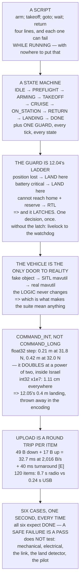

# 12.06 Writing your own mission logic in Python

<!-- glance:start -->
<!-- generated by tools/build.py from curriculum/syllabus.yaml — edit the syllabus, not this block -->

| | |
|---|---|
| **Track** | Main path |
| **Difficulty** | Advanced |
| **Time** | 2 h |
| **Hardware** | none |
| **Software** | python, pymavlink, sitl |
| **Prerequisites** | [12.05 Auto takeoff, auto land, and precision landing](12.05-auto-takeoff-land-precision.md)<br>[08.05 MAVLink: the protocol of drones](../08-flight-controller/08.05-mavlink.md) |
| **Skip if** | You can drive a full mission from a Python script in SITL and have it fail safely when you inject an error. |

<!-- glance:end -->

## What you will learn

- Why a mission is a **state machine, not a script** — and that the difference is one guard that
  runs every tick in every state
- That a guard which keeps re-deciding is a **livelock**: 12.04's ladder picks one action, and
  picking it again next tick means the recovery never flies
- How to build a vehicle interface you can **swap for pymavlink without touching the logic**
- Why `COMMAND_INT` and `MISSION_ITEM_INT` exist: float32 quantises a coordinate to **0.42 m at
  latitude 32** — the whole accuracy 12.05 worked for
- That the float32 step **doubles exactly at latitude 32**, which runs through Israel
- That uploading is a **round trip per item**: 8.7 s for a 120-item survey over telemetry, 0.24 s
  over USB, and the difference is turnaround rather than data
- How to run the whole mission six ways in a second, and why **a safe failure is a pass**

## Why it matters

Everything in this module so far happened in a ground station. You drew a grid, you set
parameters, you pressed upload. That is the right way to fly a survey and it is the wrong way to
build anything that has to make a decision — because a ground station's mission is a list, and a
list cannot ask a question.

The moment your aircraft needs to do something conditional — inspect until the battery says stop,
fly to whichever of three pads is clear, repeat a leg if the image was blurred — you are writing
code. And the first thing everybody writes is a script: arm, take off, go there, wait, come home.
Four lines, and wrong, because each of those lines can fail *while it is running* and a script has
nowhere to put that.

This lesson is the shape that works, and it is short. One loop, one transition table, one guard,
and a fake vehicle you can run on your laptop with no radio, no aircraft and no SITL. Then the
same code, unchanged, flies in SITL, and then it flies for real. That progression is the whole
point: **the logic is testable long before the hardware exists**, and
[10.01](../10-simulation/10.01-why-simulate.md) put logic bugs at 10 of 25 failure modes — the
ones that arrive looking like a perfectly normal flight.

> [!NOTE]
> This lesson needs no hardware. The code runs standalone on any machine with Python. Fly it in
> SITL when you want to see it drive a real autopilot; fly it on the aircraft only after the
> regression suite passes and you have watched it abort in SITL at least twice.

## Prerequisites

<!-- prereqs:start -->
## Prerequisites

You need these first:

- [12.05 Auto takeoff, auto land, and precision landing](12.05-auto-takeoff-land-precision.md)
- [08.05 MAVLink: the protocol of drones](../08-flight-controller/08.05-mavlink.md)

### Optional prerequisite links

None.

Check your readiness: `python course.py why 12.06`
<!-- prereqs:end -->

## Concept

A recipe says: heat the oil, add the onions, cook for ten minutes. It assumes the pan does not
catch fire. If it does, the recipe has no line for that, and the cook has to leave the recipe
entirely — which is exactly what a pilot does when a script goes wrong.

A state machine is the same recipe written so that "the pan is on fire" is a *state*, reachable
from every step, with its own instructions. The steps do not get longer. What gets added is one
question asked before every step: is anything wrong? That question is the guard, and it is the
only structural difference between the four-line script and something you can trust.

The second idea is subtler and it is where the first real bug in this lesson lives. A guard that
runs every tick will, if the condition persists, fire every tick. Fire every tick and you keep
re-entering the recovery state, keep announcing the abort, and never actually *fly* the recovery —
the aircraft sits there deciding to come home, over and over, until the battery runs out. The fix
is one boolean, and the reasoning behind it is [12.04](12.04-rtl-and-the-failsafe-tree.md)'s:
the ladder picks **one** action. Once picked, executing it is the job.

The third idea is about the boundary. The state machine should know nothing about MAVLink. It asks
a `Vehicle` object questions and gives it commands. In this lesson the `Vehicle` is a twenty-line
fake that pretends to fly using the constants this course has already frozen. In SITL it is
`mavutil`. In the air it is `mavutil` again, over a radio. **The logic never changes**, which is
what makes the regression suite meaningful.

## Technical explanation

### Level 1 — the machine, and the guard

Run the code. The nominal run walks IDLE → PREFLIGHT → ARMING → TAKEOFF → CRUISE → ON_STATION →
RETURN → LANDING → DONE in 166 simulated seconds, reaching 200 m out and landing with 89 % of the
pack left.

Read the loop. There is one `while`, one chain of `elif`, and above them a guard that runs in
every state except the three where it makes no sense (`IDLE`, `PREFLIGHT`, `LANDING` — you cannot
abort a landing into a landing). The guard calls `abort_reason()`, which is
[12.04](12.04-rtl-and-the-failsafe-tree.md)'s ladder reduced to what a mission script can actually
see: position health first, battery-critical second, and then an energy calculation that knows how
far from home the aircraft currently is.

That energy calculation is the part a ground station cannot do for you. It uses the *live*
distance, the *live* altitude, and [11.05](../11-first-flights/11.05-battery-discipline.md)'s
reserve fraction, and it answers a question no mission list can express: can I still get home from
where I am now?

### Level 2 — the same machine, with faults injected

Three fault runs, and not one line of the state machine changes. Faults arrive through the
`Vehicle`, which is the only place reality is allowed in.

Position lost during the outbound cruise: the guard fires at tick 30, the ladder says a position
failure removes RTL from the menu, and the aircraft lands where it is — 50 m out, with 95 % of the
pack. Position lost on station: the same decision, at 200 m out, with 91 %. **The ladder does not
care where you are**, and the state machine needed no special case for either.

Battery collapse on the outbound cruise: the guard's energy check knows it is 50 m out and 40 m
up, computes 3.1 Wh to get home, compares against the reserve, and turns around. The aircraft
lands at home with 19 % left. One ladder, two outcomes, no special cases.

And note the boolean. `aborted` latches the decision. Without it, the guard re-fires every tick,
`continue` skips the state body, the vehicle never moves, and the mission livelocks until the
watchdog at tick 2000 kills it. That is a real bug with a real shape, and it is the reason the
watchdog is there at all.

### Level 3 — `COMMAND_INT`, and why float32 is not good enough

`COMMAND_LONG` carries latitude and longitude as float32. `COMMAND_INT` and `MISSION_ITEM_INT`
carry them as int32 degrees × 10⁷.

Float32 has a 24-bit mantissa. The code measures the gap between adjacent representable values at
five coordinates by packing and unpacking the bits directly. At latitude 31.8 the step is
**0.21 m**. At 32.0 it is **0.42 m**. At longitude 35.2, 0.42 m. The int32 encoding is 1.11 cm
everywhere.

Look at those middle two rows. The step *doubles* between 31.8 and 32.0, because 32 is a power of
two and float32 changes exponent there. **That boundary runs through Israel** — Tel Aviv is 32.08 N
and Beersheba is 31.25 N — so two fields a hundred kilometres apart get different encoding errors
from the same message type.

Then compare 0.42 m with [12.05](12.05-auto-takeoff-land-precision.md). The whole point of a
precision landing was to get inside about 0.4 m. You cannot land on a pad to 0.4 m if the pad's
coordinate arrived quantised to 0.42 m.

And it is not an error you can see. The mission uploads, validates, flies, and lands slightly
wrong — every time, consistently, which looks like a calibration offset rather than a bug. **Use
the `_INT` variants. Always.**

### Level 4 — uploading is a round trip per item

The mission protocol is `MISSION_COUNT`, then the aircraft requests each item in turn, then
`MISSION_ACK`. Each item is a `MISSION_ITEM_INT` down (37 + 12 = 49 bytes) and a
`MISSION_REQUEST_INT` up (5 + 12 = 17 bytes): 32.7 ms of air time at
[09.04](../09-telemetry-datalink/09.04-telemetry-917.md)'s 2,016 B/s, plus about 40 ms of SiK
turnaround **[E]**.

A 120-item survey takes **8.7 s over the radio and 0.24 s over USB**, and the difference is almost
entirely turnaround, not data. Which is why you do not re-upload a mission to change one waypoint
in flight — write the single item, or fly the change in `GUIDED` and leave the mission alone. And
always download and compare afterwards, as [12.01](12.01-waypoints.md) insisted.

### Level 5 — the regression suite

Six cases, run in under a second. Every one of them is expected to reach `DONE`, which is the
point: **the mission is allowed to fail, and a safe failure is a pass**. A suite that only tests
the nominal case tests the one outcome you were never worried about.

What it does not test is the honest part: anything mechanical, anything electrical, the radio link
itself as opposed to your reaction to it, [12.05](12.05-auto-takeoff-land-precision.md)'s land
detector (which needs real ground effect), and the pilot.
[10.01](../10-simulation/10.01-why-simulate.md) put that at 10 of 25 failure modes, all logic
bugs — and logic bugs are precisely the ones worth a suite, because they arrive in a form that
looks like a normal flight.

> [!TIP]
> **Ask your teacher:** "If my guard fires every tick, what stops the aircraft from re-deciding to
> come home instead of actually coming home?" It is one boolean and it is the difference between
> a state machine and a stutter. Most people write the bug before they see the answer.

## Diagram



## Code

A complete mission state machine with a stand-in vehicle built from this course's frozen
constants, run nominally and with three faults injected, plus the float32 coordinate measurement,
the upload-time calculation, and a six-case regression suite. It runs standalone — no radio, no
SITL, no aircraft.

```python
"""12.06 - a mission state machine you can run, and the reasons it is not a script."""
import math
import struct

# --- the aircraft, from the numbers this course has already frozen -------
HOVER_W, CRUISE_W = 226.0, 203.0      # 02.11 / 03.09
USABLE_WH = 88.8                      # 11.05
CLIMB_MS, DESC_MS = 2.5, 1.5
LAND_SPEED = 0.5
WPNAV_SPEED = 5.0
RESERVE_FRAC = 0.25                   # 11.05's reserve
DT = 1.0                              # the state machine ticks at 1 Hz

# --- the link, from module 09 -------------------------------------------
LINK_BPS = 2016.0                     # 09.04's derived SiK throughput
MAVLINK2_OVERHEAD = 12                # 10 header + 2 CRC
MISSION_ITEM_INT_LEN = 37
MISSION_REQUEST_INT_LEN = 5
TDM_TURNAROUND = 0.040                # s, two SiK slots [E]


# =======================================================================
# 1. THE STATE MACHINE
# =======================================================================
STATES = ["IDLE", "PREFLIGHT", "ARMING", "TAKEOFF", "CRUISE",
          "ON_STATION", "RETURN", "LANDING", "DONE", "ABORT"]


class Vehicle:
    """A deliberately stupid stand-in for pymavlink. Same SHAPE, no radio.

    Every method here maps to one MAVLink exchange. Swapping this class for
    a real mavutil connection is the only change needed to fly it."""

    def __init__(self, wh=USABLE_WH, home=(32.0, 35.0)):
        self.t = 0.0
        self.alt = 0.0
        self.dist = 0.0          # from home, m
        self.max_dist = 0.0      # the furthest it ever got
        self.wh_left = wh
        self.armed = False
        self.mode = "GUIDED"
        self.home = home
        self.pos_ok = True       # EKF happy?
        self.log = []
        self._target_alt = 0.0
        self._outbound = True

    # --- things a mission script ASKS -----------------------------------
    def battery_frac(self):
        return self.wh_left / USABLE_WH

    def healthy(self):
        return self.pos_ok

    # --- things a mission script COMMANDS -------------------------------
    def arm(self):
        if not self.pos_ok:
            return False
        self.armed = True
        return True

    def disarm(self):
        self.armed = False

    def set_mode(self, m):
        self.mode = m

    def goto_alt(self, a):
        self._target_alt = a

    def goto_dist(self, d):
        self._target_dist = d

    # --- and the world moving on ----------------------------------------
    def tick(self, dt=DT, cruising=False, landing=False):
        self.t += dt
        if not self.armed:
            return
        if landing:
            rate = LAND_SPEED if self.alt <= 10 else DESC_MS
            self.alt = max(0.0, self.alt - rate * dt)
            p = HOVER_W * 0.85
        elif self.alt < self._target_alt - 0.1:
            self.alt = min(self._target_alt, self.alt + CLIMB_MS * dt)
            p = HOVER_W * 1.30
        elif cruising:
            step = WPNAV_SPEED * dt
            self.dist += step if self._outbound else -step
            self.dist = max(0.0, self.dist)
            self.max_dist = max(self.max_dist, self.dist)
            p = CRUISE_W
        else:
            p = HOVER_W
        self.wh_left -= p * dt / 3600.0


def abort_reason(v, target_dist):
    """12.04's ladder, reduced to what a mission script can actually see.
    Returns None to continue, or a string. ORDER MATTERS."""
    if not v.healthy():
        return "EKF/position lost -- RTL is not available (12.04)"
    if v.battery_frac() < RESERVE_FRAC * 0.5:
        return "battery CRITICAL -- land here"
    # energy to get home from where we are, at cruise, plus the descent
    home_wh = (CRUISE_W * v.dist / WPNAV_SPEED
               + HOVER_W * 0.85 * (v.alt / DESC_MS + 10 / LAND_SPEED)) / 3600
    if v.wh_left < home_wh + USABLE_WH * RESERVE_FRAC:
        return f"cannot reach home with reserve (needs {home_wh:.1f} Wh)"
    return None


def run_mission(v, target_alt=40.0, target_dist=200.0, station_s=30.0,
                fault=None, verbose=True):
    """The whole mission as ONE loop with ONE transition table.

    fault: (tick_number, what) -- injected the way a test injects, not the
    way a bug arrives."""
    state, station_t, n = "IDLE", 0.0, 0
    aborted = False          # a decision made ONCE, not re-made every tick
    trace = []
    while state not in ("DONE", "ABORT"):
        n += 1
        if n > 2000:
            state = "ABORT"
            trace.append((n, state, "watchdog: the loop did not terminate"))
            break
        if fault and n == fault[0]:
            if fault[1] == "position":
                v.pos_ok = False
            elif fault[1] == "battery":
                v.wh_left = USABLE_WH * 0.22
            trace.append((n, state, f"*** FAULT INJECTED: {fault[1]}"))

        # THE GUARD RUNS EVERY TICK, IN EVERY STATE. That is the point.
        # But once it has DECIDED, it stops deciding. 12.04's ladder picks
        # ONE action; re-picking it every tick is how a guard turns into a
        # livelock that never flies the recovery it chose.
        if not aborted and state not in ("IDLE", "PREFLIGHT", "LANDING"):
            why = abort_reason(v, target_dist)
            if why:
                trace.append((n, state, f"ABORT: {why}"))
                aborted = True
                state = "LANDING" if "CRITICAL" in why or "EKF" in why \
                    else "RETURN"
                if state == "LANDING":
                    v.set_mode("LAND")
                else:
                    v._outbound = False
                    v.set_mode("RTL")
                continue

        if state == "IDLE":
            trace.append((n, state, "waiting for a go"))
            state = "PREFLIGHT"
        elif state == "PREFLIGHT":
            ok = v.healthy() and v.battery_frac() > 0.9
            trace.append((n, state,
                          f"health={v.healthy()} batt="
                          f"{v.battery_frac() * 100:.0f}% -> "
                          f"{'GO' if ok else 'NO GO'}"))
            state = "ARMING" if ok else "ABORT"
        elif state == "ARMING":
            ok = v.arm()
            trace.append((n, state, f"arm -> {ok}"))
            state = "TAKEOFF" if ok else "ABORT"
            v.goto_alt(target_alt)
        elif state == "TAKEOFF":
            v.tick()
            if v.alt >= target_alt - 0.2:
                trace.append((n, state, f"reached {v.alt:.0f} m"))
                state = "CRUISE"
        elif state == "CRUISE":
            v.tick(cruising=True)
            if v.dist >= target_dist:
                trace.append((n, state, f"on station at {v.dist:.0f} m"))
                state = "ON_STATION"
        elif state == "ON_STATION":
            v.tick()
            station_t += DT
            if station_t >= station_s:
                trace.append((n, state, f"held {station_t:.0f} s"))
                state = "RETURN"
                v._outbound = False
                v.set_mode("RTL")
        elif state == "RETURN":
            v.tick(cruising=True)
            if v.dist <= 0.5:
                trace.append((n, state, "over home"))
                state = "LANDING"
                v.set_mode("LAND")
        elif state == "LANDING":
            v.tick(landing=True)
            if v.alt <= 0.01:
                v.disarm()
                trace.append((n, state, "down and disarmed"))
                state = "DONE"
    trace.append((n, state, f"t={v.t:.0f}s  reached {v.max_dist:.0f} m out  "
                            f"pack left {v.battery_frac() * 100:.0f}%"))
    if verbose:
        for i, s, m in trace:
            print(f"    {i:4d}  {s:11s} {m}")
    return state, trace


# =======================================================================
# 2. WHY COMMAND_INT, NOT COMMAND_LONG
# =======================================================================
def f32_resolution(deg):
    """The gap between adjacent float32 values at this latitude, in metres."""
    packed = struct.unpack('f', struct.pack('f', deg))[0]
    nxt = struct.unpack('f', struct.pack('I',
          struct.unpack('I', struct.pack('f', deg))[0] + 1))[0]
    return abs(nxt - packed) * 111_320.0


def upload_time(n_items, bps=LINK_BPS):
    down = (MISSION_ITEM_INT_LEN + MAVLINK2_OVERHEAD)
    up = (MISSION_REQUEST_INT_LEN + MAVLINK2_OVERHEAD)
    air = (down + up) / bps
    return n_items * (air + TDM_TURNAROUND), air, TDM_TURNAROUND


# =======================================================================
# 3. THE REGRESSION SUITE
# =======================================================================
SUITE = [
    ("nominal", None, "DONE"),
    ("position lost on the way out", (30, "position"), "DONE"),
    ("position lost on station", (90, "position"), "DONE"),
    ("battery collapse on the way out", (30, "battery"), "DONE"),
    ("battery collapse on station", (90, "battery"), "DONE"),
    ("battery collapse near home", (140, "battery"), "DONE"),
]


def bar(t):
    print("\n" + "=" * 70)
    print(t)
    print("=" * 70)


if __name__ == "__main__":
    bar("1. A MISSION IS A STATE MACHINE, NOT A SCRIPT")
    print("  A script says: arm, take off, go there, wait, come back.")
    print("  It is four lines and it is wrong, because every one of")
    print("  those lines can fail while it is running and a script has")
    print("  nowhere to put that.")
    print("  A state machine has ONE loop, ONE transition table, and a")
    print("  GUARD THAT RUNS EVERY TICK IN EVERY STATE:")
    print(f"  {'states':10s} {' -> '.join(STATES[:8])}")
    print(f"  {'':10s} and ABORT, reachable from all of them")
    print("\n  THE NOMINAL RUN:")
    run_mission(Vehicle())

    bar("2. THE SAME MACHINE, WITH FAULTS INJECTED")
    print("  Nothing below changes a single line of the state machine.")
    print("  The faults arrive through the VEHICLE, which is the only")
    print("  place reality is allowed in.")
    for name, fault, _ in SUITE[1:3]:
        print(f"\n  --- {name} ---")
        run_mission(Vehicle(), fault=fault)
    print("\n  --- battery collapse on the way OUT ---")
    run_mission(Vehicle(), fault=(30, "battery"))
    print("  READ THE TWO POSITION CASES TOGETHER. Losing position on")
    print("  the way OUT and losing it ON STATION produce the same")
    print("  action -- land here -- at different places, because 12.04's")
    print("  ladder does not care where you are. The state machine did")
    print("  not need a special case for either.")
    print("  AND THE BATTERY CASE TURNS AROUND AND LANDS AT HOME,")
    print("  because the guard's energy check knows the distance and")
    print("  12.04's ladder says battery-LOW is an RTL, not a landing.")
    print("  ONE LADDER. TWO OUTCOMES. NO SPECIAL CASES.")

    bar("3. COMMAND_INT, NOT COMMAND_LONG -- AND THIS IS WHY")
    print("  COMMAND_LONG carries lat/lon as float32. COMMAND_INT and")
    print("  MISSION_ITEM_INT carry them as int32 degrees x 1e7.")
    print("  Float32 has a 24-bit mantissa. At the magnitudes a latitude")
    print("  actually takes, that is not enough:")
    print(f"  {'coordinate':>14s} {'float32 step':>14s}"
          f" {'int32 x1e7 step':>17s}")
    for deg in (0.5, 31.8, 32.0, 35.2, 150.0):
        print(f"  {deg:12.4f} d {f32_resolution(deg):11.2f} m"
              f" {1e-7 * 111_320.0 * 100:14.2f} cm")
    print("  LOOK AT THE 31.8 AND 32.0 ROWS. THE STEP DOUBLES, from")
    print(f"  {f32_resolution(31.8):.2f} m to {f32_resolution(32.0):.2f} m,"
          f" because 32 is a power of two and")
    print("  float32 changes exponent there. THAT BOUNDARY RUNS THROUGH")
    print("  ISRAEL -- Tel Aviv is 32.08 N and Beersheba is 31.25 N, so")
    print("  two fields a hundred kilometres apart get different")
    print("  encoding errors from the same message type.")
    print(f"  AND COMPARE {f32_resolution(32.0):.2f} m WITH 12.05: the whole"
          f" point of a")
    print("  precision landing was to get inside about 0.4 m. You cannot")
    print("  land on a pad to 0.4 m if the pad's coordinate arrived")
    print(f"  quantised to {f32_resolution(32.0):.2f} m.")
    print("  IT IS ALSO NOT AN ERROR YOU CAN SEE. The mission uploads,")
    print("  validates, flies, and lands somewhere slightly wrong, every")
    print("  time, consistently. USE THE _INT VARIANTS. ALWAYS.")

    bar("4. UPLOADING IS A ROUND TRIP PER ITEM, NOT A FILE COPY")
    print("  MISSION_COUNT, then the aircraft REQUESTS each item in turn,")
    print("  then MISSION_ACK. One round trip each, over 09.04's link:")
    t, air, turn = upload_time(1)
    print(f"  {'item down':>16s} {MISSION_ITEM_INT_LEN + MAVLINK2_OVERHEAD:5d} B")
    print(f"  {'request up':>16s} "
          f"{MISSION_REQUEST_INT_LEN + MAVLINK2_OVERHEAD:5d} B")
    print(f"  {'air time':>16s} {air * 1000:5.1f} ms"
          f"   at {LINK_BPS:.0f} B/s (09.04)")
    print(f"  {'TDM turnaround':>16s} {turn * 1000:5.0f} ms   [E]")
    print(f"  {'items':>10s} {'over telemetry':>16s} {'over USB [E]':>14s}")
    for n in (10, 40, 120, 500):
        tt = upload_time(n)[0]
        print(f"  {n:10d} {tt:13.1f} s {n * 0.002:12.2f} s")
    print("  A 120-ITEM SURVEY TAKES ABOUT NINE SECONDS TO UPLOAD OVER")
    print("  THE RADIO AND A QUARTER OF A SECOND OVER USB, and the")
    print("  difference is almost entirely the TURNAROUND, not the data.")
    print("  WHICH IS WHY YOU DO NOT RE-UPLOAD A MISSION TO CHANGE ONE")
    print("  WAYPOINT IN FLIGHT. Use MISSION_ITEM to write the single")
    print("  item, or fly the change in GUIDED and leave the mission")
    print("  alone. And ALWAYS DOWNLOAD AND COMPARE afterwards (12.01).")

    bar("5. THE REGRESSION SUITE -- SIX CASES, RUN EVERY TIME")
    print("  The state machine above is 120 lines. The value is not the")
    print("  120 lines; it is that they can be run six ways in a second.")
    print(f"  {'case':34s} {'expect':>7s} {'got':>7s} {'':>6s}")
    fails = 0
    for name, fault, expect in SUITE:
        got, _ = run_mission(Vehicle(), fault=fault, verbose=False)
        ok = got == expect
        fails += 0 if ok else 1
        print(f"  {name:34s} {expect:>7s} {got:>7s} {'ok' if ok else 'FAIL':>6s}")
    print(f"  {fails} failing of {len(SUITE)}")
    print("  EVERY ONE OF THOSE ENDS IN 'DONE', which is the point: the")
    print("  mission is allowed to fail, and a safe failure is a PASS.")
    print("  A suite that only tests the nominal case tests the one")
    print("  outcome you were never worried about.")
    print("\n  AND WHAT THIS DOES NOT TEST, from 10.01's count:")
    for a in ("anything mechanical -- a motor, a prop, a solder joint",
              "anything electrical -- a brown-out, a loose XT60",
              "the radio link itself, as opposed to your reaction to it",
              "the land detector (12.05), which needs real ground effect",
              "and the pilot, who is the last item on every ladder"):
        print(f"    - {a}")
    print("  10.01 PUT IT AT 10 OF 25 FAILURE MODES, ALL LOGIC BUGS.")
    print("  This suite catches logic bugs. It is worth writing because")
    print("  logic bugs are the ones that arrive in a form that looks")
    print("  like a perfectly normal flight.")
```

Output:

```text

======================================================================
1. A MISSION IS A STATE MACHINE, NOT A SCRIPT
======================================================================
  A script says: arm, take off, go there, wait, come back.
  It is four lines and it is wrong, because every one of
  those lines can fail while it is running and a script has
  nowhere to put that.
  A state machine has ONE loop, ONE transition table, and a
  GUARD THAT RUNS EVERY TICK IN EVERY STATE:
  states     IDLE -> PREFLIGHT -> ARMING -> TAKEOFF -> CRUISE -> ON_STATION -> RETURN -> LANDING
             and ABORT, reachable from all of them

  THE NOMINAL RUN:
       1  IDLE        waiting for a go
       2  PREFLIGHT   health=True batt=100% -> GO
       3  ARMING      arm -> True
      19  TAKEOFF     reached 40 m
      59  CRUISE      on station at 200 m
      89  ON_STATION  held 30 s
     129  RETURN      over home
     169  LANDING     down and disarmed
     169  DONE        t=166s  reached 200 m out  pack left 89%

======================================================================
2. THE SAME MACHINE, WITH FAULTS INJECTED
======================================================================
  Nothing below changes a single line of the state machine.
  The faults arrive through the VEHICLE, which is the only
  place reality is allowed in.

  --- position lost on the way out ---
       1  IDLE        waiting for a go
       2  PREFLIGHT   health=True batt=100% -> GO
       3  ARMING      arm -> True
      19  TAKEOFF     reached 40 m
      30  CRUISE      *** FAULT INJECTED: position
      30  CRUISE      ABORT: EKF/position lost -- RTL is not available (12.04)
      70  LANDING     down and disarmed
      70  DONE        t=66s  reached 50 m out  pack left 95%

  --- position lost on station ---
       1  IDLE        waiting for a go
       2  PREFLIGHT   health=True batt=100% -> GO
       3  ARMING      arm -> True
      19  TAKEOFF     reached 40 m
      59  CRUISE      on station at 200 m
      89  ON_STATION  held 30 s
      90  RETURN      *** FAULT INJECTED: position
      90  RETURN      ABORT: EKF/position lost -- RTL is not available (12.04)
     130  LANDING     down and disarmed
     130  DONE        t=126s  reached 200 m out  pack left 91%

  --- battery collapse on the way OUT ---
       1  IDLE        waiting for a go
       2  PREFLIGHT   health=True batt=100% -> GO
       3  ARMING      arm -> True
      19  TAKEOFF     reached 40 m
      30  CRUISE      *** FAULT INJECTED: battery
      30  CRUISE      ABORT: cannot reach home with reserve (needs 3.1 Wh)
      40  RETURN      over home
      80  LANDING     down and disarmed
      80  DONE        t=76s  reached 50 m out  pack left 19%
  READ THE TWO POSITION CASES TOGETHER. Losing position on
  the way OUT and losing it ON STATION produce the same
  action -- land here -- at different places, because 12.04's
  ladder does not care where you are. The state machine did
  not need a special case for either.
  AND THE BATTERY CASE TURNS AROUND AND LANDS AT HOME,
  because the guard's energy check knows the distance and
  12.04's ladder says battery-LOW is an RTL, not a landing.
  ONE LADDER. TWO OUTCOMES. NO SPECIAL CASES.

======================================================================
3. COMMAND_INT, NOT COMMAND_LONG -- AND THIS IS WHY
======================================================================
  COMMAND_LONG carries lat/lon as float32. COMMAND_INT and
  MISSION_ITEM_INT carry them as int32 degrees x 1e7.
  Float32 has a 24-bit mantissa. At the magnitudes a latitude
  actually takes, that is not enough:
      coordinate   float32 step   int32 x1e7 step
        0.5000 d        0.01 m           1.11 cm
       31.8000 d        0.21 m           1.11 cm
       32.0000 d        0.42 m           1.11 cm
       35.2000 d        0.42 m           1.11 cm
      150.0000 d        1.70 m           1.11 cm
  LOOK AT THE 31.8 AND 32.0 ROWS. THE STEP DOUBLES, from
  0.21 m to 0.42 m, because 32 is a power of two and
  float32 changes exponent there. THAT BOUNDARY RUNS THROUGH
  ISRAEL -- Tel Aviv is 32.08 N and Beersheba is 31.25 N, so
  two fields a hundred kilometres apart get different
  encoding errors from the same message type.
  AND COMPARE 0.42 m WITH 12.05: the whole point of a
  precision landing was to get inside about 0.4 m. You cannot
  land on a pad to 0.4 m if the pad's coordinate arrived
  quantised to 0.42 m.
  IT IS ALSO NOT AN ERROR YOU CAN SEE. The mission uploads,
  validates, flies, and lands somewhere slightly wrong, every
  time, consistently. USE THE _INT VARIANTS. ALWAYS.

======================================================================
4. UPLOADING IS A ROUND TRIP PER ITEM, NOT A FILE COPY
======================================================================
  MISSION_COUNT, then the aircraft REQUESTS each item in turn,
  then MISSION_ACK. One round trip each, over 09.04's link:
         item down    49 B
        request up    17 B
          air time  32.7 ms   at 2016 B/s (09.04)
    TDM turnaround    40 ms   [E]
       items   over telemetry   over USB [E]
          10           0.7 s         0.02 s
          40           2.9 s         0.08 s
         120           8.7 s         0.24 s
         500          36.4 s         1.00 s
  A 120-ITEM SURVEY TAKES ABOUT NINE SECONDS TO UPLOAD OVER
  THE RADIO AND A QUARTER OF A SECOND OVER USB, and the
  difference is almost entirely the TURNAROUND, not the data.
  WHICH IS WHY YOU DO NOT RE-UPLOAD A MISSION TO CHANGE ONE
  WAYPOINT IN FLIGHT. Use MISSION_ITEM to write the single
  item, or fly the change in GUIDED and leave the mission
  alone. And ALWAYS DOWNLOAD AND COMPARE afterwards (12.01).

======================================================================
5. THE REGRESSION SUITE -- SIX CASES, RUN EVERY TIME
======================================================================
  The state machine above is 120 lines. The value is not the
  120 lines; it is that they can be run six ways in a second.
  case                                expect     got       
  nominal                               DONE    DONE     ok
  position lost on the way out          DONE    DONE     ok
  position lost on station              DONE    DONE     ok
  battery collapse on the way out       DONE    DONE     ok
  battery collapse on station           DONE    DONE     ok
  battery collapse near home            DONE    DONE     ok
  0 failing of 6
  EVERY ONE OF THOSE ENDS IN 'DONE', which is the point: the
  mission is allowed to fail, and a safe failure is a PASS.
  A suite that only tests the nominal case tests the one
  outcome you were never worried about.

  AND WHAT THIS DOES NOT TEST, from 10.01's count:
    - anything mechanical -- a motor, a prop, a solder joint
    - anything electrical -- a brown-out, a loose XT60
    - the radio link itself, as opposed to your reaction to it
    - the land detector (12.05), which needs real ground effect
    - and the pilot, who is the last item on every ladder
  10.01 PUT IT AT 10 OF 25 FAILURE MODES, ALL LOGIC BUGS.
  This suite catches logic bugs. It is worth writing because
  logic bugs are the ones that arrive in a form that looks
  like a perfectly normal flight.
```

## Exercise

### Exercise 12.06-E1 — Break the latch `[build]`

Remove the `aborted` flag and run the battery cases again. Watch the livelock, and watch the
watchdog catch it. Then put it back. You want to have seen this failure in a place where it costs
nothing.

### Exercise 12.06-E2 — Add a state `[build]`

Add an `INSPECT` state between `ON_STATION` and `RETURN` that circles a point for a configurable
time and aborts early if the battery guard fires. Add two regression cases for it. The test is
whether you had to change anything outside the new state — you should not have.

### Exercise 12.06-E3 — Swap the vehicle for SITL `[build]`

Replace the `Vehicle` class with a `mavutil` connection to
[10.04](../10-simulation/10.04-ardupilot-sitl.md)'s SITL. Keep the same method names. Run the
nominal case and one fault case. Count the lines of the state machine you had to change.

### Exercise 12.06-E4 — Measure your own coordinate quantisation `[analysis]`

Run the float32 measurement at your own field's latitude and longitude. Then compute what fraction
of [12.05](12.05-auto-takeoff-land-precision.md)'s landing accuracy it consumes, and check whether
your own tooling is sending `_INT` variants — read the bytes, do not trust the library name.

> [!WARNING]
> E3 drives a real autopilot, even in simulation. Before running the same code against an
> aircraft, confirm that your abort path has actually been exercised in SITL — a state machine that
> has only ever reached `DONE` through the nominal path has an untested recovery, which is the
> same as no recovery.

## Expected result

**12.06-E1**: the battery cases run to tick 2000 and end in `ABORT` with the watchdog message,
while the vehicle never moves — `t` stays where the fault was injected. That frozen clock is the
signature of a livelock and it is worth recognising.

**12.06-E2**: two new cases, no changes outside the new state, and the guard protecting the new
state for free because it was never state-specific.

**12.06-E3**: expect to change the `Vehicle` class entirely and the state machine not at all. If
you find yourself editing the transition table to accommodate MAVLink, the boundary was in the
wrong place — the usual cause is a state that asked the vehicle for something MAVLink does not
offer in one message.

**12.06-E4**: at Israeli latitudes expect 0.21 m or 0.42 m depending on which side of 32 you are,
and roughly 0.42 m in longitude. That is between half and all of a precision landing's accuracy,
spent before the mission starts.

## Troubleshooting

**The mission never terminates.** Either a guard without a latch (E1) or a state whose exit
condition can never be met — a distance threshold tighter than one tick's travel is the classic.
The watchdog exists to make this visible instead of infinite.

**The abort fires immediately, before takeoff.** Your energy guard is being evaluated in a state
where the numbers are not meaningful yet. Check which states the guard is excluded from.

**The aircraft aborts, turns for home, and aborts again halfway.** The latch is per-decision, not
per-mission. That is usually correct — a critical battery *should* override an earlier RTL — but
if you did not intend it, the ladder's ordering is where to look.

**SITL accepts the mission but the aircraft flies to the wrong place.** Check whether you sent
`MISSION_ITEM` or `MISSION_ITEM_INT`, and check the frame. Level 3, and
[12.02](12.02-mission-planning.md)'s frame warning.

**Uploading times out on a long mission.** Level 4: 500 items is 36 s over telemetry. Raise the
timeout or upload over USB.

**The suite passes and the aircraft does something else.** The suite tests logic. Compare what the
`Vehicle` reported against what the real autopilot reported — the gap between them is where your
model of the aircraft is wrong, and that gap is worth more than the test.

## Common mistakes

- **Writing it as a script.** Four lines, no guard, and nowhere to put a failure.
- **A guard without a latch.** It re-decides forever and the recovery never flies.
- **Putting MAVLink inside the state machine.** The logic should not know what a message is.
- **Using `COMMAND_LONG` for coordinates.** 0.42 m of quantisation, invisible, consistent.
- **Re-uploading a whole mission to change one item in flight.** 8.7 s of radio, for one waypoint.
- **Testing only the nominal path.** The recovery is the part you are worried about, so it is the
  part to test.
- **No watchdog.** A loop that cannot fail to terminate is a loop you have not thought about.
- **Flying it before the abort path has run in SITL.** An untested recovery is not a recovery.

## Knowledge check

<details>
<summary>What is the one structural difference between the four-line script and the state
machine?</summary>

A guard that runs before every state body, in every state, asking whether anything is wrong. The
steps themselves are the same length; what is added is the question, and the fact that the
recovery is a state rather than an exit from the program.
</details>

<details>
<summary>Why does the guard need a latch, and what happens without one?</summary>

Because 12.04's ladder picks one action and executing it is then the job. Without the latch the
guard re-fires every tick, `continue` skips the state body, the vehicle never moves, and the
mission livelocks until the watchdog. The signature is a frozen clock in the trace.
</details>

<details>
<summary>Losing position 50 m out and losing it 200 m out produce the same action. Why is that a
feature rather than a gap?</summary>

Because the ladder is about severity, not geometry: a position failure removes RTL from the menu
whatever the distance, so both land where they are. The state machine needed no special case for
either — which is the evidence the abstraction is right.
</details>

<details>
<summary>What does float32 do to a coordinate at latitude 32, and why does 31.8 behave
differently?</summary>

At 32.0 the step between representable values is 0.42 m; at 31.8 it is 0.21 m. The step doubles at
32 because 32 is a power of two and float32 changes exponent there — and that boundary runs
through Israel, so two nearby fields inherit different encoding errors from the same message.
</details>

<details>
<summary>Why does 0.42 m of coordinate quantisation matter specifically after 12.05?</summary>

Because 12.05's whole precision-landing exercise was to get inside about 0.4 m, and a target
coordinate quantised to 0.42 m consumes all of it before the aircraft has even seen the message.
The failure is invisible: it flies, it validates, it lands consistently in the wrong place.
</details>

<details>
<summary>A 120-item survey takes 8.7 s to upload over telemetry and 0.24 s over USB. What accounts
for the difference, and what should you do about it in flight?</summary>

Turnaround, not data — about 40 ms of SiK latency per item against 32.7 ms of air time. In flight,
do not re-upload the mission to change one waypoint: write the single item, or fly the change in
`GUIDED` and leave the mission alone.
</details>

<details>
<summary>Every case in the regression suite expects `DONE`. Why is that the right expectation for
a fault-injection test?</summary>

Because the mission is allowed to fail; what is not allowed is failing *unsafely*. `DONE` means
the aircraft reached the ground under control. A suite whose fault cases expect anything else is
testing that the faults happen, not that the recovery works.
</details>

## Practical challenge

Write and prove a conditional mission that no ground station could express.

1. Pick a job with a real decision in it: inspect three points and return early if any one of them
   looks wrong; or fly legs until the energy guard says one more would not fit.
2. Build it as a state machine with the shape in this lesson — one loop, one table, one latched
   guard, one watchdog.
3. Keep the vehicle interface to fewer than a dozen methods, and write down what MAVLink message
   each one becomes.
4. Write a regression suite of at least eight cases, of which at least five are faults.
5. Every fault case must end with the aircraft on the ground under control.
6. Run the suite. Then swap the vehicle for SITL and run the nominal case and three faults.
7. Watch one abort happen in SITL with your own eyes, not just in a pass/fail line.
8. Only then fly it, with a pilot ready to take control and the fence from
   [12.03](12.03-geofence.md) around the working area.

The deliverable is the suite, not the flight. A flight proves the code worked once; the suite is
what lets you change it next month.

## You can skip this if

You can drive a full mission from a Python script in SITL and have it fail safely when you inject
an error. "Fail safely" means you have watched it, in SITL, at least twice — not that the code has
an abort branch.

## Go deeper

- The pymavlink library and `mavutil`, which is what the `Vehicle` class becomes:
  <https://mavlink.io/en/mavgen_python/>
- The MAVLink mission protocol, including the upload and download sequences and the `_INT`
  message variants: <https://mavlink.io/en/services/mission.html>
- ArduPilot's guide to controlling the vehicle from a companion computer in `GUIDED` mode, which
  is the other half of this lesson: <https://ardupilot.org/dev/docs/copter-commands-in-guided-mode.html>

**Version-sensitive:** the mission protocol's timeouts and retry behaviour, the availability of
`MISSION_ITEM` (deprecated in favour of `MISSION_ITEM_INT`), and pymavlink's helper signatures all
change between releases. Read the message definitions your firmware actually ships with.

## Progress checkpoint

You can now write a mission as a state machine with a latched guard, explain why the logic must not
know about MAVLink, state what float32 does to a coordinate at your own latitude, price a mission
upload over your own radio link, and run a fault-injection suite in which a safe failure is a pass.

That completes module 12. Next, module 13 takes the position estimate everything here depended on
and opens it up — what GNSS actually measures, where the errors come from, and how to make the
aircraft's idea of "here" good enough to trust.
