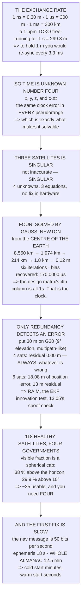

# 13.01 From GPS to GNSS: constellations, trilateration and time

<!-- glance:start -->
<!-- generated by tools/build.py from curriculum/syllabus.yaml — edit the syllabus, not this block -->

| | |
|---|---|
| **Track** | Main path |
| **Difficulty** | Intermediate |
| **Time** | 1 h 30 min |
| **Hardware** | none |
| **Software** | python |
| **Prerequisites** | [12.06 Writing your own mission logic in Python](../12-autonomous-flight/12.06-missions-from-python.md)<br>[05.04 The GNSS receiver on a drone: fix types, HDOP, and what the FC does with it](../05-sensors/05.04-gnss-receiver.md) |
| **Optional prerequisites** | [FGL.02 Local frames: ENU, NED, and body](../optional-foundations/gnss-navigation-math/FGL.02-local-frames-enu.md) |
| **Skip if** | You can solve a four-satellite pseudorange problem and explain why the receiver clock is the fourth unknown. |

<!-- glance:end -->

## What you will learn

- That **one nanosecond is 30 centimetres**, and that this exchange rate sets the whole design
- Why your receiver's own clock is hopeless: to hold a metre you would have to re-synchronise it
  every **3.3 milliseconds**
- That the fourth unknown is **time, not geometry** — and that three satellites is *singular*, not
  merely inaccurate
- How to solve the pseudorange problem yourself, in about forty lines, converging from the centre
  of the Earth in **six iterations**
- Why **only a redundant satellite can tell you something is wrong** — with exactly four, the
  residuals are zero by construction whatever is broken
- That about **35 of 118 satellites** are usable at any moment above a 10° mask, and that this is
  geometry rather than luck
- Why a cold start can take **12.5 minutes** and a warm start **18 seconds**

## Why it matters

Module 12 spent six lessons assuming the aircraft knows where it is. It planned grids around a
position, drew fences around a position, decided whether it could reach home from a position, and
[12.04](../12-autonomous-flight/12.04-rtl-and-the-failsafe-tree.md) put a branch at the top of the
failsafe ladder for the moment that position goes away — a branch that removes RTL from the menu
entirely.

This module is that assumption, opened up. And it starts here because almost everything people
believe about GNSS is a simplification that stops being harmless the moment it matters.
"Triangulation from three satellites" is the usual one, and it is wrong in a specific and
instructive way: the third dimension is not the problem, the clock is.

There is also a practical payoff. Once you have solved a pseudorange problem yourself, the
receiver stops being a black box that emits a latitude. You can see exactly why a fix degrades in
a canyon, why the satellite count matters more than the fix type, and why the number to watch on
preflight is not "do I have 3D fix" but "how many satellites *above four* do I have" — because
that surplus is the only thing standing between you and a silent error.

> [!NOTE]
> This lesson needs no hardware. The code is a complete GNSS position solver in pure Python — no
> numpy, no library — with synthetic but geometrically real satellites over an Israeli field. Run
> it, break it, and watch what breaks.

## Prerequisites

<!-- prereqs:start -->
## Prerequisites

You need these first:

- [12.06 Writing your own mission logic in Python](../12-autonomous-flight/12.06-missions-from-python.md)
- [05.04 The GNSS receiver on a drone: fix types, HDOP, and what the FC does with it](../05-sensors/05.04-gnss-receiver.md)

### Optional prerequisite links

New to any of these? Take the foundation lesson first; skip it if you already know it.

- [FGL.02 Local frames: ENU, NED, and body](../optional-foundations/gnss-navigation-math/FGL.02-local-frames-enu.md)

Check your readiness: `python course.py why 13.01`
<!-- prereqs:end -->

## Concept

Suppose someone tells you they are exactly 400 metres from a church tower. You now know they are
somewhere on a circle. Two towers, two circles, two intersection points. Three towers and you have
a single point. That is trilateration, and it is the story everybody has heard.

Now change one thing. They do not know how far they are; they know how long the sound took to
reach them, and their stopwatch is wrong by an unknown amount. Every distance they report is the
true distance plus one common error, the same for all three towers. Three circles that no longer
intersect anywhere, and a fourth unknown — the stopwatch — that you must solve for alongside the
position.

That is GNSS. The satellites carry atomic clocks and broadcast their own time. Your receiver has a
crystal worth a few tens of shekels. The difference between those clocks, multiplied by the speed
of light, is enormous — and it is *identical for every satellite in view*, which is exactly what
makes it solvable. Four unknowns, four equations, four satellites.

The second idea arrives once you have four. With exactly four, there is one solution and it fits
perfectly, whatever nonsense went into it. Add a fifth and the equations start to disagree, and
the disagreement is information — it is how the receiver, the EKF and eventually
[13.05](13.05-degraded-denied-and-spoofed.md)'s spoofing detection all notice that something is
wrong. **Redundancy is not spare capacity; it is the only error detection the system has.**

## Technical explanation

### Level 1 — the exchange rate is 30 cm per nanosecond

Run the code. A GNSS receiver measures time of flight and multiplies by $c$, so every timing error
becomes a distance error at 299,792,458 m/s. One nanosecond is **0.3 m**. One microsecond is 300 m.
One millisecond is 300 km.

Now price the crystal. A good TCXO drifts about 1 part in 10⁶. After a millisecond of
free-running it is 1 ns out — fine. After one second, **299.8 m**. After an hour, 1,079 km. To
hold the position error under one metre you would have to re-synchronise it every **3.3
milliseconds**, and there is no way to do that in advance.

So the receiver does not try. It treats its own clock error as an unknown and solves for it on
every fix. Three unknowns for position, one for time, four satellites.

### Level 2 — a pseudorange is a range plus a constant you do not know

The code sets the receiver's clock 170 µs fast — 51 km worth — and prints the true range and the
measured pseudorange for eight satellites over a field at 32° N, 35° E.

Every difference is the same number: 51.0 km, eight times. That is not a coincidence, it is the
single common clock error, and its commonality is the entire reason the problem has a solution.
A pseudorange is a range plus a constant you do not know.

### Level 3 — three is singular, four converges in six steps

Each satellite gives one equation in four unknowns. Try three and the system is **singular** —
not inaccurate, singular. Four unknowns, three equations, and no hardware improvement changes
that.

With four, the code runs Gauss–Newton starting from the centre of the Earth, which is the standard
cold-start guess. The first step moves 8,550 km. The second 1,974 km. By the fourth it is within
1.8 km, by the fifth within 12 cm, and it has converged in **six iterations**. The recovered
position error is zero to the precision of the arithmetic, and the recovered clock bias is
170.0000 µs against a true 170.0000 µs.

It is exact because these measurements are synthetic and perfect — Level 4 breaks one. But the
structure is real: a crystal worth a thousand kilometres an hour gets disciplined to nanoseconds
by the same four equations that give you the position. That is why a GNSS receiver is a better
clock than anything else you own, and why timing rather than navigation is what most GNSS
receivers on Earth are actually bought for.

Read the design matrix in the code. Three columns are the unit vector from satellite to receiver;
the fourth column is just `1.0`, the same for every row. **That column of ones is the clock**, and
seeing it is the moment GNSS stops being mysterious.

### Level 4 — only redundancy detects an error

With five or more satellites the system is overdetermined and the code switches to least squares.
With perfect measurements every set agrees exactly, which is honest and dull. So break one: add a
30 m error to G30, the lowest satellite at 9° elevation, which is exactly what multipath does
([13.02](13.02-error-sources.md)).

The four- and five-satellite rows are still exact, because G30 is the sixth satellite and is not in
those sets. The six-satellite row moves **18.08 m** — a 30 m measurement error shared out across
the solution — and the eight-satellite row moves 18.87 m.

Now read the residual column. With exactly four satellites the worst residual is **0.00 m**, and
it would be 0.00 m no matter how corrupt the measurements were, because four equations in four
unknowns always fit. **Only a redundant satellite can tell you something is wrong.** That is the
basis of RAIM, of [06.05](../06-state-estimation/06.05-ekf3-in-ardupilot.md)'s innovation test, and
of [13.05](13.05-degraded-denied-and-spoofed.md)'s spoofing detection.

### Level 5 — four constellations, and the slow first fix

GPS 31, GLONASS 24, Galileo 28, BeiDou 35 — **118 healthy satellites [S]**, on four systems run by
four governments with different failure modes and different politics.

How many are overhead is geometry, not luck. A satellite on the GPS shell is visible above an
elevation mask over a spherical cap, and the cap is a fixed fraction of the sphere: **38 % above
the horizon, 29.9 % above 10°**. So about **35 satellites** are usable at any moment and you need
four. The surplus is what buys you Level 4's error detection.

The mask throws away the ones you trust least first — a low satellite is a long path through the
atmosphere and a good chance of a reflection — but cutting it too high throws away the geometry
too. The usual 5–10° is a compromise, not a truth.

And the first fix. GPS L1 C/A carries its navigation message at **50 bits per second**. Fifty. One
subframe is 6 s, one frame 30 s, the ephemeris 18 s, and the complete almanac 25 frames —
**12.5 minutes**. So a cold start with no almanac can take twelve and a half minutes, while a warm
start needs only the ephemeris: 18 s, valid for a few hours. That is why an aircraft switched off
for a week takes far longer to be ready than one you flew yesterday.

> [!TIP]
> **Ask your teacher:** "With exactly four satellites, what residual would I see if one of them
> were completely wrong?" Zero. It is always zero. Once that lands, the preflight question stops
> being "do I have a fix" and becomes "how much redundancy do I have".

## Diagram



## Code

A complete GNSS position solver in pure Python: WGS84 to ECEF, satellites placed on the real
orbital shell by azimuth and elevation over an Israeli field, pseudoranges generated with a
realistic clock bias, Gauss–Newton from the centre of the Earth, least squares for the
overdetermined case, a deliberately corrupted low satellite, the visible-fraction geometry, and
the navigation message's timings.

```python
"""13.01 - solve a real pseudorange problem, and find out why time is unknown #4."""
import math

C = 299_792_458.0             # m/s
A_WGS84 = 6_378_137.0
F_WGS84 = 1 / 298.257223563
E2 = F_WGS84 * (2 - F_WGS84)
R_ORBIT = 26_560_000.0        # GPS semi-major axis, m [S]

# the field: Hermon's home, near enough
LAT0, LON0, H0 = 32.0, 35.0, 100.0

# Satellites as seen from the field: (name, azimuth deg, elevation deg)
# A plausible sky. Elevation is what matters; azimuth spreads them out.
SKY = [
    ("G07", 40.0, 72.0),
    ("G13", 135.0, 41.0),
    ("G20", 220.0, 28.0),
    ("G28", 310.0, 55.0),
    ("G02", 95.0, 15.0),
    ("G30", 175.0, 9.0),
    ("E11", 260.0, 63.0),     # Galileo
    ("E19", 20.0, 22.0),
]

# constellation sizes, healthy, 2026 [S]
CONSTELLATIONS = [
    ("GPS", "USA", 31, "L1 C/A + L2C + L5"),
    ("GLONASS", "Russia", 24, "L1OF / L2OF, FDMA"),
    ("Galileo", "EU", 28, "E1 + E5a + E5b"),
    ("BeiDou", "China", 35, "B1I + B2a + B3I"),
]

# the GPS L1 C/A navigation message
NAV_BPS = 50.0
SUBFRAME_BITS = 300
FRAME_BITS = 1500
ALMANAC_FRAMES = 25


# ---------------------------------------------------------------- geometry
def lla_to_ecef(lat, lon, h):
    la, lo = math.radians(lat), math.radians(lon)
    n = A_WGS84 / math.sqrt(1 - E2 * math.sin(la) ** 2)
    return ((n + h) * math.cos(la) * math.cos(lo),
            (n + h) * math.cos(la) * math.sin(lo),
            (n * (1 - E2) + h) * math.sin(la))


def enu_basis(lat, lon):
    la, lo = math.radians(lat), math.radians(lon)
    e = (-math.sin(lo), math.cos(lo), 0.0)
    n = (-math.sin(la) * math.cos(lo), -math.sin(la) * math.sin(lo),
         math.cos(la))
    u = (math.cos(la) * math.cos(lo), math.cos(la) * math.sin(lo),
         math.sin(la))
    return e, n, u


def sat_ecef(az_deg, el_deg, lat=LAT0, lon=LON0, h=H0):
    """Put a satellite on the orbital shell in the given direction."""
    rx = lla_to_ecef(lat, lon, h)
    e, n, u = enu_basis(lat, lon)
    a, el = math.radians(az_deg), math.radians(el_deg)
    d = (math.sin(a) * math.cos(el), math.cos(a) * math.cos(el),
         math.sin(el))
    unit = tuple(d[0] * e[i] + d[1] * n[i] + d[2] * u[i] for i in range(3))
    # how far along that ray until we hit the orbital shell
    b = 2 * sum(rx[i] * unit[i] for i in range(3))
    c = sum(x * x for x in rx) - R_ORBIT ** 2
    rng = (-b + math.sqrt(b * b - 4 * c)) / 2
    return tuple(rx[i] + rng * unit[i] for i in range(3)), rng


def dist(p, q):
    return math.sqrt(sum((p[i] - q[i]) ** 2 for i in range(3)))


def visible_fraction(mask_deg, r=R_ORBIT, re=A_WGS84):
    """Fraction of a uniformly-distributed constellation above `mask_deg`.

    The satellite is visible when the Earth-central angle to it is below
    lam; the spherical cap of half-angle lam is (1 - cos lam)/2 of the
    sphere. Pure geometry -- no orbital mechanics needed."""
    eps = math.radians(mask_deg)
    lam = math.acos(re / r * math.cos(eps)) - eps
    return (1 - math.cos(lam)) / 2


# ---------------------------------------------------------------- algebra
def solve(A, b):
    """Gaussian elimination with partial pivoting. n x n, small n."""
    n = len(A)
    M = [row[:] + [b[i]] for i, row in enumerate(A)]
    for c in range(n):
        p = max(range(c, n), key=lambda r: abs(M[r][c]))
        if abs(M[p][c]) < 1e-12:
            return None                      # singular: not enough information
        M[c], M[p] = M[p], M[c]
        for r in range(n):
            if r == c:
                continue
            f = M[r][c] / M[c][c]
            for k in range(c, n + 1):
                M[r][k] -= f * M[c][k]
    return [M[i][n] / M[i][i] for i in range(n)]


def lsq(A, b):
    """Least squares via the normal equations. Enough for 8 rows."""
    n = len(A[0])
    ata = [[sum(A[k][i] * A[k][j] for k in range(len(A)))
            for j in range(n)] for i in range(n)]
    atb = [sum(A[k][i] * b[k] for k in range(len(A))) for i in range(n)]
    return solve(ata, atb)


# ------------------------------------------------------------ the receiver
def pseudoranges(sats, true_rx, bias_s):
    """What the receiver MEASURES: true range plus c x its own clock error."""
    return [dist(s, true_rx) + C * bias_s for s in sats]


def fix(sats, rho, guess=(0.0, 0.0, 0.0), bias_guess=0.0, iters=8,
        trace=None):
    """Newton / Gauss-Newton on [x, y, z, c*dt]. The classic GNSS solution."""
    if len(sats) < 4:
        return None, None, 0          # four unknowns. Fewer rows is singular.
    x, y, z, cdt = guess[0], guess[1], guess[2], bias_guess * C
    for k in range(iters):
        A, b = [], []
        for s, r in zip(sats, rho):
            d = dist(s, (x, y, z))
            # partial derivatives: the unit vector TOWARD the receiver,
            # and 1 for the clock term. That 1 is the whole lesson.
            A.append([(x - s[0]) / d, (y - s[1]) / d, (z - s[2]) / d, 1.0])
            b.append(r - (d + cdt))
        step = lsq(A, b) if len(sats) > 4 else solve(A, b)
        if step is None:
            return None, None, k
        x, y, z, cdt = x + step[0], y + step[1], z + step[2], cdt + step[3]
        if trace is not None:
            trace.append((k + 1, (x, y, z), cdt,
                          math.sqrt(sum(v * v for v in step[:3]))))
        if math.sqrt(sum(v * v for v in step)) < 1e-6:
            break
    return (x, y, z), cdt / C, k + 1


def bar(t):
    print("\n" + "=" * 70)
    print(t)
    print("=" * 70)


if __name__ == "__main__":
    RX = lla_to_ecef(LAT0, LON0, H0)
    sats = [(nm, *sat_ecef(a, e)) for nm, a, e in SKY]

    bar("1. THE PROBLEM IS NOT GEOMETRY. IT IS YOUR CLOCK.")
    print("  A GNSS receiver measures TIME OF FLIGHT and multiplies by c.")
    print("  So every error in time becomes an error in metres:")
    print(f"  {'clock error':>16s} {'becomes':>14s} {'which is'}")
    for t, what in ((1e-9, "1 nanosecond"), (1e-6, "1 microsecond"),
                    (1e-3, "1 millisecond"), (1.0, "1 second")):
        print(f"  {what:>16s} {C * t:12.1f} m  "
              f"{'a good fix' if C * t < 5 else 'useless'}")
    print(f"  ONE NANOSECOND IS {C * 1e-9 * 100:.0f} CENTIMETRES. That is the")
    print("  exchange rate for the whole system.")
    print("\n  NOW PRICE THE CRYSTAL IN YOUR RECEIVER. A good TCXO drifts")
    print("  about 1 part in 10^6:")
    print(f"  {'free-running for':>17s} {'clock is off by':>18s}"
          f" {'position error':>16s}")
    for secs, lbl in ((0.001, "1 ms"), (1, "1 s"), (60, "1 min"),
                      (3600, "1 hour")):
        err = 1e-6 * secs
        pe = C * err
        val = f"{pe:.1f} m" if pe < 1000 else f"{pe / 1000:.0f} km"
        print(f"  {lbl:>17s} {err * 1e9:12.0f} ns {val:>16s}")
    resync = (1.0 / C) / 1e-6
    print(f"  TO HOLD THE POSITION ERROR UNDER ONE METRE YOU WOULD HAVE TO")
    print(f"  RE-SYNCHRONISE THAT CRYSTAL EVERY {resync * 1000:.1f}"
          f" MILLISECONDS.")
    print("  There is no crystal you can afford that fixes this, and no")
    print("  way to sync it to the satellites in advance.")
    print("  SO THE RECEIVER DOES NOT TRY. It treats its own clock error")
    print("  as an UNKNOWN and solves for it, every single fix.")
    print("  THREE UNKNOWNS FOR POSITION, ONE FOR TIME. FOUR SATELLITES.")

    bar("2. WHAT A SATELLITE ACTUALLY GIVES YOU: A PSEUDORANGE")
    bias = 1.7e-4                      # the receiver is 170 us fast. Typical.
    rho = pseudoranges([s[1] for s in sats], RX, bias)
    print(f"  The receiver's clock is off by {bias * 1e6:.0f} us"
          f" -- {C * bias / 1000:.1f} km worth.")
    print(f"  {'sat':>5s} {'elev':>6s} {'TRUE range':>13s}"
          f" {'PSEUDOrange':>14s} {'difference':>12s}")
    for (nm, p, _), r in zip(sats, rho):
        el = [e for n, a, e in SKY if n == nm][0]
        d = dist(p, RX)
        print(f"  {nm:>5s} {el:5.0f}d {d / 1000:10.1f} km"
              f" {r / 1000:11.1f} km {(r - d) / 1000:9.1f} km")
    print("  EVERY DIFFERENCE IS THE SAME NUMBER. That is not a")
    print("  coincidence -- it is the ONE clock error, common to every")
    print("  measurement, which is exactly what makes it solvable.")
    print("  A 'pseudorange' is a range plus a constant you do not know.")

    bar("3. THREE SATELLITES IS NOT ENOUGH, AND HERE IS THE MATRIX")
    print("  Each satellite gives one equation. The unknowns are")
    print("  x, y, z and c*dt. Try it with three:")
    got = fix([s[1] for s in sats[:3]], rho[:3])
    print(f"  three satellites -> solution is {got[0]}")
    print("  THE SYSTEM IS SINGULAR. Not 'inaccurate' -- singular. There")
    print("  are four unknowns and three equations and no amount of")
    print("  better hardware changes that.")
    print("\n  NOW FOUR:")
    tr = []
    pos, bhat, n = fix([s[1] for s in sats[:4]], rho[:4], trace=tr)
    print(f"  {'iter':>5s} {'step size':>14s} {'c*dt estimate':>16s}")
    for k, p, cdt, step in tr:
        print(f"  {k:5d} {step:11.2f} m {cdt / 1000:13.1f} km")
    print(f"  converged in {n} iterations, starting from the CENTRE OF THE")
    print("  EARTH -- which is the standard cold-start guess, and it works")
    print("  because the problem is nearly linear over that distance.")
    err = dist(pos, RX)
    print(f"  {'recovered position error':32s} {err * 1000:10.3f} mm")
    print(f"  {'recovered clock bias':32s} {bhat * 1e6:10.4f} us")
    print(f"  {'true clock bias':32s} {bias * 1e6:10.4f} us")
    print("  THE RECEIVER JUST RECOVERED THE TIME EXACTLY -- exactly,")
    print("  because these measurements are synthetic and perfect; section")
    print("  4 breaks one. But the STRUCTURE is real: a crystal worth a")
    print("  thousand kilometres an hour is disciplined to nanoseconds by")
    print("  the same four equations that give you the position. That is")
    print("  why a GNSS receiver is a better clock than anything else you")
    print("  own, and why timing, not navigation, is what most GNSS")
    print("  receivers on Earth are actually bought for.")

    bar("4. MORE THAN FOUR: LEAST SQUARES, AND THE RESIDUALS TALK")
    print("  With five or more, the system is OVERdetermined. You cannot")
    print("  satisfy every equation, so you minimise the residuals -- and")
    print("  the residuals become a HEALTH CHECK you did not have before.")
    print(f"  {'satellites used':>16s} {'pos error':>12s} {'iters':>7s}")
    for k in (4, 5, 6, 8):
        p, b_, it = fix([s[1] for s in sats[:k]], rho[:k])
        print(f"  {k:16d} {dist(p, RX) * 1000:9.3f} mm {it:7d}")
    print("  WITH PERFECT MEASUREMENTS THEY ALL AGREE EXACTLY, which is")
    print("  the honest result and not a very interesting one. So break")
    print("  one: put a 30 m error on the LOWEST satellite, the way")
    print("  multipath does (13.02), and watch what each set does.")
    bad = list(rho)
    bad[5] += 30.0                              # G30 at 9 degrees elevation
    print(f"  {'satellites used':>16s} {'pos error':>12s}"
          f" {'worst residual':>16s}")
    for k in (4, 5, 6, 8):
        p, b_, it = fix([s[1] for s in sats[:k]], bad[:k])
        res = max(abs(bad[i] - (dist(sats[i][1], p) + b_ * C))
                  for i in range(k))
        print(f"  {k:16d} {dist(p, RX):9.2f} m {res:13.2f} m")
    print("  THE FOUR- AND FIVE-SATELLITE ROWS ARE STILL EXACT, because")
    print("  G30 is the sixth satellite and is not in those sets. Read the")
    print("  six-satellite row: the bad measurement is in, and it has")
    print("  moved the answer by 18 m -- from a 30 m error, shared out.")
    print("  AND READ THE RESIDUAL COLUMN. With exactly enough satellites")
    print("  the residuals are zero BY CONSTRUCTION, whatever is wrong.")
    print("  ONLY A REDUNDANT SATELLITE CAN TELL YOU SOMETHING IS WRONG.")
    print("  That is the whole basis of RAIM, of 06.05's EKF innovation")
    print("  test, and of 13.05's spoofing detection -- and it is why the")
    print("  number that matters is not 'do I have a fix' but 'how many")
    print("  satellites ABOVE four do I have'.")

    bar("5. FOUR CONSTELLATIONS, AND WHY THE FIRST FIX IS SLOW")
    print(f"  {'system':>9s} {'operator':>9s} {'healthy':>8s} {'signals'}")
    tot = 0
    for nm, who, n, sig in CONSTELLATIONS:
        tot += n
        print(f"  {nm:>9s} {who:>9s} {n:8d}  {sig}")
    print(f"  {'TOTAL':>9s} {'':>9s} {tot:8d}  [S], healthy, 2026")
    print("\n  HOW MANY OF THOSE ARE ACTUALLY OVERHEAD? That is geometry,")
    print("  not luck. A satellite at the GPS shell is visible above an")
    print("  elevation mask over a spherical cap, and the cap is a fixed")
    print("  fraction of the sphere:")
    print(f"  {'elevation mask':>15s} {'of the sky':>11s}"
          f" {'of 118 sats':>12s} {'our 8':>7s} {'lost'}")
    for mask in (0, 5, 10, 15, 25):
        f = visible_fraction(mask)
        keep = [n for n, a, e in SKY if e >= mask]
        lost = [n for n, a, e in SKY if e < mask]
        print(f"  {mask:13d} d {f * 100:9.1f} % {f * tot:10.0f}  "
              f"{len(keep):5d}  {', '.join(lost) if lost else '-'}")
    print(f"  SO ABOUT {visible_fraction(10) * tot:.0f} SATELLITES ARE"
          f" USABLE AT ANY MOMENT AND YOU NEED")
    print("  FOUR. The surplus is what buys you 13.02's geometry and")
    print("  section 4's error detection -- it is not spare capacity, it")
    print("  is the only thing standing between you and a silent error.")
    print("\n  AND THE MASK THROWS AWAY THE ONES YOU LEAST TRUST FIRST:")
    print("  A LOW SATELLITE IS A LONG PATH THROUGH THE ATMOSPHERE AND A")
    print("  GOOD CHANCE OF A REFLECTION -- 13.02 prices both. But cutting")
    print("  the mask too high throws away the geometry, so the default")
    print("  of 5 to 10 degrees is a compromise, not a truth.")
    print("\n  WHY THE FIRST FIX TAKES MINUTES: THE NAVIGATION MESSAGE.")
    print(f"  GPS L1 C/A carries it at {NAV_BPS:.0f} bits per second."
          f" Fifty. Not kilobits.")
    print(f"  {'item':>28s} {'bits':>8s} {'time':>10s}")
    items = [("one subframe", SUBFRAME_BITS),
             ("one frame (5 subframes)", FRAME_BITS),
             ("EPHEMERIS (subframes 1-3)", 3 * SUBFRAME_BITS),
             ("the whole ALMANAC (25 frames)", ALMANAC_FRAMES * FRAME_BITS)]
    for nm, bits in items:
        t = bits / NAV_BPS
        lbl = f"{t:.0f} s" if t < 90 else f"{t / 60:.1f} min"
        print(f"  {nm:>28s} {bits:8d} {lbl:>10s}")
    print("  SO A COLD START -- no almanac, no idea which satellites are")
    print(f"  up there -- can take {ALMANAC_FRAMES * FRAME_BITS / NAV_BPS / 60:.1f}"
          f" MINUTES, and a warm start needs")
    print(f"  only the ephemeris: about {3 * SUBFRAME_BITS / NAV_BPS:.0f}"
          f" seconds, and it is valid")
    print("  for a few hours.")
    print("  THAT IS WHY 'WAIT FOR 3D FIX AND 10 SATELLITES' IS A REAL")
    print("  PREFLIGHT ITEM AND NOT SUPERSTITION -- and why an aircraft")
    print("  that has been switched off for a week takes far longer to")
    print("  be ready than one you flew yesterday.")
```

Output:

```text

======================================================================
1. THE PROBLEM IS NOT GEOMETRY. IT IS YOUR CLOCK.
======================================================================
  A GNSS receiver measures TIME OF FLIGHT and multiplies by c.
  So every error in time becomes an error in metres:
       clock error        becomes which is
      1 nanosecond          0.3 m  a good fix
     1 microsecond        299.8 m  useless
     1 millisecond     299792.5 m  useless
          1 second  299792458.0 m  useless
  ONE NANOSECOND IS 30 CENTIMETRES. That is the
  exchange rate for the whole system.

  NOW PRICE THE CRYSTAL IN YOUR RECEIVER. A good TCXO drifts
  about 1 part in 10^6:
   free-running for    clock is off by   position error
               1 ms            1 ns            0.3 m
                1 s         1000 ns          299.8 m
              1 min        60000 ns            18 km
             1 hour      3600000 ns          1079 km
  TO HOLD THE POSITION ERROR UNDER ONE METRE YOU WOULD HAVE TO
  RE-SYNCHRONISE THAT CRYSTAL EVERY 3.3 MILLISECONDS.
  There is no crystal you can afford that fixes this, and no
  way to sync it to the satellites in advance.
  SO THE RECEIVER DOES NOT TRY. It treats its own clock error
  as an UNKNOWN and solves for it, every single fix.
  THREE UNKNOWNS FOR POSITION, ONE FOR TIME. FOUR SATELLITES.

======================================================================
2. WHAT A SATELLITE ACTUALLY GIVES YOU: A PSEUDORANGE
======================================================================
  The receiver's clock is off by 170 us -- 51.0 km worth.
    sat   elev    TRUE range    PSEUDOrange   difference
    G07    72d    20430.0 km     20481.0 km      51.0 km
    G13    41d    21931.8 km     21982.8 km      51.0 km
    G20    28d    22954.1 km     23005.1 km      51.0 km
    G28    55d    21093.2 km     21144.1 km      51.0 km
    G02    15d    24186.2 km     24237.1 km      51.0 km
    G30     9d    24788.5 km     24839.5 km      51.0 km
    E11    63d    20723.1 km     20774.0 km      51.0 km
    E19    22d    23522.6 km     23573.6 km      51.0 km
  EVERY DIFFERENCE IS THE SAME NUMBER. That is not a
  coincidence -- it is the ONE clock error, common to every
  measurement, which is exactly what makes it solvable.
  A 'pseudorange' is a range plus a constant you do not know.

======================================================================
3. THREE SATELLITES IS NOT ENOUGH, AND HERE IS THE MATRIX
======================================================================
  Each satellite gives one equation. The unknowns are
  x, y, z and c*dt. Try it with three:
  three satellites -> solution is None
  THE SYSTEM IS SINGULAR. Not 'inaccurate' -- singular. There
  are four unknowns and three equations and no amount of
  better hardware changes that.

  NOW FOUR:
   iter      step size    c*dt estimate
      1  8550380.87 m        2161.7 km
      2  1973919.43 m         255.9 km
      3   214187.88 m          52.8 km
      4     1822.33 m          51.0 km
      5        0.12 m          51.0 km
      6        0.00 m          51.0 km
  converged in 6 iterations, starting from the CENTRE OF THE
  EARTH -- which is the standard cold-start guess, and it works
  because the problem is nearly linear over that distance.
  recovered position error              0.000 mm
  recovered clock bias               170.0000 us
  true clock bias                    170.0000 us
  THE RECEIVER JUST RECOVERED THE TIME EXACTLY -- exactly,
  because these measurements are synthetic and perfect; section
  4 breaks one. But the STRUCTURE is real: a crystal worth a
  thousand kilometres an hour is disciplined to nanoseconds by
  the same four equations that give you the position. That is
  why a GNSS receiver is a better clock than anything else you
  own, and why timing, not navigation, is what most GNSS
  receivers on Earth are actually bought for.

======================================================================
4. MORE THAN FOUR: LEAST SQUARES, AND THE RESIDUALS TALK
======================================================================
  With five or more, the system is OVERdetermined. You cannot
  satisfy every equation, so you minimise the residuals -- and
  the residuals become a HEALTH CHECK you did not have before.
   satellites used    pos error   iters
                 4     0.000 mm       6
                 5     0.000 mm       6
                 6     0.000 mm       6
                 8     0.000 mm       6
  WITH PERFECT MEASUREMENTS THEY ALL AGREE EXACTLY, which is
  the honest result and not a very interesting one. So break
  one: put a 30 m error on the LOWEST satellite, the way
  multipath does (13.02), and watch what each set does.
   satellites used    pos error   worst residual
                 4      0.00 m          0.00 m
                 5      0.00 m          0.00 m
                 6     18.08 m         13.00 m
                 8     18.87 m         13.03 m
  THE FOUR- AND FIVE-SATELLITE ROWS ARE STILL EXACT, because
  G30 is the sixth satellite and is not in those sets. Read the
  six-satellite row: the bad measurement is in, and it has
  moved the answer by 18 m -- from a 30 m error, shared out.
  AND READ THE RESIDUAL COLUMN. With exactly enough satellites
  the residuals are zero BY CONSTRUCTION, whatever is wrong.
  ONLY A REDUNDANT SATELLITE CAN TELL YOU SOMETHING IS WRONG.
  That is the whole basis of RAIM, of 06.05's EKF innovation
  test, and of 13.05's spoofing detection -- and it is why the
  number that matters is not 'do I have a fix' but 'how many
  satellites ABOVE four do I have'.

======================================================================
5. FOUR CONSTELLATIONS, AND WHY THE FIRST FIX IS SLOW
======================================================================
     system  operator  healthy signals
        GPS       USA       31  L1 C/A + L2C + L5
    GLONASS    Russia       24  L1OF / L2OF, FDMA
    Galileo        EU       28  E1 + E5a + E5b
     BeiDou     China       35  B1I + B2a + B3I
      TOTAL                118  [S], healthy, 2026

  HOW MANY OF THOSE ARE ACTUALLY OVERHEAD? That is geometry,
  not luck. A satellite at the GPS shell is visible above an
  elevation mask over a spherical cap, and the cap is a fixed
  fraction of the sphere:
   elevation mask  of the sky  of 118 sats   our 8 lost
              0 d      38.0 %         45      8  -
              5 d      33.9 %         40      8  -
             10 d      29.9 %         35      7  G30
             15 d      26.2 %         31      7  G30
             25 d      19.5 %         23      5  G02, G30, E19
  SO ABOUT 35 SATELLITES ARE USABLE AT ANY MOMENT AND YOU NEED
  FOUR. The surplus is what buys you 13.02's geometry and
  section 4's error detection -- it is not spare capacity, it
  is the only thing standing between you and a silent error.

  AND THE MASK THROWS AWAY THE ONES YOU LEAST TRUST FIRST:
  A LOW SATELLITE IS A LONG PATH THROUGH THE ATMOSPHERE AND A
  GOOD CHANCE OF A REFLECTION -- 13.02 prices both. But cutting
  the mask too high throws away the geometry, so the default
  of 5 to 10 degrees is a compromise, not a truth.

  WHY THE FIRST FIX TAKES MINUTES: THE NAVIGATION MESSAGE.
  GPS L1 C/A carries it at 50 bits per second. Fifty. Not kilobits.
                          item     bits       time
                  one subframe      300        6 s
       one frame (5 subframes)     1500       30 s
     EPHEMERIS (subframes 1-3)      900       18 s
  the whole ALMANAC (25 frames)    37500   12.5 min
  SO A COLD START -- no almanac, no idea which satellites are
  up there -- can take 12.5 MINUTES, and a warm start needs
  only the ephemeris: about 18 seconds, and it is valid
  for a few hours.
  THAT IS WHY 'WAIT FOR 3D FIX AND 10 SATELLITES' IS A REAL
  PREFLIGHT ITEM AND NOT SUPERSTITION -- and why an aircraft
  that has been switched off for a week takes far longer to
  be ready than one you flew yesterday.
```

## Exercise

### Exercise 13.01-E1 — Move the receiver and check it comes back `[build]`

Change `LAT0`, `LON0` and `H0` to your own field and rerun. The solver should recover your position
to the arithmetic's precision from the same centre-of-the-Earth start. Then set `H0` to 8,000 m and
confirm it still converges in the same number of iterations.

### Exercise 13.01-E2 — Find the clock bias that breaks it `[analysis]`

Increase `bias` until the solver stops converging in eight iterations. Then work out why — it is
not the size of the bias itself. Report the value and the reason.

### Exercise 13.01-E3 — Corrupt a high satellite instead `[analysis]`

Move the 30 m error from G30 (9°) to G07 (72°) and compare the position error and the residuals.
Explain the difference using the geometry rather than the number.

### Exercise 13.01-E4 — Build a RAIM check `[build]`

Write a function that, given five or more satellites, drops each one in turn, solves without it,
and reports which exclusion most reduces the residuals. Run it on the corrupted set and confirm it
identifies G30. Then run it on the clean set and note what it reports.

## Expected result

**13.01-E1**: the same six iterations and the same near-zero error. Altitude barely affects the
convergence because 8 km is nothing against a 20,000 km range — which is itself worth noticing.

**13.01-E2**: a very large bias eventually pushes the first linearisation too far, but you will
find the solver surprisingly robust — the problem is nearly linear over these distances. If yours
breaks early, look at the starting guess, not the bias.

**13.01-E3**: a high satellite's error goes mostly into the *vertical* and the clock, a low
satellite's mostly into the horizontal. This is the intuition [13.02](13.02-error-sources.md)
formalises as VDOP against HDOP, and it is why vertical accuracy is always worse than horizontal
in a GNSS fix.

**13.01-E4**: on the corrupted set, excluding G30 should collapse the residuals to near zero and
identify it unambiguously. On the clean set, every exclusion looks about the same, which is the
correct "nothing is wrong" answer — and noticing that a RAIM check reports *nothing useful* when
all is well is the point of running it on both.

## Troubleshooting

**The solver returns `None`.** Fewer than four satellites, or a genuinely singular geometry — all
satellites in one plane, for instance. The code returns `None` rather than a number because a
wrong number is worse than no number.

**It converges to a point on the wrong side of the Earth.** The quadratic in `sat_ecef` has two
roots. Taking the wrong one puts the satellite behind you. Check the sign.

**The recovered bias is right but the position is not.** Almost always a units error — the code is
in metres and seconds throughout, and `c·∆t` is carried in metres deliberately so that every column
of the design matrix has the same scale.

**Adding satellites makes the answer worse.** That is Level 4, and it is correct behaviour: least
squares spreads a bad measurement across the solution. It is also why you want RAIM rather than
just "more satellites".

**My real receiver reports 20 satellites but a poor fix.** Count is not geometry.
[13.02](13.02-error-sources.md) is about exactly this.

## Common mistakes

- **"Three satellites is enough."** Three is singular. The fourth unknown is time.
- **Thinking the receiver's clock is a small error.** It is 300 m after one second.
- **Treating satellite count as accuracy.** Geometry decides accuracy; count decides whether you
  can detect an error.
- **Believing a residual of zero means the fix is good.** With four satellites it is always zero.
- **Assuming a fix is a fix.** A cold start and a warm start differ by twelve minutes of almanac.
- **Ignoring the elevation mask.** It trades atmospheric and multipath error against geometry, and
  the default is a compromise rather than a correct answer.
- **Treating multi-constellation as marketing.** It is four independent systems with four
  independent failure modes, which matters in [13.05](13.05-degraded-denied-and-spoofed.md).

## Knowledge check

<details>
<summary>Why is it four satellites rather than three?</summary>

Because there are four unknowns: x, y, z and the receiver's own clock error. Three satellites give
three equations for four unknowns, which is singular — not inaccurate. The fourth measurement buys
the clock, not the third dimension.
</details>

<details>
<summary>Your receiver's crystal is good to 1 part in 10⁶. How often would it need
re-synchronising to keep the position error under a metre?</summary>

Every 3.3 milliseconds. One metre is 3.34 ns of timing, and at 1 ppm the crystal accumulates that
in 3.34 ms. This is why the clock error is solved for on every fix rather than calibrated out.
</details>

<details>
<summary>In the code, what is the fourth column of the design matrix, and why is it the same in
every row?</summary>

It is `1.0` — the partial derivative of the pseudorange with respect to `c·∆t`. It is identical in
every row because the receiver's clock error is common to every satellite, which is precisely what
makes it separable from the position.
</details>

<details>
<summary>With exactly four satellites, one of which is reporting 30 m too far, what residual does
the solver report?</summary>

Zero. Four equations in four unknowns always fit exactly, so the residuals are zero by
construction whatever is wrong. The solution is 30 m worth of wrong and looks perfect.
</details>

<details>
<summary>A 30 m error on a satellite at 9° elevation moved the six-satellite fix by 18 m. Why is
this the shape of a multipath failure?</summary>

Because multipath is a *long* path — a reflection — and reflections are commonest at low elevation
where the signal grazes the ground and nearby structures. A low satellite contributes mostly to the
horizontal solution, so its error lands where you can least afford it.
</details>

<details>
<summary>Of 118 healthy satellites, roughly how many are usable above a 10° mask, and is that luck
or geometry?</summary>

About 35 — geometry. A satellite on the GPS shell is visible over a spherical cap whose fraction of
the sphere is 29.9 % at a 10° mask and 38 % at the horizon, so the count follows directly from the
orbital radius and the Earth's.
</details>

<details>
<summary>Why can a cold start take 12.5 minutes when a warm start takes 18 seconds?</summary>

The navigation message runs at 50 bits per second. The ephemeris for one satellite is 900 bits —
18 s — and it stays valid for a few hours. The complete almanac is 25 frames of 1,500 bits, which
is 12.5 minutes, and a receiver with no idea what is overhead may need it.
</details>

## Practical challenge

Turn the solver into something you would trust on a preflight card.

1. Extend the code to read a real sky: take the satellite azimuths and elevations your own receiver
   reports (most ground stations will show them) and use those instead of `SKY`.
2. Solve for your own position using only the satellites above your configured mask.
3. Implement the RAIM check from E4 and run it on every solution.
4. Add a second run with one satellite corrupted by an amount you choose, and confirm RAIM finds it.
5. Compute, for your own sky, how many satellites you would have to lose before you are down to
   four — that is your redundancy margin, as a number.
6. Repeat with the mask at 5°, 10° and 15° and see how the margin changes.
7. Write the result as one preflight line: "at this site, with this mask, I have N satellites and
   can lose M before I lose error detection."
8. Compare that line against what your ground station shows you, and decide whether its display is
   telling you the thing that matters.

Most ground stations show a satellite count and an HDOP. Neither of them is the redundancy margin,
and the margin is the number that decides whether a bad measurement will be caught or flown.

## You can skip this if

You can solve a four-satellite pseudorange problem and explain why the receiver clock is the fourth
unknown. "Solve" means you have written the solver, not read about it.

## Go deeper

- The official GPS interface specification, IS-GPS-200, which defines the navigation message
  structure this lesson times: <https://www.navcen.uscg.gov/gps-technical-references>
- The European GNSS Service Centre's live constellation status for Galileo, and the equivalent
  pages it links for the other systems: <https://www.gsc-europa.eu/system-service-status/constellation-information>
- ArduPilot's GPS configuration guide, including which constellations to enable and why more is not
  always better: <https://ardupilot.org/copter/docs/common-gps-how-it-works.html>

## Progress checkpoint

You can now state the nanosecond-to-metre exchange rate, explain why the receiver's clock is the
fourth unknown rather than a calibration problem, solve a pseudorange fix from scratch, and say why
a residual of zero on four satellites means nothing at all.

Next, [13.02](13.02-error-sources.md) takes the perfect measurements this lesson used and makes
them real: the ionosphere, the troposphere, reflections, and the geometry term that turns a small
measurement error into a large position error.
