# 13.02 GNSS error sources: ionosphere, multipath, geometry

<!-- glance:start -->
<!-- generated by tools/build.py from curriculum/syllabus.yaml — edit the syllabus, not this block -->

| | |
|---|---|
| **Track** | Main path |
| **Difficulty** | Intermediate |
| **Time** | 1 h 15 min |
| **Hardware** | none |
| **Software** | python |
| **Prerequisites** | [13.01 From GPS to GNSS: constellations, trilateration and time](13.01-gnss-fundamentals.md) |
| **Skip if** | You can attribute a position error to a source from the satellite geometry and the environment. |

<!-- glance:end -->

## What you will learn

- The six-source error budget, root-sum-squared to a **4.50 m UERE**, and why removing one source
  cuts it by **54 %**
- That **position error = DOP × UERE**, and that nothing in that equation is about your receiver's
  quality
- Why **GNSS altitude is always 1.5–2× worse than horizontal** — and that it is geometry, not
  hardware
- That raising the elevation mask can make the fix **worse**, and the table that shows it
- Why the ionosphere is the **only removable** error and the troposphere is the trap that dual
  frequency does nothing for
- That one C/A chip is **293 metres** and the L1 carrier is **19 cm** — the 1,540× ratio that
  [13.03](13.03-rtk-and-ppk.md) exists to exploit
- That **multipath is a bias, not a noise**: it never averages out
- That a six-storey street twenty metres wide leaves you **3.7 satellites** — no fix at all

## Why it matters

[13.01](13.01-gnss-fundamentals.md) solved the position problem with perfect measurements and got
a perfect answer. Every number in this lesson is what happens when you take that away.

The practical payoff is that "my GPS is bad today" stops being a mood and becomes an attributable
cause. A fix that degrades when you fly near a hangar is multipath. A fix whose *altitude* is
three times worse than its horizontal is VDOP, and it is never going to be otherwise. A fix that
falls apart at dawn on a solar-active day is the ionosphere. Each has a different fix, and two of
them are not fixable at all — they are things you plan around.

It also decides money. [13.03](13.03-rtk-and-ppk.md) will offer you centimetres for several
hundred shekels, and the honest question is whether your error is the kind RTK removes. Read the
budget first: if you are flying next to a wall, buying a dual-frequency receiver improves the term
that was not your problem.

> [!NOTE]
> This lesson needs no hardware. The code computes the error budget, a real DOP from a real design
> matrix, the atmospheric mapping functions, the multipath geometry and the urban-canyon
> arithmetic — in pure Python, building directly on 13.01's solver.

## Prerequisites

<!-- prereqs:start -->
## Prerequisites

You need these first:

- [13.01 From GPS to GNSS: constellations, trilateration and time](13.01-gnss-fundamentals.md)

### Optional prerequisite links

None.

Check your readiness: `python course.py why 13.02`
<!-- prereqs:end -->

## Concept

Think about measuring a room with a tape that is a centimetre too short. Every measurement is
wrong by the same fraction — that is a **bias**, and measuring twenty times does not help. Now
think about a shaky hand: each measurement is wrong differently, and twenty measurements average
out to something good. That is **noise**.

GNSS errors come in both kinds, and knowing which is which tells you what to do. Receiver noise
averages out. Multipath does not, because a reflection is always *longer* than the direct path —
it can only push the range one way. Sitting still for ten minutes and averaging gives you a very
precise wrong answer.

The second idea is that a range error and a position error are not the same size, and the factor
between them is pure geometry. Four satellites clustered together give you four nearly identical
equations, so a small measurement error turns into a large position error; four satellites spread
across the sky give you four independent equations and the error stays small. That factor is the
dilution of precision, and it means two receivers with identical hardware, in identical weather,
metres apart, can have very different accuracy — because one of them is standing next to a
building.

The third idea is the one that decides your hardware. Of all six error sources, exactly one
depends on the radio frequency. That makes it measurable with two frequencies and removable
exactly, with no model and no assumption — and it happens to be the biggest term. Everything else
has to be modelled, sited around, or lived with.

## Technical explanation

### Level 1 — the budget, and why one source dominates

Run the code. Six independent sources, each a one-sigma contribution to every pseudorange:
satellite clock 1.1 m, ephemeris 0.8 m, **ionosphere 4.0 m**, troposphere 0.4 m, code multipath
1.4 m, receiver noise 0.5 m **[S]**. Independent errors add in quadrature, giving a **UERE of
4.50 m**.

Remove the ionosphere and it drops to **2.05 m** — a 54 % cut from one source. That is how
quadrature works: the largest term dominates and everything else is noise around it. It is also
the entire argument for a dual-frequency receiver, and it tells you what *not* to buy: shaving
the 0.5 m receiver-noise term while a 4 m ionosphere sits untouched changes the answer by less
than a centimetre.

### Level 2 — and then geometry multiplies it

UERE is the error in one range. The error in your *position* is

$$\sigma_{\text{position}} = \text{DOP} \times \text{UERE}$$

and DOP depends only on where the satellites are. Nothing in that equation is about your receiver.

The code builds the design matrix from azimuth and elevation in the local East–North–Up frame, so
the diagonal of $(G^TG)^{-1}$ comes out directly as East, North, Up and clock. On
[13.01](13.01-gnss-fundamentals.md)'s eight-satellite sky: HDOP 1.06, VDOP 1.53, giving **4.8 m
horizontal and 6.9 m vertical**.

Two things to read off that table.

**VDOP is always worse than HDOP.** Not because of the receiver — because every satellite is
*above* you. You cannot put one underneath, so the vertical is estimated from a half-cone while
the horizontal is estimated from a full circle. GNSS altitude is roughly 1.5 to 2 times worse than
GNSS horizontal, always. That single row is why [05.03](../05-sensors/05.03-compass-and-baro.md)'s
barometer exists.

**Raising the mask makes it worse.** At 0° you have 8 satellites and HDOP 1.06. At 30° you have 4
and HDOP 2.81, with the vertical error going from 6.9 m to **30.1 m**. The mask removes the
satellites with the worst measurements *and* the ones holding the geometry open, and the second
effect wins by a wide margin.

### Level 3 — the ionosphere is removable and the troposphere is not

Free electrons delay the code and advance the carrier by an amount proportional to $1/f^2$.
Because it depends on frequency, two frequencies measure it: 5.00 m on L1 becomes **8.23 m on L2**
and 8.97 m on L5. L2 sees 65 % more delay than L1, and that difference *is* the delay — no model,
no assumption, no weather. That is what a dual-frequency receiver buys.

Elevation makes both atmospheres worse. At zenith the pair is worth 7.4 m; at 15°, 21.7 m; at 5°,
**42.7 m**. Most of it is modelled out, but the residual scales the same way, which is the real
reason a low satellite is a bad measurement.

Now the trap. **The troposphere is not dispersive.** It delays L1 and L2 identically, so dual
frequency does nothing for it at all. It has to be modelled from pressure, temperature and
humidity — and the wet component, the hardest part to model, is the part that changes hour to
hour. A dual-frequency receiver still has a troposphere problem, and anyone who tells you
otherwise is selling something.

### Level 4 — 293 metres per chip

The GPS C/A code runs at 1.023 Mchip/s, so **one chip is 293.1 metres long**. The receiver finds
the code by correlating against a local replica, and a reflection arriving within a chip of the
direct signal does not show up as a separate signal — it *distorts the correlation peak*.

The L1 carrier, by contrast, has a wavelength of **19.0 cm**. The chip is 1,540 times longer. That
ratio is the whole reason [13.03](13.03-rtk-and-ppk.md) exists: a measurement made on a 19 cm
ruler can be enormously better than one made on a 293 m ruler, *if* you can work out which of the
19 cm you are in.

Where the reflection comes from decides its size. A ground bounce with the antenna 30 cm up at 45°
elevation adds 0.42 m — nothing. A wall five metres away adds **10 m**, which is 3.4 % of a chip:
comfortably inside the correlation peak, invisible, and biasing the measurement. A building 40 m
away adds 80 m.

And a reflection is always longer than the direct path, so **multipath is a bias, not a noise**.
It does not average out. Sitting still does not help.

Note what this does to Level 1. The 1.4 m multipath figure is an *open-site* number. Put a wall
five metres away and multipath stops being the smallest term and becomes the largest — and the
budget stops being a budget. The fixes are physical: a ground plane under the antenna, a decent
patch or choke-ring, and distance from vertical surfaces, including the aircraft's own battery and
the car you parked next to the launch point.

### Level 5 — the urban canyon, as arithmetic

A building of height $H$ at distance $D$ blocks everything below $\arctan(H/D)$, and
[13.01](13.01-gnss-fundamentals.md)'s spherical cap converts that straight into a satellite count.

An open field: 44.8 of 118. A treeline 50 m away: 29.5. A three-storey street 20 m wide: 10.8. A
**six-storey street 20 m wide: 3.7** — and four is the minimum. That is not a poor fix, it is *no
fix*, by the counting argument in 13.01.

And the ones you do see are all nearly overhead, pointing in almost the same direction. Keeping
only 13.01's satellites above 30° leaves four with HDOP 2.81; above 50°, three and no fix at all.

So a canyon hurts three ways from one cause: it removes satellites, it clusters the survivors, and
it adds multipath from the same walls that did the blocking.

For an aircraft the good news is altitude — climb above the buildings and all three disappear at
once. The bad news is that takeoff and landing happen down in it, which is exactly where
[12.05](../12-autonomous-flight/12.05-auto-takeoff-land-precision.md) needed the position to be
best.

> [!TIP]
> **Ask your teacher:** "Why is our altitude error always worse than our horizontal error, and
> would a better receiver fix it?" It is VDOP, it is geometry, and no it would not. That is the
> question that separates people who read the numbers from people who read the marketing.

## Diagram

```mermaid
flowchart TB
    B["THE BUDGET, ONE SIGMA, IN QUADRATURE<br/>sat clock 1.1 · ephemeris 0.8 · IONOSPHERE 4.0<br/>troposphere 0.4 · multipath 1.4 · noise 0.5<br/>=> UERE 4.50 m · without iono 2.05 m (−54 %)"]
    D["POSITION ERROR = DOP × UERE<br/>nothing here is about your receiver<br/>8 sats: HDOP 1.06, VDOP 1.53 → 4.8 m / 6.9 m<br/>mask 30°: 4 sats, HDOP 2.81 → 12.6 m / 30.1 m<br/>=> RAISING THE MASK MADE IT WORSE"]
    V["AND VDOP > HDOP, ALWAYS<br/>every satellite is ABOVE you — a half-cone,<br/>not a sphere. 1.5–2x worse, forever.<br/>=> which is why 05.03's barometer exists"]

    I["IONOSPHERE: DISPERSIVE, SO REMOVABLE<br/>∝ 1/f² — 5.00 m on L1, 8.23 m on L2 (+65 %)<br/>measure both and the difference IS the delay<br/>at 5° elevation the pair is worth 42.7 m"]
    T["TROPOSPHERE: NOT DISPERSIVE, SO NOT REMOVABLE<br/>same delay on L1 and L2 — dual frequency does NOTHING<br/>must be modelled, and the WET part is the one that moves"]

    M["MULTIPATH: 293 m PER CHIP vs 19 cm OF CARRIER<br/>a wall 5 m away = 10 m of extra path = 3.4 % of a chip<br/>invisible, inside the correlation peak<br/>ALWAYS LONGER => A BIAS, NOT A NOISE. Never averages out."]
    U["THE CANYON, AS ARITHMETIC<br/>blocks below atan(H/D) → 13.01's spherical cap<br/>open field 44.8 sats · 3-storey street 10.8<br/>SIX-STOREY STREET 20 m WIDE: 3.7 — NO FIX<br/>=> removes sats, clusters the rest, ADDS multipath"]

    B --> D --> V --> I --> T --> M --> U
```



## Code

The six-source budget with the quadrature sum, a real DOP computation from the design matrix in
the local ENU frame, the ionospheric and tropospheric mapping functions against elevation, the
frequency scaling that makes the ionosphere removable, the multipath geometry priced in chips, and
the urban canyon converted into a satellite count.

```python
"""13.02 - the error budget, the geometry that multiplies it, and the canyon."""
import math

C = 299_792_458.0
A_WGS84 = 6_378_137.0
F_WGS84 = 1 / 298.257223563
E2 = F_WGS84 * (2 - F_WGS84)
R_ORBIT = 26_560_000.0
H_IONO = 350_000.0              # the thin-shell ionosphere height [S]

F_L1 = 1_575.42e6               # Hz
F_L2 = 1_227.60e6
F_L5 = 1_176.45e6
CA_CHIP_RATE = 1.023e6          # chips/s

TOTAL_SATS = 118                # 13.01

# 13.01's sky, unchanged
SKY = [("G07", 40.0, 72.0), ("G13", 135.0, 41.0), ("G20", 220.0, 28.0),
       ("G28", 310.0, 55.0), ("G02", 95.0, 15.0), ("G30", 175.0, 9.0),
       ("E11", 260.0, 63.0), ("E19", 20.0, 22.0)]

# The single-frequency UERE budget, one sigma, metres. [S]
# (source, sigma, dispersive?, what removes it)
BUDGET = [
    ("satellite clock", 1.1, False, "broadcast corrections; then SBAS/RTK"),
    ("ephemeris (orbit)", 0.8, False, "broadcast; then precise orbits / RTK"),
    ("IONOSPHERE, modelled", 4.0, True,
     "DUAL FREQUENCY removes it -- it is the only dispersive one"),
    ("troposphere, modelled", 0.4, False,
     "a model, and that is all. Dual frequency does NOT help"),
    ("multipath (code)", 1.4, False, "the antenna, the ground plane, siting"),
    ("receiver noise", 0.5, False, "better correlator, longer integration"),
]


def rss(vals):
    return math.sqrt(sum(v * v for v in vals))


# ------------------------------------------------------------------ geometry
def lla_to_ecef(lat, lon, h):
    la, lo = math.radians(lat), math.radians(lon)
    n = A_WGS84 / math.sqrt(1 - E2 * math.sin(la) ** 2)
    return ((n + h) * math.cos(la) * math.cos(lo),
            (n + h) * math.cos(la) * math.sin(lo),
            (n * (1 - E2) + h) * math.sin(la))


def los_enu(az_deg, el_deg):
    """Unit vector to the satellite, in the local East-North-Up frame."""
    a, e = math.radians(az_deg), math.radians(el_deg)
    return (math.sin(a) * math.cos(e), math.cos(a) * math.cos(e), math.sin(e))


def inv(M):
    """Gauss-Jordan inverse of a small square matrix. None if singular."""
    n = len(M)
    A = [row[:] + [1.0 if i == j else 0.0 for j in range(n)]
         for i, row in enumerate(M)]
    for c in range(n):
        p = max(range(c, n), key=lambda r: abs(A[r][c]))
        if abs(A[p][c]) < 1e-12:
            return None
        A[c], A[p] = A[p], A[c]
        d = A[c][c]
        A[c] = [v / d for v in A[c]]
        for r in range(n):
            if r == c:
                continue
            f = A[r][c]
            A[r] = [A[r][k] - f * A[c][k] for k in range(2 * n)]
    return [row[n:] for row in A]


def dops(sky):
    """GDOP/PDOP/HDOP/VDOP/TDOP from azimuth and elevation alone.

    The design matrix rows are [-e, -n, -u, 1] in the LOCAL frame, so the
    diagonal of (G'G)^-1 comes out directly as East, North, Up, clock."""
    if len(sky) < 4:
        return None
    G = []
    for nm, az, el in sky:
        e, n, u = los_enu(az, el)
        G.append([-e, -n, -u, 1.0])
    ata = [[sum(G[k][i] * G[k][j] for k in range(len(G)))
            for j in range(4)] for i in range(4)]
    Q = inv(ata)
    if Q is None:
        return None
    qe, qn, qu, qt = Q[0][0], Q[1][1], Q[2][2], Q[3][3]
    return dict(GDOP=math.sqrt(qe + qn + qu + qt),
                PDOP=math.sqrt(qe + qn + qu),
                HDOP=math.sqrt(qe + qn),
                VDOP=math.sqrt(qu), TDOP=math.sqrt(qt))


def visible_fraction(mask_deg, r=R_ORBIT, re=A_WGS84):
    eps = math.radians(mask_deg)
    ca = re / r * math.cos(eps)
    if ca > 1.0:
        return 0.0
    lam = math.acos(ca) - eps
    return max(0.0, (1 - math.cos(lam)) / 2)


# ------------------------------------------------------------ the atmosphere
def iono_mapping(el_deg, h=H_IONO, re=A_WGS84):
    """Thin-shell obliquity: how much longer the slant path is than zenith."""
    s = re / (re + h) * math.cos(math.radians(el_deg))
    return 1.0 / math.sqrt(1 - s * s)


def tropo_mapping(el_deg):
    """The simple 1/sin(el) mapping. Good to ~10 degrees, bad below."""
    return 1.0 / math.sin(math.radians(el_deg))


def iono_at(f_hz, zenith_l1_m=5.0):
    """Ionospheric delay scales as 1/f^2. THAT is what makes it removable."""
    return zenith_l1_m * (F_L1 / f_hz) ** 2


def bar(t):
    print("\n" + "=" * 70)
    print(t)
    print("=" * 70)


if __name__ == "__main__":
    bar("1. THE ERROR BUDGET: SIX SOURCES, ONE NUMBER")
    print("  13.01 assumed the pseudoranges were perfect. They are not.")
    print("  Each source adds an independent error to EVERY measurement,")
    print("  and independent errors add in quadrature:")
    print(f"  {'source':26s} {'sigma':>8s} {'disp?':>6s}  {'what removes it'}")
    for nm, s, disp, fix in BUDGET:
        print(f"  {nm:26s} {s:6.1f} m {('YES' if disp else 'no'):>6s}"
              f"  {fix}")
    uere = rss([s for _, s, _, _ in BUDGET])
    no_iono = rss([s for _, s, d, _ in BUDGET if not d])
    print(f"  {'UERE (root-sum-square)':26s} {uere:6.2f} m")
    print(f"  {'UERE without ionosphere':26s} {no_iono:6.2f} m")
    print(f"  REMOVING THE IONOSPHERE ALONE TAKES THE BUDGET FROM"
          f" {uere:.2f} m TO")
    print(f"  {no_iono:.2f} m -- a {(1 - no_iono / uere) * 100:.0f} %"
          f" cut from ONE source, because in quadrature")
    print("  the largest term dominates and everything else is noise")
    print("  around it. That is the whole argument for dual frequency.")

    bar("2. AND THEN GEOMETRY MULTIPLIES IT")
    print("  UERE is the error in ONE range. The error in your POSITION")
    print("  is UERE times a number that depends only on WHERE the")
    print("  satellites are -- the dilution of precision.")
    print("      position error = DOP x UERE")
    print("  Nothing in that equation is about your receiver's quality.")
    print("  13.01's eight-satellite sky, with everything above a mask:")
    print(f"  {'mask':>6s} {'sats':>5s} {'HDOP':>7s} {'VDOP':>7s}"
          f" {'PDOP':>7s} {'horiz err':>11s} {'vert err':>10s}")
    for mask in (0, 5, 10, 20, 30, 40):
        sub = [s for s in SKY if s[2] >= mask]
        d = dops(sub)
        if d is None:
            print(f"  {mask:4d} d {len(sub):5d} {'NO FIX -- fewer than 4':>45s}")
            continue
        print(f"  {mask:4d} d {len(sub):5d} {d['HDOP']:7.2f} {d['VDOP']:7.2f}"
              f" {d['PDOP']:7.2f} {d['HDOP'] * uere:8.1f} m"
              f" {d['VDOP'] * uere:7.1f} m")
    print("  TWO THINGS TO READ OFF THAT TABLE.")
    d0 = dops(SKY)
    print(f"  FIRST: VDOP IS ALWAYS WORSE THAN HDOP"
          f" ({d0['VDOP']:.2f} vs {d0['HDOP']:.2f} here),")
    print("  and it is not a receiver defect. Every satellite is ABOVE")
    print("  you -- you cannot put one underneath -- so the vertical is")
    print("  estimated from a half-cone instead of a full sphere.")
    print("  GNSS ALTITUDE IS ROUGHLY 1.5 TO 2 TIMES WORSE THAN GNSS")
    print("  HORIZONTAL, ALWAYS, AND THAT IS GEOMETRY, NOT QUALITY.")
    print("  (05.03's barometer exists because of this row.)")
    print("  SECOND: RAISING THE MASK IMPROVES NOTHING HERE. It removes")
    print("  the satellites with the worst measurements AND the ones")
    print("  holding the geometry open, and the second effect wins.")

    bar("3. THE IONOSPHERE IS THE BIG ONE, AND THE ONLY REMOVABLE ONE")
    print("  Free electrons delay the CODE and advance the CARRIER, by an")
    print("  amount proportional to 1/f^2. Because it depends on")
    print("  FREQUENCY, two frequencies can measure and cancel it:")
    print(f"  {'signal':>10s} {'MHz':>9s} {'delay vs L1':>13s}")
    for nm, f in (("L1", F_L1), ("L2", F_L2), ("L5", F_L5)):
        print(f"  {nm:>10s} {f / 1e6:8.2f} {iono_at(f):10.2f} m")
    print("  L2 SEES 65 % MORE DELAY THAN L1. Measure both, and the")
    print("  difference tells you the delay exactly -- no model, no")
    print("  assumption, no weather. THAT is what a dual-frequency")
    print("  receiver buys, and it is why they cost what they do.")
    print("\n  AND THE ELEVATION MAKES IT WORSE, FOR BOTH ATMOSPHERES:")
    print(f"  {'elevation':>10s} {'iono x':>9s} {'iono m':>9s}"
          f" {'tropo x':>9s} {'tropo m':>9s} {'total':>8s}")
    for el in (90, 60, 30, 15, 10, 5):
        mi, mt = iono_mapping(el), tropo_mapping(el)
        di, dt = 5.0 * mi, 2.4 * mt
        print(f"  {el:8d} d {mi:8.2f} {di:7.1f} m {mt:8.2f}"
              f" {dt:7.1f} m {di + dt:6.1f} m")
    print("  AT FIVE DEGREES THE ATMOSPHERE IS WORTH 40 METRES OF DELAY.")
    print("  Most of it is modelled out, but the RESIDUAL scales the same")
    print("  way -- which is why a low satellite is a bad measurement and")
    print("  why the elevation mask exists at all.")
    print("\n  THE TROPOSPHERE IS THE TRAP. It is NOT dispersive: it")
    print("  delays L1 and L2 by the same amount, so dual frequency does")
    print("  nothing for it. It has to be MODELLED, from pressure,")
    print("  temperature and humidity -- and the wet part, which is the")
    print("  hardest to model, is the part that changes hour to hour.")
    print("  A DUAL-FREQUENCY RECEIVER STILL HAS A TROPOSPHERE PROBLEM.")

    bar("4. MULTIPATH: 293 METRES PER CHIP")
    chip_m = C / CA_CHIP_RATE
    lam_l1 = C / F_L1
    print(f"  The GPS C/A code runs at {CA_CHIP_RATE / 1e6:.3f} Mchip/s."
          f" One chip is")
    print(f"  {chip_m:.1f} METRES long. The receiver finds the code by")
    print("  correlating, and a reflection arriving within a chip of the")
    print("  direct signal DISTORTS THAT CORRELATION PEAK -- it does not")
    print("  arrive as a separate, identifiable signal.")
    print(f"  {'the L1 carrier, by contrast, is':36s} {lam_l1 * 100:6.1f} cm")
    print(f"  {'the code chip is':36s} {chip_m / lam_l1:6.0f} x longer")
    print("  WHICH IS THE WHOLE REASON 13.03 EXISTS. A measurement made")
    print("  on a 19 cm ruler can be far better than one made on a 293 m")
    print("  ruler -- if you can work out which of the 19 cm you are in.")
    print("\n  WHERE THE REFLECTION COMES FROM DECIDES HOW BIG IT IS:")
    print(f"  {'reflector':38s} {'extra path':>11s} {'as a chip':>10s}")
    cases = [("ground, antenna 0.30 m up, 45 deg el",
              2 * 0.30 * math.sin(math.radians(45))),
             ("ground, antenna 0.30 m up, 10 deg el",
              2 * 0.30 * math.sin(math.radians(10))),
             ("a wall 5 m away", 2 * 5.0),
             ("a building 40 m away", 2 * 40.0),
             ("a hangar 150 m away", 2 * 150.0)]
    for nm, extra in cases:
        print(f"  {nm:38s} {extra:8.2f} m {extra / chip_m:9.3f}")
    print("  THE GROUND BOUNCE IS TINY AND THE BUILDING IS NOT. A wall")
    print("  five metres away adds ten metres of path, which is 3 % of a")
    print("  chip -- comfortably inside the correlation peak, invisible,")
    print("  and biasing the measurement.")
    print("  AND A REFLECTION IS ALWAYS LONGER THAN THE DIRECT PATH, so")
    print("  MULTIPATH IS A BIAS, NOT A NOISE. It does not average out.")
    print("  Sitting still for ten minutes does not help.")
    print("  THE FIXES ARE PHYSICAL: a ground plane under the antenna, a")
    print("  choke-ring or a good patch, and DISTANCE FROM VERTICAL")
    print("  SURFACES -- including the aircraft's own battery and the car")
    print("  you parked next to the launch point.")
    print(f"  AND NOTE WHAT THIS DOES TO SECTION 1. The"
          f" {[b[1] for b in BUDGET if 'multipath' in b[0]][0]:.1f} m in that")
    print("  budget is an OPEN-SITE figure. Put a wall five metres away")
    print("  and the multipath row is no longer the smallest term -- it")
    print("  becomes the largest, and the budget stops being a budget.")

    bar("5. THE URBAN CANYON, AS ARITHMETIC")
    print("  A building of height H at distance D blocks everything below")
    print("  an elevation of atan(H/D). 13.01's spherical cap then says")
    print("  how much of the constellation you have left:")
    print(f"  {'the place':30s} {'blocks below':>13s} {'of 118':>8s}"
          f" {'fix?':>6s}")
    places = [("open field", 0.0, 1.0),
              ("a treeline 50 m away, 15 m", 15.0, 50.0),
              ("a 3-storey street, 20 m wide", 10.0, 10.0),
              ("a 6-storey street, 20 m wide", 20.0, 10.0),
              ("between two 40 m towers, 15 m", 40.0, 15.0)]
    for nm, h, d in places:
        el = math.degrees(math.atan2(h, d))
        n = visible_fraction(el) * TOTAL_SATS
        print(f"  {nm:30s} {el:10.1f} d {n:8.1f}"
              f" {('yes' if n >= 4 else 'NO'):>6s}")
    print("  A SIX-STOREY STREET TWENTY METRES WIDE LEAVES YOU FEWER THAN")
    print("  FOUR SATELLITES. Not a poor fix -- NO fix, by the argument")
    print("  in 13.01: four unknowns need four equations.")
    print("  AND THE ONES YOU DO SEE ARE ALL NEARLY OVERHEAD, so they")
    print("  point in almost the same direction and the geometry is")
    print("  terrible. Take 13.01's sky and keep only the high ones:")
    print(f"  {'kept':38s} {'sats':>5s} {'HDOP':>7s} {'horiz err':>11s}")
    for lo in (0, 30, 50, 60):
        sub = [s for s in SKY if s[2] >= lo]
        d = dops(sub)
        lbl = f"everything above {lo} degrees"
        if d is None:
            print(f"  {lbl:38s} {len(sub):5d} {'no fix':>7s}")
            continue
        print(f"  {lbl:38s} {len(sub):5d} {d['HDOP']:7.2f}"
              f" {d['HDOP'] * uere:8.1f} m")
    print("  SO A CANYON HURTS YOU TWICE: it removes satellites, and the")
    print("  ones it leaves are clustered. AND IT ADDS MULTIPATH FROM THE")
    print("  SAME WALLS THAT DID THE BLOCKING -- three effects, one cause.")
    print("  FOR AN AIRCRAFT THE GOOD NEWS IS ALTITUDE: climb above the")
    print("  buildings and all three disappear at once. The bad news is")
    print("  that TAKEOFF AND LANDING happen down in it, which is exactly")
    print("  where 12.05 needed the position to be best.")
```

Output:

```text

======================================================================
1. THE ERROR BUDGET: SIX SOURCES, ONE NUMBER
======================================================================
  13.01 assumed the pseudoranges were perfect. They are not.
  Each source adds an independent error to EVERY measurement,
  and independent errors add in quadrature:
  source                        sigma  disp?  what removes it
  satellite clock               1.1 m     no  broadcast corrections; then SBAS/RTK
  ephemeris (orbit)             0.8 m     no  broadcast; then precise orbits / RTK
  IONOSPHERE, modelled          4.0 m    YES  DUAL FREQUENCY removes it -- it is the only dispersive one
  troposphere, modelled         0.4 m     no  a model, and that is all. Dual frequency does NOT help
  multipath (code)              1.4 m     no  the antenna, the ground plane, siting
  receiver noise                0.5 m     no  better correlator, longer integration
  UERE (root-sum-square)       4.50 m
  UERE without ionosphere      2.05 m
  REMOVING THE IONOSPHERE ALONE TAKES THE BUDGET FROM 4.50 m TO
  2.05 m -- a 54 % cut from ONE source, because in quadrature
  the largest term dominates and everything else is noise
  around it. That is the whole argument for dual frequency.

======================================================================
2. AND THEN GEOMETRY MULTIPLIES IT
======================================================================
  UERE is the error in ONE range. The error in your POSITION
  is UERE times a number that depends only on WHERE the
  satellites are -- the dilution of precision.
      position error = DOP x UERE
  Nothing in that equation is about your receiver's quality.
  13.01's eight-satellite sky, with everything above a mask:
    mask  sats    HDOP    VDOP    PDOP   horiz err   vert err
     0 d     8    1.06    1.53    1.86      4.8 m     6.9 m
     5 d     8    1.06    1.53    1.86      4.8 m     6.9 m
    10 d     7    1.13    1.76    2.09      5.1 m     7.9 m
    20 d     6    1.26    1.93    2.31      5.7 m     8.7 m
    30 d     4    2.81    6.69    7.25     12.6 m    30.1 m
    40 d     4    2.81    6.69    7.25     12.6 m    30.1 m
  TWO THINGS TO READ OFF THAT TABLE.
  FIRST: VDOP IS ALWAYS WORSE THAN HDOP (1.53 vs 1.06 here),
  and it is not a receiver defect. Every satellite is ABOVE
  you -- you cannot put one underneath -- so the vertical is
  estimated from a half-cone instead of a full sphere.
  GNSS ALTITUDE IS ROUGHLY 1.5 TO 2 TIMES WORSE THAN GNSS
  HORIZONTAL, ALWAYS, AND THAT IS GEOMETRY, NOT QUALITY.
  (05.03's barometer exists because of this row.)
  SECOND: RAISING THE MASK IMPROVES NOTHING HERE. It removes
  the satellites with the worst measurements AND the ones
  holding the geometry open, and the second effect wins.

======================================================================
3. THE IONOSPHERE IS THE BIG ONE, AND THE ONLY REMOVABLE ONE
======================================================================
  Free electrons delay the CODE and advance the CARRIER, by an
  amount proportional to 1/f^2. Because it depends on
  FREQUENCY, two frequencies can measure and cancel it:
      signal       MHz   delay vs L1
          L1  1575.42       5.00 m
          L2  1227.60       8.23 m
          L5  1176.45       8.97 m
  L2 SEES 65 % MORE DELAY THAN L1. Measure both, and the
  difference tells you the delay exactly -- no model, no
  assumption, no weather. THAT is what a dual-frequency
  receiver buys, and it is why they cost what they do.

  AND THE ELEVATION MAKES IT WORSE, FOR BOTH ATMOSPHERES:
   elevation    iono x    iono m   tropo x   tropo m    total
        90 d     1.00     5.0 m     1.00     2.4 m    7.4 m
        60 d     1.14     5.7 m     1.15     2.8 m    8.4 m
        30 d     1.75     8.8 m     2.00     4.8 m   13.6 m
        15 d     2.49    12.4 m     3.86     9.3 m   21.7 m
        10 d     2.79    14.0 m     5.76    13.8 m   27.8 m
         5 d     3.04    15.2 m    11.47    27.5 m   42.7 m
  AT FIVE DEGREES THE ATMOSPHERE IS WORTH 40 METRES OF DELAY.
  Most of it is modelled out, but the RESIDUAL scales the same
  way -- which is why a low satellite is a bad measurement and
  why the elevation mask exists at all.

  THE TROPOSPHERE IS THE TRAP. It is NOT dispersive: it
  delays L1 and L2 by the same amount, so dual frequency does
  nothing for it. It has to be MODELLED, from pressure,
  temperature and humidity -- and the wet part, which is the
  hardest to model, is the part that changes hour to hour.
  A DUAL-FREQUENCY RECEIVER STILL HAS A TROPOSPHERE PROBLEM.

======================================================================
4. MULTIPATH: 293 METRES PER CHIP
======================================================================
  The GPS C/A code runs at 1.023 Mchip/s. One chip is
  293.1 METRES long. The receiver finds the code by
  correlating, and a reflection arriving within a chip of the
  direct signal DISTORTS THAT CORRELATION PEAK -- it does not
  arrive as a separate, identifiable signal.
  the L1 carrier, by contrast, is        19.0 cm
  the code chip is                       1540 x longer
  WHICH IS THE WHOLE REASON 13.03 EXISTS. A measurement made
  on a 19 cm ruler can be far better than one made on a 293 m
  ruler -- if you can work out which of the 19 cm you are in.

  WHERE THE REFLECTION COMES FROM DECIDES HOW BIG IT IS:
  reflector                               extra path  as a chip
  ground, antenna 0.30 m up, 45 deg el       0.42 m     0.001
  ground, antenna 0.30 m up, 10 deg el       0.10 m     0.000
  a wall 5 m away                           10.00 m     0.034
  a building 40 m away                      80.00 m     0.273
  a hangar 150 m away                      300.00 m     1.024
  THE GROUND BOUNCE IS TINY AND THE BUILDING IS NOT. A wall
  five metres away adds ten metres of path, which is 3 % of a
  chip -- comfortably inside the correlation peak, invisible,
  and biasing the measurement.
  AND A REFLECTION IS ALWAYS LONGER THAN THE DIRECT PATH, so
  MULTIPATH IS A BIAS, NOT A NOISE. It does not average out.
  Sitting still for ten minutes does not help.
  THE FIXES ARE PHYSICAL: a ground plane under the antenna, a
  choke-ring or a good patch, and DISTANCE FROM VERTICAL
  SURFACES -- including the aircraft's own battery and the car
  you parked next to the launch point.
  AND NOTE WHAT THIS DOES TO SECTION 1. The 1.4 m in that
  budget is an OPEN-SITE figure. Put a wall five metres away
  and the multipath row is no longer the smallest term -- it
  becomes the largest, and the budget stops being a budget.

======================================================================
5. THE URBAN CANYON, AS ARITHMETIC
======================================================================
  A building of height H at distance D blocks everything below
  an elevation of atan(H/D). 13.01's spherical cap then says
  how much of the constellation you have left:
  the place                       blocks below   of 118   fix?
  open field                            0.0 d     44.8    yes
  a treeline 50 m away, 15 m           16.7 d     29.5    yes
  a 3-storey street, 20 m wide         45.0 d     10.8    yes
  a 6-storey street, 20 m wide         63.4 d      3.7     NO
  between two 40 m towers, 15 m        69.4 d      2.2     NO
  A SIX-STOREY STREET TWENTY METRES WIDE LEAVES YOU FEWER THAN
  FOUR SATELLITES. Not a poor fix -- NO fix, by the argument
  in 13.01: four unknowns need four equations.
  AND THE ONES YOU DO SEE ARE ALL NEARLY OVERHEAD, so they
  point in almost the same direction and the geometry is
  terrible. Take 13.01's sky and keep only the high ones:
  kept                                    sats    HDOP   horiz err
  everything above 0 degrees                 8    1.06      4.8 m
  everything above 30 degrees                4    2.81     12.6 m
  everything above 50 degrees                3  no fix
  everything above 60 degrees                2  no fix
  SO A CANYON HURTS YOU TWICE: it removes satellites, and the
  ones it leaves are clustered. AND IT ADDS MULTIPATH FROM THE
  SAME WALLS THAT DID THE BLOCKING -- three effects, one cause.
  FOR AN AIRCRAFT THE GOOD NEWS IS ALTITUDE: climb above the
  buildings and all three disappear at once. The bad news is
  that TAKEOFF AND LANDING happen down in it, which is exactly
  where 12.05 needed the position to be best.
```

## Exercise

### Exercise 13.02-E1 — Price your own upgrade `[analysis]`

Take the budget and ask what each plausible upgrade actually buys: a dual-frequency receiver, a
better antenna with a ground plane, SBAS corrections
([13.04](13.04-coordinates-for-operators.md)), and moving your launch point 20 m from the shed.
Rank them by metres of UERE removed per shekel.

### Exercise 13.02-E2 — Find the mask that is actually optimal `[analysis]`

Extend the code to weight each satellite's contribution by its elevation-dependent error (use the
mapping functions), then sweep the mask from 0° to 40° and find where `DOP × weighted UERE` is
minimised. Compare it to the default 5–10°.

### Exercise 13.02-E3 — Map your own site `[build]`

Stand at your launch point and measure the elevation angle to the top of everything around you —
a phone's inclinometer is fine. Build a horizon profile and compute the visible fraction and the
DOP you can expect. Then do it again from 20 m away in the most open direction.

### Exercise 13.02-E4 — Prove multipath is a bias `[build]`

Log your receiver's position for ten minutes, stationary, in the open. Then do the same 2 m from a
wall or a vehicle. Compare the *scatter* and the *mean* of each. The scatter may barely change;
the mean will move, and the mean moving is the whole point.

## Expected result

**13.02-E1**: dual frequency wins on metres removed and loses badly on shekels per metre against
"move 20 m from the shed", which is free. That ordering is uncomfortable and it is correct. SBAS
sits in between and costs nothing but coverage.

**13.02-E2**: expect the optimum to land somewhere between 5° and 15° and to be *flat* — the curve
has a broad minimum, which is why the conventional default is a range rather than a value. If your
optimum comes out at 0°, your elevation weighting is too weak.

**13.02-E3**: most people discover their launch point is worse than they thought in one specific
direction, and that moving twenty metres fixes it. The number to record is the blocked elevation
per compass sector, because that is what you can act on.

**13.02-E4**: the scatter near the wall grows a little; the *mean* shifts by something between a
few tens of centimetres and several metres, and it shifts in a consistent direction. Averaging
longer makes the wrong answer more precise, which is the definition of a bias.

## Troubleshooting

**My HDOP is good but my position is jumping.** DOP does not know about multipath. Good geometry
with a corrupted measurement gives a confident wrong answer — which is
[13.01](13.01-gnss-fundamentals.md)'s point about residuals.

**Altitude is much worse than horizontal.** Expected, always, by a factor of 1.5–2. Level 2. Use
the barometer for altitude and GNSS for position, which is what
[06.05](../06-state-estimation/06.05-ekf3-in-ardupilot.md)'s EKF already does.

**Raising the elevation mask made things worse.** Also expected. Level 2's table.

**Dual-frequency receiver, still 2 m of error.** That is roughly right — 2.05 m is the budget with
the ionosphere removed. The remaining terms are clock, ephemeris, multipath and the troposphere,
and only RTK ([13.03](13.03-rtk-and-ppk.md)) touches the first two.

**The fix degrades every afternoon.** Ionospheric activity peaks in the early afternoon local
time. If it is dramatic and seasonal, check the space-weather indices before blaming the receiver.

**Accuracy is fine in the air and poor on the pad.** Level 5. The canyon is at ground level and
you fly out of it.

## Common mistakes

- **Buying accuracy at the wrong end of the budget.** Shaving 0.5 m of receiver noise under a 4 m
  ionosphere changes nothing.
- **Averaging to remove multipath.** It is a bias. You get a precise wrong answer.
- **Expecting dual frequency to fix the troposphere.** It is not dispersive.
- **Treating DOP as a receiver quality metric.** It is a sky-geometry metric and your receiver has
  no influence on it.
- **Raising the elevation mask to "clean up" the fix.** It usually costs more geometry than it
  saves error.
- **Expecting GNSS altitude to match GNSS horizontal.** It cannot, for a geometric reason.
- **Launching next to a vehicle, a shed or a wall.** Twenty metres of walking is the cheapest
  accuracy improvement available.
- **Assuming a satellite count implies a good fix.** Ten clustered satellites are worse than five
  spread ones.

## Knowledge check

<details>
<summary>Why does removing one 4 m source cut a 4.50 m UERE to 2.05 m rather than to 0.50 m?</summary>

Because independent errors add in quadrature, not linearly. The 4 m ionosphere contributes 16 of
the 20.3 total variance, so removing it leaves the root of what is left — 2.05 m. It also explains
why improving the smallest term is pointless while a large one is present.
</details>

<details>
<summary>What is in the equation `position error = DOP × UERE` that depends on your receiver?</summary>

Only the multipath and receiver-noise contributions inside UERE, and those are the two smallest
terms. DOP is pure sky geometry and nothing you buy changes it. Two identical receivers metres
apart can differ by a factor of three because one is beside a building.
</details>

<details>
<summary>Why is VDOP always worse than HDOP, and can a better receiver fix it?</summary>

Because every satellite is above you — you cannot place one under your feet — so the vertical is
estimated from a half-cone while the horizontal is estimated from a full circle. No receiver fixes
geometry. This is why a barometer earns its place on the aircraft.
</details>

<details>
<summary>Raising the elevation mask from 0° to 30° took the vertical error from 6.9 m to 30.1 m.
Why, when the discarded satellites had the worst measurements?</summary>

Because those low satellites were also the ones holding the geometry open. Cutting them removed
some measurement error and a great deal more geometry, and VDOP went from 1.53 to 6.69. The second
effect dominates.
</details>

<details>
<summary>The ionosphere is removable and the troposphere is not. What is the single property that
decides this?</summary>

Dispersion. Ionospheric delay goes as $1/f^2$, so two frequencies see different delays — 5.00 m on
L1 against 8.23 m on L2 — and the difference measures it exactly. The troposphere delays all GNSS
frequencies identically, so two frequencies give you the same number twice and it must be
modelled instead.
</details>

<details>
<summary>One C/A chip is 293 m and the L1 carrier is 19 cm. What does that ratio buy, and what
does it cost?</summary>

It buys a ruler 1,540 times finer, which is what RTK measures on. It costs ambiguity: 19 cm
wavelengths repeat, so you know your position to within a fraction of a cycle but not which cycle —
the integer ambiguity problem that [13.03](13.03-rtk-and-ppk.md) is about.
</details>

<details>
<summary>Why does averaging ten minutes of stationary data not remove multipath?</summary>

Because a reflection is always a longer path than the direct signal, so multipath can only push
the measured range one way. It is a bias, not a noise, and averaging makes a wrong answer more
precise rather than more correct.
</details>

<details>
<summary>A six-storey street twenty metres wide leaves 3.7 satellites. Why is that a harder
failure than "a poor fix"?</summary>

Because four is the minimum for a solution at all — four unknowns need four equations. Below four
there is no fix to be poor. And the survivors are clustered near the zenith, so even at exactly
four the geometry is bad and the same walls are adding multipath.
</details>

## Practical challenge

Produce a site survey for the field you fly at, and a shopping decision backed by it.

1. Measure the horizon profile from your launch point in eight compass sectors (E3).
2. Compute the blocked elevation, visible satellite count and expected DOP for that profile.
3. Log ten minutes of stationary position data at the launch point and ten metres away from the
   nearest large object. Compare means, not just scatter.
4. Build your own version of the Level 1 budget with your measured multipath term replacing the
   1.4 m default.
5. Recompute the expected horizontal and vertical error with your real DOP.
6. Compare that against what you actually need — for a survey, [12.02](../12-autonomous-flight/12.02-mission-planning.md)'s
   GSD; for a landing, [12.05](../12-autonomous-flight/12.05-auto-takeoff-land-precision.md)'s
   3.15 m acquisition altitude.
7. Decide, with numbers, whether you need [13.03](13.03-rtk-and-ppk.md) or a different launch
   point.
8. Write the decision down in one sentence with the number that drove it.

Most people who buy RTK did not do step 6, and a meaningful fraction of them would have got what
they needed from step 3.

## You can skip this if

You can attribute a position error to a source from the satellite geometry and the environment.
"Attribute" means you can look at a degraded fix and say which of the six it is, and be right.

## Go deeper

- The GPS.gov performance standard, which publishes the official range-error budget this lesson's
  table approximates: <https://gssc.esa.int/navipedia/index.php/GPS_Performances>
- ESA's Navipedia on ionospheric and tropospheric delay models, including the mapping functions
  used here: <https://gssc.esa.int/navipedia/index.php/Main_Page>
- ArduPilot's GPS troubleshooting page, including the parameters that set the elevation mask and
  the DOP thresholds the EKF uses: <https://ardupilot.org/copter/docs/common-gps-blending.html>

## Progress checkpoint

You can now build an error budget and say which term dominates, compute a DOP from a sky and
multiply it out, explain why altitude is permanently worse than horizontal, distinguish a bias
from a noise in your own logs, and convert a street into a satellite count.

Next, [13.03](13.03-rtk-and-ppk.md) takes Level 4's 19 cm carrier and turns it into centimetres —
by solving the ambiguity, and by cancelling every error a nearby base station shares with you.
