# 13.03 RTK and PPK: the centimetre world

<!-- glance:start -->
<!-- generated by tools/build.py from curriculum/syllabus.yaml — edit the syllabus, not this block -->

| | |
|---|---|
| **Track** | Main path |
| **Difficulty** | Advanced |
| **Time** | 1 h 30 min |
| **Hardware** | Precision positioning (optional) (stage 3) |
| **Software** | none |
| **Prerequisites** | [13.02 GNSS error sources: ionosphere, multipath, geometry](13.02-error-sources.md) |
| **Skip if** | You can explain integer ambiguity resolution and say when Hermon's mission needs RTK rather than a good single-frequency fix. |

<!-- glance:end -->

## What you will learn

- That the carrier-phase measurement is **263× better** than the code and has been inside every
  GNSS signal since 1978 — the problem is that it has **no labels**
- What single and double differencing remove, and why **the integer does not difference away**
- That RTK accuracy degrades as **8 mm + 1 ppm** of baseline, and that **accuracy is not what
  fails first** — fixing the integers is
- Why a careless ambiguity search is **2.9 × 10¹¹ candidates**, and what LAMBDA actually does
- That the **wide lane is 86 cm — 4.5× L1** — which is why dual frequency fixes in seconds and
  single frequency takes minutes
- That an RTCM correction stream plus the course's own telemetry **barely fits, and only for
  GPS alone**, at 98 % of 09.04's link
- When PPK beats RTK, and the ground-control arithmetic that says an RTK pair **pays back at 11
  jobs** — and never, if you are learning

## Why it matters

[13.02](13.02-error-sources.md) left you with a 4.50 m error and an honest account of where it
comes from. This lesson is the only route to centimetres, and it is worth understanding even if
you never buy the hardware — because the reasoning explains what centimetres are actually *for*,
and the answer is narrower than the marketing suggests.

The [Stage 3 hardware page](../hardware/stage-3-precision-positioning.md) already says no lesson
in this course requires the kit. That is deliberate. What this lesson requires is that you can
decide, with arithmetic, whether your situation is one of the ones RTK helps — and the arithmetic
comes out against it more often than people expect.

There is also a specific, course-internal result waiting here that nothing else would have
surfaced. Hermon's telemetry link was sized in [09.04](../09-telemetry-datalink/09.04-telemetry-917.md)
against Israel's 917–920 MHz window, and its stream set was chosen in
[08.07](../08-flight-controller/08.07-logging-and-the-data-path.md). Adding a correction stream to
that link is not a footnote — Level 4 computes it, and the result decides the architecture.

> [!WARNING]
> Everything below is computed from published signal parameters and the course's own link budget,
> so the lesson itself needs no hardware. If you do build a base station, a surveyed tripod in a
> field is a trip hazard with a ₪1,000 receiver on top: site it away from where you walk to the
> aircraft, weight it, and never leave it unattended near livestock or a public path. And note
> Level 4 before you enable corrections over Hermon's telemetry radio — saturating that link in
> flight degrades the control path you depend on.

## Prerequisites

<!-- prereqs:start -->
## Prerequisites

You need these first:

- [13.02 GNSS error sources: ionosphere, multipath, geometry](13.02-error-sources.md)

### Optional prerequisite links

None.

Check your readiness: `python course.py why 13.03`
<!-- prereqs:end -->

## Concept

Imagine measuring a long corridor with two instruments. The first is a tape marked only in
300-metre intervals, but the marks are *labelled* — you can read "the fourth mark" straight off it.
The second is a ruler 19 centimetres long, beautifully engraved, that you can read to a fifth of a
millimetre — but it has no numbers on it, and every 19 cm looks exactly like every other 19 cm.

The second instrument is the carrier phase. It is enormously more precise and completely
ambiguous. It tells you where you are *within* a cycle and says nothing about which cycle. If you
could work out the integer number of cycles — once — every subsequent measurement would be
millimetres.

That integer is the entire subject of RTK. Everything else is machinery for making it findable:
differencing, which removes the errors big enough to hide it; a second receiver on a known point,
which is where the differencing comes from; and clever algebra that shrinks the search space from
hundreds of billions of candidates to a handful.

The second idea is about what that machinery costs. A base station is a second receiver, a tripod
and a correction link, and the link is the part that bites. It has to be continuous and it has to
be fresh, and Hermon already has a link that is nearly full. When you cannot afford a live link,
you can do the same arithmetic afterwards — which turns out to be better for the job most people
actually have.

## Technical explanation

### Level 1 — the 19 centimetre ruler

[13.02](13.02-error-sources.md) measured the code: one chip is 293.1 m and a receiver finds the
peak to about 0.50 m. The L1 carrier has a wavelength of **19.0 cm** and is tracked to about 1 %
of a cycle — **1.9 mm**. That is **263 times better**, and it has been sitting inside every GNSS
signal since 1978. Nobody was hiding it.

The problem is that it has no labels. A code measurement says "the signal left 67.3 milliseconds
ago", which is an absolute time. A phase measurement says "you are 0.41 of a cycle into *some*
cycle", and the cycles are 19.03 cm apart and all identical. The range is $N \times 19.03$ cm plus
0.41 of a cycle, and $N$ is an unknown integer.

### Level 2 — differencing, and what survives it

Put a second receiver on a tripod on a point you know. It sees the same satellites through nearly
the same atmosphere with the same orbit and clock errors.

Subtract rover from base, per satellite — the **single difference** — and the satellite clock, the
ephemeris error and most of the atmosphere cancel. What is left is the two receiver clocks.
Subtract again across two satellites — the **double difference** — and both receiver clocks cancel
too.

What survives is geometry, a few millimetres, and the ambiguity. And the difference of two
integers is still an integer, so the ambiguity does not difference away. That is why RTK works and
it is also why RTK is hard.

What survives *grows with distance*, because the atmosphere over the base is not the atmosphere
over the rover. The code tabulates it as 8 mm + 1 ppm **[S]**: 8.1 mm at 1 km, 12.8 mm at 10 km,
**35.9 mm at 35 km**.

Read that carefully, because the obvious conclusion is wrong. At 35 km the error is still only
36 mm — **accuracy is not what fails first**. What fails first is the ability to *fix* the integers
at all, because the residual atmosphere becomes comparable to half a wavelength and the wrong
integer starts looking as good as the right one. Past that you get a "float" solution: decimetres,
not centimetres.

### Level 3 — counting the integers

With $n$ satellites you have $n-1$ double differences, each with its own unknown integer. A float
solution brackets each one; you then test every combination in the bracket.

Five satellites with a ±5-cycle bracket is 14,641 candidates. Eight is 19.5 million. **Twelve is
2.9 × 10¹¹.** You cannot test them, so everything in real RTK is about making the bracket small
*before* you search it — which is what LAMBDA does: it decorrelates the ambiguities, rotating the
search space so the bracket is a compact box rather than a long thin sliver, and only then
searches.

The other way to shrink the problem is to use a longer ruler. The difference of the two carrier
frequencies is an observable with wavelength $c/(f_1-f_2)$ — the **wide lane**, at **86.19 cm**,
4.53 times L1. An error that would push you into the wrong L1 cycle leaves you comfortably inside
the right wide-lane cycle, so you fix the wide lane first, use it to constrain L1, and then fix
L1.

That is the whole reason dual frequency fixes in seconds while single frequency takes minutes. A
single-frequency receiver has no long ruler, so it has to wait for the satellite geometry to
change enough to separate the integers — and satellites move slowly.

### Level 4 — the correction stream against Hermon's link

RTK needs corrections continuously. The code builds an RTCM3 MSM4 message from its own field
sizes — 26 bytes of frame and header, 9 per satellite, 10 per signal per satellite **[E]** — and
prices the plans at 1 Hz: GPS only **216 B/s**, all four constellations with two signals each
**1,264 B/s**, which is 63 % of [09.04](../09-telemetry-datalink/09.04-telemetry-917.md)'s
2,016 B/s link on its own.

Now add the telemetry Hermon already sends: 1,766 B/s. GPS-only corrections bring the total to
1,982 B/s, **98 % of the link** — which is not margin, it is the absence of margin, and 09.04
already showed what a saturated TDM link does to latency. Add one more constellation and you are
over. Ask for the configuration that actually fixes integers quickly — four constellations, two
signals — and you need half as much link again as you have.

So there are exactly three honest options: cut the telemetry (which usually means losing the
stream you wanted RTK for); use a second link, typically corrections over cellular to the ground
station — noting that it still has to go *up* the same radio unless you add a separate 2.4 GHz
link, which [09.05](../09-telemetry-datalink/09.05-spectrum-and-regulation.md) has to approve; or
do not stream them at all.

### Level 5 — PPK, and whether any of this pays

PPK does the same arithmetic afterwards. The rover logs raw observations, the base logs raw
observations, and you process them together on a laptop.

The comparison table's last row is the decision: **RTK steers the aircraft, PPK steers the
photos.** If you need the aircraft to fly to centimetres, you need RTK and a link. If you need the
*photos* georeferenced to centimetres — which is what a survey client actually pays for — PPK is
better, cheaper and more reliable, because it can run the filter backwards through the dropouts.
For this course's jobs, PPK is almost always the answer.

And the economics settle it properly. Without carrier phase a survey needs about five ground
control points, fifteen minutes each: 1.25 hours and ₪188 of your time per job. An RTK pair at
₪2,000 ([Stage 3](../hardware/stage-3-precision-positioning.md)) **pays for itself at 11 jobs**.
If you are doing jobs, buy it. If you are learning, it pays for itself never, and
[13.02](13.02-error-sources.md)'s advice stands: move twenty metres from the shed and spend the
₪2,000 on batteries.

Note finally what centimetres do *not* buy.
[12.02](../12-autonomous-flight/12.02-mission-planning.md)'s GSD is set by the camera and the
altitude — RTK makes the photos better *located*, not sharper.
[12.05](../12-autonomous-flight/12.05-auto-takeoff-land-precision.md)'s landing was limited by the
acquisition altitude, not the fix. Centimetres help georeferencing and repeat passes. They do not
help flying.

> [!TIP]
> **Ask your teacher:** "If our RTK baseline is 30 km and we still get a fixed solution, what will
> break first if it grows to 50?" Not the accuracy — the fix itself. That distinction is the one
> that catches people who chose a base station by looking at an accuracy spec.

## Diagram

```mermaid
flowchart TB
    R["TWO RULERS<br/>C/A chip: 293.1 m, read to 0.50 m<br/>L1 carrier: 19.03 cm, read to 1.9 mm<br/>=> 263x better, and NO LABELS<br/>range = N x 19.03 cm + 0.41 cycle, N unknown"]
    D["DIFFERENCING REMOVES THE REST<br/>single (rover − base): sat clock, orbit, atmosphere<br/>double (and across sats): both receiver clocks<br/>=> what survives is geometry + N + a few mm<br/>AN INTEGER MINUS AN INTEGER IS STILL AN INTEGER"]
    B["AND IT DECORRELATES WITH BASELINE<br/>8 mm + 1 ppm: 8.1 mm at 1 km, 35.9 mm at 35 km<br/>=> ACCURACY IS NOT WHAT FAILS FIRST.<br/>the FIX fails, and you drop to float — decimetres"]

    S["THE SEARCH, COUNTED<br/>n sats → n−1 integers · ±5 cycles each<br/>5 sats: 14,641 · 8: 19.5 M · 12: 2.9 × 10¹¹<br/>=> LAMBDA decorrelates FIRST, then searches"]
    W["OR USE A LONGER RULER<br/>WIDE LANE c/(f1−f2) = 86.19 cm = 4.53 × L1<br/>fix the wide lane, constrain L1, fix L1<br/>=> dual frequency: seconds. single: minutes."]

    L["THE LINK IS THE REAL CONSTRAINT<br/>RTCM3 MSM4 at 1 Hz: GPS 216 B/s, all four 1,264 B/s<br/>+ 09.04's 1,766 B/s of telemetry<br/>GPS-only = 1,982 B/s = 98 % — NO MARGIN<br/>anything more DOES NOT FIT"]
    P["SO: RTK STEERS THE AIRCRAFT, PPK STEERS THE PHOTOS<br/>PPK needs no link and can fix BACKWARDS through dropouts<br/>5 GCPs × 15 min = ₪188/job<br/>=> a ₪2,000 pair pays back at 11 JOBS, and never while learning"]

    R --> D --> B --> S --> W --> L --> P
```



## Code

The carrier against the code, the differencing ladder and its baseline decorrelation, the
ambiguity search counted exactly, the wide-lane and narrow-lane wavelengths derived from the
carrier frequencies, an RTCM3 message built from its own field sizes and weighed against 09.04's
link and 08.07's stream set, and the ground-control-point payback.

```python
"""13.03 - the 19 cm ruler, the integers on it, and what the link cannot carry."""
import math

C = 299_792_458.0
F_L1, F_L2 = 1_575.42e6, 1_227.60e6
CA_CHIP_RATE = 1.023e6

# 13.02's numbers, carried forward
UERE_SINGLE = 4.50            # m
CODE_NOISE = 0.50             # m, receiver noise on the code
PHASE_FRAC = 0.01             # carrier tracked to ~1 % of a cycle [S]

# 09.04's link, and 09.04's stream set
LINK_BPS = 2016.0             # B/s
MAVLINK_BPS = 1766.0          # B/s, the course's chosen stream set

# RTCM3 MSM4, derived rather than quoted
RTCM_FRAME = 6                # 3 preamble/length + 3 CRC24Q
MSM_HEADER = 20               # B [E]
MSM_PER_SAT = 9               # B [E]
MSM_PER_SIG = 10              # B [E]

# what a commercial RTK pair claims, and what it means
RTK_FIXED_MM, RTK_PPM = 8.0, 1.0        # 8 mm + 1 ppm horizontal [S]
MAX_RELIABLE_BASELINE_KM = 35.0         # single-base, dual-frequency [S]

# the ground-control-point economics
GCP_PER_JOB = 5
GCP_MINUTES = 15
HOUR_RATE_ILS = 150.0
RTK_PAIR_ILS = 2000.0                   # hardware/stage-3


def lam(f):
    return C / f


def rtcm_bytes(n_sats, n_signals_per_sat):
    return (RTCM_FRAME + MSM_HEADER + n_sats * MSM_PER_SAT
            + n_sats * n_signals_per_sat * MSM_PER_SIG)


def rtk_sigma_mm(baseline_km):
    return math.sqrt(RTK_FIXED_MM ** 2 + (RTK_PPM * baseline_km) ** 2)


def big(n):
    """Readable either way: commas while it fits, then powers of ten."""
    return f"{n:,d}" if n < 10 ** 12 else f"{n:.2e}"


def candidates(n_sats, half_width):
    """Integer sets to test: (2k+1) values for each of n-1 double differences."""
    return (2 * half_width + 1) ** (n_sats - 1)


def bar(t):
    print("\n" + "=" * 70)
    print(t)
    print("=" * 70)


if __name__ == "__main__":
    l1, l2 = lam(F_L1), lam(F_L2)
    wl, nl = C / (F_L1 - F_L2), C / (F_L1 + F_L2)
    chip = C / CA_CHIP_RATE

    bar("1. THE 19 CENTIMETRE RULER")
    print("  13.02 measured the code: one chip is 293 m, and a receiver")
    print(f"  finds the peak to about {CODE_NOISE:.2f} m. The CARRIER is a"
          f" different")
    print("  instrument entirely:")
    print(f"  {'measurement':22s} {'wavelength':>12s} {'tracked to':>12s}"
          f" {'noise':>10s}")
    print(f"  {'C/A code':22s} {chip:9.1f} m {'~0.2 % chip':>12s}"
          f" {CODE_NOISE * 100:7.1f} cm")
    print(f"  {'L1 carrier phase':22s} {l1 * 100:8.1f} cm"
          f" {PHASE_FRAC * 100:10.0f} % {l1 * PHASE_FRAC * 1000:7.1f} mm")
    print(f"  THE CARRIER MEASUREMENT IS"
          f" {CODE_NOISE / (l1 * PHASE_FRAC):.0f} TIMES BETTER and it has")
    print("  been sitting inside every GNSS signal since 1978. Nobody was")
    print("  hiding it. THE PROBLEM IS THAT IT HAS NO LABELS.")
    print("  A code measurement says 'the signal left 67.3 milliseconds")
    print("  ago' -- an absolute time. A phase measurement says 'you are")
    print(f"  0.41 of a cycle into SOME cycle' -- and the cycles are"
          f" {l1 * 100:.1f} cm")
    print("  apart and all identical.")
    print("  SO THE RANGE IS N x 19.03 cm PLUS 0.41 OF A CYCLE, AND N IS")
    print("  AN UNKNOWN INTEGER. That integer is the whole subject.")

    bar("2. DIFFERENCING: MAKING THE SHARED ERRORS CANCEL")
    print("  Put a second receiver on a tripod 2 km away, on a point you")
    print("  KNOW. It sees the same satellites through nearly the same")
    print("  atmosphere with the same orbit and clock errors.")
    print(f"  {'operation':24s} {'what it removes':38s}")
    steps = [
        ("raw pseudorange/phase", "nothing. 13.02's whole 4.50 m budget"),
        ("SINGLE difference",
         "satellite clock, ephemeris, most atmosphere"),
        ("(rover - base, per sat)", "-> leaves the two RECEIVER clocks"),
        ("DOUBLE difference",
         "both receiver clocks, and the integer stays an INTEGER"),
        ("(and across two sats)", "-> leaves geometry + N + a few mm"),
    ]
    for a, b in steps:
        print(f"  {a:24s} {b}")
    print("  THE SECOND LINE IS WHY RTK EXISTS AND THE FOURTH IS WHY IT")
    print("  IS HARD. Differencing removes almost everything -- but what")
    print("  survives is a difference of integers, which is still an")
    print("  integer, so the ambiguity does not difference away.")
    print("\n  AND WHAT SURVIVES GROWS WITH DISTANCE. The atmosphere over")
    print("  the base is not the atmosphere over the rover:")
    print(f"  {'baseline':>10s} {'horizontal sigma':>18s} {'fix reliable?':>15s}")
    for b in (0.1, 1, 5, 10, 20, 35, 50, 100):
        s = rtk_sigma_mm(b)
        ok = "yes" if b <= MAX_RELIABLE_BASELINE_KM else "NO -- float only"
        print(f"  {b:8.1f} km {s:15.1f} mm {ok:>15s}")
    print(f"  AT {MAX_RELIABLE_BASELINE_KM:.0f} km THE ERROR IS STILL ONLY"
          f" {rtk_sigma_mm(MAX_RELIABLE_BASELINE_KM):.0f} mm -- THE")
    print("  ACCURACY IS NOT WHAT FAILS FIRST. What fails first is the")
    print("  ability to FIX the integers at all, because the residual")
    print("  atmosphere gets comparable to half a wavelength and the")
    print("  wrong integer starts looking as good as the right one.")
    print("  BEYOND THAT YOU GET A 'FLOAT' SOLUTION: decimetres, not")
    print("  centimetres, and 13.02's budget is still better company.")

    bar("3. HOW MANY INTEGERS? THE SEARCH, COUNTED")
    print("  n satellites give n-1 double differences, each with its own")
    print("  unknown integer. A float solution brackets each one; you")
    print("  then have to test every combination in the bracket:")
    print(f"  {'sats':>5s} {'unknowns':>9s} {'+/-5 cycles':>17s}"
          f" {'+/-2 cycles':>17s} {'+/-1':>15s}")
    for n in (5, 6, 8, 12, 20):
        print(f"  {n:5d} {n - 1:9d} {big(candidates(n, 5)):>17s}"
              f" {big(candidates(n, 2)):>17s} {big(candidates(n, 1)):>15s}")
    print(f"  TWELVE SATELLITES AND A CARELESS BRACKET IS"
          f" {candidates(12, 5):.1e} CANDIDATES.")
    print("  You cannot test them, so everything in real RTK")
    print("  is about MAKING THE BRACKET SMALL before you search it.")
    print("  That is what LAMBDA does: it decorrelates the ambiguities")
    print("  first -- rotating the search space so the bracket is a small")
    print("  box instead of a long thin sliver -- and only then searches.")
    print("\n  AND THE OTHER WAY TO SHRINK IT: USE A LONGER RULER.")
    print(f"  {'combination':26s} {'wavelength':>12s} {'vs L1':>8s}")
    for nm, w in (("L1 alone", l1), ("L2 alone", l2),
                  ("WIDE LANE (L1 - L2)", wl),
                  ("narrow lane (L1 + L2)", nl)):
        print(f"  {nm:26s} {w * 100:9.2f} cm {w / l1:7.2f} x")
    print(f"  THE WIDE LANE IS {wl * 100:.0f} CENTIMETRES --"
          f" {wl / l1:.1f} TIMES L1. An error")
    print("  that would push you into the wrong L1 cycle leaves you")
    print("  comfortably inside the right wide-lane cycle, so you fix the")
    print("  wide lane FIRST, use it to constrain L1, and then fix L1.")
    print("  THAT IS WHY DUAL FREQUENCY FIXES IN SECONDS AND SINGLE")
    print("  FREQUENCY TAKES MINUTES: the single-frequency receiver has")
    print("  to wait for the SATELLITE GEOMETRY TO CHANGE ENOUGH to")
    print("  separate the integers, and satellites move slowly.")

    bar("4. THE CORRECTION STREAM BARELY FITS DOWN 09.04'S RADIO")
    print("  RTK needs corrections CONTINUOUSLY. RTCM3 MSM4, one message")
    print("  per constellation per epoch, built from its own field sizes:")
    print(f"  {'frame + header':>22s} {RTCM_FRAME + MSM_HEADER:5d} B")
    print(f"  {'per satellite':>22s} {MSM_PER_SAT:5d} B")
    print(f"  {'per signal per sat':>22s} {MSM_PER_SIG:5d} B   [E]")
    print(f"  {'constellations':>16s} {'sats':>6s} {'sigs':>6s}"
          f" {'bytes/s at 1 Hz':>17s} {'of the link':>13s}")
    plans = [("GPS only", 1, 10, 1), ("GPS + Galileo", 2, 10, 1),
             ("GPS + Galileo, 2 sig", 2, 10, 2),
             ("all four", 4, 10, 1), ("all four, 2 sig", 4, 10, 2)]
    for nm, nc, ns, nsig in plans:
        b = nc * rtcm_bytes(ns, nsig)
        print(f"  {nm:16s} {nc * ns:6d} {nsig:6d} {b:14.0f} B/s"
              f" {b / LINK_BPS * 100:11.0f} %")
    print(f"  AND 09.04's TELEMETRY ALREADY USES {MAVLINK_BPS:.0f} B/s OF"
          f" THE {LINK_BPS:.0f} B/s")
    print("  AVAILABLE. Add the corrections:")
    print(f"  {'plan':22s} {'RTCM':>8s} {'+ MAVLink':>11s} {'total':>9s}"
          f" {'of link':>9s} {'fits?':>7s}")
    for nm, nc, ns, nsig in plans:
        b = nc * rtcm_bytes(ns, nsig)
        tot = b + MAVLINK_BPS
        print(f"  {nm:22s} {b:6.0f} B {MAVLINK_BPS:9.0f} B {tot:7.0f} B"
              f" {tot / LINK_BPS * 100:7.0f} % "
              f"{('yes' if tot <= LINK_BPS else 'NO'):>7s}")
    print("  ONLY THE GPS-ONLY STREAM FITS, AT 98 % OF THE LINK -- which")
    print("  is not margin, it is the absence of margin, and 09.04")
    print("  already showed what a saturated TDM link does to latency.")
    print("  ADD ONE MORE CONSTELLATION AND YOU ARE OVER. Add all four")
    print("  with two signals each -- the configuration that actually")
    print("  fixes integers quickly -- and you need HALF AS MUCH LINK")
    print("  AGAIN as you have.")
    print("  SO THERE ARE EXACTLY THREE HONEST OPTIONS:")
    for i, (a, b) in enumerate([
            ("cut the telemetry", "09.04's 1:4 ratio again, harder. You "
             "lose the log stream you wanted RTK for"),
            ("use a SECOND link", "corrections over 4G to the ground "
             "station, then up -- still the same radio. Or a separate "
             "2.4 GHz link, which 09.05 has to approve"),
            ("do not stream them at all", "PPK: record and post-process. "
             "Section 5")], 1):
        print(f"  {i}. {a}")
        print(f"     {b}")

    bar("5. PPK, AND WHETHER ANY OF THIS PAYS")
    print("  PPK does the same arithmetic AFTERWARDS. The rover logs raw")
    print("  observations, the base logs raw observations, and you")
    print("  process them together on a laptop.")
    print(f"  {'':22s} {'RTK':32s} {'PPK'}")
    rows = [("needs a live link", "YES -- section 4 says no", "no"),
            ("latency budget", "seconds old, or it is stale", "none"),
            ("result available", "in flight, for the autopilot", "after"),
            ("can fix backwards", "no", "YES, forwards AND backwards"),
            ("reliability", "a dropout is a gap", "a dropout is repaired"),
            ("what it steers", "the AIRCRAFT", "the PHOTOS")]
    for a, b, c in rows:
        print(f"  {a:22s} {b:32s} {c}")
    print("  THE LAST ROW IS THE DECISION. If you want the aircraft to")
    print("  FLY to centimetres you need RTK and a link. If you want the")
    print("  PHOTOS georeferenced to centimetres -- which is what a")
    print("  survey client actually pays for -- PPK is better, cheaper")
    print("  and more reliable, because it can run the filter backwards")
    print("  through the dropouts.")
    print("  FOR THIS COURSE'S JOBS, PPK IS ALMOST ALWAYS THE ANSWER.")
    print("\n  AND THE ECONOMICS, WHICH DECIDE IT PROPERLY:")
    ground_h = GCP_PER_JOB * GCP_MINUTES / 60
    per_job = ground_h * HOUR_RATE_ILS
    print(f"  Without carrier phase, a survey needs {GCP_PER_JOB} ground")
    print(f"  control points, about {GCP_MINUTES} minutes each to place and")
    print(f"  survey: {ground_h:.2f} hours per job, {per_job:.0f} shekels of"
          f" your time.")
    print(f"  {'jobs':>6s} {'GCP hours':>11s} {'cost of GCPs':>14s}"
          f" {'vs the pair':>13s}")
    for jobs in (1, 5, 11, 20, 50):
        print(f"  {jobs:6d} {jobs * ground_h:9.1f} h"
              f" {jobs * per_job:11,.0f} ILS"
              f" {jobs * per_job - RTK_PAIR_ILS:10,.0f} ILS")
    payback = math.ceil(RTK_PAIR_ILS / per_job)
    print(f"  THE PAIR PAYS FOR ITSELF AT {payback} JOBS -- IF you are")
    print("  doing jobs. If you are learning, it pays for itself never,")
    print("  and 13.02's advice stands: move twenty metres from the shed")
    print("  and spend the two thousand shekels on batteries.")
    print("  AND NOTE WHAT CENTIMETRES DO *NOT* BUY. 12.02's GSD is set")
    print("  by the CAMERA and the altitude, not the position -- RTK")
    print("  makes the photos better LOCATED, not sharper. 12.05's")
    print("  landing was limited by the ACQUISITION ALTITUDE, not the")
    print("  fix. Centimetres help georeferencing and repeat passes.")
    print("  They do not help flying.")
```

Output:

```text

======================================================================
1. THE 19 CENTIMETRE RULER
======================================================================
  13.02 measured the code: one chip is 293 m, and a receiver
  finds the peak to about 0.50 m. The CARRIER is a different
  instrument entirely:
  measurement              wavelength   tracked to      noise
  C/A code                   293.1 m  ~0.2 % chip    50.0 cm
  L1 carrier phase           19.0 cm          1 %     1.9 mm
  THE CARRIER MEASUREMENT IS 263 TIMES BETTER and it has
  been sitting inside every GNSS signal since 1978. Nobody was
  hiding it. THE PROBLEM IS THAT IT HAS NO LABELS.
  A code measurement says 'the signal left 67.3 milliseconds
  ago' -- an absolute time. A phase measurement says 'you are
  0.41 of a cycle into SOME cycle' -- and the cycles are 19.0 cm
  apart and all identical.
  SO THE RANGE IS N x 19.03 cm PLUS 0.41 OF A CYCLE, AND N IS
  AN UNKNOWN INTEGER. That integer is the whole subject.

======================================================================
2. DIFFERENCING: MAKING THE SHARED ERRORS CANCEL
======================================================================
  Put a second receiver on a tripod 2 km away, on a point you
  KNOW. It sees the same satellites through nearly the same
  atmosphere with the same orbit and clock errors.
  operation                what it removes                       
  raw pseudorange/phase    nothing. 13.02's whole 4.50 m budget
  SINGLE difference        satellite clock, ephemeris, most atmosphere
  (rover - base, per sat)  -> leaves the two RECEIVER clocks
  DOUBLE difference        both receiver clocks, and the integer stays an INTEGER
  (and across two sats)    -> leaves geometry + N + a few mm
  THE SECOND LINE IS WHY RTK EXISTS AND THE FOURTH IS WHY IT
  IS HARD. Differencing removes almost everything -- but what
  survives is a difference of integers, which is still an
  integer, so the ambiguity does not difference away.

  AND WHAT SURVIVES GROWS WITH DISTANCE. The atmosphere over
  the base is not the atmosphere over the rover:
    baseline   horizontal sigma   fix reliable?
       0.1 km             8.0 mm             yes
       1.0 km             8.1 mm             yes
       5.0 km             9.4 mm             yes
      10.0 km            12.8 mm             yes
      20.0 km            21.5 mm             yes
      35.0 km            35.9 mm             yes
      50.0 km            50.6 mm NO -- float only
     100.0 km           100.3 mm NO -- float only
  AT 35 km THE ERROR IS STILL ONLY 36 mm -- THE
  ACCURACY IS NOT WHAT FAILS FIRST. What fails first is the
  ability to FIX the integers at all, because the residual
  atmosphere gets comparable to half a wavelength and the
  wrong integer starts looking as good as the right one.
  BEYOND THAT YOU GET A 'FLOAT' SOLUTION: decimetres, not
  centimetres, and 13.02's budget is still better company.

======================================================================
3. HOW MANY INTEGERS? THE SEARCH, COUNTED
======================================================================
  n satellites give n-1 double differences, each with its own
  unknown integer. A float solution brackets each one; you
  then have to test every combination in the bracket:
   sats  unknowns       +/-5 cycles       +/-2 cycles            +/-1
      5         4            14,641               625              81
      6         5           161,051             3,125             243
      8         7        19,487,171            78,125           2,187
     12        11   285,311,670,611        48,828,125         177,147
     20        19          6.12e+19          1.91e+13   1,162,261,467
  TWELVE SATELLITES AND A CARELESS BRACKET IS 2.9e+11 CANDIDATES.
  You cannot test them, so everything in real RTK
  is about MAKING THE BRACKET SMALL before you search it.
  That is what LAMBDA does: it decorrelates the ambiguities
  first -- rotating the search space so the bracket is a small
  box instead of a long thin sliver -- and only then searches.

  AND THE OTHER WAY TO SHRINK IT: USE A LONGER RULER.
  combination                  wavelength    vs L1
  L1 alone                       19.03 cm    1.00 x
  L2 alone                       24.42 cm    1.28 x
  WIDE LANE (L1 - L2)            86.19 cm    4.53 x
  narrow lane (L1 + L2)          10.70 cm    0.56 x
  THE WIDE LANE IS 86 CENTIMETRES -- 4.5 TIMES L1. An error
  that would push you into the wrong L1 cycle leaves you
  comfortably inside the right wide-lane cycle, so you fix the
  wide lane FIRST, use it to constrain L1, and then fix L1.
  THAT IS WHY DUAL FREQUENCY FIXES IN SECONDS AND SINGLE
  FREQUENCY TAKES MINUTES: the single-frequency receiver has
  to wait for the SATELLITE GEOMETRY TO CHANGE ENOUGH to
  separate the integers, and satellites move slowly.

======================================================================
4. THE CORRECTION STREAM BARELY FITS DOWN 09.04'S RADIO
======================================================================
  RTK needs corrections CONTINUOUSLY. RTCM3 MSM4, one message
  per constellation per epoch, built from its own field sizes:
          frame + header    26 B
           per satellite     9 B
      per signal per sat    10 B   [E]
    constellations   sats   sigs   bytes/s at 1 Hz   of the link
  GPS only             10      1            216 B/s          11 %
  GPS + Galileo        20      1            432 B/s          21 %
  GPS + Galileo, 2 sig     20      2            632 B/s          31 %
  all four             40      1            864 B/s          43 %
  all four, 2 sig      40      2           1264 B/s          63 %
  AND 09.04's TELEMETRY ALREADY USES 1766 B/s OF THE 2016 B/s
  AVAILABLE. Add the corrections:
  plan                       RTCM   + MAVLink     total   of link   fits?
  GPS only                  216 B      1766 B    1982 B      98 %     yes
  GPS + Galileo             432 B      1766 B    2198 B     109 %      NO
  GPS + Galileo, 2 sig      632 B      1766 B    2398 B     119 %      NO
  all four                  864 B      1766 B    2630 B     130 %      NO
  all four, 2 sig          1264 B      1766 B    3030 B     150 %      NO
  ONLY THE GPS-ONLY STREAM FITS, AT 98 % OF THE LINK -- which
  is not margin, it is the absence of margin, and 09.04
  already showed what a saturated TDM link does to latency.
  ADD ONE MORE CONSTELLATION AND YOU ARE OVER. Add all four
  with two signals each -- the configuration that actually
  fixes integers quickly -- and you need HALF AS MUCH LINK
  AGAIN as you have.
  SO THERE ARE EXACTLY THREE HONEST OPTIONS:
  1. cut the telemetry
     09.04's 1:4 ratio again, harder. You lose the log stream you wanted RTK for
  2. use a SECOND link
     corrections over 4G to the ground station, then up -- still the same radio. Or a separate 2.4 GHz link, which 09.05 has to approve
  3. do not stream them at all
     PPK: record and post-process. Section 5

======================================================================
5. PPK, AND WHETHER ANY OF THIS PAYS
======================================================================
  PPK does the same arithmetic AFTERWARDS. The rover logs raw
  observations, the base logs raw observations, and you
  process them together on a laptop.
                         RTK                              PPK
  needs a live link      YES -- section 4 says no         no
  latency budget         seconds old, or it is stale      none
  result available       in flight, for the autopilot     after
  can fix backwards      no                               YES, forwards AND backwards
  reliability            a dropout is a gap               a dropout is repaired
  what it steers         the AIRCRAFT                     the PHOTOS
  THE LAST ROW IS THE DECISION. If you want the aircraft to
  FLY to centimetres you need RTK and a link. If you want the
  PHOTOS georeferenced to centimetres -- which is what a
  survey client actually pays for -- PPK is better, cheaper
  and more reliable, because it can run the filter backwards
  through the dropouts.
  FOR THIS COURSE'S JOBS, PPK IS ALMOST ALWAYS THE ANSWER.

  AND THE ECONOMICS, WHICH DECIDE IT PROPERLY:
  Without carrier phase, a survey needs 5 ground
  control points, about 15 minutes each to place and
  survey: 1.25 hours per job, 188 shekels of your time.
    jobs   GCP hours   cost of GCPs   vs the pair
       1       1.2 h         188 ILS     -1,812 ILS
       5       6.2 h         938 ILS     -1,062 ILS
      11      13.8 h       2,062 ILS         62 ILS
      20      25.0 h       3,750 ILS      1,750 ILS
      50      62.5 h       9,375 ILS      7,375 ILS
  THE PAIR PAYS FOR ITSELF AT 11 JOBS -- IF you are
  doing jobs. If you are learning, it pays for itself never,
  and 13.02's advice stands: move twenty metres from the shed
  and spend the two thousand shekels on batteries.
  AND NOTE WHAT CENTIMETRES DO *NOT* BUY. 12.02's GSD is set
  by the CAMERA and the altitude, not the position -- RTK
  makes the photos better LOCATED, not sharper. 12.05's
  landing was limited by the ACQUISITION ALTITUDE, not the
  fix. Centimetres help georeferencing and repeat passes.
  They do not help flying.
```

## Exercise

### Exercise 13.03-E1 — Find your own baseline limit `[analysis]`

Take the nearest CORS station or plausible base location to your field, measure the baseline, and
compute the expected fixed accuracy. Then ask the harder question: is that baseline inside the
range where a fix is *reliable*, and what would you do on a day when it is not?

### Exercise 13.03-E2 — Size the correction stream for your own setup `[analysis]`

Recompute Level 4 for the constellations and signals your receiver actually supports, at the
correction rate your caster actually sends (1 Hz is common; some send 0.5 or 2). Then subtract it
from your own link and say what telemetry you would have to give up.

### Exercise 13.03-E3 — Count your own ambiguity search `[build]`

Extend the code to take a satellite count and a float-solution sigma, convert that sigma into a
bracket width in cycles, and report the candidate count. Run it for a 30 cm float sigma and a 5 cm
one and compare.

### Exercise 13.03-E4 — Do the PPK workflow on public data `[build]`

Download a day of RINEX observations from a public CORS station and a nearby second station, treat
one as the base and one as the rover, and process them with an open-source tool. You know the
rover's true position, so you can score yourself. This is the whole PPK workflow with no hardware
at all.

## Expected result

**13.03-E1**: most Israeli fields are within 35 km of something, which is the comfortable case. If
yours is not, the honest answer is PPK with your own base rather than RTK over a long baseline —
and noticing that is the exercise.

**13.03-E2**: expect the stream to be between 200 and 1,300 B/s depending on constellations, and
expect it not to fit alongside a full telemetry set. The usual resolution is dropping the log
stream, which is the one you wanted for post-flight analysis.

**13.03-E3**: a 30 cm float sigma spans several L1 cycles and gives candidate counts in the
millions; a 5 cm sigma collapses it to a handful. That ratio is exactly why the float solution's
quality determines the time to fix, and why a good float solution matters more than a fast search.

**13.03-E4**: with a short baseline and a few hours of data, expect a fixed solution and
centimetre agreement. With a long baseline or a short window, expect float. Both outcomes teach
the lesson; the float one teaches it better.

## Troubleshooting

**The solution says FLOAT and never goes FIXED.** Baseline too long, too few satellites, poor
geometry, or the base's coordinates are wrong. Check the base coordinates first — a base surveyed
carelessly makes every rover position wrong by the same amount, consistently, invisibly.

**It goes FIXED and then jumps a decimetre.** A wrong integer was accepted. That is what the
ratio test guards against; if your processor exposes the threshold, it is too low.

**Corrections arrive but the fix never improves.** Check the correction age, and check that your
caster's mount point actually carries the constellations your receiver tracks. A GPS-only mount
point and a multi-constellation rover is a common mismatch.

**The telemetry link went unreliable when I enabled RTK.** Level 4. You are over the budget.

**RTK works on the ground and drops out in the air.** Usually the correction link rather than the
GNSS — the aircraft is moving away from the ground station, and
[09.01](../09-telemetry-datalink/09.01-rf-and-link-budget.md)'s Fresnel clearance applies to the
correction stream exactly as it does to MAVLink.

**Photos are centimetre-accurate relative to each other and metres off in absolute terms.** The
base's absolute position is wrong. Relative precision and absolute accuracy are different
products, and only the second needs a surveyed base.

## Common mistakes

- **Buying a rover without budgeting for corrections.** A rover with no corrections is an
  expensive GNSS receiver.
- **Choosing a base by its accuracy spec.** At 35 km the accuracy is fine; the *fix* is what
  fails.
- **Assuming the correction stream is free.** Level 4 says it is most of Hermon's link.
- **Using RTK where PPK would do.** If the deliverable is photos, PPK is better and needs no link.
- **Not surveying the base properly.** Every rover position inherits the base's error exactly.
- **Expecting centimetres to improve the imagery.** GSD is camera and altitude. RTK is location.
- **Expecting RTK to fix a landing.** [12.05](../12-autonomous-flight/12.05-auto-takeoff-land-precision.md)
  was acquisition-limited, not fix-limited.
- **Buying it while learning.** Eleven paying jobs, or batteries.

## Knowledge check

<details>
<summary>The carrier phase is 263× more precise than the code. Why has it not simply replaced
it?</summary>

Because it is ambiguous. The code gives an absolute time of flight; the carrier gives a fraction
of a 19.03 cm cycle with no way to tell which cycle. The range is $N\lambda$ plus that fraction,
and $N$ is an unknown integer — which has to be solved before the precision is usable.
</details>

<details>
<summary>What does double differencing remove, and what does it deliberately leave behind?</summary>

Single differencing (rover minus base) removes the satellite clock, the orbit error and most of
the atmosphere; differencing again across two satellites removes both receiver clocks. It leaves
geometry, a few millimetres of noise, and the ambiguity — because an integer minus an integer is
still an integer, so the ambiguity survives and stays solvable.
</details>

<details>
<summary>At a 35 km baseline the accuracy is 36 mm. Why is 35 km still the practical limit?</summary>

Because accuracy is not what fails. The residual atmosphere becomes comparable to half a
wavelength, so the wrong integer fits about as well as the right one and the solution stops
*fixing*. What you lose past 35 km is not a few millimetres, it is the fix itself — and float is
decimetres.
</details>

<details>
<summary>Twelve satellites with a ±5-cycle bracket gives 2.9 × 10¹¹ candidates. How does real RTK
avoid testing them?</summary>

By shrinking the bracket before searching. LAMBDA decorrelates the ambiguities — rotating the
search space so the region to search is a compact box rather than a long thin sliver — and a
better float solution narrows the bracket directly. The search is the last step, not the main one.
</details>

<details>
<summary>What is the wide lane, how long is it, and what is it for?</summary>

The difference of the two carrier observables, with wavelength $c/(f_1-f_2)$ = 86.19 cm, or 4.53
times L1. Its length makes its integer far easier to fix, so you fix the wide lane first, use it to
constrain L1, and then fix L1 — which is why dual frequency fixes in seconds and single frequency
must wait minutes for the geometry to change.
</details>

<details>
<summary>Why can Hermon not carry four-constellation RTK corrections on its existing link?</summary>

Because they are 1,264 B/s and the telemetry is already 1,766 B/s against a 2,016 B/s link — 150 %
of capacity. Even GPS-only corrections reach 98 %, which is no margin at all on a TDM link. The
options are cutting telemetry, adding a link, or PPK.
</details>

<details>
<summary>Your deliverable is a georeferenced orthomosaic. RTK or PPK, and why?</summary>

PPK. It needs no live correction link, it can run the filter forwards and backwards so a dropout
is repaired rather than a gap, and the photos are what need the centimetres, not the aircraft.
RTK earns its place only when the vehicle itself must fly to centimetres in real time.
</details>

<details>
<summary>When does a ₪2,000 RTK pair pay for itself, and when does it never?</summary>

At about eleven paying survey jobs, from five ground control points at fifteen minutes each —
₪188 of ground work saved per job. If you are learning rather than selling, it never does, and the
₪2,000 buys batteries and a better launch point instead.
</details>

## Practical challenge

Run a full PPK workflow end to end, using public data and no purchase.

1. Find two public CORS stations within 20 km of each other with downloadable RINEX. Note both
   published coordinates.
2. Download an hour of observations from each, plus the broadcast ephemeris for that day.
3. Treat one as the base and the other as the rover. Process with an open-source tool.
4. Compare the computed rover position against its published coordinate. Report the error in
   north, east and up separately — and notice which one is worst, because
   [13.02](13.02-error-sources.md) already told you it would be.
5. Repeat with a much longer baseline and record where the solution stops fixing.
6. Repeat with only thirty seconds of data and record what happens.
7. Compute, for your own field, what the correction stream would cost on your own link (E2).
8. Write one paragraph: whether your work needs centimetres, whether it needs them in flight, and
   what you would buy.

Step 4's vertical result is the one worth keeping. Even in the centimetre world the up component
is worse, for the same geometric reason as in 13.02, and it is the component a client will ask
about.

## You can skip this if

You can explain integer ambiguity resolution and say when Hermon's mission needs RTK rather than a
good single-frequency fix. "Say when" means with a number, not a preference.

## Go deeper

- RTKLIB, the open-source RTK and PPK processing suite used by most of this field, including its
  manual's treatment of ambiguity resolution: <https://github.com/tomojitakasu/RTKLIB>
- The RTCM SC-104 standards page, which defines the MSM messages Level 4 prices:
  <https://rtcm.myshopify.com/collections/differential-global-navigation-satellite-dgnss-standards>
- ArduPilot's RTK setup guide, including how corrections reach the aircraft and the parameters
  involved: <https://ardupilot.org/copter/docs/common-gps-for-yaw.html>

**Version-sensitive:** RTCM MSM message sizes, ArduPilot's GPS driver support for specific
receivers, and the availability and pricing of Israeli CORS mount points all change. Confirm the
provider and the mount point before buying anything, and see
[the open items in the research file](../references/research/israel-drone-hardware-2026-09.md).

## Progress checkpoint

You can now explain why a 19 cm ruler with no labels is worth 263× the code, say what differencing
removes and what it deliberately leaves, count an ambiguity search and explain what makes it
tractable, price a correction stream against a real link, and choose between RTK and PPK with
arithmetic rather than preference.

Next, [13.04](13.04-coordinates-for-operators.md) asks what all these numbers are measured
*against* — the ellipsoid, the geoid, the grid — and the altitude trap that has ended more than
one survey.
