# 13.04 Coordinates for operators: WGS84, UTM, ENU — and EGNOS

<!-- glance:start -->
<!-- generated by tools/build.py from curriculum/syllabus.yaml — edit the syllabus, not this block -->

| | |
|---|---|
| **Track** | Main path |
| **Difficulty** | Intermediate |
| **Time** | 1 h 15 min |
| **Hardware** | none |
| **Software** | python |
| **Prerequisites** | [13.02 GNSS error sources: ionosphere, multipath, geometry](13.02-error-sources.md) |
| **Optional prerequisites** | [FGL.01 Earth coordinates and datums: what a latitude really is](../optional-foundations/gnss-navigation-math/FGL.01-earth-coordinates-and-datums.md) |
| **Skip if** | You can convert between WGS84, UTM and a local ENU frame in code and explain the geoid–ellipsoid altitude trap. |

<!-- glance:end -->

## What you will learn

- Seven frames a drone operator actually meets, and what each one is *for*
- The altitude trap: GNSS gives **ellipsoid** height, everything else means **geoid**, and over
  Israel the gap is **18.5 m — 15 % of Part 107's whole ceiling**
- Exactly when that 18.5 m bites and when it cancels
- That **Israel is entirely in UTM zone 36N**, and that the grid scale is true at **34.91 °E** and
  wrong by **398 mm/km** at the eastern edge
- Why a local flat-Earth frame is free under a kilometre and costs **2 m at 5 km**
- That MGRS precision *is* its length, and why ten digits is a small lie
- Why the Israeli grid's numbers look like UTM's, and what to do about it
- That every SBAS satellite is **40–53° up in the southern sky** from Israel, and that Israel sits
  at the edge of EGNOS's modelled area

## Why it matters

Three lessons have now produced numbers: a position, an error budget, and centimetres. This one
asks what any of them are measured *against* — and the honest answer is that there is no single
right frame, only a set of frames each correct for its own purpose.

The practical stakes are highest on altitude. Almost every serious drone incident involving height
comes down to two numbers measured against different surfaces being compared as though they were
the same. Over Israel those surfaces are eighteen and a half metres apart, which is a sixth of the
legal envelope you fly in.

And there is a quieter reason. You will hand coordinates to someone eventually — a client, a
colleague, emergency services, a processing pipeline — and a coordinate without its frame is not
data. The good news is that mixing frames usually fails by hundreds of kilometres, which at least
fails loudly. The altitude trap is the one that fails by a plausible amount, which is much worse.

> [!NOTE]
> This lesson needs no hardware. The code computes the geoid trap against Part 107's ceiling, the
> UTM scale factor across Israel, the flat-Earth limit, MGRS precision, and the elevation of every
> plausible SBAS satellite from an Israeli field — all in pure Python.

## Prerequisites

<!-- prereqs:start -->
## Prerequisites

You need these first:

- [13.02 GNSS error sources: ionosphere, multipath, geometry](13.02-error-sources.md)

### Optional prerequisite links

New to any of these? Take the foundation lesson first; skip it if you already know it.

- [FGL.01 Earth coordinates and datums: what a latitude really is](../optional-foundations/gnss-navigation-math/FGL.01-earth-coordinates-and-datums.md)

Check your readiness: `python course.py why 13.04`
<!-- prereqs:end -->

## Concept

Ask someone how high a building is and you get a number. Ask them "above what?" and you find out
whether they meant above the pavement, above the street's lowest point, above sea level, or above
the basement floor. All four are correct measurements and no two of them are the same number.

Your aircraft has exactly this problem and it has it four ways at once. The GNSS receiver measures
height above a mathematical ellipsoid that nobody lives on. The barometer measures height above
wherever it was zeroed. The map measures height above mean sea level. The autopilot, by default,
measures height above wherever you armed. All four are right, and mixing any two of them silently
produces a wrong answer that looks entirely reasonable.

Horizontally, the same thing happens with less danger and more confusion. Latitude and longitude
are angles on a curved surface, which makes them terrible for arithmetic — you cannot subtract two
longitudes and get metres without knowing the latitude. So everybody flattens: a projection for
maps, a local tangent plane for code. Each flattening is exact at one place and wrong everywhere
else by an amount you can compute, and the whole skill is knowing how far your flat approximation
reaches before it stops being free.

The last idea is that all of this is contractual. "Which grid" is a question a client asks, a
processing pipeline assumes, and a file format is supposed to carry. When it does not, you get
data that is precisely wrong.

## Technical explanation

### Level 1 — seven frames, and what each is for

WGS84 geodetic (lat, lon, ellipsoid height) is what the receiver computes. WGS84 with a geoid
model gives height above mean sea level, which is what maps and charts use. ECEF is what
[13.01](13.01-gnss-fundamentals.md)'s solver worked in and no operator ever sees. UTM zone 36N is
a flat map of Israel in metres. ITM (EPSG:2039) is the national grid, on a different datum *and* a
different projection **[S]**. MGRS is a position you can say out loud. And a local ENU frame is
what your code should actually work in — which is what
[10.02](../10-simulation/10.02-quad-sim-in-python.md)'s simulator and
[12.06](../12-autonomous-flight/12.06-missions-from-python.md)'s state machine both did without
announcing it.

Nothing in that list is wrong and nothing is universal.

### Level 2 — the altitude trap

A GNSS receiver computes height above an **ellipsoid**: a smooth mathematical shape chosen in
1984 that fits the whole Earth reasonably and matches nowhere exactly. Maps, charts, altimeters
and the ordinary word "altitude" all mean height above the **geoid** — mean sea level, which
follows gravity and is lumpy.

Over central Israel the gap is about **18.5 m [S]**. A height of 100 m in the ellipsoid frame is
81.5 m above mean sea level; 100 m above mean sea level is 118.5 m above the ellipsoid.

Eighteen and a half metres is **15 % of Part 107's entire 120 m ceiling**
([18.05](../18-civil-ops/18.05-part-107-and-the-legal-path.md)). Get the frame wrong and you are
either a sixth of the envelope lower than you planned, or a sixth higher — and only one of those
is a paperwork problem.

The code lists when it bites. ArduPilot's default mission frame is *relative to home*, so the
undulation cancels: it is the same at home and at the waypoint, which is why most people never
meet this. A mission planned in AMSL — [12.02](../12-autonomous-flight/12.02-mission-planning.md)'s
third frame — does not cancel. Terrain following from SRTM does not cancel, because SRTM is
geoid-referenced. An airspace ceiling from a chart is always geoid. And at
[13.03](13.03-rtk-and-ppk.md)'s centimetres the undulation stops being a constant and becomes a
model with its own error.

The rule that survives all of them: **never mix frames in one mission**, and write the frame next
to every altitude you record. 12.02's second validation check said this; this is the number behind
it.

### Level 3 — UTM, a flat map that is nearly true

A projection flattens a curved Earth and something has to give. UTM gives up a little scale and
keeps angles, applying $k_0 = 0.9996$ at the central meridian so the error is shared between the
middle and the edges of a six-degree zone.

**Israel is entirely inside zone 36N** (30 °E to 36 °E, central meridian 33 °E), so no Israeli
flight crosses a zone boundary — which removes UTM's single nastiest failure mode.

Across the country a grid kilometre runs from **242 mm short at 34.2 °E to 398 mm long at
35.7 °E**, and the scale is exactly true at **34.91 °E**, a line up the middle of the country.

For flying that is nothing — two orders of magnitude under [13.02](13.02-error-sources.md)'s
4.50 m. For [13.03](13.03-rtk-and-ppk.md)'s centimetres it is not nothing: you spent ₪2,000 to
reach 8 mm and measuring a kilometre on the grid at the eastern edge hands you 398 mm of scale
error, forty times your instrument. Survey deliverables go out in a *stated* grid for exactly this
reason, and "which grid" is a contractual question.

### Level 4 — the local flat Earth, and how far it reaches

Your code should not work in latitude and longitude. Pick an origin, convert once, and work in
east, north and up metres. The cost is that the Earth curves away underneath at $d^2/2R$.

At 100 m the drop is 0.1 cm. At 300 m — [12.02](../12-autonomous-flight/12.02-mission-planning.md)'s
survey grid — it is **0.7 cm**, so that grid can be planned on a flat sheet with a clear
conscience. At 1 km it is 7.9 cm. At 5 km it is **1.96 m**, which is 13.02's whole GNSS error
again — and it is *systematic*, all in one direction, so it does not average away.

The rule: a local ENU frame is free under about a kilometre and needs thinking about past it.
Re-origin at each site rather than keeping one origin for the whole country.

### Level 5 — saying it out loud, and the local grid

A latitude and longitude is eighteen characters of decimal and impossible to read over a radio
without an error. MGRS packs the same information into a string **whose length is its precision**:
four digits is 100 m, six is 10 m, eight is 1 m, ten is 10 cm.

Six digits is what you say on a radio. Eight is what you write down. Ten claims a precision your
fix does not have ([13.02](13.02-error-sources.md)), so using it is a small lie about your own
accuracy.

And the local one. Israel has its own grid — ITM, EPSG:2039 **[S]** — and the trap is that its
coordinates *look like* UTM coordinates: both in metres, both six or seven digits, and nothing in
the number telling you which it is. A file with no stated CRS is not data, it is a guess. Always
ship the CRS with the coordinates.

### Level 6 — SBAS and EGNOS, free corrections if you can see them

An SBAS broadcasts [13.02](13.02-error-sources.md)'s ionosphere and orbit corrections from a
geostationary satellite, free, on L1, typically taking the 4.50 m budget to roughly 1–2 m **[S]**.

But a geostationary satellite sits over the equator, and from 32 °N that is not overhead. The code
computes the elevation to five plausible slots: **24.7° to 52.6°**, and every one of them in the
southern half of the sky. [13.02](13.02-error-sources.md)'s canyon arithmetic applies directly —
a building to the south, a hill, or the aircraft's own body between the antenna and that bearing,
and the corrections stop.

The second catch is legal rather than geometric. EGNOS's certified service area is European. The
signal is receivable well outside it, but the ionospheric grid — the part that actually helps — is
only modelled where there are monitoring stations, and Israel is at the edge **[S]**.

So: turn SBAS on, log whether your receiver reports an SBAS fix, and *measure* whether it helped.
Do not assume either way, and do not plan a mission that needs it.

> [!TIP]
> **Ask your teacher:** "Is our `RTL_ALT` measured against the same surface as the obstacle height
> I looked up on the chart?" One is relative to home, one is above mean sea level, and the field's
> own elevation sits between them. It is the question that turns Level 2 from trivia into a
> preflight item.

## Diagram

```mermaid
flowchart TB
    F["SEVEN FRAMES, EACH CORRECT FOR ONE THING<br/>WGS84 ellipsoid · WGS84 + geoid · ECEF<br/>UTM 36N · ITM (EPSG:2039) · MGRS · local ENU<br/>=> errors come from carrying a number OUT of its frame"]

    A["THE ALTITUDE TRAP<br/>GNSS = above the ELLIPSOID<br/>maps, charts, altimeters = above the GEOID<br/>over Israel the gap is 18.5 m<br/>= 15 % OF PART 107's ENTIRE 120 m CEILING"]
    W["WHEN IT CANCELS, AND WHEN IT DOES NOT<br/>relative-to-home: cancels (which is why you never met it)<br/>AMSL missions · SRTM terrain · chart ceilings: DOES NOT<br/>=> never mix frames in one mission"]

    U["UTM: ISRAEL IS ALL ZONE 36N<br/>no flight crosses a zone boundary<br/>k true at 34.91 E, −242 mm/km at 34.2, +398 at 35.7<br/>=> nothing for flying, FORTY TIMES your RTK instrument"]
    E["THE LOCAL FLAT EARTH: drop = d²/2R<br/>300 m: 0.7 cm (12.02's grid is safe)<br/>1 km: 7.9 cm · 5 km: 1.96 m, and SYSTEMATIC<br/>=> re-origin per site, not per country"]

    M["MGRS: LENGTH IS PRECISION<br/>6 digits = 10 m (say it) · 8 = 1 m (write it)<br/>10 = 10 cm = a lie about your own fix<br/>AND ITM's numbers LOOK LIKE UTM's — ship the CRS"]
    S["SBAS FROM 32 N IS LOW AND SOUTHERN<br/>every usable slot is 40–53° up, all southward<br/>=> one hill or one building and it is gone<br/>and Israel is at the EDGE of EGNOS's modelled grid<br/>=> turn it on, LOG it, measure it. Do not depend on it."]

    F --> A --> W --> U --> E --> M --> S
```



## Code

The geoid undulation priced against Part 107's ceiling with the cases where it cancels, the UTM
scale factor across Israel with the true-scale meridian solved for, the flat-Earth drop against
the course's own mission sizes, MGRS precision by digit count, the Israeli grid's look-alike
numbers, and the elevation to five geostationary SBAS slots from an Israeli field.

```python
"""13.04 - what the numbers are measured AGAINST, and the altitude that is not one."""
import math

A_WGS84 = 6_378_137.0
F_WGS84 = 1 / 298.257223563
E2 = F_WGS84 * (2 - F_WGS84)
R_MEAN = 6_371_008.8
R_GEO = 42_164_000.0            # geostationary radius

LAT0, LON0 = 32.0, 35.0         # the field
GEOID_N = 18.5                  # EGM2008 undulation over central Israel, m [S]

UTM_K0 = 0.9996
UTM_ZONE = 36                   # 30 E to 36 E
UTM_CM = 33.0                   # central meridian of zone 36

PART107_CEILING = 120.0         # m, 18.05

# Frames a drone operator actually meets, and what each is FOR
FRAMES = [
    ("WGS84 geodetic", "lat, lon, ELLIPSOID height",
     "what the receiver computes. Global, and nobody's map"),
    ("WGS84 + geoid", "lat, lon, height above MEAN SEA LEVEL",
     "what maps, charts and altimeters use"),
    ("ECEF", "x, y, z from the Earth's centre",
     "what 13.01's solver worked in. Never seen by an operator"),
    ("UTM zone 36N", "easting, northing, in METRES",
     "a flat map of Israel. Distances work; a zone edge does not"),
    ("ITM (EPSG:2039)", "Israeli Transverse Mercator, metres [S]",
     "the national grid. Different datum AND different projection"),
    ("MGRS", "a letter-and-digit string",
     "a position you can say out loud over a radio"),
    ("local ENU", "east, north, up from a chosen origin",
     "what your code should work in. 12.06's state machine, 10.02's sim"),
]

# MGRS precision by digit count
MGRS_DIGITS = [(2, "1 km"), (4, "100 m"), (6, "10 m"), (8, "1 m"),
               (10, "10 cm")]

# candidate SBAS geostationary longitudes [S] -- verify before relying on one
GEOS = [("far west", -15.5), ("EGNOS, west slot", 5.0),
        ("EGNOS, east slot", 25.0), ("a slot over the Gulf", 31.5),
        ("a slot over the Indian Ocean", 64.0)]


def geo_elevation(lat, lon, sat_lon, r=R_GEO, re=A_WGS84):
    """Elevation angle to a geostationary satellite. Pure spherical geometry."""
    la, dl = math.radians(lat), math.radians(sat_lon - lon)
    cg = math.cos(la) * math.cos(dl)
    if cg <= re / r:
        return None                       # below the horizon
    return math.degrees(math.atan2(cg - re / r, math.sqrt(1 - cg * cg)))


def utm_scale(lon, lat, cm=UTM_CM, k0=UTM_K0, r=R_MEAN):
    """Grid scale factor: how much longer a metre measures on the grid."""
    x = math.radians(lon - cm) * r * math.cos(math.radians(lat))
    return k0 * (1 + x * x / (2 * r * r)), x


def flat_earth_drop(d_m, r=R_MEAN):
    """How far the curved Earth falls away from a flat tangent plane."""
    return d_m * d_m / (2 * r)


def bar(t):
    print("\n" + "=" * 70)
    print(t)
    print("=" * 70)


if __name__ == "__main__":
    bar("1. SEVEN FRAMES, AND WHAT EACH IS ACTUALLY FOR")
    for a, b, c in FRAMES:
        print(f"  {a:18s} {b}")
        print(f"  {'':18s} {c}")
    print("  NOTHING IN THAT LIST IS WRONG AND NOTHING IS UNIVERSAL. The")
    print("  errors all come from carrying a number out of the frame it")
    print("  was measured in, and the worst one is on the next page.")

    bar("2. THE ALTITUDE TRAP: THE GEOID IS NOT THE ELLIPSOID")
    print("  A GNSS receiver computes height above an ELLIPSOID -- a")
    print("  smooth mathematical shape, chosen in 1984, that fits the")
    print("  whole Earth reasonably and matches nowhere exactly.")
    print("  Maps, charts, altimeters and the word 'altitude' all mean")
    print("  height above the GEOID -- mean sea level, which follows")
    print("  gravity and is lumpy.")
    print(f"  Over central Israel the gap is about {GEOID_N:.1f} m [S].")
    print(f"  {'you are told':34s} {'in which frame':>16s} {'really':>10s}")
    for h, frame in ((100.0, "ellipsoid"), (100.0, "geoid / MSL")):
        other = h - GEOID_N if frame == "ellipsoid" else h + GEOID_N
        lbl = "above MSL" if frame == "ellipsoid" else "above ellipsoid"
        print(f"  {'height = ' + f'{h:.0f} m':34s} {frame:>16s}"
              f" {other:7.1f} m {lbl}")
    print(f"  EIGHTEEN AND A HALF METRES IS"
          f" {GEOID_N / PART107_CEILING * 100:.0f} % OF PART 107's ENTIRE")
    print(f"  {PART107_CEILING:.0f} m CEILING (18.05). Get the frame wrong"
          f" and you are")
    print("  either a sixth of the envelope lower than you planned, or a")
    print("  sixth higher -- and only one of those is a paperwork problem.")
    print("\n  WHY IT USUALLY DOES NOT BITE, AND WHEN IT DOES:")
    for a, b in (("ArduPilot's default mission frame",
                  "RELATIVE to home. The undulation cancels -- it is the "
                  "same at home and at the waypoint"),
                 ("a mission planned in AMSL",
                  "12.02's frame 3. NOW it matters, and it matters by "
                  "18.5 m"),
                 ("terrain following from SRTM",
                  "SRTM is geoid-referenced. Mixing it with an ellipsoid "
                  "altitude is the same 18.5 m"),
                 ("an airspace ceiling from a chart",
                  "geoid, always. Charts are for aircraft with altimeters"),
                 ("13.03's centimetres",
                  "the undulation is a MODEL, good to a few cm. At that "
                  "accuracy it is a real error term, not a constant")):
        print(f"  {a:34s} {b}")
    print("  THE RULE THAT SURVIVES ALL OF THEM: NEVER MIX FRAMES IN ONE")
    print("  MISSION, and write the frame next to every altitude you")
    print("  record. 12.02's validation check 2 said the same thing; this")
    print("  is the number behind it.")

    bar("3. UTM: A FLAT MAP THAT IS NEARLY TRUE")
    print("  A projection flattens a curved Earth, and something has to")
    print("  give. UTM gives up a little SCALE and keeps angles, applying")
    print(f"  k0 = {UTM_K0} at the central meridian so the error is shared")
    print("  between the middle and the edges of a 6-degree zone.")
    print(f"  ISRAEL IS ENTIRELY IN ZONE {UTM_ZONE}N (30 E to 36 E), central")
    print(f"  meridian {UTM_CM:.0f} E. So no Israeli flight crosses a zone")
    print("  boundary, which removes the single nastiest UTM failure.")
    print(f"  {'longitude':>10s} {'from the CM':>13s} {'scale k':>11s}"
          f" {'error per km':>14s} {'per 10 km':>11s}")
    for lon in (33.0, 34.0, 34.8, 35.0, 35.6, 36.0):
        k, x = utm_scale(lon, LAT0)
        print(f"  {lon:8.1f} E {x / 1000:10.1f} km {k:11.6f}"
              f" {(k - 1) * 1000 * 1000:11.0f} mm {(k - 1) * 10000:10.2f} m")
    k_west = utm_scale(34.2, LAT0)[0]
    k_east = utm_scale(35.7, LAT0)[0]
    print(f"  ISRAEL SPANS ROUGHLY 34.2 E TO 35.7 E, so across the country")
    x_true = R_MEAN * math.sqrt(2 * (1 / UTM_K0 - 1))
    lon_true = UTM_CM + math.degrees(
        x_true / (R_MEAN * math.cos(math.radians(LAT0))))
    print(f"  a grid kilometre runs from {abs(k_west - 1) * 1e6:.0f} mm SHORT"
          f" to {(k_east - 1) * 1e6:.0f} mm LONG,")
    print(f"  and the scale is exactly TRUE at {lon_true:.2f} E --"
          f" a line that runs")
    print("  up the middle of the country.")
    print("  FOR FLYING THAT IS NOTHING -- it is two orders of magnitude")
    print("  under 13.02's 4.50 m of GNSS error.")
    print("  FOR 13.03's CENTIMETRES IT IS NOT NOTHING. You spent two")
    print("  thousand shekels to reach 8 mm, and measuring a kilometre on")
    print(f"  the grid at 35.7 E hands you {(k_east - 1) * 1e6:.0f} mm of"
          f" scale error -- forty")
    print("  times your instrument. Survey deliverables go out in a")
    print("  STATED grid for exactly this reason, and 'which grid' is a")
    print("  contractual question, not a preference.")

    bar("4. THE LOCAL FLAT EARTH, AND HOW FAR IT REACHES")
    print("  Your code should not work in latitude and longitude. It")
    print("  should pick an origin, convert once, and work in EAST,")
    print("  NORTH, UP metres -- which is what 10.02's simulator and")
    print("  12.06's state machine both did without saying so.")
    print("  The cost is that the Earth curves away underneath:")
    print(f"  {'distance':>10s} {'the ground falls':>18s} {'matters?':>26s}")
    for d, note in ((100, "a hover"), (300, "12.02's survey grid"),
                    (1000, "a normal mission"), (2000, "09.01's link case"),
                    (5000, "an inspection route"), (10000, "beyond VLOS")):
        print(f"  {d:8d} m {flat_earth_drop(d) * 100:15.1f} cm"
              f"   {note}")
    print("  AT 300 METRES THE ERROR IS UNDER A CENTIMETRE, so 12.02's")
    print("  grid can be planned on a flat sheet with a clear conscience.")
    print("  AT FIVE KILOMETRES IT IS TWO METRES, which is 13.02's whole")
    print("  GNSS error again -- and it is a SYSTEMATIC error, all in the")
    print("  same direction, so it does not average away.")
    print("  RULE: a local ENU frame is free under about a kilometre and")
    print("  needs thinking about past it. Re-origin at each site rather")
    print("  than keeping one origin for the whole country.")

    bar("5. SAYING IT OUT LOUD: MGRS, AND THE ISRAELI GRID")
    print("  A latitude and longitude is eighteen characters of decimal")
    print("  and impossible to read over a radio without an error. MGRS")
    print("  packs the same thing into a string whose LENGTH IS ITS")
    print("  PRECISION:")
    print(f"  {'digits':>8s} {'precision':>11s} {'looks like'}")
    for n, prec in MGRS_DIGITS:
        half = n // 2
        e = "1" * half
        nn = "2" * half
        print(f"  {n:8d} {prec:>11s} 36R {e} {nn}")
    print("  SIX DIGITS IS TEN METRES AND IS WHAT YOU SAY ON A RADIO.")
    print("  EIGHT IS ONE METRE AND IS WHAT YOU WRITE DOWN. Ten digits")
    print("  claims a precision your fix does not have (13.02), so using")
    print("  it is a small lie about your own accuracy.")
    print("\n  AND THE LOCAL ONE. ISRAEL HAS ITS OWN GRID -- ITM,")
    print("  EPSG:2039 -- and the trap is that ITM coordinates LOOK LIKE")
    print("  UTM coordinates. [S]")
    print(f"  {'grid':16s} {'easting is about':>18s} {'northing is about':>19s}")
    for nm, e, n in (("UTM 36N", "690,000", "3,540,000"),
                     ("ITM (EPSG:2039)", "220,000", "630,000")):
        print(f"  {nm:16s} {e:>18s} {n:>19s}")
    print("  THOSE ARE BOTH 'METRES' AND BOTH SIX OR SEVEN DIGITS, AND")
    print("  NOTHING IN THE NUMBER TELLS YOU WHICH IT IS. A file with no")
    print("  stated CRS is not data, it is a guess -- and the guess is")
    print("  wrong by hundreds of kilometres, which at least fails")
    print("  loudly. ALWAYS SHIP THE CRS WITH THE COORDINATES.")

    bar("6. SBAS AND EGNOS: FREE CORRECTIONS, IF YOU CAN SEE THEM")
    print("  An SBAS broadcasts 13.02's ionosphere and orbit corrections")
    print("  from a GEOSTATIONARY satellite, free, on L1. It typically")
    print("  takes the 4.50 m budget to roughly 1-2 m. [S]")
    print("  BUT A GEOSTATIONARY SATELLITE SITS OVER THE EQUATOR, and")
    print(f"  from {LAT0:.0f} N that is not overhead. It is LOW:")
    print(f"  {'slot':30s} {'longitude':>10s} {'elevation from the field':>25s}")
    for nm, sl in GEOS:
        el = geo_elevation(LAT0, LON0, sl)
        val = f"{el:.1f} deg" if el else "BELOW THE HORIZON"
        print(f"  {nm:30s} {sl:8.1f} E {val:>25s}")
    print("  THE USEFUL ONES SIT BETWEEN FORTY AND FIFTY-THREE DEGREES")
    print("  UP, AND EVERY ONE OF THEM IS IN THE SOUTHERN SKY. 13.02's canyon arithmetic")
    print("  applies directly: a building to the south, a hill, or the")
    print("  aircraft's own body between the antenna and that bearing,")
    print("  and the corrections simply stop.")
    print("  AND THE SECOND CATCH IS LEGAL RATHER THAN GEOMETRIC. EGNOS'S")
    print("  CERTIFIED SERVICE AREA IS EUROPEAN. The signal is receivable")
    print("  well outside it, but the IONOSPHERIC GRID -- which is the")
    print("  part that actually helps -- is only modelled where there are")
    print("  monitoring stations, and Israel is at the edge. [S]")
    print("  SO: TURN SBAS ON, LOG WHETHER YOUR RECEIVER REPORTS AN SBAS")
    print("  FIX, AND MEASURE WHETHER IT HELPED. Do not assume either")
    print("  way, and do not plan a mission that needs it.")
```

Output:

```text

======================================================================
1. SEVEN FRAMES, AND WHAT EACH IS ACTUALLY FOR
======================================================================
  WGS84 geodetic     lat, lon, ELLIPSOID height
                     what the receiver computes. Global, and nobody's map
  WGS84 + geoid      lat, lon, height above MEAN SEA LEVEL
                     what maps, charts and altimeters use
  ECEF               x, y, z from the Earth's centre
                     what 13.01's solver worked in. Never seen by an operator
  UTM zone 36N       easting, northing, in METRES
                     a flat map of Israel. Distances work; a zone edge does not
  ITM (EPSG:2039)    Israeli Transverse Mercator, metres [S]
                     the national grid. Different datum AND different projection
  MGRS               a letter-and-digit string
                     a position you can say out loud over a radio
  local ENU          east, north, up from a chosen origin
                     what your code should work in. 12.06's state machine, 10.02's sim
  NOTHING IN THAT LIST IS WRONG AND NOTHING IS UNIVERSAL. The
  errors all come from carrying a number out of the frame it
  was measured in, and the worst one is on the next page.

======================================================================
2. THE ALTITUDE TRAP: THE GEOID IS NOT THE ELLIPSOID
======================================================================
  A GNSS receiver computes height above an ELLIPSOID -- a
  smooth mathematical shape, chosen in 1984, that fits the
  whole Earth reasonably and matches nowhere exactly.
  Maps, charts, altimeters and the word 'altitude' all mean
  height above the GEOID -- mean sea level, which follows
  gravity and is lumpy.
  Over central Israel the gap is about 18.5 m [S].
  you are told                         in which frame     really
  height = 100 m                            ellipsoid    81.5 m above MSL
  height = 100 m                          geoid / MSL   118.5 m above ellipsoid
  EIGHTEEN AND A HALF METRES IS 15 % OF PART 107's ENTIRE
  120 m CEILING (18.05). Get the frame wrong and you are
  either a sixth of the envelope lower than you planned, or a
  sixth higher -- and only one of those is a paperwork problem.

  WHY IT USUALLY DOES NOT BITE, AND WHEN IT DOES:
  ArduPilot's default mission frame  RELATIVE to home. The undulation cancels -- it is the same at home and at the waypoint
  a mission planned in AMSL          12.02's frame 3. NOW it matters, and it matters by 18.5 m
  terrain following from SRTM        SRTM is geoid-referenced. Mixing it with an ellipsoid altitude is the same 18.5 m
  an airspace ceiling from a chart   geoid, always. Charts are for aircraft with altimeters
  13.03's centimetres                the undulation is a MODEL, good to a few cm. At that accuracy it is a real error term, not a constant
  THE RULE THAT SURVIVES ALL OF THEM: NEVER MIX FRAMES IN ONE
  MISSION, and write the frame next to every altitude you
  record. 12.02's validation check 2 said the same thing; this
  is the number behind it.

======================================================================
3. UTM: A FLAT MAP THAT IS NEARLY TRUE
======================================================================
  A projection flattens a curved Earth, and something has to
  give. UTM gives up a little SCALE and keeps angles, applying
  k0 = 0.9996 at the central meridian so the error is shared
  between the middle and the edges of a 6-degree zone.
  ISRAEL IS ENTIRELY IN ZONE 36N (30 E to 36 E), central
  meridian 33 E. So no Israeli flight crosses a zone
  boundary, which removes the single nastiest UTM failure.
   longitude   from the CM     scale k   error per km   per 10 km
      33.0 E        0.0 km    0.999600        -400 mm      -4.00 m
      34.0 E       94.3 km    0.999709        -291 mm      -2.91 m
      34.8 E      169.7 km    0.999955         -45 mm      -0.45 m
      35.0 E      188.6 km    1.000038          38 mm       0.38 m
      35.6 E      245.2 km    1.000340         340 mm       3.40 m
      36.0 E      282.9 km    1.000585         585 mm       5.85 m
  ISRAEL SPANS ROUGHLY 34.2 E TO 35.7 E, so across the country
  a grid kilometre runs from 242 mm SHORT to 398 mm LONG,
  and the scale is exactly TRUE at 34.91 E -- a line that runs
  up the middle of the country.
  FOR FLYING THAT IS NOTHING -- it is two orders of magnitude
  under 13.02's 4.50 m of GNSS error.
  FOR 13.03's CENTIMETRES IT IS NOT NOTHING. You spent two
  thousand shekels to reach 8 mm, and measuring a kilometre on
  the grid at 35.7 E hands you 398 mm of scale error -- forty
  times your instrument. Survey deliverables go out in a
  STATED grid for exactly this reason, and 'which grid' is a
  contractual question, not a preference.

======================================================================
4. THE LOCAL FLAT EARTH, AND HOW FAR IT REACHES
======================================================================
  Your code should not work in latitude and longitude. It
  should pick an origin, convert once, and work in EAST,
  NORTH, UP metres -- which is what 10.02's simulator and
  12.06's state machine both did without saying so.
  The cost is that the Earth curves away underneath:
    distance   the ground falls                   matters?
       100 m             0.1 cm   a hover
       300 m             0.7 cm   12.02's survey grid
      1000 m             7.8 cm   a normal mission
      2000 m            31.4 cm   09.01's link case
      5000 m           196.2 cm   an inspection route
     10000 m           784.8 cm   beyond VLOS
  AT 300 METRES THE ERROR IS UNDER A CENTIMETRE, so 12.02's
  grid can be planned on a flat sheet with a clear conscience.
  AT FIVE KILOMETRES IT IS TWO METRES, which is 13.02's whole
  GNSS error again -- and it is a SYSTEMATIC error, all in the
  same direction, so it does not average away.
  RULE: a local ENU frame is free under about a kilometre and
  needs thinking about past it. Re-origin at each site rather
  than keeping one origin for the whole country.

======================================================================
5. SAYING IT OUT LOUD: MGRS, AND THE ISRAELI GRID
======================================================================
  A latitude and longitude is eighteen characters of decimal
  and impossible to read over a radio without an error. MGRS
  packs the same thing into a string whose LENGTH IS ITS
  PRECISION:
    digits   precision looks like
         2        1 km 36R 1 2
         4       100 m 36R 11 22
         6        10 m 36R 111 222
         8         1 m 36R 1111 2222
        10       10 cm 36R 11111 22222
  SIX DIGITS IS TEN METRES AND IS WHAT YOU SAY ON A RADIO.
  EIGHT IS ONE METRE AND IS WHAT YOU WRITE DOWN. Ten digits
  claims a precision your fix does not have (13.02), so using
  it is a small lie about your own accuracy.

  AND THE LOCAL ONE. ISRAEL HAS ITS OWN GRID -- ITM,
  EPSG:2039 -- and the trap is that ITM coordinates LOOK LIKE
  UTM coordinates. [S]
  grid               easting is about   northing is about
  UTM 36N                     690,000           3,540,000
  ITM (EPSG:2039)             220,000             630,000
  THOSE ARE BOTH 'METRES' AND BOTH SIX OR SEVEN DIGITS, AND
  NOTHING IN THE NUMBER TELLS YOU WHICH IT IS. A file with no
  stated CRS is not data, it is a guess -- and the guess is
  wrong by hundreds of kilometres, which at least fails
  loudly. ALWAYS SHIP THE CRS WITH THE COORDINATES.

======================================================================
6. SBAS AND EGNOS: FREE CORRECTIONS, IF YOU CAN SEE THEM
======================================================================
  An SBAS broadcasts 13.02's ionosphere and orbit corrections
  from a GEOSTATIONARY satellite, free, on L1. It typically
  takes the 4.50 m budget to roughly 1-2 m. [S]
  BUT A GEOSTATIONARY SATELLITE SITS OVER THE EQUATOR, and
  from 32 N that is not overhead. It is LOW:
  slot                            longitude  elevation from the field
  far west                          -15.5 E                  24.7 deg
  EGNOS, west slot                    5.0 E                  40.7 deg
  EGNOS, east slot                   25.0 E                  51.2 deg
  a slot over the Gulf               31.5 E                  52.6 deg
  a slot over the Indian Ocean       64.0 E                  41.4 deg
  THE USEFUL ONES SIT BETWEEN FORTY AND FIFTY-THREE DEGREES
  UP, AND EVERY ONE OF THEM IS IN THE SOUTHERN SKY. 13.02's canyon arithmetic
  applies directly: a building to the south, a hill, or the
  aircraft's own body between the antenna and that bearing,
  and the corrections simply stop.
  AND THE SECOND CATCH IS LEGAL RATHER THAN GEOMETRIC. EGNOS'S
  CERTIFIED SERVICE AREA IS EUROPEAN. The signal is receivable
  well outside it, but the IONOSPHERIC GRID -- which is the
  part that actually helps -- is only modelled where there are
  monitoring stations, and Israel is at the edge. [S]
  SO: TURN SBAS ON, LOG WHETHER YOUR RECEIVER REPORTS AN SBAS
  FIX, AND MEASURE WHETHER IT HELPED. Do not assume either
  way, and do not plan a mission that needs it.
```

## Exercise

### Exercise 13.04-E1 — Find your own undulation `[analysis]`

Look up the EGM2008 geoid undulation at your own field — several free online calculators do this —
and compare it with the 18.5 m the code assumes. Then take your last mission and ask, item by
item, whether each altitude in it was ellipsoid, geoid or relative.

### Exercise 13.04-E2 — Write the ENU converter `[build]`

Write `lla_to_enu(lat, lon, h, lat0, lon0, h0)` and its inverse, and verify by round-tripping a
point 5 km away. Then compare your ENU distance against the great-circle distance and confirm
Level 4's drop.

### Exercise 13.04-E3 — Check your own grid `[analysis]`

Compute the UTM scale factor at your field's longitude. Then take the largest distance you would
ever measure on a deliverable and compute the scale error in it. Decide whether it matters for
your work, and write down the answer.

### Exercise 13.04-E4 — Measure whether SBAS helps `[build]`

Log an hour of stationary position with SBAS enabled and an hour with it disabled, at the same
time of day, from the same point. Compare the scatter and the mean. Also record what fraction of
the time your receiver actually reported an SBAS-augmented fix.

## Expected result

**13.04-E1**: Israeli undulations run roughly 16–21 m north to south **[S]**, so expect something
close to the code's value. The mission audit is the real result — most people find at least one
altitude whose frame they cannot state.

**13.04-E2**: the round trip should close to millimetres. Your flat ENU distance at 5 km should
differ from the great-circle distance by about 2 m, matching Level 4, and it should be
*consistent* rather than noisy — that is what makes it a systematic error.

**13.04-E3**: for almost all drone work the answer is "it does not matter", and it is worth
writing that down explicitly so you do not re-derive it. For anything delivered as survey data in
metres, it matters and the CRS has to be stated.

**13.04-E4**: results vary and that is the point. Some receivers at this latitude show a clear
improvement; others report SBAS intermittently and show no benefit. If your receiver reports an
SBAS fix less than half the time, Level 6's geometry is the reason — look south from the antenna
and see what is in the way.

## Troubleshooting

**The mission flies 18 m lower than planned.** Frames mixed. Level 2. Check whether your planner
sent AMSL while the autopilot expected relative, or the reverse.

**Terrain following puts the aircraft into a hill.** SRTM is geoid-referenced and your altitude
source may not be. Same 18.5 m, in the direction that matters.

**My ENU positions drift from the GNSS positions over a long flight.** Level 4's curvature, if the
origin is far away. Re-origin.

**The coordinates I was sent plot in the sea.** Almost always a CRS mismatch — ITM read as UTM or
the reverse. The failure is hundreds of kilometres, which is the good kind of failure.

**Easting and northing are swapped.** Common, and it often *almost* works in Israel because both
are six or seven digits. Check against a known landmark before processing a whole dataset.

**The receiver never reports an SBAS fix.** Look at what is south of your antenna. Level 6, and
[13.02](13.02-error-sources.md)'s canyon arithmetic.

**SBAS is reported but accuracy did not improve.** Plausible at this latitude. Measure it (E4)
rather than assuming; the ionospheric grid is modelled where the monitoring stations are.

## Common mistakes

- **Comparing a GNSS altitude with a chart altitude.** Eighteen and a half metres apart.
- **Assuming relative-to-home always saves you.** It does, until you plan in AMSL or follow
  terrain.
- **Doing arithmetic in degrees.** Convert to a local frame once and work in metres.
- **Keeping one ENU origin for the whole country.** Two metres of systematic error at 5 km.
- **Shipping coordinates without a CRS.** Not data, a guess.
- **Quoting ten-digit MGRS.** A precision claim your fix cannot support.
- **Assuming EGNOS covers Israel because the signal is receivable.** Receivable and modelled are
  different things.
- **Planning a flight that depends on SBAS.** It is 40–53° up in the southern sky and one building
  removes it.

## Knowledge check

<details>
<summary>Your receiver says 100 m. A chart says the obstacle is 90 m. Are you clear of it?</summary>

You cannot tell. The receiver means 100 m above the ellipsoid, which over Israel is about 81.5 m
above mean sea level, and the chart means 90 m above mean sea level. You are more likely 8.5 m
*below* the obstacle than 10 m above it — which is why the frame goes next to the number.
</details>

<details>
<summary>Why does the geoid–ellipsoid gap usually not bite an ArduPilot user?</summary>

Because the default mission frame is relative to home. The undulation is essentially the same at
home and at the waypoint, so it cancels in the subtraction. It stops cancelling the moment you
plan in AMSL, follow SRTM terrain, or compare against a chart.
</details>

<details>
<summary>Is any Israeli flight at risk of a UTM zone-boundary problem?</summary>

No. Zone 36N spans 30 °E to 36 °E and Israel sits entirely inside it, so the worst UTM failure
mode — coordinates on two sides of a boundary that cannot be subtracted — cannot arise
domestically. The remaining issue is scale, which is 242 mm/km short in the west and 398 mm/km
long in the east.
</details>

<details>
<summary>A 398 mm/km scale error is irrelevant for flying and important for surveying. Why?</summary>

Because flying is measured against a 4.50 m GNSS error, which swamps it, while an RTK deliverable
is measured against an 8 mm instrument, which it swamps — by a factor of forty. The same number is
negligible or dominant depending on what it is compared with.
</details>

<details>
<summary>How far does a local flat-Earth frame reach before the curvature matters?</summary>

About a kilometre, where the drop is 7.9 cm. At 300 m it is 0.7 cm and entirely free; at 5 km it
is 1.96 m, comparable to the whole GNSS error and systematic rather than random, so it does not
average out. Re-origin per site.
</details>

<details>
<summary>Why is a ten-digit MGRS reference usually dishonest?</summary>

Because ten digits claims 10 cm and [13.02](13.02-error-sources.md) showed the fix is metres. The
string's length is its precision claim, so quoting more digits than you have is a statement about
your accuracy that is not true. Six digits for speech, eight for a record.
</details>

<details>
<summary>Someone sends you a file of eastings and northings with no CRS. Why is this both dangerous
and, in Israel, relatively survivable?</summary>

Dangerous because UTM 36N and ITM coordinates are both metres and both six or seven digits, with
nothing in the number to distinguish them. Survivable because guessing wrong puts the points
hundreds of kilometres away, which fails loudly — unlike the altitude trap, which fails by a
plausible eighteen metres.
</details>

<details>
<summary>Why might SBAS corrections be unavailable to an aircraft on the ground at an Israeli site
even with a clear view upward?</summary>

Because SBAS comes from geostationary satellites over the equator, which from 32 °N sit 40–53°
above the horizon and always to the south. A building, a hill or the aircraft's own body in that
one bearing removes the correction entirely — and separately, Israel sits at the edge of EGNOS's
modelled ionospheric grid.
</details>

## Practical challenge

Build a coordinate toolkit you trust, and use it to audit your own site.

1. Implement WGS84 ⇄ ECEF, ECEF ⇄ ENU, and a UTM forward projection for zone 36N. Round-trip
   everything and report the closure error in millimetres.
2. Add a geoid lookup, even a coarse one, and make your altitude conversions explicit — never a
   bare number, always a number and a frame.
3. Take your field's coordinates and produce the same point in all seven frames from Level 1.
4. Compute the UTM scale factor and the flat-Earth limit for your own site.
5. Measure the elevation and bearing to the best SBAS slot from your launch point, and go and look
   in that direction. Record what is there.
6. Run E4's SBAS comparison and record the result as a number.
7. Write a one-page site card: the coordinates in the frames you will actually use, the geoid
   undulation, the scale factor, the ENU origin, and whether SBAS works here.
8. Put the frame next to every altitude on that card.

Step 8 is the whole lesson. A site card with bare numbers on it will eventually be read by someone
who assumes the wrong frame, and that someone is usually you, six months later.

## You can skip this if

You can convert between WGS84, UTM and a local ENU frame in code and explain the geoid–ellipsoid
altitude trap. "In code" means your own converter that round-trips, not a library call you trust.

## Go deeper

- The NGA's geoid and EGM2008 resources, including the undulation calculators E1 uses:
  <https://earth-info.nga.mil/>
- The EPSG registry, which is where CRS codes like 2039 and 32636 are defined and where "which
  grid" gets an unambiguous answer: <https://epsg.org/>
- The EGNOS user support site, for the current service area, the satellites in use and their
  status: <https://egnos-user-support.essp-sas.eu/>

**Version-sensitive:** SBAS satellite slots and PRNs change, EGNOS's service definition is revised
periodically, and geoid models are updated. Confirm the current slots and the service area before
relying on either, and see
[the research file's open items](../references/research/israel-drone-hardware-2026-09.md).

## Progress checkpoint

You can now name the frame behind every number your aircraft reports, state the geoid–ellipsoid
gap over Israel and when it cancels, compute the UTM scale error at your own field, say how far a
flat local frame reaches, and explain why SBAS may or may not be there when you need it.

Next, [13.05](13.05-degraded-denied-and-spoofed.md) removes GNSS altogether — jamming, spoofing,
and how to keep flying when the position you have been trusting for four lessons starts lying.
