# 13.05 Degraded, denied and spoofed: flying when GNSS lies

<!-- glance:start -->
<!-- generated by tools/build.py from curriculum/syllabus.yaml — edit the syllabus, not this block -->

| | |
|---|---|
| **Track** | Main path |
| **Difficulty** | Advanced |
| **Time** | 1 h 30 min |
| **Hardware** | Onboard computer & vision (stage 2) |
| **Software** | ardupilot |
| **Prerequisites** | [13.04 Coordinates for operators: WGS84, UTM, ENU — and EGNOS](13.04-coordinates-for-operators.md)<br>[05.05 Optical flow and rangefinders](../05-sensors/05.05-flow-and-rangefinders.md) |
| **Skip if** | You can configure Hermon to detect a bad GNSS solution and keep flying on flow and inertial data, and you have tested it. |

<!-- glance:end -->

## What you will learn

- That the GPS signal arrives **17.6 dB below the noise floor** and is recovered by 43.1 dB of
  correlation gain — which is elegant, and is also all the margin there is
- That the tolerable jammer-to-signal ratio is **37.1 dB**, so **one watt denies GPS over a 17.8 km
  radius** to an aircraft in clear air
- Why jamming is the *easy* failure: the aircraft notices
- Six spoofing signatures, and which ones a broadcast attacker **cannot** hide
- That **the EKF catches jumps and not drifts** — an IMU witnesses a 2 m spoof for 14 s and a
  200 m jump for two minutes
- Why the IMU-only error is **quadratic** and the flow-sensor error is **linear**, and where the
  two cross
- The three non-GNSS fallbacks, the ArduPilot parameters that select them, and the one test step
  everybody skips

## Why it matters

Four lessons have built up to a position you can trust. This one is about the days when you
cannot — and in Israel that is not a thought experiment. GNSS interference over parts of the
country is routine and widely reported, affecting civil aviation and consumer devices alike **[S]**.
If you fly here, you will fly through it.

The arithmetic in Level 2 explains why nobody is going to fix this for you. The signal arrives
below the noise floor after travelling twenty thousand kilometres, and a one-watt transmitter
anywhere within eighteen kilometres overwhelms it. That is not a vulnerability someone left in; it
is a consequence of the physics the system is built on. Every receiver on Earth shares it.

So the goal is not immunity. It is **noticing**, and having something else to fly on. Both are
achievable, both are cheap, and neither works unless you have tested them — which is why this
lesson ends with a procedure rather than a principle.

> [!WARNING]
> This lesson is about detecting interference and flying through it. Operating a transmitter that
> interferes with GNSS is a serious offence in Israel and everywhere else, and nothing here tells
> you how to build one. If you believe you are experiencing interference, the actions are: switch
> to a non-GNSS mode, recover the aircraft, and report it — not investigate it from the air.

## Prerequisites

<!-- prereqs:start -->
## Prerequisites

You need these first:

- [13.04 Coordinates for operators: WGS84, UTM, ENU — and EGNOS](13.04-coordinates-for-operators.md)
- [05.05 Optical flow and rangefinders](../05-sensors/05.05-flow-and-rangefinders.md)

### Optional prerequisite links

None.

Check your readiness: `python course.py why 13.05`
<!-- prereqs:end -->

## Concept

Imagine trying to hear one person whispering in a stadium. You cannot — the crowd is louder than
they are. But if you know exactly what they are going to say, word for word, you can listen for
that specific pattern and pull it out of the roar. That is a correlation receiver, and it is how
every GNSS receiver works: it knows the code each satellite transmits and matches against it,
gaining 43 dB in the process.

Now someone turns on a loudspeaker. It does not matter that you know the whisper's pattern; past a
certain volume the pattern is simply gone. That is jamming, and the only interesting question is
how loud the loudspeaker has to be and how far away it can stand. Level 2 answers both, and the
answers are "not very" and "quite far".

The second idea is nastier. Instead of noise, someone whispers the *same words* slightly louder
than the real speaker. You hear a perfectly clear message and it is the wrong one. That is
spoofing, and the reason it is worse than jamming is that nothing announces it — your aircraft
gets a clean fix with a good DOP and a healthy satellite count, and flies confidently to the
wrong place.

Which leads to the third idea, the one that organises the rest of the lesson. The only witness
that does not depend on the radio is the IMU, and an IMU is a witness with a short memory. Its
error grows as the square of time, so it can contradict a large lie for a while and a small lie
for almost no time at all. **The EKF catches jumps and not drifts.**

## Technical explanation

### Level 1 — the signal is below the noise

Run the code. GPS L1 C/A arrives at about **−128.5 dBm [S]**. Thermal noise in the 2.046 MHz C/A
bandwidth is **−110.9 dBm**. The signal is therefore **17.6 dB below the noise** — it is not
merely weak, it is buried.

It works because of processing gain: the ratio of chip rate to data rate,
$10\log_{10}(1.023\times10^6 / 50) = 43.1$ dB. After correlation the SNR is **25.5 dB**, which is
plenty.

Subtract the ~6 dB a tracking loop needs and the tolerable jammer-to-signal ratio is **37.1 dB**.
That is the entire margin. Anything louder and the loops drop lock.

### Level 2 — what that means in kilometres

Free-space loss at L1, line of sight — and an aircraft in the air has line of sight as the normal
case, not the optimistic one:

| jammer | denies GPS within |
|---|---|
| 0.1 W | 5.6 km |
| **1 W** | **17.8 km** |
| 10 W | 56.2 km |
| 100 W | 177.7 km |

One watt denies GPS over a **17.8 km radius**. That is not a sophisticated attack; it is an
arithmetic consequence of a signal that arrives below the noise floor from twenty thousand
kilometres away. You cannot engineer around it and neither can anyone else. You can only detect it
and fly without it.

And note what jamming *does* for you: it fails loudly. The fix disappears, the EKF notices, and
[12.04](../12-autonomous-flight/12.04-rtl-and-the-failsafe-tree.md)'s branch fires. It is the
honest failure.

### Level 3 — spoofing does not announce itself

A spoof replaces the fix with a plausible wrong one, and everything downstream behaves perfectly
while flying somewhere else. The code lists six signatures with what each costs an attacker to
hide:

1. **Every satellite arrives at the same power.** One transmitter, one path, one C/N0. Hiding this
   needs per-satellite power control *and* your exact position.
2. **C/N0 rises and then goes flat.** A real sky has about 10 dB of spread by elevation
   ([13.02](13.02-error-sources.md)).
3. **The receiver clock bias jumps.** [13.01](13.01-gnss-fundamentals.md) solved for it; a new
   transmitter is a new bias, and the attacker cannot see your clock.
4. **Impossible geometry.** Everything from one bearing collapses the DOP.
5. **One constellation disagrees with another.** Four systems, four governments — the attacker has
   to spoof all of them, consistently.
6. **The position is inconsistent with the IMU.** The only one that does not depend on the radio.

Read the costs. A **broadcast** spoofer — one transmitter, everyone in range — cannot hide the
first, third or fourth, because hiding them requires knowing where *you* are and what *your* clock
is doing. A targeted attack on one aircraft is a different and much rarer problem.

So the practical defence is to watch the cheap signatures: C/N0 spread, satellite count and
geometry, the clock, and disagreement between constellations. All four are already in the log you
record in [08.07](../08-flight-controller/08.07-logging-and-the-data-path.md).

### Level 4 — the only detector that does not use the radio

The EKF predicts position from the IMU and compares against GNSS. The difference is the
**innovation**, and a rejected measurement is one whose innovation is too large to be noise.

But the IMU is only a witness while it is reliable, and its error is quadratic:

| coasting | IMU only | flow + rangefinder | baro altitude |
|---|---|---|---|
| 10 s | 1.00 m | 1.00 m | 0.05 m |
| 30 s | 9.00 m | 3.00 m | 0.15 m |
| 60 s | 36.00 m | 6.00 m | 0.30 m |
| 300 s | 900.00 m | 30.00 m | 1.50 m |

The IMU column is quadratic and the flow column is linear, and that is the whole argument for
[05.05](../05-sensors/05.05-flow-and-rangefinders.md)'s flow sensor. They cross at about **10
seconds**; after that the IMU is hopeless and the flow sensor is merely inaccurate.

Now the uncomfortable part. To *contradict* a GNSS position you need an independent estimate
better than the error you are trying to catch. A 200 m jump is witnessed for **141 s**. A 2 m walk
is witnessed for **14 s**.

That is the defining fact about spoofing: **the EKF catches jumps and not drifts.** An attacker
who moves your position slowly enough is, to the aircraft, indistinguishable from the truth — and
[10.03](../10-simulation/10.03-sensor-noise-and-wind.md) measured the noise they have to stay
inside at 0.944 m, which is plenty of room.

The defence against a slow walk is not the EKF. It is Level 3's radio signatures, and a human
looking at the aircraft and at the map and noticing they disagree.

### Level 5 — flying without it

Three fallbacks, in the order they stop working. **`ALT_HOLD` on the sticks** needs no position at
all — baro and IMU — and it drifts with the wind ([11.04](../11-first-flights/11.04-flying-in-wind.md))
while you fly it. **Flow plus rangefinder** holds *velocity*, not position, and needs texture below
and an altitude inside the rangefinder's range. **Dead reckoning** is quadratic and gives minutes
at best: a way home, not a way to work.

Notice what is not on that list: anything that holds *position* without GNSS for long. Over a
five-minute hover, flow drifts **30 metres** — fine over a field, not fine over anything you care
about.

The levers are real parameters: `EK3_SRC1_*` and a second source set with no GNSS in it;
`EK3_SRC_OPTIONS` with an RC switch so falling back is one action rather than a reboot;
`GPS_GNSS_MODE` to drop a constellation and see whether the rest still agree; `EK3_GLITCH_RAD` for
Level 4's gate in metres; `FS_EKF_THRESH` and `FS_EKF_ACTION` for the branch that
[12.04](../12-autonomous-flight/12.04-rtl-and-the-failsafe-tree.md) said removes RTL from the menu;
and `FLOW_TYPE` with `RNGFND1_TYPE`, because flow needs scale.

And the procedure, which is the actual deliverable: configure the second source set, put it on a
switch, test it in SITL with GNSS disabled mid-flight, **test it in the air deliberately**, know
what happens when the EKF gives up, and brief the non-GNSS abort before every flight.

Step four is the one people skip and the only one that proves anything. A fallback that has only
worked in simulation is a parameter, not a capability — 12.04's rule about untested branches,
applied to the branch most likely to be used in this country.

> [!TIP]
> **Ask your teacher:** "If I lose GNSS at 200 m out, what do I switch to, and have I ever done
> it?" The second half of that question is the whole lesson.

## Diagram

```mermaid
flowchart TB
    S["THE SIGNAL IS BURIED, ON PURPOSE<br/>L1 C/A: −128.5 dBm · noise in 2.046 MHz: −110.9 dBm<br/>=> 17.6 dB BELOW the noise<br/>recovered by 43.1 dB of processing gain<br/>tolerable J/S = 43.1 − 6 = 37.1 dB. That is ALL of it."]
    J["SO JAMMING IS ARITHMETIC, NOT SKILL<br/>0.1 W: 5.6 km · 1 W: 17.8 km · 10 W: 56 km<br/>an aircraft has line of sight as the NORMAL case<br/>=> nobody can engineer around this. Detect, and fly without."]

    P["SPOOFING IS WORSE: IT DOES NOT ANNOUNCE ITSELF<br/>flat C/N0 · clock bias JUMP · one bearing · DOP collapse<br/>constellations disagree · inconsistent with the IMU<br/>=> a BROADCAST spoofer cannot hide 1, 3 or 4<br/>and all four cheap ones are already in your log (08.07)"]

    E["THE IMU IS THE ONLY WITNESS OFF THE RADIO<br/>but its error is QUADRATIC: 1 m at 10 s, 36 m at 60 s<br/>catches a 200 m jump for 141 s<br/>catches a 2 m WALK for 14 s<br/>=> THE EKF CATCHES JUMPS AND NOT DRIFTS"]
    F["FLOW IS LINEAR, AND THAT IS THE POINT<br/>6 m at 60 s, 30 m at 300 s — they cross the IMU at 10 s<br/>but flow holds VELOCITY, so position drifts forever<br/>=> a way to get home, not a way to work"]

    C["THE LEVERS, AND THE STEP EVERYONE SKIPS<br/>EK3_SRC1_* second set · EK3_SRC_OPTIONS on a switch<br/>GPS_GNSS_MODE · EK3_GLITCH_RAD · FS_EKF_*<br/>FLOW_TYPE + RNGFND1_TYPE<br/>=> TEST IT IN THE AIR. Simulation proves nothing."]

    S --> J --> P --> E --> F --> C
```



## Code

The link budget that shows the signal below the noise, the processing gain that recovers it, the
tolerable J/S and the denial radius at four transmitter powers, the six spoofing signatures with
the cost of hiding each, the IMU-versus-flow coasting comparison, the spoof size the IMU can
witness and for how long, and ArduPilot's parameters with the procedure.

```python
"""13.05 - why GNSS is trivial to deny, how to NOTICE, and what to fly on instead."""
import math

F_L1_MHZ = 1575.42
GPS_RX_DBM = -128.5           # minimum specified L1 C/A at the antenna [S]
NOISE_DBM_HZ = -174.0         # kT at 290 K
BW_HZ = 2.046e6               # C/A null-to-null
CHIP_RATE = 1.023e6
DATA_BPS = 50.0
REQUIRED_SNR_DB = 6.0         # to keep a tracking loop locked [E]

# what the aircraft has when GNSS goes
ACCEL_RESID = 0.020           # m/s^2, 05.02's accel noise as a residual bias [E]
FLOW_V_SIGMA = 0.10           # m/s, optical flow velocity error [E]
BARO_DRIFT_M_MIN = 0.30       # m/min, 05.03's drift [E]

# 10.03's measured hold error, with real sensors
HOLD_RMS = 0.944

# What a spoof looks like, and what each signature costs an attacker to hide
SIGNATURES = [
    ("every satellite arrives at the SAME power",
     "one transmitter, one path -> one C/N0",
     "needs per-satellite power control AND your exact position"),
    ("C/N0 rises and then goes FLAT",
     "a real sky has 10 dB of spread by elevation (13.02)",
     "cheap to fake badly, hard to fake well"),
    ("the receiver clock bias JUMPS",
     "13.01 solved for it; a new transmitter is a new bias",
     "needs the attacker to match your clock, which they cannot see"),
    ("satellites appear with impossible geometry",
     "all from one bearing -> the DOP collapses (13.02)",
     "unavoidable with one antenna"),
    ("one constellation disagrees with another",
     "13.01: four systems, four governments, four signals",
     "the attacker must spoof ALL of them, consistently"),
    ("the position is inconsistent with the IMU",
     "the EKF innovation. Section 4",
     "the one signature that does not depend on the radio"),
]

# ArduPilot's actual levers, so the lesson ends somewhere you can type
LEVERS = [
    ("EK3_SRC1_POSXY / VELXY / POSZ", "which sensor feeds which state",
     "define a SECOND source set with no GNSS in it"),
    ("EK3_SRC_OPTIONS + an RC switch", "switch source sets in flight",
     "so the fallback is a SWITCH, not a reboot"),
    ("GPS_GNSS_MODE", "which constellations the receiver uses",
     "drop one and see whether the others still agree"),
    ("EK3_GLITCH_RAD", "how far a jump must be to be rejected",
     "the gate in section 4, in metres"),
    ("FS_EKF_THRESH / FS_EKF_ACTION", "when the EKF gives up, and what then",
     "12.04's branch that removes RTL from the menu"),
    ("FLOW_TYPE + RNGFND1_TYPE", "the fallback sensors themselves (05.05)",
     "and a rangefinder, because flow needs SCALE"),
]


def fspl_db(d_km, f_mhz=F_L1_MHZ):
    return 32.45 + 20 * math.log10(f_mhz) + 20 * math.log10(max(d_km, 1e-6))


def processing_gain_db(chip=CHIP_RATE, data=DATA_BPS):
    return 10 * math.log10(chip / data)


def js_max_db():
    """How much stronger than the signal a jammer can be before lock breaks."""
    return processing_gain_db() - REQUIRED_SNR_DB


def deny_radius_km(p_tx_w):
    """Range at which a jammer of this power reaches J/S_max. LINE OF SIGHT."""
    p_dbm = 10 * math.log10(p_tx_w * 1000.0)
    j_needed = GPS_RX_DBM + js_max_db()
    fspl = p_dbm - j_needed
    return 10 ** ((fspl - 32.45 - 20 * math.log10(F_L1_MHZ)) / 20)


def imu_coast_m(t_s, a=ACCEL_RESID):
    return 0.5 * a * t_s * t_s


def flow_coast_m(t_s, sv=FLOW_V_SIGMA):
    return sv * t_s


def bar(t):
    print("\n" + "=" * 70)
    print(t)
    print("=" * 70)


if __name__ == "__main__":
    bar("1. THE SIGNAL IS BELOW THE NOISE. THAT IS NOT A DEFECT.")
    n_floor = NOISE_DBM_HZ + 10 * math.log10(BW_HZ)
    pg = processing_gain_db()
    print(f"  {'GPS L1 C/A at the antenna':34s} {GPS_RX_DBM:8.1f} dBm  [S]")
    print(f"  {'thermal noise in ' + f'{BW_HZ / 1e6:.3f} MHz':34s}"
          f" {n_floor:8.1f} dBm")
    print(f"  {'so the signal is':34s}"
          f" {GPS_RX_DBM - n_floor:8.1f} dB   BELOW the noise")
    print(f"  {'processing gain (chip/data)':34s} {pg:8.1f} dB")
    print(f"  {'post-correlation SNR':34s}"
          f" {GPS_RX_DBM - n_floor + pg:8.1f} dB")
    print("  A GPS RECEIVER LISTENS TO SOMETHING IT CANNOT HEAR and digs")
    print("  it out with 43 dB of correlation gain. That is an elegant")
    print("  piece of engineering and it is also the vulnerability,")
    print("  because 43 dB is ALL the margin there is.")
    print(f"  {'tolerable jammer-to-signal ratio':34s}"
          f" {js_max_db():8.1f} dB")
    print("  ANYTHING LOUDER THAN THAT AND THE LOOPS DROP LOCK.")

    bar("2. WHAT THAT MEANS IN KILOMETRES")
    print("  Free-space loss at L1, line of sight, and the J/S above.")
    print("  The aircraft is IN THE AIR, so line of sight is the normal")
    print("  case rather than the optimistic one:")
    print(f"  {'jammer power':>14s} {'denies GPS within':>19s}"
          f" {'which is':>26s}")
    for w, note in ((0.1, "a hand-held unit"), (1.0, "a vehicle unit"),
                    (10.0, "a fixed installation"),
                    (100.0, "a serious one")):
        r = deny_radius_km(w)
        print(f"  {w:11.1f} W {r:16.1f} km   {note}")
    print(f"  ONE WATT DENIES GPS OVER A"
          f" {deny_radius_km(1.0):.1f} KILOMETRE RADIUS TO AN")
    print("  AIRCRAFT IN CLEAR AIR. That is not a sophisticated attack;")
    print("  it is an arithmetic consequence of a signal that arrives")
    print("  below the noise floor from twenty thousand kilometres away.")
    print("  YOU CANNOT ENGINEER AROUND IT AND NEITHER CAN ANYONE ELSE.")
    print("  YOU CAN ONLY DETECT IT AND FLY WITHOUT IT.")
    print("\n  AND IN ISRAEL THIS IS NOT HYPOTHETICAL. GNSS interference")
    print("  over parts of the country is routine and widely reported,")
    print("  affecting civil aviation and consumer devices alike. [S]")
    print("  CHECK NOTAMS, EXPECT IT, AND TEST YOUR FALLBACK BEFORE YOU")
    print("  NEED IT -- which is the rest of this lesson.")

    bar("3. SPOOFING IS WORSE, BECAUSE IT DOES NOT ANNOUNCE ITSELF")
    print("  Jamming removes the fix and your aircraft NOTICES -- 12.04's")
    print("  EKF branch fires and it lands. Spoofing replaces the fix")
    print("  with a plausible wrong one, and everything downstream")
    print("  behaves perfectly while flying somewhere else.")
    print("  SIX SIGNATURES, AND WHAT EACH COSTS AN ATTACKER TO HIDE:")
    for a, b, c in SIGNATURES:
        print(f"  * {a}")
        print(f"      {b}")
        print(f"      cost to hide: {c}")
    print("  READ THE COSTS. A BROADCAST SPOOFER -- one transmitter,")
    print("  everyone in range -- CANNOT hide the first, third or fourth,")
    print("  because hiding them requires knowing where YOU are and what")
    print("  YOUR clock is doing. A targeted attack on one aircraft is a")
    print("  different problem and a much rarer one.")
    print("  SO THE PRACTICAL DEFENCE IS TO WATCH THE CHEAP SIGNATURES:")
    print("  C/N0 SPREAD, SATELLITE COUNT AND GEOMETRY, THE CLOCK, AND")
    print("  DISAGREEMENT BETWEEN CONSTELLATIONS. All four are in the")
    print("  log you already record (08.07).")

    bar("4. THE ONLY DETECTOR THAT DOES NOT USE THE RADIO")
    print("  The EKF predicts where you are from the IMU and compares")
    print("  that against what GNSS says. The difference is the")
    print("  INNOVATION, and a rejected measurement is one whose")
    print("  innovation is too large to be noise.")
    print("  BUT THE IMU IS ONLY A WITNESS FOR AS LONG AS IT IS RELIABLE:")
    print(f"  {'coasting for':>13s} {'IMU-only error':>16s}"
          f" {'flow + rangefinder':>20s} {'baro alt':>11s}")
    for t in (1, 5, 10, 20, 30, 60, 120, 300):
        print(f"  {t:10d} s {imu_coast_m(t):13.2f} m"
              f" {flow_coast_m(t):17.2f} m"
              f" {BARO_DRIFT_M_MIN * t / 60:8.2f} m")
    print("  THE IMU COLUMN IS QUADRATIC AND THE FLOW COLUMN IS LINEAR,")
    print("  AND THAT IS THE WHOLE ARGUMENT FOR 05.05's FLOW SENSOR.")
    print(f"  They cross at about"
          f" {2 * FLOW_V_SIGMA / ACCEL_RESID:.0f} seconds; after that the"
          f" IMU is")
    print("  hopeless and the flow sensor is merely inaccurate.")
    print("\n  AND NOW THE UNCOMFORTABLE PART. To CONTRADICT a GNSS")
    print("  position you need an independent estimate BETTER than the")
    print("  error you are trying to catch:")
    print(f"  {'to catch a spoof of':>21s} {'the IMU alone is good for':>27s}")
    for jump in (1.0, 2.0, 5.0, 10.0, 50.0, 200.0):
        t = math.sqrt(2 * jump / ACCEL_RESID)
        print(f"  {jump:18.0f} m {t:24.0f} s")
    print("  A TWO-HUNDRED-METRE JUMP IS CAUGHT FOR TWO MINUTES. A")
    print("  TWO-METRE WALK IS CAUGHT FOR FOURTEEN SECONDS.")
    print("  WHICH IS THE DEFINING FACT ABOUT SPOOFING: THE EKF CATCHES")
    print("  JUMPS AND NOT DRIFTS. An attacker who moves your position")
    print("  slowly enough is, to the aircraft, indistinguishable from")
    print("  the truth -- and 10.03 measured the noise they have to stay")
    print(f"  inside at {HOLD_RMS:.3f} m, which is plenty of room.")
    print("  THE DEFENCE AGAINST A SLOW WALK IS NOT THE EKF. It is")
    print("  section 3's radio signatures, and a human looking at the")
    print("  aircraft and at the map and noticing they disagree.")

    bar("5. FLYING WITHOUT IT: WHAT ACTUALLY WORKS")
    print("  Three fallbacks, in the order they stop working:")
    modes = [
        ("ALT_HOLD, sticks", "baro + IMU. Needs NO position at all",
         "it drifts with the wind (11.04) and you fly it"),
        ("flow + rangefinder hold", "05.05. Holds VELOCITY, not position",
         "needs texture below and an altitude under the rangefinder's"),
        ("dead reckoning", "IMU + airspeed/wind estimate",
         "quadratic error. Minutes at best. A way home, not a way to work"),
    ]
    for a, b, c in modes:
        print(f"  {a:26s} {b}")
        print(f"  {'':26s} {c}")
    print("  NOTICE WHAT IS NOT ON THAT LIST: anything that holds")
    print("  POSITION without GNSS for a long time. Flow holds velocity,")
    print("  so position error accumulates linearly and forever. Over a")
    print(f"  five-minute hover that is {flow_coast_m(300):.0f} metres of"
          f" drift -- fine over")
    print("  a field, not fine over anything you care about.")
    print("\n  AND THE LEVERS, SO THIS ENDS SOMEWHERE YOU CAN TYPE:")
    for a, b, c in LEVERS:
        print(f"  {a:32s} {b}")
        print(f"  {'':32s} -> {c}")
    print("\n  THE PROCEDURE, WHICH IS THE ACTUAL DELIVERABLE:")
    for i, t in enumerate([
            "configure a SECOND EKF source set with no GNSS in it",
            "put it on an RC switch, so falling back is one action",
            "TEST IT IN SITL (10.04) with GNSS disabled mid-flight",
            "TEST IT IN THE AIR, deliberately, over open ground, at "
            "altitude, with a spotter",
            "know what your aircraft does when the EKF gives up -- "
            "12.04 says it LANDS, wherever it is",
            "and brief the non-GNSS abort before every flight, the way "
            "11.01 briefs the others"], 1):
        print(f"  {i}. {t}")
    print("  STEP 4 IS THE ONE PEOPLE SKIP AND IT IS THE ONLY ONE THAT")
    print("  PROVES ANYTHING. A fallback that has only ever worked in")
    print("  simulation is a parameter, not a capability -- which is")
    print("  12.04's rule about untested branches, applied to the branch")
    print("  most likely to be used in this country.")
```

Output:

```text

======================================================================
1. THE SIGNAL IS BELOW THE NOISE. THAT IS NOT A DEFECT.
======================================================================
  GPS L1 C/A at the antenna            -128.5 dBm  [S]
  thermal noise in 2.046 MHz           -110.9 dBm
  so the signal is                      -17.6 dB   BELOW the noise
  processing gain (chip/data)            43.1 dB
  post-correlation SNR                   25.5 dB
  A GPS RECEIVER LISTENS TO SOMETHING IT CANNOT HEAR and digs
  it out with 43 dB of correlation gain. That is an elegant
  piece of engineering and it is also the vulnerability,
  because 43 dB is ALL the margin there is.
  tolerable jammer-to-signal ratio       37.1 dB
  ANYTHING LOUDER THAN THAT AND THE LOOPS DROP LOCK.

======================================================================
2. WHAT THAT MEANS IN KILOMETRES
======================================================================
  Free-space loss at L1, line of sight, and the J/S above.
  The aircraft is IN THE AIR, so line of sight is the normal
  case rather than the optimistic one:
    jammer power   denies GPS within                   which is
          0.1 W              5.6 km   a hand-held unit
          1.0 W             17.8 km   a vehicle unit
         10.0 W             56.2 km   a fixed installation
        100.0 W            177.7 km   a serious one
  ONE WATT DENIES GPS OVER A 17.8 KILOMETRE RADIUS TO AN
  AIRCRAFT IN CLEAR AIR. That is not a sophisticated attack;
  it is an arithmetic consequence of a signal that arrives
  below the noise floor from twenty thousand kilometres away.
  YOU CANNOT ENGINEER AROUND IT AND NEITHER CAN ANYONE ELSE.
  YOU CAN ONLY DETECT IT AND FLY WITHOUT IT.

  AND IN ISRAEL THIS IS NOT HYPOTHETICAL. GNSS interference
  over parts of the country is routine and widely reported,
  affecting civil aviation and consumer devices alike. [S]
  CHECK NOTAMS, EXPECT IT, AND TEST YOUR FALLBACK BEFORE YOU
  NEED IT -- which is the rest of this lesson.

======================================================================
3. SPOOFING IS WORSE, BECAUSE IT DOES NOT ANNOUNCE ITSELF
======================================================================
  Jamming removes the fix and your aircraft NOTICES -- 12.04's
  EKF branch fires and it lands. Spoofing replaces the fix
  with a plausible wrong one, and everything downstream
  behaves perfectly while flying somewhere else.
  SIX SIGNATURES, AND WHAT EACH COSTS AN ATTACKER TO HIDE:
  * every satellite arrives at the SAME power
      one transmitter, one path -> one C/N0
      cost to hide: needs per-satellite power control AND your exact position
  * C/N0 rises and then goes FLAT
      a real sky has 10 dB of spread by elevation (13.02)
      cost to hide: cheap to fake badly, hard to fake well
  * the receiver clock bias JUMPS
      13.01 solved for it; a new transmitter is a new bias
      cost to hide: needs the attacker to match your clock, which they cannot see
  * satellites appear with impossible geometry
      all from one bearing -> the DOP collapses (13.02)
      cost to hide: unavoidable with one antenna
  * one constellation disagrees with another
      13.01: four systems, four governments, four signals
      cost to hide: the attacker must spoof ALL of them, consistently
  * the position is inconsistent with the IMU
      the EKF innovation. Section 4
      cost to hide: the one signature that does not depend on the radio
  READ THE COSTS. A BROADCAST SPOOFER -- one transmitter,
  everyone in range -- CANNOT hide the first, third or fourth,
  because hiding them requires knowing where YOU are and what
  YOUR clock is doing. A targeted attack on one aircraft is a
  different problem and a much rarer one.
  SO THE PRACTICAL DEFENCE IS TO WATCH THE CHEAP SIGNATURES:
  C/N0 SPREAD, SATELLITE COUNT AND GEOMETRY, THE CLOCK, AND
  DISAGREEMENT BETWEEN CONSTELLATIONS. All four are in the
  log you already record (08.07).

======================================================================
4. THE ONLY DETECTOR THAT DOES NOT USE THE RADIO
======================================================================
  The EKF predicts where you are from the IMU and compares
  that against what GNSS says. The difference is the
  INNOVATION, and a rejected measurement is one whose
  innovation is too large to be noise.
  BUT THE IMU IS ONLY A WITNESS FOR AS LONG AS IT IS RELIABLE:
   coasting for   IMU-only error   flow + rangefinder    baro alt
           1 s          0.01 m              0.10 m     0.01 m
           5 s          0.25 m              0.50 m     0.03 m
          10 s          1.00 m              1.00 m     0.05 m
          20 s          4.00 m              2.00 m     0.10 m
          30 s          9.00 m              3.00 m     0.15 m
          60 s         36.00 m              6.00 m     0.30 m
         120 s        144.00 m             12.00 m     0.60 m
         300 s        900.00 m             30.00 m     1.50 m
  THE IMU COLUMN IS QUADRATIC AND THE FLOW COLUMN IS LINEAR,
  AND THAT IS THE WHOLE ARGUMENT FOR 05.05's FLOW SENSOR.
  They cross at about 10 seconds; after that the IMU is
  hopeless and the flow sensor is merely inaccurate.

  AND NOW THE UNCOMFORTABLE PART. To CONTRADICT a GNSS
  position you need an independent estimate BETTER than the
  error you are trying to catch:
    to catch a spoof of   the IMU alone is good for
                   1 m                       10 s
                   2 m                       14 s
                   5 m                       22 s
                  10 m                       32 s
                  50 m                       71 s
                 200 m                      141 s
  A TWO-HUNDRED-METRE JUMP IS CAUGHT FOR TWO MINUTES. A
  TWO-METRE WALK IS CAUGHT FOR FOURTEEN SECONDS.
  WHICH IS THE DEFINING FACT ABOUT SPOOFING: THE EKF CATCHES
  JUMPS AND NOT DRIFTS. An attacker who moves your position
  slowly enough is, to the aircraft, indistinguishable from
  the truth -- and 10.03 measured the noise they have to stay
  inside at 0.944 m, which is plenty of room.
  THE DEFENCE AGAINST A SLOW WALK IS NOT THE EKF. It is
  section 3's radio signatures, and a human looking at the
  aircraft and at the map and noticing they disagree.

======================================================================
5. FLYING WITHOUT IT: WHAT ACTUALLY WORKS
======================================================================
  Three fallbacks, in the order they stop working:
  ALT_HOLD, sticks           baro + IMU. Needs NO position at all
                             it drifts with the wind (11.04) and you fly it
  flow + rangefinder hold    05.05. Holds VELOCITY, not position
                             needs texture below and an altitude under the rangefinder's
  dead reckoning             IMU + airspeed/wind estimate
                             quadratic error. Minutes at best. A way home, not a way to work
  NOTICE WHAT IS NOT ON THAT LIST: anything that holds
  POSITION without GNSS for a long time. Flow holds velocity,
  so position error accumulates linearly and forever. Over a
  five-minute hover that is 30 metres of drift -- fine over
  a field, not fine over anything you care about.

  AND THE LEVERS, SO THIS ENDS SOMEWHERE YOU CAN TYPE:
  EK3_SRC1_POSXY / VELXY / POSZ    which sensor feeds which state
                                   -> define a SECOND source set with no GNSS in it
  EK3_SRC_OPTIONS + an RC switch   switch source sets in flight
                                   -> so the fallback is a SWITCH, not a reboot
  GPS_GNSS_MODE                    which constellations the receiver uses
                                   -> drop one and see whether the others still agree
  EK3_GLITCH_RAD                   how far a jump must be to be rejected
                                   -> the gate in section 4, in metres
  FS_EKF_THRESH / FS_EKF_ACTION    when the EKF gives up, and what then
                                   -> 12.04's branch that removes RTL from the menu
  FLOW_TYPE + RNGFND1_TYPE         the fallback sensors themselves (05.05)
                                   -> and a rangefinder, because flow needs SCALE

  THE PROCEDURE, WHICH IS THE ACTUAL DELIVERABLE:
  1. configure a SECOND EKF source set with no GNSS in it
  2. put it on an RC switch, so falling back is one action
  3. TEST IT IN SITL (10.04) with GNSS disabled mid-flight
  4. TEST IT IN THE AIR, deliberately, over open ground, at altitude, with a spotter
  5. know what your aircraft does when the EKF gives up -- 12.04 says it LANDS, wherever it is
  6. and brief the non-GNSS abort before every flight, the way 11.01 briefs the others
  STEP 4 IS THE ONE PEOPLE SKIP AND IT IS THE ONLY ONE THAT
  PROVES ANYTHING. A fallback that has only ever worked in
  simulation is a parameter, not a capability -- which is
  12.04's rule about untested branches, applied to the branch
  most likely to be used in this country.
```

## Exercise

### Exercise 13.05-E1 — Find your own denial radius `[analysis]`

Recompute Level 2 for your own antenna's gain and cable loss, and for a jammer at ground level
with the aircraft at 100 m — which is nearly line of sight but not quite. Then ask the operational
question: at your usual working distance from home, is there anywhere a vehicle could park that
would deny you?

### Exercise 13.05-E2 — Build the signature monitor `[build]`

Write a script that reads your flight log and flags any of Level 3's cheap signatures: C/N0
standard deviation below a threshold, a clock-bias step, satellite count jumping, DOP collapsing.
Run it against your existing logs and see what your normal looks like, before you need to know
what abnormal looks like.

### Exercise 13.05-E3 — Configure and test the fallback in SITL `[build]`

Set up a second EKF source set with no GNSS, put it on a switch, and in
[10.04](../10-simulation/10.04-ardupilot-sitl.md) disable GNSS mid-flight. Record what the aircraft
does before you switch, and after. Do it twice: once with the switch ready and once without.

### Exercise 13.05-E4 — Fly the fallback `[build]`

Over open ground, at altitude, with a spotter and a briefed abort, switch to the non-GNSS source
set deliberately and fly a circuit on it. Land on it. Record how much the aircraft drifted and how
much workload it added.

> [!CAUTION]
> E4 is a deliberate degradation of a flying aircraft. Do it at a height that gives you recovery
> time, over ground with nothing on it, with a briefed and rehearsed way back to a GNSS mode, and
> never near people, roads or the fence boundary from
> [12.03](../12-autonomous-flight/12.03-geofence.md). If the flow sensor has not been checked over
> the actual ground you are flying over, it may hold nothing at all — test the hold at 2 m before
> you trust it at 30.

## Expected result

**13.05-E1**: for a typical site the answer is uncomfortable — a denial radius of tens of
kilometres means the source can be well outside anywhere you could see, and there is nothing to be
done about it. The useful output of this exercise is the acceptance, not a mitigation.

**13.05-E2**: your normal C/N0 spread should be several dB, tracking elevation, and your satellite
count should change slowly. If a log already shows an event, it is worth more than any simulation.

**13.05-E3**: without the switch ready, expect the EKF failsafe and a landing where it is — 12.04's
branch. With the switch, expect a controllable aircraft that drifts. The difference between those
two outcomes is one RC channel and ten minutes of setup.

**13.05-E4**: expect noticeable drift, a much higher workload, and a landing that takes real
attention. Expect also to discover something about your own flow sensor that no bench test would
have shown. That discovery is the reason for the exercise.

## Troubleshooting

**The fix disappears and comes back repeatedly.** Interference rather than a receiver fault,
especially if it correlates with location rather than time. Log it and check NOTAMs.

**The position is stable but wrong.** The hardest case. Compare against the map, against the
aircraft you can see, and against a second constellation. Level 3.

**The EKF rejects GNSS and the aircraft lands.** Working as designed — 12.04's EKF branch. If you
would rather have flown it home, that is what the second source set and the switch are for.

**Flow hold does nothing.** Flow needs texture and scale. Over uniform ground, water, or fresh
tarmac there is nothing to track; without a rangefinder there is no scale. Both fail silently.

**The fallback works in SITL and not in the air.** Almost always the flow sensor or the
rangefinder rather than the EKF configuration — SITL gives you a perfect flow sensor over perfect
ground.

**Switching source sets mid-flight causes a lurch.** The two estimates disagreed at the moment of
the switch. Expected, and a reason to switch at altitude rather than close to anything.

**`GPS_GNSS_MODE` changes made no difference.** Some receivers need a reboot for constellation
changes to take effect. Check the receiver reports what you asked for.

## Common mistakes

- **Assuming a good DOP means a good fix.** A spoof can produce an excellent DOP.
- **Relying on the EKF to catch spoofing.** It catches jumps. A slow walk is invisible to it.
- **Having a fallback but no switch.** A fallback that requires a reboot is not a fallback.
- **Testing only in SITL.** SITL gives you a flow sensor that always works.
- **Flying the fallback for the first time when you need it.** That is the definition of an
  untested branch.
- **Expecting flow to hold position.** It holds velocity; position drifts linearly and forever.
- **Trying to locate an interference source from the air.** Recover and report.
- **Not logging C/N0.** It is the cheapest spoofing signature you have and it costs nothing to
  record.

## Knowledge check

<details>
<summary>Why is the GPS signal 17.6 dB below the noise floor, and why does that matter for
jamming?</summary>

Because it arrives at about −128.5 dBm after travelling 20,000 km, while thermal noise in the
2.046 MHz bandwidth is −110.9 dBm. It is recovered by 43.1 dB of correlation gain — and that gain,
less the ~6 dB the loops need, is the *entire* margin against interference: 37.1 dB.
</details>

<details>
<summary>How far away can a one-watt transmitter deny GPS to an aircraft, and why is the aircraft
the worst case?</summary>

About 17.8 km, from the 37.1 dB J/S limit and free-space loss at L1. The aircraft is the worst case
because it has line of sight as the normal condition — a ground user might be shielded by terrain
or buildings; an aircraft at altitude is not.
</details>

<details>
<summary>Why is jamming, in one specific sense, the *better* failure?</summary>

Because it announces itself. The fix disappears, the EKF notices, and 12.04's failsafe branch
fires. Spoofing produces a clean fix with a good DOP and a healthy satellite count while the
aircraft flies to the wrong place, and nothing downstream complains.
</details>

<details>
<summary>Which spoofing signatures can a broadcast attacker not hide, and why?</summary>

Uniform received power, the clock-bias jump, and the single-bearing geometry. Hiding the first and
second requires knowing where *you* are and what *your* clock is doing, which a one-to-many
transmitter cannot; the third is unavoidable with one antenna. A targeted attack on one aircraft
is a different and rarer problem.
</details>

<details>
<summary>Explain "the EKF catches jumps and not drifts" with a number.</summary>

The IMU's error is quadratic, so it can contradict a GNSS position only while its own error is
smaller. It witnesses a 200 m jump for 141 s and a 2 m walk for 14 s. An attacker who moves the
position slowly stays inside 10.03's 0.944 m of normal noise and is indistinguishable from the
truth.
</details>

<details>
<summary>Why does the argument for a flow sensor come down to quadratic versus linear?</summary>

IMU-only position error grows as ½at², reaching 36 m in 60 s and 900 m in 300 s. Flow error grows
linearly with a velocity error, reaching 6 m and 30 m over the same periods. They cross at about
10 seconds, and past that the IMU is hopeless while the flow sensor is merely inaccurate.
</details>

<details>
<summary>What does optical flow actually hold, and what does that imply for a long hover?</summary>

Velocity, not position. So position error accumulates without bound — about 30 m over a
five-minute hover. That is fine over an empty field and not fine over anything you care about,
which is why flow is a way to get home rather than a way to keep working.
</details>

<details>
<summary>What is the one step in the fallback procedure that proves anything, and why do the
others not?</summary>

Flying it deliberately in the air. Configuring it proves the parameters were accepted; SITL proves
the EKF logic, with a flow sensor that always works over perfect ground. Only the real flight tests
the sensor, the ground texture, the switch, and your own workload — and that is 12.04's rule about
untested branches applied to the one most likely to be used here.
</details>

## Practical challenge

Make Hermon able to come home without GNSS, and prove it.

1. Fit and configure the flow sensor and rangefinder from
   [05.05](../05-sensors/05.05-flow-and-rangefinders.md), and verify both report sensible values on
   the bench over textured ground.
2. Build a second EKF source set with no GNSS in it, and put the switch on a channel you can reach
   without looking.
3. Write Level 3's signature monitor (E2) and run it over every log you already have. Record what
   normal looks like, numerically.
4. Run E3's SITL test twice — with and without the switch — and record both outcomes.
5. Fly E4: switch deliberately at altitude over open ground, fly a circuit, land on it.
6. Measure the drift over a 60-second hover on the fallback and compare against Level 4's table.
7. Write the non-GNSS abort into your preflight brief, next to
   [11.01](../11-first-flights/11.01-first-flight.md)'s other abort criteria.
8. Put a date next to it, the way [12.04](../12-autonomous-flight/12.04-rtl-and-the-failsafe-tree.md)
   required for every failsafe branch.

Step 6 is the one that will surprise you. Almost nobody's real flow drift matches the table,
because the table assumes a velocity error and the real one depends on what is underneath — and
knowing your own number is worth more than knowing the general one.

## You can skip this if

You can configure Hermon to detect a bad GNSS solution and keep flying on flow and inertial data,
and you have tested it. "Tested" means in the air, with a date.

## Go deeper

- The US Department of Homeland Security's guidance on improving the resilience of GPS-using
  systems, which is the standard reference for the detection side of this lesson:
  <https://www.cisa.gov/resources-tools/resources/report-improving-operation-and-development-global-positioning-system-gps>
- EUROCONTROL's GNSS interference reporting and awareness material, which documents the scale of
  the problem in this region: <https://www.eurocontrol.int/>
- ArduPilot's EKF source-set documentation, which is where the `EK3_SRC*` parameters and the
  in-flight switching are described: <https://ardupilot.org/copter/docs/common-non-gps-navigation-landing-page.html>

**Version-sensitive:** the `EK3_SRC*` scheme replaced an older set of parameters and its options
have changed across ArduPilot 4.x; `FS_EKF_ACTION`'s values have also changed. Read your own
firmware's parameter list, and re-test after any firmware change — this is the branch where a
silently altered default is most expensive.

## Progress checkpoint

You can now explain why GNSS is inherently easy to deny and compute the radius, name the spoofing
signatures a broadcast attacker cannot hide, say precisely what the EKF can and cannot catch,
compare an IMU and a flow sensor as witnesses, and configure and test a fallback you have actually
flown.

That completes module 13. Next, module 14 turns to the camera — what it can measure, how to
calibrate it, and how to turn pixels into positions on the ground.
