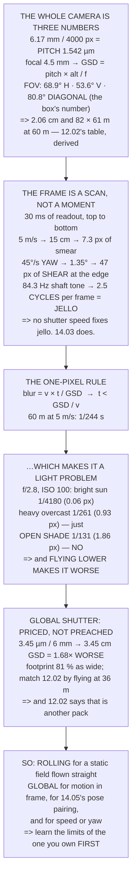

# 14.01 Cameras for UAVs: sensor, lens, shutter, mount

<!-- glance:start -->
<!-- generated by tools/build.py from curriculum/syllabus.yaml — edit the syllabus, not this block -->

| | |
|---|---|
| **Track** | Main path |
| **Difficulty** | Intermediate |
| **Time** | 1 h 15 min |
| **Hardware** | Onboard computer & vision (stage 2) |
| **Software** | none |
| **Prerequisites** | [13.05 Degraded, denied and spoofed: flying when GNSS lies](../13-navigation-gnss/13.05-degraded-denied-and-spoofed.md) |
| **Skip if** | You can compute ground sample distance from altitude, sensor and lens, and say why rolling shutter ruins a fast survey. |

<!-- glance:end -->

## What you will learn

- That the whole camera is **three numbers** — pixel pitch, focal length, and which FOV you are
  quoting — and that every figure in module 12 is a division of them
- That the "1/2.3 inch" in a sensor's name measures **nothing**, and comes from a 1950s vacuum tube
- That a rolling-shutter frame is a **scan, not a moment**: a normal 45°/s turn shears it by
  **47 pixels**, six times the translation smear
- That "jello" is **2.5 cycles of 07.07's 84 Hz shaft tone** recorded down one frame — and that no
  shutter speed fixes it
- The one-pixel blur rule, `exposure < GSD / ground_speed`, giving **1/244 s at 60 m and 5 m/s**
- That **motion blur is a light problem, not a speed problem** — you have four stops in hand at
  noon and none in open shade
- That flying lower to get detail in poor light makes blur **worse**, not better
- What a global shutter actually costs: **1.68× the GSD** and a footprint 81 % as wide

## Why it matters

[12.02](../12-autonomous-flight/12.02-mission-planning.md) planned an entire survey from a camera
model, and every number in it carried an **[E]** because nobody had measured the camera. This is
where that debt gets paid, and where the numbers stop being assumptions.

More usefully, this is where a set of frustrating, hard-to-diagnose failures become predictable.
Footage that ripples. Straight lines that come out bent. Images that stitch on one flight and not
on the next, flown identically, two hours later in the day. All three have arithmetic behind them,
and all three are cheaper to prevent than to fix — because the fix happens on the ground and the
failure happens after you have flown the job.

And there is a decision waiting at the end. Sooner or later someone will tell you that you need a
global-shutter camera. Level 5 prices it, and the answer is "sometimes" — with a specific list of
when.

> [!WARNING]
> A camera on an aircraft is mass on an arm, and [02.11](../02-motors-escs-props/02.11-hermon-powertrain-design.md)'s
> budget has no slack for a payload you did not plan. Weigh it, re-check the hover throttle against
> [11.01](../11-first-flights/11.01-first-flight.md)'s mass scale, and re-fly the hover test before
> you fly a mission with it. A camera added without re-testing has changed your aircraft.

## Prerequisites

<!-- prereqs:start -->
## Prerequisites

You need these first:

- [13.05 Degraded, denied and spoofed: flying when GNSS lies](../13-navigation-gnss/13.05-degraded-denied-and-spoofed.md)

### Optional prerequisite links

None.

Check your readiness: `python course.py why 14.01`
<!-- prereqs:end -->

## Concept

A camera looks like a complicated object and behaves like a very simple one. Light goes through a
lens and lands on a grid of squares. How much ground one square covers is the whole of
photogrammetry, and it is one division: the size of the square, times how far away the ground is,
divided by the focal length.

Everything a specification sheet shouts about — megapixels, sensor "inches", a diagonal field of
view — is downstream of that, and most of it is chosen to sound large. The number you need is the
one nobody prints: the **pixel pitch**, which you get by dividing the sensor's real width by the
real pixel count.

The second idea is stranger and it is the one that catches people. A digital photograph is not
necessarily an instant. Most small sensors read themselves out one row at a time, over tens of
milliseconds, so the bottom of the picture happens measurably later than the top. If anything is
moving during that window — the aircraft, the ground, or the camera itself vibrating — the picture
records the *motion*, not the scene. Straight lines bend. Uniform ground ripples.

And the third idea ties the first two to the weather. The cure for a moving subject is a short
exposure, and a short exposure needs light. On a bright day you have more light than you can use
and none of this matters. In open shade, at exactly the same speed and altitude, your images are
blurred and nothing about the aircraft has changed.

## Technical explanation

### Level 1 — the whole camera is three numbers

Run the code. The Stage 2 camera is a 6.17 × 4.55 mm sensor, 4000 × 3000 pixels, behind a 4.5 mm
lens. Divide and the **pixel pitch is 1.542 µm** — the only number that matters.

Everything follows. The horizontal field of view is 68.9°, the vertical 53.6°, and the **diagonal
80.8°** — which is the number on the box, because it is the biggest. It is also the one you cannot
fly with:
[12.02](../12-autonomous-flight/12.02-mission-planning.md)'s survey spacing came from the
*horizontal* footprint.

The GSD table reproduces 12.02's exactly: 2.06 cm at 60 m, 4.11 cm at 120 m, and an 82 × 61 m
footprint at survey altitude. The point is not the numbers — it is that **once you have the pitch
and the focal length, the survey is arithmetic rather than a preference**.

One warning about the spec sheet. The "1/2.3 inch" in a sensor's name is not a measurement of
anything: it derives from the outside diameter of a 1950s vacuum tube and has no fixed relation to
the imaging area. Measure the pitch from the real width and the real pixel count, or get the focal
length by calibration in [14.02](14.02-field-calibration.md).

### Level 2 — the frame is a scan, not a moment

A rolling-shutter sensor reads one row at a time, so the bottom of the frame is captured about
**30 ms [S]** after the top. Anything that moves during the scan is recorded bent.

At 5 m/s the aircraft travels 15.0 cm during the readout, which at 60 m is **7.3 pixels** of
smear — noticeable but survivable. A 45 °/s yaw rotates the camera **1.35°**, which at the frame
edge is **47.1 pixels** of shear: six times worse, and the reason
[12.02](../12-autonomous-flight/12.02-mission-planning.md)'s survey triggers on the straight lines
and keeps the turns outside the area of interest.

The third row is "jello". The shaft tone at hover is **84.3 Hz** — the frequency
[07.07](../07-control/07.07-filtering-and-methodic-tuning.md) put a notch at — so **2.5 full
cycles** of vibration happen while one frame is being read. The result is a frame with *ripples*
in it, not blur: different rows saw different positions.

**No shutter speed fixes jello.** It is a readout problem, and the fixes are mechanical —
[14.03](14.03-gimbals-and-stabilisation.md)'s damping, and getting the vibration amplitude down
rather than trying to outrun it.

### Level 3 — the one-pixel blur rule

Blur is how far the ground moved across the sensor while the shutter was open, in pixels:

$$\text{blur}_{\text{px}} = \frac{v \cdot t_{\text{exp}}}{\text{GSD}}$$

Keep it under one pixel and the image is as sharp as the lens allows, which rearranges into the
number you actually set:

$$t_{\text{exp}} < \frac{\text{GSD}}{v}$$

At 60 m and 5 m/s that is **1/244 s**. At 20 m and 10 m/s it is 1/1459 s. Anybody could guess the
direction; the interesting question is whether the light lets you have it.

### Level 4 — so blur is a light problem

At f/2.8 and ISO 100, the code works out what each scene allows and what blur results at 60 m and
5 m/s:

| scene | EV | shutter | blur | ok? |
|---|---|---|---|---|
| bright sun, clear sky | 15 | 1/4180 | 0.06 px | yes |
| cloudy bright | 13 | 1/1045 | 0.23 px | yes |
| heavy overcast | 11 | 1/261 | 0.93 px | yes |
| **open shade / sunset** | **10** | **1/131** | **1.86 px** | **NO** |
| deep dusk | 8 | 1/33 | 7.45 px | NO |

In bright sun you have three or four stops in hand. In open shade you do not, and in dusk you are
several times over the one-pixel rule at a speed you were flying quite happily at lunchtime.

The fixes, in the order they cost you something: raise the ISO (free until the noise ruins
[14.04](14.04-detection-in-the-air.md)'s detector); open the aperture (free if you have it, and
depth of field is irrelevant at 60 m); slow down (12.02's flight time rises linearly); **fly
lower — which is the wrong way**, because a smaller GSD needs a *shorter* exposure; or fly on a
different day, which is the honest answer and the cheapest.

That fourth one is the trap. People fly lower to get more detail in poor light, and every metre
lower tightens the exposure they already could not meet.

### Level 5 — what a global shutter costs

A global-shutter sensor exposes every pixel at the same instant. No scan, no shear, no jello, and
a frame that is genuinely a moment — which [14.05](14.05-tracking-and-geolocation.md)'s
geolocation needs, because it pairs one pose with one image.

The code compares a typical 1920 × 1200 global-shutter module at 3.45 µm **[S]** against the
rolling sensor. Its **GSD at 60 m is 3.45 cm against 2.06 — 1.68× worse** — and its footprint is
81 % as wide. To match 12.02's 2.06 cm you would have to fly at **36 m**, and 12.02's table says
that costs another pack.

So the choice is not "global is better". It is: **rolling** for mapping a static field, provided
you fly the lines straight and keep the turns clear; **global** for anything that moves in frame,
for 14.05's geolocation, and for flying fast or yawing. For
[14.04](14.04-detection-in-the-air.md)'s detector, either — but train it on frames from the same
shutter you will fly.

The honest default for this course: the Stage 2 camera is rolling-shutter and every result in
module 12 was computed for it. Learn its limits first, and buy a global shutter when you have a
frame you cannot fix by flying differently.

> [!TIP]
> **Ask your teacher:** "Is our footage rippling, or blurred?" They are different failures with
> different causes and different fixes — ripples are a readout-plus-vibration problem that a
> faster shutter will not touch, and blur is an exposure problem that damping will not touch.
> Getting the diagnosis right saves a week.

## Diagram



## Code

The pixel pitch and both fields of view derived from the sensor, 12.02's GSD and footprint table
reproduced from first principles, the rolling-shutter translation, yaw shear and vibration cycles
per frame, the one-pixel exposure limit across altitudes and speeds, the scene-brightness table
that turns blur into a light budget, and the global-shutter trade priced in GSD and footprint.

```python
"""14.01 - the pixel pitch is the whole camera, and the shutter is the whole problem."""
import math

# 12.02's camera, which was marked [E] there. This lesson MEASURES it.
SENSOR_W, SENSOR_H = 6.17e-3, 4.55e-3
PIX_W, PIX_H = 4000, 3000
FOCAL = 4.5e-3
PITCH = SENSOR_W / PIX_W

# a global-shutter alternative, for the trade in section 4 [S]
GS_PITCH = 3.45e-6
GS_W, GS_H = 1920, 1200
GS_FOCAL = 6.0e-3

# the aircraft
WPNAV_SPEED = 5.0                  # 12.02's survey speed
YAW_RATE = 45.0                    # deg/s, a normal turn
HOVER_RPM = 5060.0                 # 02.08 / hermon-numbers
SHAFT_ORDER = 1           # 07.07: the dominant line is the SHAFT tone, 1x
ROLLING_READOUT_S = 0.030          # full-frame readout, 1/2.3" class [S]

SURVEY_ALT = 60.0                  # 12.02's one-pack altitude

# Scene brightness, EV at ISO 100, and what it looks like [S]
SCENES = [("bright sun on sand or snow", 16),
          ("bright sun, clear sky", 15),
          ("hazy sun", 14),
          ("cloudy bright", 13),
          ("overcast", 12),
          ("heavy overcast", 11),
          ("open shade / sunset", 10),
          ("deep dusk", 8)]


def gsd(alt, pitch=PITCH, f=FOCAL):
    return pitch * alt / f


def fov_deg(size, f=FOCAL):
    return 2 * math.degrees(math.atan(size / (2 * f)))


def footprint(alt, f=FOCAL, w=SENSOR_W, h=SENSOR_H):
    return w * alt / f, h * alt / f


def blur_px(v, t_exp, alt, pitch=PITCH, f=FOCAL):
    return v * t_exp / gsd(alt, pitch, f)


def max_exposure(v, alt, px=1.0, pitch=PITCH, f=FOCAL):
    """The exposure that keeps smear under `px` pixels."""
    return px * gsd(alt, pitch, f) / v


def shutter_for_ev(ev, n=2.8, iso=100):
    """Exposure time at this aperture and ISO for a scene of this EV."""
    return (n * n) / (2 ** ev) * (100.0 / iso)


def bar(t):
    print("\n" + "=" * 70)
    print(t)
    print("=" * 70)


if __name__ == "__main__":
    bar("1. THE WHOLE CAMERA IS THREE NUMBERS")
    print("  Not megapixels. Not the brand. Three numbers, and every")
    print("  other figure in modules 12 and 14 is a division of them:")
    print(f"  {'sensor width':22s} {SENSOR_W * 1000:8.2f} mm")
    print(f"  {'pixels across':22s} {PIX_W:8d}")
    print(f"  {'PIXEL PITCH':22s} {PITCH * 1e6:8.3f} um   <- the only one"
          f" that matters")
    print(f"  {'focal length':22s} {FOCAL * 1000:8.2f} mm")
    print("  EVERYTHING ELSE FOLLOWS:")
    print(f"  {'horizontal FOV':22s} {fov_deg(SENSOR_W):8.1f} deg")
    print(f"  {'vertical FOV':22s} {fov_deg(SENSOR_H):8.1f} deg")
    diag = math.hypot(SENSOR_W, SENSOR_H)
    print(f"  {'DIAGONAL FOV':22s} {fov_deg(diag):8.1f} deg"
          f"   <- the number on the box")
    print("  NOTE WHICH ONE THE MARKETING USES. The diagonal is always")
    print("  the biggest, and it is the one you cannot fly with -- 12.02's")
    print("  survey spacing came from the HORIZONTAL footprint.")
    print(f"\n  {'altitude':>9s} {'GSD':>10s} {'footprint W x H':>18s}")
    for alt in (10, 30, 60, 120):
        fw, fh = footprint(alt)
        print(f"  {alt:7d} m {gsd(alt) * 100:7.2f} cm"
              f" {fw:8.0f} x {fh:3.0f} m")
    print("  THESE ARE 12.02's NUMBERS, and they were marked [E] there")
    print("  because nobody had measured the camera yet. 14.02 measures")
    print("  the focal length and the distortion properly; this lesson's")
    print("  job is to show that ONCE YOU HAVE THE PITCH AND THE FOCAL")
    print("  LENGTH, THE SURVEY IS ARITHMETIC AND NOT A PREFERENCE.")
    print("  AND A WARNING ABOUT THE SPEC SHEET: the '1/2.3 inch' in a")
    print("  sensor's name is not a measurement of anything. It comes")
    print("  from the outside diameter of a 1950s vacuum tube. MEASURE")
    print("  the pitch from the real width and the real pixel count, or")
    print("  calibrate for the focal length in 14.02.")

    bar("2. ROLLING SHUTTER: THE FRAME IS NOT A MOMENT")
    print("  A rolling-shutter sensor reads out one row at a time. The")
    print(f"  bottom of the frame is captured about"
          f" {ROLLING_READOUT_S * 1000:.0f} ms after the top,")
    print("  so a 'photograph' is a SCAN, and anything that moves during")
    print("  the scan is recorded bent.")
    print(f"  {'what moves':26s} {'during readout':>16s} {'at 60 m, in px':>16s}")
    g = gsd(SURVEY_ALT)
    trans = WPNAV_SPEED * ROLLING_READOUT_S
    print(f"  {'the aircraft, at 5 m/s':26s} {trans * 100:13.1f} cm"
          f" {trans / g:13.1f} px")
    yaw_rad = math.radians(YAW_RATE * ROLLING_READOUT_S)
    arc_px = yaw_rad * (PIX_W / 2)
    print(f"  {'a 45 deg/s YAW':26s}"
          f" {YAW_RATE * ROLLING_READOUT_S:12.2f} deg"
          f" {arc_px:13.1f} px   at the frame edge")
    f_prop = HOVER_RPM / 60 * SHAFT_ORDER   # 07.07's 84 Hz hover tone
    cycles = f_prop * ROLLING_READOUT_S
    print(f"  {'07.07 shaft tone (1x)':26s} {f_prop:12.1f} Hz"
          f" {cycles:13.1f} cycles PER FRAME")
    print("  READ THE SECOND ROW. A NORMAL TURN SHEARS THE FRAME BY")
    print(f"  {arc_px:.0f} PIXELS. That is not a subtle artefact -- it is")
    print(f"  {arc_px / (trans / g):.0f} times the translation smear,"
          f" and it is why 12.02's")
    print("  survey triggers on the STRAIGHT LINES and not in the turns.")
    print("  AND THE THIRD ROW IS 'JELLO'. The propellers run at")
    print(f"  {f_prop:.0f} Hz at hover -- 07.07's shaft tone, and where it")
    print(f"  put the notch -- so {cycles:.1f} full")
    print("  cycles of vibration happen while one frame is being read.")
    print("  The result is a frame with ripples in it -- not blur,")
    print("  RIPPLES, because different rows saw different positions.")
    print("  NO SHUTTER SPEED FIXES JELLO. It is a readout problem, and")
    print("  the fixes are MECHANICAL: 14.03's damping, and getting the")
    print("  vibration below the sensor rather than faster than it.")

    bar("3. MOTION BLUR IS ARITHMETIC, AND THE RULE IS ONE PIXEL")
    print("  Blur is how far the ground moved across the sensor while")
    print("  the shutter was open, measured in PIXELS:")
    print("      blur_px = ground_speed x exposure / GSD")
    print("  Keep it under one pixel and the image is as sharp as the")
    print("  lens allows. Which rearranges into the number you actually")
    print("  set on the camera:")
    print("      exposure < GSD / ground_speed")
    print(f"  {'alt':>5s} {'GSD':>8s} {'at 3 m/s':>12s} {'at 5 m/s':>12s}"
          f" {'at 10 m/s':>12s}")
    for alt in (20, 30, 60, 120):
        row = [f"1/{1 / max_exposure(v, alt):.0f} s" for v in (3.0, 5.0, 10.0)]
        print(f"  {alt:4d}m {gsd(alt) * 100:6.2f}cm"
              f" {row[0]:>12s} {row[1]:>12s} {row[2]:>12s}")
    print("  AT 60 m AND 5 m/s YOU NEED 1/244 s OR FASTER. Anybody would")
    print("  guess that. THE INTERESTING QUESTION IS WHETHER THE LIGHT")
    print("  LETS YOU HAVE IT.")

    bar("4. SO MOTION BLUR IS A LIGHT PROBLEM, NOT A SPEED PROBLEM")
    need = max_exposure(WPNAV_SPEED, SURVEY_ALT)
    print(f"  The survey needs 1/{1 / need:.0f} s at 60 m and 5 m/s."
          f" At f/2.8 and")
    print("  ISO 100, what does each scene actually allow?")
    print(f"  {'scene':30s} {'EV':>4s} {'shutter at f/2.8':>18s}"
          f" {'blur':>8s} {'ok?':>6s}")
    for nm, ev in SCENES:
        t = shutter_for_ev(ev)
        b = blur_px(WPNAV_SPEED, t, SURVEY_ALT)
        print(f"  {nm:30s} {ev:4d} {'1/' + f'{1 / t:.0f}':>18s}"
              f" {b:6.2f} px {('yes' if b <= 1.0 else 'NO'):>6s}")
    print("  IN BRIGHT SUN YOU HAVE THREE OR FOUR STOPS IN HAND. In open")
    print("  shade you do not, and in dusk you are four times over the")
    print("  one-pixel rule at a speed you were flying quite happily at")
    print("  lunchtime.")
    print("  THE FIXES, IN THE ORDER THEY COST YOU SOMETHING:")
    for a, b in (("raise the ISO", "free until the noise ruins 14.04's "
                  "detector"),
                 ("open the aperture", "free if you have it; costs depth "
                  "of field, which at 60 m you do not care about"),
                 ("SLOW DOWN", "12.02's flight time goes up, linearly"),
                 ("fly LOWER", "WRONG WAY -- a smaller GSD needs a "
                  "SHORTER exposure. It makes blur worse"),
                 ("fly on a different day", "the honest answer, and the "
                  "cheapest")):
        print(f"    {a:22s} {b}")
    print("  THE FOURTH ONE IS THE TRAP. People fly lower to get more")
    print("  detail in poor light, and every metre lower tightens the")
    print("  exposure they already could not meet.")

    bar("5. GLOBAL SHUTTER: WHAT IT FIXES AND WHAT IT COSTS")
    print("  A global-shutter sensor exposes every pixel at the same")
    print("  instant. No scan, so no shear, no jello, and a frame that")
    print("  is genuinely a moment -- which 14.05's geolocation needs,")
    print("  because it pairs ONE pose with ONE image.")
    print(f"  {'':22s} {'rolling (12.02)':>18s} {'global [S]':>14s}")
    rows = [("pixels", f"{PIX_W} x {PIX_H}", f"{GS_W} x {GS_H}"),
            ("pixel pitch", f"{PITCH * 1e6:.2f} um",
             f"{GS_PITCH * 1e6:.2f} um"),
            ("focal length", f"{FOCAL * 1000:.1f} mm",
             f"{GS_FOCAL * 1000:.1f} mm")]
    for a, b, c in rows:
        print(f"  {a:22s} {b:>18s} {c:>14s}")
    gg = gsd(SURVEY_ALT, GS_PITCH, GS_FOCAL)
    fw_r, _ = footprint(SURVEY_ALT)
    fw_g = GS_W * gg
    print(f"  {'GSD at 60 m':22s} {gsd(SURVEY_ALT) * 100:15.2f} cm"
          f" {gg * 100:11.2f} cm")
    print(f"  {'footprint width':22s} {fw_r:15.0f} m {fw_g:11.0f} m")
    print(f"  THE GLOBAL SHUTTER'S GSD IS"
          f" {gg / gsd(SURVEY_ALT):.2f}x WORSE AND ITS FOOTPRINT")
    print(f"  IS {fw_g / fw_r * 100:.0f} % OF THE ROLLING SENSOR'S. To"
          f" match 12.02's 2.06 cm")
    print(f"  you would have to fly at"
          f" {SURVEY_ALT * gsd(SURVEY_ALT) / gg:.0f} m instead of 60 --")
    print("  and 12.02's table says that costs you another pack.")
    print("\n  SO THE CHOICE IS NOT 'GLOBAL IS BETTER'. IT IS:")
    for a, b in (("mapping a static field", "ROLLING is fine. Fly the "
                  "lines straight, trigger by distance, keep the turns "
                  "clear of the survey area (12.02)"),
                 ("anything that MOVES in frame",
                  "GLOBAL. A vehicle, a person, a rotor"),
                 ("14.05's geolocation",
                  "GLOBAL, or accept that the pose and the image are "
                  "15 ms apart in the middle of the frame"),
                 ("flying fast, or yawing",
                  "GLOBAL. Section 2's 47 px of shear"),
                 ("14.04's detector",
                  "either -- but train it on frames from the SAME "
                  "shutter you will fly")):
        print(f"    {a:30s} {b}")
    print("  AND THE HONEST DEFAULT FOR THIS COURSE: the Stage 2 camera")
    print("  you already own is rolling-shutter, and every result in")
    print("  module 12 was computed for it. Learn its limits first. Buy")
    print("  a global shutter when you have a frame you cannot fix by")
    print("  flying differently -- and not before.")
```

Output:

```text

======================================================================
1. THE WHOLE CAMERA IS THREE NUMBERS
======================================================================
  Not megapixels. Not the brand. Three numbers, and every
  other figure in modules 12 and 14 is a division of them:
  sensor width               6.17 mm
  pixels across              4000
  PIXEL PITCH               1.542 um   <- the only one that matters
  focal length               4.50 mm
  EVERYTHING ELSE FOLLOWS:
  horizontal FOV             68.9 deg
  vertical FOV               53.6 deg
  DIAGONAL FOV               80.8 deg   <- the number on the box
  NOTE WHICH ONE THE MARKETING USES. The diagonal is always
  the biggest, and it is the one you cannot fly with -- 12.02's
  survey spacing came from the HORIZONTAL footprint.

   altitude        GSD    footprint W x H
       10 m    0.34 cm       14 x  10 m
       30 m    1.03 cm       41 x  30 m
       60 m    2.06 cm       82 x  61 m
      120 m    4.11 cm      165 x 121 m
  THESE ARE 12.02's NUMBERS, and they were marked [E] there
  because nobody had measured the camera yet. 14.02 measures
  the focal length and the distortion properly; this lesson's
  job is to show that ONCE YOU HAVE THE PITCH AND THE FOCAL
  LENGTH, THE SURVEY IS ARITHMETIC AND NOT A PREFERENCE.
  AND A WARNING ABOUT THE SPEC SHEET: the '1/2.3 inch' in a
  sensor's name is not a measurement of anything. It comes
  from the outside diameter of a 1950s vacuum tube. MEASURE
  the pitch from the real width and the real pixel count, or
  calibrate for the focal length in 14.02.

======================================================================
2. ROLLING SHUTTER: THE FRAME IS NOT A MOMENT
======================================================================
  A rolling-shutter sensor reads out one row at a time. The
  bottom of the frame is captured about 30 ms after the top,
  so a 'photograph' is a SCAN, and anything that moves during
  the scan is recorded bent.
  what moves                   during readout   at 60 m, in px
  the aircraft, at 5 m/s              15.0 cm           7.3 px
  a 45 deg/s YAW                     1.35 deg          47.1 px   at the frame edge
  07.07 shaft tone (1x)              84.3 Hz           2.5 cycles PER FRAME
  READ THE SECOND ROW. A NORMAL TURN SHEARS THE FRAME BY
  47 PIXELS. That is not a subtle artefact -- it is
  6 times the translation smear, and it is why 12.02's
  survey triggers on the STRAIGHT LINES and not in the turns.
  AND THE THIRD ROW IS 'JELLO'. The propellers run at
  84 Hz at hover -- 07.07's shaft tone, and where it
  put the notch -- so 2.5 full
  cycles of vibration happen while one frame is being read.
  The result is a frame with ripples in it -- not blur,
  RIPPLES, because different rows saw different positions.
  NO SHUTTER SPEED FIXES JELLO. It is a readout problem, and
  the fixes are MECHANICAL: 14.03's damping, and getting the
  vibration below the sensor rather than faster than it.

======================================================================
3. MOTION BLUR IS ARITHMETIC, AND THE RULE IS ONE PIXEL
======================================================================
  Blur is how far the ground moved across the sensor while
  the shutter was open, measured in PIXELS:
      blur_px = ground_speed x exposure / GSD
  Keep it under one pixel and the image is as sharp as the
  lens allows. Which rearranges into the number you actually
  set on the camera:
      exposure < GSD / ground_speed
    alt      GSD     at 3 m/s     at 5 m/s    at 10 m/s
    20m   0.69cm      1/438 s      1/729 s     1/1459 s
    30m   1.03cm      1/292 s      1/486 s      1/972 s
    60m   2.06cm      1/146 s      1/243 s      1/486 s
   120m   4.11cm       1/73 s      1/122 s      1/243 s
  AT 60 m AND 5 m/s YOU NEED 1/244 s OR FASTER. Anybody would
  guess that. THE INTERESTING QUESTION IS WHETHER THE LIGHT
  LETS YOU HAVE IT.

======================================================================
4. SO MOTION BLUR IS A LIGHT PROBLEM, NOT A SPEED PROBLEM
======================================================================
  The survey needs 1/243 s at 60 m and 5 m/s. At f/2.8 and
  ISO 100, what does each scene actually allow?
  scene                            EV   shutter at f/2.8     blur    ok?
  bright sun on sand or snow       16             1/8359   0.03 px    yes
  bright sun, clear sky            15             1/4180   0.06 px    yes
  hazy sun                         14             1/2090   0.12 px    yes
  cloudy bright                    13             1/1045   0.23 px    yes
  overcast                         12              1/522   0.47 px    yes
  heavy overcast                   11              1/261   0.93 px    yes
  open shade / sunset              10              1/131   1.86 px     NO
  deep dusk                         8               1/33   7.45 px     NO
  IN BRIGHT SUN YOU HAVE THREE OR FOUR STOPS IN HAND. In open
  shade you do not, and in dusk you are four times over the
  one-pixel rule at a speed you were flying quite happily at
  lunchtime.
  THE FIXES, IN THE ORDER THEY COST YOU SOMETHING:
    raise the ISO          free until the noise ruins 14.04's detector
    open the aperture      free if you have it; costs depth of field, which at 60 m you do not care about
    SLOW DOWN              12.02's flight time goes up, linearly
    fly LOWER              WRONG WAY -- a smaller GSD needs a SHORTER exposure. It makes blur worse
    fly on a different day the honest answer, and the cheapest
  THE FOURTH ONE IS THE TRAP. People fly lower to get more
  detail in poor light, and every metre lower tightens the
  exposure they already could not meet.

======================================================================
5. GLOBAL SHUTTER: WHAT IT FIXES AND WHAT IT COSTS
======================================================================
  A global-shutter sensor exposes every pixel at the same
  instant. No scan, so no shear, no jello, and a frame that
  is genuinely a moment -- which 14.05's geolocation needs,
  because it pairs ONE pose with ONE image.
                            rolling (12.02)     global [S]
  pixels                        4000 x 3000    1920 x 1200
  pixel pitch                       1.54 um        3.45 um
  focal length                       4.5 mm         6.0 mm
  GSD at 60 m                       2.06 cm        3.45 cm
  footprint width                     82 m          66 m
  THE GLOBAL SHUTTER'S GSD IS 1.68x WORSE AND ITS FOOTPRINT
  IS 81 % OF THE ROLLING SENSOR'S. To match 12.02's 2.06 cm
  you would have to fly at 36 m instead of 60 --
  and 12.02's table says that costs you another pack.

  SO THE CHOICE IS NOT 'GLOBAL IS BETTER'. IT IS:
    mapping a static field         ROLLING is fine. Fly the lines straight, trigger by distance, keep the turns clear of the survey area (12.02)
    anything that MOVES in frame   GLOBAL. A vehicle, a person, a rotor
    14.05's geolocation            GLOBAL, or accept that the pose and the image are 15 ms apart in the middle of the frame
    flying fast, or yawing         GLOBAL. Section 2's 47 px of shear
    14.04's detector               either -- but train it on frames from the SAME shutter you will fly
  AND THE HONEST DEFAULT FOR THIS COURSE: the Stage 2 camera
  you already own is rolling-shutter, and every result in
  module 12 was computed for it. Learn its limits first. Buy
  a global shutter when you have a frame you cannot fix by
  flying differently -- and not before.
```

## Exercise

### Exercise 14.01-E1 — Measure your own pitch and prove it `[build]`

Find your sensor's real imaging width (not its "inch" name) and pixel count, compute the pitch,
and predict the GSD at a known altitude. Then photograph a tape measure from that altitude and
count pixels. Report the ratio of predicted to measured.

### Exercise 14.01-E2 — Measure your readout time `[build]`

Photograph something with a fast, known motion — a spinning propeller at a known rpm with the
aircraft disarmed and restrained, or a phone screen showing a moving bar — and use the distortion
to estimate the readout time. Compare against the 30 ms the code assumes.

### Exercise 14.01-E3 — Find your own light limit `[analysis]`

For your aperture, ISO ceiling and survey speed, compute the scene EV at which you cross one pixel
of blur. Then look up the EV at your site an hour before sunset and decide whether that is a
flight you should plan.

### Exercise 14.01-E4 — Shear the frame on purpose `[build]`

Fly a straight line and photograph a scene with strong straight edges — a fence, a road marking.
Then do it again while yawing at about 45 °/s. Compare the edges. You are looking for the 47 pixels
Level 2 predicted.

> [!CAUTION]
> E2 involves a spinning propeller. Do it with the aircraft restrained, the props on, and a single
> motor spun by the motor-test function — never by arming. Stand behind the plane of rotation and
> keep the camera on a stand, not in your hand. If you would not put your hand where the camera is,
> do not put the camera there either.

## Expected result

**14.01-E1**: predicted and measured should agree within a few per cent. If you are off by a
factor of around five, you used a 35 mm-equivalent focal length with the real sensor size — the
error [12.02](../12-autonomous-flight/12.02-mission-planning.md) warned about.

**14.01-E2**: expect somewhere between 10 ms and 40 ms for a small rolling-shutter module. A
faster figure is good news and a slower one is worth knowing before you plan a survey. Whatever it
is, put it in the Level 2 arithmetic and recompute your own shear.

**14.01-E3**: at f/2.8 and ISO 100 the crossover is around EV 11, which is heavy overcast. Raising
the ISO ceiling to 400 buys two stops and moves it to about EV 9 — at the price of noise, which
14.04 will care about more than you do.

**14.01-E4**: the yawing frame's straight edges should be visibly curved or slanted, and the
straight-line frame's should not. If you cannot see it, either your readout is faster than assumed
(check E2) or your yaw rate was lower than you thought.

## Troubleshooting

**Images look soft everywhere, evenly.** Focus, or a dirty lens, before anything in this lesson. A
fixed-focus module still has a focus, and it can be knocked.

**Footage ripples, especially near the props.** Jello. Level 2. Damping, not shutter speed —
[14.03](14.03-gimbals-and-stabilisation.md).

**Straight lines come out bent, only in turns.** Rolling-shutter shear. Fly the survey lines
straight and put the turns outside the area.

**Sharp in the morning, blurred in the afternoon.** Level 4. The scene got darker and the exposure
lengthened to compensate. Check the EXIF shutter speed against Level 3's limit.

**Sharp at 60 m, blurred at 30 m.** Also Level 4, and counterintuitive: the smaller GSD demands a
shorter exposure and the camera did not have one to give.

**The stitch fails at the ends of lines.** [12.01](../12-autonomous-flight/12.01-waypoints.md)'s
acceptance radius plus this lesson's shear. The aircraft was turning when the last frames were
taken.

**The GSD does not match the ground station's.** One of you is using a diagonal FOV or an
equivalent focal length. Level 1.

## Common mistakes

- **Quoting the diagonal FOV and planning with it.** Survey spacing uses the horizontal footprint.
- **Believing the sensor's "inch" size.** It measures nothing.
- **Using a 35 mm-equivalent focal length with a real sensor size.** Wrong by about five times.
- **Trying to fix jello with a faster shutter.** It is a readout problem, not an exposure problem.
- **Photographing during the turns.** Forty-seven pixels of shear.
- **Flying lower to fix blur.** It makes blur worse.
- **Planning a late-afternoon survey at the same speed as a midday one.** The light changed; the
  arithmetic did not.
- **Buying a global shutter before knowing which failure you have.** It costs 1.68× the GSD.

## Knowledge check

<details>
<summary>Which single number determines the GSD, and how do you get it?</summary>

The pixel pitch — the sensor's real imaging width divided by its real pixel count, 1.542 µm for
the Stage 2 camera. GSD is then pitch × altitude / focal length. Neither megapixels nor the
sensor's "inch" name tells you the pitch.
</details>

<details>
<summary>Why is the diagonal field of view the wrong number to plan a survey with?</summary>

Because survey line spacing comes from the *horizontal* footprint. The diagonal is always the
largest of the three — 80.8° against 68.9° horizontal here — which is why the box quotes it, and
planning with it gives you spacing that does not overlap.
</details>

<details>
<summary>Your aircraft yaws at 45 °/s during a 30 ms readout. How bent is the frame?</summary>

The camera rotates 1.35°, which at the frame edge (2,000 px from centre) is about 47 pixels of
shear — roughly six times the 7.3 px of smear from flying forward at 5 m/s. This is why survey
photographs are taken on the straight legs.
</details>

<details>
<summary>What causes jello, and why does a faster shutter not fix it?</summary>

The 84.3 Hz shaft tone completing about 2.5 cycles during the 30 ms readout, so different rows of
one frame record the camera at different points in its vibration. It is a readout artefact, not an
exposure artefact — each row may be perfectly sharp and still in the wrong place. The fix is
mechanical damping.
</details>

<details>
<summary>State the one-pixel blur rule and evaluate it at 60 m and 5 m/s.</summary>

`exposure < GSD / ground_speed`. At 60 m the GSD is 2.06 cm, so the exposure must be shorter than
2.06 cm ÷ 5 m/s = 4.1 ms, which is 1/244 s.
</details>

<details>
<summary>Why is motion blur a light problem rather than a speed problem?</summary>

Because the required exposure is fixed by speed and GSD, but whether you can *have* it is fixed by
the scene. At f/2.8 and ISO 100, bright sun gives you 1/4180 s — four stops in hand — while open
shade gives 1/131 s and 1.86 px of blur at the same speed and altitude. Nothing about the aircraft
changed.
</details>

<details>
<summary>Why does flying lower make blur worse?</summary>

Because a lower altitude gives a smaller GSD, and the exposure limit is GSD divided by speed. Half
the altitude halves the GSD and therefore halves the allowable exposure — so the move people make
to get more detail in poor light is exactly the wrong one.
</details>

<details>
<summary>What does a global shutter cost in this specific comparison, and when is it worth it?</summary>

1.68× the GSD (3.45 cm against 2.06 at 60 m) and a footprint 81 % as wide — matching 12.02's
resolution would mean flying at 36 m and spending another pack. It is worth it when something
moves in frame, when 14.05 needs one pose paired with one image, and when you fly fast or yaw.
For a static field flown in straight lines, rolling is fine.
</details>

## Practical challenge

Produce a camera card for Hermon's camera — the document every later lesson in this module will
refer to.

1. Measure the pixel pitch and verify it against a known target (E1).
2. Measure the readout time (E2) and record it with a method, not just a number.
3. Compute the GSD and footprint at every altitude you actually fly, and check them against
   12.02's table.
4. Compute the one-pixel exposure limit at each of those altitudes for your survey speed.
5. Find the scene EV at which you cross that limit at your ISO ceiling and aperture (E3).
6. Photograph the same scene while straight and while yawing, measure the shear in pixels, and
   compare against Level 2 (E4).
7. Weigh the camera and mount, and re-run the hover test against
   [11.01](../11-first-flights/11.01-first-flight.md)'s mass scale.
8. Write the card: pitch, focal length, both FOVs, readout time, GSD by altitude, exposure limit
   by altitude, and the light level below which you do not fly.

The last line is the one that will save you a job. "We do not survey below EV 11 at 5 m/s" is a
sentence you can say to a client in the morning, and it is far easier than explaining a blurred
dataset in the evening.

## You can skip this if

You can compute ground sample distance from altitude, sensor and lens, and say why rolling shutter
ruins a fast survey. "Compute" means from the pitch you measured, not from a spec sheet.

## Go deeper

- The classic reference on rolling-shutter geometry and its correction, useful because it frames
  the distortion as a model rather than an artefact:
  <https://docs.opencv.org/4.x/dc/dbb/tutorial_py_calibration.html>
- Sensor manufacturers' datasheets are the only reliable source for readout time and real imaging
  area — for the common Sony modules, start from the IMX part number on your board, not the camera
  brand: <https://www.sony-semicon.com/en/products/is/industry/index.html>
- ArduPilot's camera and trigger documentation, including how the trigger is logged so that
  14.05 can pair an image with a pose: <https://ardupilot.org/copter/docs/common-camera-shutter-with-servo.html>

## Progress checkpoint

You can now derive every geometric number about your camera from its pitch and focal length,
predict how much a turn will shear a frame, tell jello from blur and name the fix for each,
compute the exposure the one-pixel rule allows, and say at what light level your survey speed stops
working.

Next, [14.02](14.02-field-calibration.md) measures what this lesson assumed: the real focal length,
the principal point, the distortion, and where the camera sits relative to the aircraft.
