# 14.03 Gimbals, vibration and motion blur

<!-- glance:start -->
<!-- generated by tools/build.py from curriculum/syllabus.yaml — edit the syllabus, not this block -->

| | |
|---|---|
| **Track** | Main path |
| **Difficulty** | Intermediate |
| **Time** | 1 h 15 min |
| **Hardware** | Onboard computer & vision (stage 2) |
| **Software** | ardupilot |
| **Prerequisites** | [14.02 Camera calibration in the field](14.02-field-calibration.md)<br>[04.04 Mounting, vibration isolation and the payload bay](../04-frame-and-assembly/04.04-mounting-and-vibration.md) |
| **Skip if** | You can mount and control a gimbal on Hermon and show that jello and motion blur are gone from the footage. |

<!-- glance:end -->

## What you will learn

- That a nadir survey without a gimbal **is not nadir**: 4.9° of cruise lean walks the frame
  centre **5.1 m** at 60 m, and 12.02's line spacing is only 24.7
- Why two axes is the honest default for a mapping aircraft, and exactly when you need the third
- That **an isolator is a resonator, not a filter** — every mount has a ~10× peak somewhere, and
  the design job is choosing *where*
- That the real lever is **damping, not softness**: a gel mount takes the peak from 17× to 2.7×
  and costs only 3 dB at the shaft tone
- That a gimbal removes the **angular** blur and does nothing for the translation blur — 14.01's
  rule still binds
- That a gimbal does not fix jello either, and why people conclude their gimbal is faulty
- Which `MNT1_*` mode quietly ruins a survey, and the one-line preflight check that catches it
- That a 200 g gimbal costs **4.4 minutes — 19 %** of Hermon's endurance

## Why it matters

[14.01](14.01-cameras-for-uavs.md) found two image defects with two different causes and
[14.02](14.02-field-calibration.md) found a third — a mount angle worth a metre on the ground.
This lesson is where all three get fixed, or deliberately not fixed, and the deciding factor is
usually mass rather than optics.

That is the part worth sitting with. A gimbal is not free. [11.04](../11-first-flights/11.04-flying-in-wind.md)
priced mass at 0.223 W/g, so 200 g of gimbal costs 4.4 minutes out of 23.6 — and
[12.02](../12-autonomous-flight/12.02-mission-planning.md)'s 60 m survey already used 52 % of the
pack. Take a fifth off the endurance and the same job needs a second battery and a second landing.

The other reason is diagnostic. "Buy a gimbal" is the standard answer to bad footage and it is
often the wrong one: a gimbal fixes angular motion, damping fixes vibration, and neither fixes
translation blur. Knowing which failure you have saves both the money and the endurance.

> [!WARNING]
> A gimbal changes the mass, the centre of gravity and
> [14.02](14.02-field-calibration.md)'s camera-to-body transform all at once, and it adds a moving
> assembly near the props. Re-balance, re-run [11.01](../11-first-flights/11.01-first-flight.md)'s
> hover test, re-check the mount angle, and check the gimbal's travel cannot reach a propeller arc
> at any commanded angle — including the retract and neutral positions it takes on power-up before
> anything has been commanded.

## Prerequisites

<!-- prereqs:start -->
## Prerequisites

You need these first:

- [14.02 Camera calibration in the field](14.02-field-calibration.md)
- [04.04 Mounting, vibration isolation and the payload bay](../04-frame-and-assembly/04.04-mounting-and-vibration.md)

### Optional prerequisite links

None.

Check your readiness: `python course.py why 14.03`
<!-- prereqs:end -->

## Concept

Hold a camera and walk across a room. Your arm and your eye do two completely different jobs
without you noticing. Your arm absorbs the jolts of each footfall — high-frequency, small
amplitude. Your eye and neck hold the direction steady while your body sways — low-frequency,
large amplitude. Neither compensates for the fact that you are moving across the room, and nothing
can, because the whole of you moved.

A gimbal is the neck. Damping is the arm. And 14.01's translation blur is the room, which stays
uncorrected no matter what you bolt on.

Keeping those three separate is most of the skill here, because they fail in ways that look
similar on a screen and have entirely different fixes. A tilted, drifting frame is a pointing
problem. Ripples across one image are a vibration problem. Uniform smear in the direction of
travel is an exposure problem. Buying a gimbal helps with exactly one of them.

The second idea is that damping is not what most people think. An isolator is a mass on a spring,
and a mass on a spring has a resonance. Below that resonance it passes motion straight through;
above it, it cuts; *at* it, it amplifies — typically tenfold. So you never remove vibration, you
move a peak around and choose which band you can afford to have amplified. Which turns out to make
the material matter more than the stiffness.

## Technical explanation

### Level 1 — a nadir survey without a gimbal is not nadir

[01.04](../01-flight-physics/01.04-tilt-to-translate.md) established that a multirotor leans to
translate. A camera bolted to the airframe leans with it, so the frame centre walks across the
ground every time the controller corrects.

Run the code. At 60 m: 1° of station-keeping is 1.0 m; [11.02](../11-first-flights/11.02-manual-modes.md)'s
10 m/s cruise lean of 4.9° is **5.1 m**; [11.04](../11-first-flights/11.04-flying-in-wind.md)'s
9.6 m/s wind at 8° is 8.4 m; `ANGLE_MAX` is 34.6 m.

12.02's line spacing was 24.7 m, so the aircraft's own attitude is worth a fifth of the spacing —
and it *changes*, frame to frame, as the controller works.

That is survivable for photogrammetry, because the software solves for each camera's pose anyway.
It is not survivable for anything that needs one frame to mean one place:
[14.05](14.05-tracking-and-geolocation.md)'s geolocation, a fixed-target orbit, or video a human
has to watch.

And yaw is different in kind. [12.02](../12-autonomous-flight/12.02-mission-planning.md)'s crab
angle at 2 m/s of crosswind is 24°, so the imagery is *rotated* by that much relative to the flight
line on every frame. A two-axis gimbal does not touch it, a three-axis one does, photogrammetry
does not care, and a human watching video cares enormously.

### Level 2 — which axes you actually need

**Roll** is the biggest visual offender — a tilted horizon — and is always worth stabilising:
cheap, small travel. **Pitch** sets where the camera looks, and is the one you also *command*
rather than merely stabilise. **Yaw** is expensive, heavy, and often unnecessary.

The honest default for a mapping aircraft is two axes. Roll and pitch remove the lean, pitch aims
the camera, and the aircraft's own yaw controller points the nose down the survey line — which is
12.02's plan anyway. **Buy the third axis when you need to hold a target while the airframe does
something else**, and not before.

### Level 3 — an isolator is a resonator, not a filter

A mass on rubber transmits base motion by

$$T(f) = \frac{\sqrt{1 + (2\zeta r)^2}}{\sqrt{(1-r^2)^2 + (2\zeta r)^2}}, \qquad r = f/f_n$$

Above $f_n$ it cuts, below it passes, and **at $f_n$ it amplifies by about $1/(2\zeta)$** — whatever
$f_n$ is.

The code's first table sweeps $f_n$ and the "jello cut" column says softer is better: 34.6 dB at
10 Hz, 16.4 dB at 30 Hz, and an *amplifier* at 84 Hz. That column is lying by omission, because it
does not show where the peak went. **Every row has a tenfold peak somewhere; the rows just move
it** — into the gust response at 10 Hz, into
[07.02](../07-control/07.02-cascaded-loops.md)'s rate loop at 20 Hz, into
[04.04](../04-frame-and-assembly/04.04-mounting-and-vibration.md)'s arm modes at 40 Hz, and onto the
shaft tone itself at 84.

So the mount is not a filter you tune for attenuation. It is a peak you have to put somewhere, and
the only quiet gap on this aircraft is between the control loops and the structural modes —
roughly **25 to 45 Hz**.

Then the real lever, which is not stiffness at all. Holding $f_n$ at 30 Hz and sweeping the damping
ratio: a hard rubber grommet ($\zeta \approx 0.03$) peaks at **16.7×**; a silicone gel or wire-rope
mount ($\zeta \approx 0.20$) peaks at **2.7×** — and costs only 13.3 dB at the shaft tone against
16.7.

There is the whole subject in one table. You cannot remove the peak and keep the steep rolloff; a
damper transmits force at speed, which is how it damps. For a camera the trade is easy and most
people get it backwards: a tenfold peak at 30 Hz puts a visible wobble in every frame, while 3 dB
of shaft-tone rejection is something you also fixed by balancing the props. **Buy damping, not
softness.**

The field test: at 30 Hz and 200 g the static sag is **0.28 mm**. Press the camera down gently and
watch it settle — a fraction of a millimetre, returning *once*. If it bounces, $\zeta$ is too low
whatever the datasheet says. If it sags visibly, $f_n$ has fallen into the control band.

And the tone moves. [07.07](../07-control/07.07-filtering-and-methodic-tuning.md) put the shaft
tone at 84 Hz hovering and 164 Hz at full throttle, so the same mount gives 13 dB in the hover and
22 dB in the climb — which is why jello appears in one phase of flight and not another, and why
"it was fine last time" is a real observation rather than carelessness.

### Level 4 — what a gimbal does not fix

A gimbal removes *angular* motion. At 60 m, 5 m/s and 14.01's 1/243 s limit, the angular blur goes
from about 0.42 px hard-mounted in still air, and 3.1 px in gusts, to essentially nothing with a
gimbal. **The translation term — 1.00 px — is untouched**, because the whole aircraft moved and no
amount of pointing fixes that.

So 14.01's rule still binds: `exposure < GSD / ground speed`. **A gimbal buys you the gusts, not
the speed.**

And it does not fix jello either — Level 3 does. People buy a gimbal to cure rippling footage,
find it unchanged, and conclude the gimbal is faulty. It is not: the gimbal's own loop runs at a
few hundred hertz and the ripple is an 84 Hz motion recorded *inside* a 30 ms readout. Damp it.

### Level 5 — the mode that quietly ruins a survey

ArduPilot's mount modes are RETRACT (stowed), NEUTRAL (a fixed angle — **this is the survey
mode**), MAVLINK_TARGETING (what [12.06](../12-autonomous-flight/12.06-missions-from-python.md) and
14.05 drive), RC_TARGETING (the pilot's stick), GPS_POINT (hold a lat/lon), and SYSID_TARGET
(point at another vehicle).

`MNT1_DEFLT_MODE` is the one to check before every survey. If it comes up in RC_TARGETING, the
camera is wherever the stick happens to be — on an untouched transmitter that is wherever it was
left, and on a spring-centred channel it is the middle of the travel. Either way it is not nadir,
and you will not notice until you look at the images.

Set it to NEUTRAL, set the neutral angle to −90, and check it on the ground station before arming.
That is one line in 12.02's brief and it has saved more flights than any parameter in this module.

### Level 6 — and whether Hermon should carry one at all

11.04's exchange rate prices it exactly: 60 g costs 1.3 minutes, 200 g costs **4.4 minutes — 19 %
of a 23.6-minute flight** — and 350 g costs 7.7.

So the decision is not "is a gimbal better":

- **Nadir photogrammetry, straight lines:** *no.* The software solves each pose anyway and Level
  1's lean is within what it handles. Spend the mass on battery.
- **14.05 geolocation from single frames:** *yes, two-axis.* One frame has to mean one place.
- **Video a human will watch:** *yes*, and the roll axis is most of the value.
- **Holding a target while circling:** *yes, three-axis.* The only case that needs yaw.
- **Oblique or facade inspection:** *yes* — you need to *command* pitch, not just stabilise it.

> [!TIP]
> **Ask your teacher:** "Is our footage rippling, drifting, or smeared?" Three words, three
> different causes, three different fixes — damping, a gimbal, and a shorter exposure. Most people
> buy the middle one for the first problem.

## Diagram

```mermaid
flowchart TB
    L["WITHOUT A GIMBAL, NADIR IS NOT NADIR<br/>01.04: the aircraft LEANS to translate<br/>at 60 m — 1°: 1.0 m · 4.9° cruise: 5.1 m · 8° wind: 8.4 m<br/>12.02's line spacing is 24.7 m<br/>=> fine for photogrammetry, fatal for 14.05"]
    A["WHICH AXES<br/>ROLL: always. PITCH: stabilise AND command.<br/>YAW: only to hold a target while the airframe moves<br/>=> two axes is the honest default for mapping"]

    I["AN ISOLATOR IS A RESONATOR<br/>T(f) peaks by ~1/(2ζ) AT f_n, cuts above, passes below<br/>f_n = 10 Hz: 34.6 dB of jello cut — and a 10× peak in the gusts<br/>f_n = 20 Hz: peak lands in 07.02's RATE LOOP<br/>=> you do not remove a peak, you CHOOSE WHERE IT GOES (25–45 Hz)"]
    Z["AND THE LEVER IS DAMPING, NOT SOFTNESS<br/>at 30 Hz: hard grommet ζ=0.03 → 16.7× peak, 16.7 dB<br/>silicone gel ζ=0.20 → 2.7× peak, 13.3 dB<br/>=> 3 dB of jello for a SIXTH of the wobble. Buy damping."]

    G["WHAT A GIMBAL DOES NOT FIX<br/>angular blur: 3.1 px gusting → ~0 with a gimbal<br/>TRANSLATION blur: 1.00 px, UNCHANGED<br/>jello: UNCHANGED — its loop is too slow for an 84 Hz ripple<br/>=> 14.01's exposure < GSD / speed still binds"]

    M["MNT1_DEFLT_MODE = NEUTRAL, ANGLE −90<br/>RC_TARGETING on a survey points wherever the stick was left<br/>=> one line in 12.02's brief"]
    C["AND THE MASS: 11.04's 0.223 W/g<br/>200 g of gimbal = 4.4 min = 19 % OF THE FLIGHT<br/>and 12.02's survey already used 52 % of the pack<br/>=> mapping: NO. geolocation, video, tracking: YES."]

    L --> A --> I --> Z --> G --> M --> C
```



## Code

The frame-centre walk from airframe lean at survey altitude, the axis-by-axis case for two versus
three, a natural-frequency sweep showing where each choice puts its 10× peak, a damping-ratio
sweep showing what a gel mount actually buys, the angular-versus-translation blur comparison at
14.01's exposure limit, ArduPilot's mount modes, and the endurance cost of carrying the thing.

```python
"""14.03 - what a gimbal removes, what damping removes, and what neither does."""
import math

G = 9.81
# 14.01 / 14.02's camera
PITCH = 6.17e-3 / 4000
FOCAL_M = 4.5e-3
FX = FOCAL_M / PITCH               # px
PIX_W = 4000
SURVEY_ALT = 60.0
GSD = PITCH * SURVEY_ALT / FOCAL_M

# the aircraft
SHAFT_HZ = 84.3                    # 07.07's hover tone
ANGLE_MAX = 30.0
CRUISE_LEAN = 4.9                  # 11.02: 10 m/s of cruise
WIND_LEAN_8 = 8.0                  # 11.04: 8 deg of lean = 9.6 m/s of wind
CRAB_24 = 24.0                     # 12.02: 2 m/s crosswind at 5 m/s

# 11.04's mass exchange rate, and the endurance it eats
W_PER_G = 0.223
ENDURANCE_MIN = 23.6
MIN_PER_100G = 2.2

# the isolator
CAM_MASS_KG = 0.200
ZETA = 0.05                        # rubber grommets, lightly damped [E]

# residual angular rate the camera actually sees [E]
RATES = [("hard-mounted, still air", 2.0),
         ("hard-mounted, gusting (11.04)", 15.0),
         ("2-axis gimbal, roll+pitch", 0.20),
         ("3-axis gimbal, well tuned", 0.02)]

# ArduPilot mount modes, and the one that ruins a survey
MOUNT_MODES = [
    ("RETRACT", "a stowed position for takeoff and landing",
     "MNT1_RETRACT_X/Y/Z"),
    ("NEUTRAL", "a fixed angle, usually straight down",
     "MNT1_NEUTRAL_X/Y/Z. THIS is the survey mode"),
    ("MAVLINK_TARGETING", "the ground station or a script commands it",
     "what 14.05 and 12.06 drive"),
    ("RC_TARGETING", "the pilot's stick aims it",
     "fine for video. A BUG on a survey -- section 5"),
    ("GPS_POINT", "stay pointed at a fixed lat/lon",
     "an orbit around a target, hands off"),
    ("SYSID_TARGET", "point at another MAVLink vehicle",
     "for formation work. Rare"),
]


def lean_shift(deg, alt=SURVEY_ALT):
    """How far the frame centre moves on the ground for a given lean."""
    return alt * math.tan(math.radians(deg))


def transmissibility(f, fn, zeta=ZETA):
    """Base-excitation transmissibility of a damped second-order mount."""
    r = f / fn
    num = math.sqrt(1 + (2 * zeta * r) ** 2)
    den = math.sqrt((1 - r * r) ** 2 + (2 * zeta * r) ** 2)
    return num / den


def fn_for_attenuation(f, atten_db, zeta=ZETA):
    """Search for the mount natural frequency that gives this attenuation."""
    target = 10 ** (-atten_db / 20)
    lo, hi = 0.5, f
    for _ in range(80):
        mid = (lo + hi) / 2
        if transmissibility(f, mid, zeta) > target:
            hi = mid
        else:
            lo = mid
    return (lo + hi) / 2


def stiffness(fn, m=CAM_MASS_KG):
    return m * (2 * math.pi * fn) ** 2


def ang_blur_px(rate_dps, t_exp, fx=FX):
    """Blur from ANGULAR motion: an arc, projected onto the sensor."""
    return math.radians(rate_dps * t_exp) * fx


def bar(t):
    print("\n" + "=" * 70)
    print(t)
    print("=" * 70)


if __name__ == "__main__":
    bar("1. A NADIR SURVEY WITHOUT A GIMBAL IS NOT NADIR")
    print("  01.04: the aircraft leans to translate. So a camera bolted")
    print("  to the airframe leans with it, and the frame centre walks")
    print("  across the ground every time the controller corrects:")
    print(f"  {'the aircraft is doing':32s} {'lean':>7s}"
          f" {'frame centre moves':>20s}")
    for nm, deg in (("holding station, calm", 1.0),
                    ("11.02's 10 m/s cruise", CRUISE_LEAN),
                    ("11.04's 9.6 m/s wind", WIND_LEAN_8),
                    ("a brisk correction", 15.0),
                    ("ANGLE_MAX", ANGLE_MAX)):
        print(f"  {nm:32s} {deg:5.1f} d {lean_shift(deg):15.1f} m")
    print("  AT 60 METRES, FOUR AND A HALF DEGREES OF CRUISE LEAN MOVES")
    print(f"  THE FRAME CENTRE {lean_shift(CRUISE_LEAN):.1f} METRES."
          f" 12.02's line spacing was")
    print("  24.7 m, so the aircraft's own attitude is worth a fifth of")
    print("  the spacing -- and it CHANGES, frame to frame, as the")
    print("  controller works.")
    print("  THAT IS SURVIVABLE FOR PHOTOGRAMMETRY, because the software")
    print("  solves for each camera's pose anyway. IT IS NOT SURVIVABLE")
    print("  FOR ANYTHING THAT NEEDS ONE FRAME TO MEAN ONE PLACE --")
    print("  14.05's geolocation, a fixed-target orbit, or video anyone")
    print("  has to watch.")
    print("\n  AND THE YAW AXIS IS DIFFERENT IN KIND:")
    print(f"  12.02's crab angle at 2 m/s of crosswind is {CRAB_24:.0f}"
          f" degrees, so")
    print("  the IMAGERY IS ROTATED by that much relative to the flight")
    print("  line, on every frame of every pass. A 2-axis gimbal does")
    print("  not touch it; a 3-axis one does; and photogrammetry does")
    print("  not care, while a human watching video cares enormously.")

    bar("2. SO WHICH AXES DO YOU ACTUALLY NEED?")
    axes = [
        ("ROLL", "the biggest visual offender -- a tilted horizon",
         "always worth stabilising. Cheap, small travel"),
        ("PITCH", "sets WHERE the camera looks: nadir, oblique, forward",
         "this is the one you also COMMAND, not just stabilise"),
        ("YAW", "the heading. Expensive, heavy, and often unnecessary",
         "needed to hold a target; not needed for a nadir grid"),
    ]
    for a, b, c in axes:
        print(f"  {a:6s} {b}")
        print(f"  {'':6s} -> {c}")
    print("  THE HONEST DEFAULT FOR A MAPPING AIRCRAFT IS TWO AXES.")
    print("  Roll and pitch remove the lean, pitch also aims the camera,")
    print("  and the aircraft's own yaw controller points the nose down")
    print("  the survey line -- which is 12.02's plan anyway.")
    print("  BUY THE THIRD AXIS WHEN YOU NEED TO HOLD A TARGET WHILE THE")
    print("  AIRFRAME DOES SOMETHING ELSE, and not before.")

    bar("3. DAMPING: AN ISOLATOR IS A RESONATOR, NOT A FILTER")
    print("  14.01 showed jello: 07.07's 84.3 Hz shaft tone completing")
    print("  2.5 cycles during one rolling-shutter readout. A gimbal's")
    print("  MOTORS cannot fix that -- they are far too slow. The fix is")
    print("  MECHANICAL, and it is exactly 06.02's second-order system")
    print("  with the transfer function read the other way round.")
    print("  A mass on rubber transmits base motion by")
    print("      T(f) = sqrt(1 + (2 z r)^2) / sqrt((1 - r^2)^2 + (2 z r)^2)")
    print("  with r = f / f_n. Above f_n it cuts, below f_n it passes,")
    print("  and AT f_n it amplifies -- by about 1/(2z), whatever f_n is.")
    print(f"  {'f_n':>6s} {'k each':>10s} {'sag':>7s}"
          f" {'at 10 Hz':>10s} {'at 20 Hz':>10s} {'at 84 Hz':>10s}"
          f" {'jello':>9s}")
    for fn_try in (10.0, 15.0, 20.0, 30.0, 40.0, 60.0, 84.0):
        k_try = stiffness(fn_try)
        t84 = transmissibility(SHAFT_HZ, fn_try)
        print(f"  {fn_try:4.0f} Hz {k_try / 4:7.0f} N/m"
              f" {CAM_MASS_KG * G / k_try * 1000:5.2f} mm"
              f" {transmissibility(10.0, fn_try):8.2f} x"
              f" {transmissibility(20.0, fn_try):8.2f} x"
              f" {t84:8.2f} x {-20 * math.log10(t84):6.1f} dB")
    print("  THE JELLO COLUMN SAYS 'SOFTER IS BETTER' AND IT IS LYING BY")
    print("  OMISSION, because it does not show you where the PEAK went.")
    print("  Every row has a 10x peak somewhere; the rows just move it.")
    print(f"  {'f_n':>6s} {'its peak sits in':>34s}")
    for fn_try, where in ((10.0, "gust response and the attitude loop"),
                          (15.0, "gust response, 07.04's attitude loop"),
                          (20.0, "07.02's RATE loop -- the worst place"),
                          (30.0, "between the loops and the structure"),
                          (40.0, "arm and boom modes (04.04)"),
                          (60.0, "below the shaft tone, above structure"),
                          (84.0, "ON THE SHAFT TONE. A jello amplifier.")):
        print(f"  {fn_try:4.0f} Hz {where:>34s}")
    print("  SO THE MOUNT IS NOT A FILTER YOU TUNE FOR ATTENUATION. IT")
    print("  IS A PEAK YOU HAVE TO PUT SOMEWHERE, and the only quiet")
    print("  gap on this aircraft is between the control loops and the")
    print("  structural modes -- roughly 25 to 45 Hz.")
    print("\n  AND THEN THE REAL LEVER, WHICH IS NOT STIFFNESS AT ALL:")
    print(f"  A mount at {30.0:.0f} Hz, swept over its DAMPING RATIO:")
    print(f"  {'zeta':>6s} {'material [E]':>26s} {'peak':>8s}"
          f" {'at 84 Hz':>10s} {'jello':>9s}")
    for z, mat in ((0.03, "hard rubber grommet"),
                   (0.05, "soft rubber grommet"),
                   (0.10, "moulded silicone"),
                   (0.20, "silicone GEL, or wire rope"),
                   (0.40, "a damped commercial mount"),
                   (0.70, "over-damped -- a squashy mess")):
        t84 = transmissibility(SHAFT_HZ, 30.0, z)
        print(f"  {z:6.2f} {mat:>26s} {transmissibility(30.0, 30.0, z):6.1f} x"
              f" {t84:8.2f} x {-20 * math.log10(t84):6.1f} dB")
    print("  THERE IS THE WHOLE SUBJECT IN ONE TABLE. GOING FROM A HARD")
    print(f"  GROMMET TO A GEL MOUNT TAKES THE PEAK FROM"
          f" {transmissibility(30.0, 30.0, 0.03):.0f}x TO"
          f" {transmissibility(30.0, 30.0, 0.20):.1f}x --")
    print("  and costs you high-frequency rejection, because the damper")
    print("  itself transmits force at speed. You cannot have a tall")
    print("  peak and steep rolloff removed at the same time; you trade")
    print("  one for the other.")
    print("  FOR A CAMERA THE TRADE IS EASY AND MOST PEOPLE GET IT")
    print("  BACKWARDS. A 10x peak at 30 Hz produces a visible wobble in")
    print(f"  every frame; {-20 * math.log10(transmissibility(SHAFT_HZ, 30.0, 0.2)):.0f}"
          f" dB at the shaft tone instead of"
          f" {-20 * math.log10(transmissibility(SHAFT_HZ, 30.0, 0.03)):.0f} is")
    print("  a slightly less clean cut of something you also fixed by")
    print("  BALANCING THE PROPS. BUY DAMPING, NOT SOFTNESS.")
    print(f"\n  AND THE FIELD TEST: at 30 Hz and 200 g the static sag is")
    print(f"  {CAM_MASS_KG * G / stiffness(30.0) * 1000:.2f} mm."
          f" Press the camera down gently and watch it")
    print("  settle -- a fraction of a millimetre, returning ONCE. If it")
    print("  bounces, zeta is too low whatever the datasheet says. If it")
    print("  sags visibly, f_n has fallen into the control band.")
    print("\n  ONE LAST THING THE TABLE CANNOT SHOW: THE TONE MOVES.")
    print("  07.07 put the shaft tone at 84 Hz hovering and 164 Hz at")
    print("  full throttle, so the same mount gives")
    print(f"  {-20 * math.log10(transmissibility(84.3, 30.0, 0.2)):.0f} dB in"
          f" the hover and"
          f" {-20 * math.log10(transmissibility(164.0, 30.0, 0.2)):.0f} dB in"
          f" the climb.")
    print("  WHICH IS WHY JELLO APPEARS IN ONE PHASE OF FLIGHT AND NOT")
    print("  ANOTHER, and why 'it was fine last time' is a real")
    print("  observation rather than carelessness.")

    bar("4. WHAT A GIMBAL DOES NOT FIX")
    print("  A gimbal removes ANGULAR motion. 14.01's blur had two")
    print("  sources and only one of them is angular:")
    t_exp = GSD / 5.0                      # 14.01's one-pixel limit
    print(f"  At 60 m, 5 m/s, and 14.01's 1/{1 / t_exp:.0f} s limit:")
    print(f"  {'source':34s} {'rate':>10s} {'blur':>10s}")
    for nm, rate in RATES:
        print(f"  {nm:34s} {rate:7.2f} d/s {ang_blur_px(rate, t_exp):7.2f} px")
    print(f"  {'TRANSLATION at 5 m/s':34s} {'':10s}"
          f" {5.0 * t_exp / GSD:7.2f} px")
    print("  THE GIMBAL TAKES THE ANGULAR TERM FROM ABOUT A PIXEL TO")
    print("  NOTHING. THE TRANSLATION TERM IS UNTOUCHED, because the")
    print("  whole aircraft moved and no amount of pointing fixes that.")
    print("  SO 14.01's RULE STILL BINDS: exposure < GSD / ground speed.")
    print("  A gimbal buys you the gusts, not the speed.")
    print("  AND IT DOES NOT FIX JELLO EITHER -- section 3 does. People")
    print("  buy a gimbal to cure rippling footage, find it unchanged,")
    print("  and conclude the gimbal is faulty. It is not: the gimbal's")
    print("  own control loop runs at a few hundred hertz and the ripple")
    print(f"  is at {SHAFT_HZ:.0f} Hz inside a 30 ms readout. Damp it.")

    bar("5. CONTROL: THE MODE THAT QUIETLY RUINS A SURVEY")
    print(f"  {'mode':20s} {'what it does'}")
    for a, b, c in MOUNT_MODES:
        print(f"  {a:20s} {b}")
        print(f"  {'':20s} ({c})")
    print("  MNT1_DEFLT_MODE IS THE ONE TO CHECK BEFORE EVERY SURVEY.")
    print("  If it comes up in RC_TARGETING, the camera is wherever the")
    print("  stick happens to be -- which on a transmitter you have not")
    print("  touched is wherever it was left, and on a spring-centred")
    print("  channel is the middle of the travel. Either way it is not")
    print("  nadir, and you will not notice until you look at the images.")
    print("  SET IT TO NEUTRAL, SET THE NEUTRAL ANGLE TO -90, AND CHECK")
    print("  IT ON THE GROUND STATION BEFORE ARMING. That is one line in")
    print("  12.02's brief and it has saved more flights than any")
    print("  parameter in this module.")

    bar("6. AND WHETHER HERMON SHOULD CARRY ONE AT ALL")
    print("  A gimbal is mass on an aircraft whose budget 02.11 already")
    print("  closed. 11.04's exchange rate prices it exactly:")
    print(f"  {'gimbal + camera':>18s} {'extra power':>13s}"
          f" {'endurance lost':>16s} {'of 23.6 min':>13s}")
    for g in (60, 120, 200, 350):
        mins = g / 100.0 * MIN_PER_100G
        print(f"  {g:15d} g {g * W_PER_G:10.0f} W {mins:13.1f} min"
              f" {mins / ENDURANCE_MIN * 100:11.0f} %")
    print("  A 200 GRAM GIMBAL COSTS 4.4 MINUTES -- NINETEEN PER CENT OF")
    print("  THE FLIGHT. 12.02's 60 m survey already used 52 % of the")
    print("  pack; take a fifth off the endurance and the same job needs")
    print("  a second battery.")
    print("  SO THE DECISION IS NOT 'IS A GIMBAL BETTER'. IT IS:")
    for a, b in (("nadir photogrammetry, straight lines",
                  "NO. The software solves each pose anyway, and section "
                  "1's lean is within what it handles. Spend the mass on "
                  "battery"),
                 ("14.05 geolocation from single frames",
                  "YES, 2-axis. One frame has to mean one place"),
                 ("video a human will watch",
                  "YES, and the roll axis is most of the value"),
                 ("holding a target while circling",
                  "YES, 3-axis. This is the only case that needs yaw"),
                 ("oblique or facade inspection",
                  "YES -- you need to COMMAND pitch, not just stabilise "
                  "it")):
        print(f"    {a:38s} {b}")
    print("  AND WHATEVER YOU DECIDE: WEIGH IT, RE-RUN 11.01's HOVER")
    print("  TEST, AND RE-CHECK 14.02's MOUNT ANGLE. A gimbal changes")
    print("  the mass, the centre of gravity, and the camera-to-body")
    print("  transform all at once -- and 14.02 priced one degree of")
    print(f"  that transform at {lean_shift(1.0):.2f} m on the ground.")
```

Output:

```text

======================================================================
1. A NADIR SURVEY WITHOUT A GIMBAL IS NOT NADIR
======================================================================
  01.04: the aircraft leans to translate. So a camera bolted
  to the airframe leans with it, and the frame centre walks
  across the ground every time the controller corrects:
  the aircraft is doing               lean   frame centre moves
  holding station, calm              1.0 d             1.0 m
  11.02's 10 m/s cruise              4.9 d             5.1 m
  11.04's 9.6 m/s wind               8.0 d             8.4 m
  a brisk correction                15.0 d            16.1 m
  ANGLE_MAX                         30.0 d            34.6 m
  AT 60 METRES, FOUR AND A HALF DEGREES OF CRUISE LEAN MOVES
  THE FRAME CENTRE 5.1 METRES. 12.02's line spacing was
  24.7 m, so the aircraft's own attitude is worth a fifth of
  the spacing -- and it CHANGES, frame to frame, as the
  controller works.
  THAT IS SURVIVABLE FOR PHOTOGRAMMETRY, because the software
  solves for each camera's pose anyway. IT IS NOT SURVIVABLE
  FOR ANYTHING THAT NEEDS ONE FRAME TO MEAN ONE PLACE --
  14.05's geolocation, a fixed-target orbit, or video anyone
  has to watch.

  AND THE YAW AXIS IS DIFFERENT IN KIND:
  12.02's crab angle at 2 m/s of crosswind is 24 degrees, so
  the IMAGERY IS ROTATED by that much relative to the flight
  line, on every frame of every pass. A 2-axis gimbal does
  not touch it; a 3-axis one does; and photogrammetry does
  not care, while a human watching video cares enormously.

======================================================================
2. SO WHICH AXES DO YOU ACTUALLY NEED?
======================================================================
  ROLL   the biggest visual offender -- a tilted horizon
         -> always worth stabilising. Cheap, small travel
  PITCH  sets WHERE the camera looks: nadir, oblique, forward
         -> this is the one you also COMMAND, not just stabilise
  YAW    the heading. Expensive, heavy, and often unnecessary
         -> needed to hold a target; not needed for a nadir grid
  THE HONEST DEFAULT FOR A MAPPING AIRCRAFT IS TWO AXES.
  Roll and pitch remove the lean, pitch also aims the camera,
  and the aircraft's own yaw controller points the nose down
  the survey line -- which is 12.02's plan anyway.
  BUY THE THIRD AXIS WHEN YOU NEED TO HOLD A TARGET WHILE THE
  AIRFRAME DOES SOMETHING ELSE, and not before.

======================================================================
3. DAMPING: AN ISOLATOR IS A RESONATOR, NOT A FILTER
======================================================================
  14.01 showed jello: 07.07's 84.3 Hz shaft tone completing
  2.5 cycles during one rolling-shutter readout. A gimbal's
  MOTORS cannot fix that -- they are far too slow. The fix is
  MECHANICAL, and it is exactly 06.02's second-order system
  with the transfer function read the other way round.
  A mass on rubber transmits base motion by
      T(f) = sqrt(1 + (2 z r)^2) / sqrt((1 - r^2)^2 + (2 z r)^2)
  with r = f / f_n. Above f_n it cuts, below f_n it passes,
  and AT f_n it amplifies -- by about 1/(2z), whatever f_n is.
     f_n     k each     sag   at 10 Hz   at 20 Hz   at 84 Hz     jello
    10 Hz     197 N/m  2.48 mm    10.05 x     0.34 x     0.02 x   34.6 dB
    15 Hz     444 N/m  1.10 mm     1.79 x     1.28 x     0.04 x   28.5 dB
    20 Hz     790 N/m  0.62 mm     1.33 x    10.05 x     0.06 x   23.8 dB
    30 Hz    1777 N/m  0.28 mm     1.12 x     1.79 x     0.15 x   16.4 dB
    40 Hz    3158 N/m  0.16 mm     1.07 x     1.33 x     0.30 x   10.6 dB
    60 Hz    7106 N/m  0.07 mm     1.03 x     1.12 x     1.03 x   -0.2 dB
    84 Hz   13928 N/m  0.04 mm     1.01 x     1.06 x     9.99 x  -20.0 dB
  THE JELLO COLUMN SAYS 'SOFTER IS BETTER' AND IT IS LYING BY
  OMISSION, because it does not show you where the PEAK went.
  Every row has a 10x peak somewhere; the rows just move it.
     f_n                   its peak sits in
    10 Hz gust response and the attitude loop
    15 Hz gust response, 07.04's attitude loop
    20 Hz 07.02's RATE loop -- the worst place
    30 Hz between the loops and the structure
    40 Hz         arm and boom modes (04.04)
    60 Hz below the shaft tone, above structure
    84 Hz ON THE SHAFT TONE. A jello amplifier.
  SO THE MOUNT IS NOT A FILTER YOU TUNE FOR ATTENUATION. IT
  IS A PEAK YOU HAVE TO PUT SOMEWHERE, and the only quiet
  gap on this aircraft is between the control loops and the
  structural modes -- roughly 25 to 45 Hz.

  AND THEN THE REAL LEVER, WHICH IS NOT STIFFNESS AT ALL:
  A mount at 30 Hz, swept over its DAMPING RATIO:
    zeta               material [E]     peak   at 84 Hz     jello
    0.03        hard rubber grommet   16.7 x     0.15 x   16.7 dB
    0.05        soft rubber grommet   10.0 x     0.15 x   16.4 dB
    0.10           moulded silicone    5.1 x     0.17 x   15.6 dB
    0.20 silicone GEL, or wire rope    2.7 x     0.22 x   13.3 dB
    0.40  a damped commercial mount    1.6 x     0.34 x    9.4 dB
    0.70 over-damped -- a squashy mess    1.2 x     0.51 x    5.8 dB
  THERE IS THE WHOLE SUBJECT IN ONE TABLE. GOING FROM A HARD
  GROMMET TO A GEL MOUNT TAKES THE PEAK FROM 17x TO 2.7x --
  and costs you high-frequency rejection, because the damper
  itself transmits force at speed. You cannot have a tall
  peak and steep rolloff removed at the same time; you trade
  one for the other.
  FOR A CAMERA THE TRADE IS EASY AND MOST PEOPLE GET IT
  BACKWARDS. A 10x peak at 30 Hz produces a visible wobble in
  every frame; 13 dB at the shaft tone instead of 17 is
  a slightly less clean cut of something you also fixed by
  BALANCING THE PROPS. BUY DAMPING, NOT SOFTNESS.

  AND THE FIELD TEST: at 30 Hz and 200 g the static sag is
  0.28 mm. Press the camera down gently and watch it
  settle -- a fraction of a millimetre, returning ONCE. If it
  bounces, zeta is too low whatever the datasheet says. If it
  sags visibly, f_n has fallen into the control band.

  ONE LAST THING THE TABLE CANNOT SHOW: THE TONE MOVES.
  07.07 put the shaft tone at 84 Hz hovering and 164 Hz at
  full throttle, so the same mount gives
  13 dB in the hover and 22 dB in the climb.
  WHICH IS WHY JELLO APPEARS IN ONE PHASE OF FLIGHT AND NOT
  ANOTHER, and why 'it was fine last time' is a real
  observation rather than carelessness.

======================================================================
4. WHAT A GIMBAL DOES NOT FIX
======================================================================
  A gimbal removes ANGULAR motion. 14.01's blur had two
  sources and only one of them is angular:
  At 60 m, 5 m/s, and 14.01's 1/243 s limit:
  source                                   rate       blur
  hard-mounted, still air               2.00 d/s    0.42 px
  hard-mounted, gusting (11.04)        15.00 d/s    3.14 px
  2-axis gimbal, roll+pitch             0.20 d/s    0.04 px
  3-axis gimbal, well tuned             0.02 d/s    0.00 px
  TRANSLATION at 5 m/s                             1.00 px
  THE GIMBAL TAKES THE ANGULAR TERM FROM ABOUT A PIXEL TO
  NOTHING. THE TRANSLATION TERM IS UNTOUCHED, because the
  whole aircraft moved and no amount of pointing fixes that.
  SO 14.01's RULE STILL BINDS: exposure < GSD / ground speed.
  A gimbal buys you the gusts, not the speed.
  AND IT DOES NOT FIX JELLO EITHER -- section 3 does. People
  buy a gimbal to cure rippling footage, find it unchanged,
  and conclude the gimbal is faulty. It is not: the gimbal's
  own control loop runs at a few hundred hertz and the ripple
  is at 84 Hz inside a 30 ms readout. Damp it.

======================================================================
5. CONTROL: THE MODE THAT QUIETLY RUINS A SURVEY
======================================================================
  mode                 what it does
  RETRACT              a stowed position for takeoff and landing
                       (MNT1_RETRACT_X/Y/Z)
  NEUTRAL              a fixed angle, usually straight down
                       (MNT1_NEUTRAL_X/Y/Z. THIS is the survey mode)
  MAVLINK_TARGETING    the ground station or a script commands it
                       (what 14.05 and 12.06 drive)
  RC_TARGETING         the pilot's stick aims it
                       (fine for video. A BUG on a survey -- section 5)
  GPS_POINT            stay pointed at a fixed lat/lon
                       (an orbit around a target, hands off)
  SYSID_TARGET         point at another MAVLink vehicle
                       (for formation work. Rare)
  MNT1_DEFLT_MODE IS THE ONE TO CHECK BEFORE EVERY SURVEY.
  If it comes up in RC_TARGETING, the camera is wherever the
  stick happens to be -- which on a transmitter you have not
  touched is wherever it was left, and on a spring-centred
  channel is the middle of the travel. Either way it is not
  nadir, and you will not notice until you look at the images.
  SET IT TO NEUTRAL, SET THE NEUTRAL ANGLE TO -90, AND CHECK
  IT ON THE GROUND STATION BEFORE ARMING. That is one line in
  12.02's brief and it has saved more flights than any
  parameter in this module.

======================================================================
6. AND WHETHER HERMON SHOULD CARRY ONE AT ALL
======================================================================
  A gimbal is mass on an aircraft whose budget 02.11 already
  closed. 11.04's exchange rate prices it exactly:
     gimbal + camera   extra power   endurance lost   of 23.6 min
               60 g         13 W           1.3 min           6 %
              120 g         27 W           2.6 min          11 %
              200 g         45 W           4.4 min          19 %
              350 g         78 W           7.7 min          33 %
  A 200 GRAM GIMBAL COSTS 4.4 MINUTES -- NINETEEN PER CENT OF
  THE FLIGHT. 12.02's 60 m survey already used 52 % of the
  pack; take a fifth off the endurance and the same job needs
  a second battery.
  SO THE DECISION IS NOT 'IS A GIMBAL BETTER'. IT IS:
    nadir photogrammetry, straight lines   NO. The software solves each pose anyway, and section 1's lean is within what it handles. Spend the mass on battery
    14.05 geolocation from single frames   YES, 2-axis. One frame has to mean one place
    video a human will watch               YES, and the roll axis is most of the value
    holding a target while circling        YES, 3-axis. This is the only case that needs yaw
    oblique or facade inspection           YES -- you need to COMMAND pitch, not just stabilise it
  AND WHATEVER YOU DECIDE: WEIGH IT, RE-RUN 11.01's HOVER
  TEST, AND RE-CHECK 14.02's MOUNT ANGLE. A gimbal changes
  the mass, the centre of gravity, and the camera-to-body
  transform all at once -- and 14.02 priced one degree of
  that transform at 1.05 m on the ground.
```

## Exercise

### Exercise 14.03-E1 — Measure your own frame walk `[build]`

Hover at survey altitude over a marked point with the camera recording and no gimbal. Then fly a
straight line at cruise speed over the same point. Measure how far the frame centre moves between
the two, and compare against Level 1.

### Exercise 14.03-E2 — Find your mount's resonance `[build]`

With the aircraft restrained and props off, tap the camera mount and record the video. Count the
oscillation in frames, or use the audio track. Then compute the implied $f_n$ and put it in Level
3's table — where does your peak sit?

### Exercise 14.03-E3 — Sweep the throttle and watch the jello `[build]`

Restrained, props on, one motor at a time, ramp the throttle slowly while recording. Note the
throttle at which the ripple appears and disappears. Convert the throttle to rpm and compare with
07.07's 84–164 Hz range and your own $f_n$.

### Exercise 14.03-E4 — Prove the mount mode `[build]`

Power the aircraft with the transmitter off, look at the reported gimbal angle, then turn the
transmitter on without touching anything and look again. If the number changed, `MNT1_DEFLT_MODE`
is RC_TARGETING and you have just found a bug that would only have shown up in the imagery.

> [!CAUTION]
> E3 runs props under power. One motor at a time, aircraft bolted or strapped to something heavy,
> everyone behind the plane of rotation, and eye protection. A restrained aircraft with props
> turning is more dangerous than a flying one because it cannot move away from you — and a
> throttle ramp is exactly the manoeuvre that finds a loose prop nut.

## Expected result

**14.03-E1**: expect the moving frame's centre to be offset by a few metres in the direction of
travel, roughly matching `altitude × tan(lean)`. The interesting part is that the offset is
*consistent* — it is the lean, not noise.

**14.03-E2**: most hobby camera mounts land between 20 and 60 Hz. Under 20 Hz means the peak is in
your control band and the footage will wobble; over 60 Hz means it is barely isolating at all.
Either answer is useful.

**14.03-E3**: expect a throttle band where the ripple is worst rather than a single point, and
expect it to be where the shaft tone passes near your $f_n$. If the ripple is worst at *hover*,
your mount is too stiff; if it is worst at *low* throttle, it is too soft.

**14.03-E4**: a great many aircraft fail this test, including ones that have flown surveys. It
takes ninety seconds and needs no flying.

## Troubleshooting

**Footage ripples.** Vibration plus readout. Level 3 and 14.01 — not the gimbal.

**Footage drifts or tilts.** Pointing. Level 1, and a gimbal is the right answer.

**Footage is smeared in the direction of travel.** Exposure. 14.01's one-pixel rule.

**The gimbal hunts or buzzes.** Its own tuning, or its IMU is mounted on the damped side and
seeing the mount's resonance. Check where the gimbal's IMU actually is.

**Jello got worse after adding damping.** Level 3: you moved $f_n$ down into a band with more
energy in it, or the mount is too soft for the new mass. Check the static sag.

**The gimbal was level on the bench and is not in flight.** Either the mount takes a set under
load, or the gimbal's horizon reference is the airframe's and the airframe's is wrong. Re-check
[14.02](14.02-field-calibration.md)'s transform.

**Images are nadir on some flights and not others.** Level 5. Check `MNT1_DEFLT_MODE` and what the
transmitter was doing.

**Endurance dropped more than expected after fitting it.** Weigh the whole assembly including
cables and fasteners; people weigh the gimbal and forget the mount plate.

## Common mistakes

- **Buying a gimbal to fix jello.** Wrong tool; its loop is far too slow.
- **Buying a gimbal to fix motion blur.** It fixes the angular part only, and that was the small
  part in cruise.
- **Choosing an isolator by softness.** Softer moves the peak into a busier band. Choose by
  damping.
- **Ignoring where the peak lands.** Every mount has one, and 20 Hz is the worst place for it.
- **Leaving `MNT1_DEFLT_MODE` at RC_TARGETING.** Silent, and only visible in the imagery.
- **Three axes for a nadir survey.** Mass you did not need, and 4.4 minutes of it.
- **Not re-running the hover test after fitting.** New mass, new CG, new transform.
- **Weighing the gimbal and not the mount.** The plate, the screws and the cable are real grams.

## Knowledge check

<details>
<summary>Why does a hard-mounted camera on a survey not point straight down?</summary>

Because the aircraft leans to translate. At 60 m, 4.9° of cruise lean moves the frame centre 5.1 m
— a fifth of 12.02's 24.7 m line spacing — and the lean changes frame to frame as the controller
works. Photogrammetry tolerates it because it solves each pose; single-frame geolocation does not.
</details>

<details>
<summary>When is the third gimbal axis actually necessary?</summary>

When you must hold a target while the airframe does something else — circling a point, or tracking
while flying past. A nadir grid does not need it: the aircraft's own yaw controller already points
the nose down the survey line, and photogrammetry does not care about frame rotation.
</details>

<details>
<summary>Why is "softer damping is better" wrong?</summary>

Because an isolator amplifies at its own resonance by about 1/(2ζ) — roughly tenfold for ordinary
rubber — so a softer mount does not remove the peak, it moves it down into bands with more energy
in them: gust response, the attitude loop, and at 20 Hz the rate loop itself. You are choosing
where the peak goes, not whether there is one.
</details>

<details>
<summary>What does a silicone gel mount buy over a hard rubber grommet at the same natural
frequency?</summary>

The peak falls from 16.7× to 2.7×, at a cost of 3.4 dB of shaft-tone rejection (13.3 against
16.7). That is an excellent trade for a camera: the peak is a visible wobble in every frame, while
the extra 3 dB is something prop balancing addresses anyway.
</details>

<details>
<summary>A gimbal is fitted and the images are still smeared along the track. Why?</summary>

Because a gimbal removes angular motion only. The translation term — about 1.00 px at 60 m, 5 m/s
and 1/243 s — comes from the whole aircraft moving, and no pointing device can undo that. 14.01's
`exposure < GSD / speed` still binds; the gimbal bought you the gusts, not the speed.
</details>

<details>
<summary>Why does adding a gimbal not cure jello?</summary>

Because jello is an 84 Hz motion recorded *within* a single 30 ms rolling-shutter readout, and the
gimbal's control loop cannot act inside one frame. It is a mechanical problem with a mechanical
fix — damping — and mistaking the two is why people conclude their new gimbal is faulty.
</details>

<details>
<summary>What is wrong with `MNT1_DEFLT_MODE = RC_TARGETING` on a survey?</summary>

The camera points wherever the stick is. On a transmitter nobody touched that is wherever it was
last left; on a spring-centred channel it is mid-travel. Either way it is not nadir, and the
failure is invisible until you open the images. NEUTRAL with a −90° neutral angle, checked on the
ground station before arming.
</details>

<details>
<summary>What does a 200 g gimbal cost Hermon, and when is that worth paying?</summary>

4.4 minutes of a 23.6-minute endurance — 19 % — at 11.04's 0.223 W/g. Worth it for single-frame
geolocation, for watchable video, for target tracking and for oblique work. Not worth it for a
nadir photogrammetry grid flown in straight lines, where the mass buys more as battery.
</details>

## Practical challenge

Decide, fit and prove Hermon's camera mounting.

1. Write down which of Level 6's five cases you are actually in, and the mass you are willing to
   spend. Compute the endurance cost before you buy anything.
2. Measure your current mount's resonance (E2) and place it in Level 3's table.
3. If the peak is under about 25 Hz or over about 45 Hz, change the mount — and change the
   *material* before you change the stiffness.
4. Verify the static sag matches the natural frequency you intended.
5. Run the throttle sweep (E3) and record the throttle band where ripple appears, before and after
   any change.
6. If you fit a gimbal, re-weigh, re-balance, re-run the hover test, and re-measure
   [14.02](14.02-field-calibration.md)'s camera-to-body angle.
7. Set `MNT1_DEFLT_MODE` to NEUTRAL with a −90° neutral angle, and verify it with E4.
8. Fly one survey line and one hover, and measure the actual frame-centre walk against Level 1.

Step 3 is the one that distinguishes people who have read about damping from people who have done
it. The instinct is always to go softer; the arithmetic always says go *damper*.

## You can skip this if

You can mount and control a gimbal on Hermon and show that jello and motion blur are gone from the
footage. "Show" means a throttle sweep and a measured exposure, not a clip that looks fine.

## Go deeper

- ArduPilot's camera-gimbal documentation, including every `MNT1_*` parameter and the mode
  definitions in Level 5: <https://ardupilot.org/copter/docs/common-cameras-and-gimbals.html>
- ArduPilot's vibration-damping guide, which covers mount materials and the log fields to check
  after a change: <https://ardupilot.org/copter/docs/common-vibration-damping.html>
- Any standard text on base-excitation transmissibility will give you Level 3's transfer function
  and the 1/(2ζ) peak; the physics is identical to a vehicle suspension, and the vehicle
  literature is clearer than the drone literature.

**Version-sensitive:** ArduPilot renamed the mount parameters from `MNT_*` to `MNT1_*` when
multiple mounts arrived, and the mode enumeration has gained entries. Read your own parameter
list, and do not copy a mount configuration from a forum post written for an earlier release.

## Progress checkpoint

You can now say how far your frame centre walks from airframe lean alone, choose two or three
axes with a reason, place an isolator's resonance deliberately rather than by accident, explain
why damping beats softness, separate jello from angular blur from translation blur, and price a
gimbal in minutes of flight.

Next, [14.04](14.04-detection-in-the-air.md) puts something on the frames: a detector, on a moving
platform, at the altitude Hermon actually flies — where the objects are small and the ground truth
is unforgiving.
